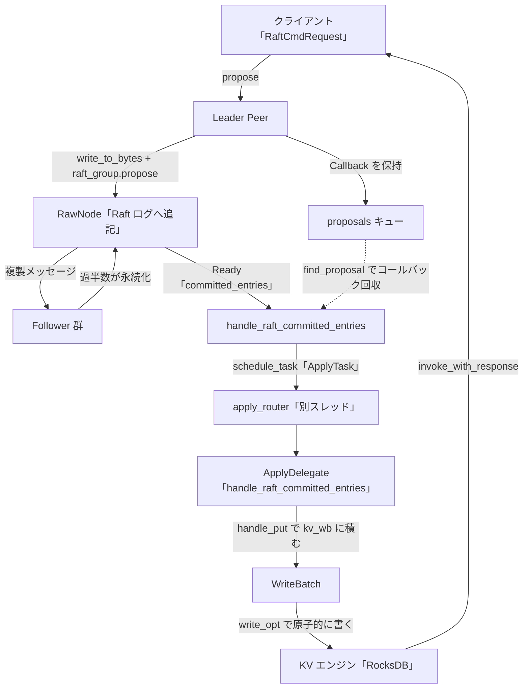

# 第9章 提案と適用

> **本章で読むソース**
>
> - [`components/raftstore/src/store/peer.rs`](https://github.com/tikv/tikv/blob/v8.5.6/components/raftstore/src/store/peer.rs)
> - [`components/raftstore/src/store/fsm/apply.rs`](https://github.com/tikv/tikv/blob/v8.5.6/components/raftstore/src/store/fsm/apply.rs)

## この章の狙い

クライアントの書き込みが TiKV のディスクに届くまでには、2つの段階がある。
Leader が書き込みを Raft ログのエントリとして全レプリカへ複製する**提案（propose）**と、過半数が永続化して確定したエントリをデコードして KV エンジンへ書く**適用（apply）**である。
本章は、書き込みコマンドを表す `RaftCmdRequest` が提案されてから、`WriteBatch` で RocksDB に書かれ、クライアントへ応答が返るまでを読む。

第7章は raftstore の全体像を、第8章は Region と Peer を扱った。
本章はその上で、1件の書き込みがどう複製され適用されるかを追う。
提案と適用は別のスレッドプールで動く点が設計の中心であり、なぜ分けるのかを最後に説明する。

## 前提

TiKV のキー空間は Region 単位で区切られ、各 Region のレプリカ群が1つの Raft グループを作る。
書き込みはまず合意ログのエントリとして全レプリカに複製され、過半数が永続化した時点でコミットされ、状態機械へ適用される。
この構図は第7章と第8章で確定させた。
Raft ログの永続化を担う追記専用エンジンは第6章で扱った。

合意の進行そのものは `raft-rs` クレートの `RawNode` が担い、raftstore はその上で提案の入口と適用の出口を実装する。
本章のコード引用はすべて tikv/tikv のタグ `v8.5.6` に固定する。

## 提案：書き込みを Raft ログへ載せる

書き込みリクエストの入口は `Peer::propose` である。
クライアントの `RaftCmdRequest` と、適用後に応答を返すための `Callback` を受け取り、リクエストの種別に応じて処理を振り分ける。

[`components/raftstore/src/store/peer.rs` L3929-L3949](https://github.com/tikv/tikv/blob/v8.5.6/components/raftstore/src/store/peer.rs#L3929-L3949)

```rust
        let policy = self.inspect(&req);
        let res = match policy {
            Ok(RequestPolicy::ReadLocal) | Ok(RequestPolicy::StaleRead) => {
                self.read_local(ctx, req, cb);
                return false;
            }
            Ok(RequestPolicy::ReadIndex) => return self.read_index(ctx, req, err_resp, cb),
            Ok(RequestPolicy::ProposeTransferLeader) => {
                return self.propose_transfer_leader(ctx, req, cb);
            }
            Ok(RequestPolicy::ProposeNormal) => {
                // For admin cmds, only region split/merge comes here.
                if req.has_admin_request() {
                    disk_full_opt = DiskFullOpt::AllowedOnAlmostFull;
                }
                self.check_normal_proposal_with_disk_full_opt(ctx, disk_full_opt)
                    .and_then(|_| self.propose_normal(ctx, req))
            }
            Ok(RequestPolicy::ProposeConfChange) => self.propose_conf_change(ctx, req),
            Err(e) => Err(e),
        };
```

`inspect` がリクエストを分類し、読み取り系はローカル読みや `ReadIndex` へ流れる。
通常の書き込みは `ProposeNormal` に分類され、`propose_normal` で Raft ログへ提案される。
読み取り経路は第10章で扱うため、本章は `ProposeNormal` の流れを追う。

`propose_normal` の核心は、リクエストをバイト列へ符号化し、それを `RawNode` の提案 API に渡すところである。

[`components/raftstore/src/store/peer.rs` L4712-L4738](https://github.com/tikv/tikv/blob/v8.5.6/components/raftstore/src/store/peer.rs#L4712-L4738)

```rust
        let data = req.write_to_bytes()?;
        poll_ctx
            .raft_metrics
            .propose_log_size
            .observe(data.len() as f64);

        if data.len() as u64 > poll_ctx.cfg.raft_entry_max_size.0 {
            error!(
                "entry is too large";
                "region_id" => self.region_id,
                "peer_id" => self.peer.get_id(),
                "size" => data.len(),
            );
            return Err(Error::RaftEntryTooLarge {
                region_id: self.region_id,
                entry_size: data.len() as u64,
            });
        }

        fail_point!("raft_propose", |_| Ok(Either::Right(0)));
        let propose_index = self.next_proposal_index();
        self.raft_group.propose(ctx.to_vec(), data)?;
        if self.next_proposal_index() == propose_index {
            // The message is dropped silently, this usually due to leader absence
            // or transferring leader. Both cases can be considered as NotLeader error.
            return Err(Error::NotLeader(self.region_id, None));
        }
```

`req.write_to_bytes()` で `RaftCmdRequest` をプロトコルバッファのバイト列にし、それを Raft ログエントリのデータ部にする。
`self.raft_group.propose` が `RawNode` に提案を渡し、エントリが Raft ログの末尾に積まれてインデックスが1つ進む。
提案が黙って捨てられた場合はインデックスが進まないので、その検査で `NotLeader` を返す。
ここで書き込みはまだディスクにも届いておらず、複製も始まったばかりである。

提案が成功すると、応答用の `Callback` を `Proposal` に包んで保持する。
複製とコミットは非同期に進むため、その時点では応答を返せないからである。

[`components/raftstore/src/store/peer.rs` L3982-L3996](https://github.com/tikv/tikv/blob/v8.5.6/components/raftstore/src/store/peer.rs#L3982-L3996)

```rust
                let p = Proposal {
                    is_conf_change: req_admin_cmd_type == Some(AdminCmdType::ChangePeer)
                        || req_admin_cmd_type == Some(AdminCmdType::ChangePeerV2),
                    index: idx,
                    term: self.term(),
                    cb,
                    propose_time: None,
                    must_pass_epoch_check: has_applied_to_current_term,
                    sent: false,
                };
                if let Some(cmd_type) = req_admin_cmd_type {
                    self.cmd_epoch_checker
                        .post_propose(cmd_type, idx, self.term());
                }
                self.post_propose(ctx, p);
```

`Proposal` はエントリのインデックスと term、そして `cb`（応答用コールバック）を持つ。
`post_propose` はこれを `self.proposals` のキューへ積む。
あとでこのエントリがコミットされたとき、同じインデックスと term の `Proposal` を引き当ててコールバックを発火する。

## Raft の進行：複製とコミットを `Ready` で受け取る

提案されたエントリは `RawNode` が他レプリカへ複製する。
過半数が永続化するとそのエントリは committed になり、raftstore は `RawNode::ready` でその結果を受け取る。
ready の処理は `handle_raft_ready_append` が担う。

[`components/raftstore/src/store/peer.rs` L2969-L2979](https://github.com/tikv/tikv/blob/v8.5.6/components/raftstore/src/store/peer.rs#L2969-L2979)

```rust
        if !ready.messages().is_empty() {
            assert!(self.is_leader());
            let raft_msgs = self.build_raft_messages(ctx, ready.take_messages());
            self.send_raft_messages(ctx, raft_msgs);
        }

        self.apply_reads(ctx, &ready);

        if !ready.committed_entries().is_empty() {
            self.handle_raft_committed_entries(ctx, ready.take_committed_entries());
        }
```

`ready.messages()` には他レプリカへ送る複製メッセージが入り、`send_raft_messages` で送信する。
`ready.committed_entries()` には過半数が永続化して確定したエントリが入る。
確定したエントリがあれば `handle_raft_committed_entries` に渡し、ここで提案側から適用側への受け渡しが始まる。

`handle_raft_committed_entries` は、確定したエントリと、対応するコールバックをまとめて `Apply` というタスクに詰める。

[`components/raftstore/src/store/peer.rs` L3221-L3249](https://github.com/tikv/tikv/blob/v8.5.6/components/raftstore/src/store/peer.rs#L3221-L3249)

```rust
            let cbs = if !self.proposals.is_empty() {
                let current_term = self.term();
                let cbs = committed_entries
                    .iter()
                    .filter_map(|e| {
                        self.proposals
                            .find_proposal(e.get_term(), e.get_index(), current_term)
                    })
                    .map(|mut p| {
                        if p.must_pass_epoch_check {
                            // In this case the apply can be guaranteed to be successful. Invoke the
                            // on_committed callback if necessary.
                            p.cb.invoke_committed();

                            debug!("raft log is committed";
                                "req_info" => TrackerTokenArray::new(p.cb.write_trackers()
                                    .into_iter()
                                    .filter_map(|time_tracker| time_tracker.as_tracker_token())
                                    .collect::<Vec<_>>().as_slice())
                            );
                        }
                        p
                    })
                    .collect();
                self.proposals.gc();
                cbs
            } else {
                vec![]
            };
```

確定した各エントリの term とインデックスをキーに、提案時に積んでおいた `Proposal` を `find_proposal` で引き当てる。
こうして集めたコールバック群 `cbs` を、確定済みエントリと一緒に適用側へ渡す。

受け渡しは、`Apply` タスクを `apply_router` へスケジュールする形で行う。

[`components/raftstore/src/store/peer.rs` L3279-L3280](https://github.com/tikv/tikv/blob/v8.5.6/components/raftstore/src/store/peer.rs#L3279-L3280)

```rust
            ctx.apply_router
                .schedule_task(self.region_id, ApplyTask::apply(apply));
```

`apply_router` は適用システムへ向かうメッセージの送り口である。
提案側のスレッドはここでタスクを投げるだけで、実際の KV エンジンへの書き込みは適用側のスレッドが行う。
この受け渡しが、提案と適用を別スレッドに分ける境界である。

## 適用：確定エントリを `WriteBatch` で KV エンジンへ書く

適用システムは `apply.rs` の `ApplyFsm` と `ApplyDelegate` が担う。
`apply_router` に投げられたタスクは、`create_apply_batch_system` で作られた専用のバッチシステムが受け取る。

[`components/raftstore/src/store/fsm/apply.rs` L5078-L5090](https://github.com/tikv/tikv/blob/v8.5.6/components/raftstore/src/store/fsm/apply.rs#L5078-L5090)

```rust
pub fn create_apply_batch_system<EK: KvEngine>(
    cfg: &Config,
    resource_ctl: Option<Arc<ResourceController>>,
) -> (ApplyRouter<EK>, ApplyBatchSystem<EK>) {
    let (control_tx, control_fsm) = ControlFsm::new();
    let (router, system) = batch_system::create_system(
        &cfg.apply_batch_system,
        control_tx,
        control_fsm,
        resource_ctl,
    );
    (ApplyRouter { router }, ApplyBatchSystem { system })
}
```

適用システムは `cfg.apply_batch_system` の設定で独立した `batch_system` を作る。
これは Raft の合意を回すストアのバッチシステムとは別の `system` であり、別のスレッドプールで動く。
提案と適用がそれぞれ専用のスレッドで進むのは、この2つのバッチシステムが分かれているためである。

適用タスクを受けた `ApplyFsm` は `handle_apply` を呼ぶ。
ここでコールバックを登録し、確定エントリを `handle_raft_committed_entries` に渡す。

[`components/raftstore/src/store/fsm/apply.rs` L4117-L4123](https://github.com/tikv/tikv/blob/v8.5.6/components/raftstore/src/store/fsm/apply.rs#L4117-L4123)

```rust
        self.append_proposal(apply.cbs.drain(..));
        // If there is any apply task, we change this fsm to normal-priority.
        // When it meets a ingest-request or a delete-range request, it will change to
        // low-priority.
        self.delegate.priority = Priority::Normal;
        self.delegate
            .handle_raft_committed_entries(apply_ctx, entries.drain(..));
```

`append_proposal` で提案側から渡されたコールバックを `ApplyDelegate` 内のキューに移す。
そのうえで確定エントリの列を `handle_raft_committed_entries` に渡し、1件ずつデコードして適用する。

適用側の `handle_raft_committed_entries` は、エントリを順に取り出し、applied index の連続性を検査してから種別ごとに処理する。

[`components/raftstore/src/store/fsm/apply.rs` L1151-L1177](https://github.com/tikv/tikv/blob/v8.5.6/components/raftstore/src/store/fsm/apply.rs#L1151-L1177)

```rust
        while let Some(entry) = committed_entries_drainer.next() {
            if self.pending_remove {
                // This peer is about to be destroyed, skip everything.
                break;
            }

            let expect_index = self.apply_state.get_applied_index() + 1;
            if expect_index != entry.get_index() {
                panic!(
                    "{} expect index {}, but got {}, ctx {}",
                    self.tag,
                    expect_index,
                    entry.get_index(),
                    apply_ctx.tag,
                );
            }

            // NOTE: before v5.0, `EntryType::EntryConfChangeV2` entry is handled by
            // `unimplemented!()`, which can break compatibility (i.e. old version tikv
            // running on data written by new version tikv), but PD will reject old version
            // tikv join the cluster, so this should not happen.
            let res = match entry.get_entry_type() {
                EntryType::EntryNormal => self.handle_raft_entry_normal(apply_ctx, &entry),
                EntryType::EntryConfChange | EntryType::EntryConfChangeV2 => {
                    self.handle_raft_entry_conf_change(apply_ctx, &entry)
                }
            };
```

`expect_index` の検査は、適用が applied index の順に1件ずつ進むことを保証する。
通常の書き込みは `EntryNormal` であり、`handle_raft_entry_normal` がエントリのデータ部を `RaftCmdRequest` にデコードして `process_raft_cmd` へ渡す。

`process_raft_cmd` は `apply_raft_cmd` でコマンドを実行し、結果に応じて `WriteBatch` をエンジンへ確定する。

[`components/raftstore/src/store/fsm/apply.rs` L1422-L1448](https://github.com/tikv/tikv/blob/v8.5.6/components/raftstore/src/store/fsm/apply.rs#L1422-L1448)

```rust
        apply_ctx.host.pre_apply(&self.region, &req);
        let (mut cmd, exec_result, should_write) = self.apply_raft_cmd(apply_ctx, index, term, req);
        if let ApplyResult::WaitMergeSource(_) = exec_result {
            return exec_result;
        }

        debug!(
            "applied command";
            "region_id" => self.region_id(),
            "peer_id" => self.id(),
            "index" => index
        );

        // TODO: if we have exec_result, maybe we should return this callback too. Outer
        // store will call it after handing exec result.
        cmd_resp::bind_term(&mut cmd.response, self.term);
        let cmd_cb = self.find_pending(index, term, is_conf_change_cmd(&cmd.request));
        apply_ctx
            .applied_batch
            .push(cmd_cb, cmd, &self.observe_info, self.region_id());
        if should_write {
            // An observer shall prevent a write_apply_state here by not return true
            // when `post_exec`.
            self.write_apply_state(apply_ctx.kv_wb_mut());
            apply_ctx.commit(self);
        }
        exec_result
```

`apply_raft_cmd` が実際の書き込み操作を `WriteBatch` に積む。
そのうえで `find_pending` で対応するコールバックを引き当て、応答とともに `applied_batch` に積んでおく。
`should_write` が立つと、applied index を `WriteBatch` に書き加えてから `apply_ctx.commit` でエンジンへ確定する。

個々の `Put` がどう `WriteBatch` に積まれるかは `handle_put` で見える。

[`components/raftstore/src/store/fsm/apply.rs` L1875-L1903](https://github.com/tikv/tikv/blob/v8.5.6/components/raftstore/src/store/fsm/apply.rs#L1875-L1903)

```rust
        if !req.get_put().get_cf().is_empty() {
            let cf = req.get_put().get_cf();
            // TODO: don't allow write preseved cfs.
            if cf == CF_LOCK {
                self.metrics.lock_cf_written_bytes += key.len() as u64;
                self.metrics.lock_cf_written_bytes += value.len() as u64;
            }
            // TODO: check whether cf exists or not.
            ctx.kv_wb.put_cf(cf, key, value).unwrap_or_else(|e| {
                panic!(
                    "{} failed to write ({}, {}) to cf {}: {:?}",
                    self.tag,
                    log_wrappers::Value::key(key),
                    log_wrappers::Value::value(value),
                    cf,
                    e
                )
            });
        } else {
            ctx.kv_wb.put(key, value).unwrap_or_else(|e| {
                panic!(
                    "{} failed to write ({}, {}): {:?}",
                    self.tag,
                    log_wrappers::Value::key(key),
                    log_wrappers::Value::value(value),
                    e
                );
            });
        }
```

`handle_put` はキーと値を `ctx.kv_wb` に追記するだけで、ディスクには書かない。
カラムファミリ指定があれば `put_cf`、なければデフォルトの `put` を使う。
複数のコマンドが同じ `WriteBatch` に積み重なり、`commit` のタイミングでまとめてエンジンへ書かれる。

`WriteBatch` をエンジンへ書くのは `write_to_db` である。

[`components/raftstore/src/store/fsm/apply.rs` L597-L608](https://github.com/tikv/tikv/blob/v8.5.6/components/raftstore/src/store/fsm/apply.rs#L597-L608)

```rust
        if !self.kv_wb_mut().is_empty() {
            self.perf_context.start_observe();
            let mut write_opts = engine_traits::WriteOptions::new();
            write_opts.set_sync(need_sync);
            write_opts.set_disable_wal(self.disable_wal);
            if self.disable_wal {
                let sn = SequenceNumber::pre_write();
                seqno = Some(sn);
            }
            let seq = self.kv_wb_mut().write_opt(&write_opts).unwrap_or_else(|e| {
                panic!("failed to write to engine: {:?}", e);
            });
```

`write_opt` が `WriteBatch` を1回の原子的な書き込みとして RocksDB へ反映する。
バッチに積まれた複数のキー書き込みは、このとき1回のエンジン書き込みでまとめて永続化される。
キー単位ではなくバッチ単位で書くことで、書き込み1件ごとに同期の手間を払わずに済む。

エンジンへの書き込みが終わると、保持していたコールバックを応答とともに発火する。

[`components/raftstore/src/store/fsm/apply.rs` L676-L683](https://github.com/tikv/tikv/blob/v8.5.6/components/raftstore/src/store/fsm/apply.rs#L676-L683)

```rust
        // Invoke callbacks
        let now = std::time::Instant::now();
        for (cb, resp) in cb_batch.drain(..) {
            for tracker in cb.write_trackers() {
                tracker.observe(now, &self.apply_time, |t| &mut t.metrics.apply_time_nanos);
            }
            cb.invoke_with_response(resp);
        }
```

`invoke_with_response` が、提案のときに保持しておいたコールバックを応答とともに呼ぶ。
これがクライアントへの応答になる。
書き込みコマンドの一巡は、ここで完結する。

## 書き込み一巡の流れ

提案から応答までの流れを図1に示す。



提案された書き込みは Leader で Raft ログに載り、Follower へ複製される。
過半数が永続化すると `Ready` に committed エントリが乗り、`handle_raft_committed_entries` が提案時のコールバックを回収してエントリと一緒に適用側へ渡す。
適用側は別スレッドでエントリをデコードし、`WriteBatch` に積んで KV エンジンへ原子的に書き、コールバックで応答する。

## 高速化の工夫：合意と適用を別システムへ分けて重ねる

提案と適用を別のスレッドプールに分ける設計が、本章の最適化の中心である。
Raft の合意は複製メッセージの送受信とディスクへのログ永続化が律速で、過半数の応答を待つネットワーク遅延を伴う。
適用は確定エントリのデコードと `WriteBatch` の KV エンジンへの書き込みが律速で、ディスクの書き込み I/O を伴う。
この2つを同じスレッドで直列に回すと、合意の待ちと適用の I/O が交互に CPU を空転させ、片方が他方を待つ。

raftstore はこの2つを別の `batch_system` に分け、`apply_router` を介してタスクを受け渡す。
合意側のスレッドは確定エントリを適用側へ投げたらすぐ次の提案や複製に進み、適用側のスレッドは届いたエントリを並行して KV エンジンへ書く。
あるエントリを適用している間にも、合意側は後続のエントリの複製を進められる。
合意のレイテンシと適用の I/O が時間軸の上で重なり、スループットが上がる。

適用側の `WriteBatch` も、もう1つの工夫である。
1件のエントリに複数の `Put` が含まれても、また複数のエントリを続けて適用しても、書き込みは同じ `WriteBatch` に積み重なる。
それを `write_opt` で1回だけエンジンへ書くため、書き込みは原子的にまとめて永続化され、書き込み1件ごとに同期コストを払わずに済む。
Raft が「過半数が永続化したエントリは全レプリカで同じ順に適用される」ことを保証するので、各レプリカの適用結果は一致し、まとめ書きでも整合性は崩れない。

## まとめ

書き込みコマンド `RaftCmdRequest` は、`Peer::propose` で種別を判定され、通常の書き込みは `propose_normal` でバイト列に符号化されて `RawNode` へ提案される。
提案時の応答用コールバックは `Proposal` として保持され、エントリが過半数の複製でコミットされると `handle_raft_committed_entries` が回収する。
確定エントリとコールバックは `apply_router` を介して別スレッドの適用システムへ渡され、`ApplyDelegate` がエントリをデコードし、`handle_put` などが `WriteBatch` に書き込みを積み、`write_to_db` が1回の原子的な書き込みで KV エンジンへ反映してから、コールバックで応答する。
提案と適用を別のバッチシステムに分けることで、合意のネットワーク遅延と適用のディスク I/O を重ねて並行に進め、`WriteBatch` でまとめ書きすることで書き込みの同期コストを抑える。

## 関連する章

- [第6章 Raft ログエンジン](../part01-engine/06-raft-log-engine.md)：提案されたエントリを永続化する追記専用ログの実装を扱う。
- [第7章 raftstore の全体像](07-raftstore-overview.md)：提案と適用を含む raftstore 全体の構成を俯瞰する。
- [第8章 Region と Peer](08-region-and-peer.md)：本章の提案と適用が動く Region と Peer の構造を扱う。
- [第13章 Prewrite（第1相）](../part03-txn/13-prewrite.md)：本章の書き込み経路を使うトランザクションのプリライトを扱う。
