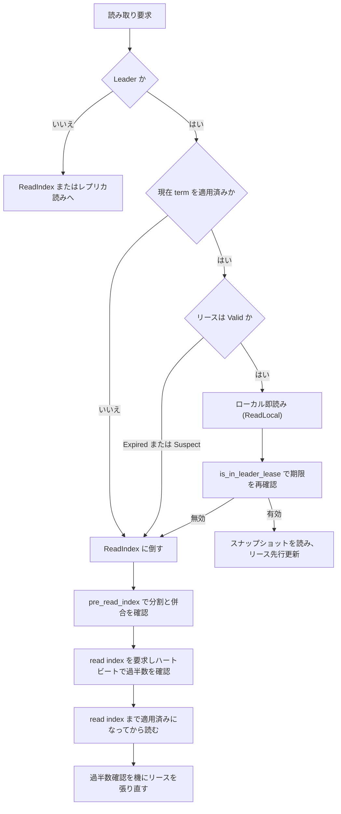

# 第10章 リース読みと ReadIndex

> **本章で読むソース**
>
> - [`components/raftstore/src/store/worker/read.rs`](https://github.com/tikv/tikv/blob/v8.5.6/components/raftstore/src/store/worker/read.rs)
> - [`components/raftstore/src/store/peer.rs`](https://github.com/tikv/tikv/blob/v8.5.6/components/raftstore/src/store/peer.rs)
> - [`components/raftstore/src/store/util.rs`](https://github.com/tikv/tikv/blob/v8.5.6/components/raftstore/src/store/util.rs)
> - [`components/raftstore/src/store/config.rs`](https://github.com/tikv/tikv/blob/v8.5.6/components/raftstore/src/store/config.rs)

## この章の狙い

第9章では、書き込みを Raft ログとして提案し、過半数の合意を経て状態機械に適用する流れを読んだ。
読み取りも素朴には同じ経路を通せばよい。
読み取り要求を1つの Raft ログエントリとして提案し、過半数がコミットした位置で実行すれば、線形化可能な結果が必ず返る。

しかしこの素朴な方式は遅い。
読み取りのたびにログの追記とディスク永続化と過半数への往復が走り、レイテンシがネットワークとディスクの両方に縛られる。
TiKV はこの素朴な方式を2段階で回避する。

本章は、線形化可能な読み取りを Raft ログに書かずに返す2つの最適化を読む。
1つは**ReadIndex** であり、Leader が自分の commit index を確かめてからその位置まで適用済みの状態で読む。
もう1つは**リース読み**（local read）であり、Leader のリースが有効な間は ReadIndex すら省いてローカルで即座に読む。
両者がどう選び分けられ、リースの有効性がどう判定されるかを `RequestPolicy` の決定木と `Lease` 型に沿って追う。

## 前提

TiKV のキー空間は Region 単位に区切られ、各 Region のレプリカ群が1つの Raft グループを作る。
この構図と Peer の役割は第8章で確定させた。
読み取り要求は Region の Leader が処理し、Leader でない Peer は処理を拒否するか転送する。
本章のコード引用はすべて tikv/tikv のタグ `v8.5.6` に固定する。

線形化可能な読み取りには2つの危険がある。
1つは、自分が Leader だと思い込んでいる Peer が、実はネットワーク分断中に新しい Leader へ交代されている場合である。
古い Leader がローカルの状態を読めば、新 Leader が受理した最新の書き込みを取りこぼす。
もう1つは、Leader が交代した直後で、現在の term のエントリをまだ適用しきっていない場合である。
どちらも「自分は最新を持つ Leader である」という保証が崩れた状態であり、ReadIndex とリースはこの保証を別々の手段で与える。

## なぜ読み取りを Raft ログに書かないか

読み取りは状態を変えない。
ゆえに合意ログへ追記する必要はなく、必要なのは「読み取りを実行する時点で、過半数が認める最新のコミット位置まで適用済みである」という保証だけである。
ReadIndex はこの保証を、ログ追記なしのハートビート1往復で得る。
Leader は現在の commit index を読み取りの基準（read index）として記録し、ハートビートで過半数の支持を確認して自分がまだ Leader であることを保証し、状態機械がその read index に達してから読む。
ログのディスク永続化が経路から外れるため、ReadIndex は素朴な提案方式より速い。

リース読みはさらに踏み込む。
Leader が「リース」と呼ぶ時間窓を保持している間は、ハートビートの往復さえ省く。
リースが有効な間は他の Peer が新たな Leader になりえないため、ローカルの状態を読むだけで線形化可能性が保たれる。

## 要求から方針を決める RequestInspector

読み取り要求が ReadLocal、StaleRead、ReadIndex のどれで処理されるかは、`RequestInspector` トレイトの `inspect` が決める。
方針は `RequestPolicy` 列挙で表される。

[`components/raftstore/src/store/peer.rs` L6145-L6154](https://github.com/tikv/tikv/blob/v8.5.6/components/raftstore/src/store/peer.rs#L6145-L6154)

```rust
pub enum RequestPolicy {
    // Handle the read request directly without dispatch.
    ReadLocal,
    StaleRead,
    // Handle the read request via raft's SafeReadIndex mechanism.
    ReadIndex,
    ProposeNormal,
    ProposeTransferLeader,
    ProposeConfChange,
}
```

`inspect` は読み取り要求に対して、3つの条件を順に確かめてから方針を決める。

[`components/raftstore/src/store/peer.rs` L6204-L6230](https://github.com/tikv/tikv/blob/v8.5.6/components/raftstore/src/store/peer.rs#L6204-L6230)

```rust
        fail_point!("perform_read_index", |_| Ok(RequestPolicy::ReadIndex));

        fail_point!("perform_read_local", |_| Ok(RequestPolicy::ReadLocal));

        let flags = WriteBatchFlags::from_bits_check(req.get_header().get_flags());
        if flags.contains(WriteBatchFlags::STALE_READ) {
            return Ok(RequestPolicy::StaleRead);
        }

        if req.get_header().get_read_quorum() {
            return Ok(RequestPolicy::ReadIndex);
        }

        // If applied index's term differs from current raft's term, leader
        // transfer must happened, if read locally, we may read old value.
        if !self.has_applied_to_current_term() {
            return Ok(RequestPolicy::ReadIndex);
        }

        // Local read should be performed, if and only if leader is in lease.
        match self.inspect_lease() {
            LeaseState::Valid => Ok(RequestPolicy::ReadLocal),
            LeaseState::Expired | LeaseState::Suspect => {
                // Perform a consistent read to Raft quorum and try to renew the leader lease.
                Ok(RequestPolicy::ReadIndex)
            }
        }
```

判定は3段で進む。
要求が明示的に過半数読み（read quorum）を求めるなら、即座に ReadIndex に倒す。
現在の term をまだ適用しきっていない（`has_applied_to_current_term` が偽）なら、Leader 交代の直後で古い値を読む危険があるため、やはり ReadIndex に倒す。
この2つを通過し、かつリースが有効（`LeaseState::Valid`）のときに限り ReadLocal を選ぶ。
リースが切れている（Expired）か疑わしい（Suspect）ときは ReadIndex にフォールバックし、ついでにリースの更新を試みる。

ローカル即読みの条件が「現在 term を適用済み」かつ「リースが有効」の2つで構成される点が要である。
前者は term 交代直後の取りこぼしを防ぎ、後者は分断中の旧 Leader による誤読を防ぐ。

## Lease と LeaseState の定義

リースの状態は `LeaseState` 列挙で3値に分かれる。

[`components/raftstore/src/store/util.rs` L513-L521](https://github.com/tikv/tikv/blob/v8.5.6/components/raftstore/src/store/util.rs#L513-L521)

```rust
#[derive(Clone, Copy, PartialEq, Debug)]
pub enum LeaseState {
    /// The lease is suspicious, may be invalid.
    Suspect,
    /// The lease is valid.
    Valid,
    /// The lease is expired.
    Expired,
}
```

`Valid` はリースが有効でローカル即読みを許す状態である。
`Expired` はリースが満了した状態であり、`Suspect` はリースが疑わしい状態である。
`Suspect` は Leader 移譲を始める `MsgTimeoutNow` を送った後に設定され、この間は旧 Leader がリースを保ったままか失ったかが確定しないため、ローカル読みを許さない。

リース本体は `Lease` 構造体が持つ。
有効期限を表す `bound` を `Either` で二分し、左を疑わしい期限、右を有効な期限として保持する。

[`components/raftstore/src/store/util.rs` L501-L511](https://github.com/tikv/tikv/blob/v8.5.6/components/raftstore/src/store/util.rs#L501-L511)

```rust
pub struct Lease {
    // A suspect timestamp is in the Either::Left(_),
    // a valid timestamp is in the Either::Right(_).
    bound: Option<Either<Timespec, Timespec>>,
    max_lease: Duration,

    max_drift: Duration,
    advance_renew_lease: Duration,
    last_update: Timespec,
    remote: Option<RemoteLease>,
}
```

リースの状態判定は `inspect` が担う。
`bound` が左（疑わしい期限）なら問答無用で `Suspect` を返す。
右（有効な期限）なら、判定時刻が期限より前なら `Valid`、期限以降なら `Expired` を返す。

[`components/raftstore/src/store/util.rs` L580-L593](https://github.com/tikv/tikv/blob/v8.5.6/components/raftstore/src/store/util.rs#L580-L593)

```rust
    /// Inspect the lease state for the ts or now.
    pub fn inspect(&self, ts: Option<Timespec>) -> LeaseState {
        match self.bound {
            Some(Either::Left(_)) => LeaseState::Suspect,
            Some(Either::Right(bound)) => {
                if ts.unwrap_or_else(monotonic_raw_now) < bound {
                    LeaseState::Valid
                } else {
                    LeaseState::Expired
                }
            }
            None => LeaseState::Expired,
        }
    }
```

リースの期限は「リースを張り直した送信時刻 `send_ts` に最大リース幅 `max_lease` を足した時刻」である。

[`components/raftstore/src/store/util.rs` L536-L541](https://github.com/tikv/tikv/blob/v8.5.6/components/raftstore/src/store/util.rs#L536-L541)

```rust
    /// The valid leader lease should be `lease = max_lease - (commit_ts -
    /// send_ts)` And the expired timestamp for that leader lease is
    /// `commit_ts + lease`, which is `send_ts + max_lease` in short.
    fn next_expired_time(&self, send_ts: Timespec) -> Timespec {
        send_ts + self.max_lease
    }
```

`Lease` は Leader 自身が `peer.rs` の中で保持し、状態の更新に使う。
ローカル読みを実行する `LocalReader` のスレッドは別であり、そこへは `RemoteLease` という写しが渡される。
`RemoteLease` は有効期限を `AtomicU64` で持つだけの軽量な構造体であり、`Lease` から導出されてリードスレッドへ送られる。

[`components/raftstore/src/store/util.rs` L664-L673](https://github.com/tikv/tikv/blob/v8.5.6/components/raftstore/src/store/util.rs#L664-L673)

```rust
/// A remote lease, it can only be derived by `Lease`. It will be sent
/// to the local read thread, so name it remote. If Lease expires, the remote
/// must expire too.
#[derive(Clone)]
pub struct RemoteLease {
    expired_time: Arc<AtomicU64>,
    renewing: Arc<AtomicBool>,
    advance_renew_lease: Duration,
    term: u64,
}
```

`expired_time` を `Arc<AtomicU64>` で共有するため、Leader 側が `renew` で期限を進めると、リードスレッド側の `RemoteLease::inspect` がロックなしでその更新を観測できる。
ローカル読みの判定からミューテックスを外せる点が、この写しの狙いである。

## リース読みの経路（LocalReader）

ローカル即読みは `LocalReader` が担う。
`LocalReader` は要求を受けると、まず対象 Region の `ReadDelegate` を取り出し、方針を決める。
方針決定は `pre_propose_raft_command` が行い、`ReadLocal` か `StaleRead` のときだけ委譲を返し、それ以外はローカルで処理しないことを示す `None` を返す。

[`components/raftstore/src/store/worker/read.rs` L950-L968](https://github.com/tikv/tikv/blob/v8.5.6/components/raftstore/src/store/worker/read.rs#L950-L968)

```rust
    pub fn pre_propose_raft_command(
        &mut self,
        req: &RaftCmdRequest,
    ) -> Result<Option<(CachedReadDelegate<E>, RequestPolicy)>> {
        if let Some(delegate) = self.local_reader.validate_request(req)? {
            let mut inspector = Inspector {
                delegate: &delegate,
            };
            match inspector.inspect(req) {
                Ok(RequestPolicy::ReadLocal) => Ok(Some((delegate, RequestPolicy::ReadLocal))),
                Ok(RequestPolicy::StaleRead) => Ok(Some((delegate, RequestPolicy::StaleRead))),
                // It can not handle other policies.
                Ok(_) => Ok(None),
                Err(e) => Err(e),
            }
        } else {
            Ok(None)
        }
    }
```

`ReadDelegate` は Region ごとの読み取り用の写しであり、`LocalReader` が Region 単位にキャッシュする。
`get_delegate` は、キャッシュ上の写しが最新（`track_ver` に更新がない）ならそれを使い、そうでなければ `StoreMeta` から取り直してキャッシュを差し替える。

[`components/raftstore/src/store/worker/read.rs` L766-L790](https://github.com/tikv/tikv/blob/v8.5.6/components/raftstore/src/store/worker/read.rs#L766-L790)

```rust
    pub fn get_delegate(&mut self, region_id: u64) -> Option<D> {
        let rd = match self.delegates.get(&region_id) {
            // The local `ReadDelegate` is up to date
            Some(d) if !d.track_ver.any_new() => Some(d.clone()),
            _ => {
                debug!("update local read delegate"; "region_id" => region_id);
                TLS_LOCAL_READ_METRICS.with(|m| m.borrow_mut().reject_reason.cache_miss.inc());

                let (meta_len, meta_reader) = { self.store_meta.get_executor_and_len(region_id) };

                // Remove the stale delegate
                self.delegates.remove(&region_id);
                self.delegates.resize(meta_len);
                match meta_reader {
                    Some(reader) => {
                        self.delegates.insert(region_id, reader.clone());
                        Some(reader)
                    }
                    None => None,
                }
            }
        };
        // Return `None` if the read delegate is pending remove
        rd.filter(|r| !r.pending_remove)
    }
```

`LocalReader` 側の `inspect_lease` は、Leader 側のそれとは判定が異なる。
ここでは `leader_lease`（写し）が存在するかどうかだけを見て、実際の期限チェックは後段の `handle_read` まで遅らせる。

[`components/raftstore/src/store/worker/read.rs` L1270-L1280](https://github.com/tikv/tikv/blob/v8.5.6/components/raftstore/src/store/worker/read.rs#L1270-L1280)

```rust
    fn inspect_lease(&mut self) -> LeaseState {
        // TODO: disable localreader if we did not enable raft's check_quorum.
        if self.delegate.leader_lease.is_some() {
            // We skip lease check, because it is postponed until `handle_read`.
            LeaseState::Valid
        } else {
            debug!("rejected by leader lease"; "tag" => &self.delegate.tag);
            TLS_LOCAL_READ_METRICS.with(|m| m.borrow_mut().reject_reason.no_lease.inc());
            LeaseState::Expired
        }
    }
```

リースの期限の本判定は、スナップショットを取る直前の `is_in_leader_lease` で行う。
ここでリースの term が現在 term と一致し、かつ `inspect` が `Valid` を返したときに限りローカル読みを許す。
term がずれていれば term 不一致として拒否し、期限切れなら拒否する。

[`components/raftstore/src/store/worker/read.rs` L563-L584](https://github.com/tikv/tikv/blob/v8.5.6/components/raftstore/src/store/worker/read.rs#L563-L584)

```rust
    pub fn is_in_leader_lease(&self, ts: Timespec) -> bool {
        fail_point!("perform_read_local", |_| true);

        if let Some(ref lease) = self.leader_lease {
            let term = lease.term();
            if term == self.term {
                if lease.inspect(Some(ts)) == LeaseState::Valid {
                    fail_point!("after_pass_lease_check");
                    return true;
                } else {
                    TLS_LOCAL_READ_METRICS
                        .with(|m| m.borrow_mut().reject_reason.lease_expire.inc());
                    debug!("rejected by lease expire"; "tag" => &self.tag);
                }
            } else {
                TLS_LOCAL_READ_METRICS.with(|m| m.borrow_mut().reject_reason.term_mismatch.inc());
                debug!("rejected by term mismatch"; "tag" => &self.tag);
            }
        }

        false
    }
```

このチェックは `try_local_leader_read` の中でスナップショットを確定した直後に呼ばれる。
リースが有効ならそのスナップショットで読み、ついでに `maybe_renew_lease_advance` でリースの先行更新を促す。
リースが無効なら `None` を返してフォールバックに回す。

[`components/raftstore/src/store/worker/read.rs` L1012-L1031](https://github.com/tikv/tikv/blob/v8.5.6/components/raftstore/src/store/worker/read.rs#L1012-L1031)

```rust
        let mut local_read_ctx = LocalReadContext::new(&mut self.snap_cache, ctx.read_id.clone());

        (*snap_updated) =
            local_read_ctx.maybe_update_snapshot(delegate.get_tablet(), last_valid_ts);

        let snapshot_ts = local_read_ctx.snapshot_ts().unwrap();
        if !delegate.is_in_leader_lease(snapshot_ts) {
            return None;
        }

        let region = Arc::clone(&delegate.region);
        let mut response =
            delegate.execute(ctx, req, &region, None, Some(local_read_ctx), &self.host);
        if let Some(snap) = response.snapshot.as_mut() {
            snap.bucket_meta = delegate.bucket_meta.clone();
        }
        // Try renew lease in advance
        delegate.maybe_renew_lease_advance(&self.router, snapshot_ts);
        Some(response)
    }
```

ローカル読みが失敗したときは、要求を `redirect` で `raftstore` 本体へ転送し、そちらで ReadIndex として処理し直す。

[`components/raftstore/src/store/worker/read.rs` L1079-L1094](https://github.com/tikv/tikv/blob/v8.5.6/components/raftstore/src/store/worker/read.rs#L1079-L1094)

```rust
                    RequestPolicy::ReadLocal => {
                        if let Some(read_resp) = self.try_local_leader_read(
                            ctx,
                            &req,
                            &mut delegate,
                            &mut snap_updated,
                            last_valid_ts,
                        ) {
                            read_resp
                        } else {
                            fail_point!("localreader_before_redirect", |_| {});
                            // Forward to raftstore.
                            self.redirect(RaftCommand::new(req, cb));
                            return;
                        }
                    }
```

## ReadIndex の経路

リースに頼れないとき、読み取りは `peer.rs` の `read_index` で処理される。
方針が `ReadIndex` なら `read_index` を、`ReadLocal` か `StaleRead` なら `read_local` を呼ぶ分岐は、要求処理の入口にある。

[`components/raftstore/src/store/peer.rs` L3931-L3935](https://github.com/tikv/tikv/blob/v8.5.6/components/raftstore/src/store/peer.rs#L3931-L3935)

```rust
            Ok(RequestPolicy::ReadLocal) | Ok(RequestPolicy::StaleRead) => {
                self.read_local(ctx, req, cb);
                return false;
            }
            Ok(RequestPolicy::ReadIndex) => return self.read_index(ctx, req, err_resp, cb),
```

`read_index` は実際に read index を要求する前に `pre_read_index` で安全性を確かめる。
Region が分割中または併合中のときは read index を出せないため、`ReadIndexNotReady` を返す。

[`components/raftstore/src/store/peer.rs` L4155-L4182](https://github.com/tikv/tikv/blob/v8.5.6/components/raftstore/src/store/peer.rs#L4155-L4182)

```rust
    pub fn pre_read_index(&self) -> Result<()> {
        fail_point!(
            "before_propose_readindex",
            |s| if s.map_or(true, |s| s.parse().unwrap_or(true)) {
                Ok(())
            } else {
                Err(box_err!(
                    "{} can not read due to injected failure",
                    self.tag
                ))
            }
        );

        // See more in ready_to_handle_read().
        if self.is_splitting() {
            return Err(Error::ReadIndexNotReady {
                reason: "can not read index due to split",
                region_id: self.region_id,
            });
        }
        if self.is_merging() {
            return Err(Error::ReadIndexNotReady {
                reason: "can not read index due to merge",
                region_id: self.region_id,
            });
        }
        Ok(())
    }
```

`pre_read_index` を通過すると、`read_index` は read index を要求して保留読みのキューへ積む。
ここで Raft の SafeReadIndex 機構が、現在の commit index を基準にハートビートで過半数の支持を確認する。
要求を出した時点の commit index を `ReadIndexRequest` として保留し、後で過半数の確認が取れたら、その index まで適用済みになった状態で読みを実行する。

[`components/raftstore/src/store/peer.rs` L4320-L4347](https://github.com/tikv/tikv/blob/v8.5.6/components/raftstore/src/store/peer.rs#L4320-L4347)

```rust
        poll_ctx.raft_metrics.propose.read_index.inc();
        self.bcast_wake_up_time = None;

        let request = req
            .mut_requests()
            .get_mut(0)
            .filter(|req| req.has_read_index())
            .map(|req| req.take_read_index());
        let (id, dropped) = self.propose_read_index(request.as_ref());
        if dropped && self.is_leader() {
            // The message gets dropped silently, can't be handled anymore.
            apply::notify_stale_req(self.term(), cb);
            poll_ctx.raft_metrics.propose.dropped_read_index.inc();
            return false;
        }

        let mut read = ReadIndexRequest::with_command(id, req, cb, now);
        read.addition_request = request.map(Box::new);
        self.push_pending_read(read, self.is_leader());
        self.should_wake_up = true;

        debug!(
            "request to get a read index";
            "request_id" => ?id,
            "region_id" => self.region_id,
            "peer_id" => self.peer.get_id(),
            "is_leader" => self.is_leader(),
        );
```

Leader が処理する場合、`read_index` は同じリース内に既に出した read index 要求があれば、新しい要求をそこへ束ねて再提案を省く。
読み取りの基準には raft-rs 側の commit index ではなく `PeerStorage` 側の commit index を使う。

[`components/raftstore/src/store/peer.rs` L4259-L4268](https://github.com/tikv/tikv/blob/v8.5.6/components/raftstore/src/store/peer.rs#L4259-L4268)

```rust
                // Must use the commit index of `PeerStorage` instead of the commit index
                // in raft-rs which may be greater than the former one.
                // For more details, see the annotations above `on_leader_commit_idx_changed`.
                let commit_index = self.get_store().commit_index();
                if let Some(read) = self.pending_reads.back_mut() {
                    // A read request proposed in the current lease is found; combine the new
                    // read request to that previous one, so that no proposing needed.
                    read.push_command(req, cb, commit_index);
                    return false;
                }
```

ReadIndex が無事に過半数の支持を確認できると、その確認は Leader がまだ Leader であることの証拠になる。
TiKV はこの確認の副産物としてリースを張り直し、続く読み取りをローカル即読みへ戻す。
読み取りが続けて来るワークロードでは、最初の1回が ReadIndex の往復を払い、以後はリース読みで即座に返る。

## リースを張り直す経路

リースの更新は `maybe_renew_leader_lease` が担う。
Leader であり、分割中でも併合中でも flashback 中でもないときに限り、`Lease::renew` で期限を延ばし、必要なら新しい `RemoteLease` を作ってリードスレッドへ配る。

[`components/raftstore/src/store/peer.rs` L3826-L3847](https://github.com/tikv/tikv/blob/v8.5.6/components/raftstore/src/store/peer.rs#L3826-L3847)

```rust
        // A nonleader peer should never has leader lease.
        let read_progress = if !should_renew_lease(
            self.is_leader(),
            self.is_splitting(),
            self.is_merging(),
            self.force_leader.is_some(),
        ) {
            None
        } else if self.region().is_in_flashback {
            debug!(
                "prevents renew lease while in flashback state";
                "region_id" => self.region_id,
                "peer_id" => self.peer.get_id(),
            );
            None
        } else {
            self.leader_lease.renew(ts);
            let term = self.term();
            self.leader_lease
                .maybe_new_remote_lease(term)
                .map(ReadProgress::set_leader_lease)
        };
```

Leader 側の `inspect_lease` は、raft-rs の `in_lease` が偽ならまず `Suspect` を返す。
そのうえで `Lease::inspect` を見て、期限切れなら `expire` を呼んでリースを明示的に畳む。

[`components/raftstore/src/store/peer.rs` L6243-L6260](https://github.com/tikv/tikv/blob/v8.5.6/components/raftstore/src/store/peer.rs#L6243-L6260)

```rust
    fn inspect_lease(&mut self) -> LeaseState {
        if !self.raft_group.raft.in_lease() {
            return LeaseState::Suspect;
        }
        // None means now.
        let state = self.leader_lease.inspect(None);
        if LeaseState::Expired == state {
            debug!(
                "leader lease is expired";
                "region_id" => self.region_id,
                "peer_id" => self.peer.get_id(),
                "lease" => ?self.leader_lease,
            );
            // The lease is expired, call `expire` explicitly.
            self.leader_lease.expire();
        }
        state
    }
```

## 高速化の工夫：選挙タイムアウトより短いリース

リース読みが線形化可能性を壊さないのは、リースを選挙タイムアウトより短く設定しているからである。
Follower は選挙タイムアウトの間 Leader のハートビートが途絶えて初めて選挙を始める。
ゆえに、ある Leader のリースが選挙タイムアウトより短ければ、リースが有効な間は他のどの Follower も選挙を開始できておらず、新 Leader が立っていないことが保証される。
旧 Leader はリース内ならローカルの状態だけを読んで、最新を取りこぼさずに線形化可能な結果を返せる。

この不変条件は設定の検証で強制される。
`Config::validate` は、リース幅が選挙タイムアウトより大きいと設定を拒否し、さらに「選挙タイムアウトから1 tick 引いた値」を超えるリースも拒否する。

[`components/raftstore/src/store/config.rs` L844-L863](https://github.com/tikv/tikv/blob/v8.5.6/components/raftstore/src/store/config.rs#L844-L863)

```rust
        let election_timeout =
            self.raft_base_tick_interval.as_millis() * self.raft_election_timeout_ticks as u64;
        let lease = self.raft_store_max_leader_lease.as_millis();
        if election_timeout < lease {
            return Err(box_err!(
                "election timeout {} ms is less than lease {} ms",
                election_timeout,
                lease
            ));
        }

        let tick = self.raft_base_tick_interval.as_millis();
        if lease > election_timeout - tick {
            return Err(box_err!(
                "lease {} ms should not be greater than election timeout {} ms - 1 tick({} ms)",
                lease,
                election_timeout,
                tick
            ));
        }
```

この検証があるため、運用者がリースを誤って長く設定して安全性を壊すことを防げる。
リースを選挙タイムアウトより1 tick 以上短く保つことで、リース内の読み取りは Raft ログもハートビートの往復も経ずに線形化可能読みを返し、読み取りレイテンシをローカルのスナップショット取得だけに縮められる。

## 読み取りの分岐

ここまでの判定と経路をまとめると、読み取りは次のように分岐する。



リースが有効なら左の枝でローカル即読みを返し、そうでなければ右の枝で ReadIndex により commit を確認してから読む。
ReadIndex で得た過半数確認はリースの再取得にも使われ、続く読み取りを左の枝へ戻す。

## まとめ

TiKV は線形化可能な読み取りを Raft ログに書かずに返すために、ReadIndex とリース読みの2段を持つ。
ReadIndex は read index を基準に取り、ハートビートで過半数の支持を確認して Leader であることを保証し、その index まで適用済みの状態で読む。
リース読みは、選挙タイムアウトより短いリースが有効な間に限り、ReadIndex の往復さえ省いてローカルのスナップショットだけで読む。
方針は `RequestInspector::inspect` が「現在 term を適用済みか」と「リースが有効か」で決め、ローカル読みが許されないときは ReadIndex にフォールバックする。
リースの安全性は、設定検証がリースを選挙タイムアウトより短く強制することで支えられている。

## 関連する章

- [第8章 Region と Peer](08-region-and-peer.md)：Region と Peer の構成、Leader と Follower の役割の基礎を扱う。
- [第9章 提案と適用](09-propose-and-apply.md)：書き込みを Raft ログとして提案し適用する経路を扱い、本章が回避する素朴な読み取り方式の対比になる。
- [第17章 read pool とスナップショット読み取り](../part04-coprocessor/17-read-pool-and-snapshot.md)：本章で得たスナップショットを使って実際の読み取りを実行する層を扱う。
