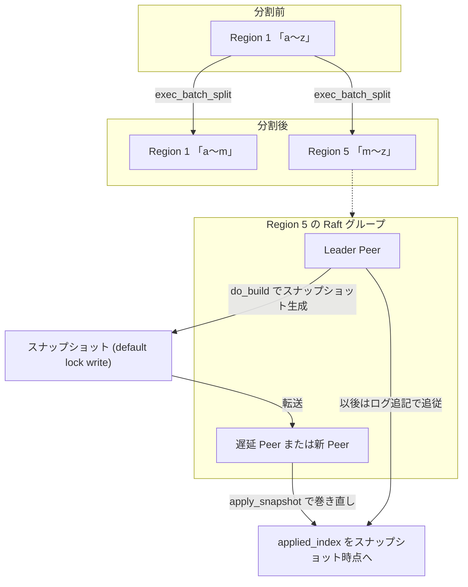

# 第11章 分割、マージ、スナップショット、メンバ変更

> **本章で読むソース**
>
> - [`components/raftstore/src/store/worker/split_check.rs`](https://github.com/tikv/tikv/blob/v8.5.6/components/raftstore/src/store/worker/split_check.rs)
> - [`components/raftstore/src/coprocessor/split_check/size.rs`](https://github.com/tikv/tikv/blob/v8.5.6/components/raftstore/src/coprocessor/split_check/size.rs)
> - [`components/raftstore/src/store/fsm/apply.rs`](https://github.com/tikv/tikv/blob/v8.5.6/components/raftstore/src/store/fsm/apply.rs)
> - [`components/raftstore/src/store/fsm/peer.rs`](https://github.com/tikv/tikv/blob/v8.5.6/components/raftstore/src/store/fsm/peer.rs)
> - [`components/raftstore/src/store/snap.rs`](https://github.com/tikv/tikv/blob/v8.5.6/components/raftstore/src/store/snap.rs)
> - [`components/raftstore/src/store/peer_storage.rs`](https://github.com/tikv/tikv/blob/v8.5.6/components/raftstore/src/store/peer_storage.rs)

## この章の狙い

第8章から第10章までは、ひとつの Region が固定の鍵範囲と固定のメンバで合意を取る様子を読んできた。
実運用では、Region の鍵範囲もメンバも動き続ける。
データが偏れば大きな Region を割り、隙間が空けば小さな Region をつなぎ、新しいレプリカを足すときは状態を一括で運ぶ。
本章では、この4つの変形を1節ずつ簡潔に扱う。
**分割（split）**、**マージ（merge）**、**スナップショット**、**メンバ変更（conf change）**である。

これらはすべて、Raft の通常の書き込みとは別系統の **Admin コマンド**として提案され、適用時に Region のメタ情報を書き換える点が共通する。
適用は第9章で読んだ `exec_admin_cmd` から各ハンドラへ分岐する。

## 前提

第8章で扱った Region と Peer、第9章で扱った提案と適用の仕組みを前提とする。
鍵範囲やメンバを実際に「どこで割るか」「どこへ足すか」を決めるのは PD であり、raftstore はその決定を Raft の合意に乗せて実行する役を担う。
PD との往復の詳細は第21章で扱う。

## 分割（split）

Region がしきい値より大きくなったら、鍵範囲を境目で区切って2つ以上の Region に割る。
どこで割るかを探すのは、Store ごとに動く `split-check` ワーカである。
ワーカは対象 Region の鍵範囲を走査し、サイズが `region_split_size` に達するたびにその鍵を分割候補へ積む。
この判定は `Checker::on_kv` にある。

[`components/raftstore/src/coprocessor/split_check/size.rs` L48-L70](https://github.com/tikv/tikv/blob/v8.5.6/components/raftstore/src/coprocessor/split_check/size.rs#L48-L70)

```rust
    fn on_kv(&mut self, _: &mut ObserverContext<'_>, entry: &KeyEntry) -> bool {
        let size = entry.entry_size() as u64;
        self.current_size += size;

        let mut over_limit = self.split_keys.len() as u64 >= self.batch_split_limit;
        if self.current_size > self.split_size && !over_limit {
            self.split_keys.push(keys::origin_key(entry.key()).to_vec());
            // if for previous on_kv() self.current_size == self.split_size,
            // the split key would be pushed this time, but the entry size for this time
            // should not be ignored.
            self.current_size = if self.current_size - size == self.split_size {
                size
            } else {
                0
            };
            over_limit = self.split_keys.len() as u64 >= self.batch_split_limit;
        }

        // For a large region, scan over the range maybe cost too much time,
        // so limit the number of produced split_key for one batch.
        // Also need to scan over self.max_size for last part.
        over_limit && self.current_size + self.split_size >= self.max_size
    }
```

ひとつの走査で割る数は `batch_split_limit` で頭打ちにする。
巨大な Region を端から端まで一度に何分割もすると走査コストがかさむため、1バッチ分の分割鍵だけを作って区切りをつける設計である。
最後の断片が `max_size` に満たないときは末尾の分割鍵を捨てて、小さすぎる Region を生まないようにする（`split_keys`）。

走査の主処理は `split_check.rs` の `check_split_and_bucket` にあり、分割鍵が見つかれば `ask_split` でその Region の Peer FSM へ通知する。

[`components/raftstore/src/store/worker/split_check.rs` L738-L761](https://github.com/tikv/tikv/blob/v8.5.6/components/raftstore/src/store/worker/split_check.rs#L738-L761)

```rust
        if !split_keys.is_empty() {
            // Notify peer that if the region is truly splitable.
            // If it's truly splitable, then skip_split_check should be false;
            self.router.update_approximate_size(
                region.get_id(),
                None,
                Some(!split_keys.is_empty()),
            );
            self.router.update_approximate_keys(
                region.get_id(),
                None,
                Some(!split_keys.is_empty()),
            );

            let region_epoch = region.get_region_epoch().clone();
            let source = match reason {
                SplitReason::Size => "split_checker_by_size",
                SplitReason::Load => "split_checker_by_load",
                _ => "split_checker_by_admin",
            };
            self.router
                .ask_split(region_id, region_epoch, split_keys, source.into());
            CHECK_SPILT_COUNTER.success.inc();
        } else {
```

通知を受けた Leader 側の Peer FSM は `on_prepare_split_region` に入り、Leader でなければ即座に断る。
分割鍵をそのまま自分で提案するのではなく、`PdTask::AskBatchSplit` を PD へ送って新しい Region の ID と新 Peer の ID を払い出してもらう。

[`components/raftstore/src/store/fsm/peer.rs` L6507-L6520](https://github.com/tikv/tikv/blob/v8.5.6/components/raftstore/src/store/fsm/peer.rs#L6507-L6520)

```rust
        let region = self.fsm.peer.region();
        let split_reason = match source {
            "split_checker_by_size" => SplitReason::Size,
            "split_checker_by_load" => SplitReason::Load,
            _ => SplitReason::Admin,
        };
        let task = PdTask::AskBatchSplit {
            region: region.clone(),
            split_keys,
            peer: self.fsm.peer.peer.clone(),
            right_derive: self.ctx.cfg.right_derive_when_split,
            share_source_region_size,
            callback: cb,
            split_reason,
```

PD が ID を割り当てて返すと、Leader は `AdminCmdType::BatchSplit` を提案する。
合意が取れて適用段に届くと、`exec_batch_split` が新旧の Region を作り分ける。
分割後の鍵範囲は、`right_derive` の真偽で「元 Region を右端に残す」か「左端に残す」かが変わる。

[`components/raftstore/src/store/fsm/apply.rs` L2634-L2675](https://github.com/tikv/tikv/blob/v8.5.6/components/raftstore/src/store/fsm/apply.rs#L2634-L2675)

```rust
        let right_derive = split_reqs.get_right_derive();
        let share_source_region_size = split_reqs.get_share_source_region_size();
        let mut regions = Vec::with_capacity(new_region_cnt + 1);
        // Note that the split requests only contain ids for new regions, so we need
        // to handle new regions and old region separately.
        if right_derive {
            // So the range of new regions is [old_start_key, split_key1, ...,
            // last_split_key].
            keys.push_front(derived.get_start_key().to_vec());
        } else {
            // So the range of new regions is [split_key1, ..., last_split_key,
            // old_end_key].
            keys.push_back(derived.get_end_key().to_vec());
            derived.set_end_key(keys.front().unwrap().to_vec());
            regions.push(derived.clone());
        }

        // Init split regions' meta info
        let mut new_split_regions: HashMap<u64, NewSplitPeer> = HashMap::default();
        for req in split_reqs.get_requests() {
            let mut new_region = Region::default();
            new_region.set_id(req.get_new_region_id());
            new_region.set_region_epoch(derived.get_region_epoch().to_owned());
            new_region.set_start_key(keys.pop_front().unwrap());
            new_region.set_end_key(keys.front().unwrap().to_vec());
            new_region.set_peers(derived.get_peers().to_vec().into());
            for (peer, peer_id) in new_region
                .mut_peers()
                .iter_mut()
                .zip(req.get_new_peer_ids())
            {
                peer.set_id(*peer_id);
            }
            new_split_regions.insert(
                new_region.get_id(),
                NewSplitPeer {
                    peer_id: find_peer(&new_region, ctx.store_id).unwrap().get_id(),
                    result: None,
                },
            );
            regions.push(new_region);
        }
```

各新 Region には初期状態（`PeerState::Normal` と初期 apply 状態）を書き込み、元 Region は縮んだ鍵範囲で書き直す。
適用結果として `ExecResult::SplitRegion` を返し、Peer FSM 側でメタ情報の登録と新 Peer の起動を仕上げる。
分割では新しい Region のデータをコピーしない点に注意したい。
元 Region のデータは RocksDB 上にそのまま残り、新 Region は鍵範囲の宣言だけで自分の担当部分を指し示す。

## マージ（merge）

マージは分割の逆で、隣り合う小さな2つの Region を1つにまとめる。
削除が進んでスカスカになった Region が増えると、Region 数そのものが Raft のオーバーヘッドになるため、隣接する Region を畳んで数を減らす。

手順は2段階の Admin コマンドで進む。
まず source（吸収される側）が `AdminCmdType::PrepareMerge` を適用し、自分の状態を `PeerState::Merging` に落とす。

[`components/raftstore/src/store/fsm/apply.rs` L2840-L2855](https://github.com/tikv/tikv/blob/v8.5.6/components/raftstore/src/store/fsm/apply.rs#L2840-L2855)

```rust
        let mut merging_state = MergeState::default();
        merging_state.set_min_index(index);
        merging_state.set_target(prepare_merge.get_target().to_owned());
        merging_state.set_commit(ctx.exec_log_index);
        write_peer_state(
            ctx.kv_wb_mut(),
            &region,
            PeerState::Merging,
            Some(merging_state.clone()),
        )
        .unwrap_or_else(|e| {
            panic!(
                "{} failed to save merging state {:?} for region {:?}: {:?}",
                self.tag, merging_state, region, e
            )
        });
```

`PrepareMerge` は `min_index` を記録する。
これは「source のこの index までのログを target が引き継げば、source の全データを target が持つ」と保証するための下限である。
target（吸収する側）が `AdminCmdType::CommitMerge` を適用するとき、target は source の不足分のログを `CatchUpLogs` で送って追いつかせてから、両 Region の鍵範囲を連結する。

[`components/raftstore/src/store/fsm/apply.rs` L2980-L2998](https://github.com/tikv/tikv/blob/v8.5.6/components/raftstore/src/store/fsm/apply.rs#L2980-L2998)

```rust
        region.mut_region_epoch().set_version(version);
        if keys::enc_end_key(&region) == keys::enc_start_key(source_region) {
            region.set_end_key(source_region.get_end_key().to_vec());
        } else {
            region.set_start_key(source_region.get_start_key().to_vec());
        }
        let kv_wb_mut = ctx.kv_wb_mut();
        write_peer_state(kv_wb_mut, &region, PeerState::Normal, None)
            .and_then(|_| {
                // TODO: maybe all information needs to be filled?
                let mut merging_state = MergeState::default();
                merging_state.set_target(self.region.clone());
                write_peer_state(
                    kv_wb_mut,
                    source_region,
                    PeerState::Tombstone,
                    Some(merging_state),
                )
            })
```

target は連結後の鍵範囲を `PeerState::Normal` で書き、source は `PeerState::Tombstone` にして退場させる。
source の鍵範囲が target の右隣なら target の `end_key` を伸ばし、左隣なら `start_key` を縮める。
2段階に分けるのは、source が「これ以上書き込みを受け付けず、ログも追いつける状態」になったことを target が確認してから連結するためである。
このため `apply.rs` の `exec_commit_merge` の手前には、両 FSM をまたぐ進行順序がコメントで明文化されている。

[`components/raftstore/src/store/fsm/apply.rs` L2868-L2884](https://github.com/tikv/tikv/blob/v8.5.6/components/raftstore/src/store/fsm/apply.rs#L2868-L2884)

```rust
    // The target peer should send missing log entries to the source peer.
    //
    // So, the merge process order would be:
    // - `exec_commit_merge` in target apply fsm and send `CatchUpLogs` to source
    //   peer fsm
    // - `on_catch_up_logs_for_merge` in source peer fsm
    // - if the source peer has already executed the corresponding
    //   `on_ready_prepare_merge`, set pending_remove and jump to step 6
    // - ... (raft append and apply logs)
    // - `on_ready_prepare_merge` in source peer fsm and set pending_remove (means
    //   source region has finished applying all logs)
    // - `logs_up_to_date_for_merge` in source apply fsm (destroy its apply fsm and
    //   send Noop to trigger the target apply fsm)
    // - resume `exec_commit_merge` in target apply fsm
    // - `on_ready_commit_merge` in target peer fsm and send `MergeResult` to source
    //   peer fsm
    // - `on_merge_result` in source peer fsm (destroy itself)
```

## スナップショット

新しく追加した Peer や、ログが消されたあとに復帰してきた遅延 Peer には、Raft ログの追記だけでは状態を揃えられない。
そこで Leader は、ある時点の Region 全体を一括した **スナップショット**として転送する。
スナップショットに載せる対象は `default`、`lock`、`write` の3つのカラムファミリだけで、Raft 自身のメタ情報を持つ `CF_RAFT` は除外する。

[`components/raftstore/src/store/snap.rs` L56-L62](https://github.com/tikv/tikv/blob/v8.5.6/components/raftstore/src/store/snap.rs#L56-L62)

```rust
// Data in CF_RAFT should be excluded for a snapshot.
pub const SNAPSHOT_CFS: &[CfName] = &[CF_DEFAULT, CF_LOCK, CF_WRITE];
pub const SNAPSHOT_CFS_ENUM_PAIR: &[(CfNames, CfName)] = &[
    (CfNames::default, CF_DEFAULT),
    (CfNames::lock, CF_LOCK),
    (CfNames::write, CF_WRITE),
];
```

生成は `Snapshot::do_build` が担う。
各カラムファミリについて、Region の鍵範囲 `[begin_key, end_key)` を RocksDB のスナップショット（`kv_snap`）から読み出し、SST ファイル（または平文ファイル）として書き出す。

[`components/raftstore/src/store/snap.rs` L879-L903](https://github.com/tikv/tikv/blob/v8.5.6/components/raftstore/src/store/snap.rs#L879-L903)

```rust
        let (begin_key, end_key) = (enc_start_key(region), enc_end_key(region));
        for (cf_enum, cf) in SNAPSHOT_CFS_ENUM_PAIR {
            self.switch_to_cf_file(cf)?;
            let cf_file = &mut self.cf_files[self.cf_index];
            let cf_stat = if plain_file_used(cf_file.cf) {
                snap_io::build_plain_cf_file::<EK>(
                    cf_file,
                    self.mgr.encryption_key_manager.as_ref(),
                    kv_snap,
                    &begin_key,
                    &end_key,
                )?
            } else {
                snap_io::build_sst_cf_file_list::<EK>(
                    cf_file,
                    engine,
                    kv_snap,
                    &begin_key,
                    &end_key,
                    self.mgr
                        .get_actual_max_per_file_size(allow_multi_files_snapshot),
                    &self.mgr.limiter,
                    self.mgr.encryption_key_manager.clone(),
                    for_balance,
                )?
```

`kv_snap` は読み取り時点を固定した RocksDB のスナップショットなので、生成中に Region へ書き込みが続いても、転送するデータは一貫した1時点のものになる。
受け取った側は `peer_storage.rs` の `apply_snapshot` で、自分の状態をスナップショットの時点へ巻き直す。
ここで `last_index` と `applied_index`、`truncated_state` をスナップショットのメタ情報の index と term に合わせる。

[`components/raftstore/src/store/peer_storage.rs` L722-L737](https://github.com/tikv/tikv/blob/v8.5.6/components/raftstore/src/store/peer_storage.rs#L722-L737)

```rust
        let snap_index = snap.get_metadata().get_index();
        let snap_term = snap.get_metadata().get_term();

        self.raft_state_mut().set_last_index(snap_index);
        self.set_last_term(snap_term);
        self.apply_state_mut().set_applied_index(snap_index);
        self.set_applied_term(snap_term);

        // The snapshot only contains log which index > applied index, so
        // here the truncate state's (index, term) is in snapshot metadata.
        self.apply_state_mut()
            .mut_truncated_state()
            .set_index(snap_index);
        self.apply_state_mut()
            .mut_truncated_state()
            .set_term(snap_term);
```

スナップショットは index までの状態を丸ごと含むので、適用後は Leader からその先のログだけを追記すれば追いつける。
コメントが述べるとおり、スナップショットに含まれるのは applied index より先のログだけであり、`truncated_state` をスナップショットの時点に合わせることで、それ以前の古いログを保持しなくてよくなる。

## メンバ変更（conf change）

Peer の追加と削除は `AdminCmdType::ChangePeer`（または `ChangePeerV2`）として提案され、Raft の `ConfChange` として合意される。
適用は `exec_change_peer` が担い、変更の種類で分岐する。
`AddNode` なら Region の Peer 一覧に新 Peer を加え、すでに Learner として存在する Peer なら Voter へ昇格させる。

[`components/raftstore/src/store/fsm/apply.rs` L2183-L2206](https://github.com/tikv/tikv/blob/v8.5.6/components/raftstore/src/store/fsm/apply.rs#L2183-L2206)

```rust
                let mut exists = false;
                if let Some(p) = find_peer_mut(&mut region, store_id) {
                    exists = true;
                    if !is_learner(p) || p.get_id() != peer.get_id() {
                        error!(
                            "can't add duplicated peer";
                            "region_id" => self.region_id(),
                            "peer_id" => self.id(),
                            "peer" => ?peer,
                            "region" => ?&self.region
                        );
                        return Err(box_err!(
                            "can't add duplicated peer {:?} to region {:?}",
                            peer,
                            self.region
                        ));
                    } else {
                        p.set_role(PeerRole::Voter);
                    }
                }
                if !exists {
                    // TODO: Do we allow adding peer in same node?
                    region.mut_peers().push(peer.clone());
                }
```

`RemoveNode` なら Region から該当 Peer を取り除く。
取り除く対象が自分自身だった場合は、以後のログを適用せずに自分を退場させる準備をする。

[`components/raftstore/src/store/fsm/apply.rs` L2240-L2245](https://github.com/tikv/tikv/blob/v8.5.6/components/raftstore/src/store/fsm/apply.rs#L2240-L2245)

```rust
                    if self.id() == peer.get_id() {
                        // Remove ourself, we will destroy all region data later.
                        // So we need not to apply following logs.
                        self.stopped = true;
                        self.pending_remove = true;
                    }
```

メンバ変更のたびに Region の `conf_ver` を1つ増やす（`exec_change_peer` 冒頭）。
鍵範囲を変える分割やマージが `version` を進めるのと対になり、メンバの世代は `conf_ver` で追跡する。
このため、古い世代を前提にしたリクエストはエポックの照合で弾ける。

新しく追加した Peer は、まだデータを持たない空の状態から始まる。
Leader はその Peer にスナップショットを送って状態を一括で渡し、以後は通常のログ追記に合流させる。
ここで前節のスナップショットが効いてくる。

## 高速化、最適化の工夫

分割は、ホットな鍵範囲を別の Raft グループへ切り出す手段でもある。
書き込みが特定の範囲に集中している Region をその範囲で割ると、新しい Region は別の Leader を持てる。
ひとつの Leader に集まっていた書き込みが2つの Leader へ分かれ、提案と合意の処理が別々の Raft グループで並行に進む。
`Checker::on_kv` がサイズだけでなく `SplitReason::Load` での走査も持つのは、負荷の偏りに応じて切り出すためである。

スナップショットの側では、ログ保持量を抑える効果がある。
`apply_snapshot` が `truncated_state` をスナップショットの時点へ進めることで、それ以前のログは捨てられる。
Leader は遅延 Peer のために古いログを際限なく持ち続ける必要がなく、追いつけないほど離れた Peer はスナップショット1回で復帰させられる。
ログを保持する代わりに状態を一括転送するこの切り替えは、`exec_compact_log` がしきい値に達したログを切り詰める仕組みと組み合わさって、Raft ログエンジンのサイズを抑える。

[`components/raftstore/src/store/fsm/apply.rs` L3185-L3206](https://github.com/tikv/tikv/blob/v8.5.6/components/raftstore/src/store/fsm/apply.rs#L3185-L3206)

```rust
        let mut compact_index = req.get_compact_log().get_compact_index();
        let resp = AdminResponse::default();
        let first_index = entry_storage::first_index(&self.apply_state);
        if compact_index <= first_index {
            debug!(
                "compact index <= first index, no need to compact";
                "region_id" => self.region_id(),
                "peer_id" => self.id(),
                "compact_index" => compact_index,
                "first_index" => first_index,
            );
            return Ok((resp, ApplyResult::None));
        }
        if self.is_merging {
            info!(
                "in merging mode, skip compact";
                "region_id" => self.region_id(),
                "peer_id" => self.id(),
                "compact_index" => compact_index
            );
            return Ok((resp, ApplyResult::None));
        }
```

`exec_compact_log` がマージ中（`is_merging`）はログを切り詰めないのは、マージの `CommitMerge` が source の不足分のログを必要とするためである。
ログ切り詰めとスナップショットとマージは、いずれも「どこまでのログを保持し、どこから先を状態転送に切り替えるか」という同じ軸の上で噛み合っている。

## 図解：分割とスナップショット転送

分割で1つの Region が2つに割れる様子と、スナップショットが Leader から遅延 Peer へ送られる様子を示す。



## まとめ

Region の鍵範囲とメンバは固定ではなく、4つの Admin コマンドで動的に変形する。
分割は `split-check` ワーカが分割鍵を探し、PD が ID を払い出し、`exec_batch_split` が新旧の Region を作り分ける。
マージは `PrepareMerge` と `CommitMerge` の2段階で、source を `Tombstone` にして target の鍵範囲を伸ばす。
スナップショットは Region 全体を一括転送して遅延 Peer や新 Peer を復帰させ、Raft ログでは埋められない差を埋める。
メンバ変更は `ConfChange` として Peer を足し引きし、`conf_ver` で世代を追う。
これらは「どこまでログを保持し、どこから状態転送へ切り替えるか」という共通の軸の上で噛み合っている。

## 関連する章

- [第8章 Region と Peer](08-region-and-peer.md)：本章で書き換える Region のメタ情報とエポックの基礎。
- [第9章 提案と適用](09-propose-and-apply.md)：Admin コマンドが通る提案と `exec_admin_cmd` への分岐。
- [第21章 PD との連携](../part05-ops/21-pd-integration.md)：分割やメンバ変更の判断を下し、ID を払い出す PD との往復。
