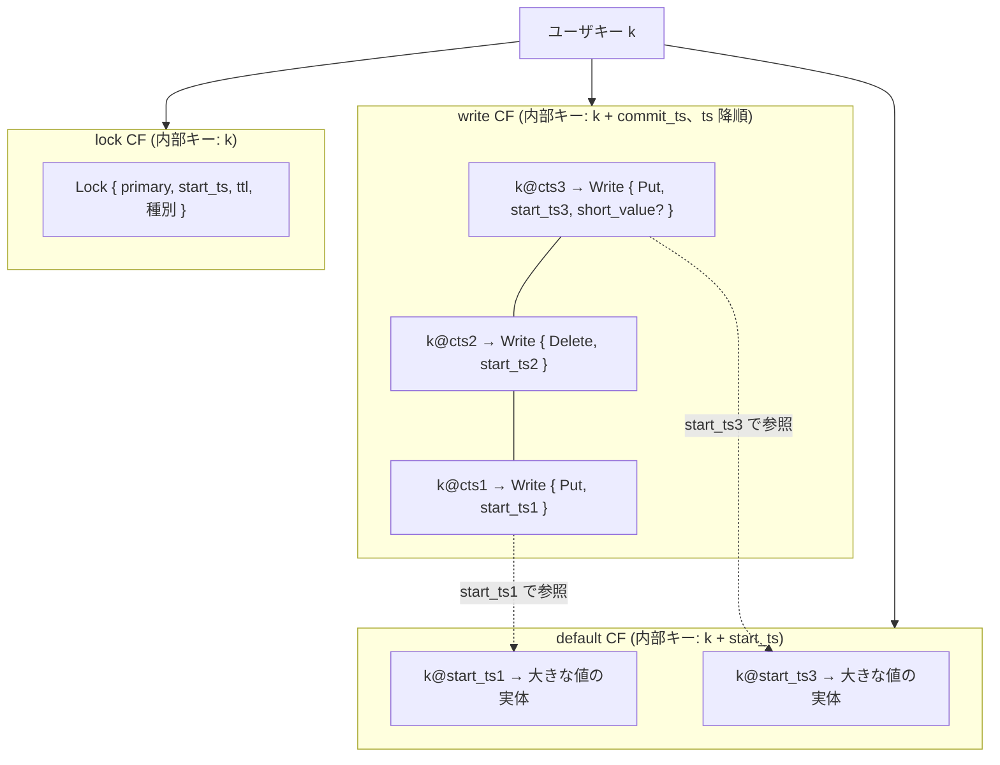

# 第12章 MVCC のエンコード

> **本章で読むソース**
>
> - [`components/txn_types/src/types.rs`](https://github.com/tikv/tikv/blob/v8.5.6/components/txn_types/src/types.rs)
> - [`components/txn_types/src/timestamp.rs`](https://github.com/tikv/tikv/blob/v8.5.6/components/txn_types/src/timestamp.rs)
> - [`components/txn_types/src/write.rs`](https://github.com/tikv/tikv/blob/v8.5.6/components/txn_types/src/write.rs)
> - [`components/txn_types/src/lock.rs`](https://github.com/tikv/tikv/blob/v8.5.6/components/txn_types/src/lock.rs)

## この章の狙い

第5章は TiKV が1つの RocksDB を用途の異なる CF に分ける設計を読み、`write`、`lock`、`default` という名前の CF がそこにあることを確定させた。
本章はその CF に何がどう符号化されて入るかを読む。
TiKV は多版同時実行制御（**MVCC**）と Percolator の2相コミットを、ユーザが書いた1つの鍵値ペアを3つの CF にまたがる複数のレコードへ展開して表現する。
ユーザキーにタイムスタンプを付けて版を並べる仕組み、コミット記録を収める `write` CF、ロックを収める `lock` CF、大きな値の実体を収める `default` CF を、`components/txn_types` の型に結び付けて読む。

この符号化を読むと、ある時点のスナップショット読みが「そのキーで読みタイムスタンプ以下の最大の版へシークする」という単純な操作に落ちる理由がわかる。
その機構を章の後半で扱う。

## 前提

タイムスタンプは PD の TSO が単調増加で発行する `u64` であり、`start_ts`（トランザクション開始時刻）と `commit_ts`（コミット時刻）の2種類が現れる。
Percolator では1つのトランザクションが複数のキーを書くとき、1つのキーを primary に選び、残りを secondary とする。
primary のロックがコミットされたかどうかが、そのトランザクション全体の成否の単一の真実になる。
本章はロックとコミット記録の符号化に絞り、それらをいつ書きいつ読むかという制御フローは第13章と第14章に譲る。

TiKV のキーは2種類の表現を持つ。
利用者向けの生の表現（raw）と、内部ストレージ向けの符号化された表現（encoded）である。
`components/txn_types/src/types.rs` の `Key` 型のドキュメントコメントがこの区別を述べている。

[`components/txn_types/src/types.rs` L70-L81](https://github.com/tikv/tikv/blob/v8.5.6/components/txn_types/src/types.rs#L70-L81)

```rust
/// Key type.
///
/// Keys have 2 types of binary representation - raw and encoded. The raw
/// representation is for public interface, the encoded representation is for
/// internal storage. We can get both representations from an instance of this
/// type.
///
/// Orthogonal to binary representation, keys may or may not embed a timestamp,
/// but this information is transparent to this type, the caller must use it
/// consistently.
#[derive(Eq, PartialEq, Ord, PartialOrd, Hash)]
pub struct Key(Vec<u8>);
```

タイムスタンプを埋め込むかどうかは、この型自身は関知しない。
タイムスタンプ付きのキーをいつ作りいつ剥がすかは呼び出し側の責任であり、その規約を本章で読む。

## キーにタイムスタンプを付けて版を並べる

MVCC では同じユーザキーの複数の版が同時に存在する。
TiKV はこれを、ユーザキーの末尾にタイムスタンプを付けた**内部キー**として表現する。
`write` CF では `commit_ts` を、`default` CF では `start_ts` を付ける。
タイムスタンプを付ける操作が `Key::append_ts` である。

[`components/txn_types/src/types.rs` L147-L159](https://github.com/tikv/tikv/blob/v8.5.6/components/txn_types/src/types.rs#L147-L159)

```rust
    /// Creates a new key by appending a `u64` timestamp to this key.
    #[inline]
    #[must_use]
    pub fn append_ts(mut self, ts: TimeStamp) -> Key {
        self.0.encode_u64_desc(ts.into_inner()).unwrap();
        self
    }

    /// Appending a `u64` timestamp to input key.
    #[inline]
    pub fn append_ts_inplace(&mut self, ts: TimeStamp) {
        self.0.encode_u64_desc(ts.into_inner()).unwrap();
    }
```

ここで使う `encode_u64_desc` が符号化の要点になる。
タイムスタンプを単純な大端の `u64` で付けると、RocksDB のバイト辞書順では小さいタイムスタンプが先に並ぶ。
`encode_u64_desc` はビットを反転して降順（descending）に符号化するので、辞書順では大きいタイムスタンプ、すなわち新しい版が先に並ぶ。
`types.rs` のテストがこの符号化を具体的なバイト列で確認している。

[`components/txn_types/src/types.rs` L880-L896](https://github.com/tikv/tikv/blob/v8.5.6/components/txn_types/src/types.rs#L880-L896)

```rust
    fn test_append_ts() {
        let cases = vec![
            (
                Key::from_encoded(b"abc".to_vec()),
                TimeStamp::from(100),
                Key::from_encoded(vec![
                    b'a', b'b', b'c', 0xFF, 0xFF, 0xFF, 0xFF, 0xFF, 0xFF, 0xFF, 0x9B,
                ]),
            ),
            (
                Key::from_raw(b"z"),
                TimeStamp::from(1000),
                Key::from_encoded(vec![
                    b'z', 0, 0, 0, 0, 0, 0, 0, 0xF8, 0xFF, 0xFF, 0xFF, 0xFF, 0xFF, 0xFF, 0xFC, 0x17,
                ]),
            ),
        ];
```

ユーザキー `abc` にタイムスタンプ100を付けると、末尾の8バイトは `0xFF...0x9B` になる。
これは100をビット反転した値であり、タイムスタンプが大きいほど末尾バイト列は小さくなる。
同じユーザキー `abc` の版がタイムスタンプ降順で1つの連続した区間に並ぶ、というのがこの符号化の帰結である。

剥がす側の操作が `truncate_ts` と `decode_ts` である。

[`components/txn_types/src/types.rs` L170-L192](https://github.com/tikv/tikv/blob/v8.5.6/components/txn_types/src/types.rs#L170-L192)

```rust
    /// Creates a new key by truncating the timestamp from this key.
    ///
    /// Preconditions: the caller must ensure this is actually a timestamped
    /// key.
    #[inline]
    pub fn truncate_ts(mut self) -> Result<Key, codec::Error> {
        let len = self.0.len();
        if len < number::U64_SIZE {
            // TODO: IMHO, this should be an assertion failure instead of
            // returning an error. If this happens, it indicates a bug in
            // the caller module, have to make code change to fix it.
            //
            // Even if it passed the length check, it still could be buggy,
            // a better way is to introduce a type `TimestampedKey`, and
            // functions to convert between `TimestampedKey` and `Key`.
            // `TimestampedKey` is in a higher (MVCC) layer, while `Key` is
            // in the core storage engine layer.
            Err(codec::Error::KeyLength)
        } else {
            self.0.truncate(len - number::U64_SIZE);
            Ok(self)
        }
    }
```

タイムスタンプは固定長の8バイトなので、末尾8バイトを切れば剥がせる。
`decode_ts_from` は末尾8バイトを降順符号化として復号してタイムスタンプを取り出す。

[`components/txn_types/src/types.rs` L217-L226](https://github.com/tikv/tikv/blob/v8.5.6/components/txn_types/src/types.rs#L217-L226)

```rust
    /// Decode the timestamp from a ts encoded key.
    #[inline]
    pub fn decode_ts_from(key: &[u8]) -> Result<TimeStamp, codec::Error> {
        let len = key.len();
        if len < number::U64_SIZE {
            return Err(codec::Error::KeyLength);
        }
        let mut ts = &key[len - number::U64_SIZE..];
        Ok(number::decode_u64_desc(&mut ts)?.into())
    }
```

タイムスタンプ自身は `TimeStamp` 型で表す。
`u64` の透過的なラッパーであり、上位ビットに物理時刻（ミリ秒）、下位18ビットに論理カウンタを持つ合成値である。

[`components/txn_types/src/timestamp.rs` L12-L22](https://github.com/tikv/tikv/blob/v8.5.6/components/txn_types/src/timestamp.rs#L12-L22)

```rust
#[derive(Clone, Copy, Debug, Default, Eq, PartialEq, Ord, PartialOrd, Hash)]
#[repr(transparent)]
pub struct TimeStamp(u64);

pub const TSO_PHYSICAL_SHIFT_BITS: u64 = 18;

impl TimeStamp {
    /// Create a time stamp from physical and logical components.
    pub fn compose(physical: u64, logical: u64) -> TimeStamp {
        TimeStamp((physical << TSO_PHYSICAL_SHIFT_BITS) + logical)
    }
```

物理時刻が上位にあるので、`u64` としての大小がそのまま発行順の前後になる。
この単調性が、タイムスタンプの降順符号化で版を時系列に並べる前提を満たす。

## write CF はコミット記録を収める

`write` CF の内部キーは「ユーザキー＋`commit_ts`」であり、値が `Write` レコードである。
`Write` はコミットの種別と、その版が指す `start_ts` を持つ。
種別は `WriteType` の4種類である。

[`components/txn_types/src/write.rs` L15-L26](https://github.com/tikv/tikv/blob/v8.5.6/components/txn_types/src/write.rs#L15-L26)

```rust
#[derive(Debug, Clone, Copy, PartialEq)]
pub enum WriteType {
    Put,
    Delete,
    Lock,
    Rollback,
}

const FLAG_PUT: u8 = b'P';
const FLAG_DELETE: u8 = b'D';
const FLAG_LOCK: u8 = b'L';
const FLAG_ROLLBACK: u8 = b'R';
```

`Put` は値の書き込み、`Delete` は削除、`Lock` はロックだけを取った版（値を変えない）、`Rollback` は中断された版である。
種別は1バイトのフラグで符号化する。

`Write` レコードの本体が次の構造体である。

[`components/txn_types/src/write.rs` L70-L74](https://github.com/tikv/tikv/blob/v8.5.6/components/txn_types/src/write.rs#L70-L74)

```rust
#[derive(PartialEq, Clone)]
pub struct Write {
    pub write_type: WriteType,
    pub start_ts: TimeStamp,
    pub short_value: Option<Value>,
```

`start_ts` は、この版を書いたトランザクションの開始時刻である。
内部キーに付くのは `commit_ts` であり、値の中に `start_ts` を持つ。
この2つを合わせると、コミット記録から対応する `default` CF の値の実体（後述）を引ける。

`short_value` は、値が短い場合に値の実体をこのレコードに直接埋め込むためのフィールドである。
符号化を `WriteRef::to_bytes` で読む。

[`components/txn_types/src/write.rs` L363-L378](https://github.com/tikv/tikv/blob/v8.5.6/components/txn_types/src/write.rs#L363-L378)

```rust
    pub fn to_bytes(&self) -> Vec<u8> {
        let mut b = Vec::with_capacity(self.pre_allocate_size());
        b.push(self.write_type.to_u8());
        b.encode_var_u64(self.start_ts.into_inner()).unwrap();
        if let Some(v) = self.short_value {
            b.push(SHORT_VALUE_PREFIX);
            b.push(v.len() as u8);
            b.extend_from_slice(v);
        }
        if self.has_overlapped_rollback {
            b.push(FLAG_OVERLAPPED_ROLLBACK);
        }
        if let Some(ts) = self.gc_fence {
            b.push(GC_FENCE_PREFIX);
            b.encode_u64(ts.into_inner()).unwrap();
        }
```

先頭に種別フラグ、続いて可変長符号化した `start_ts` が並ぶ。
`short_value` があれば、プレフィックスバイト `SHORT_VALUE_PREFIX`（`b'v'`）と1バイトの長さに続けて値の実体を埋め込む。
長さが1バイトなので埋め込める値は255バイト以下に限られる。
この上限は `is_short_value` で判定する。

[`components/txn_types/src/types.rs` L21-L27](https://github.com/tikv/tikv/blob/v8.5.6/components/txn_types/src/types.rs#L21-L27)

```rust
// Short value max len must <= 255.
pub const SHORT_VALUE_MAX_LEN: usize = 255;
pub const SHORT_VALUE_PREFIX: u8 = b'v';

pub fn is_short_value(value: &[u8]) -> bool {
    value.len() <= SHORT_VALUE_MAX_LEN
}
```

短い値を `write` CF に埋め込むのは、読み取り経路を1つの CF で完結させるための最適化である。
コミット記録を読んだ時点で値も手元にあるので、`default` CF を引く2回目のシークが要らない。
値が255バイトを超えるときだけ、実体を `default` CF へ追い出す。

`Write` は `WriteType::Lock` と `Rollback` の版も `write` CF に置く。
`Rollback` 記録は「ユーザキー＋`start_ts`」を内部キーとする点が `Put` や `Delete` と異なり、`commit_ts` を持たない中断記録だからである。
このため `commit_ts` を付けたコミット記録と `start_ts` を付けたロールバック記録が同じ内部キーに衝突しうる。
`Write` 構造体の `has_overlapped_rollback` フィールドのコメントがこの事情を述べている。

[`components/txn_types/src/write.rs` L76-L84](https://github.com/tikv/tikv/blob/v8.5.6/components/txn_types/src/write.rs#L76-L84)

```rust
    /// The `commit_ts` of transactions can be non-globally-unique. But since we
    /// store Rollback records in the same CF where Commit records is, and
    /// Rollback records are saved with `user_key{start_ts}` as the internal
    /// key, the collision between Commit and Rollback records can't be avoided.
    /// In this case, we keep the Commit record, and set the
    /// `has_overlapped_rollback` flag to indicate that there's also a Rollback
    /// record. Also note that `has_overlapped_rollback` field is only necessary
    /// when the Rollback record should be protected.
    pub has_overlapped_rollback: bool,
```

衝突したときはコミット記録を残し、ロールバックの存在をこのフラグで示す。

## lock CF は Percolator のロックを収める

`lock` CF の内部キーはタイムスタンプを付けない生のユーザキーであり、値が `Lock` レコードである。
1つのキーが指す版は時系列に並ぶが、未コミットのロックはそのキーに高々1つしか存在しない。
タイムスタンプを付けないのはこのためである。
`Lock` 構造体がロックの内容を持つ。

[`components/txn_types/src/lock.rs` L86-L97](https://github.com/tikv/tikv/blob/v8.5.6/components/txn_types/src/lock.rs#L86-L97)

```rust
#[derive(PartialEq, Clone)]
pub struct Lock {
    pub lock_type: LockType,
    pub primary: Vec<u8>,
    pub ts: TimeStamp,
    pub ttl: u64,
    pub short_value: Option<Value>,
    // If for_update_ts != 0, this lock belongs to a pessimistic transaction
    pub for_update_ts: TimeStamp,
    pub txn_size: u64,
    pub min_commit_ts: TimeStamp,
    pub use_async_commit: bool,
```

`primary` はこのトランザクションの primary キーの位置を指す。
secondary のロックから primary を辿れるので、トランザクションの成否を primary のコミット記録に集約できる。
`ts` はこのロックを書いたトランザクションの `start_ts` である。
`ttl` はロックの有効期間であり、ロックを置いたノードが落ちた場合に他のトランザクションがロックを解決（resolve）してよいかを時間で判定するために使う。

ロックの種別が `LockType` である。

[`components/txn_types/src/lock.rs` L24-L31](https://github.com/tikv/tikv/blob/v8.5.6/components/txn_types/src/lock.rs#L24-L31)

```rust
#[derive(Debug, Clone, Copy, PartialEq)]
pub enum LockType {
    Put,
    Delete,
    Lock,
    Pessimistic,
    Shared,
}
```

`Put`、`Delete`、`Lock` はそれぞれコミット時に同名の `WriteType` へ変換される予定のロックである。
`Pessimistic` は悲観的トランザクションのロックであり、第15章で扱う。
ロックの符号化は `Lock::to_bytes` で読む。

[`components/txn_types/src/lock.rs` L237-L246](https://github.com/tikv/tikv/blob/v8.5.6/components/txn_types/src/lock.rs#L237-L246)

```rust
        let mut b = Vec::with_capacity(self.pre_allocate_size());
        b.push(self.lock_type.to_u8());
        b.encode_compact_bytes(&self.primary).unwrap();
        b.encode_var_u64(self.ts.into_inner()).unwrap();
        b.encode_var_u64(self.ttl).unwrap();
        if let Some(ref v) = self.short_value {
            b.push(SHORT_VALUE_PREFIX);
            b.push(v.len() as u8);
            b.extend_from_slice(v);
        }
```

先頭に種別フラグ、続いて primary キー、`start_ts`、`ttl` が並ぶ。
`Lock` も `short_value` を持ち、`write` CF と同じ規約で短い値を埋め込む。
プリライト時に値をロックへ埋め込んでおくと、コミット時に `default` CF を引かずに `write` CF へ短い値を移せる。

## default CF は大きな値の実体を収める

255バイトを超える値は `default` CF に置く。
内部キーは「ユーザキー＋`start_ts`」であり、`write` CF のコミット記録が指す `start_ts` と一致する。
ここで `write` CF が `commit_ts` で並び、`default` CF が `start_ts` で並ぶ非対称が効く。
コミットは `commit_ts` を決める操作だが、値の実体はプリライト時に `start_ts` しか分からない段階で書き出される。
`default` CF を `start_ts` でキー化しておけば、値の実体をプリライトの時点で確定でき、コミット時には `write` CF にコミット記録を1つ足すだけで済む。

読み取りは2段になる。
まず `write` CF で「ユーザキー＋読みタイムスタンプ」へシークして可視なコミット記録を見つけ、その `start_ts` を取り出す。
次に短い値ならそのレコードに埋め込まれた `short_value` を返し、そうでなければ「ユーザキー＋`start_ts`」で `default` CF を引いて実体を返す。

## 3つの CF への展開

ここまでの符号化を、1つのユーザキーを軸にまとめる。



図1　1つのユーザキー `k` が `lock` CF の高々1つのロック、`write` CF のタイムスタンプ降順の複数のコミット記録、`default` CF の大きな値の実体に分かれて格納される。

`lock` CF にはそのキーに対する未コミットのロックが高々1つ載る。
`write` CF には版ごとのコミット記録が `commit_ts` 降順に並ぶ。
短い値はコミット記録に埋め込まれ、長い値だけが `default` CF へ実体として追い出される。

## 機構の工夫 版を1つの順序付き空間に並べる

この符号化の効きどころは、ある時点のスナップショット読みがシーク1回に落ちることである。

タイムスタンプを降順で末尾に付けるので、同じユーザキー `k` の全版は `write` CF の中で `commit_ts` 降順の連続した区間を占める。
読みタイムスタンプ `ts` でのスナップショット読みは、内部キー `k` に `ts` を降順符号化して付けた位置へシークする操作になる。
降順符号化のもとでは、この位置から辞書順で進むと最初に当たるのが「`commit_ts` が `ts` 以下で最大の版」になる。
これは `ts` の時点で可視な最新の版にほかならない。

整数の比較や版リストの線形走査を一切行わず、RocksDB のイテレータのシーク1回で「`ts` 以下の最大版」へ到達できる。
版を別テーブルやリストに持つ設計なら、可視な版を選ぶために版の集合を走査するか索引を引く必要がある。
TiKV はタイムスタンプをキーの一部に畳み込むことで、その選択を LSM-tree のキー順序そのものに肩代わりさせている。

ここに `Key::is_user_key_eq` のような細かな最適化も加わる。

[`components/txn_types/src/types.rs` L238-L247](https://github.com/tikv/tikv/blob/v8.5.6/components/txn_types/src/types.rs#L238-L247)

```rust
    /// Whether the user key part of a ts encoded key `ts_encoded_key` equals to
    /// the encoded user key `user_key`.
    ///
    /// There is an optimization in this function, which is to compare the last
    /// 8 encoded bytes first before comparing the rest. It is because in TiDB
    /// many records are ended with an 8 byte row id and in many situations only
    /// this part is different when calling this function. TODO: If the last
    /// 8 byte is memory aligned, it would be better.
    #[inline]
    pub fn is_user_key_eq(ts_encoded_key: &[u8], user_key: &[u8]) -> bool {
```

シーク後に「同じユーザキーの版か」を判定するとき、TiDB の行キーは末尾8バイトの行 ID で異なることが多い。
そこで末尾8バイトを先に比較して早期に弾く。
版を辿る走査が内部キーの比較の繰り返しになるからこそ、この比較を速くすることに意味がある。

## まとめ

TiKV は MVCC と Percolator を3つの CF への符号化で表す。
ユーザキーの末尾に降順符号化したタイムスタンプを付けることで、同じキーの版を `write` CF の中で `commit_ts` 降順の連続区間に並べる。
`write` CF はコミット記録（種別と `start_ts`、短い値）を持ち、`lock` CF はキーごとに高々1つの Percolator ロック（primary、`start_ts`、`ttl`、種別）を持ち、`default` CF は255バイトを超える値の実体を `start_ts` でキー化して持つ。
この並べ方によって、スナップショット読みは「そのキーで読みタイムスタンプ以下の最大版へシークする」というイテレータ操作に落ちる。

この符号化がいつ書かれるかを次の2章で読む。
プリライトでロックと値の実体を書く流れを第13章で、コミットでロックをコミット記録へ変える流れと、ここで符号化した版をスナップショット読みする流れを第14章で扱う。

## 関連する章

- [第5章 RocksDB 統合とカラムファミリ](../part01-engine/05-engine-rocks-and-cf.md)：本章が符号化を書き込む `write`、`lock`、`default` の3つの CF を定義する章。
- [第13章 Prewrite（第1相）](13-prewrite.md)：本章のロックと値の実体を `lock` CF と `default` CF に書く2相コミットの第1相。
- [第14章 Commit と MVCC 読み取り](14-commit-and-read.md)：ロックをコミット記録へ変える第2相と、本章の符号化をスナップショット読みする経路。
- [第15章 KV エンコード](../../tidb/part04-txn/15-kv-encoding.md)：TiDB 側で行と索引をどのバイト列のユーザキーにするかを読む章（本章のタイムスタンプはこのユーザキーの末尾に付く）。
