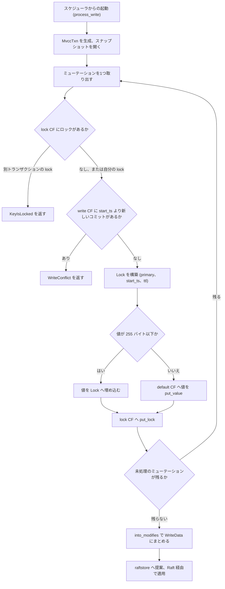

# 第13章 Prewrite（第1相）

> **本章で読むソース**
>
> - [`src/storage/txn/commands/prewrite.rs`](https://github.com/tikv/tikv/blob/v8.5.6/src/storage/txn/commands/prewrite.rs)
> - [`src/storage/txn/actions/prewrite.rs`](https://github.com/tikv/tikv/blob/v8.5.6/src/storage/txn/actions/prewrite.rs)
> - [`src/storage/mvcc/txn.rs`](https://github.com/tikv/tikv/blob/v8.5.6/src/storage/mvcc/txn.rs)

## この章の狙い

TiDB の分散トランザクションは Percolator 方式の2相コミット（2PC）で動く。
本章では、その第1相である**プリライト**を TiKV のサーバ側で読む。
プリライトとは、コミットの前にすべてのキーへロックを置き、値を書き込む処理である。
コミット可否はまだ確定しない。

クライアント（TiDB）側がどう2PCを駆動するかは TiDB 編で扱う（[第18章](../../tidb/part04-txn/18-percolator-2pc-unistore.md)）。
ここでは TiKV が1リクエストぶんのプリライトをどう実行するかに集中する。
具体的には、衝突を検出してロックを置き、値を CF へ振り分け、`WriteBatch` にまとめて raftstore へ渡すまでを追う。

## 前提

MVCC のキーエンコードと、`default` / `lock` / `write` の3つのカラムファミリ（CF）の役割は[第12章](12-mvcc-encoding.md)で扱う。
本章は、`lock` CF にロックを、`default` または `write` CF に値を置くという前提から始める。

プリライトのコマンドはスケジューラから呼ばれる。
スケジューラがリクエストをコマンドへ変換し、ラッチで同一キーへの並行アクセスを直列化したうえで `process_write` を起動する流れは[第20章](../part05-ops/20-scheduler-and-latch.md)で扱う。
本章のコードはすべて、スケジューラがラッチを取得し、対象 Region のスナップショットを渡した後に走る。

`process_write` が組み立てた書き込みは、その場では永続化されない。
`WriteData` として raftstore へ渡され、Raft のログ複製と適用を経て RocksDB に書かれる。
この提案と適用の流れは[第9章](../part02-raft/09-propose-and-apply.md)で扱う。

## 2つのコマンドと共通の処理本体

プリライトには2つのコマンドがある。
楽観的トランザクション用の `Prewrite` と、悲観的トランザクション用の `PrewritePessimistic` である。
プロトコル上は1つの protobuf だが、TiKV は処理の都合で別コマンドに分けている。

[`src/storage/txn/commands/prewrite.rs` L46-L82](https://github.com/tikv/tikv/blob/v8.5.6/src/storage/txn/commands/prewrite.rs#L46-L82)

```rust
command! {
    /// The prewrite phase of a transaction. The first phase of 2PC.
    ///
    /// This prepares the system to commit the transaction. Later a [`Commit`](Command::Commit)
    /// or a [`Rollback`](Command::Rollback) should follow.
    Prewrite:
        cmd_ty => PrewriteResult,
        content => {
            /// The set of mutations to apply.
            mutations: Vec<Mutation>,
            /// The primary lock. Secondary locks (from `mutations`) will refer to the primary lock.
            primary: Vec<u8>,
            /// The transaction timestamp.
            start_ts: TimeStamp,
            lock_ttl: u64,
            skip_constraint_check: bool,
            /// How many keys this transaction involved.
            txn_size: u64,
            min_commit_ts: TimeStamp,
            /// Limits the maximum value of commit ts of async commit and 1PC, which can be used to
            /// avoid inconsistency with schema change.
            max_commit_ts: TimeStamp,
            /// All secondary keys in the whole transaction (i.e., as sent to all nodes, not only
            /// this node). Only present if using async commit.
            secondary_keys: Option<Vec<Vec<u8>>>,
            /// When the transaction involves only one region, it's possible to commit the
            /// transaction directly with 1PC protocol.
            try_one_pc: bool,
            /// Controls how strict the assertions should be.
            /// Assertions is a mechanism to check the constraint on the previous version of data
            /// that must be satisfied as long as data is consistent.
            assertion_level: AssertionLevel,
        }
        in_heap => {
            primary, mutations,
        }
}
```

注目すべきは引数の構造である。
`mutations` がこのリクエストで書くキーの集合、`primary` がトランザクションの代表キー、`start_ts` がトランザクションの開始タイムスタンプである。
`primary` は1トランザクションで1つだけ存在し、各キーのロックは `primary` を指す。
このしくみが Percolator の核心であり、本章の最後で機構として説明する。

`PrewritePessimistic` は `for_update_ts` と `for_update_ts_constraints` を追加で持つ。
悲観ロックはあらかじめ別フェーズで取得済みで（[第15章](15-pessimistic-lock.md)）、プリライトはそのロックを上書きする形で進む。

2つのコマンドは、いずれも `process_write` で同じ処理本体へ合流する。
合流先は `Prewriter<K>` というジェネリック型で、`K` が楽観か悲観かを表す。

[`src/storage/txn/commands/prewrite.rs` L255-L259](https://github.com/tikv/tikv/blob/v8.5.6/src/storage/txn/commands/prewrite.rs#L255-L259)

```rust
impl<S: Snapshot, L: LockManager> WriteCommand<S, L> for Prewrite {
    fn process_write(self, snapshot: S, context: WriteContext<'_, L>) -> Result<WriteResult> {
        self.into_prewriter().process_write(snapshot, context)
    }
}
```

`into_prewriter` がコマンドのフィールドを `Prewriter<Optimistic>` へ詰め替える。
`PrewritePessimistic` も同様に `Prewriter<Pessimistic>` へ詰め替える。
以後の処理は型パラメータ違いの同じコードを通る。

## MvccTxn にモディファイを積む

プリライトの書き込みは、いきなり RocksDB へ書かれるのではない。
まず `MvccTxn` という中間バッファに積まれる。

[`src/storage/mvcc/txn.rs` L59-L83](https://github.com/tikv/tikv/blob/v8.5.6/src/storage/mvcc/txn.rs#L59-L83)

```rust
/// An abstraction of a locally-transactional MVCC key-value store
pub struct MvccTxn {
    pub(crate) start_ts: TimeStamp,
    pub(crate) write_size: usize,
    pub(crate) modifies: Vec<Modify>,
    // When 1PC is enabled, locks will be collected here instead of marshalled and put into
    // `writes`, so it can be further processed. The elements are tuples representing
    // (key, lock, remove_pessimistic_lock)
    pub(crate) locks_for_1pc: Vec<(Key, Lock, bool)>,
    // Collects the information of locks that are acquired in this MvccTxn. Locks that already
    // exists but updated in this MvccTxn won't be collected. The collected information will be
    // used to update the lock waiting information and redo deadlock detection, if there are some
    // pessimistic lock requests waiting on the keys.
    pub(crate) new_locks: Vec<LockInfo>,
    // `concurrency_manager` is used to set memory locks for prewritten keys.
    // Prewritten locks of async commit transactions should be visible to
    // readers before they are written to the engine.
    pub(crate) concurrency_manager: ConcurrencyManager,
    // After locks are stored in memory in prewrite, the KeyHandleGuard
    // needs to be stored here.
    // When the locks are written to the underlying engine, subsequent
    // reading requests should be able to read the locks from the engine.
    // So these guards can be released after finishing writing.
    pub(crate) guards: Vec<KeyHandleGuard>,
}
```

`modifies` が、このトランザクションが生む書き込み操作のリストである。
1つ1つは `Modify`（CF と キー と 値、あるいは削除）で、後で `WriteBatch` に変換される。
`write_size` は積んだ書き込みの累計バイト数で、過大なトランザクションを早期に弾く判断に使う。

`MvccTxn` への書き込みは、CF ごとの専用メソッドに分かれている。
ロックは `put_lock` で `lock` CF へ置く。

[`src/storage/mvcc/txn.rs` L121-L130](https://github.com/tikv/tikv/blob/v8.5.6/src/storage/mvcc/txn.rs#L121-L130)

```rust
    // Write a lock. If the key doesn't have lock before, `is_new` should be set.
    pub(crate) fn put_lock(&mut self, key: Key, lock: &Lock, is_new: bool) {
        if is_new {
            self.new_locks
                .push(lock.clone().into_lock_info(key.to_raw().unwrap()));
        }
        let write = Modify::Put(CF_LOCK, key, lock.to_bytes());
        self.write_size += write.size();
        self.modifies.push(write);
    }
```

ロックのキーには `start_ts` を付けないことに注目する。
`lock` CF にはキーごとに最大1つのロックしか存在できず、これがプリライト時の衝突検出を可能にする。

長い値は `put_value` で `default` CF へ置く。

[`src/storage/mvcc/txn.rs` L174-L178](https://github.com/tikv/tikv/blob/v8.5.6/src/storage/mvcc/txn.rs#L174-L178)

```rust
    pub(crate) fn put_value(&mut self, key: Key, ts: TimeStamp, value: Value) {
        let write = Modify::Put(CF_DEFAULT, key.append_ts(ts), value);
        self.write_size += write.size();
        self.modifies.push(write);
    }
```

`default` CF のキーには `start_ts` を付ける（`append_ts`）。
これにより同一キーの複数バージョンが共存できる。
`write` CF を書く `put_write` も同じ形で、コミット相のレコードを置くときに使う（[第14章](14-commit-and-read.md)）。
プリライト相では `write` CF は更新しない。

## 1キーのプリライト

`Prewriter` 本体は、リクエスト中のミューテーションを1つずつ取り出して `prewrite` 関数へ渡す。

[`src/storage/txn/commands/prewrite.rs` L581-L645](https://github.com/tikv/tikv/blob/v8.5.6/src/storage/txn/commands/prewrite.rs#L581-L645)

```rust
    /// The core part of the prewrite action. In the abstract, this method
    /// iterates over the mutations in the prewrite and prewrites each one.
    /// It keeps track of any locks encountered and (if it's an async commit
    /// transaction) the min_commit_ts, these are returned by the method.
    fn prewrite(
        &mut self,
        txn: &mut MvccTxn,
        reader: &mut SnapshotReader<impl Snapshot>,
        extra_op: ExtraOp,
    ) -> Result<(Vec<std::result::Result<(), StorageError>>, TimeStamp)> {
// ... (中略) ...
        for m in mem::take(&mut self.mutations) {
            let pessimistic_action = m.pessimistic_action();
            let expected_for_update_ts = m.pessimistic_expected_for_update_ts();
            let m = m.into_mutation();
            let key = m.key().clone();
            let mutation_type = m.mutation_type();

            let mut secondaries = &self.secondary_keys.as_ref().map(|_| vec![]);
            if Some(m.key()) == async_commit_pk {
                secondaries = &self.secondary_keys;
            }

            let need_min_commit_ts = secondaries.is_some() || self.try_one_pc;
            let prewrite_result = prewrite(
                txn,
                reader,
                &props,
                m,
                secondaries,
                pessimistic_action,
                expected_for_update_ts,
            );
```

ループは1キーずつ `prewrite` を呼ぶ。
各呼び出しは `txn`（`MvccTxn`）へ書き込みを追加するだけで、永続化はしない。
すべてのキーを処理し終えてからまとめて書き出すのは、後述する `write_result` の役目である。

`prewrite` 関数の本体は `actions/prewrite.rs` にあり、1キーぶんの衝突検出とロック書き込みを担う。

[`src/storage/txn/actions/prewrite.rs` L36-L45](https://github.com/tikv/tikv/blob/v8.5.6/src/storage/txn/actions/prewrite.rs#L36-L45)

```rust
/// Prewrite a single mutation by creating and storing a lock and value.
pub fn prewrite<S: Snapshot>(
    txn: &mut MvccTxn,
    reader: &mut SnapshotReader<S>,
    txn_props: &TransactionProperties<'_>,
    mutation: Mutation,
    secondary_keys: &Option<Vec<Vec<u8>>>,
    pessimistic_action: PrewriteRequestPessimisticAction,
    expected_for_update_ts: Option<TimeStamp>,
) -> Result<(TimeStamp, OldValue)> {
```

処理は大きく3段に分かれる。
ロック衝突の検査、書き込み衝突の検査、そしてロックと値の書き込みである。
順に見る。

### ロック衝突の検査

最初に、対象キーに既存のロックがないかをスナップショットから読む。

[`src/storage/txn/actions/prewrite.rs` L96-L113](https://github.com/tikv/tikv/blob/v8.5.6/src/storage/txn/actions/prewrite.rs#L96-L113)

```rust
    let (shared_locks, lock_status) = match reader.load_lock(&mutation.key)? {
        Some(lock_or_shared) => match lock_or_shared {
            Either::Left(lock) => {
                if mutation.is_shared_lock {
                    // Shared lock prewrite on existing exclusive lock
                    return Err(ErrorInner::KeyIsLocked(
                        lock.into_lock_info(mutation.key.to_raw()?),
                    )
                    .into());
                }
                let lock_status = mutation.check_lock(
                    lock,
                    pessimistic_action,
                    expected_for_update_ts,
                    generation,
                )?;
                (None, lock_status)
            }
```

ロックがあれば `check_lock` で素性を調べる。

[`src/storage/txn/actions/prewrite.rs` L434-L461](https://github.com/tikv/tikv/blob/v8.5.6/src/storage/txn/actions/prewrite.rs#L434-L461)

```rust
    /// Check whether the current key is locked at any timestamp.
    fn check_lock(
        &mut self,
        lock: Lock,
        pessimistic_action: PrewriteRequestPessimisticAction,
        expected_for_update_ts: Option<TimeStamp>,
        generation_to_write: u64,
    ) -> Result<LockStatus> {
        if lock.ts != self.txn_props.start_ts {
            // Abort on lock belonging to other transaction if
            // prewrites a pessimistic lock.
            if matches!(pessimistic_action, DoPessimisticCheck) {
                warn!(
                    "prewrite failed (pessimistic lock not found)";
                    "start_ts" => self.txn_props.start_ts,
                    "key" => %self.key,
                    "lock_ts" => lock.ts
                );
                return Err(ErrorInner::PessimisticLockNotFound {
                    start_ts: self.txn_props.start_ts,
                    key: self.key.to_raw()?,
                    reason: PessimisticLockNotFoundReason::LockTsMismatch,
                }
                .into());
            }

            return Err(ErrorInner::KeyIsLocked(self.lock_info(lock)?).into());
        }
```

ロックの `ts` が自分の `start_ts` と違えば、別のトランザクションがそのキーをロックしている。
このとき `KeyIsLocked` を返す。
クライアントはこのエラーを受け取り、相手の `primary` のロックを解決してから（[第16章](16-resolved-ts-and-gc.md)）再試行する。

逆にロックの `ts` が自分の `start_ts` と一致すれば、それは自分が以前に置いたロックである。
これは同一リクエストの再送などで起こり、重複コマンドとして扱って書き直しを省く。

### 書き込み衝突の検査

ロックがなければ、次に `write` CF を調べて新しいバージョンが割り込んでいないかを見る。

[`src/storage/txn/actions/prewrite.rs` L563-L593](https://github.com/tikv/tikv/blob/v8.5.6/src/storage/txn/actions/prewrite.rs#L563-L593)

```rust
    fn check_for_newer_version<S: Snapshot>(
        &mut self,
        reader: &mut SnapshotReader<S>,
    ) -> Result<Option<(Write, TimeStamp)>> {
        let mut seek_ts = TimeStamp::max();
        while let Some((commit_ts, write)) = reader.seek_write(&self.key, seek_ts)? {
            // If there's a write record whose commit_ts equals to our start ts, the current
            // transaction is ok to continue, unless the record means that the current
            // transaction has been rolled back.
            if commit_ts == self.txn_props.start_ts
                && (write.write_type == WriteType::Rollback || write.has_overlapped_rollback)
            {
                MVCC_CONFLICT_COUNTER.rolled_back.inc();
                // TODO: Maybe we need to add a new error for the rolled back case.
                self.write_conflict_error(&write, commit_ts, WriteConflictReason::SelfRolledBack)?;
            }
            if seek_ts == TimeStamp::max() {
                self.last_change =
                    next_last_change_info(&self.key, &write, reader.start_ts, reader, commit_ts)?;
            }
            match self.txn_props.kind {
                TransactionKind::Optimistic(_) => {
                    if commit_ts > self.txn_props.start_ts {
                        MVCC_CONFLICT_COUNTER.prewrite_write_conflict.inc();
                        self.write_conflict_error(
                            &write,
                            commit_ts,
                            WriteConflictReason::Optimistic,
                        )?;
                    }
                }
```

楽観的トランザクションの判定は単純である。
`seek_write` で `write` CF を `commit_ts` の降順に探し、最も新しいレコードの `commit_ts` が自分の `start_ts` より大きければ `WriteConflict` を返す。
これは「自分がトランザクションを始めた後に、誰かが同じキーをコミットした」状況であり、楽観的トランザクションのスナップショット分離を破る。
クライアントはタイムスタンプを取り直して再試行する。

この検査が最初の1シークで済むのが効きどころである。
`seek_write` は対象キーの `write` CF を最大 `ts` から降順に探すので、最初に当たるレコードが最新バージョンになる。
全バージョンを走査せずに衝突を判定できる。

悲観的トランザクションでは判定が異なる。
悲観ロックを取った時点（`for_update_ts`）より後のコミットがあればロックが失われたとみなし、`PessimisticLockNotFound` を返す。
衝突の検出を悲観ロック取得の段階へ前倒ししてあるため、プリライト相での扱いが楽観の場合と分かれる。

### ロックと値の書き込み

衝突がなければ、`write_lock` がロックを構築して `MvccTxn` へ積む。

[`src/storage/txn/actions/prewrite.rs` L669-L696](https://github.com/tikv/tikv/blob/v8.5.6/src/storage/txn/actions/prewrite.rs#L669-L696)

```rust
        let mut lock = Lock::new(
            self.lock_type.unwrap(),
            self.txn_props.primary.to_vec(),
            self.txn_props.start_ts,
            self.lock_ttl,
            None,
            for_update_ts_to_write,
            self.txn_props.txn_size,
            self.min_commit_ts,
            false,
        )
        .set_txn_source(self.txn_props.txn_source)
        .with_generation(generation);
        // Only Lock needs to record `last_change_ts` in its write record, Put or Delete
        // records themselves are effective changes.
        if tls_can_enable(LAST_CHANGE_TS) && self.lock_type == Some(LockType::Lock) {
            lock = lock.set_last_change(self.last_change.clone());
        }

        if let Some(value) = self.value {
            if is_short_value(&value) {
                // If the value is short, embed it in Lock.
                lock.short_value = Some(value);
            } else {
                // value is long
                txn.put_value(self.key.clone(), self.txn_props.start_ts, value);
            }
        }
```

`Lock::new` の引数に、ロックが運ぶ情報がそろっている。
ロック種別、`primary`、`start_ts`、`lock_ttl` である。
`primary` を全ロックが共有することで、後でコミット可否を1点に集約できる。
`lock_ttl` はロックの有効期限で、ロックを置いたトランザクションが落ちたときに、他のトランザクションがそのロックを解決してよいかを判断する材料になる。

値の置き場所は長さで分岐する。
255 バイト以下の短い値は、別 CF を引かずに済むようロック自身へ埋め込む（`short_value`）。

[`components/txn_types/src/types.rs` L22-L26](https://github.com/tikv/tikv/blob/v8.5.6/components/txn_types/src/types.rs#L22-L26)

```rust
pub const SHORT_VALUE_MAX_LEN: usize = 255;
pub const SHORT_VALUE_PREFIX: u8 = b'v';

pub fn is_short_value(value: &[u8]) -> bool {
    value.len() <= SHORT_VALUE_MAX_LEN
```

短い値をロックへ埋め込むのは読み取り回数を減らす工夫である。
値がロックの中にあれば、コミット相で `default` CF を読まずに済み、`write` CF へ値ごと移せる。
長い値だけが `put_value` で `default` CF に置かれる。

ロックの書き込み先は、通常の2PCでは `put_lock` で `lock` CF へ向かう。

[`src/storage/txn/actions/prewrite.rs` L764-L768](https://github.com/tikv/tikv/blob/v8.5.6/src/storage/txn/actions/prewrite.rs#L764-L768)

```rust
        } else if try_one_pc {
            txn.put_locks_for_1pc(self.key, lock, lock_status.has_pessimistic_lock());
        } else {
            txn.put_lock(self.key, &lock, is_new_lock);
        }
```

ここまでで1キーのプリライトが終わる。
`lock` CF にロックが、長い値があれば `default` CF に値が、`MvccTxn` のバッファへ積まれた。

## まとめて書き出す

全ミューテーションの処理が終わると、`Prewriter` は積んだ書き込みを1つの `WriteData` にまとめる。

[`src/storage/txn/commands/prewrite.rs` L753-L759](https://github.com/tikv/tikv/blob/v8.5.6/src/storage/txn/commands/prewrite.rs#L753-L759)

```rust
            // Here the lock guards are taken and will be released after the write finishes.
            // If an error (KeyIsLocked or WriteConflict) occurs before, these lock guards
            // are dropped along with `txn` automatically.
            let lock_guards = txn.take_guards();
            let new_acquired_locks = txn.take_new_locks();
            let mut to_be_write = WriteData::new(txn.into_modifies(), extra);
            to_be_write.set_disk_full_opt(self.ctx.get_disk_full_opt());
```

`txn.into_modifies()` が、積んだ `Modify` のリストを取り出す。
それを `WriteData::new` で1つの書き込みバッチにまとめ、`to_be_write` に詰める。
この `to_be_write` がスケジューラを経て raftstore へ提案される。

ここが TiKV のトランザクションと Raft の境目である。
1リクエストのプリライトで生じた複数キーの書き込みが、1つの `WriteData` として Raft の1提案にまとまる。
ログとして複製され、過半数の合意を得てから各 Peer で適用され、RocksDB に書かれる（[第9章](../part02-raft/09-propose-and-apply.md)）。
プリライト処理自体は MVCC の操作に徹し、永続化と複製は Raft 層に委ねる。

なお、どれかのキーで `KeyIsLocked` が起きたときは書き込みステージをまるごと省く。
ロックされたキーがあると判明した時点でこのリクエストは成功できないので、`MvccTxn` に積んだ書き込みを捨て、ロック情報だけをクライアントへ返す。

## 全体の流れ

ここまでのプリライトの流れを図にする。



## primary に集約する機構

Percolator がトランザクションの原子性をどう成立させるかを、プリライトの観点でまとめる。

プリライトは、トランザクションが書くすべてのキーに対し、`primary` を指すロックを置く。
`primary` はトランザクションごとに1つだけ選ばれる代表キーである。
セカンダリ（`primary` 以外）のロックは、自分のロック情報の中に `primary` のキーを記録する。
つまり、すべてのロックが1点を指す木構造になる。

このしくみは、コミット可否の判断を `primary` の状態に一点集約する。
コミット相では、まず `primary` のロックを `write` レコードへ書き換える（[第14章](14-commit-and-read.md)）。
`primary` のコミットが成功した瞬間に、トランザクション全体がコミット済みと定義される。
セカンダリのコミットはその後の遅延処理でよい。
他のトランザクションが未解決のロックに出くわしたときも、`primary` の状態だけを見ればトランザクションがコミット済みか中断かを判定できる。

プリライトが衝突を検出してロックを置くのは、この一点集約の土台を作るためである。
プリライトの段階ですべてのキーへロックが置けたなら、どのキーにも他のトランザクションが割り込んでいないことが保証される。
その状態を `primary` という1点に束ねておくからこそ、第2相のコミットは `primary` の確定という単一の判断に縮約できる。
分散した複数キーへの書き込みを、合意が必要な決定点を1つに減らして原子化するのが Percolator の設計である。

## 関連する章

- [第12章 MVCC のエンコード](12-mvcc-encoding.md)：`default` / `lock` / `write` の各 CF のキーエンコードとバージョン管理。
- [第14章 Commit と MVCC 読み取り](14-commit-and-read.md)：第2相のコミットで `primary` のロックを `write` レコードへ書き換える流れと、ロックを越えた読み取り。
- [第15章 悲観ロックと concurrency_manager](15-pessimistic-lock.md)：`PrewritePessimistic` の前段にあたる悲観ロックの取得。
- [第16章 resolved_ts と GC](16-resolved-ts-and-gc.md)：放置されたロックの解決と古いバージョンの回収。
- [第20章 スケジューラと latch](../part05-ops/20-scheduler-and-latch.md)：コマンドの起動とラッチによる同一キーの直列化。
- [第9章 提案と適用](../part02-raft/09-propose-and-apply.md)：`WriteData` を Raft の提案として複製し適用するまで。
- [第18章 Percolator と2相コミット（unistore）](../../tidb/part04-txn/18-percolator-2pc-unistore.md)：クライアント側（TiDB）が2PCを駆動する流れと、unistore 上での Percolator 実装。
