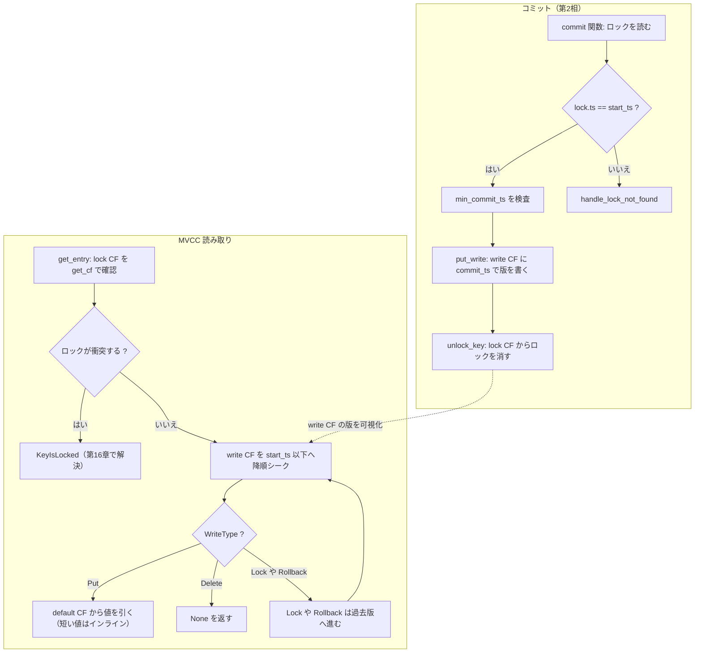

# 第14章 Commit と MVCC 読み取り

> **本章で読むソース**
>
> - [`src/storage/txn/commands/commit.rs`](https://github.com/tikv/tikv/blob/v8.5.6/src/storage/txn/commands/commit.rs)
> - [`src/storage/txn/actions/commit.rs`](https://github.com/tikv/tikv/blob/v8.5.6/src/storage/txn/actions/commit.rs)
> - [`src/storage/mvcc/reader/reader.rs`](https://github.com/tikv/tikv/blob/v8.5.6/src/storage/mvcc/reader/reader.rs)
> - [`src/storage/mvcc/reader/point_getter.rs`](https://github.com/tikv/tikv/blob/v8.5.6/src/storage/mvcc/reader/point_getter.rs)

## この章の狙い

第13章では、2相コミットの第1相であるプリライトが、各キーの値を default CF に置き、lock CF にロックを立てるところまでを読んだ。
このロックはまだコミットされていない暫定状態であり、他のトランザクションから見えてはならない。
本章は第2相のコミットを読み、暫定状態の書き込みがどうやって全トランザクションへ一斉に可視化されるかを追う。

可視化の仕組みが分かれば、読み取りの仕組みも理解できる。
コミットは値を write CF に1版書くだけで、その版を「`start_ts` 以下の最大の `commit_ts`」というスナップショットの規則に乗せる。
読み取りはその規則をなぞって、write CF を `commit_ts` の降順にシークし、最初に見える版を返す。
コミットと読み取りはこの規則を共有する1組の操作であり、本章はそれを `commit` 関数と `MvccReader`／`PointGetter` の双方から読む。

## 前提

TiKV のトランザクションは Percolator のモデルに従い、キーを default CF、lock CF、write CF の3つのカラムファミリに分けて格納する。
この符号化は第12章で扱った。
write CF のキーは利用者キーに `commit_ts` を付与した形であり、値は `WriteType`（`Put`／`Delete`／`Lock`／`Rollback`）と書き込みトランザクションの `start_ts` を持つ。
default CF のキーは利用者キーに `start_ts` を付与した形であり、短い値はインライン化されて write CF に直接入る。

トランザクションは開始時に `start_ts`、コミット時に `commit_ts` を TSO から取得する。
プリライトでは primary キーを1つ選び、各キーのロックに primary の位置を記録する。
本章のコード引用はすべて tikv/tikv のタグ `v8.5.6` に固定する。

## コミットコマンドの入口

コミットリクエストの入口は `Commit` コマンドの `process_write` である。
リクエストはコミット対象のキー列、トランザクションの `lock_ts`（プリライト時の `start_ts`）、`commit_ts` を持つ。

[`src/storage/txn/commands/commit.rs` L49-L68](https://github.com/tikv/tikv/blob/v8.5.6/src/storage/txn/commands/commit.rs#L49-L68)

```rust
impl<S: Snapshot, L: LockManager> WriteCommand<S, L> for Commit {
    fn process_write(self, snapshot: S, context: WriteContext<'_, L>) -> Result<WriteResult> {
        if self.commit_ts <= self.lock_ts {
            return Err(Error::from(ErrorInner::InvalidTxnTso {
                start_ts: self.lock_ts,
                commit_ts: self.commit_ts,
            }));
        }
        let mut txn = MvccTxn::new(self.lock_ts, context.concurrency_manager);
        let mut reader = ReaderWithStats::new(
            SnapshotReader::new_with_ctx(self.lock_ts, snapshot, &self.ctx),
            context.statistics,
        );

        let rows = self.keys.len();
        // Pessimistic txn needs key_hashes to wake up waiters
        let mut released_locks = ReleasedLocks::new();
        for k in self.keys {
            released_locks.push(commit(&mut txn, &mut reader, k, self.commit_ts)?);
        }
```

最初の `commit_ts <= lock_ts` の検査は、TSO から得た `commit_ts` が `start_ts` より大きいというモデルの不変条件を守る。
コマンドはキーごとに `commit` 関数を呼ぶだけで、キー間の調整は持たない。
1リクエストに primary と secondary が混在していても、各キーは独立にロックから write へ置き換えられる。

primary を先に確定し secondary を後で確定する順序は、このコマンドの内部ではなくクライアント側が担う。
TiDB のクライアントは、まず primary キーだけをコミットするリクエストを送り、その成功を確認してから secondary をコミットする。
primary の write 記録が書かれた瞬間にトランザクション全体がコミット済みと決まるため、この順序が成否の基準になる。

## ロックを write 記録に置き換える

キー1つを処理する `commit` 関数を読む。

[`src/storage/txn/actions/commit.rs` L48-L53](https://github.com/tikv/tikv/blob/v8.5.6/src/storage/txn/actions/commit.rs#L48-L53)

```rust
pub fn commit<S: Snapshot>(
    txn: &mut MvccTxn,
    reader: &mut SnapshotReader<S>,
    key: Key,
    commit_ts: TimeStamp,
) -> MvccResult<Option<ReleasedLock>> {
```

関数はまずそのキーのロックを読む。
読んだロックの `ts` が、コミットしようとしている `reader.start_ts` と一致するときだけ、自分のトランザクションのロックだと判断する。

[`src/storage/txn/actions/commit.rs` L77-L83](https://github.com/tikv/tikv/blob/v8.5.6/src/storage/txn/actions/commit.rs#L77-L83)

```rust
    let (mut lock, shared_locks, commit) = match lock_state {
        Some(lock_or_shared) => {
            let (lock, shared_locks) = match lock_or_shared {
                Either::Left(lock) if lock.ts == reader.start_ts => (lock, None),
                Either::Left(_) => {
                    return handle_lock_not_found(reader, key.clone(), commit_ts);
                }
```

ロックが見つからない、または `ts` が一致しないときは `handle_lock_not_found` に進む。
この関数は write CF にすでにコミット記録があるかを確認し、別のトランザクションが先にコミット済みなら成功として扱う（コミットは冪等である）。
ロックも write 記録もなければ、ロックが失われたとみなして `TxnLockNotFound` を返す。

ロックが確かに自分のものだと分かると、`min_commit_ts` を検査する。

[`src/storage/txn/actions/commit.rs` L94-L110](https://github.com/tikv/tikv/blob/v8.5.6/src/storage/txn/actions/commit.rs#L94-L110)

```rust
            // A lock with larger min_commit_ts than current commit_ts can't be committed
            if commit_ts < lock.min_commit_ts {
                info!(
                    "trying to commit with smaller commit_ts than min_commit_ts";
                    "key" => %key,
                    "start_ts" => reader.start_ts,
                    "commit_ts" => commit_ts,
                    "min_commit_ts" => lock.min_commit_ts,
                );
                return Err(ErrorInner::CommitTsExpired {
                    start_ts: reader.start_ts,
                    commit_ts,
                    key: key.into_raw()?,
                    min_commit_ts: lock.min_commit_ts,
                }
                .into());
            }
```

`min_commit_ts` は、このロックを「これより小さい `commit_ts` ではコミットしない」と約束した下限である。
他のトランザクションがこのロックの状態を確認した際にこの下限を押し上げることがあり、その値より小さい `commit_ts` でのコミットは拒否される。
この約束は、ロックを確認した側が観測したスナップショットと矛盾する版が後から差し込まれるのを防ぐ。

検査を通ると、ロックから write 記録を組み立てる。

[`src/storage/txn/actions/commit.rs` L153-L179](https://github.com/tikv/tikv/blob/v8.5.6/src/storage/txn/actions/commit.rs#L153-L179)

```rust
    let mut write = Write::new(
        WriteType::from_lock_type(lock.lock_type).unwrap(),
        reader.start_ts,
        lock.short_value.take(),
    )
    .set_last_change(lock.last_change.clone())
    .set_txn_source(lock.txn_source);

    for ts in &lock.rollback_ts {
        if *ts == commit_ts {
            write = write.set_overlapped_rollback(true, None);
            break;
        }
    }

    txn.put_write(key.clone(), commit_ts, write.as_ref().to_bytes());
    match shared_locks {
        Some(shared_locks) => {
            if shared_locks.is_empty() {
                Ok(txn.unlock_key(key, true, commit_ts))
            } else {
                txn.put_shared_locks(key, &shared_locks, false);
                Ok(None)
            }
        }
        None => Ok(txn.unlock_key(key, lock.is_pessimistic_txn(), commit_ts)),
    }
```

`Write::new` は、ロックの `lock_type` を `WriteType` に変換し、`start_ts` と短い値を引き継ぐ。
`put_write` は write CF のキー（利用者キーに `commit_ts` を付与）にこの記録を置き、`unlock_key` は lock CF からロックを消す。
この2つの書き込みは `txn` の変更集合に積まれ、後で1つの `WriteBatch` として Raft 経由で適用される。

write 記録の置き換えで、コミットの可視化が完了する。
プリライト時にロックへ取り込まれた短い値は、ロックの消去とともに失われるのではなく write 記録の `short_value` へ移される。
長い値は default CF に `start_ts` 付きで残っており、write 記録の `start_ts` から引ける。

## コミットの最適化：1書き込みで版を可視化する

ここで、コミットがなぜ軽いのかを機構レベルで述べる。

`put_write` は write CF に1版を書くだけであり、default CF の値はプリライト時にすでに置かれている。
値は動かさず、write CF に「`commit_ts` のキーで `start_ts` を指す」記録を1つ足すだけで、その版がスナップショットの規則の対象になる。
読み取りは `commit_ts` を見て版を選ぶため、この記録が書かれた瞬間に、全トランザクションが同時にこの版を可視化できる。

可視化を1点の書き込みに集約できるのは、値とその可視化を分離したからである。
default CF が「値そのもの」を、write CF が「いつから見えるか」を持つ。
コミットは後者を1版書くだけで済み、前者を複製したり移動したりしない。
この分離があるため、巨大な値を持つトランザクションでもコミットの書き込み量は値の大きさに依存しない。

## MVCC 読み取り：write CF を降順にシークする

読み取り側に移る。
`MvccReader` は1つのスナップショットを `start_ts` の視点で読む読み取り器である。
中核は `seek_write` で、あるキーについて指定 `ts` 以下で最大の `commit_ts` を持つ write 記録へカーソルを進める。

[`src/storage/mvcc/reader/reader.rs` L477-L504](https://github.com/tikv/tikv/blob/v8.5.6/src/storage/mvcc/reader/reader.rs#L477-L504)

```rust
    pub fn seek_write(&mut self, key: &Key, ts: TimeStamp) -> Result<Option<(TimeStamp, Write)>> {
        // Get the cursor for write record
        //
        // When it switches to another key in prefix seek mode, creates a new cursor for
        // it because the current position of the cursor is seldom around `key`.
        if self.scan_mode.is_none() && self.current_key.as_ref().map_or(true, |k| k != key) {
            self.current_key = Some(key.clone());
            self.write_cursor.take();
        }
        self.create_write_cursor()?;
        let cursor = self.write_cursor.as_mut().unwrap();
        // find a `ts` encoded key which is less than the `ts` encoded version of the
        // `key`
        let found = cursor.near_seek(&key.clone().append_ts(ts), &mut self.statistics.write)?;
        if !found {
            return Ok(None);
        }
        let write_key = cursor.key(&mut self.statistics.write);
        let commit_ts = Key::decode_ts_from(write_key)?;
        // check whether the found written_key's "real key" part equals the `key` we
        // want to find
        if !Key::is_user_key_eq(write_key, key.as_encoded()) {
            return Ok(None);
        }
        // parse out the write record
        let write = WriteRef::parse(cursor.value(&mut self.statistics.write))?.to_owned();
        Ok(Some((commit_ts, write)))
    }
```

`near_seek` に渡すキーは `key.append_ts(ts)` である。
write CF のキーは利用者キーが昇順、`commit_ts` が降順に並ぶよう符号化されており、このシークは「利用者キーが一致し、かつ `commit_ts <= ts` の最大版」へ1回で到達する。
シーク後にキーの利用者部分が一致するかを確認し、別キーへ越境していたら版なしと判断する。
この符号化により、版の選択は走査ではなく1回のシークになる。

`seek_write` が見つけた版が、その `start_ts` の視点で読むべき値とは限らない。
版が `Lock` や `Rollback` のときは値を持たないため、さらに過去へ進む必要がある。
この巻き戻しを担うのが `get_write_with_commit_ts` である。

[`src/storage/mvcc/reader/reader.rs` L560-L581](https://github.com/tikv/tikv/blob/v8.5.6/src/storage/mvcc/reader/reader.rs#L560-L581)

```rust
    pub fn get_write_with_commit_ts(
        &mut self,
        key: &Key,
        mut ts: TimeStamp,
        gc_fence_limit: Option<TimeStamp>,
    ) -> Result<Option<(Write, TimeStamp)>> {
        let mut seek_res = self.seek_write(key, ts)?;
        loop {
            match seek_res {
                Some((commit_ts, write)) => {
                    if let Some(limit) = gc_fence_limit {
                        if !write.as_ref().check_gc_fence_as_latest_version(limit) {
                            return Ok(None);
                        }
                    }
                    match write.write_type {
                        WriteType::Put => {
                            return Ok(Some((write, commit_ts)));
                        }
                        WriteType::Delete => {
                            return Ok(None);
                        }
```

`Put` を見つければ、その版の値を返す。
`Delete` を見つければ、そのキーは削除済みであり、より過去の値を返してはならないので `None` を返す。
`Lock` や `Rollback` の版は、ループの後段で1つ前の `commit_ts` へ `ts` を縮めて `seek_write` をやり直す。
このとき `last_change` の情報があれば、過去の版へ何回もシークせず、最後に値を変えた版へ直接ジャンプできる場合がある。

## 点読み：PointGetter とロックの確認

`PointGetter` は単一キーの読み取りに特化した経路である。
入口の `get_entry` は、まずロックを確認し、問題がなければ write CF から版を読む。

[`src/storage/mvcc/reader/point_getter.rs` L188-L207](https://github.com/tikv/tikv/blob/v8.5.6/src/storage/mvcc/reader/point_getter.rs#L188-L207)

```rust
    pub fn get_entry(
        &mut self,
        user_key: &Key,
        load_commit_ts: bool,
    ) -> Result<Option<ValueEntry>> {
        fail_point!("point_getter_get");
        if need_check_locks(self.isolation_level) {
            // Check locks that signal concurrent writes for `Si` or more recent writes for
            // `RcCheckTs`.
            if let Some(lock) = self.load_and_check_lock(user_key, !load_commit_ts)? {
                // When commit timestamp is required, we should not load data from lock.
                debug_assert!(!load_commit_ts);
                return self
                    .load_data_from_lock(user_key, lock)
                    .map(|o| o.map(ValueEntry::from_value));
            }
        }

        self.load_data(user_key, load_commit_ts)
    }
```

スナップショット分離（`Si`）では、まずロックの有無を確認する。
ロックがあっても自分の読みを妨げない場合（`bypass_locks` や `access_locks` に含まれる場合など）は読み進めるが、自分の `start_ts` より前にコミットされ得るロックに当たれば衝突となる。

ロックの確認は `load_and_check_lock` が担う。

[`src/storage/mvcc/reader/point_getter.rs` L226-L261](https://github.com/tikv/tikv/blob/v8.5.6/src/storage/mvcc/reader/point_getter.rs#L226-L261)

```rust
    fn load_and_check_lock(
        &mut self,
        user_key: &Key,
        extract_access_lock: bool,
    ) -> Result<Option<Lock>> {
        self.statistics.lock.get += 1;
        let lock_value = self.snapshot.get_cf(CF_LOCK, user_key)?;

        if let Some(ref lock_value) = lock_value {
            let lock_or_shared_locks = txn_types::parse_lock(lock_value)?;

            if self.met_newer_ts_data == NewerTsCheckState::NotMetYet {
                self.met_newer_ts_data = NewerTsCheckState::Met;
            }
            if let Err(e) = txn_types::check_ts_conflict(
                Cow::Borrowed(&lock_or_shared_locks),
                user_key,
                self.ts,
                &self.bypass_locks,
                self.isolation_level,
            ) {
                let lock = lock_or_shared_locks
                    .left()
                    .expect("Err result only for single lock");
                self.statistics.lock.processed_keys += 1;
                if extract_access_lock && self.access_locks.contains(lock.ts) {
                    return Ok(Some(lock));
                }
                Err(e.into())
            } else {
                Ok(None)
            }
        } else {
            Ok(None)
        }
    }
```

ロックの有無は `get_cf` で1回引く。
コメントが述べるとおり、ふつうは lock CF に何もないため、シークではなく `get_cf` を使う方が速い。
シークだと RocksDB が削除済みエントリを読み飛ばしながら次の利用者キーまでカーソルを進めてしまうのに対し、`get_cf` はそのキーの有無だけを点で確かめるからである。
ロックがあって `check_ts_conflict` がエラーを返すと、そのロックが `access_locks` に含まれていればその値を読み、そうでなければ衝突を表すエラー（`KeyIsLocked`）を返す。
このエラーを受けたクライアントは、ロックを解決してから読みをやり直す。
ロックの解決は第16章で扱う。

ロックの確認を抜けると、`load_data` が write CF から版を選び、必要なら default CF から値を引く。

[`src/storage/mvcc/reader/point_getter.rs` L313-L378](https://github.com/tikv/tikv/blob/v8.5.6/src/storage/mvcc/reader/point_getter.rs#L313-L378)

```rust
        seek_key = seek_key.append_ts(self.ts);
        let data_found = if use_near_seek {
            if self.write_cursor.key(&mut self.statistics.write) >= seek_key.as_encoded().as_slice()
            {
                // we call near_seek with ScanMode::Mixed set, if the key() > seek_key,
                // it will call prev() several times, whereas we just want to seek forward here
                // so cmp them in advance
                true
            } else {
                self.write_cursor
                    .near_seek(&seek_key, &mut self.statistics.write)?
            }
        } else {
            self.write_cursor
                .seek(&seek_key, &mut self.statistics.write)?
        };
        if !data_found {
            return Ok(None);
        }

        let mut write = WriteRef::parse(self.write_cursor.value(&mut self.statistics.write))?;
        // Commit ts of `write` when it is loaded by `last_change` shortcut via
        // `get_cf`. In that case write cursor still points to a newer version
        // and its ts must not be used.
        let mut loaded_write_commit_ts = None;
        let mut owned_value: Vec<u8>; // To work around lifetime problem
        loop {
            if !write.check_gc_fence_as_latest_version(self.ts) {
                return Ok(None);
            }

            match write.write_type {
                WriteType::Put => {
                    let key_commit_ts = if load_commit_ts {
                        if let Some(ts) = loaded_write_commit_ts {
                            Some(ts)
                        } else {
                            let cursor_key = self.write_cursor.key(&mut self.statistics.write);
                            Some(Key::decode_ts_from(cursor_key)?)
                        }
                    } else {
                        None
                    };
                    self.statistics.write.processed_keys += 1;
                    resource_metering::record_read_keys(1);

                    if self.omit_value {
                        return Ok(Some(ValueEntry::new(vec![], key_commit_ts)));
                    }
                    match write.short_value {
                        Some(value) => {
                            // Value is carried in `write`.
                            self.statistics.processed_size += user_key.len() + value.len();
                            return Ok(Some(ValueEntry::new(value.to_vec(), key_commit_ts)));
                        }
                        None => {
                            let start_ts = write.start_ts;
                            let value = self.load_data_from_default_cf(start_ts, user_key)?;
                            self.statistics.processed_size += user_key.len() + value.len();
                            return Ok(Some(ValueEntry::new(value, key_commit_ts)));
                        }
                    }
                }
                WriteType::Delete => {
                    return Ok(None);
                }
```

`seek_key` は利用者キーに `self.ts` を付与した形であり、シークは `commit_ts <= ts` の最大版へ到達する。
版が `Put` なら、`short_value` があればその値を、なければ `start_ts` を使って default CF から値を引く。
版が `Delete` なら、そのキーは削除済みとして `None` を返す。
`Lock` や `Rollback` のときはループを回して次の版へ進み、`last_change` の近道があればそこへ直接ジャンプする。

短い値が write CF にインライン化されている点が、この経路を速くしている。
短い値なら write CF の版を読むだけで値が取れ、default CF への2回目のアクセスが要らない。

## コミットと読み取りが共有する規則

コミットが write CF に置く版と、読み取りが write CF から選ぶ版は、同じ規則の両端である。
コミットは `commit_ts` のキーで版を1つ書き、読み取りは `start_ts` 以下で最大の `commit_ts` を持つ版を選ぶ。
この対称性により、あるトランザクションのコミットが完了した瞬間に、それ以後に `start_ts` を取る読みはその版を見て、それ以前に `start_ts` を取った読みは見ない。

スナップショットの一貫性は、走査ではなくシークから生まれる。
読み取りは自分の `start_ts` を境にした1回のシークで、そのキーについて見るべき版に到達する。
他のトランザクションが同時に新しい版を書いていても、その版の `commit_ts` は自分の `start_ts` より大きいため、シークの結果には現れない。
ロックの確認を別に行うのは、まさにこの「`start_ts` より前にコミットされ得る未確定の書き込み」を取りこぼさないためである。



## まとめ

コミットは、lock CF のロックが自分のトランザクションのものかを確認し、`min_commit_ts` の約束を守った上で、write CF に `commit_ts` の版を1つ書き、lock CF からロックを消す。
値そのものはプリライト時に default CF へ置かれているため、コミットの書き込み量は値の大きさに依存しない。
primary を先に確定し secondary を後で確定する順序はクライアントが担い、primary の write 記録が書かれた瞬間にトランザクション全体がコミット済みと決まる。

読み取りは write CF を `start_ts` 以下へ `commit_ts` の降順にシークし、最初に見える `Put` 版を返す。
`Delete` なら削除済み、`Lock` や `Rollback` なら過去版へ進む。
読みの前にロックを確認し、自分の `start_ts` より前にコミットされ得るロックに当たれば `KeyIsLocked` を返す。
コミットが版を書く規則と読み取りが版を選ぶ規則が一致するため、1回のシークで一貫したスナップショットが得られる。

## 関連する章

- [第12章 MVCC のエンコード](12-mvcc-encoding.md)：default CF、lock CF、write CF の符号化と、write CF のキーが `commit_ts` 降順に並ぶ仕組み。
- [第13章 Prewrite（第1相）](13-prewrite.md)：本章のコミットが置き換えるロックを立てる第1相。
- [第16章 resolved_ts と GC](16-resolved-ts-and-gc.md)：読み取りが当たったロックの解決と、古い版の回収。
- [第17章 read pool とスナップショット読み取り](../part04-coprocessor/17-read-pool-and-snapshot.md)：本章の読み取り器を駆動する読み取り経路とスナップショットの取得。
