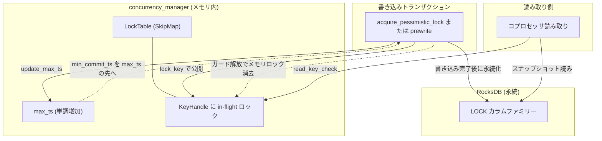

# 第15章 悲観ロックと concurrency_manager

> **本章で読むソース**
>
> - [`src/storage/txn/commands/acquire_pessimistic_lock.rs`](https://github.com/tikv/tikv/blob/v8.5.6/src/storage/txn/commands/acquire_pessimistic_lock.rs)
> - [`src/storage/txn/actions/acquire_pessimistic_lock.rs`](https://github.com/tikv/tikv/blob/v8.5.6/src/storage/txn/actions/acquire_pessimistic_lock.rs)
> - [`components/concurrency_manager/src/lib.rs`](https://github.com/tikv/tikv/blob/v8.5.6/components/concurrency_manager/src/lib.rs)
> - [`components/concurrency_manager/src/lock_table.rs`](https://github.com/tikv/tikv/blob/v8.5.6/components/concurrency_manager/src/lock_table.rs)
> - [`components/concurrency_manager/src/key_handle.rs`](https://github.com/tikv/tikv/blob/v8.5.6/components/concurrency_manager/src/key_handle.rs)
> - [`src/storage/lock_manager/mod.rs`](https://github.com/tikv/tikv/blob/v8.5.6/src/storage/lock_manager/mod.rs)
> - [`src/storage/txn/actions/prewrite.rs`](https://github.com/tikv/tikv/blob/v8.5.6/src/storage/txn/actions/prewrite.rs)

## この章の狙い

TiDB の悲観的トランザクションは、SQL の文を実行するたびに、書き換える行へ先にロックを取る。
このロックは2相コミットのプリライトより前に取られ、書き込み衝突をプリライトを待たずに検出する。
本章はこの**悲観ロック**の取得を、コマンド層と MVCC アクション層の両方から読む。

もう1つの主題は、メモリ内のロックテーブルである**concurrency_manager**である。
async commit と1相コミット（1PC）では、コミットのタイムスタンプを TiKV が自分で決める。
その決定を安全にするため、まだ KV エンジンへ書かれていないロックをメモリ上で公開し、`max_ts` という単調増加の値を保つ。
このメモリロックを読み取り側が検査する経路は第18章のコプロセッサで扱う。

第13章はプリライト、第14章はコミットと MVCC 読み取りを扱った。
本章はその手前で、文の実行ごとに取る悲観ロックと、コミットタイムスタンプ決定の土台になるメモリロックテーブルを読む。

## 前提

TiKV のトランザクションは Percolator を下敷きにした2相コミットであり、ロックは `LOCK` カラムファミリーへ書かれる。
この MVCC のエンコードは第12章で扱った。
楽観的トランザクションがプリライトで初めてロックを取るのに対し、悲観的トランザクションは文の実行時に行ロックを先取りする。

本章で読むコードは2つの層に分かれる。
コマンド層 `AcquirePessimisticLock` は、スケジューラから渡る1リクエスト分の複数キーを順に処理し、ロック衝突時の待機や応答の組み立てを担う。
アクション層 `acquire_pessimistic_lock` は、1キーに対する MVCC 上のロック取得そのものを実装する。
コード引用はすべて tikv/tikv のタグ `v8.5.6` に固定する。

## 悲観ロックの取得：1キーへのロックと衝突検出

アクション層の入口は `acquire_pessimistic_lock` である。
1つのキーに対し、書き込み衝突を検査し、問題がなければ悲観ロックを `LOCK` カラムファミリーへ書く操作をまとめる。

[`src/storage/txn/actions/acquire_pessimistic_lock.rs` L44-L82](https://github.com/tikv/tikv/blob/v8.5.6/src/storage/txn/actions/acquire_pessimistic_lock.rs#L44-L82)

```rust
pub fn acquire_pessimistic_lock<S: Snapshot>(
    txn: &mut MvccTxn,
    reader: &mut SnapshotReader<S>,
    key: Key,
    primary: &[u8],
    should_not_exist: bool,
    lock_ttl: u64,
    mut for_update_ts: TimeStamp,
    need_value: bool,
    need_check_existence: bool,
    min_commit_ts: TimeStamp,
    need_old_value: bool,
    lock_only_if_exists: bool,
    allow_lock_with_conflict: bool,
    is_shared_lock_req: bool,
) -> MvccResult<(PessimisticLockKeyResult, OldValue)> {
    fail_point!("acquire_pessimistic_lock", |err| Err(
        crate::storage::mvcc::txn::make_txn_error(err, &key, reader.start_ts).into()
    ));
    if lock_only_if_exists && !need_value {
        error!(
            "lock_only_if_exists of a pessimistic lock request is set to true, but return_value is not";
            "start_ts" => reader.start_ts,
            "key" => log_wrappers::Value::key(key.as_encoded()),
        );
        return Err(ErrorInner::LockIfExistsFailed {
            start_ts: reader.start_ts,
            key: key.into_raw()?,
        }
        .into());
    }
    // If any of `should_not_exist`, `need_value`, `need_check_existence` is set,
    // it infers a read to the value, in which case max_ts need to be updated to
    // guarantee the linearizability and snapshot isolation.
    if should_not_exist || need_value || need_check_existence {
        txn.concurrency_manager.update_max_ts(for_update_ts, || {
            format!("pessimistic_lock-{}-{}", reader.start_ts, for_update_ts)
        })?;
    }
```

引数 `for_update_ts` は、この文が読んだデータのコミットタイムスタンプである。
悲観的トランザクションの分離レベルは Read Committed であり、文ごとに最新のスナップショットを読み直すため、トランザクション開始時の `start_ts` ではなくこの `for_update_ts` で衝突を判定する。

最後の `if` が concurrency_manager と接続する箇所である。
このロック取得が値の読み取りを伴うとき（`should_not_exist` や `need_value` などが立つとき）、メモリ内の `max_ts` を `for_update_ts` まで押し上げる。
読み取り時刻を `max_ts` に反映させておくことが、後のコミットタイムスタンプ決定で線形化可能性とスナップショット分離を保つ前提になる。
この理由は本章の後半で扱う。

衝突検出の核心は、キーの最新の書き込み記録を探し、そのコミットタイムスタンプを `for_update_ts` と比べる箇所である。

[`src/storage/txn/actions/acquire_pessimistic_lock.rs` L161-L194](https://github.com/tikv/tikv/blob/v8.5.6/src/storage/txn/actions/acquire_pessimistic_lock.rs#L161-L194)

```rust
    if let Some((commit_ts, write)) = reader.seek_write(&key, TimeStamp::max())? {
        // Find a previous write.
        if need_old_value {
            prev_write = Some(write.clone());
        }

        // The isolation level of pessimistic transactions is RC. `for_update_ts` is
        // the commit_ts of the data this transaction read. If exists a commit version
        // whose commit timestamp is larger than current `for_update_ts`, the
        // transaction should retry to get the latest data.
        if commit_ts > for_update_ts {
            MVCC_CONFLICT_COUNTER
                .acquire_pessimistic_lock_conflict
                .inc();
            if allow_lock_with_conflict {
                // TODO: New metrics.
                conflict_info = Some(ConflictInfo {
                    conflict_start_ts: write.start_ts,
                    conflict_commit_ts: commit_ts,
                });
                for_update_ts = commit_ts;
                need_load_value = true;
            } else {
                return Err(ErrorInner::WriteConflict {
                    start_ts: reader.start_ts,
                    conflict_start_ts: write.start_ts,
                    conflict_commit_ts: commit_ts,
                    key: key.into_raw()?,
                    primary: primary.to_vec(),
                    reason: WriteConflictReason::PessimisticRetry,
                }
                .into());
            }
        }
```

`seek_write` がこのキーの直近のコミット済み書き込みを返す。
そのコミットタイムスタンプが `for_update_ts` より新しければ、この文が読んだ後に別のトランザクションがコミットしている。
このとき `allow_lock_with_conflict` が立っていなければ `WriteConflict` を返し、TiDB は新しいタイムスタンプで文を再試行する。
プリライトを待たずにこの段階で衝突を返せることが、悲観ロックが「書き込み衝突を早く検出する」と言われる理由である。

衝突がなければ、悲観ロックを組み立てて `LOCK` カラムファミリーへの書き込みに積む。

[`src/storage/txn/actions/acquire_pessimistic_lock.rs` L292-L321](https://github.com/tikv/tikv/blob/v8.5.6/src/storage/txn/actions/acquire_pessimistic_lock.rs#L292-L321)

```rust
    let lock = PessimisticLock {
        primary: primary.into(),
        start_ts: reader.start_ts,
        ttl: lock_ttl,
        for_update_ts,
        min_commit_ts,
        last_change,
        is_locked_with_conflict: conflict_info.is_some(),
    };

    // When lock_only_if_exists is false, always acquire pessimistic lock, otherwise
    // do it when val exists
    if is_shared_lock_req {
        let (mut shared_locks, is_new) = match current_shared_locks {
            Some(l) => (l, false),
            None => (SharedLocks::new(), true),
        };
        shared_locks
            .insert_lock(lock.into_lock())
            .map_err(MvccError::from)?;
        txn.put_shared_locks(key, &shared_locks, is_new);
    } else if !lock_only_if_exists || val.is_some() {
        txn.put_pessimistic_lock(key, lock, true);
    } else if let Some(conflict_info) = conflict_info {
        return Err(conflict_info.into_write_conflict_error(
            reader.start_ts,
            primary.to_vec(),
            key.into_raw()?,
        ));
    }
```

`PessimisticLock` は `for_update_ts` と `min_commit_ts` を保持する。
`txn.put_pessimistic_lock` は、この悲観ロックを `txn` の書き込みバッチへ積む。
実際の RocksDB への永続化は、コマンド層が返した `WriteResult` をスケジューラが書き出すときに起きる。

## コマンド層：複数キーの処理とロック待機

コマンド層 `AcquirePessimisticLock::process_write` は、1リクエストに含まれる複数キーを順に `acquire_pessimistic_lock` へ渡す。
注目するのは、あるキーが他トランザクションのロックに当たったときの分岐である。

[`src/storage/txn/commands/acquire_pessimistic_lock.rs` L104-L154](https://github.com/tikv/tikv/blob/v8.5.6/src/storage/txn/commands/acquire_pessimistic_lock.rs#L104-L154)

```rust
        for (k, should_not_exist, is_shared_lock) in keys {
            match acquire_pessimistic_lock(
                &mut txn,
                &mut reader,
                k.clone(),
                &self.primary,
                should_not_exist,
                self.lock_ttl,
                self.for_update_ts,
                self.return_values,
                self.check_existence,
                self.min_commit_ts,
                need_old_value,
                self.lock_only_if_exists,
                self.allow_lock_with_conflict,
                is_shared_lock,
            ) {
                Ok((key_res, old_value)) => {
                    res.push(key_res);
                    // MutationType is unknown in AcquirePessimisticLock stage.
                    insert_old_value_if_resolved(&mut old_values, k, txn.start_ts, old_value, None);
                }
                Err(MvccError(box MvccErrorInner::KeyIsLocked(lock_info))) => {
                    let request_parameters = PessimisticLockParameters {
                        pb_ctx: ctx.clone(),
                        primary: self.primary.clone(),
                        start_ts,
                        lock_ttl: self.lock_ttl,
                        for_update_ts: self.for_update_ts,
                        wait_timeout: self.wait_timeout,
                        return_values: self.return_values,
                        min_commit_ts: self.min_commit_ts,
                        check_existence: self.check_existence,
                        is_first_lock: self.is_first_lock,
                        lock_only_if_exists: self.lock_only_if_exists,
                        allow_lock_with_conflict: self.allow_lock_with_conflict,
                    };
                    let lock_info = WriteResultLockInfo::new(
                        lock_info,
                        request_parameters,
                        k,
                        should_not_exist,
                        is_shared_lock,
                    );
                    encountered_locks.push(lock_info);
                    // Do not lock previously succeeded keys.
                    txn.clear();
                    res.0.clear();
                    res.push(PessimisticLockKeyResult::Waiting);
                    break;
                }
```

`acquire_pessimistic_lock` が他トランザクションのロックを見つけると `KeyIsLocked` を返す。
コマンド層はこのとき、それまでに成功したキーのロックも捨て（`txn.clear()`）、結果を `Waiting` にして処理を打ち切る。
取りかけのロックを破棄するのは、リクエスト全体が待機に入る以上、一部のキーだけロックを残すと中途半端な状態が残るためである。

待つかどうかは `wait_timeout` で決まる。

[`src/storage/txn/commands/acquire_pessimistic_lock.rs` L179-L193](https://github.com/tikv/tikv/blob/v8.5.6/src/storage/txn/commands/acquire_pessimistic_lock.rs#L179-L193)

```rust
        if !encountered_locks.is_empty() && self.wait_timeout.is_none() {
            // Mind the difference of the protocols of legacy requests and resumable
            // requests. For resumable requests (allow_lock_with_conflict ==
            // true), key errors are considered key by key instead of for the
            // whole request.
            let lock_info = encountered_locks.drain(..).next().unwrap().lock_info_pb;
            let err = StorageError::from(Error::from(MvccError::from(
                MvccErrorInner::KeyIsLocked(lock_info),
            )));
            if self.allow_lock_with_conflict {
                res.as_mut().unwrap().0[0] = PessimisticLockKeyResult::Failed(err.into())
            } else {
                res = Err(err)
            }
        }
```

`wait_timeout` が `None` なら待たずに `KeyIsLocked` を返す。
`Some` なら `encountered_locks` を `WriteResult` に載せて返し、スケジューラがそれを `LockManager` へ渡して待機列に入れる。

## ロック待機とデッドロック検出

`LockManager` トレイトは、ロックを取れずに待つトランザクションを管理し、デッドロックを検出する責務を持つ。

[`src/storage/lock_manager/mod.rs` L121-L168](https://github.com/tikv/tikv/blob/v8.5.6/src/storage/lock_manager/mod.rs#L121-L168)

```rust
/// `LockManager` manages transactions waiting for locks held by other
/// transactions. It has responsibility to handle deadlocks between
/// transactions.
pub trait LockManager: Clone + Send + Sync + 'static {
    /// Allocates a token for identifying a specific lock-waiting relationship.
    /// Use this to allocate a token before invoking `wait_for`.
    ///
    /// Since some information required by `wait_for` need to be initialized by
    /// the token, allocating token is therefore separated to a single
    /// function instead of internally allocated in `wait_for`.
    fn allocate_token(&self) -> LockWaitToken;

    /// Transaction with `start_ts` waits for `lock` released.
    ///
    /// If the lock is released or waiting times out or deadlock occurs, the
    /// transaction should be waken up and call `cb` with `pr` to notify the
    /// caller.
    ///
    /// If the lock is the first lock the transaction waits for, it won't result
    /// in deadlock.
    fn wait_for(
        &self,
        token: LockWaitToken,
        region_id: u64,
        region_epoch: RegionEpoch,
        term: u64,
        start_ts: TimeStamp,
        wait_info: KeyLockWaitInfo,
        is_first_lock: bool,
        timeout: Option<WaitTimeout>,
        cancel_callback: CancellationCallback,
        diag_ctx: DiagnosticContext,
    );

    fn update_wait_for(&self, updated_items: Vec<UpdateWaitForEvent>);

    /// Remove a waiter specified by token.
    fn remove_lock_wait(&self, token: LockWaitToken);

    /// Returns true if there are waiters in the `LockManager`.
    ///
    /// This function is used to avoid useless calculation and wake-up.
    fn has_waiter(&self) -> bool {
        true
    }

    fn dump_wait_for_entries(&self, cb: waiter_manager::Callback);
}
```

`wait_for` は、`start_ts` のトランザクションが特定のロックの解放を待つことを登録する。
ロックが解放されるか、待機がタイムアウトするか、デッドロックが起きると、`cancel_callback` で待ちトランザクションが起こされる。
コメントが述べるとおり、待ち合わせが最初のロックなら、その待機がデッドロックを生むことはない。
本番実装の `LockManager` は、待ち合わせの関係をグラフとして集約し、循環を見つけるとデッドロックとして待機側を中断する。

待ち合わせ関係を表す `UpdateWaitForEvent`（旧称が `WaitForEntry` に当たる待機項目）は、トークンと `start_ts` とどのロックを待つかの情報を持つ。

[`src/storage/lock_manager/mod.rs` L113-L119](https://github.com/tikv/tikv/blob/v8.5.6/src/storage/lock_manager/mod.rs#L113-L119)

```rust
#[derive(Debug)]
pub struct UpdateWaitForEvent {
    pub token: LockWaitToken,
    pub start_ts: TimeStamp,
    pub is_first_lock: bool,
    pub wait_info: KeyLockWaitInfo,
}
```

## concurrency_manager：メモリ内ロックテーブル

ここから concurrency_manager を読む。
モジュールのドキュメントコメントが、その役割を簡潔に述べている。

[`components/concurrency_manager/src/lib.rs` L3-L11](https://github.com/tikv/tikv/blob/v8.5.6/components/concurrency_manager/src/lib.rs#L3-L11)

```rust
//! The concurrency manager is responsible for concurrency control of
//! transactions.
//!
//! The concurrency manager contains a lock table in memory. Lock information
//! can be stored in it and reading requests can check if these locks block
//! the read.
//!
//! In order to mutate the lock of a key stored in the lock table, it needs
//! to be locked first using `lock_key` or `lock_keys`.
```

`ConcurrencyManager` は2つの状態を持つ。
キーごとのロックを保持する `lock_table` と、観測された最大タイムスタンプ `max_ts` である。

[`components/concurrency_manager/src/lib.rs` L86-L107](https://github.com/tikv/tikv/blob/v8.5.6/components/concurrency_manager/src/lib.rs#L86-L107)

```rust
#[derive(Clone)]
pub struct ConcurrencyManager {
    max_ts: Arc<AtomicU64>,
    lock_table: LockTable,

    // max_ts_limit and its update time.
    //
    // max_ts_limit is an assertion: max_ts should not be updated to a value greater than this
    // limit.
    //
    // When the limit is not updated for a long time(exceeding the threshold), we use an
    // approximate limit.
    max_ts_limit: Arc<AtomicCell<MaxTsLimit>>,
    limit_valid_duration: Duration,
    action_on_invalid_max_ts: Arc<AtomicActionOnInvalidMaxTs>,

    max_ts_drift_allowance_ms: Arc<AtomicU64>,

    tso: Option<Arc<dyn TSOProvider>>,

    time_provider: Arc<dyn TimeProvider>,
}
```

`max_ts` は `AtomicU64` で保たれ、`update_max_ts` で単調に押し上げる。

[`components/concurrency_manager/src/lib.rs` L185-L187](https://github.com/tikv/tikv/blob/v8.5.6/components/concurrency_manager/src/lib.rs#L185-L187)

```rust
    pub fn max_ts(&self) -> TimeStamp {
        TimeStamp::new(self.max_ts.load(Ordering::SeqCst))
    }
```

ロックテーブルへのアクセスは、キーごとのミューテックスを取ってから行う。
`lock_key` がそのミューテックスを表す RAII ガード `KeyHandleGuard` を返す。

[`components/concurrency_manager/src/lib.rs` L370-L377](https://github.com/tikv/tikv/blob/v8.5.6/components/concurrency_manager/src/lib.rs#L370-L377)

```rust
    /// Acquires a mutex of the key and returns an RAII guard. When the guard
    /// goes out of scope, the mutex will be unlocked.
    ///
    /// The guard can be used to store Lock in the table. The stored lock
    /// is visible to `read_key_check` and `read_range_check`.
    pub async fn lock_key(&self, key: &Key) -> KeyHandleGuard {
        self.lock_table.lock_key(key).await
    }
```

ガードに格納したロックは、読み取り側の `read_key_check` から見えるようになる。
この検査関数は、キーにメモリロックがあるとき `check_fn` を呼び、それが読み取りをブロックするロックか判定する。

[`components/concurrency_manager/src/lib.rs` L396-L407](https://github.com/tikv/tikv/blob/v8.5.6/components/concurrency_manager/src/lib.rs#L396-L407)

```rust
    /// Checks if there is a memory lock of the key which blocks the read.
    /// The given `check_fn` should return false iff the lock passed in
    /// blocks the read.
    pub fn read_key_check<E>(
        &self,
        key: &Key,
        check_fn: impl FnOnce(&Lock) -> Result<(), E>,
    ) -> Result<(), E> {
        let res = self.lock_table.check_key(key, check_fn);
        fail_point!("cm_after_read_key_check");
        res
    }
```

### LockTable と KeyHandle

`LockTable` の実体は、キーから `KeyHandle` への弱参照を持つ並行スキップリストである。

[`components/concurrency_manager/src/lock_table.rs` L13-L20](https://github.com/tikv/tikv/blob/v8.5.6/components/concurrency_manager/src/lock_table.rs#L13-L20)

```rust
#[derive(Clone)]
pub struct LockTable(pub Arc<SkipMap<Key, Weak<KeyHandle>>>);

impl Default for LockTable {
    fn default() -> Self {
        LockTable(Arc::new(SkipMap::new()))
    }
}
```

弱参照（`Weak`）にしているのが、このテーブルの後始末を自動化する工夫である。
`KeyHandle` が `KeyHandleGuard` を介して使われている間は強参照が生き、テーブルからは弱参照で辿れる。
最後の強参照が落ちると `KeyHandle` の `Drop` が走り、自分をテーブルから取り除く。

[`components/concurrency_manager/src/key_handle.rs` L54-L63](https://github.com/tikv/tikv/blob/v8.5.6/components/concurrency_manager/src/key_handle.rs#L54-L63)

```rust
impl Drop for KeyHandle {
    fn drop(&mut self) {
        // SAFETY: `&mut self` ensures it's the only thread that can access `table`.
        unsafe {
            if let Some(table) = &*self.table.get() {
                table.remove(&self.key);
            }
        }
    }
}
```

メモリロックそのものを片付ける契機は、もう一段早い。
`KeyHandleGuard` が落ちた時点で、格納していたロックを `None` に戻す。

[`components/concurrency_manager/src/key_handle.rs` L91-L98](https://github.com/tikv/tikv/blob/v8.5.6/components/concurrency_manager/src/key_handle.rs#L91-L98)

```rust
impl Drop for KeyHandleGuard {
    fn drop(&mut self) {
        // We only keep the lock in memory until the write to the underlying
        // store finishes.
        // The guard can be released after finishes writing.
        *self.handle.lock_store.lock() = None;
    }
}
```

コメントが述べるとおり、メモリロックは下層ストアへの書き込みが終わるまでだけ保持する。
KV への書き込みが終わればガードを落としてよく、その時点でメモリロックは消える。
in-flight の期間だけメモリに公開し、永続化が済めば KV 側のロックが同じ役目を引き継ぐ。

## async commit と1PC：メモリロックで in-flight を公開する

ここまでの部品が噛み合うのが async commit と1PC のプリライトである。
通常の2相コミットでは、コミットタイムスタンプは PD から取り直す。
async commit と1PC では、TiKV がプリライト時に自分で `min_commit_ts` を決める。

その決定を読むのがプリライトの `async_commit_timestamps` である。

[`src/storage/txn/actions/prewrite.rs` L937-L946](https://github.com/tikv/tikv/blob/v8.5.6/src/storage/txn/actions/prewrite.rs#L937-L946)

```rust
) -> Result<TimeStamp> {
    // This operation should not block because the latch makes sure only one thread
    // is operating on this key.
    let key_guard = ::futures_executor::block_on(txn.concurrency_manager.lock_key(key));

    let final_min_commit_ts = key_guard.with_lock(|l| {
        let max_ts = txn.concurrency_manager.max_ts();
        fail_point!("before-set-lock-in-memory");
        let min_commit_ts = cmp::max(cmp::max(max_ts, start_ts), for_update_ts).next();
        let min_commit_ts = cmp::max(lock.min_commit_ts, min_commit_ts);
```

ここで2つのことが同時に起きる。
1つは、`min_commit_ts` を concurrency_manager の `max_ts` より大きく取ることである（`max_ts.next()` 以上にする）。
`max_ts` には、読み取り側が観測した最大タイムスタンプが反映されている。
コミットタイムスタンプをそれより後ろに置くことで、すでに完了した読み取りより前にこのトランザクションが割り込んで見えることがなくなり、スナップショット分離が保たれる。

もう1つは、確定した `min_commit_ts` を持つロックを、`key_guard.with_lock` でメモリロックテーブルへ書き込むことである。

[`src/storage/txn/actions/prewrite.rs` L973-L978](https://github.com/tikv/tikv/blob/v8.5.6/src/storage/txn/actions/prewrite.rs#L973-L978)

```rust
        lock.min_commit_ts = min_commit_ts;
        *l = Some(lock.clone());
        Ok(min_commit_ts)
    })?;

    txn.guards.push(key_guard);
```

`*l = Some(lock.clone())` で、まだ RocksDB に書かれていないロックをメモリに公開する。
ガードは `txn.guards` に退避され、KV への書き込みが終わるまで保持される。
この間に同じキーを読もうとするコプロセッサや別トランザクションは、`read_key_check` でこのメモリロックに気付ける。

逆向きの安全も `update_max_ts` が担う。
プリライトは、`should_not_exist`（INSERT）を伴うときに `max_ts` を `start_ts` まで押し上げる。

[`src/storage/txn/actions/prewrite.rs` L71-L78](https://github.com/tikv/tikv/blob/v8.5.6/src/storage/txn/actions/prewrite.rs#L71-L78)

```rust
    // Update max_ts for Insert operation to guarantee linearizability and snapshot
    // isolation
    if mutation.should_not_exist {
        txn.concurrency_manager
            .update_max_ts(txn_props.start_ts, || {
                format!("prewrite-{}", txn_props.start_ts)
            })?;
    }
```

悲観ロック取得が読み取りを伴うときに `max_ts` を押し上げたのと同じ仕組みである。
読み取りが起きた時刻を `max_ts` に積んでおき、後続のコミットタイムスタンプをその先へ追い出す。
この往復で、メモリロックの公開と `max_ts` の単調性が組み合わさり、KV への書き込み前でも衝突が見えるようになる。

## 高速化の工夫：KV 書き込み前にロックを公開する

本章で読んだ機構の要点は、in-flight のロックをメモリで先に公開することである。

通常の2相コミットなら、ロックは `LOCK` カラムファミリーへ書かれて初めて他者から見える。
async commit と1PC では、TiKV がコミットタイムスタンプを自分で決めるため、決定の瞬間から永続化までの隙間に、そのロックを見落とした読み取りが過去に滑り込む危険がある。
concurrency_manager は、この隙間を `lock_key` で取ったメモリロックで埋める。

利点は、コミットタイムスタンプ決定を PD への往復なしにローカルで完結できることである。
メモリロックと `max_ts` だけでスナップショット分離を保てるため、async commit はコミットの一往復ぶんのレイテンシを削れる。
コストは、読み取り側がメモリロックテーブルを必ず検査しなければならない点だが、その検査は並行スキップリスト上の1キー参照で済み、ロックが無ければほぼ素通りする。



## まとめ

悲観ロックは、文の実行ごとにキーへロックを取り、`seek_write` で最新のコミットを `for_update_ts` と比べて書き込み衝突をプリライト前に検出する。
他トランザクションのロックに当たれば `KeyIsLocked` となり、`wait_timeout` に応じて `LockManager` の待機列へ入り、待ち合わせグラフからデッドロックが検出される。

concurrency_manager は、キーごとのメモリロックを保つ `LockTable` と、観測された最大タイムスタンプ `max_ts` を持つ。
async commit と1PC では、プリライトが `lock_key` でメモリロックを公開し、`max_ts` の先に `min_commit_ts` を取ることで、KV への書き込み前でも読み取りや他トランザクションが衝突を検知できる。
メモリロックは下層ストアへの書き込みが終わるまでだけ保持され、永続化後は KV 側のロックが同じ役目を引き継ぐ。

## 関連する章

- [第12章 MVCC のエンコード](12-mvcc-encoding.md)：ロックが書かれる `LOCK` カラムファミリーと MVCC のエンコードを扱う。
- [第13章 Prewrite（第1相）](13-prewrite.md)：本章で読んだ `async_commit_timestamps` を含むプリライト全体を扱う。
- [第14章 Commit と MVCC 読み取り](14-commit-and-read.md)：悲観ロックを持つトランザクションのコミットと読み取りを扱う。
- [第18章 コプロセッサ](../part04-coprocessor/18-coprocessor.md)：`read_key_check` でメモリロックを検査する読み取り側を扱う。
- [第20章 スケジューラと latch](../part05-ops/20-scheduler-and-latch.md)：コマンドを直列化する latch と、`WriteResult` の書き出しを扱う。
