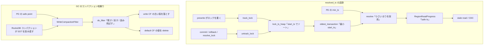

# 第16章 resolved_ts と GC

> **本章で読むソース**
>
> - [`components/resolved_ts/src/resolver.rs`](https://github.com/tikv/tikv/blob/v8.5.6/components/resolved_ts/src/resolver.rs)
> - [`src/storage/txn/commands/resolve_lock.rs`](https://github.com/tikv/tikv/blob/v8.5.6/src/storage/txn/commands/resolve_lock.rs)
> - [`src/storage/txn/actions/gc.rs`](https://github.com/tikv/tikv/blob/v8.5.6/src/storage/txn/actions/gc.rs)
> - [`src/server/gc_worker/gc_worker.rs`](https://github.com/tikv/tikv/blob/v8.5.6/src/server/gc_worker/gc_worker.rs)
> - [`src/server/gc_worker/compaction_filter.rs`](https://github.com/tikv/tikv/blob/v8.5.6/src/server/gc_worker/compaction_filter.rs)

## この章の狙い

第12章から第15章までで、トランザクションがキーに何を書き、それをどう読むかを追った。
プリライトはロックと値を書き、コミットは write CF にコミット版を追記し、読み取りは start_ts より前の最新コミット版を選ぶ。
この方式はキーを上書きせずに版を積み増していくため、放置すれば2種類のゴミが溜まり続ける。
1つは、コミットもロールバックもされないまま残ったロックである。
もう1つは、新しい版に隠れて二度と読まれない古い MVCC 版である。

本章は、この2種類のゴミを掃除する仕組みを読む。
前半は **resolved_ts** であり、各 Region で「この時刻以前のトランザクションはすべて決着済みだ」と言える時刻を追跡する。
これは未解決ロックの最小 start_ts から計算され、CDC や stale read の土台になる。
後半は **GC** であり、safe point より古い MVCC 版を削除する。
TiKV は GC を専用の走査として回すだけでなく、RocksDB のコンパクションに相乗りさせる。
この相乗りが本章で説明する最適化の工夫である。

## 前提

キーは write CF にコミット版を、default CF に長い値を、lock CF に未コミットのロックを持つ。
この3つの CF への振り分けは第12章で確定させた。
本章のコード引用はすべて tikv/tikv のタグ `v8.5.6` に固定する。

resolved_ts と GC は別々の機構だが、どちらも「未解決ロック」と「safe point」という2つの量に依存する。
resolved_ts は未解決ロックの最小 start_ts を下から押さえ、GC は safe point を上限として古い版を消す。
ロック解決（resolve lock）はこの両者の前提を整える操作であり、決着済みのトランザクションのロックを掃除して未解決ロックの集合から外す。

## resolved_ts が表す保証

resolved_ts は、ある Region について「この時刻以前に start_ts を持つコミットは、もう新たに発生しない」という保証を表す時刻である。
言い換えれば、resolved_ts までのスナップショットは確定済みであり、後から版が割り込んでこない。
`Resolver` 型のドキュメントコメントがこの保証を端的に述べている。

[`components/resolved_ts/src/resolver.rs` L76-L80](https://github.com/tikv/tikv/blob/v8.5.6/components/resolved_ts/src/resolver.rs#L76-L80)

```rust
// Resolver resolves timestamps that guarantee no more commit will happen before
// the timestamp.
pub struct Resolver {
    region_id: u64,
    // key -> start_ts
```

なぜ未解決ロックの最小 start_ts がこの保証を与えるのか。
TiKV の2相コミットでは、commit_ts は必ず start_ts より大きい。
ゆえに、いま追跡している未解決ロックのうち最小の start_ts を `m` とすれば、それらのトランザクションが将来コミットしても commit_ts は `m` 以上にしかならない。
まだ始まっていないトランザクションの start_ts は、TSO が単調増加するため `m` 以上の現在時刻より大きい。
したがって `m` より小さい時刻には、もう新しいコミットが割り込めない。
これが resolved_ts を「未解決ロックの最小 start_ts と PD の現在時刻の小さいほう」として計算する根拠である。

## ロックを追跡する Resolver

`Resolver` はロックの集合を2つのインデックスで保持する。
キーから start_ts を引く `locks_by_key` と、start_ts からその start_ts を持つロック群を引く `lock_ts_heap` である。
後者は `BTreeMap` なので、最小の start_ts を定数段で取り出せる。

[`components/resolved_ts/src/resolver.rs` L78-L86](https://github.com/tikv/tikv/blob/v8.5.6/components/resolved_ts/src/resolver.rs#L78-L86)

```rust
pub struct Resolver {
    region_id: u64,
    // key -> start_ts
    locks_by_key: HashMap<Arc<[u8]>, TimeStamp>,
    // start_ts -> locked keys.
    lock_ts_heap: BTreeMap<TimeStamp, TxnLocks>,
    // the start_ts and lock samples of large transactions, which use a different tracking strategy
    // from normal transactions.
    large_txns: HashMap<TimeStamp, TxnLocks>,
```

プリライトがロックを書くと `track_lock` が呼ばれ、コミットやロールバックがロックを消すと `untrack_lock` が呼ばれる。
`track_lock` は通常のトランザクションと大きいトランザクションを `generation` で振り分ける。
`generation` が0なら通常のトランザクションとして `track_normal_lock` で記録する。

[`components/resolved_ts/src/resolver.rs` L309-L335](https://github.com/tikv/tikv/blob/v8.5.6/components/resolved_ts/src/resolver.rs#L309-L335)

```rust
    pub fn track_lock(
        &mut self,
        start_ts: TimeStamp,
        key: Vec<u8>,
        index: Option<u64>,
        generation: u64, /* generation is used to identify whether the lock is a pipelined
                          * transaction's lock */
    ) -> Result<(), MemoryQuotaExceeded> {
        if let Some(index) = index {
            self.update_tracked_index(index);
        }
        debug!(
            "track lock {}@{}",
            &log_wrappers::Value::key(&key),
            start_ts;
            "region_id" => self.region_id,
            "memory_in_use" => self.memory_quota.in_use(),
            "memory_capacity" => self.memory_quota.capacity(),
            "generation" => generation,
        );
        if generation == 0 {
            self.track_normal_lock(start_ts, key)?;
        } else {
            self.track_large_txn_lock(start_ts, key)?;
        }
        Ok(())
    }
```

ロックの追跡は無制限ではない。
`track_normal_lock` は記録の前に `memory_quota` からバイト数を確保し、確保に失敗すれば `MemoryQuotaExceeded` を返す。
ロックの数が膨れた Region が1つあるだけでメモリを食い尽くす事態を、この割当てで防ぐ。

## resolved_ts を進める resolve

resolved_ts を実際に進めるのが `resolve` である。
追跡中の最小 start_ts を `oldest_transaction` で取り、PD から渡された `min_ts` と比べて小さいほうを新しい resolved_ts とする。

[`components/resolved_ts/src/resolver.rs` L435-L447](https://github.com/tikv/tikv/blob/v8.5.6/components/resolved_ts/src/resolver.rs#L435-L447)

```rust
        // Find the min start ts.
        let min_lock = self.oldest_transaction();
        let has_lock = min_lock.is_some();
        let min_txn_ts = min_lock.as_ref().map(|(ts, _)| *ts).unwrap_or(min_ts);

        // No more commit happens before the ts.
        let new_resolved_ts = cmp::min(min_txn_ts, min_ts);
        // reason is the min source of the new resolved ts.
        let reason = match (min_lock, min_ts) {
            (Some((lock_ts, txn_locks)), min_ts) if lock_ts < min_ts => TsSource::Lock(txn_locks),
            (Some(_), _) => source,
            (None, _) => source,
        };
```

未解決ロックが1つもなければ、resolved_ts は `min_ts` まで進む。
未解決ロックがあれば、その最小 start_ts で頭打ちになる。
古いロックが1つでも居座ると、その Region の resolved_ts はそこで止まる。
これは長時間ロックを掴んだトランザクションが stale read や CDC を遅らせる仕組みでもあり、ロック解決でロックを早く片付ける動機になる。

`resolve` の末尾は、計算した resolved_ts を `RegionReadProgress` に書き戻す。

[`components/resolved_ts/src/resolver.rs` L466-L472](https://github.com/tikv/tikv/blob/v8.5.6/components/resolved_ts/src/resolver.rs#L466-L472)

```rust
        // Resolved ts never decrease.
        self.resolved_ts = cmp::max(self.resolved_ts, new_resolved_ts);

        // Publish an `(apply index, safe ts)` item into the region read progress
        if let Some(rrp) = &self.read_progress {
            rrp.update_safe_ts_with_time(self.tracked_index, self.resolved_ts.into_inner(), now);
        }
```

resolved_ts は単調増加に保たれ、`cmp::max` で過去へ後退しない。
書き戻された安全な時刻（safe ts）を、stale read は読み取り可能な過去のスナップショットの境界として使う。
リース読みと ReadIndex を扱った第10章の `RegionReadProgress` が、ここで resolved_ts の受け皿になる。

## ロック解決でロックを片付ける

resolved_ts を進めるには、決着済みのトランザクションのロックを実際に掃除して未解決ロックの集合から外す必要がある。
これを担うのが `ResolveLock` コマンドである。
コマンドは start_ts からコミット結果への対応表 `txn_status` を受け取り、各ロックをコミットするかロールバックするかを決める。

[`src/storage/txn/commands/resolve_lock.rs` L104-L133](https://github.com/tikv/tikv/blob/v8.5.6/src/storage/txn/commands/resolve_lock.rs#L104-L133)

```rust
            let released = if commit_ts.is_zero() {
                cleanup(
                    &mut txn,
                    &mut reader,
                    current_key.clone(),
                    TimeStamp::zero(),
                    false,
                )?
            } else if commit_ts > current_lock.ts {
                // Continue to resolve locks if the not found committed locks are pessimistic
                // type. They could be left if the transaction is finally committed and
                // pessimistic conflict retry happens during execution.
                match commit(&mut txn, &mut reader, current_key.clone(), commit_ts) {
                    Ok(res) => {
                        known_txn_status.push((current_lock.ts, commit_ts));
                        res
                    }
                    Err(MvccError(box MvccErrorInner::TxnLockNotFound { .. }))
                        if current_lock.is_pessimistic_lock() =>
                    {
                        None
                    }
                    Err(err) => return Err(err.into()),
                }
            } else {
                return Err(Error::from(ErrorInner::InvalidTxnTso {
                    start_ts: current_lock.ts,
                    commit_ts,
                }));
            };
```

`txn_status` でコミット結果が0なら、そのトランザクションはロールバック済みなので `cleanup` でロックを消す。
0でない commit_ts を持つなら、`commit` でロックをコミット版に変える。
どちらの経路でもロックが消えるため、次回の `resolve` ではそのトランザクションが未解決ロックから外れ、resolved_ts が先へ進める。
コミット結果は GC に先立つ走査で、ロックのプライマリキーを引いて確定させる。

## GC が消すもの

GC は safe point より古い MVCC 版を消す。
safe point は PD が管理する時刻で、これより前を読むトランザクションはもう存在しないと保証される下限である。
1つのキーについて、どの版を消してよいかを判断するのが `gc` アクションの状態機械である。

[`src/storage/txn/actions/gc.rs` L99-L122](https://github.com/tikv/tikv/blob/v8.5.6/src/storage/txn/actions/gc.rs#L99-L122)

```rust
    fn step(&mut self, gc: &mut Gc<'_, impl Snapshot>, write: Write, commit_ts: TimeStamp) {
        match self {
            State::Rewind(safe_point) => {
                if commit_ts <= *safe_point {
                    *self = State::RemoveIdempotent;
                    self.step(gc, write, commit_ts);
                }
            }
            State::RemoveIdempotent => match write.write_type {
                WriteType::Put => {
                    *self = State::RemoveAll(None);
                }
                WriteType::Delete => {
                    *self = State::RemoveAll(Some((commit_ts, write)));
                }
                WriteType::Rollback | WriteType::Lock => {
                    gc.delete_write(write, commit_ts);
                }
            },
            State::RemoveAll(_) => {
                gc.delete_write(write, commit_ts);
            }
        }
    }
```

状態機械は、新しい版から順に走査する。
safe point より新しい版は `Rewind` のまま読み飛ばし、保持する。
safe point 以下に達して最初に現れる `Put` または `Delete` の版が、その時点で読まれる版なので残す。
それより古い版はすべて不要として `RemoveAll` で消す。
safe point 以下にある `Rollback` と `Lock` は読み取りに使われないため、`Put` や `Delete` を待たずに `RemoveIdempotent` の段階で消す。

write CF の版を消すとき、default CF にある長い値も一緒に消す必要がある。
`delete_write` がこの2つの CF への削除をまとめて発行する。

[`src/storage/txn/actions/gc.rs` L50-L56](https://github.com/tikv/tikv/blob/v8.5.6/src/storage/txn/actions/gc.rs#L50-L56)

```rust
    fn delete_write(&mut self, write: Write, ts: TimeStamp) {
        self.txn.delete_write(self.key.clone(), ts);
        if write.write_type == WriteType::Put && write.short_value.is_none() {
            self.txn.delete_value(self.key.clone(), write.start_ts);
        }
        self.info.deleted_versions += 1;
    }
```

`short_value` を持たない `Put` は値が default CF にあるため、`delete_value` で default CF の値も消す。
短い値は write CF のレコードに埋め込まれているので、write CF の削除だけで済む。

## コンパクションフィルタによる GC

ここまでの `gc` アクションは、GC worker がキーを1つずつ走査して呼び出す経路である。
この経路は確実だが、GC のためだけにデータ全体を読み直す I/O を払う。
RocksDB は LSM-tree であり、コンパクションが定期的に SST を読み直してマージし直す。
TiKV はこのコンパクションに GC を相乗りさせ、走査の I/O を二重に払わずに古い版を落とす。
RocksDB のコンパクションの仕組みは [RocksDB 編の第31章](../../../rocksdb/part05-compaction/31-compaction-job.md)が扱う。
TiKV はその RocksDB のフォークを使い、コンパクション時に呼ばれるコールバックとして `WriteCompactionFilter` を差し込む。

相乗りの核は `do_filter` である。
コンパクションが write CF の各レコードに対してこのフィルタを呼び、フィルタが「残す」「消す」「ここまで読み飛ばして消す」のいずれかを返す。

[`src/server/gc_worker/compaction_filter.rs` L510-L548](https://github.com/tikv/tikv/blob/v8.5.6/src/server/gc_worker/compaction_filter.rs#L510-L548)

```rust
        let mut filtered = self.remove_older;
        let write = parse_write(value)?;
        if !self.remove_older {
            match write.write_type {
                WriteType::Rollback | WriteType::Lock => {
                    self.mvcc_rollback_and_locks += 1;
                    filtered = true;
                }
                WriteType::Put => self.remove_older = true,
                WriteType::Delete => {
                    self.remove_older = true;
                    if self.is_bottommost_level {
                        self.mvcc_deletion_overlaps = Some(0);
                        GC_COMPACTION_FILTER_MVCC_DELETION_MET
                            .with_label_values(&[STAT_TXN_KEYMODE])
                            .inc();
                    }
                }
            }
        }

        if !filtered {
            return Ok(CompactionFilterDecision::Keep);
        }
        self.filtered += 1;
        self.handle_filtered_write(write)?;
        self.flush_pending_writes_if_need(false /* force */)?;
        let decision = if self.remove_older {
            // Use `Decision::RemoveAndSkipUntil` instead of `Decision::Remove` to avoid
            // leaving tombstones, which can only be freed at the bottommost level.
            debug_assert!(commit_ts > 0);
            let prefix = Key::from_encoded_slice(mvcc_key_prefix);
            let skip_until = prefix.append_ts((commit_ts - 1).into()).into_encoded();
            CompactionFilterDecision::RemoveAndSkipUntil(skip_until)
        } else {
            CompactionFilterDecision::Remove
        };
        Ok(decision)
    }
```

判定の論理は `gc` アクションの状態機械と同じである。
キーの最初の `Put` か `Delete` に出会うと `remove_older` を立て、それより古い版をすべて消す。
`remove_older` が立つ前の `Rollback` と `Lock` も消す。
消すと決めた版が default CF に値を持つなら、`handle_filtered_write` がその値を `write_batch` に積み、まとめて削除する。

このフィルタの効くところは2つある。
1つは、`RemoveAndSkipUntil` を返して同じキーの古い版を一気に読み飛ばす点である。
コンパクションのイテレータがそのキーの残りの版を1件ずつ判定せずに飛び越すため、無駄な判定が減る。
コメントが述べるとおり、`Remove` でトゥームストーンを残すと最下層に達するまで解放できないので、それを避ける狙いもある。

もう1つの効きどころが、走査の I/O を二重に払わない点である。
コンパクションはどのみち SST を読み直してマージし直す。
その読み直しのついでに古い版を落とせば、GC のためだけにデータを読む走査が要らない。
default CF の値削除も、フィルタが直接 RocksDB へ書き込むため別経路の走査を起こさない。

ただしコンパクションフィルタはいつでも有効なわけではない。
フィルタを生成する `create_compaction_filter` は、safe point が未初期化なら生成を諦める。

[`src/server/gc_worker/compaction_filter.rs` L219-L224](https://github.com/tikv/tikv/blob/v8.5.6/src/server/gc_worker/compaction_filter.rs#L219-L224)

```rust
        let safe_point = gc_context.safe_point.load(Ordering::Relaxed);
        if safe_point == 0 {
            // Safe point has not been initialized yet.
            debug!("skip gc in compaction filter because of no safe point");
            return None;
        }
```

safe point が0、つまり未初期化なら、消してよい版の上限が決まらないので GC をせずにコンパクションだけ通す。
DB が詰まっているときや設定で無効化されているときも、同様にフィルタを生成しない。
default CF の孤児版がフィルタで処理しきれない場合は、`GcTask` として GC worker へ回す経路が残っており、コンパクションを止めない設計になっている。

## resolved_ts と GC の流れ

resolved_ts の追跡と GC のコンパクション相乗りを1つの図にまとめる。



左の流れがロックの増減から resolved_ts を導き、stale read と CDC に渡すまでを表す。
右の流れが safe point を上限としてコンパクションのついでに古い版を落とすまでを表す。
2つの機構は別物だが、未解決ロックと safe point という同じ2つの時刻を境界として、片や読み取りの下限を、片や削除の上限を定める。

## 高速化の工夫

本章で説明した最適化は、GC をコンパクションフィルタに統合した点である。
素朴な GC はキーを1件ずつ走査して古い版を読み、削除を発行するため、データ全体を読む I/O を GC のために改めて払う。
TiKV は RocksDB のフォークが持つコンパクションフィルタに GC の判定を差し込み、コンパクションが SST を読み直すその同じ読み出しの中で古い版を落とす。
コンパクションは LSM-tree の運用上どのみち定期的に走るので、GC の読み出し I/O はその中に吸収され、二重には掛からない。
さらに `RemoveAndSkipUntil` で同じキーの古い版を一括して読み飛ばすため、版ごとの判定とトゥームストーンの蓄積も抑える。

## まとめ

resolved_ts は、未解決ロックの最小 start_ts と PD の現在時刻の小さいほうとして、Region ごとに「これ以前のコミットはもう発生しない」時刻を追う。
`Resolver` がロックを `lock_ts_heap` で管理し、`resolve` が最小 start_ts を取り出して resolved_ts を進め、`RegionReadProgress` を通じて stale read と CDC に渡す。
ロック解決は決着済みトランザクションのロックを掃除し、resolved_ts が先へ進む前提を整える。
GC は safe point より古い MVCC 版を消し、write CF の重複版と default CF の値を `delete_write` でまとめて削除する。
その GC をコンパクションフィルタに統合することで、コンパクションの読み出しに相乗りし、走査の I/O を二重に払わずに古い版を落とす。

## 関連する章

- [第12章 MVCC のエンコード](12-mvcc-encoding.md)：write CF と default CF と lock CF の役割、版のエンコード。
- [第14章 Commit と MVCC 読み取り](14-commit-and-read.md)：コミット版の追記と、start_ts から版を選ぶ読み取り。
- [第5章 RocksDB 統合とカラムファミリ](../part01-engine/05-engine-rocks-and-cf.md)：CF の構成と RocksDB のフォークの統合。
- [RocksDB 編 第31章 CompactionJob と CompactionIterator](../../../rocksdb/part05-compaction/31-compaction-job.md)：コンパクションフィルタが呼ばれるコンパクションの本体。
