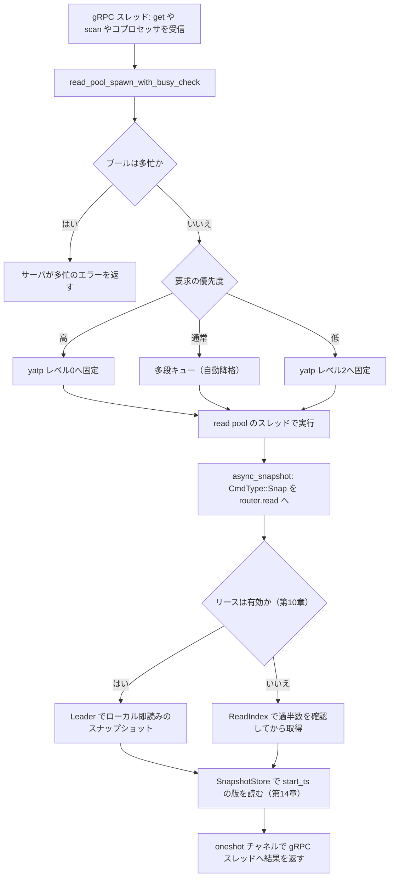

# 第17章 read pool とスナップショット読み取り

> **本章で読むソース**
>
> - [`src/read_pool.rs`](https://github.com/tikv/tikv/blob/v8.5.6/src/read_pool.rs)
> - [`src/storage/mod.rs`](https://github.com/tikv/tikv/blob/v8.5.6/src/storage/mod.rs)
> - [`src/coprocessor/readpool_impl.rs`](https://github.com/tikv/tikv/blob/v8.5.6/src/coprocessor/readpool_impl.rs)
> - [`src/server/raftkv/mod.rs`](https://github.com/tikv/tikv/blob/v8.5.6/src/server/raftkv/mod.rs)
> - [`components/tikv_kv/src/lib.rs`](https://github.com/tikv/tikv/blob/v8.5.6/components/tikv_kv/src/lib.rs)

## この章の狙い

第14章では、`MvccReader` と `PointGetter` が1つのスナップショットを `start_ts` の視点で読む仕組みを追った。
そこではスナップショットを所与とし、それがどこから来てどのスレッドで読まれるかは扱わなかった。
本章はその手前を読む。
読み取り要求が gRPC スレッドからどう専用プールへ移され、どこで一貫したスナップショットを取り、そのうえで第14章の読み取り器を駆動するかを追う。

KV の点読みもコプロセッサの集計も、CPU を使う処理である。
これを gRPC のイベントループ上で実行すると、重い読みが要求の受信そのものを詰まらせる。
TiKV は読み取りを **read pool** という専用スレッドプールへ隔離し、優先度別のキューに積んで実行する。
プールに入ったタスクは、まず対象 Region の Leader からスナップショットを取り、その時点の一貫したビューから読む。
この2段、すなわち「専用プールへの隔離」と「スナップショットの取得」を、`Storage::get` の経路に沿って読む。

## 前提

TiKV のキー空間は Region 単位に区切られ、各 Region のレプリカ群が1つの Raft グループを作る。
読み取り要求は Region の Leader が処理し、線形化可能な読みは ReadIndex かリース読みでスナップショットを得る。
この読み取り方針の決定と2つの最適化は第10章で扱った。

gRPC サービスは要求を受けると、対応する `Storage` または `Endpoint` のメソッドを呼ぶ。
この入口と gRPC からの分配は第3章で扱った。
本章のコード引用はすべて tikv/tikv のタグ `v8.5.6` に固定する。

## なぜ読み取りを専用プールへ隔離するか

gRPC のスレッドは、要求の受信と応答の送信を担うイベントループである。
ここで KV の読みやコプロセッサの集計を直接実行すると、CPU を使う処理がイベントループを占有し、他の要求の受信が遅れる。
読み取りには軽重の差も大きい。
1キーの点読みは数マイクロ秒で終わるが、テーブル全体を走査する集計は秒単位を要する。
両者を同じスレッドで混ぜると、重い集計の後ろに軽い点読みが並んで待たされる。

read pool はこの2つの問題を、読み取りを別プールへ移し、そのプール内を優先度で分けることで避ける。
gRPC スレッドは要求を read pool へ投げてすぐ次の要求の受信に戻れる。
プール内では高優先度のタスクが低優先度のタスクを追い越せるため、重いコプロセッサが軽い点読みを飢えさせにくい。

## ReadPool の2つの実装

read pool は `ReadPool` 列挙で表され、2つの実装を持つ。
1つは優先度ごとに独立した `FuturePool` を3つ持つ `FuturePools`、もう1つは1つの `yatp` プールを優先度付きで使う `Yatp` である。

[`src/read_pool.rs` L55-L70](https://github.com/tikv/tikv/blob/v8.5.6/src/read_pool.rs#L55-L70)

```rust
pub enum ReadPool {
    FuturePools {
        read_pool_high: FuturePool,
        read_pool_normal: FuturePool,
        read_pool_low: FuturePool,
    },
    Yatp {
        pool: yatp::ThreadPool<TaskCell>,
        running_tasks: [IntGauge; TaskPriority::PRIORITY_COUNT],
        running_threads: IntGauge,
        max_tasks: usize,
        pool_size: usize,
        resource_ctl: Option<Arc<ResourceController>>,
        time_slice_inspector: Arc<TimeSliceInspector>,
    },
}
```

`FuturePools` は優先度ごとにスレッド群を分け、高優先度の読みと低優先度の読みを物理的に別のスレッドで走らせる。
`Yatp` は全優先度で1つのスレッドプールを共有し、優先度をプール内のスケジューリングで表す。
TiKV のデフォルトはこの統合プール（unified read pool）であり、KV 読みとコプロセッサを同じ `yatp` プールに集約してスレッドを使い回す。

`ReadPool` から、読み取りを投入する側が持つ軽量な写しが `ReadPoolHandle` である。
`Storage` はこのハンドルを `read_pool` フィールドに保持し、多くの読みをここへ投げる。

[`src/storage/mod.rs` L203-L204](https://github.com/tikv/tikv/blob/v8.5.6/src/storage/mod.rs#L203-L204)

```rust
    /// The thread pool used to run most read operations.
    read_pool: ReadPoolHandle,
```

## 優先度を yatp の固定レベルに対応づける

統合プールへ読みを積むのは `ReadPoolHandle::spawn` である。
`Yatp` の枝では、まず実行中タスク数が上限 `max_tasks` に達していないかを確かめ、達していれば `UnifiedReadPoolFull` を返して投入を拒む。

[`src/read_pool.rs` L149-L165](https://github.com/tikv/tikv/blob/v8.5.6/src/read_pool.rs#L149-L165)

```rust
            ReadPoolHandle::Yatp {
                remote,
                running_tasks,
                max_tasks,
                resource_ctl,
                ..
            } => {
                let task_priority = TaskPriority::from(metadata.override_priority());
                let running_tasks = running_tasks[task_priority as usize].clone();
                // Note that the running task number limit is not strict.
                // If several tasks are spawned at the same time while the running task number
                // is close to the limit, they may all pass this check and the number of running
                // tasks may exceed the limit.
                if running_tasks.get() as usize >= *max_tasks {
                    return Err(ReadPoolError::UnifiedReadPoolFull);
                }
                running_tasks.inc();
```

この上限チェックは、プールに無限にタスクが積まれてメモリを食い潰すのを防ぐ背圧である。
拒否されると、第14章までの読みは実行されず、呼び出し側へ「サーバが多忙」のエラーが返る。

上限を通過すると、要求の優先度を `yatp` のレベルへ対応づける。
高優先度はレベル0、低優先度はレベル2に固定し、通常優先度は固定レベルを持たない（`None`）。

[`src/read_pool.rs` L166-L172](https://github.com/tikv/tikv/blob/v8.5.6/src/read_pool.rs#L166-L172)

```rust
                let fixed_level = match priority {
                    CommandPri::High => Some(0),
                    CommandPri::Normal => None,
                    CommandPri::Low => Some(2),
                };
                let group_name = metadata.group_name().to_owned();
                let mut extras = Extras::new_multilevel(task_id, fixed_level);
```

固定レベルを持たない通常優先度のタスクだけが、`yatp` の多段フィードバックキュー（multilevel queue）で扱われる。
このキューは、CPU を使い切ったタスクを徐々に下位のレベルへ落とすことで、短い読みを上位レベルに留めて先に走らせ、長い読みを下位へ追いやる。
高優先度をレベル0に固定するのは、利用者が明示した優先度をスケジューラの自動降格より優先させるためである。

プールの構築では、リソース制御の有無で `yatp` の種類を選び分ける。
リソースコントローラがあれば優先度プールを、なければ多段キュープールを作る。

[`src/read_pool.rs` L501-L505](https://github.com/tikv/tikv/blob/v8.5.6/src/read_pool.rs#L501-L505)

```rust
    let pool = if let Some(ref r) = resource_ctl {
        builder.build_priority_pool(r.clone())
    } else {
        builder.build_multi_level_pool()
    };
```

## 投入の入口とスナップショット待ちの分離

`Storage` 側で読みをプールへ投げる共通の入口が `read_pool_spawn_with_busy_check` である。
まずプールの混雑度がしきい値を超えていれば、即座に「サーバが多忙」を表すエラーを返す。
超えていなければ `spawn_handle` でタスクをプールへ積み、その完了を待つ `Future` を返す。

[`src/storage/mod.rs` L3330-L3340](https://github.com/tikv/tikv/blob/v8.5.6/src/storage/mod.rs#L3330-L3340)

```rust
        if let Err(busy_err) = self.read_pool.check_busy_threshold(busy_threshold) {
            let mut err = kvproto::errorpb::Error::default();
            err.set_server_is_busy(busy_err);
            return FuturesEither::Left(future::err(Error::from(ErrorInner::Kv(err.into()))));
        }
        FuturesEither::Right(
            self.read_pool
                .spawn_handle(future, priority, task_id, metadata, resource_limiter)
                .map_err(|_| Error::from(ErrorInner::SchedTooBusy))
                .and_then(|res| future::ready(res)),
        )
```

`spawn_handle` は、`spawn` で投げたタスクの結果を `oneshot` チャネルで受け取る形に包む。
タスクはプールのスレッドで実行され、呼び出し側はチャネルの受信端を `await` するだけになる。

[`src/read_pool.rs` L202-L228](https://github.com/tikv/tikv/blob/v8.5.6/src/read_pool.rs#L202-L228)

```rust
    pub fn spawn_handle<F, T>(
        &self,
        f: F,
        priority: CommandPri,
        task_id: u64,
        metadata: TaskMetadata<'_>,
        resource_limiter: Option<Arc<ResourceLimiter>>,
    ) -> impl Future<Output = Result<T, ReadPoolError>>
    where
        F: Future<Output = T> + Send + 'static,
        T: Send + 'static,
    {
        let (tx, rx) = oneshot::channel::<T>();
        let res = self.spawn(
            f.map(move |res| {
                let _ = tx.send(res);
            }),
            priority,
            task_id,
            metadata,
            resource_limiter,
        );
        async move {
            res?;
            rx.map_err(ReadPoolError::from).await
        }
    }
```

この分離により、スナップショット取得や RocksDB アクセスといった CPU バウンド処理は read pool のスレッドだけで起き、gRPC スレッドは結果のチャネルを待つだけで他の要求の受信を続けられる。

## KV 点読みがプール内でたどる経路

優先度付きでプールへ積まれたタスクが、実際に何をするかを `get_entry` の本体で読む。
`Storage::get` はこの `get_entry` を `load_commit_ts` を偽にして呼ぶ薄いラッパーである。
要求の優先度は `ctx` から取り出され、後でプールへ渡される。

[`src/storage/mod.rs` L624-L635](https://github.com/tikv/tikv/blob/v8.5.6/src/storage/mod.rs#L624-L635)

```rust
    pub fn get_entry(
        &self,
        mut ctx: Context,
        key: Key,
        start_ts: TimeStamp,
        load_commit_ts: bool,
    ) -> impl Future<Output = Result<(Option<ValueEntry>, KvGetStatistics)>> {
        let stage_begin_ts = Instant::now();
        let deadline = Self::get_deadline(&ctx);
        const CMD: CommandKind = CommandKind::get;
        let priority = ctx.get_priority();
        let metadata = TaskMetadata::from_ctx(ctx.get_resource_control_context());
```

プールへ渡す `async` ブロックの中で、まずスナップショットの文脈を組み立て、そのスナップショットを取る。
`prepare_snap_ctx` が `start_ts` を境にした読み取りの文脈を作り、`with_tls_engine` で取り出したエンジンに対して `Self::snapshot` を呼び、その `Future` を `await` する。

[`src/storage/mod.rs` L691-L700](https://github.com/tikv/tikv/blob/v8.5.6/src/storage/mod.rs#L691-L700)

```rust
                let snap_ctx = prepare_snap_ctx(
                    &ctx,
                    iter::once(&key),
                    start_ts,
                    &bypass_locks,
                    &concurrency_manager,
                    CMD,
                )?;
                let snapshot =
                    Self::with_tls_engine(|engine| Self::snapshot(engine, snap_ctx)).await?;
```

スナップショットが得られると、それを `SnapshotStore` に包み、第14章で読んだ `get_entry` を呼んで版を読む。
ここで初めて write CF のシークと default CF のアクセスが起きる。

[`src/storage/mod.rs` L708-L727](https://github.com/tikv/tikv/blob/v8.5.6/src/storage/mod.rs#L708-L727)

```rust
                    let result = Self::with_perf_context(CMD, || {
                        let _guard = sample.observe_cpu();
                        let snap_store = SnapshotStore::new(
                            snapshot,
                            start_ts,
                            ctx.get_isolation_level(),
                            !ctx.get_not_fill_cache(),
                            bypass_locks,
                            access_locks,
                            false,
                        );
                        snap_store
                            .get_entry(&key, load_commit_ts, &mut statistics)
                            // map storage::txn::Error -> storage::Error
                            .map_err(Error::from)
                            .map(|r| {
                                KV_COMMAND_KEYREAD_HISTOGRAM_STATIC.get(CMD).observe(1_f64);
                                r
                            })
                    });
```

組み立てたこの `async` ブロックは、関数末尾で `read_pool_spawn_with_busy_check` に `priority` とともに渡される。
スナップショット取得から版の読みまでのすべてが、この優先度でプールのスレッド上で動く。

[`src/storage/mod.rs` L659-L661](https://github.com/tikv/tikv/blob/v8.5.6/src/storage/mod.rs#L659-L661)

```rust
        self.read_pool_spawn_with_busy_check(
            busy_threshold,
            async move {
```

`scan` も同じ骨格をたどる。
`SnapContext` を組み立て、`Self::snapshot` でスナップショットを取り、`SnapshotStore` を作る一連の処理を、やはり `read_pool_spawn_with_busy_check` へ渡したブロックの中で行う。

[`src/storage/mod.rs` L1564-L1573](https://github.com/tikv/tikv/blob/v8.5.6/src/storage/mod.rs#L1564-L1573)

```rust
                let snapshot =
                    Self::with_tls_engine(|engine| Self::snapshot(engine, snap_ctx)).await?;
                Self::with_perf_context(CMD, || {
                    let begin_instant = Instant::now();
                    let buckets = snapshot.ext().get_buckets();

                    let snap_store = SnapshotStore::new(
                        snapshot,
                        start_ts,
                        ctx.get_isolation_level(),
```

## スナップショットは Leader への Raft 読みである

`Storage::snapshot` は、エンジンの `kv::snapshot` を呼んで結果のエラー型をそろえるだけの薄い関数である。

[`src/storage/mod.rs` L345-L352](https://github.com/tikv/tikv/blob/v8.5.6/src/storage/mod.rs#L345-L352)

```rust
    fn snapshot(
        engine: &mut E,
        ctx: SnapContext<'_>,
    ) -> impl std::future::Future<Output = Result<E::Snap>> {
        kv::snapshot(engine, ctx)
            .map_err(txn::Error::from)
            .map_err(Error::from)
    }
```

実体は `Engine` トレイトの `async_snapshot` であり、スナップショットは即時に取得されてその `Future` が返る。

[`components/tikv_kv/src/lib.rs` L384-L389](https://github.com/tikv/tikv/blob/v8.5.6/components/tikv_kv/src/lib.rs#L384-L389)

```rust
    type SnapshotRes: Future<Output = Result<Self::Snap>> + Send + 'static;
    /// Get a snapshot asynchronously.
    ///
    /// Note the snapshot is queried immediately no matter whether the returned
    /// future is polled or not.
    fn async_snapshot(&mut self, ctx: SnapContext<'_>) -> Self::SnapshotRes;
```

本番の `RaftKv` における `async_snapshot` は、ローカルの RocksDB を直に読むのではない。
`CmdType::Snap` の Raft コマンドを1つ組み立て、それを Raft のルータへ渡して読み取り経路に乗せる。

[`src/server/raftkv/mod.rs` L732-L733](https://github.com/tikv/tikv/blob/v8.5.6/src/server/raftkv/mod.rs#L732-L733)

```rust
    let mut req = Request::default();
    req.set_cmd_type(CmdType::Snap);
```

組み立てたコマンドは `router.read` へ渡される。
このルータが、第10章で読んだ方針決定にしたがって、リースが有効ならローカルで即座にスナップショットを返し、そうでなければ ReadIndex で過半数の確認を取ってから返す。

[`src/server/raftkv/mod.rs` L795-L800](https://github.com/tikv/tikv/blob/v8.5.6/src/server/raftkv/mod.rs#L795-L800)

```rust
    let read_ctx = ReadContext::new(ctx.read_id, ctx.start_ts.map(|ts| ts.into_inner()));
    if res.is_ok() {
        res = router
            .read(read_ctx, cmd, store_cb)
            .map_err(kv::Error::from);
    }
```

スナップショットを取ることが Leader への Raft 読みである点が、一貫性の根拠になる。
read pool のタスクは、RocksDB のある時点のスナップショットを掴むだけでなく、その時点が「Leader として最新を持つ」と保証された時点であることを、リース読みか ReadIndex で確かめている。
この保証のうえで、第14章の `MvccReader` は自分の `start_ts` 以下の版だけを見て、一貫したビューから読める。

## コプロセッサも同じプールへ集約される

KV 読みだけでなく、コプロセッサもこの read pool で動く。
統合プールを使わない設定向けに、コプロセッサ専用の `FuturePool` を3つ作るのが `build_read_pool` である。

[`src/coprocessor/readpool_impl.rs` L28-L34](https://github.com/tikv/tikv/blob/v8.5.6/src/coprocessor/readpool_impl.rs#L28-L34)

```rust
pub fn build_read_pool<E: Engine, R: FlowStatsReporter>(
    config: &CoprReadPoolConfig,
    reporter: R,
    engine: E,
) -> Vec<FuturePool> {
    let names = vec!["cop-low", "cop-normal", "cop-high"];
    let configs: Vec<Config> = config.to_yatp_pool_configs();
```

名前が `cop-low`、`cop-normal`、`cop-high` と分かれているとおり、コプロセッサのプールも優先度ごとにスレッド群を分ける。
各プールはスレッドの起動時に `set_tls_engine` でエンジンをスレッドローカルに置き、`IoType::ForegroundRead` を設定する。

[`src/coprocessor/readpool_impl.rs` L43-L49](https://github.com/tikv/tikv/blob/v8.5.6/src/coprocessor/readpool_impl.rs#L43-L49)

```rust
            YatpPoolBuilder::new(FuturePoolTicker { reporter })
                .config(config)
                .name_prefix(name)
                .after_start(move || {
                    set_tls_engine(engine.lock().unwrap().clone());
                    set_io_type(IoType::ForegroundRead);
                })
```

スレッドローカルにエンジンを置くため、`Storage::get` が `with_tls_engine` でエンジンを取り出せた。
KV 読みでもコプロセッサでも、プールのスレッドはこのスレッドローカルのエンジンからスナップショットを取り、同じ読み取り経路を共有する。
コプロセッサがこのスナップショットの上で式をどう評価するかは第18章で扱う。

## 高速化の工夫：重い読みに軽い読みを飢えさせない隔離

read pool の設計の眼目は、読み取りを優先度付きの専用プールへ隔離した点にある。
ここまでの3つの仕組みが、それぞれ別の飢餓を防いでいる。

第1に、gRPC スレッドからの分離である。
`spawn_handle` がタスクの結果を `oneshot` チャネルに包むため、CPU バウンドな読みは read pool のスレッドだけで起き、gRPC スレッドはチャネルを待つ間も他の要求を受信できる。
重い読みが要求の受信そのものを詰まらせる事態を防ぐ。

第2に、優先度の固定レベルである。
利用者が高優先度を指定した読みは `yatp` のレベル0へ固定され、低優先度の読みより先に走る。
重い分析クエリを低優先度に置けば、軽い点読みがその後ろで待たされない。

第3に、固定レベルを持たない通常優先度の読みに対する多段キューである。
CPU を使い切ったタスクが下位レベルへ降格されるため、長い走査が短い点読みを追い越せず、短い読みのレイテンシが守られる。
この3段の隔離があるため、テーブル全体を走査する重いコプロセッサと、1キーを引く軽い点読みが同じノードに混在しても、軽い読みのレイテンシが重い読みに引きずられにくい。

背圧も同じプールが担う。
実行中タスクが `max_tasks` に達するか混雑度がしきい値を超えると、新しい読みは「サーバが多忙」のエラーで弾かれる。
プールが無限にタスクを抱えてメモリを食い潰す前に、呼び出し側へ過負荷を通知して再試行を促す。

## 読み取りがプールとスナップショットをたどる流れ

ここまでの経路をまとめると、読み取りは次のように流れる。



gRPC スレッドは要求をプールへ渡し、結果のチャネルを待つだけで次の受信に戻る。
プール内では優先度がレベルを決め、タスクは Leader からスナップショットを取り、その一貫したビューから読む。

## まとめ

TiKV は読み取りを read pool という専用スレッドプールへ隔離し、gRPC のイベントループと書き込みから切り離す。
要求の優先度は `yatp` の固定レベルへ対応づけられ、高優先度はレベル0、低優先度はレベル2に固定され、通常優先度だけが多段キューで自動降格される。
この優先度分けにより、重いコプロセッサが軽い点読みを飢えさせにくい。

プールへ積まれたタスクは、まず `async_snapshot` で `CmdType::Snap` の Raft 読みを発行し、Leader からスナップショットを得る。
このスナップショットは、リース読みか ReadIndex で「Leader として最新を持つ」と保証された時点のビューであり、そのうえで第14章の読み取り器が `start_ts` の版を読む。
プールは背圧も担い、実行中タスクが上限に達するか混雑度がしきい値を超えると、新しい読みを「サーバが多忙」で弾く。

## 関連する章

- [第3章 gRPC サービスとリクエストの流れ](../part00-overview/03-grpc-and-request-flow.md)：読み取り要求が gRPC から `Storage` や `Endpoint` へ分配される入口。
- [第10章 リース読みと ReadIndex](../part02-raft/10-lease-read.md)：本章のスナップショットが Leader から一貫性を保って取得される仕組み。
- [第14章 Commit と MVCC 読み取り](../part03-txn/14-commit-and-read.md)：本章が取ったスナップショットを `start_ts` の視点で読む読み取り器。
- [第18章 コプロセッサ](18-coprocessor.md)：本章の read pool 上でスナップショットから式を評価する押し下げ処理。
