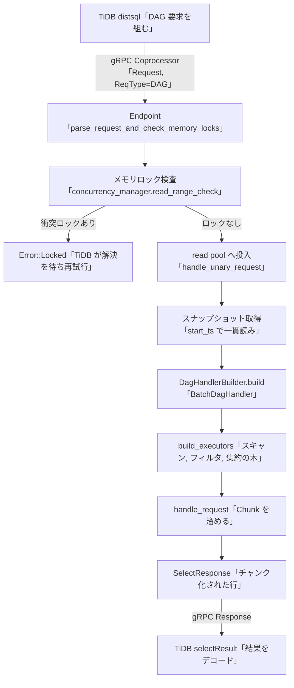

# 第18章 コプロセッサ

> **本章で読むソース**
>
> - [`src/coprocessor/mod.rs`](https://github.com/tikv/tikv/blob/v8.5.6/src/coprocessor/mod.rs)
> - [`src/coprocessor/endpoint.rs`](https://github.com/tikv/tikv/blob/v8.5.6/src/coprocessor/endpoint.rs)
> - [`src/coprocessor/dag/mod.rs`](https://github.com/tikv/tikv/blob/v8.5.6/src/coprocessor/dag/mod.rs)
> - [`components/tidb_query_executors/src/runner.rs`](https://github.com/tikv/tikv/blob/v8.5.6/components/tidb_query_executors/src/runner.rs)

## この章の狙い

TiDB はスキャン、フィルタ、集約といった計算の一部を SQL 実行プランから切り出し、データを保持する TiKV 側へ押し下げる。
この押し下げを TiKV 側で受けて実行する仕組みが**コプロセッサ**である。

本章は、コプロセッサの入口である `Endpoint` がコプロセッサ要求をどう解釈し、メモリロックの検査を経て read pool 上で実行プランを実行し、結果を `SelectResponse` として返すまでの流れを読む。
TiDB 側の押し下げと分散読み取り（[第10章](../../tidb/part02-optimizer/10-coprocessor-pushdown.md)、[第13章](../../tidb/part03-executor/13-distributed-read.md)）が組み立てた要求を、TiKV 側でどう処理するかという相手側の視点に立つ。

## 前提

コプロセッサ要求は gRPC の `Coprocessor` インターフェースで TiKV に届く。
要求は1つの Region を対象とし、TiDB のリージョンキャッシュが対象 Region のリーダーに送る。
本章では read pool とスナップショット取得の詳細（[第17章](17-read-pool-and-snapshot.md)）と、メモリロックを管理する `concurrency_manager`（[第15章](../part03-txn/15-pessimistic-lock.md)）を前提として扱う。

実行プランの実行器そのもの、すなわちベクトル化された各実行器の内部は次章で読む。
本章は入口から実行器の木を組み立てるところまでを対象とし、実行器内部のベクトル化処理は[第19章](19-coprocessor-vectorization.md)に譲る。

## コプロセッサが処理する3種類の要求

TiKV のコプロセッサは、TiDB の単純な読み取りクエリを KV インターフェースの代わりに処理する。
モジュール先頭のコメントが、その目的を述べている。
TiKV のノードの CPU を計算に使い、TiDB へ転送するデータ量を減らす（TiKV 側で絞り込む）ことが狙いである。

要求の種別は `Request` の `tp` フィールドで区別され、3つの定数として定義されている。

[`src/coprocessor/mod.rs` L57-L59](https://github.com/tikv/tikv/blob/v8.5.6/src/coprocessor/mod.rs#L57-L59)

```rust
pub const REQ_TYPE_DAG: i64 = 103;
pub const REQ_TYPE_ANALYZE: i64 = 104;
pub const REQ_TYPE_CHECKSUM: i64 = 105;
```

`REQ_TYPE_DAG` は実行プラン（DAG）の実行、`REQ_TYPE_ANALYZE` は統計情報の収集、`REQ_TYPE_CHECKSUM` はテーブルのチェックサム計算である。
本章では中心となる DAG 要求を主に読む。

3種類の要求はいずれも、共通のトレイト `RequestHandler` を実装した処理器として表現される。
要求の種別ごとに処理器が変わっても、入口の `Endpoint` は同じトレイト越しに実行できる。

[`src/coprocessor/mod.rs` L65-L94](https://github.com/tikv/tikv/blob/v8.5.6/src/coprocessor/mod.rs#L65-L94)

```rust
/// An interface for all kind of Coprocessor request handlers.
#[async_trait]
pub trait RequestHandler: Send {
    /// Processes current request and produces a response.
    async fn handle_request(&mut self) -> Result<MemoryTraceGuard<coppb::Response>> {
        panic!("unary request is not supported for this handler");
    }

    /// Processes current request and produces streaming responses.
    async fn handle_streaming_request(&mut self) -> HandlerStreamStepResult {
        panic!("streaming request is not supported for this handler");
    }

    /// Collects scan statistics generated in this request handler so far.
    fn collect_scan_statistics(&mut self, _dest: &mut Statistics) {
        // Do nothing by default
    }

    /// Collects scan executor time in this request handler so far.
    fn collect_scan_summary(&mut self, _dest: &mut ExecSummary) {
        // Do nothing by default
    }

    fn into_boxed(self) -> Box<dyn RequestHandler>
    where
        Self: 'static + Sized,
    {
        Box::new(self)
    }
}
```

`handle_request` が単発要求の本体で、結果として `coppb::Response` を返す。
`collect_scan_statistics` と `collect_scan_summary` は、要求の処理後にスキャン統計と実行器ごとの実行時間を回収するための口で、既定では何もしない。

## 入口 Endpoint と要求の解釈

入口の `Endpoint` は、コプロセッサ要求を解析し、メモリロックを検査し、要求の種別に応じた `RequestHandler` を組み立てる処理器の構築工場である。
解析を担うのが `parse_request_and_check_memory_locks_impl` で、関数名のとおり解析とメモリロック検査の両方を行う。

DAG 要求のときは、まず要求本体のバイト列を `DagRequest`（`tipb` の実行プラン）として復元する。

[`src/coprocessor/endpoint.rs` L215-L228](https://github.com/tikv/tikv/blob/v8.5.6/src/coprocessor/endpoint.rs#L215-L228)

```rust
        match req.get_tp() {
            REQ_TYPE_DAG => {
                let mut dag = DagRequest::default();
                box_try!(dag.merge_from(&mut input));
                let mut table_scan = false;
                let mut is_desc_scan = false;
                if let Some(scan) = dag.get_executors().iter().next() {
                    table_scan = scan.get_tp() == ExecType::TypeTableScan;
                    if table_scan {
                        is_desc_scan = scan.get_tbl_scan().get_desc();
                    } else {
                        is_desc_scan = scan.get_idx_scan().get_desc();
                    }
                }
```

復元した `DagRequest` の先頭実行器を見て、テーブルスキャンかインデックススキャンか、昇順か降順かを判定している。
先頭実行器は必ずスキャンであり、それより上に位置するフィルタや集約は、このスキャンが流す行を受け取って絞り込む。

要求の文脈を `ReqContext` にまとめたあと、解析の段階でメモリロックを検査する。

[`src/coprocessor/endpoint.rs` L238-L254](https://github.com/tikv/tikv/blob/v8.5.6/src/coprocessor/endpoint.rs#L238-L254)

```rust
                req_ctx = ReqContext::new(
                    context,
                    ranges,
                    self.max_handle_duration,
                    peer,
                    Some(is_desc_scan),
                    start_ts.into(),
                    cache_match_version,
                    self.perf_level,
                    false,
                );
                with_tls_tracker(|tracker| {
                    tracker.req_info.request_type = RequestType::CoprocessorDag;
                    tracker.req_info.start_ts = start_ts;
                });

                self.check_memory_locks(&req_ctx)?;
```

`start_ts` は読み取りの一貫性を決めるタイムスタンプで、`ReqContext` に格納される。
検査を通過すると、スナップショットを受け取って DAG ハンドラを構築するクロージャ `handler_builder` を組み立てる。
このクロージャは後で read pool 上で呼ばれ、その時点で取得したスナップショットを `SnapshotStore` で包み、`dag::DagHandlerBuilder` に渡して処理器を作る。

## メモリロック検査による一貫読みの保証

メモリロック検査は、コプロセッサが読む範囲に、自分の `start_ts` より前に始まったまだコミットされていないトランザクションのロックが残っていないかを確かめる。
これがないと、読み取りが中途半端なコミット状態の値を見てしまい、スナップショット読みの一貫性が崩れる。

検査の本体は `check_memory_locks_for_ranges` である。

[`src/coprocessor/endpoint.rs` L947-L983](https://github.com/tikv/tikv/blob/v8.5.6/src/coprocessor/endpoint.rs#L947-L983)

```rust
fn check_memory_locks_for_ranges(
    concurrency_manager: &ConcurrencyManager,
    req_ctx: &ReqContext,
    key_ranges: &[coppb::KeyRange],
) -> Result<()> {
    let start_ts = req_ctx.txn_start_ts;
    if !req_ctx.context.get_stale_read() {
        concurrency_manager.update_max_ts(start_ts, || format!("coprocessor-{}", start_ts))?;
    }
    if need_check_locks(req_ctx.context.get_isolation_level()) {
        let begin_instant = Instant::now();
        for range in key_ranges {
            let start_key = txn_types::Key::from_raw_maybe_unbounded(range.get_start());
            let end_key = txn_types::Key::from_raw_maybe_unbounded(range.get_end());
            concurrency_manager
                .read_range_check(start_key.as_ref(), end_key.as_ref(), |key, lock| {
                    txn_types::check_ts_conflict(
                        Cow::Owned(tikv_util::Either::Left(lock.clone())),
                        key,
                        start_ts,
                        &req_ctx.bypass_locks,
                        req_ctx.context.get_isolation_level(),
                    )
                })
                .map_err(|e| {
                    MEM_LOCK_CHECK_HISTOGRAM_VEC_STATIC
                        .locked
                        .observe(begin_instant.saturating_elapsed().as_secs_f64());
                    MvccError::from(e)
                })?;
        }
        MEM_LOCK_CHECK_HISTOGRAM_VEC_STATIC
            .unlocked
            .observe(begin_instant.saturating_elapsed().as_secs_f64());
    }
    Ok(())
}
```

検査の前に `update_max_ts` で `concurrency_manager` の最大タイムスタンプを `start_ts` まで進める。
これにより、検査の後にプリライトされるロックは、必ずこの読み取りの `start_ts` より大きい `commit_ts` を持つようになり、後発の書き込みが読み取り結果へ混入しない。

`read_range_check` が、読み取り範囲に重なるメモリロックを走査し、`check_ts_conflict` でロックと `start_ts` の衝突を判定する。
衝突するロック、すなわち `start_ts` より前に始まり、かつ `bypass_locks` で読み飛ばしを許されていないロックが見つかると、`Error::Locked` として TiDB に返る。
TiDB はそのロックの解決を待ってから再試行する。
`bypass_locks` は、巻き戻されるかコミット時刻が `start_ts` より後になることが分かっていて読み飛ばしてよいロックの集合で、TiDB が要求に添えて渡す。

## read pool 上での実行と結果の返却

メモリロック検査を通過した要求は、read pool 上で実際に処理される。
単発要求の処理本体は `handle_unary_request_impl` で、スナップショットを取得し、`handler_builder` で処理器を組み立て、`handle_request` を呼ぶ。

[`src/coprocessor/endpoint.rs` L506-L519](https://github.com/tikv/tikv/blob/v8.5.6/src/coprocessor/endpoint.rs#L506-L519)

```rust
        let mut handler = if tracker.req_ctx.cache_match_version.is_some()
            && tracker.req_ctx.cache_match_version == snapshot.ext().get_data_version()
        {
            // Build a cached request handler instead if cache version is matching.
            CachedRequestHandler::builder()(snapshot, &tracker.req_ctx)?
        } else {
            handler_builder(snapshot, &tracker.req_ctx)?
        };

        tracker.on_begin_all_items();

        let deadline = tracker.req_ctx.deadline;
        let handle_request_future = check_deadline(handler.handle_request(), deadline);
        let handle_request_future = track(handle_request_future, &mut tracker);
```

スナップショットのデータバージョンが TiDB の持つキャッシュのバージョンと一致するときは、`CachedRequestHandler` を組み立てて処理を省く。
一致しないときは `handler_builder`、すなわち DAG 要求なら先のクロージャを呼んで処理器を作り、`handle_request` を実行する。

この `handle_unary_request_impl` を read pool に投入するのが `handle_unary_request` である。

[`src/coprocessor/endpoint.rs` L593-L612](https://github.com/tikv/tikv/blob/v8.5.6/src/coprocessor/endpoint.rs#L593-L612)

```rust
        let (tx, rx) = oneshot::channel();
        let future =
            Self::handle_unary_request_impl(self.semaphore.clone(), tracker, r.handler_builder)
                .in_resource_metering_tag(resource_tag)
                .map(move |res| {
                    let _ = tx.send(res);
                });
        let res = self.read_pool_spawn_with_memory_quota_check(
            allocated_bytes,
            future,
            priority,
            task_id,
            metadata,
            resource_limiter,
        );
        async move {
            res?;
            rx.map_err(|_| Error::MaxPendingTasksExceeded).await?
        }
    }
```

処理は read pool のスレッドへ投入され、結果は `oneshot` チャンネル越しに受け取る。
read pool に余裕がなければ要求を投入する前に `Error::MaxPendingTasksExceeded` で弾く。
この投入前の検査によって、過負荷時に read pool のキューへ要求を積み増すのを避ける。

## DAG ハンドラの構築

DAG 要求の処理器は `BatchDagHandler` である。
`DagHandlerBuilder::build` が `BatchDagHandler` を作り、`RequestHandler` トレイトの箱に詰めて返す。

[`src/coprocessor/dag/mod.rs` L89-L105](https://github.com/tikv/tikv/blob/v8.5.6/src/coprocessor/dag/mod.rs#L89-L105)

```rust
    pub fn build(self) -> Result<Box<dyn RequestHandler>> {
        COPR_DAG_REQ_COUNT.with_label_values(&["batch"]).inc();
        Ok(BatchDagHandler::new::<_, F>(
            self.req,
            self.ranges,
            self.store,
            self.extra_storage_accessor,
            self.data_version,
            self.deadline,
            self.is_cache_enabled,
            self.batch_row_limit,
            self.is_streaming,
            self.paging_size,
            self.quota_limiter,
        )?
        .into_boxed())
    }
```

`BatchDagHandler` は内部に `BatchExecutorsRunner` を抱える。
このランナーが、`DagRequest` に並ぶ実行器の記述（`tipb::Executor` の列）から実行器の木を組み立てる。

[`src/coprocessor/dag/mod.rs` L149-L185](https://github.com/tikv/tikv/blob/v8.5.6/src/coprocessor/dag/mod.rs#L149-L185)

```rust
pub struct BatchDagHandler {
    runner: tidb_query_executors::runner::BatchExecutorsRunner<Statistics>,
    data_version: Option<u64>,
}

impl BatchDagHandler {
    pub fn new<S: Store + 'static, F: KvFormat>(
        req: DagRequest,
        ranges: Vec<KeyRange>,
        store: S,
        extra_storage_accessor: Option<impl RegionStorageAccessor<Storage = S> + 'static>,
        data_version: Option<u64>,
        deadline: Deadline,
        is_cache_enabled: bool,
        streaming_batch_limit: usize,
        is_streaming: bool,
        paging_size: Option<u64>,
        quota_limiter: Arc<QuotaLimiter>,
    ) -> Result<Self> {
        let extra_storage_accessor =
            extra_storage_accessor.map(ExtraTiKVStorageAccessor::from_store_accessor);
        Ok(Self {
            runner: tidb_query_executors::runner::BatchExecutorsRunner::from_request::<_, F>(
                req,
                ranges,
                TikvStorage::new(store, is_cache_enabled),
                extra_storage_accessor,
                deadline,
                streaming_batch_limit,
                is_streaming,
                paging_size,
                quota_limiter,
            )?,
            data_version,
        })
    }
}
```

`from_request` の内側で `build_executors` が呼ばれ、実行器の木が組み立てられる。
先頭の実行器がテーブルスキャンかインデックススキャンかで葉の実行器を決める。

[`components/tidb_query_executors/src/runner.rs` L263-L286](https://github.com/tikv/tikv/blob/v8.5.6/components/tidb_query_executors/src/runner.rs#L263-L286)

```rust
    let mut executor: Box<dyn BatchExecutor<StorageStats = S::Statistics>> = match first_ed.get_tp()
    {
        ExecType::TypeTableScan => {
            EXECUTOR_COUNT_METRICS.batch_table_scan.inc();

            let mut descriptor = first_ed.take_tbl_scan();
            let columns_info = descriptor.take_columns().into();
            let primary_column_ids = descriptor.take_primary_column_ids();
            let primary_prefix_column_ids = descriptor.take_primary_prefix_column_ids();

            Box::new(
                BatchTableScanExecutor::<_, F>::new(
                    storage,
                    config.clone(),
                    columns_info,
                    ranges,
                    primary_column_ids,
                    descriptor.get_desc(),
                    is_scanned_range_aware,
                    primary_prefix_column_ids,
                )?
                .collect_summary(summary_slot_index),
            )
        }
```

葉のスキャンを起点に、フィルタや集約といった上位の実行器を順に重ねて木を作る。
この木は、データに最も近いスキャンを葉に、TiDB が最後に欲しい結果を根に置く。

## チャンク化された結果と SelectResponse

実行器の木を回して結果を作るのが `BatchExecutorsRunner::handle_request` である。
処理はループで進み、一定行数ずつまとめて取り出し、各取り出し分を1つの `Chunk` に詰める。

[`components/tidb_query_executors/src/runner.rs` L744-L794](https://github.com/tikv/tikv/blob/v8.5.6/components/tidb_query_executors/src/runner.rs#L744-L794)

```rust
        loop {
            let mut chunk = Chunk::default();
            let mut sample = self.quota_limiter.new_sample(true);
            let (drained, record_len, read_bytes_len) = {
                let (cpu_time, res) = sample
                    .observe_cpu_async(self.internal_handle_request(
                        false,
                        batch_size,
                        &mut chunk,
                        &mut intermediate_output_chunks,
                        &mut warnings,
                        &mut ctx,
                    ))
                    .await;
                sample.add_cpu_time(cpu_time);
                res?
            };

            if read_bytes_len > 0 {
                sample.add_read_bytes(read_bytes_len);
            }

            let quota_delay = self.quota_limiter.consume_sample(sample, true).await;
            if !quota_delay.is_zero() {
                NON_TXN_COMMAND_THROTTLE_TIME_COUNTER_VEC_STATIC
                    .get(ThrottleType::dag)
                    .inc_by(quota_delay.as_micros() as u64);
            }

            if record_len > 0 {
                record_all += record_len;
            }

            if chunk.has_rows_data() {
                chunks.push(chunk);
            }

            if drained.stop() || self.paging_size.is_some_and(|p| record_all >= p as usize) {
                self.out_most_executor
                    .collect_exec_stats(&mut self.exec_stats);
                let range = if drained == BatchExecIsDrain::Drain {
                    None
                } else {
                    // It's not allowed to stop paging when BatchExecIsDrain::PagingDrain.
                    self.paging_size
                        .map(|_| self.out_most_executor.take_scanned_range())
                };

                let mut sel_resp = SelectResponse::default();
                sel_resp.set_chunks(chunks.into());
                sel_resp.set_encode_type(self.encode_type);
```

実行器の木が出し切る（`drained.stop()`）か、ページングの上限に達するとループを抜け、溜めた `Chunk` の列を `SelectResponse` に詰める。
この `SelectResponse` がコプロセッサの結果として TiDB に返り、TiDB の `selectResult` が受けてデコードする（[第13章](../../tidb/part03-executor/13-distributed-read.md)）。

`SelectResponse` を `Response` に詰める手前で、エラーの種別を選り分けるのが `handle_qe_response` である。

[`src/coprocessor/dag/mod.rs` L216-L230](https://github.com/tikv/tikv/blob/v8.5.6/src/coprocessor/dag/mod.rs#L216-L230)

```rust
    match result {
        Ok((sel_resp, range)) => {
            let mut resp = Response::default();
            if let Some(range) = range {
                resp.mut_range().set_start(range.lower_inclusive);
                resp.mut_range().set_end(range.upper_exclusive);
            }
            resp.set_data(box_try!(sel_resp.write_to_bytes()));
            resp.set_can_be_cached(can_be_cached);
            resp.set_is_cache_hit(false);
            if let Some(v) = data_version {
                resp.set_cache_last_version(v);
            }
            Ok(resp)
        }
```

成功時は `SelectResponse` をバイト列に直して `Response` のデータに収め、キャッシュ可否とデータバージョンを添える。

## 高速化の工夫

コプロセッサの効きどころは、実行プランをまるごと TiKV へ押し下げることにある。

TiDB が KV インターフェースだけを使う場合、対象 Region の行を素のまま TiDB に取り寄せ、フィルタと集約を TiDB 側で行うことになる。
これでは絞り込み前の大量の行がネットワークを渡り、TiDB の CPU とメモリを圧迫する。

コプロセッサは、この計算をデータの隣で済ませる。
スキャン、フィルタ、集約の実行器の木を TiKV 側で組み立て、各 Region で行を絞り込んでから少量の結果だけを返す。
モジュール先頭のコメントが述べるとおり、計算に TiKV の CPU を使い、転送するデータ量を減らす。

効果は二重である。
ネットワークを渡るデータが結果の行だけに減り、TiDB が後段でこなす処理も軽くなる。
さらに各 Region のコプロセッサ要求は別々の TiKV ノードで並行して走るため、集約や絞り込みの計算が Region の数だけ分散される。
TiDB はそれらの少量の部分結果を集めて最終結果を作るだけでよい。

## 全体の流れ

ここまでの流れを図にまとめる。



## まとめ

コプロセッサは、TiDB が押し下げたスキャン、フィルタ、集約を TiKV 側で実行する仕組みである。
入口の `Endpoint` がコプロセッサ要求を解析し、DAG、Analyze、Checksum の3種別を共通の `RequestHandler` トレイトとして扱う。
DAG 要求では `DagRequest` を復元し、メモリロックを検査して `start_ts` での一貫読みを保証してから、read pool 上で `BatchDagHandler` を組み立てて実行する。
`build_executors` がスキャンを葉とする実行器の木を組み立て、`handle_request` がチャンク化した結果を `SelectResponse` に詰めて TiDB へ返す。
実行プランをデータの隣へ押し下げ、各 Region で行を絞り込んでから少量の結果だけを返すことで、ネットワーク転送と TiDB の後段処理を削る。

## 関連する章

- [第15章 悲観的ロック](../part03-txn/15-pessimistic-lock.md)：メモリロックを管理する concurrency_manager と、ロック衝突の検査。
- [第17章 read pool とスナップショット](17-read-pool-and-snapshot.md)：コプロセッサ要求を走らせる read pool と、一貫読みのためのスナップショット取得。
- [第19章 コプロセッサのベクトル化](19-coprocessor-vectorization.md)：本章で組み立てた実行器の木の内部と、ベクトル化された処理。
- [第10章 コプロセッサへの押し下げ](../../tidb/part02-optimizer/10-coprocessor-pushdown.md)：TiDB 側が実行プランの一部を切り出してコプロセッサ要求を組む過程。
- [第13章 分散読み取り](../../tidb/part03-executor/13-distributed-read.md)：TiDB が複数 Region へコプロセッサ要求を撒き、selectResult で結果を集める過程。
