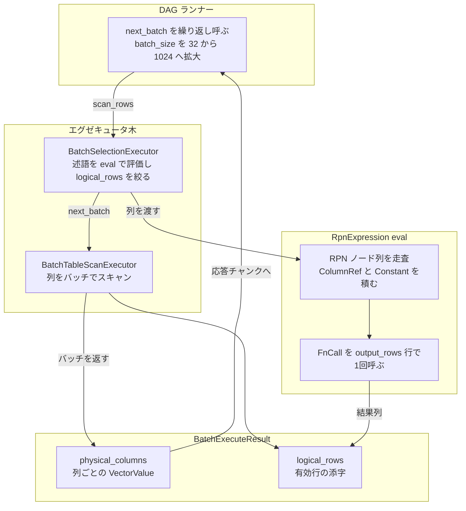

# 第19章 コプロセッサの式評価とベクトル化

> **本章で読むソース**
>
> - [`components/tidb_query_executors/src/interface.rs`](https://github.com/tikv/tikv/blob/v8.5.6/components/tidb_query_executors/src/interface.rs)
> - [`components/tidb_query_executors/src/selection_executor.rs`](https://github.com/tikv/tikv/blob/v8.5.6/components/tidb_query_executors/src/selection_executor.rs)
> - [`components/tidb_query_executors/src/runner.rs`](https://github.com/tikv/tikv/blob/v8.5.6/components/tidb_query_executors/src/runner.rs)
> - [`components/tidb_query_executors/src/simple_aggr_executor.rs`](https://github.com/tikv/tikv/blob/v8.5.6/components/tidb_query_executors/src/simple_aggr_executor.rs)
> - [`components/tidb_query_expr/src/types/expr.rs`](https://github.com/tikv/tikv/blob/v8.5.6/components/tidb_query_expr/src/types/expr.rs)
> - [`components/tidb_query_expr/src/types/expr_eval.rs`](https://github.com/tikv/tikv/blob/v8.5.6/components/tidb_query_expr/src/types/expr_eval.rs)
> - [`components/tidb_query_datatype/src/codec/data_type/vector.rs`](https://github.com/tikv/tikv/blob/v8.5.6/components/tidb_query_datatype/src/codec/data_type/vector.rs)
> - [`components/tidb_query_datatype/src/codec/batch/lazy_column.rs`](https://github.com/tikv/tikv/blob/v8.5.6/components/tidb_query_datatype/src/codec/batch/lazy_column.rs)
> - [`components/tidb_query_datatype/src/codec/data_type/logical_rows.rs`](https://github.com/tikv/tikv/blob/v8.5.6/components/tidb_query_datatype/src/codec/data_type/logical_rows.rs)

## この章の狙い

[第18章](18-coprocessor.md)では、TiDB から押し下げられた DAG リクエストをコプロセッサが受け取り、エグゼキュータの木を組み立てるところまでを読んだ。
本章は、その木が実際にデータを処理するときに使う**ベクトル化**の機構を読む。

コプロセッサのエグゼキュータは、行を1行ずつ取り出して評価するのではなく、列ごとにまとまった**チャンク**（バッチ）の単位でデータを流す。
スキャンもバッチで取り出し、`WHERE` の述語や集約の入力となる式も、列単位でまとめて評価する。
この章では、バッチを運ぶトレイト `BatchExecutor` と、式を逆ポーランド記法（RPN）に展開して列単位で評価する `RpnExpression::eval` の二つを軸に、なぜこの設計が速いのかを機構レベルで述べる。

## 前提

[第18章](18-coprocessor.md)のエグゼキュータ木の構成と、[第17章](17-read-pool-and-snapshot.md)で読んだスナップショット読み取りを前提とする。
コプロセッサのエグゼキュータは TiDB のベクトル化実行と同じ発想に立つ。
TiDB 側のベクトル化（`chunk` 単位の列指向評価）は TiDB 編の[ベクトル化実行](../../tidb/part03-executor/12-vectorized-execution.md)で扱った。
本章は、TiKV 側でその評価がどう実装されているかを読む。

## バッチを運ぶトレイト BatchExecutor

コプロセッサのエグゼキュータは、すべて `BatchExecutor` トレイトを実装する。
このトレイトは Volcano 反復子モデルに似た引き取り型（pull-based）だが、データを1行ずつではなく列ごとにまとめて引き取る点が違う。

[`components/tidb_query_executors/src/interface.rs` L33-55](https://github.com/tikv/tikv/blob/v8.5.6/components/tidb_query_executors/src/interface.rs#L33-L55)

```rust
/// The interface for pull-based executors. It is similar to the Volcano
/// Iterator model, but pulls data in batch and stores data by column.
#[async_trait]
pub trait BatchExecutor: Send {
    type StorageStats;

    /// Gets the schema of the output.
    fn schema(&self) -> &[FieldType];

    // ... (中略) ...

    /// Pulls next several rows of data (stored by column).
    ///
    /// This function might return zero rows, which doesn't mean that there is
    /// no more result. See `is_drained` in `BatchExecuteResult`.
    async fn next_batch(&mut self, scan_rows: usize) -> BatchExecuteResult;
```

`next_batch` は引数 `scan_rows` で「今回引き取りたい行数の目安」を受け取り、`BatchExecuteResult` を返す。
親エグゼキュータが子の `next_batch` を呼び、子はさらにその子を呼ぶ。
この呼び出しが木の根から葉のスキャンまで伝わり、葉が返したバッチが根へ向かって流れ上がる。

返り値の `BatchExecuteResult` は、列ごとにまとまったデータと、有効な行の位置の二つを別々に持つ。

[`components/tidb_query_executors/src/interface.rs` L205-236](https://github.com/tikv/tikv/blob/v8.5.6/components/tidb_query_executors/src/interface.rs#L205-L236)

```rust
pub struct BatchExecuteResult {
    /// The *physical* columns data generated during this invocation.
    ///
    // ... (中略) ...
    pub physical_columns: LazyBatchColumnVec,

    /// Valid row offsets in `physical_columns`, placed in the logical order.
    pub logical_rows: Vec<usize>,

    /// The warnings generated during this invocation.
    // TODO: It can be more general, e.g. `ExecuteWarnings` instead of `EvalWarnings`.
    // TODO: Should be recorded by row.
    pub warnings: EvalWarnings,

    /// Whether or not there is no more data.
    ///
    // ... (中略) ...
    pub is_drained: Result<BatchExecIsDrain>,
}
```

`physical_columns` は列の配列であり、これが**物理**のデータである。
`logical_rows` は、その物理データのうち実際に有効な行の位置を**論理**の順序で並べたものである。
この二つを分けるのが、ベクトル化での選択（フィルタ）の要になる。

述語で行を捨てるとき、列のデータ本体には手を付けず、`logical_rows` から該当する位置を取り除くだけで済む。
列の値を物理的に詰め直すコストを払わないので、選択は添字配列の操作に縮む。
コメントが述べるとおり、`rows_len() > 0` でも論理的なデータが空のことがあり、データへのアクセスは必ず `logical_rows` を介して行う。

## 列指向のデータ表現 VectorValue と LazyBatchColumn

`physical_columns` の中身は列の集まりであり、各列は `LazyBatchColumn` で表される。
名前のとおり、この列は遅延評価される。

[`components/tidb_query_datatype/src/codec/batch/lazy_column.rs` L17-30](https://github.com/tikv/tikv/blob/v8.5.6/components/tidb_query_datatype/src/codec/batch/lazy_column.rs#L17-L30)

```rust
/// A container stores an array of datums, which can be either raw (not
/// decoded), or decoded into the `VectorValue` type.
///
/// TODO:
/// Since currently the data format in response can be the same as in storage,
/// we use this structure to avoid unnecessary repeated serialization /
/// deserialization. In future, Coprocessor will respond all data in Chunk
/// format which is different to the format in storage. At that time,
/// this structure is no longer useful and should be removed.
#[derive(Clone, Debug)]
pub enum LazyBatchColumn {
    Raw(BufferVec),
    Decoded(VectorValue),
}
```

`Raw` はストレージから読んだ生のバイト列をそのまま保持した状態である。
`Decoded` は型ごとに展開済みの列である。
スキャンの段階では生のままバッファに積んでおき、ある列が式評価で実際に必要になったときだけ `Decoded` へ展開する。
必要のない列を展開しないので、押し下げで参照されない列のデコードを丸ごと省ける。

展開後の列は `VectorValue` 型を持つ。
これが列指向データ表現の本体であり、評価型ごとに別々の連続した配列を内側に持つ。

[`components/tidb_query_datatype/src/codec/data_type/vector.rs` L9-25](https://github.com/tikv/tikv/blob/v8.5.6/components/tidb_query_datatype/src/codec/data_type/vector.rs#L9-L25)

```rust
/// A vector value container, a.k.a. column, for all concrete eval types.
///
/// The inner concrete value is immutable. However it is allowed to push and
/// remove values from this vector container.
#[derive(Debug, PartialEq, Clone)]
pub enum VectorValue {
    Int(ChunkedVecSized<Int>),
    Real(ChunkedVecSized<Real>),
    Decimal(ChunkedVecSized<Decimal>),
    Bytes(ChunkedVecBytes),
    DateTime(ChunkedVecSized<DateTime>),
    Duration(ChunkedVecSized<Duration>),
    Json(ChunkedVecJson),
    Enum(ChunkedVecEnum),
    Set(ChunkedVecSet),
    VectorFloat32(ChunkedVecVectorFloat32),
}
```

`VectorValue` は外側の列挙子で型を一度だけ判定し、内側は同じ型の値が連続して並ぶ。
列の全要素が同じ型なので、評価のループ内で1要素ごとに型を分岐する必要がない。
同じ型の値が連続するこの並びは、CPU キャッシュにも乗りやすい。
行指向に1行ずつ走査するのに比べ、列の中を直線的に舐めるアクセスはキャッシュミスを減らす。

## 論理行による選択の表現

選択した行を `logical_rows` という添字配列で表すと、評価では添字を1段はさんで物理データにアクセスすることになる。
すべての行が連続して並んでいる場合にこの間接参照を払うのは無駄なので、連続している場合を特別扱いする仕組みがある。

[`components/tidb_query_datatype/src/codec/data_type/logical_rows.rs` L5-33](https://github.com/tikv/tikv/blob/v8.5.6/components/tidb_query_datatype/src/codec/data_type/logical_rows.rs#L5-L33)

```rust
pub const BATCH_MAX_SIZE: usize = 1024;

/// Identical logical row is a special case in expression evaluation that
/// the rows in physical_value are continuous and in order.
pub static IDENTICAL_LOGICAL_ROWS: [usize; BATCH_MAX_SIZE] = {
    let mut logical_rows = [0; BATCH_MAX_SIZE];
    let mut row = 0;
    while row < logical_rows.len() {
        logical_rows[row] = row;
        row += 1;
    }
    logical_rows
};

/// LogicalRows is a replacement for `logical_rows` parameter
/// in many of the copr functions. By distinguishing identical
/// and non-identical mapping with a enum, we can directly
/// tell if a `logical_rows` contains all items in a vector,
/// and we may optimiaze many cases by using direct copy and
/// construction.
///
/// Note that `Identical` supports no more than `BATCH_MAX_SIZE`
/// rows. In this way, it is always recommended to use `get_idx`
/// instead of `as_slice` to avoid runtime error.
#[derive(Clone, Copy, Debug)]
pub enum LogicalRows<'a> {
    Identical { size: usize },
    Ref { logical_rows: &'a [usize] },
}
```

`BATCH_MAX_SIZE` は1バッチあたりの最大行数で、1024 に固定されている。
コメントは、この値が MonetDB/X100 の研究にならって選ばれたと述べている。
`LogicalRows` は、論理行が物理行と1対1で連続している場合を `Identical` として、それ以外の `Ref` と区別する。
`Identical` のときは添字配列を引かずに物理位置をそのまま使えるので、選択が一度も起きていない経路では間接参照を避けられる。

## 式を RPN に展開する

押し下げられた式は、TiDB 側では子を持つ木構造（`Expr`）として届く。
コプロセッサはこれを評価するとき、木のまま再帰で辿るのではなく、逆ポーランド記法（RPN）のノード列へ展開する。

[`components/tidb_query_expr/src/types/expr.rs` L10-30](https://github.com/tikv/tikv/blob/v8.5.6/components/tidb_query_expr/src/types/expr.rs#L10-L30)

```rust
/// A type for each node in the RPN expression list.
#[derive(Debug)]
pub enum RpnExpressionNode {
    /// Represents a function call.
    FnCall {
        func_meta: RpnFnMeta,
        args_len: usize,
        field_type: FieldType,
        metadata: Box<dyn Any + Send>,
    },

    /// Represents a scalar constant value.
    Constant {
        value: ScalarValue,
        field_type: FieldType,
    },

    /// Represents a reference to a column in the columns specified in
    /// evaluation.
    ColumnRef { offset: usize },
}
```

RPN のノードは、関数呼び出し（`FnCall`）、定数（`Constant`）、列参照（`ColumnRef`）の三種類だけである。
`RpnExpression` 自体は、このノードを後置順に並べた単なるベクタである。

[`components/tidb_query_expr/src/types/expr.rs` L85-90](https://github.com/tikv/tikv/blob/v8.5.6/components/tidb_query_expr/src/types/expr.rs#L85-L90)

```rust
/// An expression in Reverse Polish notation, which is simply a list of RPN
/// expression nodes.
///
/// You may want to build it using `RpnExpressionBuilder`.
#[derive(Debug)]
pub struct RpnExpression(Vec<RpnExpressionNode>);
```

木を後置順の平坦な列にしておくと、評価はスタックを使った一方向の走査で済む。
再帰呼び出しや子ノードへのポインタ追跡が消え、評価ループは配列を前から舐めるだけになる。
このノード列を組み立てるのが `RpnExpressionBuilder` であり、`build_from_expr_tree` が TiDB の式木を受け取って木を後置順に平坦化する（[第18章](18-coprocessor.md)で組み立て側を扱った）。

## 列単位でベクトル評価する eval

評価の入口は `RpnExpression::eval` である。
これは列の配列とその論理行を受け取り、式を評価した結果を一つのスタックノードとして返す。

[`components/tidb_query_expr/src/types/expr_eval.rs` L205-225](https://github.com/tikv/tikv/blob/v8.5.6/components/tidb_query_expr/src/types/expr_eval.rs#L205-L225)

```rust
    pub fn eval<'a>(
        &'a self,
        ctx: &mut EvalContext,
        schema: &'a [FieldType],
        input_physical_columns: &'a mut LazyBatchColumnVec,
        input_logical_rows: &'a [usize],
        output_rows: usize,
    ) -> Result<RpnStackNode<'a>> {
        // We iterate two times. The first time we decode all referred columns. The
        // second time we evaluate. This is to make Rust's borrow checker happy
        // because there will be mutable reference during the first iteration
        // and we can't keep these references.
        self.ensure_columns_decoded(ctx, schema, input_physical_columns, input_logical_rows)?;
        self.eval_decoded(
            ctx,
            schema,
            input_physical_columns,
            input_logical_rows,
            output_rows,
        )
    }
```

`eval` はまず `ensure_columns_decoded` で、式が参照する列だけを `Raw` から `Decoded` へ展開する。
前述のとおり、参照されない列は展開しない。
展開を終えたら `eval_decoded` で実際の評価へ進む。

`eval_decoded` が RPN 評価の本体である。
ノード列を前から走査し、定数と列参照はスタックへ積み、関数呼び出しはスタックの末尾から引数を取って関数を呼ぶ。

[`components/tidb_query_expr/src/types/expr_eval.rs` L264-328](https://github.com/tikv/tikv/blob/v8.5.6/components/tidb_query_expr/src/types/expr_eval.rs#L264-L328)

```rust
    pub fn eval_decoded<'a>(
        &'a self,
        ctx: &mut EvalContext,
        schema: &'a [FieldType],
        input_physical_columns: &'a LazyBatchColumnVec,
        input_logical_rows: &'a [usize],
        output_rows: usize,
    ) -> Result<RpnStackNode<'a>> {
        assert!(output_rows > 0);
        assert!(output_rows <= BATCH_MAX_SIZE);
        let mut stack = Vec::with_capacity(self.len());

        for node in self.as_ref() {
            match node {
                RpnExpressionNode::Constant { value, field_type } => {
                    stack.push(RpnStackNode::Scalar { value, field_type });
                }
                RpnExpressionNode::ColumnRef { offset } => {
                    let field_type = &schema[*offset];
                    let decoded_physical_column = input_physical_columns[*offset].decoded();
                    assert_eq!(input_logical_rows.len(), output_rows);
                    stack.push(RpnStackNode::Vector {
                        value: RpnStackNodeVectorValue::Ref {
                            physical_value: decoded_physical_column,
                            logical_rows: input_logical_rows,
                        },
                        field_type,
                    });
                }
                RpnExpressionNode::FnCall {
                    func_meta,
                    args_len,
                    field_type: ret_field_type,
                    metadata,
                } => {
                    // Suppose that we have function call `Foo(A, B, C)`, the RPN nodes looks like
                    // `[A, B, C, Foo]`.
                    // Now we receives a function call `Foo`, so there are `[A, B, C]` in the stack
                    // as the last several elements. We will directly use the last N (N = number of
                    // arguments) elements in the stack as function arguments.
                    assert!(stack.len() >= *args_len);
                    let stack_slice_begin = stack.len() - *args_len;
                    let stack_slice = &stack[stack_slice_begin..];
                    let mut call_extra = RpnFnCallExtra { ret_field_type };
                    let ret = (func_meta.fn_ptr)(
                        ctx,
                        output_rows,
                        stack_slice,
                        &mut call_extra,
                        &**metadata,
                    )?;
                    stack.truncate(stack_slice_begin);
                    stack.push(RpnStackNode::Vector {
                        value: RpnStackNodeVectorValue::Generated {
                            physical_value: ret,
                        },
                        field_type: ret_field_type,
                    });
                }
            }
        }

        assert_eq!(stack.len(), 1);
        Ok(stack.into_iter().next().unwrap())
    }
```

注目すべきは、関数呼び出し `func_meta.fn_ptr` に `output_rows` が渡されている点である。
関数は1行を受け取って1個のスカラを返すのではなく、`output_rows` 行ぶんの列を受け取って同じ長さの列を返す。
スタックに積まれるのも `RpnStackNode` という列単位のノードであり、列参照は元の列への参照（`Ref`）、関数の結果は新たに生成した列（`Generated`）として表される。

[`components/tidb_query_expr/src/types/expr_eval.rs` L103-121](https://github.com/tikv/tikv/blob/v8.5.6/components/tidb_query_expr/src/types/expr_eval.rs#L103-L121)

```rust
/// A type for each node in the RPN evaluation stack. It can be one of a scalar
/// value node or a vector value node. The vector value node can be either an
/// owned vector value or a reference.
#[derive(Debug)]
pub enum RpnStackNode<'a> {
    /// Represents a scalar value. Comes from a constant node in expression
    /// list.
    Scalar {
        value: &'a ScalarValue,
        field_type: &'a FieldType,
    },

    /// Represents a vector value. Comes from a column reference or evaluated
    /// result.
    Vector {
        value: RpnStackNodeVectorValue<'a>,
        field_type: &'a FieldType,
    },
}
```

`Scalar` は定数から来るので、全行で同じ値を指す。
`Vector` は列参照か関数の結果から来る列である。
スカラを列として持ち回らないので、定数引数を行数ぶん複製する必要がない。

この評価がベクトル化である理由は、関数呼び出しの粒度にある。
式 `Foo(A, B, C)` をバッチ全体で評価するとき、`Foo` への関数呼び出しは1回だけ起きる。
その1回の中で `output_rows` 行を内側のループで処理するので、関数呼び出しの分岐や仮想呼び出しのコストはバッチ全体で1回に畳み込まれる。
1行ずつ評価すれば行数ぶんの関数呼び出しが必要になるところを、列単位の1回に縮められる。

## 選択エグゼキュータでの利用

ベクトル評価が実際にどう使われるかを、`BatchSelectionExecutor`（`WHERE` の述語を評価するエグゼキュータ）で見る。
このエグゼキュータは、子から受け取ったバッチに対し、述語の条件を一つずつ列単位で評価する。

[`components/tidb_query_executors/src/selection_executor.rs` L17-22](https://github.com/tikv/tikv/blob/v8.5.6/components/tidb_query_executors/src/selection_executor.rs#L17-L22)

```rust
pub struct BatchSelectionExecutor<Src: BatchExecutor> {
    context: EvalContext,
    src: Src,

    conditions: Vec<RpnExpression>,
}
```

`conditions` が述語の RPN 式の並びである。
バッチを受け取ると、各条件を `eval` で評価し、結果の真偽に応じて `logical_rows` を絞り込む。

[`components/tidb_query_executors/src/selection_executor.rs` L87-116](https://github.com/tikv/tikv/blob/v8.5.6/components/tidb_query_executors/src/selection_executor.rs#L87-L116)

```rust
            match self.conditions[condition_index].eval(
                &mut self.context,
                self.src.schema(),
                &mut src_result.physical_columns,
                &src_logical_rows_copy,
                src_logical_rows_copy.len(),
            )? {
                RpnStackNode::Scalar { value, .. } => {
                    update_logical_rows_by_scalar_value(
                        &mut src_result.logical_rows,
                        &mut self.context,
                        value,
                    )?;
                }
                RpnStackNode::Vector { value, .. } => {
                    let eval_result_logical_rows = value.logical_rows_struct();
                    match_template_evaltype! {
                        TT, match value.as_ref() {
                            VectorValue::TT(eval_result) => {
                                update_logical_rows_by_vector_value(
                                    &mut src_result.logical_rows,
                                    &mut self.context,
                                    eval_result,
                                    eval_result_logical_rows,
                                )?;
                            },
                        }
                    }
                }
            }
```

述語の評価結果が列（`Vector`）なら、各行の真偽を見て偽の行を `logical_rows` から取り除く。
ここでも列のデータ本体は動かさず、論理行の配列を絞るだけである。
`next_batch` 全体を通して、選択は子のバッチをそのまま受け、`logical_rows` を縮めて親へ返す。

[`components/tidb_query_executors/src/selection_executor.rs` L197-211](https://github.com/tikv/tikv/blob/v8.5.6/components/tidb_query_executors/src/selection_executor.rs#L197-L211)

```rust
    async fn next_batch(&mut self, scan_rows: usize) -> BatchExecuteResult {
        let mut src_result = self.src.next_batch(scan_rows).await;

        if let Err(e) = self.handle_src_result(&mut src_result) {
            // TODO: Rows before we meeting an evaluation error are innocent.
            src_result.is_drained = src_result.is_drained.and(Err(e));
            src_result.logical_rows.clear();
        } else {
            // Only append warnings when there is no error during filtering because
            // we clear the data when there are errors.
            src_result.warnings.merge(&mut self.context.warnings);
        }

        src_result
    }
```

同じ `eval` は集約エグゼキュータでも使われる。
`BatchSimpleAggregationExecutor` は、集約関数の入力式を `eval` でバッチ評価してから状態を更新する。

[`components/tidb_query_executors/src/simple_aggr_executor.rs` L176-182](https://github.com/tikv/tikv/blob/v8.5.6/components/tidb_query_executors/src/simple_aggr_executor.rs#L176-L182)

```rust
            let aggr_fn_input = aggr_expr.eval(
                &mut entities.context,
                entities.src.schema(),
                &mut input_physical_columns,
                input_logical_rows,
                rows_len,
            )?;
```

選択と集約のいずれも、式評価の本体は同じ `RpnExpression::eval` に集約されている。
バッチを単位とする限り、どのエグゼキュータも列単位の評価を共有できる。

## バッチを駆動するランナー

エグゼキュータ木の根は、DAG リクエストを処理するランナーが駆動する。
ランナーは根のエグゼキュータの `next_batch` を繰り返し呼び、返ってきたバッチを応答チャンクへ詰める。

[`components/tidb_query_executors/src/runner.rs` L960](https://github.com/tikv/tikv/blob/v8.5.6/components/tidb_query_executors/src/runner.rs#L960-L960)

```rust
        let mut result = self.out_most_executor.next_batch(batch_size).await;
```

ここで `batch_size` は1回の `next_batch` で引き取る行数の目安である。
ランナーは初回を小さく始め、ループのたびに大きくする。

[`components/tidb_query_executors/src/runner.rs` L1075-1081](https://github.com/tikv/tikv/blob/v8.5.6/components/tidb_query_executors/src/runner.rs#L1075-L1081)

```rust
fn grow_batch_size(batch_size: &mut usize) {
    if *batch_size < BATCH_MAX_SIZE {
        *batch_size *= batch_grow_factor();
        if *batch_size > BATCH_MAX_SIZE {
            *batch_size = BATCH_MAX_SIZE
        }
    }
```

初期値は小さく（`BATCH_INITIAL_SIZE` は 32）、`grow_batch_size` が呼ばれるたびに係数倍され、上限 `BATCH_MAX_SIZE`（1024）で頭打ちになる。
バッチを小さく始めるのは、結果がすぐ埋まる軽い問い合わせで、最初から 1024 行ぶんスキャンする無駄を避けるためと考えられる。
データが残っていればバッチを広げ、列単位の評価が1回あたりに処理する行数を増やしていく。

## 高速化の機構

この章の機構を一つにまとめると、式の評価単位を行から列のバッチへ引き上げたことに尽きる。

第一に、式を RPN へ平坦化したことで、評価は木の再帰ではなくスタックを使った配列の一方向走査になる。
第二に、関数呼び出しがバッチ全体で1回に畳み込まれる。
`Foo(A, B, C)` を1024 行ぶん評価しても、`func_meta.fn_ptr` の呼び出しは1回で、その内側で 1024 行を処理する。
関数呼び出しと分岐のコストが、行数ぶんからバッチ1回へ縮む。
第三に、データが列ごとに連続した `VectorValue` として並ぶので、列を直線的に舐めるアクセスが CPU キャッシュに乗りやすい。
第四に、選択は列のデータを物理的に詰め直さず `logical_rows` の添字操作だけで済ませる。

これらは独立した工夫だが、いずれも「列のバッチを単位に処理する」という一つの設計から導かれる。
スキャンをバッチで取り出し、式を列単位で評価する限り、関数呼び出しの回数とキャッシュミスの両方をまとめて減らせる。

## まとめ

コプロセッサのエグゼキュータは `BatchExecutor` トレイトで列ごとのバッチを引き取り、`next_batch` でバッチを木の根まで流し上げる。
バッチは物理の列データ（`physical_columns`）と有効行の位置（`logical_rows`）に分けて持ち、選択は後者を絞るだけで済ませる。
式は RPN へ平坦化され、`RpnExpression::eval` がスタックを使って列単位で評価し、関数呼び出しをバッチ1回に畳み込む。
列指向の `VectorValue` 表現とあわせ、関数呼び出しの回数とキャッシュミスを減らすことが、コプロセッサのベクトル化が速い理由である。



## 関連する章

- [第17章 read pool とスナップショット読み取り](17-read-pool-and-snapshot.md)：コプロセッサがバッチで読むスナップショットの取得経路。
- [第18章 コプロセッサ](18-coprocessor.md)：DAG リクエストからエグゼキュータ木を組み立てる流れ。
- [ベクトル化実行](../../tidb/part03-executor/12-vectorized-execution.md)：同じ発想を計算層側で扱う TiDB 編の `chunk` 単位の列指向評価。
