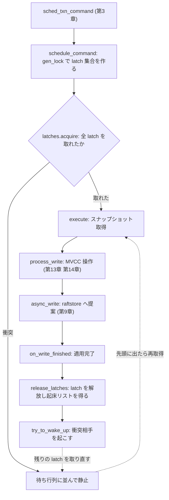

# 第20章 スケジューラと latch

> **本章で読むソース**
>
> - [`src/storage/txn/scheduler.rs`](https://github.com/tikv/tikv/blob/v8.5.6/src/storage/txn/scheduler.rs)
> - [`src/storage/txn/latch.rs`](https://github.com/tikv/tikv/blob/v8.5.6/src/storage/txn/latch.rs)
> - [`src/storage/txn/commands/macros.rs`](https://github.com/tikv/tikv/blob/v8.5.6/src/storage/txn/commands/macros.rs)

## この章の狙い

プリライトやコミットといった書き込みコマンドは、gRPC の受付から `Storage::sched_txn_command` を通って TiKV のサーバ内部へ入る（[第3章](../part00-overview/03-grpc-and-request-flow.md)）。
そこから先で、コマンドの起動を取り仕切るのが**スケジューラ**（`TxnScheduler`）である。
本章は、1つの書き込みコマンドがスケジューラに渡ってから、結果が raftstore へ提案されて latch が解放されるまでの一連の流れを読む。

スケジューラは、コマンドをいきなり実行しない。
まず**latch** を取り、その後にスナップショットを取得し、ワーカープールで MVCC 操作を実行する。
latch とは、同じキーに触れるコマンドどうしを1ノードのメモリ内で直列化するための軽量ロックである。
これは Percolator がキー上（`lock` CF）に置くロックとは別物であり、1ノード内に閉じた短命な並行制御にあたる。
両者を混同しないために、本章では前者を「latch」、後者を「ロック」と書き分ける。

## 前提

書き込みコマンドの中身（プリライトやコミットが MVCC をどう操作するか）は[第13章](../part03-txn/13-prewrite.md)などで扱う。
本章は、それらの処理を起動する側のしくみに集中する。
スケジューラが組み立てた書き込みデータが Raft の提案として複製され適用される流れは[第9章](../part02-raft/09-propose-and-apply.md)で扱う。
ここでは、スケジューラが `async_write` を呼ぶところまでを追う。

## latch はキーのハッシュでスロットを取る

まず latch の構造から読む。
`Latches` は固定数のスロットの配列であり、各スロットが1つの待ち行列（`Latch`）を持つ。

[`src/storage/txn/latch.rs` L159-L162](https://github.com/tikv/tikv/blob/v8.5.6/src/storage/txn/latch.rs#L159-L162)

```rust
pub struct Latches {
    slots: Vec<CachePadded<Mutex<Latch>>>,
    size: usize,
}
```

スロットの実体は `Mutex<Latch>` であり、それぞれが `CachePadded` で包まれている。
`CachePadded` はキャッシュライン単位のパディングを足し、隣り合うスロットのミューテックスが同じキャッシュラインに乗って互いの更新を打ち消し合う、いわゆる false sharing を避ける。
スロット数はノードごとに固定であり、キーの数に依存しない。

キーとスロットの対応は、キーのハッシュ値の下位ビットで決まる。

[`src/storage/txn/latch.rs` L267-L271](https://github.com/tikv/tikv/blob/v8.5.6/src/storage/txn/latch.rs#L267-L271)

```rust
    #[inline]
    fn lock_latch(&self, hash: u64) -> MutexGuard<'_, Latch> {
        self.slots[(hash as usize) & (self.size - 1)].lock()
    }
}
```

スロット数 `size` は `Latches::new` で2の冪に切り上げられるため、剰余の代わりに `& (self.size - 1)` でスロット番号を求められる。
キー本体ではなくハッシュ値でスロットを引くので、latch が抱えるメモリ量は実際のキー数ではなくスロット数で頭打ちになる。
別々のキーが同じスロットに割り当たることはあるが、それは正しさを壊さない。
待ち行列はキーの完全なハッシュ値で区別するので、同じスロットでもハッシュ値が違えば互いを待たせない。
直列化されるのは、後で見るように同じハッシュ値を要求するコマンドだけである。

## コマンドが必要とする latch の集合を作る

1つのコマンドが触れるキー群に対応する latch の集合は、`Lock` 構造体が表す。

[`src/storage/txn/latch.rs` L114-L129](https://github.com/tikv/tikv/blob/v8.5.6/src/storage/txn/latch.rs#L114-L129)

```rust
impl Lock {
    /// Creates a lock specifing all the required latches for a command.
    pub fn new<'a, K, I>(keys: I) -> Lock
    where
        K: Hash + 'a,
        I: IntoIterator<Item = &'a K>,
    {
        // prevent from deadlock, so we sort and deduplicate the index
        let mut required_hashes: Vec<u64> = keys.into_iter().map(|key| Self::hash(key)).collect();
        required_hashes.sort_unstable();
        required_hashes.dedup();
        Lock {
            required_hashes,
            owned_count: 0,
        }
    }
```

`Lock::new` はキー群をハッシュ値の列に変換し、ソートと重複除去をする。
ソートが効くのは、デッドロックを避けるためである。
すべてのコマンドが latch を必ず「ハッシュ値の昇順」で取ると決めておけば、2つのコマンドが互いに相手の持つ latch を待ち合う循環が生じない。
重複除去は、1つのコマンドが同じハッシュ値を二重に取りにいくのを防ぐ。

どのキーから `Lock` を作るかは、コマンドの種別ごとにマクロで宣言される。

[`src/storage/txn/commands/macros.rs` L150-L154](https://github.com/tikv/tikv/blob/v8.5.6/src/storage/txn/commands/macros.rs#L150-L154)

```rust
    ($field:ident) => {
        fn gen_lock(&self) -> crate::storage::txn::latch::Lock {
            crate::storage::txn::latch::Lock::new(std::iter::once(&self.$field))
        }
    };
```

このマクロが各コマンド型の `gen_lock` を生成する。
プリライトのように複数キーへ書くコマンドはキー列全体から、コミットのように対象キーが1つの場合は単一フィールドから `Lock` を作る。
スケジューラはコマンドを受け取った時点で `gen_lock` を呼び、そのコマンドに対応する latch 集合を用意する。

[`src/storage/txn/scheduler.rs` L145-L147](https://github.com/tikv/tikv/blob/v8.5.6/src/storage/txn/scheduler.rs#L145-L147)

```rust
    fn new(task: Task, cb: SchedulerTaskCallback, prepared_latches: Option<Lock>) -> TaskContext {
        let tag = task.cmd().tag();
        let lock = prepared_latches.unwrap_or_else(|| task.cmd().gen_lock());
```

## latch を取る、または待ち行列に並ぶ

latch の取得は `acquire` が担う。
あるコマンドが `Lock` の各ハッシュ値について、対応するスロットの待ち行列の先頭を取れているかを調べる。

[`src/storage/txn/latch.rs` L182-L203](https://github.com/tikv/tikv/blob/v8.5.6/src/storage/txn/latch.rs#L182-L203)

```rust
    pub fn acquire(&self, lock: &mut Lock, who: u64) -> bool {
        let mut acquired_count: usize = 0;
        for &key_hash in &lock.required_hashes[lock.owned_count..] {
            let mut latch = self.lock_latch(key_hash);
            match latch.get_first_req_by_hash(key_hash) {
                Some(cid) => {
                    if cid == who {
                        acquired_count += 1;
                    } else {
                        latch.wait_for_wake(key_hash, who);
                        break;
                    }
                }
                None => {
                    latch.wait_for_wake(key_hash, who);
                    acquired_count += 1;
                }
            }
        }
        lock.owned_count += acquired_count;
        lock.acquired()
    }
```

スロットの待ち行列を `get_first_req_by_hash` で調べ、同じハッシュ値を要求している先頭のコマンドIDを見る。
誰も並んでいなければ自分を末尾に積み、そのスロットを取得したとみなす。
先頭が自分自身（`cid == who`）なら、すでに取得済みである。
先頭が別のコマンドなら、自分を末尾に積んだうえで `break` し、そこで取得をやめる。

`break` で止まるところに、デッドロック回避の設計が現れる。
latch をハッシュ値の昇順で取ると決めているため、最初に衝突したスロットより先の latch は取りにいかない。
取れなかった latch のぶんは `owned_count` に数えず、待ち行列に並べたまま残す。
すべての latch が取れた場合だけ `acquired()` が `true` を返し、コマンドは実行へ進める。

`owned_count` を起点に未取得ぶんだけを走査するのは、後で先頭に立って起こされたコマンドが、すでに取れていた latch を取り直さずに残りだけを取りにいくためである。
こうして、同じハッシュ値を要求する複数のコマンドは、待ち行列の順序どおりに1つずつ直列化される。
スロットが衝突しないコマンドどうしは、互いの待ち行列に並ばないので並行に走れる。

## コマンドのライフサイクル

スケジューラがコマンドを受け取ってから latch を解放するまでを、起動側のコード `schedule_command` から追う。

[`src/storage/txn/scheduler.rs` L596-L607](https://github.com/tikv/tikv/blob/v8.5.6/src/storage/txn/scheduler.rs#L596-L607)

```rust
        if self.inner.latches.acquire(&mut tctx.lock, cid) {
            fail_point!("txn_scheduler_acquire_success");
            tctx.on_schedule();
            let task = tctx.task.take().unwrap();
            drop(task_slot);
            self.execute(task);
            return;
        }
        let task = tctx.task.as_ref().unwrap();
        self.fail_fast_or_check_deadline(cid, task.cmd());
        fail_point!("txn_scheduler_acquire_fail");
    }
```

`acquire` がすべての latch を取れたら、そのまま `execute` へ進む。
取れなかったときは何もせず（`fail_fast_or_check_deadline` はデッドライン監視を背後で仕掛けるだけ）、コマンドは待ち行列に並んだまま静止する。
このコマンドを後で動かすのは、衝突相手が latch を解放したときに送られる起床通知である。

latch が取れたコマンドは、ワーカープール上でスナップショットを取得する。

[`src/storage/txn/scheduler.rs` L744-L778](https://github.com/tikv/tikv/blob/v8.5.6/src/storage/txn/scheduler.rs#L744-L778)

```rust
            match unsafe { with_tls_engine(|engine: &mut E| kv::snapshot(engine, snap_ctx)) }.await
            {
                Ok(snapshot) => {
                    sched_details.async_snapshot_nanos =
                        sched_details.start_instant.saturating_elapsed().as_nanos() as u64;
                    SCHED_STAGE_COUNTER_VEC.get(tag).snapshot_ok.inc();
                    let term = snapshot.ext().get_term();
                    let extra_op = snapshot.ext().get_txn_extra_op();
                    if !sched
                        .inner
                        .get_task_slot(task.cid())
                        .get(&task.cid())
                        .unwrap()
                        .try_own()
                    {
                        sched.finish_with_err(
                            task.cid(),
                            StorageErrorInner::DeadlineExceeded,
                            None,
                        );
                        return;
                    }

                    if let Some(term) = term {
                        task.cmd_mut().ctx_mut().set_term(term.get());
                    }
                    task.set_extra_op(extra_op);

                    debug!(
                        "process cmd with snapshot";
                        "cid" => task.cid(), "term" => ?term, "extra_op" => ?extra_op,
                        "task" => ?&task,
                    );
                    sched.process(snapshot, task, sched_details).await;
                }
```

latch を持った状態でスナップショットを取るのが要点である。
同じキーへの並行コマンドはすでに latch で1列に並んでいるので、ここで得たスナップショットに対する MVCC 操作は、他のコマンドの書き込みと交錯しない。
スナップショットを得たら `process` へ進む。

`process` は、読み取りコマンドと書き込みコマンドを振り分ける。

[`src/storage/txn/scheduler.rs` L1255-L1261](https://github.com/tikv/tikv/blob/v8.5.6/src/storage/txn/scheduler.rs#L1255-L1261)

```rust
            if task.cmd().readonly() {
                self.process_read(snapshot, task, &mut sched_details);
                record_logical_read_bytes(sched_details.stat.processed_size as u64);
            } else {
                record_logical_write_bytes(task.cmd().write_bytes() as u64);
                self.process_write(snapshot, task, &mut sched_details).await;
            };
```

書き込みコマンドは `process_write` へ入る。
ここで、プリライトやコミットの MVCC 操作（[第13章](../part03-txn/13-prewrite.md)、[第14章](../part03-txn/14-commit-and-read.md)）が実行され、`lock` や `write` といった CF への変更が `WriteData` として組み立てられる。
この実行のあいだも latch は握ったままである。

組み立てた書き込みデータは、`handle_async_write` から storage エンジンの `async_write` に渡され、raftstore への提案になる。

[`src/storage/txn/scheduler.rs` L1732-L1737](https://github.com/tikv/tikv/blob/v8.5.6/src/storage/txn/scheduler.rs#L1732-L1737)

```rust
        let async_write_start = Instant::now_coarse();
        let mut res = unsafe {
            with_tls_engine(|e: &mut E| {
                e.async_write(&ctx, to_be_write, subscribed, Some(on_applied))
            })
        };
```

`async_write` の先で、書き込みは Raft の提案として複製され、適用される（[第9章](../part02-raft/09-propose-and-apply.md)）。
適用が終わると `on_write_finished` が呼ばれ、ここで latch を解放する。

[`src/storage/txn/scheduler.rs` L972-L978](https://github.com/tikv/tikv/blob/v8.5.6/src/storage/txn/scheduler.rs#L972-L978)

```rust
        } else {
            if !tctx.woken_up_resumable_lock_requests.is_empty() {
                self.put_back_lock_wait_entries(tctx.woken_up_resumable_lock_requests);
            }
            self.release_latches(tctx.lock, cid, None);
        }
    }
```

latch を解放するまでが1つのコマンドの寿命である。
latch を取る時点ではキーが触れる対象として確定し、解放する時点ですでに書き込みが適用済みになっている。
このあいだ、同じハッシュ値を要求する後続コマンドは待ち行列で静止する。

## 衝突相手を起こす

latch の解放は、待たせていたコマンドを起こす契機でもある。
`release` は、解放した各スロットの待ち行列の次の先頭を拾い、起床リストとして返す。

[`src/storage/txn/scheduler.rs` L550-L563](https://github.com/tikv/tikv/blob/v8.5.6/src/storage/txn/scheduler.rs#L550-L563)

```rust
    fn release_latches(
        &self,
        lock: Lock,
        cid: u64,
        keep_latches_for_next_cmd: Option<(u64, &Lock)>,
    ) {
        let wakeup_list = self
            .inner
            .latches
            .release(&lock, cid, keep_latches_for_next_cmd);
        for wcid in wakeup_list {
            self.try_to_wake_up(wcid);
        }
    }
```

起床リストの各コマンドIDに対して `try_to_wake_up` を呼ぶ。
起こされたコマンドは、自分が待ち行列の先頭に出たので、残りの latch を取り直しにいく。

[`src/storage/txn/scheduler.rs` L667-L685](https://github.com/tikv/tikv/blob/v8.5.6/src/storage/txn/scheduler.rs#L667-L685)

```rust
    fn try_to_wake_up(&self, cid: u64) {
        match self.inner.acquire_lock_on_wakeup(cid) {
            Ok(Some(task)) => {
                fail_point!("txn_scheduler_try_to_wake_up");
                self.execute(task);
            }
            Ok(None) => {}
            Err((request_source, metadata, pri, err)) => {
                // Spawn the finish task to the pool to avoid stack overflow
                // when many queuing tasks fail successively.
                let this = self.clone();
                self.get_sched_pool()
                    .spawn(&request_source, metadata, pri, async move {
                        this.finish_with_err(cid, err, None);
                    })
                    .unwrap();
            }
        }
    }
```

起こされたコマンドが残りの latch をすべて取れれば（`Ok(Some(task))`）、そのまま `execute` へ進み、スナップショット取得から先の同じ道をたどる。
まだ別のスロットで他のコマンドの後ろに並んでいれば（`Ok(None)`）、再びそこで静止し、次の起床を待つ。
こうして、複数のキーをまたぐコマンドは、衝突する各スロットを順に明け渡されながら、待ち行列の順序どおりに1つずつ先頭へ進む。

## latch が並行度を上げるしくみ

スケジューラは、書き込みコマンドを「無条件に全直列化」も「無制限に並行実行」もしない。
キーのハッシュでスロットを取り、同じハッシュ値を要求するコマンドだけを待ち行列で直列化する。
要求するハッシュ値が異なるコマンドどうしは、たとえ同じスロットに並んでも互いを待たせず、同時にスナップショット取得と MVCC 実行へ進める。

この設計が並行度を上げるのは、直列化の単位をノード全体ではなくハッシュ値単位に狭めているからである。
仮にスケジューラ全体を1つのロックで守れば、互いに無関係なキーへの書き込みまで1列に並んでしまう。
逆にコマンドどうしを自由に並走させれば、同じキーへのプリライトとコミットが交錯し、MVCC の不変条件を壊しうる。
latch は、同じキーに触れる組だけを選んで直列化することで、その中間を取る。

衝突するコマンドだけを待たせる代わりに、衝突しないコマンドはワーカープールの並列度をそのまま使える。
スロット数を固定し、キー本体ではなくハッシュ値で引くので、latch 自体が抱えるメモリと取得コストもキー数に依存しない。
これが、1ノード内で多数の書き込みコマンドをさばきながらキー単位の整合性を保つ、スケジューラの並行制御である。

## コマンドの流れ

ここまでの流れを、1つの書き込みコマンドがたどる段階として図にする。
衝突する後続コマンドが、どこで待たされ、どこで起こされるかをあわせて示す。



## まとめ

スケジューラは、書き込みコマンドを「latch 取得、スナップショット取得、`process_write` 実行、raftstore へ提案、latch 解放」という一連の段階で動かす。
latch は、キーのハッシュでスロットを引き、同じハッシュ値を要求するコマンドを待ち行列で直列化する軽量ロックである。
ハッシュ値の昇順で取ると決めることでデッドロックを避け、衝突しないコマンドは並行に走らせる。
これにより、1ノード内でキー単位の整合性を保ちながら、書き込みの並行度を上げる。
Percolator がキー上に置くロックとは層が違い、latch は1ノードに閉じた短命な並行制御である。

## 関連する章

- [第3章 gRPC とリクエストの流れ](../part00-overview/03-grpc-and-request-flow.md)：`sched_txn_command` がコマンドをスケジューラへ渡すまで。
- [第13章 Prewrite（第1相）](../part03-txn/13-prewrite.md)：`process_write` の中で実行されるプリライトの MVCC 操作。
- [第9章 提案と適用](../part02-raft/09-propose-and-apply.md)：`async_write` で渡した書き込みを Raft の提案として複製し適用するまで。
- [第15章 悲観ロックと concurrency_manager](../part03-txn/15-pessimistic-lock.md)：悲観ロックの取得と、latch とは別層のロックテーブル。
