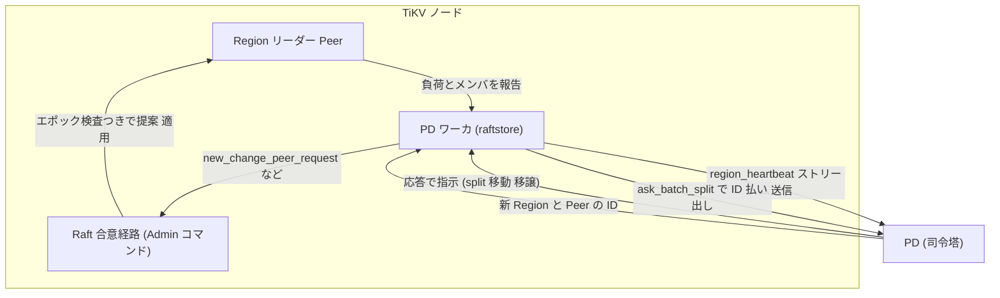

# 第21章 PD との連携

> **本章で読むソース**
>
> - [`components/pd_client/src/lib.rs`](https://github.com/tikv/tikv/blob/v8.5.6/components/pd_client/src/lib.rs)
> - [`components/pd_client/src/client.rs`](https://github.com/tikv/tikv/blob/v8.5.6/components/pd_client/src/client.rs)
> - [`components/raftstore/src/store/worker/pd.rs`](https://github.com/tikv/tikv/blob/v8.5.6/components/raftstore/src/store/worker/pd.rs)

## この章の狙い

ここまでの章では、ひとつの Region が合意を取り、鍵範囲やメンバを変形する仕組みを読んできた。
どこで Region を割るか、新しいレプリカをどの Store へ足すか、どの Peer をリーダーにするかを実際に決めるのは、TiKV ではなくクラスタの司令塔である **PD**（placement driver）である。
本章では、TiKV が PD とどう連携し、自分の状態を報告し、PD の指示を Raft の操作へ翻訳するかを読む。

連携は2つの方向に分かれる。
ひとつは TiKV から PD への報告で、各 Region のリーダーが負荷とメンバ構成を、各 Store が容量と読み書き量を、それぞれ定期的に送る。
もうひとつは PD から TiKV への指示で、報告への応答という形で split やレプリカの移動、リーダー移譲が返り、TiKV はそれを Admin コマンドへ翻訳して合意に乗せる。
PD 本体は別リポジトリにあり全体最適のスケジューリングを担うが、本章では TiKV 側のクライアントとワーカだけを扱う。

## 前提

[第8章 Region と Peer](../part02-raft/08-region-and-peer.md)で扱った Region と Peer の構造、[第11章 分割、マージ、スナップショット、メンバ変更](../part02-raft/11-split-merge-snapshot.md)で扱った Admin コマンドによる変形を前提とする。
クラスタ全体の Store と Region と Peer の関係は[第2章 アーキテクチャ、Store と Region と Peer](../part00-overview/02-architecture.md)で述べた。
PD が下した「どこで割るか」「どこへ足すか」の判断を、TiKV が Raft の合意に乗せて安全に実行する役を担う点が、本章の軸になる。

## PdClient トレイト

TiKV から PD への呼び出しは、すべて `PdClient` トレイトのメソッドとして定義される。
実体は gRPC で PD と話す `RpcClient` だが、呼び出し側はこのトレイト越しにアクセスするため、テストではモックに差し替えられる。

トレイトには、クラスタの初期化から ID 払い出し、Region 情報の問い合わせ、ハートビート、TSO までが並ぶ。

[`components/pd_client/src/lib.rs` L282-L316](https://github.com/tikv/tikv/blob/v8.5.6/components/pd_client/src/lib.rs#L282-L316)

```rust
pub trait PdClient: Send + Sync {
    /// Returns the cluster ID.
    fn get_cluster_id(&self) -> Result<u64> {
        unimplemented!();
    }

    /// Creates the cluster with cluster ID, node, stores and first Region.
    /// If the cluster is already bootstrapped, return ClusterBootstrapped
    /// error. When a node starts, if it finds nothing in the node and
    /// cluster is not bootstrapped, it begins to create node, stores, first
    /// Region and then call bootstrap_cluster to let PD know it.
    /// It may happen that multi nodes start at same time to try to
    /// bootstrap, but only one can succeed, while others will fail
    /// and must remove their created local Region data themselves.
    fn bootstrap_cluster(
        &self,
        _stores: metapb::Store,
        _region: metapb::Region,
    ) -> Result<Option<ReplicationStatus>> {
        unimplemented!();
    }

    /// Returns whether the cluster is bootstrapped or not.
    ///
    /// Cluster must be bootstrapped when we use it, so when the
    /// node starts, `is_cluster_bootstrapped` must be called,
    /// and panics if cluster was not bootstrapped.
    fn is_cluster_bootstrapped(&self) -> Result<bool> {
        unimplemented!();
    }

    /// Allocates a unique positive id.
    fn alloc_id(&self) -> Result<u64> {
        unimplemented!();
    }
```

クラスタの初回起動では、最初のノードが空であることを見つけて最初の Region を作り、`bootstrap_cluster` で PD に知らせる。
複数ノードが同時に bootstrap を試みても、成功するのは1つだけで、残りは自分が作ったローカルデータを消す。
この排他により、クラスタには常にただ1つの初期状態が確定する。

ID の払い出しは `alloc_id` が担う。
新しい Region や Peer に振る一意な番号は、TiKV が勝手に決めるのではなく PD に問い合わせる。
全ノードが同じ採番源を共有するため、分割やメンバ追加で生まれる新しい ID が衝突しない。
トレイトのコメントが述べるとおり、PD は Region と Peer の所在を自分で把握しているため、Region 自体の put や delete を TiKV から送る必要はない。
新しい Peer をどの Store に置くか、どの2つの Region をマージするか、Region をどこへ動かすかは、すべて PD が決める。

## Region ハートビート

各 Region のリーダーは、自分の状態を `region_heartbeat` で定期的に PD へ報告する。
報告に乗る内容は `RegionStat` にまとまっている。

[`components/pd_client/src/lib.rs` L46-L64](https://github.com/tikv/tikv/blob/v8.5.6/components/pd_client/src/lib.rs#L46-L64)

```rust
#[derive(Default, Clone, Debug)]
pub struct RegionStat {
    pub down_peers: Vec<pdpb::PeerStats>,
    pub pending_peers: Vec<metapb::Peer>,
    pub written_bytes: u64,
    pub written_keys: u64,
    pub read_bytes: u64,
    pub read_keys: u64,
    pub query_stats: QueryStats,
    // Now, this info is not sent to PD (maybe in the future). It is needed here to make it
    // collected by region collector.
    pub cop_detail: RegionWriteCfCopDetail,
    pub approximate_size: u64,
    pub approximate_keys: u64,
    pub last_report_ts: UnixSecs,
    // cpu_usage is the CPU time usage of the leader region since the last heartbeat,
    // which is calculated by cpu_time_delta/heartbeat_reported_interval.
    pub cpu_usage: u64,
}
```

報告は2系統の情報を含む。
ひとつは負荷で、書き込みと読み取りのバイト数とキー数、クエリ数、CPU 使用量がある。
もうひとつはメンバの健康状態で、応答しない `down_peers` と、まだ追従中の `pending_peers` がある。
PD はこれらを集めてクラスタ全体を俯瞰し、どの Region が大きすぎるか、どこにレプリカが足りないかを判断する。

`RpcClient` の `region_heartbeat` 実装は、`RegionStat` の各フィールドを `RegionHeartbeatRequest` に詰め替えて送る。

[`components/pd_client/src/client.rs` L585-L616](https://github.com/tikv/tikv/blob/v8.5.6/components/pd_client/src/client.rs#L585-L616)

```rust
    fn region_heartbeat(
        &self,
        term: u64,
        region: metapb::Region,
        leader: metapb::Peer,
        region_stat: RegionStat,
        replication_status: Option<RegionReplicationStatus>,
    ) -> PdFuture<()> {
        PD_HEARTBEAT_COUNTER_VEC.with_label_values(&["send"]).inc();

        let mut req = pdpb::RegionHeartbeatRequest::default();
        req.set_term(term);
        req.set_header(self.header());
        req.set_region(region);
        req.set_leader(leader);
        req.set_down_peers(region_stat.down_peers.into());
        req.set_pending_peers(region_stat.pending_peers.into());
        req.set_bytes_written(region_stat.written_bytes);
        req.set_keys_written(region_stat.written_keys);
        req.set_bytes_read(region_stat.read_bytes);
        req.set_keys_read(region_stat.read_keys);
        req.set_query_stats(region_stat.query_stats);
        req.set_approximate_size(region_stat.approximate_size);
        req.set_approximate_keys(region_stat.approximate_keys);
        req.set_cpu_usage(region_stat.cpu_usage);
        if let Some(s) = replication_status {
            req.set_replication_status(s);
        }
        let mut interval = pdpb::TimeInterval::default();
        interval.set_start_timestamp(region_stat.last_report_ts.into_inner());
        interval.set_end_timestamp(UnixSecs::now().into_inner());
        req.set_interval(interval);
```

Region ハートビートは、1回ごとに往復する単発の RPC ではなく、双方向ストリームの送信側へリクエストを流し込む形を取る。
ストリームは一度だけ確立し、以後の各ハートビートは確立済みのストリームに `unbounded_send` で押し込まれる。
TiKV には数万の Region があり、そのリーダーが定期的に報告するため、毎回コネクションを張り直す方式ではオーバーヘッドが大きい。
ストリームを使い回すことで、接続確立の手間を Region ごとのハートビートから切り離している。
PD からの指示は別系統で、同じストリームの受信側から返ってくる（後述の応答ハンドラで読む）。

## Store ハートビートと分割の問い合わせ

Region 単位の報告とは別に、Store 自身も `store_heartbeat` で状態を送る。

[`components/pd_client/src/client.rs` L758-L777](https://github.com/tikv/tikv/blob/v8.5.6/components/pd_client/src/client.rs#L758-L777)

```rust
    fn store_heartbeat(
        &self,
        mut stats: pdpb::StoreStats,
        store_report: Option<pdpb::StoreReport>,
        dr_autosync_status: Option<StoreDrAutoSyncStatus>,
    ) -> PdFuture<pdpb::StoreHeartbeatResponse> {
        let timer = Instant::now();

        let mut req = pdpb::StoreHeartbeatRequest::default();
        req.set_header(self.header());
        stats
            .mut_interval()
            .set_end_timestamp(UnixSecs::now().into_inner());
        req.set_stats(stats);
        if let Some(report) = store_report {
            req.set_store_report(report);
        }
        if let Some(status) = dr_autosync_status {
            req.set_dr_autosync_status(status);
        }
```

Store ハートビートは、ノード全体の容量、使用量、空き、読み書きスループットといった `StoreStats` を運ぶ。
PD はこれを見て、どの Store が満杯に近いか、どこに余裕があるかを把握し、レプリカ配置のバランスを取る。

分割の実行に必要な ID は、`ask_batch_split` で PD に問い合わせる。
リーダーが分割鍵をいくつ用意したかを `count` で渡し、PD は新しい Region と Peer の ID をまとめて払い出す。

[`components/pd_client/src/client.rs` L718-L730](https://github.com/tikv/tikv/blob/v8.5.6/components/pd_client/src/client.rs#L718-L730)

```rust
    fn ask_batch_split(
        &self,
        region: metapb::Region,
        count: usize,
        reason: pdpb::SplitReason,
    ) -> PdFuture<pdpb::AskBatchSplitResponse> {
        let timer = Instant::now();

        let mut req = pdpb::AskBatchSplitRequest::default();
        req.set_header(self.header());
        req.set_region(region);
        req.set_split_count(count as u32);
        req.set_reason(reason);
```

分割鍵を探すのは[第11章](../part02-raft/11-split-merge-snapshot.md)で読んだ `split-check` ワーカだが、新しい ID を PD に採番させる点でここでも PD が関わる。
複数の分割鍵を1回の問い合わせでまとめて払い出すため、大きな Region を一度に複数へ割る場合でも往復が1回で済む。

## raftstore の PD ワーカ

ここまでのクライアント呼び出しを束ね、ハートビートの送出と PD の指示の処理を担うのが、raftstore の PD ワーカである。
ワーカが受け取るタスクは `Task` 列挙で定義され、Region と Store のハートビート、分割の問い合わせなどが並ぶ。

[`components/raftstore/src/store/worker/pd.rs` L150-L171](https://github.com/tikv/tikv/blob/v8.5.6/components/raftstore/src/store/worker/pd.rs#L150-L171)

```rust
    AskBatchSplit {
        region: metapb::Region,
        split_keys: Vec<Vec<u8>>,
        peer: metapb::Peer,
        // If true, right Region derives origin region_id.
        right_derive: bool,
        share_source_region_size: bool,
        callback: Callback<EK::Snapshot>,
        split_reason: pdpb::SplitReason,
    },
    AutoSplit {
        split_infos: Vec<SplitInfo>,
    },
    Heartbeat(HeartbeatTask),
    StoreHeartbeat {
        stats: pdpb::StoreStats,
        report: Option<pdpb::StoreReport>,
        dr_autosync_status: Option<StoreDrAutoSyncStatus>,
    },
    ReportBatchSplit {
        regions: Vec<metapb::Region>,
    },
```

`Heartbeat` タスクの処理は `handle_heartbeat` にある。
ここで負荷のメトリクスを記録したうえで、`pd_client.region_heartbeat` を呼んで報告を送る。

[`components/raftstore/src/store/worker/pd.rs` L1248-L1266](https://github.com/tikv/tikv/blob/v8.5.6/components/raftstore/src/store/worker/pd.rs#L1248-L1266)

```rust
        self.coprocessor_host
            .on_region_heartbeat(&region, &region_stat);
        let resp = self.pd_client.region_heartbeat(
            term,
            region.clone(),
            peer,
            region_stat,
            replication_status,
        );
        let f = async move {
            if let Err(e) = resp.await {
                debug!(
                    "failed to send heartbeat";
                    "region_id" => region.get_id(),
                    "err" => ?e
                );
            }
        };
        self.remote.spawn(f);
```

## PD の指示を Admin コマンドへ翻訳する

PD からの指示は、Region ハートビートストリームの応答として返ってくる。
ワーカは `schedule_heartbeat_receiver` で応答ハンドラを一度だけ登録し、`handle_region_heartbeat_response` に渡す。
応答 `RegionHeartbeatResponse` には、PD が決めた操作が排他的に1つ入っており、ハンドラはその種別ごとに対応する Raft の操作へ翻訳する。

[`components/raftstore/src/store/worker/pd.rs` L1665-L1709](https://github.com/tikv/tikv/blob/v8.5.6/components/raftstore/src/store/worker/pd.rs#L1665-L1709)

```rust
                if resp.has_change_peer() {
                    PD_HEARTBEAT_COUNTER_VEC
                        .with_label_values(&["change peer"])
                        .inc();

                    let mut change_peer = resp.take_change_peer();
                    info!(
                        "try to change peer";
                        "region_id" => region_id,
                        "change_type" => ?change_peer.get_change_type(),
                        "peer" => ?change_peer.get_peer()
                    );
                    let req = new_change_peer_request(
                        change_peer.get_change_type(),
                        change_peer.take_peer(),
                    );
                    send_admin_request(&router, region_id, epoch, peer, req, Callback::None, Default::default());
                } else if resp.has_change_peer_v2() {
                    PD_HEARTBEAT_COUNTER_VEC
                        .with_label_values(&["change peer"])
                        .inc();

                    let mut change_peer_v2 = resp.take_change_peer_v2();
                    info!(
                        "try to change peer";
                        "region_id" => region_id,
                        "changes" => ?change_peer_v2.get_changes(),
                    );
                    let req = new_change_peer_v2_request(change_peer_v2.take_changes().into());
                    send_admin_request(&router, region_id, epoch, peer, req, Callback::None, Default::default());
                } else if resp.has_transfer_leader() {
                    PD_HEARTBEAT_COUNTER_VEC
                        .with_label_values(&["transfer leader"])
                        .inc();

                    let mut transfer_leader = resp.take_transfer_leader();
                    info!(
                        "try to transfer leader";
                        "region_id" => region_id,
                        "from_peer" => ?peer,
                        "to_peer" => ?transfer_leader.get_peer(),
                        "to_peers" => ?transfer_leader.get_peers(),
                    );
                    let req = new_transfer_leader_request(transfer_leader.take_peer(), transfer_leader.take_peers().into());
                    send_admin_request(&router, region_id, epoch, peer, req, Callback::None, Default::default());
```

`change_peer` はレプリカの追加や削除で、`new_change_peer_request` が `ChangePeer` の Admin リクエストを組み立てる。
`transfer_leader` はリーダー移譲で、`TransferLeader` の Admin リクエストになる。
`split_region` や `merge` も同様に、それぞれの Admin リクエストへ翻訳される。
どの指示も、最後は `send_admin_request` を通って Raft の合意経路へ乗る点が共通する。

`send_admin_request` は、翻訳した `AdminRequest` を `RaftCmdRequest` で包み、ヘッダに Region ID とエポックを設定して送る。

[`components/raftstore/src/store/worker/pd.rs` L2592-L2619](https://github.com/tikv/tikv/blob/v8.5.6/components/raftstore/src/store/worker/pd.rs#L2592-L2619)

```rust
fn send_admin_request<EK, ER>(
    router: &RaftRouter<EK, ER>,
    region_id: u64,
    epoch: metapb::RegionEpoch,
    peer: metapb::Peer,
    request: AdminRequest,
    callback: Callback<EK::Snapshot>,
    extra_opts: RaftCmdExtraOpts,
) where
    EK: KvEngine,
    ER: RaftEngine,
{
    let cmd_type = request.get_cmd_type();

    let mut req = RaftCmdRequest::default();
    req.mut_header().set_region_id(region_id);
    req.mut_header().set_region_epoch(epoch);
    req.mut_header().set_peer(peer);
    req.set_admin_request(request);

    let cmd = RaftCommand::new_ext(req, callback, extra_opts);
    if let Err(e) = router.send_raft_command(cmd) {
        error!(
            "send request failed";
            "region_id" => region_id, "cmd_type" => ?cmd_type, "err" => ?e,
        );
    }
}
```

ヘッダにエポックを乗せる点が、PD の指示を安全に適用する鍵になる。
応答に含まれるエポックは、PD が指示を出した時点での Region の世代であり、提案が適用されるまでに Region が別の分割やメンバ変更を経ていれば、エポックがずれて提案は弾かれる。
PD は全体を俯瞰して指示を出すが、その指示が古くなっていないかの最終確認は、Region 自身が合意の局所的な状態で行う。
この二段構えにより、PD の判断とローカルの Raft 状態が食い違っても、矛盾した変更が適用されない。

## 分割の問い合わせから適用まで

分割を例に、TiKV と PD の往復を通しで見る。
ワーカは `handle_ask_batch_split` で PD に ID を問い合わせ、応答が返ったら `new_batch_split_region_request` で `BatchSplit` の Admin リクエストを組み立て、`send_admin_request` で合意へ乗せる。

[`components/raftstore/src/store/worker/pd.rs` L1151-L1180](https://github.com/tikv/tikv/blob/v8.5.6/components/raftstore/src/store/worker/pd.rs#L1151-L1180)

```rust
        let resp = pd_client.ask_batch_split(region.clone(), split_keys.len(), reason);
        let f = async move {
            match resp.await {
                Ok(mut resp) => {
                    info!(
                        "try to batch split region";
                        "region_id" => region.get_id(),
                        "new_region_ids" => ?resp.get_ids(),
                        "region" => ?region,
                        "task" => task,
                    );

                    let req = new_batch_split_region_request(
                        split_keys,
                        resp.take_ids().into(),
                        right_derive,
                        share_source_region_size,
                    );
                    let region_id = region.get_id();
                    let epoch = region.take_region_epoch();
                    send_admin_request(
                        &router,
                        region_id,
                        epoch,
                        peer,
                        req,
                        callback,
                        Default::default(),
                    );
                }
```

PD が払い出した新しい Region と Peer の ID は、`new_batch_split_region_request` で各分割鍵と組にされ、`BatchSplit` リクエストの中の `SplitRequest` 群に詰められる。
ここでも応答から取り出した `epoch` をヘッダに乗せて送るため、問い合わせと適用のあいだに Region が変わっていれば提案は弾かれる。

## ハートビートと指示の流れ

ここまでの往復を1枚の図にまとめる。
Region リーダーがハートビートで負荷を報告し、PD が全体を見て指示を返し、TiKV がそれを Admin コマンドとして適用する流れである。



## まとめ

TiKV は PD を司令塔として、報告と指示の2方向で連携する。
報告は `region_heartbeat` と `store_heartbeat` で、各 Region のリーダーが負荷とメンバ構成を、各 Store が容量とスループットを送る。
指示は Region ハートビートストリームの応答として返り、`handle_region_heartbeat_response` が `ChangePeer`、`TransferLeader`、split、merge などへ翻訳する。
新しい Region や Peer の ID は `alloc_id` や `ask_batch_split` で PD に採番させ、全ノードが衝突しない番号を共有する。
PD の指示は最後に `send_admin_request` で Admin コマンドとして合意に乗り、ヘッダのエポックで古い指示が弾かれる。
全体最適の判断は PD が下し、その指示がローカルの Raft 状態と矛盾しないかの確認は Region 自身が行う、という分業が連携の骨格である。

## 関連する章

- [第2章 アーキテクチャ、Store と Region と Peer](../part00-overview/02-architecture.md)：PD が俯瞰する Store と Region と Peer の関係。
- [第8章 Region と Peer](../part02-raft/08-region-and-peer.md)：ハートビートで報告する Region のメタ情報とエポックの基礎。
- [第11章 分割、マージ、スナップショット、メンバ変更](../part02-raft/11-split-merge-snapshot.md)：PD の指示が翻訳される Admin コマンドの実行側。
