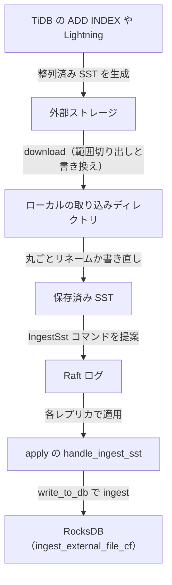

# 第22章 sst_importer と CDC、backup

> **本章で読むソース**
>
> - [`components/sst_importer/src/sst_importer.rs`](https://github.com/tikv/tikv/blob/v8.5.6/components/sst_importer/src/sst_importer.rs)
> - [`components/sst_importer/src/import_file.rs`](https://github.com/tikv/tikv/blob/v8.5.6/components/sst_importer/src/import_file.rs)
> - [`components/raftstore/src/store/fsm/apply.rs`](https://github.com/tikv/tikv/blob/v8.5.6/components/raftstore/src/store/fsm/apply.rs)
> - [`components/cdc/src/delegate.rs`](https://github.com/tikv/tikv/blob/v8.5.6/components/cdc/src/delegate.rs)
> - [`components/cdc/src/endpoint.rs`](https://github.com/tikv/tikv/blob/v8.5.6/components/cdc/src/endpoint.rs)
> - [`components/backup/src/endpoint.rs`](https://github.com/tikv/tikv/blob/v8.5.6/components/backup/src/endpoint.rs)

## この章の狙い

ここまでの章は、TiKV が1件ずつの読み書きとトランザクションをどう処理するかを追ってきた。
本章は、大量データを一括で出し入れする3つの運用機能を扱い、本書を締めくくる。

第1の機能は**取り込み**である。
TiDB の `ADD INDEX` や外部ツールの Lightning は、整列済みの **SST**（Sorted String Table）ファイルをあらかじめ生成する。
`sst_importer` は、その SST を通常の書き込みパスを通さずに TiKV のストレージへ直接組み込む。

第2の機能は**変更データ取得**（CDC）である。
`cdc` コンポーネントは、Region に対するプリライトとコミットのイベントを購読者へ流し、どこまでが順序確定済みかを resolved_ts で保証する。

第3の機能は**バックアップ**である。
`backup` コンポーネントは、各 Region をスキャンして外部ストレージへ保存する。

取り込みを主に読み、CDC とバックアップは仕組みの骨格だけを扱う。

## 前提

取り込みは Raft の適用パスを経由するため、提案と適用（[第9章](../part02-raft/09-propose-and-apply.md)）を前提とする。
SST が最終的に格納される先は RocksDB であり、カラムファミリ単位での取り込みになる点は RocksDB 統合（[第5章](../part01-engine/05-engine-rocks-and-cf.md)）を前提とする。
CDC の順序保証に使う resolved_ts は、第16章（[resolved_ts と GC](../part03-txn/16-resolved-ts-and-gc.md)）で読んだ機構をそのまま購読者へ届けるものである。
取り込みの送り手側、すなわち TiDB の `ADD INDEX` がインデックスデータを SST として生成する流れは、TiDB 編のバックフィル（[第21章](../../tidb/part05-ddl-infra/21-add-index-backfill.md)）で扱う。

## sst_importer による一括取り込み

### SST を管理する SstImporter

取り込みは2段階に分かれる。
まず外部ストレージから SST を取得してローカルに置く`download`、次にそれを RocksDB へ組み込む `ingest` である。
この2段階を司るのが `SstImporter` で、取り込み待ちの SST ファイルを管理する構造体だとコメントが述べている。

[`components/sst_importer/src/sst_importer.rs` L156-L171](https://github.com/tikv/tikv/blob/v8.5.6/components/sst_importer/src/sst_importer.rs#L156-L171)

```rust
/// SstImporter manages SST files that are waiting for ingesting.
pub struct SstImporter<E: KvEngine> {
    dir: ImportDir<E>,
    key_manager: Option<Arc<DataKeyManager>>,
    switcher: Either<ImportModeSwitcher, ImportModeSwitcherV2>,
    // TODO: lift api_version as a type parameter.
    api_version: ApiVersion,
    compression_types: HashMap<CfName, SstCompressionType>,

    cached_storage: CacheMap<StorageBackend>,
    // We need to keep reference to the runtime so background tasks won't be dropped.
    _download_rt: Runtime,
    file_locks: Arc<DashMap<String, (CacheKvFile, Instant)>>,
    memory_quota: Arc<MemoryQuota>,
    multi_master_keys_backend: MultiMasterKeyBackend,
}
```

`dir` がローカルの取り込み用ディレクトリ、`cached_storage` が外部ストレージへの接続のキャッシュである。
`file_locks` は同じ SST に対する `download` 要求の重複を抑える。

### download はキーの書き換えと範囲の切り出しを担う

`download` は外部ストレージから SST を取得するだけではない。
取得した SST に対して、消費すべきキー範囲の切り出しと、キープレフィックスの書き換えという2つの変換を行ってから保存する。
その2つの変換の意味を、メソッド先頭のコメントが説明している。

[`components/sst_importer/src/sst_importer.rs` L383-L409](https://github.com/tikv/tikv/blob/v8.5.6/components/sst_importer/src/sst_importer.rs#L383-L409)

```rust
    // Downloads an SST file from an external storage.
    //
    // This method is blocking. It performs the following transformations before
    // writing to disk:
    //
    //  1. only KV pairs in the *inclusive* range (`[start, end]`) are used. (set
    //     the range to `["", ""]` to import everything).
    //  2. keys are rewritten according to the given rewrite rule.
    //
    // Both the range and rewrite keys are specified using origin keys. However,
    // the SST itself should be data keys (contain the `z` prefix). The range
    // should be specified using keys after rewriting, to be consistent with the
    // region info in PD.
    //
    // This method returns the *inclusive* key range (`[start, end]`) of SST
    // file created, or returns None if the SST is empty.
    pub async fn download_ext(
        &self,
        meta: &SstMeta,
        backend: &StorageBackend,
        name: &str,
        rewrite_rule: &RewriteRule,
        crypter: Option<CipherInfo>,
        speed_limiter: Limiter,
        engine: E,
        ext: DownloadExt<'_>,
    ) -> Result<Option<Range>> {
```

キー範囲の切り出しが必要なのは、生成済みの SST が含むキーが対象 Region の範囲とずれることがあるためである。
キープレフィックスの書き換えが必要なのは、`ADD INDEX` が SST を作った時点のテーブル ID と、取り込み先の実テーブル ID が異なる場合があり、その差をプレフィックスの付け替えで吸収するためである。

### 書き換えが不要なら丸ごとリネームする

`download` の中身を司る `do_download_ext_after_lock_check` には、本章で扱う取り込みの工夫がある。
キーの書き換えが不要で、かつ SST のキーが消費すべき範囲に完全に収まっている場合、SST をイテレートして新しいファイルを書き直す代わりに、ファイルを丸ごとリネームして済ませる。
SST の先頭キーと末尾キーだけを読み、範囲に収まるかを判定する。

[`components/sst_importer/src/sst_importer.rs` L1456-L1500](https://github.com/tikv/tikv/blob/v8.5.6/components/sst_importer/src/sst_importer.rs#L1456-L1500)

```rust
        let start_rename_rewrite = Instant::now();
        // read the first and last keys from the SST, determine if we could
        // simply move the entire SST instead of iterating and generate a new one.
        let mut iter = sst_reader.iter(IterOptions::default())?;
        let direct_retval = (|| -> Result<Option<_>> {
            if rewrite_rule.old_key_prefix != rewrite_rule.new_key_prefix
                || rewrite_rule.new_timestamp != 0
                || rewrite_rule.ignore_after_timestamp != 0
                || rewrite_rule.ignore_before_timestamp != 0
            {
                // must iterate if we perform key rewrite
                return Ok(None);
            }
            if !iter.seek_to_first()? {
                let mut range = meta.get_range().clone();
                if req_type == DownloadRequestType::Keyspace {
                    *range.mut_start() = encode_bytes(&range.take_start());
                    *range.mut_end() = encode_bytes(&range.take_end());
                }
                // the SST is empty, so no need to iterate at all (should be impossible?)
                return Ok(Some(range));
            }

            let start_key = keys::origin_key(iter.key());
            if is_before_start_bound(start_key, &range_start) {
                // SST's start is before the range to consume, so needs to iterate to skip over
                return Ok(None);
            }
            let start_key = start_key.to_vec();

            // seek to end and fetch the last (inclusive) key of the SST.
            iter.seek_to_last()?;
            let last_key = keys::origin_key(iter.key());
            if is_after_end_bound(last_key, &range_end) {
                // SST's end is after the range to consume
                return Ok(None);
            }

            // range contained the entire SST, no need to iterate, just moving the file is
            // ok
            let mut range = Range::default();
            range.set_start(start_key);
            range.set_end(last_key.to_vec());
            Ok(Some(range))
        })()?;
```

判定が `Some` を返すと、続くコードはファイルを書き直さずに `rename` だけで保存先へ移す。
書き換えが不要なケースでは、SST 全体を1件ずつ読み直してエンコードし直す処理を丸ごと省ける。
これにより、巨大データの取り込みでディスク I/O とエンコードのコストを抑える。

### ingest は SST を RocksDB へ直接組み込む

ローカルへ保存した SST を RocksDB へ組み込むのが `ingest` である。
カラムファミリ単位で SST のパスをまとめ、`ingest_external_file_cf` でそのカラムファミリへ取り込む。

[`components/sst_importer/src/import_file.rs` L384-L420](https://github.com/tikv/tikv/blob/v8.5.6/components/sst_importer/src/import_file.rs#L384-L420)

```rust
    pub fn ingest(
        &self,
        metas: &[SstMetaInfo],
        engine: &E,
        key_manager: Option<Arc<DataKeyManager>>,
        api_version: ApiVersion,
    ) -> Result<()> {
        let start = Instant::now();

        let meta_vec = metas
            .iter()
            .map(|info| info.meta.clone())
            .collect::<Vec<_>>();
        if !self
            .check_api_version(&meta_vec, key_manager.clone(), api_version)
            .unwrap()
        {
            panic!("cannot ingest because of incompatible api version");
        }

        let mut paths = HashMap::new();
        let mut ingest_bytes = 0;
        for info in metas {
            let path = self.join_for_read(&info.meta)?;
            let cf = info.meta.get_cf_name();
            super::prepare_sst_for_ingestion(&path.save, &path.clone, key_manager.as_deref())?;
            ingest_bytes += info.total_bytes;
            paths.entry(cf).or_insert_with(Vec::new).push(path);
        }

        for (cf, cf_paths) in paths {
            let files: Vec<&str> = cf_paths.iter().map(|p| p.clone.to_str().unwrap()).collect();
            // TiDB guarantees that region will not receive writes during ingestion.
            // Set `force_allow_write` to true to minimize the impact on foreground
            // performance. Refer to https://github.com/tikv/tikv/issues/18081.
            engine.ingest_external_file_cf(cf, &files, None, true /* force_allow_write */)?;
        }
```

`ingest_external_file_cf` は RocksDB の `IngestExternalFile` を呼ぶ。
整列済みの SST を LSM-tree の特定のレベルへファイルとして据え付けるため、MemTable への1件ずつの書き込みやプリライトとコミットの手続きを一切経ない。
これが、書き込みパスを飛ばして巨大データを高速に入れられる理由である。

### Raft を通した IngestSst コマンドの適用

取り込みも、ほかの書き込みと同じく Raft のログとして提案され、各レプリカで適用される。
取り込み専用のコマンド型 `IngestSst` がその役を担う。
適用パスは `IngestSst` を受けると、SST が対象 Region の範囲に収まるかを検査し、検証に通ったメタ情報を保留リストに積む。

[`components/raftstore/src/store/fsm/apply.rs` L2036-L2056](https://github.com/tikv/tikv/blob/v8.5.6/components/raftstore/src/store/fsm/apply.rs#L2036-L2056)

```rust
        let sst = req.get_ingest_sst().get_sst();

        if let Err(e) = check_sst_for_ingestion(sst, &self.region) {
            error!(?e;
                 "ingest fail";
                 "region_id" => self.region_id(),
                 "peer_id" => self.id(),
                 "sst" => ?sst,
                 "region" => ?&self.region,
            );
            // This file is not valid, we can delete it here.
            let _ = ctx.importer.delete(sst);
            return Err(e);
        }

        match ctx.importer.validate(sst) {
            Ok(meta_info) => {
                ctx.pending_ssts.push(meta_info.clone());
                self.has_pending_ssts = true;
                ssts.push(meta_info)
            }
```

実際の `ingest` は、保留した SST を RocksDB へ書き出すタイミングで呼ばれる。
適用結果を RocksDB へ反映する `write_to_db` は、同じバッチに `IngestSst` のあとに通常の書き込みが続いても順序が保たれるよう、先に保留 SST を取り込んでから書き込みバッチを書き込む。

[`components/raftstore/src/store/fsm/apply.rs` L582-L596](https://github.com/tikv/tikv/blob/v8.5.6/components/raftstore/src/store/fsm/apply.rs#L582-L596)

```rust
        // There may be put and delete requests after ingest request in the same fsm.
        // To guarantee the correct order, we must ingest the pending_sst first, and
        // then persist the kv write batch to engine.
        if !self.pending_ssts.is_empty() {
            let tag = self.tag.clone();
            self.importer
                .ingest(&self.pending_ssts, &self.engine)
                .unwrap_or_else(|e| {
                    panic!(
                        "{} failed to ingest ssts {:?}: {:?}",
                        tag, self.pending_ssts, e
                    );
                });
            self.pending_ssts = vec![];
        }
```

取り込みを Raft のログとして適用するため、SST はリーダーとフォロワーの双方に同じ順序で組み込まれ、レプリカ間で内容が一致する。
1件ずつの書き込みパスを飛ばしながら、Raft の合意による複製の一貫性は保たれる。

### download から ingest までの流れ

ここまでの流れを図にまとめる。



通常の書き込みは MemTable とプリライトとコミットを経るが、取り込みはこの図のとおり SST をファイルとして据え付ける経路をとる。
書き込みパスを飛ばすことで、巨大データの取り込みを高速化する。

## CDC による変更データ取得

`cdc` コンポーネントは、Region に対する変更を購読者へ流す。
Raft の適用を観測し、プリライトやコミットの書き込みを行イベント `EventRow` へ変換する。
書き込みレコードを `EventRow` へ変換する `decode_write` が、その核を示している。

[`components/cdc/src/delegate.rs` L1243-L1264](https://github.com/tikv/tikv/blob/v8.5.6/components/cdc/src/delegate.rs#L1243-L1264)

```rust
    let (op_type, r_type) = match write.write_type {
        WriteType::Put => (EventRowOpType::Put, EventLogType::Commit),
        WriteType::Delete => (EventRowOpType::Delete, EventLogType::Commit),
        WriteType::Rollback => (EventRowOpType::Unknown, EventLogType::Rollback),
        other => {
            debug!("cdc skip write record"; "write" => ?other, "key" => %key);
            return true;
        }
    };
    let commit_ts = if write.write_type == WriteType::Rollback {
        assert_eq!(write.txn_source, 0);
        0
    } else {
        key.decode_ts().unwrap().into_inner()
    };
    row.start_ts = write.start_ts.into_inner();
    row.commit_ts = commit_ts;
    row.key = key.truncate_ts().unwrap().into_raw().unwrap();
    row.op_type = op_type as _;
    // used for filter out the event. see `txn_source` field for more detail.
    row.txn_source = write.txn_source;
    set_event_row_type(row, r_type);
```

`WriteType::Put` と `WriteType::Delete` をコミットイベントへ、`WriteType::Rollback` をロールバックイベントへ対応づける。
変換した行は、`start_ts` と `commit_ts` を持つ。
これにより購読者は、各変更がどのトランザクションのどの時点のものかを知る。

ただし、コミットイベントをそのまま流すだけでは、購読者はある時刻までのイベントを取りこぼしなく受け取ったと判断できない。
そこで CDC は resolved_ts を併せて配信する。
resolved_ts は、その時刻以前のコミットがもう増えないことを保証する境界であり、第16章で読んだ機構をそのまま使う。
`emit_resolved_ts` が、Region ごとの resolved_ts をイベントとして購読者へ送る。

[`components/cdc/src/endpoint.rs` L403-L411](https://github.com/tikv/tikv/blob/v8.5.6/components/cdc/src/endpoint.rs#L403-L411)

```rust
            let mut resolved_ts = ResolvedTs::default();
            resolved_ts.ts = ts;
            resolved_ts.request_id = req_id.0;
            *resolved_ts.mut_regions() = regions;

            let res = conn
                .get_sink()
                .unbounded_send(CdcEvent::ResolvedTs(resolved_ts), false);
            handle_send_result(conn, res);
```

購読者は、resolved_ts までに受け取ったコミットイベントを時刻順に並べれば、その時刻までの変更を確定した順序で再現できる。

## backup による外部ストレージへの保存

`backup` コンポーネントは、各 Region をスキャンして外部ストレージへ保存する。
スキャンの単位は `BackupRange` で、`backup_ts` の時点のスナップショットを取り、そのスナップショット上を `entry_scanner` で走査する。

[`components/backup/src/endpoint.rs` L401-L422](https://github.com/tikv/tikv/blob/v8.5.6/components/backup/src/endpoint.rs#L401-L422)

```rust
        let mut scanner = snap_store
            .entry_scanner(start_key, end_key, begin_ts, incremental)
            .unwrap();

        let start_scan = Instant::now();
        let mut batch = EntryBatch::with_capacity(BACKUP_BATCH_LIMIT);
        let mut next_file_start_key = self
            .start_key
            .clone()
            .map_or_else(Vec::new, |k| k.into_raw().unwrap());
        let mut writer = writer_builder.build(next_file_start_key.clone(), storage_name)?;
        let mut reschedule_checker =
            RescheduleChecker::new(tokio::task::yield_now, TASK_YIELD_DURATION);
        loop {
            if let Err(e) = scanner.scan_entries(&mut batch) {
                warn!("backup scan entries failed"; "err" => ?e, "ctx" => ?ctx);
                return Err(e.into());
            };
            if batch.is_empty() {
                break;
            }
            debug!("backup scan entries"; "len" => batch.len());
```

走査したエントリはバッチ単位で `writer` へ渡され、SST ファイルとして組み立てられて外部ストレージへ送られる。
保存先は AWS S3 やローカルファイルシステムなどの `ExternalStorage` であり、TiKV のディスクとは独立する。
バックアップは指定時刻のスナップショット上を読むため、進行中の読み書きを止めずに一貫したデータを取り出せる。

## まとめ

本章は、TiKV の3つの一括データ機能を扱った。
取り込みは、整列済みの SST を `download` でローカルへ取得し、`IngestSst` コマンドとして Raft を通して適用し、`ingest_external_file_cf` で RocksDB へ直接据え付ける。
書き換えが不要なら SST を丸ごとリネームし、通常の書き込みパスを飛ばすことで、巨大データの取り込みを高速化する。
CDC は、プリライトとコミットの変更を `EventRow` として流し、resolved_ts で順序の確定境界を保証する。
バックアップは、各 Region を指定時刻のスナップショット上でスキャンし、外部ストレージへ保存する。

これで、ストレージエンジンから Raft、トランザクション、コプロセッサ、運用までを一巡した。
TiKV は、1件ずつの読み書きを Percolator と Raft で正しく分散させる一方、一括データの出し入れには専用の経路を用意して、書き込みパスを飛ばす最適化を効かせている。

## 関連する章

- [第9章 提案と適用](../part02-raft/09-propose-and-apply.md)：IngestSst コマンドが Raft のログとして提案され適用される土台。
- [第16章 resolved_ts と GC](../part03-txn/16-resolved-ts-and-gc.md)：CDC が順序確定境界として配信する resolved_ts の機構。
- [第5章 RocksDB 統合とカラムファミリ](../part01-engine/05-engine-rocks-and-cf.md)：取り込んだ SST が格納される下層のストレージとカラムファミリ。
- [第21章 ADD INDEX のバックフィル](../../tidb/part05-ddl-infra/21-add-index-backfill.md)：取り込み先へ送る SST を生成する TiDB 側の送り手。
