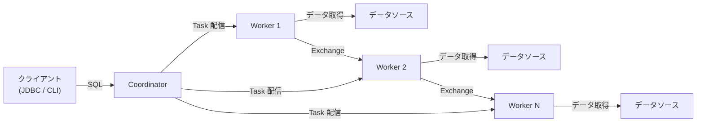
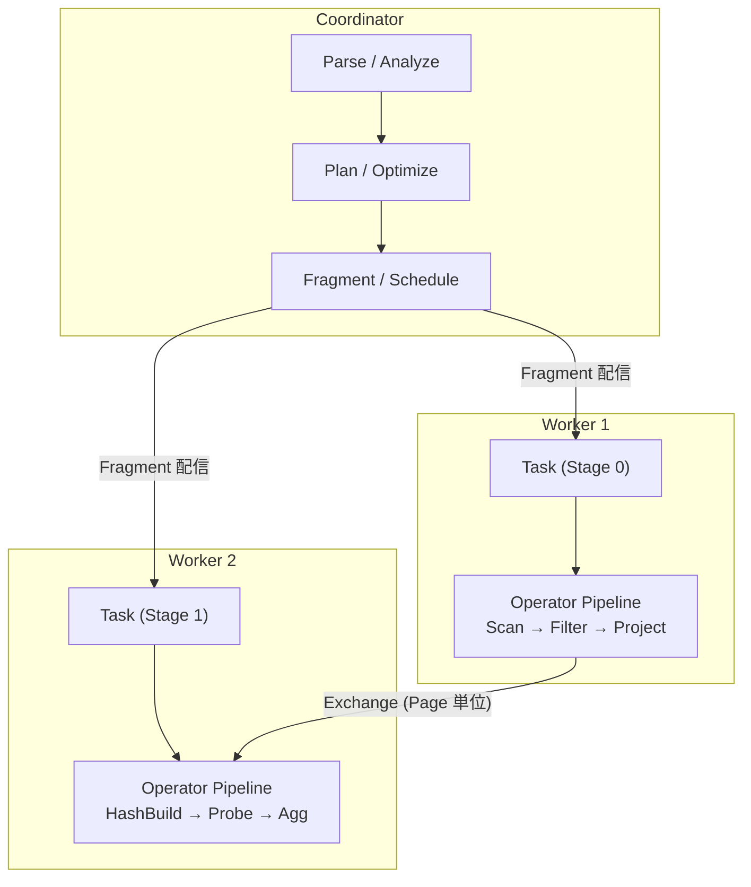

# 第1章 Trino とは何か

> **本章で読むソース**
>
> - [`core/trino-main/src/main/java/io/trino/server/Server.java`](https://github.com/trinodb/trino/blob/482/core/trino-main/src/main/java/io/trino/server/Server.java)
> - [`core/trino-main/src/main/java/io/trino/server/ServerMainModule.java`](https://github.com/trinodb/trino/blob/482/core/trino-main/src/main/java/io/trino/server/ServerMainModule.java)
> - [`core/trino-main/src/main/java/io/trino/server/CoordinatorModule.java`](https://github.com/trinodb/trino/blob/482/core/trino-main/src/main/java/io/trino/server/CoordinatorModule.java)
> - [`core/trino-main/src/main/java/io/trino/server/WorkerModule.java`](https://github.com/trinodb/trino/blob/482/core/trino-main/src/main/java/io/trino/server/WorkerModule.java)
> - [`core/trino-spi/src/main/java/io/trino/spi/Plugin.java`](https://github.com/trinodb/trino/blob/482/core/trino-spi/src/main/java/io/trino/spi/Plugin.java)
> - [`core/trino-main/src/main/java/io/trino/dispatcher/DispatchManager.java`](https://github.com/trinodb/trino/blob/482/core/trino-main/src/main/java/io/trino/dispatcher/DispatchManager.java)
> - [`core/trino-main/src/main/java/io/trino/execution/SqlQueryExecution.java`](https://github.com/trinodb/trino/blob/482/core/trino-main/src/main/java/io/trino/execution/SqlQueryExecution.java)

## この章の狙い

Trino のソースコードを読み始めるにあたり、全体像を先に把握する。
具体的には、Trino がどのような種類のソフトウェアであるか、クラスタを構成する2種類の Node の役割、クエリが SQL テキストから結果行に変わるまでのパイプライン、そして外部データソースとの接続を担う Connector の仕組みを確認する。
以降の章では個々のサブシステムを掘り下げていくため、本章はその地図にあたる。

## 前提

Java の基本的な文法と、DI（依存性注入）フレームワークの概念を知っていれば読み進められる。
Trino は Google Guice をベースとした Airlift フレームワークで DI を行うが、本章では `Module` と `Binder` の基本的な役割（バインディングの登録）を理解していれば十分である。

## Trino の位置づけ

**Trino** は、大規模データに対する対話的な分散 SQL クエリエンジンである。
もともと Facebook 社内で Presto として開発され、2020 年にフォークして Trino と改名された。

「Trino」の特徴は次の3点に集約できる。

- **MPP（Massively Parallel Processing）アーキテクチャ**：1つのクエリを複数の Node で並列実行し、大規模データセットに対しても対話的なレイテンシで応答する
- **ストレージとコンピュートの分離**：Trino 自身はデータを持たず、**Connector** を通じて外部データソース（Hive、Iceberg、PostgreSQL、MySQL など）を読み書きする
- **Plugin による拡張性**：Connector、型、関数、セキュリティ、イベントリスナーなどを Plugin として追加できる SPI を備える

## Coordinator と Worker

Trino クラスタは **Coordinator** と **Worker** の2種類の Node で構成される。



「Coordinator」はクエリの受付、解析、計画立案、スケジューリングを担当する。
「Worker」は Coordinator から割り当てられた Task を実行し、データソースからの読み取りや中間データの処理を行う。

この分離は、設定ファイル `etc/config.properties` の `coordinator=true/false` で決まる。
`ServerConfig` クラスがこの値を保持する。

[`core/trino-main/src/main/java/io/trino/server/ServerConfig.java` L27-L37](https://github.com/trinodb/trino/blob/482/core/trino-main/src/main/java/io/trino/server/ServerConfig.java#L27-L37)

```java
public class ServerConfig
{
    private boolean coordinator = true;
    private boolean concurrentStartup;
    private boolean includeExceptionInResponse = true;
    private Duration gracePeriod = new Duration(2, MINUTES);
    private boolean queryResultsCompressionEnabled = true;
    private Optional<String> queryInfoUrlTemplate = Optional.empty();

    public boolean isCoordinator()
    {
        return coordinator;
    }
```

`ServerMainModule` がこの設定値を参照し、Coordinator であれば `CoordinatorModule` を、そうでなければ `WorkerModule` をインストールする。
この分岐が、同一バイナリで2つの役割を切り替える仕組みの起点である。

[`core/trino-main/src/main/java/io/trino/server/ServerMainModule.java` L199-L208](https://github.com/trinodb/trino/blob/482/core/trino-main/src/main/java/io/trino/server/ServerMainModule.java#L199-L208)

```java
    @Override
    protected void setup(Binder binder)
    {
        ServerConfig serverConfig = buildConfigObject(ServerConfig.class);

        if (serverConfig.isCoordinator()) {
            install(new CoordinatorModule());
        }
        else {
            install(new WorkerModule());
        }
```

## サーバーの起動シーケンス

`Server.doStart()` メソッドが起動処理の本体である。
Guice モジュール群を組み立てて `Bootstrap.initialize()` で Injector を生成し、その後にプラグインのロード、Catalog の登録、セキュリティやリソースグループの初期化を順に行う。

[`core/trino-main/src/main/java/io/trino/server/Server.java` L80-L162](https://github.com/trinodb/trino/blob/482/core/trino-main/src/main/java/io/trino/server/Server.java#L80-L162)

```java
    private void doStart(String trinoVersion)
    {
        // Trino server behavior does not depend on locale settings.
        // Use en_US as this is what Trino is tested with.
        Locale.setDefault(Locale.US);

        long startTime = System.nanoTime();
        verifySystemRequirements();

        Logger log = Logger.get(Server.class);
        log.info("Java version: %s", StandardSystemProperty.JAVA_VERSION.value());

        ImmutableList.Builder<Module> modules = ImmutableList.builder();
        modules.add(
                new NodeModule(),
                new HttpServerModule(),
                new JsonModule(),
                // ... (中略) ...
                new ServerMainModule(trinoVersion),
                new NodeStateManagerModule(),
                new WarningCollectorModule());

        // ... (中略) ...

        Bootstrap app = new Bootstrap("io.trino.bootstrap.engine", modules.build())
                .loadSecretsPlugins();

        try {
            Injector injector = app.initialize();

            // ... (中略) ...

            injector.getInstance(PluginInstaller.class).loadPlugins();

            // ... (中略) ...

            ConnectorServicesProvider connectorServicesProvider = injector.getInstance(ConnectorServicesProvider.class);
            connectorServicesProvider.loadInitialCatalogs();

            // ... (中略) ...

            injector.getInstance(Announcer.class).start();

            injector.getInstance(StartupStatus.class).startupComplete();
            log.info("Server startup completed in %s", Duration.nanosSince(startTime).convertToMostSuccinctTimeUnit());
            log.info("======== SERVER STARTED ========");
        }
```

この起動シーケンスで注目すべき点は、Plugin のロードと Catalog の登録が DI コンテナの初期化後に行われることである。
Plugin がロードされると、その中に含まれる `ConnectorFactory` が登録され、`loadInitialCatalogs()` の段階で `etc/catalog/` 配下の設定ファイルに基づいて各 Catalog が初期化される。

## Coordinator 固有のコンポーネント

`CoordinatorModule` は Coordinator でのみ必要なコンポーネントを大量にバインドする。
代表的なものを抜粋する。

[`core/trino-main/src/main/java/io/trino/server/CoordinatorModule.java` L167-L175](https://github.com/trinodb/trino/blob/482/core/trino-main/src/main/java/io/trino/server/CoordinatorModule.java#L167-L175)

```java
    @Override
    protected void setup(Binder binder)
    {
        install(new WebUiModule());

        // statement resource
        jsonCodecBinder(binder).bindJsonCodec(TaskInfo.class);
        jaxrsBinder(binder).bind(QueuedStatementResource.class);
        jaxrsBinder(binder).bind(ExecutingStatementResource.class);
```

主要なバインディングは次のとおりである。

- `DispatchManager`（クエリの受付とディスパッチ）
- `QueryManager`（クエリのライフサイクル管理）
- `AnalyzerFactory`（意味解析）
- `PlanOptimizersFactory` / `PlanFragmenter`（論理計画の最適化と分散計画への分割）
- `NodeScheduler`（Split の Node 割り当て）
- `DynamicFilterService`（DynamicFilter の管理）
- `ClusterMemoryManager`（クラスタ全体のメモリ管理）

一方、`WorkerModule` は Coordinator 専用の機能を No-Op 実装で埋める。
たとえば `ResourceGroupManager` には `NoOpResourceGroupManager` を、`FailureDetector` には `NoOpFailureDetector` を割り当てる。

[`core/trino-main/src/main/java/io/trino/server/WorkerModule.java` L34-L49](https://github.com/trinodb/trino/blob/482/core/trino-main/src/main/java/io/trino/server/WorkerModule.java#L34-L49)

```java
    @Override
    protected void setup(Binder binder)
    {
        // Install no-op session supplier on workers, since only coordinators create sessions.
        binder.bind(SessionSupplier.class).to(NoOpSessionSupplier.class).in(Scopes.SINGLETON);

        // Install no-op resource group manager on workers, since only coordinators manage resource groups.
        binder.bind(ResourceGroupManager.class).to(NoOpResourceGroupManager.class).in(Scopes.SINGLETON);

        // Install no-op failure detector on workers, since only coordinators need global node selection.
        binder.bind(FailureDetector.class).to(NoOpFailureDetector.class).in(Scopes.SINGLETON);

        // language functions
        binder.bind(WorkerLanguageFunctionProvider.class).in(Scopes.SINGLETON);
        binder.bind(LanguageFunctionProvider.class).to(WorkerLanguageFunctionProvider.class).in(Scopes.SINGLETON);

        binder.bind(WebUiAuthenticationFilter.class).to(NoWebUiAuthenticationFilter.class).in(Scopes.SINGLETON);
```

Worker にはセッション管理、リソースグループ管理、障害検知といった Coordinator 側の機能が不要であることがコメントからも読み取れる。

## Plugin と SPI

Trino の拡張性は `Plugin` インタフェースに集約されている。
`Plugin` は Connector だけでなく、型、関数、セキュリティ、イベントリスナー、Exchange マネージャなど多岐にわたるファクトリを返す。

[`core/trino-spi/src/main/java/io/trino/spi/Plugin.java` L38-L68](https://github.com/trinodb/trino/blob/482/core/trino-spi/src/main/java/io/trino/spi/Plugin.java#L38-L68)

```java
public interface Plugin
{
    default Iterable<CatalogStoreFactory> getCatalogStoreFactories()
    {
        return emptyList();
    }

    default Iterable<ConnectorFactory> getConnectorFactories()
    {
        return emptyList();
    }

    default Iterable<BlockEncoding> getBlockEncodings()
    {
        return emptyList();
    }

    default Iterable<Type> getTypes()
    {
        return emptyList();
    }

    // ... (中略) ...

    default Set<Class<?>> getFunctions()
    {
        return emptySet();
    }
```

各メソッドは `default` で空コレクションを返すため、Connector を提供するだけの Plugin は `getConnectorFactories()` のみをオーバーライドすればよい。
この設計により、Plugin の実装者は自分が関心のある拡張ポイントだけを実装できる。

**SPI**（Service Provider Interface）は `core/trino-spi` モジュールに定義された安定インタフェース群であり、Plugin はこの SPI を通じて Trino の内部に機能を注入する。
SPI には `ConnectorFactory`、`ConnectorMetadata`、`ConnectorSplitManager`、`ConnectorPageSource` などが含まれ、Connector はこれらを実装することでデータソースとの橋渡しを行う。

## クエリ実行パイプライン

クライアントから送信された SQL テキストが結果行になるまでの全体像を示す。

```mermaid
flowchart LR
    SQL["SQL テキスト"] --> Parse["Parse<br/>(SqlParser)"]
    Parse --> AST["AST"]
    AST --> Analyze["Analyze<br/>(Analyzer)"]
    Analyze --> Analysis["Analysis"]
    Analysis --> Plan["Plan<br/>(LogicalPlanner)"]
    Plan --> Optimize["Optimize<br/>(PlanOptimizer 群)"]
    Optimize --> Fragment["Fragment<br/>(PlanFragmenter)"]
    Fragment --> Schedule["Schedule<br/>(QueryScheduler)"]
    Schedule --> Execute["Execute<br/>(Operator Pipeline)"]
    Execute --> Result["結果行"]
```



以下ではこのパイプラインの各段階を概観する。

### Parse

`SqlParser.createStatement()` が SQL テキストを ANTLR ベースのパーサーに渡し、AST（抽象構文木）を生成する。

[`core/trino-parser/src/main/java/io/trino/sql/parser/SqlParser.java` L104-L107](https://github.com/trinodb/trino/blob/482/core/trino-parser/src/main/java/io/trino/sql/parser/SqlParser.java#L104-L107)

```java
    public Statement createStatement(String sql)
    {
        return (Statement) invokeParser("statement", sql, SqlBaseParser::singleStatement);
    }
```

### Analyze

`Analyzer.analyze()` が AST に対して意味解析を実行する。
テーブルの存在確認、カラムの型解決、関数の解決、アクセス制御チェックなどを行い、`Analysis` オブジェクトにまとめる。

[`core/trino-main/src/main/java/io/trino/sql/analyzer/Analyzer.java` L91-L113](https://github.com/trinodb/trino/blob/482/core/trino-main/src/main/java/io/trino/sql/analyzer/Analyzer.java#L91-L113)

```java
    public Analysis analyze(Statement statement, QueryType queryType)
    {
        Statement rewrittenStatement = statementRewrite.rewrite(analyzerFactory, session, statement, parameters, parameterLookup, warningCollector, planOptimizersStatsCollector);
        Analysis analysis = new Analysis(rewrittenStatement, parameterLookup, queryType);
        StatementAnalyzer analyzer = statementAnalyzerFactory.createStatementAnalyzer(analysis, session, warningCollector, CorrelationSupport.ALLOWED);

        try (var _ = scopedSpan(tracer, "analyze")) {
            analyzer.analyze(rewrittenStatement);
        }

        try (var _ = scopedSpan(tracer, "access-control")) {
            // check column access permissions for each table
            analysis.getTableColumnReferences().forEach((accessControlInfo, tableColumnReferences) ->
                    tableColumnReferences.forEach((tableAndBranch, columns) ->
                            accessControlInfo.getAccessControl().checkCanSelectFromColumns(
                                    accessControlInfo.getSecurityContext(session.getRequiredTransactionId(), session.getQueryId(), session.getStart()),
                                    tableAndBranch.tableName(),
                                    tableAndBranch.branch(),
                                    columns)));
        }

        return analysis;
    }
```

### Plan と Optimize

`LogicalPlanner.plan()` が `Analysis` から論理実行計画（PlanNode のツリー）を生成し、続いてオプティマイザ群を順次適用する。

[`core/trino-main/src/main/java/io/trino/sql/planner/LogicalPlanner.java` L252-L307](https://github.com/trinodb/trino/blob/482/core/trino-main/src/main/java/io/trino/sql/planner/LogicalPlanner.java#L252-L307)

```java
    public Plan plan(Analysis analysis, Stage stage, boolean collectPlanStatistics)
    {
        PlanNode root;
        try (var _ = scopedSpan(plannerContext.getTracer(), "plan")) {
            root = planStatement(analysis, analysis.getStatement());
        }

        // ... (中略) ...

        if (stage.ordinal() >= OPTIMIZED.ordinal()) {
            try (var _ = scopedSpan(plannerContext.getTracer(), "optimizer")) {
                for (PlanOptimizer optimizer : planOptimizers) {
                    root = runOptimizer(root, tableStatsProvider, optimizer);
                }
            }
        }

        if (stage.ordinal() >= OPTIMIZED_AND_VALIDATED.ordinal()) {
            // make sure we produce a valid plan after optimizations run. This is mainly to catch programming errors
            try (var _ = scopedSpan(plannerContext.getTracer(), "validate-final")) {
                planSanityChecker.validateFinalPlan(root, session, plannerContext, warningCollector);
            }
        }

        // ... (中略) ...

        return new Plan(root, statsAndCosts);
    }
```

オプティマイザは `PlanOptimizer` インタフェースの実装として複数登録されており、ルールベースの書き換え（述語プッシュダウン、プロジェクションプルーニング、結合順序の決定など）を繰り返し適用する。
最適化が完了すると `PlanSanityChecker` が最終計画の妥当性を検証する。

### Fragment

`PlanFragmenter.createSubPlans()` が、最適化済みの論理計画を分散実行のための `SubPlan`（Fragment のツリー）に分割する。

[`core/trino-main/src/main/java/io/trino/sql/planner/PlanFragmenter.java` L126-L136](https://github.com/trinodb/trino/blob/482/core/trino-main/src/main/java/io/trino/sql/planner/PlanFragmenter.java#L126-L136)

```java
    public SubPlan createSubPlans(Session session, Plan plan, boolean forceSingleNode, WarningCollector warningCollector)
    {
        return createSubPlans(
                session,
                plan,
                forceSingleNode,
                warningCollector,
                new PlanFragmentIdAllocator(0),
                new PartitioningScheme(Partitioning.create(SINGLE_DISTRIBUTION, ImmutableList.of()), plan.getRoot().getOutputSymbols()),
                ImmutableMap.of());
    }
```

Exchange ノードを境界として計画ツリーを切断し、各 Fragment が独立した Stage として Worker 上で実行される。

### Schedule と Execute

`SqlQueryExecution.start()` が計画のスケジューリングと実行を開始する。
`planQuery()` で論理計画を生成し、`planDistribution()` でスケジューラを選択した後、`scheduler.start()` で分散実行を起動する。

[`core/trino-main/src/main/java/io/trino/execution/SqlQueryExecution.java` L398-L448](https://github.com/trinodb/trino/blob/482/core/trino-main/src/main/java/io/trino/execution/SqlQueryExecution.java#L398-L448)

```java
    @Override
    public void start()
    {
        try (SetThreadName _ = new SetThreadName("Query-" + stateMachine.getQueryId())) {
            try {
                if (!stateMachine.transitionToPlanning()) {
                    // query already started or finished
                    return;
                }

                // ... (中略) ...

                try {
                    CachingTableStatsProvider tableStatsProvider = new CachingTableStatsProvider(plannerContext.getMetadata(), getSession(), stateMachine::isDone);
                    PlanRoot plan = planQuery(tableStatsProvider);
                    // DynamicFilterService needs plan for query to be registered.
                    // Query should be registered before dynamic filter suppliers are requested in distribution planning.
                    registerDynamicFilteringQuery(plan);
                    planDistribution(plan, tableStatsProvider);
                }

                // ... (中略) ...

                if (!stateMachine.transitionToStarting()) {
                    // query already started or finished
                    return;
                }

                // if query is not finished, start the scheduler, otherwise cancel it
                QueryScheduler scheduler = queryScheduler.get();

                if (!stateMachine.isDone()) {
                    scheduler.start();
                }
```

スケジューラには2種類ある。
通常モードでは `PipelinedQueryScheduler` がパイプライン実行を行い、フォールトトレラントモード（`retry-policy=TASK`）では `EventDrivenFaultTolerantQueryScheduler` がタスクレベルのリトライを行う。
この選択は `planDistribution()` 内で `RetryPolicy` に基づいて決定される。

[`core/trino-main/src/main/java/io/trino/execution/SqlQueryExecution.java` L537-L590](https://github.com/trinodb/trino/blob/482/core/trino-main/src/main/java/io/trino/execution/SqlQueryExecution.java#L537-L590)

```java
        RetryPolicy retryPolicy = getRetryPolicy(getSession());
        QueryScheduler scheduler = switch (retryPolicy) {
            case QUERY, NONE -> new PipelinedQueryScheduler(
                    stateMachine,
                    plan.getRoot(),
                    nodePartitioningManager,
                    nodeScheduler,
                    remoteTaskFactory,
                    // ... (中略) ...
                    coordinatorTaskManager);
            case TASK -> new EventDrivenFaultTolerantQueryScheduler(
                    stateMachine,
                    plannerContext.getMetadata(),
                    remoteTaskFactory,
                    // ... (中略) ...
                    plan.getRoot());
        };
```

## クエリのディスパッチ

クライアントから HTTP で届いた SQL は、まず `DispatchManager` に渡される。
`DispatchManager.createQuery()` がクエリ ID の生成、Session の構築、リソースグループの選択を行い、実行キューに投入する。

[`core/trino-main/src/main/java/io/trino/dispatcher/DispatchManager.java` L175-L201](https://github.com/trinodb/trino/blob/482/core/trino-main/src/main/java/io/trino/dispatcher/DispatchManager.java#L175-L201)

```java
    public ListenableFuture<Void> createQuery(QueryId queryId, Span querySpan, Slug slug, SessionContext sessionContext, String query)
    {
        requireNonNull(queryId, "queryId is null");
        requireNonNull(querySpan, "querySpan is null");
        requireNonNull(sessionContext, "sessionContext is null");
        requireNonNull(query, "query is null");
        checkArgument(!query.isEmpty(), "query must not be empty string");
        checkArgument(!queryTracker.hasQuery(queryId), "query %s already exists", queryId);

        // ... (中略) ...

        DispatchQueryCreationFuture queryCreationFuture = new DispatchQueryCreationFuture();
        dispatchExecutor.execute(Context.current().wrap(() -> {
            Span span = tracer.spanBuilder("dispatch")
                    .addLink(Span.current().getSpanContext())
                    .setParent(Context.current().with(querySpan))
                    .startSpan();
            try (var _ = scopedSpan(span)) {
                createQueryInternal(queryId, querySpan, slug, sessionContext, query, resourceGroupManager);
            }
            finally {
                queryCreationFuture.set(null);
            }
        }));
        return queryCreationFuture;
    }
```

`createQueryInternal()` は Session の作成、アクセス制御チェック、クエリのプリペア、リソースグループの選択を行い、最終的に `DispatchQuery` を生成して `ResourceGroupManager` に submit する。

[`core/trino-main/src/main/java/io/trino/dispatcher/DispatchManager.java` L207-L261](https://github.com/trinodb/trino/blob/482/core/trino-main/src/main/java/io/trino/dispatcher/DispatchManager.java#L207-L261)

```java
    private <C> void createQueryInternal(QueryId queryId, Span querySpan, Slug slug, SessionContext sessionContext, String query, ResourceGroupManager<C> resourceGroupManager)
    {
        Session session = null;
        PreparedQuery preparedQuery = null;
        try {
            // ... (中略) ...

            // decode session
            session = sessionSupplier.createSession(queryId, querySpan, sessionContext);

            // check query execute permissions
            accessControl.checkCanExecuteQuery(sessionContext.getIdentity(), queryId);

            // prepare query
            preparedQuery = queryPreparer.prepareQuery(session, query);

            // select resource group
            Optional<String> queryType = getQueryType(preparedQuery.getStatement()).map(Enum::name);
            SelectionContext<C> selectionContext = resourceGroupManager.selectGroup(new SelectionCriteria(
                    // ... (中略) ...
                    queryType));

            // ... (中略) ...

            DispatchQuery dispatchQuery = dispatchQueryFactory.createDispatchQuery(
                    session,
                    sessionContext.getTransactionId(),
                    query,
                    preparedQuery,
                    slug,
                    selectionContext.getResourceGroupId());

            boolean queryAdded = queryCreated(dispatchQuery);
            if (queryAdded && !dispatchQuery.isDone()) {
                try {
                    resourceGroupManager.submit(dispatchQuery, selectionContext, dispatchExecutor);
                }
                catch (Throwable e) {
                    // dispatch query has already been registered, so just fail it directly
                    dispatchQuery.fail(e);
                }
            }
```

リソースグループはクエリのキューイングと同時実行数制御を担うため、クエリはここでキューに入り、リソースが利用可能になった時点で `SqlQueryExecution.start()` が呼ばれて実行が始まる。

## 最適化の工夫：Coordinator と Worker の役割分離

Trino が大規模データに対して対話的なレスポンスを実現できる要因の一つは、Coordinator と Worker の役割分離にある。

Coordinator はクエリの解析、計画立案、スケジューリングのみを行い、データの読み取りや中間処理は一切行わない[^1]。
Worker はデータの読み取りと演算に専念し、クエリの計画立案には関与しない。
この分離により、Coordinator はクエリの並行度が増えてもメモリやCPU をデータ処理に消費されることがなく、計画立案とスケジューリングの処理能力を維持できる。

Worker は Coordinator から受け取った Fragment（`PlanFragment`）を Operator の Pipeline として実行する。
各 Operator はストリーミング方式でデータを処理する。
すなわち、前段の Operator が Page（列方向のデータバッチ）を生成するたびに後段の Operator がそれを消費するため、Fragment 内のすべてのデータを一度にメモリに保持する必要がない。
この方式により、Worker のメモリ使用量がデータ量に比例して増大することを回避している。



## まとめ

Trino は Coordinator と Worker の2種類の Node で構成される MPP 分散 SQL クエリエンジンである。
同一バイナリが `ServerConfig.isCoordinator()` の設定に基づいて `CoordinatorModule` または `WorkerModule` を選択し、役割に応じたコンポーネント群を DI で構築する。

クエリは次のパイプラインで処理される。

1. **Parse**：SQL テキストを ANTLR で AST に変換する
1. **Analyze**：AST の意味解析を行い、テーブルや型の解決を行う
1. **Plan / Optimize**：論理計画を生成し、オプティマイザ群で最適化する
1. **Fragment**：Exchange を境界として計画を Fragment に分割する
1. **Schedule / Execute**：Fragment を Worker 上の Task として分散実行する

外部データソースとの接続は `Plugin` インタフェースを通じた `ConnectorFactory` の登録で実現される。
以降の章では、このパイプラインの各段階を順に読み進めていく。

## 関連する章

- [第4章 SQL パーサーと AST](../part01-parsing/04-sql-parser-and-ast.md)
- [第5章 Analyzer と意味解析](../part01-parsing/05-analyzer.md)

[^1]: Coordinator 自身が Worker を兼ねる構成も可能だが、プロダクション環境では推奨されない。
