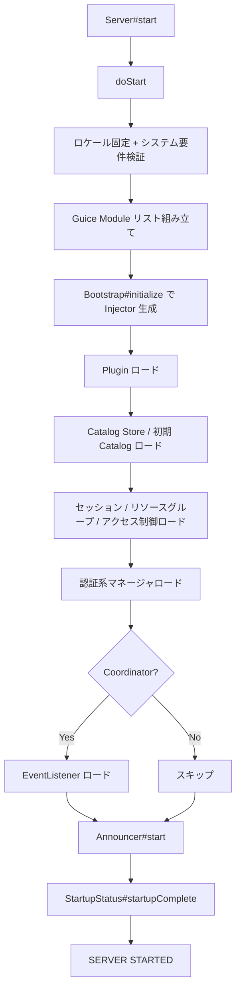
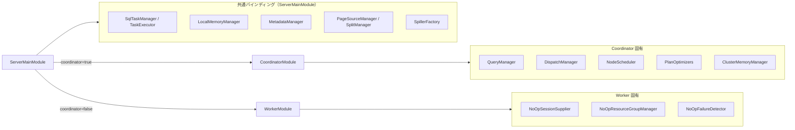
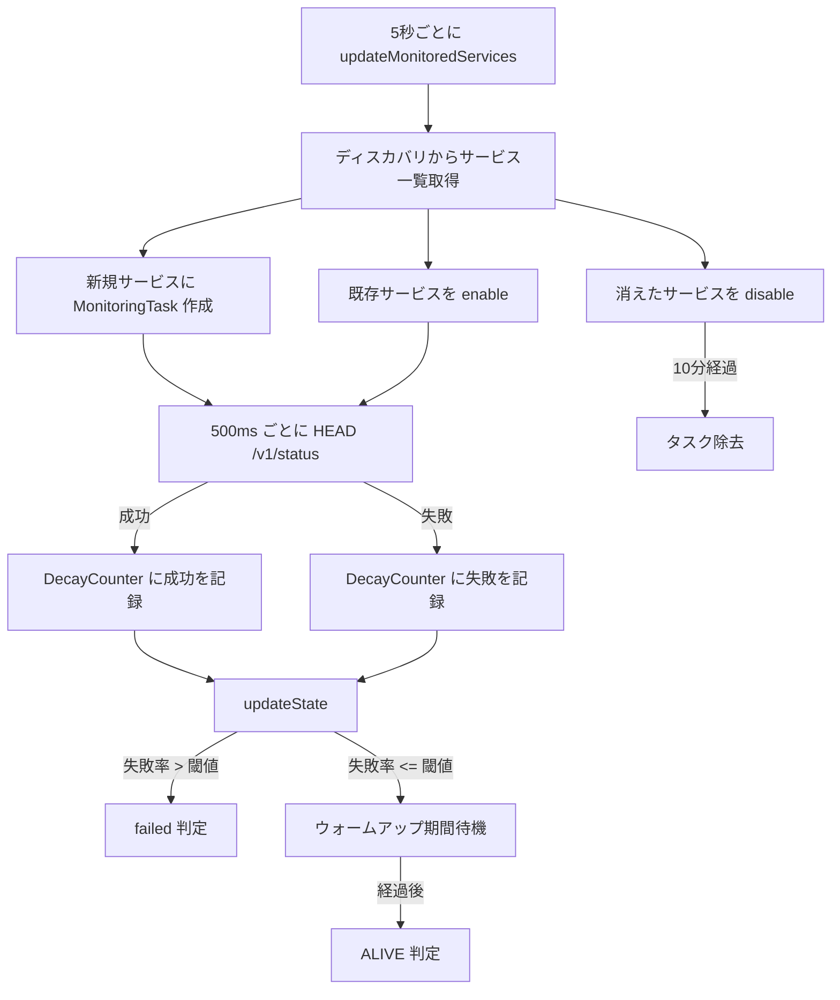

# 第2章 サーバーアーキテクチャ

> **本章で読むソース**
>
> - [`core/trino-main/src/main/java/io/trino/server/Server.java`](https://github.com/trinodb/trino/blob/482/core/trino-main/src/main/java/io/trino/server/Server.java)
> - [`core/trino-main/src/main/java/io/trino/server/ServerMainModule.java`](https://github.com/trinodb/trino/blob/482/core/trino-main/src/main/java/io/trino/server/ServerMainModule.java)
> - [`core/trino-main/src/main/java/io/trino/server/CoordinatorModule.java`](https://github.com/trinodb/trino/blob/482/core/trino-main/src/main/java/io/trino/server/CoordinatorModule.java)
> - [`core/trino-main/src/main/java/io/trino/server/WorkerModule.java`](https://github.com/trinodb/trino/blob/482/core/trino-main/src/main/java/io/trino/server/WorkerModule.java)
> - [`core/trino-main/src/main/java/io/trino/server/ServerConfig.java`](https://github.com/trinodb/trino/blob/482/core/trino-main/src/main/java/io/trino/server/ServerConfig.java)
> - [`core/trino-main/src/main/java/io/trino/node/NodeManagerModule.java`](https://github.com/trinodb/trino/blob/482/core/trino-main/src/main/java/io/trino/node/NodeManagerModule.java)
> - [`core/trino-main/src/main/java/io/trino/node/CoordinatorNodeManager.java`](https://github.com/trinodb/trino/blob/482/core/trino-main/src/main/java/io/trino/node/CoordinatorNodeManager.java)
> - [`core/trino-main/src/main/java/io/trino/failuredetector/HeartbeatFailureDetector.java`](https://github.com/trinodb/trino/blob/482/core/trino-main/src/main/java/io/trino/failuredetector/HeartbeatFailureDetector.java)
> - [`core/trino-main/src/main/java/io/trino/server/ServerInfoResource.java`](https://github.com/trinodb/trino/blob/482/core/trino-main/src/main/java/io/trino/server/ServerInfoResource.java)

## この章の狙い

Trino は Coordinator と Worker という2種類の役割を持つ Node から構成される分散 SQL エンジンである。
本章では、単一バイナリがどのように Coordinator と Worker に分岐して起動するのか、各役割に何がバインドされるのか、そして Node 同士がどのように互いを発見し障害を検知するのかを、ソースコードから読み解く。

## 前提

- Java の DI フレームワーク Guice の基本概念（`Module`、`Binder`、`Injector`）を知っていること。
- Trino が Airlift[^airlift] フレームワーク上に構築されていることを前提とする。

[^airlift]: Airlift は HTTP サーバー、ディスカバリ、設定管理、ロギングなどを提供する軽量フレームワークであり、Trino の基盤として用いられている。

## Server.java の起動シーケンス

Trino サーバーのエントリーポイントは `Server#start` メソッドである。
このメソッドは `EmbedVersion` でバージョン情報をスタックフレームに埋め込んだうえで、実際の起動処理 `doStart` を呼び出す。

[`core/trino-main/src/main/java/io/trino/server/Server.java` L75-L78](https://github.com/trinodb/trino/blob/482/core/trino-main/src/main/java/io/trino/server/Server.java#L75-L78)

```java
public final void start(String trinoVersion)
{
    new EmbedVersion(trinoVersion).embedVersion(() -> doStart(trinoVersion)).run();
}
```

`doStart` はまずロケールを `Locale.US` に固定し、`verifySystemRequirements()` で JVM バージョンやファイルディスクリプタ数などのシステム要件を検証する。

[`core/trino-main/src/main/java/io/trino/server/Server.java` L80-L88](https://github.com/trinodb/trino/blob/482/core/trino-main/src/main/java/io/trino/server/Server.java#L80-L88)

```java
private void doStart(String trinoVersion)
{
    // Trino server behavior does not depend on locale settings.
    // Use en_US as this is what Trino is tested with.
    Locale.setDefault(Locale.US);

    long startTime = System.nanoTime();
    verifySystemRequirements();
```

### Guice モジュールの組み立て

システム要件の検証後、`doStart` は Guice の `Module` リストを組み立てる。
ここで登録されるモジュールは Airlift 基盤のものと Trino 固有のものに大別できる。

[`core/trino-main/src/main/java/io/trino/server/Server.java` L92-L113](https://github.com/trinodb/trino/blob/482/core/trino-main/src/main/java/io/trino/server/Server.java#L92-L113)

```java
ImmutableList.Builder<Module> modules = ImmutableList.builder();
modules.add(
        new NodeModule(),
        new HttpServerModule(),
        new JsonModule(),
        new JaxrsModule(),
        new MBeanModule(),
        new PrefixObjectNameGeneratorModule("io.trino"),
        new JmxModule(),
        new JmxOpenMetricsModule(),
        new LogJmxModule(),
        new TracingModule("trino", trinoVersion),
        new ServerSecurityModule(),
        new AccessControlModule(),
        new EventListenerModule(),
        new ExchangeManagerModule(),
        new CatalogManagerModule(),
        new TransactionManagerModule(),
        new NodeManagerModule(trinoVersion),
        new ServerMainModule(trinoVersion),
        new NodeStateManagerModule(),
        new WarningCollectorModule());
```

`NodeModule` や `HttpServerModule` は Airlift が提供する基盤モジュールであり、Node 識別子の生成や HTTP サーバーの起動を担う。
`ServerMainModule` が Trino 固有の中核バインディングを行うモジュールであり、ここで Coordinator か Worker かに応じたモジュール分岐が発生する（後述）。

### Bootstrap による初期化とサービスの起動

モジュールリストを Airlift の `Bootstrap` に渡し、`app.initialize()` で Guice の `Injector` を生成する。

[`core/trino-main/src/main/java/io/trino/server/Server.java` L117-L121](https://github.com/trinodb/trino/blob/482/core/trino-main/src/main/java/io/trino/server/Server.java#L117-L121)

```java
Bootstrap app = new Bootstrap("io.trino.bootstrap.engine", modules.build())
        .loadSecretsPlugins();

try {
    Injector injector = app.initialize();
```

`Injector` の生成後、起動シーケンスは以下の順に各サブシステムを初期化する。

1. Plugin のロード（`PluginInstaller#loadPlugins`）
2. Catalog Store と初期 Catalog のロード
3. セッションプロパティ、リソースグループ、アクセス制御の設定ロード
4. 認証系マネージャ（パスワード、グループ、証明書、ヘッダー、OAuth2）のロード
5. Exchange Manager と Spooling Manager のロード
6. Coordinator の場合のみ、EventListener のロード
7. `Announcer#start()` でクラスタへの自己通知を開始
8. `StartupStatus#startupComplete()` で起動完了を記録

[`core/trino-main/src/main/java/io/trino/server/Server.java` L131-L161](https://github.com/trinodb/trino/blob/482/core/trino-main/src/main/java/io/trino/server/Server.java#L131-L161)

```java
injector.getInstance(PluginInstaller.class).loadPlugins();

var catalogStoreManager = injector.getInstance(Key.get(new TypeLiteral<Optional<CatalogStoreManager>>() {}));
catalogStoreManager.ifPresent(CatalogStoreManager::loadConfiguredCatalogStore);

ConnectorServicesProvider connectorServicesProvider = injector.getInstance(ConnectorServicesProvider.class);
connectorServicesProvider.loadInitialCatalogs();

// ... (中略) ...

if (injector.getInstance(ServerConfig.class).isCoordinator()) {
    injector.getInstance(EventListenerManager.class).loadEventListeners();
}

// ... (中略) ...

injector.getInstance(Announcer.class).start();

injector.getInstance(StartupStatus.class).startupComplete();
log.info("Server startup completed in %s", Duration.nanosSince(startTime).convertToMostSuccinctTimeUnit());
log.info("======== SERVER STARTED ========");
```

起動完了までの所要時間がログに記録される。
設定エラーの場合は `ApplicationConfigurationException` を捕捉して詳細を出力し、`System.exit(100)` で終了する。

以下の図は、`Server#doStart` の起動シーケンスをまとめたものである。



## ServerMainModule と Coordinator/Worker の分岐

**ServerMainModule** は `AbstractConfigurationAwareModule` を継承しており、設定値を読み取ったうえでバインディングを構成できる。
`setup` メソッドの冒頭で `ServerConfig` を読み取り、`coordinator` プロパティの値に応じて `CoordinatorModule` か `WorkerModule` をインストールする。

[`core/trino-main/src/main/java/io/trino/server/ServerMainModule.java` L199-L209](https://github.com/trinodb/trino/blob/482/core/trino-main/src/main/java/io/trino/server/ServerMainModule.java#L199-L209)

```java
@Override
protected void setup(Binder binder)
{
    ServerConfig serverConfig = buildConfigObject(ServerConfig.class);

    if (serverConfig.isCoordinator()) {
        install(new CoordinatorModule());
    }
    else {
        install(new WorkerModule());
    }
```

この分岐が Trino のアーキテクチャの核である。
同一のバイナリ（JAR）が `coordinator=true` か `coordinator=false` かという設定1つで Coordinator にも Worker にもなる。
ビルド成果物を1種類に保てるため、デプロイとバージョン管理が簡素になる。

### ServerMainModule の共通バインディング

`CoordinatorModule` と `WorkerModule` のどちらがインストールされる場合でも、`ServerMainModule` は両者に共通するコンポーネントを大量にバインドする。
主要なものを以下に挙げる。

- **Task 実行基盤**：`SqlTaskManager`、`TaskExecutor`、`TaskManagementExecutor`、`MemoryRevokingScheduler`
- **メモリ管理**：`LocalMemoryManager`、`MemoryManagerConfig`、`NodeMemoryConfig`
- **メタデータ**：`MetadataManager`、`TypeRegistry`、`FunctionManager`、`GlobalFunctionCatalog`
- **データソース**：`PageSourceManager`、`PageSinkManager`、`SplitManager`
- **Spill**：`SpillerFactory`、`LocalSpillManager`
- **Exchange クライアント**：`DirectExchangeClientFactory`
- **コンパイラ**：`ExpressionCompiler`、`JoinCompiler`、`OrderingCompiler`

Task 実行のスケジューラは設定によって切り替わる。
`TaskManagerConfig#isThreadPerDriverSchedulerEnabled()` が `true` であれば `ThreadPerDriverTaskExecutor`、そうでなければ `TimeSharingTaskExecutor` がバインドされる。

[`core/trino-main/src/main/java/io/trino/server/ServerMainModule.java` L288-L306](https://github.com/trinodb/trino/blob/482/core/trino-main/src/main/java/io/trino/server/ServerMainModule.java#L288-L306)

```java
TaskManagerConfig taskManagerConfig = buildConfigObject(TaskManagerConfig.class);
if (taskManagerConfig.isThreadPerDriverSchedulerEnabled()) {
    newExporter(binder).export(ThreadPerDriverTaskExecutor.class).withGeneratedName();

    binder.bind(TaskExecutor.class)
            .to(ThreadPerDriverTaskExecutor.class)
            .in(Scopes.SINGLETON);
    binder.bind(ThreadPerDriverTaskExecutor.class).in(Scopes.SINGLETON);
}
else {
    jaxrsBinder(binder).bind(TaskExecutorResource.class);
    newExporter(binder).export(TaskExecutorResource.class).withGeneratedName();
    newExporter(binder).export(TimeSharingTaskExecutor.class).withGeneratedName();

    binder.bind(TaskExecutor.class)
            .to(TimeSharingTaskExecutor.class)
            .in(Scopes.SINGLETON);
    binder.bind(TimeSharingTaskExecutor.class).in(Scopes.SINGLETON);
}
```

`ServerMainModule` はまた、起動時の並列化をサポートする。
`ServerConfig#isConcurrentStartup()` が `true` の場合、仮想スレッドベースの Executor が提供される。

[`core/trino-main/src/main/java/io/trino/server/ServerMainModule.java` L558-L565](https://github.com/trinodb/trino/blob/482/core/trino-main/src/main/java/io/trino/server/ServerMainModule.java#L558-L565)

```java
@Provides
@Singleton
@ForStartup
public static Executor createStartupExecutor(ServerConfig config)
{
    if (!config.isConcurrentStartup()) {
        return directExecutor();
    }
    return newThreadPerTaskExecutor(virtualThreadsNamed("startup#v%s"));
}
```

## CoordinatorModule のバインディング

**CoordinatorModule** は Coordinator に固有の機能をバインドする。
Coordinator はクエリの受け付け、解析、最適化、スケジューリングを担うため、以下のような重厚なコンポーネント群が登録される。

- **クエリ受け付け**：`QueuedStatementResource`、`ExecutingStatementResource`、`DispatchManager`
- **クエリ管理**：`QueryManager`、`QueryIdGenerator`、`QueryPreparer`
- **リソースグループ**：`InternalResourceGroupManager`、`LegacyResourceGroupConfigurationManager`
- **クラスタメモリ管理**：`ClusterMemoryManager` と `LowMemoryKiller` 群
- **オプティマイザ**：`PlanOptimizers`、`RuleStatsRecorder`、`CostCalculator`
- **スケジューラ**：`NodeScheduler`、`NodeTaskMap`、`BinPackingNodeAllocatorService`
- **DynamicFilter**：`DynamicFilterService`
- **Web UI**：`WebUiModule`

[`core/trino-main/src/main/java/io/trino/server/CoordinatorModule.java` L167-L175](https://github.com/trinodb/trino/blob/482/core/trino-main/src/main/java/io/trino/server/CoordinatorModule.java#L167-L175)

```java
@Override
protected void setup(Binder binder)
{
    install(new WebUiModule());

    // statement resource
    jsonCodecBinder(binder).bindJsonCodec(TaskInfo.class);
    jaxrsBinder(binder).bind(QueuedStatementResource.class);
    jaxrsBinder(binder).bind(ExecutingStatementResource.class);
```

クエリ実行用のスレッドプールは `ThreadPoolExecutor` で構成され、コアサイズは `QueryManagerConfig#getQueryExecutorPoolSize()` で決まる。
60 秒のアイドルタイムアウトが設定されており、負荷に応じてスレッドが回収される。

[`core/trino-main/src/main/java/io/trino/server/CoordinatorModule.java` L457-L468](https://github.com/trinodb/trino/blob/482/core/trino-main/src/main/java/io/trino/server/CoordinatorModule.java#L457-L468)

```java
@Provides
@Singleton
@QueryExecutorInternal
public static ExecutorService createQueryExecutor(QueryManagerConfig queryManagerConfig)
{
    ThreadPoolExecutor queryExecutor = new ThreadPoolExecutor(
            queryManagerConfig.getQueryExecutorPoolSize(),
            queryManagerConfig.getQueryExecutorPoolSize(),
            60,
            SECONDS,
            new LinkedBlockingQueue<>(1000),
            threadsNamed("query-execution-%s"));
    queryExecutor.allowCoreThreadTimeOut(true);
    return queryExecutor;
}
```

## WorkerModule のバインディング

**WorkerModule** は Coordinator と対照的に、短い `setup` メソッドで構成される。
Worker はクエリの解析やスケジューリングを行わないため、それらに対応するコンポーネントには No-Op 実装がバインドされる。

[`core/trino-main/src/main/java/io/trino/server/WorkerModule.java` L33-L49](https://github.com/trinodb/trino/blob/482/core/trino-main/src/main/java/io/trino/server/WorkerModule.java#L33-L49)

```java
@Override
protected void setup(Binder binder)
{
    // Install no-op session supplier on workers, since only coordinators create sessions.
    binder.bind(SessionSupplier.class).to(NoOpSessionSupplier.class).in(Scopes.SINGLETON);

    // Install no-op resource group manager on workers, since only coordinators manage resource groups.
    binder.bind(ResourceGroupManager.class).to(NoOpResourceGroupManager.class).in(Scopes.SINGLETON);

    // Install no-op failure detector on workers, since only coordinators need global node selection.
    binder.bind(FailureDetector.class).to(NoOpFailureDetector.class).in(Scopes.SINGLETON);

    // language functions
    binder.bind(WorkerLanguageFunctionProvider.class).in(Scopes.SINGLETON);
    binder.bind(LanguageFunctionProvider.class).to(WorkerLanguageFunctionProvider.class).in(Scopes.SINGLETON);

    binder.bind(WebUiAuthenticationFilter.class).to(NoWebUiAuthenticationFilter.class).in(Scopes.SINGLETON);
}
```

コードコメントが明示しているとおり、`SessionSupplier`、`ResourceGroupManager`、`FailureDetector` はすべて No-Op 実装に差し替えられる。
Worker は Coordinator から受け取った Task を実行するだけであり、クラスタ全体のノード選択やリソースグループ管理には関与しない。

以下の図は、`ServerMainModule` から `CoordinatorModule` と `WorkerModule` への分岐と、主要コンポーネントの対比を示す。



## ServerConfig の設定プロパティ

`ServerConfig` は Coordinator/Worker の分岐を含むサーバー全体の設定を保持する。
Airlift の `@Config` アノテーションにより、プロパティファイルの値が自動的にフィールドにマッピングされる。

[`core/trino-main/src/main/java/io/trino/server/ServerConfig.java` L26-L33](https://github.com/trinodb/trino/blob/482/core/trino-main/src/main/java/io/trino/server/ServerConfig.java#L26-L33)

```java
public class ServerConfig
{
    private boolean coordinator = true;
    private boolean concurrentStartup;
    private boolean includeExceptionInResponse = true;
    private Duration gracePeriod = new Duration(2, MINUTES);
    private boolean queryResultsCompressionEnabled = true;
    private Optional<String> queryInfoUrlTemplate = Optional.empty();
```

主要なプロパティを以下にまとめる。

| プロパティ | デフォルト値 | 説明 |
|---|---|---|
| `coordinator` | `true` | `true` で Coordinator、`false` で Worker として起動する |
| `experimental.concurrent-startup` | `false` | 起動処理を並列化する（仮想スレッドを使用） |
| `shutdown.grace-period` | `2m` | グレースフルシャットダウンの猶予期間 |
| `query-results.compression-enabled` | `true` | クエリ結果の圧縮を有効にする |
| `http.include-exception-in-response` | `true` | HTTP レスポンスに例外情報を含める |

`coordinator` のデフォルトが `true` であるため、設定ファイルで明示的に `coordinator=false` と記述しないかぎり、プロセスは Coordinator として起動する。

## ノードディスカバリと状態管理

### NodeManagerModule によるディスカバリ方式の切り替え

`NodeManagerModule` は `ServerConfig` を読み取り、Coordinator であれば `CoordinatorNodeManager` を、Worker であれば `WorkerInternalNodeManager` をバインドする。

[`core/trino-main/src/main/java/io/trino/node/NodeManagerModule.java` L38-L59](https://github.com/trinodb/trino/blob/482/core/trino-main/src/main/java/io/trino/node/NodeManagerModule.java#L38-L59)

```java
@Override
protected void setup(Binder binder)
{
    ServerConfig serverConfig = buildConfigObject(ServerConfig.class);
    if (serverConfig.isCoordinator()) {
        binder.bind(CoordinatorNodeManager.class).in(Scopes.SINGLETON);
        binder.bind(InternalNodeManager.class).to(CoordinatorNodeManager.class).in(Scopes.SINGLETON);
        newExporter(binder).export(CoordinatorNodeManager.class).withGeneratedName();
        install(internalHttpClientModule("node-manager", ForNodeManager.class)
                .withConfigDefaults(config -> {
                    config.setIdleTimeout(new Duration(30, SECONDS));
                    config.setRequestTimeout(new Duration(10, SECONDS));
                }).build());
    }
    else {
        binder.bind(InternalNodeManager.class).to(WorkerInternalNodeManager.class).in(Scopes.SINGLETON);
    }

    switch (buildConfigObject(NodeInventoryConfig.class).getType()) {
        case AIRLIFT_DISCOVERY -> install(new AirliftNodeInventoryModule(nodeVersion));
        case ANNOUNCE -> install(new AnnounceNodeInventoryModule());
        case DNS -> install(new DnsNodeInventoryModule());
    }
}
```

ノードの発見方式（`NodeInventory` の実装）は `discovery.type` プロパティで3種類から選択できる。

- **ANNOUNCE**（デフォルト）：Worker が Coordinator に HTTP で自己申告する方式
- **AIRLIFT_DISCOVERY**：Airlift の組み込みディスカバリサービスを利用する方式
- **DNS**：DNS レコードからノード一覧を取得する方式

### CoordinatorNodeManager によるノード状態のポーリング

Coordinator 側でノード管理を担う `CoordinatorNodeManager` は、5 秒間隔のポーリングで全ノードの状態を更新する。

[`core/trino-main/src/main/java/io/trino/node/CoordinatorNodeManager.java` L121-L132](https://github.com/trinodb/trino/blob/482/core/trino-main/src/main/java/io/trino/node/CoordinatorNodeManager.java#L121-L132)

```java
@PostConstruct
public void startPollingNodeStates()
{
    nodeStateUpdateExecutor.scheduleWithFixedDelay(() -> {
        try {
            refreshNodes(false);
        }
        catch (Exception e) {
            log.error(e, "Error polling state of nodes");
        }
    }, 5, 5, TimeUnit.SECONDS);
    refreshNodes(false);
}
```

`refreshNodes` メソッドは、`NodeInventory` から取得したノード URI の一覧と、各ノードへの HTTP リクエスト結果を突き合わせて状態を分類する。
各ノードは `RemoteNodeState` オブジェクトとして管理され、`/v1/info` エンドポイントへの HTTP GET で `ServerInfo` を取得する。
そのレスポンスに含まれる環境名とバージョンが Coordinator と一致しなければ、そのノードは `INVALID` として除外される。

[`core/trino-main/src/main/java/io/trino/node/RemoteNodeState.java` L139-L161](https://github.com/trinodb/trino/blob/482/core/trino-main/src/main/java/io/trino/node/RemoteNodeState.java#L139-L161)

```java
ServerInfo serverInfo = result.getValue();

// Set state to INVALID if the node is not in the expected environment or version
// This prevents the node from being visible outside the node manager
if (!serverInfo.environment().equals(expectedNodeEnvironment)) {
    logWarning("Node environment mismatch: expected %s, got %s", expectedNodeEnvironment, serverInfo.environment());
    nodeState = INVALID;
}
else if (!serverInfo.nodeVersion().equals(expectedNodeVersion)) {
    logWarning("Node version mismatch: expected %s, got %s", expectedNodeVersion, serverInfo.nodeVersion());
    nodeState = INVALID;
}
else {
    nodeState = serverInfo.state();
}

internalNode.set(new InternalNode(
        serverInfo.nodeId(),
        serverUri,
        serverInfo.nodeVersion(),
        serverInfo.coordinator()));
```

ノードの状態は `NodeState` 列挙型で7種類に分類される。

[`core/trino-main/src/main/java/io/trino/node/NodeState.java` L17-L50](https://github.com/trinodb/trino/blob/482/core/trino-main/src/main/java/io/trino/node/NodeState.java#L17-L50)

```java
public enum NodeState
{
    ACTIVE,
    INACTIVE,
    DRAINING,
    DRAINED,
    SHUTTING_DOWN,
    INVALID,
    GONE,
}
```

- **ACTIVE**：Task を受け付け可能な通常状態
- **INACTIVE**：通信エラーなどで一時的に到達不能な状態
- **DRAINING**：グレースフルシャットダウンの途中で、新規 Task を受け付けないが既存 Task は実行を継続する状態（ACTIVE に戻すことも可能）
- **DRAINED**：すべての Task が完了し、安全に停止できる状態
- **SHUTTING_DOWN**：不可逆のシャットダウン中の状態
- **INVALID**：環境名やバージョンが一致しない Node
- **GONE**：接続が拒否された Node

`CoordinatorNodeManager#refreshNodesInternal` は、すべてのノードを上記の状態に振り分けて `AllNodes` レコードを構築する。
状態に変化があった場合のみ、登録済みのリスナーに通知される。

[`core/trino-main/src/main/java/io/trino/node/CoordinatorNodeManager.java` L238-L247](https://github.com/trinodb/trino/blob/482/core/trino-main/src/main/java/io/trino/node/CoordinatorNodeManager.java#L238-L247)

```java
AllNodes allNodes = new AllNodes(activeNodes, inactiveNodes, drainingNodes, drainedNodes, shuttingDownNodes, coordinators);
// only update if all nodes actually changed (note: this does not include the connectors registered with the nodes)
if (!allNodes.equals(this.allNodes)) {
    // assign allNodes to a local variable for use in the callback below
    this.allNodes = allNodes;

    // notify listeners
    List<Consumer<AllNodes>> listeners = ImmutableList.copyOf(this.listeners);
    nodeStateEventExecutor.submit(() -> listeners.forEach(listener -> listener.accept(allNodes)));
}
```

## HeartbeatFailureDetector によるハートビート

`HeartbeatFailureDetector` は、Coordinator がクラスタ内の各ノードの生存状態を監視するためのコンポーネントである[^worker-noopfd]。
5 秒間隔でディスカバリサービスからサービス一覧を取得し、各ノードに対して個別の `MonitoringTask` を作成する。

[^worker-noopfd]: Worker では `WorkerModule` により `NoOpFailureDetector` がバインドされるため、ハートビートによる障害検知は行われない。

[`core/trino-main/src/main/java/io/trino/failuredetector/HeartbeatFailureDetector.java` L129-L142](https://github.com/trinodb/trino/blob/482/core/trino-main/src/main/java/io/trino/failuredetector/HeartbeatFailureDetector.java#L129-L142)

```java
@PostConstruct
public void start()
{
    if (isEnabled && started.compareAndSet(false, true)) {
        executor.scheduleWithFixedDelay(() -> {
            try {
                updateMonitoredServices();
            }
            catch (Throwable e) {
                // ignore to avoid getting unscheduled
                log.warn(e, "Error updating services");
            }
        }, 0, 5, TimeUnit.SECONDS);
    }
}
```

### ハートビートの仕組み

各 `MonitoringTask` は、設定された間隔（デフォルト 500ms）で対象ノードの `/v1/status` エンドポイントに HTTP HEAD リクエストを送信する。
レスポンスの成否は `DecayCounter`（指数減衰カウンター）で記録され、直近1分間の失敗率が `failureRatioThreshold`（デフォルト 0.1）を超えると、そのノードは failed と判定される。

[`core/trino-main/src/main/java/io/trino/failuredetector/HeartbeatFailureDetector.java` L345-L368](https://github.com/trinodb/trino/blob/482/core/trino-main/src/main/java/io/trino/failuredetector/HeartbeatFailureDetector.java#L345-L368)

```java
private void ping()
{
    try {
        stats.recordStart();
        httpClient.executeAsync(prepareHead().setUri(uri).build(), new ResponseHandler<Object, Exception>()
        {
            @Override
            public Exception handleException(Request request, Exception exception)
            {
                // ignore error
                stats.recordFailure(exception);
                // ... (中略) ...
                return null;
            }

            @Override
            public Object handle(Request request, Response response)
            {
                stats.recordSuccess();
                return null;
            }
        });
    }
    catch (RuntimeException e) {
        log.warn(e, "Error scheduling request for %s", uri);
    }
}
```

障害の種類も区別される。
`ConnectException` であればノードは `GONE`（プロセスが存在しない）、`SocketTimeoutException` であれば `UNRESPONSIVE`（GC 停止などで応答がない）と判定される。

[`core/trino-main/src/main/java/io/trino/failuredetector/HeartbeatFailureDetector.java` L168-L188](https://github.com/trinodb/trino/blob/482/core/trino-main/src/main/java/io/trino/failuredetector/HeartbeatFailureDetector.java#L168-L188)

```java
@Override
public State getState(HostAddress hostAddress)
{
    for (MonitoringTask task : tasks.values()) {
        if (hostAddress.equals(fromUri(task.uri))) {
            if (!task.isFailed()) {
                return ALIVE;
            }

            Exception lastFailureException = task.getStats().getLastFailureException();
            if (lastFailureException instanceof ConnectException) {
                return GONE;
            }
            if (lastFailureException instanceof SocketTimeoutException) {
                // TODO: distinguish between process unresponsiveness (e.g. GC pause) and host reboot
                return UNRESPONSIVE;
            }

            return UNKNOWN;
        }
    }

    return UNKNOWN;
}
```

### ウォームアップとサービスの GC

失敗率が閾値を下回った直後のノードをすぐに「正常」とみなすと、一時的な回復と再障害の繰り返し（フラッピング）で不安定になる。
これを防ぐため、`HeartbeatFailureDetector` は `warmupInterval`（デフォルト 5 秒）の間は依然として failed として扱う。

[`core/trino-main/src/main/java/io/trino/failuredetector/HeartbeatFailureDetector.java` L338-L343](https://github.com/trinodb/trino/blob/482/core/trino-main/src/main/java/io/trino/failuredetector/HeartbeatFailureDetector.java#L338-L343)

```java
public synchronized boolean isFailed()
{
    return future == null || // are we disabled?
            successTransitionTimestamp == null || // are we in success state?
            Duration.nanosSince(successTransitionTimestamp).compareTo(warmupInterval) < 0; // are we within the warmup period?
}
```

ディスカバリサービスから消えたノードのタスクは `disable()` で停止され、`gcGraceInterval`（デフォルト 10 分）が経過すると `tasks` マップから除去される。

以下の図は、ハートビートによるノード障害検知の仕組みをまとめたものである。



## ServerInfoResource によるヘルスチェック

`ServerInfoResource` は `/v1/info` パスに JAX-RS エンドポイントを公開し、ノードの状態情報を JSON で返す。
このエンドポイントは、前述の `RemoteNodeState` がノード状態を取得する際にも利用される。

[`core/trino-main/src/main/java/io/trino/server/ServerInfoResource.java` L74-L89](https://github.com/trinodb/trino/blob/482/core/trino-main/src/main/java/io/trino/server/ServerInfoResource.java#L74-L89)

```java
@ResourceSecurity(PUBLIC)
@GET
@Produces(APPLICATION_JSON)
public ServerInfo getInfo()
{
    boolean starting = !startupStatus.isStartupComplete();
    return new ServerInfo(
            nodeId,
            nodeStateManager.getServerState(),
            version,
            environment,
            coordinator,
            queryIdGenerator.map(QueryIdGenerator::getCoordinatorId),
            starting,
            nanosSince(startTime));
}
```

レスポンスには Node ID、現在の状態、バージョン、環境名、Coordinator かどうか、起動中かどうか、起動からの経過時間が含まれる。

`/v1/info/coordinator` エンドポイントは、そのノードが Coordinator であれば HTTP 200 を、Worker であれば HTTP 404 を返す。
ロードバランサはこのエンドポイントを用いて、クライアントからのトラフィックを Coordinator にのみ振り分けることができる。

[`core/trino-main/src/main/java/io/trino/server/ServerInfoResource.java` L119-L129](https://github.com/trinodb/trino/blob/482/core/trino-main/src/main/java/io/trino/server/ServerInfoResource.java#L119-L129)

```java
@ResourceSecurity(PUBLIC)
@GET
@Path("coordinator")
@Produces(TEXT_PLAIN)
public Response getServerCoordinator()
{
    if (coordinator) {
        return Response.ok().build();
    }
    // return 404 to allow load balancers to only send traffic to the coordinator
    throw new NotFoundException();
}
```

## 高速化の工夫：単一バイナリアーキテクチャと指数減衰カウンター

### 単一バイナリによる運用の簡素化

Trino は Coordinator と Worker を同一バイナリから起動する設計を採用している。
`ServerMainModule` が `ServerConfig#isCoordinator()` の値に応じて `CoordinatorModule` か `WorkerModule` を動的にインストールすることで、ビルド成果物を1種類に保っている。

この設計により、デプロイパイプラインでバイナリの種類を区別する必要がなくなり、バージョン不整合のリスクが下がる。
クラスタのスケールアウト時にも同じバイナリを投入し、設定ファイルの `coordinator=false` だけで Worker として動作させられる。

### 指数減衰カウンターによる効率的な障害検知

`HeartbeatFailureDetector` は `DecayCounter`（Airlift 提供の指数減衰カウンター）を使って直近1分間の成功数と失敗数を追跡する。
固定ウィンドウのカウンターと異なり、古いサンプルが指数関数的に減衰するため、ウィンドウ境界でのカウント急変（エッジ効果）が起きない。
また、`DecayCounter` はカウンター値の加算と読み取りのみで動作し、個々のサンプルを保持しないため、メモリ使用量が一定に保たれる。

[`core/trino-main/src/main/java/io/trino/failuredetector/HeartbeatFailureDetector.java` L392-L394](https://github.com/trinodb/trino/blob/482/core/trino-main/src/main/java/io/trino/failuredetector/HeartbeatFailureDetector.java#L392-L394)

```java
private final DecayCounter recentRequests = new DecayCounter(ExponentialDecay.oneMinute());
private final DecayCounter recentFailures = new DecayCounter(ExponentialDecay.oneMinute());
private final DecayCounter recentSuccesses = new DecayCounter(ExponentialDecay.oneMinute());
```

失敗率の算出は `recentFailures.getCount() / recentRequests.getCount()` という単純な除算であり、この値が `failureRatioThreshold`（デフォルト 0.1）を超えたかどうかで障害判定が行われる。

## まとめ

Trino サーバーは Airlift フレームワーク上の Guice DI コンテナとして構成される。
`Server#doStart` がモジュール群を組み立て、`Bootstrap#initialize` で `Injector` を生成し、Plugin、Catalog、認証などのサブシステムを順に初期化する。

Coordinator と Worker の分岐は `ServerMainModule` で行われ、`coordinator` プロパティの値に応じて `CoordinatorModule`（クエリ管理、オプティマイザ、スケジューラ、Web UI）か `WorkerModule`（No-Op 実装群）がインストールされる。
同一バイナリから設定1つで役割が決まるため、デプロイが簡素になる。

ノードディスカバリは `NodeManagerModule` が管理し、Coordinator 側の `CoordinatorNodeManager` が 5 秒間隔で各ノードの `/v1/info` エンドポイントをポーリングして状態を更新する。
`HeartbeatFailureDetector` は 500ms 間隔のハートビートと指数減衰カウンターで障害を検知し、ウォームアップ期間によるフラッピング防止も備える。

## 関連する章

- [第1章 Trino とは何か](01-what-is-trino.md)
