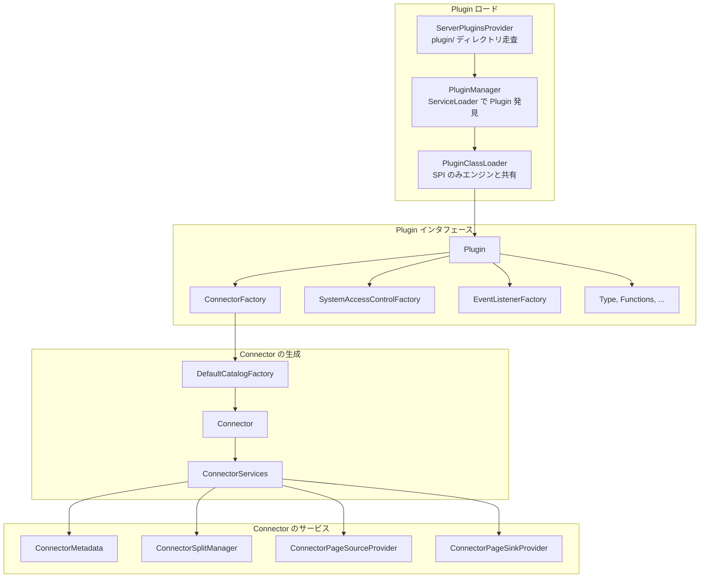

# 第3章 Plugin と SPI

> **本章で読むソース**
>
> - [`core/trino-spi/src/main/java/io/trino/spi/Plugin.java`](https://github.com/trinodb/trino/blob/482/core/trino-spi/src/main/java/io/trino/spi/Plugin.java)
> - [`core/trino-spi/src/main/java/io/trino/spi/connector/ConnectorFactory.java`](https://github.com/trinodb/trino/blob/482/core/trino-spi/src/main/java/io/trino/spi/connector/ConnectorFactory.java)
> - [`core/trino-spi/src/main/java/io/trino/spi/connector/Connector.java`](https://github.com/trinodb/trino/blob/482/core/trino-spi/src/main/java/io/trino/spi/connector/Connector.java)
> - [`core/trino-spi/src/main/java/io/trino/spi/connector/ConnectorMetadata.java`](https://github.com/trinodb/trino/blob/482/core/trino-spi/src/main/java/io/trino/spi/connector/ConnectorMetadata.java)
> - [`core/trino-spi/src/main/java/io/trino/spi/connector/ConnectorSplitManager.java`](https://github.com/trinodb/trino/blob/482/core/trino-spi/src/main/java/io/trino/spi/connector/ConnectorSplitManager.java)
> - [`core/trino-spi/src/main/java/io/trino/spi/connector/ConnectorPageSourceProvider.java`](https://github.com/trinodb/trino/blob/482/core/trino-spi/src/main/java/io/trino/spi/connector/ConnectorPageSourceProvider.java)
> - [`core/trino-spi/src/main/java/io/trino/spi/connector/ConnectorPageSinkProvider.java`](https://github.com/trinodb/trino/blob/482/core/trino-spi/src/main/java/io/trino/spi/connector/ConnectorPageSinkProvider.java)
> - [`core/trino-main/src/main/java/io/trino/server/PluginManager.java`](https://github.com/trinodb/trino/blob/482/core/trino-main/src/main/java/io/trino/server/PluginManager.java)
> - [`core/trino-main/src/main/java/io/trino/server/PluginClassLoader.java`](https://github.com/trinodb/trino/blob/482/core/trino-main/src/main/java/io/trino/server/PluginClassLoader.java)
> - [`core/trino-main/src/main/java/io/trino/server/ServerPluginsProvider.java`](https://github.com/trinodb/trino/blob/482/core/trino-main/src/main/java/io/trino/server/ServerPluginsProvider.java)
> - [`core/trino-main/src/main/java/io/trino/connector/DefaultCatalogFactory.java`](https://github.com/trinodb/trino/blob/482/core/trino-main/src/main/java/io/trino/connector/DefaultCatalogFactory.java)
> - [`core/trino-main/src/main/java/io/trino/connector/ConnectorServices.java`](https://github.com/trinodb/trino/blob/482/core/trino-main/src/main/java/io/trino/connector/ConnectorServices.java)

## この章の狙い

Trino は多種多様なデータソースに対して SQL を発行できる。
この拡張性を支える仕組みが **Plugin** と **SPI**（Service Provider Interface）である。

本章では、Plugin インタフェースがエンジンに何を提供するかを読み、そこから `ConnectorFactory` を経て `Connector` が生成される流れを追う。
次に `Connector` が返す主要なサービス（`ConnectorMetadata`、`ConnectorSplitManager`、`ConnectorPageSourceProvider`、`ConnectorPageSinkProvider`）の責務を確認する。
最後に、Plugin のロードプロセスと ClassLoader による隔離の仕組みを読み、Catalog の動的管理までを把握する。

## 前提

- 第1章の Trino の全体像（Coordinator と Worker の関係）を理解していること。
- 第2章のサーバーアーキテクチャ（起動シーケンス）を把握していること。

## Plugin インタフェースの全体像

`Plugin` は Trino の拡張ポイントをまとめた単一のインタフェースである。
すべてのメソッドが default 実装を持ち、空のコレクションを返す。
Plugin 開発者は必要なメソッドだけをオーバーライドすればよい。

[`core/trino-spi/src/main/java/io/trino/spi/Plugin.java` L38-L124](https://github.com/trinodb/trino/blob/482/core/trino-spi/src/main/java/io/trino/spi/Plugin.java#L38-L124)

```java
public interface Plugin
{
    default Iterable<CatalogStoreFactory> getCatalogStoreFactories()
    {
        return emptyList();
    }

    default Iterable<ConnectorFactory> getConnectorFactories()
    {
        return emptyList();
    }

    // ... (中略) ...

import io.trino.spi.block.BlockEncoding;
import io.trino.spi.catalog.CatalogStoreFactory;
import io.trino.spi.connector.ConnectorFactory;
import io.trino.spi.eventlistener.EventListenerFactory;
import io.trino.spi.exchange.ExchangeManagerFactory;
import io.trino.spi.function.LanguageFunctionEngine;
import io.trino.spi.resourcegroups.ResourceGroupConfigurationManagerFactory;
import io.trino.spi.security.CertificateAuthenticatorFactory;
import io.trino.spi.security.GroupProviderFactory;
import io.trino.spi.security.HeaderAuthenticatorFactory;
    // ... (中略) ...

    default Iterable<EventListenerFactory> getEventListenerFactories()
    {
        return emptyList();
    }

    // ... (中略) ...

    default Iterable<ExchangeManagerFactory> getExchangeManagerFactories()
    {
        return emptyList();
    }

    default Iterable<SpoolingManagerFactory> getSpoolingManagerFactories()
    {
        return emptyList();
    }
}
```

Plugin が提供できる拡張は以下のカテゴリに分かれる。

- **ConnectorFactory**：データソースへの接続を生成するファクトリ。Plugin の最も一般的な用途である。
- **Type / ParametricType / BlockEncoding**：カスタム型とそのシリアライズ形式。
- **Functions**：スカラー関数、集約関数、ウインドウ関数のクラス群。
- **SystemAccessControlFactory**：クラスタ全体のアクセス制御。
- **EventListenerFactory**：クエリの開始、完了、Split 完了などのイベント通知。
- **PasswordAuthenticatorFactory / HeaderAuthenticatorFactory / CertificateAuthenticatorFactory**：認証プロバイダー。
- **GroupProviderFactory**：ユーザーのグループ解決。
- **ResourceGroupConfigurationManagerFactory**：リソースグループの設定管理。
- **SessionPropertyConfigurationManagerFactory**：Session プロパティのデフォルト値管理。
- **ExchangeManagerFactory**：外部 Exchange（Spooling Exchange）の実装。
- **CatalogStoreFactory**：Catalog 定義の永続化先。
- **SpoolingManagerFactory**：クエリ結果のスプーリング管理。
- **LanguageFunctionEngine**：SQL 以外の言語で書かれた関数のエンジン。

この設計により、Connector 以外の拡張（認証、アクセス制御、イベント監視など）も同じ Plugin の仕組みで統一的にロードできる。

## SPI の設計哲学

SPI は `io.trino.spi` パッケージに集約されたインタフェース群であり、エンジン本体（`trino-main`）と Plugin の間の契約を定義する。
Trino のソースツリーでは `core/trino-spi` モジュールとして独立している。

この分離には二つの意図がある。

第一に、Connector 開発者はエンジンの内部実装に依存せず、SPI だけを相手にコードを書ける。
エンジン内部のリファクタリングが Connector のコードを壊すことはない。

第二に、SPI をモジュール境界にすることで、後述する ClassLoader 隔離が成立する。
Plugin の ClassLoader は SPI パッケージのクラスだけをエンジン側の ClassLoader から解決し、それ以外はすべて Plugin 自身のクラスパスから解決する。
エンジンと Plugin が異なるバージョンのライブラリ（Jackson、Guava など）を使っていても衝突しない。

## ConnectorFactory から Connector へ

「ConnectorFactory」は Connector を生成するファクトリである。
インタフェースは 2 メソッドだけで構成される。

[`core/trino-spi/src/main/java/io/trino/spi/connector/ConnectorFactory.java` L20-L26](https://github.com/trinodb/trino/blob/482/core/trino-spi/src/main/java/io/trino/spi/connector/ConnectorFactory.java#L20-L26)

```java
public interface ConnectorFactory
{
    String getName();

    @CheckReturnValue
    Connector create(String catalogName, Map<String, String> config, ConnectorContext context);
}
```

`getName()` は Connector の種別名（`hive`、`iceberg`、`postgresql` など）を返す。
`create()` は Catalog 名、設定プロパティ（`etc/catalog/*.properties` の内容）、およびエンジンが提供する「ConnectorContext」を受け取り、`Connector` インスタンスを返す。

「ConnectorContext」はエンジンがConnector に公開するサービスの窓口である。
`TypeManager`、`NodeManager`、`PageSorter` など、Connector がエンジンの機能を利用するためのオブジェクトを取得できる。

[`core/trino-spi/src/main/java/io/trino/spi/connector/ConnectorContext.java` L28-L103](https://github.com/trinodb/trino/blob/482/core/trino-spi/src/main/java/io/trino/spi/connector/ConnectorContext.java#L28-L103)

```java
public interface ConnectorContext
{
    default OpenTelemetry getOpenTelemetry()
    {
        throw new UnsupportedOperationException();
    }

    default Tracer getTracer()
    {
        throw new UnsupportedOperationException();
    }

    // ... (中略) ...

import io.opentelemetry.api.OpenTelemetry;
import io.opentelemetry.api.trace.Tracer;
import io.trino.spi.BlocksHashFactory;
import io.trino.spi.Node;
import io.trino.spi.NodeManager;
import io.trino.spi.PageIndexerFactory;
import io.trino.spi.PageSorter;
import io.trino.spi.Unstable;
import io.trino.spi.VersionEmbedder;
import io.trino.spi.function.FunctionBundleFactory;
import io.trino.spi.type.TypeManager;

public interface ConnectorContext
{
    default OpenTelemetry getOpenTelemetry()
    // ... (中略) ...
}
```

## Connector が提供するサービス群

「Connector」インタフェースは、データソースとのやり取りに必要なサービスをエンジンに返す。
主要なメソッドを確認する。

[`core/trino-spi/src/main/java/io/trino/spi/connector/Connector.java` L29-L263](https://github.com/trinodb/trino/blob/482/core/trino-spi/src/main/java/io/trino/spi/connector/Connector.java#L29-L263)

```java
public interface Connector
{
    default ConnectorTransactionHandle beginTransaction(IsolationLevel isolationLevel, boolean readOnly, boolean autoCommit)
    {
        throw new UnsupportedOperationException();
    }

    default ConnectorMetadata getMetadata(ConnectorSession session, ConnectorTransactionHandle transactionHandle)
    {
        throw new UnsupportedOperationException();
    }

    default ConnectorSplitManager getSplitManager()
    {
        throw new UnsupportedOperationException();
    }

    default ConnectorPageSourceProvider getPageSourceProvider()
    {
        throw new UnsupportedOperationException();
    }

    // ... (中略) ...
     */
    default ConnectorPageSinkProvider getPageSinkProvider()
    {
        throw new UnsupportedOperationException();
    }

    // ... (中略) ...
     */
    void shutdown();

    default Set<ConnectorCapabilities> getCapabilities()
    {
        return emptySet();
    }
}
```

Connector は default メソッドで `UnsupportedOperationException` を投げる。
読み取り専用の Connector は `getPageSinkProvider()` を実装しなくてよく、Split の概念がない Connector は `getSplitManager()` を省略できる。
唯一 `shutdown()` だけが abstract であり、すべての Connector はリソース解放処理を実装する必要がある。

### トランザクション管理

`beginTransaction()` でトランザクションを開始し、エンジンは `commit()` か `rollback()` のいずれかを必ず呼ぶ。
`getMetadata()` はトランザクションごとに呼ばれ、返される `ConnectorMetadata` はシングルスレッドで使用される[^metadata-single-thread]。

[^metadata-single-thread]: Javadoc に「Guaranteed to be called at most once per transaction. The returned metadata will only be accessed in a single threaded context.」と明記されている（`Connector.java` L52-L53）。

### その他のサービス

Connector はメタデータや読み書きの他にも、以下を任意で提供する。

- `getSystemTables()`：Connector 固有のシステムテーブル。
- `getProcedures()` / `getTableFunctions()`：ストアドプロシージャとテーブル関数。
- `getSessionProperties()` / `getTableProperties()` / `getSchemaProperties()`：Connector 固有のプロパティ定義。
- `getAccessControl()`：Connector レベルのアクセス制御。
- `getNodePartitioningProvider()`：データのパーティショニング方式。

## ConnectorMetadata のメタデータ API

「ConnectorMetadata」はメタデータ操作の契約であり、SPI の中で最も多くのメソッドを持つインタフェースである。
1,800 行を超え、Schema 操作、テーブル操作、ビュー管理、統計情報、プッシュダウン API など広範な責務を担う。

テーブルの解決からカラム取得までの流れを見る。

[`core/trino-spi/src/main/java/io/trino/spi/connector/ConnectorMetadata.java` L108-L119](https://github.com/trinodb/trino/blob/482/core/trino-spi/src/main/java/io/trino/spi/connector/ConnectorMetadata.java#L108-L119)

```java
    default ConnectorTableHandle getTableHandle(
            ConnectorSession session,
            SchemaTableName tableName,
            Optional<ConnectorTableVersion> startVersion,
            Optional<ConnectorTableVersion> endVersion)
    {
        if (listTables(session, Optional.of(tableName.getSchemaName())).isEmpty()) {
            // This is a correct default implementation meant primarily for connectors that do not have any tables.
            return null;
        }
        throw new TrinoException(GENERIC_INTERNAL_ERROR, "ConnectorMetadata listTables() is implemented without getTableHandle()");
    }
```

`getTableHandle()` はテーブル名から「Handle」を返す。
Handle はエンジンと Connector の間でテーブルを識別する不透明なオブジェクトであり、エンジンは Handle の内部構造を知らない。
Connector はこの Handle にパーティション情報やプッシュダウン条件など、自由に状態を持たせることができる。

カラム情報の取得は以下のメソッドで行う。

[`core/trino-spi/src/main/java/io/trino/spi/connector/ConnectorMetadata.java` L316-L319](https://github.com/trinodb/trino/blob/482/core/trino-spi/src/main/java/io/trino/spi/connector/ConnectorMetadata.java#L316-L319)

```java
    default Map<String, ColumnHandle> getColumnHandles(ConnectorSession session, ConnectorTableHandle tableHandle)
    {
        throw new TrinoException(GENERIC_INTERNAL_ERROR, "ConnectorMetadata getTableHandle() is implemented without getColumnHandles()");
    }
```

### プッシュダウン API

`ConnectorMetadata` はオプティマイザからのプッシュダウン要求を受け付ける `applyXxx()` メソッド群を持つ。
述語プッシュダウン（`applyFilter`）を例に見る。

[`core/trino-spi/src/main/java/io/trino/spi/connector/ConnectorMetadata.java` L1427-L1439](https://github.com/trinodb/trino/blob/482/core/trino-spi/src/main/java/io/trino/spi/connector/ConnectorMetadata.java#L1427-L1439)

```java
    default Optional<ConstraintApplicationResult<ConnectorTableHandle>> applyFilter(ConnectorSession session, ConnectorTableHandle handle, Constraint constraint)
    {
        // applyFilter is expected not to be invoked with a "false" constraint
        if (constraint.getSummary().isNone()) {
            throw new IllegalArgumentException("constraint summary is NONE");
        }
        if (FALSE.equals(constraint.getExpression())) {
            // DomainTranslator translates FALSE expressions into TupleDomain.none() (via Visitor#visitBooleanLiteral)
            // so the remaining expression shouldn't be FALSE and therefore the translated connectorExpression shouldn't be FALSE either.
            throw new IllegalArgumentException("constraint expression is FALSE");
        }
        return Optional.empty();
    }
```

`Optional.empty()` を返すとプッシュダウンが適用されなかったことを意味する。
Connector が条件を処理できる場合は、条件を織り込んだ新しい `ConnectorTableHandle` と残余の条件を返す。
同様に `applyLimit()`、`applyProjection()`、`applyAggregation()`、`applyTopN()`、`applyJoin()` が定義されている。

## ConnectorSplitManager による Split 生成

「ConnectorSplitManager」はテーブルスキャンの並列単位となる Split を生成する。

[`core/trino-spi/src/main/java/io/trino/spi/connector/ConnectorSplitManager.java` L20-L44](https://github.com/trinodb/trino/blob/482/core/trino-spi/src/main/java/io/trino/spi/connector/ConnectorSplitManager.java#L20-L44)

```java
public interface ConnectorSplitManager
{
    /**
     * Returns splits for a table scan.
     * <p>
     * {@code dynamicFilterColumns} is the static set of columns the dynamic filter will cover.
     * Connectors may use this to make planning-time decisions (e.g. which column statistics to
     * read). The per-batch resolved predicate arrives separately via
     * {@link ConnectorSplitSource#getNextBatch(int, DynamicFilterSnapshot)}.
     */
    ConnectorSplitSource getSplits(
            ConnectorTransactionHandle transaction,
            ConnectorSession session,
            ConnectorTableHandle table,
            Set<ColumnHandle> dynamicFilterColumns,
            Constraint constraint);

    default ConnectorSplitSource getSplits(
            ConnectorTransactionHandle transaction,
            ConnectorSession session,
            ConnectorTableFunctionHandle function)
    {
        throw new UnsupportedOperationException();
    }
}
```

`getSplits()` は `ConnectorSplitSource` を返す。
`ConnectorSplitSource` は Split を逐次的に供給するインタフェースであり、すべての Split を一度にメモリに載せる必要がない。
パーティション数が多いテーブルでも、バッチごとに Split を生成してスケジューラに渡せる。

`dynamicFilterColumns` は DynamicFilter が適用されるカラムの集合であり、Connector はこの情報を使ってプランニング時の判断（読み取るパーティションの選択など）を行える。

## ConnectorPageSourceProvider と ConnectorPageSinkProvider

### 読み取り

「ConnectorPageSourceProvider」は Split を受け取り、Page を読み出す `ConnectorPageSource` を生成する。

[`core/trino-spi/src/main/java/io/trino/spi/connector/ConnectorPageSourceProvider.java` L19-L83](https://github.com/trinodb/trino/blob/482/core/trino-spi/src/main/java/io/trino/spi/connector/ConnectorPageSourceProvider.java#L19-L83)

```java
public interface ConnectorPageSourceProvider
{
    // ... (中略) ...

import java.util.List;
import java.util.Optional;

public interface ConnectorPageSourceProvider
{
    /**
     * Creates a {@link ConnectorPageSource} for reading data from the specified split.
     *
     * @param transaction the transaction handle for this operation
     * @param session the session in which the read is being performed
     * @param split the split to read data from
     * @param table the table handle identifying the table being read
     * @param tableCredentials credentials for accessing the table data
     * @param columns columns that should show up in the output page, in this order
    // ... (中略) ...
}
```

エンジンは読み取りたいカラムを `columns` パラメーターで指定する。
Connector は不要なカラムを読み飛ばせるため、列指向ストレージ（Parquet、ORC など）では大幅な I/O 削減が可能になる。

### 書き込み

「ConnectorPageSinkProvider」は書き込み先に応じた `ConnectorPageSink` を生成する。

[`core/trino-spi/src/main/java/io/trino/spi/connector/ConnectorPageSinkProvider.java` L22-L97](https://github.com/trinodb/trino/blob/482/core/trino-spi/src/main/java/io/trino/spi/connector/ConnectorPageSinkProvider.java#L22-L97)

```java
public interface ConnectorPageSinkProvider
{
    ConnectorPageSink createPageSink(
            ConnectorTransactionHandle transactionHandle,
            ConnectorSession session,
            ConnectorOutputTableHandle outputTableHandle,
            Optional<ConnectorTableCredentials> tableCredentials,
            ConnectorPageSinkId pageSinkId);

    ConnectorPageSink createPageSink(
            ConnectorTransactionHandle transactionHandle,
            ConnectorSession session,
            ConnectorInsertTableHandle insertTableHandle,
            Optional<ConnectorTableCredentials> tableCredentials,
            ConnectorPageSinkId pageSinkId);

    // ... (中略) ...

    default ConnectorMergeSink createMergeSink(
            ConnectorTransactionHandle transactionHandle,
            ConnectorSession session,
            ConnectorMergeTableHandle mergeHandle,
            Optional<ConnectorTableCredentials> tableCredentials,
            ConnectorPageSinkId pageSinkId)
    {
        throw new TrinoException(NOT_SUPPORTED, "This connector does not support SQL MERGE operations");
    }
}
```

新規テーブル作成（`ConnectorOutputTableHandle`）と既存テーブルへの挿入（`ConnectorInsertTableHandle`）でオーバーロードが分かれている。
MERGE 操作用の `createMergeSink()` は default で `NOT_SUPPORTED` を投げ、対応する Connector だけがオーバーライドする。

## Plugin のロードプロセス

Trino 起動時の Plugin ロードは、`ServerPluginsProvider`、`PluginManager`、`ServiceLoader` の 3 層で構成される。

### ServerPluginsProvider によるディレクトリ走査

`ServerPluginsProvider` は `plugin.dir`（デフォルトは `plugin/`）配下のサブディレクトリを並列に走査する。

[`core/trino-main/src/main/java/io/trino/server/ServerPluginsProvider.java` L36-L64](https://github.com/trinodb/trino/blob/482/core/trino-main/src/main/java/io/trino/server/ServerPluginsProvider.java#L36-L96)

```java
public class ServerPluginsProvider
        implements PluginsProvider
{
    private final List<Path> installedPluginsDirs;
    private final Executor executor;

    @Inject
    public ServerPluginsProvider(ServerPluginsProviderConfig config, @ForStartup Executor executor)
    {
        this.installedPluginsDirs = config.getInstalledPluginsDirs();
        this.executor = requireNonNull(executor, "executor is null");
    }

    @Override
    public void loadPlugins(Loader loader, ClassLoaderFactory createClassLoader)
    {
        executeUntilFailure(
                executor,
                installedPluginsDirs.stream()
                        .flatMap(installedPluginsDir -> listFiles(installedPluginsDir).stream())
                        .filter(Files::isDirectory)
                        .map(Path::toAbsolutePath)
                        .map(path -> (Callable<?>) () -> {
                            String name = path.getFileName().toString();
                            loader.load(name, () -> createClassLoader.create(name, buildClassPath(path)));
                            return null;
                        })
                        .collect(toImmutableList()));
    }

    // ... (中略) ...
}
```

各サブディレクトリは独立した Plugin として扱われる。
`executeUntilFailure()` により複数の Plugin を並列にロードし、いずれかが失敗した時点で全体を中断する。

### PluginManager による登録

`PluginManager` は `ServerPluginsProvider` からコールバックを受け、Plugin ごとに専用の `PluginClassLoader` を生成し、`ServiceLoader` で `Plugin` 実装を発見する。

[`core/trino-main/src/main/java/io/trino/server/PluginManager.java` L193-L203](https://github.com/trinodb/trino/blob/482/core/trino-main/src/main/java/io/trino/server/PluginManager.java#L193-L203)

```java
    private void loadPlugin(String pluginPath, PluginClassLoader pluginClassLoader)
    {
        ServiceLoader<Plugin> serviceLoader = ServiceLoader.load(Plugin.class, pluginClassLoader);
        List<Plugin> plugins = ImmutableList.copyOf(serviceLoader);
        checkState(!plugins.isEmpty(), "%s - No service providers of type %s in the classpath: %s", pluginPath, Plugin.class.getName(), asList(pluginClassLoader.getURLs()));

        for (Plugin plugin : plugins) {
            log.info("Installing %s", plugin.getClass().getName());
            installPlugin(plugin);
        }
    }
```

`ServiceLoader.load()` は `META-INF/services/io.trino.spi.Plugin` ファイルに記載されたクラスをインスタンス化する。
Java 標準の ServiceLoader メカニズムにより、Plugin の JAR を `plugin/` ディレクトリに置くだけでエンジンが自動的に検出する。

発見された Plugin は `installPluginInternal()` で各ファクトリを登録する。

[`core/trino-main/src/main/java/io/trino/server/PluginManager.java` L212-L239](https://github.com/trinodb/trino/blob/482/core/trino-main/src/main/java/io/trino/server/PluginManager.java#L212-L160)

```java
    private void installPluginInternal(Plugin plugin)
    {
        catalogStoreManager.ifPresent(catalogStoreManager -> {
            for (CatalogStoreFactory catalogStoreFactory : plugin.getCatalogStoreFactories()) {
                log.info("Registering catalog store %s", catalogStoreFactory.getName());
                catalogStoreManager.addCatalogStoreFactory(catalogStoreFactory);
            }
        });

        // ... (中略) ...

        for (ConnectorFactory connectorFactory : plugin.getConnectorFactories()) {
            log.info("Registering connector %s", connectorFactory.getName());
            this.connectorFactory.addConnectorFactory(connectorFactory);
        }

        Set<Class<?>> functions = plugin.getFunctions();
        if (!functions.isEmpty()) {
            log.info("Registering functions from %s", plugin.getClass().getSimpleName());
            InternalFunctionBundleBuilder builder = InternalFunctionBundle.builder();
            functions.forEach(builder::functions);
            globalFunctionCatalog.addFunctions(builder.build());
        }

        // ... (中略) ...
    }
```

`ConnectorFactory` は `CatalogFactory` に登録される。
関数は `GlobalFunctionCatalog` に、アクセス制御は `AccessControlManager` に、イベントリスナーは `EventListenerManager` に、というように拡張の種類ごとに適切なレジストリへ振り分けられる。

## ClassLoader 隔離の仕組み

Plugin のロード時に生成される `PluginClassLoader` は、エンジンと Plugin の依存ライブラリを隔離する仕組みである。

[`core/trino-main/src/main/java/io/trino/server/PluginClassLoader.java` L29-L76](https://github.com/trinodb/trino/blob/482/core/trino-main/src/main/java/io/trino/server/PluginClassLoader.java#L29-L187)

```java
public class PluginClassLoader
        extends URLClassLoader
{
    private final String pluginName;
    private final ClassLoader spiClassLoader;
    private final List<String> spiPackages;
    private final List<String> spiPackagesExcluded;
    private final List<String> spiResources;
    private final List<String> spiResourcesExcluded;

    public PluginClassLoader(
            String pluginName,
            List<URL> urls,
            ClassLoader spiClassLoader,
            List<String> spiPackages,
            List<String> spiPackagesExcluded)
    {
        this(pluginName,
                urls,
                spiClassLoader,
                spiPackages,
                spiPackagesExcluded,
                spiPackages.stream()
                        .map(PluginClassLoader::classNameToResource)
                        .collect(toImmutableList()),
                spiPackagesExcluded.stream()
                        .map(PluginClassLoader::classNameToResource)
                        .collect(toImmutableList()));
    }

    private PluginClassLoader(
            String pluginName,
            List<URL> urls,
            ClassLoader spiClassLoader,
            Iterable<String> spiPackages,
            Iterable<String> spiPackagesExcluded,
            Iterable<String> spiResources,
            Iterable<String> spiResourcesExcluded)
    {
        // plugins should not have access to the system (application) class loader
        super(urls.toArray(new URL[0]), getPlatformClassLoader());
        // ... (中略) ...
    }

    // ... (中略) ...
}
```

コンストラクタで `getPlatformClassLoader()` を親に設定している点が設計上の要点である。
通常の `URLClassLoader` はシステム ClassLoader（アプリケーション ClassLoader）を親に持ち、親から順にクラスを探索する。
`PluginClassLoader` はシステム ClassLoader をスキップするため、エンジン本体のクラスは Plugin から見えない。

SPI クラスの解決は `loadClass()` で明示的に制御される。

[`core/trino-main/src/main/java/io/trino/server/PluginClassLoader.java` L100-L127](https://github.com/trinodb/trino/blob/482/core/trino-main/src/main/java/io/trino/server/PluginClassLoader.java#L99-L127)

```java
    @Override
    protected Class<?> loadClass(String name, boolean resolve)
            throws ClassNotFoundException
    {
        // grab the magic lock
        synchronized (getClassLoadingLock(name)) {
            // Check if class is in the loaded classes cache
            Class<?> cachedClass = findLoadedClass(name);
            if (cachedClass != null) {
                return resolveClass(cachedClass, resolve);
            }

            // If this is an SPI class, only check SPI class loader
            if (isSpiClass(name)) {
                try {
                    return resolveClass(spiClassLoader.loadClass(name), resolve);
                }
                catch (ClassNotFoundException e) {
                    // ... (中略) ...
                }
            }

            // Look for class locally
            return super.loadClass(name, resolve);
        }
    }
```

クラスロードの判定ロジックは以下のとおりである。

1. ロード済みキャッシュにあれば即座に返す。
2. SPI パッケージに属するクラスであれば、`spiClassLoader`（エンジン側）から解決する。
3. それ以外は Plugin 自身のクラスパスから解決する。

SPI パッケージのリストは `PluginManager` に定義されている。

[`core/trino-main/src/main/java/io/trino/server/PluginManager.java` L73-L92](https://github.com/trinodb/trino/blob/482/core/trino-main/src/main/java/io/trino/server/PluginManager.java#L73-L92)

```java
    private static final List<String> SPI_PACKAGES = ImmutableList.<String>builder()
            .add("io.trino.spi.")
            .add("com.fasterxml.jackson.annotation.")
            .add("com.fasterxml.jackson.module.blackbird.ser.ToBooleanFunction")
            .add("com.fasterxml.jackson.module.blackbird.deser.ObjBooleanConsumer")
            // ... (中略) ...
            .add("io.airlift.slice.")
            .add("io.opentelemetry.api.")
            .add("io.opentelemetry.context.")
            .add("org.locationtech.jts.")
            .build();
```

`io.trino.spi.` に加え、Jackson のアノテーション、Airlift の `Slice`、OpenTelemetry の API、JTS の地理空間ライブラリが SPI として共有される。
これらはエンジンと Plugin の間で同一のクラスインスタンスを使う必要がある型（シリアライズのアノテーションや計測 API）である。

## Catalog の生成と ConnectorServices

Catalog の設定ファイル（例：`etc/catalog/hive.properties`）を読み込んだ後、`DefaultCatalogFactory` が `ConnectorFactory.create()` を呼び出して `Connector` を生成する。

[`core/trino-main/src/main/java/io/trino/connector/DefaultCatalogFactory.java` L196-L214](https://github.com/trinodb/trino/blob/482/core/trino-main/src/main/java/io/trino/connector/DefaultCatalogFactory.java#L196-L214)

```java
    private Connector createConnector(CatalogName catalogName, ConnectorFactory connectorFactory, Map<String, String> properties)
    {
        ConnectorContext context = new ConnectorContextInstance(
                openTelemetry,
                createTracer(catalogName),
                new DefaultNodeManager(currentNode, nodeManager, schedulerIncludeCoordinator),
                versionEmbedder,
                typeManager,
                new InternalMetadataProvider(metadata, typeManager),
                pageSorter,
                pageIndexerFactory,
                new InternalFunctionBundleFactory(),
                blocksHashFactory,
                evaluator);

        try (ThreadContextClassLoader _ = new ThreadContextClassLoader(connectorFactory.getClass().getClassLoader())) {
            // TODO: connector factory should take CatalogName
            return connectorFactory.create(catalogName.toString(), properties, context);
        }
```

`ThreadContextClassLoader` でスレッドのコンテキスト ClassLoader を Plugin のものに切り替えてから `create()` を呼ぶ。
Connector 内部で `ServiceLoader` やリフレクションを使う場合に、正しい ClassLoader からクラスが解決されるためである。

生成された `Connector` は `ConnectorServices` に包まれ、Connector が提供する全サービスが一括で取得される。

[`core/trino-main/src/main/java/io/trino/connector/ConnectorServices.java` L95-L219](https://github.com/trinodb/trino/blob/482/core/trino-main/src/main/java/io/trino/connector/ConnectorServices.java#L95-L219)

```java
    public ConnectorServices(Tracer tracer, CatalogHandle catalogHandle, Connector connector)
    {
        this.tracer = requireNonNull(tracer, "tracer is null");
        this.catalogHandle = requireNonNull(catalogHandle, "catalogHandle is null");
        this.connector = requireNonNull(connector, "connector is null");

        Set<SystemTable> systemTables = connector.getSystemTables();
        requireNonNull(systemTables, format("Connector '%s' returned a null system tables set", catalogHandle));
        this.systemTables = ImmutableSet.copyOf(systemTables);

        // ... (中略) ...

        ConnectorSplitManager splitManager = null;
        try {
            splitManager = connector.getSplitManager();
        }
        catch (UnsupportedOperationException _) {
        }
        this.splitManager = Optional.ofNullable(splitManager);

        // ... (中略) ...
    }
```

`ConnectorServices` のコンストラクタは、`Connector` の各 getter を try-catch で呼び出す。
`UnsupportedOperationException` を投げるメソッドは「その機能は未対応」と判断され、`Optional.empty()` として保持される。
この try-catch パターンにより、Connector はサポートしない機能のメソッドを単に実装しないだけで済む。

`DefaultCatalogFactory` は 1 つの Catalog に対して 3 つの `ConnectorServices` を生成する。

[`core/trino-main/src/main/java/io/trino/connector/DefaultCatalogFactory.java` L152-L194](https://github.com/trinodb/trino/blob/482/core/trino-main/src/main/java/io/trino/connector/DefaultCatalogFactory.java#L152-L194)

```java
    private CatalogConnector createCatalog(CatalogHandle catalogHandle, ConnectorName connectorName, Connector connector, Optional<CatalogProperties> catalogProperties)
    {
        Tracer tracer = createTracer(catalogHandle.getCatalogName());

        ConnectorServices catalogConnector = new ConnectorServices(tracer, catalogHandle, connector);

        ConnectorServices informationSchemaConnector = new ConnectorServices(
                tracer,
                createInformationSchemaCatalogHandle(catalogHandle),
                new InformationSchemaConnector(
                        // ... (中略) ...
                        ));

        // ... (中略) ...

        ConnectorServices systemConnector = new ConnectorServices(
                tracer,
                createSystemTablesCatalogHandle(catalogHandle),
                new SystemConnector(
                        // ... (中略) ...
                        ));

        return new CatalogConnector(
                catalogHandle,
                connectorName,
                catalogConnector,
                informationSchemaConnector,
                systemConnector,
                catalogProperties);
    }
```

ユーザーの Connector に加えて、`InformationSchemaConnector`（`information_schema` 仮想スキーマ用）と `SystemConnector`（`$system` テーブル群用）が自動的に付随する。
これにより、どの Catalog に対しても `SELECT * FROM catalog.information_schema.tables` のようなメタデータクエリが統一的に動作する。

## Plugin/SPI の階層構造

以下の図は、Plugin のロードから Connector のサービス取得までの階層構造を示す。



## 高速化の工夫：ClassLoader 隔離による安定性と独立開発

ClassLoader 隔離は、直接的なクエリ高速化ではなく、Connector の独立性を保証することで間接的にエコシステム全体の品質を高める最適化である。

隔離がない場合、Plugin がエンジンと異なるバージョンの Guava や Jackson を使うと `NoSuchMethodError` や `ClassCastException` が実行時に発生する。
この種のエラーはクエリ実行時まで検出できず、クラスタの安定性を損なう。

`PluginClassLoader` は SPI パッケージ以外のクラスを完全に分離することで、この問題を構造的に排除する。
Connector 開発者はエンジン内部のライブラリバージョンを気にすることなく、自由に依存を選択できる。
実際に `SPI_PACKAGES` のリストには `io.trino.spi.` に加えて Jackson のアノテーションや Airlift の Slice など、エンジンと Plugin の間でバイナリ互換が必須な型だけが厳選されている。

この隔離の設計判断は、Trino が 50 以上の Connector を公式にサポートし、さらにサードパーティの Connector も含めた大規模なエコシステムを維持するうえで不可欠である。

## まとめ

`Plugin` インタフェースは Trino の全拡張ポイントを集約し、`ServiceLoader` による自動検出でロードされる。
Connector の生成は `ConnectorFactory.create()` で行われ、返される `Connector` は `ConnectorMetadata`（メタデータ操作）、`ConnectorSplitManager`（Split 生成）、`ConnectorPageSourceProvider`（読み取り）、`ConnectorPageSinkProvider`（書き込み）の 4 つの主要サービスを提供する。
`PluginClassLoader` による ClassLoader 隔離は、SPI パッケージのみをエンジンと共有し、それ以外を分離することで、多数の Plugin が安全に共存できる構造を実現している。

## 関連する章

- [第2章 サーバーアーキテクチャ](02-server-architecture.md)：Plugin がロードされる起動シーケンスの全体像。
- [第21章 Connector SPI の詳細](../part05-connector/21-connector-spi-detail.md)：`ConnectorMetadata` の各メソッドの実装パターンを読む。
- [第22章 Hive Connector と Metastore](../part05-connector/22-hive-connector.md)：SPI を実装した具体的な Connector の例。
- [第19章 Page と Block のデータモデル](../part04-data/19-page-and-block.md)：`ConnectorPageSourceProvider` が返す Page の内部構造。
