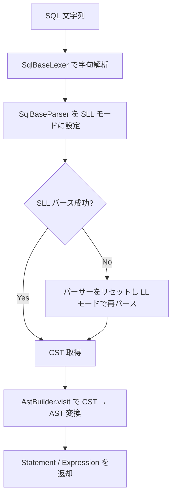
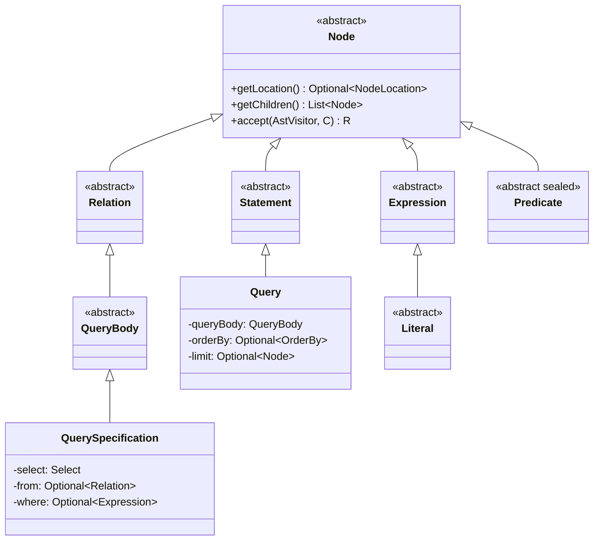

# 第4章 SQL パーサーと AST

> **本章で読むソース**
>
> - [`core/trino-parser/src/main/java/io/trino/sql/parser/SqlParser.java`](https://github.com/trinodb/trino/blob/482/core/trino-parser/src/main/java/io/trino/sql/parser/SqlParser.java)
> - [`core/trino-grammar/src/main/antlr4/io/trino/grammar/sql/SqlBase.g4`](https://github.com/trinodb/trino/blob/482/core/trino-grammar/src/main/antlr4/io/trino/grammar/sql/SqlBase.g4)
> - [`core/trino-parser/src/main/java/io/trino/sql/parser/AstBuilder.java`](https://github.com/trinodb/trino/blob/482/core/trino-parser/src/main/java/io/trino/sql/parser/AstBuilder.java)
> - [`core/trino-parser/src/main/java/io/trino/sql/tree/Node.java`](https://github.com/trinodb/trino/blob/482/core/trino-parser/src/main/java/io/trino/sql/tree/Node.java)
> - [`core/trino-parser/src/main/java/io/trino/sql/tree/Statement.java`](https://github.com/trinodb/trino/blob/482/core/trino-parser/src/main/java/io/trino/sql/tree/Statement.java)
> - [`core/trino-parser/src/main/java/io/trino/sql/tree/Query.java`](https://github.com/trinodb/trino/blob/482/core/trino-parser/src/main/java/io/trino/sql/tree/Query.java)
> - [`core/trino-parser/src/main/java/io/trino/sql/tree/QuerySpecification.java`](https://github.com/trinodb/trino/blob/482/core/trino-parser/src/main/java/io/trino/sql/tree/QuerySpecification.java)
> - [`core/trino-parser/src/main/java/io/trino/sql/tree/Expression.java`](https://github.com/trinodb/trino/blob/482/core/trino-parser/src/main/java/io/trino/sql/tree/Expression.java)
> - [`core/trino-parser/src/main/java/io/trino/sql/tree/AstVisitor.java`](https://github.com/trinodb/trino/blob/482/core/trino-parser/src/main/java/io/trino/sql/tree/AstVisitor.java)
> - [`core/trino-parser/src/main/java/io/trino/sql/parser/ErrorHandler.java`](https://github.com/trinodb/trino/blob/482/core/trino-parser/src/main/java/io/trino/sql/parser/ErrorHandler.java)

## この章の狙い

Trino が SQL 文字列を受け取ってから、後続のアナライザやプランナーが操作できる AST（抽象構文木）を組み立てるまでの処理を読む。
具体的には、ANTLR4 文法定義 `SqlBase.g4` による字句解析と構文解析、`AstBuilder` による CST から AST への変換、AST ノードの型階層、Visitor パターンによるツリー走査、そしてユーザー向けエラーメッセージの生成を扱う。

## 前提

- ANTLR4 によるパーサー生成の基本的な仕組み（Lexer、Parser、Visitor パターン）を知っていること
- 第3章までの Trino のアーキテクチャ概要（Coordinator がクエリを受け付ける流れ）を読んでいること

## SqlParser の構造

`SqlParser` は SQL 文字列を受け取り、AST のルートノード（`Statement` や `Expression`）を返すファサードである。
Coordinator がクライアントから SQL を受け取ると、最初にこのクラスの `createStatement` メソッドが呼ばれる。

[`core/trino-parser/src/main/java/io/trino/sql/parser/SqlParser.java` L104-L107](https://github.com/trinodb/trino/blob/482/core/trino-parser/src/main/java/io/trino/sql/parser/SqlParser.java#L104-L107)

```java
    public Statement createStatement(String sql)
    {
        return (Statement) invokeParser("statement", sql, SqlBaseParser::singleStatement);
    }
```

`createStatement` のほかに `createExpression`、`createType` など用途別のエントリポイントがある。
いずれも内部で `invokeParser` を呼び、ANTLR4 の Lexer と Parser を生成してパースを実行する。

### invokeParser の処理フロー

`invokeParser` は以下の手順で動作する。

1. SQL 文字列から `SqlBaseLexer`（字句解析器）と `SqlBaseParser`（構文解析器）を生成する
2. エラーリスナーを差し替え、Trino 独自の `ErrorHandler` を使う
3. まず **SLL モード**でパースを試み、失敗したら **LL モード**にフォールバックする
4. パースが成功したら、得られた CST（具象構文木）を `AstBuilder` で AST に変換する

[`core/trino-parser/src/main/java/io/trino/sql/parser/SqlParser.java` L144-L194](https://github.com/trinodb/trino/blob/482/core/trino-parser/src/main/java/io/trino/sql/parser/SqlParser.java#L144-L194)

```java
    private Node invokeParser(String name, String sql, Optional<NodeLocation> location, Function<SqlBaseParser, ParserRuleContext> parseFunction)
    {
        try {
            SqlBaseLexer lexer = new SqlBaseLexer(CharStreams.fromString(sql));
            CommonTokenStream tokenStream = new CommonTokenStream(lexer);
            SqlBaseParser parser = new SqlBaseParser(tokenStream);
            initializer.accept(lexer, parser);

            parser.addParseListener(new PostProcessor(Arrays.asList(parser.getRuleNames()), parser));

            lexer.removeErrorListeners();
            lexer.addErrorListener(LEXER_ERROR_LISTENER);

            parser.removeErrorListeners();

            ParserRuleContext tree;
            try {
                try {
                    // first, try parsing with potentially faster SLL mode
                    parser.getInterpreter().setPredictionMode(PredictionMode.SLL);
                    parser.setErrorHandler(new BailErrorStrategy());
                    tree = parseFunction.apply(parser);
                }
                catch (ParseCancellationException e) {
                    // if we fail, parse with LL mode
                    parser.reset();
                    parser.getInterpreter().setPredictionMode(PredictionMode.LL);
                    parser.setErrorHandler(new NonRecoveringErrorStrategy());
                    parser.addErrorListener(PARSER_ERROR_HANDLER);
                    tree = parseFunction.apply(parser);
                }
            }
            // ... (中略) ...

            return new AstBuilder(location).visit(tree);
        }
        catch (StackOverflowError e) {
            throw new ParsingException(name + " is too large (stack overflow while parsing)", location.orElse(new NodeLocation(1, 1)));
        }
    }
```

パースが完了すると、最終行で `new AstBuilder(location).visit(tree)` を呼び、ANTLR4 の CST を Trino 独自の AST に変換している。

## SLL から LL へのフォールバック（最適化の工夫）

ANTLR4 には2つの予測モードがある。

- **SLL（Strong LL）**：決定論的で高速だが、一部の曖昧な文法で誤判定する
- **LL**：完全な LL(\*) 解析を行い、あらゆる文法を正しく処理できるが、SLL より遅い

Trino はまず SLL モードでパースを試みる。
大半の SQL 文は SLL で問題なくパースできるため、この戦略によってパース時間を短縮できる。
SLL で `ParseCancellationException` が発生した場合に限り、パーサーをリセットして LL モードで再試行する。



この二段構えの戦略は ANTLR4 の公式ドキュメントでも推奨されているパターンであり、Trino のように大量のクエリを処理するシステムでは、SLL モードで済むケースが多い分だけ全体のスループットが向上する。

## SqlBase.g4 の文法概要

`SqlBase.g4` は約1,500行の ANTLR4 文法定義であり、Trino が受け付ける SQL の全構文を規定する。
文法ファイルの先頭で `caseInsensitive = true` が指定されており、キーワードの大文字小文字を区別しない。

[`core/trino-grammar/src/main/antlr4/io/trino/grammar/sql/SqlBase.g4` L15-L17](https://github.com/trinodb/trino/blob/482/core/trino-grammar/src/main/antlr4/io/trino/grammar/sql/SqlBase.g4#L15-L17)

```antlr
grammar SqlBase;

options { caseInsensitive = true; }
```

### エントリルール

パーサーのエントリポイントは複数あり、用途によって使い分けられる。

[`core/trino-grammar/src/main/antlr4/io/trino/grammar/sql/SqlBase.g4` L30-L52](https://github.com/trinodb/trino/blob/482/core/trino-grammar/src/main/antlr4/io/trino/grammar/sql/SqlBase.g4#L30-L52)

```antlr
singleStatement
    : statement EOF
    ;

standaloneExpression
    : expression EOF
    ;

standalonePathSpecification
    : pathSpecification EOF
    ;

standaloneType
    : type EOF
    ;

standaloneRowPattern
    : rowPattern EOF
    ;

standaloneFunctionSpecification
    : functionSpecification EOF
    ;
```

`singleStatement` が通常の SQL 文のエントリポイントである。
`standaloneExpression` や `standaloneType` は、式やデータ型を単独でパースする場合に使われる。

### statement ルール

`statement` ルールは Trino が受け付ける全 SQL 文（`SELECT`、`CREATE TABLE`、`INSERT`、`DELETE`、`ALTER` など）の選択肢を列挙する。
各選択肢にはラベル（`#statementDefault`、`#use`、`#createTable` など）が付いており、ANTLR4 はラベルごとに別の Visitor メソッドを生成する。

先頭の `#statementDefault` が通常のクエリ（SELECT 文）に対応する。

[`core/trino-grammar/src/main/antlr4/io/trino/grammar/sql/SqlBase.g4` L54-L57](https://github.com/trinodb/trino/blob/482/core/trino-grammar/src/main/antlr4/io/trino/grammar/sql/SqlBase.g4#L54-L57)

```antlr
statement
    : rootQueryWithSession                                             #statementDefault
    | USE schema=identifier                                            #use
    | USE catalog=identifier '.' schema=identifier                     #use
```

`rootQueryWithSession` はオプションの `WITH SESSION` 句を持つクエリのラッパーであり、内部で `rootQuery` を呼ぶ。
`rootQuery` はインラインの関数定義（`WITH` 関数）を許容したうえで `query` ルールに委譲する。

[`core/trino-grammar/src/main/antlr4/io/trino/grammar/sql/SqlBase.g4` L225-L233](https://github.com/trinodb/trino/blob/482/core/trino-grammar/src/main/antlr4/io/trino/grammar/sql/SqlBase.g4#L225-L233)

```antlr
rootQuery
    : (WITH functionSpecification (',' functionSpecification)*)?
      query
    ;

rootQueryWithSession
    : (WITH SESSION sessionProperty (',' sessionProperty)*)?
      rootQuery
    ;
```

### query と querySpecification

`query` ルールはオプションの CTE（`WITH` 句）を持ち、`queryNoWith` に委譲する。
`queryNoWith` は `queryTerm`（集合演算を含む）に `ORDER BY`、`OFFSET`、`LIMIT`/`FETCH` を付与する。

[`core/trino-grammar/src/main/antlr4/io/trino/grammar/sql/SqlBase.g4` L239-L284](https://github.com/trinodb/trino/blob/482/core/trino-grammar/src/main/antlr4/io/trino/grammar/sql/SqlBase.g4#L239-L284)

```antlr
query
    : with? queryNoWith
    ;

with
    : WITH RECURSIVE? namedQuery (',' namedQuery)*
    ;

// ... (中略) ...

queryNoWith
    : queryTerm
      orderBy?
      (OFFSET offset=rowCount (ROW | ROWS)?)?
      ( (LIMIT limit=limitRowCount)
      | (FETCH (FIRST | NEXT) (fetchFirst=rowCount)? (ROW | ROWS) (ONLY | WITH TIES))
      )?
    ;
```

`queryTerm` は集合演算（`UNION`、`INTERSECT`、`EXCEPT`）を左再帰で定義し、`queryPrimary` を基本要素とする。
`queryPrimary` の中心が `querySpecification`（通常の `SELECT ... FROM ... WHERE ...` 構文）である。

[`core/trino-grammar/src/main/antlr4/io/trino/grammar/sql/SqlBase.g4` L300-L328](https://github.com/trinodb/trino/blob/482/core/trino-grammar/src/main/antlr4/io/trino/grammar/sql/SqlBase.g4#L300-L328)

```antlr
queryTerm
    : queryPrimary                                                                                #queryTermDefault
    | left=queryTerm operator=INTERSECT setQuantifier? corresponding? right=queryTerm             #setOperation
    | left=queryTerm operator=(UNION | EXCEPT) setQuantifier? corresponding? right=queryTerm      #setOperation
    ;

queryPrimary
    : querySpecification                   #queryPrimaryDefault
    | TABLE qualifiedName                  #table
    | VALUES expression (',' expression)*  #inlineTable
    | '(' queryNoWith ')'                  #subquery
    ;

// ... (中略) ...

querySpecification
    : SELECT setQuantifier? selectItem (',' selectItem)*
      (FROM relation (',' relation)*)?
      (WHERE where=booleanExpression)?
      (GROUP BY groupBy)?
      (HAVING having=booleanExpression)?
      (WINDOW windowDefinition (',' windowDefinition)*)?
    ;
```

### expression ルール

式の文法は優先順位に応じて階層化されている。

[`core/trino-grammar/src/main/antlr4/io/trino/grammar/sql/SqlBase.g4` L569-L601](https://github.com/trinodb/trino/blob/482/core/trino-grammar/src/main/antlr4/io/trino/grammar/sql/SqlBase.g4#L569-L602)

```antlr
expression
    : booleanExpression
    ;

booleanExpression
    : valueExpression predicate[$valueExpression.ctx]?  #predicated
    | NOT booleanExpression                             #logicalNot
    | booleanExpression AND booleanExpression           #and
    | booleanExpression OR booleanExpression            #or
    ;

// ... (中略) ...

valueExpression
    : primaryExpression                                                                 #valueExpressionDefault
    | valueExpression AT timeZoneSpecifier                                              #atTimeZone
    | valueExpression AT LOCAL                                                          #atLocal
    | operator=(MINUS | PLUS) valueExpression                                           #arithmeticUnary
    | left=valueExpression operator=(ASTERISK | SLASH | PERCENT) right=valueExpression  #arithmeticBinary
    | left=valueExpression operator=(PLUS | MINUS) right=valueExpression                #arithmeticBinary
    | left=valueExpression CONCAT right=valueExpression                                 #concatenation
    ;
```

`expression` は `booleanExpression` のエイリアスであり、`booleanExpression` は `AND`/`OR`/`NOT` を処理する。
`valueExpression` は算術演算子の優先順位を左再帰で表現し、最も優先度の高い `primaryExpression` がリテラル、関数呼び出し、カラム参照、サブクエリなど約40種類の構文を列挙する。

### identifier と nonReserved

SQL のキーワードの多くは識別子としても使えるよう、`nonReserved` ルールに登録されている。

[`core/trino-grammar/src/main/antlr4/io/trino/grammar/sql/SqlBase.g4` L1046-L1052](https://github.com/trinodb/trino/blob/482/core/trino-grammar/src/main/antlr4/io/trino/grammar/sql/SqlBase.g4#L1046-L1052)

```antlr
identifier
    : IDENTIFIER             #unquotedIdentifier
    | QUOTED_IDENTIFIER      #quotedIdentifier
    | nonReserved            #unquotedIdentifier
    | BACKQUOTED_IDENTIFIER  #backQuotedIdentifier
    | DIGIT_IDENTIFIER       #digitIdentifier
    ;
```

`nonReserved` ルールには `ADD`、`COLUMN`、`COMMENT`、`DATA` など多数のキーワードが含まれている。
`PostProcessor` は `nonReserved` ルールにマッチしたトークンのタイプを `IDENTIFIER` に書き換える処理を行う。

[`core/trino-parser/src/main/java/io/trino/sql/parser/SqlParser.java` L256-L276](https://github.com/trinodb/trino/blob/482/core/trino-parser/src/main/java/io/trino/sql/parser/SqlParser.java#L254-L276)

```java
        @Override
        public void exitNonReserved(SqlBaseParser.NonReservedContext context)
        {
            // we can't modify the tree during rule enter/exit event handling unless we're dealing with a terminal.
            // Otherwise, ANTLR gets confused and fires spurious notifications.
            if (!(context.getChild(0) instanceof TerminalNode)) {
                int rule = ((ParserRuleContext) context.getChild(0)).getRuleIndex();
                throw new AssertionError("nonReserved can only contain tokens. Found nested rule: " + ruleNames.get(rule));
            }

            // replace nonReserved words with IDENT tokens
            context.getParent().removeLastChild();

            Token token = (Token) context.getChild(0).getPayload();
            Token newToken = new CommonToken(
                    new Pair<>(token.getTokenSource(), token.getInputStream()),
                    SqlBaseLexer.IDENTIFIER,
                    token.getChannel(),
                    token.getStartIndex(),
                    token.getStopIndex());

            context.getParent().addChild(parser.createTerminalNode(context.getParent(), newToken));
        }
```

この書き換えにより、`AstBuilder` はキーワードと識別子を区別せず、統一的に `Identifier` ノードとして処理できる。

## AstBuilder による CST から AST への変換

`AstBuilder` は ANTLR4 が生成した `SqlBaseBaseVisitor<Node>` を継承し、約4,600行にわたる Visitor メソッドで CST の各ルールを AST ノードに変換する。

[`core/trino-parser/src/main/java/io/trino/sql/parser/AstBuilder.java` L408-L417](https://github.com/trinodb/trino/blob/482/core/trino-parser/src/main/java/io/trino/sql/parser/AstBuilder.java#L408-L417)

```java
class AstBuilder
        extends SqlBaseBaseVisitor<Node>
{
    private int parameterPosition;
    private final Optional<NodeLocation> baseLocation;

    AstBuilder(Optional<NodeLocation> baseLocation)
    {
        this.baseLocation = requireNonNull(baseLocation, "location is null");
    }
```

`AstBuilder` はステートレスに近い設計で、唯一の可変状態はプリペアドステートメントのパラメーター位置を追跡する `parameterPosition` だけである。
`baseLocation` はネストされた SQL（ビュー定義内の SQL など）のオフセット補正に使われる。

### visitQuery と visitQueryNoWith

`visitQuery` は `WITH` 句（CTE）を処理し、`queryNoWith` の結果と合成して `Query` ノードを生成する。

[`core/trino-parser/src/main/java/io/trino/sql/parser/AstBuilder.java` L1270-L1283](https://github.com/trinodb/trino/blob/482/core/trino-parser/src/main/java/io/trino/sql/parser/AstBuilder.java#L1269-L1283)

```java
    @Override
    public Node visitQuery(SqlBaseParser.QueryContext context)
    {
        Query body = (Query) visit(context.queryNoWith());

        return new Query(
                getLocation(context),
                ImmutableList.of(),
                ImmutableList.of(),
                visitIfPresent(context.with(), With.class),
                body.getQueryBody(),
                body.getOrderBy(),
                body.getOffset(),
                body.getLimit());
    }
```

`visitQueryNoWith` には AST 構造を整えるための重要な処理がある。
単純な `QuerySpecification`（`SELECT ... FROM ...`）の後に `ORDER BY`、`OFFSET`、`LIMIT` が続く場合、それらの句を `QuerySpecification` の内部に畳み込む。
この畳み込みは、後続のアナライザやプランナーが `QuerySpecification` のスコープ内で列参照を解決するために必要な構造上の要請である。

[`core/trino-parser/src/main/java/io/trino/sql/parser/AstBuilder.java` L1307-L1367](https://github.com/trinodb/trino/blob/482/core/trino-parser/src/main/java/io/trino/sql/parser/AstBuilder.java#L1306-L1367)

```java
    @Override
    public Node visitQueryNoWith(SqlBaseParser.QueryNoWithContext context)
    {
        QueryBody term = (QueryBody) visit(context.queryTerm());

        Optional<OrderBy> orderBy = visitIfPresent(context.orderBy(), OrderBy.class);

        // ... (中略) ...

        if (term instanceof QuerySpecification query) {
            // When we have a simple query specification
            // followed by order by, offset, limit or fetch,
            // fold the order by, limit, offset or fetch clauses
            // into the query specification (analyzer/planner
            // expects this structure to resolve references with respect
            // to columns defined in the query specification)

            return new Query(
                    getLocation(context),
                    ImmutableList.of(),
                    ImmutableList.of(),
                    Optional.empty(),
                    new QuerySpecification(
                            getLocation(context),
                            query.getSelect(),
                            query.getFrom(),
                            query.getWhere(),
                            query.getGroupBy(),
                            query.getHaving(),
                            query.getWindows(),
                            orderBy,
                            offset,
                            limit),
                    Optional.empty(),
                    Optional.empty(),
                    Optional.empty());
        }

        return new Query(
                getLocation(context),
                ImmutableList.of(),
                ImmutableList.of(),
                Optional.empty(),
                term,
                orderBy,
                offset,
                limit);
    }
```

### visitQuerySpecification

`visitQuerySpecification` は `SELECT ... FROM ... WHERE ...` を処理する。
`FROM` 句に複数のリレーションがカンマ区切りで並ぶ場合（暗黙の CROSS JOIN）、暗黙の `Join` ノードを合成する。

[`core/trino-parser/src/main/java/io/trino/sql/parser/AstBuilder.java` L1370-L1399](https://github.com/trinodb/trino/blob/482/core/trino-parser/src/main/java/io/trino/sql/parser/AstBuilder.java#L1369-L1399)

```java
    @Override
    public Node visitQuerySpecification(SqlBaseParser.QuerySpecificationContext context)
    {
        Optional<Relation> from = Optional.empty();
        List<SelectItem> selectItems = visit(context.selectItem(), SelectItem.class);

        List<Relation> relations = visit(context.relation(), Relation.class);
        if (!relations.isEmpty()) {
            // synthesize implicit join nodes
            Iterator<Relation> iterator = relations.iterator();
            Relation relation = iterator.next();

            while (iterator.hasNext()) {
                relation = new Join(getLocation(context), Join.Type.IMPLICIT, relation, iterator.next(), Optional.empty());
            }

            from = Optional.of(relation);
        }

        return new QuerySpecification(
                getLocation(context),
                new Select(getLocation(context.SELECT()), isDistinct(context.setQuantifier()), selectItems),
                from,
                visitIfPresent(context.where, Expression.class),
                visitIfPresent(context.groupBy(), GroupBy.class),
                visitIfPresent(context.having, Expression.class),
                visit(context.windowDefinition(), WindowDefinition.class),
                Optional.empty(),
                Optional.empty(),
                Optional.empty());
    }
```

## AST ノードの型階層

AST の全ノードは `io.trino.sql.tree` パッケージに配置され、約310のクラスで構成される。
ルートの `Node` クラスからの継承関係は以下のとおりである。



### Node（全ノードの基底）

`Node` は AST の全ノードが継承する抽象クラスである。
すべてのノードはソースコード上の位置情報（`NodeLocation`）を持ち、子ノードのリストを返す `getChildren` と、Visitor パターン用の `accept` を定義する。

[`core/trino-parser/src/main/java/io/trino/sql/tree/Node.java` L21-L50](https://github.com/trinodb/trino/blob/482/core/trino-parser/src/main/java/io/trino/sql/tree/Node.java#L21-L49)

```java
public abstract class Node
{
    private final Optional<NodeLocation> location;

    // ... (中略) ...

    protected Node(NodeLocation location)
    {
        this.location = Optional.ofNullable(location);
    }

    /**
     * Accessible for {@link AstVisitor}, use {@link AstVisitor#process(Node, Object)} instead.
     */
    protected <R, C> R accept(AstVisitor<R, C> visitor, C context)
    {
        return visitor.visitNode(this, context);
    }

    public Optional<NodeLocation> getLocation()
    {
        return location;
    }

    public abstract List<? extends Node> getChildren();
```

`equals` と `hashCode` を抽象メソッドとして強制しているため、すべての AST ノードは値による等価比較が保証される。
`shallowEquals` は子ノードを除いた内部状態のみで比較するメソッドであり、プランの同値判定に使われる。

### Statement と Query

`Statement` は `Node` を直接継承する抽象クラスで、`SELECT`、`CREATE TABLE`、`INSERT` などあらゆる SQL 文の基底となる。

[`core/trino-parser/src/main/java/io/trino/sql/tree/Statement.java` L18-L37](https://github.com/trinodb/trino/blob/482/core/trino-parser/src/main/java/io/trino/sql/tree/Statement.java#L18-L37)

```java
public abstract class Statement
        extends Node
{
    // ... (中略) ...

    @Override
    public <R, C> R accept(AstVisitor<R, C> visitor, C context)
    {
        return visitor.visitStatement(this, context);
    }
}
```

`Query` は `Statement` を継承し、SELECT 文の AST を表す。
`queryBody`（実際のクエリ本体）、`orderBy`、`offset`、`limit` のほか、Session プロパティやインライン関数定義も保持する。

[`core/trino-parser/src/main/java/io/trino/sql/tree/Query.java` L26-L35](https://github.com/trinodb/trino/blob/482/core/trino-parser/src/main/java/io/trino/sql/tree/Query.java#L26-L35)

```java
public class Query
        extends Statement
{
    private final List<SessionProperty> sessionProperties;
    private final List<FunctionSpecification> functions;
    private final Optional<With> with;
    private final QueryBody queryBody;
    private final Optional<OrderBy> orderBy;
    private final Optional<Offset> offset;
    private final Optional<Node> limit;
```

### QueryBody と QuerySpecification

`QueryBody` は `Relation` を継承する抽象クラスであり、`QuerySpecification`、`Union`、`Intersect`、`Except`、`Table`、`Values` などが具象クラスとなる。
`QueryBody` が `Relation` の一種であるのは、サブクエリを FROM 句のリレーションとして扱えるようにするためである。

`QuerySpecification` は `SELECT ... FROM ... WHERE ... GROUP BY ... HAVING ... WINDOW ...` の各要素をフィールドとして保持する。

[`core/trino-parser/src/main/java/io/trino/sql/tree/QuerySpecification.java` L26-L37](https://github.com/trinodb/trino/blob/482/core/trino-parser/src/main/java/io/trino/sql/tree/QuerySpecification.java#L26-L37)

```java
public class QuerySpecification
        extends QueryBody
{
    private final Select select;
    private final Optional<Relation> from;
    private final Optional<Expression> where;
    private final Optional<GroupBy> groupBy;
    private final Optional<Expression> having;
    private final List<WindowDefinition> windows;
    private final Optional<OrderBy> orderBy;
    private final Optional<Offset> offset;
    private final Optional<Node> limit;
```

すべてのフィールドはイミュータブルであり、`getChildren` で子ノードを公開する。

[`core/trino-parser/src/main/java/io/trino/sql/tree/QuerySpecification.java` L159-L172](https://github.com/trinodb/trino/blob/482/core/trino-parser/src/main/java/io/trino/sql/tree/QuerySpecification.java#L158-L172)

```java
    @Override
    public List<Node> getChildren()
    {
        return ImmutableList.<Node>builder()
                .add(select)
                .addAll(from.stream().toList())
                .addAll(where.stream().toList())
                .addAll(groupBy.stream().toList())
                .addAll(having.stream().toList())
                .addAll(windows)
                .addAll(orderBy.stream().toList())
                .addAll(offset.stream().toList())
                .addAll(limit.stream().toList())
                .build();
    }
```

### Expression

`Expression` は `Node` を直接継承する抽象クラスで、式全般の基底である。
`@Immutable` アノテーションが付いており、式ノードの不変性が明示されている。

[`core/trino-parser/src/main/java/io/trino/sql/tree/Expression.java` L21-L50](https://github.com/trinodb/trino/blob/482/core/trino-parser/src/main/java/io/trino/sql/tree/Expression.java#L21-L50)

```java
@Immutable
public abstract class Expression
        extends Node
{
    // ... (中略) ...
     */
    @Override
    protected <R, C> R accept(AstVisitor<R, C> visitor, C context)
    {
        return visitor.visitExpression(this, context);
    }

    @Override
    public final String toString()
    {
        return ExpressionFormatter.formatExpression(this);
    }
}
```

`toString` が `final` であり、`ExpressionFormatter` を経由して SQL 文字列に戻す処理が統一されている。

`Expression` のサブクラスは多数あり、`Literal`（リテラル）、`ArithmeticBinaryExpression`（算術演算）、`ComparisonExpression` 相当の `Predicated`（比較式）、`LogicalExpression`（論理演算）、`FunctionCall`（関数呼び出し）、`Cast`（型変換）、`SubqueryExpression`（サブクエリ式）などが代表的である。

### Predicate（sealed クラス）

`Predicate` は Java の sealed クラスとして定義されており、`BetweenPredicate`、`ComparisonPredicate`、`InPredicate`、`LikePredicate`、`IsNullPredicate` など9種類の述語だけが許可される。
sealed を使うことで、新しい述語型を追加する際にコンパイル時に Visitor の網羅性を検証できる。

## AstVisitor と Visitor パターン

AST の走査には Visitor パターンが使われる。
`AstVisitor<R, C>` は2つの型パラメーター（戻り値の型 `R` とコンテキスト `C`）を持つ抽象クラスである。

[`core/trino-parser/src/main/java/io/trino/sql/tree/AstVisitor.java` L18-L38](https://github.com/trinodb/trino/blob/482/core/trino-parser/src/main/java/io/trino/sql/tree/AstVisitor.java#L18-L38)

```java
public abstract class AstVisitor<R, C>
{
    public R process(Node node)
    {
        return process(node, null);
    }

    public R process(Node node, @Nullable C context)
    {
        return node.accept(this, context);
    }

    protected R visitNode(Node node, C context)
    {
        return null;
    }

    protected R visitExpression(Expression node, C context)
    {
        return visitNode(node, context);
    }
```

Visitor メソッドはノードの型階層に沿ったフォールバック連鎖を形成する。
たとえば `visitQuery` が `visitStatement` を呼び、`visitStatement` が `visitNode` を呼ぶ。
利用者は関心のあるノード型のメソッドだけをオーバーライドすればよく、それ以外のノードは自動的に親の型のメソッドにフォールバックする。

[`core/trino-parser/src/main/java/io/trino/sql/tree/AstVisitor.java` L95-L98](https://github.com/trinodb/trino/blob/482/core/trino-parser/src/main/java/io/trino/sql/tree/AstVisitor.java#L95-L98)

```java
    protected R visitStatement(Statement node, C context)
    {
        return visitNode(node, context);
    }
```

[`core/trino-parser/src/main/java/io/trino/sql/tree/AstVisitor.java` L131-L134](https://github.com/trinodb/trino/blob/482/core/trino-parser/src/main/java/io/trino/sql/tree/AstVisitor.java#L130-L133)

```java
    protected R visitQuery(Query node, C context)
    {
        return visitStatement(node, context);
    }
```

[`core/trino-parser/src/main/java/io/trino/sql/tree/AstVisitor.java` L270-L273](https://github.com/trinodb/trino/blob/482/core/trino-parser/src/main/java/io/trino/sql/tree/AstVisitor.java#L270-L273)

```java
    protected R visitQuerySpecification(QuerySpecification node, C context)
    {
        return visitQueryBody(node, context);
    }
```

`AstVisitor` 自体はツリーの走査を行わない。
子ノードへの再帰走査が必要な場合は `DefaultTraversalVisitor` を使う。
`DefaultTraversalVisitor` は `AstVisitor<Void, C>` を継承し、各ノードの子を `process` で巡回する実装をあらかじめ備えている。

## ErrorHandler によるエラーメッセージ生成

ANTLR4 のデフォルトのエラーメッセージは、内部のルール名やトークン名がそのまま出力されるため、SQL ユーザーには理解しにくい。
Trino の `ErrorHandler` はこの問題を解決するために、ATN（拡張遷移ネットワーク）を独自にシミュレートして期待されるトークンを算出する。

### specialRule と specialToken

`ErrorHandler` の構築時に、内部ルール名をユーザー向けの名前にマッピングする。

[`core/trino-parser/src/main/java/io/trino/sql/parser/SqlParser.java` L68-L81](https://github.com/trinodb/trino/blob/482/core/trino-parser/src/main/java/io/trino/sql/parser/SqlParser.java#L68-L81)

```java
    private static final ErrorHandler PARSER_ERROR_HANDLER = ErrorHandler.builder()
            .specialRule(SqlBaseParser.RULE_expression, "<expression>")
            .specialRule(SqlBaseParser.RULE_booleanExpression, "<expression>")
            .specialRule(SqlBaseParser.RULE_valueExpression, "<expression>")
            .specialRule(SqlBaseParser.RULE_primaryExpression, "<expression>")
            .specialRule(SqlBaseParser.RULE_predicate, "<predicate>")
            .specialRule(SqlBaseParser.RULE_identifier, "<identifier>")
            .specialRule(SqlBaseParser.RULE_methodName, "<identifier>")
            .tokenPredicate(SqlBaseParser.RULE_methodName, SqlKeywords::isKeyword)
            .specialRule(SqlBaseParser.RULE_string, "<string>")
            .specialRule(SqlBaseParser.RULE_query, "<query>")
            .specialRule(SqlBaseParser.RULE_type, "<type>")
            .specialToken(SqlBaseLexer.INTEGER_VALUE, "<integer>")
            .build();
```

たとえば `RULE_expression`、`RULE_booleanExpression`、`RULE_valueExpression`、`RULE_primaryExpression` の4つはすべて `<expression>` に集約される。
内部的に4階層に分かれた式ルールを、エラーメッセージでは `<expression>` という1つの概念にまとめることで、ユーザーが見るメッセージを簡潔にしている。

### ATN のシミュレーション

`ErrorHandler` 内部の `Analyzer` クラスは、パースエラーが発生した位置から ATN を手動でシミュレートし、入力を最も多く消費できたパス上で期待されるトークンを収集する。

[`core/trino-parser/src/main/java/io/trino/sql/parser/ErrorHandler.java` L72-L117](https://github.com/trinodb/trino/blob/482/core/trino-parser/src/main/java/io/trino/sql/parser/ErrorHandler.java#L71-L107)

```java
    @Override
    public void syntaxError(Recognizer<?, ?> recognizer, Object offendingSymbol, int line, int charPositionInLine, String message, RecognitionException e)
    {
        try {
            Parser parser = (Parser) recognizer;

            ATN atn = parser.getATN();

            // ... (中略) ...

            Analyzer analyzer = new Analyzer(parser, specialRules, specialTokens, ignoredRules, tokenPredicates);
            Result result = analyzer.process(currentState, currentToken.getTokenIndex(), context);

            // pick the candidate tokens associated largest token index processed (i.e., the path that consumed the most input)
            String expected = result.getExpected().stream()
                    .sorted()
                    .collect(Collectors.joining(", "));

            Token errorToken = parser.getTokenStream().get(result.getErrorTokenIndex());
            message = "mismatched input '%s'. Expecting: %s".formatted(errorToken.getText(), expected);
```

この仕組みにより、`SELECT * FORM orders` のようなタイプミスに対して「`FORM` の位置で `FROM` か `,` が期待されている」といった具体的なメッセージを生成できる。

### PostProcessor による追加検証

`SqlParser` の内部クラス `PostProcessor` は、ANTLR4 のパースリスナーとして CST 構築中に追加の検証を行う。

[`core/trino-parser/src/main/java/io/trino/sql/parser/SqlParser.java` L224-L250](https://github.com/trinodb/trino/blob/482/core/trino-parser/src/main/java/io/trino/sql/parser/SqlParser.java#L223-L252)

```java
        @Override
        public void exitQuotedIdentifier(SqlBaseParser.QuotedIdentifierContext context)
        {
            Token token = context.QUOTED_IDENTIFIER().getSymbol();
            if (token.getText().length() == 2) { // empty identifier
                throw new ParsingException("Zero-length delimited identifier not allowed", null, token.getLine(), token.getCharPositionInLine() + 1);
            }
        }

        @Override
        public void exitBackQuotedIdentifier(SqlBaseParser.BackQuotedIdentifierContext context)
        {
            Token token = context.BACKQUOTED_IDENTIFIER().getSymbol();
            throw new ParsingException(
                    "backquoted identifiers are not supported; use double quotes to quote identifiers",
                    null,
                    token.getLine(),
                    token.getCharPositionInLine() + 1);
        }

        @Override
        public void exitDigitIdentifier(SqlBaseParser.DigitIdentifierContext context)
        {
            Token token = context.DIGIT_IDENTIFIER().getSymbol();
            throw new ParsingException(
                    "identifiers must not start with a digit; surround the identifier with double quotes",
                    null,
                    token.getLine(),
                    token.getCharPositionInLine() + 1);
        }
```

空の引用符識別子（`""`）、バッククォート識別子、数字で始まる識別子をパース時点で弾き、ユーザーに修正方法を含むエラーメッセージを返す。

## まとめ

Trino の SQL パーサーは、ANTLR4 の文法定義 `SqlBase.g4` から生成された Lexer と Parser を使い、SQL 文字列を CST に変換する。
`AstBuilder` が CST を走査して Trino 独自の AST ノードツリーに変換し、以降のアナライザやプランナーはこの AST を操作する。

パース性能の面では、SLL モードを先に試して大半のクエリを高速にパースし、SLL で処理できない曖昧な文法にのみ LL モードでフォールバックする二段構えの戦略をとる。

AST ノードは `Node` を頂点とする継承階層で構成され、`Statement`（文）と `Expression`（式）が二大分岐となる。
全ノードはイミュータブルであり、`getChildren` で子ノードを公開し、`AstVisitor` の Visitor パターンで型安全に走査できる。

エラーメッセージの生成では、ANTLR4 の ATN を独自にシミュレートする `ErrorHandler` が、内部のルール名をユーザー向けの概念名（`<expression>` など）に置き換えた明瞭なメッセージを返す。

## 関連する章

- [第3章 Plugin と SPI](../part00-overview/03-plugin-and-spi.md)
- [第5章 Analyzer と意味解析](05-analyzer.md)
- [第6章 LogicalPlanner と IR](../part02-planning/06-logical-planner-and-ir.md)
