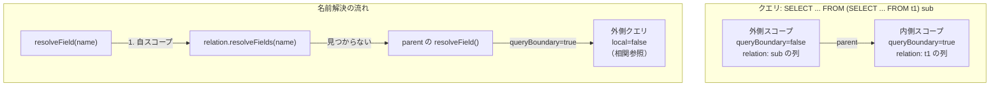
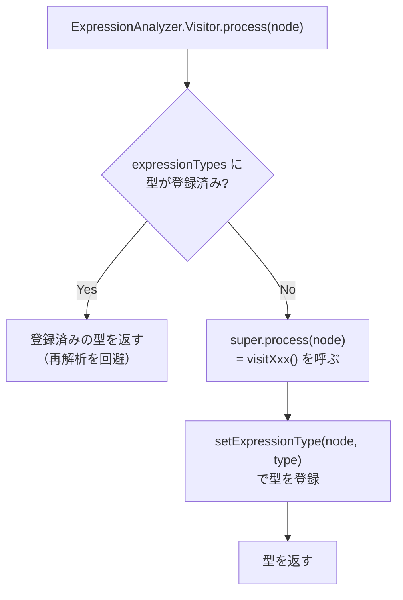

# 第5章 Analyzer と意味解析

> **本章で読むソース**
>
> - [`core/trino-main/src/main/java/io/trino/sql/analyzer/Analyzer.java`](https://github.com/trinodb/trino/blob/482/core/trino-main/src/main/java/io/trino/sql/analyzer/Analyzer.java)
> - [`core/trino-main/src/main/java/io/trino/sql/analyzer/AnalyzerFactory.java`](https://github.com/trinodb/trino/blob/482/core/trino-main/src/main/java/io/trino/sql/analyzer/AnalyzerFactory.java)
> - [`core/trino-main/src/main/java/io/trino/sql/analyzer/StatementAnalyzer.java`](https://github.com/trinodb/trino/blob/482/core/trino-main/src/main/java/io/trino/sql/analyzer/StatementAnalyzer.java)
> - [`core/trino-main/src/main/java/io/trino/sql/analyzer/ExpressionAnalyzer.java`](https://github.com/trinodb/trino/blob/482/core/trino-main/src/main/java/io/trino/sql/analyzer/ExpressionAnalyzer.java)
> - [`core/trino-main/src/main/java/io/trino/sql/analyzer/Analysis.java`](https://github.com/trinodb/trino/blob/482/core/trino-main/src/main/java/io/trino/sql/analyzer/Analysis.java)
> - [`core/trino-main/src/main/java/io/trino/sql/analyzer/Scope.java`](https://github.com/trinodb/trino/blob/482/core/trino-main/src/main/java/io/trino/sql/analyzer/Scope.java)
> - [`core/trino-main/src/main/java/io/trino/sql/analyzer/Field.java`](https://github.com/trinodb/trino/blob/482/core/trino-main/src/main/java/io/trino/sql/analyzer/Field.java)
> - [`core/trino-main/src/main/java/io/trino/sql/analyzer/ExpressionTreeUtils.java`](https://github.com/trinodb/trino/blob/482/core/trino-main/src/main/java/io/trino/sql/analyzer/ExpressionTreeUtils.java)

## この章の狙い

パーサーが生成した AST は、構文的には正しくても意味的に不正な場合がある。
存在しないテーブルの参照、型の不一致、集約関数の不正な使用などは、構文解析だけでは検出できない。

Trino ではこれらの意味検査を **アナライザ**（`Analyzer`）が担う。
本章では、アナライザが AST をどのように走査し、名前解決と型推論を行い、その結果を `Analysis` オブジェクトに蓄積するかを読む。

## 前提

第4章までの AST 構造（`Statement`、`Query`、`QuerySpecification`、`Table` などの Node 階層）と Visitor パターンの基本を理解していれば読み進められる。
SQL の SELECT 文がどのような節（FROM、WHERE、GROUP BY、HAVING、SELECT、ORDER BY）で構成されるかを知っていることも前提とする。

## Analyzer の全体フロー

### AnalyzerFactory による生成

`Analyzer` のインスタンスは `AnalyzerFactory.createAnalyzer()` で生成される。
`AnalyzerFactory` は Guice の `@Inject` で DI されるシングルトンであり、`StatementAnalyzerFactory`、`StatementRewrite`、OpenTelemetry の `Tracer` を保持する。

[`core/trino-main/src/main/java/io/trino/sql/analyzer/AnalyzerFactory.java` L32-L63](https://github.com/trinodb/trino/blob/482/core/trino-main/src/main/java/io/trino/sql/analyzer/AnalyzerFactory.java#L32-L84)

```java
public class AnalyzerFactory
{
    private final StatementAnalyzerFactory statementAnalyzerFactory;
    private final StatementRewrite statementRewrite;
    private final Tracer tracer;

    @Inject
    public AnalyzerFactory(StatementAnalyzerFactory statementAnalyzerFactory, StatementRewrite statementRewrite, Tracer tracer)
    {
        this.statementAnalyzerFactory = requireNonNull(statementAnalyzerFactory, "statementAnalyzerFactory is null");
        this.statementRewrite = requireNonNull(statementRewrite, "statementRewrite is null");
        this.tracer = requireNonNull(tracer, "tracer is null");
    }

    public Analyzer createAnalyzer(
            Session session,
            List<Expression> parameters,
            Map<NodeRef<Parameter>, Expression> parameterLookup,
            WarningCollector warningCollector,
            PlanOptimizersStatsCollector planOptimizersStatsCollector)
    {
        return new Analyzer(
                session,
                this,
                statementAnalyzerFactory,
                parameters,
                parameterLookup,
                warningCollector,
                planOptimizersStatsCollector,
                tracer,
                statementRewrite);
    }
    // ... (中略) ...
}
```

`Analyzer` のコンストラクタはパッケージプライベートであり、外部からの生成は `AnalyzerFactory` 経由に限定されている。

### analyze() メソッドの処理手順

`Analyzer.analyze(Statement)` がアナライザの入口である。
処理は3段階に分かれる。

[`core/trino-main/src/main/java/io/trino/sql/analyzer/Analyzer.java` L91-L113](https://github.com/trinodb/trino/blob/482/core/trino-main/src/main/java/io/trino/sql/analyzer/Analyzer.java#L91-L113)

```java
    public Analysis analyze(Statement statement, QueryType queryType)
    {
        Statement rewrittenStatement = statementRewrite.rewrite(analyzerFactory, session, statement, parameters, parameterLookup, warningCollector, planOptimizersStatsCollector);
        Analysis analysis = new Analysis(rewrittenStatement, parameterLookup, queryType);
        StatementAnalyzer analyzer = statementAnalyzerFactory.createStatementAnalyzer(analysis, session, warningCollector, CorrelationSupport.ALLOWED);

        try (var _ = scopedSpan(tracer, "analyze")) {
            analyzer.analyze(rewrittenStatement);
        }

        try (var _ = scopedSpan(tracer, "access-control")) {
            // check column access permissions for each table
            analysis.getTableColumnReferences().forEach((accessControlInfo, tableColumnReferences) ->
                    tableColumnReferences.forEach((tableAndBranch, columns) ->
                            accessControlInfo.getAccessControl().checkCanSelectFromColumns(
                                    accessControlInfo.getSecurityContext(session.getRequiredTransactionId(), session.getQueryId(), session.getStart()),
                                    tableAndBranch.tableName(),
                                    tableAndBranch.branch(),
                                    columns)));
        }

        return analysis;
    }
```

1. **Statement のリライト**：`StatementRewrite` が SHOW TABLES や DESCRIBE などの補助的な文を内部的な SELECT 文に書き換える
2. **意味解析**：`StatementAnalyzer.analyze()` が AST を再帰的に走査し、名前解決、型推論、スコープ構築を行う。結果はすべて `Analysis` に蓄積される
3. **アクセス制御**：解析中に収集されたテーブルと列の参照情報をもとに、`AccessControl` で SELECT 権限を検証する

アクセス制御を解析の最後にまとめて実行する設計には理由がある。
個々のテーブル参照の時点で権限を検査すると、ビューの展開やマテリアライズドビューのストレージテーブルへの読み替えなど、解析が進むにつれて参照テーブルが変わる場面で不整合が起きる。
解析が完了して全テーブルの参照が確定してからまとめて検査することで、この問題を回避している。

## StatementAnalyzer と Visitor パターン

### クラスの構造

`StatementAnalyzer` は約6,400行におよぶ大きなクラスであり、SQL 文の種類ごとの意味解析ロジックをすべて含む。
内部に `Visitor` という private inner class を持ち、`AstVisitor<Scope, Optional<Scope>>` を継承する。

[`core/trino-main/src/main/java/io/trino/sql/analyzer/StatementAnalyzer.java` L503-L517](https://github.com/trinodb/trino/blob/482/core/trino-main/src/main/java/io/trino/sql/analyzer/StatementAnalyzer.java#L503-L517)

```java
    public Scope analyze(Node node)
    {
        return analyze(node, Optional.empty(), true);
    }

    public Scope analyze(Node node, Scope outerQueryScope)
    {
        return analyze(node, Optional.of(outerQueryScope), false);
    }

    private Scope analyze(Node node, Optional<Scope> outerQueryScope, boolean isTopLevel)
    {
        return new Visitor(outerQueryScope, warningCollector, Optional.empty(), isTopLevel)
                .process(node, Optional.empty());
    }
```

`analyze()` は `Visitor` を生成し、AST の根ノードに `process()` を呼び出す。
`Visitor` の各 `visitXxx()` メソッドは戻り値として `Scope`（後述）を返す。
これにより、AST ノードごとにスコープが確定し、親ノードはその戻り値を使って自身のスコープを構築する。

### visitQuery：クエリの解析

`visitQuery` は SELECT 文の最上位レベルを処理する。

[`core/trino-main/src/main/java/io/trino/sql/analyzer/StatementAnalyzer.java` L1568-L1623](https://github.com/trinodb/trino/blob/482/core/trino-main/src/main/java/io/trino/sql/analyzer/StatementAnalyzer.java#L1568-L1623)

```java
protected Scope visitQuery(Query node, Optional<Scope> scope)
{
    for (FunctionSpecification function : node.getFunctions()) {
        // ... (中略) ... インライン関数の登録
    }

    Scope withScope = analyzeWith(node, scope);
    Scope queryBodyScope = process(node.getQueryBody(), withScope);

    List<Expression> orderByExpressions = emptyList();
    if (node.getOrderBy().isPresent()) {
        orderByExpressions = analyzeOrderBy(node, getSortItemsFromOrderBy(node.getOrderBy()), queryBodyScope);

        if ((queryBodyScope.getOuterQueryParent().isPresent() || !isTopLevel) && node.getLimit().isEmpty() && node.getOffset().isEmpty()) {
            // not the root scope and ORDER BY is ineffective
            analysis.markRedundantOrderBy(node.getOrderBy().get());
            warningCollector.add(new TrinoWarning(REDUNDANT_ORDER_BY, "ORDER BY in subquery may have no effect"));
        }
    }
    analysis.setOrderByExpressions(node, orderByExpressions);
    // ... (中略) ... OFFSET, LIMIT の解析

    Scope queryScope = Scope.builder()
            .withParent(withScope)
            .withRelationType(RelationId.of(node), queryBodyScope.getRelationType())
            .build();

    analysis.setScope(node, queryScope);
    return queryScope;
}
```

処理の順序は次のとおりである。

1. WITH 句を `analyzeWith()` で解析し、名前付きクエリを登録したスコープ（`withScope`）を得る
2. クエリ本体（通常は `QuerySpecification`）を `process()` で再帰的に解析する
3. ORDER BY、OFFSET、LIMIT を解析する。サブクエリ内で ORDER BY だけ指定され LIMIT がない場合は、冗長な ORDER BY として警告を出す
4. クエリ全体のスコープを構築し、`Analysis` に登録する

### visitQuerySpecification：SELECT 文の各句の解析

`visitQuerySpecification` は SELECT 文の本体を構成する各句を、SQL の意味論に従った順序で処理する。

[`core/trino-main/src/main/java/io/trino/sql/analyzer/StatementAnalyzer.java` L3220-L3310](https://github.com/trinodb/trino/blob/482/core/trino-main/src/main/java/io/trino/sql/analyzer/StatementAnalyzer.java#L3220-L3310)

```java
protected Scope visitQuerySpecification(QuerySpecification node, Optional<Scope> scope)
{
    Scope sourceScope = analyzeFrom(node, scope);

    analyzeWindowDefinitions(node, sourceScope);
    resolveFunctionCallAndMeasureWindows(node);

    node.getWhere().ifPresent(where -> analyzeWhere(node, sourceScope, where));

    List<Expression> outputExpressions = analyzeSelect(node, sourceScope);
    GroupingSetAnalysis groupByAnalysis = analyzeGroupBy(node, sourceScope, outputExpressions);
    analyzeHaving(node, sourceScope);

    Scope outputScope = computeAndAssignOutputScope(node, scope, sourceScope);

    List<Expression> orderByExpressions = emptyList();
    Optional<Scope> orderByScope = Optional.empty();
    if (node.getOrderBy().isPresent()) {
        OrderBy orderBy = node.getOrderBy().get();
        orderByScope = Optional.of(computeAndAssignOrderByScope(orderBy, sourceScope, outputScope));
        orderByExpressions = analyzeOrderBy(node, orderBy.getSortItems(), orderByScope.get());
        // ... (中略) ... 冗長 ORDER BY の検出
    }
    // ... (中略) ... OFFSET, LIMIT

    analyzeGroupingOperations(node, sourceExpressions, orderByExpressions);
    analyzeAggregations(node, sourceScope, orderByScope, groupByAnalysis, sourceExpressions, orderByExpressions);
    analyzeWindowFunctionsAndMeasures(node, outputExpressions, orderByExpressions);
    // ... (中略) ...

            return outputScope;
        }
```

解析の順序は FROM、WINDOW 定義、WHERE、SELECT、GROUP BY、HAVING、出力スコープの構築、ORDER BY、集約と窓関数の検証である。
SQL の論理的な評価順序（FROM が最初、ORDER BY が最後）にほぼ対応している。

`analyzeFrom` は FROM 句のリレーション（テーブル、サブクエリ、JOIN など）を再帰的に解析する。

[`core/trino-main/src/main/java/io/trino/sql/analyzer/StatementAnalyzer.java` L5253-L5262](https://github.com/trinodb/trino/blob/482/core/trino-main/src/main/java/io/trino/sql/analyzer/StatementAnalyzer.java#L5253-L5262)

```java
        private Scope analyzeFrom(QuerySpecification node, Optional<Scope> scope)
        {
            if (node.getFrom().isPresent()) {
                return process(node.getFrom().get(), scope);
            }

            Scope result = createScope(scope);
            analysis.setImplicitFromScope(node, result);
            return result;
        }
```

FROM 句がない場合（`SELECT 1` のような式のみのクエリ）は、空のスコープを暗黙の FROM スコープとして設定する。

### visitTable：テーブル参照の解決

`visitTable` はテーブル名を実際のテーブルに解決する。
名前解決の優先順位は、WITH クエリ、再帰参照、マテリアライズドビュー、ビュー、実テーブルの順である。

[`core/trino-main/src/main/java/io/trino/sql/analyzer/StatementAnalyzer.java` L2311-L2332](https://github.com/trinodb/trino/blob/482/core/trino-main/src/main/java/io/trino/sql/analyzer/StatementAnalyzer.java#L2311-L2333)

```java
        protected Scope visitTable(Table table, Optional<Scope> scope)
        {
            if (table.getName().getPrefix().isEmpty()) {
                // is this a reference to a WITH query?
                Optional<WithQuery> withQuery = createScope(scope).getNamedQuery(table.getName().getSuffix());
                if (withQuery.isPresent()) {
                    analysis.setRelationName(table, table.getName());
                    return createScopeForCommonTableExpression(table, scope, withQuery.get());
                }
                // is this a recursive reference in expandable WITH query? If so, there's base scope recorded.
                Optional<Scope> expandableBaseScope = analysis.getExpandableBaseScope(table);
                if (expandableBaseScope.isPresent()) {
                    Scope baseScope = expandableBaseScope.get();
                    // adjust local and outer parent scopes accordingly to the local context of the recursive reference
                    Scope resultScope = scopeBuilder(scope)
                            .withRelationType(baseScope.getRelationId(), baseScope.getRelationType())
                            .build();
                    analysis.setScope(table, resultScope);
                    analysis.setRelationName(table, table.getName());
                    return resultScope;
                }
            }

```

WITH クエリに一致しない場合、メタデータを通じてマテリアライズドビューの存在を確認する。
マテリアライズドビューが十分に新鮮であればストレージテーブルへの読み替えを行い、そうでなければビューとして展開する。
ビューでもなければ実テーブルとして解決し、メタデータからカラム情報を取得してスコープを構築する。

[`core/trino-main/src/main/java/io/trino/sql/analyzer/StatementAnalyzer.java` L2392-L2417](https://github.com/trinodb/trino/blob/482/core/trino-main/src/main/java/io/trino/sql/analyzer/StatementAnalyzer.java#L2392-L2417)

```java
TableSchema tableSchema = metadata.getTableSchema(session, tableHandle.get());
Map<String, ColumnHandle> columnHandles = metadata.getColumnHandles(session, tableHandle.get());

ImmutableList.Builder<Field> fields = ImmutableList.builder();
fields.addAll(analyzeTableOutputFields(table, targetTableName, tableSchema, columnHandles));

// ... (中略) ... UPDATE/DELETE 用の row id カラムの追加

List<Field> outputFields = fields.build();

Scope accessControlScope = Scope.builder()
        .withRelationType(RelationId.anonymous(), new RelationType(outputFields))
        .build();
analyzeFiltersAndMasks(table, targetTableName, new RelationType(outputFields), accessControlScope);
analysis.registerTable(table, tableHandle, targetTableName, getBranchName(table), session.getIdentity().getUser(), accessControlScope, Optional.empty());

Scope tableScope = createAndAssignScope(table, scope, outputFields);
```

テーブルのカラム情報は Connector の SPI を通じて取得され、`Field` のリストとしてスコープに登録される。
行フィルターやカラムマスクもこの時点で解析される。

## Scope の構造と名前解決

### Scope のデータ構造

`Scope` は意味解析におけるスコープ（名前空間）を表す不変オブジェクトである。
SQL のスコープ階層（サブクエリのネスト、FROM 句内の JOIN など）をチェーン構造で表現する。

[`core/trino-main/src/main/java/io/trino/sql/analyzer/Scope.java` L43-L73](https://github.com/trinodb/trino/blob/482/core/trino-main/src/main/java/io/trino/sql/analyzer/Scope.java#L42-L73)

```java
@Immutable
public class Scope
{
    private final Optional<Scope> parent;
    private final boolean queryBoundary;
    private final RelationId relationId;
    private final RelationType relation;
    private final Map<String, WithQuery> namedQueries;

    // ... (中略) ...

    private Scope(
            Optional<Scope> parent,
            boolean queryBoundary,
            RelationId relationId,
            RelationType relation,
            Map<String, WithQuery> namedQueries)
    {
        this.parent = requireNonNull(parent, "parent is null");
        this.relationId = requireNonNull(relationId, "relationId is null");
        this.queryBoundary = queryBoundary;
        this.relation = requireNonNull(relation, "relation is null");
        this.namedQueries = ImmutableMap.copyOf(requireNonNull(namedQueries, "namedQueries is null"));
    }
```

`Scope` の主要なフィールドは次のとおりである。

- **`parent`**：親スコープへの参照。スコープ階層を形成する
- **`queryBoundary`**：このスコープがクエリ境界（サブクエリの開始点）であるかを示すフラグ。相関サブクエリの名前解決で使われる
- **`relation`**：このスコープが保持する `RelationType`（列の一覧）
- **`namedQueries`**：WITH 句で定義された名前付きクエリ



### 列名の解決

`Scope.resolveField()` は列名を解決する中核メソッドである。
名前の照合は、自スコープから始めて親スコープへ遡り、最初に一致した列を返す。

[`core/trino-main/src/main/java/io/trino/sql/analyzer/Scope.java` L244-L268](https://github.com/trinodb/trino/blob/482/core/trino-main/src/main/java/io/trino/sql/analyzer/Scope.java#L244-L268)

```java
    private Optional<ResolvedField> resolveField(Expression node, QualifiedName name, boolean local)
    {
        List<Field> matches = relation.resolveFields(name);
        if (matches.size() > 1) {
            throw ambiguousAttributeException(node, name);
        }
        if (matches.size() == 1) {
            int parentFieldCount = getLocalParent()
                    .map(Scope::getLocalScopeFieldCount)
                    .orElse(0);

            Field field = getOnlyElement(matches);
            return Optional.of(asResolvedField(field, parentFieldCount, local));
        }
        if (isColumnReference(name, relation)) {
            return Optional.empty();
        }
        if (parent.isPresent()) {
            if (queryBoundary) {
                return parent.get().resolveField(node, name, false);
            }
            return parent.get().resolveField(node, name, local);
        }
        return Optional.empty();
    }
```

名前解決のルールには2つの注意点がある。

第一に、一致する列が2つ以上見つかった場合は曖昧な名前として例外を投げる。
第二に、`queryBoundary` が `true` のスコープを越えて親に遡る場合は `local` を `false` にして再帰する。
`local` が `false` である `ResolvedField` は相関参照（外側クエリの列への参照）として扱われる。
相関参照は後続のプランニングフェーズで `ApplyNode` や `LateralJoinNode` に変換されるため、解析時にこのフラグで区別しておく必要がある。

### Field と RelationType

`Field` はスコープ内の1つの列を表す。

[`core/trino-main/src/main/java/io/trino/sql/analyzer/Field.java` L25-L33](https://github.com/trinodb/trino/blob/482/core/trino-main/src/main/java/io/trino/sql/analyzer/Field.java#L24-L33)

```java
public class Field
{
    private final Optional<QualifiedObjectName> originTable;
    private final Optional<String> originBranch;
    private final Optional<String> originColumnName;
    private final Optional<QualifiedName> relationAlias;
    private final Optional<String> name;
    private final Type type;
    private final boolean hidden;
    private final boolean aliased;
```

`Field` には列名（`name`）と型（`type`）だけでなく、元テーブル名（`originTable`）やエイリアス情報（`relationAlias`、`aliased`）も含まれる。
`hidden` フラグは内部的なシステム列（例えば `$bucket`）に使われ、`SELECT *` では出力されない。

列名の照合は `canResolve()` メソッドで行われる。

[`core/trino-main/src/main/java/io/trino/sql/analyzer/Field.java` L189-L197](https://github.com/trinodb/trino/blob/482/core/trino-main/src/main/java/io/trino/sql/analyzer/Field.java#L189-L197)

```java
    public boolean canResolve(QualifiedName name)
    {
        if (this.name.isEmpty()) {
            return false;
        }

        // TODO: need to know whether the qualified name and the name of this field were quoted
        return matchesPrefix(name.getPrefix()) && this.name.get().equalsIgnoreCase(name.getSuffix());
    }
```

列名の末尾部分を大文字小文字を無視して比較し、接頭辞部分（テーブル名やスキーマ名）は `relationAlias` と照合する。
`RelationType.resolveFields()` がこの `canResolve()` を全列に対して適用し、一致する列のリストを返す。

[`core/trino-main/src/main/java/io/trino/sql/analyzer/RelationType.java` L130-L135](https://github.com/trinodb/trino/blob/482/core/trino-main/src/main/java/io/trino/sql/analyzer/RelationType.java#L130-L135)

```java
    public List<Field> resolveFields(QualifiedName name)
    {
        return allFields.stream()
                .filter(input -> input.canResolve(name))
                .collect(toImmutableList());
    }
```

### WITH クエリの名前解決

WITH 句で定義された名前付きクエリは `Scope` の `namedQueries` マップに格納される。
`getNamedQuery()` は自スコープのマップを検索し、見つからなければ親スコープへ遡る。

[`core/trino-main/src/main/java/io/trino/sql/analyzer/Scope.java` L310-L321](https://github.com/trinodb/trino/blob/482/core/trino-main/src/main/java/io/trino/sql/analyzer/Scope.java#L310-L321)

```java
    public Optional<WithQuery> getNamedQuery(String name)
    {
        if (namedQueries.containsKey(name)) {
            return Optional.of(namedQueries.get(name));
        }

        if (parent.isPresent()) {
            return parent.get().getNamedQuery(name);
        }

        return Optional.empty();
    }
```

`visitTable` はテーブル名を解決する際に、まず `getNamedQuery()` で WITH クエリを検索する。
一致する WITH クエリがあればメタデータへの問い合わせをスキップするため、Connector への往復が不要になる。

### スコープの生成と登録

`createAndAssignScope` は新しいスコープを生成し、`Analysis` に登録する。

[`core/trino-main/src/main/java/io/trino/sql/analyzer/StatementAnalyzer.java` L6162-L6170](https://github.com/trinodb/trino/blob/482/core/trino-main/src/main/java/io/trino/sql/analyzer/StatementAnalyzer.java#L6162-L6170)

```java
        private Scope createAndAssignScope(Node node, Optional<Scope> parentScope, RelationType relationType)
        {
            Scope scope = scopeBuilder(parentScope)
                    .withRelationType(RelationId.of(node), relationType)
                    .build();

            analysis.setScope(node, scope);
            return scope;
        }
```

生成されたスコープは `Analysis.setScope()` を通じて、AST ノードをキーとして `Map<NodeRef<Node>, Scope>` に格納される。
後続のプランニングフェーズでは `Analysis.getScope(node)` を呼び出すことで、任意の AST ノードに対応するスコープを復元できる。

## Analysis オブジェクトの役割

### データの蓄積先

`Analysis` は意味解析の全結果を蓄積するコンテナである。
AST ノードは不変のため、解析結果をノードに直接付加することはできない。
代わりに `Analysis` が `NodeRef`（ノードの参照ラッパー）をキーとする多数の `Map` を保持し、ノードと解析結果を対応づける。

[`core/trino-main/src/main/java/io/trino/sql/analyzer/Analysis.java` L160-L199](https://github.com/trinodb/trino/blob/482/core/trino-main/src/main/java/io/trino/sql/analyzer/Analysis.java#L160-L198)

```java
    private final Map<NodeRef<Node>, Scope> scopes = new LinkedHashMap<>();
    private final Map<NodeRef<Expression>, ResolvedField> columnReferences = new LinkedHashMap<>();

    // a map of users to the columns per table (and branch) that they access
    private final Map<AccessControlInfo, Map<TableAndBranch, Set<String>>> tableColumnReferences = new LinkedHashMap<>();

// ... (中略) ...

    private final Map<NodeRef<QuerySpecification>, List<FunctionCall>> aggregates = new LinkedHashMap<>();
    private final Map<NodeRef<OrderBy>, List<Expression>> orderByAggregates = new LinkedHashMap<>();
    private final Map<NodeRef<QuerySpecification>, GroupingSetAnalysis> groupingSets = new LinkedHashMap<>();

    private final Map<NodeRef<Node>, Expression> where = new LinkedHashMap<>();
    private final Map<NodeRef<QuerySpecification>, Expression> having = new LinkedHashMap<>();
    private final Map<NodeRef<Node>, List<Expression>> orderByExpressions = new LinkedHashMap<>();
    private final Set<NodeRef<OrderBy>> redundantOrderBy = new HashSet<>();
    private final Map<NodeRef<Node>, List<SelectExpression>> selectExpressions = new LinkedHashMap<>();
```

主要な蓄積データを以下にまとめる。

- **`scopes`**：各ノードに対応するスコープ
- **`types`**：各式の推論された型
- **`coercions`**：暗黙の型変換が必要な式とその変換先の型
- **`columnReferences`**：列参照の解決結果
- **`tableColumnReferences`**：テーブルごとの参照列（アクセス制御用）
- **`aggregates`**：各 `QuerySpecification` に含まれる集約関数
- **`groupingSets`**：GROUP BY の解析結果
- **`resolvedFunctions`**：解決済みの関数情報

### 型情報の取得

式の型は `getType()` で取得できる。

[`core/trino-main/src/main/java/io/trino/sql/analyzer/Analysis.java` L403-L408](https://github.com/trinodb/trino/blob/482/core/trino-main/src/main/java/io/trino/sql/analyzer/Analysis.java#L403-L408)

```java
    public Type getType(Expression expression)
    {
        Type type = types.get(NodeRef.of(expression));
        checkArgument(type != null, "Expression not analyzed: %s", expression);
        return type;
    }
```

型が登録されていない式に対して `getType()` を呼ぶと例外が投げられる。
これにより、解析されていない式がプランニングフェーズに流れ込むバグを早期に検出できる。

### サブクエリの記録

式解析で検出されたサブクエリ、EXISTS 述語、IN 述語のサブクエリは `recordSubqueries()` で一括記録される。

[`core/trino-main/src/main/java/io/trino/sql/analyzer/Analysis.java` L543-L552](https://github.com/trinodb/trino/blob/482/core/trino-main/src/main/java/io/trino/sql/analyzer/Analysis.java#L543-L552)

```java
    public void recordSubqueries(Node node, ExpressionAnalysis expressionAnalysis)
    {
        SubqueryAnalysis subqueries = this.subqueries.computeIfAbsent(NodeRef.of(node), _ -> new SubqueryAnalysis());
        subqueries.addInPredicates(expressionAnalysis.getSubqueryInPredicates());
        subqueries.addSubqueries(dereference(expressionAnalysis.getSubqueries()));
        subqueries.addExistsSubqueries(dereference(expressionAnalysis.getExistsSubqueries()));
        subqueries.addQuantifiedComparisons(expressionAnalysis.getQuantifiedComparisons());
        subqueries.addMatchPredicates(expressionAnalysis.getMatchPredicates());
        subqueries.addUniquePredicates(dereference(expressionAnalysis.getUniquePredicates()));
    }
```

## ExpressionAnalyzer による式の型推論

### 式解析の入口

式の型推論は `ExpressionAnalyzer` が担う。
`StatementAnalyzer` は式を含むノードに遭遇するたびに、静的メソッド `ExpressionAnalyzer.analyzeExpression()` を呼び出す。

[`core/trino-main/src/main/java/io/trino/sql/analyzer/StatementAnalyzer.java` L5414-L5426](https://github.com/trinodb/trino/blob/482/core/trino-main/src/main/java/io/trino/sql/analyzer/StatementAnalyzer.java#L5414-L5426)

```java
        private ExpressionAnalysis analyzeExpression(Expression expression, Scope scope)
        {
            return ExpressionAnalyzer.analyzeExpression(
                    session,
                    plannerContext,
                    statementAnalyzerFactory,
                    accessControl,
                    scope,
                    analysis,
                    expression,
                    warningCollector,
                    correlationSupport);
        }
```

`ExpressionAnalyzer.analyzeExpression()` は `ExpressionAnalyzer` のインスタンスを生成し、式を解析した後に `updateAnalysis()` で結果を `Analysis` に転記する。

[`core/trino-main/src/main/java/io/trino/sql/analyzer/ExpressionAnalyzer.java` L4385-L4413](https://github.com/trinodb/trino/blob/482/core/trino-main/src/main/java/io/trino/sql/analyzer/ExpressionAnalyzer.java#L4385-L4413)

```java
    public static ExpressionAnalysis analyzeExpression(
            Session session,
            PlannerContext plannerContext,
            StatementAnalyzerFactory statementAnalyzerFactory,
            AccessControl accessControl,
            Scope scope,
            Analysis analysis,
            Expression expression,
            WarningCollector warningCollector,
            CorrelationSupport correlationSupport)
    {
        ExpressionAnalyzer analyzer = new ExpressionAnalyzer(plannerContext, accessControl, statementAnalyzerFactory, analysis, session, warningCollector);
        analyzer.analyze(expression, scope, correlationSupport);

        updateAnalysis(analysis, analyzer, session, accessControl);
        analysis.addExpressionFields(expression, analyzer.getSourceFields());

        return new ExpressionAnalysis(
                analyzer.getExpressionTypes(),
                analyzer.getExpressionCoercions(),
                analyzer.getSubqueryInPredicates(),
                analyzer.getSubqueries(),
                analyzer.getExistsSubqueries(),
                analyzer.getColumnReferences(),
                analyzer.getQuantifiedComparisons(),
                analyzer.getMatchPredicates(),
                analyzer.getUniquePredicates(),
                analyzer.getWindowFunctions());
    }
```

### Visitor による型推論の仕組み

`ExpressionAnalyzer` も `StatementAnalyzer` と同様に内部 `Visitor` を持つ。
こちらは `AstVisitor<Type, Context>` を継承し、各 `visitXxx()` メソッドが式の型（`Type`）を返す。

[`core/trino-main/src/main/java/io/trino/sql/analyzer/ExpressionAnalyzer.java` L715-L746](https://github.com/trinodb/trino/blob/482/core/trino-main/src/main/java/io/trino/sql/analyzer/ExpressionAnalyzer.java#L715-L746)

```java
    private class Visitor
            extends AstVisitor<Type, Context>
    {
        // Used to resolve FieldReferences (e.g. during local execution planning)
        private final Scope baseScope;
        private final WarningCollector warningCollector;

    // ... (中略) ...

        @Override
        public Type process(Node node, @Nullable Context context)
        {
            if (node instanceof Expression expression) {
                // don't double process a node
                Type type = expressionTypes.get(NodeRef.of(expression));
                if (type != null) {
                    return type;
                }
            }
            return super.process(node, context);
        }
```

`process()` のオーバーライドに注目する。
すでに型が確定した式ノードに対して再度 `process()` が呼ばれた場合、`expressionTypes` マップから型を返して再解析を回避する。
SQL では同じ式ノードが SELECT リストと ORDER BY の両方から参照されることがあるため、この重複排除は実用上必要である。

### 列参照の型推論

`visitIdentifier` は単純な列名（例：`price`）を解決する。

[`core/trino-main/src/main/java/io/trino/sql/analyzer/ExpressionAnalyzer.java` L808-L820](https://github.com/trinodb/trino/blob/482/core/trino-main/src/main/java/io/trino/sql/analyzer/ExpressionAnalyzer.java#L808-L820)

```java
protected Type visitIdentifier(Identifier node, Context context)
{
    ResolvedField resolvedField = context.getScope().resolveField(node, QualifiedName.of(node.getValue()));

    // ... (中略) ... パターン認識コンテキストの処理

    return handleResolvedField(node, resolvedField, context);
}
```

修飾付き列名（例：`t1.price`、`schema.table.column`）は `visitDereferenceExpression` で処理される。
修飾名が列として解決できるかをまず試し、解決できなければベースの式を `RowType` として処理し、フィールドアクセスとして解釈する。

[`core/trino-main/src/main/java/io/trino/sql/analyzer/ExpressionAnalyzer.java` L856-L932](https://github.com/trinodb/trino/blob/482/core/trino-main/src/main/java/io/trino/sql/analyzer/ExpressionAnalyzer.java#L856-L932)

```java
        protected Type visitDereferenceExpression(DereferenceExpression node, Context context)
        {
    // ... (中略) ...

    QualifiedName qualifiedName = DereferenceExpression.getQualifiedName(node);

    // If this Dereference looks like column reference, try match it to column first.
    if (qualifiedName != null) {
        // ... (中略) ... パターン認識ラベルの処理

        Scope scope = context.getScope();
        Optional<ResolvedField> resolvedField = scope.tryResolveField(node, qualifiedName);
        if (resolvedField.isPresent()) {
            return handleResolvedField(node, resolvedField.get(), context);
        }
        if (!scope.isColumnReference(qualifiedName)) {
            throw missingAttributeException(node, qualifiedName);
        }
    }

    Type baseType = process(node.getBase(), context);
    if (!(baseType instanceof RowType rowType)) {
        throw semanticException(TYPE_MISMATCH, node.getBase(), "Expression %s is not of type ROW", node.getBase());
    }
    // ... (中略) ... RowType からのフィールド探索
```

この二段階の解決ロジックにより、`t1.col` のような修飾付き列参照と、`row_expr.field` のような行型のフィールドアクセスを同一の構文で扱える。

### 型強制（coercion）

異なる型の式が同じ文脈で使われる場合、`ExpressionAnalyzer` は暗黙の型変換（coercion）を挿入する。
`coerceType()` は単一式を期待する型に強制し、`coerceToSingleType()` は複数の式を共通の上位型に揃える。

[`core/trino-main/src/main/java/io/trino/sql/analyzer/ExpressionAnalyzer.java` L4033-L4047](https://github.com/trinodb/trino/blob/482/core/trino-main/src/main/java/io/trino/sql/analyzer/ExpressionAnalyzer.java#L4033-L4047)

```java
        private void coerceType(Expression expression, Type actualType, Type expectedType, String message)
        {
            if (!actualType.equals(expectedType)) {
                if (!typeCoercion.canCoerce(actualType, expectedType)) {
                    throw semanticException(TYPE_MISMATCH, expression, "%s must evaluate to a %s (actual: %s)", message, expectedType, actualType);
                }
                addOrReplaceExpressionCoercion(expression, expectedType);
            }
        }

        private void coerceType(Context context, Expression expression, Type expectedType, String message)
        {
            Type actualType = process(expression, context);
            coerceType(expression, actualType, expectedType, message);
        }
```

`coerceToSingleType()` は、COALESCE 式や CASE 式のように複数のブランチが同じ型でなければならない場面で使われる。
`TypeCoercion.getCommonSuperType()` で共通の上位型を求め、各式に暗黙の変換を登録する。

[`core/trino-main/src/main/java/io/trino/sql/analyzer/ExpressionAnalyzer.java` L4049-L4076](https://github.com/trinodb/trino/blob/482/core/trino-main/src/main/java/io/trino/sql/analyzer/ExpressionAnalyzer.java#L4049-L4076)

```java
        private Type coerceToSingleType(Context context, Node node, String message, Expression first, Expression second)
        {
            Type firstType = UNKNOWN;
            if (first != null) {
                firstType = process(first, context);
            }
            Type secondType = UNKNOWN;
            if (second != null) {
                secondType = process(second, context);
            }

            // coerce types if possible
            Optional<Type> superTypeOptional = typeCoercion.getCommonSuperType(firstType, secondType);
            if (superTypeOptional.isPresent()
                    && typeCoercion.canCoerce(firstType, superTypeOptional.get())
                    && typeCoercion.canCoerce(secondType, superTypeOptional.get())) {
                Type superType = superTypeOptional.get();
                if (!firstType.equals(superType)) {
                    addOrReplaceExpressionCoercion(first, superType);
                }
                if (!secondType.equals(superType)) {
                    addOrReplaceExpressionCoercion(second, superType);
                }
                return superType;
            }

            throw semanticException(TYPE_MISMATCH, node, "%s: %s vs %s", message, firstType, secondType);
        }
```

登録された型強制情報は `Analysis.getCoercions()` を通じてプランニングフェーズに渡され、実行計画に `CAST` Operator として挿入される。

### 関数呼び出しの解決

`visitFunctionCall` は関数名と引数の型からシグネチャを解決する。

[`core/trino-main/src/main/java/io/trino/sql/analyzer/ExpressionAnalyzer.java` L1449-L1458](https://github.com/trinodb/trino/blob/482/core/trino-main/src/main/java/io/trino/sql/analyzer/ExpressionAnalyzer.java#L1449-L1458)

```java
        protected Type visitFunctionCall(FunctionCall node, Context context)
        {
            // SQL:2023 6.3 Syntax Rule 2: a non-parenthesized value expression primary
            // of the form A.B(args) is treated as a method invocation if it satisfies
            // the rules for one; otherwise it is a routine invocation.
            Optional<Type> asMethod = tryResolveAsInstanceMethod(node, context);
            if (asMethod.isPresent()) {
                return asMethod.get();
            }

```

SQL:2023 に準拠して、まず `A.B(args)` 形式の呼び出しをメソッド呼び出しとして解決を試みる。
メソッドでなければ通常の関数として解決し、集約関数や窓関数の制約検証を行う。

## 式ツリーのユーティリティ

`ExpressionTreeUtils` は式ツリーを走査して特定の種類のノードを抽出するユーティリティである。
`extractAggregateFunctions()` は集約関数をすべて抽出する。

[`core/trino-main/src/main/java/io/trino/sql/analyzer/ExpressionTreeUtils.java` L43-L46](https://github.com/trinodb/trino/blob/482/core/trino-main/src/main/java/io/trino/sql/analyzer/ExpressionTreeUtils.java#L43-L46)

```java
    static List<FunctionCall> extractAggregateFunctions(Iterable<? extends Node> nodes, Session session, FunctionResolver functionResolver, AccessControl accessControl)
    {
        return extractExpressions(nodes, FunctionCall.class, function -> isAggregation(function, session, functionResolver, accessControl));
    }
```

内部では `linearizeNodes()` が式ツリーを `DefaultExpressionTraversalVisitor` で平坦化する。

[`core/trino-main/src/main/java/io/trino/sql/analyzer/ExpressionTreeUtils.java` L122-L136](https://github.com/trinodb/trino/blob/482/core/trino-main/src/main/java/io/trino/sql/analyzer/ExpressionTreeUtils.java#L122-L136)

```java
    private static List<Node> linearizeNodes(Node node)
    {
        ImmutableList.Builder<Node> nodes = ImmutableList.builder();
        new DefaultExpressionTraversalVisitor<Void>()
        {
            @Override
            public Void process(Node node, Void context)
            {
                super.process(node, context);
                nodes.add(node);
                return null;
            }
        }.process(node, null);
        return nodes.build();
    }
```

Visitor で式ツリー全体を再帰的に走査し、すべてのノードを一次元リストに展開する。
その後、ストリーム操作で型によるフィルタリングと述語による絞り込みを行う。
この走査はすべての `extract` 系メソッドで共通であり、窓関数の抽出（`extractWindowFunctions()`）や `GroupingOperation` の抽出にも再利用される。

## 最適化の工夫：式の二重解析の防止

`ExpressionAnalyzer.Visitor.process()` は、すでに型が確定した式ノードに対する再解析を `expressionTypes` マップへのルックアップで回避する。

[`core/trino-main/src/main/java/io/trino/sql/analyzer/ExpressionAnalyzer.java` L736-L746](https://github.com/trinodb/trino/blob/482/core/trino-main/src/main/java/io/trino/sql/analyzer/ExpressionAnalyzer.java#L736-L746)

```java
        public Type process(Node node, @Nullable Context context)
        {
            if (node instanceof Expression expression) {
                // don't double process a node
                Type type = expressionTypes.get(NodeRef.of(expression));
                if (type != null) {
                    return type;
                }
            }
            return super.process(node, context);
        }
```

SQL では同一の式ノードが複数の文脈で参照されることがある。
例えば、`SELECT a + b FROM t ORDER BY a + b` では、`a + b` という式オブジェクトが SELECT リストと ORDER BY の両方から参照される可能性がある[^1]。
同様に、`computeAndAssignOutputScope` が SELECT リストの式の型を `Analysis.getType()` で取得する際にも、すでに解析済みの式の型を参照する。

`expressionTypes` マップは `LinkedHashMap` であるため、ルックアップは O(1) である。
式ツリーの深さや複雑さに関係なく、一度解析した結果を再利用できる。
特に深くネストした CASE 式やサブクエリを含む式で、型推論のコストが重複することを防いでいる。

[^1]: ORDER BY のスコープは `computeAndAssignOrderByScope` で FROM スコープと出力スコープを重ねて構築される。ORDER BY 式が SELECT リストの別名を参照する場合はこのスコープ構築が関わるが、同一ノードの再利用による二重解析の問題は `process()` のガードで回避される。



## まとめ

Trino のアナライザは、AST を受け取って意味的な正当性を検証し、後続のプランニングに必要な情報を `Analysis` オブジェクトに蓄積する。

その処理は3層に分かれている。
`Analyzer` がリライトとアクセス制御を含む全体フローを制御し、`StatementAnalyzer` が Statement レベルの Visitor パターンで各 SQL 句を走査し、`ExpressionAnalyzer` が式レベルの型推論と型強制を行う。
名前解決は `Scope` のチェーン構造を辿って行われ、`queryBoundary` フラグで相関参照と局所参照を区別する。

`Analysis` は解析結果の唯一の蓄積先であり、AST ノードの不変性を保ちつつ、`NodeRef` をキーとする `Map` 群でノードと型情報、スコープ、解決済み関数、型強制情報などを対応づける。
この設計により、AST とその意味情報が明確に分離され、プランニングフェーズは `Analysis` を読み取るだけで必要な情報を取得できる。

## 関連する章

- 第4章（パーサーと AST）：本章で解析対象となる AST の構造
- 第6章以降（論理計画、オプティマイザ）：`Analysis` を入力として IR を生成するフェーズ
