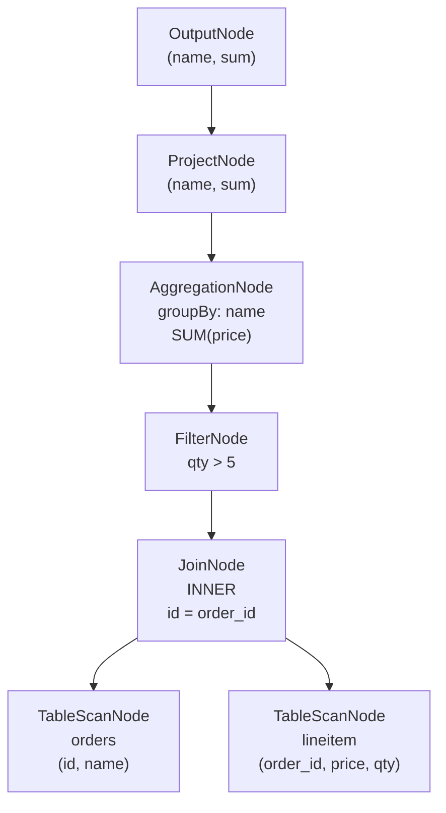

# 第6章 LogicalPlanner と IR

> **本章で読むソース**
>
> - [`core/trino-main/src/main/java/io/trino/sql/planner/LogicalPlanner.java`](https://github.com/trinodb/trino/blob/482/core/trino-main/src/main/java/io/trino/sql/planner/LogicalPlanner.java)
> - [`core/trino-main/src/main/java/io/trino/sql/planner/RelationPlanner.java`](https://github.com/trinodb/trino/blob/482/core/trino-main/src/main/java/io/trino/sql/planner/RelationPlanner.java)
> - [`core/trino-main/src/main/java/io/trino/sql/planner/QueryPlanner.java`](https://github.com/trinodb/trino/blob/482/core/trino-main/src/main/java/io/trino/sql/planner/QueryPlanner.java)
> - [`core/trino-main/src/main/java/io/trino/sql/planner/plan/PlanNode.java`](https://github.com/trinodb/trino/blob/482/core/trino-main/src/main/java/io/trino/sql/planner/plan/PlanNode.java)
> - [`core/trino-main/src/main/java/io/trino/sql/ir/Expression.java`](https://github.com/trinodb/trino/blob/482/core/trino-main/src/main/java/io/trino/sql/ir/Expression.java)
> - [`core/trino-main/src/main/java/io/trino/sql/planner/TranslationMap.java`](https://github.com/trinodb/trino/blob/482/core/trino-main/src/main/java/io/trino/sql/planner/TranslationMap.java)

## この章の狙い

アナライザが出力した `Analysis` オブジェクトを受け取り、PlanNode のツリー(論理プラン)を組み立てるまでの流れを読む。
AST の式表現と IR の式表現の違い、両者を橋渡しする `TranslationMap`、そして代表的な PlanNode の構造を把握することが目標である。

## 前提

- 第5章までで、パーサーが SQL テキストを AST に変換し、アナライザが型解決や関数解決を終えて `Analysis` に格納するまでの流れを理解していること。

## 6.1 LogicalPlanner.plan() の全体フロー

`LogicalPlanner` はプランニングフェーズの入口である。
`plan()` メソッドが `Analysis` を受け取り、最終的な `Plan` オブジェクト(PlanNode ツリーとコスト統計の組)を返す。

[`LogicalPlanner.java L252-L307`](https://github.com/trinodb/trino/blob/482/core/trino-main/src/main/java/io/trino/sql/planner/LogicalPlanner.java#L252-L307)

```java
    public Plan plan(Analysis analysis, Stage stage, boolean collectPlanStatistics)
    {
        PlanNode root;
        try (var _ = scopedSpan(plannerContext.getTracer(), "plan")) {
            root = planStatement(analysis, analysis.getStatement());
        }

        // ... (中略) ...

        try (var _ = scopedSpan(plannerContext.getTracer(), "validate-intermediate")) {
            planSanityChecker.validateIntermediatePlan(root, session, plannerContext, warningCollector);
        }

        if (stage.ordinal() >= OPTIMIZED.ordinal()) {
            try (var _ = scopedSpan(plannerContext.getTracer(), "optimizer")) {
                for (PlanOptimizer optimizer : planOptimizers) {
                    root = runOptimizer(root, tableStatsProvider, optimizer);
                }
            }
        }

        if (stage.ordinal() >= OPTIMIZED_AND_VALIDATED.ordinal()) {
            // make sure we produce a valid plan after optimizations run. This is mainly to catch programming errors
            try (var _ = scopedSpan(plannerContext.getTracer(), "validate-final")) {
                planSanityChecker.validateFinalPlan(root, session, plannerContext, warningCollector);
            }
        }

        // ... (中略: 統計収集) ...
        return new Plan(root, statsAndCosts);
    }
```

処理は4段階で進む。

1. **planStatement**: `Analysis` と AST の `Statement` から PlanNode ツリーを生成する。
2. **validateIntermediatePlan**: 最適化前のプランが構造的に正しいことを検証する。
3. **オプティマイザループ**: `planOptimizers` のリストを順に適用する。各オプティマイザは PlanNode ツリーを受け取り、等価な新しいツリーを返す。
4. **validateFinalPlan**: 最適化後のプランを再度検証する。

`Stage` 列挙型が処理の深さを制御する。
`CREATED` なら初期プランの生成まで、`OPTIMIZED` なら最適化まで、`OPTIMIZED_AND_VALIDATED` なら最終検証までが実行される。

## 6.2 planStatement による文の振り分け

`planStatement()` は AST の `Statement` の種類に応じて処理を分岐する。

[`LogicalPlanner.java L347-L395`](https://github.com/trinodb/trino/blob/482/core/trino-main/src/main/java/io/trino/sql/planner/LogicalPlanner.java#L347-L395)

```java
    public PlanNode planStatement(Analysis analysis, Statement statement)
    {
        // ... (中略: CTAS の no-op 判定) ...
        return createOutputPlan(planStatementWithoutOutput(analysis, statement), analysis);
    }

    private RelationPlan planStatementWithoutOutput(Analysis analysis, Statement statement)
    {
        if (statement instanceof CreateTableAsSelect createTableAsSelect) {
            // ...
        }
        // ... (中略) ...
        if (statement instanceof Query query) {
            return createRelationPlan(analysis, query);
        }
        // ... (中略) ...
        throw new TrinoException(NOT_SUPPORTED, "Unsupported statement type " + statement.getClass().getSimpleName());
    }
```

SELECT 文の場合、`planStatementWithoutOutput()` は `createRelationPlan()` を呼び、それが `RelationPlanner` を生成してクエリ本体をプランニングする。
INSERT、DELETE、UPDATE、MERGE などの DML 文にはそれぞれ専用のプラン生成メソッドがある。

最終的に `createOutputPlan()` が結果の PlanNode ツリーを `OutputNode` で包む。
`OutputNode` はクエリ結果をクライアントに返す境界を示すノードである。

## 6.3 RelationPlanner と QueryPlanner の役割分担

プラン生成の中核は **RelationPlanner** と **QueryPlanner** の2つのクラスが担う。

### RelationPlanner: FROM 句の構造をプランに変換する

`RelationPlanner` は `AstVisitor<RelationPlan, Void>` を継承し、AST の Visitor パターンで FROM 句の各要素を PlanNode へ変換する。

[`RelationPlanner.java L224-L265`](https://github.com/trinodb/trino/blob/482/core/trino-main/src/main/java/io/trino/sql/planner/RelationPlanner.java#L224-L2149)

```java
class RelationPlanner
        extends AstVisitor<RelationPlan, Void>
{
    private final Analysis analysis;
    private final SymbolAllocator symbolAllocator;
    private final PlanNodeIdAllocator idAllocator;
    // ... (中略) ...
}
```

主なメソッドと生成する PlanNode は次のとおりである。

- `visitTable()`: テーブル参照から `TableScanNode` を生成する
- `visitJoin()`: JOIN から `JoinNode` を生成する
- `visitAliasedRelation()`: AS 句のスコープ調整を行う
- `visitSampledRelation()`: TABLESAMPLE から `SampleNode` を生成する

テーブル参照のプランニングを具体的に見る。

[`RelationPlanner.java L291-L365`](https://github.com/trinodb/trino/blob/482/core/trino-main/src/main/java/io/trino/sql/planner/RelationPlanner.java#L291-L365)

```java
    @Override
    protected RelationPlan visitTable(Table node, Void context)
    {
        // ... (中略: 再帰 CTE / Named Query の処理) ...
            TableHandle handle = analysis.getTableHandle(node);

            ImmutableList.Builder<Symbol> outputSymbolsBuilder = ImmutableList.builder();
            ImmutableMap.Builder<Symbol, ColumnHandle> columns = ImmutableMap.builder();

            // ... (中略) ...
            for (Field field : fields) {
                Symbol symbol = symbolAllocator.newSymbol(field);

                outputSymbolsBuilder.add(symbol);
                columns.put(symbol, analysis.getColumn(field));
            }

            List<Symbol> outputSymbols = outputSymbolsBuilder.build();
            // ... (中略) ...
            PlanNode root = new TableScanNode(idAllocator.getNextId(), handle, outputSymbols, columns.buildOrThrow(), TupleDomain.all(), Optional.empty(), updateTarget, Optional.empty());

            plan = new RelationPlan(root, scope, outputSymbols, outerContext);

            // ... (中略) ...
        }

        plan = addRowFilters(node, plan);
        plan = addColumnMasks(node, plan);

        return plan;
    }
```

`visitTable()` は `Analysis` からテーブルの `TableHandle` と各列の `ColumnHandle` を取得し、`SymbolAllocator` で新しい `Symbol` を割り当てて `TableScanNode` を生成する。
行レベルフィルター(Row-Level Security)やカラムマスクがある場合は、`FilterNode` や `ProjectNode` を追加する。

### QueryPlanner: SELECT/WHERE/GROUP BY 等のクエリ構造をプランに変換する

`QueryPlanner` は `QuerySpecification`(SELECT ... FROM ... WHERE ... GROUP BY ...)を受け取り、SQL の評価順序に従ってプランを積み上げる。

[`QueryPlanner.java L419-L486`](https://github.com/trinodb/trino/blob/482/core/trino-main/src/main/java/io/trino/sql/planner/QueryPlanner.java#L419-L486)

```java
public RelationPlan plan(QuerySpecification node)
{
    PlanBuilder builder = planFrom(node);

    builder = filter(builder, analysis.getWhere(node), node);
    builder = aggregate(builder, node);
    builder = filter(builder, analysis.getHaving(node), node);
    builder = planWindowFunctions(node, builder, ImmutableList.copyOf(analysis.getWindowFunctions(node)));
    builder = planWindowMeasures(node, builder, ImmutableList.copyOf(analysis.getWindowMeasures(node)));

    // ... (中略: SELECT 式の処理) ...

    builder = distinct(builder, node, outputs);
    Optional<OrderingScheme> orderingScheme = orderingScheme(builder, node.getOrderBy(), analysis.getOrderByExpressions(node));
    builder = sort(builder, orderingScheme);
    builder = offset(builder, node.getOffset());
    builder = limit(builder, node.getLimit(), orderingScheme);
    builder = builder.appendProjections(outputs, symbolAllocator, idAllocator);

    return new RelationPlan(
            builder.getRoot(),
            analysis.getScope(node),
            computeOutputs(builder, outputs),
            outerContext);
}
```

処理は SQL の論理的な評価順序を忠実に反映している。

1. **FROM**: `planFrom()` が `RelationPlanner` を使ってテーブルスキャンや JOIN のプランを生成する
2. **WHERE**: `filter()` が `FilterNode` を追加する
3. **GROUP BY / 集約**: `aggregate()` が `AggregationNode` を追加する
4. **HAVING**: 再度 `filter()` が `FilterNode` を追加する
5. **ウィンドウ関数**: `planWindowFunctions()` が `WindowNode` を追加する
6. **SELECT**: 出力式のプロジェクションを追加する
7. **DISTINCT / ORDER BY / OFFSET / LIMIT**: 対応するノードを追加する

`planFrom()` は FROM 句がある場合に `RelationPlanner` を生成し、ない場合(例: `SELECT 1`)は単一行の `ValuesNode` を返す。

[`QueryPlanner.java L1134-L1145`](https://github.com/trinodb/trino/blob/482/core/trino-main/src/main/java/io/trino/sql/planner/QueryPlanner.java#L1134-L1145)

```java
    private PlanBuilder planFrom(QuerySpecification node)
    {
        if (node.getFrom().isPresent()) {
            RelationPlan relationPlan = new RelationPlanner(analysis, symbolAllocator, idAllocator, lambdaDeclarationToSymbolMap, plannerContext, outerContext, session, recursiveSubqueries)
                    .process(node.getFrom().get(), null);
            return newPlanBuilder(relationPlan, analysis, lambdaDeclarationToSymbolMap, session, plannerContext, symbolAllocator);
        }

        return new PlanBuilder(
                new TranslationMap(outerContext, analysis.getImplicitFromScope(node), analysis, lambdaDeclarationToSymbolMap, ImmutableList.of(), session, plannerContext, symbolAllocator),
                new ValuesNode(idAllocator.getNextId(), 1));
    }
```

両クラスの協調関係をまとめると、RelationPlanner がテーブルや JOIN の構造を PlanNode に変換し、QueryPlanner がそのうえに WHERE、GROUP BY、SELECT などの演算ノードを積み重ねる。

## 6.4 PlanNode の階層

**PlanNode** は論理プランのツリーを構成する抽象基底クラスである。

[`PlanNode.java L77-L103`](https://github.com/trinodb/trino/blob/482/core/trino-main/src/main/java/io/trino/sql/planner/plan/PlanNode.java#L77-L103)

```java
public abstract class PlanNode
{
    private final PlanNodeId id;

    protected PlanNode(PlanNodeId id)
    {
        requireNonNull(id, "id is null");
        this.id = id;
    }

    @JsonProperty("id")
    public PlanNodeId getId()
    {
        return id;
    }

    public abstract List<PlanNode> getSources();

    public abstract List<Symbol> getOutputSymbols();

    public abstract PlanNode replaceChildren(List<PlanNode> newChildren);

    public <R, C> R accept(PlanVisitor<R, C> visitor, C context)
    {
        return visitor.visitPlan(this, context);
    }
}
```

各 PlanNode は `PlanNodeId` で一意に識別される。
`getSources()` が子ノードのリストを返し、`getOutputSymbols()` がこのノードが出力する `Symbol` のリストを返す。
`replaceChildren()` はイミュータブルなツリーの子を差し替えた新しいノードを返すメソッドで、オプティマイザがツリーを書き換える際に使う。
`accept()` は Visitor パターンのエントリーポイントである。

`@JsonSubTypes` アノテーションに約40種類の具象クラスが列挙されており、Jackson でのシリアライズに使われる。
以下では、プランニングで頻出する代表的な PlanNode を見る。

### TableScanNode: テーブル読み取りの葉ノード

[`TableScanNode.java L100-L121`](https://github.com/trinodb/trino/blob/482/core/trino-main/src/main/java/io/trino/sql/planner/plan/TableScanNode.java#L100-L79)

```java
    public TableScanNode(
            PlanNodeId id,
            TableHandle table,
            List<Symbol> outputs,
            Map<Symbol, ColumnHandle> assignments,
            TupleDomain<ColumnHandle> enforcedConstraint,
            Optional<PlanNodeStatsEstimate> statistics,
            boolean updateTarget,
            Optional<Boolean> useConnectorNodePartitioning)
    {
        super(id);
        this.table = requireNonNull(table, "table is null");
        this.outputSymbols = ImmutableList.copyOf(requireNonNull(outputs, "outputs is null"));
        this.assignments = ImmutableMap.copyOf(requireNonNull(assignments, "assignments is null"));
    // ... (中略) ...
    }
```

`TableScanNode` はツリーの葉に位置し、子ノードを持たない。
`TableHandle` がテーブルへの参照を、`assignments` が `Symbol` から `ColumnHandle` への対応をそれぞれ保持する。
`enforcedConstraint` はプッシュダウン済みの述語を記録するフィールドであり、オプティマイザが述語をテーブルスキャンに押し込んだとき、上位の `FilterNode` から削除した述語がここに記録される。

### FilterNode: 述語によるフィルタリング

[`FilterNode.java L29-L58`](https://github.com/trinodb/trino/blob/482/core/trino-main/src/main/java/io/trino/sql/planner/plan/FilterNode.java#L29-L58)

```java
public class FilterNode
        extends PlanNode
{
    private final PlanNode source;
    private final Expression predicate;

    // ... (中略) ...

    @Override
    public List<Symbol> getOutputSymbols()
    {
        return source.getOutputSymbols();
    }
```

`FilterNode` は子ノード(`source`)と述語(`predicate`)だけを持つ単純なノードである。
出力シンボルは子ノードのものをそのまま透過する。
述語は IR の `Expression`(後述)で表現される。

### ProjectNode: 式の射影

[`ProjectNode.java L28-L90`](https://github.com/trinodb/trino/blob/482/core/trino-main/src/main/java/io/trino/sql/planner/plan/ProjectNode.java#L28-L90)

```java
public class ProjectNode
        extends PlanNode
{
    private final PlanNode source;
    private final Assignments assignments;

    // ... (中略) ...

    @Override
    public List<Symbol> getOutputSymbols()
    {
        return ImmutableList.copyOf(assignments.outputs());
    }

    // ... (中略) ...

    public boolean isIdentity()
    {
        return assignments.isIdentity();
    }

    // ... (中略) ...
}
```

`ProjectNode` は `Assignments`(Symbol から IR Expression へのマッピング)を保持する。
出力シンボルは `Assignments` で定義されたものになり、入力のシンボルとは異なる。
`isIdentity()` は、すべての割り当てが入力シンボルをそのまま出力するだけ(恒等射影)の場合に true を返す。

### JoinNode: 結合

[`JoinNode.java L48-L146`](https://github.com/trinodb/trino/blob/482/core/trino-main/src/main/java/io/trino/sql/planner/plan/JoinNode.java#L48-L376)

```java
public class JoinNode
        extends PlanNode
{
    // ... (中略) ...
    private final JoinType type;
    private final PlanNode left;
    private final PlanNode right;
    private final List<EquiJoinClause> criteria;
    private final List<Symbol> leftOutputSymbols;
    private final List<Symbol> rightOutputSymbols;
    private final boolean maySkipOutputDuplicates;
    private final Optional<Expression> filter;
    private final Optional<DistributionType> distributionType;
    private final Optional<Boolean> spillable;
    private final Map<DynamicFilterId, Symbol> dynamicFilters;

    // ... (中略) ...
}
```

`JoinNode` は左右2つの子ノードを持つ。
`criteria` が等結合条件(`a = b` の形)のリスト、`filter` がそれ以外の結合条件を保持する。
`distributionType` は物理実行時の分散方式(PARTITIONED か REPLICATED か)を示し、初期プランでは未決定(`Optional.empty()`)で、オプティマイザが後から設定する。
`dynamicFilters` は DynamicFilter のための情報を保持する。

### AggregationNode: 集約

[`AggregationNode.java L46-L123`](https://github.com/trinodb/trino/blob/482/core/trino-main/src/main/java/io/trino/sql/planner/plan/AggregationNode.java#L46-L608)

```java
public class AggregationNode
        extends PlanNode
{
    private final PlanNode source;
    private final Map<Symbol, Aggregation> aggregations;
    private final GroupingSetDescriptor groupingSets;
    private final List<Symbol> preGroupedSymbols;
    private final Step step;
    private final Optional<Symbol> groupIdSymbol;
    // ... (中略) ...
}
```

`AggregationNode` は集約関数の定義(`aggregations`)とグルーピングキー(`groupingSets`)を保持する。
`Step` 列挙型は分散集約の段階を示す。
`SINGLE` は1箇所で完結する集約、`PARTIAL` は部分集約(Worker 側)、`FINAL` は最終集約(Coordinator 側)である。
初期プランでは `SINGLE` が設定され、オプティマイザが必要に応じて `PARTIAL` と `FINAL` に分割する。

### ExchangeNode: データの再分配

[`ExchangeNode.java L45-L66`](https://github.com/trinodb/trino/blob/482/core/trino-main/src/main/java/io/trino/sql/planner/plan/ExchangeNode.java#L45-L66)

```java
public class ExchangeNode
        extends PlanNode
{
    public enum Type
    {
        GATHER,
        REPARTITION,
        REPLICATE,
    }

    public enum Scope
    {
        LOCAL,
        REMOTE,
    }

    private final Type type;
    private final Scope scope;

    private final List<PlanNode> sources;

    private final PartitioningScheme partitioningScheme;
    // ... (中略) ...
```

`ExchangeNode` は初期の論理プランには現れない。
オプティマイザの AddExchanges ルールがプランを分散実行に変換する際に挿入する。
`GATHER` は複数のソースを1箇所に集約し、`REPARTITION` はハッシュやラウンドロビンで再分配し、`REPLICATE` はブロードキャストで複製する。
`Scope` が `REMOTE` ならネットワーク経由のデータ転送を、`LOCAL` なら同一 Worker 内のスレッド間転送を示す。

## 6.5 論理プランツリーの例

`SELECT o.name, SUM(l.price) FROM orders o JOIN lineitem l ON o.id = l.order_id WHERE l.qty > 5 GROUP BY o.name` のような SQL に対して生成される初期論理プランの構造を図で示す。



ツリーの葉が `TableScanNode`、その上に `JoinNode`、`FilterNode`、`AggregationNode`、`ProjectNode`、`OutputNode` が積み重なる。
このツリーが SQL の論理的な評価順序(FROM → WHERE → GROUP BY → SELECT)と対応している。

## 6.6 AST の Expression と IR の Expression

Trino には「AST の式(`io.trino.sql.tree.Expression`)」と「IR の式(`io.trino.sql.ir.Expression`)」の2つの式表現がある。
パーサーが生成するのは AST の式であり、プランニング中に IR の式に変換される。

IR の `Expression` は `sealed interface` として定義されている。

[`Expression.java L44-L83`](https://github.com/trinodb/trino/blob/482/core/trino-main/src/main/java/io/trino/sql/ir/Expression.java#L44-L83)

```java
public sealed interface Expression
        permits Array,
                Bind,
                Call,
                Case,
                Cast,
                Coalesce,
                Constant,
                FieldReference,
                In,
                IsNull,
                Lambda,
                Let,
                Logical,
                Match,
                Reference,
                Row
{
    Type type();

    // ... (中略) ...

    @JsonIgnore
    List<? extends Expression> children();
}
```

AST の式と IR の式には次の違いがある。

- **型情報**: IR の `Expression` は `type()` メソッドで常に型を返す。AST の式には型情報がなく、`Analysis` から別途取得する必要がある。
- **関数の解決**: AST の `FunctionCall` は関数名を文字列で持つ。IR の `Call` は `ResolvedFunction` を持ち、関数がどの実装に解決されたかが確定している。
- **識別子の解決**: AST では列名が `Identifier` や `DereferenceExpression` で表現される。IR では `Reference`(Symbol への参照)に変換済みである。
- **ノード種別の数**: AST の式は約60種類ある。IR の式は16種類に集約されている。`BETWEEN` は比較の組み合わせに、`EXTRACT` は関数呼び出しに、`LIKE` も関数呼び出しに展開される。

IR の `Call` を見ると、この違いが明確になる。

[`Call.java L29-L69`](https://github.com/trinodb/trino/blob/482/core/trino-main/src/main/java/io/trino/sql/ir/Call.java#L29-L69)

```java
public record Call(ResolvedFunction function, List<Expression> arguments)
        implements Expression
{
    public Call
    {
        arguments = ImmutableList.copyOf(arguments);

        checkArgument(function.signature().getArgumentTypes().size() == arguments.size(), "Expected %s arguments, found: %s", function.signature().getArgumentTypes().size(), arguments.size());
        for (int i = 0; i < arguments.size(); i++) {
            validateType(function.signature().getArgumentType(i), arguments.get(i));
        }
    }

    @Override
    public Type type()
    {
        return function.signature().getReturnType();
    }

    // ... (中略) ...
}
```

`Call` は `ResolvedFunction`(関数のシグネチャ、返り値型、引数型がすべて確定した関数参照)と引数のリストを持つ record である。
コンストラクタで引数の型が関数シグネチャと一致することを検証するため、型の不整合がプランニング中にすぐ検出される。

`Cast` も同様にシンプルな record で、変換元の式と変換先の型だけを持つ。

[`Cast.java L25-L57`](https://github.com/trinodb/trino/blob/482/core/trino-main/src/main/java/io/trino/sql/ir/Cast.java#L25-L57)

```java
public record Cast(Expression expression, Type type)
        implements Expression
{
    // ... (中略) ...
}
```

## 6.7 TranslationMap による AST から IR への変換

`TranslationMap` が AST の式を IR の式に変換する。
このクラスは、現在のスコープにおけるフィールドからシンボルへのマッピング(`fieldSymbols`)と、式からシンボルへのマッピング(`astToSymbols`)を保持する。

[`TranslationMap.java L198-L280`](https://github.com/trinodb/trino/blob/482/core/trino-main/src/main/java/io/trino/sql/planner/TranslationMap.java#L198-L1609)

```java
/**
 * Keeps mappings of fields and AST expressions to symbols in the current plan within query boundary.
 * <p>
 * AST and IR expressions use the same class hierarchy ({@link Expression},
 * but differ in the following ways:
 * <ul>
 * <li>AST expressions contain Identifiers, while IR expressions contain SymbolReferences</li>
 * <li>FunctionCalls in AST expressions are SQL function names. In IR expressions, they contain an encoded name representing a resolved function</li>
 * </ul>
 */
public class TranslationMap
{
    // all expressions are rewritten in terms of fields declared by this relation plan
    private final Scope scope;
    private final Analysis analysis;
    // ... (中略) ...

    // current mappings of underlying field -> symbol for translating direct field references
    private final Symbol[] fieldSymbols;

    // current mappings of sub-expressions -> symbol
    private final Map<ScopeAware<Expression>, Symbol> astToSymbols;
    private final Map<NodeRef<Expression>, Symbol> substitutions;
    // ... (中略) ...
}
```

変換の入口は `rewrite()` メソッドである。

[`TranslationMap.java L367-L371`](https://github.com/trinodb/trino/blob/482/core/trino-main/src/main/java/io/trino/sql/planner/TranslationMap.java#L367-L371)

```java
    public io.trino.sql.ir.Expression rewrite(Expression root)
    {
        verify(analysis.isAnalyzed(root), "Expression is not analyzed (%s): %s", root.getClass().getName(), root);

        return translate(root, true);
```

`translate()` メソッドは、まず `tryGetMapping()` で式がすでにシンボルに対応付けられていないか確認し、対応がなければ AST ノードの型に応じた変換メソッドを呼ぶ。

[`TranslationMap.java L379-L448`](https://github.com/trinodb/trino/blob/482/core/trino-main/src/main/java/io/trino/sql/planner/TranslationMap.java#L379-L448)

```java
    private io.trino.sql.ir.Expression translate(Expression expr, boolean isRoot)
    {
        Optional<Reference> mapped = tryGetMapping(expr);

        io.trino.sql.ir.Expression result;
        if (mapped.isPresent()) {
            result = mapped.get();
        }
        else {
            result = switch (expr) {
                case io.trino.sql.tree.FieldReference expression -> translate(expression);
                case Identifier expression -> translate(expression);
                case FunctionCall expression -> translate(expression);
                // ... (中略: 約30種類の AST ノード型) ...
                case Cast expression -> translate(expression);
                // ... (中略) ...
                default -> throw new IllegalArgumentException("Unsupported expression (%s): %s".formatted(expr.getClass().getName(), expr));
            };
        }

        // Don't add a coercion for the top-level expression. That depends on the context
        // the expression is used and it's the responsibility of the caller.
        return isRoot ? result : QueryPlanner.coerceIfNecessary(analysis, expr, result);
    }
```

ルートでない(部分式の)場合、アナライザが記録した暗黙的な型変換(coercion)を適用する。
ルート式の型変換は呼び出し元が文脈に応じて行う。

変換の具体例として、AST の `FunctionCall` から IR の `Call` への変換を見る。

[`TranslationMap.java L857-L887`](https://github.com/trinodb/trino/blob/482/core/trino-main/src/main/java/io/trino/sql/planner/TranslationMap.java#L857-L887)

```java
    private io.trino.sql.ir.Expression translate(FunctionCall expression)
    {
        if (analysis.isPatternNavigationFunction(expression)) {
            return translate(expression.getArguments().getFirst().getValue(), false);
        }

        Optional<ResolvedFunction> resolvedFunction = analysis.getResolvedFunction(expression);
        checkArgument(resolvedFunction.isPresent(), "Function has not been analyzed: %s", expression);

        // Emit arguments in resolved signature order: for positional calls the binding
        // is the identity; for named calls it reorders so values land at their
        // declared positions.
        List<CallArgument> arguments = expression.getArguments();
        List<io.trino.sql.ir.Expression> translated = analysis.getArgumentBinding(expression).stream()
                .map(arguments::get)
                .map(CallArgument::getValue)
                .map(this::translateExpression)
                .collect(toImmutableList());

    // ... (中略) ...

        return new Call(resolvedFunction.get(), translated);
    }
```

`Analysis` から解決済みの `ResolvedFunction` を取得し、引数をシグネチャの順序に並べ替えたうえで IR の `Call` を生成している。
名前付き引数呼び出しの場合、`getArgumentBinding()` が返す並び順に従って引数を再配置する。

## 6.8 高速化の工夫: sealed interface による網羅的パターンマッチ

IR の `Expression` が `sealed interface` として定義されていることは、性能に直結する設計上の選択である。

`sealed interface` は `permits` で許可されたサブタイプだけを持つため、Java コンパイラが `switch` 式の網羅性を静的に検証できる。
IR の `Expression` を処理するコード(オプティマイザの各ルール、式の評価器、コスト推定器など)で新しい式の種類が追加された場合、すべての `switch` 式でコンパイルエラーが発生し、対応漏れを防ぐ。

AST の `Expression` は約60種類のサブクラスがある open な階層であり、Visitor パターンで処理する。
Visitor パターンでは `visitExpression()` にフォールバックするため、新しいノード型の追加時に対応漏れがコンパイル時には検出されない。

IR を sealed にして16種類に絞り込んだことで2つの利点が生まれる。

1. **安全性**: `switch` 式で `default` 句が不要になり、新しい式型の追加時にコンパイルエラーで漏れを検出できる。オプティマイザのルール数は多く、1つの式型の追加が数十箇所の変更を要求するため、この保証の価値は大きい。
2. **単純さ**: 構文糖衣(BETWEEN、EXTRACT、LIKE など)がプランニング時に関数呼び出しや比較の組み合わせに展開されるため、オプティマイザは16種類の式だけを扱えばよい。これにより Rule の実装が単純になる。

## 6.9 QueryPlanner が WHERE 句をプランに変換する具体例

6.3 節で示した `plan(QuerySpecification)` の中で、WHERE 句は `filter()` メソッドで処理される。
この変換を具体的に見る。

[`QueryPlanner.java L1147-L1155`](https://github.com/trinodb/trino/blob/482/core/trino-main/src/main/java/io/trino/sql/planner/QueryPlanner.java#L1147-L1155)

```java
    private PlanBuilder filter(PlanBuilder subPlan, io.trino.sql.tree.Expression predicate, Node node)
    {
        if (predicate == null) {
            return subPlan;
        }

        subPlan = subqueryPlanner.handleSubqueries(subPlan, predicate, analysis.getSubqueries(node));

        return subPlan.withNewRoot(new FilterNode(idAllocator.getNextId(), subPlan.getRoot(), coerceIfNecessary(analysis, predicate, subPlan.rewrite(predicate))));
```

まず `SubqueryPlanner` が述語中のサブクエリ(EXISTS、IN サブクエリなど)を別のプランノードとして展開する。
次に `subPlan.rewrite(predicate)` が `TranslationMap` を通じて AST の述語を IR の `Expression` に変換する。
変換結果を述語とする `FilterNode` を、現在のプランの上に積む。

## まとめ

`LogicalPlanner` は `Analysis` を受け取り、PlanNode のツリーを生成してからオプティマイザを順に適用し、最終的な `Plan` を返す。
プラン生成の実作業は `RelationPlanner`(FROM 句の構造)と `QueryPlanner`(SELECT/WHERE/GROUP BY 等の演算)が分担する。

PlanNode はイミュータブルなツリー構造で、`TableScanNode`(葉)、`FilterNode`、`ProjectNode`、`JoinNode`、`AggregationNode` などの具象クラスがある。
`ExchangeNode` はオプティマイザが分散実行のために後から挿入する。

AST の式(約60種類、未解決の名前と型)は `TranslationMap` を介して IR の式(16種類の sealed interface、型付き、関数解決済み)に変換される。
`sealed interface` による網羅的パターンマッチにより、オプティマイザの全ルールが新しい式型に対応することをコンパイル時に保証する設計になっている。

## 関連する章

- 第5章: アナライザと Analysis オブジェクト
- 第7章: オプティマイザとルールの適用
