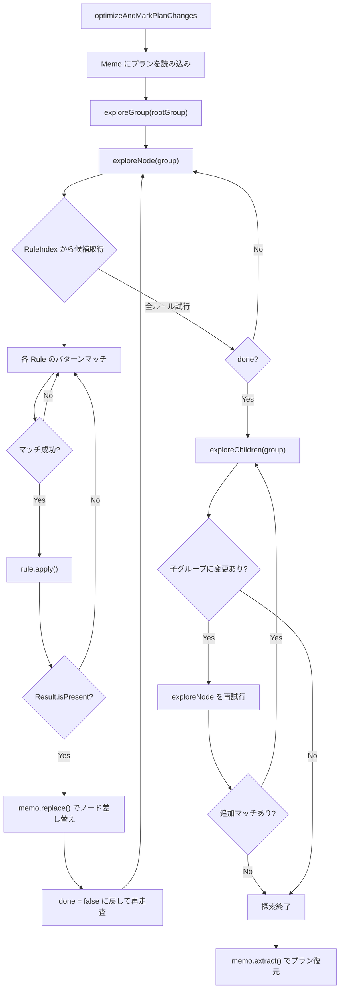

# 第7章 IterativeOptimizer と Rule

> **本章で読むソース**
>
> - [`core/trino-main/src/main/java/io/trino/sql/planner/iterative/IterativeOptimizer.java`](https://github.com/trinodb/trino/blob/482/core/trino-main/src/main/java/io/trino/sql/planner/iterative/IterativeOptimizer.java)
> - [`core/trino-main/src/main/java/io/trino/sql/planner/iterative/Memo.java`](https://github.com/trinodb/trino/blob/482/core/trino-main/src/main/java/io/trino/sql/planner/iterative/Memo.java)
> - [`core/trino-main/src/main/java/io/trino/sql/planner/iterative/Rule.java`](https://github.com/trinodb/trino/blob/482/core/trino-main/src/main/java/io/trino/sql/planner/iterative/Rule.java)
> - [`core/trino-main/src/main/java/io/trino/sql/planner/iterative/RuleIndex.java`](https://github.com/trinodb/trino/blob/482/core/trino-main/src/main/java/io/trino/sql/planner/iterative/RuleIndex.java)
> - [`core/trino-main/src/main/java/io/trino/sql/planner/iterative/GroupReference.java`](https://github.com/trinodb/trino/blob/482/core/trino-main/src/main/java/io/trino/sql/planner/iterative/GroupReference.java)
> - [`core/trino-main/src/main/java/io/trino/sql/planner/optimizations/PlanOptimizer.java`](https://github.com/trinodb/trino/blob/482/core/trino-main/src/main/java/io/trino/sql/planner/optimizations/PlanOptimizer.java)
> - [`core/trino-main/src/main/java/io/trino/sql/planner/iterative/rule/RemoveRedundantIdentityProjections.java`](https://github.com/trinodb/trino/blob/482/core/trino-main/src/main/java/io/trino/sql/planner/iterative/rule/RemoveRedundantIdentityProjections.java)
> - [`core/trino-main/src/main/java/io/trino/sql/planner/iterative/rule/PushPredicateIntoTableScan.java`](https://github.com/trinodb/trino/blob/482/core/trino-main/src/main/java/io/trino/sql/planner/iterative/rule/PushPredicateIntoTableScan.java)
> - [`core/trino-main/src/main/java/io/trino/sql/planner/PlanOptimizers.java`](https://github.com/trinodb/trino/blob/482/core/trino-main/src/main/java/io/trino/sql/planner/PlanOptimizers.java)

## この章の狙い

前章で論理プランの IR（`PlanNode` ツリー）が生成される過程を読んだ。
しかし、生成直後のプランは非効率なことが多い。
不要な射影、Connector 層へ押し込めるはずのフィルタ、冗長なソートなどが残ったままである。

Trino のオプティマイザは、これらの非効率を解消する数百の書き換え規則（Rule）を、固定点に達するまで繰り返し適用する **IterativeOptimizer** を中核としている。
本章では、IterativeOptimizer のループ構造、Memo によるプラン書き換えの効率化、Rule インタフェースの設計、そしてルールの登録と実行順序を読み解く。

## 前提

第6章までの論理プラン（`PlanNode` ツリー）の構造を理解していることを前提とする。
`PlanNode` が不変（immutable）であり、子ノードの変更にはツリー全体の再構築が必要になるという性質が、本章の Memo の動機に直結する。

## PlanOptimizer インタフェース

Trino のプラン最適化パスはすべて **`PlanOptimizer`** インタフェースを実装する。
このインタフェースは、プランツリーを受け取り最適化されたプランを返す `optimize` メソッドを1つだけ持つ。

[`core/trino-main/src/main/java/io/trino/sql/planner/optimizations/PlanOptimizer.java` L27-L29](https://github.com/trinodb/trino/blob/482/core/trino-main/src/main/java/io/trino/sql/planner/optimizations/PlanOptimizer.java#L27-L29)

```java
public interface PlanOptimizer
{
    PlanNode optimize(PlanNode plan, Context context);
```

`Context` は Session、`SymbolAllocator`、`PlanNodeIdAllocator` などの最適化に必要なコンテキストをまとめた record である。

[`core/trino-main/src/main/java/io/trino/sql/planner/optimizations/PlanOptimizer.java` L31-L38](https://github.com/trinodb/trino/blob/482/core/trino-main/src/main/java/io/trino/sql/planner/optimizations/PlanOptimizer.java#L31-L38)

```java
    record Context(
            Session session,
            SymbolAllocator symbolAllocator,
            PlanNodeIdAllocator idAllocator,
            WarningCollector warningCollector,
            PlanOptimizersStatsCollector planOptimizersStatsCollector,
            TableStatsProvider tableStatsProvider,
            RuntimeInfoProvider runtimeInfoProvider)
```

`IterativeOptimizer` はこの `PlanOptimizer` のサブインタフェースである `AdaptivePlanOptimizer` を実装する。
`AdaptivePlanOptimizer` は Fault-Tolerant Execution（FTE）で使う適応的最適化のために、変更されたノードの ID 集合をあわせて返す拡張である。

[`core/trino-main/src/main/java/io/trino/sql/planner/optimizations/AdaptivePlanOptimizer.java` L27-L39](https://github.com/trinodb/trino/blob/482/core/trino-main/src/main/java/io/trino/sql/planner/optimizations/AdaptivePlanOptimizer.java#L27-L39)

```java
public interface AdaptivePlanOptimizer
        extends PlanOptimizer
{
    @Override
    default PlanNode optimize(PlanNode plan, Context context)
    {
        return optimizeAndMarkPlanChanges(plan, context).plan();
    }

    /**
     * Optimize the plan and return the changes made to the plan.
     */
    Result optimizeAndMarkPlanChanges(PlanNode plan, Context context);
```

## Memo の構造

### 不変ノードの書き換え問題

`PlanNode` は不変オブジェクトである。
あるノードの書き換えを行うと、そのノード自体の新しいインスタンスだけでなく、ルートまでの全祖先ノードも再構築しなければならない。
ツリーが深い場合、1回のルール適用でもコストが大きくなる。

**Memo** はこの問題を解決するために、プランツリーをグループ構造に分解して保持する。

### グループによる間接参照

Memo はプランの各ノードにグループ ID を割り当て、子ノードへの直接参照を **`GroupReference`** に置き換える。
`GroupReference` はグループ ID を保持する軽量な `PlanNode` サブクラスであり、実際のノードへの間接参照として機能する。

[`core/trino-main/src/main/java/io/trino/sql/planner/iterative/GroupReference.java` L26-L40](https://github.com/trinodb/trino/blob/482/core/trino-main/src/main/java/io/trino/sql/planner/iterative/GroupReference.java#L24-L37)

```java
public class GroupReference
        extends PlanNode
{
    private final int groupId;
    private final List<Symbol> outputs;

    public GroupReference(PlanNodeId id, int groupId, List<Symbol> outputs)
    {
        super(id);
        this.groupId = groupId;
        this.outputs = ImmutableList.copyOf(outputs);
    }

    public int getGroupId()
```

Memo クラスのコメントに、この変換の具体例が記されている。

[`core/trino-main/src/main/java/io/trino/sql/planner/iterative/Memo.java` L38-L63](https://github.com/trinodb/trino/blob/482/core/trino-main/src/main/java/io/trino/sql/planner/iterative/Memo.java#L38-L60)

```java
/**
 * Stores a plan in a form that's efficient to mutate locally (i.e. without
 * having to do full ancestor tree rewrites due to plan nodes being immutable).
 * <p>
 * Each node in a plan is placed in a group, and it's children are replaced with
 * symbolic references to the corresponding groups.
 * <p>
 * For example, a plan like:
 * <pre>
 *    A -> B -> C -> D
 *           \> E -> F
 * </pre>
 * would be stored as:
 * <pre>
 * root: G0
 *
 * G0 : { A -> G1 }
 * G1 : { B -> [G2, G3] }
 * G2 : { C -> G4 }
 * G3 : { E -> G5 }
 * G4 : { D }
 * G5 : { F }
 * </pre>
```

あるグループのノードを置換しても、親グループが保持するのは `GroupReference`（グループ ID）だけなので、親ノードの再構築は不要になる。

### Memo の内部構造

Memo は `Int2ObjectOpenHashMap`（fastutil のプリミティブ特化マップ）でグループ ID から `Group` オブジェクトへの写像を保持する。

[`core/trino-main/src/main/java/io/trino/sql/planner/iterative/Memo.java` L66-L73](https://github.com/trinodb/trino/blob/482/core/trino-main/src/main/java/io/trino/sql/planner/iterative/Memo.java#L66-L73)

```java
    private static final int ROOT_GROUP_REF = 0;

    private final PlanNodeIdAllocator idAllocator;
    private final int rootGroup;

    private final Int2ObjectMap<Group> groups = new Int2ObjectOpenHashMap<>();

    private int nextGroupId = ROOT_GROUP_REF + 1;
```

`Group` はそのグループが表す `PlanNode`（`membership` フィールド）、参照カウント用の `Multiset`、そしてキャッシュされた統計情報とコスト推定値を持つ。

[`core/trino-main/src/main/java/io/trino/sql/planner/iterative/Memo.java` L250-L268](https://github.com/trinodb/trino/blob/482/core/trino-main/src/main/java/io/trino/sql/planner/iterative/Memo.java#L250-L268)

```java
    private static final class Group
    {
        static Group withMember(PlanNode member)
        {
            return new Group(member);
        }

        private PlanNode membership;
        private final Multiset<Integer> incomingReferences = HashMultiset.create();
        @Nullable
        private PlanNodeStatsEstimate stats;
        @Nullable
        private PlanCostEstimate cost;

        private Group(PlanNode member)
        {
            this.membership = requireNonNull(member, "member is null");
        }
    }
```

### ノードの置換と参照カウント

`replace` メソッドは、指定グループのノードを新しいノードに差し替える。
差し替え時には、新しいノードの出力シンボルが元のノードと一致することを検証し、新しい子ノードの参照カウントを増やしてから、古い子ノードの参照カウントを減らす。

[`core/trino-main/src/main/java/io/trino/sql/planner/iterative/Memo.java` L113-L137](https://github.com/trinodb/trino/blob/482/core/trino-main/src/main/java/io/trino/sql/planner/iterative/Memo.java#L113-L137)

```java
    public PlanNode replace(int groupId, PlanNode node, String reason)
    {
        Group group = getGroup(groupId);
        PlanNode old = group.membership;

        checkArgument(new HashSet<>(old.getOutputSymbols()).equals(new HashSet<>(node.getOutputSymbols())),
                "%s: transformed expression doesn't produce same outputs: %s vs %s",
                reason,
                old.getOutputSymbols(),
                node.getOutputSymbols());

        if (node instanceof GroupReference) {
            node = getNode(((GroupReference) node).getGroupId());
        }
        else {
            node = insertChildrenAndRewrite(node);
        }

        incrementReferenceCounts(node, groupId);
        group.membership = node;
        decrementReferenceCounts(old, groupId);
        evictStatisticsAndCost(group);

        return node;
    }
```

参照カウントが 0 になったグループは `deleteGroup` で再帰的に削除される。
これにより、ルール適用で不要になった部分ツリーが自動的に回収される。

[`core/trino-main/src/main/java/io/trino/sql/planner/iterative/Memo.java` L209-L214](https://github.com/trinodb/trino/blob/482/core/trino-main/src/main/java/io/trino/sql/planner/iterative/Memo.java#L209-L214)

```java
    private void deleteGroup(int group)
    {
        checkArgument(getGroup(group).incomingReferences.isEmpty(), "Cannot delete group that has incoming references");
        PlanNode deletedNode = groups.remove(group).membership;
        decrementReferenceCounts(deletedNode, group);
    }
```

### 統計キャッシュの無効化

ノードの置換時に呼ばれる `evictStatisticsAndCost` は、変更されたグループだけでなく、そのグループを参照するすべての祖先グループの統計とコストを再帰的に無効化する。

[`core/trino-main/src/main/java/io/trino/sql/planner/iterative/Memo.java` L139-L148](https://github.com/trinodb/trino/blob/482/core/trino-main/src/main/java/io/trino/sql/planner/iterative/Memo.java#L139-L148)

```java
    private void evictStatisticsAndCost(Group group)
    {
        group.stats = null;
        group.cost = null;
        for (int parentGroup : group.incomingReferences.elementSet()) {
            if (parentGroup != ROOT_GROUP_REF) {
                evictStatisticsAndCost(getGroup(parentGroup));
            }
        }
    }
```

変更が局所的であれば無効化される範囲も局所的になるため、統計の再計算コストを最小限に抑えられる。

### プランの復元

最適化が完了すると、`extract` メソッドが `GroupReference` をすべて実ノードに戻し、通常の `PlanNode` ツリーを再構築する。
内部では `Plans.resolveGroupReferences` が Visitor パターンで再帰的に参照を解決する。

[`core/trino-main/src/main/java/io/trino/sql/planner/iterative/Memo.java` L103-L111](https://github.com/trinodb/trino/blob/482/core/trino-main/src/main/java/io/trino/sql/planner/iterative/Memo.java#L103-L111)

```java
    public PlanNode extract()
    {
        return extract(getNode(rootGroup));
    }

    private PlanNode extract(PlanNode node)
    {
        return resolveGroupReferences(node, Lookup.from(planNode -> Stream.of(this.resolve(planNode))));
    }
```

## Rule インタフェース

### 3つの構成要素

**`Rule`** インタフェースは、プランの局所的な書き換えを表す。
各 Rule は3つの要素を持つ。

1. **`getPattern()`**: 適用対象の PlanNode をマッチングするパターンを返す
2. **`isEnabled(Session)`**: Session のプロパティに応じてルールの有効/無効を切り替える（デフォルトは常に有効）
3. **`apply(T, Captures, Context)`**: マッチしたノードに対して書き換えを試み、結果を返す

[`core/trino-main/src/main/java/io/trino/sql/planner/iterative/Rule.java` L30-L42](https://github.com/trinodb/trino/blob/482/core/trino-main/src/main/java/io/trino/sql/planner/iterative/Rule.java#L30-L42)

```java
public interface Rule<T>
{
    /**
     * Returns a pattern to which plan nodes this rule applies.
     */
    Pattern<T> getPattern();

    default boolean isEnabled(Session session)
    {
        return true;
    }

    Result apply(T node, Captures captures, Context context);
```

### Result の設計

`apply` メソッドが返す `Result` は、書き換えが発生した場合は変換後の `PlanNode` を `Optional` で包み、書き換えが不要な場合は `empty()` を返す。

[`core/trino-main/src/main/java/io/trino/sql/planner/iterative/Rule.java` L63-L91](https://github.com/trinodb/trino/blob/482/core/trino-main/src/main/java/io/trino/sql/planner/iterative/Rule.java#L63-L91)

```java
    record Result(Optional<PlanNode> transformedPlan)
    {
        private static final Result EMPTY = new Result(Optional.empty());

        public static Result empty()
        {
            return EMPTY;
        }

        public static Result ofPlanNode(PlanNode transformedPlan)
        {
            return new Result(Optional.of(transformedPlan));
        }

        // ... (中略) ...

        public boolean isEmpty()
        {
            return transformedPlan.isEmpty();
        }

        public boolean isPresent()
        {
            return transformedPlan.isPresent();
        }
    }
```

`empty()` は静的フィールドのシングルトンを返す設計になっている。
「マッチしたがこのノードには書き換えが不要」という判断は頻繁に起こるため、オブジェクト生成を省いている。

### Pattern マッチングフレームワーク

Rule が返す `Pattern` は `lib/trino-matching` モジュールで定義される、型安全なパターンマッチングフレームワークである。
基底クラス `Pattern<T>` は sealed クラスで、`TypeOfPattern`、`FilterPattern`、`WithPattern`、`CapturePattern` などの具象クラスがチェインされてパターンを構成する。

`TypeOfPattern` は対象ノードの Java クラスを `instanceof` で検査する最も基本的なパターンである。

[`lib/trino-matching/src/main/java/io/trino/matching/TypeOfPattern.java` L22-L50](https://github.com/trinodb/trino/blob/482/lib/trino-matching/src/main/java/io/trino/matching/TypeOfPattern.java#L21-L50)

```java
public final class TypeOfPattern<T>
        extends Pattern<T>
{
    private final Class<T> expectedClass;

    // ... (中略) ...

    @Override
    public <C> Stream<Match> accept(Object object, Captures captures, C context)
    {
        if (expectedClass.isInstance(object)) {
            return Stream.of(Match.of(captures));
        }
        return Stream.of();
    }
}
```

`Patterns` ユーティリティクラスは PlanNode の型ごとにファクトリメソッドを用意し、`typeOf(FilterNode.class)` のようなボイラープレートを隠蔽する。

[`core/trino-main/src/main/java/io/trino/sql/planner/plan/Patterns.java` L86-L89](https://github.com/trinodb/trino/blob/482/core/trino-main/src/main/java/io/trino/sql/planner/plan/Patterns.java#L86-L89)

```java
    public static Pattern<FilterNode> filter()
    {
        return typeOf(FilterNode.class);
    }
```

## RuleIndex によるルール検索

### ルールの登録

すべての Rule を毎回全件走査するのは無駄が大きい。
**`RuleIndex`** は、各 Rule の `Pattern` からルートとなる PlanNode の型を抽出し、`ListMultimap<Class<?>, Rule<?>>` に分類して保持する。

[`core/trino-main/src/main/java/io/trino/sql/planner/iterative/RuleIndex.java` L69-L101](https://github.com/trinodb/trino/blob/482/core/trino-main/src/main/java/io/trino/sql/planner/iterative/RuleIndex.java#L69-L101)

```java
    public static class Builder
    {
        private final ImmutableListMultimap.Builder<Class<?>, Rule<?>> rulesByRootType = ImmutableListMultimap.builder();

        public Builder register(Set<Rule<?>> rules)
        {
            rules.forEach(this::register);
            return this;
        }

        public Builder register(Rule<?> rule)
        {
            Pattern<?> pattern = getFirstPattern(rule.getPattern());
            if (!(pattern instanceof TypeOfPattern<?> typeOfPattern)) {
                throw new IllegalArgumentException("Unexpected Pattern: " + pattern);
            }
            rulesByRootType.put(typeOfPattern.expectedClass(), rule);
            return this;
        }

        private Pattern<?> getFirstPattern(Pattern<?> pattern)
        {
            while (pattern.previous().isPresent()) {
                pattern = pattern.previous().get();
            }
            return pattern;
        }

        public RuleIndex build()
        {
            return new RuleIndex(rulesByRootType.build());
        }
    }
```

`getFirstPattern` はパターンチェインの先頭（`TypeOfPattern`）まで遡って、ルールが対象とする PlanNode の型を取得する。
たとえば `filter().with(source().matching(tableScan().capturedAs(TABLE_SCAN)))` というパターンであれば、先頭は `TypeOfPattern<FilterNode>` であり、このルールは `FilterNode.class` をキーとして索引される。

### 候補ルールの検索

`getCandidates` はノードのクラスをキーに、適用可能な Rule の集合を返す。
結果は `Cache`（最大128エントリ）にキャッシュされるため、同じ型のノードに対する二度目以降の検索はハッシュマップの参照だけで済む。

[`core/trino-main/src/main/java/io/trino/sql/planner/iterative/RuleIndex.java` L29-L62](https://github.com/trinodb/trino/blob/482/core/trino-main/src/main/java/io/trino/sql/planner/iterative/RuleIndex.java#L29-L62)

```java
public class RuleIndex
{
    private final ListMultimap<Class<?>, Rule<?>> rulesByRootType;
    private final Cache<Class<?>, Set<Rule<?>>> rulesByClass;

    private RuleIndex(ListMultimap<Class<?>, Rule<?>> rulesByRootType)
    {
        this.rulesByRootType = ImmutableListMultimap.copyOf(rulesByRootType);
        this.rulesByClass = EvictableCacheBuilder.newBuilder()
                .maximumSize(128) // we have a limited number of node types, so this is more than enough
                .build();
    }

    public Set<Rule<?>> getCandidates(Object object)
    {
        try {
            return rulesByClass.get(object.getClass(), () -> computeCandidates(object.getClass()));
        }
        catch (ExecutionException e) {
            throw new RuntimeException(e);
        }
    }

    public Set<Rule<?>> computeCandidates(Class<?> key)
    {
        ImmutableSet.Builder<Rule<?>> builder = ImmutableSet.builder();
        TypeToken.of(key).getTypes().forEach(clazz -> {
            Class<?> rawType = clazz.getRawType();
            if (rulesByRootType.containsKey(rawType)) {
                builder.addAll(rulesByRootType.get(rawType));
            }
        });
        return builder.build();
    }
```

`computeCandidates` は `TypeToken.getTypes()` でクラスの継承階層を走査し、スーパークラスやインタフェースに登録されたルールも含めて収集する。
PlanNode の型は高々数十種類しかないため、128エントリのキャッシュで事実上すべてのマッピングが保持される。

## IterativeOptimizer のルール適用ループ

### 初期化

`IterativeOptimizer` のコンストラクタは、受け取った Rule の集合から `RuleIndex` を構築する。

[`core/trino-main/src/main/java/io/trino/sql/planner/iterative/IterativeOptimizer.java` L86-L101](https://github.com/trinodb/trino/blob/482/core/trino-main/src/main/java/io/trino/sql/planner/iterative/IterativeOptimizer.java#L86-L101)

```java
    public IterativeOptimizer(String name, PlannerContext plannerContext, RuleStatsRecorder stats, StatsCalculator statsCalculator, CostCalculator costCalculator, Predicate<Session> useLegacyRules, List<PlanOptimizer> legacyRules, Set<Rule<?>> newRules)
    {
        // ... (中略) ...
        this.ruleIndex = RuleIndex.builder()
                .register(newRules)
                .build();

        stats.registerAll(newRules);
    }
```

### optimizeAndMarkPlanChanges: エントリポイント

最適化の入口は `optimizeAndMarkPlanChanges` メソッドである。
プランツリーを Memo に読み込み、`Lookup` を構築して、ルートグループから探索を開始する。

[`core/trino-main/src/main/java/io/trino/sql/planner/iterative/IterativeOptimizer.java` L104-L133](https://github.com/trinodb/trino/blob/482/core/trino-main/src/main/java/io/trino/sql/planner/iterative/IterativeOptimizer.java#L103-L133)

```java
    @Override
    public Result optimizeAndMarkPlanChanges(PlanNode plan, PlanOptimizer.Context context)
    {
        // only disable new rules if we have legacy rules to fall back to
        if (useLegacyRules.test(context.session()) && !legacyRules.isEmpty()) {
            for (PlanOptimizer optimizer : legacyRules) {
                plan = optimizer.optimize(plan, context);
            }
            return new Result(plan, ImmutableSet.of());
        }

        Set<PlanNodeId> changedPlanNodeIds = new HashSet<>();
        Memo memo = new Memo(context.idAllocator(), plan);
        Lookup lookup = Lookup.from(planNode -> Stream.of(memo.resolve(planNode)));

        Duration timeout = SystemSessionProperties.getOptimizerTimeout(context.session());
        Context optimizerContext = new Context(
                memo,
                lookup,
                context.idAllocator(),
                context.symbolAllocator(),
                nanoTime(),
                timeout.toMillis(),
                context.session(),
                context.warningCollector(),
                context.tableStatsProvider(),
                context.runtimeInfoProvider());
        exploreGroup(memo.getRootGroup(), optimizerContext, changedPlanNodeIds);
        context.planOptimizersStatsCollector().add(optimizerContext.getIterativeOptimizerStatsCollector());
        return new Result(memo.extract(), ImmutableSet.copyOf(changedPlanNodeIds));
    }
```

`Lookup` は `GroupReference` を Memo 内の実ノードに解決する関数オブジェクトである。
Rule の `apply` メソッド内で子ノードの内容を参照する際に使われる。

### exploreGroup: グループ単位の探索

`exploreGroup` は、あるグループに対してルール適用と子グループの探索を交互に行う。
子グループの変更によって親グループに新たなルールが適用可能になる場合があるため、子の変更後に親を再度試す。

[`core/trino-main/src/main/java/io/trino/sql/planner/iterative/IterativeOptimizer.java` L151-L169](https://github.com/trinodb/trino/blob/482/core/trino-main/src/main/java/io/trino/sql/planner/iterative/IterativeOptimizer.java#L151-L169)

```java
    private boolean exploreGroup(int group, Context context, Set<PlanNodeId> changedPlanNodeIds)
    {
        // tracks whether this group or any children groups change as
        // this method executes
        boolean progress = exploreNode(group, context, changedPlanNodeIds);

        while (exploreChildren(group, context, changedPlanNodeIds)) {
            progress = true;

            // if children changed, try current group again
            // in case we can match additional rules
            if (!exploreNode(group, context, changedPlanNodeIds)) {
                // no additional matches, so bail out
                break;
            }
        }

        return progress;
    }
```

ループの終了条件は2つある。
`exploreChildren` が false を返す（子グループに変更がない）場合と、子が変更されても `exploreNode` が追加のマッチを見つけられない場合である。
どちらの場合も、もう適用できるルールがないため探索を終える。

### exploreNode: ノードへのルール適用

`exploreNode` は、あるグループのノードに対して `RuleIndex` から候補ルールを取得し、順にマッチングと適用を試みる。

[`core/trino-main/src/main/java/io/trino/sql/planner/iterative/IterativeOptimizer.java` L171-L210](https://github.com/trinodb/trino/blob/482/core/trino-main/src/main/java/io/trino/sql/planner/iterative/IterativeOptimizer.java#L171-L210)

```java
    private boolean exploreNode(int group, Context context, Set<PlanNodeId> changedPlanNodeIds)
    {
        PlanNode node = context.memo.getNode(group);

        boolean done = false;
        boolean progress = false;

        while (!done) {
            context.checkTimeoutNotExhausted();

            done = true;
            for (Rule<?> rule : ruleIndex.getCandidates(node)) {
                long timeStart = nanoTime();
                long timeEnd;
                boolean invoked = false;
                boolean applied = false;

                if (rule.isEnabled(context.session)) {
                    invoked = true;
                    Rule.Result result = transform(node, rule, context);
                    timeEnd = nanoTime();
                    if (result.isPresent()) {
                        changedPlanNodeIds.add(result.transformedPlan().get().getId());
                        node = context.memo.replace(group, result.transformedPlan().get(), rule.getClass().getName());

                        applied = true;
                        done = false;
                        progress = true;
                    }
                }
                else {
                    timeEnd = nanoTime();
                }

                context.recordRuleInvocation(rule, invoked, applied, timeEnd - timeStart);
            }
        }

        return progress;
    }
```

ルールが適用されると `done` が `false` に戻り、変更後のノードに対して再び全候補ルールが走査される。
どのルールもマッチしなくなるまで（固定点に達するまで）この内側ループが繰り返される。

### transform: パターンマッチと適用

`transform` メソッドは、Rule のパターンをノードに照合し、マッチすれば `apply` を呼ぶ。

[`core/trino-main/src/main/java/io/trino/sql/planner/iterative/IterativeOptimizer.java` L212-L262](https://github.com/trinodb/trino/blob/482/core/trino-main/src/main/java/io/trino/sql/planner/iterative/IterativeOptimizer.java#L212-L262)

```java
    private <T> Rule.Result transform(PlanNode node, Rule<T> rule, Context context)
    {
        Capture<T> nodeCapture = newCapture();
        Pattern<T> pattern = rule.getPattern().capturedAs(nodeCapture);
        Rule.Context ruleContext = ruleContext(context);
        Iterator<Match> matches = pattern.match(node, context.lookup).iterator();
        while (matches.hasNext()) {
            Match match = matches.next();
            long duration;
            Rule.Result result;
            try {
                long start = nanoTime();
                result = rule.apply(match.capture(nodeCapture), match.captures(), ruleContext);
                // ... (中略) ...
                duration = nanoTime() - start;
            }
            catch (RuntimeException e) {
                stats.recordFailure(rule);
                context.iterativeOptimizerStatsCollector.recordFailure(rule);
                throw e;
            }
            stats.record(rule, duration, !result.isEmpty());

            if (result.isPresent()) {
                return result;
            }
        }

        return Rule.Result.empty();
    }
```

パターンマッチは `Lookup` を介して `GroupReference` を透過的に解決しながら行われる。
これにより、Rule の実装者は Memo の存在を意識せずにパターンを記述できる。

### exploreChildren: 子グループの再帰探索

`exploreChildren` はグループの子ノード（`GroupReference`）を順にたどり、再帰的に `exploreGroup` を呼ぶ。

[`core/trino-main/src/main/java/io/trino/sql/planner/iterative/IterativeOptimizer.java` L264-L278](https://github.com/trinodb/trino/blob/482/core/trino-main/src/main/java/io/trino/sql/planner/iterative/IterativeOptimizer.java#L264-L278)

```java
    private boolean exploreChildren(int group, Context context, Set<PlanNodeId> changedPlanNodeIds)
    {
        boolean progress = false;

        PlanNode expression = context.memo.getNode(group);
        for (PlanNode child : expression.getSources()) {
            checkState(child instanceof GroupReference, "Expected child to be a group reference. Found: %s", child.getClass().getName());

            if (exploreGroup(((GroupReference) child).getGroupId(), context, changedPlanNodeIds)) {
                progress = true;
            }
        }

        return progress;
    }
```

以下の Mermaid 図で、IterativeOptimizer のルール適用ループの全体像を示す。



### タイムアウト保護

ルール適用ループは固定点を保証するが、ルール間の相互作用で収束が遅れる場合がある。
`checkTimeoutNotExhausted` は各ルール試行のたびに呼ばれ、Session で設定された制限時間を超えると `OPTIMIZER_TIMEOUT` エラーを投げる。
エラーメッセージには消費時間が上位のルールが含まれるため、タイムアウトの原因特定に役立つ。

[`core/trino-main/src/main/java/io/trino/sql/planner/iterative/IterativeOptimizer.java` L379-L404](https://github.com/trinodb/trino/blob/482/core/trino-main/src/main/java/io/trino/sql/planner/iterative/IterativeOptimizer.java#L379-L406)

```java
        public void checkTimeoutNotExhausted()
        {
            if (NANOSECONDS.toMillis(nanoTime() - startTimeInNanos) >= timeoutInMilliseconds) {
                StringBuilder message = new StringBuilder(format("The optimizer exhausted the time limit of %d ms", timeoutInMilliseconds));
                List<QueryPlanOptimizerStatistics> topRulesByTime = iterativeOptimizerStatsCollector.getTopRuleStats(5);
                if (topRulesByTime.isEmpty()) {
                    message.append(": no rules invoked");
                }
                else {
                    message.append(": Top rules: {");
                    long timeThreshold = topRulesByTime.getFirst().totalTime() / 1000;
                    for (QueryPlanOptimizerStatistics ruleStats : topRulesByTime) {
                        if (timeThreshold > ruleStats.totalTime()) {
                            // The next rule considered is less than 0.1% of the top rule, skip the rest
                            break;
                        }
                        // ... (中略) ...
                    }
                    message.append("}");
                }
                throw new TrinoException(OPTIMIZER_TIMEOUT, message.toString());
            }
        }
```

## 具体的な Rule の例

### RemoveRedundantIdentityProjections: 不要な射影の除去

**`RemoveRedundantIdentityProjections`** は、入力をそのまま出力するだけの `ProjectNode`（恒等射影）を除去するルールである。
ルール実装の基本形を示す良い例となる。

[`core/trino-main/src/main/java/io/trino/sql/planner/iterative/rule/RemoveRedundantIdentityProjections.java` L27-L52](https://github.com/trinodb/trino/blob/482/core/trino-main/src/main/java/io/trino/sql/planner/iterative/rule/RemoveRedundantIdentityProjections.java#L27-L52)

```java
public class RemoveRedundantIdentityProjections
        implements Rule<ProjectNode>
{
    private static final Pattern<ProjectNode> PATTERN = project()
            .matching(ProjectNode::isIdentity)
            // only drop this projection if it does not constrain the outputs
            // of its child
            .matching(RemoveRedundantIdentityProjections::outputsSameAsSource);

    private static boolean outputsSameAsSource(ProjectNode node)
    {
        return ImmutableSet.copyOf(node.getOutputSymbols()).equals(ImmutableSet.copyOf(node.getSource().getOutputSymbols()));
    }

    @Override
    public Pattern<ProjectNode> getPattern()
    {
        return PATTERN;
    }

    @Override
    public Result apply(ProjectNode project, Captures captures, Context context)
    {
        return Result.ofPlanNode(project.getSource());
    }
}
```

パターンの構成を読み解く。
`project()` は `typeOf(ProjectNode.class)` と等価であり、ノードの型を検査する。
続く `.matching(ProjectNode::isIdentity)` はフィルタ条件を追加し、射影が恒等かどうかを検査する。
さらに `.matching(outputsSameAsSource)` で、出力シンボル集合が子ノードと同一であることを確認する。

`apply` の実装は単純で、射影ノードをその子ノードに置き換えるだけである。
`Result.ofPlanNode` に子ノードを渡すことで、Memo 内でグループのメンバーが子ノードに差し替えられる。

### PushPredicateIntoTableScan: 述語の Connector 層への押し込み

**`PushPredicateIntoTableScan`** は、`FilterNode` の述語を Connector の `TableScanNode` に押し込む、より複雑なルールである。
このルールは `Filter -> TableScan` というツリーパターンをマッチし、述語を Connector の API（`Metadata.applyFilter`）に渡して処理を委譲する。

パターンでは `Capture` を使って、マッチした `TableScanNode` を `apply` メソッドで参照できるようにしている。

[`core/trino-main/src/main/java/io/trino/sql/planner/iterative/rule/PushPredicateIntoTableScan.java` L81-L84](https://github.com/trinodb/trino/blob/482/core/trino-main/src/main/java/io/trino/sql/planner/iterative/rule/PushPredicateIntoTableScan.java#L81-L84)

```java
    private static final Capture<TableScanNode> TABLE_SCAN = newCapture();

    private static final Pattern<FilterNode> PATTERN = filter().with(source().matching(
            tableScan().capturedAs(TABLE_SCAN)));
```

`isEnabled` は Session プロパティで Connector へのプッシュダウンが許可されているかを検査する。
この仕組みにより、同じルールセットでもセッション単位で挙動を切り替えられる。

[`core/trino-main/src/main/java/io/trino/sql/planner/iterative/rule/PushPredicateIntoTableScan.java` L101-L105](https://github.com/trinodb/trino/blob/482/core/trino-main/src/main/java/io/trino/sql/planner/iterative/rule/PushPredicateIntoTableScan.java#L101-L105)

```java
    @Override
    public boolean isEnabled(Session session)
    {
        return isAllowPushdownIntoConnectors(session);
    }
```

`apply` メソッドでは、`Captures` から `TABLE_SCAN` キャプチャを取得し、Connector に述語を渡して処理の可否を判断する。

[`core/trino-main/src/main/java/io/trino/sql/planner/iterative/rule/PushPredicateIntoTableScan.java` L108-L126](https://github.com/trinodb/trino/blob/482/core/trino-main/src/main/java/io/trino/sql/planner/iterative/rule/PushPredicateIntoTableScan.java#L107-L126)

```java
    @Override
    public Result apply(FilterNode filterNode, Captures captures, Context context)
    {
        TableScanNode tableScan = captures.get(TABLE_SCAN);

        Optional<PlanNode> rewritten = pushFilterIntoTableScan(
                filterNode,
                tableScan,
                pruneWithPredicateExpression,
                context.getSession(),
                plannerContext,
                context.getStatsProvider(),
                context.getSymbolAllocator());

        if (rewritten.isEmpty() || arePlansSame(filterNode, tableScan, rewritten.get())) {
            return Result.empty();
        }

        return Result.ofPlanNode(rewritten.get());
    }
```

Connector が述語を受理した場合、`TableScanNode` の `enforcedConstraint` が更新され、Connector 側で処理済みの述語は `FilterNode` から除去される。
Connector が述語を処理しきれなかった場合は残余述語が `FilterNode` に残る。

## PlanOptimizers の登録と論理フェーズ

`PlanOptimizers` クラスは、Trino が使用するすべての最適化パスを登録順に構成する。
各 `IterativeOptimizer` インスタンスには名前が付けられ、関連するルール群がまとめて登録される。

以下に主要なフェーズを順に示す。

[`core/trino-main/src/main/java/io/trino/sql/planner/PlanOptimizers.java` L402-L468](https://github.com/trinodb/trino/blob/482/core/trino-main/src/main/java/io/trino/sql/planner/PlanOptimizers.java#L402-L473)

```java
        builder.add(
                // Clean up all the sugar in expressions, e.g. AtTimeZone, must be run before all the other optimizers
                new IterativeOptimizer(
                        "DesugarLambdaExpressions",
                        // ... (中略) ...
                new IterativeOptimizer(
                        "InitialPlanCleanup",
                        // ... (中略) ...
                new IterativeOptimizer(
                        "Phase1",
                        // ... (中略) ...
```

フェーズの論理的な流れは次のとおりである。

1. **DesugarLambdaExpressions**: ラムダ式の脱糖衣（他の最適化に先立って実行）
2. **InitialPlanCleanup**: カラム刈り込み、射影の押し下げ、式の単純化、恒等射影の除去など、基本的なクリーンアップ
3. **Phase1**: limit の押し下げ、フィルタの結合、Set 演算の平坦化
4. **MergeSetOperations / ImplementSetOperationsAsUnion**: 集合演算のマージと Union ベースの実装への変換
5. **DecorrelateSubqueries / RewriteCorrelatedSubqueries**: サブクエリの脱相関
6. **PredicatePushDown**: 述語の押し下げ（レガシーのツリー走査型オプティマイザ）
7. **ApplyTableScanRedirection**: テーブルスキャンのリダイレクト
8. **PushIntoTableScan**: 述語、射影、集約、TopN などの Connector 層への押し込み
9. **ReorderJoins**: コストベースの Join 並べ替え
10. **AddExchanges**: 分散実行のための Exchange ノードの挿入
11. **AddLocalExchanges**: Worker 内のローカル Exchange の挿入
12. **AddDynamicFilterSources**: DynamicFilter の挿入

フェーズ間の順序には依存関係がある。
ソースのコメントにもその理由が明記されている。

[`core/trino-main/src/main/java/io/trino/sql/planner/PlanOptimizers.java` L807-L811](https://github.com/trinodb/trino/blob/482/core/trino-main/src/main/java/io/trino/sql/planner/PlanOptimizers.java#L807-L810)

```java
                // Because ReorderJoins runs only once,
                // PredicatePushDown, columnPruningOptimizer and RemoveRedundantIdentityProjections
                // need to run beforehand in order to produce an optimal join order
                // It also needs to run after EliminateCrossJoins so that its chosen order doesn't get undone.
```

同じルールが複数のフェーズに重複して登録されることも多い。
`RemoveRedundantIdentityProjections` は InitialPlanCleanup、Phase1、Phase2 など多くのフェーズに含まれる。
これは、他のルールが新たに恒等射影を生み出す可能性があるため、各フェーズの終了時にクリーンアップを走らせる必要があるからである。

## 最適化の工夫: Memo による局所書き換え

IterativeOptimizer の設計における最大の最適化は、Memo による局所書き換えである。

`PlanNode` は不変オブジェクトであるため、素朴な実装では1回のルール適用のたびにルートまでの全祖先ノードを再構築する必要がある。
N 個のノードから成るツリーで M 回のルール適用が行われた場合、素朴な実装では最悪 O(N * M) のノード生成が発生する。

Memo はグループ ID と `GroupReference` による間接参照を導入することで、ノードの差し替えを O(1) の操作に変える。
`replace` メソッドがグループの `membership` フィールドを書き換えるだけで、親グループは `GroupReference` のグループ ID を通じて自動的に新しいノードを参照する。
親ノードの再構築は不要であり、ノード生成コストを M 回のルール適用全体で O(M) に抑えられる。

加えて、RuleIndex の型ベースフィルタリングもルール適用のオーバーヘッドを低減している。
数百のルールを全件走査する代わりに、ノードの型をキーにしたハッシュマップ参照で候補を絞り込むため、ノード1つあたりのルール検索が O(1) で完了する。

## まとめ

IterativeOptimizer は、Memo とルールベースの局所書き換えを組み合わせた固定点反復エンジンである。
Memo はプランツリーをグループ構造に分解し、ノードの差し替えを祖先の再構築なしに O(1) で行う。
Rule インタフェースは Pattern マッチングと書き換えロジックを分離し、個々のルールを独立して実装できるようにしている。
RuleIndex はノードの型をキーにした索引でルール検索を高速化する。
PlanOptimizers はこれらのルールを論理フェーズに分けて順序付け、フェーズ間の依存関係を管理している。

## 関連する章

- 第6章: 論理プランの生成と PlanNode の構造（本章の入力となるプランツリー）
- 第8章: コストベース最適化（CBO）と統計（Memo に保存される統計情報の活用先）
