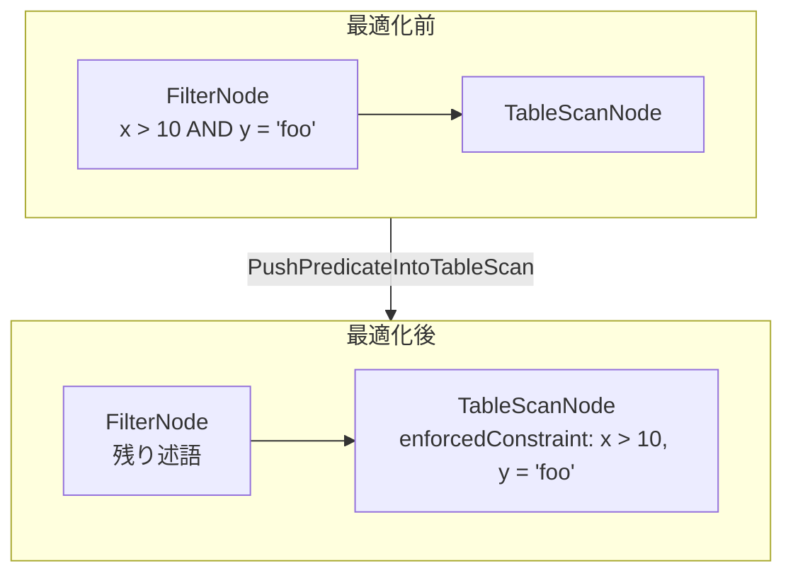
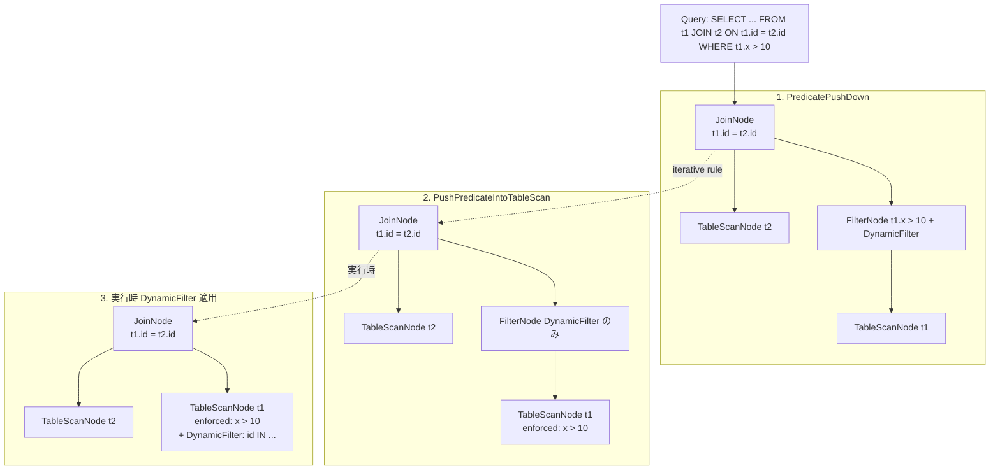

# 第8章 述語プッシュダウンと結合最適化

> **本章で読むソース**
>
> - [`core/trino-main/src/main/java/io/trino/sql/planner/optimizations/PredicatePushDown.java`](https://github.com/trinodb/trino/blob/482/core/trino-main/src/main/java/io/trino/sql/planner/optimizations/PredicatePushDown.java)
> - [`core/trino-main/src/main/java/io/trino/sql/planner/DomainTranslator.java`](https://github.com/trinodb/trino/blob/482/core/trino-main/src/main/java/io/trino/sql/planner/DomainTranslator.java)
> - [`core/trino-main/src/main/java/io/trino/sql/planner/EqualityInference.java`](https://github.com/trinodb/trino/blob/482/core/trino-main/src/main/java/io/trino/sql/planner/EqualityInference.java)
> - [`core/trino-main/src/main/java/io/trino/sql/planner/iterative/rule/PushPredicateIntoTableScan.java`](https://github.com/trinodb/trino/blob/482/core/trino-main/src/main/java/io/trino/sql/planner/iterative/rule/PushPredicateIntoTableScan.java)
> - [`core/trino-main/src/main/java/io/trino/sql/planner/iterative/rule/ReorderJoins.java`](https://github.com/trinodb/trino/blob/482/core/trino-main/src/main/java/io/trino/sql/planner/iterative/rule/ReorderJoins.java)
> - [`core/trino-main/src/main/java/io/trino/sql/planner/iterative/rule/DetermineJoinDistributionType.java`](https://github.com/trinodb/trino/blob/482/core/trino-main/src/main/java/io/trino/sql/planner/iterative/rule/DetermineJoinDistributionType.java)
> - [`core/trino-main/src/main/java/io/trino/sql/planner/iterative/rule/PushJoinIntoTableScan.java`](https://github.com/trinodb/trino/blob/482/core/trino-main/src/main/java/io/trino/sql/planner/iterative/rule/PushJoinIntoTableScan.java)
> - [`core/trino-main/src/main/java/io/trino/sql/planner/DynamicFilterSourceConsumer.java`](https://github.com/trinodb/trino/blob/482/core/trino-main/src/main/java/io/trino/sql/planner/DynamicFilterSourceConsumer.java)
> - [`core/trino-main/src/main/java/io/trino/server/DynamicFilterService.java`](https://github.com/trinodb/trino/blob/482/core/trino-main/src/main/java/io/trino/server/DynamicFilterService.java)

## この章の狙い

クエリの実行コストを大きく左右するのは、不要な行をどれだけ早く除外できるかと、結合をどのような順序と方式で実行するかの二点である。
本章では、Trino のプランナーがこれらの最適化をどのように実装しているかを、述語プッシュダウンから結合最適化、さらに実行時に動的にフィルタを伝播する DynamicFilter まで一貫して読む。

## 前提

第7章までの論理プラン(IR)の構造と、iterative optimizer が Rule を繰り返し適用してプランを変換する仕組みを理解していれば読み進められる。
`PlanNode`、`FilterNode`、`JoinNode`、`TableScanNode` の各ノード型と、`TupleDomain` が列ごとの値域制約を表す SPI の型であることを前提とする。

## PredicatePushDown の全体構造

**PredicatePushDown** は `PlanOptimizer` を実装するクラスであり、iterative optimizer とは別にプラン全体を一括で書き換える。
述語（フィルタ条件）をプランツリーの上位から下位へ伝播し、できるだけデータソースに近い位置で行を除外することが目的である。

[`core/trino-main/src/main/java/io/trino/sql/planner/optimizations/PredicatePushDown.java` L113-L146](https://github.com/trinodb/trino/blob/482/core/trino-main/src/main/java/io/trino/sql/planner/optimizations/PredicatePushDown.java#L113-L146)

```java
public class PredicatePushDown
        implements PlanOptimizer
{
    // ... (中略) ...

    @Override
    public PlanNode optimize(PlanNode plan, Context context)
    {
        requireNonNull(plan, "plan is null");

        return SimplePlanRewriter.rewriteWith(
                new Rewriter(context.symbolAllocator(), context.idAllocator(), plannerContext, context.session(), useTableProperties, dynamicFiltering),
                plan,
                TRUE);
    }
```

`optimize()` は `SimplePlanRewriter` を使い、プランツリーをトップダウンに走査する。
`Rewriter` の型パラメータ `Expression` はコンテキスト(継承述語)であり、初期値は `TRUE`(制約なし)である。
親ノードから子ノードへ述語を持ち越しながら再帰的にプランを書き換えることで、フィルタ条件が自然に下方へ移動する。

### ノード種別ごとの処理

`Rewriter` は各 PlanNode の `visit` メソッドをオーバーライドしている。
代表的なノードでの振る舞いを整理する。

**FilterNode** では、既存のフィルタ条件と親から継承した述語を `combineConjuncts` で結合し、子ノードへ再帰する。
結果として、隣接する FilterNode が統合されて述語が一段下へ伝播する。

**ProjectNode** では、述語に含まれるシンボルが ProjectNode の決定的な代入式にすべて依存しているかを確認し、依存していれば代入式をインライン展開して子ノードへ押し下げる。

[`core/trino-main/src/main/java/io/trino/sql/planner/optimizations/PredicatePushDown.java` L277-L315](https://github.com/trinodb/trino/blob/482/core/trino-main/src/main/java/io/trino/sql/planner/optimizations/PredicatePushDown.java#L277-L315)

```java
@Override
public PlanNode visitProject(ProjectNode node, RewriteContext<Expression> context)
{
    Set<Symbol> deterministicSymbols = node.getAssignments().entrySet().stream()
            .filter(entry -> isDeterministic(entry.getValue()))
            .map(Map.Entry::getKey)
            .collect(Collectors.toSet());

    Predicate<Expression> deterministic = conjunct -> deterministicSymbols.containsAll(extractUnique(conjunct));

    Map<Boolean, List<Expression>> conjuncts = extractConjuncts(context.get()).stream().collect(Collectors.partitioningBy(deterministic));

    // ... (中略) ...

    List<Expression> inlinedDeterministicConjuncts = inlineConjuncts.get(true).stream()
            .map(entry -> inlineSymbols(node.getAssignments().assignments(), entry))
            .map(conjunct -> canonicalizeExpression(conjunct, plannerContext))
            .map(conjunct -> unwrapCasts(session, plannerContext, symbolAllocator, conjunct))
            .collect(Collectors.toList());

    PlanNode rewrittenNode = context.defaultRewrite(node, combineConjuncts(inlinedDeterministicConjuncts));
    // ... (中略) ...
}
```

インライン展開の際に `canonicalizeExpression` と `unwrapCasts` を適用している点がポイントである。
後段の `DomainTranslator` がキャスト付きの比較を正しく TupleDomain に変換できるよう、この時点で式を正規化している。

**TableScanNode** に到達した時点で、まだ述語が残っていれば FilterNode を挿入する。
この FilterNode は後述の `PushPredicateIntoTableScan` Rule によって Connector レベルまで押し下げられる。

**その他のノード**（AggregationNode、WindowNode、SortNode、ExchangeNode、UnionNode など）は、それぞれのセマンティクスに従って述語の下方移動を許可または禁止する。
たとえば AggregationNode ではグルーピングキーのみに依存する述語だけを下方移動できる。

## JoinNode での述語プッシュダウン

結合ノードでの述語プッシュダウンは最も複雑な処理であり、コードの中核をなす。
処理は結合タイプ（INNER、LEFT、RIGHT、FULL）によって分岐する。

### 外部結合から内部結合への変換

`visitJoin()` はまず `tryNormalizeToOuterToInnerJoin()` を呼び、外部結合を内部結合に書き換えられるか試みる。

[`core/trino-main/src/main/java/io/trino/sql/planner/optimizations/PredicatePushDown.java` L1121-L1185](https://github.com/trinodb/trino/blob/482/core/trino-main/src/main/java/io/trino/sql/planner/optimizations/PredicatePushDown.java#L1121-L1185)

```java
private JoinNode tryNormalizeToOuterToInnerJoin(JoinNode node, Expression inheritedPredicate)
{
    // ... (中略) ...
    if (node.getType() == JoinType.FULL) {
        boolean canConvertToLeftJoin = canConvertOuterToInner(node.getLeft().getOutputSymbols(), inheritedPredicate);
        boolean canConvertToRightJoin = canConvertOuterToInner(node.getRight().getOutputSymbols(), inheritedPredicate);
        if (!canConvertToLeftJoin && !canConvertToRightJoin) {
            return node;
        }
        if (canConvertToLeftJoin && canConvertToRightJoin) {
            return new JoinNode(
                    node.getId(),
                    INNER,
                    // ... (中略) ...
```

判定ロジックは `canConvertOuterToInner()` にある。
外部結合で NULL が埋められる側のシンボルをすべて NULL に置き換えて述語を評価し、結果が FALSE か NULL であれば、その述語が外部結合で生成される NULL 行をすべて除外することがわかる。
このとき外部結合の NULL 埋め効果は実質的に無効であるため、内部結合に変換しても結果は変わらない。

### INNER JOIN での述語分配

INNER JOIN の場合、`processInnerJoin()` が述語を左側、右側、結合条件の三つに分配する。

[`core/trino-main/src/main/java/io/trino/sql/planner/optimizations/PredicatePushDown.java` L931-L1073](https://github.com/trinodb/trino/blob/482/core/trino-main/src/main/java/io/trino/sql/planner/optimizations/PredicatePushDown.java#L931-L1073)

```java
private InnerJoinPushDownResult processInnerJoin(
        Expression inheritedPredicate,
        Expression leftEffectivePredicate,
        Expression rightEffectivePredicate,
        Expression joinPredicate,
        Collection<Symbol> leftSymbols,
        Collection<Symbol> rightSymbols)
{
    // ... (中略) ...
    EqualityInference allInference = new EqualityInference(plannerContext,
            ImmutableList.<Expression>builder()
                    .addAll(candidates)
                    .addAll(leftCandidates)
                    .addAll(rightCandidates)
                    .build());
    // ... (中略) ...
    ImmutableList.Builder<Expression> leftPushDownConjuncts = ImmutableList.<Expression>builder()
            .addAll(inferenceWithoutLeft.generateEqualitiesPartitionedBy(leftScope).getScopeEqualities())
            .addAll(rightResiduals.stream()
                    .map(conjunct -> allInference.rewrite(conjunct, leftScope))
                    .filter(Objects::nonNull)
                    .toList());
    // ... (中略) ...
}
```

ここで `EqualityInference` が重要な役割を果たす。
結合条件と両側の有効述語から等値関係を推論し、右側にしか存在しなかった制約を左側のシンボルで書き換えて左側に押し下げ、その逆も行う。
たとえば結合条件 `a = b` と右側の述語 `b > 10` から、左側に `a > 10` を導出できる。

三種類の `EqualityInference` を使い分けている理由は、自明な述語の冗長な導出を防ぐためである。
`inferenceWithoutLeft` は左側の有効述語を除外して推論するため、左側にすでに存在する制約を再導出しない。

### DynamicFilter の生成

`visitJoin()` は述語の分配後に `createDynamicFilters()` を呼び、DynamicFilter を生成する。

[`core/trino-main/src/main/java/io/trino/sql/planner/optimizations/PredicatePushDown.java` L596-L664](https://github.com/trinodb/trino/blob/482/core/trino-main/src/main/java/io/trino/sql/planner/optimizations/PredicatePushDown.java#L596-L664)

```java
private DynamicFiltersResult createDynamicFilters(
        JoinNode node,
        List<JoinNode.EquiJoinClause> equiJoinClauses,
        List<Expression> joinFilterClauses,
        Session session,
        PlanNodeIdAllocator idAllocator)
{
    if ((node.getType() != INNER && node.getType() != RIGHT) || !isEnableDynamicFiltering(session) || !dynamicFiltering) {
        return new DynamicFiltersResult(ImmutableMap.of(), ImmutableList.of());
    }

    List<DynamicFilterExpression> clauses = Streams.concat(
                    equiJoinClauses
                            .stream()
                            .map(clause -> new DynamicFilterExpression(
                                    EQUAL, clause.getLeft().toSymbolReference(), clause.getRight().toSymbolReference())),
                    // ... (中略) ...
```

DynamicFilter は INNER JOIN と RIGHT JOIN でのみ生成される。
等値結合条件から、ビルド側(右側)の各シンボルに対して一意な `DynamicFilterId` を割り当て、プローブ側(左側)に DynamicFilter 式を挿入する。
この DynamicFilter 式は実行時にビルド側のデータが収集された後、プローブ側のスキャンに適用される。

## EqualityInference による等値推論

**EqualityInference** は、等値比較式の集合から推移的な等値関係を構築し、式をスコープに合わせて書き換える機構である。

[`core/trino-main/src/main/java/io/trino/sql/planner/EqualityInference.java` L59-L146](https://github.com/trinodb/trino/blob/482/core/trino-main/src/main/java/io/trino/sql/planner/EqualityInference.java#L59-L146)

```java
public class EqualityInference
{
    // ... (中略) ...
    public EqualityInference(PlannerContext plannerContext, Collection<Expression> expressions)
    {
        // ... (中略) ...
        DisjointSet<Expression> equalities = new DisjointSet<>();
        expressions.stream()
                .flatMap(expression -> extractConjuncts(expression).stream())
                .filter(expression -> isInferenceCandidate(plannerContext, expression))
                .forEach(expression -> {
                    Comparison comparison = requireNonNull(matchComparison(expression), "expression is not a comparison");
                    Expression expression1 = comparison.left();
                    Expression expression2 = comparison.right();

                    equalities.findAndUnion(expression1, expression2);
                });
        // ... (中略) ...
    }
```

コンストラクタでは `DisjointSet`(Union-Find)を使い、等値比較の両辺を同一の等価クラスにまとめる。
`a = b` と `b = c` が渡されれば、`{a, b, c}` が一つの等価クラスになる。

### isInferenceCandidate

推論の対象となる式は `isInferenceCandidate()` で判定される。

[`core/trino-main/src/main/java/io/trino/sql/planner/EqualityInference.java` L268-L276](https://github.com/trinodb/trino/blob/482/core/trino-main/src/main/java/io/trino/sql/planner/EqualityInference.java#L268-L276)

```java
public static boolean isInferenceCandidate(PlannerContext plannerContext, Expression expression)
{
    return matchComparison(expression) instanceof Comparison comparison
            && comparison.operator() == ComparisonOperator.EQUAL
            && isDeterministic(expression)
            && !mayReturnNullOnNonNullInput(plannerContext, expression)
            && !comparison.left().equals(comparison.right());
}
```

等号比較であること、決定的であること、非 NULL 入力で NULL を返さないこと、左右が異なることの四条件を満たす式だけが推論候補となる。
`NOT_EQUAL` や `GREATER_THAN` などの比較は推移律が成り立たないため、推論対象から除外されている。

### rewrite と generateEqualitiesPartitionedBy

`rewrite()` は、与えられた式を指定スコープ(シンボル集合)のみで表現できるように等価な式に書き換える。

[`core/trino-main/src/main/java/io/trino/sql/planner/EqualityInference.java` L152-L155](https://github.com/trinodb/trino/blob/482/core/trino-main/src/main/java/io/trino/sql/planner/EqualityInference.java#L152-L155)

```java
public Expression rewrite(Expression expression, Set<Symbol> scope)
{
    return rewrite(expression, scope::contains, true);
}
```

内部では、式の部分式を等価クラスの中からスコープに含まれる正規形(canonical)に置換する。
正規形の選択には「シンボル数が少ない」「式の木が小さい」「アルファベット順」というヒューリスティクスが使われる。

`generateEqualitiesPartitionedBy()` は、すべての等価クラスを指定スコープで三分割する。

[`core/trino-main/src/main/java/io/trino/sql/planner/EqualityInference.java` L185-L263](https://github.com/trinodb/trino/blob/482/core/trino-main/src/main/java/io/trino/sql/planner/EqualityInference.java#L185-L263)

```java
public EqualityPartition generateEqualitiesPartitionedBy(Set<Symbol> scope)
{
    ImmutableSet.Builder<Expression> scopeEqualities = ImmutableSet.builder();
    ImmutableSet.Builder<Expression> scopeComplementEqualities = ImmutableSet.builder();
    ImmutableSet.Builder<Expression> scopeStraddlingEqualities = ImmutableSet.builder();
    // ... (中略) ...
}
```

- **scopeEqualities**：スコープ内のシンボルだけで表現できる等式(プッシュダウン可能)
- **scopeComplementEqualities**：スコープ外のシンボルだけで表現できる等式
- **scopeStraddlingEqualities**：両方にまたがる等式(結合条件として残す)

この三分割が `processInnerJoin()` と `processLimitedOuterJoin()` で述語の分配先を決定する基盤となっている。

## DomainTranslator による述語から TupleDomain への変換

**DomainTranslator** は、式(Expression)を `TupleDomain<Symbol>` に変換する。
`TupleDomain` は列ごとの値域制約を表す SPI の型であり、Connector に渡して読み取りを制限するためのインターフェースである。

[`core/trino-main/src/main/java/io/trino/sql/planner/DomainTranslator.java` L313-L317](https://github.com/trinodb/trino/blob/482/core/trino-main/src/main/java/io/trino/sql/planner/DomainTranslator.java#L313-L317)

```java
public static ExtractionResult getExtractionResult(PlannerContext plannerContext, Session session, Expression predicate)
{
    return new Visitor(plannerContext, session).process(predicate, false);
}
```

変換結果は `ExtractionResult` として返り、二つの要素を持つ。

[`core/trino-main/src/main/java/io/trino/sql/planner/DomainTranslator.java` L1151-L1170](https://github.com/trinodb/trino/blob/482/core/trino-main/src/main/java/io/trino/sql/planner/DomainTranslator.java#L1151-L1170)

```java
public static class ExtractionResult
{
    private final TupleDomain<Symbol> tupleDomain;
    private final Expression remainingExpression;
    // ... (中略) ...
}
```

- **tupleDomain**：TupleDomain として表現できた部分(Connector に渡せる)
- **remainingExpression**：TupleDomain では表現できなかった残り(FilterNode として残す)

### 変換の具体例

`Visitor` は式の種類ごとに TupleDomain への変換を試みる。

比較式 `x > 10` は `Range.greaterThan(type, 10)` に変換される。
`x IN (1, 2, 3)` は `ValueSet.of(type, 1, 2, 3)` に変換される。
`x IS NULL` は `Domain.onlyNull(type)` になる。

AND はドメインの交差(`TupleDomain.intersect`)、OR は列ごとの和(`TupleDomain.columnWiseUnion`)で処理される。
OR の場合、列ごとの和は厳密な和の上位集合になりうるため、元の式も `remainingExpression` に残して実行時に再検証する。

[`core/trino-main/src/main/java/io/trino/sql/planner/DomainTranslator.java` L383-L424](https://github.com/trinodb/trino/blob/482/core/trino-main/src/main/java/io/trino/sql/planner/DomainTranslator.java#L383-L424)

```java
@Override
protected ExtractionResult visitLogical(Logical node, Boolean complement)
{
    List<ExtractionResult> results = node.terms().stream()
            .map(term -> process(term, complement))
            .collect(toImmutableList());
    // ... (中略) ...
    switch (operator) {
        case AND -> {
            return new ExtractionResult(
                    TupleDomain.intersect(tupleDomains),
                    combineConjuncts(residuals));
        }
        case OR -> {
            TupleDomain<Symbol> columnUnionedTupleDomain = TupleDomain.columnWiseUnion(tupleDomains);
            // ... (中略) ...
        }
    }
    // ... (中略) ...
}
```

LIKE 式やキャスト付きの比較も、可能な範囲で TupleDomain に変換する。
LIKE の場合は定数プレフィックスから範囲を導出し、キャスト付き比較では `SATURATED_FLOOR_CAST` を使って丸め誤差を考慮した変換を行う。

## PushPredicateIntoTableScan による Connector レベルのプッシュダウン

`PredicatePushDown` がプランツリー内で述語を下方移動させた後、最終的に FilterNode + TableScanNode の組み合わせが残る。
**PushPredicateIntoTableScan** はこの組み合わせを検出し、Connector の `applyFilter` SPI を呼び出して述語をデータソースまで押し下げる iterative Rule である。

[`core/trino-main/src/main/java/io/trino/sql/planner/iterative/rule/PushPredicateIntoTableScan.java` L146-L289](https://github.com/trinodb/trino/blob/482/core/trino-main/src/main/java/io/trino/sql/planner/iterative/rule/PushPredicateIntoTableScan.java#L146-L289)

```java
public static Optional<PlanNode> pushFilterIntoTableScan(
        FilterNode filterNode,
        TableScanNode node,
        boolean pruneWithPredicateExpression,
        Session session,
        PlannerContext plannerContext,
        StatsProvider statsProvider,
        SymbolAllocator symbolAllocator)
{
    // ... (中略) ...
    DomainTranslator.ExtractionResult decomposedPredicate = DomainTranslator.getExtractionResult(
            plannerContext,
            session,
            splitExpression.getDeterministicPredicate());

    TupleDomain<ColumnHandle> newDomain = decomposedPredicate.getTupleDomain()
            .transformKeys(node.getAssignments()::get)
            .intersect(node.getEnforcedConstraint());
    // ... (中略) ...
    Optional<ConstraintApplicationResult<TableHandle>> result = plannerContext.getMetadata().applyFilter(session, node.getTable(), constraint);
    // ... (中略) ...
}
```

処理の流れは次のとおりである。

1. フィルタ式を DynamicFilter、決定的述語、非決定的述語の三つに分離する
2. 決定的述語を `DomainTranslator` で TupleDomain に変換する
3. TupleDomain と、TupleDomain では表現できなかった残りの式を `Constraint` としてまとめる
4. `Metadata.applyFilter()` を呼んで Connector に渡す
5. Connector が受理した部分を `enforcedConstraint` として TableScanNode に記録し、受理されなかった部分を FilterNode として残す

Connector 側では、TupleDomain を Parquet や ORC のフッターメタデータと照合してファイルレベルのプルーニングを行ったり、Iceberg のマニフェストをスキップしたりできる。



## 結合順序の最適化（ReorderJoins）

**ReorderJoins** は、複数の INNER JOIN を最適な順序に並べ替える iterative Rule である。
コストベースの最適化であり、Session プロパティ `join_reordering_strategy` が `AUTOMATIC` のときに有効になる。

### MultiJoinNode への平坦化

Rule の適用時、まずネストした JoinNode のチェーンを `MultiJoinNode` に平坦化する。

[`core/trino-main/src/main/java/io/trino/sql/planner/iterative/rule/ReorderJoins.java` L508-L530](https://github.com/trinodb/trino/blob/482/core/trino-main/src/main/java/io/trino/sql/planner/iterative/rule/ReorderJoins.java#L508-L530)

```java
static class MultiJoinNode
{
    private final LinkedHashSet<PlanNode> sources;
    private final Expression filter;
    private final List<Symbol> outputSymbols;
    private final boolean pushedProjectionThroughJoin;

    MultiJoinNode(LinkedHashSet<PlanNode> sources, Expression filter, List<Symbol> outputSymbols, boolean pushedProjectionThroughJoin)
    {
        requireNonNull(sources, "sources is null");
        checkArgument(sources.size() > 1, "sources size is <= 1");
        // ... (中略) ...
    }
```

`MultiJoinNode` は、ソースノードの集合と結合条件のフィルタ式を保持する。
`JoinNodeFlattener` が再帰的に INNER JOIN チェーンをたどり、すべてのソースと結合条件を収集する。
平坦化の上限は Session プロパティ `max_reordered_joins`(デフォルト 9)で制御される。

### 列挙とコスト比較

`JoinEnumerator.chooseJoinOrder()` がすべての分割パターンを列挙し、最小コストのプランを選択する。

[`core/trino-main/src/main/java/io/trino/sql/planner/iterative/rule/ReorderJoins.java` L240-L273](https://github.com/trinodb/trino/blob/482/core/trino-main/src/main/java/io/trino/sql/planner/iterative/rule/ReorderJoins.java#L240-L273)

```java
private JoinEnumerationResult chooseJoinOrder(LinkedHashSet<PlanNode> sources, Set<Symbol> requiredOutputs)
{
    context.checkTimeoutNotExhausted();

    Set<PlanNode> multiJoinKey = ImmutableSet.copyOf(sources);
    JoinEnumerationResult bestResult = memo.get(multiJoinKey);
    if (bestResult == null) {
        checkState(sources.size() > 1, "sources size is less than or equal to one");
        ImmutableList.Builder<JoinEnumerationResult> resultBuilder = ImmutableList.builder();
        Set<Set<Integer>> partitions = generatePartitions(sources.size());
        for (Set<Integer> partition : partitions) {
            JoinEnumerationResult result = createJoinAccordingToPartitioning(sources, requiredOutputs, partition);
            // ... (中略) ...
        }
        // ... (中略) ...
        bestResult = resultComparator.min(results);
        memo.put(multiJoinKey, bestResult);
    }
    // ... (中略) ...
}
```

`generatePartitions()` は N 個のソースを二つの部分集合に分割する全パターンを生成する。
0 番目のソースを常に含めることで、逆方向の重複パターンを排除している。
メモ化(`memo`)により、同じソース集合に対する再計算を避ける。

分割ごとに左右のソースを再帰的に最適化し、`CostProvider` でコストを見積もる。
等値結合条件が存在しない分割は `INFINITE_COST_RESULT` を返して除外される。

### 結合プロパティの設定

最適な分割が決まった後、`setJoinNodeProperties()` が分配タイプ(PARTITIONED か REPLICATED か)を決定する。

[`core/trino-main/src/main/java/io/trino/sql/planner/iterative/rule/ReorderJoins.java` L437-L451](https://github.com/trinodb/trino/blob/482/core/trino-main/src/main/java/io/trino/sql/planner/iterative/rule/ReorderJoins.java#L437-L451)

```java
private JoinEnumerationResult setJoinNodeProperties(JoinNode joinNode)
{
    if (isAtMostScalar(joinNode.getRight(), lookup)) {
        return createJoinEnumerationResult(joinNode.withDistributionType(REPLICATED));
    }
    if (isAtMostScalar(joinNode.getLeft(), lookup)) {
        return createJoinEnumerationResult(joinNode.flipChildren().withDistributionType(REPLICATED));
    }
    List<JoinEnumerationResult> possibleJoinNodes = getPossibleJoinNodes(joinNode, getJoinDistributionType(session));
    verify(!possibleJoinNodes.isEmpty(), "possibleJoinNodes is empty");
    if (possibleJoinNodes.stream().anyMatch(UNKNOWN_COST_RESULT::equals)) {
        return UNKNOWN_COST_RESULT;
    }
    return resultComparator.min(possibleJoinNodes);
}
```

右側がスカラー(最大1行)であれば無条件に REPLICATED を選択し、左側がスカラーであれば左右を入れ替えてから REPLICATED にする。
それ以外の場合は PARTITIONED と REPLICATED の両方を試み、コストの低い方を選ぶ。

## DetermineJoinDistributionType による分配タイプの決定

**DetermineJoinDistributionType** は、`ReorderJoins` とは独立に、個々の JoinNode の分配タイプを決定する Rule である。
`join_distribution_type` が `AUTOMATIC` の場合、コストベースで PARTITIONED と REPLICATED を選択する。

[`core/trino-main/src/main/java/io/trino/sql/planner/iterative/rule/DetermineJoinDistributionType.java` L82-L96](https://github.com/trinodb/trino/blob/482/core/trino-main/src/main/java/io/trino/sql/planner/iterative/rule/DetermineJoinDistributionType.java#L82-L96)

```java
public static boolean canReplicate(JoinNode joinNode, Context context)
{
    JoinDistributionType joinDistributionType = getJoinDistributionType(context.getSession());
    if (!joinDistributionType.canReplicate()) {
        return false;
    }

    DataSize joinMaxBroadcastTableSize = getJoinMaxBroadcastTableSize(context.getSession());

    PlanNode buildSide = joinNode.getRight();
    PlanNodeStatsEstimate buildSideStatsEstimate = context.getStatsProvider().getStats(buildSide);
    double buildSideSizeInBytes = buildSideStatsEstimate.getOutputSizeInBytes(buildSide.getOutputSymbols());
    return buildSideSizeInBytes <= joinMaxBroadcastTableSize.toBytes()
            || getSourceTablesSizeInBytes(buildSide, context.getLookup(), context.getStatsProvider()) <= joinMaxBroadcastTableSize.toBytes();
}
```

REPLICATED(ブロードキャスト結合)を選択できる条件は、ビルド側のサイズが `join_max_broadcast_table_size`(デフォルト 100MB)以下であることである。

- **PARTITIONED**：両側をハッシュ分割し、同一パーティション同士で結合する。両側のデータ量が大きい場合に適する
- **REPLICATED**：ビルド側を全 Worker にブロードキャストし、プローブ側はパーティションなしでスキャンする。ビルド側が小さい場合にネットワークコストが低くなる

RIGHT JOIN と FULL JOIN は、ビルド側が複製されると未マッチ行が重複するため、必ず PARTITIONED が選択される。

[`core/trino-main/src/main/java/io/trino/sql/planner/iterative/rule/DetermineJoinDistributionType.java` L185-L190](https://github.com/trinodb/trino/blob/482/core/trino-main/src/main/java/io/trino/sql/planner/iterative/rule/DetermineJoinDistributionType.java#L185-L190)

```java
private static boolean mustPartition(JoinNode joinNode)
{
    JoinType type = joinNode.getType();
    // With REPLICATED, the unmatched rows from right-side would be duplicated.
    return type == RIGHT || type == FULL;
}
```

## PushJoinIntoTableScan による結合の Connector 委譲

**PushJoinIntoTableScan** は、両側が TableScanNode である JoinNode を Connector の `applyJoin` SPI に委譲する Rule である。

[`core/trino-main/src/main/java/io/trino/sql/planner/iterative/rule/PushJoinIntoTableScan.java` L97-L199](https://github.com/trinodb/trino/blob/482/core/trino-main/src/main/java/io/trino/sql/planner/iterative/rule/PushJoinIntoTableScan.java#L97-L199)

```java
public Result apply(JoinNode joinNode, Captures captures, Context context)
{
    // ... (中略) ...
    Optional<JoinApplicationResult<TableHandle>> joinApplicationResult = plannerContext.getMetadata().applyJoin(
            context.getSession(),
            getJoinType(joinNode),
            left.getTable(),
            right.getTable(),
            translation.connectorExpression(),
            leftAssignments,
            rightAssignments,
            joinStatistics);

    if (joinApplicationResult.isEmpty()) {
        return Result.empty();
    }
    // ... (中略) ...
}
```

Connector がこの SPI を実装していれば、たとえば JDBC Connector はリモートデータベースで直接 JOIN を実行し、結果だけを Trino に返すことができる。
Connector が `Optional.empty()` を返せば、Trino は通常のハッシュ結合にフォールバックする。

## DynamicFilter の仕組み

**DynamicFilter** は、ハッシュ結合のビルド側で収集されたキー値を、実行時にプローブ側のスキャンに反映させる仕組みである。
プランニング時に DynamicFilter 式が挿入され、実行時に `DynamicFilterService` がフィルタの収集と配信を管理する。

### DynamicFilterSourceConsumer インターフェース

[`core/trino-main/src/main/java/io/trino/sql/planner/DynamicFilterSourceConsumer.java` L17-L26](https://github.com/trinodb/trino/blob/482/core/trino-main/src/main/java/io/trino/sql/planner/DynamicFilterSourceConsumer.java#L17-L26)

```java
public interface DynamicFilterSourceConsumer
{
    void addPartition(TupleDomain<DynamicFilterId> tupleDomain);

    void setPartitionCount(int partitionCount);

    boolean isDomainCollectionComplete();
}
```

ビルド側の各 Task は、ハッシュテーブル構築時にキー列の値域を `TupleDomain` として収集し、`addPartition()` で `DynamicFilterService` に報告する。
`setPartitionCount()` で Task 総数が確定すると、全 Task からの Domain を集約してフィルタが完成する。

### DynamicFilterService の収集と配信

`DynamicFilterService` はクエリ単位で DynamicFilter のライフサイクルを管理する。

[`core/trino-main/src/main/java/io/trino/server/DynamicFilterService.java` L119-L137](https://github.com/trinodb/trino/blob/482/core/trino-main/src/main/java/io/trino/server/DynamicFilterService.java#L119-L137)

```java
public void registerQuery(Session session, PlanNode queryPlan, SubPlan fragmentedPlan)
{
    Set<DynamicFilterId> dynamicFilters = getProducedDynamicFilters(queryPlan);
    Set<DynamicFilterId> replicatedDynamicFilters = getReplicatedDynamicFilters(queryPlan);

    Set<DynamicFilterId> lazyDynamicFilters = fragmentedPlan.getAllFragments().stream()
            .flatMap(plan -> getLazyDynamicFilters(plan).stream())
            .collect(toImmutableSet());

    if (!dynamicFilters.isEmpty()) {
        registerQuery(
                session.getQueryId(),
                session,
                dynamicFilters,
                lazyDynamicFilters,
                replicatedDynamicFilters);
    }
}
```

`registerQuery()` はクエリ内の全 DynamicFilter を三種類に分類する。

- **lazyDynamicFilters**：収集が完了するまでプローブ側の Split 生成をブロックできるフィルタ。Stage をまたぐフィルタか、SOURCE_DISTRIBUTION Stage 内の REPLICATED 結合のフィルタが該当する
- **replicatedDynamicFilters**：ブロードキャスト結合で生成されるフィルタ。1 Task 分のデータで完成する
- **通常のフィルタ**：PARTITIONED 結合で、全 Task のデータを集約して完成する

収集は `DynamicFilterCollectionContext` が担う。

[`core/trino-main/src/main/java/io/trino/server/DynamicFilterService.java` L700-L719](https://github.com/trinodb/trino/blob/482/core/trino-main/src/main/java/io/trino/server/DynamicFilterService.java#L700-L719)

```java
private void collectReplicated(Domain domain)
{
    if (domain.getRetainedSizeInBytes() > domainSizeLimitInBytes) {
        domain = domain.simplify(1);
    }
    if (domain.getRetainedSizeInBytes() > domainSizeLimitInBytes) {
        domain = Domain.all(domain.getType());
    }
    Domain result;
    synchronized (this) {
        if (collected) {
            return;
        }
        collectedTaskCount++;
        collected = true;
        result = domain;
    }
    collectionDuration.set(Duration.succinctNanos(System.nanoTime() - start));
    collectedDomainsFuture.set(result);
}
```

REPLICATED の場合、最初の Task が報告した Domain だけでフィルタが完成する。
Domain のサイズが上限(`dynamic-filtering.max-size-per-filter`)を超えた場合は `simplify()` で範囲を広げて近似し、それでも収まらなければ `Domain.all()`(制約なし)にフォールバックする。

PARTITIONED の場合は、全 Task の Domain を漸進的に `union` で集約し、サイズが上限を超えれば `simplify` で縮小する。

### プローブ側でのフィルタ適用

プローブ側の Connector は `createDynamicFilter()` が返す `DynamicFilter` オブジェクトを介してフィルタを受け取る。

[`core/trino-main/src/main/java/io/trino/server/DynamicFilterService.java` L261-L352](https://github.com/trinodb/trino/blob/482/core/trino-main/src/main/java/io/trino/server/DynamicFilterService.java#L261-L352)

```java
public DynamicFilter createDynamicFilter(
        QueryId queryId,
        List<DynamicFilters.Descriptor> dynamicFilterDescriptors,
        Map<Symbol, ColumnHandle> columnHandles)
{
    // ... (中略) ...
    return new DynamicFilter()
    {
        @Override
        public CompletableFuture<?> isBlocked()
        {
            List<ListenableFuture<Void>> undoneFutures = lazyDynamicFilterFutures.stream()
                    .filter(future -> !future.isDone())
                    .collect(toImmutableList());

            if (undoneFutures.isEmpty()) {
                return NOT_BLOCKED;
            }

            return unmodifiableFuture(toCompletableFuture(whenAnyComplete(undoneFutures)));
        }

        @Override
        public TupleDomain<ColumnHandle> getCurrentPredicate()
        {
            // ... (中略) ...
            TupleDomain<ColumnHandle> dynamicFilter = TupleDomain.intersect(
                    completedDynamicFilters.entrySet().stream()
                            .map(filter -> translateSummaryToTupleDomain(context.getSession(), filter.getKey(), filter.getValue(), symbolsMap, columnHandles))
                            .collect(toImmutableList()));
            // ... (中略) ...
        }
    };
}
```

`isBlocked()` は lazy DynamicFilter の完成を待つ `CompletableFuture` を返す。
Connector はこの Future が完了するまで Split の生成をブロックできるため、フィルタが利用可能になるのを待ってから必要な Split だけを生成できる。
`getCurrentPredicate()` は収集済みの Domain を `TupleDomain<ColumnHandle>` に変換して返す。

## 述語プッシュダウンの全体フロー

以下の図は、WHERE 句付きの結合クエリに対して述語がどのように伝播するかを示す。



## 最適化の工夫: DynamicFilter によるプローブ側の早期フィルタリング

DynamicFilter は、クエリ実行の途中でビルド側のデータから動的にフィルタ条件を生成し、プローブ側の読み取り量を削減する仕組みである。
この最適化が効果を発揮するのは、ビルド側(小さいテーブル)のキー値が全体の値空間の一部分しか占めない場合である。

たとえば、10億行のファクトテーブルと1,000行のディメンションテーブルを結合するケースを考える。
DynamicFilter がなければ、ファクトテーブルの全行をスキャンしてからハッシュ結合でマッチしない行を除外する。
DynamicFilter があれば、ディメンションテーブルのキー値域がビルドフェーズで `TupleDomain` として収集され、その `TupleDomain` がファクトテーブルのスキャンに適用される。
Parquet や ORC の列統計に基づいてファイルや行グループ単位でスキップが可能になり、I/O 量が大幅に減少する。

lazy DynamicFilter の場合、Split 生成そのものを DynamicFilter の完成まで遅延させるため、不要な Split が生成されること自体を防げる。
これにより、ビルドフェーズの待機時間というコストと引き換えに、プローブ側の I/O と CPU を大幅に削減している。

## まとめ

Trino の述語プッシュダウンと結合最適化は、複数のレイヤーが連携して動作する。

`PredicatePushDown` がプランツリー全体で述語を下方に移動し、`EqualityInference` が等値関係の推移律を利用して新たな述語を導出する。
`DomainTranslator` が述語を Connector が理解できる `TupleDomain` に変換し、`PushPredicateIntoTableScan` が `applyFilter` SPI を通じてデータソースレベルまで述語を押し下げる。
結合に対しては `ReorderJoins` がコストベースで最適な結合順序を決定し、`DetermineJoinDistributionType` が PARTITIONED と REPLICATED の選択を行う。
`PushJoinIntoTableScan` は結合自体を Connector に委譲する機会を提供する。

これらの静的な最適化に加え、DynamicFilter が実行時にビルド側のキー値をプローブ側に伝播させ、不要な行の読み取りを動的に削減する。

## 関連する章

- 第7章 論理プランと iterative optimizer（Rule の適用フレームワーク、PlanNode の構造）
- 第9章 物理プランの生成と Fragment 化（最適化後のプランが Fragment に分割される流れ）
