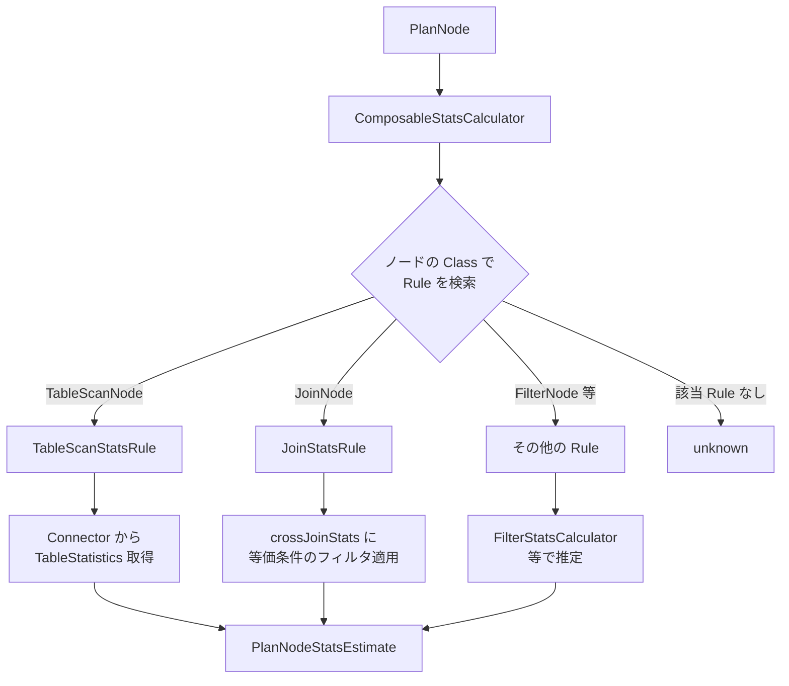

# 第9章 コスト見積もりと統計情報

> **本章で読むソース**
>
> - [`core/trino-main/src/main/java/io/trino/cost/PlanNodeStatsEstimate.java`](https://github.com/trinodb/trino/blob/482/core/trino-main/src/main/java/io/trino/cost/PlanNodeStatsEstimate.java)
> - [`core/trino-main/src/main/java/io/trino/cost/SymbolStatsEstimate.java`](https://github.com/trinodb/trino/blob/482/core/trino-main/src/main/java/io/trino/cost/SymbolStatsEstimate.java)
> - [`core/trino-main/src/main/java/io/trino/cost/StatsCalculator.java`](https://github.com/trinodb/trino/blob/482/core/trino-main/src/main/java/io/trino/cost/StatsCalculator.java)
> - [`core/trino-main/src/main/java/io/trino/cost/ComposableStatsCalculator.java`](https://github.com/trinodb/trino/blob/482/core/trino-main/src/main/java/io/trino/cost/ComposableStatsCalculator.java)
> - [`core/trino-main/src/main/java/io/trino/cost/TableScanStatsRule.java`](https://github.com/trinodb/trino/blob/482/core/trino-main/src/main/java/io/trino/cost/TableScanStatsRule.java)
> - [`core/trino-main/src/main/java/io/trino/cost/FilterStatsCalculator.java`](https://github.com/trinodb/trino/blob/482/core/trino-main/src/main/java/io/trino/cost/FilterStatsCalculator.java)
> - [`core/trino-main/src/main/java/io/trino/cost/JoinStatsRule.java`](https://github.com/trinodb/trino/blob/482/core/trino-main/src/main/java/io/trino/cost/JoinStatsRule.java)
> - [`core/trino-main/src/main/java/io/trino/cost/CostCalculator.java`](https://github.com/trinodb/trino/blob/482/core/trino-main/src/main/java/io/trino/cost/CostCalculator.java)
> - [`core/trino-main/src/main/java/io/trino/cost/CostCalculatorUsingExchanges.java`](https://github.com/trinodb/trino/blob/482/core/trino-main/src/main/java/io/trino/cost/CostCalculatorUsingExchanges.java)
> - [`core/trino-main/src/main/java/io/trino/cost/CostCalculatorWithEstimatedExchanges.java`](https://github.com/trinodb/trino/blob/482/core/trino-main/src/main/java/io/trino/cost/CostCalculatorWithEstimatedExchanges.java)
> - [`core/trino-main/src/main/java/io/trino/cost/CostComparator.java`](https://github.com/trinodb/trino/blob/482/core/trino-main/src/main/java/io/trino/cost/CostComparator.java)
> - [`core/trino-main/src/main/java/io/trino/cost/LocalCostEstimate.java`](https://github.com/trinodb/trino/blob/482/core/trino-main/src/main/java/io/trino/cost/LocalCostEstimate.java)
> - [`core/trino-main/src/main/java/io/trino/cost/PlanCostEstimate.java`](https://github.com/trinodb/trino/blob/482/core/trino-main/src/main/java/io/trino/cost/PlanCostEstimate.java)

## この章の狙い

コストベースオプティマイザ（CBO）が正しく機能するには、プラン候補ごとの実行コストを定量的に比較できなければならない。
Trino の CBO は、統計情報に基づいて各 PlanNode の出力行数やデータサイズを推定し、その推定値から CPU、メモリ、ネットワークの3次元コストを計算する。
本章では、統計推定の Rule ベースフレームワークとコスト計算の全体構造を読む。

## 前提

第7章の Iterative Optimizer と Rule の仕組み、第8章の述語プッシュダウンと結合最適化を理解していることを前提とする。
PlanNode の木構造と Visitor パターンの基本（第6章）も必要である。

## 統計推定のデータモデル

### PlanNodeStatsEstimate

**`PlanNodeStatsEstimate`** は、ある PlanNode の出力に関する統計情報を表す。
保持するフィールドは2つだけで、推定出力行数 `outputRowCount` と、各シンボルの列統計 `symbolStatistics` である。

[`core/trino-main/src/main/java/io/trino/cost/PlanNodeStatsEstimate.java` L38-L44](https://github.com/trinodb/trino/blob/482/core/trino-main/src/main/java/io/trino/cost/PlanNodeStatsEstimate.java#L38-L44)

```java
public class PlanNodeStatsEstimate
{
    private static final double DEFAULT_DATA_SIZE_PER_COLUMN = 50;
    private static final PlanNodeStatsEstimate UNKNOWN = new PlanNodeStatsEstimate(NaN, ImmutableMap.of());

    private final double outputRowCount;
    private final PMap<Symbol, SymbolStatsEstimate> symbolStatistics;
```

`outputRowCount` が `NaN` のとき統計は「不明」と見なされる。
不明な統計に対してはコスト計算もできないため、オプティマイザはコストに基づく最適化をスキップする。

`getOutputSizeInBytes()` は、指定されたシンボルの列統計を使って出力のバイトサイズを推定する。
列ごとに null の割合と平均行サイズから非 null 行のデータ量を求め、null ビットマップと可変長型のオフセット配列も加算する。

[`core/trino-main/src/main/java/io/trino/cost/PlanNodeStatsEstimate.java` L80-L114](https://github.com/trinodb/trino/blob/482/core/trino-main/src/main/java/io/trino/cost/PlanNodeStatsEstimate.java#L80-L114)

```java
public double getOutputSizeInBytes(Collection<Symbol> outputSymbols)
{
    requireNonNull(outputSymbols, "outputSymbols is null");

    return outputSymbols.stream()
            .mapToDouble(symbol -> getOutputSizeForSymbol(getSymbolStatistics(symbol), symbol.type()))
            .sum();
}

private double getOutputSizeForSymbol(SymbolStatsEstimate symbolStatistics, Type type)
{
    checkArgument(type != null, "type is null");

    double nullsFraction = firstNonNaN(symbolStatistics.getNullsFraction(), 0d);
    double numberOfNonNullRows = outputRowCount * (1.0 - nullsFraction);

    double outputSize = 0;

    // account for "is null" boolean array
    outputSize += outputRowCount;

    if (type instanceof FixedWidthType fixedType) {
        outputSize += numberOfNonNullRows * fixedType.getFixedSize();
    }
    else {
        double averageRowSize = firstNonNaN(symbolStatistics.getAverageRowSize(), DEFAULT_DATA_SIZE_PER_COLUMN);
        outputSize += numberOfNonNullRows * averageRowSize;

        // account for offsets array
        outputSize += outputRowCount * Integer.BYTES;
        // TODO some types may have more overhead than just offsets array
    }

    return outputSize;
}
```

固定長型（`FixedWidthType`）では型の `getFixedSize()` をそのまま使い、可変長型では列統計の `averageRowSize` を使う。
`averageRowSize` が不明なときはデフォルト値 50 バイトで代用する。

### SymbolStatsEstimate

**`SymbolStatsEstimate`** は、個別の列（シンボル）に関する統計情報を保持する。

[`core/trino-main/src/main/java/io/trino/cost/SymbolStatsEstimate.java` L31-L42](https://github.com/trinodb/trino/blob/482/core/trino-main/src/main/java/io/trino/cost/SymbolStatsEstimate.java#L31-L42)

```java
public class SymbolStatsEstimate
{
    private static final SymbolStatsEstimate UNKNOWN = new SymbolStatsEstimate(NEGATIVE_INFINITY, POSITIVE_INFINITY, NaN, NaN, NaN);
    private static final SymbolStatsEstimate ZERO = new SymbolStatsEstimate(NaN, NaN, 1.0, 0.0, 0.0);

    // for now we support only types which map to real domain naturally and keep low/high value as double in stats.
    private final double lowValue;
    private final double highValue;
    private final double nullsFraction;
    private final double averageRowSize;
    private final double distinctValuesCount;
```

フィールドの意味は次のとおりである。

- **`lowValue`** / **`highValue`**：値の範囲の下限と上限。範囲が空のときは両方とも `NaN` になる
- **`nullsFraction`**：全行に占める null の割合（0.0 から 1.0 の範囲）
- **`averageRowSize`**：非 null 値の平均バイトサイズ
- **`distinctValuesCount`**（NDV）：非 null のユニーク値の推定個数

これらの統計は、フィルタの選択率推定や結合のカーディナリティ推定で中心的な役割を果たす。
`UNKNOWN` 定数は範囲が `[-Infinity, +Infinity]` で数値フィールドが `NaN` のインスタンスであり、統計が未知であることを表す。

## Rule ベースの統計推定フレームワーク

### StatsCalculator インタフェース

**`StatsCalculator`** は、PlanNode に対して統計情報を計算するインタフェースである。

[`core/trino-main/src/main/java/io/trino/cost/StatsCalculator.java` L23-L53](https://github.com/trinodb/trino/blob/482/core/trino-main/src/main/java/io/trino/cost/StatsCalculator.java#L23-L53)

```java
public interface StatsCalculator
{
    /**
     * Calculate stats for the {@code node}.
     *
     * @param node The node to compute stats for.
     * @param context The context required to calculate stats.
     */
    PlanNodeStatsEstimate calculateStats(PlanNode node, Context context);

    static StatsCalculator noopStatsCalculator()
    {
        return (_, _) -> PlanNodeStatsEstimate.unknown();
    }

    record Context(
            StatsProvider statsProvider,
            Lookup lookup,
            Session session,
            TableStatsProvider tableStatsProvider,
            RuntimeInfoProvider runtimeInfoProvider)
    {
        // ... (中略) ...
    }
}
```

`Context` レコードは統計計算に必要な依存をまとめて渡す。
`statsProvider` で子ノードの統計を取得し、`tableStatsProvider` で Connector からテーブル統計を取得する。

### ComposableStatsCalculator

**`ComposableStatsCalculator`** は `StatsCalculator` の実装であり、PlanNode の種類ごとに登録された `Rule` から適切なものを選んで統計を計算する。

[`core/trino-main/src/main/java/io/trino/cost/ComposableStatsCalculator.java` L33-L53](https://github.com/trinodb/trino/blob/482/core/trino-main/src/main/java/io/trino/cost/ComposableStatsCalculator.java#L33-L53)

```java
public class ComposableStatsCalculator
        implements StatsCalculator
{
    private final ListMultimap<Class<?>, Rule<?>> rulesByRootType;

    @Inject
    public ComposableStatsCalculator(List<Rule<?>> rules)
    {
        this.rulesByRootType = rules.stream()
                .peek(rule -> {
                    if (!(rule.getPattern() instanceof TypeOfPattern pattern)) {
                        throw new IllegalArgumentException("Rule pattern must be TypeOfPattern but was: " + rule.getPattern().getClass().getSimpleName());
                    }
                    Class<?> expectedClass = pattern.expectedClass();
                    checkArgument(!expectedClass.isInterface() && !Modifier.isAbstract(expectedClass.getModifiers()), "Rule must be registered on a concrete class");
                })
                .collect(toMultimap(
                        rule -> ((TypeOfPattern<?>) rule.getPattern()).expectedClass(),
                        rule -> rule,
                        ArrayListMultimap::create));
    }
```

コンストラクタで Rule のリストを受け取り、各 Rule のパターンが指す具象クラスをキーとした `ListMultimap` に格納する。
Rule のパターンは `TypeOfPattern` でなければならず、インタフェースや抽象クラスに対する登録は拒否される。

統計の計算は `calculateStats()` で行われる。
ノードのクラスに対応する Rule 候補を順に試し、最初に値を返した Rule の結果を採用する。

[`core/trino-main/src/main/java/io/trino/cost/ComposableStatsCalculator.java` L66-L77](https://github.com/trinodb/trino/blob/482/core/trino-main/src/main/java/io/trino/cost/ComposableStatsCalculator.java#L66-L77)

```java
@Override
public PlanNodeStatsEstimate calculateStats(PlanNode node, Context context)
{
    Iterator<Rule<?>> ruleIterator = getCandidates(node).iterator();
    while (ruleIterator.hasNext()) {
        Rule<?> rule = ruleIterator.next();
        Optional<PlanNodeStatsEstimate> calculatedStats = calculateStats(rule, node, context);
        if (calculatedStats.isPresent()) {
            return calculatedStats.get();
        }
    }
    return PlanNodeStatsEstimate.unknown();
}
```

どの Rule も値を返さなかった場合は `PlanNodeStatsEstimate.unknown()` を返す。
この仕組みにより、新しい PlanNode 型に対応する統計 Rule を追加するだけで推定を拡張できる。



### SimpleStatsRule

Rule の実装を簡潔にするため、**`SimpleStatsRule`** という抽象クラスが用意されている。

[`core/trino-main/src/main/java/io/trino/cost/SimpleStatsRule.java` L24-L42](https://github.com/trinodb/trino/blob/482/core/trino-main/src/main/java/io/trino/cost/SimpleStatsRule.java#L24-L42)

```java
public abstract class SimpleStatsRule<T extends PlanNode>
        implements Rule<T>
{
    private final StatsNormalizer normalizer;

    protected SimpleStatsRule(StatsNormalizer normalizer)
    {
        this.normalizer = requireNonNull(normalizer, "normalizer is null");
    }

    @Override
    public final Optional<PlanNodeStatsEstimate> calculate(T node, Context context)
    {
        return doCalculate(node, context)
                .map(estimate -> normalizer.normalize(estimate, node.getOutputSymbols()));
    }

    protected abstract Optional<PlanNodeStatsEstimate> doCalculate(T node, Context context);
}
```

`calculate()` は `doCalculate()` の結果に `StatsNormalizer` を適用して返す。
`StatsNormalizer` は NDV が行数を超えないようにする、null 割合と NDV の整合性を保つなど、Connector が返す不整合な統計値を正規化する役割を持つ。

## TableScanStatsRule

**`TableScanStatsRule`** は `TableScanNode` の統計を Connector から取得する Rule である。

[`core/trino-main/src/main/java/io/trino/cost/TableScanStatsRule.java` L55-L78](https://github.com/trinodb/trino/blob/482/core/trino-main/src/main/java/io/trino/cost/TableScanStatsRule.java#L55-L78)

```java
@Override
protected Optional<PlanNodeStatsEstimate> doCalculate(TableScanNode node, Context context)
{
    if (isStatisticsPrecalculationForPushdownEnabled(context.session()) && node.getStatistics().isPresent()) {
        return node.getStatistics();
    }

    TableStatistics tableStatistics = context.tableStatsProvider().getTableStatistics(node.getTable());

    Map<Symbol, SymbolStatsEstimate> outputSymbolStats = new HashMap<>();

    for (Entry<Symbol, ColumnHandle> entry : node.getAssignments().entrySet()) {
        Symbol symbol = entry.getKey();
        Optional<ColumnStatistics> columnStatistics = Optional.ofNullable(tableStatistics.getColumnStatistics().get(entry.getValue()));
        SymbolStatsEstimate symbolStatistics = columnStatistics
                .map(statistics -> toSymbolStatistics(tableStatistics, statistics, symbol.type()))
                .orElse(SymbolStatsEstimate.unknown());
        outputSymbolStats.put(symbol, symbolStatistics);
    }

    return Optional.of(PlanNodeStatsEstimate.builder()
            .setOutputRowCount(tableStatistics.getRowCount().getValue())
            .addSymbolStatistics(outputSymbolStats)
            .build());
}
```

`tableStatsProvider` は SPI の `ConnectorMetadata.getTableStatistics()` を呼び出し、Connector 固有のテーブル統計を取得する。
Hive Connector であれば Metastore の統計情報、Iceberg Connector であればマニフェストファイルの統計が返される。

Connector から取得した `ColumnStatistics` は `toSymbolStatistics()` で `SymbolStatsEstimate` に変換される。
null 割合が未知の場合、`getNullsFraction()` でヒューリスティックを適用する。

[`core/trino-main/src/main/java/io/trino/cost/TableScanStatsRule.java` L110-L129](https://github.com/trinodb/trino/blob/482/core/trino-main/src/main/java/io/trino/cost/TableScanStatsRule.java#L110-L129)

```java
private static double getNullsFraction(ColumnStatistics columnStatistics, Estimate rowCount)
{
    if (!columnStatistics.getNullsFraction().isUnknown()
            || columnStatistics.getDistinctValuesCount().isUnknown()
            || rowCount.isUnknown()) {
        return columnStatistics.getNullsFraction().getValue();
    }
    // When NDV is greater than or equal to row count, there are no nulls
    if (columnStatistics.getDistinctValuesCount().getValue() >= rowCount.getValue()) {
        return 0;
    }

    double maxPossibleNulls = rowCount.getValue() - columnStatistics.getDistinctValuesCount().getValue();

    // If a connector provides NDV but is missing nulls fraction statistic for a column
    // (e.g. Delta Lake after "delta.dataSkippingNumIndexedCols" columns and MySql), populate a
    // 10% guess value so that the CBO can still produce some estimates rather failing to make
    // any estimates due to lack of nulls fraction.
    return Math.min(UNKNOWN_NULLS_FRACTION, maxPossibleNulls / rowCount.getValue());
}
```

NDV が行数以上であれば null は存在しないと判断する。
それ以外で null 割合が不明な場合は、定数 `UNKNOWN_NULLS_FRACTION`（0.1）と、行数から NDV を引いた最大可能 null 数から導く割合のうち小さい方を採用する。
Delta Lake や MySQL のように null 統計を提供しない Connector でも、CBO が推定を中断しないためのフォールバックである。

## FilterStatsCalculator

**`FilterStatsCalculator`** はフィルタ式を受け取り、フィルタ適用後の統計情報を推定する。
`ComposableStatsCalculator` の Rule としてではなく、他の Rule（`JoinStatsRule` 等）から直接呼ばれるユーティリティである。

### 全体の処理フロー

[`core/trino-main/src/main/java/io/trino/cost/FilterStatsCalculator.java` L92-L100](https://github.com/trinodb/trino/blob/482/core/trino-main/src/main/java/io/trino/cost/FilterStatsCalculator.java#L92-L100)

```java
public PlanNodeStatsEstimate filterStats(
        PlanNodeStatsEstimate statsEstimate,
        Expression predicate,
        Session session)
{
    Expression simplifiedExpression = simplifyExpression(session, predicate);
    return new FilterExpressionStatsCalculatingVisitor(statsEstimate, session)
            .process(simplifiedExpression);
}
```

まず述語式を `simplifyExpression()` で簡約し、`FilterExpressionStatsCalculatingVisitor` が式の種類に応じた推定を行う。

### AND 条件の推定

AND 条件の推定は `estimateLogicalAnd()` で行われる。
ここで「独立性係数」（`filterConjunctionIndependenceFactor`）による相関の考慮が入る。

[`core/trino-main/src/main/java/io/trino/cost/FilterStatsCalculator.java` L155-L167](https://github.com/trinodb/trino/blob/482/core/trino-main/src/main/java/io/trino/cost/FilterStatsCalculator.java#L155-L167)

```java
private PlanNodeStatsEstimate estimateLogicalAnd(List<Expression> terms)
{
    double filterConjunctionIndependenceFactor = getFilterConjunctionIndependenceFactor(session);
    List<PlanNodeStatsEstimate> estimates = estimateCorrelatedExpressions(terms, filterConjunctionIndependenceFactor);
    double outputRowCount = estimateCorrelatedConjunctionRowCount(
            input,
            estimates,
            filterConjunctionIndependenceFactor);
    if (isNaN(outputRowCount)) {
        return PlanNodeStatsEstimate.unknown();
    }
    return normalizer.normalize(new PlanNodeStatsEstimate(outputRowCount, intersectCorrelatedStats(estimates)));
}
```

各条件の選択率を単純に掛け合わせると、条件間に相関がある場合に行数を過小評価してしまう。
`estimateCorrelatedConjunctionRowCount()` は独立性係数で補正することで、この過小評価を緩和する（詳細は後述の「最適化の工夫」で説明する）。

### OR 条件の推定

OR 条件は包除原理で推定する。

[`core/trino-main/src/main/java/io/trino/cost/FilterStatsCalculator.java` L210-L236](https://github.com/trinodb/trino/blob/482/core/trino-main/src/main/java/io/trino/cost/FilterStatsCalculator.java#L210-L236)

```java
private PlanNodeStatsEstimate estimateLogicalOr(List<Expression> terms)
{
    PlanNodeStatsEstimate previous = process(terms.get(0));
    if (previous.isOutputRowCountUnknown()) {
        return PlanNodeStatsEstimate.unknown();
    }

    for (int i = 1; i < terms.size(); i++) {
        PlanNodeStatsEstimate current = process(terms.get(i));
        if (current.isOutputRowCountUnknown()) {
            return PlanNodeStatsEstimate.unknown();
        }

        PlanNodeStatsEstimate andEstimate = new FilterExpressionStatsCalculatingVisitor(previous, session).process(terms.get(i));
        if (andEstimate.isOutputRowCountUnknown()) {
            return PlanNodeStatsEstimate.unknown();
        }

        previous = capStats(
                subtractSubsetStats(
                        addStatsAndSumDistinctValues(previous, current),
                        andEstimate),
                input);
    }

    return previous;
}
```

`|A OR B| = |A| + |B| - |A AND B|` という包除原理の式に対応する。
`addStatsAndSumDistinctValues` で A と B の合計を求め、`subtractSubsetStats` で A AND B の重複分を引き、`capStats` で元の入力行数を超えないように上限をかける。

### 比較演算の推定

比較演算（`=`, `<`, `>` 等）の推定では、`ComparisonStatsCalculator` に委譲する。
左辺をシンボル、右辺をリテラルに正規化したうえで推定する。

[`core/trino-main/src/main/java/io/trino/cost/FilterStatsCalculator.java` L333-L372](https://github.com/trinodb/trino/blob/482/core/trino-main/src/main/java/io/trino/cost/FilterStatsCalculator.java#L333-L372)

```java
@SuppressWarnings("ArgumentSelectionDefectChecker")
private PlanNodeStatsEstimate estimateComparison(ComparisonOperator operator, Expression left, Expression right)
{
    checkArgument(!(left instanceof Constant && right instanceof Constant), "Literal-to-literal not supported here, should be eliminated earlier");

    if (!(left instanceof Reference) && right instanceof Reference) {
        // normalize so that symbol is on the left
        return estimateComparison(operator.flip(), right, left);
    }

    if (left instanceof Constant) {
        // normalize so that literal is on the right
        return estimateComparison(operator.flip(), right, left);
    }

    // ... (中略) ...

    SymbolStatsEstimate leftStats = getExpressionStats(left);
    Optional<Symbol> leftSymbol = left instanceof Reference ? Optional.of(Symbol.from(left)) : Optional.empty();
    if (right instanceof Constant constant) {
        Type type = right.type();
        Object literalValue = constant.value();
        if (literalValue == null) {
            // Possible when we process `x IN (..., NULL)` case.
            return input.mapOutputRowCount(_ -> 0.);
        }
        OptionalDouble literal = toStatsRepresentation(type, literalValue);
        return estimateExpressionToLiteralComparison(input, leftStats, leftSymbol, literal, operator);
    }

    SymbolStatsEstimate rightStats = getExpressionStats(right);
    if (rightStats.isSingleValue()) {
        OptionalDouble value = isNaN(rightStats.getLowValue()) ? OptionalDouble.empty() : OptionalDouble.of(rightStats.getLowValue());
        return estimateExpressionToLiteralComparison(input, leftStats, leftSymbol, value, operator);
    }

    Optional<Symbol> rightSymbol = right instanceof Reference ? Optional.of(Symbol.from(right)) : Optional.empty();
    return estimateExpressionToExpressionComparison(input, leftStats, leftSymbol, rightStats, rightSymbol, operator);
}
```

右辺がリテラルの場合は `estimateExpressionToLiteralComparison()`、両辺が式の場合は `estimateExpressionToExpressionComparison()` を呼ぶ。
等価比較（`=`）の場合、選択率は `1 / NDV` として推定される。

## JoinStatsRule

**`JoinStatsRule`** は結合ノード（`JoinNode`）の出力統計を推定する Rule である。

### INNER JOIN の推定

[`core/trino-main/src/main/java/io/trino/cost/JoinStatsRule.java` L83-L95](https://github.com/trinodb/trino/blob/482/core/trino-main/src/main/java/io/trino/cost/JoinStatsRule.java#L83-L95)

```java
@Override
protected Optional<PlanNodeStatsEstimate> doCalculate(JoinNode node, Context context)
{
    PlanNodeStatsEstimate leftStats = context.statsProvider().getStats(node.getLeft());
    PlanNodeStatsEstimate rightStats = context.statsProvider().getStats(node.getRight());
    PlanNodeStatsEstimate crossJoinStats = crossJoinStats(node, leftStats, rightStats);

    return switch (node.getType()) {
        case INNER -> Optional.of(computeInnerJoinStats(node, crossJoinStats, context.session()));
        case LEFT -> Optional.of(computeLeftJoinStats(node, leftStats, rightStats, crossJoinStats, context.session()));
        case RIGHT -> Optional.of(computeRightJoinStats(node, leftStats, rightStats, crossJoinStats, context.session()));
        case FULL -> Optional.of(computeFullJoinStats(node, leftStats, rightStats, crossJoinStats, context.session()));
    };
}
```

まず左右の子ノードの統計からクロス結合の統計を計算し、結合タイプに応じた推定を行う。
クロス結合の行数は `leftRows * rightRows` である。

INNER JOIN の推定は `computeInnerJoinStats()` で行われる。

[`core/trino-main/src/main/java/io/trino/cost/JoinStatsRule.java` L143-L172](https://github.com/trinodb/trino/blob/482/core/trino-main/src/main/java/io/trino/cost/JoinStatsRule.java#L143-L172)

```java
private PlanNodeStatsEstimate computeInnerJoinStats(JoinNode node, PlanNodeStatsEstimate crossJoinStats, Session session)
{
    List<EquiJoinClause> equiJoinCriteria = node.getCriteria();

    if (equiJoinCriteria.isEmpty()) {
        if (node.getFilter().isEmpty()) {
            return crossJoinStats;
        }
        // TODO: this might explode stats
        return filterStatsCalculator.filterStats(crossJoinStats, node.getFilter().get(), session);
    }

    PlanNodeStatsEstimate equiJoinEstimate = filterByEquiJoinClauses(crossJoinStats, node.getCriteria(), session);

    if (equiJoinEstimate.isOutputRowCountUnknown()) {
        return PlanNodeStatsEstimate.unknown();
    }

    if (node.getFilter().isEmpty()) {
        return equiJoinEstimate;
    }

    PlanNodeStatsEstimate filteredEquiJoinEstimate = filterStatsCalculator.filterStats(equiJoinEstimate, node.getFilter().get(), session);

    if (filteredEquiJoinEstimate.isOutputRowCountUnknown()) {
        return normalizer.normalize(equiJoinEstimate.mapOutputRowCount(rowCount -> rowCount * UNKNOWN_FILTER_COEFFICIENT));
    }

    return filteredEquiJoinEstimate;
}
```

等価結合条件がある場合、`filterByEquiJoinClauses()` でクロス結合統計にフィルタを適用し、行数を絞り込む。
追加の非等価フィルタがあればさらに `filterStatsCalculator` で推定する。
非等価フィルタの推定が不明な場合は `UNKNOWN_FILTER_COEFFICIENT`（0.9）を掛けて保守的に推定する。

### 等価結合条件によるフィルタリング

`filterByEquiJoinClauses()` は、各等価条件を `FilterStatsCalculator` で個別に推定し、その結果を相関を考慮して合成する。

[`core/trino-main/src/main/java/io/trino/cost/JoinStatsRule.java` L174-L197](https://github.com/trinodb/trino/blob/482/core/trino-main/src/main/java/io/trino/cost/JoinStatsRule.java#L174-L197)

```java
private PlanNodeStatsEstimate filterByEquiJoinClauses(
        PlanNodeStatsEstimate stats,
        Collection<EquiJoinClause> clauses,
        Session session)
{
    checkArgument(!clauses.isEmpty(), "clauses is empty");
    // Join equality clauses are usually correlated. Therefore, we shouldn't treat each join equality
    // clause separately because stats estimates would be way off.
    List<PlanNodeStatsEstimateWithClause> knownEstimates = clauses.stream()
            .map(clause -> {
                Expression predicate = comparison(metadata, EQUAL, clause.getLeft().toSymbolReference(), clause.getRight().toSymbolReference());
                return new PlanNodeStatsEstimateWithClause(filterStatsCalculator.filterStats(stats, predicate, session), clause);
            })
            .collect(toImmutableList());

    double outputRowCount = estimateCorrelatedConjunctionRowCount(
            stats,
            knownEstimates.stream().map(PlanNodeStatsEstimateWithClause::getEstimate).collect(toImmutableList()),
            getJoinMultiClauseIndependenceFactor(session));
    if (isNaN(outputRowCount)) {
        return PlanNodeStatsEstimate.unknown();
    }
    return normalizer.normalize(new PlanNodeStatsEstimate(outputRowCount, intersectCorrelatedJoinClause(stats, knownEstimates)));
}
```

結合の等価条件は互いに相関が強い場合が多い。
たとえば `a.id = b.id AND a.region = b.region` のような複合結合キーでは、id と region に強い相関がある。
各条件の選択率を単純に掛け合わせると行数を過小評価するため、ここでも `estimateCorrelatedConjunctionRowCount()` で補正する。

### OUTER JOIN の推定

LEFT JOIN の場合、INNER JOIN の結果に「マッチしなかった左側の行」（join complement）を加算する。

[`core/trino-main/src/main/java/io/trino/cost/JoinStatsRule.java` L244-L276](https://github.com/trinodb/trino/blob/482/core/trino-main/src/main/java/io/trino/cost/JoinStatsRule.java#L244-L276)

```java
@VisibleForTesting
PlanNodeStatsEstimate calculateJoinComplementStats(
        Optional<Expression> filter,
        List<JoinNode.EquiJoinClause> criteria,
        PlanNodeStatsEstimate leftStats,
        PlanNodeStatsEstimate rightStats)
{
    if (rightStats.getOutputRowCount() == 0) {
        // no left side rows are matched
        return leftStats;
    }

    if (criteria.isEmpty()) {
        // TODO: account for non-equi conditions
        if (filter.isPresent()) {
            return PlanNodeStatsEstimate.unknown();
        }

        return normalizer.normalize(leftStats.mapOutputRowCount(_ -> 0.0));
    }

    // TODO: add support for non-equality conditions (e.g: <=, !=, >)
    int numberOfFilterClauses = filter.map(expression -> extractConjuncts(expression).size()).orElse(0);

    // Heuristics: select the most selective criteria for join complement clause.
    // Principals behind this heuristics is the same as in computeInnerJoinStats:
    // select "driving join clause" that reduces matched rows the most.
    return criteria.stream()
            .map(drivingClause -> calculateJoinComplementStats(leftStats, rightStats, drivingClause, criteria.size() - 1 + numberOfFilterClauses))
            .filter(estimate -> !estimate.isOutputRowCountUnknown())
            .max(comparingDouble(PlanNodeStatsEstimate::getOutputRowCount))
            .map(normalizer::normalize)
            .orElse(PlanNodeStatsEstimate.unknown());
}
```

左側の NDV が右側の NDV より多い場合、差分の NDV に対応する行がマッチしないと推定する。
右側の NDV が左側以上の場合、null 行のみがマッチしないとする。
`unmatchedJoinComplementNdvsCoefficient`（デフォルト 0.5）で右側の「マッチに寄与する NDV」を割り引くことで、保守的な推定にしている。

## コスト計算

### コストのデータモデル

コスト見積もりには2つのレベルがある。

**`LocalCostEstimate`** は単一の PlanNode 固有のコストであり、子ノードのコストを含まない。

[`core/trino-main/src/main/java/io/trino/cost/LocalCostEstimate.java` L31-L36](https://github.com/trinodb/trino/blob/482/core/trino-main/src/main/java/io/trino/cost/LocalCostEstimate.java#L31-L36)

```java
/**
 * Represents inherent cost of some plan node, not including cost of its sources.
 */
public class LocalCostEstimate
{
    private final double cpuCost;
    private final double maxMemory;
    private final double networkCost;
```

**`PlanCostEstimate`** は PlanNode とその子ノードすべてを含む累積コストである。

[`core/trino-main/src/main/java/io/trino/cost/PlanCostEstimate.java` L28-L39](https://github.com/trinodb/trino/blob/482/core/trino-main/src/main/java/io/trino/cost/PlanCostEstimate.java#L28-L39)

```java
public final class PlanCostEstimate
{
    private static final PlanCostEstimate INFINITE = new PlanCostEstimate(POSITIVE_INFINITY, POSITIVE_INFINITY, POSITIVE_INFINITY, POSITIVE_INFINITY);
    private static final PlanCostEstimate UNKNOWN = new PlanCostEstimate(NaN, NaN, NaN, NaN);
    private static final PlanCostEstimate ZERO = new PlanCostEstimate(0, 0, 0, 0);

    private final double cpuCost;
    private final double maxMemory;
    private final double maxMemoryWhenOutputting;
    private final double networkCost;
    private final LocalCostEstimate rootNodeLocalCostEstimate;
```

`PlanCostEstimate` は `LocalCostEstimate` の3次元（CPU, メモリ, ネットワーク）に加えて **`maxMemoryWhenOutputting`** を持つ。
これは「最初の出力行を生成し始めた後の最大メモリ使用量」であり、ストリーミング型ノードとアキュムレーション型ノードでメモリのピーク時期が異なることをモデル化するために使われる。

### CostCalculator インタフェースと CostCalculatorUsingExchanges

**`CostCalculator`** は PlanNode の累積コストを計算するインタフェースである。

[`core/trino-main/src/main/java/io/trino/cost/CostCalculator.java` L29-L41](https://github.com/trinodb/trino/blob/482/core/trino-main/src/main/java/io/trino/cost/CostCalculator.java#L29-L41)

```java
@ThreadSafe
public interface CostCalculator
{
    /**
     * Calculates cumulative cost of a node.
     */
    PlanCostEstimate calculateCost(
            PlanNode node,
            StatsProvider stats,
            CostProvider sourcesCosts,
            Session session);

    @BindingAnnotation
    @Target(PARAMETER)
    @Retention(RUNTIME)
    @interface EstimatedExchanges {}
}
```

**`CostCalculatorUsingExchanges`** はこのインタフェースの主要な実装であり、プランに既に含まれている Exchange ノードのコストを計算する。
PlanNode の種類ごとに `PlanVisitor` でコストを計算し、3種類のコスト合成パターンを使い分ける。

#### ストリーミング型ノード

Filter、Project、Limit など、入力を逐次処理して出力するノードである。
メモリをほとんど消費しないため、出力中も子ノードのメモリ使用量がそのまま残る。

[`core/trino-main/src/main/java/io/trino/cost/CostCalculatorUsingExchanges.java` L317-L329](https://github.com/trinodb/trino/blob/482/core/trino-main/src/main/java/io/trino/cost/CostCalculatorUsingExchanges.java#L317-L329)

```java
private PlanCostEstimate costForStreaming(PlanNode node, LocalCostEstimate localCost)
{
    PlanCostEstimate sourcesCost = getSourcesEstimations(node)
            .reduce(PlanCostEstimate.zero(), CostCalculatorUsingExchanges::addParallelSiblingsCost);
    return new PlanCostEstimate(
            sourcesCost.getCpuCost() + localCost.getCpuCost(),
            max(
                    sourcesCost.getMaxMemory(),
                    sourcesCost.getMaxMemoryWhenOutputting() + localCost.getMaxMemory()),
            sourcesCost.getMaxMemoryWhenOutputting() + localCost.getMaxMemory(),
            sourcesCost.getNetworkCost() + localCost.getNetworkCost(),
            localCost);
}
```

`maxMemoryWhenOutputting` は子ノードの出力中のメモリにローカルのメモリを加算する。
子ノードが入力を処理し終える前にピークメモリを使っていた可能性があるため、`maxMemory` は子ノード自身のピークと出力時のメモリ＋ローカルメモリの大きい方を取る。

#### アキュムレーション型ノード

Aggregation や EnforceSingleRow など、入力をすべて蓄積してから出力するノードである。

[`core/trino-main/src/main/java/io/trino/cost/CostCalculatorUsingExchanges.java` L303-L315](https://github.com/trinodb/trino/blob/482/core/trino-main/src/main/java/io/trino/cost/CostCalculatorUsingExchanges.java#L303-L315)

```java
private PlanCostEstimate costForAccumulation(PlanNode node, LocalCostEstimate localCost)
{
    PlanCostEstimate sourcesCost = getSourcesEstimations(node)
            .reduce(PlanCostEstimate.zero(), CostCalculatorUsingExchanges::addParallelSiblingsCost);
    return new PlanCostEstimate(
            sourcesCost.getCpuCost() + localCost.getCpuCost(),
            max(
                    sourcesCost.getMaxMemory(),
                    sourcesCost.getMaxMemoryWhenOutputting() + localCost.getMaxMemory()),
            localCost.getMaxMemory(), // Source freed its memory allocations when finished its output
            sourcesCost.getNetworkCost() + localCost.getNetworkCost(),
            localCost);
}
```

ストリーミング型との違いは `maxMemoryWhenOutputting` である。
アキュムレーション型ノードが出力を開始するとき、子ノードは既に処理を完了してメモリを解放しているため、`maxMemoryWhenOutputting` はローカルのメモリだけになる。

#### 結合ノード

結合ノードは probe 側と build 側の2つの子ノードを持ち、build 側がハッシュテーブルを構築した後に probe 側がスキャンする。

[`core/trino-main/src/main/java/io/trino/cost/CostCalculatorUsingExchanges.java` L331-L347](https://github.com/trinodb/trino/blob/482/core/trino-main/src/main/java/io/trino/cost/CostCalculatorUsingExchanges.java#L331-L347)

```java
private PlanCostEstimate costForLookupJoin(PlanNode node, LocalCostEstimate localCost)
{
    verify(node.getSources().size() == 2, "Unexpected number of sources for %s: %s", node, node.getSources());
    List<PlanCostEstimate> sourcesCosts = getSourcesEstimations(node).collect(toImmutableList());
    verify(sourcesCosts.size() == 2);
    PlanCostEstimate probeCost = sourcesCosts.get(0);
    PlanCostEstimate buildCost = sourcesCosts.get(1);

    return new PlanCostEstimate(
            probeCost.getCpuCost() + buildCost.getCpuCost() + localCost.getCpuCost(),
            max(
                    probeCost.getMaxMemory() + buildCost.getMaxMemory(),
                    probeCost.getMaxMemory() + buildCost.getMaxMemoryWhenOutputting() + localCost.getMaxMemory()),
            probeCost.getMaxMemoryWhenOutputting() + localCost.getMaxMemory(),
            probeCost.getNetworkCost() + buildCost.getNetworkCost() + localCost.getNetworkCost(),
            localCost);
}
```

`maxMemory` は、probe と build の両方がメモリを使っている状態と、build 側が出力を始めた後に結合のローカルメモリが加わる状態のうち大きい方を取る。
build 側が完了した後は probe 側の出力メモリとローカルメモリだけが残る。

### CostCalculatorWithEstimatedExchanges

結合の最適化（`ReorderJoins`、`DetermineJoinDistributionType` など）はプランに Exchange が挿入される前に実行される。
Exchange がないプランのコストを正しく比較するために、**`CostCalculatorWithEstimatedExchanges`** は暗黙の Exchange コストを上乗せする。

[`core/trino-main/src/main/java/io/trino/cost/CostCalculatorWithEstimatedExchanges.java` L59-L66](https://github.com/trinodb/trino/blob/482/core/trino-main/src/main/java/io/trino/cost/CostCalculatorWithEstimatedExchanges.java#L59-L66)

```java
@Override
public PlanCostEstimate calculateCost(PlanNode node, StatsProvider stats, CostProvider sourcesCosts, Session session)
{
    ExchangeCostEstimator exchangeCostEstimator = new ExchangeCostEstimator(stats, taskCountEstimator, session);
    PlanCostEstimate costEstimate = costCalculator.calculateCost(node, stats, sourcesCosts, session);
    LocalCostEstimate estimatedExchangeCost = node.accept(exchangeCostEstimator, null);
    return addExchangeCost(costEstimate, estimatedExchangeCost);
}
```

Exchange のコストはデータの移動方法に応じて3種類に分かれる。

[`core/trino-main/src/main/java/io/trino/cost/CostCalculatorWithEstimatedExchanges.java` L176-L194](https://github.com/trinodb/trino/blob/482/core/trino-main/src/main/java/io/trino/cost/CostCalculatorWithEstimatedExchanges.java#L176-L194)

```java
public static LocalCostEstimate calculateRemoteGatherCost(double inputSizeInBytes)
{
    return LocalCostEstimate.ofNetwork(inputSizeInBytes);
}

public static LocalCostEstimate calculateRemoteRepartitionCost(double inputSizeInBytes)
{
    return LocalCostEstimate.of(inputSizeInBytes, 0, inputSizeInBytes);
}

public static LocalCostEstimate calculateLocalRepartitionCost(double inputSizeInBytes)
{
    return LocalCostEstimate.ofCpu(inputSizeInBytes);
}

public static LocalCostEstimate calculateRemoteReplicateCost(double inputSizeInBytes, int destinationTaskCount)
{
    return LocalCostEstimate.ofNetwork(inputSizeInBytes * destinationTaskCount);
}
```

- **Remote Gather**：ネットワークコストのみ（全データを1箇所に集める）
- **Remote Repartition**：CPU＋ネットワーク（ハッシュ計算してシャッフル）
- **Local Repartition**：CPU のみ（ノード内でのパーティション分割）
- **Remote Replicate**：ネットワーク × 宛先 Task 数（ブロードキャスト結合用）

Replicate の場合、データが全 Task にコピーされるためネットワークコストは `inputSizeInBytes * destinationTaskCount` になる。
この違いにより、partitioned join と broadcast join のコスト比較が可能になる。

## CostComparator

**`CostComparator`** はオプティマイザがプラン候補を比較するために使う。
CPU、メモリ、ネットワークの3次元コストに重みを掛けてスカラー値に変換し、比較する。

[`core/trino-main/src/main/java/io/trino/cost/CostComparator.java` L25-L73](https://github.com/trinodb/trino/blob/482/core/trino-main/src/main/java/io/trino/cost/CostComparator.java#L25-L73)

```java
public class CostComparator
{
    private final double cpuWeight;
    private final double memoryWeight;
    private final double networkWeight;

    @Inject
    public CostComparator(OptimizerConfig featuresConfig)
    {
        this(featuresConfig.getCpuCostWeight(), featuresConfig.getMemoryCostWeight(), featuresConfig.getNetworkCostWeight());
    }

    // ... (中略) ...

    public int compare(Session session, PlanCostEstimate left, PlanCostEstimate right)
    {
        requireNonNull(session, "session is null");
        requireNonNull(left, "left is null");
        requireNonNull(right, "right is null");
        checkArgument(!left.hasUnknownComponents() && !right.hasUnknownComponents(), "cannot compare unknown costs");

        double leftCost = left.getCpuCost() * cpuWeight
                + left.getMaxMemory() * memoryWeight
                + left.getNetworkCost() * networkWeight;

        double rightCost = right.getCpuCost() * cpuWeight
                + right.getMaxMemory() * memoryWeight
                + right.getNetworkCost() * networkWeight;

        return Double.compare(leftCost, rightCost);
    }
}
```

重みは `OptimizerConfig` から取得する。
デフォルトではネットワークに高い重みが設定されており、分散環境でネットワーク転送を最小化するプランが選好される。
どちらか一方にでも不明なコスト成分があると比較は拒否される。

## 最適化の工夫：相関する条件の独立性係数

AND 条件や複合結合キーの行数推定で使われる `estimateCorrelatedConjunctionRowCount()` は、条件間の相関を「独立性係数」で制御する。

[`core/trino-main/src/main/java/io/trino/cost/PlanNodeStatsEstimateMath.java` L202-L235](https://github.com/trinodb/trino/blob/482/core/trino-main/src/main/java/io/trino/cost/PlanNodeStatsEstimateMath.java#L202-L235)

```java
public static double estimateCorrelatedConjunctionRowCount(
        PlanNodeStatsEstimate input,
        List<PlanNodeStatsEstimate> estimates,
        double independenceFactor)
{
    // ... (中略) ...
    List<PlanNodeStatsEstimate> knownSortedEstimates = estimates.stream()
            .filter(estimateInfo -> !estimateInfo.isOutputRowCountUnknown())
            .sorted(comparingDouble(PlanNodeStatsEstimate::getOutputRowCount))
            .collect(toImmutableList());
    // ... (中略) ...

    PlanNodeStatsEstimate combinedEstimate = knownSortedEstimates.get(0);
    double combinedSelectivity = combinedEstimate.getOutputRowCount() / input.getOutputRowCount();
    double combinedIndependenceFactor = 1.0;
    // For independenceFactor = 0.75 and terms t1, t2, t3
    // Combined selectivity = (t1 selectivity) * ((t2 selectivity) ^ 0.75) * ((t3 selectivity) ^ (0.75 * 0.75))
    // independenceFactor = 1 implies the terms are assumed to have no correlation and their selectivities are multiplied without scaling.
    // independenceFactor = 0 implies the terms are assumed to be fully correlated and only the most selective term drives the selectivity.
    for (int i = 1; i < knownSortedEstimates.size(); i++) {
        PlanNodeStatsEstimate term = knownSortedEstimates.get(i);
        combinedIndependenceFactor *= independenceFactor;
        combinedSelectivity *= Math.pow(term.getOutputRowCount() / input.getOutputRowCount(), combinedIndependenceFactor);
    }
    double outputRowCount = input.getOutputRowCount() * combinedSelectivity;
    // ... (中略) ...
    boolean hasUnestimatedTerm = estimates.stream().anyMatch(PlanNodeStatsEstimate::isOutputRowCountUnknown);
    return hasUnestimatedTerm ? outputRowCount * UNKNOWN_FILTER_COEFFICIENT : outputRowCount;
}
```

条件 t1, t2, t3 の選択率が s1, s2, s3（s1 が最小）で独立性係数が f のとき、合成選択率は次のように計算される。

`combined = s1 * s2^f * s3^(f*f)`

独立性係数 f = 1 のとき、全条件が独立と仮定し選択率を単純に掛け合わせる。
f = 0 のとき、全条件が完全に相関していると仮定し、最も選択的な条件のみが選択率を決定する。
デフォルト値は f = 0.75 であり、ある程度の相関を仮定する。

条件を選択率の小さい順にソートしたうえで独立性係数を累乗で減衰させるため、選択率の小さい条件ほど影響が大きく、選択率の大きい（効果の小さい）条件は累乗の減衰によって合成選択率への寄与が抑えられる。
各条件の選択率を単純に掛け合わせると行数を過小評価して結合順序の誤りを招くが、この仕組みにより、実世界で一般的な「条件間に相関がある」ケースでもより正確な行数推定が得られる。

`FilterStatsCalculator` ではさらに、`extractCorrelatedGroups()` で同一シンボルに関連する条件を `DisjointSet` でグループ化し、グループ内の条件は逐次適用、グループ間では独立性係数を適用するという二段階の推定を行う。

[`core/trino-main/src/main/java/io/trino/cost/FilterStatsCalculator.java` L413-L460](https://github.com/trinodb/trino/blob/482/core/trino-main/src/main/java/io/trino/cost/FilterStatsCalculator.java#L413-L460)

```java
private static List<List<Expression>> extractCorrelatedGroups(List<Expression> terms, double filterConjunctionIndependenceFactor)
{
    if (filterConjunctionIndependenceFactor == 1) {
        // Allows the filters to be estimated as if there is no correlation between any of the terms
        return ImmutableList.of(terms);
    }

    ListMultimap<Expression, Symbol> expressionUniqueSymbols = ArrayListMultimap.create();
    terms.forEach(expression -> expressionUniqueSymbols.putAll(expression, extractUnique(expression)));
    // Partition symbols into disjoint sets such that the symbols belonging to different disjoint sets
    // do not appear together in any expression.
    DisjointSet<Symbol> symbolsPartitioner = new DisjointSet<>();
    for (Expression term : terms) {
        List<Symbol> expressionSymbols = expressionUniqueSymbols.get(term);
        if (expressionSymbols.isEmpty()) {
            continue;
        }
        // Ensure that symbol is added to DisjointSet when there is only one symbol in the list
        symbolsPartitioner.find(expressionSymbols.get(0));
        for (int i = 1; i < expressionSymbols.size(); i++) {
            symbolsPartitioner.findAndUnion(expressionSymbols.get(0), expressionSymbols.get(i));
        }
    }

    // Use disjoint sets of symbols to partition the given list of expressions
    List<Set<Symbol>> symbolPartitions = ImmutableList.copyOf(symbolsPartitioner.getEquivalentClasses());
    // ... (中略) ...

    return expressionPartitions.keySet().stream()
            .map(expressionPartitions::get)
            .collect(toImmutableList());
}
```

`x > 10 AND x <= 100` のように同じシンボル x に関する条件は一つのグループになり、逐次適用により範囲の絞り込みが正確に反映される。
`x > 10 AND y < 5` のように異なるシンボルに関する条件は別グループになり、グループ間には独立性係数が適用される。
この二段階の仕組みにより、同一列への複合条件を過小評価せず、かつ列間の相関も考慮した推定が実現される。

## まとめ

Trino の CBO は統計推定とコスト計算の2段階で構成される。

統計推定は `ComposableStatsCalculator` が Rule ベースで管理し、PlanNode の種類ごとに `TableScanStatsRule`、`JoinStatsRule` などの Rule が推定を行う。
Connector が SPI 経由で提供するテーブル統計を起点として、フィルタや結合の選択率を推定し、プランツリーのボトムアップで各ノードの出力行数と列統計を導く。

コスト計算は `CostCalculatorUsingExchanges` がノードの種類に応じてストリーミング型、アキュムレーション型、結合の3パターンで累積コストを合成する。
コストは CPU、メモリ、ネットワークの3次元であり、`CostComparator` が重み付きスカラーに変換してプラン候補を比較する。
Exchange が未挿入のプランに対しては `CostCalculatorWithEstimatedExchanges` が暗黙のコストを加算し、partitioned join と broadcast join の比較を可能にする。

## 関連する章

- [第7章 Iterative Optimizer と Rule](07-iterative-optimizer.md)：CBO のコスト計算を消費する最適化フレームワーク
- [第8章 述語プッシュダウンと結合最適化](08-predicate-and-join-optimization.md)：コスト情報を使って結合順序やフィルタの配置を決定する
- [第10章 分散プラン生成と Exchange](10-distributed-plan.md)：コスト計算で使われる Exchange の実際の挿入
