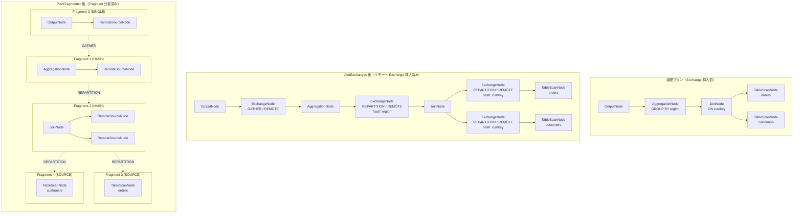

# 第10章 分散プラン生成と Exchange

> **本章で読むソース**
>
> - [`core/trino-main/src/main/java/io/trino/sql/planner/optimizations/AddExchanges.java`](https://github.com/trinodb/trino/blob/482/core/trino-main/src/main/java/io/trino/sql/planner/optimizations/AddExchanges.java)
> - [`core/trino-main/src/main/java/io/trino/sql/planner/optimizations/AddLocalExchanges.java`](https://github.com/trinodb/trino/blob/482/core/trino-main/src/main/java/io/trino/sql/planner/optimizations/AddLocalExchanges.java)
> - [`core/trino-main/src/main/java/io/trino/sql/planner/PlanFragmenter.java`](https://github.com/trinodb/trino/blob/482/core/trino-main/src/main/java/io/trino/sql/planner/PlanFragmenter.java)
> - [`core/trino-main/src/main/java/io/trino/sql/planner/PlanFragment.java`](https://github.com/trinodb/trino/blob/482/core/trino-main/src/main/java/io/trino/sql/planner/PlanFragment.java)
> - [`core/trino-main/src/main/java/io/trino/sql/planner/SubPlan.java`](https://github.com/trinodb/trino/blob/482/core/trino-main/src/main/java/io/trino/sql/planner/SubPlan.java)
> - [`core/trino-main/src/main/java/io/trino/sql/planner/plan/ExchangeNode.java`](https://github.com/trinodb/trino/blob/482/core/trino-main/src/main/java/io/trino/sql/planner/plan/ExchangeNode.java)
> - [`core/trino-main/src/main/java/io/trino/sql/planner/plan/RemoteSourceNode.java`](https://github.com/trinodb/trino/blob/482/core/trino-main/src/main/java/io/trino/sql/planner/plan/RemoteSourceNode.java)
> - [`core/trino-main/src/main/java/io/trino/sql/planner/PartitioningScheme.java`](https://github.com/trinodb/trino/blob/482/core/trino-main/src/main/java/io/trino/sql/planner/PartitioningScheme.java)
> - [`core/trino-main/src/main/java/io/trino/sql/planner/SystemPartitioningHandle.java`](https://github.com/trinodb/trino/blob/482/core/trino-main/src/main/java/io/trino/sql/planner/SystemPartitioningHandle.java)

## この章の狙い

Trino はオプティマイザが生成した論理プランを、複数の Worker で並列に実行できる分散実行プランへ変換する。
この変換は3つの段階を踏む。

1. `AddExchanges` が、各ノードのデータ分散要件を検査し、要件を満たさない箇所にリモート Exchange ノードを挿入する。
2. `AddLocalExchanges` が、単一 Worker 内のパイプライン並列化のためにローカル Exchange ノードを挿入する。
3. `PlanFragmenter` が、リモート Exchange ノードを境界にプランを Fragment へ分割し、`SubPlan` のツリーを構築する。

本章では、これら3段階の処理をコードから読み解き、論理プランがどのように分散実行可能な形になるかを追う。

## 前提

- 第6章で扱った論理プランの IR（`PlanNode` のツリー）を理解していること。
- 第7章の Iterative Optimizer によるルール適用の仕組みを知っていること。
- Trino の Coordinator と Worker の役割分担（第2章）を前提とする。

## ExchangeNode の構造と種類

**ExchangeNode** は、データの再分散を表す PlanNode である。
2つの軸で分類される。

- **Type**（データの分散方法）：`GATHER`、`REPARTITION`、`REPLICATE` の3種類
- **Scope**（通信の範囲）：`REMOTE`（Worker 間）と `LOCAL`（Worker 内のパイプライン間）

[`core/trino-main/src/main/java/io/trino/sql/planner/plan/ExchangeNode.java` L48-L59](https://github.com/trinodb/trino/blob/482/core/trino-main/src/main/java/io/trino/sql/planner/plan/ExchangeNode.java#L48-L59)

```java
public enum Type
{
    GATHER,
    REPARTITION,
    REPLICATE,
}

public enum Scope
{
    LOCAL,
    REMOTE,
}
```

「Type」はデータの配り方を規定する。

- **GATHER**：複数のストリームを1つの Node（通常は Coordinator）に集約する。`SINGLE_DISTRIBUTION` をパーティショニングに用いる。
- **REPARTITION**：ハッシュ関数やラウンドロビンで行を複数のパーティションに再分散する。JOIN や GROUP BY のキーに基づくデータの再配置に用いる。
- **REPLICATE**：上流のデータを全 Worker にブロードキャストする。小さなテーブルを全 Worker に配布するブロードキャスト JOIN で用いる。

ExchangeNode は `PartitioningScheme` を保持しており、出力列のレイアウトとパーティショニング方法を定義する。

[`core/trino-main/src/main/java/io/trino/sql/planner/plan/ExchangeNode.java` L61-L71](https://github.com/trinodb/trino/blob/482/core/trino-main/src/main/java/io/trino/sql/planner/plan/ExchangeNode.java#L61-L71)

```java
private final Type type;
private final Scope scope;

private final List<PlanNode> sources;

private final PartitioningScheme partitioningScheme;

// for each source, the list of inputs corresponding to each output
private final List<List<Symbol>> inputs;

private final Optional<OrderingScheme> orderingScheme;
```

### ファクトリメソッドによる生成

ExchangeNode は用途ごとの static ファクトリメソッドを提供しており、呼び出し元が Type や Scope を直接指定する必要がない。

`gatheringExchange` は GATHER を生成する。

[`core/trino-main/src/main/java/io/trino/sql/planner/plan/ExchangeNode.java` L184-L194](https://github.com/trinodb/trino/blob/482/core/trino-main/src/main/java/io/trino/sql/planner/plan/ExchangeNode.java#L184-L194)

```java
public static ExchangeNode gatheringExchange(PlanNodeId id, Scope scope, PlanNode child)
{
    return new ExchangeNode(
            id,
            ExchangeNode.Type.GATHER,
            scope,
            new PartitioningScheme(Partitioning.create(SINGLE_DISTRIBUTION, ImmutableList.of()), child.getOutputSymbols()),
            ImmutableList.of(child),
            ImmutableList.of(child.getOutputSymbols()),
            Optional.empty());
}
```

`replicatedExchange` は REPLICATE を生成し、`FIXED_BROADCAST_DISTRIBUTION` を用いる。

[`core/trino-main/src/main/java/io/trino/sql/planner/plan/ExchangeNode.java` L172-L182](https://github.com/trinodb/trino/blob/482/core/trino-main/src/main/java/io/trino/sql/planner/plan/ExchangeNode.java#L172-L182)

```java
public static ExchangeNode replicatedExchange(PlanNodeId id, Scope scope, PlanNode child)
{
    return new ExchangeNode(
            id,
            ExchangeNode.Type.REPLICATE,
            scope,
            new PartitioningScheme(Partitioning.create(FIXED_BROADCAST_DISTRIBUTION, ImmutableList.of()), child.getOutputSymbols()),
            ImmutableList.of(child),
            ImmutableList.of(child.getOutputSymbols()),
            Optional.empty());
}
```

`partitionedExchange` はハッシュキーを指定して REPARTITION を生成する。
パーティショニングハンドルが単一 Node 向けの場合は、自動的に `gatheringExchange` へフォールバックする。

[`core/trino-main/src/main/java/io/trino/sql/planner/plan/ExchangeNode.java` L140-L153](https://github.com/trinodb/trino/blob/482/core/trino-main/src/main/java/io/trino/sql/planner/plan/ExchangeNode.java#L140-L153)

```java
public static ExchangeNode partitionedExchange(PlanNodeId id, Scope scope, PlanNode child, PartitioningScheme partitioningScheme)
{
    if (partitioningScheme.getPartitioning().getHandle().isSingleNode()) {
        return gatheringExchange(id, scope, child);
    }
    return new ExchangeNode(
            id,
            ExchangeNode.Type.REPARTITION,
            scope,
            partitioningScheme,
            ImmutableList.of(child),
            ImmutableList.of(partitioningScheme.getOutputLayout()),
            Optional.empty());
}
```

## PartitioningScheme とシステムパーティショニング

### PartitioningScheme

**PartitioningScheme** は、Exchange がデータをどのように分散するかを定義するクラスである。
パーティショニング関数（`Partitioning`）、出力列レイアウト、NULL 値の複製フラグなどを保持する。

[`core/trino-main/src/main/java/io/trino/sql/planner/PartitioningScheme.java` L36-L43](https://github.com/trinodb/trino/blob/482/core/trino-main/src/main/java/io/trino/sql/planner/PartitioningScheme.java#L36-L43)

```java
public class PartitioningScheme
{
    private final Partitioning partitioning;
    private final List<Symbol> outputLayout;
    private final Supplier<List<Type>> outputTypes;
    private final boolean replicateNullsAndAny;
    private final Optional<int[]> bucketToPartition;
    private final OptionalInt bucketCount;
    private final OptionalInt partitionCount;
```

`replicateNullsAndAny` フラグは、セミ JOIN で NULL 値を全パーティションに複製する必要がある場合に用いる。
`bucketToPartition` はバケット番号から物理パーティション番号への対応表であり、Connector が独自のバケット分割を定義している場合に利用される。

### SystemPartitioningHandle

**SystemPartitioningHandle** は Trino 組み込みのパーティショニング戦略を列挙する。

[`core/trino-main/src/main/java/io/trino/sql/planner/SystemPartitioningHandle.java` L47-L56](https://github.com/trinodb/trino/blob/482/core/trino-main/src/main/java/io/trino/sql/planner/SystemPartitioningHandle.java#L47-L56)

```java
public static final PartitioningHandle SINGLE_DISTRIBUTION = createSystemPartitioning(SystemPartitioning.SINGLE, SystemPartitionFunction.SINGLE);
public static final PartitioningHandle COORDINATOR_DISTRIBUTION = createSystemPartitioning(SystemPartitioning.COORDINATOR_ONLY, SystemPartitionFunction.SINGLE);
public static final PartitioningHandle FIXED_HASH_DISTRIBUTION = createSystemPartitioning(SystemPartitioning.FIXED, SystemPartitionFunction.HASH);
public static final PartitioningHandle FIXED_ARBITRARY_DISTRIBUTION = createSystemPartitioning(SystemPartitioning.FIXED, SystemPartitionFunction.ROUND_ROBIN);
public static final PartitioningHandle FIXED_BROADCAST_DISTRIBUTION = createSystemPartitioning(SystemPartitioning.FIXED, SystemPartitionFunction.BROADCAST);
public static final PartitioningHandle SCALED_WRITER_ROUND_ROBIN_DISTRIBUTION = createScaledWriterSystemPartitioning(SystemPartitionFunction.ROUND_ROBIN);
public static final PartitioningHandle SCALED_WRITER_HASH_DISTRIBUTION = createScaledWriterSystemPartitioning(SystemPartitionFunction.HASH);
public static final PartitioningHandle SOURCE_DISTRIBUTION = createSystemPartitioning(SystemPartitioning.SOURCE, SystemPartitionFunction.UNKNOWN);
public static final PartitioningHandle ARBITRARY_DISTRIBUTION = createSystemPartitioning(SystemPartitioning.ARBITRARY, SystemPartitionFunction.UNKNOWN);
public static final PartitioningHandle FIXED_PASSTHROUGH_DISTRIBUTION = createSystemPartitioning(SystemPartitioning.FIXED, SystemPartitionFunction.UNKNOWN);
```

主要な定数の役割は次のとおりである。

- `SINGLE_DISTRIBUTION`：単一 Node で処理する。GATHER 型の Exchange で使用する。
- `COORDINATOR_DISTRIBUTION`：Coordinator 上で処理する。`TableFinishNode` や `ExplainAnalyzeNode` など、結果の最終集約に使用する。
- `FIXED_HASH_DISTRIBUTION`：ハッシュ関数で行を固定数のパーティションに分散する。JOIN や GROUP BY で使用する。
- `FIXED_BROADCAST_DISTRIBUTION`：全 Worker にデータをブロードキャストする。REPLICATE 型の Exchange で使用する。
- `FIXED_ARBITRARY_DISTRIBUTION`：ラウンドロビンで行を分散する。データの偏りを平準化するために使用する。
- `SOURCE_DISTRIBUTION`：テーブルスキャンの Split に基づくデータ分散である。
- `SCALED_WRITER_HASH_DISTRIBUTION`、`SCALED_WRITER_ROUND_ROBIN_DISTRIBUTION`：書き込み時にスケーリングを行うパーティショニングである。

`SystemPartitioning` 列挙が分散カテゴリを定義し、`SystemPartitionFunction` 列挙が行の振り分け関数を定義する。
`isSingleNode()` メソッドは `SINGLE` と `COORDINATOR_ONLY` の両方で `true` を返す。

[`core/trino-main/src/main/java/io/trino/sql/planner/SystemPartitioningHandle.java` L98-L107](https://github.com/trinodb/trino/blob/482/core/trino-main/src/main/java/io/trino/sql/planner/SystemPartitioningHandle.java#L98-L107)

```java
@Override
public boolean isSingleNode()
{
    return partitioning == SystemPartitioning.COORDINATOR_ONLY || partitioning == SystemPartitioning.SINGLE;
}

@Override
public boolean isCoordinatorOnly()
{
    return partitioning == SystemPartitioning.COORDINATOR_ONLY;
}
```

## AddExchanges によるリモート Exchange の挿入

**AddExchanges** は `PlanOptimizer` を実装するクラスで、論理プランのツリーをボトムアップに走査し、各ノードが要求するデータ分散プロパティに基づいてリモート Exchange ノードを挿入する。

[`core/trino-main/src/main/java/io/trino/sql/planner/optimizations/AddExchanges.java` L145-L168](https://github.com/trinodb/trino/blob/482/core/trino-main/src/main/java/io/trino/sql/planner/optimizations/AddExchanges.java#L145-L168)

```java
public class AddExchanges
        implements PlanOptimizer
{
    private final PlannerContext plannerContext;
    private final StatsCalculator statsCalculator;
    private final TaskCountEstimator taskCountEstimator;
    private final NodePartitioningManager nodePartitioningManager;

    // ... (中略) ...

    @Override
    public PlanNode optimize(PlanNode plan, Context context)
    {
        PlanWithProperties result = plan.accept(
                new Rewriter(context.idAllocator(), context.symbolAllocator(), context.session(), context.tableStatsProvider()),
                PreferredProperties.any());
        return result.getNode();
    }
```

`optimize` メソッドは、内部クラス `Rewriter` を PlanVisitor として用い、ルートから子に向かって `accept` で下降する。
各 `visit` メソッドは子を先に処理してそのプロパティを取得し、自ノードの要件と照合して Exchange の挿入要否を判断する。

### プロパティの伝播と判断の仕組み

`Rewriter` は `PlanWithProperties` を返り値とする PlanVisitor であり、処理済みのノードと、そのノードが保証するデータ分散プロパティ（`ActualProperties`）の組を返す。
親ノードは `PreferredProperties`（望ましい分散条件）を子に渡し、子はそれを考慮してプランを組み立てる。

子の実際のプロパティが親の要求を満たさない場合に、Exchange が挿入される。
この「要求と照合して不足分を補う」パターンが `AddExchanges` の基本構造である。

### 集約ノードの処理

`visitAggregation` はこのパターンの典型例である。
GROUP BY キーでパーティショニングされていなければ、`partitionedExchange` を挿入して行をハッシュ分散させる。

[`core/trino-main/src/main/java/io/trino/sql/planner/optimizations/AddExchanges.java` L235-L273](https://github.com/trinodb/trino/blob/482/core/trino-main/src/main/java/io/trino/sql/planner/optimizations/AddExchanges.java#L235-L273)

```java
@Override
public PlanWithProperties visitAggregation(AggregationNode node, PreferredProperties parentPreferredProperties)
{
    Set<Symbol> partitioningRequirement = ImmutableSet.copyOf(node.getGroupingKeys());

    boolean preferSingleNode = node.hasSingleNodeExecutionPreference(session, plannerContext.getMetadata());
    PreferredProperties preferredProperties = preferSingleNode ? PreferredProperties.undistributed() : PreferredProperties.any();

    // ... (中略) ...

    PlanWithProperties child = planChild(node, preferredProperties);

    if (child.getProperties().isSingleNode()) {
        // If already unpartitioned, just drop the single aggregation back on
        return rebaseAndDeriveProperties(node, child);
    }

    if (preferSingleNode) {
        child = withDerivedProperties(
                gatheringExchange(idAllocator.getNextId(), REMOTE, child.getNode()),
                child.getProperties());
    }
    else if (!isNodePartitionedOn(child.getProperties(), partitioningRequirement) || node.hasEmptyGroupingSet()) {
        List<Symbol> partitioningKeys = parentPreferredProperties.getGlobalProperties()
                // ... (中略) ...
                .orElse(node.getGroupingKeys());
        child = withDerivedProperties(
                partitionedExchange(idAllocator.getNextId(), REMOTE, child.getNode(), partitioningKeys),
                child.getProperties());
    }
    return rebaseAndDeriveProperties(node, child);
}
```

処理は3つの分岐に分かれる。

1. 子がすでに単一 Node であれば、Exchange を追加せずそのまま集約する。
2. 集約が単一 Node 実行を求める場合（例：`COUNT(*)` のような非分散集約）、`gatheringExchange` を挿入して Coordinator に行を集める。
3. 子のパーティショニングがグルーピングキーと一致しなければ、`partitionedExchange` を挿入してハッシュ再分散する。

### JOIN ノードの処理

JOIN では、Partitioned JOIN と Replicated JOIN（ブロードキャスト JOIN）を分散タイプに応じて処理する。
Replicated JOIN の場合、右辺を全 Worker に `replicatedExchange` でブロードキャストする。

[`core/trino-main/src/main/java/io/trino/sql/planner/optimizations/AddExchanges.java` L1032-L1051](https://github.com/trinodb/trino/blob/482/core/trino-main/src/main/java/io/trino/sql/planner/optimizations/AddExchanges.java#L1032-L1051)

```java
private PlanWithProperties planReplicatedJoin(JoinNode node, PlanWithProperties left)
{
    // Broadcast Join
    PlanWithProperties right = node.getRight().accept(this, PreferredProperties.any());

    if (left.getProperties().isSingleNode()) {
        if (!right.getProperties().isSingleNode() ||
                (!isColocatedJoinEnabled(session) && hasMultipleSources(left.getNode(), right.getNode()))) {
            right = withDerivedProperties(
                    gatheringExchange(idAllocator.getNextId(), REMOTE, right.getNode()),
                    right.getProperties());
        }
    }
    else {
        right = withDerivedProperties(
                replicatedExchange(idAllocator.getNextId(), REMOTE, right.getNode()),
                right.getProperties());
    }

    return buildJoin(node, left, right, JoinNode.DistributionType.REPLICATED);
}
```

左辺が分散されている場合（`else` 分岐）、右辺を `FIXED_BROADCAST_DISTRIBUTION` で全 Worker にブロードキャストする。
左辺が単一 Node の場合は、右辺も `gatheringExchange` で同一 Node に集める。

Partitioned JOIN の場合は、左右両辺を JOIN キーでハッシュ分散して同じキー値を同じ Worker に配置する。
一方の辺がすでに要求されるパーティショニングを満たしていれば、もう一方だけに Exchange を挿入する。

### Output ノードの処理

クエリの最終出力は通常 Coordinator に集約される。
`visitOutput` は、子が分散されていて `isForceSingleNodeOutput` が有効な場合に `gatheringExchange` を挿入する。

[`core/trino-main/src/main/java/io/trino/sql/planner/optimizations/AddExchanges.java` L207-L217](https://github.com/trinodb/trino/blob/482/core/trino-main/src/main/java/io/trino/sql/planner/optimizations/AddExchanges.java#L207-L217)

```java
@Override
public PlanWithProperties visitOutput(OutputNode node, PreferredProperties preferredProperties)
{
    PlanWithProperties child = planChild(node, PreferredProperties.undistributed());

    if (!child.getProperties().isSingleNode() && isForceSingleNodeOutput(session)) {
        child = withDerivedProperties(
                gatheringExchange(idAllocator.getNextId(), REMOTE, child.getNode()),
                child.getProperties());
    }

    return rebaseAndDeriveProperties(node, child);
}
```

### コスト情報を用いたパーティショニング最適化

`AddExchanges` は親ノードの望むパーティショニングが子ノードのグルーピングキーの部分集合である場合、不要なデータ再分散を回避する最適化を行う。
`useParentPreferredPartitioning` メソッドは、親が望むパーティショニング列の NDV（Distinct Value 数）を推定し、十分な並列度が得られるかを判断する。

[`core/trino-main/src/main/java/io/trino/sql/planner/optimizations/AddExchanges.java` L280-L307](https://github.com/trinodb/trino/blob/482/core/trino-main/src/main/java/io/trino/sql/planner/optimizations/AddExchanges.java#L280-L307)

```java
/**
 * For cases where parent prefers to be partitioned by a subset of the current node {@link AggregationNode#getGroupingKeys()},
 * and the preferred partitioning columns have enough distinct values to provide good parallelism, we want to partition
 * just by parent preferred partitioning columns to avoid another data shuffle required by the parent.
 */
private Optional<List<Symbol>> useParentPreferredPartitioning(AggregationNode node, Set<Symbol> parentPreferredPartitioningColumns)
{
    // ... (中略) ...
    double parentPartitioningNDV = getMinDistinctValueCountEstimate(statsProvider.getStats(node), parentPreferredPartitioningColumns);
    if (Double.isNaN(parentPartitioningNDV)) {
        // unknown estimate, fallback to partitioning by all grouping keys
        return Optional.empty();
    }
    int maxConcurrentPartitionsCount = taskCountEstimator.estimateHashedTaskCount(session) * getTaskConcurrency(session);

    if (parentPartitioningNDV <= PREFER_PARENT_PARTITIONING_MIN_PARTITIONS_PER_DRIVER_MULTIPLIER * maxConcurrentPartitionsCount) {
        return Optional.empty();
    }
    List<Symbol> newGroupingKeys = ImmutableList.copyOf(parentPreferredPartitioningColumns);
    return Optional.of(newGroupingKeys);
}
```

NDV が「最大同時パーティション数 x 128」を超える場合にのみ、親のパーティショニングを採用する。
NDV が小さいとパーティションの偏りによって特定の Worker に負荷が集中する可能性があるため、全グルーピングキーでの分散にフォールバックする。
この判断によって、集約の後に続く JOIN が同じキーでパーティショニングされていれば、中間の再分散を省略できる。

## AddLocalExchanges による Worker 内のパイプライン並列化

**AddLocalExchanges** は、リモート Exchange が挿入された後のプランに対して、Worker 内のパイプライン並列化を実現するローカル Exchange を挿入する。

[`core/trino-main/src/main/java/io/trino/sql/planner/optimizations/AddLocalExchanges.java` L112-L127](https://github.com/trinodb/trino/blob/482/core/trino-main/src/main/java/io/trino/sql/planner/optimizations/AddLocalExchanges.java#L112-L127)

```java
public class AddLocalExchanges
        implements PlanOptimizer
{
    private final PlannerContext plannerContext;

    public AddLocalExchanges(PlannerContext plannerContext)
    {
        this.plannerContext = requireNonNull(plannerContext, "plannerContext is null");
    }

    @Override
    public PlanNode optimize(PlanNode plan, Context context)
    {
        PlanWithProperties result = plan.accept(new Rewriter(context.idAllocator(), context.symbolAllocator(), context.session()), any());
        return result.getNode();
    }
```

`AddExchanges` はデータ分散プロパティ（`ActualProperties`）を扱うのに対し、`AddLocalExchanges` はストリームプロパティ（`StreamProperties`）を扱う。
「ストリーム」とは、Worker 内で Operator パイプラインを流れるデータの流れのことである。
Worker 内でストリームを複数に分割すると、複数の Driver が並列に処理を行える。

### ストリーム要件の伝播

`AddLocalExchanges` の `Rewriter` は `StreamPreferredProperties` を用いて、各ノードのストリーム分布要件を伝播する。
要件は `singleStream()`（単一ストリーム）、`fixedParallelism()`（固定並列ストリーム）、`partitionedOn(columns)`（特定列でパーティション済みの並列ストリーム）などで表現される。

子が要求を満たさない場合、`enforce` メソッドがローカル Exchange を挿入する。

[`core/trino-main/src/main/java/io/trino/sql/planner/optimizations/AddLocalExchanges.java` L1012-L1051](https://github.com/trinodb/trino/blob/482/core/trino-main/src/main/java/io/trino/sql/planner/optimizations/AddLocalExchanges.java#L1012-L1051)

```java
private PlanWithProperties enforce(PlanWithProperties planWithProperties, StreamPreferredProperties requiredProperties)
{
    if (requiredProperties.isSatisfiedBy(planWithProperties.getProperties())) {
        return planWithProperties;
    }

    if (requiredProperties.isSingleStreamPreferred()) {
        ExchangeNode exchangeNode = gatheringExchange(idAllocator.getNextId(), LOCAL, planWithProperties.getNode());
        return deriveProperties(exchangeNode, planWithProperties.getProperties());
    }

    Optional<List<Symbol>> requiredPartitionColumns = requiredProperties.getPartitioningColumns();
    if (requiredPartitionColumns.isEmpty()) {
        // unpartitioned parallel streams required
        ExchangeNode exchangeNode = partitionedExchange(
                idAllocator.getNextId(),
                LOCAL,
                planWithProperties.getNode(),
                new PartitioningScheme(Partitioning.create(FIXED_ARBITRARY_DISTRIBUTION, ImmutableList.of()), planWithProperties.getNode().getOutputSymbols()));

        return deriveProperties(exchangeNode, planWithProperties.getProperties());
    }

    if (requiredProperties.isParallelPreferred()) {
        // partitioned parallel streams required
        ExchangeNode exchangeNode = partitionedExchange(
                idAllocator.getNextId(),
                LOCAL,
                planWithProperties.getNode(),
                requiredPartitionColumns.get());
        return deriveProperties(exchangeNode, planWithProperties.getProperties());
    }

    // no explicit parallel requirement, so gather to a single stream
    ExchangeNode exchangeNode = gatheringExchange(
            idAllocator.getNextId(),
            LOCAL,
            planWithProperties.getNode());
    return deriveProperties(exchangeNode, planWithProperties.getProperties());
}
```

すでに要求が満たされている場合は何もしない。
単一ストリームが要求されていれば `LOCAL` スコープの GATHER を、パーティション列が指定されていれば `LOCAL` スコープの REPARTITION をそれぞれ挿入する。

### 集約の例

ローカル Exchange が集約に適用される具体例を見る。
`visitAggregation` では、グルーピングキーで並列ストリームをパーティショニングするローカル Exchange を挿入する。

[`core/trino-main/src/main/java/io/trino/sql/planner/optimizations/AddLocalExchanges.java` L339-L383](https://github.com/trinodb/trino/blob/482/core/trino-main/src/main/java/io/trino/sql/planner/optimizations/AddLocalExchanges.java#L339-L383)

```java
@Override
public PlanWithProperties visitAggregation(AggregationNode node, StreamPreferredProperties parentPreferences)
{
    checkState(node.getStep() == AggregationNode.Step.SINGLE, "step of aggregation is expected to be SINGLE, but it is %s", node.getStep());

    if (node.hasSingleNodeExecutionPreference(session, plannerContext.getMetadata())) {
        return planAndEnforceChildren(node, singleStream(), defaultParallelism(session));
    }

    List<Symbol> groupingKeys = node.getGroupingKeys();
    if (node.hasDefaultOutput()) {
        checkState(node.isDecomposable(session, plannerContext.getMetadata()));

        // Put fixed local exchange directly below final aggregation to ensure that final and partial aggregations are separated by exchange (in a local runner mode)
        PlanWithProperties child = planAndEnforce(node.getSource(), any(), defaultParallelism(session));
        PlanWithProperties exchange = deriveProperties(
                partitionedExchange(
                        idAllocator.getNextId(),
                        LOCAL,
                        child.getNode(),
                        groupingKeys),
                child.getProperties());
        return rebaseAndDeriveProperties(node, ImmutableList.of(exchange));
    }

    StreamPreferredProperties childRequirements = parentPreferences
            .constrainTo(node.getSource().getOutputSymbols())
            .withDefaultParallelism(session)
            .withPartitioning(groupingKeys);

    PlanWithProperties child = planAndEnforce(node.getSource(), childRequirements, childRequirements);
    // ... (中略) ...
    return deriveProperties(result, child.getProperties());
}
```

`hasDefaultOutput()` が true の場合（デフォルト出力がある集約）は、部分集約と最終集約の間にローカル Exchange を強制的に挿入する。
同じグルーピングキーの行が同一 Driver に集まるようにすることで、複数の Driver で並列に部分集約を実行し、最終集約で結果を統合できる。

### 分散ソートにおけるマージ Exchange

`AddLocalExchanges` は分散ソートにおいて `mergingExchange` を挿入する。
複数の Driver でそれぞれソートし、その結果をローカルのマージ Exchange で統合する。

[`core/trino-main/src/main/java/io/trino/sql/planner/optimizations/AddLocalExchanges.java` L228-L248](https://github.com/trinodb/trino/blob/482/core/trino-main/src/main/java/io/trino/sql/planner/optimizations/AddLocalExchanges.java#L228-L248)

```java
@Override
public PlanWithProperties visitSort(SortNode node, StreamPreferredProperties parentPreferences)
{
    if (isDistributedSortEnabled(session)) {
        PlanWithProperties sortPlan = planAndEnforceChildren(node, fixedParallelism(), fixedParallelism());

        if (!sortPlan.getProperties().isSingleStream()) {
            return deriveProperties(
                    mergingExchange(
                            idAllocator.getNextId(),
                            LOCAL,
                            sortPlan.getNode(),
                            node.getOrderingScheme()),
                    sortPlan.getProperties());
        }

        return sortPlan;
    }
    // sort requires that all data be in one stream
    return planAndEnforceChildren(node, singleStream(), defaultParallelism(session));
}
```

## PlanFragmenter による Fragment 分割

リモート Exchange が挿入された論理プランを、実際にネットワーク越しに配布可能な単位に分割するのが **PlanFragmenter** である。
リモート Exchange ノードを境界として、プランを **PlanFragment** の集合に切り分ける。

[`core/trino-main/src/main/java/io/trino/sql/planner/PlanFragmenter.java` L93-L96](https://github.com/trinodb/trino/blob/482/core/trino-main/src/main/java/io/trino/sql/planner/PlanFragmenter.java#L93-L96)

```java
/**
 * Splits a logical plan into fragments that can be shipped and executed on distributed nodes
 */
public class PlanFragmenter
```

### createSubPlans の流れ

エントリーポイントは `createSubPlans` メソッドである。
ルート Fragment のパーティショニングは `SINGLE_DISTRIBUTION`（Coordinator で実行）に設定される。

[`core/trino-main/src/main/java/io/trino/sql/planner/PlanFragmenter.java` L126-L175](https://github.com/trinodb/trino/blob/482/core/trino-main/src/main/java/io/trino/sql/planner/PlanFragmenter.java#L126-L175)

```java
public SubPlan createSubPlans(Session session, Plan plan, boolean forceSingleNode, WarningCollector warningCollector)
{
    return createSubPlans(
            session,
            plan,
            forceSingleNode,
            warningCollector,
            new PlanFragmentIdAllocator(0),
            new PartitioningScheme(Partitioning.create(SINGLE_DISTRIBUTION, ImmutableList.of()), plan.getRoot().getOutputSymbols()),
            ImmutableMap.of());
}
```

内部では `Fragmenter`（`SimplePlanRewriter` のサブクラス）がプランツリーを走査する。
リモート Exchange ノードに遭遇すると、そこで切断して子サブツリーを新しい Fragment にする。

### Fragmenter の Exchange ノード処理

`visitExchange` がリモート Exchange の切断を行う核心部分である。

[`core/trino-main/src/main/java/io/trino/sql/planner/PlanFragmenter.java` L508-L554](https://github.com/trinodb/trino/blob/482/core/trino-main/src/main/java/io/trino/sql/planner/PlanFragmenter.java#L508-L554)

```java
@Override
public PlanNode visitExchange(ExchangeNode exchange, RewriteContext<FragmentProperties> context)
{
    if (exchange.getScope() != REMOTE) {
        return context.defaultRewrite(exchange, context.get());
    }

    PartitioningScheme partitioningScheme = exchange.getPartitioningScheme();

    if (exchange.getType() == ExchangeNode.Type.GATHER) {
        context.get().setSingleNodeDistribution();
    }
    else if (exchange.getType() == ExchangeNode.Type.REPARTITION) {
        context.get().setDistribution(
                partitioningScheme.getPartitioning().getHandle(),
                partitioningScheme.getPartitionCount(),
                metadata,
                session);
    }

    ImmutableList.Builder<FragmentProperties> childrenProperties = ImmutableList.builder();
    ImmutableList.Builder<SubPlan> childrenBuilder = ImmutableList.builder();
    for (int sourceIndex = 0; sourceIndex < exchange.getSources().size(); sourceIndex++) {
        FragmentProperties childProperties = new FragmentProperties(partitioningScheme.translateOutputLayout(exchange.getInputs().get(sourceIndex)));
        childrenProperties.add(childProperties);
        childrenBuilder.add(buildSubPlan(
                exchange.getSources().get(sourceIndex),
                new ExchangeSourceId(exchange.getId(), exchange.getSources().get(sourceIndex).getId()),
                childProperties,
                context));
    }

    List<SubPlan> children = childrenBuilder.build();
    context.get().addChildren(children);

    List<PlanFragmentId> childrenIds = children.stream()
            .map(SubPlan::getFragment)
            .map(PlanFragment::getId)
            .collect(toImmutableList());

    return new RemoteSourceNode(
            exchange.getId(),
            childrenIds,
            exchange.getOutputSymbols(),
            exchange.getOrderingScheme(),
            exchange.getType(),
            isWorkerCoordinatorBoundary(context.get(), childrenProperties.build()) ? getRetryPolicy(session) : RetryPolicy.NONE);
}
```

処理は次の手順で進む。

1. ローカル Exchange であれば素通りする（Fragment の境界にならない）。
2. Exchange の Type に応じて、現在の Fragment のパーティショニングを設定する。GATHER なら `SINGLE_DISTRIBUTION`、REPARTITION ならハッシュ分散を設定する。
3. Exchange の各ソース（子ノード）について、再帰的に `buildSubPlan` を呼び出して子 Fragment を構築する。
4. 元の ExchangeNode を **RemoteSourceNode** に置き換える。RemoteSourceNode は子 Fragment の ID を保持し、実行時に子 Fragment からのデータ受信点として機能する。

### RemoteSourceNode

**RemoteSourceNode** は、上流の Fragment からデータを受信することを表す PlanNode である。
子を持たないリーフノードであり、子 Fragment の ID のリスト、出力シンボル、Exchange の Type を保持する。

[`core/trino-main/src/main/java/io/trino/sql/planner/plan/RemoteSourceNode.java` L31-L58](https://github.com/trinodb/trino/blob/482/core/trino-main/src/main/java/io/trino/sql/planner/plan/RemoteSourceNode.java#L31-L58)

```java
public class RemoteSourceNode
        extends PlanNode
{
    private final List<PlanFragmentId> sourceFragmentIds;
    private final List<Symbol> outputs;
    private final Optional<OrderingScheme> orderingScheme;
    private final ExchangeNode.Type exchangeType; // This is needed to "unfragment" to compute stats correctly.
    private final RetryPolicy retryPolicy;

    @JsonCreator
    public RemoteSourceNode(
            @JsonProperty("id") PlanNodeId id,
            @JsonProperty("sourceFragmentIds") List<PlanFragmentId> sourceFragmentIds,
            @JsonProperty("outputs") List<Symbol> outputs,
            @JsonProperty("orderingScheme") Optional<OrderingScheme> orderingScheme,
            @JsonProperty("exchangeType") ExchangeNode.Type exchangeType,
            @JsonProperty("retryPolicy") RetryPolicy retryPolicy)
    {
        super(id);

        requireNonNull(outputs, "outputs is null");

        this.sourceFragmentIds = sourceFragmentIds;
        this.outputs = ImmutableList.copyOf(outputs);
        this.orderingScheme = requireNonNull(orderingScheme, "orderingScheme is null");
        this.exchangeType = requireNonNull(exchangeType, "exchangeType is null");
        this.retryPolicy = requireNonNull(retryPolicy, "retryPolicy is null");
    }
```

`exchangeType` を保持する理由は、Fragment を逆統合して統計情報を計算する際に、元の Exchange の Type が必要になるためである。
`retryPolicy` は Worker から Coordinator への境界でのリトライポリシーを指定する。

## PlanFragment と SubPlan の構造

### PlanFragment

**PlanFragment** は、Fragment 分割後の実行計画の最小配布単位である。
1つの Fragment は1つの Stage に対応し、分散実行の際に Worker に送られる。

[`core/trino-main/src/main/java/io/trino/sql/planner/PlanFragment.java` L44-L62](https://github.com/trinodb/trino/blob/482/core/trino-main/src/main/java/io/trino/sql/planner/PlanFragment.java#L44-L62)

```java
public class PlanFragment
{
    private final PlanFragmentId id;
    private final PlanNode root;
    private final Set<Symbol> symbols;
    private final PartitioningHandle partitioning;
    private final OptionalInt partitionCount;
    private final List<PlanNodeId> partitionedSources;
    private final Set<PlanNodeId> partitionedSourcesSet;
    private final Set<PlanNode> partitionedSourceNodes;
    private final List<RemoteSourceNode> remoteSourceNodes;
    private final PartitioningScheme outputPartitioningScheme;
    private final OptionalInt outputSkewedBucketCount;
    private final StatsAndCosts statsAndCosts;
    private final List<CatalogProperties> activeCatalogs;
    private final Map<FunctionId, LanguageFunctionData> languageFunctions;
    private final Optional<String> jsonRepresentation;
    private final boolean containsTableScanNode;
```

主要なフィールドの役割は次のとおりである。

- `id`：Fragment のユニーク識別子。
- `root`：この Fragment 内の PlanNode ツリーのルート。
- `partitioning`：この Fragment がどのように Worker に分散されるかを示す PartitioningHandle である。`SINGLE_DISTRIBUTION` ならば Coordinator で単一実行、`SOURCE_DISTRIBUTION` ならばテーブルスキャンの Split に基づいて分散、`FIXED_HASH_DISTRIBUTION` ならばハッシュで分散する。
- `partitionedSources`：この Fragment 内のパーティション対象ソース（テーブルスキャンなど）の ID リスト。
- `remoteSourceNodes`：この Fragment が依存する上流 Fragment との接続点（RemoteSourceNode）のリスト。
- `outputPartitioningScheme`：この Fragment の出力データのパーティショニング方法を定義する。

`isLeaf()` メソッドは `remoteSourceNodes` が空であるかを返す。
リーフ Fragment はテーブルスキャンなどのデータソースを直接含む Fragment である。

[`core/trino-main/src/main/java/io/trino/sql/planner/PlanFragment.java` L257-L260](https://github.com/trinodb/trino/blob/482/core/trino-main/src/main/java/io/trino/sql/planner/PlanFragment.java#L257-L260)

```java
public boolean isLeaf()
{
    return remoteSourceNodes.isEmpty();
}
```

### SubPlan

**SubPlan** は、PlanFragment と子 SubPlan のリストを組み合わせたツリー構造である。
`PlanFragmenter` の出力がこの形式であり、分散実行エンジンはこのツリーを辿って各 Fragment を Worker に配布する。

[`core/trino-main/src/main/java/io/trino/sql/planner/SubPlan.java` L29-L41](https://github.com/trinodb/trino/blob/482/core/trino-main/src/main/java/io/trino/sql/planner/SubPlan.java#L29-L41)

```java
public class SubPlan
{
    private final PlanFragment fragment;
    private final List<SubPlan> children;

    public SubPlan(PlanFragment fragment, List<SubPlan> children)
    {
        requireNonNull(fragment, "fragment is null");
        requireNonNull(children, "children is null");

        this.fragment = fragment;
        this.children = ImmutableList.copyOf(children);
    }
```

`getAllFragments()` はツリーを再帰的に辿り、すべての PlanFragment をリストとして返す。
`sanityCheck()` は、Fragment 内の RemoteSourceNode が参照する Fragment ID が子 SubPlan の Fragment ID と一致しているかを検証する。

[`core/trino-main/src/main/java/io/trino/sql/planner/SubPlan.java` L56-L85](https://github.com/trinodb/trino/blob/482/core/trino-main/src/main/java/io/trino/sql/planner/SubPlan.java#L56-L85)

```java
public List<PlanFragment> getAllFragments()
{
    ImmutableList.Builder<PlanFragment> fragments = ImmutableList.builder();

    fragments.add(getFragment());
    for (SubPlan child : getChildren()) {
        fragments.addAll(child.getAllFragments());
    }

    return fragments.build();
}

public void sanityCheck()
{
    Multiset<PlanFragmentId> exchangeIds = fragment.getRemoteSourceNodes().stream()
            .map(RemoteSourceNode::getSourceFragmentIds)
            .flatMap(List::stream)
            .collect(toImmutableMultiset());

    Multiset<PlanFragmentId> childrenIds = children.stream()
            .map(SubPlan::getFragment)
            .map(PlanFragment::getId)
            .collect(toImmutableMultiset());

    checkState(exchangeIds.equals(childrenIds), "Subplan exchange ids don't match child fragment ids (%s vs %s)", exchangeIds, childrenIds);

    for (SubPlan child : children) {
        child.sanityCheck();
    }
}
```

### Stage 数の上限チェック

`PlanFragmenter` は分割後の Fragment 数が上限を超えていないかを検証する。
上限を超えた場合は `QUERY_HAS_TOO_MANY_STAGES` エラーを発行する。

[`core/trino-main/src/main/java/io/trino/sql/planner/PlanFragmenter.java` L177-L195](https://github.com/trinodb/trino/blob/482/core/trino-main/src/main/java/io/trino/sql/planner/PlanFragmenter.java#L177-L195)

```java
private void sanityCheckFragmentedPlan(SubPlan subPlan, WarningCollector warningCollector, int maxStageCount, int stageCountSoftLimit)
{
    subPlan.sanityCheck();
    int fragmentCount = subPlan.getAllFragments().size();
    if (fragmentCount > maxStageCount) {
        throw new TrinoException(QUERY_HAS_TOO_MANY_STAGES, format(
                "Number of stages in the query (%s) exceeds the allowed maximum (%s). %s",
                fragmentCount,
                maxStageCount,
                TOO_MANY_STAGES_MESSAGE));
    }
    if (fragmentCount > stageCountSoftLimit) {
        warningCollector.add(new TrinoWarning(TOO_MANY_STAGES, format(
                "Number of stages in the query (%s) exceeds the soft limit (%s). %s",
                fragmentCount,
                stageCountSoftLimit,
                TOO_MANY_STAGES_MESSAGE)));
    }
}
```

## 論理プランから分散プランへの変換の全体像

以下の Mermaid 図は、`SELECT region, SUM(price) FROM orders JOIN customers USING (custkey) GROUP BY region` のような結合と集約を含むクエリに対して、論理プランが分散プランに変換される流れを示す。



変換は次の3段階で進む。

1. **AddExchanges** は、AggregationNode の下に REPARTITION Exchange（`region` で分散）を、JoinNode の両辺に REPARTITION Exchange（`custkey` で分散）を、OutputNode の下に GATHER Exchange を挿入する。
2. **AddLocalExchanges** は、各 Fragment 内でパイプライン並列化のためのローカル Exchange を追加する（図では省略）。
3. **PlanFragmenter** は、リモート Exchange を境界にプランを5つの Fragment に分割する。各リモート Exchange は RemoteSourceNode に置き換えられ、Fragment 間のデータフローを表現する。

## 高速化の工夫：ローカル Exchange によるパイプライン並列化

Trino の分散実行では、Worker 間のデータ転送（リモート Exchange）がネットワークコストの主要因である。
しかし、Worker 内でも単一スレッドで処理すると CPU が十分に活用されない。

`AddLocalExchanges` は、Worker 内に `LOCAL` スコープの Exchange を挿入することで、1つの Fragment を複数の Pipeline に分割する。
各 Pipeline は独立した Driver で並列に実行され、Worker の CPU コアを有効に活用する。

この仕組みの効果は、JOIN の build 側に顕著に現れる。
`visitJoin` の実装を見ると、`taskConcurrency` が1より大きい場合に build 側を `exactlyPartitionedOn` で複数ストリームに分割する。

[`core/trino-main/src/main/java/io/trino/sql/planner/optimizations/AddLocalExchanges.java` L900-L931](https://github.com/trinodb/trino/blob/482/core/trino-main/src/main/java/io/trino/sql/planner/optimizations/AddLocalExchanges.java#L900-L931)

```java
@Override
public PlanWithProperties visitJoin(JoinNode node, StreamPreferredProperties parentPreferences)
{
    PlanWithProperties probe = planAndEnforce(
            node.getLeft(),
            defaultParallelism(session),
            parentPreferences.constrainTo(node.getLeft().getOutputSymbols()).withDefaultParallelism(session));

    // ... (中略) ...

    // this build consumes the input completely, so we do not pass through parent preferences
    List<Symbol> buildHashSymbols = Lists.transform(node.getCriteria(), JoinNode.EquiJoinClause::getRight);
    StreamPreferredProperties buildPreference;
    if (getTaskConcurrency(session) > 1) {
        buildPreference = exactlyPartitionedOn(buildHashSymbols);
    }
    else {
        buildPreference = singleStream();
    }
    PlanWithProperties build = planAndEnforce(node.getRight(), buildPreference, buildPreference);

    return rebaseAndDeriveProperties(node, ImmutableList.of(probe, build));
}
```

`taskConcurrency` が1より大きければ、build 側のデータを JOIN キーでローカルにハッシュ分散する。
複数の Driver がそれぞれ担当パーティションのハッシュテーブルを構築し、probe 側も同じパーティショニングで並列に処理する。
同一 Worker 内でのデータ移動はメモリコピーで済むため、リモート Exchange に比べてオーバーヘッドが小さい。

## まとめ

論理プランから分散実行プランへの変換は、次の3段階で構成される。

1. `AddExchanges` は、各 PlanNode のデータ分散要件を `ActualProperties` と `PreferredProperties` のフレームワークで伝播し、要件を満たさない箇所にリモート Exchange を挿入する。コスト情報を用いた NDV ベースの最適化により、不要な再分散を回避する。
2. `AddLocalExchanges` は、Worker 内のパイプライン並列化のためにローカル Exchange を挿入する。ストリームプロパティに基づく要件の伝播と `enforce` メソッドによる補完が基本構造である。
3. `PlanFragmenter` は、リモート Exchange を境界にプランを PlanFragment のツリー（SubPlan）に分割する。元の ExchangeNode は RemoteSourceNode に置き換えられ、Fragment 間のデータフローを表現する。

ExchangeNode の Type（GATHER、REPARTITION、REPLICATE）と Scope（REMOTE、LOCAL）の組み合わせが、データ転送のセマンティクスを網羅的に表現する。
PartitioningScheme と SystemPartitioningHandle がパーティショニング方法を抽象化し、Connector 固有のパーティショニングとシステムパーティショニングを統一的に扱える設計になっている。

## 関連する章

- [第6章 LogicalPlanner と IR](06-logical-planner-and-ir.md)：本章で分割される論理プランの構造を扱う。
- [第7章 Iterative Optimizer と Rule](07-iterative-optimizer.md)：`AddExchanges` が挿入される最適化パイプラインの仕組みを扱う。
- [第9章 コスト見積もりと統計情報](09-cost-and-statistics.md)：`AddExchanges` が NDV 推定に利用する統計情報の仕組みを扱う。
- [第12章 Stage と Task のスケジューリング](../part03-execution/12-stage-and-task-scheduling.md)：Fragment がどのように Stage に変換され、Worker に配布されるかを扱う。
- [第13章 Driver と Operator パイプライン](../part03-execution/13-driver-and-operator.md)：ローカル Exchange で分割された Pipeline がどのように実行されるかを扱う。
- [第16章 Exchange と OutputBuffer](../part03-execution/16-exchange-and-output-buffer.md)：リモート Exchange の実行時の仕組み（OutputBuffer とデータ転送）を扱う。
