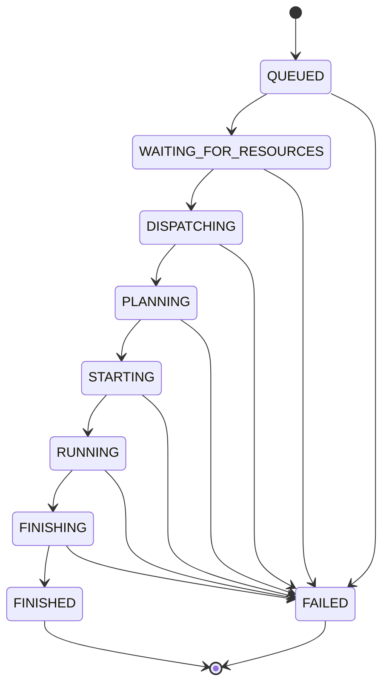
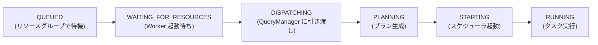

# 第11章 クエリライフサイクルと DispatchManager

> **本章で読むソース**
>
> - [`core/trino-main/src/main/java/io/trino/dispatcher/DispatchManager.java`](https://github.com/trinodb/trino/blob/482/core/trino-main/src/main/java/io/trino/dispatcher/DispatchManager.java)
> - [`core/trino-main/src/main/java/io/trino/dispatcher/LocalDispatchQueryFactory.java`](https://github.com/trinodb/trino/blob/482/core/trino-main/src/main/java/io/trino/dispatcher/LocalDispatchQueryFactory.java)
> - [`core/trino-main/src/main/java/io/trino/dispatcher/LocalDispatchQuery.java`](https://github.com/trinodb/trino/blob/482/core/trino-main/src/main/java/io/trino/dispatcher/LocalDispatchQuery.java)
> - [`core/trino-main/src/main/java/io/trino/execution/QueryManager.java`](https://github.com/trinodb/trino/blob/482/core/trino-main/src/main/java/io/trino/execution/QueryManager.java)
> - [`core/trino-main/src/main/java/io/trino/execution/SqlQueryExecution.java`](https://github.com/trinodb/trino/blob/482/core/trino-main/src/main/java/io/trino/execution/SqlQueryExecution.java)
> - [`core/trino-main/src/main/java/io/trino/execution/QueryStateMachine.java`](https://github.com/trinodb/trino/blob/482/core/trino-main/src/main/java/io/trino/execution/QueryStateMachine.java)
> - [`core/trino-main/src/main/java/io/trino/execution/QueryState.java`](https://github.com/trinodb/trino/blob/482/core/trino-main/src/main/java/io/trino/execution/QueryState.java)
> - [`core/trino-main/src/main/java/io/trino/execution/QueryTracker.java`](https://github.com/trinodb/trino/blob/482/core/trino-main/src/main/java/io/trino/execution/QueryTracker.java)
> - [`core/trino-main/src/main/java/io/trino/execution/QueryPreparer.java`](https://github.com/trinodb/trino/blob/482/core/trino-main/src/main/java/io/trino/execution/QueryPreparer.java)

## この章の狙い

クライアントが SQL を送信してから、分散実行エンジンが動き始めるまでの道筋を追う。
Trino の Coordinator は、クエリを受け取ったあと直ちにプランニングやスケジューリングへ進むのではなく、「受付」「リソース待ち」「ディスパッチ」「プランニング」「開始」「実行」「完了」と段階を踏む。
各段階は `QueryState` という列挙型で表現され、`QueryStateMachine` がその遷移を一元管理する。

本章では、`DispatchManager.createQuery()` をエントリポイントとして、クエリが `SqlQueryExecution.start()` に到達するまでの処理を読み解く。
あわせて、`QueryTracker` によるクエリのライフタイム管理と、段階的リソース確保による最適化の工夫を確認する。

## 前提

- Trino の Coordinator と Worker の役割分担（第2章）を理解していること。
- SQL パーサーと AST（第4章）、Analyzer（第5章）の概要を知っていること。
- 第10章までで扱った論理プランの生成と分散プラン生成の流れを前提とする。

## QueryState の全体像

**QueryState** は、クエリの現在のフェーズを表す列挙型である。
9つの状態が定義されており、`QUEUED` から始まって `FINISHED` または `FAILED` に到達する。

[`core/trino-main/src/main/java/io/trino/execution/QueryState.java` L22-L76](https://github.com/trinodb/trino/blob/482/core/trino-main/src/main/java/io/trino/execution/QueryState.java#L21-L76)

```java
public enum QueryState
{
    /**
     * Query has been accepted and is awaiting execution.
     */
    QUEUED(false),
    /**
     * Query is waiting for the required resources (beta).
     */
    WAITING_FOR_RESOURCES(false),
    /**
     * Query is being dispatched to a coordinator.
     */
    DISPATCHING(false),
    /**
     * Query is being planned.
     */
    PLANNING(false),
    /**
     * Query execution is being started.
     */
    STARTING(false),
    /**
     * Query has at least one running task.
     */
    RUNNING(false),
    /**
     * Query is finishing (e.g. commit for autocommit queries)
     */
    FINISHING(false),
    /**
     * Query has finished executing and all output has been consumed.
     */
    FINISHED(true),
    /**
     * Query execution failed.
     */
    FAILED(true);

    // ... (中略) ...
     */
    public boolean isDone()
    {
        return doneState;
    }
}
```

`FINISHED` と `FAILED` だけが終端状態（`isDone() == true`）である。
`FINISHING` は終端ではない点に注意が必要で、自動コミットのトランザクション完了やクライアントによる結果の消費を待つ状態を表す。

以下の Mermaid 図に、状態遷移の全体像を示す。



すべての非終端状態から `FAILED` への遷移が可能であり、タイムアウトやキャンセルなど、どの段階でも失敗できる設計になっている。

## QueryStateMachine による状態管理

**QueryStateMachine** は、`QueryState` の遷移を管理し、リスナーへの通知やタイミング計測を担うクラスである。
内部では汎用の `StateMachine<QueryState>` を保持し、状態遷移のたびに登録済みリスナーへ非同期で通知する。

[`core/trino-main/src/main/java/io/trino/execution/QueryStateMachine.java` L163](https://github.com/trinodb/trino/blob/482/core/trino-main/src/main/java/io/trino/execution/QueryStateMachine.java#L163)

```java
    private final StateMachine<QueryState> queryState;
```

初期状態は `QUEUED` であり、終端状態として `TERMINAL_QUERY_STATES`（`FINISHED` と `FAILED`）が渡される。

[`core/trino-main/src/main/java/io/trino/execution/QueryStateMachine.java` L242](https://github.com/trinodb/trino/blob/482/core/trino-main/src/main/java/io/trino/execution/QueryStateMachine.java#L242)

```java
        this.queryState = new StateMachine<>("query " + query, stateMachineExecutor, QUEUED, TERMINAL_QUERY_STATES);
```

### 前進のみ許す遷移ガード

各遷移メソッドは `setIf` を使い、現在の状態が遷移先より手前にあるときのみ状態を変更する。
このガードにより、状態は常に前進方向にだけ進む。

[`core/trino-main/src/main/java/io/trino/execution/QueryStateMachine.java` L1219-L1247](https://github.com/trinodb/trino/blob/482/core/trino-main/src/main/java/io/trino/execution/QueryStateMachine.java#L1219-L1247)

```java
    public boolean transitionToWaitingForResources()
    {
        queryStateTimer.beginWaitingForResources();
        return queryState.setIf(WAITING_FOR_RESOURCES, currentState -> currentState.ordinal() < WAITING_FOR_RESOURCES.ordinal());
    }

    public boolean transitionToDispatching()
    {
        queryStateTimer.beginDispatching();
        return queryState.setIf(DISPATCHING, currentState -> currentState.ordinal() < DISPATCHING.ordinal());
    }

    public boolean transitionToPlanning()
    {
        queryStateTimer.beginPlanning();
        return queryState.setIf(PLANNING, currentState -> currentState.ordinal() < PLANNING.ordinal());
    }

    public boolean transitionToStarting()
    {
        queryStateTimer.beginStarting();
        return queryState.setIf(STARTING, currentState -> currentState.ordinal() < STARTING.ordinal());
    }

    public boolean transitionToRunning()
    {
        queryStateTimer.beginRunning();
        return queryState.setIf(RUNNING, currentState -> currentState.ordinal() < RUNNING.ordinal());
    }
```

`setIf` は `StateMachine` が提供するメソッドで、述語が `true` を返したときだけ CAS（compare-and-set）方式で状態を書き換える。
遷移が成功した場合、登録済みのリスナーへ非同期で新しい状態が通知される。

[`core/trino-main/src/main/java/io/trino/execution/StateMachine.java` L150-L174](https://github.com/trinodb/trino/blob/482/core/trino-main/src/main/java/io/trino/execution/StateMachine.java#L150-L174)

```java
    public boolean setIf(T newState, Predicate<T> predicate)
    {
        // ... (中略) ...
        while (true) {
            // check if the current state passes the predicate
            T currentState = get();

            // change to same state is not a change, and does not notify the notify listeners
            if (currentState.equals(newState)) {
                return false;
            }

            // do not call predicate while holding the lock
            if (!predicate.test(currentState)) {
                return false;
            }

            // if state did not change while, checking the predicate, apply the new state
            if (compareAndSet(currentState, newState)) {
                return true;
            }
        }
    }
```

述語の評価はロックの外で行い、述語が通った後に `compareAndSet` で原子的に状態を更新する。
並行する遷移要求が競合した場合でもループで再試行するため、正確な一回だけの遷移を保証する。

### 失敗遷移とトランザクション処理

`transitionToFailed` は終端状態への遷移であり、どの状態からでも呼び出せる。
失敗原因（`failureCause`）を先にセットしてからリスナーに通知する点が特徴である。

[`core/trino-main/src/main/java/io/trino/execution/QueryStateMachine.java` L1323-L1341](https://github.com/trinodb/trino/blob/482/core/trino-main/src/main/java/io/trino/execution/QueryStateMachine.java#L1323-L320)

```java
    private boolean transitionToFailed(Throwable throwable, boolean log)
    {
        queryStateTimer.endQuery();

        // NOTE: The failure cause must be set before triggering the state change, so
        // listeners can observe the exception. This is safe because the failure cause
        // can only be observed if the transition to FAILED is successful.
        requireNonNull(throwable, "throwable is null");
        failureCause.compareAndSet(null, toFailure(throwable));

        cleanupQueryQuietly();

        QueryState oldState = queryState.trySet(FAILED);
        if (oldState.isDone()) {
            if (log) {
                QUERY_STATE_LOG.debug(throwable, "Failure after query %s finished", queryId);
            }
            return false;
        }
    // ... (中略) ...
            }
```

`failureCause.compareAndSet(null, ...)` により、最初に報告された失敗原因だけが記録される。
すでに終端状態に達している場合は `trySet` が旧状態を返すだけで何も起きないため、二重遷移を防いでいる。

失敗時にはトランザクションのアボートも行われる。
自動コミットのトランザクションであれば `asyncAbort` で非同期にアボートし、明示的トランザクションであれば `fail` でトランザクション全体を失敗状態にマークする。

### 完了遷移（FINISHING から FINISHED へ）

`FINISHING` から `FINISHED` への遷移は即座には起きない。
`transitionToFinishing` は、トランザクションのコミット完了とクライアントによる結果消費の両方を待ってから `FINISHED` に遷移する。

[`core/trino-main/src/main/java/io/trino/execution/QueryStateMachine.java` L1298-L1311](https://github.com/trinodb/trino/blob/482/core/trino-main/src/main/java/io/trino/execution/QueryStateMachine.java#L1298-L1311)

```java
    private void transitionToFinishedIfReady()
    {
        if (queryState.get().isDone()) {
            return;
        }

        if (!committed.get() || !consumed.get()) {
            return;
        }

        queryStateTimer.endQuery();

        queryState.setIf(FINISHED, currentState -> !currentState.isDone());
    }
```

`committed` フラグと `consumed` フラグの両方が `true` になったときにだけ、`FINISHED` への遷移が実行される。
この二段階の完了条件により、クライアントがまだ結果を読み終わっていないのにクエリが完了扱いになることを防いでいる。

## DispatchManager によるクエリ受付

**DispatchManager** は、クライアントから送られた SQL クエリを受け付ける入口である。
Session の構築、権限チェック、クエリの解析、リソースグループの選択、`DispatchQuery` の生成と登録を行う。

### createQuery メソッド

`createQuery` は `DispatchQueryCreationFuture` を返す。
この Future はキャンセルを無視する設計になっており、クエリの受付処理が途中で取り消されることを防ぐ。

[`core/trino-main/src/main/java/io/trino/dispatcher/DispatchManager.java` L175-L201](https://github.com/trinodb/trino/blob/482/core/trino-main/src/main/java/io/trino/dispatcher/DispatchManager.java#L175-L201)

```java
    public ListenableFuture<Void> createQuery(QueryId queryId, Span querySpan, Slug slug, SessionContext sessionContext, String query)
    {
    // ... (中略) ...
        DispatchQueryCreationFuture queryCreationFuture = new DispatchQueryCreationFuture();
        dispatchExecutor.execute(Context.current().wrap(() -> {
            Span span = tracer.spanBuilder("dispatch")
                    .addLink(Span.current().getSpanContext())
                    .setParent(Context.current().with(querySpan))
                    .startSpan();
            try (var _ = scopedSpan(span)) {
                createQueryInternal(queryId, querySpan, slug, sessionContext, query, resourceGroupManager);
            }
            finally {
                queryCreationFuture.set(null);
            }
        }));
        return queryCreationFuture;
    }
```

実際の受付処理は `dispatchExecutor` に委譲される。
このエグゼキュータは `BoundedExecutor` であり、同時に実行できるディスパッチ処理の数を制限することで、大量のクエリが同時に到着したときの過負荷を防ぐ。

[`core/trino-main/src/main/java/io/trino/dispatcher/DispatchManager.java` L128](https://github.com/trinodb/trino/blob/482/core/trino-main/src/main/java/io/trino/dispatcher/DispatchManager.java#L128)

```java
        this.dispatchExecutor = new BoundedExecutor(dispatchExecutor.getExecutor(), queryManagerConfig.getDispatcherQueryPoolSize());
```

### createQueryInternal の処理フロー

`createQueryInternal` は、受付処理の本体であり、以下の手順を実行する。

[`core/trino-main/src/main/java/io/trino/dispatcher/DispatchManager.java` L207-L285](https://github.com/trinodb/trino/blob/482/core/trino-main/src/main/java/io/trino/dispatcher/DispatchManager.java#L207-L285)

```java
    private <C> void createQueryInternal(QueryId queryId, Span querySpan, Slug slug, SessionContext sessionContext, String query, ResourceGroupManager<C> resourceGroupManager)
    {
        Session session = null;
        PreparedQuery preparedQuery = null;
        try {
            if (query.length() > maxQueryLength) {
            // ... (中略) ...
            }

            // decode session
            session = sessionSupplier.createSession(queryId, querySpan, sessionContext);

            // check query execute permissions
            accessControl.checkCanExecuteQuery(sessionContext.getIdentity(), queryId);

            // prepare query
            preparedQuery = queryPreparer.prepareQuery(session, query);

            // select resource group
        // ... (中略) ...

import com.google.common.util.concurrent.AbstractFuture;
import com.google.common.util.concurrent.Futures;
import com.google.common.util.concurrent.ListenableFuture;
import com.google.inject.Inject;
import io.airlift.concurrent.BoundedExecutor;
import io.airlift.log.Logger;
import io.opentelemetry.api.trace.Span;
import io.opentelemetry.api.trace.StatusCode;
import io.opentelemetry.api.trace.Tracer;
import io.opentelemetry.context.Context;
import io.trino.Session;
import io.trino.event.QueryMonitor;
import io.trino.execution.QueryIdGenerator;
import io.trino.execution.QueryInfo;
import io.trino.execution.QueryManagerConfig;
import io.trino.execution.QueryManagerStats;
import io.trino.execution.QueryPreparer;
import io.trino.execution.QueryPreparer.PreparedQuery;
import io.trino.execution.QueryTracker;
import io.trino.execution.resourcegroups.ResourceGroupManager;
        // ... (中略) ...
            DispatchQuery failedDispatchQuery = failedDispatchQueryFactory.createFailedDispatchQuery(session, query, preparedSql, Optional.empty(), throwable);
            queryCreated(failedDispatchQuery);
        // ... (中略) ...
        }
    }
```

処理の流れを順に追う。

1. クエリ文字列の長さを `maxQueryLength` と比較し、超過していれば `QUERY_TEXT_TOO_LARGE` エラーを投げる。
2. `SessionContext` から `Session` オブジェクトを構築する。
3. `AccessControl` でクエリ実行権限を検査する。
4. `QueryPreparer` でクエリを解析し、`PreparedQuery`（AST とパラメータ）を得る。
5. `ResourceGroupManager` でリソースグループを選択する。
6. `DispatchQueryFactory` で `DispatchQuery` を生成する。
7. `QueryTracker` にクエリを登録し、リソースグループにサブミットする。

`catch (Throwable)` ブロックは、上記のどの段階で例外が発生しても `FailedDispatchQuery` を生成してトラッカーに登録する。
Javadoc が "This method will never fail to register a query with the query tracker" と述べるとおり、受付処理は決してクエリの登録に失敗しない設計である。

## QueryPreparer によるクエリ解析

**QueryPreparer** は、SQL 文字列をパースして `PreparedQuery` に変換する。
`EXECUTE` 文の場合は、事前に `PREPARE` で保存されたクエリ本体を Session から取得して再パースする。

[`core/trino-main/src/main/java/io/trino/execution/QueryPreparer.java` L51-L89](https://github.com/trinodb/trino/blob/482/core/trino-main/src/main/java/io/trino/execution/QueryPreparer.java#L51-L90)

```java
    public PreparedQuery prepareQuery(Session session, String query)
            throws ParsingException, TrinoException
    {
        Statement wrappedStatement = sqlParser.createStatement(query);
        return prepareQuery(session, wrappedStatement);
    }

    public PreparedQuery prepareQuery(Session session, Statement wrappedStatement)
            throws ParsingException, TrinoException
    {
        Statement statement = wrappedStatement;
        Optional<String> prepareSql = Optional.empty();
        if (statement instanceof Execute executeStatement) {
            prepareSql = Optional.of(session.getPreparedStatementFromExecute(executeStatement));
            statement = sqlParser.createStatement(prepareSql.get());
        }
        else if (statement instanceof ExecuteImmediate executeImmediateStatement) {
            statement = sqlParser.createStatement(
                    executeImmediateStatement.getStatement().getValue(),
                    executeImmediateStatement.getStatement().getLocation().orElseThrow());
        }
    // ... (中略) ...

        return new PreparedQuery(statement, parameters, prepareSql);
    }
```

`PreparedQuery` は、解析済みの AST（`Statement`）、バインドパラメータ、元の `PREPARE` 文の SQL を保持する。
この構造により、後続の Analyzer やプランナーは `Statement` の種別に応じた処理を適用できる。

## LocalDispatchQueryFactory による DispatchQuery の生成

**LocalDispatchQueryFactory** は、`DispatchQuery` インタフェースの実装である `LocalDispatchQuery` を生成するファクトリである。
この時点で `QueryStateMachine` が作られ、クエリ実行オブジェクトの生成が非同期に開始される。

### QueryStateMachine の生成

`QueryStateMachine.begin()` でステートマシンが初期化される。
トランザクションの開始、Session プロパティの適用、OpenTelemetry の Span 設定などもこの時点で行われる。

[`core/trino-main/src/main/java/io/trino/dispatcher/LocalDispatchQueryFactory.java` L126-L145](https://github.com/trinodb/trino/blob/482/core/trino-main/src/main/java/io/trino/dispatcher/LocalDispatchQueryFactory.java#L126-L145)

```java
        QueryStateMachine stateMachine = QueryStateMachine.begin(
                existingTransactionId,
                query,
                preparedQuery.getPrepareSql(),
                session,
                locationFactory.createQueryLocation(session.getQueryId()),
                resourceGroup,
                isTransactionControlStatement(preparedQuery.getStatement()),
                transactionManager,
                accessControl,
                // limit the number of state change listener callback threads for each query
                new BoundedExecutor(executor, maxStateMachineThreadsPerQuery),
                metadata,
                warningCollector,
                planOptimizersStatsCollector,
                exchangeMetricsCollector,
                getQueryType(preparedQuery.getStatement()),
                externalExchangeEncryptionEnabled,
                Optional.of(sessionPropertyResolver.getSessionPropertiesApplier(preparedQuery)),
                version);
```

リスナーコールバック用のエグゼキュータに `BoundedExecutor` を使っている点が重要である。
`maxStateMachineThreadsPerQuery` で上限を設けることで、1つのクエリの状態変化通知がスレッドプールを占有する事態を防いでいる。

### QueryExecution の非同期生成

`QueryExecution` オブジェクト（通常は `SqlQueryExecution`）の生成は、非同期で行われる。
`executor.submit` でバックグラウンドのスレッドに委譲する理由は、`SqlQueryExecution` のコンストラクタ内で意味解析（`analyze`）が実行されるためである。

[`core/trino-main/src/main/java/io/trino/dispatcher/LocalDispatchQueryFactory.java` L156-L182](https://github.com/trinodb/trino/blob/482/core/trino-main/src/main/java/io/trino/dispatcher/LocalDispatchQueryFactory.java#L156-L190)

```java
        ListenableFuture<QueryExecution> queryExecutionFuture = executor.submit(() -> {
            QueryExecutionFactory<?> queryExecutionFactory = executionFactories.get(preparedQuery.getStatement().getClass());
            if (queryExecutionFactory == null) {
                throw new TrinoException(NOT_SUPPORTED, "Unsupported statement type: " + preparedQuery.getStatement().getClass().getSimpleName());
            }

            try {
                return queryExecutionFactory.createQueryExecution(preparedQuery, stateMachine, slug, warningCollector, planOptimizersStatsCollector);
            }
            catch (Throwable e) {
        // ... (中略) ...
                stateMachine.transitionToFailed(e);
                throw e;
            }
        });

        return new LocalDispatchQuery(
                stateMachine,
                queryExecutionFuture,
                queryMonitor,
                clusterSizeMonitor,
                executor,
                queryManager::createQuery);
```

`executionFactories` は `Statement` の型をキーとする `Map` であり、SQL の種類（SELECT、INSERT、DDL など）に応じて適切な `QueryExecutionFactory` を選択する。
通常の SQL クエリには `SqlQueryExecutionFactory` が使われる。

`queryMonitor.queryCreatedEvent` の呼び出しが `executor.submit` よりも前に置かれている点にも注意が必要である。
コメントが説明するとおり、クエリ作成イベントが意味解析の開始より後に配信されると、アクセス制御の監査 Plugin が正しく動作しない可能性があるためである。

## LocalDispatchQuery の段階的リソース確保

**LocalDispatchQuery** は、リソースグループからの起動要求を受けて、Worker の準備完了を待ち、`QueryManager` にクエリ実行を委譲するまでの橋渡し役である。

### QUEUED から WAITING_FOR_RESOURCES へ

リソースグループがクエリの実行を許可すると、`startWaitingForResources` が呼ばれる。

[`core/trino-main/src/main/java/io/trino/dispatcher/LocalDispatchQuery.java` L117-L121](https://github.com/trinodb/trino/blob/482/core/trino-main/src/main/java/io/trino/dispatcher/LocalDispatchQuery.java#L117-L121)

```java
    public void startWaitingForResources()
    {
        if (stateMachine.transitionToWaitingForResources()) {
            waitForMinimumWorkers();
        }
```

### Worker 数の待機

`waitForMinimumWorkers` は、`ClusterSizeMonitor` を使って、必要な数の Worker が起動するまで非同期に待機する。

[`core/trino-main/src/main/java/io/trino/dispatcher/LocalDispatchQuery.java` L125-L145](https://github.com/trinodb/trino/blob/482/core/trino-main/src/main/java/io/trino/dispatcher/LocalDispatchQuery.java#L125-L145)

```java
    {
        // wait for query execution to finish construction
        addSuccessCallback(queryExecutionFuture, queryExecution -> {
            Session session = stateMachine.getSession();
            int executionMinCount = 1; // always wait for 1 node to be up
            if (queryExecution.shouldWaitForMinWorkers()) {
                executionMinCount = getRequiredWorkers(session);
            }
            ListenableFuture<Void> minimumWorkerFuture = clusterSizeMonitor.waitForMinimumWorkers(executionMinCount, getRequiredWorkersMaxWait(session));
            // when worker requirement is met, start the execution
            addSuccessCallback(minimumWorkerFuture, () -> startExecution(queryExecution), queryExecutor);
            addExceptionCallback(minimumWorkerFuture, stateMachine::transitionToFailed, queryExecutor);

            // cancel minimumWorkerFuture if query fails for some reason or is cancelled by user
            stateMachine.addStateChangeListener(state -> {
                if (state.isDone()) {
                    minimumWorkerFuture.cancel(true);
                }
            });
        });
    }
```

最低1台の Worker の起動を常に待ち、Session プロパティで指定された `required_workers` の数まで待機する。
Worker 数の条件が満たされると `startExecution` が呼ばれる。

### DISPATCHING とクエリの引き渡し

`startExecution` は、状態を `DISPATCHING` に遷移させたうえで、`querySubmitter`（実体は `QueryManager::createQuery`）にクエリ実行オブジェクトを渡す。

[`core/trino-main/src/main/java/io/trino/dispatcher/LocalDispatchQuery.java` L147-L166](https://github.com/trinodb/trino/blob/482/core/trino-main/src/main/java/io/trino/dispatcher/LocalDispatchQuery.java#L147-L166)

```java
    private void startExecution(QueryExecution queryExecution)
    {
        if (stateMachine.transitionToDispatching()) {
            try {
                querySubmitter.accept(queryExecution);
                if (notificationSentOrGuaranteed.compareAndSet(false, true)) {
                    queryExecution.addFinalQueryInfoListener(queryMonitor::queryCompletedEvent);
                }
            }
            catch (Throwable t) {
                // this should never happen but be safe
                stateMachine.transitionToFailed(t);
                log.error(t, "query submitter threw exception");
                throw t;
            }
            finally {
                submitted.set(null);
            }
        }
    }
```

`submitted` フラグは `SettableFuture<Void>` であり、クエリがディスパッチされたことをクライアントに通知するために使われる。
`getDispatchedFuture()` を通じて、クライアント側はクエリが実行フェーズに移行したことを非同期に待機できる。

`notificationSentOrGuaranteed` は、完了イベントの重複通知を防ぐアトミックフラグである。
`FAILED` 状態のリスナー（コンストラクタで登録済み）と `addFinalQueryInfoListener` の両方が完了イベントを発火する可能性があるため、`compareAndSet` で排他制御している。

## QueryManager によるクエリ実行の開始

**QueryManager** は、ディスパッチされたクエリを受け取り、実行を開始するコンポーネントである。
`QueryTracker<QueryExecution>` で実行中クエリを管理し、リソース制限の定期的な検査を行う。

### createQuery による登録と開始

[`core/trino-main/src/main/java/io/trino/execution/QueryManager.java` L300-L320](https://github.com/trinodb/trino/blob/482/core/trino-main/src/main/java/io/trino/execution/QueryManager.java#L300-L320)

```java
    public void createQuery(QueryExecution queryExecution)
    {
        requireNonNull(queryExecution, "queryExecution is null");

        if (!queryTracker.addQuery(queryExecution)) {
            throw new TrinoException(GENERIC_INTERNAL_ERROR, format("Query %s already registered", queryExecution.getQueryId()));
        }

        queryExecution.addFinalQueryInfoListener(_ -> {
            // execution MUST be added to the expiration queue or there will be a leak
            queryTracker.expireQuery(queryExecution.getQueryId());
        });

        try (SetThreadName _ = new SetThreadName("Query-" + queryExecution.getQueryId())) {
            try (var ignoredStartScope = scopedSpan(tracer.spanBuilder("query-start")
                    .setParent(Context.current().with(queryExecution.getSession().getQuerySpan()))
                    .startSpan())) {
                queryExecution.start();
            }
        }
    }
```

このメソッドは3つのことを行う。

1. `QueryTracker` にクエリを登録する（`addQuery`）。重複登録は例外となる。
2. クエリ完了時に `expireQuery` を呼ぶリスナーを登録する。これにより、完了したクエリが有効期限キューに入る。
3. `queryExecution.start()` でクエリ実行を開始する。

`expireQuery` のリスナー登録は必須であり、コメントが "MUST be added to the expiration queue or there will be a leak" と強調するとおり、この登録がなければクエリ情報がメモリから解放されない。

### リソース制限の定期検査

`QueryManager` は、バックグラウンドのスケジュールタスクで4種類のリソース制限を1秒ごとに検査する。

[`core/trino-main/src/main/java/io/trino/execution/QueryManager.java` L112-L140](https://github.com/trinodb/trino/blob/482/core/trino-main/src/main/java/io/trino/execution/QueryManager.java#L112-L140)

```java
queryManagementExecutor.scheduleWithFixedDelay(() -> {
    try {
        enforceMemoryLimits();
    }
    catch (Throwable e) {
        log.error(e, "Error enforcing memory limits");
    }

    try {
        enforceCpuLimits();
    }
    // ... (中略) ...
}, 1, 1, TimeUnit.SECONDS);
```

- `enforceMemoryLimits`：`ClusterMemoryManager` と連携し、クラスタ全体のメモリ制限を超えたクエリを強制終了する。
- `enforceCpuLimits`：CPU 使用時間の上限を超えたクエリを強制終了する。
- `enforceScanLimits`：物理的な読み取りバイト数の上限を超えたクエリを強制終了する。
- `enforceWriteLimits`：物理的な書き込みバイト数の上限を超えたクエリを強制終了する。

各制限値は、サーバー設定と Session プロパティの小さい方が適用される。

## SqlQueryExecution の start メソッド

`SqlQueryExecution.start()` は、プランニングからスケジューラの起動までを一気に実行する。

[`core/trino-main/src/main/java/io/trino/execution/SqlQueryExecution.java` L396-L454](https://github.com/trinodb/trino/blob/482/core/trino-main/src/main/java/io/trino/execution/SqlQueryExecution.java#L396-L454)

```java
    @Override
    public void start()
    {
        try (SetThreadName _ = new SetThreadName("Query-" + stateMachine.getQueryId())) {
            try {
                if (!stateMachine.transitionToPlanning()) {
                    // query already started or finished
                    return;
                }

                AtomicReference<Thread> planningThread = new AtomicReference<>(currentThread());
                stateMachine.getStateChange(PLANNING).addListener(() -> {
                    if (stateMachine.getQueryState() == FAILED) {
                        synchronized (planningThread) {
                            Thread thread = planningThread.get();
                            if (thread != null) {
                                thread.interrupt();
                            }
                        }
                    }
                }, directExecutor());

                try {
                    CachingTableStatsProvider tableStatsProvider = new CachingTableStatsProvider(plannerContext.getMetadata(), getSession(), stateMachine::isDone);
                    PlanRoot plan = planQuery(tableStatsProvider);
                    // DynamicFilterService needs plan for query to be registered.
                    // Query should be registered before dynamic filter suppliers are requested in distribution planning.
                    registerDynamicFilteringQuery(plan);
                    planDistribution(plan, tableStatsProvider);
                }
                finally {
                    synchronized (planningThread) {
                        planningThread.set(null);
                        // Clear the interrupted flag in case there was a race condition where
                        // the planning thread was interrupted right after planning completes above
                        Thread.interrupted();
                    }
                }

                // ... (中略) ...

                if (!stateMachine.transitionToStarting()) {
                    // query already started or finished
                    return;
                }

                // if query is not finished, start the scheduler, otherwise cancel it
                QueryScheduler scheduler = queryScheduler.get();

                if (!stateMachine.isDone()) {
                    scheduler.start();
                }
            }
            catch (Throwable e) {
                fail(e);
                throwIfInstanceOf(e, Error.class);
            }
        }
    }
```

処理は以下の順で進む。

1. 状態を `PLANNING` に遷移させる。遷移に失敗した場合（すでに開始済みやキャンセル済み）は即座にリターンする。
2. プランニングスレッドをキャンセル可能にするため、`AtomicReference<Thread>` に現在のスレッドを保持し、`FAILED` への遷移時にスレッドを割り込む（interrupt）リスナーを登録する。
3. `planQuery` で論理プラン生成と Fragment 分割を行い、`planDistribution` で分散実行用スケジューラを構築する。
4. 状態を `STARTING` に遷移させる。
5. スケジューラを起動する（`scheduler.start()`）。

### planQuery の処理

`planQuery` は `LogicalPlanner` を使って論理プランを生成し、`PlanFragmenter` で Fragment に分割する。

[`core/trino-main/src/main/java/io/trino/execution/SqlQueryExecution.java` L489-L521](https://github.com/trinodb/trino/blob/482/core/trino-main/src/main/java/io/trino/execution/SqlQueryExecution.java#L489-L521)

```java
    private PlanRoot doPlanQuery(CachingTableStatsProvider tableStatsProvider)
    {
        // plan query
        PlanNodeIdAllocator idAllocator = new PlanNodeIdAllocator();
        LogicalPlanner logicalPlanner = new LogicalPlanner(
                stateMachine.getSession(),
                planOptimizers,
                idAllocator,
                plannerContext,
                statsCalculator,
                costCalculator,
                stateMachine.getWarningCollector(),
                planOptimizersStatsCollector,
                tableStatsProvider);
        Plan plan = logicalPlanner.plan(analysis);
        queryPlan.set(plan);

        // fragment the plan
        SubPlan fragmentedPlan;
        try (var _ = scopedSpan(tracer, "fragment-plan")) {
            fragmentedPlan = planFragmenter.createSubPlans(stateMachine.getSession(), plan, false, stateMachine.getWarningCollector());
        }

        // extract inputs
        try (var _ = scopedSpan(tracer, "extract-inputs")) {
            stateMachine.setInputs(new InputExtractor(plannerContext.getMetadata(), stateMachine.getSession()).extractInputs(fragmentedPlan));
        }

        stateMachine.setOutput(analysis.getTarget());

        boolean explainAnalyze = analysis.getStatement() instanceof ExplainAnalyze;
        return new PlanRoot(fragmentedPlan, !explainAnalyze);
    }
```

`analysis` フィールドはコンストラクタで生成済みである。
`SqlQueryExecution` のコンストラクタ内で `analyze` が呼ばれ、意味解析の結果がこの時点ですでに保持されている。

[`core/trino-main/src/main/java/io/trino/execution/SqlQueryExecution.java` L222](https://github.com/trinodb/trino/blob/482/core/trino-main/src/main/java/io/trino/execution/SqlQueryExecution.java#L222)

```java
            this.analysis = analyze(preparedQuery, stateMachine, warningCollector, planOptimizersStatsCollector, analyzerFactory);
```

### planDistribution によるスケジューラ構築

`planDistribution` は、リトライポリシーに応じて適切なスケジューラを選択し、`queryScheduler` にセットする。

[`core/trino-main/src/main/java/io/trino/execution/SqlQueryExecution.java` L536-L592](https://github.com/trinodb/trino/blob/482/core/trino-main/src/main/java/io/trino/execution/SqlQueryExecution.java#L536-L592)

```java
        RetryPolicy retryPolicy = getRetryPolicy(getSession());
        QueryScheduler scheduler = switch (retryPolicy) {
            case QUERY, NONE -> new PipelinedQueryScheduler(
                    // ... (中略) ...
                    coordinatorTaskManager);
            case TASK -> new EventDrivenFaultTolerantQueryScheduler(
                    // ... (中略) ...
                    plan.getRoot());
        };

        queryScheduler.set(scheduler);
```

`RetryPolicy` が `NONE` または `QUERY` の場合は `PipelinedQueryScheduler` が、`TASK` の場合は耐障害性の高い `EventDrivenFaultTolerantQueryScheduler` が使われる。
スケジューラの詳細は第12章で扱う。

## QueryTracker によるクエリ追跡

**QueryTracker** は、実行中と完了済みのクエリをまとめて管理するジェネリクスクラスである。
`DispatchManager` は `QueryTracker<DispatchQuery>` を、`QueryManager` は `QueryTracker<QueryExecution>` を持ち、同じ仕組みでクエリの追跡と破棄を行う。

### クエリの登録と有効期限管理

[`core/trino-main/src/main/java/io/trino/execution/QueryTracker.java` L164-L176](https://github.com/trinodb/trino/blob/482/core/trino-main/src/main/java/io/trino/execution/QueryTracker.java#L164-L176)

```java
    public boolean addQuery(T execution)
    {
        return queries.putIfAbsent(execution.getQueryId(), execution) == null;
    }

    /**
     * Query is finished and expiration should begin.
     */
    public void expireQuery(QueryId queryId)
    {
        tryGetQuery(queryId)
                .ifPresent(expirationQueue::add);
    }
```

`queries` は `ConcurrentHashMap<QueryId, T>` であり、`putIfAbsent` によるアトミックな登録で重複を防ぐ。
クエリが完了すると `expireQuery` で `expirationQueue`（FIFO キュー）に追加され、一定時間後に削除される。

### バックグラウンドの管理タスク

`QueryTracker` は1秒ごとのバックグラウンドタスクで4つの管理処理を実行する。

[`core/trino-main/src/main/java/io/trino/execution/QueryTracker.java` L81-L109](https://github.com/trinodb/trino/blob/482/core/trino-main/src/main/java/io/trino/execution/QueryTracker.java#L81-L109)

```java
        backgroundTask = queryManagementExecutor.scheduleWithFixedDelay(() -> {
            try {
                failAbandonedQueries();
            }
            // ... (中略) ...
            try {
                enforceTimeLimits();
            }
            // ... (中略) ...
            try {
                removeExpiredQueries();
            }
            // ... (中略) ...
            try {
                pruneExpiredQueries();
            }
            // ... (中略) ...
        }, 1, 1, TimeUnit.SECONDS);
```

- `failAbandonedQueries`：クライアントからのハートビートが `clientTimeout` を超えて途絶えたクエリを `ABANDONED_QUERY` エラーで強制終了する。
- `enforceTimeLimits`：`query.max-run-time`、`query.max-execution-time`、`query.max-planning-time` の各制限を検査し、超過したクエリを終了する。
- `removeExpiredQueries`：有効期限キュー内のクエリのうち、`minQueryExpireAge` を過ぎたものを `queries` マップから削除する。
- `pruneExpiredQueries`：`maxQueryHistory` を超えた古いクエリの `QueryInfo` から不要な詳細情報を刈り取り、メモリ使用量を削減する。

## 高速化の工夫：段階的リソース確保

Trino のクエリライフサイクルは、受付から実行開始までを複数のフェーズに分割し、各フェーズで必要な条件が揃ったときにだけ次に進む段階的リソース確保の設計を採用している。



この設計が性能に貢献する理由は3つある。

第一に、リソースグループの段階で同時実行数を制御するため、計算資源のコストが高いプランニングやスケジューリングは実行が許可されたクエリだけが行う。
大量のクエリが同時に到着しても、リソースグループのキューで待機するのは軽量な `DispatchQuery` オブジェクトだけであり、プランナーやスケジューラのスレッドを消費しない。

第二に、Worker の準備完了を `WAITING_FOR_RESOURCES` 段階で非同期に待つことで、クラスタの起動中やスケールアウト中にプランニングを行って計算資源を浪費することを避けている。
`ClusterSizeMonitor` が `ListenableFuture` で通知するため、待機中のスレッドは消費されない。

第三に、`SqlQueryExecution` の意味解析はコンストラクタ内で行い、プランニングは `start()` で行うという分離により、`DispatchQuery` の生成時点で構文エラーや権限エラーを早期に検出できる。
早期検出されたエラーはプランニングのスレッドやメモリを消費することなく、即座にクライアントへ返される。

## まとめ

本章では、クエリが Trino の Coordinator に到着してから実行が始まるまでのライフサイクルを追った。

- `QueryState` は9つの状態を持ち、`QUEUED` から始まって `FINISHED` または `FAILED` に到達する。すべての非終端状態から `FAILED` に遷移できる。
- `QueryStateMachine` は `StateMachine<QueryState>` を内部に持ち、`setIf` による CAS 方式の前進のみ許す遷移ガードで安全な並行処理を実現する。
- `DispatchManager` は、Session 構築、権限チェック、クエリ解析、リソースグループ選択、`DispatchQuery` 生成という受付処理を行い、失敗時にも必ずクエリをトラッカーに登録する。
- `LocalDispatchQuery` は、リソースグループからの起動、Worker 数待機、`QueryManager` への引き渡しを段階的に行う。
- `QueryManager.createQuery()` はクエリを登録し、`SqlQueryExecution.start()` を呼び出す。`start()` はプランニングからスケジューラ起動までを一気に実行する。
- `QueryTracker` は、ハートビート監視、時間制限の検査、有効期限切れクエリの削除と情報の刈り取りをバックグラウンドで行い、メモリリークを防ぐ。

## 関連する章

- [第2章 サーバーアーキテクチャ](../part00-overview/02-server-architecture.md)：Coordinator と Worker の役割分担
- [第5章 Analyzer と意味解析](../part01-parsing/05-analyzer.md)：`SqlQueryExecution` のコンストラクタ内で呼ばれる意味解析
- [第10章 分散プラン生成と Exchange](../part02-planning/10-distributed-plan.md)：`planQuery` で使われる Fragment 分割
- [第12章 Stage と Task のスケジューリング](12-stage-and-task-scheduling.md)：`scheduler.start()` 以降の分散スケジューリング
- [第23章 リソースグループとクエリキューイング](../part06-ops/23-resource-groups.md)：リソースグループによるクエリのキューイングと同時実行制御
