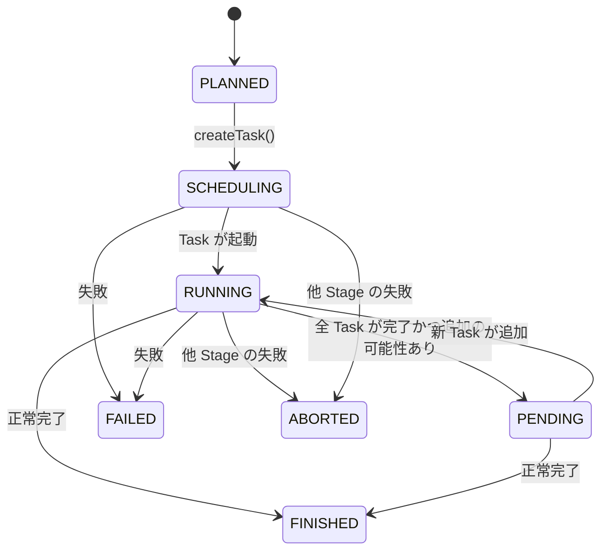
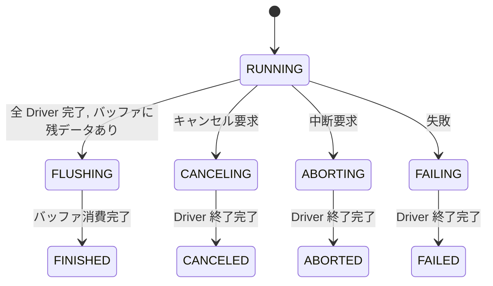
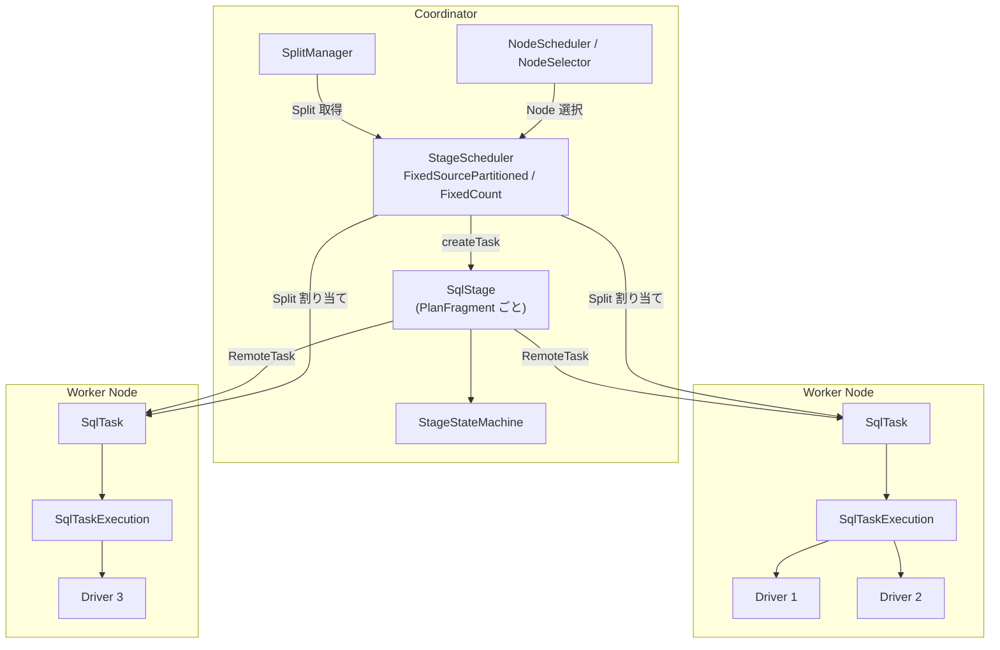

# 第12章 Stage と Task のスケジューリング

> **本章で読むソース**
>
> - [`core/trino-main/src/main/java/io/trino/execution/SqlStage.java`](https://github.com/trinodb/trino/blob/482/core/trino-main/src/main/java/io/trino/execution/SqlStage.java)
> - [`core/trino-main/src/main/java/io/trino/execution/StageStateMachine.java`](https://github.com/trinodb/trino/blob/482/core/trino-main/src/main/java/io/trino/execution/StageStateMachine.java)
> - [`core/trino-main/src/main/java/io/trino/execution/StageState.java`](https://github.com/trinodb/trino/blob/482/core/trino-main/src/main/java/io/trino/execution/StageState.java)
> - [`core/trino-main/src/main/java/io/trino/execution/SqlTask.java`](https://github.com/trinodb/trino/blob/482/core/trino-main/src/main/java/io/trino/execution/SqlTask.java)
> - [`core/trino-main/src/main/java/io/trino/execution/SqlTaskExecution.java`](https://github.com/trinodb/trino/blob/482/core/trino-main/src/main/java/io/trino/execution/SqlTaskExecution.java)
> - [`core/trino-main/src/main/java/io/trino/execution/TaskStateMachine.java`](https://github.com/trinodb/trino/blob/482/core/trino-main/src/main/java/io/trino/execution/TaskStateMachine.java)
> - [`core/trino-main/src/main/java/io/trino/execution/scheduler/NodeScheduler.java`](https://github.com/trinodb/trino/blob/482/core/trino-main/src/main/java/io/trino/execution/scheduler/NodeScheduler.java)
> - [`core/trino-main/src/main/java/io/trino/execution/scheduler/FixedSourcePartitionedScheduler.java`](https://github.com/trinodb/trino/blob/482/core/trino-main/src/main/java/io/trino/execution/scheduler/FixedSourcePartitionedScheduler.java)
> - [`core/trino-main/src/main/java/io/trino/execution/scheduler/FixedCountScheduler.java`](https://github.com/trinodb/trino/blob/482/core/trino-main/src/main/java/io/trino/execution/scheduler/FixedCountScheduler.java)
> - [`core/trino-main/src/main/java/io/trino/split/SplitManager.java`](https://github.com/trinodb/trino/blob/482/core/trino-main/src/main/java/io/trino/split/SplitManager.java)

## この章の狙い

第10章で見たとおり、分散プラン生成はクエリを複数の **PlanFragment** に分割する。
本章では、PlanFragment が実行される単位である `SqlStage` と、各 Worker 上で実際に処理を担う `SqlTask` / `SqlTaskExecution` を読む。
Coordinator がどのように Stage の状態を管理し、Split をどのアルゴリズムで Node に割り当て、Task を起動するのかを追う。

## 前提

- 第10章「分散プラン生成と Exchange」で PlanFragment と Exchange の概念を理解していること。
- 第11章「クエリライフサイクルと DispatchManager」で、クエリの起動から Stage の生成までの流れを把握していること。

## 12.1 SqlStage の構造

`SqlStage` は、一つの PlanFragment を実行するための Coordinator 側のコンテナである。
クラスの Javadoc にその性格が明記されている。

[`core/trino-main/src/main/java/io/trino/execution/SqlStage.java` L61-L69](https://github.com/trinodb/trino/blob/482/core/trino-main/src/main/java/io/trino/execution/SqlStage.java#L61-L69)

```java
/**
 * This class is merely a container used by coordinator to track tasks for a single stage.
 * <p>
 * It is designed to keep track of execution statistics for tasks from the same stage as well
 * as aggregating them and providing a final stage info when the stage execution is completed.
 * <p>
 * This class doesn't imply anything about the nature of execution. It is not responsible
 * for scheduling tasks in a certain order, gang scheduling or any other execution primitives.
 */
```

`SqlStage` はスケジューリングの判断を行わない。
Split の割り当てや Task の起動順序は、後述する `StageScheduler` の実装に委ねられている。
`SqlStage` の責務は、Task の生成、状態の集約、メモリ使用量の追跡に限定されている。

主要なフィールドは以下のとおりである。

[`core/trino-main/src/main/java/io/trino/execution/SqlStage.java` L73-L89](https://github.com/trinodb/trino/blob/482/core/trino-main/src/main/java/io/trino/execution/SqlStage.java#L73-L89)

```java
private final Session session;
private final StageStateMachine stateMachine;
private final Supplier<Map<PlanNodeId, ConnectorTableCredentials>> tableCredentialsProvider;
private final RemoteTaskFactory remoteTaskFactory;
private final NodeTaskMap nodeTaskMap;
private final boolean summarizeTaskInfo;

private final Set<DynamicFilterId> outboundDynamicFilterIds;
private final LocalExchangeBucketCountProvider bucketCountProvider;

private final Map<TaskId, RemoteTask> tasks = new ConcurrentHashMap<>();
@GuardedBy("this")
private final Set<TaskId> allTasks = new HashSet<>();
@GuardedBy("this")
private final Set<TaskId> finishedTasks = new HashSet<>();
@GuardedBy("this")
private final Set<TaskId> tasksWithFinalInfo = new HashSet<>();
```

`tasks` は現在この Stage に属する全 Task を `TaskId` で引くマップである。
`allTasks`、`finishedTasks`、`tasksWithFinalInfo` の3つの `Set` が段階的に埋まることで、Stage 全体の完了を検知する。

### Task の生成

`createTask` メソッドが、指定された Node 上に RemoteTask を1つ生成する。

[`core/trino-main/src/main/java/io/trino/execution/SqlStage.java` L271-L325](https://github.com/trinodb/trino/blob/482/core/trino-main/src/main/java/io/trino/execution/SqlStage.java#L271-L325)

```java
public synchronized Optional<RemoteTask> createTask(
        InternalNode node,
        int partition,
        int attempt,
        Optional<int[]> bucketToPartition,
        OptionalInt skewedBucketCount,
        OutputBuffers outputBuffers,
        Multimap<PlanNodeId, Split> splits,
        Set<PlanNodeId> noMoreSplits,
        Optional<DataSize> estimatedMemory,
        boolean speculative)
{
    if (stateMachine.getState().isDone()) {
        return Optional.empty();
    }
    TaskId taskId = new TaskId(stateMachine.getStageId(), partition, attempt);
    // ... (中略) ...

    stateMachine.transitionToScheduling();

    // set partitioning information on coordinator side
    PlanFragment fragment = stateMachine.getFragment();
    fragment = fragment.withOutputPartitioning(bucketToPartition, skewedBucketCount);
    // ... (中略) ...

    RemoteTask task = remoteTaskFactory.createRemoteTask(
            session,
            stateMachine.getStageSpan(),
            taskId,
            node,
            speculative,
            fragment,
            tableCredentialsProvider.get(),
            splits,
            outputBuffers,
            nodeTaskMap.createPartitionedSplitCountTracker(node, taskId),
            outboundDynamicFilterIds,
            estimatedMemory,
            summarizeTaskInfo);

    // ... (中略) ...
    tasks.put(taskId, task);
    allTasks.add(taskId);
    nodeTaskMap.addTask(node, task);

    task.addStateChangeListener(this::updateTaskStatus);
    task.addStateChangeListener(new MemoryUsageListener());
    task.addFinalTaskInfoListener(this::updateFinalTaskInfo);

    return Optional.of(task);
}
```

呼び出しのたびに `stateMachine.transitionToScheduling()` で Stage の状態を SCHEDULING に遷移させる。
`remoteTaskFactory.createRemoteTask` が実際の HTTP リクエストを Worker に送り、リモート側に Task を作成する。
生成された Task には3種類のリスナーが登録される。状態変更リスナー、メモリ使用量リスナー、最終情報リスナーである。

## 12.2 StageState の状態遷移

Stage の状態は `StageState` 列挙型で定義されている。

[`core/trino-main/src/main/java/io/trino/execution/StageState.java` L22-L56](https://github.com/trinodb/trino/blob/482/core/trino-main/src/main/java/io/trino/execution/StageState.java#L22-L56)

```java
public enum StageState
{
    PLANNED(false, false),
    SCHEDULING(false, false),
    RUNNING(false, false),
    PENDING(false, false),
    FINISHED(true, false),
    ABORTED(true, true),
    FAILED(true, true);

    public static final Set<StageState> TERMINAL_STAGE_STATES =
        Stream.of(StageState.values()).filter(StageState::isDone).collect(toImmutableSet());
    // ... (中略) ...
}
```

正常系の遷移は PLANNED から SCHEDULING、RUNNING を経て FINISHED に至る。
PENDING は「既存の Task がすべて完了したが、今後さらに Task が追加される可能性がある」状態を表す。



`StageStateMachine` がこの遷移を管理する。
遷移メソッドは `compareAndSet` や `setIf` を使い、不正な状態変更を防いでいる。

[`core/trino-main/src/main/java/io/trino/execution/StageStateMachine.java` L168-L207](https://github.com/trinodb/trino/blob/482/core/trino-main/src/main/java/io/trino/execution/StageStateMachine.java#L168-L207)

```java
public boolean transitionToScheduling()
{
    return stageState.compareAndSet(PLANNED, SCHEDULING);
}

public boolean transitionToRunning()
{
    schedulingComplete.compareAndSet(null, Instant.now());
    return stageState.setIf(RUNNING, currentState -> currentState != RUNNING && !currentState.isDone());
}

public boolean transitionToPending()
{
    return stageState.setIf(PENDING, currentState -> currentState != PENDING && !currentState.isDone());
}

public boolean transitionToFinished()
{
    return stageState.setIf(FINISHED, currentState -> !currentState.isDone());
}
// ... (中略) ...
public boolean transitionToFailed(Throwable throwable)
{
    requireNonNull(throwable, "throwable is null");
    failureCause.compareAndSet(null, Failures.toFailure(throwable));
    boolean failed = stageState.setIf(FAILED, currentState -> !currentState.isDone());
    // ... (中略) ...
    return failed;
}
```

`transitionToScheduling` だけが `compareAndSet(PLANNED, SCHEDULING)` で前状態を厳密に限定している。
PLANNED 以外からは SCHEDULING に遷移できないため、`createTask` が最初に呼ばれた時点で一度だけ発火する。
一方、`transitionToRunning` は「完了済みでなければ RUNNING にする」という緩い条件で、SCHEDULING からも PENDING からも遷移できる。

### Task の状態変更と Stage の遷移

`SqlStage.updateTaskStatus` が、個々の Task の状態変更を Stage 全体の状態に反映する。

[`core/trino-main/src/main/java/io/trino/execution/SqlStage.java` L332-L349](https://github.com/trinodb/trino/blob/482/core/trino-main/src/main/java/io/trino/execution/SqlStage.java#L332-L349)

```java
private void updateTaskStatus(TaskStatus status)
{
    boolean isDone = status.state().isDone();
    if (!isDone && stateMachine.getState() == StageState.RUNNING) {
        return;
    }
    synchronized (this) {
        if (isDone) {
            finishedTasks.add(status.taskId());
        }
        if (finishedTasks.size() == allTasks.size()) {
            stateMachine.transitionToPending();
        }
        else {
            stateMachine.transitionToRunning();
        }
    }
}
```

全 Task が完了すると PENDING に遷移し、まだ動いている Task があれば RUNNING を維持する。
Stage がすでに RUNNING なら、完了していない Task の通知は早期リターンでスキップされる。
これにより、高頻度のハートビートによる不要なロック競合を回避している。

## 12.3 SplitManager による Split の取得

Coordinator がテーブルを読む Stage をスケジューリングするには、まずデータソースから Split を取得する必要がある。
`SplitManager` がその責務を担う。

[`core/trino-main/src/main/java/io/trino/split/SplitManager.java` L69-L111](https://github.com/trinodb/trino/blob/482/core/trino-main/src/main/java/io/trino/split/SplitManager.java#L69-L111)

```java
public SplitSource getSplits(
        Session session,
        Span parentSpan,
        TableHandle table,
        DynamicFilter dynamicFilter,
        Constraint constraint)
{
    CatalogHandle catalogHandle = table.catalogHandle();
    ConnectorSplitManager splitManager = splitManagerProvider.getService(catalogHandle);
    if (!isAllowPushdownIntoConnectors(session)) {
        dynamicFilter = DynamicFilter.EMPTY;
    }

    ConnectorSession connectorSession = session.toConnectorSession(catalogHandle);

    ConnectorSplitSource source;
    try (var ignore = scopedSpan(tracer.spanBuilder("SplitManager.getSplits")
            // ... (中略) ...
            .startSpan())) {
        source = splitManager.getSplits(
                table.transaction(),
                connectorSession,
                table.connectorHandle(),
                dynamicFilter.getColumnsCovered(),
                constraint);
    }

    SplitSource splitSource = new ConnectorAwareSplitSource(catalogHandle, source, dynamicFilter);

    // ... (中略) ...
    if (minScheduleSplitBatchSize > 1) {
        splitSource = new TracingSplitSource(splitSource, tracer, Optional.empty(), "split-batch");
        splitSource = new BufferingSplitSource(splitSource, executor, minScheduleSplitBatchSize);
        splitSource = new TracingSplitSource(splitSource, tracer, Optional.of(span), "split-buffer");
    }
    else {
        splitSource = new TracingSplitSource(splitSource, tracer, Optional.of(span), "split-batch");
    }

    return splitSource;
}
```

処理の流れは次のとおりである。

1. `CatalogHandle` から対応する Connector の `ConnectorSplitManager` を取得する。
2. Connector に `getSplits` を呼び出し、`ConnectorSplitSource`（Split のストリーム）を得る。
3. `ConnectorAwareSplitSource` でラッパーを被せ、Catalog 情報と DynamicFilter を紐付ける。
4. `minScheduleSplitBatchSize` が2以上の場合、`BufferingSplitSource` で先読みバッファリングを挟む。

`BufferingSplitSource` は、Connector からの Split 取得を非同期にバッチ化し、スケジューラがブロックする時間を短縮する。

## 12.4 NodeScheduler と Split の割り当て

`NodeScheduler` は、Split をどの Worker Node に割り当てるかを決定するコンポーネントである。
実際の割り当てロジックは `NodeSelector` インタフェースの実装に委譲される。

[`core/trino-main/src/main/java/io/trino/execution/scheduler/NodeScheduler.java` L51-L64](https://github.com/trinodb/trino/blob/482/core/trino-main/src/main/java/io/trino/execution/scheduler/NodeScheduler.java#L51-L64)

```java
public class NodeScheduler
{
    private final NodeSelectorFactory nodeSelectorFactory;

    @Inject
    public NodeScheduler(NodeSelectorFactory nodeSelectorFactory)
    {
        this.nodeSelectorFactory = requireNonNull(nodeSelectorFactory, "nodeSelectorFactory is null");
    }

    public NodeSelector createNodeSelector(Session session)
    {
        return nodeSelectorFactory.createNodeSelector(requireNonNull(session, "session is null"));
    }
    // ... (中略) ...
}
```

`NodeSelector` インタフェースは2種類の `computeAssignments` を持つ。

[`core/trino-main/src/main/java/io/trino/execution/scheduler/NodeSelector.java` L24-L58](https://github.com/trinodb/trino/blob/482/core/trino-main/src/main/java/io/trino/execution/scheduler/NodeSelector.java#L24-L58)

```java
public interface NodeSelector
{
    void lockDownNodes();

    List<InternalNode> allNodes();

    InternalNode selectCurrentNode();

    List<InternalNode> selectRandomNodes(int limit, Set<InternalNode> excludedNodes);

    SplitPlacementResult computeAssignments(Set<Split> splits, List<RemoteTask> existingTasks);

    SplitPlacementResult computeAssignments(Set<Split> splits, List<RemoteTask> existingTasks, BucketNodeMap bucketNodeMap);
}
```

第1の `computeAssignments` はソーススキャン用で、Split のアドレス情報からデータローカリティを考慮して Node を選ぶ。
第2の `computeAssignments` はバケット分散用で、`BucketNodeMap` による事前計算済みの割り当てに従う。

### UniformNodeSelector の割り当てアルゴリズム

デフォルト実装の `UniformNodeSelector` を見る。

[`core/trino-main/src/main/java/io/trino/execution/scheduler/UniformNodeSelector.java` L158-L253](https://github.com/trinodb/trino/blob/482/core/trino-main/src/main/java/io/trino/execution/scheduler/UniformNodeSelector.java#L158-L253)

```java
@Override
public SplitPlacementResult computeAssignments(Set<Split> splits, List<RemoteTask> existingTasks)
{
    Multimap<InternalNode, Split> assignment = LinkedHashMultimap.create();
    NodeMap nodeMap = this.nodeMap.get().get();
    NodeAssignmentStats assignmentStats = new NodeAssignmentStats(nodeTaskMap, nodeMap, existingTasks);
    // ... (中略) ...

    for (Split split : splits) {
        randomCandidates.reset();

        List<InternalNode> candidateNodes;
        boolean exactNodes;
        if (!split.isRemotelyAccessible()) {
            candidateNodes = selectExactNodes(nodeMap, split.getAddresses(), includeCoordinator);
            exactNodes = true;
        }
        else {
            List<HostAddress> preferredAddresses = split.getConnectorSplit().getAffinityKey()
                    .map(consistentHashingAddressProvider::getHosts)
                    .orElseGet(split::getAddresses);
            if (optimizedLocalScheduling && !preferredAddresses.isEmpty()) {
                candidateNodes = selectExactNodes(nodeMap, preferredAddresses, includeCoordinator);
                if (candidateNodes.isEmpty()) {
                    candidateNodes = selectNodes(minCandidates, randomCandidates);
                    exactNodes = false;
                }
                else {
                    exactNodes = true;
                }
            }
            else {
                candidateNodes = selectNodes(minCandidates, randomCandidates);
                exactNodes = false;
            }
        }
        // ... (中略) ...
        InternalNode chosenNode = chooseNodeForSplit(assignmentStats, candidateNodes);
        // ... (中略) ...
    }

    // ... (中略) ...
    return new SplitPlacementResult(blocked, assignment);
}
```

各 Split に対する Node 選択は次の優先順位で行われる。

1. Split がリモートアクセス不可（`isRemotelyAccessible() == false`）なら、Split のアドレスと一致する Node のみを候補とする。
2. `optimizedLocalScheduling` が有効で、Split にアドレス情報やアフィニティキーがある場合、その Node を優先候補にする。候補がなければランダム選択にフォールバックする。
3. 上記に該当しない場合、`minCandidates` 個の Node をランダムに選ぶ。

候補 Node の中から最終的に1つを選ぶのが `chooseNodeForSplit` である。

[`core/trino-main/src/main/java/io/trino/execution/scheduler/UniformNodeSelector.java` L263-L292](https://github.com/trinodb/trino/blob/482/core/trino-main/src/main/java/io/trino/execution/scheduler/UniformNodeSelector.java#L263-L292)

```java
private InternalNode chooseNodeForSplit(NodeAssignmentStats assignmentStats, List<InternalNode> candidateNodes)
{
    InternalNode chosenNode = null;
    long minWeight = Long.MAX_VALUE;

    List<InternalNode> freeNodes = getFreeNodesForStage(assignmentStats, candidateNodes);
    switch (splitsBalancingPolicy) {
        case STAGE -> {
            for (InternalNode node : freeNodes) {
                long queuedWeight = assignmentStats.getQueuedSplitsWeightForStage(node);
                if (queuedWeight <= minWeight) {
                    chosenNode = node;
                    minWeight = queuedWeight;
                }
            }
        }
        case NODE -> {
            for (InternalNode node : freeNodes) {
                long totalSplitsWeight = assignmentStats.getTotalSplitsWeight(node);
                if (totalSplitsWeight <= minWeight) {
                    chosenNode = node;
                    minWeight = totalSplitsWeight;
                }
            }
        }
        // ... (中略) ...
    }

    return chosenNode;
}
```

`splitsBalancingPolicy` が `STAGE` の場合は、対象 Stage 内でのキューイング重みが最小の Node を選ぶ。
`NODE` の場合は、Node 全体（全 Stage 合算）の Split 重みが最小の Node を選ぶ。
どちらの方針でも、負荷が偏らないように最小負荷の Node に割り当てる Least-Loaded 戦略を採る。

### バックプレッシャー機構

Node のキューがいっぱいの場合、`NodeScheduler` は割り当てをスキップし、バックプレッシャーを掛ける。

[`core/trino-main/src/main/java/io/trino/execution/scheduler/NodeScheduler.java` L153-L184](https://github.com/trinodb/trino/blob/482/core/trino-main/src/main/java/io/trino/execution/scheduler/NodeScheduler.java#L153-L184)

```java
public static SplitPlacementResult selectDistributionNodes(
        NodeMap nodeMap,
        NodeTaskMap nodeTaskMap,
        long maxSplitsWeightPerNode,
        long minPendingSplitsWeightPerTask,
        int maxUnacknowledgedSplitsPerTask,
        Set<Split> splits,
        List<RemoteTask> existingTasks,
        BucketNodeMap bucketNodeMap)
{
    Multimap<InternalNode, Split> assignments = LinkedHashMultimap.create();
    NodeAssignmentStats assignmentStats = new NodeAssignmentStats(nodeTaskMap, nodeMap, existingTasks);

    Set<InternalNode> blockedNodes = new HashSet<>();
    for (Split split : splits) {
        InternalNode node = bucketNodeMap.getAssignedNode(split);
        SplitWeight splitWeight = split.getSplitWeight();

        if (canAssignSplitToDistributionNode(assignmentStats, node, maxSplitsWeightPerNode,
                minPendingSplitsWeightPerTask, maxUnacknowledgedSplitsPerTask, splitWeight)) {
            assignments.put(node, split);
            assignmentStats.addAssignedSplit(node, splitWeight);
        }
        else {
            blockedNodes.add(node);
        }
    }

    ListenableFuture<Void> blocked = toWhenHasSplitQueueSpaceFuture(blockedNodes, existingTasks,
            calculateLowWatermark(minPendingSplitsWeightPerTask));
    return new SplitPlacementResult(blocked, ImmutableMultimap.copyOf(assignments));
}
```

割り当てできなかった Node は `blockedNodes` に入り、`toWhenHasSplitQueueSpaceFuture` が「いずれかの Node のキューに空きができたら完了する `Future`」を返す。
スケジューラはこの Future を待ってから次のバッチを割り当てることで、Worker にメモリ圧迫を掛けすぎない。

## 12.5 StageScheduler の2つの実装

`StageScheduler` インタフェースは、Stage に対する Task のスケジューリング戦略を定義する。

[`core/trino-main/src/main/java/io/trino/execution/scheduler/StageScheduler.java` L17-L43](https://github.com/trinodb/trino/blob/482/core/trino-main/src/main/java/io/trino/execution/scheduler/StageScheduler.java#L17-L43)

```java
public interface StageScheduler
        extends Closeable
{
    default void start() {}

    ScheduleResult schedule();

    @Override
    default void close() {}
}
```

`schedule()` が呼ばれるたびにブロックせずにできる範囲の作業を行い、`ScheduleResult` を返す。
結果には「新しく作成した Task」「ブロック理由」「スケジュールした Split 数」が含まれ、クエリスケジューラが次の呼び出しタイミングを判断する材料になる。

### FixedSourcePartitionedScheduler

テーブルスキャンのような Split ソースを持つ Stage に使われるスケジューラである。

[`core/trino-main/src/main/java/io/trino/execution/scheduler/FixedSourcePartitionedScheduler.java` L45-L104](https://github.com/trinodb/trino/blob/482/core/trino-main/src/main/java/io/trino/execution/scheduler/FixedSourcePartitionedScheduler.java#L45-L104)

```java
public class FixedSourcePartitionedScheduler
        implements StageScheduler
{
    // ... (中略) ...
    private final StageExecution stageExecution;
    private final List<InternalNode> nodes;
    private final Queue<SourceScheduler> sourceSchedulers;

    private final PartitionIdAllocator partitionIdAllocator;
    private final Map<InternalNode, RemoteTask> scheduledTasks;

    public FixedSourcePartitionedScheduler(
            StageExecution stageExecution,
            Map<PlanNodeId, SplitSource> splitSources,
            List<PlanNodeId> schedulingOrder,
            List<InternalNode> nodes,
            BucketNodeMap bucketNodeMap,
            int splitBatchSize,
            NodeSelector nodeSelector,
            DynamicFilterService dynamicFilterService,
            TableExecuteContextManager tableExecuteContextManager)
    {
        // ... (中略) ...
        this.stageExecution = stageExecution;
        this.nodes = ImmutableList.copyOf(nodes);

        BucketedSplitPlacementPolicy splitPlacementPolicy =
            new BucketedSplitPlacementPolicy(nodeSelector, nodes, bucketNodeMap, stageExecution::getAllTasks);

        ArrayList<SourceScheduler> sourceSchedulers = new ArrayList<>();
        partitionIdAllocator = new PartitionIdAllocator();
        scheduledTasks = new HashMap<>();
        for (PlanNodeId planNodeId : schedulingOrder) {
            SplitSource splitSource = splitSources.get(planNodeId);
            SourceScheduler sourceScheduler = newSourcePartitionedSchedulerAsSourceScheduler(
                    stageExecution,
                    planNodeId,
                    splitSource,
                    splitPlacementPolicy,
                    splitBatchSize,
                    dynamicFilterService,
                    tableExecuteContextManager,
                    () -> true,
                    partitionIdAllocator,
                    scheduledTasks);
            sourceSchedulers.add(sourceScheduler);
        }
        this.sourceSchedulers = new ArrayDeque<>(sourceSchedulers);
    }
    // ... (中略) ...
}
```

構築時に `schedulingOrder` に従って複数の `SourceScheduler` を順に作成する。
`schedule()` が呼ばれると、最初の呼び出しで全 Node に空の Task を1つずつ配置し、その後は `SourceScheduler` のキューから Split を順に割り当てる。

[`core/trino-main/src/main/java/io/trino/execution/scheduler/FixedSourcePartitionedScheduler.java` L107-L153](https://github.com/trinodb/trino/blob/482/core/trino-main/src/main/java/io/trino/execution/scheduler/FixedSourcePartitionedScheduler.java#L107-L153)

```java
@Override
public ScheduleResult schedule()
{
    // schedule a task on every node in the distribution
    List<RemoteTask> newTasks = ImmutableList.of();
    if (scheduledTasks.isEmpty()) {
        ImmutableList.Builder<RemoteTask> newTasksBuilder = ImmutableList.builder();
        for (InternalNode node : nodes) {
            Optional<RemoteTask> task = stageExecution.scheduleTask(node, partitionIdAllocator.getNextId(),
                    ImmutableMultimap.of());
            if (task.isPresent()) {
                scheduledTasks.put(node, task.get());
                newTasksBuilder.add(task.get());
            }
        }
        newTasks = newTasksBuilder.build();
    }

    ListenableFuture<Void> blocked = immediateFuture(null);
    ScheduleResult.BlockedReason blockedReason = null;
    int splitsScheduled = 0;
    while (!sourceSchedulers.isEmpty()) {
        SourceScheduler scheduler = sourceSchedulers.peek();
        ScheduleResult schedule = scheduler.schedule();
        splitsScheduled += schedule.getSplitsScheduled();
        blocked = schedule.getBlocked();
        // ... (中略) ...
        if (!blocked.isDone() || !schedule.isFinished()) {
            break;
        }
        stageExecution.schedulingComplete(scheduler.getPlanNodeId());
        sourceSchedulers.remove().close();
    }
    // ... (中略) ...
}
```

最初に全 Node に Task を配置するのは、Split が到着する前にパイプラインを確立するためである。
SourceScheduler が1つ終わると次の SourceScheduler に進み、全 SourceScheduler が完了すれば Stage のスケジューリングが完了する。

### FixedCountScheduler

Exchange の受け側など、Split ソースを持たない Stage に使われるスケジューラである。

[`core/trino-main/src/main/java/io/trino/execution/scheduler/FixedCountScheduler.java` L28-L64](https://github.com/trinodb/trino/blob/482/core/trino-main/src/main/java/io/trino/execution/scheduler/FixedCountScheduler.java#L28-L64)

```java
public class FixedCountScheduler
        implements StageScheduler
{
    public interface TaskScheduler
    {
        Optional<RemoteTask> scheduleTask(InternalNode node, int partition);
    }

    private final TaskScheduler taskScheduler;
    private final List<InternalNode> partitionToNode;

    public FixedCountScheduler(StageExecution stageExecution, List<InternalNode> partitionToNode)
    {
        requireNonNull(stageExecution, "stage is null");
        this.taskScheduler = (node, partition) -> stageExecution.scheduleTask(node, partition, ImmutableMultimap.of());
        this.partitionToNode = requireNonNull(partitionToNode, "partitionToNode is null");
    }
    // ... (中略) ...

    @Override
    public ScheduleResult schedule()
    {
        List<RemoteTask> newTasks = IntStream.range(0, partitionToNode.size())
                .mapToObj(partition -> taskScheduler.scheduleTask(partitionToNode.get(partition), partition))
                .filter(Optional::isPresent)
                .map(Optional::get)
                .collect(toImmutableList());

        return new ScheduleResult(true, newTasks, 0);
    }
}
```

`schedule()` の呼び出しで `partitionToNode` リストに基づいて全 Task を一括生成する。
Split の割り当ては行わず、`ScheduleResult` の `isFinished` は常に `true` である。
リストの各要素が「パーティション番号 -> Node」の対応を定義しており、ハッシュ分散の並列度をそのまま Task 数に対応させる。

## 12.6 SqlTask と SqlTaskExecution

ここまでの `SqlStage` やスケジューラは Coordinator 側の話である。
Worker 側では、Coordinator からの要求を受けて `SqlTask` が生成され、実際の計算を `SqlTaskExecution` が行う。

### SqlTask の構造

`SqlTask` は Worker 上に存在する Task の状態管理を行うオブジェクトである。

[`core/trino-main/src/main/java/io/trino/execution/SqlTask.java` L87-L124](https://github.com/trinodb/trino/blob/482/core/trino-main/src/main/java/io/trino/execution/SqlTask.java#L87-L124)

```java
public class SqlTask
{
    // ... (中略) ...
    private final TaskId taskId;
    private final long taskInstanceId;
    private final URI location;
    private final String nodeId;
    private final AtomicBoolean speculative = new AtomicBoolean(false);
    private final TaskStateMachine taskStateMachine;
    private final OutputBuffer outputBuffer;
    private final QueryContext queryContext;
    private final Tracer tracer;

    private final SqlTaskExecutionFactory sqlTaskExecutionFactory;
    private final Executor taskNotificationExecutor;

    private final AtomicReference<Instant> lastHeartbeat = new AtomicReference<>(Instant.now());
    private final AtomicLong taskStatusVersion = new AtomicLong(TaskStatus.STARTING_VERSION);
    // ... (中略) ...
    @GuardedBy("taskHolderLock")
    private final AtomicReference<TaskHolder> taskHolderReference = new AtomicReference<>(new TaskHolder());
    private final AtomicBoolean needsPlan = new AtomicBoolean(true);
    // ... (中略) ...
}
```

`SqlTask` は `TaskHolder` というイミュータブルなスナップショットで状態を管理する。
`TaskHolder` は3つの段階を経る。

1. 生成直後：`taskExecution` も `finalTaskInfo` も `null`
2. PlanFragment を受け取り `SqlTaskExecution` が生成された後：`taskExecution` が設定される
3. Task が完了した後：`finalTaskInfo` が設定される

この3段階のスナップショットにより、`getTaskInfo` や `getTaskStatus` を呼ぶスレッドは常に一貫した状態を読める。

### SqlTaskExecution の Driver 生成

`SqlTaskExecution` は、PlanFragment をローカル実行計画に変換し、Driver を生成して `TaskExecutor` に登録する。

[`core/trino-main/src/main/java/io/trino/execution/SqlTaskExecution.java` L82-L101](https://github.com/trinodb/trino/blob/482/core/trino-main/src/main/java/io/trino/execution/SqlTaskExecution.java#L82-L101)

```java
public class SqlTaskExecution
{
    private final TaskId taskId;
    private final TaskStateMachine taskStateMachine;
    private final Span taskSpan;
    private final TaskContext taskContext;
    private final OutputBuffer outputBuffer;

    private final TaskHandle taskHandle;
    private final TaskExecutor taskExecutor;

    private final Executor notificationExecutor;

    private final DriverAndTaskTerminationTracker driverAndTaskTerminationTracker;

    private final Map<PlanNodeId, DriverSplitRunnerFactory> driverRunnerFactoriesWithSplitLifeCycle;
    private final List<DriverSplitRunnerFactory> driverRunnerFactoriesWithTaskLifeCycle;
    private final Map<PlanNodeId, DriverSplitRunnerFactory> driverRunnerFactoriesWithRemoteSource;
    private final List<DriverSplitRunnerFactory> allDriverRunnerFactories;
    // ... (中略) ...
}
```

Driver のファクトリは3種類に分けられる。

- **`driverRunnerFactoriesWithSplitLifeCycle`**：テーブルスキャンなどのパーティションドソース用。Split ごとに Driver が1つ生成される。
- **`driverRunnerFactoriesWithTaskLifeCycle`**：Task のライフサイクルに結びつく Driver。パイプラインの中間段階に該当し、Task の開始時に固定数が生成される。
- **`driverRunnerFactoriesWithRemoteSource`**：Exchange から入力を受ける Driver。Task ライフサイクルだが、Split の追加通知をリモートソースから受け取る。

コンストラクタで Driver ファクトリを分類した後、`start()` メソッドで Task ライフサイクルの Driver を一括起動する。

[`core/trino-main/src/main/java/io/trino/execution/SqlTaskExecution.java` L190-L206](https://github.com/trinodb/trino/blob/482/core/trino-main/src/main/java/io/trino/execution/SqlTaskExecution.java#L190-L206)

```java
public synchronized void start()
{
    try (SetThreadName _ = new SetThreadName("Task-" + getTaskId())) {
        if (taskStateMachine.getState().isTerminating()) {
            taskStateMachine.terminationComplete();
        }
        else if (taskHandle != null) {
            scheduleDriversForTaskLifeCycle();
            outputBuffer.addStateChangeListener(new CheckTaskCompletionOnBufferFinish(SqlTaskExecution.this));
        }
    }
}
```

`scheduleDriversForTaskLifeCycle` は、全 Task ライフサイクル Driver をまとめて `TaskExecutor` に登録する。
その後、OutputBuffer の状態変更リスナーを登録して、バッファの完了を検知する。

### Split の追加と Driver の動的生成

パーティションドソースの Split は、Coordinator から随時追加される。
`addSplitAssignments` がその入口である。

[`core/trino-main/src/main/java/io/trino/execution/SqlTaskExecution.java` L250-L271](https://github.com/trinodb/trino/blob/482/core/trino-main/src/main/java/io/trino/execution/SqlTaskExecution.java#L250-L271)

```java
public void addSplitAssignments(List<SplitAssignment> splitAssignments)
{
    requireNonNull(splitAssignments, "splitAssignments is null");
    checkState(!Thread.holdsLock(this), "Cannot add split assignments while holding a lock on the %s",
            getClass().getSimpleName());

    if (taskStateMachine.getState().isTerminatingOrDone()) {
        return;
    }

    try (SetThreadName _ = new SetThreadName("Task-" + taskId)) {
        Set<PlanNodeId> updatedUnpartitionedSources = updateSplitAssignments(splitAssignments);
        for (PlanNodeId planNodeId : updatedUnpartitionedSources) {
            DriverSplitRunnerFactory factory = driverRunnerFactoriesWithRemoteSource.get(planNodeId);
            factory.scheduleSplits();
        }
        checkTaskCompletion();
    }
}
```

パーティションドソースの Split が追加されると、`schedulePartitionedSource` で Split ごとに新しい `DriverSplitRunner` が生成され、`TaskExecutor` に登録される。
リモートソース（Exchange）の Split が追加された場合は、既存の Driver に対して `scheduleSplits` で通知するだけで、新しい Driver は生成しない。

## 12.7 TaskStateMachine と Task の状態遷移

Task の状態は `TaskState` 列挙型で定義される。
Stage の `StageState` とは異なり、Task にはバッファのフラッシュや段階的な終了処理を表す中間状態がある。

[`core/trino-main/src/main/java/io/trino/execution/TaskState.java` L22-L67](https://github.com/trinodb/trino/blob/482/core/trino-main/src/main/java/io/trino/execution/TaskState.java#L22-L67)

```java
public enum TaskState
{
    PLANNED(false, false),
    RUNNING(false, false),
    FLUSHING(false, false),
    FINISHED(true, false),
    CANCELING(false, true),
    CANCELED(true, false),
    ABORTING(false, true),
    ABORTED(true, false),
    FAILING(false, true),
    FAILED(true, false);
    // ... (中略) ...
}
```



Stage の初期状態は PLANNED だが、Task の初期状態は RUNNING である。
`TaskStateMachine` のコンストラクタがその初期値を設定する。

[`core/trino-main/src/main/java/io/trino/execution/TaskStateMachine.java` L68-L79](https://github.com/trinodb/trino/blob/482/core/trino-main/src/main/java/io/trino/execution/TaskStateMachine.java#L68-L79)

```java
public TaskStateMachine(TaskId taskId, Executor executor)
{
    this.taskId = requireNonNull(taskId, "taskId is null");
    this.executor = requireNonNull(executor, "executor is null");
    taskState = new StateMachine<>("task " + taskId, executor, RUNNING, TERMINAL_TASK_STATES);
    taskState.addStateChangeListener(newState -> {
        if (newState.isDone()) {
            executionEndTime.compareAndSet(null, Instant.now());
        }
        log.debug("Task %s is %s", taskId, newState);
    });
}
```

CANCELING、ABORTING、FAILING は「Terminating」状態であり、Driver がまだ動作を停止していないことを表す。
`DriverAndTaskTerminationTracker` が Driver のカウントをアトミックに追跡し、全 Driver が停止した時点で `terminationComplete()` を呼んで最終状態に遷移する。

[`core/trino-main/src/main/java/io/trino/execution/TaskStateMachine.java` L150-L164](https://github.com/trinodb/trino/blob/482/core/trino-main/src/main/java/io/trino/execution/TaskStateMachine.java#L150-L164)

```java
public void terminationComplete()
{
    TaskState currentState = taskState.get();
    if (currentState.isDone()) {
        return;
    }
    checkState(currentState.isTerminating(), "current state %s is not a terminating state", currentState);
    TaskState newState = switch (currentState) {
        case CANCELING -> CANCELED;
        case ABORTING -> ABORTED;
        case FAILING -> FAILED;
        default -> throw new IllegalStateException("Unhandled terminating state: " + currentState);
    };
    taskState.compareAndSet(currentState, newState);
}
```

この2段階の終了処理により、Driver が処理中のデータを安全にフラッシュしてからリソースを解放できる。

## 12.8 高速化の工夫：データローカリティ優先の Split 割り当て

`UniformNodeSelector` の `optimizedLocalScheduling` フラグは、Split のアドレス情報を使ってデータが存在する Node に優先的に Split を割り当てるための仕組みである。

Split はデータソースから取得される際に、そのデータが物理的にどの Node にあるかを `HostAddress` のリストとして保持する場合がある。
HDFS や S3 互換ストレージのように、データの物理的な配置先を Split のメタデータに含む Connector で有効に働く。

`optimizedLocalScheduling` が有効な場合の動作は以下のとおりである。

1. Split のアドレス情報またはアフィニティキーから優先 Node を取得する。
2. 優先 Node が使用可能であれば、その Node に割り当てる。ネットワーク転送なしにデータを読める。
3. 優先 Node が使用不可（クラスタに存在しない、またはキューが満杯）であれば、ランダム選択にフォールバックする。

フォールバックにより、データローカリティのない環境でも処理が停滞しない。
ローカル読み取りが成功した場合、ネットワーク I/O を完全に回避できるため、特に大規模なテーブルスキャンで効果が大きい。

## 12.9 Stage、Task、Split の全体関係

ここまでの構成要素の関係を図にまとめる。



Coordinator の `StageScheduler` が `SplitManager` から取得した Split を `NodeScheduler` のアルゴリズムで Node に振り分け、`SqlStage.createTask` で Worker 上に Task を生成する。
Worker 側では `SqlTask` が PlanFragment を受け取り、`SqlTaskExecution` が Driver を生成して `TaskExecutor` 上で実行する。

## まとめ

本章では、分散プランの実行単位である Stage と Task のスケジューリング機構を読んだ。

- `SqlStage` は Coordinator 上のコンテナで、Task の生成と状態集約を担う。スケジューリングの判断は行わない。
- `StageState` は PLANNED、SCHEDULING、RUNNING、PENDING、FINISHED（および FAILED、ABORTED）の状態遷移を持つ。
- `SplitManager` が Connector 経由で Split を取得し、`BufferingSplitSource` でバッチ化することでスケジューラのブロックを軽減する。
- `NodeScheduler` と `UniformNodeSelector` が Least-Loaded 戦略で Split を Node に割り当てる。`optimizedLocalScheduling` によりデータローカリティを考慮した割り当てが可能である。
- `FixedSourcePartitionedScheduler` は Split ソースを持つ Stage のスケジューリングを、`FixedCountScheduler` は固定数の Task 起動をそれぞれ担う。
- Worker 側の `SqlTask` は `TaskHolder` スナップショットで状態を管理し、`SqlTaskExecution` が Driver の生成と Split の動的追加を行う。
- `TaskState` は RUNNING から FLUSHING を経て FINISHED に至る正常系と、Terminating 中間状態を経る異常系を持ち、Driver の安全な停止を保証する。

## 関連する章

- [第10章 分散プラン生成と Exchange](../part02-planning/10-distributed-plan.md)：Stage の元になる PlanFragment を生成する仕組み。
- [第11章 クエリライフサイクルと DispatchManager](11-query-lifecycle.md)：クエリの起動から Stage 生成までの流れ。
- [第13章 Driver と Operator パイプライン](13-driver-and-operator.md)：SqlTaskExecution が生成する Driver の内部構造。
- [第16章 Exchange と OutputBuffer](16-exchange-and-output-buffer.md)：Stage 間のデータ受け渡しの詳細。
