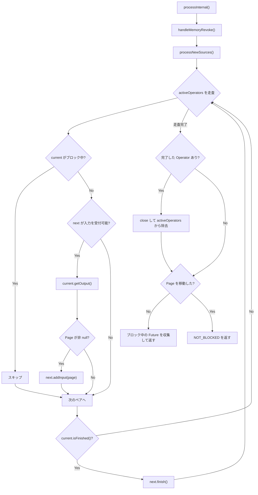
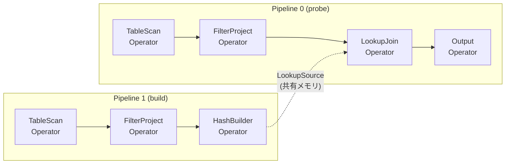

# 第13章 Driver と Operator パイプライン

> **本章で読むソース**
>
> - [`core/trino-main/src/main/java/io/trino/sql/planner/LocalExecutionPlanner.java`](https://github.com/trinodb/trino/blob/482/core/trino-main/src/main/java/io/trino/sql/planner/LocalExecutionPlanner.java)
> - [`core/trino-main/src/main/java/io/trino/operator/Driver.java`](https://github.com/trinodb/trino/blob/482/core/trino-main/src/main/java/io/trino/operator/Driver.java)
> - [`core/trino-main/src/main/java/io/trino/operator/DriverFactory.java`](https://github.com/trinodb/trino/blob/482/core/trino-main/src/main/java/io/trino/operator/DriverFactory.java)
> - [`core/trino-main/src/main/java/io/trino/operator/Operator.java`](https://github.com/trinodb/trino/blob/482/core/trino-main/src/main/java/io/trino/operator/Operator.java)
> - [`core/trino-main/src/main/java/io/trino/operator/OperatorFactory.java`](https://github.com/trinodb/trino/blob/482/core/trino-main/src/main/java/io/trino/operator/OperatorFactory.java)
> - [`core/trino-main/src/main/java/io/trino/operator/OperatorContext.java`](https://github.com/trinodb/trino/blob/482/core/trino-main/src/main/java/io/trino/operator/OperatorContext.java)
> - [`core/trino-main/src/main/java/io/trino/operator/TableScanOperator.java`](https://github.com/trinodb/trino/blob/482/core/trino-main/src/main/java/io/trino/operator/TableScanOperator.java)
> - [`core/trino-main/src/main/java/io/trino/operator/FilterAndProjectOperator.java`](https://github.com/trinodb/trino/blob/482/core/trino-main/src/main/java/io/trino/operator/FilterAndProjectOperator.java)
> - [`core/trino-main/src/main/java/io/trino/operator/ScanFilterAndProjectOperator.java`](https://github.com/trinodb/trino/blob/482/core/trino-main/src/main/java/io/trino/operator/ScanFilterAndProjectOperator.java)
> - [`core/trino-main/src/main/java/io/trino/execution/SqlTaskExecution.java`](https://github.com/trinodb/trino/blob/482/core/trino-main/src/main/java/io/trino/execution/SqlTaskExecution.java)

## この章の狙い

前章までで、論理プラン(PlanNode ツリー)がオプティマイザによって変換される過程を読んだ。
本章では、その PlanNode ツリーが Worker 上で実際に実行される物理的な仕組みを読む。
`LocalExecutionPlanner` が PlanNode を Operator チェーンへ変換し、`Driver` がそのチェーンをプルモデルで駆動する構造を追う。

## 前提

- PlanNode ツリーの構造(第8章)と Fragment への分割(第12章)を理解していること。
- Page と Block による列指向データ表現(第14章で詳述)の概要を知っていること。

## Operator インタフェース

Trino の実行エンジンは、Volcano モデル[^volcano]に基づくプルモデルで動作する。
各処理ステップは `Operator` インタフェースを実装し、上流から Page を受け取って変換し、下流へ渡す。

[^volcano]: Goetz Graefe が提案した反復子モデル。各演算子が `next()` で1行ずつデータを返す方式を、Trino は Page 単位に拡張している。

[`core/trino-main/src/main/java/io/trino/operator/Operator.java` L21-L103](https://github.com/trinodb/trino/blob/482/core/trino-main/src/main/java/io/trino/operator/Operator.java#L21-L103)

```java
public interface Operator
        extends AutoCloseable
{
    ListenableFuture<Void> NOT_BLOCKED = immediateVoidFuture();

    OperatorContext getOperatorContext();

    default ListenableFuture<Void> isBlocked()
    {
        return NOT_BLOCKED;
    }

    boolean needsInput();

    void addInput(Page page);

    Page getOutput();

    // ... (中略) ...

    void finish();

    boolean isFinished();

    @Override
    default void close()
            throws Exception
    {}
}
```

このインタフェースには5つの主要メソッドがある。

- **`isBlocked()`**: Operator が非同期の待機状態にあるかを返す。完了済みの `NOT_BLOCKED` を返せば即座に処理可能であり、未完了の `ListenableFuture` を返せば Driver はその Operator をスキップする。
- **`needsInput()`**: 入力 Page を受け入れられるかを返す。
- **`addInput(Page)`**: 上流から Page を受け取る。`needsInput()` が `true` のときだけ呼ばれる。
- **`getOutput()`**: 処理結果の Page を返す。データがなければ `null` を返す。
- **`finish()`**: 上流からの入力が終了したことを通知する。Operator は内部に蓄積したデータをフラッシュして出力する。

`Operator` は `AutoCloseable` を拡張しており、リソースの解放は `close()` で行う。

## SourceOperator と OperatorFactory

Operator チェーンの先頭には、外部データソースからデータを取得する **SourceOperator** が置かれる。

[`core/trino-main/src/main/java/io/trino/operator/SourceOperator.java` L19-L27](https://github.com/trinodb/trino/blob/482/core/trino-main/src/main/java/io/trino/operator/SourceOperator.java#L19-L27)

```java
public interface SourceOperator
        extends Operator
{
    PlanNodeId getSourceId();

    void addSplit(Split split);

    void noMoreSplits();
}
```

「SourceOperator」は `needsInput()` を常に `false` にして `addInput()` を呼ばせず、代わりに `addSplit()` で Split を受け取り、そこからデータを読み出す。

Operator のインスタンスは **OperatorFactory** が生成する。

[`core/trino-main/src/main/java/io/trino/operator/OperatorFactory.java` L16-L30](https://github.com/trinodb/trino/blob/482/core/trino-main/src/main/java/io/trino/operator/OperatorFactory.java#L16-L30)

```java
public interface OperatorFactory
{
    Operator createOperator(DriverContext driverContext);

    /**
     * Declare that createOperator will not be called any more and release
     * any resources associated with this factory.
     * <p>
     * This method will be called only once.
     * Implementation doesn't need to worry about duplicate invocations.
     */
    void noMoreOperators();

    OperatorFactory duplicate();
}
```

`createOperator()` は Driver ごとに独立した Operator インスタンスを生成する。
`noMoreOperators()` が呼ばれると、以後は生成不可となりファクトリが保持する共有リソースを解放できる。
`duplicate()` は、JOIN のビルド側とプローブ側のように同一パイプラインを複数系統で動かす場面で使う。

## LocalExecutionPlanner による PlanNode から Operator チェーンへの変換

Worker は Fragment(PlanNode のサブツリー)を受け取ると、`LocalExecutionPlanner.plan()` を呼び出して物理実行計画を構築する。

[`core/trino-main/src/main/java/io/trino/sql/planner/LocalExecutionPlanner.java` L638-L670](https://github.com/trinodb/trino/blob/482/core/trino-main/src/main/java/io/trino/sql/planner/LocalExecutionPlanner.java#L638-L670)

```java
public LocalExecutionPlan plan(
        TaskContext taskContext,
        PlanNode plan,
        List<Symbol> outputLayout,
        List<PlanNodeId> partitionedSourceOrder,
        OutputFactory outputOperatorFactory)
{
    Session session = taskContext.getSession();
    LocalExecutionPlanContext context = new LocalExecutionPlanContext(taskContext);

    PhysicalOperation physicalOperation = plan.accept(new Visitor(session), context);

    // ... (中略) ...

    context.addDriverFactory(
            true,
            new PhysicalOperation(
                    outputOperatorFactory.createOutputOperator(
                            context.getNextOperatorId(),
                            plan.getId(),
                            outputTypes,
                            pagePreprocessor,
                            createExchangePagesSerdeFactory(plannerContext.getBlockEncodingSerde(), session)),
                    ImmutableMap.of(),
                    physicalOperation),
            context);

    return new LocalExecutionPlan(context.getDriverFactories(), partitionedSourceOrder);
}
```

PlanNode ツリーのルートに対して `plan.accept(new Visitor(session), context)` を呼び、Visitor パターンで再帰的にツリーを走査する。
各 PlanNode の `visitXxx` メソッドが対応する OperatorFactory を生成し、`PhysicalOperation` として返す。
走査が完了すると、出力用の OperatorFactory を末尾に追加し、`LocalExecutionPlan`(DriverFactory のリスト)を返す。

`Visitor` は `PlanVisitor<PhysicalOperation, LocalExecutionPlanContext>` を拡張している。

[`core/trino-main/src/main/java/io/trino/sql/planner/LocalExecutionPlanner.java` L877-L887](https://github.com/trinodb/trino/blob/482/core/trino-main/src/main/java/io/trino/sql/planner/LocalExecutionPlanner.java#L877-L887)

```java
    private class Visitor
            extends PlanVisitor<PhysicalOperation, LocalExecutionPlanContext>
    {
        private final Session session;
        private final IrExpressionEvaluator evaluator;

        private Visitor(Session session)
        {
            this.session = session;
            evaluator = plannerContext.getExpressionEvaluator();
        }
```

PlanNode の種類ごとに `visitTableScan`, `visitFilter`, `visitProject`, `visitExchange` などが定義され、それぞれが OperatorFactory の生成と Pipeline の分割を担う。

### DriverFactory の組み立て

OperatorFactory のリストは `addDriverFactory()` で `DriverFactory` に包まれる。

[`core/trino-main/src/main/java/io/trino/sql/planner/LocalExecutionPlanner.java` L748-L751](https://github.com/trinodb/trino/blob/482/core/trino-main/src/main/java/io/trino/sql/planner/LocalExecutionPlanner.java#L748-L751)

```java
        private void addDriverFactory(boolean inputDriver, boolean outputDriver, List<OperatorFactory> operatorFactories, OptionalInt driverInstances)
        {
            driverFactories.add(new DriverFactory(getNextPipelineId(), inputDriver, outputDriver, operatorFactories, driverInstances));
        }
```

ここで `inputDriver` フラグは Split を受け取るパイプラインを、`outputDriver` フラグは最終出力を担うパイプラインを示す。
一つの Fragment から複数の DriverFactory が生成されることがある。
たとえば Hash Join では、ビルド側とプローブ側で別々の DriverFactory が作られ、それぞれが独立した Pipeline となる。

### LocalExecutionPlan の構造

[`core/trino-main/src/main/java/io/trino/sql/planner/LocalExecutionPlanner.java` L855-L875](https://github.com/trinodb/trino/blob/482/core/trino-main/src/main/java/io/trino/sql/planner/LocalExecutionPlanner.java#L855-L875)

```java
    public static class LocalExecutionPlan
    {
        private final List<DriverFactory> driverFactories;
        private final List<PlanNodeId> partitionedSourceOrder;

        public LocalExecutionPlan(List<DriverFactory> driverFactories, List<PlanNodeId> partitionedSourceOrder)
        {
            this.driverFactories = ImmutableList.copyOf(requireNonNull(driverFactories, "driverFactories is null"));
            this.partitionedSourceOrder = ImmutableList.copyOf(requireNonNull(partitionedSourceOrder, "partitionedSourceOrder is null"));
        }

        public List<DriverFactory> getDriverFactories()
        {
            return driverFactories;
        }

        public List<PlanNodeId> getPartitionedSourceOrder()
        {
            return partitionedSourceOrder;
        }
    }
```

「LocalExecutionPlan」は DriverFactory のリストと、パーティション化されたソースの処理順序を保持する。
`partitionedSourceOrder` は、複数のテーブルスキャンを含む Fragment で Split を供給する順序を制御するために使われる。

## DriverFactory のライフサイクル

`DriverFactory` は Operator チェーンの雛形である。
Split が到着するたびに `createDriver()` が呼ばれ、各 OperatorFactory から Operator インスタンスを生成して Driver を構築する。

[`core/trino-main/src/main/java/io/trino/operator/DriverFactory.java` L44-L60](https://github.com/trinodb/trino/blob/482/core/trino-main/src/main/java/io/trino/operator/DriverFactory.java#L44-L60)

```java
    public DriverFactory(int pipelineId, boolean inputDriver, boolean outputDriver, List<OperatorFactory> operatorFactories, OptionalInt driverInstances)
    {
        this.pipelineId = pipelineId;
        this.inputDriver = inputDriver;
        this.outputDriver = outputDriver;
        this.operatorFactories = ImmutableList.copyOf(requireNonNull(operatorFactories, "operatorFactories is null"));
        checkArgument(!operatorFactories.isEmpty(), "There must be at least one operator");
        this.driverInstances = requireNonNull(driverInstances, "driverInstances is null");

        List<PlanNodeId> sourceIds = operatorFactories.stream()
                .filter(SourceOperatorFactory.class::isInstance)
                .map(SourceOperatorFactory.class::cast)
                .map(SourceOperatorFactory::getSourceId)
                .collect(toImmutableList());
        checkArgument(sourceIds.size() <= 1, "Expected at most one source operator in driver factory, but found %s", sourceIds);
        this.sourceId = sourceIds.isEmpty() ? Optional.empty() : Optional.of(sourceIds.get(0));
    }
```

コンストラクタで OperatorFactory リストから SourceOperatorFactory を検出し、`sourceId` を記録する。
1つの DriverFactory には最大1つの SourceOperatorFactory しか含められない。

[`core/trino-main/src/main/java/io/trino/operator/DriverFactory.java` L98-L138](https://github.com/trinodb/trino/blob/482/core/trino-main/src/main/java/io/trino/operator/DriverFactory.java#L98-L138)

```java
public Driver createDriver(DriverContext driverContext)
{
    requireNonNull(driverContext, "driverContext is null");
    List<Operator> operators = new ArrayList<>(operatorFactories.size());
    try {
        synchronized (this) {
            checkState(!noMoreDrivers, "noMoreDrivers is already set");
            for (OperatorFactory operatorFactory : operatorFactories) {
                Operator operator = operatorFactory.createOperator(driverContext);
                operators.add(operator);
            }
        }
        return Driver.createDriver(driverContext, operators);
    }
    catch (Throwable failure) {
        for (Operator operator : operators) {
            try {
                operator.close();
            }
            // ... (中略) ...
        }
        // ... (中略) ...
        throw failure;
    }
}
```

`createDriver()` は `synchronized` ブロック内で全 OperatorFactory を順に呼び出し、Operator リストを構築する。
失敗時には生成済みの Operator をすべて `close()` し、リソースリークを防ぐ。

`noMoreDrivers()` が呼ばれると、全 OperatorFactory に `noMoreOperators()` を通知し、以降の Driver 生成を禁止する。

[`core/trino-main/src/main/java/io/trino/operator/DriverFactory.java` L140-L151](https://github.com/trinodb/trino/blob/482/core/trino-main/src/main/java/io/trino/operator/DriverFactory.java#L140-L151)

```java
    public synchronized void noMoreDrivers()
    {
        if (noMoreDrivers) {
            return;
        }
        for (OperatorFactory operatorFactory : operatorFactories) {
            operatorFactory.noMoreOperators();
        }
        operatorFactories = null;
        noMoreDrivers = true;
    }

```

## Driver の構造と処理ループ

**Driver** は Operator チェーンを実行する単位である。
1つの Driver は Operator のリストを保持し、プルモデルで Page を上流から下流へ流す。

### Driver の初期化

[`core/trino-main/src/main/java/io/trino/operator/Driver.java` L124-L146](https://github.com/trinodb/trino/blob/482/core/trino-main/src/main/java/io/trino/operator/Driver.java#L124-L146)

```java
    private Driver(DriverContext driverContext, List<Operator> operators)
    {
        this.driverContext = requireNonNull(driverContext, "driverContext is null");
        this.allOperators = ImmutableList.copyOf(requireNonNull(operators, "operators is null"));
        checkArgument(allOperators.size() > 1, "At least two operators are required");
        this.activeOperators = new ArrayList<>(operators);
        checkArgument(!operators.isEmpty(), "There must be at least one operator");

        Optional<SourceOperator> sourceOperator = Optional.empty();
        for (Operator operator : operators) {
            if (operator instanceof SourceOperator value) {
                checkArgument(sourceOperator.isEmpty(), "There must be at most one SourceOperator");
                sourceOperator = Optional.of(value);
            }
        }
        this.sourceOperator = sourceOperator;

        currentSplitAssignment = sourceOperator.map(operator -> new SplitAssignment(operator.getSourceId(), ImmutableSet.of(), false)).orElse(null);
        // initially the driverBlockedFuture is not blocked (it is completed)
        SettableFuture<Void> future = SettableFuture.create();
        future.set(null);
        driverBlockedFuture.set(future);
    }
```

Driver は最低2つの Operator を必要とする(ソースと出力)。
`activeOperators` は処理中の Operator を管理するリストで、完了した Operator は先頭から順に除去される。

### process メソッド

Driver の実行は `process()` メソッドから始まる。
Task の実行エンジンは、このメソッドをタイムスライスごとに繰り返し呼び出す。

[`core/trino-main/src/main/java/io/trino/operator/Driver.java` L283-L339](https://github.com/trinodb/trino/blob/482/core/trino-main/src/main/java/io/trino/operator/Driver.java#L283-L339)

```java
public ListenableFuture<Void> process(Duration maxRuntime, int maxIterations)
{
    checkLockNotHeld("Cannot process for a duration while holding the driver lock");
    // ... (中略) ...

    Optional<ListenableFuture<Void>> result = tryWithLock(100, TimeUnit.MILLISECONDS, true, () -> {
        OperationTimer operationTimer = createTimer();
        driverContext.startProcessTimer();
        driverContext.getYieldSignal().setWithDelay(maxRuntimeInNanos, driverContext.getYieldExecutor());
        try {
            long start = System.nanoTime();
            int iterations = 0;
            while (!isTerminatingOrDoneInternal()) {
                ListenableFuture<Void> future = processInternal(operationTimer);
                iterations++;
                if (!future.isDone()) {
                    return updateDriverBlockedFuture(future);
                }
                if (System.nanoTime() - start >= maxRuntimeInNanos || iterations >= maxIterations) {
                    break;
                }
            }
        }
        // ... (中略) ...
        finally {
            driverContext.getYieldSignal().reset();
            driverContext.recordProcessed(operationTimer);
        }
        return NOT_BLOCKED;
    });
    return result.orElse(NOT_BLOCKED);
}
```

`process()` はまず排他ロック(`exclusiveLock`)を取得する。
同一 Driver に対して複数スレッドが同時に `processInternal()` を実行することはない。
ループ内で `processInternal()` を繰り返し呼び出し、制限時間(`maxRuntime`)または反復回数上限に達するか、Operator がブロック状態を返すまで続ける。

### processInternal: プルモデルの実体

`processInternal()` は Driver の処理ループの核心である。

[`core/trino-main/src/main/java/io/trino/operator/Driver.java` L372-L485](https://github.com/trinodb/trino/blob/482/core/trino-main/src/main/java/io/trino/operator/Driver.java#L372-L485)

```java
private ListenableFuture<Void> processInternal(OperationTimer operationTimer)
{
    checkLockHeld("Lock must be held to call processInternal");

    handleMemoryRevoke();

    processNewSources();

    // ... (中略) ...

    boolean movedPage = false;
    for (int i = 0; i < activeOperators.size() - 1 && !driverContext.isTerminatingOrDone(); i++) {
        Operator current = activeOperators.get(i);
        Operator next = activeOperators.get(i + 1);

        // skip blocked operator
        if (getBlockedFuture(current).isPresent()) {
            continue;
        }

        // if the current operator is not finished and next operator isn't blocked and needs input...
        if (!current.isFinished() && getBlockedFuture(next).isEmpty() && next.needsInput()) {
            // get an output page from current operator
            Page page = current.getOutput();
            current.getOperatorContext().recordGetOutput(operationTimer, page);

            // if we got an output page, add it to the next operator
            if (page != null && page.getPositionCount() != 0) {
                next.addInput(page);
                next.getOperatorContext().recordAddInput(operationTimer, page);
                movedPage = true;
            }

            if (current instanceof SourceOperator) {
                movedPage = true;
            }
        }

        // if current operator is finished...
        if (current.isFinished()) {
            // let next operator know there will be no more data
            next.finish();
            next.getOperatorContext().recordFinish(operationTimer);
        }
    }

    for (int index = activeOperators.size() - 1; index >= 0; index--) {
        if (activeOperators.get(index).isFinished()) {
            List<Operator> finishedOperators = this.activeOperators.subList(0, index + 1);
            Throwable throwable = closeAndDestroyOperators(finishedOperators);
            finishedOperators.clear();
            // ... (中略) ...
            break;
        }
    }

    // if we did not move any pages, check if we are blocked
    if (!movedPage) {
        // ... (中略) ...
    }

    return NOT_BLOCKED;
}
```

処理の流れを整理する。

1. **メモリ回収処理** (`handleMemoryRevoke()`): メモリプレッシャーが発生している Operator の回収処理を進める。
2. **新しい Split の取り込み** (`processNewSources()`): ステージングされた Split を SourceOperator へ供給する。
3. **Page の移動**: `activeOperators` を先頭(上流)から末尾(下流)に向かって走査し、隣接する Operator 間で Page を受け渡す。`current.getOutput()` で Page を取得し、`next.addInput(page)` で渡すプルモデルである。
4. **完了した Operator の除去**: `isFinished()` が `true` の Operator とその上流をすべて `close()` して `activeOperators` から除去する。
5. **ブロック判定**: Page の移動がなかった場合、ブロック中の Operator を検出し、その Future を返す。



### 非同期ブロッキングの管理

Operator が非同期 I/O やメモリ待ちでブロックする場合、Driver はその Operator をスキップする。
`getBlockedFuture()` はブロック要因を4段階で検査する。

[`core/trino-main/src/main/java/io/trino/operator/Driver.java` L602-L622](https://github.com/trinodb/trino/blob/482/core/trino-main/src/main/java/io/trino/operator/Driver.java#L602-L622)

```java
    private Optional<ListenableFuture<Void>> getBlockedFuture(Operator operator)
    {
        ListenableFuture<Void> blocked = revokingOperators.get(operator);
        if (blocked != null) {
            // We mark operator as blocked regardless of blocked.isDone(), because finishMemoryRevoke has not been called yet.
            return Optional.of(blocked);
        }
        blocked = operator.isBlocked();
        if (!blocked.isDone()) {
            return Optional.of(blocked);
        }
        blocked = operator.getOperatorContext().isWaitingForMemory();
        if (!blocked.isDone()) {
            return Optional.of(blocked);
        }
        blocked = operator.getOperatorContext().isWaitingForRevocableMemory();
        if (!blocked.isDone()) {
            return Optional.of(blocked);
        }
        return Optional.empty();
    }
```

4つのブロック要因を順に確認する。

1. **メモリ回収中**: `revokingOperators` マップに登録された Operator は回収が完了するまでブロックされる。
2. **Operator 固有のブロック**: `operator.isBlocked()` が未完了の Future を返す(例: Exchange Operator がリモートデータ待ち)。
3. **ユーザーメモリ待ち**: メモリプール枯渇によるバックプレッシャー。
4. **revocable メモリ待ち**: Spill 対象メモリの割り当て待ち。

いずれかが未完了なら、Driver はその Operator をスキップして他の Operator ペアの処理を試みる。
全 Operator がブロックされて Page を1つも移動できなかった場合、Driver はブロック状態の Future を呼び出し元に返す。
この仕組みにより、単一 Driver 内でもブロックしていない Operator 間のデータ移動を継続できる。

## Pipeline の概念

1つの Fragment は複数の **Pipeline** に分割されることがある。
Pipeline は同一 Task 内の Driver グループであり、それぞれが独立した DriverFactory から生成される。

典型例は Hash Join である。
プローブ側のパイプライン(テーブルスキャンから Join まで)とビルド側のパイプライン(テーブルスキャンからハッシュテーブル構築まで)は並行して動作する。
両者は共有メモリ上のハッシュテーブル(`LookupSource`)を介してデータを受け渡す。



`SqlTaskExecution` のコンストラクタで、DriverFactory のリストを Split のライフサイクルによって分類する。

[`core/trino-main/src/main/java/io/trino/execution/SqlTaskExecution.java` L137-L186](https://github.com/trinodb/trino/blob/482/core/trino-main/src/main/java/io/trino/execution/SqlTaskExecution.java#L137-L186)

```java
try (SetThreadName _ = new SetThreadName("Task-" + taskId)) {
    List<DriverFactory> driverFactories = localExecutionPlan.getDriverFactories();
    // index driver factories
    Set<PlanNodeId> partitionedSources = ImmutableSet.copyOf(localExecutionPlan.getPartitionedSourceOrder());
    ImmutableMap.Builder<PlanNodeId, DriverSplitRunnerFactory> driverRunnerFactoriesWithSplitLifeCycle = ImmutableMap.builder();
    ImmutableList.Builder<DriverSplitRunnerFactory> driverRunnerFactoriesWithTaskLifeCycle = ImmutableList.builder();
    ImmutableMap.Builder<PlanNodeId, DriverSplitRunnerFactory> driverRunnerFactoriesWithRemoteSource = ImmutableMap.builder();
    for (DriverFactory driverFactory : driverFactories) {
        Optional<PlanNodeId> sourceId = driverFactory.getSourceId();
        if (sourceId.isPresent() && partitionedSources.contains(sourceId.get())) {
            driverRunnerFactoriesWithSplitLifeCycle.put(sourceId.get(), new DriverSplitRunnerFactory(driverFactory, tracer, true));
        }
        else {
            DriverSplitRunnerFactory runnerFactory = new DriverSplitRunnerFactory(driverFactory, tracer, false);
            sourceId.ifPresent(planNodeId -> driverRunnerFactoriesWithRemoteSource.put(planNodeId, runnerFactory));
            driverRunnerFactoriesWithTaskLifeCycle.add(runnerFactory);
        }
    }
    // ... (中略) ...
}
```

DriverFactory は3種に分類される。

- **Split ライフサイクル**: パーティション化されたソース(テーブルスキャン)を持つパイプライン。Split ごとに Driver が1つ生成される。
- **Task ライフサイクル**: ソースを持たないパイプライン、またはリモートソースを持つパイプライン。Task の開始時に固定数の Driver が生成される。
- **リモートソース**: Exchange からデータを受け取るパイプライン。Task ライフサイクルのサブセットであり、Split は Driver 間で共有される。

Split ライフサイクルの Driver は、Split が到着するたびに `DriverSplitRunner` として TaskExecutor に投入される。

[`core/trino-main/src/main/java/io/trino/execution/SqlTaskExecution.java` L830-L853](https://github.com/trinodb/trino/blob/482/core/trino-main/src/main/java/io/trino/execution/SqlTaskExecution.java#L830-L853)

```java
        @Override
        public ListenableFuture<Void> processFor(Duration duration)
        {
            Driver driver;
            synchronized (this) {
                // if close() was called before we get here, there's not point in even creating the driver
                if (closed) {
                    return immediateVoidFuture();
                }

                if (this.driver == null) {
                    this.driver = driverSplitRunnerFactory.createDriver(driverContext, partitionedSplit);
                    // Termination has begun, mark the runner as closed and return
                    if (this.driver == null) {
                        closed = true;
                        return immediateVoidFuture();
                    }
                }

                driver = this.driver;
            }

            return driver.processForDuration(duration);
        }
```

`DriverSplitRunner.processFor()` は TaskExecutor から呼び出される。
初回呼び出し時に遅延的に Driver を生成し、以後は `driver.processForDuration(duration)` を呼んでタイムスライス分の処理を実行する。

## TableScanOperator

**TableScanOperator** は SourceOperator の基本実装である。
Split から `ConnectorPageSource` を生成し、Page を読み出す。

[`core/trino-main/src/main/java/io/trino/operator/TableScanOperator.java` L172-L198](https://github.com/trinodb/trino/blob/482/core/trino-main/src/main/java/io/trino/operator/TableScanOperator.java#L172-L198)

```java
    @Override
    public void addSplit(Split split)
    {
        requireNonNull(split, "split is null");
        checkState(this.split == null, "Table scan split already set");

        if (finished) {
            return;
        }

        this.split = split;
        blocked.set(null);

        if (split.getConnectorSplit() instanceof EmptySplit) {
            source = new EmptyPageSource();
        }
    }

    @Override
    public void noMoreSplits()
    {
        if (split == null) {
            finished = true;
        }
        blocked.set(null);
    }

```

`addSplit()` で Split を受け取り、`blocked` Future を完了させて Driver に処理再開を促す。
Split が1つも来ないまま `noMoreSplits()` が呼ばれた場合は即座に `finished` となる。

[`core/trino-main/src/main/java/io/trino/operator/TableScanOperator.java` L268-L301](https://github.com/trinodb/trino/blob/482/core/trino-main/src/main/java/io/trino/operator/TableScanOperator.java#L268-L301)

```java
    {
        if (split == null) {
            return null;
        }
        if (source == null) {
            source = pageSourceProvider.createPageSource(operatorContext.getSession(), split, table, tableCredentials, columns, DynamicFilter.EMPTY, pageSourceMemoryContext::setBytes);
        }

        SourcePage sourcePage = source.getNextSourcePage();
        Page page = null;
        if (sourcePage != null) {
            page = sourcePage.getPage();
        }

        // update operator stats
        long endCompletedBytes = source.getCompletedBytes();
        long endReadTimeNanos = source.getReadTimeNanos();
        long positionCount = page == null ? 0 : page.getPositionCount();
        long sizeInBytes = page == null ? 0 : page.getSizeInBytes();
        long endCompletedPositions = source.getCompletedPositions().orElse(completedPositions + positionCount);
        operatorContext.recordPhysicalInputWithTiming(
                endCompletedBytes - completedBytes,
                endCompletedPositions - completedPositions,
                endReadTimeNanos - readTimeNanos);
        operatorContext.recordProcessedInput(sizeInBytes, positionCount);
        completedBytes = endCompletedBytes;
        completedPositions = endCompletedPositions;
        readTimeNanos = endReadTimeNanos;

        // updating memory usage should happen after page is loaded.
        pageSourceProviderMemoryContext.setBytes(pageSourceProvider.getMemoryUsage());
        operatorContext.setLatestConnectorMetrics(source.getMetrics());
        return page;
    }
```

`getOutput()` は遅延的に `ConnectorPageSource` を生成する。
初回呼び出し時に `pageSourceProvider.createPageSource()` でソースを開き、以後は `source.getNextSourcePage()` で Page を返す。
物理読み取りバイト数と読み取り時間をデルタとして `OperatorContext` に記録し、クエリ統計に反映する。

## FilterAndProjectOperator と ScanFilterAndProject の融合

`LocalExecutionPlanner` は、Filter ノードと Project ノードを Scan ノードと融合する最適化を行う。

[`core/trino-main/src/main/java/io/trino/sql/planner/LocalExecutionPlanner.java` L2003-L2007](https://github.com/trinodb/trino/blob/482/core/trino-main/src/main/java/io/trino/sql/planner/LocalExecutionPlanner.java#L2003-L2007)

```java
        public PhysicalOperation visitFilter(FilterNode node, LocalExecutionPlanContext context)
        {
            List<Symbol> outputSymbols = node.getOutputSymbols();
            return visitScanFilterAndProject(context, node.getId(), node.getSource(), Optional.of(node.getPredicate()), Assignments.identity(outputSymbols), outputSymbols);
        }
```

`visitFilter()` と `visitProject()` はどちらも内部で `visitScanFilterAndProject()` を呼ぶ。

[`core/trino-main/src/main/java/io/trino/sql/planner/LocalExecutionPlanner.java` L2009-L2025](https://github.com/trinodb/trino/blob/482/core/trino-main/src/main/java/io/trino/sql/planner/LocalExecutionPlanner.java#L2009-L2025)

```java
        @Override
        public PhysicalOperation visitProject(ProjectNode node, LocalExecutionPlanContext context)
        {
            PlanNode sourceNode;
            Optional<Expression> filterExpression = Optional.empty();
            if (node.getSource() instanceof FilterNode filterNode) {
                sourceNode = filterNode.getSource();
                filterExpression = Optional.of(filterNode.getPredicate());
            }
            else {
                sourceNode = node.getSource();
            }

            List<Symbol> outputSymbols = node.getOutputSymbols();

            return visitScanFilterAndProject(context, node.getId(), sourceNode, filterExpression, node.getAssignments(), outputSymbols);
        }
```

`visitProject()` は、ソースが FilterNode であれば FilterNode をさらにスキップしてその下のノードを直接参照する。
こうして、Project + Filter + TableScan の3ノードが `visitScanFilterAndProject()` に一括で渡される。

[`core/trino-main/src/main/java/io/trino/sql/planner/LocalExecutionPlanner.java` L2036-L2044](https://github.com/trinodb/trino/blob/482/core/trino-main/src/main/java/io/trino/sql/planner/LocalExecutionPlanner.java#L2036-L2044)

```java
            // if source is a table scan we fold it directly into the filter and project
            // otherwise we plan it as a normal operator
            Map<Symbol, Integer> sourceLayout;
            TableHandle table = null;
            Optional<ConnectorTableCredentials> tableCredentials = Optional.empty();
            List<ColumnHandle> columns = null;
            PhysicalOperation source = null;
            if (sourceNode instanceof TableScanNode tableScanNode) {
                table = tableScanNode.getTable();
```

ソースが TableScanNode であれば `ScanFilterAndProjectOperator` を生成し、テーブルスキャンとフィルタと射影を1つの Operator に融合する。

[`core/trino-main/src/main/java/io/trino/sql/planner/LocalExecutionPlanner.java` L2118-L2144](https://github.com/trinodb/trino/blob/482/core/trino-main/src/main/java/io/trino/sql/planner/LocalExecutionPlanner.java#L2118-L2144)

```java
                if (columns != null) {
                    SourceOperatorFactory operatorFactory = new ScanFilterAndProjectOperatorFactory(
                            context.getNextOperatorId(),
                            planNodeId,
                            sourceNode.getId(),
                            pageSourceManager,
                            pageProcessor,
                            table,
                            tableCredentials,
                            columns,
                            dynamicFilter,
                            getTypes(projections),
                            getFilterAndProjectMinOutputPageSize(session),
                            getFilterAndProjectMinOutputPageRowCount(session));

                    return new PhysicalOperation(operatorFactory, outputMappings);
                }

                OperatorFactory operatorFactory = FilterAndProjectOperator.createOperatorFactory(
                        context.getNextOperatorId(),
                        planNodeId,
                        () -> pageProcessor.apply(dynamicFilter),
                        getTypes(projections),
                        getFilterAndProjectMinOutputPageSize(session),
                        getFilterAndProjectMinOutputPageRowCount(session));

                return new PhysicalOperation(operatorFactory, outputMappings, source);
```

分岐は明確である。

- `columns != null`(ソースが TableScanNode だった場合): `ScanFilterAndProjectOperatorFactory` を生成する。スキャン、フィルタ、射影が1つの Operator に統合される。
- それ以外: `FilterAndProjectOperator` を生成し、上流の Operator から Page を受け取ってフィルタと射影を行う。

### FilterAndProjectOperator の内部構造

`FilterAndProjectOperator` は `WorkProcessorOperator` として実装され、`WorkProcessorOperatorAdapter` を介して `Operator` インタフェースに適合させている。

[`core/trino-main/src/main/java/io/trino/operator/FilterAndProjectOperator.java` L38-L67](https://github.com/trinodb/trino/blob/482/core/trino-main/src/main/java/io/trino/operator/FilterAndProjectOperator.java#L38-L67)

```java
public class FilterAndProjectOperator
        implements WorkProcessorOperator
{
    private final WorkProcessor<Page> pages;
    private final PageProcessorMetrics metrics = new PageProcessorMetrics();

    private FilterAndProjectOperator(
            OperatorContext operatorContext,
            WorkProcessor<Page> sourcePages,
            PageProcessor pageProcessor,
            List<Type> types,
            DataSize minOutputPageSize,
            int minOutputPageRowCount)
    {
        LocalMemoryContext operatorMemoryContext = operatorContext.newLocalUserMemoryContext(FilterAndProjectOperator.class.getSimpleName());
        AggregatedMemoryContext localAggregatedMemoryContext = newSimpleAggregatedMemoryContext();
        LocalMemoryContext outputMemoryContext = localAggregatedMemoryContext.newLocalMemoryContext(FilterAndProjectOperator.class.getSimpleName());
        ConnectorSession connectorSession = operatorContext.getSession().toConnectorSession();
        DriverYieldSignal yieldSignal = operatorContext.getDriverContext().getYieldSignal();

        this.pages = sourcePages
                .flatMap(page -> pageProcessor.createWorkProcessor(
                        connectorSession,
                        yieldSignal,
                        outputMemoryContext,
                        metrics,
                        SourcePage.create(page)))
                .transformProcessor(processor -> mergePages(types, minOutputPageSize.toBytes(), minOutputPageRowCount, processor, localAggregatedMemoryContext))
                .blocking(() -> operatorMemoryContext.setBytes(localAggregatedMemoryContext.getBytes()));
    }
```

ソース Page の `WorkProcessor` に対して `flatMap` で `PageProcessor` を適用し、フィルタと射影を実行する。
`mergePages` は小さな出力 Page を `minOutputPageSize` / `minOutputPageRowCount` に達するまでマージし、下流に渡す Page のサイズを一定以上に保つ。

`WorkProcessorOperatorAdapter` が `WorkProcessorOperator` を標準の `Operator` インタフェースに変換する。

[`core/trino-main/src/main/java/io/trino/operator/WorkProcessorOperatorAdapter.java` L94-L100](https://github.com/trinodb/trino/blob/482/core/trino-main/src/main/java/io/trino/operator/WorkProcessorOperatorAdapter.java#L94-L100)

```java
    public WorkProcessorOperatorAdapter(OperatorContext operatorContext, WorkProcessorOperatorFactory workProcessorOperatorFactory)
    {
        this.operatorContext = requireNonNull(operatorContext, "operatorContext is null");
        this.workProcessorOperator = workProcessorOperatorFactory.create(operatorContext, pageBuffer.pages());
        this.pages = workProcessorOperator.getOutputPages();
        operatorContext.setInfoSupplier(createInfoSupplier(workProcessorOperator));
    }
```

`pageBuffer.pages()` が入力側の `WorkProcessor<Page>` を提供する。
`addInput()` で受け取った Page は `pageBuffer` に格納され、WorkProcessor がプルする。
`getOutput()` では `pages.process()` を呼んで WorkProcessor を1ステップ進め、結果の Page を返す。

## OperatorContext と実行統計

**OperatorContext** は各 Operator の実行統計とメモリ管理を担う。

[`core/trino-main/src/main/java/io/trino/operator/OperatorContext.java` L124-L150](https://github.com/trinodb/trino/blob/482/core/trino-main/src/main/java/io/trino/operator/OperatorContext.java#L124-L150)

```java
public OperatorContext(
        int operatorId,
        PlanNodeId planNodeId,
        Optional<PlanNodeId> sourceId,
        String operatorType,
        DriverContext driverContext,
        Executor executor,
        MemoryTrackingContext operatorMemoryContext)
{
    // ... (中略) ...
    this.operatorMemoryContext = requireNonNull(operatorMemoryContext, "operatorMemoryContext is null");
    this.aggregateUserMemoryContext = new InternalAggregatedMemoryContext(operatorMemoryContext.aggregateUserMemoryContext(), memoryFuture, this::updatePeakMemoryReservations, false);
    this.aggregateRevocableMemoryContext = new InternalAggregatedMemoryContext(operatorMemoryContext.aggregateRevocableMemoryContext(), revocableMemoryFuture, this::updatePeakMemoryReservations, false);
    // ... (中略) ...
}
```

OperatorContext はユーザーメモリと revocable メモリの2種類を追跡する。
メモリ割り当てが失敗すると `memoryFuture` が未完了状態になり、Driver の `getBlockedFuture()` でブロック要因として検出される。
この仕組みが、メモリプレッシャー時のバックプレッシャーを実現する。

`recordAddInput()` と `recordGetOutput()` で各 Operator の入出力バイト数、行数、CPU 時間を記録する。

[`core/trino-main/src/main/java/io/trino/operator/OperatorContext.java` L172-L179](https://github.com/trinodb/trino/blob/482/core/trino-main/src/main/java/io/trino/operator/OperatorContext.java#L172-L179)

```java
    void recordAddInput(OperationTimer operationTimer, Page page)
    {
        operationTimer.recordOperationComplete(addInputTiming);
        if (page != null) {
            inputDataSize.update(page.getSizeInBytes());
            inputPositions.update(page.getPositionCount());
        }
    }
```

これらの統計は `getOperatorStats()` で集約され、`EXPLAIN ANALYZE` やクエリ進行状況の監視に使われる。

## 高速化の工夫: Scan/Filter/Project の融合と DriverYieldSignal

### Scan/Filter/Project 融合

前節で見たとおり、`LocalExecutionPlanner` は TableScan、Filter、Project の3つの PlanNode を単一の `ScanFilterAndProjectOperator` に融合する。
この最適化により、3つの Operator 間で Page を受け渡すオーバーヘッドが排除される。

通常、Operator 間の Page 受け渡しには `getOutput()` と `addInput()` の呼び出し、Page オブジェクトの生成、`OperatorContext` での統計記録が伴う。
融合されたオペレータでは、`ConnectorPageSource` から読み取った `SourcePage` を直接 `PageProcessor` に渡す。

[`core/trino-main/src/main/java/io/trino/operator/ScanFilterAndProjectOperator.java` L261-L278](https://github.com/trinodb/trino/blob/482/core/trino-main/src/main/java/io/trino/operator/ScanFilterAndProjectOperator.java#L261-L278)

```java
        WorkProcessor<Page> processPageSource()
        {
            ConnectorSession connectorSession = session.toConnectorSession();
            return WorkProcessor
                    .create(new ConnectorPageSourceToPages(pageSourceProviderMemoryContext))
                    .yielding(yieldSignal::isSet)
                    .flatMap(page -> {
                        WorkProcessor<Page> workProcessor = pageProcessor.createWorkProcessor(
                                connectorSession,
                                yieldSignal,
                                outputMemoryContext,
                                pageProcessorMetrics,
                                page);
                        // Note this is monitoring the original source page not the result page
                        return workProcessor.withProcessStateMonitor(new ProcessedBytesMonitor(page, bytes -> processedBytes += bytes));
                    })
                    .transformProcessor(processor -> mergePages(types, minOutputPageSize.toBytes(), minOutputPageRowCount, processor, localAggregatedMemoryContext))
                    .blocking(() -> memoryContext.setBytes(localAggregatedMemoryContext.getBytes()));
```

`ConnectorPageSourceToPages` が Connector から `SourcePage` を読み、`flatMap` でフィルタと射影を適用し、`mergePages` で出力 Page をマージする。
この一連の処理が単一の WorkProcessor パイプラインとして構成されるため、中間 Page の不要な生成が回避される。

### DriverYieldSignal による協調的タイムスライス

Driver の `process()` はタイムスライスの先頭で `DriverYieldSignal` を設定する。

[`core/trino-main/src/main/java/io/trino/operator/DriverYieldSignal.java` L55-L72](https://github.com/trinodb/trino/blob/482/core/trino-main/src/main/java/io/trino/operator/DriverYieldSignal.java#L55-L72)

```java
    public synchronized void setWithDelay(long maxRunNanos, ScheduledExecutorService executor)
    {
        checkState(yieldFuture == null, "there is an ongoing yield");
        checkState(!isSet(), "yield while driver was not running");
        if (terminationStarted) {
            return;
        }

        this.runningSequence++;
        long expectedRunningSequence = this.runningSequence;
        yieldFuture = executor.schedule(() -> {
            synchronized (this) {
                if (expectedRunningSequence == runningSequence && yieldFuture != null) {
                    yield.set(true);
                }
            }
        }, maxRunNanos, NANOSECONDS);
    }
```

`setWithDelay()` は `ScheduledExecutorService` に遅延タスクを登録し、指定時間後に `yield` フラグを `true` にする。
`PageProcessor` や `ScanFilterAndProjectOperator` はループ内で `yieldSignal.isSet()` を確認し、フラグが立っていれば処理を中断して Driver に制御を返す。

この仕組みにより、大量の行を処理する Operator が CPU を長時間占有することを防ぎ、Task 間で公平にスレッドを共有できる。
TaskExecutor がタイムスライスの粒度を制御し、各 Driver は協調的に実行を譲る。

## まとめ

`LocalExecutionPlanner` は Visitor パターンで PlanNode ツリーを走査し、各ノードを OperatorFactory へ変換する。
Join やローカル Exchange のような分岐点では Pipeline が分割され、複数の DriverFactory が生成される。

Driver は Operator チェーンをプルモデルで駆動する。
`processInternal()` が上流から下流へ Page を移動し、ブロック中の Operator はスキップする。
この非同期ブロッキング管理により、ネットワーク I/O やメモリ待ちがある状況でも、処理可能な Operator 間のデータ移動は継続される。

TableScan、Filter、Project の融合は、Operator 間の Page 受け渡しコストを排除する実用的な最適化である。
DriverYieldSignal による協調的タイムスライスと組み合わせ、Trino の実行エンジンは高い並行性と応答性を実現している。

## 関連する章

- 第8章: PlanNode ツリーの構造
- 第12章: Fragment への分割と分散実行
- 第14章: Page と Block によるデータ表現
- 第15章: Exchange と OutputBuffer
