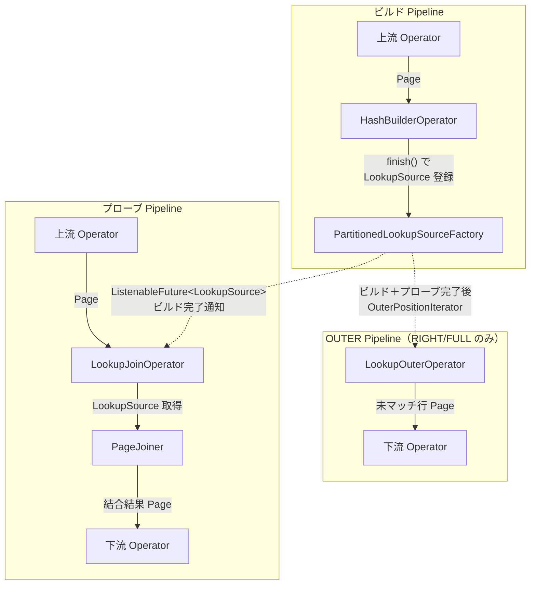
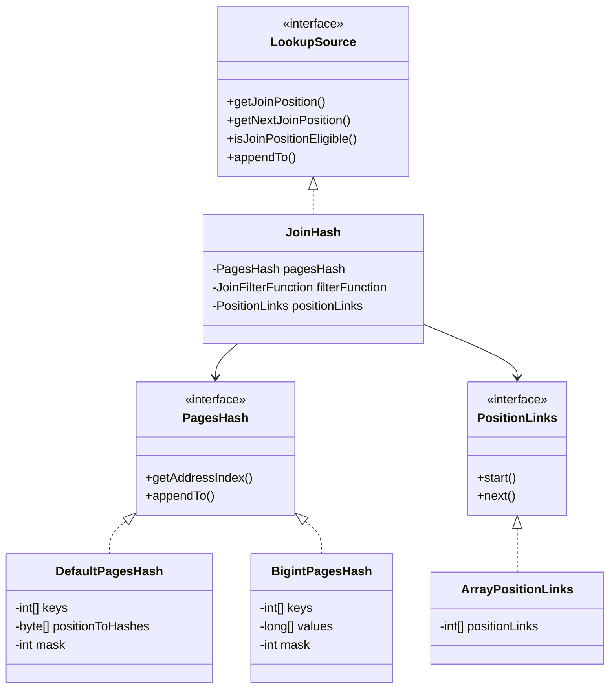

# 第14章 HashJoin と LookupSource

> **本章で読むソース**
>
> - [`core/trino-main/src/main/java/io/trino/operator/join/nonspilling/HashBuilderOperator.java`](https://github.com/trinodb/trino/blob/482/core/trino-main/src/main/java/io/trino/operator/join/nonspilling/HashBuilderOperator.java)
> - [`core/trino-main/src/main/java/io/trino/operator/join/nonspilling/LookupJoinOperatorFactory.java`](https://github.com/trinodb/trino/blob/482/core/trino-main/src/main/java/io/trino/operator/join/nonspilling/LookupJoinOperatorFactory.java)
> - [`core/trino-main/src/main/java/io/trino/operator/join/nonspilling/LookupJoinOperator.java`](https://github.com/trinodb/trino/blob/482/core/trino-main/src/main/java/io/trino/operator/join/nonspilling/LookupJoinOperator.java)
> - [`core/trino-main/src/main/java/io/trino/operator/join/nonspilling/PageJoiner.java`](https://github.com/trinodb/trino/blob/482/core/trino-main/src/main/java/io/trino/operator/join/nonspilling/PageJoiner.java)
> - [`core/trino-main/src/main/java/io/trino/operator/join/JoinBridgeManager.java`](https://github.com/trinodb/trino/blob/482/core/trino-main/src/main/java/io/trino/operator/join/JoinBridgeManager.java)
> - [`core/trino-main/src/main/java/io/trino/operator/join/JoinHash.java`](https://github.com/trinodb/trino/blob/482/core/trino-main/src/main/java/io/trino/operator/join/JoinHash.java)
> - [`core/trino-main/src/main/java/io/trino/operator/join/JoinHashSupplier.java`](https://github.com/trinodb/trino/blob/482/core/trino-main/src/main/java/io/trino/operator/join/JoinHashSupplier.java)
> - [`core/trino-main/src/main/java/io/trino/operator/join/DefaultPagesHash.java`](https://github.com/trinodb/trino/blob/482/core/trino-main/src/main/java/io/trino/operator/join/DefaultPagesHash.java)
> - [`core/trino-main/src/main/java/io/trino/operator/join/BigintPagesHash.java`](https://github.com/trinodb/trino/blob/482/core/trino-main/src/main/java/io/trino/operator/join/BigintPagesHash.java)
> - [`core/trino-main/src/main/java/io/trino/operator/join/LookupSource.java`](https://github.com/trinodb/trino/blob/482/core/trino-main/src/main/java/io/trino/operator/join/LookupSource.java)
> - [`core/trino-main/src/main/java/io/trino/operator/join/ArrayPositionLinks.java`](https://github.com/trinodb/trino/blob/482/core/trino-main/src/main/java/io/trino/operator/join/ArrayPositionLinks.java)
> - [`core/trino-main/src/main/java/io/trino/operator/join/LookupOuterOperator.java`](https://github.com/trinodb/trino/blob/482/core/trino-main/src/main/java/io/trino/operator/join/LookupOuterOperator.java)
> - [`core/trino-main/src/main/java/io/trino/operator/join/PagesHash.java`](https://github.com/trinodb/trino/blob/482/core/trino-main/src/main/java/io/trino/operator/join/PagesHash.java)

## この章の狙い

Hash Join は、等値結合を処理するための基本的なアルゴリズムである。
Trino の実行エンジンは、ビルド側の全行をメモリ上のハッシュテーブルに格納し、プローブ側の行を1行ずつ照合するビルド/プローブの2フェーズ構造を採用している。

本章では、ビルド側がハッシュテーブルを構築して `LookupSource` として公開するまでの流れと、プローブ側がそれを参照して結合結果を生成する処理を追う。
あわせて、ハッシュテーブル本体である `DefaultPagesHash` のオープンアドレス法による衝突解決と、OUTER JOIN で未マッチ行を出力する `LookupOuterOperator` の仕組みを読む。

## 前提

- 第10章で扱った分散プランの Fragment と Exchange の構造を理解していること。
- Trino の Operator が `addInput` / `getOutput` のプッシュ/プル・モデルで Page を処理する仕組みを知っていること。

## ビルド/プローブの2フェーズ構造

Hash Join は2つの Pipeline に分離して実行される。

1. **ビルド Pipeline**：`HashBuilderOperator` がビルド側の全 Page を受け取り、インメモリのハッシュテーブル（`JoinHash`）を構築する。
2. **プローブ Pipeline**：`LookupJoinOperator` がプローブ側の Page を1行ずつハッシュテーブルに照合し、結合結果の Page を出力する。

この2つの Pipeline は別々の Driver で動作するため、ビルド側の完了をプローブ側へ通知する同期機構が必要になる。
その役割を担うのが `JoinBridgeManager` と `PartitionedLookupSourceFactory` である。



## HashBuilderOperator によるハッシュテーブル構築

`HashBuilderOperator` は3つの状態を持つ。

[`core/trino-main/src/main/java/io/trino/operator/join/nonspilling/HashBuilderOperator.java` L140-L156](https://github.com/trinodb/trino/blob/482/core/trino-main/src/main/java/io/trino/operator/join/nonspilling/HashBuilderOperator.java#L140-L156)

```java
public enum State
{
    /**
     * Operator accepts input
     */
    CONSUMING_INPUT,

    /**
     * LookupSource has been built and passed on without any spill occurring
     */
    LOOKUP_SOURCE_BUILT,

    /**
     * No longer needed
     */
    CLOSED,
}
```

`CONSUMING_INPUT` 状態では、`addInput` で受け取った Page を `PagesIndex` に蓄積する。

[`core/trino-main/src/main/java/io/trino/operator/join/nonspilling/HashBuilderOperator.java` L253-L264](https://github.com/trinodb/trino/blob/482/core/trino-main/src/main/java/io/trino/operator/join/nonspilling/HashBuilderOperator.java#L253-L264)

```java
@Override
public void addInput(Page page)
{
    requireNonNull(page, "page is null");

    if (lookupSourceFactoryDestroyed.isDone()) {
        close();
        return;
    }

    checkState(state == State.CONSUMING_INPUT);
    updateIndex(page);
}
```

上流から `finish()` が呼ばれると、`finishInput` メソッドが `PagesIndex` から `LookupSourceSupplier`（実体は `JoinHashSupplier`）を構築する。
構築した LookupSource は `PartitionedLookupSourceFactory.lendPartitionLookupSource` に登録される。

[`core/trino-main/src/main/java/io/trino/operator/join/nonspilling/HashBuilderOperator.java` L311-L334](https://github.com/trinodb/trino/blob/482/core/trino-main/src/main/java/io/trino/operator/join/nonspilling/HashBuilderOperator.java#L311-L334)

```java
private void finishInput()
{
    checkState(state == State.CONSUMING_INPUT);
    if (lookupSourceFactoryDestroyed.isDone()) {
        close();
        return;
    }

    checkState(index != null, "index is null");
    ListenableFuture<Void> reserved = localUserMemoryContext.setBytes(index.getEstimatedMemoryRequiredToCreateLookupSource(
            hashArraySizeSupplier,
            sortChannel,
            hashChannels));
    if (!reserved.isDone() || !operatorContext.isWaitingForMemory().isDone()) {
        // Yield when not enough memory is available to proceed, finish is expected to be called again when some memory is freed
        return;
    }
    LookupSourceSupplier partition = buildLookupSource();
    localUserMemoryContext.setBytes(partition.get().getInMemorySizeInBytes());
    lookupSourceNotNeeded = Optional.of(lookupSourceFactory.lendPartitionLookupSource(partitionIndex, partition));

    index = null;
    state = State.LOOKUP_SOURCE_BUILT;
}
```

メモリが不足している場合は `finish` がそのまま戻り、メモリが確保されてから再度呼ばれる。
この仕組みにより、ハッシュテーブル構築に必要なメモリを事前に予約してから構築処理に進む。

## JoinBridgeManager によるビルド/プローブ間の同期

**JoinBridgeManager** は、ビルド側とプローブ側の Operator のライフサイクルを参照カウントで管理する。

[`core/trino-main/src/main/java/io/trino/operator/join/JoinBridgeManager.java` L33-L63](https://github.com/trinodb/trino/blob/482/core/trino-main/src/main/java/io/trino/operator/join/JoinBridgeManager.java#L33-L63)

```java
public class JoinBridgeManager<T extends JoinBridge>
{
    // ... (中略) ...

    private final List<Type> buildOutputTypes;
    private final T joinBridge;
    private final JoinLifecycle joinLifecycle;

    @GuardedBy("this")
    private boolean probeFactoriesFrozen;

    public JoinBridgeManager(
            boolean buildOuter,
            T joinBridge,
            List<Type> buildOutputTypes)
    {
        this.joinBridge = requireNonNull(joinBridge, "joinBridge is null");
        this.buildOutputTypes = requireNonNull(buildOutputTypes, "buildOutputTypes is null");
        // The probe reference count starts at 1 to act as a bootstrap reference that keeps
        // the bridge alive while probe operator factories are still being created. The
        // bootstrap reference is released on the first use of the bridge or any of its
        // lifecycle methods, at which point no more probe factories may be added.
        this.joinLifecycle = new JoinLifecycle(joinBridge, 1, buildOuter ? 1 : 0);
    }
```

内部クラス `JoinLifecycle` は、プローブ側の参照カウント `probeReferenceCount` と OUTER 側の参照カウント `outerReferenceCount` を保持する。

[`core/trino-main/src/main/java/io/trino/operator/join/JoinBridgeManager.java` L132-L155](https://github.com/trinodb/trino/blob/482/core/trino-main/src/main/java/io/trino/operator/join/JoinBridgeManager.java#L132-L155)

```java
private static class JoinLifecycle
{
    private final ReferenceCount probeReferenceCount;
    private final ReferenceCount outerReferenceCount;

    private final ListenableFuture<Void> whenBuildAndProbeFinishes;
    private final ListenableFuture<Void> whenAllFinishes;

    public JoinLifecycle(JoinBridge joinBridge, int probeFactoryCount, int outerFactoryCount)
    {
        // ... (中略) ...
        outerReferenceCount = new ReferenceCount(outerFactoryCount);
        probeReferenceCount = new ReferenceCount(probeFactoryCount);

        whenBuildAndProbeFinishes = Futures.whenAllSucceed(joinBridge.whenBuildFinishes(), probeReferenceCount.getFreeFuture()).call(() -> null, directExecutor());
        whenAllFinishes = Futures.whenAllSucceed(whenBuildAndProbeFinishes, outerReferenceCount.getFreeFuture()).call(() -> null, directExecutor());
        whenAllFinishes.addListener(joinBridge::destroy, directExecutor());
    }
```

`whenBuildAndProbeFinishes` は「ビルドの完了」と「すべてのプローブ Operator の終了」の両方を待つ `ListenableFuture` である。
OUTER JOIN の場合、`LookupOuterOperator` はこの Future の完了後に `OuterPositionIterator` を取得して未マッチ行を出力する。
すべての Operator（ビルド、プローブ、OUTER）が終了すると `whenAllFinishes` が完了し、`JoinBridge.destroy()` が呼ばれてハッシュテーブルのメモリが解放される。

## LookupSource の階層構造

ビルド側が構築するハッシュテーブルは、複数のインタフェースと実装クラスが階層を成している。



**LookupSource** はプローブ側がハッシュテーブルを参照するための最上位インタフェースである。

[`core/trino-main/src/main/java/io/trino/operator/join/LookupSource.java` L23-L68](https://github.com/trinodb/trino/blob/482/core/trino-main/src/main/java/io/trino/operator/join/LookupSource.java#L23-L68)

```java
@NotThreadSafe
public interface LookupSource
        extends Closeable
{
    long getInMemorySizeInBytes();
    long getJoinPositionCount();
    long joinPositionWithinPartition(long joinPosition);

    long getJoinPosition(int position, Page hashChannelsPage, Page allChannelsPage, long rawHash);
    // ... (中略) ...
    long getNextJoinPosition(long currentJoinPosition, int probePosition, Page allProbeChannelsPage);
    void appendTo(long position, PageBuilder pageBuilder, int outputChannelOffset);
    boolean isJoinPositionEligible(long currentJoinPosition, int probePosition, Page allProbeChannelsPage);
    boolean isEmpty();
}
```

`getJoinPosition` がプローブ行に対応するビルド側の最初のマッチ位置を返し、`getNextJoinPosition` が同一ハッシュ値を持つ次のマッチ位置を返す。
`isJoinPositionEligible` は、`JoinFilterFunction`（ハッシュ以外の結合条件）を通じてその位置が適格かどうかを判定する。

**JoinHash** は `LookupSource` の主要な実装であり、`PagesHash`（ハッシュテーブル本体）と `PositionLinks`（衝突チェーン）と `JoinFilterFunction`（フィルタ条件）を組み合わせる。

[`core/trino-main/src/main/java/io/trino/operator/join/JoinHash.java` L29-L52](https://github.com/trinodb/trino/blob/482/core/trino-main/src/main/java/io/trino/operator/join/JoinHash.java#L29-L52)

```java
public final class JoinHash
        implements LookupSource
{
    private static final int INSTANCE_SIZE = instanceSize(JoinHash.class);
    private final PagesHash pagesHash;

    // we unwrap Optional<JoinFilterFunction> to actual verifier or null in constructor for performance reasons
    // we do quick check for `filterFunction == null` in `isJoinPositionEligible` to avoid calls to applyFilterFunction
    @Nullable
    private final JoinFilterFunction filterFunction;

    // we unwrap Optional<PositionLinks> to actual position links or null in constructor for performance reasons
    // we do quick check for `positionLinks == null` to avoid calls to positionLinks
    @Nullable
    private final PositionLinks positionLinks;

    private final long pageInstancesRetainedSizeInBytes;

    public JoinHash(PagesHash pagesHash, Optional<JoinFilterFunction> filterFunction, Optional<PositionLinks> positionLinks, long pageInstancesRetainedSizeInBytes)
    {
        this.pagesHash = requireNonNull(pagesHash, "pagesHash is null");
        this.filterFunction = filterFunction.orElse(null);
        this.positionLinks = positionLinks.orElse(null);
        this.pageInstancesRetainedSizeInBytes = pageInstancesRetainedSizeInBytes;
    }
```

`Optional` を `null` に展開してフィールドに保持し、呼び出しのたびに `Optional` のアンラップを回避しているのは、`JoinHash` のメソッドが1行ごとに呼ばれるホットパスであるためである。

## JoinHashSupplier によるハッシュテーブル生成

`JoinHashSupplier` は `LookupSourceSupplier` の実装であり、コンストラクタで `PagesHash` と `PositionLinks` を構築する。
JOIN キーが単一の `BIGINT` カラムであり、行数が閾値以下の場合は `BigintPagesHash` を使い、それ以外は `DefaultPagesHash` を使う。

[`core/trino-main/src/main/java/io/trino/operator/join/JoinHashSupplier.java` L91-L96](https://github.com/trinodb/trino/blob/482/core/trino-main/src/main/java/io/trino/operator/join/JoinHashSupplier.java#L91-L96)

```java
this.pagesHash = switch (getPagesHashType(addresses, singleBigintJoinChannel)) {
    case BIGINT -> new BigintPagesHash(addresses, pagesHashStrategy, positionLinksFactoryBuilder, hashArraySizeSupplier, pages, singleBigintJoinChannel.getAsInt());
    case DEFAULT -> new DefaultPagesHash(addresses, pagesHashStrategy, positionLinksFactoryBuilder, hashArraySizeSupplier);
};
this.positionLinks = positionLinksFactoryBuilder.isEmpty() ? Optional.empty() : Optional.of(positionLinksFactoryBuilder.build());
```

`get()` メソッドは、呼び出しのたびに新しい `JoinHash` インスタンスを生成する。
`JoinFilterFunction` がスレッドセーフでないため、スレッドごとに個別のインスタンスを作る必要があるためである。

[`core/trino-main/src/main/java/io/trino/operator/join/JoinHashSupplier.java` L105-L121](https://github.com/trinodb/trino/blob/482/core/trino-main/src/main/java/io/trino/operator/join/JoinHashSupplier.java#L105-L121)

```java
@Override
public JoinHash get()
{
    // We need to create new JoinFilterFunction per each thread using it, since those functions
    // are not thread safe...
    Optional<JoinFilterFunction> filterFunction =
            filterFunctionFactory.map(factory -> factory.create(session.toConnectorSession(), addresses, pages));
    return new JoinHash(
            pagesHash,
            filterFunction,
            positionLinks.map(links -> {
                List<JoinFilterFunction> searchFunctions = searchFunctionFactories.stream()
                        .map(factory -> factory.create(session.toConnectorSession(), addresses, pages))
                        .collect(toImmutableList());
                return links.create(searchFunctions);
            }),
            pageInstancesRetainedSizeInBytes);
}
```

`PagesHash` と `PositionLinks.Factory` はイミュータブルなので全スレッドで共有し、スレッド固有の部分（`JoinFilterFunction`、`PositionLinks` インスタンス）だけをスレッドごとに生成する設計になっている。

## DefaultPagesHash のハッシュテーブル構造

`DefaultPagesHash` は、オープンアドレス法（リニアプロービング）によるハッシュテーブルである。
テーブルサイズは常に2のべき乗であり、ビットマスク `mask` で剰余演算を置き換える。

[`core/trino-main/src/main/java/io/trino/operator/join/DefaultPagesHash.java` L44-L59](https://github.com/trinodb/trino/blob/482/core/trino-main/src/main/java/io/trino/operator/join/DefaultPagesHash.java#L44-L59)

```java
public final class DefaultPagesHash
        implements PagesHash
{
    private static final int INSTANCE_SIZE = instanceSize(DefaultPagesHash.class);
    private static final DataSize CACHE_SIZE = DataSize.of(128, KILOBYTE);
    private final LongArrayList addresses;
    private final PagesHashStrategy pagesHashStrategy;

    private final int mask;
    private final int[] keys;
    private final long size;

    // Native array of hashes for faster collisions resolution compared
    // to accessing values in blocks. We use bytes to reduce memory foot print
    // and there is no performance gain from storing full hashes
    private final byte[] positionToHashes;
```

`keys` 配列がハッシュテーブル本体であり、各スロットにはビルド側の行位置（`addresses` のインデックス）が格納される。
空きスロットは `-1` で表現される。

`positionToHashes` はハッシュ値の下位1バイトを行位置ごとに保持するキャッシュである。
衝突解決時の値比較の前にこの1バイトを照合することで、高コストな `pagesHashStrategy.positionEqualsRowIgnoreNulls` の呼び出しを大幅に削減する。

### ハッシュ位置の計算

ハッシュ位置の計算は `PagesHash.getHashPosition` で行われる。
MurmurHash3 のファイナライゼーション・ステップを適用してビットを十分に拡散させたうえで、マスクで位置を決定する。

[`core/trino-main/src/main/java/io/trino/operator/join/PagesHash.java` L35-L52](https://github.com/trinodb/trino/blob/482/core/trino-main/src/main/java/io/trino/operator/join/PagesHash.java#L35-L52)

```java
static int getHashPosition(long rawHash, long mask)
{
    // Avalanches the bits of a long integer by applying the finalisation step of MurmurHash3.
    // ... (中略) ...

    rawHash ^= rawHash >>> 33;
    rawHash *= 0xFF51AFD7ED558CCDL;
    rawHash ^= rawHash >>> 33;
    rawHash *= 0xC4CEB9FE1A85EC53L;
    rawHash ^= rawHash >>> 33;

    return (int) (rawHash & mask);
}
```

### インデックス構築

コンストラクタでは、ビルド側の全行を128KBのバッチに分割して処理する。
バッチ処理により、ハッシュ値の一時配列が CPU キャッシュに収まるサイズに制限される。

[`core/trino-main/src/main/java/io/trino/operator/join/DefaultPagesHash.java` L79-L95](https://github.com/trinodb/trino/blob/482/core/trino-main/src/main/java/io/trino/operator/join/DefaultPagesHash.java#L79-L95)

```java
// We will process addresses in batches, to save memory on array of hashes and improve memory locality.
int positionsInStep = Math.min(addresses.size() + 1, (int) CACHE_SIZE.toBytes() / Integer.SIZE);
long[] positionToFullHashes = new long[positionsInStep];

for (int step = 0; step * positionsInStep <= addresses.size(); step++) {
    int stepBeginPosition = step * positionsInStep;
    int stepEndPosition = Math.min((step + 1) * positionsInStep, addresses.size());
    int stepSize = stepEndPosition - stepBeginPosition;

    // First extract all hashes from blocks to native array.
    // Somehow having this as a separate loop is much faster compared
    // to extracting hashes on the fly in the loop below.
    extractHashes(positionToFullHashes, stepBeginPosition, stepSize);

    // index pages
    indexPages(positionLinks, positionToFullHashes, stepBeginPosition, stepSize);
}
```

`insertValue` は、リニアプロービングで空きスロットを探索する。
同一キーを持つ行がすでに存在する場合は `positionLinks.link` で衝突チェーンに連結する。

[`core/trino-main/src/main/java/io/trino/operator/join/DefaultPagesHash.java` L126-L144](https://github.com/trinodb/trino/blob/482/core/trino-main/src/main/java/io/trino/operator/join/DefaultPagesHash.java#L126-L144)

```java
private void insertValue(PositionLinks.FactoryBuilder positionLinks, int realPosition, byte hash, int pos)
{
    // look for an empty slot or a slot containing this key
    while (keys[pos] != -1) {
        int currentKey = keys[pos];
        if (hash == positionToHashes[currentKey] && positionEqualsPositionIgnoreNulls(currentKey, realPosition)) {
            // found a slot for this key
            // link the new key position to the current key position
            realPosition = positionLinks.link(realPosition, currentKey);

            // key[pos] updated outside of this loop
            break;
        }
        // increment position and mask to handler wrap around
        pos = (pos + 1) & mask;
    }

    keys[pos] = realPosition;
}
```

### プローブ時のルックアップ

`getAddressIndex` は、プローブ行のハッシュ値からスロット位置を求め、リニアプロービングで一致する行を探す。
`positionToHashes` による1バイト比較で不一致を早期判定し、一致した場合にのみ `positionEqualsCurrentRowIgnoreNulls` で実際の値比較を行う。

[`core/trino-main/src/main/java/io/trino/operator/join/DefaultPagesHash.java` L165-L177](https://github.com/trinodb/trino/blob/482/core/trino-main/src/main/java/io/trino/operator/join/DefaultPagesHash.java#L165-L177)

```java
@Override
public int getAddressIndex(int rightPosition, Page hashChannelsPage, long rawHash)
{
    int pos = getHashPosition(rawHash, mask);

    while (keys[pos] != -1) {
        if (positionEqualsCurrentRowIgnoreNulls(keys[pos], (byte) rawHash, rightPosition, hashChannelsPage)) {
            return keys[pos];
        }
        // increment position and mask to handler wrap around
        pos = (pos + 1) & mask;
    }
    return -1;
}
```

`positionEqualsCurrentRowIgnoreNulls` の内部では、まず `positionToHashes` の1バイトを比較し、一致した場合にのみ `pagesHashStrategy` による完全な値比較を行う。

[`core/trino-main/src/main/java/io/trino/operator/join/DefaultPagesHash.java` L312-L323](https://github.com/trinodb/trino/blob/482/core/trino-main/src/main/java/io/trino/operator/join/DefaultPagesHash.java#L312-L323)

```java
private boolean positionEqualsCurrentRowIgnoreNulls(int leftPosition, byte rawHash, int rightPosition, Page rightPage)
{
    if (positionToHashes[leftPosition] != rawHash) {
        return false;
    }

    long pageAddress = addresses.getLong(leftPosition);
    int blockIndex = decodeSliceIndex(pageAddress);
    int blockPosition = decodePosition(pageAddress);

    return pagesHashStrategy.positionEqualsRowIgnoreNulls(blockIndex, blockPosition, rightPosition, rightPage);
}
```

## PositionLinks による衝突チェーン

ハッシュテーブルの同一スロットに複数の行がマッピングされた場合、それらは `PositionLinks` で連結される。
`ArrayPositionLinks` は `int[]` の配列で各位置から次の位置へのリンクを保持する単純な実装である。

[`core/trino-main/src/main/java/io/trino/operator/join/ArrayPositionLinks.java` L32-L49](https://github.com/trinodb/trino/blob/482/core/trino-main/src/main/java/io/trino/operator/join/ArrayPositionLinks.java#L32-L49)

```java
public static class FactoryBuilder
        implements PositionLinks.FactoryBuilder
{
    private final int[] positionLinks;
    private int size;

    private FactoryBuilder(int size)
    {
        positionLinks = new int[size];
        Arrays.fill(positionLinks, -1);
    }

    @Override
    public int link(int left, int right)
    {
        size++;
        positionLinks[left] = right;
        return left;
    }
```

`link(left, right)` は `positionLinks[left] = right` と設定するだけである。
プローブ時、`JoinHash.getNextJoinPosition` は `positionLinks.next` を呼び出して次のマッチ位置をたどる。

[`core/trino-main/src/main/java/io/trino/operator/join/JoinHash.java` L145-L151](https://github.com/trinodb/trino/blob/482/core/trino-main/src/main/java/io/trino/operator/join/JoinHash.java#L145-L151)

```java
@Override
public long getNextJoinPosition(long currentJoinPosition, int probePosition, Page allProbeChannelsPage)
{
    if (positionLinks == null) {
        return -1;
    }
    return positionLinks.next(toIntExact(currentJoinPosition), probePosition, allProbeChannelsPage);
}
```

`ArrayPositionLinks.next` は配列参照1回で次の位置を返す。
終端は `-1` で表現される。

[`core/trino-main/src/main/java/io/trino/operator/join/ArrayPositionLinks.java` L95-L104](https://github.com/trinodb/trino/blob/482/core/trino-main/src/main/java/io/trino/operator/join/ArrayPositionLinks.java#L95-L104)

```java
@Override
public int start(int position, int probePosition, Page allProbeChannelsPage)
{
    return position;
}

@Override
public int next(int position, int probePosition, Page allProbeChannelsPage)
{
    return positionLinks[position];
}
```

## PageJoiner のプローブ処理ループ

`PageJoiner` は `WorkProcessor.Transformation` の実装であり、プローブ側の Page を1枚ずつ受け取って結合結果を生成する。

`process` メソッドの冒頭では、LookupSource がまだ取得できていなければ（ビルド未完了であれば）`blocked` を返して待機する。

[`core/trino-main/src/main/java/io/trino/operator/join/nonspilling/PageJoiner.java` L93-L112](https://github.com/trinodb/trino/blob/482/core/trino-main/src/main/java/io/trino/operator/join/nonspilling/PageJoiner.java#L93-L112)

```java
@Override
public WorkProcessor.TransformationState<Page> process(@Nullable Page probePage)
{
    boolean finishing = probePage == null;

    if (probe == null && finishing) {
        close();
        return finished();
    }

    if (lookupSource == null) {
        if (!lookupSourceFuture.isDone()) {
            return blocked(asVoid(lookupSourceFuture));
        }

        lookupSource = requireNonNull(getDone(lookupSourceFuture));
        statisticsCounter.updateLookupSourcePositions(lookupSource.getJoinPositionCount());
    }
    if (probe == null) {
        probe = joinProbeFactory.createJoinProbe(probePage, lookupSource);
```

LookupSource が取得できたら、`processProbe` でプローブ行を1行ずつ処理する。

[`core/trino-main/src/main/java/io/trino/operator/join/nonspilling/PageJoiner.java` L137-L159](https://github.com/trinodb/trino/blob/482/core/trino-main/src/main/java/io/trino/operator/join/nonspilling/PageJoiner.java#L137-L159)

```java
private void processProbe(LookupSource lookupSource)
{
    do {
        if (probe.getPosition() >= 0) {
            if (!joinCurrentPosition(lookupSource, yieldSignal)) {
                break;
            }
            if (probeOnOuterSide && !outerJoinCurrentPosition()) {
                break;
            }
            statisticsCounter.recordProbe(joinSourcePositions);
        }

        if (handleRleProbe()) {
            break;
        }

        if (!advanceProbePosition()) {
            break;
        }
    }
    while (!yieldSignal.isSet());
}
```

各プローブ行に対して `joinCurrentPosition` が呼ばれる。
このメソッドは、`joinPosition` が `-1` でない限り（マッチする行が存在する限り）、`lookupSource.isJoinPositionEligible` でフィルタ条件を検査し、適格であれば出力 Page に行を追加する。

[`core/trino-main/src/main/java/io/trino/operator/join/nonspilling/PageJoiner.java` L202-L226](https://github.com/trinodb/trino/blob/482/core/trino-main/src/main/java/io/trino/operator/join/nonspilling/PageJoiner.java#L202-L226)

```java
private boolean joinCurrentPosition(LookupSource lookupSource, DriverYieldSignal yieldSignal)
{
    // while we have a position on lookup side to join against...
    while (joinPosition >= 0) {
        if (lookupSource.isJoinPositionEligible(joinPosition, probe.getPosition(), probe.getPage())) {
            currentProbePositionProducedRow = true;

            pageBuilder.appendRow(probe, lookupSource, joinPosition);
            joinSourcePositions++;
        }

        if (outputSingleMatch && currentProbePositionProducedRow) {
            joinPosition = -1;
        }
        else {
            // get next position on lookup side for this probe row
            joinPosition = lookupSource.getNextJoinPosition(joinPosition, probe.getPosition(), probe.getPage());
        }

        if (yieldSignal.isSet() || pageBuilder.isFull()) {
            return false;
        }
    }
    return true;
}
```

`outputSingleMatch` が `true` のとき（SEMI JOIN など）、最初のマッチが見つかった時点で `joinPosition` を `-1` に設定して探索を打ち切る。

LEFT OUTER JOIN や FULL OUTER JOIN の場合、プローブ行がどのビルド行ともマッチしなかったとき、`outerJoinCurrentPosition` がビルド側を NULL で埋めた行を出力する。

[`core/trino-main/src/main/java/io/trino/operator/join/nonspilling/PageJoiner.java` L232-L240](https://github.com/trinodb/trino/blob/482/core/trino-main/src/main/java/io/trino/operator/join/nonspilling/PageJoiner.java#L232-L240)

```java
private boolean outerJoinCurrentPosition()
{
    if (!currentProbePositionProducedRow) {
        currentProbePositionProducedRow = true;
        pageBuilder.appendNullForBuild(probe);
        return !pageBuilder.isFull();
    }
    return true;
}
```

## LookupOuterOperator による未マッチ行の出力

RIGHT OUTER JOIN と FULL OUTER JOIN では、ビルド側でどのプローブ行ともマッチしなかった行を出力する必要がある。
この処理を担うのが `LookupOuterOperator` である。

`LookupOuterOperator` は通常の Operator と異なり、入力を受け取らないソース Operator である。
`JoinBridgeManager.getOuterPositionsFuture` を通じて `OuterPositionIterator` を取得し、未マッチのビルド行を出力する。

[`core/trino-main/src/main/java/io/trino/operator/join/LookupOuterOperator.java` L170-L207](https://github.com/trinodb/trino/blob/482/core/trino-main/src/main/java/io/trino/operator/join/LookupOuterOperator.java#L170-L207)

```java
@Override
public Page getOutput()
{
    if (outerPositions == null) {
        outerPositions = tryGetFutureValue(outerPositionsFuture).orElse(null);
        if (outerPositions == null) {
            return null;
        }
    }

    boolean outputPositionsFinished = false;
    while (!pageBuilder.isFull()) {
        // write build columns
        outputPositionsFinished = !outerPositions.appendToNext(pageBuilder, probeOutputTypes.size());
        if (outputPositionsFinished) {
            break;
        }
        pageBuilder.declarePosition();

        // write nulls into probe columns
        // todo use RLE blocks
        for (int probeChannel = 0; probeChannel < probeOutputTypes.size(); probeChannel++) {
            pageBuilder.getBlockBuilder(probeChannel).appendNull();
        }
    }

    // only flush full pages unless we are done
    Page page = null;
    if (pageBuilder.isFull() || (outputPositionsFinished && !pageBuilder.isEmpty())) {
        page = pageBuilder.build();
        pageBuilder.reset();
    }

    if (outputPositionsFinished) {
        close();
    }
    return page;
}
```

ビルド行のカラムは `OuterPositionIterator.appendToNext` で出力し、プローブ側のカラムは NULL で埋める。
このとき `LookupOuterOperator` が起動するのは、すべてのプローブ Operator が終了した後である。
ビルドとプローブの両方が完了するまで `outerPositionsFuture` はブロックされるため、未マッチ行の判定は確定した状態で行われる。

## 高速化の工夫：BigintPagesHash による long 特化ハッシュテーブル

JOIN キーが単一の `BIGINT` カラムであり、ビルド側の行数が閾値（`IncrementalLoadFactorHashArraySizeSupplier.THRESHOLD_50`）以下の場合、`DefaultPagesHash` の代わりに `BigintPagesHash` が使われる。

[`core/trino-main/src/main/java/io/trino/operator/join/JoinHashSupplier.java` L162-L168](https://github.com/trinodb/trino/blob/482/core/trino-main/src/main/java/io/trino/operator/join/JoinHashSupplier.java#L162-L168)

```java
private static PagesHashType getPagesHashType(LongArrayList addresses, OptionalInt singleBigintJoinChannel)
{
    if (singleBigintJoinChannel.isPresent() && addresses.size() <= JOIN_POSITIONS_ARRAY_CUTOFF) {
        return BIGINT;
    }
    return DEFAULT;
}
```

`BigintPagesHash` は、JOIN キーの long 値を `values` 配列に直接保持する。

[`core/trino-main/src/main/java/io/trino/operator/join/BigintPagesHash.java` L57-L60](https://github.com/trinodb/trino/blob/482/core/trino-main/src/main/java/io/trino/operator/join/BigintPagesHash.java#L57-L60)

```java
private final int mask;
private final int[] keys;
private final long[] values;
private final long size;
```

プローブ時のルックアップでは、`values` 配列の long 値を直接比較する。
`DefaultPagesHash` のように `positionToHashes` による1バイト・プレフィルタと `pagesHashStrategy.positionEqualsRowIgnoreNulls` による Block アクセスを経由する必要がないため、比較が `long == long` の1命令で完結する。

[`core/trino-main/src/main/java/io/trino/operator/join/BigintPagesHash.java` L163-L175](https://github.com/trinodb/trino/blob/482/core/trino-main/src/main/java/io/trino/operator/join/BigintPagesHash.java#L163-L175)

```java
@Override
public int getAddressIndex(int position, Page hashChannelsPage)
{
    long value = BIGINT.getLong(hashChannelsPage.getBlock(0), position);
    int pos = getHashPosition(value, mask);

    while (keys[pos] != -1) {
        if (value == values[keys[pos]]) {
            return keys[pos];
        }
        // increment position and mask to handler wrap around
        pos = (pos + 1) & mask;
    }
    return -1;
}
```

`DefaultPagesHash` が Block 内のデータにアクセスしてハッシュ値を計算する一方、`BigintPagesHash` は `getHashPosition(value, mask)` で long 値をそのままハッシュ位置に変換する。
メモリアクセスのパターンが単純になるため、CPU のキャッシュヒット率とブランチ予測の精度が向上する。

もう一つの最適化として、`DefaultPagesHash` の `positionToHashes` 配列がある。
ハッシュ値全体（8バイト）ではなく下位1バイトだけを保持することで、メモリ使用量を行数に対して1バイトに抑えている。
1バイトでも衝突の確率は 1/256 であり、リニアプロービングで隣接スロットを走査するときの値比較の大部分をこの安価なチェックで回避できる。

## まとめ

Trino の Hash Join は、ビルド/プローブの2フェーズ構造を `JoinBridgeManager` の参照カウントと `ListenableFuture` で同期している。
ビルド側が構築するハッシュテーブルは `LookupSource`（`JoinHash`）、`PagesHash`（`DefaultPagesHash` / `BigintPagesHash`）、`PositionLinks`（`ArrayPositionLinks`）の3層に分離されている。
`DefaultPagesHash` は2のべき乗サイズのオープンアドレス法とリニアプロービングを用い、`positionToHashes` の1バイト・プレフィルタで衝突解決を高速化する。
`BigintPagesHash` は、単一 BIGINT キーの場合に long 値の直接比較で Block アクセスを排除する特化実装である。

OUTER JOIN では、`LookupOuterOperator` がビルドとプローブの完了を待ってから `OuterPositionIterator` で未マッチ行を出力する。
この設計により、プローブ中のマッチ状態の追跡が完了した時点で未マッチ行を確定させている。

## 関連する章

- 第10章（分散プラン生成と Exchange）：JoinNode がどのように分散プランの Fragment へ変換されるかを扱っている。
