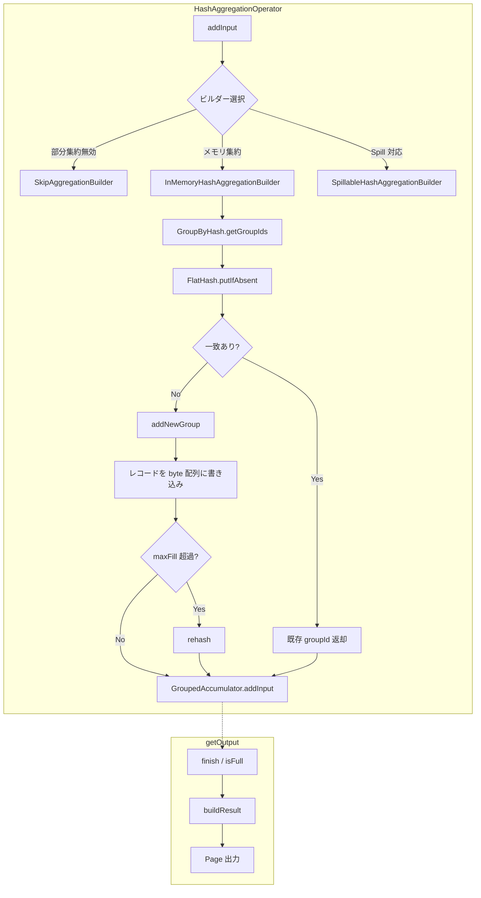

# 第15章 集約と Window 関数

> **本章で読むソース**
>
> - [`core/trino-main/src/main/java/io/trino/operator/HashAggregationOperator.java`](https://github.com/trinodb/trino/blob/482/core/trino-main/src/main/java/io/trino/operator/HashAggregationOperator.java)
> - [`core/trino-main/src/main/java/io/trino/operator/StreamingAggregationOperator.java`](https://github.com/trinodb/trino/blob/482/core/trino-main/src/main/java/io/trino/operator/StreamingAggregationOperator.java)
> - [`core/trino-main/src/main/java/io/trino/operator/GroupByHash.java`](https://github.com/trinodb/trino/blob/482/core/trino-main/src/main/java/io/trino/operator/GroupByHash.java)
> - [`core/trino-main/src/main/java/io/trino/operator/FlatGroupByHash.java`](https://github.com/trinodb/trino/blob/482/core/trino-main/src/main/java/io/trino/operator/FlatGroupByHash.java)
> - [`core/trino-main/src/main/java/io/trino/operator/FlatHash.java`](https://github.com/trinodb/trino/blob/482/core/trino-main/src/main/java/io/trino/operator/FlatHash.java)
> - [`core/trino-main/src/main/java/io/trino/operator/aggregation/Accumulator.java`](https://github.com/trinodb/trino/blob/482/core/trino-main/src/main/java/io/trino/operator/aggregation/Accumulator.java)
> - [`core/trino-main/src/main/java/io/trino/operator/aggregation/GroupedAccumulator.java`](https://github.com/trinodb/trino/blob/482/core/trino-main/src/main/java/io/trino/operator/aggregation/GroupedAccumulator.java)
> - [`core/trino-main/src/main/java/io/trino/operator/aggregation/Aggregator.java`](https://github.com/trinodb/trino/blob/482/core/trino-main/src/main/java/io/trino/operator/aggregation/Aggregator.java)
> - [`core/trino-main/src/main/java/io/trino/operator/aggregation/GroupedAggregator.java`](https://github.com/trinodb/trino/blob/482/core/trino-main/src/main/java/io/trino/operator/aggregation/GroupedAggregator.java)
> - [`core/trino-main/src/main/java/io/trino/operator/WindowOperator.java`](https://github.com/trinodb/trino/blob/482/core/trino-main/src/main/java/io/trino/operator/WindowOperator.java)
> - [`core/trino-main/src/main/java/io/trino/operator/window/RegularWindowPartition.java`](https://github.com/trinodb/trino/blob/482/core/trino-main/src/main/java/io/trino/operator/window/RegularWindowPartition.java)
> - [`core/trino-main/src/main/java/io/trino/operator/window/RangeFraming.java`](https://github.com/trinodb/trino/blob/482/core/trino-main/src/main/java/io/trino/operator/window/RangeFraming.java)
> - [`core/trino-main/src/main/java/io/trino/operator/window/AggregateWindowFunction.java`](https://github.com/trinodb/trino/blob/482/core/trino-main/src/main/java/io/trino/operator/window/AggregateWindowFunction.java)
> - [`core/trino-spi/src/main/java/io/trino/spi/function/WindowFunction.java`](https://github.com/trinodb/trino/blob/482/core/trino-spi/src/main/java/io/trino/spi/function/WindowFunction.java)
> - [`core/trino-main/src/main/java/io/trino/operator/TopNOperator.java`](https://github.com/trinodb/trino/blob/482/core/trino-main/src/main/java/io/trino/operator/TopNOperator.java)
> - [`core/trino-main/src/main/java/io/trino/operator/TopNRankingOperator.java`](https://github.com/trinodb/trino/blob/482/core/trino-main/src/main/java/io/trino/operator/TopNRankingOperator.java)

## この章の狙い

`GROUP BY` や `SUM()`、`COUNT()` は SQL の集約操作の基本であり、`ROW_NUMBER()` や `RANK()` は Window 関数の代表例である。
Trino はこれらを実行計画上の Operator として実装している。

本章では、ハッシュ集約とストリーミング集約の2種類の集約 Operator の内部処理を読み、その下で動く `FlatGroupByHash` のフラットメモリレイアウトがなぜ高速なのかを確認する。
さらに `WindowOperator` がパーティション分割からフレーム計算、関数呼び出しまでをどう進めるかを追い、最後に `TopNOperator` と `TopNRankingOperator` の仕組みを読む。

## 前提

- Trino の Operator インタフェース（`addInput` / `getOutput` / `finish` の呼び出しプロトコル）を理解していること。
- Page と Block のデータ構造（列指向のインメモリ表現）を知っていること。
- 分散プラン上で集約が部分集約（Partial）と最終集約（Final）の2段階に分かれることを把握していること（第10章）。

## HashAggregationOperator の全体構造

`GROUP BY` を含む集約クエリの実行を担う中心的な Operator が **HashAggregationOperator** である。
入力行をハッシュテーブルでグループ分けし、グループごとに集約関数の状態を蓄積して、`finish()` が呼ばれたときに結果を出力する。

### ビルダーの3分岐

`addInput` の最初の呼び出しで、状況に応じて3種類のビルダーのうち1つが生成される。

[`core/trino-main/src/main/java/io/trino/operator/HashAggregationOperator.java` L365-L407](https://github.com/trinodb/trino/blob/482/core/trino-main/src/main/java/io/trino/operator/HashAggregationOperator.java#L365-L407)

```java
if (aggregationBuilder == null) {
    boolean partialAggregationDisabled = partialAggregationController
            .map(PartialAggregationController::isPartialAggregationDisabled)
            .orElse(false);
    if (step.isOutputPartial() && partialAggregationDisabled) {
        aggregationBuilder = new SkipAggregationBuilder(groupByChannels, aggregatorFactories, memoryContext, aggregationMetrics);
    }
    else if (step.isOutputPartial() || !spillEnabled || !isSpillable()) {
        // ... (中略) ...
        aggregationBuilder = new InMemoryHashAggregationBuilder(
                aggregatorFactories,
                step,
                expectedGroups,
                groupByTypes,
                groupByChannels,
                false, // spillable
                operatorContext,
                maxPartialMemory,
                flatHashStrategyCompiler,
                () -> {
                    memoryContext.setBytes(((InMemoryHashAggregationBuilder) aggregationBuilder).getSizeInMemory());
                    // ... (中略) ...
                },
                aggregationMetrics);
    }
    else {
        aggregationBuilder = new SpillableHashAggregationBuilder(
                aggregatorFactories,
                step,
                // ... (中略) ...
                aggregationMetrics);
    }
```

3種類のビルダーはそれぞれ異なる戦略をとる。

- **SkipAggregationBuilder**：部分集約の効果が低い（カーディナリティが高く行数削減が見込めない）と `PartialAggregationController` が判断した場合に選ばれる。ハッシュテーブルを構築せず、入力行をそのまま通過させる。
- **InMemoryHashAggregationBuilder**：部分集約、または Spill が無効な最終集約で使われる。`GroupByHash` を用いて全グループをメモリ上に保持する。
- **SpillableHashAggregationBuilder**：Spill が有効な最終集約で使われる。メモリが逼迫するとハッシュテーブルの内容をディスクへ退避し、出力時にマージソートで結合する。

### 出力の状態遷移

`getOutput` メソッドは、蓄積フェーズから出力フェーズへの遷移を制御する。

[`core/trino-main/src/main/java/io/trino/operator/HashAggregationOperator.java` L447-L498](https://github.com/trinodb/trino/blob/482/core/trino-main/src/main/java/io/trino/operator/HashAggregationOperator.java#L447-L498)

```java
@Override
public Page getOutput()
{
    if (finished) {
        return null;
    }

    // process unfinished work if one exists
    if (unfinishedWork != null) {
        boolean workDone = unfinishedWork.process();
        aggregationBuilder.updateMemory();
        if (!workDone) {
            return null;
        }
        unfinishedWork = null;
    }

    if (outputPages == null) {
        if (finishing) {
            if (totalInputRowsProcessed == 0 && produceDefaultOutput) {
                // global aggregations always generate an output row with the default aggregation output (e.g. 0 for COUNT, NULL for SUM)
                finished = true;
                return getGlobalAggregationOutput();
            }
            // ... (中略) ...
        }

        // only flush if we are finishing or the aggregation builder is full
        if (!finishing && (aggregationBuilder == null || !aggregationBuilder.isFull())) {
            return null;
        }

        outputPages = aggregationBuilder.buildResult();
    }

    if (!outputPages.process()) {
        return null;
    }
    // ... (中略) ...
    Page result = outputPages.getResult();
    aggregationUniqueRowsProduced += result.getPositionCount();
    return result;
}
```

出力が始まるのは、上流から `finish()` が呼ばれたとき、またはビルダーが `isFull()` を返したとき（部分集約のメモリ上限に達した場合）の2つである。
部分集約では `isFull()` による途中フラッシュが発生しうる。
フラッシュ後、`closeAggregationBuilder()` でビルダーが破棄され、次の `addInput` で新しいビルダーが再び生成される。
この仕組みにより、部分集約は蓄積とフラッシュを繰り返す。

入力行が0件で `produceDefaultOutput` が true の場合（`SELECT COUNT(*) FROM empty_table` のようなグローバル集約）は、デフォルト値（`COUNT` なら 0、`SUM` なら NULL）を含む1行を生成する。

## StreamingAggregationOperator のストリーミング処理

入力がグループキーでソート済みの場合、ハッシュテーブルは不要である。
**StreamingAggregationOperator** は、隣接する行を比較してグループ境界を検出し、グループが変わるたびに集約結果を出力する。

### グループ境界の検出

[`core/trino-main/src/main/java/io/trino/operator/StreamingAggregationOperator.java` L272-L301](https://github.com/trinodb/trino/blob/482/core/trino-main/src/main/java/io/trino/operator/StreamingAggregationOperator.java#L272-L301)

```java
private void processInput(Page page)
{
    requireNonNull(page, "page is null");

    Page groupByPage = page.getColumns(groupByChannels);
    if (currentGroup != null) {
        if (!pagesHashStrategy.rowIdenticalToRow(0, currentGroup.getColumns(groupByChannels), 0, groupByPage)) {
            // page starts with new group, so flush it
            evaluateAndFlushGroup(currentGroup, 0);
        }
        currentGroup = null;
    }

    int startPosition = 0;
    while (true) {
        // may be equal to page.getPositionCount() if the end is not found in this page
        int nextGroupStart = findNextGroupStart(startPosition, groupByPage);
        addRowsToAggregates(page, startPosition, nextGroupStart - 1);

        if (nextGroupStart < page.getPositionCount()) {
            // current group stops somewhere in the middle of the page, so flush it
            evaluateAndFlushGroup(page, startPosition);
            startPosition = nextGroupStart;
        }
        else {
            currentGroup = page.getRegion(page.getPositionCount() - 1, 1);
            return;
        }
    }
}
```

`findNextGroupStart` は Page 内を線形スキャンし、`pagesHashStrategy.rowIdenticalToRow` でグループキーが変化した位置を返す。
同一グループの連続行は `addRowsToAggregates` でまとめて `Aggregator` に渡される。

グループが Page をまたぐ場合への対処が `currentGroup` フィールドである。
前の Page の末尾行を1行保存しておき、次の Page の先頭行と比較することで、Page 境界をまたぐ同一グループを正しく処理する。

### グループ切り替え時のフラッシュ

[`core/trino-main/src/main/java/io/trino/operator/StreamingAggregationOperator.java` L311-L331](https://github.com/trinodb/trino/blob/482/core/trino-main/src/main/java/io/trino/operator/StreamingAggregationOperator.java#L311-L331)

```java
private void evaluateAndFlushGroup(Page page, int position)
{
    pageBuilder.declarePosition();
    for (int i = 0; i < groupByTypes.size(); i++) {
        Block block = page.getBlock(groupByChannels[i]);
        pageBuilder.getBlockBuilder(i).append(block.getUnderlyingValueBlock(), block.getUnderlyingValuePosition(position));
    }
    int offset = groupByTypes.size();
    for (int i = 0; i < aggregates.size(); i++) {
        aggregates.get(i).evaluate(pageBuilder.getBlockBuilder(offset + i));
    }

    if (pageBuilder.isFull()) {
        outputPages.add(pageBuilder.build());
        pageBuilder.reset();
    }

    aggregates = aggregatorFactories.stream()
            .map(factory -> factory.createAggregator(aggregationMetrics))
            .collect(toImmutableList());
}
```

グループが切り替わると、現在の `Aggregator` の結果を `PageBuilder` へ書き出す。
注目すべき点は、`Aggregator` のリセット方法である。
状態をリセットするメソッドは用意されておらず、代わりにファクトリから新しい `Aggregator` インスタンスを生成している（L328-L330）。
これは状態漏洩を防ぐ単純な設計であり、オブジェクト再生成のコストよりも安全性を優先している。

## Accumulator インタフェースと集約の2段階処理

集約関数の状態管理は **Accumulator** インタフェースと **GroupedAccumulator** インタフェースが担う。

### Accumulator（単一グループ用）

[`core/trino-main/src/main/java/io/trino/operator/aggregation/Accumulator.java` L20-L33](https://github.com/trinodb/trino/blob/482/core/trino-main/src/main/java/io/trino/operator/aggregation/Accumulator.java#L20-L33)

```java
public interface Accumulator
{
    long getEstimatedSize();

    Accumulator copy();

    void addInput(Page arguments, AggregationMask mask);

    void addIntermediate(Block block);

    void evaluateIntermediate(BlockBuilder blockBuilder);

    void evaluateFinal(BlockBuilder blockBuilder);
}
```

`addInput` は生の入力行を受け取り、`addIntermediate` は他の Worker が出力した中間状態を受け取る。
出力側も `evaluateIntermediate`（部分集約の中間結果）と `evaluateFinal`（最終結果）に分かれている。

### GroupedAccumulator（複数グループ用）

[`core/trino-main/src/main/java/io/trino/operator/aggregation/GroupedAccumulator.java` L20-L35](https://github.com/trinodb/trino/blob/482/core/trino-main/src/main/java/io/trino/operator/aggregation/GroupedAccumulator.java#L20-L35)

```java
public interface GroupedAccumulator
{
    long getEstimatedSize();

    void setGroupCount(int groupCount);

    void addInput(int[] groupIds, Page page, AggregationMask mask);

    void addIntermediate(int[] groupIds, Block block);

    void evaluateIntermediate(int groupId, BlockBuilder output);

    void evaluateFinal(int groupId, BlockBuilder output);

    void prepareFinal();
}
```

`GroupedAccumulator` は `HashAggregationOperator` が使う。
`addInput` に渡される `int[] groupIds` は、Page の各行がどのグループに属するかを示す配列であり、`GroupByHash.getGroupIds` が返す値がそのまま使われる。

### Aggregator ラッパーの Step 分岐

`Aggregator` クラスは `Accumulator` を薄く包み、`Step`（`PARTIAL` / `FINAL` / `INTERMEDIATE` / `SINGLE`）に応じて入出力メソッドを切り替える。

[`core/trino-main/src/main/java/io/trino/operator/aggregation/Aggregator.java` L71-L93](https://github.com/trinodb/trino/blob/482/core/trino-main/src/main/java/io/trino/operator/aggregation/Aggregator.java#L71-L93)

```java
public void processPage(Page page)
{
    if (step.isInputRaw()) {
        Page arguments = page.getColumns(inputChannels);
        Optional<Block> maskBlock = Optional.empty();
        if (maskChannel.isPresent()) {
            maskBlock = Optional.of(page.getBlock(maskChannel.getAsInt()));
        }
        AggregationMask mask = maskBuilder.buildAggregationMask(arguments, maskBlock);

        if (mask.isSelectNone()) {
            return;
        }
        long start = System.nanoTime();
        accumulator.addInput(arguments, mask);
        metrics.recordAccumulatorUpdateTimeSince(start);
    }
    else {
        long start = System.nanoTime();
        accumulator.addIntermediate(page.getBlock(inputChannels[0]));
        metrics.recordAccumulatorUpdateTimeSince(start);
    }
}
```

`step.isInputRaw()` が true のとき（`PARTIAL` または `SINGLE`）は、入力列の抽出とマスク構築を行ったうえで `addInput` を呼ぶ。
false のとき（`FINAL` または `INTERMEDIATE`）は、前段の部分集約が出力した中間状態を `addIntermediate` で受け取る。
この分岐により、同じ `Accumulator` 実装が部分集約と最終集約の両方で再利用される。

## FlatGroupByHash のフラットメモリレイアウト

`GroupByHash` はグループキーからグループ ID への対応を管理するインタフェースである。

[`core/trino-main/src/main/java/io/trino/operator/GroupByHash.java` L82-L100](https://github.com/trinodb/trino/blob/482/core/trino-main/src/main/java/io/trino/operator/GroupByHash.java#L82-L100)

```java
static GroupByHash createGroupByHash(
        List<Type> types,
        boolean cacheHashValue,
        int expectedSize,
        boolean dictionaryAggregationEnabled,
        FlatHashStrategyCompiler hashStrategyCompiler,
        UpdateMemory updateMemory)
{
    if (types.size() == 1 && types.get(0).equals(BIGINT)) {
        return new BigintGroupByHash(expectedSize, updateMemory);
    }
    return new FlatGroupByHash(
            types,
            cacheHashValue,
            expectedSize,
            dictionaryAggregationEnabled,
            hashStrategyCompiler,
            updateMemory);
}
```

グループキーが `BIGINT` 1列の場合は専用の `BigintGroupByHash` が使われ、それ以外は **FlatGroupByHash** が使われる。
`FlatGroupByHash` は内部に `FlatHash` を保持し、Swiss Table 方式のハッシュテーブルでグループを管理する。

### FlatHash のレコードレイアウト

`FlatHash` の核心は、グループキーのデータを Java オブジェクトではなく `byte[]` 配列に直接シリアライズするフラットメモリレイアウトである。

[`core/trino-main/src/main/java/io/trino/operator/FlatHash.java` L64-L82](https://github.com/trinodb/trino/blob/482/core/trino-main/src/main/java/io/trino/operator/FlatHash.java#L64-L82)

```java
private final FlatHashStrategy flatHashStrategy;
private final AppendOnlyVariableWidthData variableWidthData;
private final UpdateMemory checkMemoryReservation;

private final boolean cacheHashValue;
private final int fixedRecordSize;
private final int variableWidthOffset;
private final int fixedValueOffset;

private byte[] control;
private int[] groupIdsByHash;
private byte[][] fixedSizeRecords;

private long fixedRecordGroupsRetainedSize;
private long temporaryRehashRetainedSize;
private int capacity;
private int mask;
private int nextGroupId;
private int maxFill;
```

3つの並列データ構造でハッシュテーブルを構成する。

- **`control`**（`byte[]`）：Swiss Table 方式のコントロールバイト配列。各スロットにハッシュ値の下位7ビットを格納し、空きスロットは `0x00` とする。
- **`groupIdsByHash`**（`int[]`）：ハッシュテーブルのスロットからグループ ID への対応。
- **`fixedSizeRecords`**（`byte[][]`）：グループキーのデータを格納するレコード配列。1024件ごとのチャンクに分割されている。

レコード1件の内部構造はコメントに記されている。

[`core/trino-main/src/main/java/io/trino/operator/FlatHash.java` L92-L98](https://github.com/trinodb/trino/blob/482/core/trino-main/src/main/java/io/trino/operator/FlatHash.java#L92-L98)

```java
// the record is laid out as follows:
// 1. optional raw hash (long)
// 2. optional variable width pointer (int chunkIndex, int chunkOffset)
// 3. fixed data for each type
this.variableWidthOffset = cacheHashValue ? Long.BYTES : 0;
this.fixedValueOffset = variableWidthOffset + (hasVariableData ? AppendOnlyVariableWidthData.POINTER_SIZE : 0);
this.fixedRecordSize = fixedValueOffset + flatHashStrategy.getTotalFlatFixedLength();
```

オプションのハッシュキャッシュ（8バイト）、オプションの可変長ポインタ（8バイト）、固定長列データが連結されて1レコードになる。
すべてが `byte[]` 上に直列化されるため、Java オブジェクトのヘッダやポインタによるオーバーヘッドが発生しない。

### Swiss Table 方式の探索

`putIfAbsent` はハッシュ値を計算し、コントロールバイト配列を SWAR（SIMD Within A Register）技法で8バイトずつ探索する。

[`core/trino-main/src/main/java/io/trino/operator/FlatHash.java` L276-L301](https://github.com/trinodb/trino/blob/482/core/trino-main/src/main/java/io/trino/operator/FlatHash.java#L276-L301)

```java
private int getIndex(Block[] blocks, int position, long hash)
{
    checkState(!isReleasingOutput(), "already releasing output");
    byte hashPrefix = (byte) (hash & 0x7F | 0x80);
    int bucket = bucket((int) (hash >> 7));

    int step = 1;
    long repeated = repeat(hashPrefix);

    while (true) {
        final long controlVector = (long) LONG_HANDLE.get(control, bucket);

        int matchIndex = matchInVector(blocks, position, hash, bucket, repeated, controlVector);
        if (matchIndex >= 0) {
            return matchIndex;
        }

        int emptyIndex = findEmptyInVector(controlVector, bucket);
        if (emptyIndex >= 0) {
            return -emptyIndex - 1;
        }

        bucket = bucket(bucket + step);
        step += VECTOR_LENGTH;
    }
}
```

ハッシュ値の下位7ビットにフラグビット `0x80` を立てたものがコントロールバイトとなり、上位ビットがバケット位置を決める。
`LONG_HANDLE.get(control, bucket)` で8バイト（8スロット分）を一度に読み出し、`match` 関数で一致するコントロールバイトを SWAR でビット並列に検出する。

[`core/trino-main/src/main/java/io/trino/operator/FlatHash.java` L503-L513](https://github.com/trinodb/trino/blob/482/core/trino-main/src/main/java/io/trino/operator/FlatHash.java#L503-L513)

```java
private static long repeat(byte value)
{
    return ((value & 0xFF) * 0x01_01_01_01_01_01_01_01L);
}

private static long match(long vector, long repeatedValue)
{
    // HD 6-1
    long comparison = vector ^ repeatedValue;
    return (comparison - 0x01_01_01_01_01_01_01_01L) & ~comparison & 0x80_80_80_80_80_80_80_80L;
}
```

`repeat` は1バイトの値を8バイト全体に複製する。
`match` は Hacker's Delight 6-1 のバイト一致検出アルゴリズムで、XOR の結果が0のバイト（一致）に対応するビットを立てた値を返す。
この手法により、SIMD 命令を使わずに8スロットの同時比較が可能になる。

### 新グループの追加とリハッシュ

一致するエントリが見つからない場合、`addNewGroup` が呼ばれて新しいグループが登録される。

[`core/trino-main/src/main/java/io/trino/operator/FlatHash.java` L328-L367](https://github.com/trinodb/trino/blob/482/core/trino-main/src/main/java/io/trino/operator/FlatHash.java#L328-L367)

```java
private int addNewGroup(int index, Block[] blocks, int position, long hash)
{
    setControl(index, (byte) (hash & 0x7F | 0x80));
    int groupId = nextGroupId++;
    groupIdsByHash[index] = groupId;
    int recordGroupIndex = recordGroupIndexForGroupId(groupId);
    int fixedRecordOffset = getFixedRecordOffset(groupId);
    byte[] fixedSizeRecords = this.fixedSizeRecords[recordGroupIndex];
    if (fixedRecordOffset == 0) {
        // ... (中略) ...
        // new record batch start, populate the record batch fields
        fixedSizeRecords = new byte[multiplyExact(RECORDS_PER_GROUP, fixedRecordSize)];
        this.fixedSizeRecords[recordGroupIndex] = fixedSizeRecords;
        // ... (中略) ...
    }

    if (cacheHashValue) {
        LONG_HANDLE.set(fixedSizeRecords, fixedRecordOffset, hash);
    }
    // ... (中略) ...
    flatHashStrategy.writeFlat(
            blocks,
            position,
            fixedSizeRecords,
            fixedRecordOffset + fixedValueOffset,
            variableWidthChunk,
            variableWidthChunkOffset);

    return groupId;
}
```

`fixedSizeRecords` は1024件ごとのチャンクで管理されている。
グループ ID からチャンクインデックスとオフセットへの変換は単純なビットシフトとマスクである。

[`core/trino-main/src/main/java/io/trino/operator/FlatHash.java` L449-L462](https://github.com/trinodb/trino/blob/482/core/trino-main/src/main/java/io/trino/operator/FlatHash.java#L449-L462)

```java
private static int recordGroupIndexForGroupId(int groupId)
{
    return groupId >> RECORDS_PER_GROUP_SHIFT;
}

// ... (中略) ...

private int getFixedRecordOffset(int groupId)
{
    return (groupId & RECORDS_PER_GROUP_MASK) * fixedRecordSize;
}
```

エントリ数が `maxFill`（容量の 15/16）に達すると、`rehash` が実行される。

[`core/trino-main/src/main/java/io/trino/operator/FlatHash.java` L400-L442](https://github.com/trinodb/trino/blob/482/core/trino-main/src/main/java/io/trino/operator/FlatHash.java#L400-L442)

```java
private void rehash(int minimumRequiredCapacity)
{
    capacity = computeNewCapacity(minimumRequiredCapacity);
    maxFill = calculateMaxFill(capacity);
    mask = capacity - 1;

    // Resize the record groups top level array to accommodate the new record groups
    fixedSizeRecords = Arrays.copyOf(fixedSizeRecords, recordGroupsRequiredForCapacity(capacity));

    // Construct the new hash table
    control = new byte[capacity + VECTOR_LENGTH];
    groupIdsByHash = new int[capacity];
    Arrays.fill(groupIdsByHash, -1);

    for (int groupId = 0; groupId < nextGroupId; groupId++) {
        long hash = hashPosition(groupId);
        // ... (中略) ...
        // values are already distinct, so just find the first empty slot
        // ... (中略) ...
    }
    // ... (中略) ...
}
```

リハッシュで再構築されるのは `control` と `groupIdsByHash` だけであり、`fixedSizeRecords` のデータは移動しない。
レコードの実体はグループ ID で直接参照されるため、ハッシュテーブルの構造とレコード格納が分離されている。
この分離により、リハッシュのコストはレコードデータのコピーを含まず、コントロールバイトとグループ ID 配列の再構築だけで済む。

### バッチハッシュ計算と辞書最適化

`FlatGroupByHash` は `FlatHash` を包み、入力 Block の種類に応じた4つの Work 実装を使い分ける。

[`core/trino-main/src/main/java/io/trino/operator/FlatGroupByHash.java` L338-L374](https://github.com/trinodb/trino/blob/482/core/trino-main/src/main/java/io/trino/operator/FlatGroupByHash.java#L338-L374)

```java
class AddNonDictionaryPageWork
        implements Work<Void>
{
    private final Block[] blocks;
    private int lastPosition;
    // ... (中略) ...
    @Override
    public boolean process()
    {
        int positionCount = blocks[0].getPositionCount();
        // ... (中略) ...
        long[] hashes = getHashesBufferArray();
        while (remainingPositions != 0) {
            int batchSize = min(remainingPositions, hashes.length);
            if (!flatHash.ensureAvailableCapacity(batchSize)) {
                return false;
            }

            hashGenerator.hashBlocksBatched(blocks, hashes, lastPosition, batchSize);
            for (int i = 0; i < batchSize; i++) {
                flatHash.putIfAbsent(blocks, lastPosition + i, hashes[i]);
            }
            // ... (中略) ...
        }
        // ... (中略) ...
    }
}
```

`AddNonDictionaryPageWork` はハッシュ値を1024件ずつバッチ計算してから `putIfAbsent` を呼ぶ。
行ごとにハッシュ計算と挿入を交互に行うよりも、バッチ計算でキャッシュ局所性を高めている。

辞書エンコードされた Block に対しては、辞書の各エントリに対してのみハッシュ探索を行い、同じ辞書値を共有する行のハッシュ探索を省略する `AddDictionaryPageWork` が使われる。
さらに低カーディナリティの辞書に対しては、複数列の辞書値の組み合わせをインデックス化し、一意な組み合わせだけを挿入する `AddLowCardinalityDictionaryPageWork` が用意されている。
Run-Length Encoded Block に対しては、先頭1行だけを挿入する `AddRunLengthEncodedPageWork` が使われる。



## 高速化の工夫：FlatHash のフラットメモリレイアウト

`FlatHash` が高速である理由は、GC 負荷の削減とキャッシュ局所性の向上にある。

通常の Java HashMap では、エントリごとに Map.Entry オブジェクト、キーオブジェクト、値オブジェクトが生成される。
数百万グループの集約では数千万のオブジェクトが生成され、GC のスキャン対象が膨張する。

`FlatHash` はグループキーのデータを `byte[]` 配列に直接シリアライズする[^1]。
Java オブジェクトのヘッダ（16バイト）やポインタ（8バイト）によるオーバーヘッドが存在しない。
レコードは1024件ずつの `byte[]` チャンクに連続して配置されるため、隣接グループへのアクセスが CPU キャッシュライン上で完結しやすい。

Swiss Table 方式のコントロールバイト配列は、8バイト（8スロット分）を1回のメモリアクセスで読み出し、SWAR による並列比較で一致判定を行う。
空きスロットの検出も同じ手法で行われるため、オープンアドレッシングの探索コストが低い。

負荷率の上限が 15/16（93.75%）と高く設定されているのも、この効率的な探索方式があるからである。
高い負荷率はメモリ効率を向上させ、リハッシュの頻度を下げる。

## WindowOperator のパーティション処理

Window 関数（`ROW_NUMBER()`、`RANK()`、`SUM() OVER (...)`）は **WindowOperator** が実行する。
この Operator は `WorkProcessor` のパイプラインとして構築され、4つの段階を経て出力を生成する。

### 4段階のパイプライン

[`core/trino-main/src/main/java/io/trino/operator/WindowOperator.java` L525-L586](https://github.com/trinodb/trino/blob/482/core/trino-main/src/main/java/io/trino/operator/WindowOperator.java#L525-L586)

```java
private class PagesToPagesIndexes
        implements Transformation<Page, PagesIndexWithHashStrategies>
{
    // ... (中略) ...
    @Override
    public TransformationState<PagesIndexWithHashStrategies> process(Page pendingInput)
    {
        if (resetPagesIndex) {
            pagesIndexWithHashStrategies.pagesIndex.clear();
            updateMemoryUsage();
            resetPagesIndex = false;
        }

        boolean finishing = pendingInput == null;
        if (finishing && pagesIndexWithHashStrategies.pagesIndex.getPositionCount() == 0) {
            memoryContext.close();
            return TransformationState.finished();
        }

        if (!finishing) {
            pendingInputPosition = updatePagesIndex(pagesIndexWithHashStrategies, pendingInput, pendingInputPosition, Optional.empty());
            updateMemoryUsage();
        }

        // If we have unused input or are finishing, then we have buffered a full group
        if (finishing || pendingInputPosition < pendingInput.getPositionCount()) {
            sortPagesIndexIfNecessary(pagesIndexWithHashStrategies.pagesIndex, pagesIndexWithHashStrategies.preSortedPartitionHashStrategy, pagesIndexOrdering);
            resetPagesIndex = true;
            return TransformationState.ofResult(pagesIndexWithHashStrategies, false);
        }

        pendingInputPosition = 0;
        return TransformationState.needsMoreData();
    }
}
```

4つの段階を順に説明する。

1. **Page の蓄積**（`PagesToPagesIndexes`）：入力 Page を `PagesIndex` に蓄積する。`updatePagesIndex` がプリグループ列の値が変わった位置を検出し、1つのパーティショングループ分のデータが揃った時点で次の段階へ渡す。蓄積が完了すると `sortPagesIndexIfNecessary` でソートチャネルに基づいてソートする。
2. **パーティション分割**（`pagesIndexToWindowPartitions`）：ソート済みの `PagesIndex` からパーティション境界を検出し、各パーティションを `WindowPartition` オブジェクトとして生成する。
3. **行ごとの Window 関数評価**（`WindowPartitionsToOutputPages`）：各 `WindowPartition` の行を1行ずつ処理し、Window 関数の結果を出力列に追加する。
4. **Page の出力**：`PageBuilder` が満杯になるたびに出力 Page を生成する。

### パーティション分割

[`core/trino-main/src/main/java/io/trino/operator/WindowOperator.java` L588-L625](https://github.com/trinodb/trino/blob/482/core/trino-main/src/main/java/io/trino/operator/WindowOperator.java#L588-L625)

```java
private WorkProcessor<WindowPartition> pagesIndexToWindowPartitions(PagesIndexWithHashStrategies pagesIndexWithHashStrategies)
{
    PagesIndex pagesIndex = pagesIndexWithHashStrategies.pagesIndex;

    // pagesIndex contains the full grouped & sorted data for one or more partitions

    windowInfo.addIndex(pagesIndex);

    return WorkProcessor.create(new WorkProcessor.Process<>()
    {
        int partitionStart;

        @Override
        public ProcessState<WindowPartition> process()
        {
            if (partitionStart == pagesIndex.getPositionCount()) {
                return ProcessState.finished();
            }

            int partitionEnd = findGroupEnd(pagesIndex, pagesIndexWithHashStrategies.unGroupedPartitionHashStrategy, partitionStart);

            WindowPartition partition = partitioner.createPartition(
                    pagesIndex,
                    partitionStart,
                    partitionEnd,
                    outputChannels,
                    windowFunctions,
                    frames,
                    pagesIndexWithHashStrategies.peerGroupHashStrategy,
                    pagesIndexWithHashStrategies.frameBoundComparators,
                    operatorContext.aggregateUserMemoryContext());
            // ... (中略) ...
            partitionStart = partitionEnd;
            return ProcessState.ofResult(partition);
        }
    });
}
```

`findGroupEnd` はパーティションキーが変化する位置を線形スキャンで見つける。
各パーティション範囲 `[partitionStart, partitionEnd)` に対して `WindowPartition` が生成される。

### RegularWindowPartition の行処理

[`core/trino-main/src/main/java/io/trino/operator/window/RegularWindowPartition.java` L147-L177](https://github.com/trinodb/trino/blob/482/core/trino-main/src/main/java/io/trino/operator/window/RegularWindowPartition.java#L147-L177)

```java
@Override
public void processNextRow(PageBuilder pageBuilder)
{
    checkState(hasNext(), "No more rows in partition");

    // copy output channels
    pageBuilder.declarePosition();
    int channel = 0;
    while (channel < outputChannels.length) {
        pagesIndex.appendTo(outputChannels[channel], currentPosition, pageBuilder.getBlockBuilder(channel));
        channel++;
    }

    // check for new peer group
    if (currentPosition == peerGroupEnd) {
        updatePeerGroup();
    }

    for (int i = 0; i < windowFunctions.size(); i++) {
        WindowFunction windowFunction = windowFunctions.get(i);
        Framing.Range range = framings.get(i).getRange(currentPosition, currentGroupIndex, peerGroupStart, peerGroupEnd);
        windowFunction.processRow(
                pageBuilder.getBlockBuilder(channel),
                peerGroupStart - partitionStart,
                peerGroupEnd - partitionStart - 1,
                range.getStart(),
                range.getEnd());
        channel++;
    }

    currentPosition++;
}
```

1行ごとの処理は次の3ステップからなる。

1. 出力チャネル（元の列）の値を `PageBuilder` にコピーする。
2. 現在位置がピアグループの末尾に達していれば、`updatePeerGroup` で次のピアグループの範囲を計算する。ピアグループとは、ORDER BY 列の値が等しい連続行の集まりである。
3. 各 Window 関数について、`Framing.getRange` でフレーム範囲を計算し、`WindowFunction.processRow` を呼び出す。

### WindowFunction インタフェース

[`core/trino-spi/src/main/java/io/trino/spi/function/WindowFunction.java` L18-L42](https://github.com/trinodb/trino/blob/482/core/trino-spi/src/main/java/io/trino/spi/function/WindowFunction.java#L18-L42)

```java
public interface WindowFunction
{
    /**
     * Reset state for a new partition (including the first one).
     *
     * @param windowIndex the window index which contains sorted values for the partition
     */
    void reset(WindowIndex windowIndex);

    /**
     * Process a row by outputting the result of the window function.
     * // ... (中略) ...
     * @param peerGroupStart the position of the first row in the peer group
     * @param peerGroupEnd the position of the last row in the peer group
     * @param frameStart the position of the first row in the window frame
     * @param frameEnd the position of the last row in the window frame
     */
    void processRow(BlockBuilder output, int peerGroupStart, int peerGroupEnd, int frameStart, int frameEnd);
}
```

`reset` はパーティションが切り替わるたびに呼ばれ、`WindowIndex`（パーティション内のソート済みデータへのアクセス手段）を受け取る。
`processRow` は行ごとに呼ばれ、ピアグループ範囲とフレーム範囲を引数として受け取る。

## フレーム計算と RangeFraming の漸進的探索

Window 関数のフレーム（`ROWS BETWEEN ...` や `RANGE BETWEEN ...`）は `Framing` インタフェースの実装が計算する。
フレームの種類に応じて `RowsFraming`、`RangeFraming`、`GroupsFraming` が使い分けられる。

### RangeFraming の recentRange 最適化

`RangeFraming` は前の行で計算したフレーム範囲を起点にして、次の行のフレーム範囲を漸進的に探索する。

[`core/trino-main/src/main/java/io/trino/operator/window/RangeFraming.java` L42-L49](https://github.com/trinodb/trino/blob/482/core/trino-main/src/main/java/io/trino/operator/window/RangeFraming.java#L42-L49)

```java
// Recently computed frame bounds.
// When computing frame start and frame end for a row, frame bounds for the previous row
// are used as the starting point. Then they are moved backward or forward based on the sort order
// until the matching position for a current row is found.
// This approach is efficient in case when frame offset values are constant. It was chosen
// based on the assumption that in most use cases frame offset is constant rather than
// row-dependent.
private Range recentRange;
```

この `recentRange` フィールドにより、フレームオフセットが定数の場合（`RANGE BETWEEN 10 PRECEDING AND CURRENT ROW` など）、フレーム境界の移動量は通常1行ずつとなり、パーティション全体での計算量が O(n) で済む。
行ごとにパーティション全体をスキャンすると O(n^2) になるため、この漸進的探索は大きなパーティションで効果を発揮する。

`seek` メソッドが実際の探索を行う。

[`core/trino-main/src/main/java/io/trino/operator/window/RangeFraming.java` L255-L289](https://github.com/trinodb/trino/blob/482/core/trino-main/src/main/java/io/trino/operator/window/RangeFraming.java#L255-L289)

```java
private int seek(
        int currentPosition,
        PagesIndexComparator comparator,
        int sortKeyChannel,
        int position,
        int step,
        boolean reverse,
        int limit,
        Predicate<Integer> bound)
{
    int comparison = compare(comparator, partitionStart + position, currentPosition, reverse);
    while (comparison < 0) {
        position -= step;
        // ... (中略) ...
        comparison = compare(comparator, partitionStart + position, currentPosition, reverse);
    }
    while (true) {
        if (position == limit || pagesIndex.isNull(sortKeyChannel, partitionStart + position + step)) {
            break;
        }
        int newComparison = compare(comparator, partitionStart + position + step, currentPosition, reverse);
        if (newComparison >= 0) {
            position += step;
        }
        else {
            break;
        }
    }

    return position;
}
```

前回の `recentRange` の位置から開始し、比較結果に応じて前方または後方へ1ステップずつ移動する。
ソート済みデータに対して比較器を使うため、この移動は単調であり、バックトラックは発生しない。

## AggregateWindowFunction の差分計算

集約関数を Window 関数として使う場合（`SUM(x) OVER (...)`）は **AggregateWindowFunction** がアダプタとして機能する。

[`core/trino-main/src/main/java/io/trino/operator/window/AggregateWindowFunction.java` L52-L68](https://github.com/trinodb/trino/blob/482/core/trino-main/src/main/java/io/trino/operator/window/AggregateWindowFunction.java#L52-L68)

```java
@Override
public void processRow(BlockBuilder output, int peerGroupStart, int peerGroupEnd, int frameStart, int frameEnd)
{
    if (frameStart < 0) {
        // empty frame
        resetAccumulator();
    }
    else if ((frameStart == currentStart) && (frameEnd >= currentEnd)) {
        // same or expanding frame
        accumulate(currentEnd + 1, frameEnd);
        currentEnd = frameEnd;
    }
    else {
        buildNewFrame(frameStart, frameEnd);
    }

    accumulator.output(output);
}
```

3つの分岐がある。

- **空フレーム**（`frameStart < 0`）：アキュムレータをリセットする。
- **同一または拡大するフレーム**（開始位置が同じで終了位置が同じか後方に移動）：新しく追加された行だけを差分でアキュムレータに加える。`ROWS BETWEEN UNBOUNDED PRECEDING AND CURRENT ROW` のようなフレームでは、行が進むたびにこの分岐に入り、毎回1行分だけの追加で済む。
- **それ以外**：`buildNewFrame` で重複部分の差分更新を試みる。`hasRemoveInput` が true（`removeInput` をサポートする集約関数）であれば、古い行の除去と新しい行の追加で差分更新を行う。重複部分が小さい場合はリセットして全件再計算する。

[`core/trino-main/src/main/java/io/trino/operator/window/AggregateWindowFunction.java` L70-L107](https://github.com/trinodb/trino/blob/482/core/trino-main/src/main/java/io/trino/operator/window/AggregateWindowFunction.java#L70-L107)

```java
private void buildNewFrame(int frameStart, int frameEnd)
{
    if (hasRemoveInput) {
        // ... (中略) ...
        int overlapStart = max(frameStart, currentStart);
        int overlapEnd = min(frameEnd, currentEnd);
        int prefixRemoveLength = overlapStart - currentStart;
        int suffixRemoveLength = currentEnd - overlapEnd;

        if ((overlapEnd - overlapStart + 1) > (prefixRemoveLength + suffixRemoveLength)) {
            // It's worth keeping the overlap, and removing the now-unused prefix
            if (currentStart < frameStart && !remove(currentStart, frameStart - 1)) {
                resetNewFrame(frameStart, frameEnd);
                return;
            }
            // ... (中略) ...
            currentStart = frameStart;
            currentEnd = frameEnd;
            return;
        }
    }

    // We couldn't or didn't want to modify the accumulation: instead, discard the current accumulation and start fresh.
    resetNewFrame(frameStart, frameEnd);
}
```

重複部分が除去対象より大きい場合にのみ差分更新が選択される。
重複部分の維持コスト（除去操作）と再計算コスト（全件蓄積）を比較する判定基準が `(overlapEnd - overlapStart + 1) > (prefixRemoveLength + suffixRemoveLength)` である。

## TopNOperator

`ORDER BY ... LIMIT n` は **TopNOperator** が実行する。
全行をソートする代わりに、上位 n 件だけを保持するヒープを用いる。

[`core/trino-main/src/main/java/io/trino/operator/TopNOperator.java` L115-L134](https://github.com/trinodb/trino/blob/482/core/trino-main/src/main/java/io/trino/operator/TopNOperator.java#L115-L134)

```java
private TopNOperator(
        OperatorContext operatorContext,
        WorkProcessor<Page> sourcePages,
        List<Type> types,
        int n,
        PageWithPositionComparator comparator)
{
    if (n == 0) {
        pages = WorkProcessor.of();
    }
    else {
        pages = sourcePages.transform(
                new TopNPages(
                        new TopNProcessor(
                                operatorContext.aggregateUserMemoryContext(),
                                types,
                                n,
                                comparator)));
    }
}
```

`TopNProcessor` が入力 Page を受け取りながら上位 n 件を内部のヒープで管理する。
`n == 0` の場合は空の `WorkProcessor` を返す。

入力がすべて到着すると（`inputPage == null`）、`TopNPages` の `process` メソッドが `topNProcessor.getOutput()` を繰り返し呼び出して結果を出力する。

[`core/trino-main/src/main/java/io/trino/operator/TopNOperator.java` L152-L172](https://github.com/trinodb/trino/blob/482/core/trino-main/src/main/java/io/trino/operator/TopNOperator.java#L152-L172)

```java
@Override
public TransformationState<Page> process(Page inputPage)
{
    if (inputPage != null) {
        topNProcessor.addInput(inputPage);
        return TransformationState.needsMoreData();
    }

    // no more input, return results
    Page page = null;
    while (page == null && !topNProcessor.noMoreOutput()) {
        page = topNProcessor.getOutput();
    }

    if (page != null) {
        return TransformationState.ofResult(page, false);
    }

    return TransformationState.finished();
}
```

全入力を蓄積フェーズ（`needsMoreData`）で受け取り、入力終了後に出力フェーズへ遷移する。
全行ソートの O(n log n) に対して、ヒープベースの Top-N は O(n log k)（k は LIMIT 値）で済むため、k が小さい場合に有利である。

## TopNRankingOperator

`ROW_NUMBER() OVER (PARTITION BY ... ORDER BY ...) <= n` や `RANK() OVER (...) <= n` のパターンは **TopNRankingOperator** が実行する。
Window 関数の計算とフィルタリングを1つの Operator に融合することで、パーティション全体をメモリに蓄積する必要がなくなる。

### ランキング種別によるビルダー選択

[`core/trino-main/src/main/java/io/trino/operator/TopNRankingOperator.java` L241-L279](https://github.com/trinodb/trino/blob/482/core/trino-main/src/main/java/io/trino/operator/TopNRankingOperator.java#L241-L279)

```java
private static Supplier<GroupedTopNBuilder> getGroupedTopNBuilderSupplier(
        RankingType rankingType,
        // ... (中略) ...
        Supplier<GroupByHash> groupByHashSupplier)
{
    if (rankingType == RankingType.ROW_NUMBER) {
        return () -> new GroupedTopNRowNumberBuilder(
                sourceTypes,
                comparator,
                maxRankingPerPartition,
                generateRanking,
                groupByChannels,
                groupByHashSupplier.get());
    }
    if (rankingType == RankingType.RANK) {
        List<Type> sortTypes = sortChannels.stream()
                .map(sourceTypes::get)
                .collect(toImmutableList());
        PageWithPositionEqualsAndHash equalsAndHash = new SimplePageWithPositionEqualsAndHash(sortTypes, sortChannels, blockTypeOperators);
        return () -> new GroupedTopNRankBuilder(
                sourceTypes,
                comparator,
                equalsAndHash,
                maxRankingPerPartition,
                generateRanking,
                groupByChannels,
                groupByHashSupplier.get());
    }
    if (rankingType == RankingType.DENSE_RANK) {
        throw new UnsupportedOperationException();
    }
    // ... (中略) ...
}
```

`ROW_NUMBER` には `GroupedTopNRowNumberBuilder`、`RANK` には `GroupedTopNRankBuilder` が使われる。
`DENSE_RANK` はこの Operator では未対応であり、通常の `WindowOperator` にフォールバックする。

どちらのビルダーも `GroupByHash` でパーティションを管理し、パーティションごとに上位 n 件のヒープを保持する。
部分集約（`partial = true`）の場合は、ビルダーのメモリ使用量が `maxFlushableBytes` を超えるとフラッシュして中間結果を出力する。
最終集約側でパーティションごとの Top-N を再計算するため、部分集約の段階では厳密なランキングである必要はなく、行数の削減だけが目的である。

### addInput と getOutput の状態遷移

[`core/trino-main/src/main/java/io/trino/operator/TopNRankingOperator.java` L308-L358](https://github.com/trinodb/trino/blob/482/core/trino-main/src/main/java/io/trino/operator/TopNRankingOperator.java#L308-L358)

```java
@Override
public void addInput(Page page)
{
    checkState(!finishing, "Operator is already finishing");
    // ... (中略) ...
    if (groupedTopNBuilder == null) {
        groupedTopNBuilder = groupedTopNBuilderSupplier.get();
    }
    unfinishedWork = groupedTopNBuilder.processPage(page);
    if (unfinishedWork.process()) {
        unfinishedWork = null;
    }
    updateMemoryReservation();
}

@Override
public Page getOutput()
{
    if (unfinishedWork != null) {
        boolean finished = unfinishedWork.process();
        updateMemoryReservation();
        if (!finished) {
            return null;
        }
        unfinishedWork = null;
    }

    if (!finishing && (!partial || !isBuilderFull()) && outputIterator == null) {
        return null;
    }

    if (outputIterator == null && groupedTopNBuilder != null) {
        // start flushing
        outputIterator = groupedTopNBuilder.buildResult();
    }
    // ... (中略) ...
}
```

状態遷移は `HashAggregationOperator` と同様の構造である。
`addInput` で入力行をビルダーに蓄積し、`finish()` またはビルダー満杯で出力フェーズに入る。
`buildResult()` がパーティションごとの Top-N 結果をイテレータとして返し、`getOutput` がそれを1ページずつ出力する。

## まとめ

Trino の集約と Window 関数の実行は、以下の構造で行われる。

- `HashAggregationOperator` はハッシュテーブルベースの集約を行い、ビルダーの3分岐（Skip、InMemory、Spillable）で部分集約の適応的制御と Spill に対応する。
- `StreamingAggregationOperator` はソート済み入力に対する線形スキャンベースの集約であり、ハッシュテーブルを使わない。
- `FlatGroupByHash` の `FlatHash` は Swiss Table 方式のフラットメモリレイアウトを採用し、グループキーを `byte[]` 配列にシリアライズすることで GC 負荷とメモリオーバーヘッドを削減する。SWAR によるバイト並列比較とバッチハッシュ計算がスループットを高めている。
- `WindowOperator` は `WorkProcessor` パイプラインにより、Page の蓄積、パーティション分割、フレーム計算、関数評価を段階的に実行する。`RangeFraming` は前回のフレーム範囲を起点にした漸進的探索で O(n) の計算量を実現する。
- `TopNOperator` はヒープベースの上位 n 件選択で全行ソートを回避し、`TopNRankingOperator` は Window 関数のランキング計算とフィルタリングを融合する。

## 関連する章

- 第10章 分散プラン生成と Exchange：部分集約と最終集約が Exchange を挟んで分散実行される仕組みを扱っている。

[^1]: Swiss Table は Google が開発したハッシュテーブルの設計であり、コントロールバイト配列による効率的な探索と高い負荷率を特徴とする。Trino の `FlatHash` はこの設計を Java 上で実装している。
