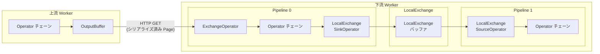
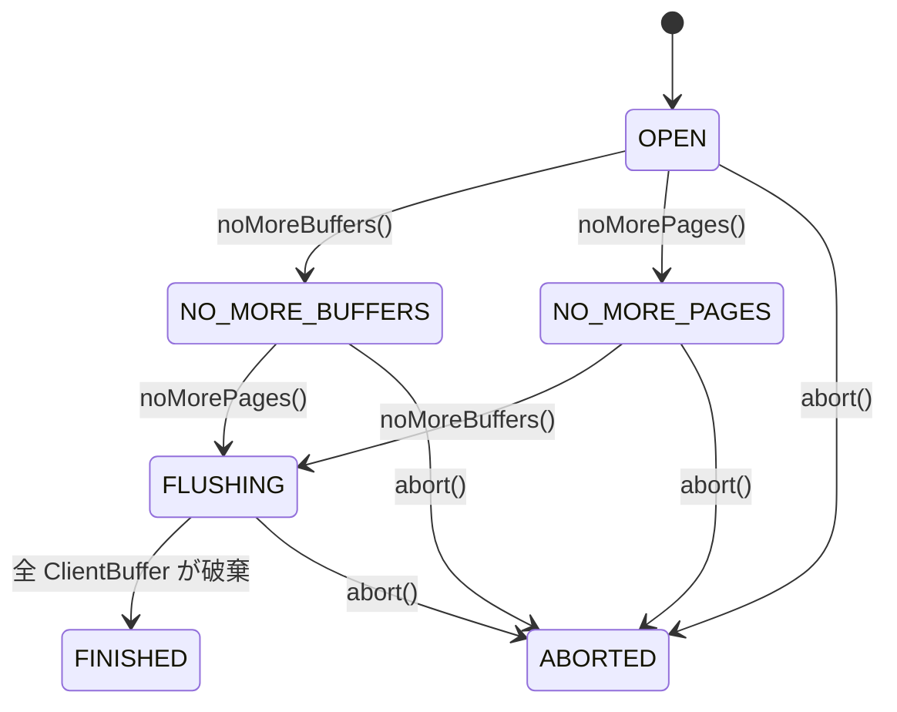
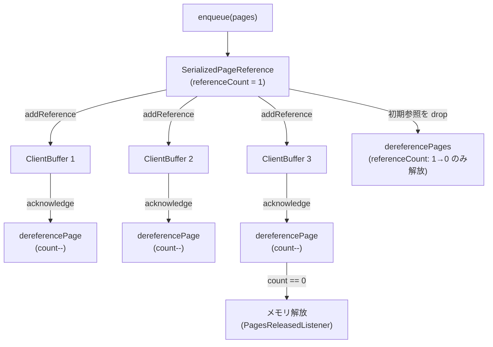

# 第16章 Exchange と OutputBuffer

> **本章で読むソース**
>
> - [`core/trino-main/src/main/java/io/trino/execution/buffer/OutputBuffer.java`](https://github.com/trinodb/trino/blob/482/core/trino-main/src/main/java/io/trino/execution/buffer/OutputBuffer.java)
> - [`core/trino-main/src/main/java/io/trino/execution/buffer/LazyOutputBuffer.java`](https://github.com/trinodb/trino/blob/482/core/trino-main/src/main/java/io/trino/execution/buffer/LazyOutputBuffer.java)
> - [`core/trino-main/src/main/java/io/trino/execution/buffer/ArbitraryOutputBuffer.java`](https://github.com/trinodb/trino/blob/482/core/trino-main/src/main/java/io/trino/execution/buffer/ArbitraryOutputBuffer.java)
> - [`core/trino-main/src/main/java/io/trino/execution/buffer/BroadcastOutputBuffer.java`](https://github.com/trinodb/trino/blob/482/core/trino-main/src/main/java/io/trino/execution/buffer/BroadcastOutputBuffer.java)
> - [`core/trino-main/src/main/java/io/trino/execution/buffer/PartitionedOutputBuffer.java`](https://github.com/trinodb/trino/blob/482/core/trino-main/src/main/java/io/trino/execution/buffer/PartitionedOutputBuffer.java)
> - [`core/trino-main/src/main/java/io/trino/execution/buffer/OutputBufferMemoryManager.java`](https://github.com/trinodb/trino/blob/482/core/trino-main/src/main/java/io/trino/execution/buffer/OutputBufferMemoryManager.java)
> - [`core/trino-main/src/main/java/io/trino/execution/buffer/ClientBuffer.java`](https://github.com/trinodb/trino/blob/482/core/trino-main/src/main/java/io/trino/execution/buffer/ClientBuffer.java)
> - [`core/trino-main/src/main/java/io/trino/execution/buffer/SerializedPageReference.java`](https://github.com/trinodb/trino/blob/482/core/trino-main/src/main/java/io/trino/execution/buffer/SerializedPageReference.java)
> - [`core/trino-main/src/main/java/io/trino/execution/buffer/PipelinedOutputBuffers.java`](https://github.com/trinodb/trino/blob/482/core/trino-main/src/main/java/io/trino/execution/buffer/PipelinedOutputBuffers.java)
> - [`core/trino-main/src/main/java/io/trino/execution/buffer/OutputBuffers.java`](https://github.com/trinodb/trino/blob/482/core/trino-main/src/main/java/io/trino/execution/buffer/OutputBuffers.java)
> - [`core/trino-main/src/main/java/io/trino/execution/buffer/PagesSerdeFactory.java`](https://github.com/trinodb/trino/blob/482/core/trino-main/src/main/java/io/trino/execution/buffer/PagesSerdeFactory.java)
> - [`core/trino-main/src/main/java/io/trino/execution/buffer/BufferState.java`](https://github.com/trinodb/trino/blob/482/core/trino-main/src/main/java/io/trino/execution/buffer/BufferState.java)
> - [`core/trino-main/src/main/java/io/trino/operator/ExchangeOperator.java`](https://github.com/trinodb/trino/blob/482/core/trino-main/src/main/java/io/trino/operator/ExchangeOperator.java)
> - [`core/trino-main/src/main/java/io/trino/operator/DirectExchangeClient.java`](https://github.com/trinodb/trino/blob/482/core/trino-main/src/main/java/io/trino/operator/DirectExchangeClient.java)
> - [`core/trino-main/src/main/java/io/trino/operator/exchange/LocalExchange.java`](https://github.com/trinodb/trino/blob/482/core/trino-main/src/main/java/io/trino/operator/exchange/LocalExchange.java)
> - [`core/trino-main/src/main/java/io/trino/operator/exchange/LocalExchangeSource.java`](https://github.com/trinodb/trino/blob/482/core/trino-main/src/main/java/io/trino/operator/exchange/LocalExchangeSource.java)
> - [`core/trino-main/src/main/java/io/trino/operator/exchange/LocalExchangeMemoryManager.java`](https://github.com/trinodb/trino/blob/482/core/trino-main/src/main/java/io/trino/operator/exchange/LocalExchangeMemoryManager.java)
> - [`core/trino-main/src/main/java/io/trino/operator/exchange/LocalExchangeSinkOperator.java`](https://github.com/trinodb/trino/blob/482/core/trino-main/src/main/java/io/trino/operator/exchange/LocalExchangeSinkOperator.java)
> - [`core/trino-main/src/main/java/io/trino/operator/exchange/LocalExchangeSourceOperator.java`](https://github.com/trinodb/trino/blob/482/core/trino-main/src/main/java/io/trino/operator/exchange/LocalExchangeSourceOperator.java)

## この章の狙い

第13章で読んだ Driver と Operator パイプラインは、単一 Pipeline 内のデータフローを扱っていた。
しかし、Stage 間や同一 Task 内の Pipeline 間でデータを受け渡す仕組みがなければ、分散クエリは成立しない。
本章ではその仕組みである Exchange を読む。

具体的には、Task の出力側にあたる OutputBuffer の設計と3種類の実装(Partitioned、Broadcast、Arbitrary)を追い、メモリバックプレッシャーの機構を理解する。
続いて、入力側にあたる `ExchangeOperator` と `DirectExchangeClient` によるリモートデータ取得、および同一 Worker 内の Pipeline 間転送を担う `LocalExchange` を読む。

## 前提

- Driver と Operator のプルモデル(第13章)を理解していること。
- Stage と Task のスケジューリング(第12章)で、Fragment が Worker へ配布される流れを知っていること。
- Page と Block による列指向データ表現の概要を知っていること。

## Exchange のデータフロー全体像

Trino の Exchange は、上流 Stage の Task が生成した Page を下流 Stage の Task へ転送する仕組みである。
転送経路は大きく2つに分かれる。

- **リモート Exchange**: 異なる Worker 間で HTTP 経由で Page を転送する。上流 Task は OutputBuffer にシリアライズ済み Page を蓄え、下流 Task の `ExchangeOperator` が `DirectExchangeClient` を通じて HTTP GET でポーリングする。
- **ローカル Exchange**: 同一 Worker 内で Pipeline 間のデータを受け渡す。`LocalExchangeSinkOperator` が `LocalExchange` の内部バッファに Page を書き込み、`LocalExchangeSourceOperator` がそこから Page を取り出す。

次の図は、リモート Exchange とローカル Exchange の両方を含むデータフローを示す。



## OutputBuffer インタフェース

OutputBuffer は、Task が生成した Page を下流の読み取り側へ渡すためのバッファである。

[`core/trino-main/src/main/java/io/trino/execution/buffer/OutputBuffer.java` L24-L128](https://github.com/trinodb/trino/blob/482/core/trino-main/src/main/java/io/trino/execution/buffer/OutputBuffer.java#L24-L128)

```java
public interface OutputBuffer
{
    OutputBufferInfo getInfo();

    BufferState getState();

    double getUtilization();

    void setOutputBuffers(OutputBuffers newOutputBuffers);

    ListenableFuture<BufferResult> get(PipelinedOutputBuffers.OutputBufferId bufferId, long token, DataSize maxSize);

    void acknowledge(PipelinedOutputBuffers.OutputBufferId bufferId, long token);

    ListenableFuture<Void> isFull();

    void enqueue(List<Slice> pages);

    void enqueue(int partition, List<Slice> pages);

    void setNoMorePages();

    void destroy();

    // ... (中略) ...
}
```

主要メソッドの役割は次のとおりである。

- **`enqueue(List<Slice>)`**: Operator チェーンの出力を OutputBuffer に投入する。Page はシリアライズ済みの `Slice` として渡される。
- **`enqueue(int partition, List<Slice>)`**: パーティション番号を指定して特定の下流バッファへ投入する。
- **`get(OutputBufferId, long, DataSize)`**: 下流のクライアントがデータを取得する。`token` はシーケンス ID であり、前回取得済みの位置を示す。
- **`isFull()`**: バッファが満杯かどうかを示す `ListenableFuture` を返す。Driver はこの Future を監視し、バッファが空くまで `enqueue` を止める。これがバックプレッシャーの起点になる。
- **`setNoMorePages()`**: 上流の処理が完了し、これ以上 Page が追加されないことを通知する。

## BufferState の状態遷移

OutputBuffer の状態は `BufferState` 列挙型で管理される。

[`core/trino-main/src/main/java/io/trino/execution/buffer/BufferState.java` L22-L90](https://github.com/trinodb/trino/blob/482/core/trino-main/src/main/java/io/trino/execution/buffer/BufferState.java#L22-L90)

```java
public enum BufferState
{
    OPEN(true, true, false),
    NO_MORE_BUFFERS(true, false, false),
    NO_MORE_PAGES(false, true, false),
    FLUSHING(false, false, false),
    FINISHED(false, false, true),
    ABORTED(false, false, true),
    FAILED(false, false, true);
    // ... (中略) ...
}
```

状態遷移を図にすると次のようになる。



`OPEN` は初期状態であり、バッファの追加と Page の追加の両方が可能である。
`noMoreBuffers()` と `noMorePages()` の両方が呼ばれると `FLUSHING` へ遷移し、すべての下流クライアントがデータを取得し終えると `FINISHED` に到達する。
クエリのキャンセル時には `abort()` で `ABORTED` へ遷移し、残存データを破棄する。

## OutputBuffers と PipelinedOutputBuffers

**OutputBuffers** は OutputBuffer の構成情報を表す抽象クラスであり、バージョン番号を持つ。

[`core/trino-main/src/main/java/io/trino/execution/buffer/OutputBuffers.java` L27-L43](https://github.com/trinodb/trino/blob/482/core/trino-main/src/main/java/io/trino/execution/buffer/OutputBuffers.java#L27-L43)

```java
public abstract class OutputBuffers
{
    private final long version;

    protected OutputBuffers(long version)
    {
        this.version = version;
    }

    public abstract void checkValidTransition(OutputBuffers newOutputBuffers);

    @JsonProperty
    public long getVersion()
    {
        return version;
    }
}
```

そのサブクラスである **PipelinedOutputBuffers** が、バッファの種類(PARTITIONED、BROADCAST、ARBITRARY)と各バッファ ID からパーティション番号へのマッピングを保持する。

[`core/trino-main/src/main/java/io/trino/execution/buffer/PipelinedOutputBuffers.java` L38-L49](https://github.com/trinodb/trino/blob/482/core/trino-main/src/main/java/io/trino/execution/buffer/PipelinedOutputBuffers.java#L38-L49)

```java
public class PipelinedOutputBuffers
        extends OutputBuffers
{
    public static final int BROADCAST_PARTITION_ID = 0;

    private final BufferType type;
    private final Map<OutputBufferId, Integer> buffers;
    private final boolean noMoreBufferIds;

    // ... (中略) ...
}
```

`PipelinedOutputBuffers` はイミュータブルであり、バッファの追加は `withBuffer()` で新しいインスタンスを返す。
`noMoreBufferIds` フラグが `true` になると、以降のバッファ追加は禁止される。
Coordinator は段階的にバッファ構成を更新し、各更新はバージョン番号を伴うため、古い更新メッセージは安全に無視できる。

## LazyOutputBuffer による遅延初期化

Task が生成されると、OutputBuffer の実体として最初に `LazyOutputBuffer` が割り当てられる。
`LazyOutputBuffer` は `setOutputBuffers()` が呼ばれるまで実際のバッファ実装の生成を遅延する。

[`core/trino-main/src/main/java/io/trino/execution/buffer/LazyOutputBuffer.java` L48-L63](https://github.com/trinodb/trino/blob/482/core/trino-main/src/main/java/io/trino/execution/buffer/LazyOutputBuffer.java#L48-L63)

```java
public class LazyOutputBuffer
        implements OutputBuffer
{
    private final OutputBufferStateMachine stateMachine;
    private final long taskInstanceId;
    private final DataSize maxBufferSize;
    private final DataSize maxBroadcastBufferSize;
    private final Lazy<LocalMemoryContext> memoryContextSupplier;
    private final Executor executor;
    private final Runnable notifyStatusChanged;
    private final ExchangeManagerRegistry exchangeManagerRegistry;

    // Note: this is a write once field, so an unsynchronized volatile read that returns a non-null value is safe
    private volatile OutputBuffer delegate;
    // ... (中略) ...
}
```

`delegate` フィールドは write-once の volatile 変数である。
`setOutputBuffers()` が初めて呼ばれたとき、`PipelinedOutputBuffers` の `BufferType` に応じて実際のバッファを生成する。

[`core/trino-main/src/main/java/io/trino/execution/buffer/LazyOutputBuffer.java` L161-L209](https://github.com/trinodb/trino/blob/482/core/trino-main/src/main/java/io/trino/execution/buffer/LazyOutputBuffer.java#L161-L209)

```java
@Override
public void setOutputBuffers(OutputBuffers newOutputBuffers)
{
    // ... (中略) ...
    synchronized (this) {
        outputBuffer = delegate;
        if (outputBuffer == null) {
            if (stateMachine.getState().isTerminal()) {
                return;
            }
            if (newOutputBuffers instanceof PipelinedOutputBuffers outputBuffers) {
                outputBuffer = switch (outputBuffers.getType()) {
                    case PARTITIONED -> new PartitionedOutputBuffer(taskInstanceId, stateMachine, outputBuffers, maxBufferSize, memoryContextSupplier, executor);
                    case BROADCAST -> new BroadcastOutputBuffer(taskInstanceId, stateMachine, maxBroadcastBufferSize, memoryContextSupplier, executor, notifyStatusChanged);
                    case ARBITRARY -> new ArbitraryOutputBuffer(taskInstanceId, stateMachine, maxBufferSize, memoryContextSupplier, executor);
                };
            }
            // ... (中略) ...
            destroyedBuffers = ImmutableSet.copyOf(this.destroyedBuffers);
            this.destroyedBuffers.clear();
            pendingReads = ImmutableList.copyOf(this.pendingReads);
            this.pendingReads.clear();
            delegate = outputBuffer;
        }
    }
    outputBuffer.setOutputBuffers(newOutputBuffers);
    destroyedBuffers.forEach(outputBuffer::destroy);
    for (PendingRead pendingRead : pendingReads) {
        pendingRead.process(outputBuffer);
    }
}
```

`delegate` が未設定の状態で `get()` が呼ばれた場合は、`PendingRead` として蓄積し、バッファ生成後にまとめて処理する。
初期化前に `getUtilization()` を呼ぶと `1.0`(満杯)を返すため、Driver はバッファの準備が整うまで Page の投入を待機する。

## OutputBuffer の3つの実装

### PartitionedOutputBuffer

**PartitionedOutputBuffer** は、ハッシュ分割を行うクエリ(JOIN の Build 側への再分配など)で使われる。
下流 Task の数だけ `ClientBuffer` をあらかじめ確定的に作成し、`enqueue(int partition, List<Slice>)` でパーティション番号を指定して投入する。

[`core/trino-main/src/main/java/io/trino/execution/buffer/PartitionedOutputBuffer.java` L42-L84](https://github.com/trinodb/trino/blob/482/core/trino-main/src/main/java/io/trino/execution/buffer/PartitionedOutputBuffer.java#L42-L84)

```java
public class PartitionedOutputBuffer
        implements OutputBuffer
{
    private final OutputBufferStateMachine stateMachine;
    private final PipelinedOutputBuffers outputBuffers;
    private final OutputBufferMemoryManager memoryManager;
    private final PagesReleasedListener onPagesReleased;

    private final List<ClientBuffer> partitions;

    // ... (中略) ...

    public PartitionedOutputBuffer(
            long taskInstanceId,
            OutputBufferStateMachine stateMachine,
            PipelinedOutputBuffers outputBuffers,
            DataSize maxBufferSize,
            Lazy<LocalMemoryContext> memoryContextSupplier,
            Executor notificationExecutor)
    {
        // ... (中略) ...
        ImmutableList.Builder<ClientBuffer> partitions = ImmutableList.builderWithExpectedSize(outputBuffers.getBuffers().keySet().size());
        for (OutputBufferId bufferId : outputBuffers.getBuffers().keySet()) {
            ClientBuffer partition = new ClientBuffer(taskInstanceId, bufferId, onPagesReleased);
            partitions.add(partition);
        }
        this.partitions = partitions.build();

        stateMachine.noMoreBuffers();
        checkFlushComplete();
    }
    // ... (中略) ...
}
```

コンストラクタの時点で `noMoreBuffers()` を呼んでいる。
`PartitionedOutputBuffer` ではバッファ数が生成時に確定するため、動的なバッファ追加は起きない。

`enqueue` ではパーティション番号をインデックスとして対応する `ClientBuffer` へ直接投入する。

[`core/trino-main/src/main/java/io/trino/execution/buffer/PartitionedOutputBuffer.java` L180-L214](https://github.com/trinodb/trino/blob/482/core/trino-main/src/main/java/io/trino/execution/buffer/PartitionedOutputBuffer.java#L180-L214)

```java
@Override
public void enqueue(int partitionNumber, List<Slice> pages)
{
    requireNonNull(pages, "pages is null");

    if (!stateMachine.getState().canAddPages()) {
        return;
    }

    ImmutableList.Builder<SerializedPageReference> references = ImmutableList.builderWithExpectedSize(pages.size());
    long bytesAdded = 0;
    long rowCount = 0;
    for (Slice page : pages) {
        bytesAdded += page.getRetainedSize();
        int positionCount = getSerializedPagePositionCount(page);
        rowCount += positionCount;
        references.add(new SerializedPageReference(page, positionCount, 1));
    }
    List<SerializedPageReference> serializedPageReferences = references.build();

    totalRowsAdded.add(rowCount);
    totalPagesAdded.add(serializedPageReferences.size());

    memoryManager.updateMemoryUsage(bytesAdded);

    partitions.get(partitionNumber).enqueuePages(serializedPageReferences);

    dereferencePages(serializedPageReferences, onPagesReleased);
}
```

### BroadcastOutputBuffer

**BroadcastOutputBuffer** は、すべての下流 Task に同じ Page を配信する場合に使われる。
典型的な用途は、小さなテーブルを全 Worker へ複製する Broadcast JOIN である。

[`core/trino-main/src/main/java/io/trino/execution/buffer/BroadcastOutputBuffer.java` L57-L67](https://github.com/trinodb/trino/blob/482/core/trino-main/src/main/java/io/trino/execution/buffer/BroadcastOutputBuffer.java#L57-L67)

```java
public class BroadcastOutputBuffer
        implements OutputBuffer
{
    private final long taskInstanceId;
    private final OutputBufferStateMachine stateMachine;
    private final OutputBufferMemoryManager memoryManager;
    private final PagesReleasedListener onPagesReleased;

    @GuardedBy("this")
    private final Map<OutputBufferId, ClientBuffer> buffers = new ConcurrentHashMap<>();

    @GuardedBy("this")
    private final List<SerializedPageReference> initialPagesForNewBuffers = new ArrayList<>();
    // ... (中略) ...
}
```

`BroadcastOutputBuffer` には `initialPagesForNewBuffers` というリストがある。
バッファの追加がまだ可能な状態のとき(`canAddBuffers()` が `true`)、投入された Page はこのリストにも保持される。
後から追加された `ClientBuffer` は、このリストの内容を初期データとして受け取る。

`enqueue` の実装を見ると、全既存バッファへ Page を配信している。

[`core/trino-main/src/main/java/io/trino/execution/buffer/BroadcastOutputBuffer.java` L216-L273](https://github.com/trinodb/trino/blob/482/core/trino-main/src/main/java/io/trino/execution/buffer/BroadcastOutputBuffer.java#L216-L273)

```java
@Override
public void enqueue(List<Slice> pages)
{
    // ... (中略) ...
    List<SerializedPageReference> serializedPageReferences = references.build();

    totalRowsAdded.add(rowCount);
    totalPagesAdded.add(serializedPageReferences.size());
    totalBufferedPages.addAndGet(serializedPageReferences.size());

    memoryManager.updateMemoryUsage(bytesAdded);

    Collection<ClientBuffer> buffers;
    synchronized (this) {
        if (stateMachine.getState().canAddBuffers()) {
            serializedPageReferences.forEach(SerializedPageReference::addReference);
            initialPagesForNewBuffers.addAll(serializedPageReferences);
        }
        buffers = safeGetBuffersSnapshot();
    }

    buffers.forEach(partition -> partition.enqueuePages(serializedPageReferences));

    dereferencePages(serializedPageReferences, onPagesReleased);
    // ... (中略) ...
}
```

各 `ClientBuffer` が `enqueuePages` で参照カウントを増やし、最後に `dereferencePages` で初期参照を落とす。
すべての `ClientBuffer` がデータを消費すると参照カウントがゼロになり、メモリが解放される。

### ArbitraryOutputBuffer

**ArbitraryOutputBuffer** は、パーティション制約のないランダム分配に使われる。
`UNION ALL` やラウンドロビン分配のケースが典型例である。

[`core/trino-main/src/main/java/io/trino/execution/buffer/ArbitraryOutputBuffer.java` L59-L69](https://github.com/trinodb/trino/blob/482/core/trino-main/src/main/java/io/trino/execution/buffer/ArbitraryOutputBuffer.java#L59-L69)

```java
/**
 * A buffer that assigns pages to queues based on a first come, first served basis.
 */
public class ArbitraryOutputBuffer
        implements OutputBuffer
{
    private final OutputBufferMemoryManager memoryManager;
    private final PagesReleasedListener onPagesReleased;

    private final MasterBuffer masterBuffer;

    private final ConcurrentMap<OutputBufferId, ClientBuffer> buffers = new ConcurrentHashMap<>();
    // ... (中略) ...
}
```

`ArbitraryOutputBuffer` には **MasterBuffer** という内部クラスがある。
投入された Page はまず `MasterBuffer` に蓄積され、`ClientBuffer` がデータを要求したときに先着順で割り当てられる。

[`core/trino-main/src/main/java/io/trino/execution/buffer/ArbitraryOutputBuffer.java` L218-L267](https://github.com/trinodb/trino/blob/482/core/trino-main/src/main/java/io/trino/execution/buffer/ArbitraryOutputBuffer.java#L218-L267)

```java
@Override
public void enqueue(List<Slice> pages)
{
    // ... (中略) ...
    masterBuffer.addPages(serializedPageReferences);

    List<ClientBuffer> buffers = safeGetBuffersSnapshot();
    if (buffers.isEmpty()) {
        return;
    }
    int index = nextClientBufferIndex.get() % buffers.size();
    for (int i = 0; i < buffers.size(); i++) {
        buffers.get(index).loadPagesIfNecessary(masterBuffer);
        index = (index + 1) % buffers.size();
        if (masterBuffer.isEmpty()) {
            nextClientBufferIndex.set(index);
            break;
        }
    }
}
```

`nextClientBufferIndex` を使って `ClientBuffer` を巡回し、`MasterBuffer` が空になるまで Page を配る。
巡回の開始位置を記録しておくことで、特定の `ClientBuffer` にデータが偏ることを防いでいる。

## SerializedPageReference と参照カウント

`BroadcastOutputBuffer` では同じ Page を複数の `ClientBuffer` に配信するため、Page のコピーを避ける仕組みが必要になる。
`SerializedPageReference` がその役割を果たす。

[`core/trino-main/src/main/java/io/trino/execution/buffer/SerializedPageReference.java` L29-L48](https://github.com/trinodb/trino/blob/482/core/trino-main/src/main/java/io/trino/execution/buffer/SerializedPageReference.java#L29-L48)

```java
@ThreadSafe
final class SerializedPageReference
{
    private static final AtomicIntegerFieldUpdater<SerializedPageReference> REFERENCE_COUNT_UPDATER =
        AtomicIntegerFieldUpdater.newUpdater(SerializedPageReference.class, "referenceCount");

    private final Slice serializedPage;
    private final int positionCount;
    private volatile int referenceCount;

    public SerializedPageReference(Slice serializedPage, int positionCount, int referenceCount)
    {
        this.serializedPage = requireNonNull(serializedPage, "serializedPage is null");
        checkArgument(referenceCount > 0, "referenceCount must be at least 1");
        this.positionCount = positionCount;
        this.referenceCount = referenceCount;
    }
    // ... (中略) ...
}
```

`referenceCount` フィールドは `AtomicIntegerFieldUpdater` でロックフリーに更新される。
`ClientBuffer` がページを追加するときに `addReference()` で参照を増やし、クライアントが `acknowledgePages()` で消費を確認したときに `dereferencePage()` で参照を減らす。
参照カウントがゼロになると `PagesReleasedListener` が呼ばれ、`OutputBufferMemoryManager` のメモリ使用量が減算される。

[`core/trino-main/src/main/java/io/trino/execution/buffer/SerializedPageReference.java` L80-L106](https://github.com/trinodb/trino/blob/482/core/trino-main/src/main/java/io/trino/execution/buffer/SerializedPageReference.java#L80-L106)

```java
public static void dereferencePages(List<SerializedPageReference> serializedPageReferences, PagesReleasedListener onPagesReleased)
{
    int releasedPageCount = 0;
    long releasedMemorySizeInBytes = 0;
    for (SerializedPageReference serializedPageReference : serializedPageReferences) {
        if (serializedPageReference.dereferencePage()) {
            releasedPageCount++;
            releasedMemorySizeInBytes += serializedPageReference.getRetainedSizeInBytes();
        }
    }
    if (releasedPageCount > 0) {
        onPagesReleased.onPagesReleased(releasedPageCount, releasedMemorySizeInBytes);
    }
}
```

この参照カウント方式により、`BroadcastOutputBuffer` は同じ `Slice` を N 個の `ClientBuffer` で共有でき、メモリを N 倍に膨張させずに済む。

## ClientBuffer と Page の取得プロトコル

**ClientBuffer** は、下流の個々のクライアント(Task)に対応するバッファである。
各 `ClientBuffer` はシーケンス ID を使ったページ取得プロトコルを実装する。

[`core/trino-main/src/main/java/io/trino/execution/buffer/ClientBuffer.java` L46-L79](https://github.com/trinodb/trino/blob/482/core/trino-main/src/main/java/io/trino/execution/buffer/ClientBuffer.java#L46-L79)

```java
@ThreadSafe
class ClientBuffer
{
    private final long taskInstanceId;
    private final OutputBufferId bufferId;
    private final PagesReleasedListener onPagesReleased;

    private final AtomicLong bufferedBytes = new AtomicLong();

    @GuardedBy("this")
    private final AtomicLong currentSequenceId = new AtomicLong();

    @GuardedBy("this")
    private final LinkedList<SerializedPageReference> pages = new LinkedList<>();

    @GuardedBy("this")
    private boolean noMorePages;

    @GuardedBy("this")
    private final AtomicBoolean destroyed = new AtomicBoolean();

    @GuardedBy("this")
    private PendingRead pendingRead;
    // ... (中略) ...
}
```

取得プロトコルは次のように動作する。

1. クライアントが `getPages(sequenceId, maxSize)` を呼ぶ。
2. `sequenceId` より前の Page を `acknowledgePages()` で確認済みとし、リストから削除する。
3. 先頭から `maxSize` に収まる範囲の Page を `BufferResult` として返す。
4. バッファが空でまだ Page が来る可能性があれば、`PendingRead` として `SettableFuture` を返し、新しい Page が追加されたときに完了させる。

[`core/trino-main/src/main/java/io/trino/execution/buffer/ClientBuffer.java` L315-L372](https://github.com/trinodb/trino/blob/482/core/trino-main/src/main/java/io/trino/execution/buffer/ClientBuffer.java#L315-L372)

```java
private synchronized BufferResult processRead(long sequenceId, DataSize maxSize)
{
    // ... (中略) ...
    if (sequenceId < currentSequenceId.get()) {
        return emptyResults(taskInstanceId, sequenceId, false);
    }

    if (pages.isEmpty() && noMorePages) {
        return emptyResults(taskInstanceId, currentSequenceId.get(), true);
    }

    verify(sequenceId == currentSequenceId.get(), "Invalid sequence id");

    long maxBytes = maxSize.toBytes();
    List<Slice> result = new ArrayList<>();
    long bytes = 0;

    for (SerializedPageReference page : pages) {
        bytes += page.getRetainedSizeInBytes();
        if (!result.isEmpty() && bytes > maxBytes) {
            break;
        }
        result.add(page.getSerializedPage());
    }
    return new BufferResult(taskInstanceId, sequenceId, sequenceId + result.size(), false, result);
}
```

`sequenceId` が現在位置より前の場合は空の結果を返す。
これは HTTP リクエストのリトライ時に発生しうるケースであり、クライアント側で重複を無視できるよう設計されている。

## OutputBufferMemoryManager によるバックプレッシャー

**OutputBufferMemoryManager** は OutputBuffer のメモリ使用量を追跡し、上限を超えた場合にバックプレッシャーをかける。

[`core/trino-main/src/main/java/io/trino/execution/buffer/OutputBufferMemoryManager.java` L41-L80](https://github.com/trinodb/trino/blob/482/core/trino-main/src/main/java/io/trino/execution/buffer/OutputBufferMemoryManager.java#L41-L80)

```java
@ThreadSafe
final class OutputBufferMemoryManager
{
    private static final ListenableFuture<Void> NOT_BLOCKED = immediateVoidFuture();

    private final long maxBufferedBytes;
    private final AtomicLong bufferedBytes = new AtomicLong();
    private final AtomicLong peakMemoryUsage = new AtomicLong();

    @GuardedBy("this")
    private boolean closed;

    @Nullable
    private volatile SettableFuture<Void> bufferBlockedFuture;

    private volatile ListenableFuture<Void> blockedOnMemory = NOT_BLOCKED;

    private final AtomicBoolean blockOnFull = new AtomicBoolean(true);
    // ... (中略) ...
}
```

バックプレッシャーは2つの条件で発動する。

1. **バッファの容量上限**: `bufferedBytes` が `maxBufferedBytes` を超えた場合。
2. **メモリプールの枯渇**: `LocalMemoryContext.setBytes()` が返す Future が未完了の場合(Task のメモリ割り当てが上限に達している)。

[`core/trino-main/src/main/java/io/trino/execution/buffer/OutputBufferMemoryManager.java` L82-L135](https://github.com/trinodb/trino/blob/482/core/trino-main/src/main/java/io/trino/execution/buffer/OutputBufferMemoryManager.java#L82-L135)

```java
public void updateMemoryUsage(long bytesAdded)
{
    LocalMemoryContext memoryContext = getMemoryContextOrNull();
    if (memoryContext == null) {
        return;
    }

    ListenableFuture<Void> waitForMemory = null;
    SettableFuture<Void> notifyUnblocked = null;
    final long currentBufferedBytes;
    synchronized (this) {
        if (closed) {
            return;
        }

        currentBufferedBytes = bufferedBytes.accumulateAndGet(bytesAdded, (bufferedBytes, delta) -> {
            long result = bufferedBytes + delta;
            checkArgument(result >= 0, "bufferedBytes (%s) plus delta (%s) would be negative", bufferedBytes, delta);
            return result;
        });
        ListenableFuture<Void> blockedOnMemory = memoryContext.setBytes(currentBufferedBytes);
        if (!blockedOnMemory.isDone()) {
            if (this.blockedOnMemory != blockedOnMemory) {
                this.blockedOnMemory = blockedOnMemory;
                waitForMemory = blockedOnMemory;
            }
        }
        else {
            this.blockedOnMemory = NOT_BLOCKED;
            if (currentBufferedBytes <= maxBufferedBytes || !blockOnFull.get()) {
                notifyUnblocked = this.bufferBlockedFuture;
                this.bufferBlockedFuture = null;
            }
        }
        // ... (中略) ...
    }
    if (currentBufferedBytes > peakMemoryUsage.get()) {
        peakMemoryUsage.accumulateAndGet(currentBufferedBytes, Math::max);
    }
    notifyListener(notifyUnblocked);
    if (waitForMemory != null) {
        waitForMemory.addListener(this::onMemoryAvailable, notificationExecutor);
    }
}
```

`updateMemoryUsage` は OutputBuffer の `enqueue` から呼ばれる。
Page が追加されると `bufferedBytes` を増加させ、クライアントが Page を消費して `dereferencePages` が呼ばれると減少させる。
Driver は `isFull()` が返す `bufferBlockedFuture` を監視しており、バッファに空きができると Future が完了して再び `enqueue` が可能になる。

`setNoMorePages()` が呼ばれたときには `setNoBlockOnFull()` でバックプレッシャーを解除する。
すでにすべての Page が投入済みであるため、Writer 側をブロックする必要がなくなるからである。

## Page のシリアライゼーションと圧縮

リモート Exchange で転送される Page は、`PagesSerdeFactory` が生成するシリアライザで `Slice` にシリアライズされる。

[`core/trino-main/src/main/java/io/trino/execution/buffer/PagesSerdeFactory.java` L36-L54](https://github.com/trinodb/trino/blob/482/core/trino-main/src/main/java/io/trino/execution/buffer/PagesSerdeFactory.java#L36-L54)

```java
public class PagesSerdeFactory
{
    private static final int SERIALIZED_PAGE_DEFAULT_BLOCK_SIZE_IN_BYTES = 64 * 1024;
    private final BlockEncodingSerde blockEncodingSerde;
    private final CompressionCodec compressionCodec;
    private final int blockSizeInBytes;

    // ... (中略) ...

    public PageSerializer createSerializer(Optional<SecretKey> encryptionKey)
    {
        return new CompressingEncryptingPageSerializer(
                blockEncodingSerde,
                createCompressor(compressionCodec),
                encryptionKey,
                blockSizeInBytes,
                maxCompressedSize(blockSizeInBytes, compressionCodec));
    }
}
```

圧縮アルゴリズムは LZ4 と Zstd の2種類をサポートする。

[`core/trino-main/src/main/java/io/trino/execution/buffer/PagesSerdeFactory.java` L77-L93](https://github.com/trinodb/trino/blob/482/core/trino-main/src/main/java/io/trino/execution/buffer/PagesSerdeFactory.java#L77-L93)

```java
public static Optional<Compressor> createCompressor(CompressionCodec compressionCodec)
{
    return switch (compressionCodec) {
        case NONE -> Optional.empty();
        case LZ4 -> Optional.of(Lz4Compressor.create());
        case ZSTD -> Optional.of(ZstdCompressor.create());
    };
}
```

LZ4 は圧縮速度を優先し、Zstd は圧縮率を優先する。
デフォルトの Block サイズは 64 KB であり、このサイズ単位で圧縮と暗号化を適用する。
ネットワーク帯域が制約になる環境では、圧縮によって転送データ量を削減できるため、Exchange 全体のスループットが向上する。

## ExchangeOperator と DirectExchangeClient

下流 Stage の Task は、`ExchangeOperator` を通じて上流 Task の OutputBuffer からデータを取得する。

[`core/trino-main/src/main/java/io/trino/operator/ExchangeOperator.java` L50-L53](https://github.com/trinodb/trino/blob/482/core/trino-main/src/main/java/io/trino/operator/ExchangeOperator.java#L50-L53)

```java
public class ExchangeOperator
        implements SourceOperator
{
    public static final CatalogHandle REMOTE_CATALOG_HANDLE = createRootCatalogHandle(new CatalogName("$remote"), new CatalogVersion("remote"));
    // ... (中略) ...
}
```

`ExchangeOperator` は `SourceOperator` を実装しており、Operator チェーンの先頭に位置する。
`addSplit()` で `RemoteSplit`(上流 Task の位置情報)を受け取り、`ExchangeDataSource` に登録する。

`getOutput()` では、`ExchangeDataSource` からシリアライズ済み Page をポーリングし、デシリアライズして `Page` オブジェクトに変換する。

[`core/trino-main/src/main/java/io/trino/operator/ExchangeOperator.java` L245-L269](https://github.com/trinodb/trino/blob/482/core/trino-main/src/main/java/io/trino/operator/ExchangeOperator.java#L245-L269)

```java
@Override
public Page getOutput()
{
    Slice page = exchangeDataSource.pollPage();
    if (page == null) {
        return null;
    }

    if (deserializer == null) {
        Optional<Slice> effectiveKey = ExchangeEncryptionKey.keyFor(operatorContext.getSession(), exchangeDataSource);
        deserializer = serdeFactory.createDeserializer(effectiveKey.map(Ciphers::deserializeAesEncryptionKey));
        operatorContext.localUserMemoryContext().setBytes(deserializer.getRetainedSizeInBytes());
    }

    Page deserializedPage = deserializer.deserialize(page);
    operatorContext.recordNetworkInput(page.length(), deserializedPage.getPositionCount());
    operatorContext.recordProcessedInput(deserializedPage.getSizeInBytes(), deserializedPage.getPositionCount());

    return deserializedPage;
}
```

デシリアライザの初期化を `getOutput()` の初回呼び出しまで遅延している点に注目する。
`LazyExchangeDataSource` は最初の Split が届くまで具体的な Exchange 種別(Direct Exchange か Spooling Exchange か)を確定しないため、暗号鍵の取得もそれ以降にする必要がある。

### DirectExchangeClient のスケジューリング

**DirectExchangeClient** は、リモートの OutputBuffer に対する HTTP GET リクエストを管理する。

[`core/trino-main/src/main/java/io/trino/operator/DirectExchangeClient.java` L56-L81](https://github.com/trinodb/trino/blob/482/core/trino-main/src/main/java/io/trino/operator/DirectExchangeClient.java#L56-L81)

```java
@ThreadSafe
public class DirectExchangeClient
        implements Closeable
{
    // ... (中略) ...
    private final Map<URI, HttpPageBufferClient> allClients = new ConcurrentHashMap<>();

    @GuardedBy("this")
    private final Set<HttpPageBufferClient> queuedClients = new LinkedHashSet<>();
    @GuardedBy("this")
    private final Set<HttpPageBufferClient> runningClients = new LinkedHashSet<>();

    private final Set<HttpPageBufferClient> completedClients = newConcurrentHashSet();
    private final DirectExchangeBuffer buffer;
    // ... (中略) ...
}
```

上流 Task ごとに `HttpPageBufferClient` が1つ作られ、3つのセット(`queuedClients`、`runningClients`、`completedClients`)で状態を管理する。

`addLocation()` で上流 Task の URI を受け取ると、`HttpPageBufferClient` を生成して `queuedClients` に追加し、`scheduleRequestIfNecessary()` を呼ぶ。

[`core/trino-main/src/main/java/io/trino/operator/DirectExchangeClient.java` L271-L306](https://github.com/trinodb/trino/blob/482/core/trino-main/src/main/java/io/trino/operator/DirectExchangeClient.java#L271-L306)

```java
@VisibleForTesting
synchronized int scheduleRequestIfNecessary()
{
    if ((buffer.isFinished() || buffer.isFailed()) && completedClients.size() == allClients.size()) {
        return 0;
    }

    long neededBytes = buffer.getRemainingCapacityInBytes();
    if (neededBytes <= 0) {
        return 0;
    }

    long reservedBytesForScheduledClients = runningClients.stream()
            .mapToLong(HttpPageBufferClient::getAverageRequestSizeInBytes)
            .sum();
    long projectedBytesToBeRequested = 0;
    int clientCount = 0;

    Iterator<HttpPageBufferClient> clientIterator = queuedClients.iterator();
    while (clientIterator.hasNext()) {
        HttpPageBufferClient client = clientIterator.next();
        if (projectedBytesToBeRequested >= neededBytes * concurrentRequestMultiplier - reservedBytesForScheduledClients) {
            break;
        }
        projectedBytesToBeRequested += client.getAverageRequestSizeInBytes();
        client.scheduleRequest();
        clientIterator.remove();
        runningClients.add(client);
        clientCount++;
    }

    return clientCount;
}
```

スケジューリングは容量ベースで制御される。
`buffer.getRemainingCapacityInBytes()` で受信側バッファの空き容量を確認し、`concurrentRequestMultiplier` を乗じた量に達するまでクライアントを起動する。
過去のリクエストサイズの平均(`getAverageRequestSizeInBytes()`)を使って、起動するクライアント数をあらかじめ推定している点が特徴である。

これにより、大きすぎるデータを一度に受信してメモリを溢れさせることなく、複数の上流 Task から並行して効率よくデータを取得できる。

## LocalExchange

**LocalExchange** は、同一 Worker 内の Pipeline 間でデータを転送する仕組みである。
リモート Exchange と異なり、Page のシリアライズは不要であり、メモリ上でオブジェクトを直接受け渡す。

[`core/trino-main/src/main/java/io/trino/operator/exchange/LocalExchange.java` L66-L88](https://github.com/trinodb/trino/blob/482/core/trino-main/src/main/java/io/trino/operator/exchange/LocalExchange.java#L66-L88)

```java
@ThreadSafe
public class LocalExchange
{
    public static final int SCALE_WRITERS_MAX_PARTITIONS_PER_WRITER = 128;

    private final Supplier<LocalExchanger> exchangerSupplier;

    private final List<LocalExchangeSource> sources;

    @GuardedBy("this")
    private boolean allSourcesFinished;

    @GuardedBy("this")
    private boolean noMoreSinkFactories;

    @GuardedBy("this")
    private final Set<LocalExchangeSinkFactory> openSinkFactories = new HashSet<>();

    @GuardedBy("this")
    private final Set<LocalExchangeSink> sinks = new HashSet<>();
    // ... (中略) ...
}
```

`LocalExchange` はパーティション方式に応じて異なる `LocalExchanger` 実装を選択する。

[`core/trino-main/src/main/java/io/trino/operator/exchange/LocalExchange.java` L89-L202](https://github.com/trinodb/trino/blob/482/core/trino-main/src/main/java/io/trino/operator/exchange/LocalExchange.java#L89-L202)

```java
public LocalExchange(
        PartitionFunctionProvider partitionFunctionProvider,
        Session session,
        int defaultConcurrency,
        PartitioningHandle partitioning,
        // ... (中略) ...
{
    int bufferCount = computeBufferCount(partitioning, defaultConcurrency, partitionChannels);

    if (partitioning.equals(SINGLE_DISTRIBUTION) || partitioning.equals(FIXED_ARBITRARY_DISTRIBUTION)) {
        // ... (中略) ...
        exchangerSupplier = () -> new RandomExchanger(asPageConsumers(sources), memoryManager);
    }
    else if (partitioning.equals(FIXED_PASSTHROUGH_DISTRIBUTION)) {
        // ... (中略) ...
        exchangerSupplier = () -> {
            int currentSource = nextSource.getAndIncrement();
            return new PassthroughExchanger(sources.get(currentSource), memoryManagers.get(currentSource));
        };
    }
    // ... (中略) ...
    else if (partitioning.equals(FIXED_HASH_DISTRIBUTION) || partitioning.getCatalogHandle().isPresent() || /* ... */) {
        // ... (中略) ...
        exchangerSupplier = () -> {
            PartitionFunction partitionFunction = createPartitionFunction(/* ... */);
            return new PartitioningExchanger(asPageConsumers(sources), memoryManager, createPartitionPagePreparer(partitioning, partitionChannels), partitionFunction);
        };
    }
    // ... (中略) ...
}
```

主要な Exchanger は次の4種類である。

- **RandomExchanger**: ランダムに `LocalExchangeSource` を選んで Page を渡す(`SINGLE_DISTRIBUTION` や `FIXED_ARBITRARY_DISTRIBUTION`)。
- **PassthroughExchanger**: Sink と Source を1対1で対応させ、Page をそのまま渡す(`FIXED_PASSTHROUGH_DISTRIBUTION`)。
- **PartitioningExchanger**: ハッシュ関数で行をパーティションに振り分ける(`FIXED_HASH_DISTRIBUTION` やコネクタ固有のパーティション)。
- **ScaleWriterExchanger**: Writer のスケーリング用に、処理量に応じて書き込み先を動的に増やす(`SCALED_WRITER_ROUND_ROBIN_DISTRIBUTION`)。

### LocalExchangeSource

**LocalExchangeSource** は `LocalExchange` の出力側であり、`LocalExchangeSourceOperator` が Page を取り出す。

[`core/trino-main/src/main/java/io/trino/operator/exchange/LocalExchangeSource.java` L36-L59](https://github.com/trinodb/trino/blob/482/core/trino-main/src/main/java/io/trino/operator/exchange/LocalExchangeSource.java#L36-L59)

```java
@ThreadSafe
public class LocalExchangeSource
{
    private static final ListenableFuture<Void> NOT_BLOCKED = immediateVoidFuture();

    private final LocalExchangeMemoryManager memoryManager;
    private final Consumer<LocalExchangeSource> onFinish;

    @GuardedBy("this")
    private final Queue<Page> buffer = new ArrayDeque<>();

    private final AtomicLong bufferedBytes = new AtomicLong();
    private final AtomicInteger bufferedPages = new AtomicInteger();

    @Nullable
    @GuardedBy("this")
    private SettableFuture<Void> notEmptyFuture;

    private volatile boolean finishing;
    // ... (中略) ...
}
```

内部バッファは `ArrayDeque` であり、Page オブジェクトをシリアライズなしで直接保持する。
`addPage()` でバッファに追加し、`removePage()` で先頭から取り出す。

`waitForReading()` はバッファが空のときに `SettableFuture` を返す。
Page が追加されると `notEmptyFuture` が完了し、`LocalExchangeSourceOperator` がブロック解除される。

### LocalExchangeMemoryManager

**LocalExchangeMemoryManager** は `LocalExchange` のメモリ使用量を制限する。

[`core/trino-main/src/main/java/io/trino/operator/exchange/LocalExchangeMemoryManager.java` L29-L62](https://github.com/trinodb/trino/blob/482/core/trino-main/src/main/java/io/trino/operator/exchange/LocalExchangeMemoryManager.java#L29-L62)

```java
@ThreadSafe
public class LocalExchangeMemoryManager
{
    private static final ListenableFuture<Void> NOT_BLOCKED = immediateVoidFuture();

    private final long maxBufferedBytes;
    private final AtomicLong bufferedBytes = new AtomicLong();

    @Nullable
    @GuardedBy("this")
    private SettableFuture<Void> notFullFuture;

    // ... (中略) ...

    public void updateMemoryUsage(long bytesAdded)
    {
        long bufferedBytes = this.bufferedBytes.addAndGet(bytesAdded);
        if (bufferedBytes <= maxBufferedBytes && (bufferedBytes - bytesAdded) > maxBufferedBytes) {
            SettableFuture<Void> future;
            synchronized (this) {
                if (notFullFuture == null) {
                    return;
                }
                future = notFullFuture;
                notFullFuture = null;
            }
            future.set(null);
        }
    }
    // ... (中略) ...
}
```

`OutputBufferMemoryManager` がクエリ全体のメモリプールと連携するのに対し、`LocalExchangeMemoryManager` は単純なバイト数の閾値でバックプレッシャーを実現する。
`bufferedBytes` が `maxBufferedBytes` を超えると `getNotFullFuture()` が未完了の Future を返し、Sink 側(書き込み側)の Operator がブロックされる。
Page が消費されて閾値を下回ると `notFullFuture` が完了し、書き込みが再開される。

## 高速化の工夫: BroadcastOutputBuffer の参照カウントによるゼロコピー配信

Broadcast JOIN では、小さなテーブルの全データを全 Worker へ配信する。
素朴な実装ではクライアント数 N に対して N 倍のメモリを消費するが、`BroadcastOutputBuffer` は `SerializedPageReference` の参照カウントを使ってこれを回避している。



`enqueue` で Page を投入すると、参照カウント 1 の `SerializedPageReference` が作成される。
各 `ClientBuffer` が `enqueuePages` で `addReference()` を呼び、カウントを増やす。
その後、`enqueue` の最後で `dereferencePages` が初期参照を落とす。
各クライアントが `acknowledgePages` で消費を報告するたびにカウントが減り、最後のクライアントが消費した時点でカウントがゼロになり、`PagesReleasedListener` を通じて `OutputBufferMemoryManager` のメモリが解放される。

この方式の利点は、同一の `Slice` オブジェクトを複数の `ClientBuffer` が共有するため、Page のコピーが発生しない点にある。
`AtomicIntegerFieldUpdater` によるロックフリーの参照カウント操作により、スレッド間の競合も最小限に抑えられている。

## まとめ

Trino の Exchange は、OutputBuffer(出力側)と ExchangeOperator/DirectExchangeClient(入力側)の組み合わせで Stage 間のデータ転送を実現する。
OutputBuffer は `PartitionedOutputBuffer`、`BroadcastOutputBuffer`、`ArbitraryOutputBuffer` の3種類があり、クエリのパーティション方式に応じて `LazyOutputBuffer` が実体を遅延生成する。
`OutputBufferMemoryManager` がバッファの容量とメモリプールの両面でバックプレッシャーをかけ、メモリの過剰消費を防止する。
同一 Worker 内のデータ転送には `LocalExchange` が使われ、シリアライズを省略することでオーバーヘッドを削減する。
`BroadcastOutputBuffer` は `SerializedPageReference` の参照カウントで Page のゼロコピー共有を実現し、Broadcast 配信のメモリ効率を高めている。

## 関連する章

- [第12章 Stage と Task のスケジューリング](12-stage-and-task-scheduling.md): Fragment が Worker へ配布され、Task が生成される過程。OutputBuffer の構成はスケジューラが `setOutputBuffers()` で指示する。
- [第13章 Driver と Operator パイプライン](13-driver-and-operator.md): Operator チェーンのプルモデル。Driver が `isFull()` を監視して OutputBuffer へのバックプレッシャーを制御する。
- [第14章 Hash Join](14-hash-join.md): `PartitionedOutputBuffer` が典型的に使われるハッシュ分割の実行。
