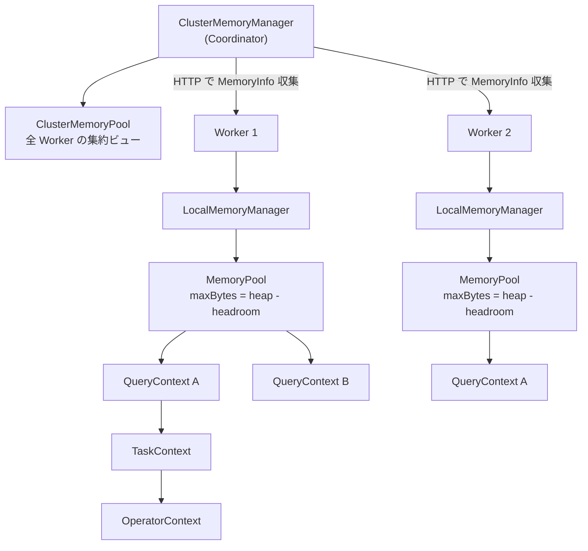
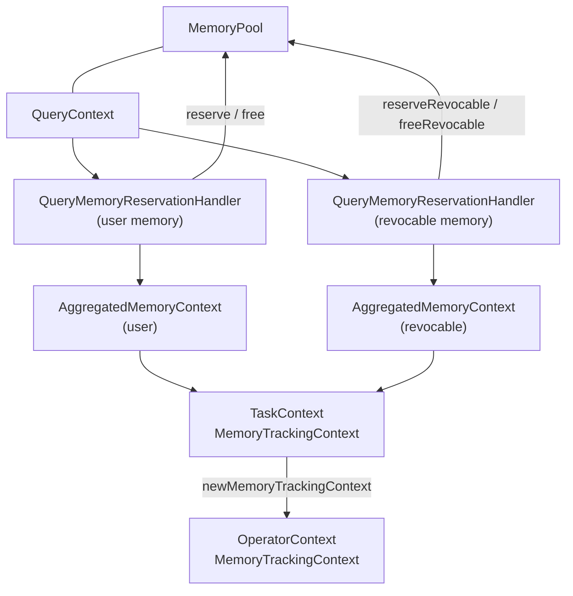
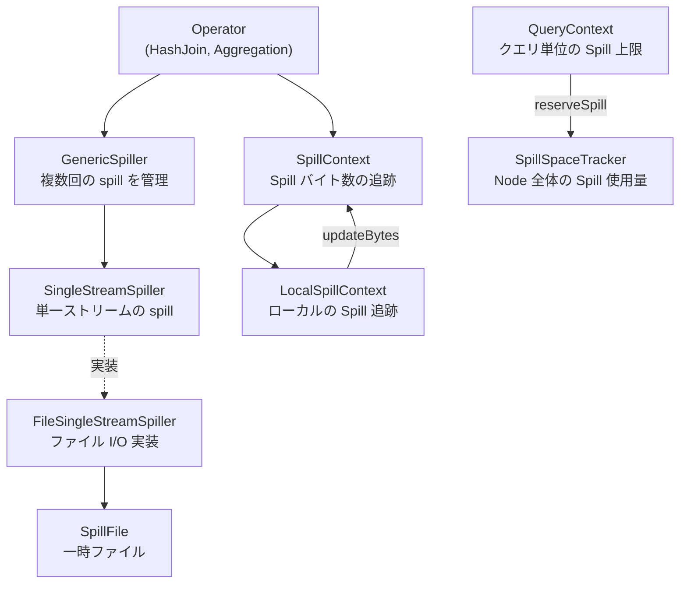

# 第17章 メモリ管理と Spill

> **本章で読むソース**
>
> - [`core/trino-main/src/main/java/io/trino/memory/MemoryPool.java`](https://github.com/trinodb/trino/blob/482/core/trino-main/src/main/java/io/trino/memory/MemoryPool.java)
> - [`core/trino-main/src/main/java/io/trino/memory/LocalMemoryManager.java`](https://github.com/trinodb/trino/blob/482/core/trino-main/src/main/java/io/trino/memory/LocalMemoryManager.java)
> - [`core/trino-main/src/main/java/io/trino/memory/QueryContext.java`](https://github.com/trinodb/trino/blob/482/core/trino-main/src/main/java/io/trino/memory/QueryContext.java)
> - [`core/trino-main/src/main/java/io/trino/memory/ClusterMemoryManager.java`](https://github.com/trinodb/trino/blob/482/core/trino-main/src/main/java/io/trino/memory/ClusterMemoryManager.java)
> - [`core/trino-main/src/main/java/io/trino/memory/ClusterMemoryPool.java`](https://github.com/trinodb/trino/blob/482/core/trino-main/src/main/java/io/trino/memory/ClusterMemoryPool.java)
> - [`core/trino-main/src/main/java/io/trino/memory/MemoryManagerConfig.java`](https://github.com/trinodb/trino/blob/482/core/trino-main/src/main/java/io/trino/memory/MemoryManagerConfig.java)
> - [`core/trino-main/src/main/java/io/trino/memory/NodeMemoryConfig.java`](https://github.com/trinodb/trino/blob/482/core/trino-main/src/main/java/io/trino/memory/NodeMemoryConfig.java)
> - [`core/trino-main/src/main/java/io/trino/memory/LowMemoryKiller.java`](https://github.com/trinodb/trino/blob/482/core/trino-main/src/main/java/io/trino/memory/LowMemoryKiller.java)
> - [`core/trino-main/src/main/java/io/trino/memory/TotalReservationLowMemoryKiller.java`](https://github.com/trinodb/trino/blob/482/core/trino-main/src/main/java/io/trino/memory/TotalReservationLowMemoryKiller.java)
> - [`core/trino-main/src/main/java/io/trino/memory/TotalReservationOnBlockedNodesQueryLowMemoryKiller.java`](https://github.com/trinodb/trino/blob/482/core/trino-main/src/main/java/io/trino/memory/TotalReservationOnBlockedNodesQueryLowMemoryKiller.java)
> - [`core/trino-main/src/main/java/io/trino/memory/TotalReservationOnBlockedNodesTaskLowMemoryKiller.java`](https://github.com/trinodb/trino/blob/482/core/trino-main/src/main/java/io/trino/memory/TotalReservationOnBlockedNodesTaskLowMemoryKiller.java)
> - [`core/trino-main/src/main/java/io/trino/memory/LeastWastedEffortTaskLowMemoryKiller.java`](https://github.com/trinodb/trino/blob/482/core/trino-main/src/main/java/io/trino/memory/LeastWastedEffortTaskLowMemoryKiller.java)
> - [`core/trino-main/src/main/java/io/trino/memory/ClusterMemoryLeakDetector.java`](https://github.com/trinodb/trino/blob/482/core/trino-main/src/main/java/io/trino/memory/ClusterMemoryLeakDetector.java)
> - [`core/trino-main/src/main/java/io/trino/operator/SpillContext.java`](https://github.com/trinodb/trino/blob/482/core/trino-main/src/main/java/io/trino/operator/SpillContext.java)
> - [`core/trino-main/src/main/java/io/trino/spiller/GenericSpiller.java`](https://github.com/trinodb/trino/blob/482/core/trino-main/src/main/java/io/trino/spiller/GenericSpiller.java)
> - [`core/trino-main/src/main/java/io/trino/spiller/FileSingleStreamSpiller.java`](https://github.com/trinodb/trino/blob/482/core/trino-main/src/main/java/io/trino/spiller/FileSingleStreamSpiller.java)
> - [`core/trino-main/src/main/java/io/trino/spiller/SpillSpaceTracker.java`](https://github.com/trinodb/trino/blob/482/core/trino-main/src/main/java/io/trino/spiller/SpillSpaceTracker.java)
> - [`core/trino-main/src/main/java/io/trino/spiller/FileSingleStreamSpillerFactory.java`](https://github.com/trinodb/trino/blob/482/core/trino-main/src/main/java/io/trino/spiller/FileSingleStreamSpillerFactory.java)
> - [`core/trino-main/src/main/java/io/trino/spiller/NodeSpillConfig.java`](https://github.com/trinodb/trino/blob/482/core/trino-main/src/main/java/io/trino/spiller/NodeSpillConfig.java)
> - [`lib/trino-memory-context/src/main/java/io/trino/memory/context/MemoryTrackingContext.java`](https://github.com/trinodb/trino/blob/482/lib/trino-memory-context/src/main/java/io/trino/memory/context/MemoryTrackingContext.java)

## この章の狙い

分散クエリエンジンでは、数十から数百の Worker が同時にクエリを処理する。
Worker ごとのヒープは有限であり、1 つの巨大クエリがメモリを使い切ればクラスタ全体が停止する。
Trino はこの問題に対し、Worker ローカルの**メモリプール**とクラスタ全体のメモリ監視、そして不足時にデータをディスクへ退避する **Spill** の3階層で対処している。

本章では、`MemoryPool` が予約と解放をどう追跡するか、`QueryContext` がクエリ単位の上限をどう強制するか、`ClusterMemoryManager` がクラスタ全体の OOM をどう回避するかをコードから読む。
さらに `FileSingleStreamSpiller` が Page をディスクへ書き出し、読み戻す流れを追い、revocable memory の分離がなぜ Spill 判定を安定させるかを確認する。

## 前提

- Trino の Operator インタフェース（`addInput` / `getOutput` / `finish`）と Driver の実行モデルを理解していること（第13章）。
- Page と Block のインメモリ表現を知っていること（第4章）。
- Task と Stage の概念を把握していること（第12章）。

## メモリプール階層の全体像

Trino のメモリ管理は、Worker ローカルの `MemoryPool` を基盤とし、その上にクエリ単位の `QueryContext`、さらにクラスタ全体を監視する `ClusterMemoryManager` が積み重なる構造になっている。



各 Worker は起動時に `LocalMemoryManager` が1つの `MemoryPool` を生成する。
このプールの上限は JVM ヒープからヘッドルーム（未追跡のメモリ割り当てのための余白）を差し引いた値になる。
Coordinator 上の `ClusterMemoryManager` は、全 Worker から HTTP で `MemoryInfo` を定期的に収集し、`ClusterMemoryPool` にクラスタ全体のメモリ状態を集約する。

## Worker ローカルのメモリプール

### LocalMemoryManager によるプール初期化

`LocalMemoryManager` は Worker 起動時に `NodeMemoryConfig` を受け取り、JVM ヒープの最大値からヘッドルームを引いた値で `MemoryPool` を生成する。

[`core/trino-main/src/main/java/io/trino/memory/LocalMemoryManager.java` L48-L54](https://github.com/trinodb/trino/blob/482/core/trino-main/src/main/java/io/trino/memory/LocalMemoryManager.java#L48-L54)

```java
    public LocalMemoryManager(NodeMemoryConfig config, long availableMemory)
    {
        validateHeapHeadroom(config, availableMemory);
        DataSize memoryPoolSize = DataSize.ofBytes(availableMemory - config.getHeapHeadroom().toBytes());
        verify(memoryPoolSize.toBytes() > 0, "memory pool size is 0");
        memoryPool = new MemoryPool(memoryPoolSize);
    }
```

ヘッドルームのデフォルトはヒープの 30% であり、`query.max-memory-per-node` と合わせてヒープ全体を超えないことが検証される。

[`core/trino-main/src/main/java/io/trino/memory/NodeMemoryConfig.java` L33-L34](https://github.com/trinodb/trino/blob/482/core/trino-main/src/main/java/io/trino/memory/NodeMemoryConfig.java#L33-L34)

```java
    private DataSize maxQueryMemoryPerNode = HeapSizeParser.DEFAULT.parse("30%");
    private DataSize heapHeadroom = HeapSizeParser.DEFAULT.parse("30%");
```

### MemoryPool の予約と解放

`MemoryPool` は Worker 上の全クエリが共有する単一のメモリプールであり、予約量を `reservedBytes` と `reservedRevocableBytes` の2系統で追跡する[^1]。

[`core/trino-main/src/main/java/io/trino/memory/MemoryPool.java` L48-L54](https://github.com/trinodb/trino/blob/482/core/trino-main/src/main/java/io/trino/memory/MemoryPool.java#L48-L54)

```java
    private final long maxBytes;

    @GuardedBy("this")
    private long reservedBytes;
    @GuardedBy("this")
    private long reservedRevocableBytes;

```

空き容量は `maxBytes - reservedBytes - reservedRevocableBytes` で計算される。

[`core/trino-main/src/main/java/io/trino/memory/MemoryPool.java` L254-L258](https://github.com/trinodb/trino/blob/482/core/trino-main/src/main/java/io/trino/memory/MemoryPool.java#L254-L258)

```java
    @Managed
    public synchronized long getFreeBytes()
    {
        return maxBytes - reservedBytes - reservedRevocableBytes;
    }
```

#### reserve メソッドの動作

`reserve` はメモリ予約の中心的なメソッドである。
予約量をクエリ別、Task 別、タグ別の3つのマップに加算し、プール全体の `reservedBytes` を増やす。
空きがなくなった場合、まだ完了していない `NonCancellableMemoryFuture` を返す。
呼び出し元の Operator はこの Future を待ってブロックする。

[`core/trino-main/src/main/java/io/trino/memory/MemoryPool.java` L125-L151](https://github.com/trinodb/trino/blob/482/core/trino-main/src/main/java/io/trino/memory/MemoryPool.java#L125-L151)

```java
    public ListenableFuture<Void> reserve(TaskId taskId, String allocationTag, long bytes)
    {
        checkArgument(bytes >= 0, "'%s' is negative", bytes);
        ListenableFuture<Void> result;
        synchronized (this) {
            if (bytes != 0) {
                QueryId queryId = taskId.queryId();
                queryMemoryReservations.merge(queryId, bytes, Long::sum);
                updateTaggedMemoryAllocations(queryId, allocationTag, bytes);
                taskMemoryReservations.merge(taskId, bytes, Long::sum);
                reservedBytes += bytes;
            }
            if (getFreeBytes() <= 0) {
                if (future == null) {
                    future = NonCancellableMemoryFuture.create();
                }
                checkState(!future.isDone(), "future is already completed");
                result = future;
            }
            else {
                result = NOT_BLOCKED;
            }
        }

        onMemoryReserved();
        return result;
    }
```

空きがゼロ以下になったときに初めて Future を生成する点が重要である。
空きが十分な間は `NOT_BLOCKED`（即座に完了した Future）を返すため、Operator はブロックせずに処理を続行できる。

#### free メソッドによるブロック解除

`free` は予約を差し引き、空きが回復した場合に保留中の Future を完了させる。
これにより、メモリ不足でブロックしていた Operator が再開される。

[`core/trino-main/src/main/java/io/trino/memory/MemoryPool.java` L207-L231](https://github.com/trinodb/trino/blob/482/core/trino-main/src/main/java/io/trino/memory/MemoryPool.java#L207-L231)

```java
    public synchronized void free(TaskId taskId, String allocationTag, long bytes)
    {
        checkArgument(bytes >= 0, "'%s' is negative", bytes);
        checkArgument(reservedBytes >= bytes, "tried to free more memory than is reserved");
        if (bytes == 0) {
            // Freeing zero bytes is a no-op
            return;
        }

        QueryId queryId = taskId.queryId();
        updateCounter(taskMemoryReservations, taskId, -bytes, false);
        long queryReservation = updateCounter(queryMemoryReservations, queryId, -bytes, false);
        if (queryReservation == 0) {
            taggedMemoryAllocations.remove(queryId);
        }
        else {
            updateTaggedMemoryAllocations(queryId, allocationTag, -bytes);
        }

        reservedBytes -= bytes;
        if (getFreeBytes() > 0 && future != null) {
            future.set(null);
            future = null;
        }
    }
```

#### tryReserve と楽観的な予約

`tryReserve` は空きが足りなければ即座に `false` を返し、ブロックしない。
OutputBuffer のようなバックプレッシャを許容するコンポーネントがこの API を使う。

[`core/trino-main/src/main/java/io/trino/memory/MemoryPool.java` L187-L205](https://github.com/trinodb/trino/blob/482/core/trino-main/src/main/java/io/trino/memory/MemoryPool.java#L187-L205)

```java
    public boolean tryReserve(TaskId taskId, String allocationTag, long bytes)
    {
        checkArgument(bytes >= 0, "'%s' is negative", bytes);
        synchronized (this) {
            if (getFreeBytes() - bytes < 0) {
                return false;
            }
            if (bytes != 0) {
                QueryId queryId = taskId.queryId();
                queryMemoryReservations.merge(queryId, bytes, Long::sum);
                updateTaggedMemoryAllocations(queryId, allocationTag, bytes);
                taskMemoryReservations.merge(taskId, bytes, Long::sum);
                reservedBytes += bytes;
            }
        }

        onMemoryReserved();
        return true;
    }
```

#### revocable メモリの予約

`reserveRevocable` は `reserve` と同じ構造だが、予約量を `reservedRevocableBytes` と `taskRevocableMemoryReservations` に記録する。

[`core/trino-main/src/main/java/io/trino/memory/MemoryPool.java` L158-L182](https://github.com/trinodb/trino/blob/482/core/trino-main/src/main/java/io/trino/memory/MemoryPool.java#L158-L182)

```java
    public ListenableFuture<Void> reserveRevocable(TaskId taskId, long bytes)
    {
        checkArgument(bytes >= 0, "'%s' is negative", bytes);

        ListenableFuture<Void> result;
        synchronized (this) {
            if (bytes != 0) {
                taskRevocableMemoryReservations.merge(taskId, bytes, Long::sum);
                reservedRevocableBytes += bytes;
            }
            if (getFreeBytes() <= 0) {
                if (future == null) {
                    future = NonCancellableMemoryFuture.create();
                }
                checkState(!future.isDone(), "future is already completed");
                result = future;
            }
            else {
                result = NOT_BLOCKED;
            }
        }

        onMemoryReserved();
        return result;
    }
```

revocable メモリはハッシュ結合のビルド側のように、必要に応じてディスクへ退避（Spill）できるメモリである。
通常の予約（user memory）と分離して追跡することで、Spill で解放可能な量を正確に把握できる。

#### タグ付きメモリ割り当て

`MemoryPool` はクエリごとのメモリ使用量をタグ別に記録する `taggedMemoryAllocations` マップを持つ。
タグには Operator のクラス名（`HashAggregationOperator`、`LazyOutputBuffer` など）が使われる。

[`core/trino-main/src/main/java/io/trino/memory/MemoryPool.java` L64-L65](https://github.com/trinodb/trino/blob/482/core/trino-main/src/main/java/io/trino/memory/MemoryPool.java#L64-L65)

```java
    @GuardedBy("this")
    private final Map<QueryId, Map<String, Long>> taggedMemoryAllocations = new HashMap<>();
```

この情報は OOM エラー発生時のトップ消費者の表示に使われ、メモリ超過の原因を特定するための診断データとなる。

## QueryContext によるクエリ単位のメモリ管理

`QueryContext` はクエリごとに1つ存在し、そのクエリのメモリ使用量が上限を超えないように制御する。

### メモリ上限の適用

`updateUserMemory` は予約のたびに `enforceUserMemoryLimit` を呼び、クエリの累積使用量が `maxUserMemory` を超えていないかを検査する。
超過した場合は即座に例外を投げてクエリを停止させる。

[`core/trino-main/src/main/java/io/trino/memory/QueryContext.java` L164-L177](https://github.com/trinodb/trino/blob/482/core/trino-main/src/main/java/io/trino/memory/QueryContext.java#L164-L177)

```java
    private synchronized ListenableFuture<Void> updateUserMemory(TaskId taskId, String allocationTag, long delta)
    {
        if (delta >= 0) {
            enforceUserMemoryLimit(memoryPool.getQueryMemoryReservation(queryId), delta, maxUserMemory);
            ListenableFuture<Void> future = memoryPool.reserve(taskId, allocationTag, delta);
            if (future.isDone()) {
                return NOT_BLOCKED;
            }

            return future;
        }
        memoryPool.free(taskId, allocationTag, -delta);
        return NOT_BLOCKED;
    }
```

[`core/trino-main/src/main/java/io/trino/memory/QueryContext.java` L332-L338](https://github.com/trinodb/trino/blob/482/core/trino-main/src/main/java/io/trino/memory/QueryContext.java#L332-L338)

```java
    @GuardedBy("this")
    private void enforceUserMemoryLimit(long allocated, long delta, long maxMemory)
    {
        if (allocated + delta > maxMemory) {
            throw exceededLocalUserMemoryLimit(succinctBytes(maxMemory), getAdditionalFailureInfo(allocated, delta));
        }
    }
```

上限超過時のエラーメッセージには、タグ別のトップ3消費者の内訳が含まれる。
これにより、どの Operator がメモリを大量に消費しているかを運用者が把握できる。

[`core/trino-main/src/main/java/io/trino/memory/QueryContext.java` L340-L361](https://github.com/trinodb/trino/blob/482/core/trino-main/src/main/java/io/trino/memory/QueryContext.java#L340-L361)

```java
@GuardedBy("this")
private String getAdditionalFailureInfo(long allocated, long delta)
{
    Map<String, Long> queryAllocations = memoryPool.getTaggedMemoryAllocations(queryId);
    // ... (中略) ...
    String topConsumers = queryAllocations.entrySet().stream()
            .sorted(comparingByValue(Comparator.reverseOrder()))
            .limit(3)
            .filter(e -> e.getValue() >= 0)
            .collect(toImmutableMap(Entry::getKey, e -> succinctBytes(e.getValue())))
            .toString();

    return format("%s, Top Consumers: %s", additionalInfo, topConsumers);
}
```

### MemoryTrackingContext による階層的な追跡

`QueryContext` は Task を追加する際に、user メモリ用と revocable メモリ用の2つの `AggregatedMemoryContext` を組み合わせた `MemoryTrackingContext` を生成する。

[`core/trino-main/src/main/java/io/trino/memory/QueryContext.java` L252-L262](https://github.com/trinodb/trino/blob/482/core/trino-main/src/main/java/io/trino/memory/QueryContext.java#L252-L262)

```java
        AggregatedMemoryContext taskUserMemory = newRootAggregatedMemoryContext(
                new QueryMemoryReservationHandler(
                        (tag, delta) -> updateUserMemory(taskId, tag, delta),
                        (tag, delta) -> tryUpdateUserMemory(taskId, tag, delta)),
                guaranteedMemory);
        AggregatedMemoryContext taskRevocableMemory = newRootAggregatedMemoryContext(
                new QueryMemoryReservationHandler(
                        (_, delta) -> updateRevocableMemory(taskId, delta),
                        (_, _) -> tryReserveMemoryNotSupported()),
                0L);
        MemoryTrackingContext taskMemoryContext = new MemoryTrackingContext(taskUserMemory, taskRevocableMemory);
```

`MemoryTrackingContext` は `TaskContext` から `OperatorContext` へと `newMemoryTrackingContext()` で子コンテキストを派生させる。
子コンテキストでのメモリ予約は親コンテキストを通じて `MemoryPool` まで伝播する。

[`lib/trino-memory-context/src/main/java/io/trino/memory/context/MemoryTrackingContext.java` L56-L61](https://github.com/trinodb/trino/blob/482/lib/trino-memory-context/src/main/java/io/trino/memory/context/MemoryTrackingContext.java#L56-L61)

```java
    public MemoryTrackingContext newMemoryTrackingContext()
    {
        return new MemoryTrackingContext(
                userAggregateMemoryContext.newAggregatedMemoryContext(),
                revocableAggregateMemoryContext.newAggregatedMemoryContext());
    }
```

この階層構造を図にまとめると次のようになる。



Operator がメモリを確保するとき、`OperatorContext` の `LocalMemoryContext` に `setBytes` を呼ぶ。
増分は `AggregatedMemoryContext` の親チェインを辿り、最終的に `QueryMemoryReservationHandler` 経由で `MemoryPool.reserve` に到達する。

### guaranteedMemory による最低保証

user メモリの `AggregatedMemoryContext` 生成時に `guaranteedMemory`（デフォルト 1 MB）が設定される。

[`core/trino-main/src/main/java/io/trino/memory/QueryContext.java` L63](https://github.com/trinodb/trino/blob/482/core/trino-main/src/main/java/io/trino/memory/QueryContext.java#L63)

```java
    private static final long GUARANTEED_MEMORY = DataSize.of(1, MEGABYTE).toBytes();
```

この値は `RootAggregatedMemoryContext` の内部で、小さな割り当てについてはプールへの問い合わせなしにローカルで充足するために使われる。
これにより、メモリプールが逼迫していても Task がごく小さな割り当てで即座にブロックされることを防ぐ。

## クラスタ全体のメモリ管理

### ClusterMemoryManager の役割

`ClusterMemoryManager` は Coordinator 上で動作し、定期的にクラスタ全体のメモリ状態を監視する。
コンストラクタで `serverConfig.isCoordinator()` を検査しており、Worker 上ではインスタンスが生成されない。

[`core/trino-main/src/main/java/io/trino/memory/ClusterMemoryManager.java` L139](https://github.com/trinodb/trino/blob/482/core/trino-main/src/main/java/io/trino/memory/ClusterMemoryManager.java#L139)

```java
        checkState(serverConfig.isCoordinator(), "ClusterMemoryManager must not be bound on worker");
```

`process` メソッドが定期的に呼ばれ、以下の処理を行う。

1. メモリリークの検出
2. クエリ単位のメモリ上限チェック
3. クラスタ OOM 時の LowMemoryKiller 呼び出し
4. 各 Worker のメモリ情報の更新

### クエリ単位のメモリ上限チェック

`process` 内で実行中の各クエリに対し、`query.max-memory`（user メモリの上限）と `query.max-total-memory`（user + revocable の合計上限）をチェックする。

[`core/trino-main/src/main/java/io/trino/memory/ClusterMemoryManager.java` L210-L223](https://github.com/trinodb/trino/blob/482/core/trino-main/src/main/java/io/trino/memory/ClusterMemoryManager.java#L210-L223)

```java
            if (!resourceOvercommit) {
                long userMemoryLimit = min(maxQueryMemory.toBytes(), getQueryMaxMemory(query.getSession()).toBytes());
                if (userMemoryReservation > userMemoryLimit) {
                    query.fail(exceededGlobalUserLimit(succinctBytes(userMemoryLimit)));
                    queryKilled = true;
                }

                long totalMemoryLimit = min(maxQueryTotalMemory.toBytes(), getQueryMaxTotalMemory(query.getSession()).toBytes());
                if (totalMemoryReservation > totalMemoryLimit) {
                    query.fail(exceededGlobalTotalLimit(succinctBytes(totalMemoryLimit)));
                    queryKilled = true;
                }
            }
        }
```

ここで検査されるのはクラスタ全体での累積使用量であり、Worker 単体の上限チェック（`QueryContext.enforceUserMemoryLimit`）とは別の防御線である。
設定値は `MemoryManagerConfig` で定義されている。

[`core/trino-main/src/main/java/io/trino/memory/MemoryManagerConfig.java` L38-L39](https://github.com/trinodb/trino/blob/482/core/trino-main/src/main/java/io/trino/memory/MemoryManagerConfig.java#L38-L39)

```java
    private DataSize maxQueryMemory = DataSize.of(20, GIGABYTE);
    // enforced against normal + and revocable memory allocations (default is maxQueryMemory * 2)
```

`maxQueryTotalMemory` が明示的に設定されていない場合、`maxQueryMemory` の2倍がデフォルトになる。

[`core/trino-main/src/main/java/io/trino/memory/MemoryManagerConfig.java` L66-L70](https://github.com/trinodb/trino/blob/482/core/trino-main/src/main/java/io/trino/memory/MemoryManagerConfig.java#L66-L70)

```java
    {
        if (maxQueryTotalMemory == null) {
            return succinctBytes(maxQueryMemory.toBytes() * 2);
        }
        return maxQueryTotalMemory;
```

### ClusterMemoryPool によるクラスタビューの集約

`ClusterMemoryPool` は全 Worker の `MemoryInfo` を `update` メソッドで集約する。
各 Worker のプール情報を走査し、クエリ別の予約量を合算する。

[`core/trino-main/src/main/java/io/trino/memory/ClusterMemoryPool.java` L122-L149](https://github.com/trinodb/trino/blob/482/core/trino-main/src/main/java/io/trino/memory/ClusterMemoryPool.java#L122-L149)

```java
public synchronized void update(List<MemoryInfo> memoryInfos, int assignedQueries)
{
    nodes = 0;
    blockedNodes = 0;
    totalDistributedBytes = 0;
    reservedDistributedBytes = 0;
    reservedRevocableDistributedBytes = 0;
    this.assignedQueries = assignedQueries;
    this.queryMemoryReservations.clear();
    this.queryMemoryAllocations.clear();

    for (MemoryInfo info : memoryInfos) {
        MemoryPoolInfo poolInfo = info.getPool();
        nodes++;
        if (poolInfo.getFreeBytes() + poolInfo.getReservedRevocableBytes() <= 0) {
            blockedNodes++;
        }
        totalDistributedBytes += poolInfo.getMaxBytes();
        reservedDistributedBytes += poolInfo.getReservedBytes();
        reservedRevocableDistributedBytes += poolInfo.getReservedRevocableBytes();
        for (Entry<QueryId, Long> entry : poolInfo.getQueryMemoryReservations().entrySet()) {
            queryMemoryReservations.merge(entry.getKey(), entry.getValue(), Long::sum);
        }
        // ... (中略) ...
    }
}
```

ブロック判定は `poolInfo.getFreeBytes() + poolInfo.getReservedRevocableBytes() <= 0` で行われる。
revocable メモリは Spill によって解放可能なので、空き容量の計算に revocable 分を加算している。
実質的に「revocable を全て解放しても空きがない」Node をブロック状態と見なす。

## LowMemoryKiller による OOM 回避

クラスタがメモリ不足に陥ったとき（ブロック状態の Node が1つ以上存在するとき）、`ClusterMemoryManager` は `LowMemoryKiller` にキル対象の選定を委譲する。

[`core/trino-main/src/main/java/io/trino/memory/ClusterMemoryManager.java` L228-L236](https://github.com/trinodb/trino/blob/482/core/trino-main/src/main/java/io/trino/memory/ClusterMemoryManager.java#L228-L236)

```java
        if (!lowMemoryKillers.isEmpty() && outOfMemory && !queryKilled) {
            if (isLastKillTargetGone()) {
                callOomKiller(runningQueries);
            }
            else {
                log.debug("Last killed target is still not gone: %s", lastKillTarget);
            }
        }

```

前回キルした対象がまだプールに残っている間は次のキルを行わない。
これにより、キル後のメモリ解放を待たずに連続してクエリを停止させることを防ぐ。

### キラーの2段構え

`ClusterMemoryManager` は Task 用キラーとクエリ用キラーの2つを順番に試す。

[`core/trino-main/src/main/java/io/trino/memory/ClusterMemoryManager.java` L148-L150](https://github.com/trinodb/trino/blob/482/core/trino-main/src/main/java/io/trino/memory/ClusterMemoryManager.java#L148-L150)

```java
        this.lowMemoryKillers = ImmutableList.of(
                taskLowMemoryKiller, // try to kill tasks first
                queryLowMemoryKiller);
```

Task 用キラーが先に実行される。
fault-tolerant 実行モード（Task リトライ有効）では、クエリ全体を停止させるよりも個別の Task をキルしてリトライさせるほうが影響が小さいためである。

### TotalReservationLowMemoryKiller

最もシンプルな実装であり、全クエリの中からメモリ使用量が最大のクエリをキル対象に選ぶ。

[`core/trino-main/src/main/java/io/trino/memory/TotalReservationLowMemoryKiller.java` L27-L38](https://github.com/trinodb/trino/blob/482/core/trino-main/src/main/java/io/trino/memory/TotalReservationLowMemoryKiller.java#L27-L38)

```java
    {
        Optional<QueryId> biggestQuery = Optional.empty();
        long maxMemory = 0;
        for (RunningQueryInfo query : runningQueries) {
            long bytesUsed = query.getMemoryReservation();
            if (bytesUsed > maxMemory) {
                biggestQuery = Optional.of(query.getQueryId());
                maxMemory = bytesUsed;
            }
        }
        return biggestQuery.map(KillTarget::wholeQuery);
    }
```

### TotalReservationOnBlockedNodesQueryLowMemoryKiller

デフォルトのクエリ用キラーであり、ブロック状態の Node 上でのメモリ使用量が最大のクエリを選ぶ。
クラスタ全体の使用量ではなく、実際にメモリ不足が発生している Node に限定して集計する点が `TotalReservationLowMemoryKiller` との違いである。

[`core/trino-main/src/main/java/io/trino/memory/TotalReservationOnBlockedNodesQueryLowMemoryKiller.java` L32-L64](https://github.com/trinodb/trino/blob/482/core/trino-main/src/main/java/io/trino/memory/TotalReservationOnBlockedNodesQueryLowMemoryKiller.java#L32-L64)

```java
@Override
public Optional<KillTarget> chooseTargetToKill(List<RunningQueryInfo> runningQueries, List<MemoryInfo> nodes)
{
    Map<QueryId, RunningQueryInfo> queriesById = Maps.uniqueIndex(runningQueries, RunningQueryInfo::getQueryId);
    Map<QueryId, Long> memoryReservationOnBlockedNodes = new HashMap<>();
    for (MemoryInfo node : nodes) {
        MemoryPoolInfo memoryPool = node.getPool();
        // ... (中略) ...
        if (memoryPool.getFreeBytes() + memoryPool.getReservedRevocableBytes() > 0) {
            continue;
        }
        Map<QueryId, Long> queryMemoryReservations = memoryPool.getQueryMemoryReservations();
        queryMemoryReservations.forEach((queryId, memoryReservation) -> {
            RunningQueryInfo queryMemoryInfo = queriesById.get(queryId);
            if (queryMemoryInfo != null && queryMemoryInfo.getRetryPolicy() == RetryPolicy.TASK) {
                // ... (中略) ...
                return;
            }
            memoryReservationOnBlockedNodes.compute(queryId, (_, oldValue) -> oldValue == null ? memoryReservation : oldValue + memoryReservation);
        });
    }

    return memoryReservationOnBlockedNodes.entrySet().stream()
            .max(comparingLong(Map.Entry::getValue))
            .map(Map.Entry::getKey)
            .map(KillTarget::wholeQuery);
}
```

Task リトライが有効なクエリはこのキラーのキル対象から除外される。
そのようなクエリは、Task 用キラーによる個別 Task のキルとリトライで対処する想定である。

### TotalReservationOnBlockedNodesTaskLowMemoryKiller

Task リトライ有効なクエリの Task を対象とするキラーである。
ブロック状態の各 Node について、メモリ使用量が最大の Task を選ぶ。
まず投機的実行中（speculative）の Task だけで探し、見つからなければ全 Task に範囲を広げる。

[`core/trino-main/src/main/java/io/trino/memory/TotalReservationOnBlockedNodesTaskLowMemoryKiller.java` L61-L63](https://github.com/trinodb/trino/blob/482/core/trino-main/src/main/java/io/trino/memory/TotalReservationOnBlockedNodesTaskLowMemoryKiller.java#L61-L63)

```java
            findBiggestTask(runningQueriesById, memoryPool, true) // try just speculative
                    .or(() -> findBiggestTask(runningQueriesById, memoryPool, false)) // fallback to any task
                    .ifPresent(tasksToKillBuilder::add);
```

投機的実行の Task を優先的にキルする理由は、投機的に起動された Task はキルしても進行中の処理に影響がないか、影響が小さいためである。

### LeastWastedEffortTaskLowMemoryKiller

もう1つの Task 用キラーである `LeastWastedEffortTaskLowMemoryKiller` は、単純なメモリ使用量ではなく、使用メモリ量を実行時間で割った値（メモリ消費速度のようなもの）が最大の Task を選ぶ。

[`core/trino-main/src/main/java/io/trino/memory/LeastWastedEffortTaskLowMemoryKiller.java` L100-L109](https://github.com/trinodb/trino/blob/482/core/trino-main/src/main/java/io/trino/memory/LeastWastedEffortTaskLowMemoryKiller.java#L100-L109)

```java
        return stream
                .max(comparing(entry -> {
                    TaskId taskId = entry.getKey();
                    Long memoryUsed = entry.getValue();
                    long wallTime = 0;
                    if (taskInfos.containsKey(taskId)) {
                        TaskStats stats = taskInfos.get(taskId).stats();
                        wallTime = stats.totalScheduledTime().toMillis() + stats.totalBlockedTime().toMillis();
                    }
                    wallTime = Math.max(wallTime, MIN_WALL_TIME); // only look at memory consumption for fairly short-lived tasks
```

長時間実行されてメモリを多く使っている Task よりも、短時間で大量のメモリを消費している Task を優先してキルする。
キルした Task はリトライされるため、すでに多くの計算を終えた Task を無駄にするよりも、まだ始まったばかりの Task をキルするほうが全体の無駄が少ない。

### ClusterMemoryLeakDetector によるリーク検出

`ClusterMemoryLeakDetector` は、既に終了したクエリがメモリプール上にまだ予約を保持しているケースをリークとして検出する。

[`core/trino-main/src/main/java/io/trino/memory/ClusterMemoryLeakDetector.java` L75-L90](https://github.com/trinodb/trino/blob/482/core/trino-main/src/main/java/io/trino/memory/ClusterMemoryLeakDetector.java#L75-L90)

```java
    private static boolean isLeaked(Map<QueryId, BasicQueryInfo> queryIdToInfo, QueryId queryId)
    {
        BasicQueryInfo queryInfo = queryIdToInfo.get(queryId);

        if (queryInfo == null) {
            return true;
        }

        Instant queryEndTime = queryInfo.getQueryStats().getEndTime();

        if (queryInfo.getState() == RUNNING || queryEndTime == null) {
            return false;
        }

        return queryEndTime.plusSeconds(DEFAULT_LEAK_CLAIM_DELTA_SEC).isBefore(now());
    }
```

クエリ終了から 60 秒以上経過してもメモリ予約が残っている場合にリークと判定する。
60 秒の猶予は、分散環境では Worker のメモリ解放が Coordinator に反映されるまでに遅延があるためである。

## Spill の仕組み

### Spill の全体構造

Spill はメモリ上のデータをディスクへ一時退避する仕組みである。
ハッシュ結合やハッシュ集約のように大量のメモリを消費する Operator が、revocable メモリとして確保したデータを Spill 対象とする。

Spill 関連のクラスは階層的に構成されている。



### SpillContext によるバイト数追跡

`SpillContext` は Spill されたバイト数を追跡するためのインタフェースである。

[`core/trino-main/src/main/java/io/trino/operator/SpillContext.java` L22-L33](https://github.com/trinodb/trino/blob/482/core/trino-main/src/main/java/io/trino/operator/SpillContext.java#L20-L33)

```java
@FunctionalInterface
public interface SpillContext
        extends Closeable
{
    void updateBytes(long bytes);

    default SpillContext newLocalSpillContext()
    {
        return new LocalSpillContext(this);
    }

    @Override
    default void close() {}
}
```

`LocalSpillContext` は親の `SpillContext` に差分を通知し、`close` 時にこれまでの累積バイト数を差し引く。

[`core/trino-main/src/main/java/io/trino/spiller/LocalSpillContext.java` L35-L51](https://github.com/trinodb/trino/blob/482/core/trino-main/src/main/java/io/trino/spiller/LocalSpillContext.java#L35-L51)

```java
    public synchronized void updateBytes(long bytes)
    {
        checkState(!closed, "Already closed");
        parentSpillContext.updateBytes(bytes);
        spilledBytes += bytes;
    }

    @Override
    public synchronized void close()
    {
        if (closed) {
            return;
        }

        closed = true;
        parentSpillContext.updateBytes(-spilledBytes);
    }
```

### QueryContext での Spill 上限管理

クエリ単位の Spill 使用量は `QueryContext.reserveSpill` で管理される。
クエリごとの上限（`maxSpill`）を超えると例外が投げられる。
上限内であれば、さらに Node 全体の `SpillSpaceTracker` に予約を伝播させる。

[`core/trino-main/src/main/java/io/trino/memory/QueryContext.java` L195-L204](https://github.com/trinodb/trino/blob/482/core/trino-main/src/main/java/io/trino/memory/QueryContext.java#L195-L204)

```java
    public synchronized ListenableFuture<Void> reserveSpill(long bytes)
    {
        checkArgument(bytes >= 0, "bytes is negative");
        if (spillUsed + bytes > maxSpill) {
            throw exceededPerQueryLocalLimit(succinctBytes(maxSpill));
        }
        ListenableFuture<Void> future = spillSpaceTracker.reserve(bytes);
        spillUsed += bytes;
        return future;
    }
```

### SpillSpaceTracker による Node 全体の Spill 容量管理

`SpillSpaceTracker` は Node 単位での Spill ディスク使用量の上限を管理する。
`max-spill-per-node`（デフォルト 100 GB）を超える予約が試みられると例外を投げる。

[`core/trino-main/src/main/java/io/trino/spiller/SpillSpaceTracker.java` L47-L57](https://github.com/trinodb/trino/blob/482/core/trino-main/src/main/java/io/trino/spiller/SpillSpaceTracker.java#L47-L57)

```java
    public synchronized ListenableFuture<Void> reserve(long bytes)
    {
        checkArgument(bytes >= 0, "bytes is negative");

        if ((currentBytes + bytes) >= maxBytes) {
            throw exceededLocalLimit(succinctBytes(maxBytes));
        }
        currentBytes += bytes;

        return NOT_BLOCKED;
    }
```

### GenericSpiller による複数回の Spill 管理

`GenericSpiller` は `Spiller` インタフェースの標準実装であり、`spill` が呼ばれるたびに新しい `SingleStreamSpiller` を生成する。

[`core/trino-main/src/main/java/io/trino/spiller/GenericSpiller.java` L59-L68](https://github.com/trinodb/trino/blob/482/core/trino-main/src/main/java/io/trino/spiller/GenericSpiller.java#L59-L68)

```java
    @Override
    public ListenableFuture<DataSize> spill(Iterator<Page> pageIterator)
    {
        checkNoSpillInProgress();
        SingleStreamSpiller singleStreamSpiller = singleStreamSpillerFactory.create(types, spillContext, aggregatedMemoryContext.newLocalMemoryContext(GenericSpiller.class.getSimpleName()));
        closer.register(singleStreamSpiller);
        singleStreamSpillers.add(singleStreamSpiller);
        previousSpill = singleStreamSpiller.spill(pageIterator);
        return previousSpill;
    }
```

`getSpills` で全ての Spill 済みデータを `Iterator<Page>` のリストとして取得できる。

### FileSingleStreamSpiller によるディスク I/O

`FileSingleStreamSpiller` は `SingleStreamSpiller` の実装であり、Page をシリアライズしてディスクに書き出す。

#### 書き込み

`writePages` は Page をシリアライズし、複数の Spill ファイルにラウンドロビンで書き込む。
書き込みごとに `localSpillContext.updateBytes` でバイト数を報告する。

[`core/trino-main/src/main/java/io/trino/spiller/FileSingleStreamSpiller.java` L233-L275](https://github.com/trinodb/trino/blob/482/core/trino-main/src/main/java/io/trino/spiller/FileSingleStreamSpiller.java#L233-L275)

```java
private DataSize writePages(Iterator<Page> pages)
{
    // ... (中略) ...
    PageSerializer serializer = serdeFactory.createSerializer(encryptionKey);

    long spilledPagesBytes = 0;
    int fileIndex = currentFileIndex;
    int fileCount = spillFiles.size();

    try {
        while (pages.hasNext()) {
            Page page = pages.next();
            long pageSizeInBytes = page.getSizeInBytes();
            Slice serialized = serializer.serialize(page);
            long serializedPageSize = serialized.length();

            spillFiles.get(fileIndex).writeBytes(serialized);

            spilledPagesBytes += pageSizeInBytes;

            spilledPagesInMemorySize.addAndGet(pageSizeInBytes);
            localSpillContext.updateBytes(serializedPageSize);
            spillerStats.addToTotalSpilledBytes(serializedPageSize);

            fileIndex = (fileIndex + 1) % fileCount;
        }
        // ... (中略) ...
    }
    // ... (中略) ...
    return DataSize.ofBytes(spilledPagesBytes);
}
```

#### 読み戻し

`getSpilledPages` はシリアライズされた Page をディスクから読み戻す。
こちらも複数ファイルからラウンドロビンで読み取ることで、書き込み時と同じ順序で Page を復元する。

[`core/trino-main/src/main/java/io/trino/spiller/FileSingleStreamSpiller.java` L141-L183](https://github.com/trinodb/trino/blob/482/core/trino-main/src/main/java/io/trino/spiller/FileSingleStreamSpiller.java#L141-L183)

```java
@Override
public Iterator<Page> getSpilledPages()
{
    checkNoSpillInProgress();
    checkState(writable.getAndSet(false), "Repeated reads are disallowed to prevent potential resource leaks");

    try {
        // ... (中略) ...
        PageDeserializer deserializer = serdeFactory.createDeserializer(encryptionKey);
        this.encryptionKey = Optional.empty();

        int fileCount = spillFiles.size();
        List<Iterator<Page>> iterators = new ArrayList<>(fileCount);
        for (SpillFile file : spillFiles) {
            iterators.add(readFilePages(deserializer, file, closer));
        }

        return new AbstractIterator<>()
        {
            int fileIndex;

            @Override
            protected Page computeNext()
            {
                Iterator<Page> iterator = iterators.get(fileIndex);
                if (!iterator.hasNext()) {
                    checkAllIteratorsExhausted(iterators);
                    return endOfData();
                }

                Page page = iterator.next();
                fileIndex = (fileIndex + 1) % fileCount;
                return page;
            }
        };
    }
    // ... (中略) ...
}
```

読み取りは1回限りであり、再読み取りは `writable` フラグで禁止される。
暗号化キーも読み取り後に破棄されるため、リソースリークの防止と情報漏洩の防止が同時に実現されている。

### FileSingleStreamSpillerFactory による Spill パス管理

`FileSingleStreamSpillerFactory` は Spill 先のディスクパスをラウンドロビンで選択する。
各パスに十分な空き容量があるかと、ヘルスチェック（一時ファイルの作成と削除）に通るかを確認する。

[`core/trino-main/src/main/java/io/trino/spiller/FileSingleStreamSpillerFactory.java` L191-L206](https://github.com/trinodb/trino/blob/482/core/trino-main/src/main/java/io/trino/spiller/FileSingleStreamSpillerFactory.java#L191-L206)

```java
    private synchronized Path getNextSpillPath()
    {
        int spillPathsCount = spillPaths.size();
        for (int i = 0; i < spillPathsCount; ++i) {
            int pathIndex = (roundRobinIndex + i) % spillPathsCount;
            Path path = spillPaths.get(pathIndex);
            if (hasEnoughDiskSpace(path) && spillPathHealthCache.getUnchecked(path)) {
                roundRobinIndex = (roundRobinIndex + i + 1) % spillPathsCount;
                return path;
            }
        }
        if (spillPaths.isEmpty()) {
            throw new TrinoException(OUT_OF_SPILL_SPACE, "No spill paths configured");
        }
        throw new TrinoException(OUT_OF_SPILL_SPACE, "No free or healthy space available for spill");
    }
```

ヘルスチェックの結果は5分間キャッシュされ、ファイルシステムの異常を素早く検出しつつ、I/O オーバーヘッドを抑えている。

### Spill データの暗号化と圧縮

`NodeSpillConfig` で Spill データの圧縮コーデック（デフォルトは `NONE`、LZ4 を選択可能）と暗号化の有効化を設定できる。

[`core/trino-main/src/main/java/io/trino/spiller/NodeSpillConfig.java` L33-L34](https://github.com/trinodb/trino/blob/482/core/trino-main/src/main/java/io/trino/spiller/NodeSpillConfig.java#L33-L34)

```java
    private CompressionCodec spillCompressionCodec = NONE;
    private boolean spillEncryptionEnabled;
```

暗号化が有効な場合、`FileSingleStreamSpillerFactory` は Spill ごとにランダムな AES キーを生成し、`FileSingleStreamSpiller` のコンストラクタに渡す。
このキーは読み取り後に破棄されるため、Spill ファイルが残っても復号はできない。

## 高速化の工夫: revocable メモリの分離による Spill 判定の安定化

Trino は Operator が確保するメモリを user memory と revocable memory の2系統に分離している。
この分離がメモリ管理と Spill の効率を高めている。

user memory は Operator が処理に必要とし、解放できないメモリ（例えば、進行中のフィルタリングに使うバッファ）を表す。
revocable memory はハッシュ結合のビルドテーブルやハッシュ集約の中間状態のように、必要に応じて Spill でディスクに退避できるメモリを表す。

この分離が有効に働く場面を、`ClusterMemoryPool` のブロック判定で確認できる。

[`core/trino-main/src/main/java/io/trino/memory/ClusterMemoryPool.java` L136-L137](https://github.com/trinodb/trino/blob/482/core/trino-main/src/main/java/io/trino/memory/ClusterMemoryPool.java#L136-L137)

```java
            if (poolInfo.getFreeBytes() + poolInfo.getReservedRevocableBytes() <= 0) {
                blockedNodes++;
```

空きバイト数に revocable の予約量を加算してブロック判定を行うことで、「revocable メモリを全て Spill すれば空きが生まれる」状態はブロックと見なされない。
revocable と user を区別しなければ、Spill 可能なデータを大量に持つ Operator がプールを満たしただけでクラスタ OOM 判定が発動し、不要なクエリキルが起きることになる。

`MemoryPool` 側でもこの2系統を別々のカウンタで追跡し、`freeRevocable` で revocable だけを解放できるようにしている。
Spill が実行されると revocable メモリが解放され、空きが回復してブロック中の Future が完了し、他の Operator が処理を再開できる。
revocable メモリの分離は、Spill 可能な量を正確に計算し、OOM 判定と Spill トリガーを安定させるための設計上の工夫である。

## まとめ

Trino のメモリ管理は3つの階層で構成されている。

- **Worker ローカルの `MemoryPool`** は、`reserve` / `free` による予約管理と `ListenableFuture` によるバックプレッシャで、プール上限を超えた Operator をブロックする。
- **`QueryContext`** は、クエリ単位のメモリ上限（`query.max-memory-per-node`）を強制し、`MemoryTrackingContext` の階層を通じて Task と Operator のメモリ使用量を追跡する。
- **Coordinator の `ClusterMemoryManager`** は、全 Worker の `MemoryInfo` を集約して `ClusterMemoryPool` を更新し、クラスタ全体のメモリ上限チェックと `LowMemoryKiller` による OOM 回避を行う。

Spill はメモリ不足時のセーフティネットであり、`FileSingleStreamSpiller` が Page をシリアライズしてディスクに退避する。
revocable メモリの分離により、Spill 対象のメモリ量を正確に把握し、不要なクエリキルを回避している。

## 関連する章

- [第19章 Page と Block のデータモデル](../part04-data/19-page-and-block.md): メモリ上のデータ表現。Spill ではこの Page がシリアライズされる。
- [第12章 Stage と Task のスケジューリング](12-stage-and-task-scheduling.md): Task の生成と Worker への配置。メモリ制約が Task 配置に影響する。
- [第13章 Driver と Operator](13-driver-and-operator.md): Operator の `addInput` / `getOutput` ループ。メモリ不足時の Future によるブロックはここで処理される。
- [第14章 ハッシュ結合](14-hash-join.md): ハッシュ結合のビルド側は revocable メモリの主要な利用者であり、Spill の典型的なトリガーとなる。
- [第15章 集約と Window 関数](15-aggregation-and-window.md): `SpillableHashAggregationBuilder` が Spill 機能を利用する。

[^1]: `MemoryPool` の `queryMemoryReservations` は `ConcurrentHashMap` であり、読み取りはロック不要である。一方、更新は `synchronized` ブロック内で行われる。この設計により、メモリ使用量の問い合わせが予約操作をブロックしない。
