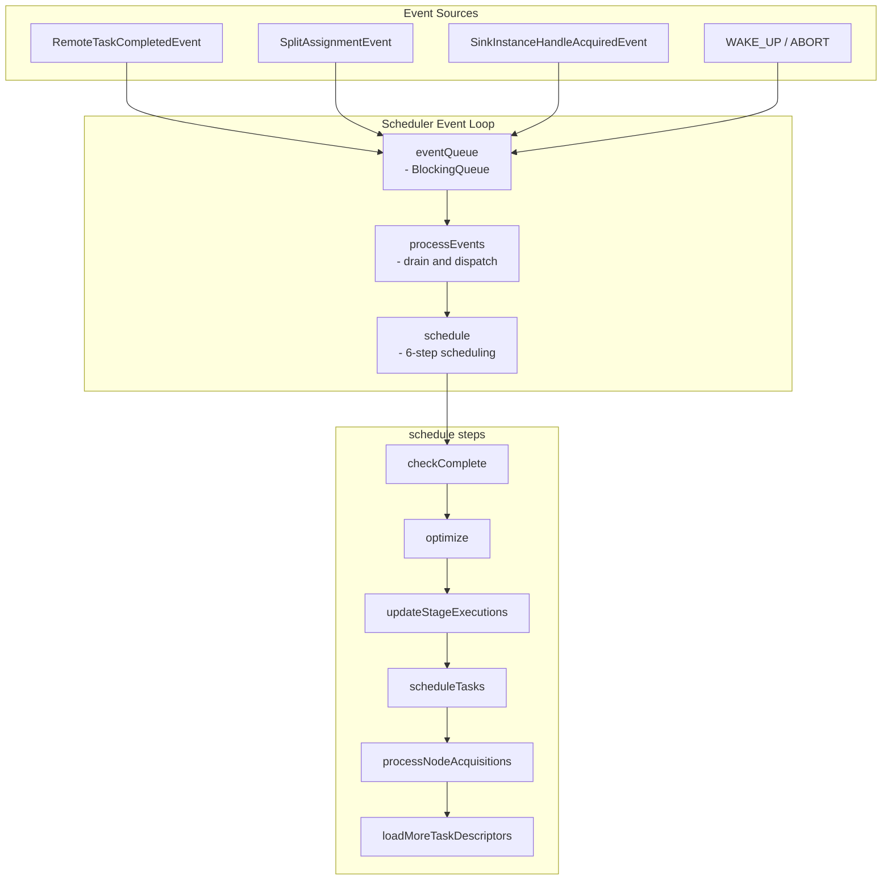

# 第18章 Fault Tolerant Execution

> **本章で読むソース**
>
> - [`core/trino-main/src/main/java/io/trino/execution/scheduler/faulttolerant/EventDrivenFaultTolerantQueryScheduler.java`](https://github.com/trinodb/trino/blob/482/core/trino-main/src/main/java/io/trino/execution/scheduler/faulttolerant/EventDrivenFaultTolerantQueryScheduler.java)
> - [`core/trino-main/src/main/java/io/trino/execution/scheduler/faulttolerant/TaskExecutionClass.java`](https://github.com/trinodb/trino/blob/482/core/trino-main/src/main/java/io/trino/execution/scheduler/faulttolerant/TaskExecutionClass.java)
> - [`core/trino-main/src/main/java/io/trino/execution/scheduler/faulttolerant/SplitAssigner.java`](https://github.com/trinodb/trino/blob/482/core/trino-main/src/main/java/io/trino/execution/scheduler/faulttolerant/SplitAssigner.java)
> - [`core/trino-main/src/main/java/io/trino/execution/scheduler/faulttolerant/OutputStatsEstimator.java`](https://github.com/trinodb/trino/blob/482/core/trino-main/src/main/java/io/trino/execution/scheduler/faulttolerant/OutputStatsEstimator.java)
> - [`core/trino-main/src/main/java/io/trino/execution/scheduler/faulttolerant/HashDistributionSplitAssigner.java`](https://github.com/trinodb/trino/blob/482/core/trino-main/src/main/java/io/trino/execution/scheduler/faulttolerant/HashDistributionSplitAssigner.java)
> - [`core/trino-main/src/main/java/io/trino/execution/scheduler/faulttolerant/ByTaskProgressOutputStatsEstimator.java`](https://github.com/trinodb/trino/blob/482/core/trino-main/src/main/java/io/trino/execution/scheduler/faulttolerant/ByTaskProgressOutputStatsEstimator.java)
> - [`core/trino-main/src/main/java/io/trino/execution/scheduler/faulttolerant/CompositeOutputStatsEstimator.java`](https://github.com/trinodb/trino/blob/482/core/trino-main/src/main/java/io/trino/execution/scheduler/faulttolerant/CompositeOutputStatsEstimator.java)

## この章の狙い

第12章で読んだ通常のスケジューラは、Task が失敗するとクエリ全体を失敗させる。
数時間かかる ETL クエリでは、一つの Worker の障害がそれまでの計算をすべて無駄にしてしまう。
本章では、この問題を解決する **Fault Tolerant Execution**（以下「FTE」）の仕組みを読む。
FTE はタスク粒度のリトライと中間データの永続化によって、Stage 全体の再実行を回避する。

## 前提

- 第12章「Stage と Task のスケジューリング」で、`SqlStage` と `SqlTask` の役割を理解していること。
- 第16章「Exchange と OutputBuffer」で、Stage 間のデータ転送と `OutputBuffer` の概念を把握していること。

## 18.1 Fault Tolerant Execution の動機

通常モードの Trino では、リトライポリシーは `NONE` または `QUERY` に設定される。
`QUERY` レベルのリトライはクエリ全体を最初からやり直すため、長時間クエリには実用的でない。

FTE はリトライポリシーを `TASK` に設定することで有効になる。
コンストラクタで `RetryPolicy` が `TASK` であることを検証している。

[`core/trino-main/src/main/java/io/trino/execution/scheduler/faulttolerant/EventDrivenFaultTolerantQueryScheduler.java` L274-L276](https://github.com/trinodb/trino/blob/482/core/trino-main/src/main/java/io/trino/execution/scheduler/faulttolerant/EventDrivenFaultTolerantQueryScheduler.java#L274-L276)

```java
        this.queryStateMachine = requireNonNull(queryStateMachine, "queryStateMachine is null");
        RetryPolicy retryPolicy = getRetryPolicy(queryStateMachine.getSession());
        verify(retryPolicy == TASK, "unexpected retry policy: %s", retryPolicy);
```

FTE は次の二つの機構を組み合わせて障害復旧を実現する。

- **Spooling Exchange**: Task の出力を外部ストレージ（S3 など）に永続化し、下流 Stage が失敗した Task の出力を再読み取りできるようにする。
- **タスク粒度リトライ**: 失敗した Task だけを別の Worker で再実行し、Stage 全体のやり直しを避ける。

## 18.2 EventDrivenFaultTolerantQueryScheduler の全体設計

FTE モードのスケジューラは `EventDrivenFaultTolerantQueryScheduler` である。
このクラスは `QueryScheduler` インタフェースを実装し、外部にはクエリの開始やキャンセルの API を提供する。
実際のスケジューリングロジックは内部クラス `Scheduler` に集約されている。

[`core/trino-main/src/main/java/io/trino/execution/scheduler/faulttolerant/EventDrivenFaultTolerantQueryScheduler.java` L209-L211](https://github.com/trinodb/trino/blob/482/core/trino-main/src/main/java/io/trino/execution/scheduler/faulttolerant/EventDrivenFaultTolerantQueryScheduler.java#L209-L211)

```java
public class EventDrivenFaultTolerantQueryScheduler
        implements QueryScheduler
{
```

`start()` メソッドで `Scheduler` インスタンスを生成し、`queryExecutor` スレッドプールに投入する。

[`core/trino-main/src/main/java/io/trino/execution/scheduler/faulttolerant/EventDrivenFaultTolerantQueryScheduler.java` L349-L385](https://github.com/trinodb/trino/blob/482/core/trino-main/src/main/java/io/trino/execution/scheduler/faulttolerant/EventDrivenFaultTolerantQueryScheduler.java#L349-L385)

```java
            scheduler = new Scheduler(
                    queryStateMachine,
                    // ... (中略) ...
                    new SchedulingDelayer(
                            getRetryInitialDelay(session),
                            getRetryMaxDelay(session),
                            getRetryDelayScaleFactor(session),
                            Stopwatch.createUnstarted()),
                    originalPlan,
                    maxPartitionCount,
                    stageEstimationForEagerParentEnabled,
                    adaptivePlanner,
                    nodePartitioningManager::getBucketCount);
            queryExecutor.submit(scheduler::run);
```

クラス全体は次の主要コンポーネントで構成される。

- `StageRegistry`: `SqlStage` の登録と状態集約を担うスレッドセーフなレジストリ。
- `Scheduler`: イベント駆動のスケジューリングループを持つ内部クラス。
- `StageExecution`: Stage ごとのパーティション管理とリトライを担う。
- `StagePartition`: 個々のパーティション（タスク）の状態と試行回数を管理する。

## 18.3 イベントループと schedule() メソッド

`Scheduler` はイベント駆動の単一スレッドモデルで動作する。
`BlockingQueue<Event>` からイベントを取り出し、種別に応じたハンドラを呼び出す。

[`core/trino-main/src/main/java/io/trino/execution/scheduler/faulttolerant/EventDrivenFaultTolerantQueryScheduler.java` L766](https://github.com/trinodb/trino/blob/482/core/trino-main/src/main/java/io/trino/execution/scheduler/faulttolerant/EventDrivenFaultTolerantQueryScheduler.java#L766)

```java
        private final BlockingQueue<Event> eventQueue = new LinkedBlockingQueue<>();
```

`run()` メソッドのメインループでは、`schedule()` の呼び出しとイベント処理を交互に行う。
`schedule()` は計算量が大きいため、毎イベントでは呼ばず、`SchedulingDelayer` が指定する遅延時間が経過するまではイベント処理だけを続ける。

[`core/trino-main/src/main/java/io/trino/execution/scheduler/faulttolerant/EventDrivenFaultTolerantQueryScheduler.java` L886-L898](https://github.com/trinodb/trino/blob/482/core/trino-main/src/main/java/io/trino/execution/scheduler/faulttolerant/EventDrivenFaultTolerantQueryScheduler.java#L886-L898)

```java
            try {
                // schedule() is the main logic, but expensive, so we do not want to call it after every event.
                // Process events for some time (measured by schedulingDelayer) before invoking schedule() next time.
                if (schedule()) {
                    while (processEvents()) {
                        if (schedulingDelayer.getRemainingDelayInMillis() > 0) {
                            continue;
                        }
                        if (!schedule()) {
                            break;
                        }
                    }
                }
            }
```

`schedule()` 自体は6つのステップで構成される。

[`core/trino-main/src/main/java/io/trino/execution/scheduler/faulttolerant/EventDrivenFaultTolerantQueryScheduler.java` L1061-L1073](https://github.com/trinodb/trino/blob/482/core/trino-main/src/main/java/io/trino/execution/scheduler/faulttolerant/EventDrivenFaultTolerantQueryScheduler.java#L1061-L1073)

```java
        private boolean schedule()
        {
            if (checkComplete()) {
                return false;
            }
            optimize();
            updateStageExecutions();
            scheduleTasks();
            processNodeAcquisitions();
            updateMemoryRequirements();
            loadMoreTaskDescriptorsIfNecessary();
            return true;
        }
```

各ステップの役割は次のとおりである。

1. `checkComplete()`: クエリの完了または失敗を検出する。
2. `optimize()`: Adaptive Planner によるランタイム統計に基づく再最適化を実行する。
3. `updateStageExecutions()`: 実行可能になった Stage の `StageExecution` を生成する。
4. `scheduleTasks()`: 実行クラスごとに `SchedulingQueue` からタスクを取り出し、ノード割り当てを要求する。
5. `processNodeAcquisitions()`: ノードが確保されたタスクに Exchange Sink を割り当て、リモートタスクを起動する。
6. `loadMoreTaskDescriptorsIfNecessary()`: `SplitAssigner` からタスク記述子を追加ロードする。

### イベントの種類

`Event` インタフェースを実装する具象クラスは、Visitor パターンで `EventListener` に振り分けられる。

[`core/trino-main/src/main/java/io/trino/execution/scheduler/faulttolerant/EventDrivenFaultTolerantQueryScheduler.java` L3317-L3338](https://github.com/trinodb/trino/blob/482/core/trino-main/src/main/java/io/trino/execution/scheduler/faulttolerant/EventDrivenFaultTolerantQueryScheduler.java#L3317-L3338)

```java
    private interface Event
    {
        Event ABORT = new Event()
        {
            @Override
            public <T> T accept(EventListener<T> listener)
            {
                throw new UnsupportedOperationException();
            }
        };

        Event WAKE_UP = new Event()
        {
            @Override
            public <T> T accept(EventListener<T> listener)
            {
                throw new UnsupportedOperationException();
            }
        };

        <T> T accept(EventListener<T> listener);
    }
```

主要なイベントは次のとおりである。

- `RemoteTaskCompletedEvent`: リモートタスクの完了または失敗を通知する。
- `SplitAssignmentEvent`: `SplitAssigner` からのパーティション追加やスプリット割り当て結果を運ぶ。
- `SinkInstanceHandleAcquiredEvent`: Exchange Sink のハンドルが取得されたことを通知する。
- `StageFailureEvent`: Stage レベルの障害を通知する。
- `WAKE_UP`: スケジューリングループを再起動するためのシグナルイベント。
- `ABORT`: ループを終了させるためのシグナルイベント。

`WAKE_UP` と `ABORT` はシングルトンで、`accept()` を呼ぶと例外を投げる。
`processEvents()` はこの二つを特別扱いし、`accept()` を経由せず直接処理する。

以下の図は、イベントループを中心としたスケジューリングの全体像を示す。



## 18.4 StageExecution とパーティション管理

`StageExecution` は Stage ごとの実行状態を管理するクラスである。
パーティションの追加、タスクのスケジューリング、完了と失敗の処理を担う。

[`core/trino-main/src/main/java/io/trino/execution/scheduler/faulttolerant/EventDrivenFaultTolerantQueryScheduler.java` L2050-L2060](https://github.com/trinodb/trino/blob/482/core/trino-main/src/main/java/io/trino/execution/scheduler/faulttolerant/EventDrivenFaultTolerantQueryScheduler.java#L2050-L2060)

```java
    public static class StageExecution
    {
        private final TaskDescriptorStorage taskDescriptorStorage;
        private final Queue<Entry<TaskId, RuntimeException>> taskFailures;

        private final SqlStage stage;
        private final EventDrivenTaskSource taskSource;
        private final FaultTolerantPartitioningScheme sinkPartitioningScheme;
        private final Exchange exchange;
        private final List<StageExecution> sourceStageExecutions;
        private final StageExecutionStats stageExecutionStats;
```

主要なフィールドは次のとおりである。

- `partitions`: パーティション ID から `StagePartition` へのマッピング。
- `remainingPartitions`: まだ完了していないパーティション ID の集合。
- `runningPartitions`: 現在タスクが実行中のパーティション ID の集合。
- `sinkOutputSelectorBuilder`: 完了したタスクの出力を選択するセレクタのビルダ。
- `speculative`: この Stage のタスクが投機的実行かどうかを示すフラグ。

### パーティションの追加とスケジューリング

`SplitAssignmentEvent` を受け取ると、`Scheduler.onSplitAssignment()` が `StageExecution.addPartition()` と `updatePartition()` を呼び出す。
`addPartition()` では Exchange に Sink を追加し、`StagePartition` を生成する。

[`core/trino-main/src/main/java/io/trino/execution/scheduler/faulttolerant/EventDrivenFaultTolerantQueryScheduler.java` L2207-L2226](https://github.com/trinodb/trino/blob/482/core/trino-main/src/main/java/io/trino/execution/scheduler/faulttolerant/EventDrivenFaultTolerantQueryScheduler.java#L2207-L2226)

```java
        public void addPartition(int partitionId, NodeRequirements nodeRequirements)
        {
            if (getState().isDone()) {
                return;
            }

            ExchangeSinkHandle exchangeSinkHandle = exchange.addSink(partitionId);
            StagePartition partition = new StagePartition(
                    taskDescriptorStorage,
                    stage.getStageId(),
                    partitionId,
                    exchangeSinkHandle,
                    remoteSourceIds,
                    nodeRequirements,
                    initialMemoryRequirements,
                    maxTaskExecutionAttempts);
            checkState(partitions.putIfAbsent(partitionId, partition) == null, "partition with id %s already exist in stage %s", partitionId, stage.getStageId());
            getSourceOutputSelectors().forEach(partition::updateExchangeSourceOutputSelector);
            remainingPartitions.add(partitionId);
        }
```

`updatePartition()` がスプリットを追加し、パーティションがスケジューリング可能になると、`PrioritizedScheduledTask` を返す。
この戻り値は `SchedulingQueue` に追加され、`scheduleTasks()` で取り出される。

### タスクのスケジューリング順序

`scheduleTasks()` は実行クラスの優先順位に従ってタスクをスケジューリングする。

[`core/trino-main/src/main/java/io/trino/execution/scheduler/faulttolerant/EventDrivenFaultTolerantQueryScheduler.java` L1591-L1598](https://github.com/trinodb/trino/blob/482/core/trino-main/src/main/java/io/trino/execution/scheduler/faulttolerant/EventDrivenFaultTolerantQueryScheduler.java#L1591-L1598)

```java
        private void scheduleTasks()
        {
            scheduleTasks(EAGER_SPECULATIVE);
            scheduleTasks(STANDARD);
            if (!preSchedulingTaskContexts.hasTasksWaitingForNode(STANDARD)) {
                scheduleTasks(SPECULATIVE);
            }
        }
```

`EAGER_SPECULATIVE` が最優先でスケジューリングされる。
`SPECULATIVE` タスクは、`STANDARD` タスクがノード待ちでない場合にのみスケジューリングされる。
この制御により、投機的実行がリソースを圧迫して通常タスクの進行を阻害することを防いでいる。

## 18.5 TaskExecutionClass: 実行クラスの分類

`TaskExecutionClass` は3種類の実行クラスを定義する列挙型である。

[`core/trino-main/src/main/java/io/trino/execution/scheduler/faulttolerant/TaskExecutionClass.java` L16-L33](https://github.com/trinodb/trino/blob/482/core/trino-main/src/main/java/io/trino/execution/scheduler/faulttolerant/TaskExecutionClass.java#L16-L33)

```java
public enum TaskExecutionClass
{
    // Tasks from stages with all upstream stages finished
    STANDARD,

    // Tasks from stages with some upstream stages still running.
    // To be scheduled only if no STANDARD tasks can fit.
    // Picked to kill if worker runs out of memory to prevent deadlock.
    SPECULATIVE,

    // Tasks from stages with some upstream stages still running but with high priority.
    // Will be scheduled even if there are resources to schedule STANDARD tasks on cluster.
    // Tasks of EAGER_SPECULATIVE are used to implement early termination of queries, when it
    // is probable that we do not need to run whole downstream stages to produce final query result.
    // EAGER_SPECULATIVE will not prevent STANDARD tasks from being scheduled and will still be picked
    // to kill if needed when worker runs out of memory; this is needed to prevent deadlocks.
    EAGER_SPECULATIVE,
    /**/;
```

3つの実行クラスの役割は次のとおりである。

- **STANDARD**: 上流 Stage がすべて完了した、通常のタスク。最も信頼性が高く、メモリ不足時にも優先的に保護される。
- **SPECULATIVE**: 上流 Stage がまだ実行中のタスク。`STANDARD` タスクがスケジューリング可能なときはスケジューリングされない。Worker のメモリ不足時にはデッドロック防止のため優先的に kill される。
- **EAGER_SPECULATIVE**: `SPECULATIVE` と同じく上流が未完了だが、高優先度で扱われる。LIMIT を含むクエリなど、下流 Stage の全パーティションを実行しなくてもクエリ結果を確定できる場合に使われる。

実行クラスの遷移には制約があり、`STANDARD` から `SPECULATIVE` への降格は許されない。

[`core/trino-main/src/main/java/io/trino/execution/scheduler/faulttolerant/TaskExecutionClass.java` L35-L42](https://github.com/trinodb/trino/blob/482/core/trino-main/src/main/java/io/trino/execution/scheduler/faulttolerant/TaskExecutionClass.java#L35-L42)

```java
    boolean canTransitionTo(TaskExecutionClass targetExecutionClass)
    {
        return switch (this) {
            case STANDARD -> targetExecutionClass == STANDARD;
            case SPECULATIVE -> targetExecutionClass == SPECULATIVE || targetExecutionClass == STANDARD;
            case EAGER_SPECULATIVE -> targetExecutionClass == EAGER_SPECULATIVE || targetExecutionClass == STANDARD;
        };
    }
```

`SPECULATIVE` と `EAGER_SPECULATIVE` は、上流 Stage が完了すると `STANDARD` に昇格できる。
パーティションが seal（確定）されたとき、`sealPartition()` がタスクの実行クラスを `STANDARD` に変更する。

## 18.6 SplitAssigner: スプリットの割り当て戦略

`SplitAssigner` インタフェースは、スプリットをパーティション（タスク）に割り当てる責務を持つ。

[`core/trino-main/src/main/java/io/trino/execution/scheduler/faulttolerant/SplitAssigner.java` L37-L46](https://github.com/trinodb/trino/blob/482/core/trino-main/src/main/java/io/trino/execution/scheduler/faulttolerant/SplitAssigner.java#L37-L46)

```java
@NotThreadSafe
interface SplitAssigner
{
    // marker source partition id for data which is not hash distributed
    int SINGLE_SOURCE_PARTITION_ID = 0;

    AssignmentResult assign(PlanNodeId planNodeId, ListMultimap<Integer, Split> splits, boolean noMoreSplits);

    AssignmentResult finish();
```

`assign()` メソッドはスプリットの到着ごとに呼ばれ、`AssignmentResult` を返す。
`AssignmentResult` は次の4つの情報を含む。

[`core/trino-main/src/main/java/io/trino/execution/scheduler/faulttolerant/SplitAssigner.java` L84-L89](https://github.com/trinodb/trino/blob/482/core/trino-main/src/main/java/io/trino/execution/scheduler/faulttolerant/SplitAssigner.java#L84-L89)

```java
    record AssignmentResult(
            List<Partition> partitionsAdded,
            boolean noMorePartitions,
            List<PartitionUpdate> partitionUpdates,
            ImmutableIntArray sealedPartitions)
    {
```

- `partitionsAdded`: 新たに作成されたパーティション。
- `noMorePartitions`: これ以上パーティションが追加されないことを示すフラグ。
- `partitionUpdates`: 既存パーティションへのスプリット追加。
- `sealedPartitions`: 確定したパーティション。seal されたパーティションは `SPECULATIVE` から `STANDARD` に昇格する。

FTE パッケージには3つの `SplitAssigner` 実装がある。

- `HashDistributionSplitAssigner`: ハッシュ分散されたソースに対して、出力データサイズの推定に基づきソースパーティションをタスクパーティションにマッピングする。
- `ArbitraryDistributionSplitAssigner`: 非分散ソースに対して、ターゲットサイズに基づきスプリットをタスクに均等に振り分ける。
- `SingleDistributionSplitAssigner`: すべてのスプリットを単一パーティションに割り当てる。

`HashDistributionSplitAssigner` は、出力統計推定値を用いてソースパーティションをマージし、ターゲットサイズに近づける。
これにより、データの偏りがあってもタスク間の処理量を均一化できる。

## 18.7 OutputStatsEstimator: 出力統計による動的調整

`OutputStatsEstimator` は Stage の出力データサイズを推定するインタフェースである。
この推定値は、下流 Stage のパーティション数やタスク分割の決定に使われる。

[`core/trino-main/src/main/java/io/trino/execution/scheduler/faulttolerant/OutputStatsEstimator.java` L25-L32](https://github.com/trinodb/trino/blob/482/core/trino-main/src/main/java/io/trino/execution/scheduler/faulttolerant/OutputStatsEstimator.java#L25-L32)

```java
public interface OutputStatsEstimator
{
    OutputStatsEstimateResult UNKNOWN = new OutputStatsEstimateResult(ImmutableLongArray.of(), 0, "UNKNOWN", false);

    Optional<OutputStatsEstimateResult> getEstimatedOutputStats(
            EventDrivenFaultTolerantQueryScheduler.StageExecution stageExecution,
            Function<StageId, EventDrivenFaultTolerantQueryScheduler.StageExecution> stageExecutionLookup,
            boolean parentEager);
```

`OutputStatsEstimateResult` はパーティションごとの出力データサイズ推定と、推定が正確かどうかを示す `isAccurate` フラグを持つ。
Stage が完了すると実測値が使われ、`kind` は `"FINISHED"` になる。

[`core/trino-main/src/main/java/io/trino/execution/scheduler/faulttolerant/EventDrivenFaultTolerantQueryScheduler.java` L2677-L2684](https://github.com/trinodb/trino/blob/482/core/trino-main/src/main/java/io/trino/execution/scheduler/faulttolerant/EventDrivenFaultTolerantQueryScheduler.java#L2677-L2684)

```java
        public Optional<OutputStatsEstimateResult> getOutputStats(Function<StageId, StageExecution> stageExecutionLookup, boolean parentEager)
        {
            if (stage.getState() == StageState.FINISHED) {
                return Optional.of(new OutputStatsEstimateResult(
                        new OutputDataSizeEstimate(ImmutableLongArray.copyOf(outputDataSize)), outputRowCount, "FINISHED", true));
            }
            return outputStatsEstimator.getEstimatedOutputStats(this, stageExecutionLookup, parentEager);
        }
```

主要な推定器の実装は次のとおりである。

### ByTaskProgressOutputStatsEstimator

完了済みタスクの割合から出力サイズを外挿する。
Stage の進捗率が `minSourceStageProgress` を超えた場合に推定値を返す。

[`core/trino-main/src/main/java/io/trino/execution/scheduler/faulttolerant/ByTaskProgressOutputStatsEstimator.java` L47-L76](https://github.com/trinodb/trino/blob/482/core/trino-main/src/main/java/io/trino/execution/scheduler/faulttolerant/ByTaskProgressOutputStatsEstimator.java#L47-L76)

```java
    @Override
    public Optional<OutputStatsEstimateResult> getEstimatedOutputStats(StageExecution stageExecution, Function<StageId, StageExecution> stageExecutionLookup, boolean parentEager)
    {
        if (!stageExecution.isNoMorePartitions()) {
            return Optional.empty();
        }

        int allPartitionsCount = stageExecution.getPartitionsCount();
        int remainingPartitionsCount = stageExecution.getRemainingPartitionsCount();

        if (remainingPartitionsCount == allPartitionsCount) {
            return Optional.empty();
        }

        double progress = (double) (allPartitionsCount - remainingPartitionsCount) / allPartitionsCount;

        if (progress < minSourceStageProgress) {
            return Optional.empty();
        }

        long[] currentOutputDataSize = stageExecution.currentOutputDataSize();

        ImmutableLongArray.Builder estimateBuilder = ImmutableLongArray.builder(currentOutputDataSize.length);

        for (long partitionSize : currentOutputDataSize) {
            estimateBuilder.add((long) (partitionSize / progress));
        }
        long outputRowCountEstimate = (long) (stageExecution.getOutputRowCount() / progress);
        return Optional.of(new OutputStatsEstimateResult(new OutputDataSizeEstimate(estimateBuilder.build()), outputRowCountEstimate, "BY_PROGRESS", true));
    }
```

たとえば 40% のタスクが完了して 100MB を出力している場合、全体の推定値は 250MB となる。
この推定を用いることで、上流 Stage の完了を待たずに下流 Stage の投機的実行を開始できる。

### ByEagerParentOutputStatsEstimator

親 Stage が eager（LIMIT 付きクエリなど）の場合に、出力サイズを 0 と推定するフォールバック推定器である。
LIMIT クエリでは下流 Stage が少量のデータしか消費しないため、この推定は実用上妥当である。

### CompositeOutputStatsEstimator

複数の推定器を優先順位付きで組み合わせる。
最初に推定値を返した推定器の結果を採用する。

[`core/trino-main/src/main/java/io/trino/execution/scheduler/faulttolerant/CompositeOutputStatsEstimator.java` L72-L85](https://github.com/trinodb/trino/blob/482/core/trino-main/src/main/java/io/trino/execution/scheduler/faulttolerant/CompositeOutputStatsEstimator.java#L72-L85)

```java
    @Override
    public Optional<OutputStatsEstimateResult> getEstimatedOutputStats(
            StageExecution stageExecution,
            Function<StageId, StageExecution> stageExecutionLookup,
            boolean parentEager)
    {
        for (OutputStatsEstimator estimator : estimators) {
            Optional<OutputStatsEstimateResult> result = estimator.getEstimatedOutputStats(stageExecution, stageExecutionLookup, parentEager);
            if (result.isPresent()) {
                return result;
            }
        }
        return Optional.empty();
    }
```

## 18.8 タスク完了と失敗のリトライ

### タスク完了の処理

タスクが完了すると `RemoteTaskCompletedEvent` が発行され、`onRemoteTaskCompleted()` が呼ばれる。
タスク状態が `FINISHED` の場合、`StageExecution.taskFinished()` が呼ばれる。

[`core/trino-main/src/main/java/io/trino/execution/scheduler/faulttolerant/EventDrivenFaultTolerantQueryScheduler.java` L2489-L2527](https://github.com/trinodb/trino/blob/482/core/trino-main/src/main/java/io/trino/execution/scheduler/faulttolerant/EventDrivenFaultTolerantQueryScheduler.java#L2489-L2527)

```java
        public Optional<List<PrioritizedScheduledTask>> taskFinished(TaskId taskId, TaskStatus taskStatus)
        {
            int partitionId = taskId.partitionId();
            StagePartition partition = getStagePartition(partitionId);
            Optional<SpoolingOutputStats.Snapshot> outputStats = partition.taskFinished(taskId);

            if (outputStats.isEmpty()) {
                // it is rare but possible to get empty spooling output stats for task which completed successfully.
                // As we need this information in FTE mode we need to fail such task artificially
                log.warn("Failing task %s because we received empty spooling output stats", taskId);
                return Optional.of(taskFailed(taskId, Failures.toFailure(new TrinoException(GENERIC_INTERNAL_ERROR, "Treating FINISHED task as FAILED because we received empty spooling output stats")), taskStatus));
            }

            exchange.sinkFinished(partition.getExchangeSinkHandle(), taskId.attemptId());

            if (!partition.isRunning()) {
                runningPartitions.remove(partitionId);
            }

            if (!remainingPartitions.remove(partitionId)) {
                // a different task for the same partition finished before
                return Optional.empty();
            }

            updateOutputSize(outputStats.orElseThrow());

            partitionMemoryEstimator.registerPartitionFinished(
                    partition.getMemoryRequirements(),
                    taskStatus.peakMemoryReservation(),
                    true,
                    Optional.empty());

            sinkOutputSelectorBuilder.include(exchange.getId(), taskId.partitionId(), taskId.attemptId());

            if (noMorePartitions && remainingPartitions.isEmpty() && !stage.getState().isDone()) {
                finish();
            }
            return Optional.empty();
        }
```

注目すべき点がある。
Spooling Output Stats が空の場合、完了したタスクを人為的に失敗扱いにする。
FTE はパーティションごとの出力データサイズを Exchange の出力選択に使うため、この情報が欠落するとデータの整合性を保てない。

`sinkOutputSelectorBuilder.include()` は、完了したタスクの出力を下流 Stage が読み取る対象として登録する。
同一パーティションで複数のタスクが実行された場合（リトライや投機的実行）、最初に完了したタスクの出力だけが採用される。

### タスク失敗とリトライ

タスクが失敗すると `taskFailed()` が呼ばれる。
このメソッドはリトライ可能かどうかを判断し、可能であれば代替タスクを `SchedulingQueue` に投入する。

[`core/trino-main/src/main/java/io/trino/execution/scheduler/faulttolerant/EventDrivenFaultTolerantQueryScheduler.java` L2585-L2657](https://github.com/trinodb/trino/blob/482/core/trino-main/src/main/java/io/trino/execution/scheduler/faulttolerant/EventDrivenFaultTolerantQueryScheduler.java#L2585-L2657)

```java
        public List<PrioritizedScheduledTask> taskFailed(TaskId taskId, ExecutionFailureInfo failureInfo, TaskStatus taskStatus)
        {
            int partitionId = taskId.partitionId();
            StagePartition partition = getStagePartition(partitionId);
            partition.taskFailed(taskId);

            // ... (中略) ...

            // update memory limits for next attempt
            MemoryRequirements currentMemoryLimits = partition.getMemoryRequirements();
            MemoryRequirements newMemoryLimits = partitionMemoryEstimator.getNextRetryMemoryRequirements(
                    partition.getMemoryRequirements(),
                    taskStatus.peakMemoryReservation(),
                    errorCode,
                    partition.getRemainingAttempts());
            partition.setPostFailureMemoryRequirements(newMemoryLimits);

            // ... (中略) ...

            if (partition.getRemainingAttempts() == 0 || (errorCode != null && (errorCode.getType() == USER_ERROR || errorCode.isFatal()))) {
                stage.fail(failure);
                // stage failed, don't reschedule
                return ImmutableList.of();
            }

            if (!partition.isSealed()) {
                // don't reschedule speculative tasks
                return ImmutableList.of();
            }

            // reschedule a task
            log.warn(failure, "Rescheduling task %s due to %s error", taskId, errorCode != null ? errorCode.getName() : "unknown");
            return ImmutableList.of(PrioritizedScheduledTask.create(stage.getStageId(), partitionId, schedulingPriority));
        }
```

リトライの判断は次の条件で行われる。

1. 残り試行回数が 0 であれば Stage を失敗させる。
2. ユーザーエラーまたは致命的エラーであれば、リトライせず Stage を失敗させる。
3. パーティションが seal されていない（投機的タスクの）場合、リスケジュールしない。投機的タスクの失敗は、上流 Stage の完了を待ってから改めてスケジューリングされる。
4. それ以外の場合、`PrioritizedScheduledTask.create()` で `STANDARD` クラスの代替タスクを生成する。

### メモリ不足時の適応

メモリ不足エラーで失敗した場合、`PartitionMemoryEstimator` がリトライ時のメモリ要求量を増加させる。
推定されたメモリ上限がピーク使用量と同程度で改善の余地がない場合は、リトライせず Stage を失敗させる。

### リトライ遅延

一時的な障害が連続する場合、`SchedulingDelayer` がスケジューリングに遅延を挿入する。
遅延は指数的に増加し、上限に達するまで段階的に長くなる。

[`core/trino-main/src/main/java/io/trino/execution/scheduler/faulttolerant/EventDrivenFaultTolerantQueryScheduler.java` L3280-L3294](https://github.com/trinodb/trino/blob/482/core/trino-main/src/main/java/io/trino/execution/scheduler/faulttolerant/EventDrivenFaultTolerantQueryScheduler.java#L3280-L3294)

```java
        public void startOrProlongDelayIfNecessary()
        {
            if (stopwatch.isRunning()) {
                if (stopwatch.elapsed(MILLISECONDS) > currentDelayInMillis) {
                    // we are past previous delay period and still getting failures; let's make it longer
                    stopwatch.reset().start();
                    currentDelayInMillis = min(round(currentDelayInMillis * retryDelayScaleFactor), maxRetryDelayInMillis);
                }
            }
            else {
                // initialize delaying of tasks scheduling
                stopwatch.start();
                currentDelayInMillis = minRetryDelayInMillis;
            }
        }
```

タスク失敗時、`Scheduler.onRemoteTaskCompleted()` が `shouldDelayScheduling()` で遅延の必要性を判断する。
`INTERNAL_ERROR` または `EXTERNAL` エラーの場合に遅延が挿入される。

[`core/trino-main/src/main/java/io/trino/execution/scheduler/faulttolerant/EventDrivenFaultTolerantQueryScheduler.java` L1855-L1858](https://github.com/trinodb/trino/blob/482/core/trino-main/src/main/java/io/trino/execution/scheduler/faulttolerant/EventDrivenFaultTolerantQueryScheduler.java#L1855-L1858)

```java
                if (shouldDelayScheduling(failureInfo.errorCode())) {
                    schedulingDelayer.startOrProlongDelayIfNecessary();
                    scheduledExecutorService.schedule(() -> eventQueue.add(Event.WAKE_UP), schedulingDelayer.getRemainingDelayInMillis(), MILLISECONDS);
                }
```

遅延後に `WAKE_UP` イベントを発行し、スケジューリングループを再起動する。

## 18.9 Spooling Exchange と出力選択

FTE は通常の Direct Exchange ではなく **Spooling Exchange** を使う。
Spooling Exchange はタスクの出力データを外部ストレージ（S3、GCS、Azure Blob Storage など）に永続化する。
この永続化により、Producer タスクが失敗しても、完了済みのタスクの出力は失われない。

タスク起動時に `SpoolingOutputBuffers` が生成され、`ExchangeSinkInstanceHandle` とともにリモートタスクに渡される。

[`core/trino-main/src/main/java/io/trino/execution/scheduler/faulttolerant/EventDrivenFaultTolerantQueryScheduler.java` L2368-L2380](https://github.com/trinodb/trino/blob/482/core/trino-main/src/main/java/io/trino/execution/scheduler/faulttolerant/EventDrivenFaultTolerantQueryScheduler.java#L2368-L2380)

```java
            SpoolingOutputBuffers outputBuffers = SpoolingOutputBuffers.createInitial(exchangeSinkInstanceHandle, sinkPartitioningScheme.getPartitionCount());
            Optional<RemoteTask> task = stage.createTask(
                    node,
                    partitionId,
                    attempt,
                    sinkPartitioningScheme.getBucketToPartitionMap(),
                    // FTE does not support writer scaling
                    OptionalInt.empty(),
                    outputBuffers,
                    splits,
                    noMoreSplits,
                    Optional.of(partition.getMemoryRequirements().getRequiredMemory()),
                    speculative);
```

### ExchangeSourceOutputSelector

同一パーティションに対して複数のタスクが実行される場合（リトライ、投機的実行）、下流 Stage はどのタスクの出力を読むべきかを知る必要がある。
`ExchangeSourceOutputSelector` がこの選択を担う。

タスクが完了すると `sinkOutputSelectorBuilder.include()` で出力が登録される。
Stage が完了すると `sinkOutputSelectorBuilder.setFinal()` で確定し、下流 Stage に伝播される。

[`core/trino-main/src/main/java/io/trino/execution/scheduler/faulttolerant/EventDrivenFaultTolerantQueryScheduler.java` L2544-L2557](https://github.com/trinodb/trino/blob/482/core/trino-main/src/main/java/io/trino/execution/scheduler/faulttolerant/EventDrivenFaultTolerantQueryScheduler.java#L2544-L2557)

```java
        private void doFinish(boolean force)
        {
            dynamicFilterService.stageCannotScheduleMoreTasks(stage.getStageId(), 0, partitions.size());
            exchange.noMoreSinks();
            exchange.allRequiredSinksFinished();
            if (!force) {
                // not relevant if we are marking stage still running; no more output will be read
                verify(finalSinkOutputSelector == null, "finalOutputSelector is already set");
                sinkOutputSelectorBuilder.setPartitionCount(exchange.getId(), partitions.size());
                sinkOutputSelectorBuilder.setFinal();
                finalSinkOutputSelector = sinkOutputSelectorBuilder.build();
            }
            sinkOutputSelectorBuilder = null;
            stage.finish();
```

タスク完了イベントのハンドラ末尾で、更新された `OutputSelector` が下流の全 Consumer Stage に伝播される。

[`core/trino-main/src/main/java/io/trino/execution/scheduler/faulttolerant/EventDrivenFaultTolerantQueryScheduler.java` L1861-L1865](https://github.com/trinodb/trino/blob/482/core/trino-main/src/main/java/io/trino/execution/scheduler/faulttolerant/EventDrivenFaultTolerantQueryScheduler.java#L1861-L1865)

```java
            // update output selectors
            ExchangeSourceOutputSelector outputSelector = stageExecution.getSinkOutputSelector();
            for (StageId consumerStageId : stageConsumers.get(stageExecution.getStageId())) {
                getStageExecution(consumerStageId).setSourceOutputSelector(stageExecution.getStageFragmentId(), outputSelector);
            }
```

## 18.10 設計上の工夫: SchedulingQueue による実行クラス分離

FTE スケジューラの設計上の工夫として、`SchedulingQueue` による実行クラスの分離がある。

[`core/trino-main/src/main/java/io/trino/execution/scheduler/faulttolerant/EventDrivenFaultTolerantQueryScheduler.java` L3220-L3254](https://github.com/trinodb/trino/blob/482/core/trino-main/src/main/java/io/trino/execution/scheduler/faulttolerant/EventDrivenFaultTolerantQueryScheduler.java#L3220-L3254)

```java
    private static class SchedulingQueue
    {
        private final Map<TaskExecutionClass, IndexedPriorityQueue<ScheduledTask>> queues;

        // ... (中略) ...

        public SchedulingQueue()
        {
            this.queues = ImmutableMap.<TaskExecutionClass, IndexedPriorityQueue<ScheduledTask>>builder()
                    .put(STANDARD, new IndexedPriorityQueue<>(LOW_TO_HIGH))
                    .put(SPECULATIVE, new IndexedPriorityQueue<>(LOW_TO_HIGH))
                    .put(EAGER_SPECULATIVE, new IndexedPriorityQueue<>(LOW_TO_HIGH))
                    .buildOrThrow();
        }

        public void addOrUpdate(PrioritizedScheduledTask prioritizedTask)
        {
            queues.values().forEach(queue -> queue.remove(prioritizedTask.task()));
            queues.get(prioritizedTask.getExecutionClass()).addOrUpdate(prioritizedTask.task(), prioritizedTask.priority());
        }
```

`SchedulingQueue` は実行クラスごとに独立した `IndexedPriorityQueue` を持つ。
`addOrUpdate()` では、まず全キューからタスクを削除してから、適切なキューに追加する。
この設計により、実行クラスが変わったタスク（`SPECULATIVE` から `STANDARD` への昇格など）を安全にキュー間で移動できる。

`scheduleTasks()` は `EAGER_SPECULATIVE`、`STANDARD`、`SPECULATIVE` の順にキューからタスクを取り出す。
`SPECULATIVE` タスクのスケジューリングは、`STANDARD` タスクがノード割り当て待ちでない場合にのみ行われる。
この制御は、投機的実行がリソースを消費して通常タスクをブロックする状況（デッドロック）を防ぐためにある。

通常のスケジューラ（第12章の `FixedSourcePartitionedScheduler` など）は、Stage の実行順序を DAG のトポロジカル順に固定する。
FTE スケジューラは、上流 Stage が未完了でもその出力統計を推定して下流 Stage を投機的に開始できる。
投機的タスクが失敗しても `STANDARD` タスクへの影響はなく、リソースに空きがあるときだけ投機的実行を行うことで、クエリ全体のレイテンシを短縮する。

## まとめ

- FTE はリトライポリシー `TASK` で有効になり、タスク粒度のリトライと Spooling Exchange による中間データの永続化で障害復旧を実現する。
- `EventDrivenFaultTolerantQueryScheduler` はイベント駆動の単一スレッドモデルで動作し、`BlockingQueue` からのイベントと `schedule()` メソッドを交互に処理する。
- `TaskExecutionClass` の3クラス（`STANDARD`、`SPECULATIVE`、`EAGER_SPECULATIVE`）により、投機的実行のリソース管理とデッドロック防止を両立する。
- `SplitAssigner` はスプリットをパーティションに割り当て、`AssignmentResult` でパーティションの追加、更新、確定を通知する。
- `OutputStatsEstimator` は Stage の出力サイズを推定し、上流完了前に下流 Stage を開始する判断を支える。
- タスク失敗時は `PartitionMemoryEstimator` がメモリ要求量を調整し、`SchedulingDelayer` が指数バックオフで再スケジューリングを遅延させる。
- `SchedulingQueue` は実行クラスごとにキューを分離し、投機的タスクが通常タスクのリソースを圧迫しない制御を実現する。

## 関連する章

- [第12章 Stage と Task のスケジューリング](12-stage-and-task-scheduling.md): 通常モードの Stage スケジューリングと `SqlStage`、`SqlTask` の基本設計。
- [第16章 Exchange と OutputBuffer](16-exchange-and-output-buffer.md): Direct Exchange と OutputBuffer の設計。FTE では Spooling Exchange に置き換わる。
- [第17章 メモリ管理とスピル](17-memory-and-spill.md): メモリ不足時のスピル機構。FTE では `PartitionMemoryEstimator` がリトライ時のメモリ要求量を調整する。
