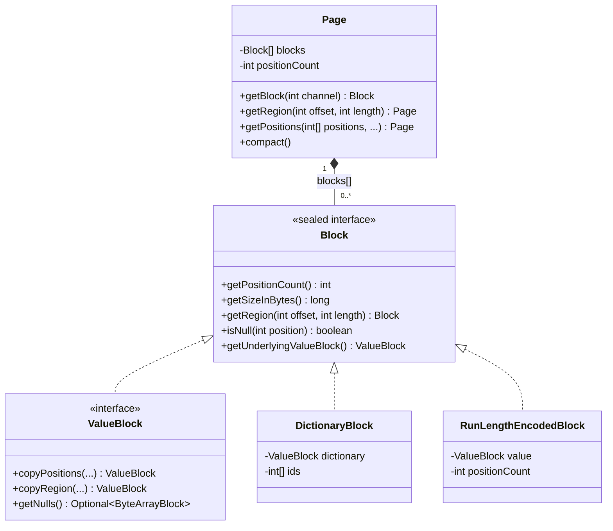
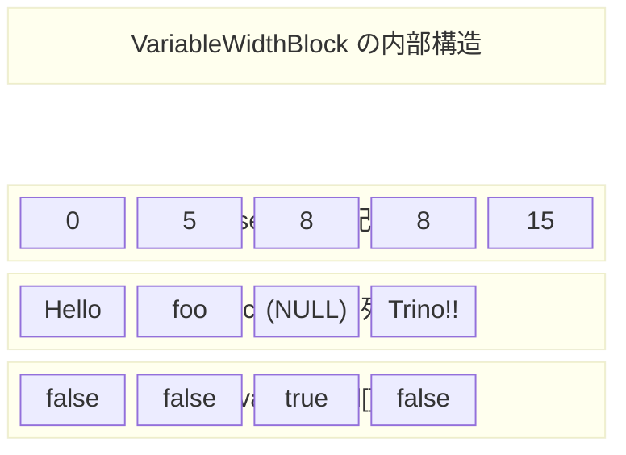
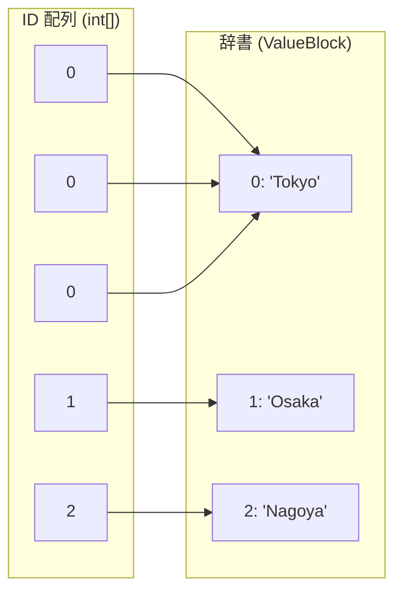
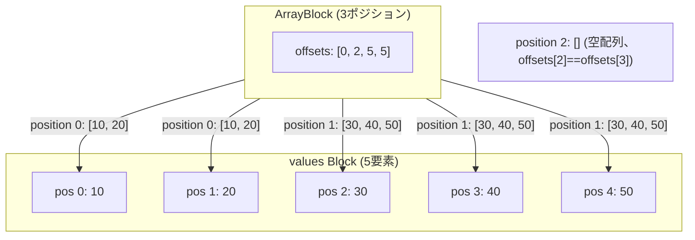

# 第18章 Page と Block のデータモデル

> **本章で読むソース**
>
> - [`core/trino-spi/src/main/java/io/trino/spi/Page.java`](https://github.com/trinodb/trino/blob/482/core/trino-spi/src/main/java/io/trino/spi/Page.java)
> - [`core/trino-spi/src/main/java/io/trino/spi/PageBuilder.java`](https://github.com/trinodb/trino/blob/482/core/trino-spi/src/main/java/io/trino/spi/PageBuilder.java)
> - [`core/trino-spi/src/main/java/io/trino/spi/block/Block.java`](https://github.com/trinodb/trino/blob/482/core/trino-spi/src/main/java/io/trino/spi/block/Block.java)
> - [`core/trino-spi/src/main/java/io/trino/spi/block/ValueBlock.java`](https://github.com/trinodb/trino/blob/482/core/trino-spi/src/main/java/io/trino/spi/block/ValueBlock.java)
> - [`core/trino-spi/src/main/java/io/trino/spi/block/BlockBuilder.java`](https://github.com/trinodb/trino/blob/482/core/trino-spi/src/main/java/io/trino/spi/block/BlockBuilder.java)
> - [`core/trino-spi/src/main/java/io/trino/spi/block/IntArrayBlock.java`](https://github.com/trinodb/trino/blob/482/core/trino-spi/src/main/java/io/trino/spi/block/IntArrayBlock.java)
> - [`core/trino-spi/src/main/java/io/trino/spi/block/VariableWidthBlock.java`](https://github.com/trinodb/trino/blob/482/core/trino-spi/src/main/java/io/trino/spi/block/VariableWidthBlock.java)
> - [`core/trino-spi/src/main/java/io/trino/spi/block/DictionaryBlock.java`](https://github.com/trinodb/trino/blob/482/core/trino-spi/src/main/java/io/trino/spi/block/DictionaryBlock.java)
> - [`core/trino-spi/src/main/java/io/trino/spi/block/RunLengthEncodedBlock.java`](https://github.com/trinodb/trino/blob/482/core/trino-spi/src/main/java/io/trino/spi/block/RunLengthEncodedBlock.java)
> - [`core/trino-spi/src/main/java/io/trino/spi/block/ArrayBlock.java`](https://github.com/trinodb/trino/blob/482/core/trino-spi/src/main/java/io/trino/spi/block/ArrayBlock.java)
> - [`core/trino-spi/src/main/java/io/trino/spi/block/RowBlock.java`](https://github.com/trinodb/trino/blob/482/core/trino-spi/src/main/java/io/trino/spi/block/RowBlock.java)
> - [`core/trino-spi/src/main/java/io/trino/spi/block/IntArrayBlockBuilder.java`](https://github.com/trinodb/trino/blob/482/core/trino-spi/src/main/java/io/trino/spi/block/IntArrayBlockBuilder.java)
> - [`core/trino-spi/src/main/java/io/trino/spi/block/PageBuilderStatus.java`](https://github.com/trinodb/trino/blob/482/core/trino-spi/src/main/java/io/trino/spi/block/PageBuilderStatus.java)

## この章の狙い

Trino の実行エンジンは、Operator 間のデータ受け渡しに **Page** と **Block** という2つの型を使う。
Page は行の集合、Block は1列ぶんのデータ配列であり、両者が組み合わさって列指向のインメモリ表現を構成する。

本章では、Page と Block のデータモデルを読み解く。
固定長の `IntArrayBlock` と可変長の `VariableWidthBlock` の内部構造から始め、辞書エンコーディングの `DictionaryBlock`、単一値の繰り返しを表す `RunLengthEncodedBlock`、ネスト型の `ArrayBlock` と `RowBlock` を順に追う。
最後に、これらの Block を組み立てる `BlockBuilder` と `PageBuilder` の仕組みを確認する。

## 前提

- Trino の Operator が `addInput` / `getOutput` で Page を受け渡す仕組みを知っていること（第13章）。
- SQL の型（INTEGER, VARCHAR, ARRAY, ROW など）と列指向処理の基本的な概念を理解していること。

## Page のデータモデル

**Page** は、同じ行数を持つ Block の配列である。
各 Block が1列ぶんのデータを保持し、Block の個数が列数（チャネル数）に対応する。

[`core/trino-spi/src/main/java/io/trino/spi/Page.java` L50-L53](https://github.com/trinodb/trino/blob/482/core/trino-spi/src/main/java/io/trino/spi/Page.java#L50-L53)

```java
    private final Block[] blocks;
    private final int positionCount;
    private volatile long sizeInBytes = -1;
    private volatile long retainedSizeInBytes = -1;
```

`positionCount` が行数を表し、`blocks` 配列の各要素が1列ぶんの Block を持つ。
`sizeInBytes` と `retainedSizeInBytes` はともに遅延計算される。
初期値 `-1` は未計算を意味し、最初のアクセス時に各 Block のサイズを合算してキャッシュする。



### Page の領域操作

Page は複数の領域操作メソッドを提供する。
いずれも各 Block に対して同名のメソッドを呼び出し、結果を新しい Page にまとめる。

[`core/trino-spi/src/main/java/io/trino/spi/Page.java` L142-L158](https://github.com/trinodb/trino/blob/482/core/trino-spi/src/main/java/io/trino/spi/Page.java#L142-L158)

```java
    public Page getRegion(int positionOffset, int length)
    {
        if (positionOffset < 0 || length < 0 || positionOffset + length > positionCount) {
            throw new IndexOutOfBoundsException(format("Invalid position %s and length %s in page with %s positions", positionOffset, length, positionCount));
        }

        if (positionOffset == 0 && length == positionCount) {
            return this;
        }

        int channelCount = getChannelCount();
        Block[] slicedBlocks = new Block[channelCount];
        for (int i = 0; i < channelCount; i++) {
            slicedBlocks[i] = blocks[i].getRegion(positionOffset, length);
        }
        return wrapBlocksWithoutCopy(length, slicedBlocks);
    }

`getRegion` は連続した行範囲のビューを返す。
データのコピーは行わず、各 Block の `getRegion` が返すビューを束ねるだけである。
全範囲を指定した場合は `this` をそのまま返す。

`getPositions` は任意の行番号の配列を受け取り、指定された行だけを含む Page を返す。

[`core/trino-spi/src/main/java/io/trino/spi/Page.java` L234-L243](https://github.com/trinodb/trino/blob/482/core/trino-spi/src/main/java/io/trino/spi/Page.java#L234-L243)

```java
    public Page getPositions(int[] retainedPositions, int offset, int length)
    {
        requireNonNull(retainedPositions, "retainedPositions is null");

        Block[] blocks = new Block[this.blocks.length];
        for (int i = 0; i < blocks.length; i++) {
            blocks[i] = this.blocks[i].getPositions(retainedPositions, offset, length);
        }
        return wrapBlocksWithoutCopy(length, blocks);
    }
```

Block の `getPositions` のデフォルト実装は `DictionaryBlock` を生成して返す。
データのコピーを避け、元の Block をそのまま辞書として参照する設計である。

[`core/trino-spi/src/main/java/io/trino/spi/block/Block.java` L85-L90](https://github.com/trinodb/trino/blob/482/core/trino-spi/src/main/java/io/trino/spi/block/Block.java#L85-L90)

```java
    default Block getPositions(int[] positions, int offset, int length)
    {
        checkArrayRange(positions, offset, length);

        return DictionaryBlock.createInternal(offset, length, this, positions, randomDictionaryId());
    }
```

### Page の compact

`compact` メソッドは Page 内の各 Block が余分な領域を保持しているとき、それを縮小する。
同じ辞書を共有する `DictionaryBlock` 群は `compactRelatedBlocks` でまとめて圧縮し、辞書の共有関係を維持する。

[`core/trino-spi/src/main/java/io/trino/spi/Page.java` L172-L197](https://github.com/trinodb/trino/blob/482/core/trino-spi/src/main/java/io/trino/spi/Page.java#L172-L197)

```java
    public void compact()
    {
        if (getRetainedSizeInBytes() <= getSizeInBytes()) {
            return;
        }

        for (int i = 0; i < blocks.length; i++) {
            Block block = blocks[i];
            if (block instanceof DictionaryBlock) {
                continue;
            }
            // Compact the block
            blocks[i] = block.copyRegion(0, block.getPositionCount());
        }

        Map<DictionaryId, DictionaryBlockIndexes> dictionaryBlocks = getRelatedDictionaryBlocks();
        for (DictionaryBlockIndexes blockIndexes : dictionaryBlocks.values()) {
            List<DictionaryBlock> compactBlocks = DictionaryBlock.compactRelatedBlocks(blockIndexes.getBlocks());
            List<Integer> indexes = blockIndexes.getIndexes();
            for (int i = 0; i < compactBlocks.size(); i++) {
                blocks[indexes.get(i)] = compactBlocks.get(i);
            }
        }

        updateRetainedSize();
    }
```

`retainedSizeInBytes` が `sizeInBytes` 以下であれば圧縮の余地がないと判断し、何もしない。
通常の Block には `copyRegion` を呼んで余分な配列領域を切り詰める。
DictionaryBlock は `DictionaryId` でグルーピングし、同じ辞書を共有する Block 群を一括で圧縮する。

## Block インタフェースの設計

`Block` は sealed interface として定義され、許可された実装は `DictionaryBlock`、`RunLengthEncodedBlock`、`ValueBlock` の3種類に限定される。

[`core/trino-spi/src/main/java/io/trino/spi/block/Block.java` L21-L25](https://github.com/trinodb/trino/blob/482/core/trino-spi/src/main/java/io/trino/spi/block/Block.java#L21-L25)

```java
public sealed interface Block
        permits DictionaryBlock,
                RunLengthEncodedBlock,
                ValueBlock
{
```

この sealed 階層により、Block を受け取るコードは `switch` 式で3つの場合を網羅的に扱える。
`BlockBuilder` の `appendBlockRange` メソッドがその典型例である。

[`core/trino-spi/src/main/java/io/trino/spi/block/BlockBuilder.java` L62-L69](https://github.com/trinodb/trino/blob/482/core/trino-spi/src/main/java/io/trino/spi/block/BlockBuilder.java#L62-L69)

```java
    default void appendBlockRange(Block rawBlock, int offset, int length)
    {
        switch (rawBlock) {
            case RunLengthEncodedBlock rleBlock -> appendRepeated(rleBlock.getValue(), 0, length);
            case DictionaryBlock dictionaryBlock -> appendPositions(dictionaryBlock.getDictionary(), dictionaryBlock.getRawIds(), dictionaryBlock.getRawIdsOffset() + offset, length);
            case ValueBlock valueBlock -> appendRange(valueBlock, offset, length);
        }
    }
```

RLE なら1つの値を繰り返し追加し、辞書なら ID 配列をそのまま位置指定として使い、ValueBlock なら連続範囲コピーを行う。
Block の種類ごとに最適な追加方法を選択できる。

**ValueBlock** は Block のサブインタフェースで、実際のデータを保持する具象クラス群の親型である。
`IntArrayBlock`、`VariableWidthBlock`、`ArrayBlock`、`RowBlock` などがこれを実装する。

[`core/trino-spi/src/main/java/io/trino/spi/block/ValueBlock.java` L18-L19](https://github.com/trinodb/trino/blob/482/core/trino-spi/src/main/java/io/trino/spi/block/ValueBlock.java#L18-L19)

```java
public non-sealed interface ValueBlock
        extends Block
{
```

ValueBlock は `getUnderlyingValueBlock` で自分自身を返し、`getUnderlyingValuePosition` は引数をそのまま返す。
DictionaryBlock や RunLengthEncodedBlock はこれらのメソッドをオーバーライドして、実データへの間接参照を解決する。

## 固定長 Block（IntArrayBlock）

`IntArrayBlock` は INTEGER 型の列データを表す。
内部構造は `int[]` の値配列と、NULL 情報を持つ `boolean[]` の2本の配列である。

[`core/trino-spi/src/main/java/io/trino/spi/block/IntArrayBlock.java` L36-L44](https://github.com/trinodb/trino/blob/482/core/trino-spi/src/main/java/io/trino/spi/block/IntArrayBlock.java#L36-L44)

```java
    public static final int SIZE_IN_BYTES_PER_POSITION = Integer.BYTES + Byte.BYTES;

    private final int arrayOffset;
    private final int positionCount;
    @Nullable
    private final boolean[] valueIsNull;
    private final int[] values;

    private final long retainedSizeInBytes;
```

1ポジションあたりのサイズは `Integer.BYTES + Byte.BYTES`（5バイト）で固定される。
`arrayOffset` はビューの開始位置を示す。
`getRegion` は配列のコピーを行わず、`arrayOffset` をずらした新しい `IntArrayBlock` を返す。

[`core/trino-spi/src/main/java/io/trino/spi/block/IntArrayBlock.java` L179-L184](https://github.com/trinodb/trino/blob/482/core/trino-spi/src/main/java/io/trino/spi/block/IntArrayBlock.java#L179-L184)

```java
    @Override
    public IntArrayBlock getRegion(int positionOffset, int length)
    {
        checkValidRegion(getPositionCount(), positionOffset, length);

        return new IntArrayBlock(positionOffset + arrayOffset, length, valueIsNull, values);
    }
```

値の取得は `values[position + arrayOffset]` でO(1) アクセスとなる。

[`core/trino-spi/src/main/java/io/trino/spi/block/IntArrayBlock.java` L115-L119](https://github.com/trinodb/trino/blob/482/core/trino-spi/src/main/java/io/trino/spi/block/IntArrayBlock.java#L115-L119)

```java
    public int getInt(int position)
    {
        checkValidPosition(position, positionCount);
        return values[position + arrayOffset];
    }
```

`valueIsNull` が `null` の場合、Block 全体に NULL 値が存在しないことを表す。
`mayHaveNull` が `false` を返すため、`isNull` の呼び出し時に NULL チェック配列のアクセスをスキップできる。

[`core/trino-spi/src/main/java/io/trino/spi/block/IntArrayBlock.java` L122-L141](https://github.com/trinodb/trino/blob/482/core/trino-spi/src/main/java/io/trino/spi/block/IntArrayBlock.java#L122-L141)

```java
    @Override
    public boolean mayHaveNull()
    {
        return valueIsNull != null;
    }

    // ... (中略) ...

    @Override
    public boolean isNull(int position)
    {
        if (!mayHaveNull()) {
            return false;
        }
        checkValidPosition(position, positionCount);
        return valueIsNull[position + arrayOffset];
    }
```

## 可変長 Block（VariableWidthBlock）

`VariableWidthBlock` は VARCHAR や VARBINARY など、値ごとにサイズが異なるデータを扱う。
内部構造はデータ本体を格納する `Slice`、各値の開始位置を示す `int[]` のオフセット配列、そして NULL 配列の3つである。

[`core/trino-spi/src/main/java/io/trino/spi/block/VariableWidthBlock.java` L42-L50](https://github.com/trinodb/trino/blob/482/core/trino-spi/src/main/java/io/trino/spi/block/VariableWidthBlock.java#L42-L50)

```java
    private final int arrayOffset;
    private final int positionCount;
    private final Slice slice;
    private final int[] offsets;
    @Nullable
    private final boolean[] valueIsNull;

    private final long retainedSizeInBytes;
    private final long sizeInBytes;
```

`offsets` 配列の長さは `positionCount + 1` である。
position `i` の値は `slice` の `offsets[i]` から `offsets[i+1]` までの範囲に格納される。
値の長さは2つのオフセットの差分で求まる。

[`core/trino-spi/src/main/java/io/trino/spi/block/VariableWidthBlock.java` L109-L113](https://github.com/trinodb/trino/blob/482/core/trino-spi/src/main/java/io/trino/spi/block/VariableWidthBlock.java#L109-L113)

```java
    public int getSliceLength(int position)
    {
        checkValidPosition(position, positionCount);
        return getPositionOffset(position + 1) - getPositionOffset(position);
    }
```



`sizeInBytes` はコンストラクタで即座に計算される。
固定長の IntArrayBlock と異なり、実データの長さに依存するためである。

[`core/trino-spi/src/main/java/io/trino/spi/block/VariableWidthBlock.java` L83-L84](https://github.com/trinodb/trino/blob/482/core/trino-spi/src/main/java/io/trino/spi/block/VariableWidthBlock.java#L83-L84)

```java
        sizeInBytes = offsets[arrayOffset + positionCount] - offsets[arrayOffset] + ((Integer.BYTES + Byte.BYTES) * (long) positionCount);
        retainedSizeInBytes = INSTANCE_SIZE + slice.getRetainedSize() + sizeOf(valueIsNull) + sizeOf(offsets);
```

データ本体のバイト数にオフセット配列と NULL 配列のオーバーヘッド（`Integer.BYTES + Byte.BYTES` / ポジション）を加えた値が `sizeInBytes` となる。

`getRegion` は IntArrayBlock と同じく、配列のコピーを行わずに `arrayOffset` をずらしたビューを返す。

[`core/trino-spi/src/main/java/io/trino/spi/block/VariableWidthBlock.java` L250-L255](https://github.com/trinodb/trino/blob/482/core/trino-spi/src/main/java/io/trino/spi/block/VariableWidthBlock.java#L250-L255)

```java
    @Override
    public VariableWidthBlock getRegion(int positionOffset, int length)
    {
        checkValidRegion(getPositionCount(), positionOffset, length);

        return new VariableWidthBlock(positionOffset + arrayOffset, length, slice, offsets, valueIsNull);
    }
```

## DictionaryBlock による辞書エンコーディング

**DictionaryBlock** は、重複値の多い列を圧縮するための Block 実装である。
実データを保持する「辞書」（ValueBlock）と、各ポジションが辞書のどのエントリを参照するかを示す `int[]` の ID 配列で構成される。

[`core/trino-spi/src/main/java/io/trino/spi/block/DictionaryBlock.java` L37-L48](https://github.com/trinodb/trino/blob/482/core/trino-spi/src/main/java/io/trino/spi/block/DictionaryBlock.java#L37-L48)

```java
    private final int positionCount;
    private final ValueBlock dictionary;
    private final int idsOffset;
    private final int[] ids;
    private final long retainedSizeInBytes;
    private volatile long sizeInBytes = -1;
    private volatile int uniqueIds = -1;
    // isSequentialIds is only valid when uniqueIds is computed
    private volatile boolean isSequentialIds;
    private final DictionaryId dictionarySourceId;
    private final boolean mayHaveNull;
```



辞書に3つのエントリしかなくても、ID 配列で5つのポジションを表現できる。
文字列のような可変長データで重複が多い場合、辞書エンコーディングはメモリ使用量を大幅に削減する。

### DictionaryBlock の生成と辞書のアンラップ

`DictionaryBlock.createInternal` はファクトリメソッドとして、入力の辞書の種類に応じて最適な Block を返す。

[`core/trino-spi/src/main/java/io/trino/spi/block/DictionaryBlock.java` L62-L86](https://github.com/trinodb/trino/blob/482/core/trino-spi/src/main/java/io/trino/spi/block/DictionaryBlock.java#L62-L86)

```java
    static Block createInternal(int idsOffset, int positionCount, Block dictionary, int[] ids, DictionaryId dictionarySourceId)
    {
        if (positionCount == 0) {
            return dictionary.copyRegion(0, 0);
        }
        if (positionCount == 1) {
            return dictionary.getRegion(ids[idsOffset], 1);
        }

        // if dictionary is an RLE then this can just be a new RLE
        if (dictionary instanceof RunLengthEncodedBlock rle) {
            return RunLengthEncodedBlock.create(rle.getValue(), positionCount);
        }

        if (dictionary instanceof ValueBlock valueBlock) {
            return new DictionaryBlock(idsOffset, positionCount, valueBlock, ids, false, false, dictionarySourceId);
        }

        // unwrap dictionary in dictionary
        int[] newIds = new int[positionCount];
        for (int position = 0; position < positionCount; position++) {
            newIds[position] = dictionary.getUnderlyingValuePosition(ids[idsOffset + position]);
        }
        return new DictionaryBlock(0, positionCount, dictionary.getUnderlyingValueBlock(), newIds, false, false, randomDictionaryId());
    }
```

ポジション数が0か1の場合は DictionaryBlock を作らず、直接ビューやコピーを返す。
辞書が RLE の場合は全ポジションが同じ値を指すため、新しい RLE に変換する。
辞書が別の DictionaryBlock の場合は、二重の間接参照を避けるために ID 配列を合成して1段に平坦化する。

### DictionaryBlock の compact

`compact` メソッドは、辞書から実際に参照されていないエントリを除去して辞書を縮小する。

[`core/trino-spi/src/main/java/io/trino/spi/block/DictionaryBlock.java` L468-L522](https://github.com/trinodb/trino/blob/482/core/trino-spi/src/main/java/io/trino/spi/block/DictionaryBlock.java#L468-L522)

```java
    public DictionaryBlock compact()
    {
        if (isCompact()) {
            return this;
        }

        // determine which dictionary entries are referenced and build a reindex for them
        int dictionarySize = dictionary.getPositionCount();
        IntArrayList dictionaryPositionsToCopy = new IntArrayList(min(dictionarySize, positionCount));
        int[] remapIndex = new int[dictionarySize];
        Arrays.fill(remapIndex, -1);

        int newIndex = 0;
        for (int i = 0; i < positionCount; i++) {
            int dictionaryIndex = getId(i);
            if (remapIndex[dictionaryIndex] == -1) {
                dictionaryPositionsToCopy.add(dictionaryIndex);
                remapIndex[dictionaryIndex] = newIndex;
                newIndex++;
            }
        }

        // entire dictionary is referenced
        if (dictionaryPositionsToCopy.size() == dictionarySize) {
            return this;
        }

        // compact the dictionary
        int[] newIds = new int[positionCount];
        for (int i = 0; i < positionCount; i++) {
            int newId = remapIndex[getId(i)];
            // ... (中略) ...
            newIds[i] = newId;
        }
        // ... (中略) ...
        ValueBlock compactDictionary = dictionary.copyPositions(dictionaryPositionsToCopy.elements(), 0, dictionaryPositionsToCopy.size());
        return new DictionaryBlock(
                0,
                positionCount,
                compactDictionary,
                newIds,
                true,
                uniqueIds == positionCount,
                randomDictionaryId());
    }
```

`remapIndex` 配列で旧インデックスから新インデックスへのマッピングを構築し、辞書から使用中のエントリだけをコピーして新しい DictionaryBlock を作る。
辞書のエントリ数とユニーク ID 数が一致していれば、すでにコンパクトであり何もしない。

### sizeInBytes の推定

DictionaryBlock の `getSizeInBytes` は、辞書全体を展開したときのサイズを推定値として返す。
辞書エントリの平均サイズにポジション数を掛け、ID 配列のオーバーヘッドを加える。

[`core/trino-spi/src/main/java/io/trino/spi/block/DictionaryBlock.java` L143-L152](https://github.com/trinodb/trino/blob/482/core/trino-spi/src/main/java/io/trino/spi/block/DictionaryBlock.java#L143-L152)

```java
    @Override
    public long getSizeInBytes()
    {
        long sizeInBytes = this.sizeInBytes;
        if (sizeInBytes == -1) {
            // size is estimated based on the average dictionary entry size
            double averageEntrySize = dictionary.getSizeInBytes() / (double) dictionary.getPositionCount();
            sizeInBytes = (long) (averageEntrySize * positionCount) + (Integer.BYTES * (long) positionCount);
            this.sizeInBytes = sizeInBytes;
        }
        return sizeInBytes;
    }
```

この推定値はメモリ管理やバッファサイズの判定に使われる。
実際の物理メモリ量は辞書エントリの重複共有があるため、推定値よりも小さいことが多い。

## RunLengthEncodedBlock（RLE）

**RunLengthEncodedBlock** は、同じ値が繰り返されるケースを効率的に表現する。
内部は1つの `ValueBlock`（1ポジション）と繰り返し回数の `positionCount` だけで構成される。

[`core/trino-spi/src/main/java/io/trino/spi/block/RunLengthEncodedBlock.java` L67-L68](https://github.com/trinodb/trino/blob/482/core/trino-spi/src/main/java/io/trino/spi/block/RunLengthEncodedBlock.java#L67-L68)

```java
    private final ValueBlock value;
    private final int positionCount;
```

`retainedSizeInBytes` はインスタンスのオーバーヘッドと1つの ValueBlock のサイズだけである。
1000行が全て同じ値であっても、メモリ消費は1行ぶんとほぼ変わらない。

[`core/trino-spi/src/main/java/io/trino/spi/block/RunLengthEncodedBlock.java` L105-L108](https://github.com/trinodb/trino/blob/482/core/trino-spi/src/main/java/io/trino/spi/block/RunLengthEncodedBlock.java#L105-L108)

```java
    @Override
    public long getRetainedSizeInBytes()
    {
        return INSTANCE_SIZE + value.getRetainedSizeInBytes();
    }
```

`RunLengthEncodedBlock.create` ファクトリメソッドは、ポジション数が0や1の場合に RLE を作らず、直接 ValueBlock を返す。
ポジション数が2以上のときだけ RLE インスタンスを生成する。

[`core/trino-spi/src/main/java/io/trino/spi/block/RunLengthEncodedBlock.java` L39-L65](https://github.com/trinodb/trino/blob/482/core/trino-spi/src/main/java/io/trino/spi/block/RunLengthEncodedBlock.java#L39-L65)

```java
    public static Block create(Block value, int positionCount)
    {
        requireNonNull(value, "value is null");
        if (value.getPositionCount() != 1) {
            throw new IllegalArgumentException(format("Expected value to contain a single position but has %s positions", value.getPositionCount()));
        }

        if (positionCount == 0) {
            return value.copyRegion(0, 0);
        }
        if (positionCount == 1) {
            return value;
        }

        if (value instanceof ValueBlock valueBlock) {
            return new RunLengthEncodedBlock(valueBlock, positionCount);
        }

        // unwrap the value
        ValueBlock valueBlock = value.getUnderlyingValueBlock();
        int valuePosition = value.getUnderlyingValuePosition(0);
        if (valueBlock.getPositionCount() == 1 && valuePosition == 0) {
            return new RunLengthEncodedBlock(valueBlock, positionCount);
        }

        return new RunLengthEncodedBlock(valueBlock.getRegion(valuePosition, 1), positionCount);
    }
```

RLE の `getUnderlyingValuePosition` は常に0を返す。
全ポジションが辞書の同じエントリ（位置0）を指すためである。

[`core/trino-spi/src/main/java/io/trino/spi/block/RunLengthEncodedBlock.java` L218-L222](https://github.com/trinodb/trino/blob/482/core/trino-spi/src/main/java/io/trino/spi/block/RunLengthEncodedBlock.java#L218-L222)

```java
    @Override
    public int getUnderlyingValuePosition(int position)
    {
        return 0;
    }
```

## ネスト型 Block

### ArrayBlock

**ArrayBlock** は SQL の ARRAY 型を表す。
内部には子要素の Block と、各配列の開始/終了位置を示す `offsets` 配列を持つ。

[`core/trino-spi/src/main/java/io/trino/spi/block/ArrayBlock.java` L38-L46](https://github.com/trinodb/trino/blob/482/core/trino-spi/src/main/java/io/trino/spi/block/ArrayBlock.java#L38-L46)

```java
    private final int arrayOffset;
    private final int positionCount;
    private final boolean[] valueIsNull;
    private final Block values;
    private final int[] offsets;

    private volatile long sizeInBytes;
    private final long retainedSizeInBytes;
```

position `i` の配列は、`values` Block の `offsets[i]` から `offsets[i+1]` までの範囲に格納される。
構造は VariableWidthBlock と類似しているが、バイト列ではなく Block のポジション範囲を指す点が異なる。

`getArray` メソッドで個別の配列を Block として取得できる。

[`core/trino-spi/src/main/java/io/trino/spi/block/ArrayBlock.java` L302-L308](https://github.com/trinodb/trino/blob/482/core/trino-spi/src/main/java/io/trino/spi/block/ArrayBlock.java#L302-L308)

```java
    public Block getArray(int position)
    {
        checkValidPosition(position, positionCount);
        int startValueOffset = offsets[position + arrayOffset];
        int endValueOffset = offsets[position + 1 + arrayOffset];
        return values.getRegion(startValueOffset, endValueOffset - startValueOffset);
    }
```



NULL 配列が true のポジションは NULL 配列を意味し、要素数は0でなければならない。
`fromElementBlock` のバリデーションでこれが検査される。

[`core/trino-spi/src/main/java/io/trino/spi/block/ArrayBlock.java` L57-L66](https://github.com/trinodb/trino/blob/482/core/trino-spi/src/main/java/io/trino/spi/block/ArrayBlock.java#L57-L66)

```java
        for (int i = 0; i < positionCount; i++) {
            int offset = arrayOffset[i];
            int length = arrayOffset[i + 1] - offset;
            if (length < 0) {
                throw new IllegalArgumentException(format("Offset is not monotonically ascending. offsets[%s]=%s, offsets[%s]=%s", i, arrayOffset[i], i + 1, arrayOffset[i + 1]));
            }
            if (valueIsNull != null && valueIsNull[i] && length != 0) {
                throw new IllegalArgumentException("A null array must have zero entries");
            }
        }
```

### RowBlock

**RowBlock** は SQL の ROW 型（構造体）を表す。
ArrayBlock とは異なり、フィールドごとに独立した Block を持つ。

[`core/trino-spi/src/main/java/io/trino/spi/block/RowBlock.java` L39-L49](https://github.com/trinodb/trino/blob/482/core/trino-spi/src/main/java/io/trino/spi/block/RowBlock.java#L39-L49)

```java
    private final int startOffset;
    private final int positionCount;
    @Nullable
    private final boolean[] rowIsNull;
    /**
     * Field blocks have the same position count as this row block. The field value of a null row must be null.
     */
    private final Block[] fieldBlocks;

    private volatile long sizeInBytes = -1;
    private volatile long retainedSizeInBytes = -1;
```

各 `fieldBlocks[i]` は RowBlock と同じポジション数を持ち、ポジション `p` のフィールド `i` の値は `fieldBlocks[i]` のポジション `startOffset + p` から取得する。
NULL 行のフィールド値もまた NULL でなければならないという不変条件がある。

`getRowFieldsFromBlock` は静的メソッドで、DictionaryBlock や RLE で包まれた RowBlock からフィールド Block を取り出す。
DictionaryBlock の場合、辞書の中身である RowBlock のフィールド Block をそのまま `createProjection` で同じ ID マッピングを適用する。

[`core/trino-spi/src/main/java/io/trino/spi/block/RowBlock.java` L381-L398](https://github.com/trinodb/trino/blob/482/core/trino-spi/src/main/java/io/trino/spi/block/RowBlock.java#L381-L398)

```java
    public static List<Block> getRowFieldsFromBlock(Block block)
    {
        if (block instanceof RunLengthEncodedBlock runLengthEncodedBlock) {
            RowBlock rowBlock = (RowBlock) runLengthEncodedBlock.getValue();
            return rowBlock.getFieldBlocks().stream()
                    .map(fieldBlock -> RunLengthEncodedBlock.create(fieldBlock, runLengthEncodedBlock.getPositionCount()))
                    .toList();
        }
        if (block instanceof DictionaryBlock dictionaryBlock) {
            RowBlock rowBlock = (RowBlock) dictionaryBlock.getDictionary();
            return rowBlock.getFieldBlocks().stream()
                    .map(dictionaryBlock::createProjection)
                    .toList();
        }
        if (block instanceof RowBlock rowBlock) {
            return rowBlock.getFieldBlocks();
        }
        throw new IllegalArgumentException("Unexpected block type: " + block.getClass().getSimpleName());
    }
```

## BlockBuilder と PageBuilder

### BlockBuilder

**BlockBuilder** は Block を逐次構築するためのインタフェースである。
値の追加、NULL の追加、構築済み Block の取得といった操作を定義する。

[`core/trino-spi/src/main/java/io/trino/spi/block/BlockBuilder.java` L41-L42](https://github.com/trinodb/trino/blob/482/core/trino-spi/src/main/java/io/trino/spi/block/BlockBuilder.java#L41-L42)

```java
    void append(ValueBlock block, int position);
```

`IntArrayBlockBuilder` を例に、構築の仕組みを確認する。
`writeInt` で値を追加すると、内部の `values` 配列にデータを書き込み、`blockBuilderStatus` に消費バイト数を通知する。

[`core/trino-spi/src/main/java/io/trino/spi/block/IntArrayBlockBuilder.java` L55-L67](https://github.com/trinodb/trino/blob/482/core/trino-spi/src/main/java/io/trino/spi/block/IntArrayBlockBuilder.java#L55-L67)

```java
    public BlockBuilder writeInt(int value)
    {
        ensureCapacity(positionCount + 1);

        values[positionCount] = value;

        hasNonNullValue = true;
        positionCount++;
        if (blockBuilderStatus != null) {
            blockBuilderStatus.addBytes(IntArrayBlock.SIZE_IN_BYTES_PER_POSITION);
        }
        return this;
    }
```

`build` メソッドは、全ての値が NULL であった場合に `RunLengthEncodedBlock` を返す。
NULL 定数列を RLE で表現し、メモリを節約する。

[`core/trino-spi/src/main/java/io/trino/spi/block/IntArrayBlockBuilder.java` L232-L238](https://github.com/trinodb/trino/blob/482/core/trino-spi/src/main/java/io/trino/spi/block/IntArrayBlockBuilder.java#L232-L238)

```java
    @Override
    public Block build()
    {
        if (!hasNonNullValue) {
            return RunLengthEncodedBlock.create(NULL_VALUE_BLOCK, positionCount);
        }
        return buildValueBlock();
    }
```

配列のサイズ管理では、初回の割り当てに `initialEntryCount` を使い、以降は `calculateNewArraySize` で段階的に拡張する。

[`core/trino-spi/src/main/java/io/trino/spi/block/IntArrayBlockBuilder.java` L251-L270](https://github.com/trinodb/trino/blob/482/core/trino-spi/src/main/java/io/trino/spi/block/IntArrayBlockBuilder.java#L251-L270)

```java
    private void ensureCapacity(int capacity)
    {
        if (values.length >= capacity) {
            return;
        }

        int newSize;
        if (initialized) {
            newSize = calculateNewArraySize(capacity);
        }
        else {
            newSize = initialEntryCount;
            initialized = true;
        }
        newSize = max(newSize, capacity);

        valueIsNull = Arrays.copyOf(valueIsNull, newSize);
        values = Arrays.copyOf(values, newSize);
        updateRetainedSize();
    }
```

`appendRange` では `System.arraycopy` でバルクコピーを行い、1要素ずつ追加するよりも高速に動作する。

[`core/trino-spi/src/main/java/io/trino/spi/block/IntArrayBlockBuilder.java` L120-L138](https://github.com/trinodb/trino/blob/482/core/trino-spi/src/main/java/io/trino/spi/block/IntArrayBlockBuilder.java#L120-L138)

```java
    @Override
    public void appendRange(ValueBlock block, int offset, int length)
    {
        // ... (中略) ...
        ensureCapacity(positionCount + length);

        IntArrayBlock intArrayBlock = (IntArrayBlock) block;
        int rawOffset = intArrayBlock.getRawValuesOffset();

        int[] rawValues = intArrayBlock.getRawValues();
        System.arraycopy(rawValues, rawOffset + offset, values, positionCount, length);
        // ... (中略) ...
    }
```

### PageBuilder

**PageBuilder** は複数の BlockBuilder を束ね、Page 単位でデータを組み立てる。
`PageBuilderStatus` がサイズ上限（デフォルト1MB）を管理し、`isFull` が `true` を返したら Operator は出力 Page を確定する。

[`core/trino-spi/src/main/java/io/trino/spi/block/PageBuilderStatus.java` L22-L23](https://github.com/trinodb/trino/blob/482/core/trino-spi/src/main/java/io/trino/spi/block/PageBuilderStatus.java#L22-L23)

```java
    public static final int DEFAULT_MAX_PAGE_SIZE_IN_BYTES = 1024 * 1024;

    private final int maxPageSizeInBytes;
```

PageBuilder のコンストラクタは、型リストから各列の BlockBuilder を生成する。

[`core/trino-spi/src/main/java/io/trino/spi/PageBuilder.java` L64-L73](https://github.com/trinodb/trino/blob/482/core/trino-spi/src/main/java/io/trino/spi/PageBuilder.java#L64-L73)

```java
    private PageBuilder(int initialExpectedEntries, int maxPageBytes, List<? extends Type> types)
    {
        pageBuilderStatus = new PageBuilderStatus(maxPageBytes);

        // Stream API should not be used since constructor can be called in performance sensitive sections
        blockBuilders = new BlockBuilder[types.size()];
        for (int i = 0; i < blockBuilders.length; i++) {
            blockBuilders[i] = types.get(i).createBlockBuilder(pageBuilderStatus.createBlockBuilderStatus(), initialExpectedEntries);
        }
    }
```

コメントにある通り、パフォーマンス上の理由から Stream API を避けて for ループで初期化している。

`build` メソッドは各 BlockBuilder から Block を取り出し、`declaredPositions` と一致するか検証してから Page を組み立てる。

[`core/trino-spi/src/main/java/io/trino/spi/PageBuilder.java` L151-L166](https://github.com/trinodb/trino/blob/482/core/trino-spi/src/main/java/io/trino/spi/PageBuilder.java#L151-L166)

```java
    public Page build()
    {
        if (blockBuilders.length == 0) {
            return new Page(declaredPositions);
        }

        Block[] blocks = new Block[blockBuilders.length];
        for (int i = 0; i < blocks.length; i++) {
            blocks[i] = blockBuilders[i].build();
            if (blocks[i].getPositionCount() != declaredPositions) {
                throw new IllegalStateException(format("Declared positions (%s) does not match block %s's number of entries (%s)", declaredPositions, i, blocks[i].getPositionCount()));
            }
        }

        return Page.wrapBlocksWithoutCopy(declaredPositions, blocks);
    }
```

`reset` メソッドは PageBuilder を再利用するために呼び出される。
前回の BlockBuilder の使用統計に基づいて `newBlockBuilderLike` で新しい BlockBuilder を生成するため、前回と同程度のデータ量を効率よく扱えるサイズで初期化される。

[`core/trino-spi/src/main/java/io/trino/spi/PageBuilder.java` L75-L87](https://github.com/trinodb/trino/blob/482/core/trino-spi/src/main/java/io/trino/spi/PageBuilder.java#L75-L87)

```java
    public void reset()
    {
        if (isEmpty()) {
            return;
        }
        pageBuilderStatus = new PageBuilderStatus(pageBuilderStatus.getMaxPageSizeInBytes());

        declaredPositions = 0;

        for (int i = 0; i < blockBuilders.length; i++) {
            blockBuilders[i] = blockBuilders[i].newBlockBuilderLike(pageBuilderStatus.createBlockBuilderStatus());
        }
    }
```

## 高速化の工夫：DictionaryBlock と RLE による中間データの圧縮

Trino の Block 階層が DictionaryBlock と RunLengthEncodedBlock を sealed interface の直下に配置している設計は、実行エンジン全体のメモリ効率と処理速度に寄与する。

DictionaryBlock の `getPositions` は元データのコピーを行わず、ID 配列を通じた間接参照で新しいビューを返す。
フィルタ処理で行を選択する場面を考えると、たとえば100万行の Block から10万行を選択するとき、元の Block をそのまま辞書として参照する DictionaryBlock を1つ作るだけで済む。
実データのコピーが発生しないため、メモリ割り当ても最小限に抑えられる。

RunLengthEncodedBlock は、GROUP BY の結果列やスカラサブクエリの出力のように、全行が同一値であるケースで効果を発揮する。
たとえば1万行の定数列は、1つの ValueBlock と整数1つ（`positionCount`）だけで表現される。
`BlockBuilder.appendBlockRange` の switch 式が RLE を検出すると `appendRepeated` を呼ぶため、展開後の Operator でもこの圧縮を活かした一括処理が可能になる。

両者はパイプライン上で連鎖する。
ある Operator が DictionaryBlock を出力し、次の Operator がその Block に対して `getPositions` を呼ぶと、二重の DictionaryBlock が生まれうる。
`createInternal` はこれを検出し、ID 配列を合成して1段に平坦化するため、間接参照のネストが増え続けることはない。

## まとめ

Page は Block の配列であり、Block の種類は sealed interface で3つに限定される。
ValueBlock が実データを保持し、DictionaryBlock と RunLengthEncodedBlock が間接参照と圧縮を担う。
この階層構造により、フィルタ後のビュー生成や定数列の表現をデータコピーなしで行える。

固定長の IntArrayBlock はプリミティブ配列とオフセットだけの構造で O(1) アクセスを実現する。
可変長の VariableWidthBlock はオフセット配列と Slice の組み合わせで、個々の値の長さが異なるデータを扱う。
ArrayBlock と RowBlock はこれらを再帰的にネストし、SQL の複合型を列指向のまま表現する。

PageBuilder と BlockBuilder は、サイズ上限の管理と BlockBuilder 再利用による初期サイズの適応を通じて、Operator が効率よく Page を組み立てる仕組みを提供する。

## 関連する章

- [第13章 Driver と Operator](../part03-execution/13-driver-and-operator.md)：Operator が Page を受け渡すプッシュ/プルのモデル。
- [第14章 HashJoin と LookupSource](../part03-execution/14-hash-join.md)：DictionaryBlock が Join の位置参照に使われる例。
