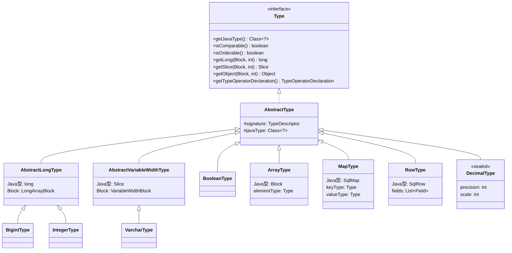
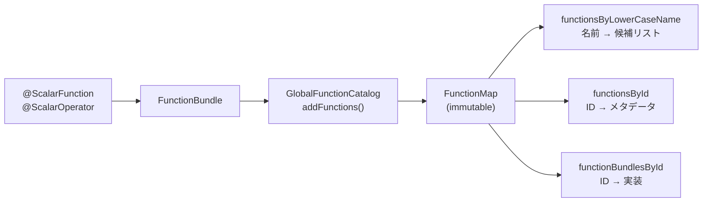
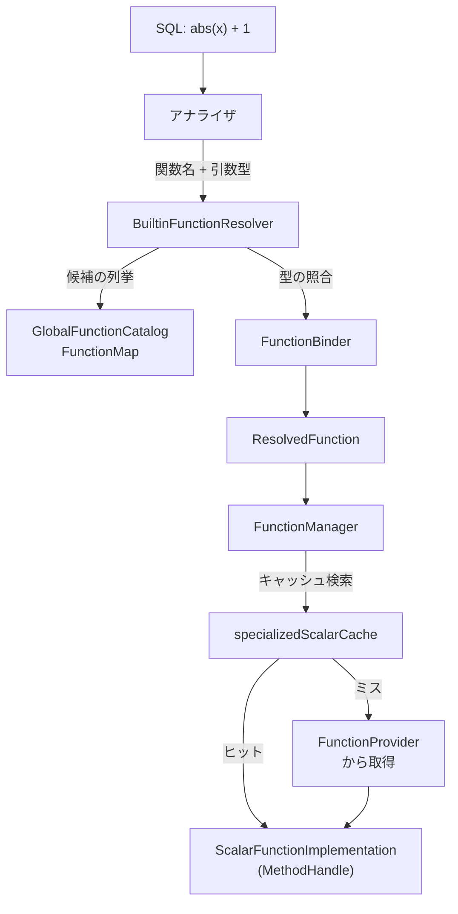

# 第19章 型システムと関数レジストリ

> **本章で読むソース**
>
> - [`core/trino-spi/src/main/java/io/trino/spi/type/Type.java`](https://github.com/trinodb/trino/blob/482/core/trino-spi/src/main/java/io/trino/spi/type/Type.java)
> - [`core/trino-spi/src/main/java/io/trino/spi/type/AbstractType.java`](https://github.com/trinodb/trino/blob/482/core/trino-spi/src/main/java/io/trino/spi/type/AbstractType.java)
> - [`core/trino-spi/src/main/java/io/trino/spi/type/AbstractLongType.java`](https://github.com/trinodb/trino/blob/482/core/trino-spi/src/main/java/io/trino/spi/type/AbstractLongType.java)
> - [`core/trino-spi/src/main/java/io/trino/spi/type/BigintType.java`](https://github.com/trinodb/trino/blob/482/core/trino-spi/src/main/java/io/trino/spi/type/BigintType.java)
> - [`core/trino-spi/src/main/java/io/trino/spi/type/VarcharType.java`](https://github.com/trinodb/trino/blob/482/core/trino-spi/src/main/java/io/trino/spi/type/VarcharType.java)
> - [`core/trino-spi/src/main/java/io/trino/spi/type/ArrayType.java`](https://github.com/trinodb/trino/blob/482/core/trino-spi/src/main/java/io/trino/spi/type/ArrayType.java)
> - [`core/trino-spi/src/main/java/io/trino/spi/type/MapType.java`](https://github.com/trinodb/trino/blob/482/core/trino-spi/src/main/java/io/trino/spi/type/MapType.java)
> - [`core/trino-spi/src/main/java/io/trino/spi/type/TypeOperatorDeclaration.java`](https://github.com/trinodb/trino/blob/482/core/trino-spi/src/main/java/io/trino/spi/type/TypeOperatorDeclaration.java)
> - [`core/trino-spi/src/main/java/io/trino/spi/type/TypeOperators.java`](https://github.com/trinodb/trino/blob/482/core/trino-spi/src/main/java/io/trino/spi/type/TypeOperators.java)
> - [`core/trino-spi/src/main/java/io/trino/spi/function/ScalarFunction.java`](https://github.com/trinodb/trino/blob/482/core/trino-spi/src/main/java/io/trino/spi/function/ScalarFunction.java)
> - [`core/trino-spi/src/main/java/io/trino/spi/function/ScalarOperator.java`](https://github.com/trinodb/trino/blob/482/core/trino-spi/src/main/java/io/trino/spi/function/ScalarOperator.java)
> - [`core/trino-spi/src/main/java/io/trino/spi/function/OperatorType.java`](https://github.com/trinodb/trino/blob/482/core/trino-spi/src/main/java/io/trino/spi/function/OperatorType.java)
> - [`core/trino-main/src/main/java/io/trino/type/BigintOperators.java`](https://github.com/trinodb/trino/blob/482/core/trino-main/src/main/java/io/trino/type/BigintOperators.java)
> - [`core/trino-main/src/main/java/io/trino/metadata/FunctionManager.java`](https://github.com/trinodb/trino/blob/482/core/trino-main/src/main/java/io/trino/metadata/FunctionManager.java)
> - [`core/trino-main/src/main/java/io/trino/metadata/GlobalFunctionCatalog.java`](https://github.com/trinodb/trino/blob/482/core/trino-main/src/main/java/io/trino/metadata/GlobalFunctionCatalog.java)
> - [`core/trino-main/src/main/java/io/trino/metadata/BuiltinFunctionResolver.java`](https://github.com/trinodb/trino/blob/482/core/trino-main/src/main/java/io/trino/metadata/BuiltinFunctionResolver.java)

## この章の狙い

SQL のすべての値は型を持ち、すべての演算は関数として定義されている。
`SELECT CAST(x AS bigint) + 1` のような式は、`CAST` 演算子と `+` 演算子という2つの関数呼び出しに分解される。
Trino の型システムは、このような型と関数を統一的に扱う基盤である。

本章では、`Type` インタフェースの設計を読み、`BigintType` や `VarcharType` といった基本型がどのように Block への読み書きを実装しているかを確認する。
続いて `ArrayType` や `MapType` などのパラメトリック型が、要素型に応じた演算子を `MethodHandle` で合成する仕組みを追う。
さらに `GlobalFunctionCatalog` と `FunctionManager` による関数の登録と解決の流れを読み、`MethodHandle` ベースの型特化ディスパッチがなぜ高速なのかを明らかにする。

## 前提

- Block と Page のデータ構造（列指向のインメモリ表現）を理解していること。
- Java の `MethodHandle` の基本（メソッド参照を第一級の値として扱い、JIT で直接インライン化できる仕組み）を知っていること。

## Type インタフェースの設計

Trino のすべての SQL 型は **`Type`** インタフェースを実装する。
このインタフェースは SPI モジュールに属しており、Connector の開発者が独自の型を定義するための拡張点でもある。

### Java 型の対応付け

`Type` の中核は `getJavaType()` メソッドである。
SQL 型が JVM 上でどのプリミティブ型として表現されるかを返す。

[`core/trino-spi/src/main/java/io/trino/spi/type/Type.java` L77-L83](https://github.com/trinodb/trino/blob/482/core/trino-spi/src/main/java/io/trino/spi/type/Type.java#L77-L83)

```java
    /**
     * Gets the Java class type used to represent this value on the stack during
     * expression execution.
     * <p>
     * Currently, this can be {@code boolean}, {@code long}, {@code double}, or a non-primitive type.
     */
    Class<?> getJavaType();
```

戻り値は `boolean`、`long`、`double`、または非プリミティブ型（`Slice` や `Block` など）のいずれかに限られる。
この制約により、実行エンジンは値の受け渡しにボクシングを必要としない。
`BIGINT` は `long`、`BOOLEAN` は `boolean`、`VARCHAR` は `Slice`、`ARRAY` は `Block` という対応になる。

### Block への読み書き

`Type` は Block に対する読み書きメソッドを Java 型ごとに提供する。

[`core/trino-spi/src/main/java/io/trino/spi/type/Type.java` L136-L190](https://github.com/trinodb/trino/blob/482/core/trino-spi/src/main/java/io/trino/spi/type/Type.java#L136-L190)

```java
    boolean getBoolean(Block block, int position);
    long getLong(Block block, int position);
    double getDouble(Block block, int position);
    Slice getSlice(Block block, int position);
    Object getObject(Block block, int position);

    void writeBoolean(BlockBuilder blockBuilder, boolean value);
    void writeLong(BlockBuilder blockBuilder, long value);
    void writeDouble(BlockBuilder blockBuilder, double value);
    void writeSlice(BlockBuilder blockBuilder, Slice value);
    // ... (中略) ...
    void writeObject(BlockBuilder blockBuilder, Object value);
```

各型は `getJavaType()` が返す型に対応するメソッドだけを実装し、それ以外は `AbstractType` で `UnsupportedOperationException` を投げるデフォルト実装が用意されている。
例えば `BigintType` は `getLong` / `writeLong` だけを実装する。

### 比較可能性と順序可能性

`Type` は `isComparable()` と `isOrderable()` の2つのメソッドで、その型が等値比較や大小比較を行えるかを宣言する。

[`core/trino-spi/src/main/java/io/trino/spi/type/Type.java` L60-L68](https://github.com/trinodb/trino/blob/482/core/trino-spi/src/main/java/io/trino/spi/type/Type.java#L60-L68)

```java
    /**
     * True if the type supports equalTo and hash.
     */
    boolean isComparable();

    /**
     * True if the type supports compareTo.
     */
    boolean isOrderable();
```

`isComparable()` が `true` の型は `EQUAL`、`HASH_CODE` などの演算子を持つ。
`isOrderable()` が `true` の型はさらに `COMPARISON_UNORDERED_LAST` や `LESS_THAN` を持つ。
`ArrayType` や `MapType` のようなパラメトリック型では、要素型の比較可能性がそのまま伝搬する（後述）。

## 基本型の実装

### AbstractType と型階層

すべての具象型は **`AbstractType`** を継承する。
`AbstractType` は `getJavaType()` と `getTypeDescriptor()` をフィールドとして保持し、コンストラクタで設定する。

[`core/trino-spi/src/main/java/io/trino/spi/type/AbstractType.java` L23-L35](https://github.com/trinodb/trino/blob/482/core/trino-spi/src/main/java/io/trino/spi/type/AbstractType.java#L23-L35)

```java
public abstract class AbstractType
        implements Type
{
    private final TypeDescriptor signature;
    private final Class<?> javaType;
    private final Class<? extends ValueBlock> valueBlockType;

    protected AbstractType(TypeDescriptor signature, Class<?> javaType, Class<? extends ValueBlock> valueBlockType)
    {
        this.signature = signature;
        this.javaType = javaType;
        this.valueBlockType = valueBlockType;
    }
```

`AbstractType` の下に、固定長型のための `AbstractLongType`（`long` 型の値を `LongArrayBlock` に格納）や、可変長型のための `AbstractVariableWidthType`（`Slice` 型の値を `VariableWidthBlock` に格納）といった中間クラスが用意されている。



### BigintType と AbstractLongType

**`BigintType`** は SQL の `BIGINT` 型を表し、`AbstractLongType` を継承する。
`AbstractLongType` は `long` 値を `LongArrayBlock` に格納する共通実装を提供しており、`BigintType`、`IntegerType`、`SmallintType`、`TinyintType` がこれを継承する。

`AbstractLongType` の `getLong` は `LongArrayBlock` からの直接読み出しである。

[`core/trino-spi/src/main/java/io/trino/spi/type/AbstractLongType.java` L83-L86](https://github.com/trinodb/trino/blob/482/core/trino-spi/src/main/java/io/trino/spi/type/AbstractLongType.java#L83-L86)

```java
    @Override
    public final long getLong(Block block, int position)
    {
        return read((LongArrayBlock) block.getUnderlyingValueBlock(), block.getUnderlyingValuePosition(position));
    }
```

`BigintType` 自身はシングルトンとして定義されている。
`equals` は参照比較だけで済む。

[`core/trino-spi/src/main/java/io/trino/spi/type/BigintType.java` L25-L31](https://github.com/trinodb/trino/blob/482/core/trino-spi/src/main/java/io/trino/spi/type/BigintType.java#L25-L31)

```java
    public static final String NAME = "bigint";
    public static final BigintType BIGINT = new BigintType();

    private BigintType()
    {
        super(new TypeDescriptor(NAME));
    }
```

### VarcharType とインスタンスキャッシュ

**`VarcharType`** は SQL の `VARCHAR(n)` 型を表す。
長さパラメータを持つため、シングルトンにはできない。
代わりに、よく使われる短い長さ（0から127）のインスタンスを配列にキャッシュして再利用している。

[`core/trino-spi/src/main/java/io/trino/spi/type/VarcharType.java` L48-L71](https://github.com/trinodb/trino/blob/482/core/trino-spi/src/main/java/io/trino/spi/type/VarcharType.java#L48-L71)

```java
    private static final VarcharType[] CACHED_INSTANCES = new VarcharType[128];

    static {
        for (int i = 0; i < CACHED_INSTANCES.length; i++) {
            CACHED_INSTANCES[i] = new VarcharType(i);
        }
    }

    // ... (中略) ...

    public static VarcharType createVarcharType(int length)
    {
        if (length > MAX_LENGTH || length < 0) {
            // Use createUnboundedVarcharType for unbounded VARCHAR.
            throw new IllegalArgumentException("Invalid VARCHAR length " + length);
        }
        if (length < CACHED_INSTANCES.length) {
            return CACHED_INSTANCES[length];
        }
        return new VarcharType(length);
    }
```

`VarcharType` は `AbstractVariableWidthType` を継承し、値を `Slice`（Trino 独自のバイト列ラッパー）として `VariableWidthBlock` に格納する。
`getSlice` は `VariableWidthBlock` から直接 Slice を取得する。

[`core/trino-spi/src/main/java/io/trino/spi/type/VarcharType.java` L192-L197](https://github.com/trinodb/trino/blob/482/core/trino-spi/src/main/java/io/trino/spi/type/VarcharType.java#L192-L197)

```java
    @Override
    public Slice getSlice(Block block, int position)
    {
        VariableWidthBlock valueBlock = (VariableWidthBlock) block.getUnderlyingValueBlock();
        int valuePosition = block.getUnderlyingValuePosition(position);
        return valueBlock.getSlice(valuePosition);
    }
```

## パラメトリック型

### ArrayType

**`ArrayType`** は SQL の `ARRAY` 型を表す。
要素型を `elementType` フィールドに保持し、要素型の比較可能性をそのまま引き継ぐ。

[`core/trino-spi/src/main/java/io/trino/spi/type/ArrayType.java` L98-L108](https://github.com/trinodb/trino/blob/482/core/trino-spi/src/main/java/io/trino/spi/type/ArrayType.java#L98-L108)

```java
    private final Type elementType;

    // this field is used in double-checked locking
    @SuppressWarnings("FieldAccessedSynchronizedAndUnsynchronized")
    private volatile TypeOperatorDeclaration operatorDeclaration;

    public ArrayType(Type elementType)
    {
        super(new TypeDescriptor(NAME, TypeParameter.typeParameter(elementType.getTypeDescriptor())), Block.class, ArrayBlock.class);
        this.elementType = requireNonNull(elementType, "elementType is null");
    }
```

`isComparable()` と `isOrderable()` は、要素型のそれをそのまま返す。

[`core/trino-spi/src/main/java/io/trino/spi/type/ArrayType.java` L229-L238](https://github.com/trinodb/trino/blob/482/core/trino-spi/src/main/java/io/trino/spi/type/ArrayType.java#L229-L238)

```java
    @Override
    public boolean isComparable()
    {
        return elementType.isComparable();
    }

    @Override
    public boolean isOrderable()
    {
        return elementType.isOrderable();
    }
```

`ArrayType` の等値比較や順序比較の演算子は、初回アクセス時に要素型の演算子から `MethodHandle` を合成する（後述の「型演算子」の節で詳しく読む）。

### MapType

**`MapType`** はキー型と値型の2つの型パラメータを持つ。
キー型は比較可能でなければならないという制約がコンストラクタで検査される。

[`core/trino-spi/src/main/java/io/trino/spi/type/MapType.java` L115-L141](https://github.com/trinodb/trino/blob/482/core/trino-spi/src/main/java/io/trino/spi/type/MapType.java#L115-L141)

```java
    public MapType(Type keyType, Type valueType, TypeOperators typeOperators)
    {
        super(
                new TypeDescriptor(
                        NAME,
                        TypeParameter.typeParameter(keyType.getTypeDescriptor()),
                        TypeParameter.typeParameter(valueType.getTypeDescriptor())),
                SqlMap.class,
                MapBlock.class);
        if (!keyType.isComparable()) {
            throw new IllegalArgumentException(format("key type must be comparable, got %s", keyType));
        }
        this.keyType = keyType;
        this.valueType = valueType;

        keyBlockNativeEqual = typeOperators.getEqualOperator(keyType, simpleConvention(NULLABLE_RETURN, BLOCK_POSITION_NOT_NULL, NEVER_NULL))
                .asType(methodType(Boolean.class, Block.class, int.class, keyType.getJavaType().isPrimitive() ? keyType.getJavaType() : Object.class));
        keyBlockEqual = typeOperators.getEqualOperator(keyType, simpleConvention(NULLABLE_RETURN, BLOCK_POSITION_NOT_NULL, BLOCK_POSITION_NOT_NULL));
        // ... (中略) ...
        keyBlockHashCode = typeOperators.getHashCodeOperator(keyType, simpleConvention(FAIL_ON_NULL, BLOCK_POSITION_NOT_NULL));
    }
```

`MapType` のコンストラクタは `TypeOperators` を受け取り、キーの検索に必要な `equalOperator` と `hashCodeOperator` を `MethodHandle` として取得して保持する。
`MapType` の `isComparable()` は値型の比較可能性で決まる（キー型は常に比較可能であるため）。

### DecimalType と sealed クラス

**`DecimalType`** は精度（precision）とスケール（scale）をパラメータに持つ。
精度が18以下の場合は `long` に収まるため `ShortDecimalType` を、それを超える場合は 128 ビット固定小数点の `LongDecimalType` を使い分ける。
この分岐は `sealed` クラスで保証されている。

[`core/trino-spi/src/main/java/io/trino/spi/type/DecimalType.java` L28-L51](https://github.com/trinodb/trino/blob/482/core/trino-spi/src/main/java/io/trino/spi/type/DecimalType.java#L28-L51)

```java
public abstract sealed class DecimalType
        extends AbstractType
        implements FixedWidthType
        permits LongDecimalType, ShortDecimalType
{
    // ... (中略) ...
    public static DecimalType createDecimalType(int precision, int scale)
    {
        // ... (中略) ...
        if (precision <= MAX_SHORT_PRECISION) {
            return ShortDecimalType.getInstance(precision, scale);
        }
        return new LongDecimalType(precision, scale);
    }
```

`MAX_SHORT_PRECISION` は 18 であり[^1]、`long` で表現可能な最大桁数に対応している。

[^1]: `Decimals.MAX_SHORT_PRECISION`（[`core/trino-spi/src/main/java/io/trino/spi/type/Decimals.java` L47](https://github.com/trinodb/trino/blob/482/core/trino-spi/src/main/java/io/trino/spi/type/Decimals.java#L47)）。

### RowType

**`RowType`** は SQL の `ROW` 型を表し、名前付きフィールドのリストを保持する。
`ArrayType` と同様に、各フィールドの型の比較可能性が `RowType` 全体の比較可能性を決定する。
演算子の合成は `ArrayType` と同様の `MethodHandle` 合成パターンで行われる。

## 型演算子の仕組み

### ScalarOperator アノテーション

型に紐づく演算子（等値比較、ハッシュ、大小比較、読み書き）は **`@ScalarOperator`** アノテーションで定義される。
`AbstractLongType` の例を見ると、`@ScalarOperator(EQUAL)` や `@ScalarOperator(HASH_CODE)` で静的メソッドに演算子を紐づけている。

[`core/trino-spi/src/main/java/io/trino/spi/type/AbstractLongType.java` L154-L176](https://github.com/trinodb/trino/blob/482/core/trino-spi/src/main/java/io/trino/spi/type/AbstractLongType.java#L154-L176)

```java
    @ScalarOperator(EQUAL)
    private static boolean equalOperator(long left, long right)
    {
        return left == right;
    }

    @ScalarOperator(HASH_CODE)
    private static long hashCodeOperator(long value)
    {
        return hash(value);
    }

    @ScalarOperator(XX_HASH_64)
    private static long xxHash64Operator(long value)
    {
        return XxHash64.hash(value);
    }

    @ScalarOperator(COMPARISON_UNORDERED_LAST)
    private static long comparisonOperator(long left, long right)
    {
        return Long.compare(left, right);
    }
```

`OperatorType` は利用可能な演算子の種類を列挙している。

[`core/trino-spi/src/main/java/io/trino/spi/function/OperatorType.java` L19-L45](https://github.com/trinodb/trino/blob/482/core/trino-spi/src/main/java/io/trino/spi/function/OperatorType.java#L19-L45)

```java
public enum OperatorType
{
    ADD("+", 2, false),
    SUBTRACT("-", 2, false),
    MULTIPLY("*", 2, false),
    DIVIDE("/", 2, false),
    MODULO("%", 2, false),
    NEGATION("-", 1, false),
    EQUAL("=", 2, true),
    COMPARISON_UNORDERED_LAST("COMPARISON_UNORDERED_LAST", 2, true),
    COMPARISON_UNORDERED_FIRST("COMPARISON_UNORDERED_FIRST", 2, true),
    LESS_THAN("<", 2, true),
    LESS_THAN_OR_EQUAL("<=", 2, true),
    CAST("CAST", 1, false),
    SUBSCRIPT("[]", 2, false),
    HASH_CODE("HASH CODE", 1, true),
    SATURATED_FLOOR_CAST("SATURATED FLOOR CAST", 1, false),
    IDENTICAL("IDENTICAL", 2, true),
    XX_HASH_64("XX HASH 64", 1, true),
    INDETERMINATE("INDETERMINATE", 1, true),
    READ_VALUE("READ VALUE", 1, true),
    /**/;
```

第3引数の `neverFails` は、その演算子がどのような入力に対しても例外を投げないかを示すフラグである。
`EQUAL` や `HASH_CODE` は `true`（失敗しない）、`CAST` や `ADD` は `false`（オーバーフロー等で失敗しうる）として定義されている。

### TypeOperatorDeclaration による演算子の集約

`@ScalarOperator` で定義された各メソッドは、`TypeOperatorDeclaration.extractOperatorDeclaration` によってリフレクションで収集され、演算子ごとの `MethodHandle` として `TypeOperatorDeclaration` にまとめられる。
`AbstractLongType` ではクラスロード時にこの抽出が一度だけ行われ、静的フィールドに保持される。

[`core/trino-spi/src/main/java/io/trino/spi/type/AbstractLongType.java` L50](https://github.com/trinodb/trino/blob/482/core/trino-spi/src/main/java/io/trino/spi/type/AbstractLongType.java#L50)

```java
    private static final TypeOperatorDeclaration TYPE_OPERATOR_DECLARATION = extractOperatorDeclaration(AbstractLongType.class, lookup(), long.class);
```

`TypeOperatorDeclaration` は演算子の種類ごとに `OperatorMethodHandle` のコレクションを保持する構造体である。
同じ演算子に対して複数の呼び出し規約（`NEVER_NULL`、`BLOCK_POSITION`、`FLAT` など）の実装を登録できる。

[`core/trino-spi/src/main/java/io/trino/spi/type/TypeOperatorDeclaration.java` L63-L76](https://github.com/trinodb/trino/blob/482/core/trino-spi/src/main/java/io/trino/spi/type/TypeOperatorDeclaration.java#L63-L76)

```java
public final class TypeOperatorDeclaration
{
    public static final TypeOperatorDeclaration NO_TYPE_OPERATOR_DECLARATION = builder(boolean.class).build();

    private final Collection<OperatorMethodHandle> readValueOperators;
    private final Collection<OperatorMethodHandle> equalOperators;
    private final Collection<OperatorMethodHandle> hashCodeOperators;
    private final Collection<OperatorMethodHandle> xxHash64Operators;
    private final Collection<OperatorMethodHandle> identicalOperators;
    private final Collection<OperatorMethodHandle> indeterminateOperators;
    private final Collection<OperatorMethodHandle> comparisonUnorderedLastOperators;
    private final Collection<OperatorMethodHandle> comparisonUnorderedFirstOperators;
    private final Collection<OperatorMethodHandle> lessThanOperators;
    private final Collection<OperatorMethodHandle> lessThanOrEqualOperators;
```

### パラメトリック型の演算子合成

`ArrayType` のような型は、要素型に応じた演算子を動的に合成する必要がある。
`generateTypeOperators` メソッドが初回呼び出し時に、`TypeOperators` から要素型の演算子 `MethodHandle` を取得し、それを `insertArguments` や `bindTo` で配列の等値比較メソッドに結合する。

[`core/trino-spi/src/main/java/io/trino/spi/type/ArrayType.java` L152-L159](https://github.com/trinodb/trino/blob/482/core/trino-spi/src/main/java/io/trino/spi/type/ArrayType.java#L152-L159)

```java
    private static List<OperatorMethodHandle> getEqualOperatorMethodHandles(TypeOperators typeOperators, Type elementType)
    {
        if (!elementType.isComparable()) {
            return emptyList();
        }
        MethodHandle equalOperator = typeOperators.getEqualOperator(elementType, simpleConvention(NULLABLE_RETURN, VALUE_BLOCK_POSITION_NOT_NULL, VALUE_BLOCK_POSITION_NOT_NULL));
        return singletonList(new OperatorMethodHandle(EQUAL_CONVENTION, EQUAL.bindTo(equalOperator)));
    }
```

`EQUAL` は `ArrayType.equalOperator` メソッドの `MethodHandle` であり、`bindTo` で要素型の `equalOperator` をその第1引数に束縛する。
こうして `array(bigint)` と `array(varchar)` は、それぞれ `bigint` と `varchar` の等値比較を組み込んだ異なる `MethodHandle` を持つことになる。

この合成は double-checked locking で遅延初期化され、同じ型インスタンスに対して1度だけ実行される。

[`core/trino-spi/src/main/java/io/trino/spi/type/ArrayType.java` L111-L117](https://github.com/trinodb/trino/blob/482/core/trino-spi/src/main/java/io/trino/spi/type/ArrayType.java#L111-L117)

```java
    @Override
    public TypeOperatorDeclaration getTypeOperatorDeclaration(TypeOperators typeOperators)
    {
        if (operatorDeclaration == null) {
            generateTypeOperators(typeOperators);
        }
        return operatorDeclaration;
    }
```

### TypeOperators のキャッシュと呼び出し規約の変換

**`TypeOperators`** は、型と演算子の組み合わせに対する `MethodHandle` を取得するための中央レジストリである。
内部に `ConcurrentHashMap` ベースのキャッシュを持ち、同じ型と呼び出し規約の組み合わせに対して `MethodHandle` を再利用する。

[`core/trino-spi/src/main/java/io/trino/spi/type/TypeOperators.java` L78-L88](https://github.com/trinodb/trino/blob/482/core/trino-spi/src/main/java/io/trino/spi/type/TypeOperators.java#L78-L88)

```java
    public TypeOperators()
    {
        ConcurrentHashMap<Object, Object> cache = new ConcurrentHashMap<>();
        this.cache = (operatorConvention, supplier) -> {
            // preform explicit get before calling computeIfAbsent since computeIfAbsent cause lock contention
            Object operator = cache.get(operatorConvention);
            if (operator != null) {
                return operator;
            }
            return cache.computeIfAbsent(operatorConvention, _ -> supplier.get());
        };
    }
```

`computeIfAbsent` の前に `get` を明示的に呼んでいる理由は、`ConcurrentHashMap.computeIfAbsent` がキーのセグメントをロックするため、ヒット時にもロック競合が発生するのを避けるためである。

呼び出し側が要求する呼び出し規約（`InvocationConvention`）と、型が提供する演算子の呼び出し規約が異なる場合、`ScalarFunctionAdapter` が `MethodHandle` を変換する。
例えば、型が `NEVER_NULL` 規約の演算子を提供しているのに対して、呼び出し側が `BLOCK_POSITION` 規約を要求した場合、Block からの値の読み出しを挟むアダプタが合成される。

[`core/trino-spi/src/main/java/io/trino/spi/type/TypeOperators.java` L221-L228](https://github.com/trinodb/trino/blob/482/core/trino-spi/src/main/java/io/trino/spi/type/TypeOperators.java#L221-L228)

```java
        private static MethodHandle adaptOperator(OperatorConvention operatorConvention, OperatorMethodHandle operatorMethodHandle)
        {
            return ScalarFunctionAdapter.adapt(
                    operatorMethodHandle.getMethodHandle(),
                    getOperatorReturnType(operatorConvention),
                    getOperatorArgumentTypes(operatorConvention),
                    operatorMethodHandle.getCallingConvention(),
                    operatorConvention.callingConvention());
        }
```

この変換は `MethodHandle` の合成で行われるため、JIT コンパイラがアダプタごとインライン化できる。
仮想メソッド呼び出しやリフレクションではなく、`MethodHandle` チェーンを通じた直接的な関数合成であるため、最終的にはネイティブコード上でプリミティブ演算に帰着する。

## 算術演算子とキャスト

型に紐づく演算子とは別に、算術演算やキャストは `trino-main` モジュールの Operators クラスに定義されている。
`BigintOperators` には `ADD`、`SUBTRACT`、`CAST` などが `@ScalarOperator` と `@SqlType` で宣言されている。

[`core/trino-main/src/main/java/io/trino/type/BigintOperators.java` L53-L63](https://github.com/trinodb/trino/blob/482/core/trino-main/src/main/java/io/trino/type/BigintOperators.java#L53-L63)

```java
    @ScalarOperator(ADD)
    @SqlType(StandardTypes.BIGINT)
    public static long add(@SqlType(StandardTypes.BIGINT) long left, @SqlType(StandardTypes.BIGINT) long right)
    {
        try {
            return Math.addExact(left, right);
        }
        catch (ArithmeticException e) {
            throw new TrinoException(NUMERIC_VALUE_OUT_OF_RANGE, format("bigint addition overflow: %s + %s", left, right), e);
        }
    }
```

`Math.addExact` はオーバーフロー時に `ArithmeticException` を投げるため、この演算子は `neverFails = false`（デフォルト）である。
一方、キャスト演算子の中には `neverFails = true` を明示的に指定するものもある。

[`core/trino-main/src/main/java/io/trino/type/BigintOperators.java` L133-L138](https://github.com/trinodb/trino/blob/482/core/trino-main/src/main/java/io/trino/type/BigintOperators.java#L133-L138)

```java
    @ScalarOperator(value = CAST, neverFails = true)
    @SqlType(StandardTypes.BOOLEAN)
    public static boolean castToBoolean(@SqlType(StandardTypes.BIGINT) long value)
    {
        return value != 0;
    }
```

`neverFails = true` の演算子は、アサーション有効時に `FunctionManager` が例外監視ラッパーを挿入し、万一例外が発生した場合に `IllegalStateException` として報告する。

## 関数の登録と解決

### ScalarFunction アノテーション

ユーザーが呼び出す SQL 関数は **`@ScalarFunction`** アノテーションで定義される。

[`core/trino-spi/src/main/java/io/trino/spi/function/ScalarFunction.java` L28-L43](https://github.com/trinodb/trino/blob/482/core/trino-spi/src/main/java/io/trino/spi/function/ScalarFunction.java#L28-L43)

```java
public @interface ScalarFunction
{
    String value() default "";

    String[] alias() default {};

    boolean hidden() default false;

    boolean deterministic() default true;

    /**
     * Describes whether the function never throws any exception
     * for any possible combination of input arguments.
     */
    boolean neverFails() default false;
}
```

`value` は関数名、`alias` は別名、`deterministic` は同じ入力に対して常に同じ結果を返すかを示す。
`@ScalarFunction` で定義されたクラスのメソッドが `@SqlType` で入出力型を宣言し、関数本体として登録される。

### GlobalFunctionCatalog と FunctionMap

組み込み関数の登録先は **`GlobalFunctionCatalog`** である。
`addFunctions` メソッドで `FunctionBundle` を受け取り、内部の `FunctionMap` にイミュータブルに追加する。

[`core/trino-main/src/main/java/io/trino/metadata/GlobalFunctionCatalog.java` L90-L106](https://github.com/trinodb/trino/blob/482/core/trino-main/src/main/java/io/trino/metadata/GlobalFunctionCatalog.java#L90-L106)

```java
    public final synchronized void addFunctions(FunctionBundle functionBundle)
    {
        for (FunctionMetadata functionMetadata : functionBundle.getFunctions()) {
            checkArgument(!functions.getFunctionsById().containsKey(functionMetadata.getFunctionId()), "Function already registered: %s", functionMetadata.getFunctionId());

            for (String alias : functionMetadata.getNames()) {
                checkArgument(!alias.contains("|"), "Function name cannot contain '|' character: %s(%s)", alias, functionMetadata.getSignature());
                checkArgument(!alias.contains("@"), "Function name cannot contain '@' character: %s(%s)", alias, functionMetadata.getSignature());
                checkNotSpecializedTypeOperator(alias, functionMetadata.getSignature());

                for (FunctionMetadata existingFunction : this.functions.get(alias)) {
                    checkArgument(!functionMetadata.getSignature().equals(existingFunction.getSignature()), "Function already registered: %s(%s)", alias, functionMetadata.getSignature());
                }
            }
            this.functions = new FunctionMap(this.functions, functionBundle);
        }
    }
```

`FunctionMap` は3つの索引を持つイミュータブルな構造体である。

[`core/trino-main/src/main/java/io/trino/metadata/GlobalFunctionCatalog.java` L231-L236](https://github.com/trinodb/trino/blob/482/core/trino-main/src/main/java/io/trino/metadata/GlobalFunctionCatalog.java#L231-L236)

```java
    private static class FunctionMap
    {
        private final Map<FunctionId, FunctionBundle> functionBundlesById;
        private final Map<FunctionId, FunctionMetadata> functionsById;
        // function names are currently lower cased
        private final Multimap<String, FunctionMetadata> functionsByLowerCaseName;
```

- **`functionBundlesById`**：関数 ID から元の `FunctionBundle` へのマップ。実装の取得に使う。
- **`functionsById`**：関数 ID から `FunctionMetadata`（シグネチャ、名前、属性）へのマップ。
- **`functionsByLowerCaseName`**：小文字化した関数名から `FunctionMetadata` のリストへの `Multimap`。名前解決時にオーバーロードの候補を列挙する。



### BuiltinFunctionResolver による関数解決

クエリのアナライザが `abs(bigint)` のような関数呼び出しを解決するとき、**`BuiltinFunctionResolver`** が呼ばれる。

[`core/trino-main/src/main/java/io/trino/metadata/BuiltinFunctionResolver.java` L74-L89](https://github.com/trinodb/trino/blob/482/core/trino-main/src/main/java/io/trino/metadata/BuiltinFunctionResolver.java#L74-L89)

```java
    ResolvedFunction resolveBuiltinFunction(String name, List<TypeDescriptorProvider> parameterTypes)
    {
        try {
            return uncheckedCacheGet(functionCache, FunctionCacheKey.from(name, parameterTypes),
                    () -> {
                        CatalogFunctionBinding functionBinding = functionBinder.bindFunction(parameterTypes, getBuiltinFunctions(name), name);
                        return resolveBuiltin(functionBinding);
                    });
        }
        catch (UncheckedExecutionException e) {
            if (e.getCause() instanceof TrinoException cause) {
                throw cause;
            }
            throw e;
        }
    }
```

解決は次の手順で行われる。

1. `getBuiltinFunctions(name)` で `GlobalFunctionCatalog` から同名のオーバーロード候補を取得する。
2. `functionBinder.bindFunction` が引数型を各候補のシグネチャと照合し、型パラメータの束縛（`BoundSignature`）を決定する。
3. `resolveBuiltin` が依存関係の解決を行い、最終的な `ResolvedFunction` を返す。

演算子の解決も同じ仕組みで行われる。
`resolveOperator` は演算子名をマングルして `resolveBuiltinFunction` に委譲する。

[`core/trino-main/src/main/java/io/trino/metadata/BuiltinFunctionResolver.java` L91-L102](https://github.com/trinodb/trino/blob/482/core/trino-main/src/main/java/io/trino/metadata/BuiltinFunctionResolver.java#L91-L102)

```java
    ResolvedFunction resolveOperator(OperatorType operatorType, List<? extends Type> argumentTypes)
            throws OperatorNotFoundException
    {
        try {
            return uncheckedCacheGet(operatorCache, new OperatorCacheKey(operatorType, argumentTypes),
                    () -> resolveBuiltinFunction(
                            mangleOperatorName(operatorType),
                            argumentTypes.stream()
                                    .map(Type::getTypeDescriptor)
                                    .map(TypeDescriptorProvider::new)
                                    .collect(toImmutableList())));
        }
```

`BuiltinFunctionResolver` は `operatorCache`、`coercionCache`、`functionCache` の3つのキャッシュを持ち、解決結果を保持する。

[`core/trino-main/src/main/java/io/trino/metadata/BuiltinFunctionResolver.java` L58-L71](https://github.com/trinodb/trino/blob/482/core/trino-main/src/main/java/io/trino/metadata/BuiltinFunctionResolver.java#L58-L71)

```java
    private final NonEvictableCache<OperatorCacheKey, ResolvedFunction> operatorCache;
    private final NonEvictableCache<CoercionCacheKey, ResolvedFunction> coercionCache;
    private final NonEvictableCache<FunctionCacheKey, ResolvedFunction> functionCache;

    // ... (中略) ...

        operatorCache = buildNonEvictableCache(CacheBuilder.newBuilder().maximumSize(1000));
        coercionCache = buildNonEvictableCache(CacheBuilder.newBuilder().maximumSize(1000));
        functionCache = buildNonEvictableCache(CacheBuilder.newBuilder().maximumSize(1000));
```

### FunctionManager による実装の取得

解決された `ResolvedFunction` から実際の `MethodHandle` を取得するのが **`FunctionManager`** である。
`getScalarFunctionImplementation` は `ResolvedFunction` と要求する `InvocationConvention` を受け取り、キャッシュ経由で `ScalarFunctionImplementation`（`MethodHandle` のラッパー）を返す。

[`core/trino-main/src/main/java/io/trino/metadata/FunctionManager.java` L78-L80](https://github.com/trinodb/trino/blob/482/core/trino-main/src/main/java/io/trino/metadata/FunctionManager.java#L78-L80)

```java
    private final NonEvictableCache<FunctionKey, ScalarFunctionImplementation> specializedScalarCache;
    private final NonEvictableCache<ResolvedFunction, AggregationImplementation> specializedAggregationCache;
    private final NonEvictableCache<ResolvedFunction, WindowFunctionSupplier> specializedWindowCache;
```

スカラ関数のキャッシュキーは `ResolvedFunction` と `InvocationConvention` のペアである。
同じ関数でも呼び出し規約が異なれば別の `MethodHandle` が生成されるため、このペアでキャッシュする必要がある。



## 高速化の工夫：MethodHandle による型特化ディスパッチ

Trino の型演算子と関数呼び出しの最大の最適化は、`java.lang.invoke.MethodHandle` を全面的に採用している点にある。

従来の仮想メソッドディスパッチ（`Type` インタフェースに `equals(Block, int, Block, int)` のようなメソッドを定義するアプローチ）では、JIT コンパイラがインライン化を試みても、多数の型が同じインタフェースを実装しているためメガモーフィック呼び出しとなり、インライン化を断念する可能性が高い。

Trino はこの問題を `MethodHandle` で回避する。
`TypeOperators` が型と呼び出し規約の組み合わせに対して具体的な `MethodHandle` を生成し、キャッシュする。
この `MethodHandle` は型パラメータが確定した時点で具体的なメソッドへの直接参照となるため、JIT コンパイラはインライン化が可能である。
`BigintType` の等値比較ならば `long == long` という単一の比較命令に帰着し、`array(bigint)` の等値比較ならば要素ごとの `long == long` を呼ぶループに帰着する。

さらに `ScalarFunctionAdapter` による呼び出し規約の変換も `MethodHandle` の合成で行われるため、アダプタ層も JIT コンパイラの最適化対象に含まれる。
`NEVER_NULL` 規約の演算子を `BLOCK_POSITION` 規約で呼び出す場合、Block からの値の読み出しと演算子の本体が1つの `MethodHandle` チェーンに合成され、全体がインライン化される。

キャッシュ構造もこの最適化と協調している。
`TypeOperators` の `ConcurrentHashMap` は `computeIfAbsent` の前に明示的な `get` を入れてロック競合を軽減し、`BuiltinFunctionResolver` と `FunctionManager` の `NonEvictableCache` は頻出する関数解決と実装取得のコストを償却する。

## まとめ

Trino の型システムは `Type` インタフェースを頂点とする階層で構成されており、各型は `getJavaType()` で JVM 上の表現を宣言し、Block への読み書きメソッドで列指向データへのアクセスを提供する。
`BigintType` のような基本型は `AbstractLongType` の共通実装を継承し、`VarcharType` のようなパラメトリックな基本型はインスタンスキャッシュで生成コストを抑える。

型に紐づく演算子（等値比較、ハッシュ、順序比較）は `@ScalarOperator` アノテーションで宣言され、`TypeOperatorDeclaration` に集約される。
`ArrayType` や `MapType` のようなパラメトリック型は、要素型の演算子を `MethodHandle` の合成で組み立てる。

関数の登録は `GlobalFunctionCatalog` の `FunctionMap` がイミュータブルな索引で管理し、解決は `BuiltinFunctionResolver` がシグネチャの照合とキャッシュで行う。
最終的な `MethodHandle` の取得は `FunctionManager` が担い、ここでもキャッシュが効く。

全体を貫く設計方針は、`MethodHandle` による型特化ディスパッチである。
仮想メソッド呼び出しの代わりに具体的な `MethodHandle` を事前に合成してキャッシュすることで、JIT コンパイラがインライン化しやすい形にしている。

## 関連する章

- 第16章（Page と Block）：`Type` が読み書きする列指向データ構造の詳細。
- 第15章（集約と Window 関数）：`FunctionManager` を通じて集約関数の実装を取得する流れ。
- 第10章（論理プランの最適化）：アナライザが関数を解決し、型を決定する過程。
