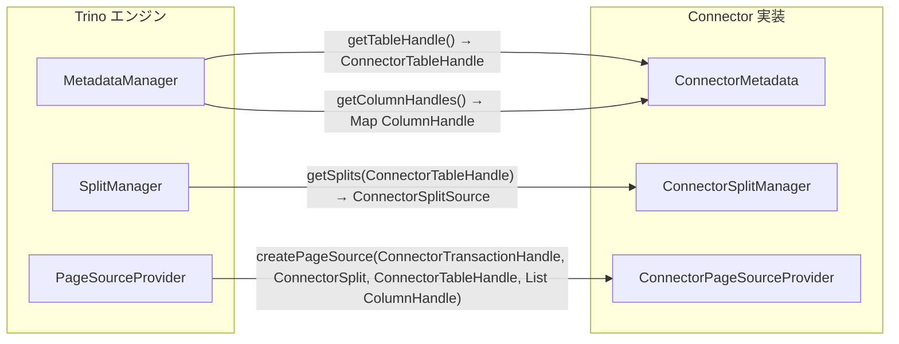
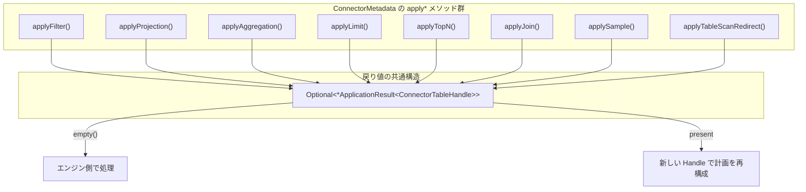
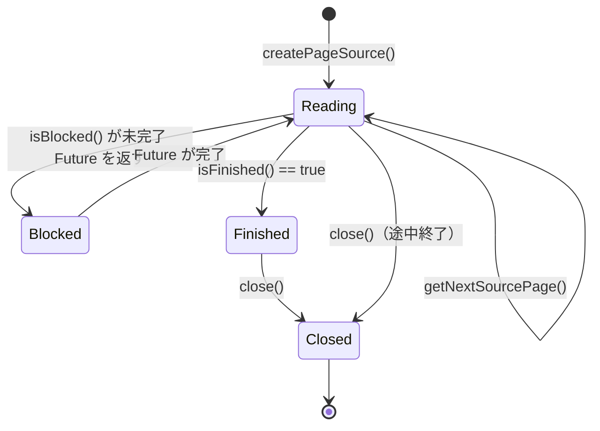
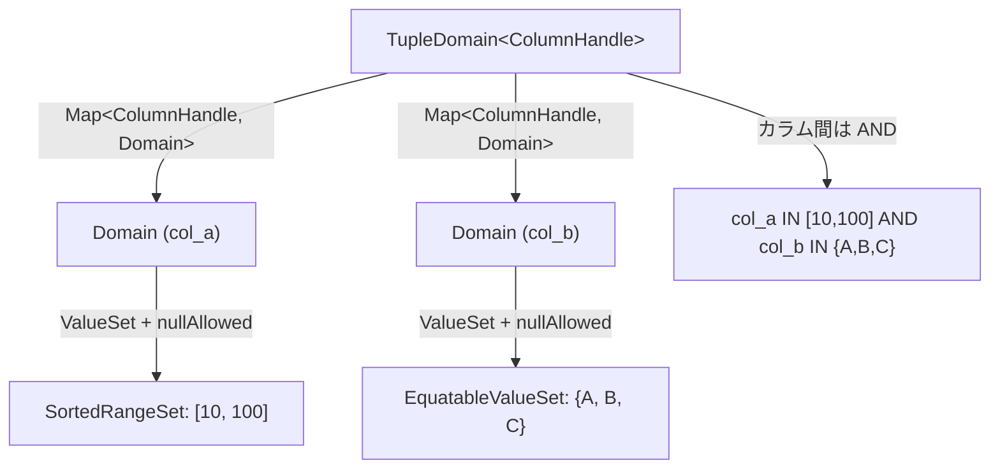

# 第21章 Connector SPI の詳細

> **本章で読むソース**
>
> - [`core/trino-spi/src/main/java/io/trino/spi/connector/ConnectorMetadata.java`](https://github.com/trinodb/trino/blob/482/core/trino-spi/src/main/java/io/trino/spi/connector/ConnectorMetadata.java)
> - [`core/trino-spi/src/main/java/io/trino/spi/connector/ConnectorTableHandle.java`](https://github.com/trinodb/trino/blob/482/core/trino-spi/src/main/java/io/trino/spi/connector/ConnectorTableHandle.java)
> - [`core/trino-spi/src/main/java/io/trino/spi/connector/ColumnHandle.java`](https://github.com/trinodb/trino/blob/482/core/trino-spi/src/main/java/io/trino/spi/connector/ColumnHandle.java)
> - [`core/trino-spi/src/main/java/io/trino/spi/connector/ConnectorTransactionHandle.java`](https://github.com/trinodb/trino/blob/482/core/trino-spi/src/main/java/io/trino/spi/connector/ConnectorTransactionHandle.java)
> - [`core/trino-spi/src/main/java/io/trino/spi/connector/ConnectorSplitManager.java`](https://github.com/trinodb/trino/blob/482/core/trino-spi/src/main/java/io/trino/spi/connector/ConnectorSplitManager.java)
> - [`core/trino-spi/src/main/java/io/trino/spi/connector/ConnectorSplitSource.java`](https://github.com/trinodb/trino/blob/482/core/trino-spi/src/main/java/io/trino/spi/connector/ConnectorSplitSource.java)
> - [`core/trino-spi/src/main/java/io/trino/spi/connector/ConnectorPageSource.java`](https://github.com/trinodb/trino/blob/482/core/trino-spi/src/main/java/io/trino/spi/connector/ConnectorPageSource.java)
> - [`core/trino-spi/src/main/java/io/trino/spi/connector/ConnectorPageSourceProvider.java`](https://github.com/trinodb/trino/blob/482/core/trino-spi/src/main/java/io/trino/spi/connector/ConnectorPageSourceProvider.java)
> - [`core/trino-spi/src/main/java/io/trino/spi/connector/ConnectorPageSink.java`](https://github.com/trinodb/trino/blob/482/core/trino-spi/src/main/java/io/trino/spi/connector/ConnectorPageSink.java)
> - [`core/trino-spi/src/main/java/io/trino/spi/connector/ConnectorPageSinkProvider.java`](https://github.com/trinodb/trino/blob/482/core/trino-spi/src/main/java/io/trino/spi/connector/ConnectorPageSinkProvider.java)
> - [`core/trino-spi/src/main/java/io/trino/spi/connector/Constraint.java`](https://github.com/trinodb/trino/blob/482/core/trino-spi/src/main/java/io/trino/spi/connector/Constraint.java)
> - [`core/trino-spi/src/main/java/io/trino/spi/connector/ConstraintApplicationResult.java`](https://github.com/trinodb/trino/blob/482/core/trino-spi/src/main/java/io/trino/spi/connector/ConstraintApplicationResult.java)
> - [`core/trino-spi/src/main/java/io/trino/spi/predicate/TupleDomain.java`](https://github.com/trinodb/trino/blob/482/core/trino-spi/src/main/java/io/trino/spi/predicate/TupleDomain.java)
> - [`core/trino-spi/src/main/java/io/trino/spi/predicate/Domain.java`](https://github.com/trinodb/trino/blob/482/core/trino-spi/src/main/java/io/trino/spi/predicate/Domain.java)
> - [`core/trino-spi/src/main/java/io/trino/spi/predicate/ValueSet.java`](https://github.com/trinodb/trino/blob/482/core/trino-spi/src/main/java/io/trino/spi/predicate/ValueSet.java)
> - [`core/trino-spi/src/main/java/io/trino/spi/statistics/TableStatistics.java`](https://github.com/trinodb/trino/blob/482/core/trino-spi/src/main/java/io/trino/spi/statistics/TableStatistics.java)
> - [`core/trino-spi/src/main/java/io/trino/spi/statistics/ColumnStatistics.java`](https://github.com/trinodb/trino/blob/482/core/trino-spi/src/main/java/io/trino/spi/statistics/ColumnStatistics.java)

## この章の狙い

前章までで、Trino の型システムと内部データ表現を読んだ。
Connector が外部データソースと Trino エンジンを橋渡しするには、メタデータの提供、データの読み書き、述語のプッシュダウンという3つの責務を SPI のインタフェース群に沿って実装する必要がある。

本章では `ConnectorMetadata` の主要メソッド群を体系的に読み、DDL、DML、プッシュダウン API がどのように分類されているかを確認する。
続いて Handle パターン（`ConnectorTableHandle`、`ColumnHandle` 等のマーカーインタフェース）の設計意図を読み取り、`ConnectorSplitSource` によるストリーミング分割、`ConnectorPageSource` と `ConnectorPageSink` のライフサイクルを追う。
さらに `TupleDomain`、`Domain`、`ValueSet` で構成される述語表現の代数的構造と、`TableStatistics`、`ColumnStatistics` の統計モデルを読む。

## 前提

- Connector の基本構造（`ConnectorFactory` から `Connector` を生成し、メタデータ、Split、Page を提供する流れ）を理解していること。
- Page と Block による列指向データ表現を知っていること（第19章）。
- Trino の型システムの基礎（`Type` インタフェースとその実装）を知っていること（第20章）。

## Handle パターン

Connector SPI の設計は **Handle パターン**と呼ぶべき仕組みに依拠している。
エンジンは Connector が返す「Handle」を不透明なトークンとして受け取り、後続の API 呼び出しに渡す。
エンジンは Handle の内部構造を一切知る必要がない。

### ConnectorTableHandle

`ConnectorTableHandle` はテーブルを指す Handle である。
インタフェースの定義は空であり、メソッドを一つも要求しない。

[`core/trino-spi/src/main/java/io/trino/spi/connector/ConnectorTableHandle.java` L20](https://github.com/trinodb/trino/blob/482/core/trino-spi/src/main/java/io/trino/spi/connector/ConnectorTableHandle.java#L20)

```java
public interface ConnectorTableHandle {}
```

Connector の実装クラスはこのインタフェースを実装し、テーブル名、Schema 名、パーティション情報、プッシュダウン済みの述語など、Connector 固有の情報を自由にフィールドとして保持する。
エンジンは `ConnectorTableHandle` をシリアライズして Worker に転送するため、実装クラスは JSON シリアライズ可能でなければならない。

### ColumnHandle

`ColumnHandle` はテーブル内のカラムを指す Handle である。

[`core/trino-spi/src/main/java/io/trino/spi/connector/ColumnHandle.java` L26-L33](https://github.com/trinodb/trino/blob/482/core/trino-spi/src/main/java/io/trino/spi/connector/ColumnHandle.java#L26-L33)

```java
public interface ColumnHandle
{
    @Override
    int hashCode();

    @Override
    boolean equals(Object other);
}
```

`ConnectorTableHandle` と異なり、`hashCode()` と `equals()` のオーバーライドが明示的に要求されている。
これは `ColumnHandle` が `Map` のキーとして使われるためである。
`TupleDomain<ColumnHandle>` や `TableStatistics` の `columnStatistics` マップなど、SPI 全体でカラム単位の情報は `ColumnHandle` をキーとする `Map` で管理される。

### ConnectorTransactionHandle

`ConnectorTransactionHandle` はトランザクションを指す Handle であり、`ConnectorTableHandle` と同様に空のマーカーインタフェースである。

[`core/trino-spi/src/main/java/io/trino/spi/connector/ConnectorTransactionHandle.java` L16](https://github.com/trinodb/trino/blob/482/core/trino-spi/src/main/java/io/trino/spi/connector/ConnectorTransactionHandle.java#L16)

```java
public interface ConnectorTransactionHandle {}
```

`ConnectorSplitManager.getSplits()` や `ConnectorPageSourceProvider.createPageSource()` は、第一引数にこの Handle を受け取る。
Connector は Handle の内部にトランザクション ID や分離レベルの情報を持たせることで、読み取りの一貫性を制御できる。

### Handle パターンの体系

以下の図は、3種類の Handle がエンジンと Connector の間でどのように受け渡されるかを示す。



Handle はすべて不透明なマーカーインタフェースであるため、エンジンのコードを変更せずに Connector ごとに異なる情報を持たせられる。
この設計により、SPI の安定性と Connector 実装の自由度を両立している。

## ConnectorMetadata の主要メソッド群

`ConnectorMetadata` は Connector SPI の中で最大のインタフェースであり、約1,870行、100以上の `default` メソッドを持つ。
すべてのメソッドがデフォルト実装を持つため、Connector は必要な機能だけをオーバーライドすればよい。

メソッド群は大きく4つのカテゴリに分類できる。

### Schema と テーブルの探索

テーブルやカラムのメタデータを問い合わせるメソッド群である。

[`core/trino-spi/src/main/java/io/trino/spi/connector/ConnectorMetadata.java` L78-L88](https://github.com/trinodb/trino/blob/482/core/trino-spi/src/main/java/io/trino/spi/connector/ConnectorMetadata.java#L78-L88)

```java
    default boolean schemaExists(ConnectorSession session, String schemaName)
    {
        if (!schemaName.equals(schemaName.toLowerCase(ENGLISH))) {
            // Currently, Trino schemas are always lowercase, so this one cannot exist (https://github.com/trinodb/trino/issues/17)
            return false;
        }
        return listSchemaNames(session).stream()
                // Lower-casing is done by callers of listSchemaNames (see MetadataManager)
                .map(schema -> schema.toLowerCase(ENGLISH))
                .anyMatch(schemaName::equals);
    }
```

`schemaExists()` はデフォルト実装で `listSchemaNames()` の結果をフィルタする。
Connector が高速な存在確認手段を持っている場合はオーバーライドして最適化できる。

テーブルの探索は `getTableHandle()` が起点となる。

[`core/trino-spi/src/main/java/io/trino/spi/connector/ConnectorMetadata.java` L108-L119](https://github.com/trinodb/trino/blob/482/core/trino-spi/src/main/java/io/trino/spi/connector/ConnectorMetadata.java#L108-L119)

```java
    default ConnectorTableHandle getTableHandle(
            ConnectorSession session,
            SchemaTableName tableName,
            Optional<ConnectorTableVersion> startVersion,
            Optional<ConnectorTableVersion> endVersion)
    {
        if (listTables(session, Optional.of(tableName.getSchemaName())).isEmpty()) {
            // This is a correct default implementation meant primarily for connectors that do not have any tables.
            return null;
        }
        throw new TrinoException(GENERIC_INTERNAL_ERROR, "ConnectorMetadata listTables() is implemented without getTableHandle()");
    }
```

テーブルが存在しない場合は `null` を返し、ビューやマテリアライズドビューとは明示的に区別される。
`startVersion` と `endVersion` の引数は、タイムトラベルクエリに対応するためのものである。

カラムの取得は `getColumnHandles()` で行う。

[`core/trino-spi/src/main/java/io/trino/spi/connector/ConnectorMetadata.java` L316-L319](https://github.com/trinodb/trino/blob/482/core/trino-spi/src/main/java/io/trino/spi/connector/ConnectorMetadata.java#L316-L319)

```java
    default Map<String, ColumnHandle> getColumnHandles(ConnectorSession session, ConnectorTableHandle tableHandle)
    {
        throw new TrinoException(GENERIC_INTERNAL_ERROR, "ConnectorMetadata getTableHandle() is implemented without getColumnHandles()");
    }
```

カラム名を文字列キーとし、`ColumnHandle` を値とする `Map` を返す。
エンジンはこの `Map` を使って、SQL のカラム参照を `ColumnHandle` に解決する。

### DDL 操作

Schema やテーブルの作成、削除、名前変更、カラム操作を行うメソッド群である。
いずれもデフォルト実装で `NOT_SUPPORTED` エラーを返すため、読み取り専用の Connector はこれらを実装する必要がない。

[`core/trino-spi/src/main/java/io/trino/spi/connector/ConnectorMetadata.java` L460-L463](https://github.com/trinodb/trino/blob/482/core/trino-spi/src/main/java/io/trino/spi/connector/ConnectorMetadata.java#L460-L463)

```java
    default void createSchema(ConnectorSession session, String schemaName, Map<String, Object> properties, TrinoPrincipal owner)
    {
        throw new TrinoException(NOT_SUPPORTED, "This connector does not support creating schemas");
    }
```

テーブルの作成は `createTable()` と `beginCreateTable()` の2種類がある。

[`core/trino-spi/src/main/java/io/trino/spi/connector/ConnectorMetadata.java` L498-L504](https://github.com/trinodb/trino/blob/482/core/trino-spi/src/main/java/io/trino/spi/connector/ConnectorMetadata.java#L498-L504)

```java
    default void createTable(ConnectorSession session, ConnectorTableMetadata tableMetadata, SaveMode saveMode)
    {
        if (saveMode == REPLACE) {
            throw new TrinoException(NOT_SUPPORTED, "This connector does not support replacing tables");
        }
        throw new TrinoException(NOT_SUPPORTED, "This connector does not support creating tables");
    }
```

`createTable()` は `CREATE TABLE` 文（データなし）に対応する。
一方、`beginCreateTable()` は `CREATE TABLE ... AS SELECT` のようにデータを伴うテーブル作成に使われ、`ConnectorOutputTableHandle` を返す。
この Handle は後続の `ConnectorPageSink` によるデータ書き込みと、`finishCreateTable()` によるコミットに渡される。

[`core/trino-spi/src/main/java/io/trino/spi/connector/ConnectorMetadata.java` L768-L774](https://github.com/trinodb/trino/blob/482/core/trino-spi/src/main/java/io/trino/spi/connector/ConnectorMetadata.java#L768-L774)

```java
    default ConnectorOutputTableHandle beginCreateTable(ConnectorSession session, ConnectorTableMetadata tableMetadata, Optional<ConnectorTableLayout> layout, RetryMode retryMode, boolean replace)
    {
        if (replace) {
            throw new TrinoException(NOT_SUPPORTED, "This connector does not support replacing tables");
        }
        throw new TrinoException(NOT_SUPPORTED, "This connector does not support creating tables with data");
    }
```

カラム操作も充実しており、`addColumn()`、`dropColumn()`、`renameColumn()` に加えて、ネストしたフィールドの追加(`addField()`)や型変更(`setColumnType()`)も SPI で定義されている。

[`core/trino-spi/src/main/java/io/trino/spi/connector/ConnectorMetadata.java` L585-L592](https://github.com/trinodb/trino/blob/482/core/trino-spi/src/main/java/io/trino/spi/connector/ConnectorMetadata.java#L585-L592)

```java
    default void addColumn(ConnectorSession session, ConnectorTableHandle tableHandle, ColumnMetadata column, ColumnPosition position)
    {
        switch (position) {
            case ColumnPosition.First _ -> throw new TrinoException(NOT_SUPPORTED, "This connector does not support adding columns with FIRST clause");
            case ColumnPosition.After _ -> throw new TrinoException(NOT_SUPPORTED, "This connector does not support adding columns with AFTER clause");
            case ColumnPosition.Last _ -> throw new TrinoException(NOT_SUPPORTED, "This connector does not support adding columns");
        }
    }
```

`ColumnPosition` のパターンマッチにより、`FIRST` や `AFTER` 句のサポートを Connector ごとに段階的に実装できる。

### DML 操作

INSERT、MERGE、UPDATE、DELETE に対応するメソッド群であり、いずれも begin/finish パターンに従う。

INSERT は `beginInsert()` で `ConnectorInsertTableHandle` を取得し、`PageSink` でデータを書き込み、`finishInsert()` でコミットする。

[`core/trino-spi/src/main/java/io/trino/spi/connector/ConnectorMetadata.java` L804-L807](https://github.com/trinodb/trino/blob/482/core/trino-spi/src/main/java/io/trino/spi/connector/ConnectorMetadata.java#L804-L807)

```java
    default ConnectorInsertTableHandle beginInsert(ConnectorSession session, ConnectorTableHandle tableHandle, List<ColumnHandle> columns, RetryMode retryMode)
    {
        throw new TrinoException(NOT_SUPPORTED, "This connector does not support inserts");
    }
```

`finishInsert()` は、すべての Worker で `PageSink.finish()` が返した `Slice` フラグメントを集約して受け取る。

[`core/trino-spi/src/main/java/io/trino/spi/connector/ConnectorMetadata.java` L820-L828](https://github.com/trinodb/trino/blob/482/core/trino-spi/src/main/java/io/trino/spi/connector/ConnectorMetadata.java#L820-L828)

```java
    default Optional<ConnectorOutputMetadata> finishInsert(
            ConnectorSession session,
            ConnectorInsertTableHandle insertHandle,
            List<ConnectorTableHandle> sourceTableHandles,
            Collection<Slice> fragments,
            Collection<ComputedStatistics> computedStatistics)
    {
        throw new TrinoException(GENERIC_INTERNAL_ERROR, "ConnectorMetadata beginInsert() is implemented without finishInsert()");
    }
```

MERGE 操作は `beginMerge()` で `ConnectorMergeTableHandle` を取得し、`ConnectorMergeSink` でデータを書き込み、`finishMerge()` でコミットする。

[`core/trino-spi/src/main/java/io/trino/spi/connector/ConnectorMetadata.java` L920-L923](https://github.com/trinodb/trino/blob/482/core/trino-spi/src/main/java/io/trino/spi/connector/ConnectorMetadata.java#L920-L923)

```java
    default ConnectorMergeTableHandle beginMerge(ConnectorSession session, ConnectorTableHandle tableHandle, Map<Integer, Collection<ColumnHandle>> updateCaseColumns, RetryMode retryMode)
    {
        throw new TrinoException(NOT_SUPPORTED, MODIFYING_ROWS_MESSAGE);
    }
```

UPDATE と DELETE には、Connector 側で直接実行する apply/execute パターンもある。
`applyDelete()` が `ConnectorTableHandle` を返した場合、エンジンは行単位の削除を行わず `executeDelete()` を呼んで一括削除を委ねる。

[`core/trino-spi/src/main/java/io/trino/spi/connector/ConnectorMetadata.java` L1079-L1082](https://github.com/trinodb/trino/blob/482/core/trino-spi/src/main/java/io/trino/spi/connector/ConnectorMetadata.java#L1079-L1082)

```java
    default Optional<ConnectorTableHandle> applyDelete(ConnectorSession session, ConnectorTableHandle handle)
    {
        return Optional.empty();
    }
```

### プッシュダウン API

プッシュダウン API は本章の中核であり、次節で詳しく扱う。

## プッシュダウン API の設計

Trino のオプティマイザは、フィルタ、射影、集約、LIMIT、TopN、JOIN、サンプリングなどの操作を Connector に押し下げられるかどうかを、`ConnectorMetadata` の `apply*` メソッド群で問い合わせる。
すべての `apply*` メソッドは共通の契約に従う。

- 戻り値は `Optional` である。
- `Optional.empty()` を返すと、Connector がその操作を処理できない（またはプッシュダウンしても効果がない）ことを意味する。
- 非空の `Optional` を返すと、エンジンは元の操作を削除し、返された新しい `ConnectorTableHandle` と付随情報を使って計画を再構成する。

この契約の要点は、**プッシュダウンの効果がない場合に必ず `Optional.empty()` を返さなければならない**点である。
そうしなければ、オプティマイザが同じプッシュダウンを繰り返し試行して無限ループに陥る。

### applyFilter

`applyFilter()` はフィルタ（WHERE 句）のプッシュダウンを試みる。

[`core/trino-spi/src/main/java/io/trino/spi/connector/ConnectorMetadata.java` L1427-L1439](https://github.com/trinodb/trino/blob/482/core/trino-spi/src/main/java/io/trino/spi/connector/ConnectorMetadata.java#L1427-L1439)

```java
    default Optional<ConstraintApplicationResult<ConnectorTableHandle>> applyFilter(ConnectorSession session, ConnectorTableHandle handle, Constraint constraint)
    {
        // applyFilter is expected not to be invoked with a "false" constraint
        if (constraint.getSummary().isNone()) {
            throw new IllegalArgumentException("constraint summary is NONE");
        }
        if (FALSE.equals(constraint.getExpression())) {
            // DomainTranslator translates FALSE expressions into TupleDomain.none() (via Visitor#visitBooleanLiteral)
            // so the remaining expression shouldn't be FALSE and therefore the translated connectorExpression shouldn't be FALSE either.
            throw new IllegalArgumentException("constraint expression is FALSE");
        }
        return Optional.empty();
    }
```

引数の `Constraint` は `TupleDomain` 形式の `summary` と、それでは表現しきれない複雑な条件を格納する `expression` の2層構造になっている。

[`core/trino-spi/src/main/java/io/trino/spi/connector/Constraint.java` L36-L38](https://github.com/trinodb/trino/blob/482/core/trino-spi/src/main/java/io/trino/spi/connector/Constraint.java#L36-L38)

```java
    private final TupleDomain<ColumnHandle> summary;
    private final ConnectorExpression expression;
    private final Map<String, ColumnHandle> assignments;
```

戻り値の `ConstraintApplicationResult` は、プッシュダウン後の新しい Handle と、Connector が処理しきれなかった残余フィルタを返す。

[`core/trino-spi/src/main/java/io/trino/spi/connector/ConstraintApplicationResult.java` L27-L29](https://github.com/trinodb/trino/blob/482/core/trino-spi/src/main/java/io/trino/spi/connector/ConstraintApplicationResult.java#L26-L28)

```java
    private final T handle;
    private final TupleDomain<ColumnHandle> remainingFilter;
    private final Optional<ConnectorExpression> remainingExpression;
```

エンジンはこの `remainingFilter` と `remainingExpression` を AND 結合し、Connector が処理しなかった条件をエンジン側で評価する。
Connector は処理できた述語を Handle に埋め込み、処理できなかった述語を残余として返す。
この分担により、Connector は自身が効率的に処理できる述語だけを受け持てばよい。

### applyProjection

`applyProjection()` は射影（SELECT 句の式）のプッシュダウンを試みる。

[`core/trino-spi/src/main/java/io/trino/spi/connector/ConnectorMetadata.java` L1502-L1505](https://github.com/trinodb/trino/blob/482/core/trino-spi/src/main/java/io/trino/spi/connector/ConnectorMetadata.java#L1502-L1505)

```java
    default Optional<ProjectionApplicationResult<ConnectorTableHandle>> applyProjection(ConnectorSession session, ConnectorTableHandle handle, List<ConnectorExpression> projections, Map<String, ColumnHandle> assignments)
    {
        return Optional.empty();
    }
```

Javadoc に記載されている具体例を追う。
元のプランが `f1(a, b)`、`f2(a, b)`、`f3(a, b)` の3つの射影を持つテーブルスキャンだとする。
Connector が `f1` と `f2` を処理できる場合、結果として返す assignments に `CH3`（`f1` の結果）と `CH4`（`f2` の結果）の合成カラムを追加し、projections を `v2`、`v3`、`f3(v0, v1)` に書き換える。
`f3` は Connector が処理できないため、元のカラム `v0`（`CH0`）と `v1`（`CH1`）を参照する形でエンジン側の射影として残る。

### applyAggregation

`applyAggregation()` は集約のプッシュダウンを試みる。

[`core/trino-spi/src/main/java/io/trino/spi/connector/ConnectorMetadata.java` L1595-L1608](https://github.com/trinodb/trino/blob/482/core/trino-spi/src/main/java/io/trino/spi/connector/ConnectorMetadata.java#L1595-L1608)

```java
    default Optional<AggregationApplicationResult<ConnectorTableHandle>> applyAggregation(
            ConnectorSession session,
            ConnectorTableHandle handle,
            List<AggregateFunction> aggregates,
            Map<String, ColumnHandle> assignments,
            List<List<ColumnHandle>> groupingSets)
    {
        // Global aggregation is represented by [[]]
        if (groupingSets.isEmpty()) {
            throw new IllegalArgumentException("No grouping sets provided");
        }

        return Optional.empty();
    }
```

この API は部分的なプッシュダウンを許容しない。
与えられた集約関数のすべてを処理できる場合のみ非空の結果を返す。
一部だけ処理できる場合は `Optional.empty()` を返し、エンジン側ですべての集約を実行させる。

集約プッシュダウンの用途として、事前集計されたテーブル（マテリアライズドビューやサマリーテーブル）を指す Handle を返す使い方もある。

### applyLimit と applyTopN

`applyLimit()` は LIMIT のプッシュダウンを試みる。

[`core/trino-spi/src/main/java/io/trino/spi/connector/ConnectorMetadata.java` L1408-L1411](https://github.com/trinodb/trino/blob/482/core/trino-spi/src/main/java/io/trino/spi/connector/ConnectorMetadata.java#L1408-L1411)

```java
    default Optional<LimitApplicationResult<ConnectorTableHandle>> applyLimit(ConnectorSession session, ConnectorTableHandle handle, long limit)
    {
        return Optional.empty();
    }
```

Connector が返す結果には「limit guaranteed」フラグがある。
このフラグが `true` の場合、エンジンは LIMIT ノードを計画から完全に削除する。
`false` の場合、Connector は LIMIT 情報を最適化のヒントとして活用するが、エンジンは引き続き LIMIT を適用する。

`applyTopN()` は ORDER BY と LIMIT の組み合わせをプッシュダウンする。

[`core/trino-spi/src/main/java/io/trino/spi/connector/ConnectorMetadata.java` L1663-L1671](https://github.com/trinodb/trino/blob/482/core/trino-spi/src/main/java/io/trino/spi/connector/ConnectorMetadata.java#L1663-L1671)

```java
    default Optional<TopNApplicationResult<ConnectorTableHandle>> applyTopN(
            ConnectorSession session,
            ConnectorTableHandle handle,
            long topNCount,
            List<SortItem> sortItems,
            Map<String, ColumnHandle> assignments)
    {
        return Optional.empty();
    }
```

### applyJoin

`applyJoin()` は JOIN 全体のプッシュダウンを試みる。
左右のテーブルの Handle と JOIN 条件を受け取り、Connector 側で JOIN を実行できる場合に結合後の Handle を返す。

[`core/trino-spi/src/main/java/io/trino/spi/connector/ConnectorMetadata.java` L1637-L1648](https://github.com/trinodb/trino/blob/482/core/trino-spi/src/main/java/io/trino/spi/connector/ConnectorMetadata.java#L1637-L1648)

```java
    default Optional<JoinApplicationResult<ConnectorTableHandle>> applyJoin(
            ConnectorSession session,
            JoinType joinType,
            ConnectorTableHandle left,
            ConnectorTableHandle right,
            ConnectorExpression joinCondition,
            Map<String, ColumnHandle> leftAssignments,
            Map<String, ColumnHandle> rightAssignments,
            JoinStatistics statistics)
    {
        return Optional.empty();
    }
```

引数に `JoinStatistics` が含まれており、Connector はテーブルの統計情報を基にプッシュダウンの損益を判断できる。

### プッシュダウン API の全体像



## ConnectorSplitSource のストリーミング設計

`ConnectorSplitManager.getSplits()` が返す `ConnectorSplitSource` は、Split をバッチ単位でストリーミングするインタフェースである。
すべての Split を一度にメモリに載せるのではなく、`getNextBatch()` で逐次取得する。

[`core/trino-spi/src/main/java/io/trino/spi/connector/ConnectorSplitSource.java` L55](https://github.com/trinodb/trino/blob/482/core/trino-spi/src/main/java/io/trino/spi/connector/ConnectorSplitSource.java#L55)

```java
    CompletableFuture<List<ConnectorSplit>> getNextBatch(int maxSize, DynamicFilterSnapshot dynamicFilterSnapshot);
```

この API には3つの設計上の特徴がある。

### 非同期バッチ取得

戻り値が `CompletableFuture` であるため、Split の列挙がブロッキング I/O を伴う場合でもエンジンのスレッドを占有しない。
空リストを返しても `isFinished()` が `false` であればまだ Split が残っていることを意味する。
呼び出し側は前のバッチの Future が完了するまで次の `getNextBatch()` を呼んではならない。

[`core/trino-spi/src/main/java/io/trino/spi/connector/ConnectorSplitSource.java` L67-L68](https://github.com/trinodb/trino/blob/482/core/trino-spi/src/main/java/io/trino/spi/connector/ConnectorSplitSource.java#L68)

```java
    boolean isFinished();
```

### DynamicFilter との連携

`getNextBatch()` の第2引数は `DynamicFilterSnapshot` であり、エンジンが収集した DynamicFilter の現在の状態を渡す。
Connector はこのスナップショットを使って、不要な Split を生成時点でスキップできる。

[`core/trino-spi/src/main/java/io/trino/spi/connector/ConnectorSplitSource.java` L84-L87](https://github.com/trinodb/trino/blob/482/core/trino-spi/src/main/java/io/trino/spi/connector/ConnectorSplitSource.java#L84-L87)

```java
    default long getRequestedDynamicFilterWaitTimeoutMillis()
    {
        return 0;
    }
```

`getRequestedDynamicFilterWaitTimeoutMillis()` は、最初の `getNextBatch()` 呼び出しの前に DynamicFilter の収集を待つ最大時間をエンジンに通知する。
エンジンはこのタイムアウトか DynamicFilter の完全な解決のいずれか早い方まで待つ。

### メトリクスの報告

`getMetrics()` は Split 生成のメトリクスをエンジンに返す。

[`core/trino-spi/src/main/java/io/trino/spi/connector/ConnectorSplitSource.java` L95-L98](https://github.com/trinodb/trino/blob/482/core/trino-spi/src/main/java/io/trino/spi/connector/ConnectorSplitSource.java#L95-L98)

```java
    default Metrics getMetrics()
    {
        return Metrics.EMPTY;
    }
```

`close()` 後にも呼ばれる可能性があるため、実装は最終的なメトリクスを保持しておく必要がある。

## ConnectorPageSource のライフサイクル

`ConnectorPageSourceProvider` は Split ごとに `ConnectorPageSource` を生成する。

[`core/trino-spi/src/main/java/io/trino/spi/connector/ConnectorPageSourceProvider.java` L58-L70](https://github.com/trinodb/trino/blob/482/core/trino-spi/src/main/java/io/trino/spi/connector/ConnectorPageSourceProvider.java#L58-L70)

```java
    default ConnectorPageSource createPageSource(
            ConnectorTransactionHandle transaction,
            ConnectorSession session,
            ConnectorSplit split,
            ConnectorTableHandle table,
            Optional<ConnectorTableCredentials> tableCredentials,
            List<ColumnHandle> columns,
            DynamicFilter dynamicFilter,
            MemoryContext memoryContext)
    {
        ConnectorPageSource delegate = createPageSource(transaction, session, split, table, tableCredentials, columns, dynamicFilter);
        return new MemoryUsageReportingPageSource(delegate, memoryContext);
    }
```

引数に `MemoryContext` を受け取るオーバーロードが推奨版であり、`ConnectorPageSource` 内部のメモリ使用量をエンジンのメモリ管理フレームワークに報告できる。

`ConnectorPageSource` のライフサイクルは以下の通りである。



`getNextSourcePage()` は `null` を返すことが許される。
`null` はデータがまだ準備できていないことを意味し、`isFinished()` が `true` を返すまでエンジンは再度呼び出す。

[`core/trino-spi/src/main/java/io/trino/spi/connector/ConnectorPageSource.java` L53-L61](https://github.com/trinodb/trino/blob/482/core/trino-spi/src/main/java/io/trino/spi/connector/ConnectorPageSource.java#L50-L59)

```java
    /**
     * Will this page source product more pages?
     */
    boolean isFinished();

    /**
     * Gets the next page of data. This method is allowed to return null.
     */
    default SourcePage getNextSourcePage()
    {
```

`isBlocked()` はバックプレッシャーの仕組みである。
`ConnectorPageSource` が外部 I/O（ネットワークやディスク）の完了を待っている場合、未完了の `CompletableFuture` を返す。
エンジンはこの Future が完了するまで他の処理に切り替えられる。

[`core/trino-spi/src/main/java/io/trino/spi/connector/ConnectorPageSource.java` L88-L91](https://github.com/trinodb/trino/blob/482/core/trino-spi/src/main/java/io/trino/spi/connector/ConnectorPageSource.java#L88-L91)

```java
    default CompletableFuture<?> isBlocked()
    {
        return NOT_BLOCKED;
    }
```

デフォルト実装は即座に完了した Future（`NOT_BLOCKED`）を返す。

## ConnectorPageSink のライフサイクル

書き込み側の `ConnectorPageSink` は `ConnectorPageSinkProvider` から生成される。
Provider は操作の種類（新規テーブル作成、INSERT、テーブルプロシージャ実行、MERGE）ごとに異なるオーバーロードを持つ。

[`core/trino-spi/src/main/java/io/trino/spi/connector/ConnectorPageSinkProvider.java` L34-L39](https://github.com/trinodb/trino/blob/482/core/trino-spi/src/main/java/io/trino/spi/connector/ConnectorPageSinkProvider.java#L34-L39)

```java
    ConnectorPageSink createPageSink(
            ConnectorTransactionHandle transactionHandle,
            ConnectorSession session,
            ConnectorOutputTableHandle outputTableHandle,
            Optional<ConnectorTableCredentials> tableCredentials,
            ConnectorPageSinkId pageSinkId);
```

`ConnectorPageSink` のライフサイクルは `appendPage()` → `finish()` または `abort()` の単純な流れである。

[`core/trino-spi/src/main/java/io/trino/spi/connector/ConnectorPageSink.java` L62](https://github.com/trinodb/trino/blob/482/core/trino-spi/src/main/java/io/trino/spi/connector/ConnectorPageSink.java#L62)

```java
    CompletableFuture<?> appendPage(Page page);
```

`appendPage()` は `CompletableFuture` を返す。
この Future がまだ完了していない場合、エンジンは次の Page を送る前に完了を待つ。
これにより Connector は内部バッファが一杯のときにバックプレッシャーをかけられる。

`finish()` は書き込みの完了を通知し、Connector 固有の情報を `Slice` のコレクションとして返す。

[`core/trino-spi/src/main/java/io/trino/spi/connector/ConnectorPageSink.java` L79-L81](https://github.com/trinodb/trino/blob/482/core/trino-spi/src/main/java/io/trino/spi/connector/ConnectorPageSink.java#L79-L81)

```java
    CompletableFuture<Collection<Slice>> finish();

    void abort();
```

この `Slice` フラグメントは、Coordinator 上の `ConnectorMetadata.finishInsert()` や `finishCreateTable()` に集約されて渡される。
各 Worker の `PageSink` が書き込んだファイルのパスやメタデータを `Slice` にエンコードしておくことで、Coordinator はコミット時に全体の整合性を確保できる。

`closeIdleWriters()` はパーティション書き込み時のメモリ最適化である。

[`core/trino-spi/src/main/java/io/trino/spi/connector/ConnectorPageSink.java` L69-L70](https://github.com/trinodb/trino/blob/482/core/trino-spi/src/main/java/io/trino/spi/connector/ConnectorPageSink.java#L70)

```java
    default void closeIdleWriters() {}
```

パーティション数が多い場合、すべてのパーティションの Writer を同時に開いたままにするとメモリを圧迫する。
エンジンは一定量のデータ書き込みごとにこのメソッドを呼び、新しいデータが来ていないパーティションの Writer を閉じるよう Connector に通知する。

## TupleDomain、Domain、ValueSet による述語表現

`applyFilter()` の引数として渡される `Constraint` の中心は `TupleDomain<ColumnHandle>` である。
この述語表現は `TupleDomain`、`Domain`、`ValueSet` の3層で構成される代数的な構造を持つ。

### TupleDomain

**`TupleDomain<T>`** はカラムから `Domain` への `Map` として述語全体を表現する。

[`core/trino-spi/src/main/java/io/trino/spi/predicate/TupleDomain.java` L57-L77](https://github.com/trinodb/trino/blob/482/core/trino-spi/src/main/java/io/trino/spi/predicate/TupleDomain.java#L57-L77)

```java
public final class TupleDomain<T>
{
    // ... (中略) ...

    /**
     * TupleDomain is internally represented as a normalized map of each column to its
     * respective allowable value Domain. Conceptually, these Domains can be thought of
     * as being AND'ed together to form the representative predicate.
     * <p>
     * This map is normalized in the following ways:
     * 1) The map will not contain Domain.none() as any of its values. If any of the Domain
     * values are Domain.none(), then the whole map will instead be null. This enforces the fact that
     * any single Domain.none() value effectively turns this TupleDomain into "none" as well.
     * 2) The map will not contain Domain.all() as any of its values. Our convention here is that
     * any unmentioned column is equivalent to having Domain.all(). To normalize this structure,
     * we remove any Domain.all() values from the map.
     */
    private final Optional<Map<T, Domain>> domains;
```

`TupleDomain` には2つの正規化規則がある。

1. いずれかのカラムの `Domain` が `none()` であれば、`TupleDomain` 全体が `none`（どの行も通さない）になる。
2. `Domain.all()`（すべての値を許容する）は `Map` に含めない。`Map` に存在しないカラムは暗黙に `Domain.all()` として扱う。

この正規化により、`TupleDomain.all()` は空の `Map` として表現され、`TupleDomain.none()` は `domains` が `Optional.empty()` として表現される。

[`core/trino-spi/src/main/java/io/trino/spi/predicate/TupleDomain.java` L61-L62](https://github.com/trinodb/trino/blob/482/core/trino-spi/src/main/java/io/trino/spi/predicate/TupleDomain.java#L61-L62)

```java
    private static final TupleDomain<?> NONE = new TupleDomain<>(Optional.empty());
    private static final TupleDomain<?> ALL = new TupleDomain<>(Optional.of(emptyMap()));
```

`intersect()` は複数の `TupleDomain` の AND を計算する。

[`core/trino-spi/src/main/java/io/trino/spi/predicate/TupleDomain.java` L289-L307](https://github.com/trinodb/trino/blob/482/core/trino-spi/src/main/java/io/trino/spi/predicate/TupleDomain.java#L289-L306)

```java
        Map<T, Domain> intersected = new LinkedHashMap<>(candidates.get(0).getDomains().get());
        for (int i = 1; i < candidates.size(); i++) {
            for (Entry<? extends T, Domain> entry : candidates.get(i).getDomains().get().entrySet()) {
                Domain intersectionDomain = intersected.get(entry.getKey());
                if (intersectionDomain == null) {
                    intersected.put(entry.getKey(), entry.getValue());
                }
                else {
                    Domain intersect = intersectionDomain.intersect(entry.getValue());
                    if (intersect.isNone()) {
                        return TupleDomain.none();
                    }
                    intersected.put(entry.getKey(), intersect);
                }
            }
        }

        return withColumnDomains(intersected);
```

同じカラムが複数の `TupleDomain` に含まれている場合は `Domain.intersect()` で絞り込む。
いずれかのカラムで交差が空になれば、即座に `TupleDomain.none()` を返す短絡評価が入る。

### Domain

**`Domain`** は1つのカラムに対する許容値の範囲を `ValueSet` と `nullAllowed` フラグの組で表現する。

[`core/trino-spi/src/main/java/io/trino/spi/predicate/Domain.java` L46-L53](https://github.com/trinodb/trino/blob/482/core/trino-spi/src/main/java/io/trino/spi/predicate/Domain.java#L46-L53)

```java
    private final ValueSet values;
    private final boolean nullAllowed;

    private Domain(ValueSet values, boolean nullAllowed)
    {
        this.values = requireNonNull(values, "values is null");
        this.nullAllowed = nullAllowed;
    }
```

`Domain.intersect()` は `ValueSet` の交差と `nullAllowed` の AND を計算するだけである。

[`core/trino-spi/src/main/java/io/trino/spi/predicate/Domain.java` L213-L217](https://github.com/trinodb/trino/blob/482/core/trino-spi/src/main/java/io/trino/spi/predicate/Domain.java#L213-L217)

```java
    public Domain intersect(Domain other)
    {
        checkCompatibility(other);
        return new Domain(values.intersect(other.getValues()), this.isNullAllowed() && other.isNullAllowed());
    }
```

### ValueSet

**`ValueSet`** は値の集合を型に応じた3種類の実装で表現する。

[`core/trino-spi/src/main/java/io/trino/spi/predicate/ValueSet.java` L27-L31](https://github.com/trinodb/trino/blob/482/core/trino-spi/src/main/java/io/trino/spi/predicate/ValueSet.java#L27-L32)

```java
@JsonSubTypes({
        @JsonSubTypes.Type(value = AllOrNoneValueSet.class, name = "allOrNone"),
        @JsonSubTypes.Type(value = EquatableValueSet.class, name = "equatable"),
        @JsonSubTypes.Type(value = SortedRangeSet.class, name = "sortable"),
})
public interface ValueSet
```

型の特性に応じて使い分けられる。

- **`SortedRangeSet`**：順序付け可能な型（`BIGINT`、`VARCHAR`、`DATE` など）に使われる。範囲（Range）のソート済みリストとして値の集合を表現する。
- **`EquatableValueSet`**：順序付けはできないが等値比較が可能な型に使われる。値の離散集合として表現する。
- **`AllOrNoneValueSet`**：比較すらできない型に使われ、「全値」か「空」の二択のみを表現する。

[`core/trino-spi/src/main/java/io/trino/spi/predicate/ValueSet.java` L34-L54](https://github.com/trinodb/trino/blob/482/core/trino-spi/src/main/java/io/trino/spi/predicate/ValueSet.java#L34-L54)

```java
    static ValueSet none(Type type)
    {
        if (type.isOrderable()) {
            return SortedRangeSet.none(type);
        }
        if (type.isComparable()) {
            return EquatableValueSet.none(type);
        }
        return AllOrNoneValueSet.none(type);
    }

    static ValueSet all(Type type)
    {
        if (type.isOrderable()) {
            return SortedRangeSet.all(type);
        }
        if (type.isComparable()) {
            return EquatableValueSet.all(type);
        }
        return AllOrNoneValueSet.all(type);
    }
```

`ValueSet` のファクトリメソッドは `Type.isOrderable()` と `Type.isComparable()` を順に検査し、適切な実装クラスを選択する。

### 述語表現の3層構造



`WHERE col_a BETWEEN 10 AND 100 AND col_b IN ('A', 'B', 'C')` という SQL は、`TupleDomain` として表現すると上の図のようになる。
`col_a` の `Domain` は `SortedRangeSet` で `[10, 100]` の範囲を持ち、`col_b` の `Domain` は `EquatableValueSet` で `{A, B, C}` の離散集合を持つ。
この構造はカラム間の AND 結合に特化しており、OR 結合やカラムをまたぐ条件（`col_a > col_b` など）は表現できない。
そのような条件は `Constraint.getExpression()` の `ConnectorExpression` 側で表現される。

## TableStatistics と ColumnStatistics

Trino のコストベースオプティマイザは、`ConnectorMetadata.getTableStatistics()` から Connector が提供する統計情報を入力として使う。

[`core/trino-spi/src/main/java/io/trino/spi/connector/ConnectorMetadata.java` L452-L455](https://github.com/trinodb/trino/blob/482/core/trino-spi/src/main/java/io/trino/spi/connector/ConnectorMetadata.java#L452-L455)

```java
    default TableStatistics getTableStatistics(ConnectorSession session, ConnectorTableHandle tableHandle)
    {
        return TableStatistics.empty();
    }
```

デフォルト実装は空の統計を返す。
統計情報が提供されない場合、オプティマイザはコストベースの最適化を行えず、ヒューリスティックに頼ることになる。

### TableStatistics

`TableStatistics` はテーブルの行数推定値とカラムごとの統計を保持する。

[`core/trino-spi/src/main/java/io/trino/spi/statistics/TableStatistics.java` L31-L32](https://github.com/trinodb/trino/blob/482/core/trino-spi/src/main/java/io/trino/spi/statistics/TableStatistics.java#L31-L32)

```java
    private final Estimate rowCount;
    private final Map<ColumnHandle, ColumnStatistics> columnStatistics;
```

`Estimate` は `double` のラッパーであり、`NaN` が「不明」を表す。

### ColumnStatistics

`ColumnStatistics` は4つの指標を保持する。

[`core/trino-spi/src/main/java/io/trino/spi/statistics/ColumnStatistics.java` L26-L29](https://github.com/trinodb/trino/blob/482/core/trino-spi/src/main/java/io/trino/spi/statistics/ColumnStatistics.java#L26-L29)

```java
    private final Estimate nullsFraction;
    private final Estimate distinctValuesCount;
    private final Estimate dataSize;
    private final Optional<DoubleRange> range;
```

- **`nullsFraction`**：NULL 値の割合（0.0から1.0）
- **`distinctValuesCount`**：ユニーク値の推定数
- **`dataSize`**：データサイズの推定値（バイト単位）
- **`range`**：値の最小値と最大値の範囲

Javadoc にも記載があるように、これらの推定値のいずれかが不明（unknown）の場合、オプティマイザはコストベースの最適化に必要な情報を導出できない可能性がある。

[`core/trino-spi/src/main/java/io/trino/spi/statistics/ColumnStatistics.java` L122-L123](https://github.com/trinodb/trino/blob/482/core/trino-spi/src/main/java/io/trino/spi/statistics/ColumnStatistics.java#L117-L118)

```java
    /**
     * If one of the estimates below is unspecified (i.e. left as "unknown"),
```

## 高速化の工夫：applyFilter の Optional パターンによる短絡評価

プッシュダウン API の `Optional` パターンは、オプティマイザの反復ルール適用と組み合わさることで効率的な短絡評価を実現する。

Trino のオプティマイザは Rule ベースの反復最適化を行う。
`PushPredicateIntoTableScan` のような Rule が `applyFilter()` を呼び出し、Connector が述語の一部を Handle に取り込むと、Rule は「変更があった」と判定して計画を更新する。
オプティマイザは計画が変化しなくなるまで Rule を繰り返し適用する。

ここで `applyFilter()` が `Optional.empty()` を返す（効果がない）場合、Rule は「変更なし」を報告し、オプティマイザはその Rule の適用を打ち切る。
**Connector が処理できない述語に対して即座に `Optional.empty()` を返すことで、不要な計画の再構成とコピーを回避する。**
これは反復最適化の収束を保証するための正確性の要件であると同時に、性能上も重要な最適化である。

`ConstraintApplicationResult` の `remainingFilter` も同様の設計思想に基づく。
Connector が述語を完全に処理できた場合は `TupleDomain.all()` を残余フィルタとして返し、エンジンはフィルタノードを計画から削除する。
述語を部分的にしか処理できなかった場合は、処理できなかった部分だけを `remainingFilter` として返す。

[`core/trino-spi/src/main/java/io/trino/spi/connector/ConstraintApplicationResult.java` L36-L39](https://github.com/trinodb/trino/blob/482/core/trino-spi/src/main/java/io/trino/spi/connector/ConstraintApplicationResult.java#L36-L39)

```java
    public ConstraintApplicationResult(T handle, TupleDomain<ColumnHandle> remainingFilter, ConnectorExpression remainingExpression, boolean precalculateStatistics)
    {
        this(handle, remainingFilter, Optional.of(remainingExpression), precalculateStatistics);
    }
```

`precalculateStatistics` フラグは、プッシュダウン後に Connector が正確な統計を提供できない場合に `true` を設定する。
この場合、エンジンはプッシュダウン前の計画に基づいて統計を事前計算する。
統計の質が悪いまま後続の最適化を進めるよりも、プッシュダウン前の計画から導出した統計を使う方が良い計画を生む可能性がある。

`TupleDomain.intersect()` の内部でも、交差が空になった時点で即座に `none()` を返す短絡評価が行われている。
述語を論理的に矛盾と判定するための計算が、交差のたびに各カラムの `Domain` で独立に行われるため、カラム数に比例した線形時間で判定できる。

## まとめ

Connector SPI は、Handle パターンによる不透明なトークンの受け渡しを基盤に設計されている。
`ConnectorTableHandle`、`ColumnHandle`、`ConnectorTransactionHandle` はいずれも空か最小限のマーカーインタフェースであり、Connector は実装クラスに自由な情報を持たせられる。

`ConnectorMetadata` のメソッド群は、探索（`getTableHandle()`、`getColumnHandles()`）、DDL（`createTable()`、`dropTable()`）、DML（`beginInsert()` / `finishInsert()`、`beginMerge()` / `finishMerge()`）、プッシュダウン（`applyFilter()`、`applyProjection()` 等）の4カテゴリに分類される。
プッシュダウン API はすべて `Optional` を返す共通の契約に従い、効果がない場合に `Optional.empty()` を返すことでオプティマイザの収束を保証する。

`ConnectorSplitSource` は非同期バッチ取得により Split のストリーミングを実現し、DynamicFilter との連携による不要 Split のスキップを可能にする。
`ConnectorPageSource` と `ConnectorPageSink` は `CompletableFuture` によるバックプレッシャー機構を持ち、外部 I/O とエンジンのスレッドモデルを適切に連携させる。

`TupleDomain`、`Domain`、`ValueSet` の3層構造は、SQL の述語をカラム単位の AND 結合として正規化し、交差と和集合の代数的な演算を型に応じた `ValueSet` 実装で効率的に行う。

## 関連する章

- 第19章：Page と Block のデータ構造。`ConnectorPageSource` が返す Page の内部表現。
- 第20章：型システムと関数レジストリ。`ValueSet` の実装選択は `Type.isOrderable()` / `Type.isComparable()` に依存する。
