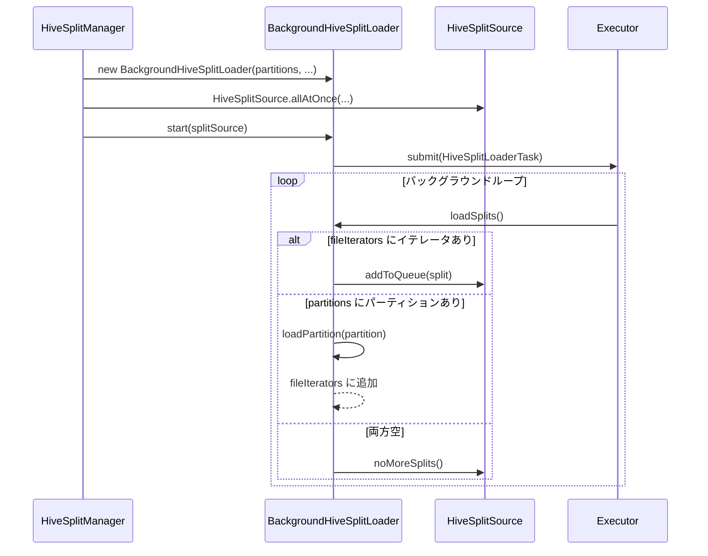
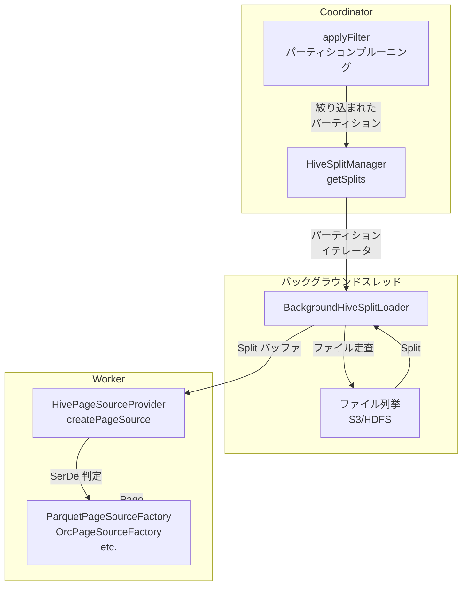

# 第21章 Hive Connector と Metastore

> **本章で読むソース**
>
> - [`plugin/trino-hive/src/main/java/io/trino/plugin/hive/HiveConnector.java`](https://github.com/trinodb/trino/blob/482/plugin/trino-hive/src/main/java/io/trino/plugin/hive/HiveConnector.java)
> - [`plugin/trino-hive/src/main/java/io/trino/plugin/hive/HiveConnectorFactory.java`](https://github.com/trinodb/trino/blob/482/plugin/trino-hive/src/main/java/io/trino/plugin/hive/HiveConnectorFactory.java)
> - [`plugin/trino-hive/src/main/java/io/trino/plugin/hive/HiveMetadata.java`](https://github.com/trinodb/trino/blob/482/plugin/trino-hive/src/main/java/io/trino/plugin/hive/HiveMetadata.java)
> - [`plugin/trino-hive/src/main/java/io/trino/plugin/hive/HiveSplitManager.java`](https://github.com/trinodb/trino/blob/482/plugin/trino-hive/src/main/java/io/trino/plugin/hive/HiveSplitManager.java)
> - [`plugin/trino-hive/src/main/java/io/trino/plugin/hive/HivePageSourceProvider.java`](https://github.com/trinodb/trino/blob/482/plugin/trino-hive/src/main/java/io/trino/plugin/hive/HivePageSourceProvider.java)
> - [`plugin/trino-hive/src/main/java/io/trino/plugin/hive/BackgroundHiveSplitLoader.java`](https://github.com/trinodb/trino/blob/482/plugin/trino-hive/src/main/java/io/trino/plugin/hive/BackgroundHiveSplitLoader.java)
> - [`plugin/trino-hive/src/main/java/io/trino/plugin/hive/HiveTableHandle.java`](https://github.com/trinodb/trino/blob/482/plugin/trino-hive/src/main/java/io/trino/plugin/hive/HiveTableHandle.java)
> - [`plugin/trino-hive/src/main/java/io/trino/plugin/hive/HiveColumnHandle.java`](https://github.com/trinodb/trino/blob/482/plugin/trino-hive/src/main/java/io/trino/plugin/hive/HiveColumnHandle.java)
> - [`plugin/trino-hive/src/main/java/io/trino/plugin/hive/HivePageSourceFactory.java`](https://github.com/trinodb/trino/blob/482/plugin/trino-hive/src/main/java/io/trino/plugin/hive/HivePageSourceFactory.java)
> - [`lib/trino-metastore/src/main/java/io/trino/metastore/HiveMetastore.java`](https://github.com/trinodb/trino/blob/482/lib/trino-metastore/src/main/java/io/trino/metastore/HiveMetastore.java)
> - [`lib/trino-metastore/src/main/java/io/trino/metastore/Table.java`](https://github.com/trinodb/trino/blob/482/lib/trino-metastore/src/main/java/io/trino/metastore/Table.java)
> - [`lib/trino-metastore/src/main/java/io/trino/metastore/Partition.java`](https://github.com/trinodb/trino/blob/482/lib/trino-metastore/src/main/java/io/trino/metastore/Partition.java)

## この章の狙い

Hive Connector は Trino が最初期から備える Connector であり、HDFS や S3 上の Parquet, ORC, CSV などのファイルを Hive Metastore のメタデータと組み合わせて読み書きする。
Connector SPI（第20章）の各インタフェースを Hive の世界にどう対応づけているかを、具体的なコードで確認する。

本章では、`HiveConnector` と `HiveConnectorFactory` による組み立てから始め、`HiveMetadata` によるメタデータ操作、`HiveSplitManager` と `BackgroundHiveSplitLoader` による Split 生成、`HivePageSourceProvider` によるファイルフォーマットの選択とデータ読み取りを順に読む。
あわせて、`HiveMetastore` インタフェースと `Table`, `Partition` モデルが Connector の各コンポーネントにどう組み込まれているかを確認する。

## 前提

- Connector SPI の全体像（`ConnectorFactory`, `Connector`, `ConnectorMetadata`, `ConnectorSplitManager`, `ConnectorPageSourceProvider`）を理解していること（第20章）。
- Split がデータ読み取りの並列単位であることを知っていること（第11章）。
- Page と Block のデータモデルを理解していること（第18章）。

## HiveConnector の構成と SPI の対応

### HiveConnectorFactory による Guice 組み立て

`HiveConnectorFactory` は `ConnectorFactory` SPI を実装する。
`create` メソッドで Guice の `Bootstrap` を使い、Hive Connector に必要なモジュール群をまとめて DI コンテナを構築する。

[`plugin/trino-hive/src/main/java/io/trino/plugin/hive/HiveConnectorFactory.java` L78-L86](https://github.com/trinodb/trino/blob/482/plugin/trino-hive/src/main/java/io/trino/plugin/hive/HiveConnectorFactory.java#L78-L86)

```java
    public static Connector createConnector(
            String catalogName,
            Map<String, String> config,
            ConnectorContext context,
            Supplier<Module> module,
            Optional<HiveMetastore> metastore,
            boolean metastoreImpersonationEnabled,
            Optional<TrinoFileSystemFactory> fileSystemFactory)
    {
```

`Bootstrap` に渡されるモジュールには、`HiveModule`（Connector の本体）、`HiveMetastoreModule`（Metastore 実装の選択）、`HiveSecurityModule`（アクセス制御）、`FileSystemModule`（ファイルシステム抽象化）、`HiveProcedureModule`（ストアドプロシージャ）などがある。

[`plugin/trino-hive/src/main/java/io/trino/plugin/hive/HiveConnectorFactory.java` L89-L105](https://github.com/trinodb/trino/blob/482/plugin/trino-hive/src/main/java/io/trino/plugin/hive/HiveConnectorFactory.java#L89-L105)

```java
            Bootstrap app = new Bootstrap(
                    "io.trino.bootstrap.catalog." + catalogName,
                    new MBeanModule(),
                    new ConnectorObjectNameGeneratorModule("io.trino.plugin.hive", "trino.plugin.hive"),
                    new JsonModule(),
                    new TypeDeserializerModule(),
                    new HiveModule(),
                    new HiveMetastoreModule(metastore, metastoreImpersonationEnabled),
                    new HiveSecurityModule(),
                    fileSystemFactory
                            .map(factory -> (Module) binder -> binder.bind(TrinoFileSystemFactory.class).toInstance(factory))
                            .orElseGet(() -> new FileSystemModule(catalogName, context, false)),
                    new HiveProcedureModule(),
                    new MBeanServerModule(),
                    new ConnectorContextModule(catalogName, context),
                    binder -> newSetBinder(binder, SessionPropertiesProvider.class).addBinding().to(HiveSessionProperties.class).in(Scopes.SINGLETON),
                    module.get());
```

DI コンテナから各 SPI 実装を取り出し、`ClassLoaderSafe` ラッパーで包んで `HiveConnector` に渡す。
`ClassLoaderSafe` ラッパーは、Plugin のクラスローダをスレッドコンテキストに設定してから実メソッドを呼ぶ。
Plugin が独自の依存ライブラリを持っていても、クラスロード時の `ClassNotFoundException` を防げる。

[`plugin/trino-hive/src/main/java/io/trino/plugin/hive/HiveConnectorFactory.java` L131-L149](https://github.com/trinodb/trino/blob/482/plugin/trino-hive/src/main/java/io/trino/plugin/hive/HiveConnectorFactory.java#L131-L149)

```java
            return new HiveConnector(
                    injector,
                    lifeCycleManager,
                    transactionManager,
                    new ClassLoaderSafeConnectorSplitManager(splitManager, classLoader),
                    new ClassLoaderSafeConnectorPageSourceProvider(connectorPageSource, classLoader),
                    new ClassLoaderSafeConnectorPageSinkProvider(pageSinkProvider, classLoader),
                    new ClassLoaderSafeNodePartitioningProvider(connectorDistributionProvider, classLoader),
                    procedures,
                    tableProcedures,
                    sessionPropertiesProviders,
                    HiveSchemaProperties.SCHEMA_PROPERTIES,
                    hiveTableProperties.getTableProperties(),
                    hiveViewProperties.getViewProperties(),
                    hiveColumnProperties.getColumnProperties(),
                    hiveAnalyzeProperties.getAnalyzeProperties(),
                    hiveAccessControl,
                    injector.getInstance(HiveConfig.class).isSingleStatementWritesOnly(),
                    classLoader);
```

### HiveConnector と SPI メソッドの対応

`HiveConnector` は `Connector` インタフェースを実装し、SPI の各メソッドに対して Guice で注入された実装を返す。

[`plugin/trino-hive/src/main/java/io/trino/plugin/hive/HiveConnector.java` L46-L48](https://github.com/trinodb/trino/blob/482/plugin/trino-hive/src/main/java/io/trino/plugin/hive/HiveConnector.java#L46-L48)

```java
public class HiveConnector
        implements Connector
{
```

主要な対応を以下にまとめる。

| SPI メソッド | 返却する実装 |
|---|---|
| `getMetadata` | `HiveMetadata`（`ClassLoaderSafeConnectorMetadata` で包む） |
| `getSplitManager` | `HiveSplitManager` |
| `getPageSourceProvider` | `HivePageSourceProvider` |
| `getPageSinkProvider` | `HivePageSinkProvider` |
| `beginTransaction` | `HiveTransactionHandle` を生成しトランザクション管理に登録 |

`getMetadata` はトランザクションごとに `HiveTransactionManager` から `HiveMetadata` を取得する。

[`plugin/trino-hive/src/main/java/io/trino/plugin/hive/HiveConnector.java` L113-L118](https://github.com/trinodb/trino/blob/482/plugin/trino-hive/src/main/java/io/trino/plugin/hive/HiveConnector.java#L113-L118)

```java
    public ConnectorMetadata getMetadata(ConnectorSession session, ConnectorTransactionHandle transaction)
    {
        ConnectorMetadata metadata = transactionManager.get(transaction, session.getIdentity());
        checkArgument(metadata != null, "no such transaction: %s", transaction);
        return new ClassLoaderSafeConnectorMetadata(metadata, classLoader);
    }
```

`beginTransaction` では `READ_UNCOMMITTED` 分離レベルのみをサポートする。
Hive のストレージは本質的にファイルベースであり、行レベルのロックを持たないため、この分離レベルが実態に合っている。

[`plugin/trino-hive/src/main/java/io/trino/plugin/hive/HiveConnector.java` L199-L205](https://github.com/trinodb/trino/blob/482/plugin/trino-hive/src/main/java/io/trino/plugin/hive/HiveConnector.java#L199-L205)

```java
    public ConnectorTransactionHandle beginTransaction(IsolationLevel isolationLevel, boolean readOnly, boolean autoCommit)
    {
        checkConnectorSupports(READ_UNCOMMITTED, isolationLevel);
        ConnectorTransactionHandle transaction = new HiveTransactionHandle(autoCommit);
        transactionManager.begin(transaction);
        return transaction;
    }
```

## HiveTableHandle と HiveColumnHandle

Connector SPI では、テーブルや列の情報を Handle オブジェクトとして Coordinator と Worker の間で受け渡す。
Hive Connector では `HiveTableHandle` と `HiveColumnHandle` がその役割を担う。

### HiveTableHandle の構造

**HiveTableHandle** は、テーブルの Schema 名、テーブル名に加え、フィルタの適用状態やパーティション情報を保持する。

[`plugin/trino-hive/src/main/java/io/trino/plugin/hive/HiveTableHandle.java` L43-L61](https://github.com/trinodb/trino/blob/482/plugin/trino-hive/src/main/java/io/trino/plugin/hive/HiveTableHandle.java#L43-L61)

```java
public class HiveTableHandle
        implements ConnectorTableHandle
{
    private final String schemaName;
    private final String tableName;
    private final Optional<Map<String, String>> tableParameters;
    private final List<HiveColumnHandle> partitionColumns;
    private final List<HiveColumnHandle> dataColumns;
    private final Optional<List<String>> partitionNames;
    private final Optional<List<HivePartition>> partitions;
    private final TupleDomain<HiveColumnHandle> compactEffectivePredicate;
    private final TupleDomain<ColumnHandle> enforcedConstraint;
    private final Optional<HiveTablePartitioning> tablePartitioning;
    private final Optional<HiveBucketFilter> bucketFilter;
    private final Optional<List<List<String>>> analyzePartitionValues;
    private final Set<HiveColumnHandle> constraintColumns;
    private final Set<HiveColumnHandle> projectedColumns;
    private final AcidTransaction transaction;
    private final boolean recordScannedFiles;
    private final Optional<Long> maxScannedFileSize;
```

この Handle はイミュータブルであり、`applyFilter` や `applyProjection` のたびに新しいインスタンスが `withXxx` メソッドで生成される。
`compactEffectivePredicate` はオプティマイザが押し下げたフィルタ条件を、`enforcedConstraint` は Connector 側で確実に適用済みの条件を保持する。
`partitionColumns` と `dataColumns` を分けて保持しているのは、パーティションキーが Metastore のメタデータだけから値を解決でき、ファイルを読む必要がないためである。

### HiveColumnHandle の構造

**HiveColumnHandle** は、列のベース名、Hive 型、Trino 型、列の種別（`REGULAR`, `PARTITION_KEY`, `SYNTHESIZED`）を持つ。

[`plugin/trino-hive/src/main/java/io/trino/plugin/hive/HiveColumnHandle.java` L84-L103](https://github.com/trinodb/trino/blob/482/plugin/trino-hive/src/main/java/io/trino/plugin/hive/HiveColumnHandle.java#L84-L103)

```java
    public enum ColumnType
    {
        PARTITION_KEY,
        REGULAR,
        SYNTHESIZED,
    }

    // Information about top level hive column
    private final String baseColumnName;
    private final int baseHiveColumnIndex;
    private final HiveType baseHiveType;
    private final Type baseType;
    private final Optional<String> comment;

    // Information about parts of the base column to be referenced by this column handle.
    private final Optional<HiveColumnProjectionInfo> hiveColumnProjectionInfo;

    private final String name;
    private final ColumnType columnType;
```

列の種別は3つある。

- **`REGULAR`**：データファイルから読み取る通常の列
- **`PARTITION_KEY`**：パーティションキー列（ファイルパスから値を解決する）
- **`SYNTHESIZED`**：`$path`, `$bucket`, `$file_size` などの仮想列

`hiveColumnProjectionInfo` は、構造体型のネストしたフィールドへのプロジェクション（`A.B.C` のようなデリファレンスチェーン）を表現する。
この仕組みにより、Parquet や ORC の列プロジェクションと組み合わせて、構造体の必要なフィールドだけを読み取れる。

## HiveMetadata によるメタデータ操作

**HiveMetadata** は `ConnectorMetadata` の Hive 実装であり、4000 行を超える大規模なクラスである。
テーブルの取得、列情報の取得、フィルタの適用（`applyFilter`）、プロジェクションの適用（`applyProjection`）、テーブルの作成と変更など、メタデータに関するあらゆる操作を担う。

### getTableHandle によるテーブル解決

`getTableHandle` は、Schema 名とテーブル名から `HiveTableHandle` を構築する。
内部で `SemiTransactionalHiveMetastore` にアクセスし、Metastore 上の `Table` オブジェクトを取得する。

[`plugin/trino-hive/src/main/java/io/trino/plugin/hive/HiveMetadata.java` L522-L568](https://github.com/trinodb/trino/blob/482/plugin/trino-hive/src/main/java/io/trino/plugin/hive/HiveMetadata.java#L522-L568)

```java
    public HiveTableHandle getTableHandle(ConnectorSession session, SchemaTableName tableName, Optional<ConnectorTableVersion> startVersion, Optional<ConnectorTableVersion> endVersion)
    {
        // ... (中略) ...
        Table table = metastore
                .getTable(tableName.getSchemaName(), tableName.getTableName())
                .orElse(null);

        if (table == null) {
            return null;
        }

        if (isSomeKindOfAView(table)) {
            return null;
        }
        if (isDeltaLakeTable(table)) {
            throw new TrinoException(UNSUPPORTED_TABLE_TYPE, format("Cannot query Delta Lake table '%s'", tableName));
        }
        if (isIcebergTable(table)) {
            throw new TrinoException(UNSUPPORTED_TABLE_TYPE, format("Cannot query Iceberg table '%s'", tableName));
        }
        // ... (中略) ...
        return new HiveTableHandle(
                tableName.getSchemaName(),
                tableName.getTableName(),
                table.getParameters(),
                getPartitionKeyColumnHandles(table, typeManager),
                getRegularColumnHandles(table, typeManager, getTimestampPrecision(session)),
                getHiveTablePartitioningForRead(session, table, typeManager));
    }
```

Metastore 上のテーブルが Delta Lake, Iceberg, Hudi のテーブルである場合は例外を投げ、Hive Connector では処理しない。
これらのフォーマットは専用の Connector が担当する。

### getColumnHandles による列情報の取得

`getColumnHandles` は、Metastore 上のテーブル定義からすべての列（パーティションキー列を含む）を `HiveColumnHandle` に変換し、名前をキーとする Map で返す。

[`plugin/trino-hive/src/main/java/io/trino/plugin/hive/HiveMetadata.java` L884-L891](https://github.com/trinodb/trino/blob/482/plugin/trino-hive/src/main/java/io/trino/plugin/hive/HiveMetadata.java#L884-L891)

```java
    public Map<String, ColumnHandle> getColumnHandles(ConnectorSession session, ConnectorTableHandle tableHandle)
    {
        SchemaTableName tableName = ((HiveTableHandle) tableHandle).getSchemaTableName();
        Table table = metastore.getTable(tableName.getSchemaName(), tableName.getTableName())
                .orElseThrow(() -> new TableNotFoundException(tableName));
        return hiveColumnHandles(table, typeManager, getTimestampPrecision(session)).stream()
                .collect(toImmutableMap(HiveColumnHandle::getName, identity()));
    }
```

### applyFilter によるパーティションプルーニング

`applyFilter` は、オプティマイザから渡された `Constraint` を `HivePartitionManager` に委譲し、パーティション列のフィルタを使ってパーティションを絞り込む。
結果として新しい `HiveTableHandle` を返し、絞り込めなかった述語を `unenforcedConstraint` として Trino 側に返す。

[`plugin/trino-hive/src/main/java/io/trino/plugin/hive/HiveMetadata.java` L3125-L3148](https://github.com/trinodb/trino/blob/482/plugin/trino-hive/src/main/java/io/trino/plugin/hive/HiveMetadata.java#L3125-L3148)

```java
    public Optional<ConstraintApplicationResult<ConnectorTableHandle>> applyFilter(ConnectorSession session, ConnectorTableHandle tableHandle, Constraint constraint)
    {
        HiveTableHandle handle = (HiveTableHandle) tableHandle;
        checkArgument(handle.getAnalyzePartitionValues().isEmpty() || constraint.getSummary().isAll(), "Analyze should not have a constraint");

        HivePartitionResult partitionResult = partitionManager.getPartitions(metastore, handle, constraint, session);
        HiveTableHandle newHandle = partitionManager.applyPartitionResult(handle, partitionResult, constraint, partitionResult.getPrepared());

        if (handle.getPartitions().equals(newHandle.getPartitions()) &&
                handle.getPartitionNames().equals(newHandle.getPartitionNames()) &&
                handle.getCompactEffectivePredicate().equals(newHandle.getCompactEffectivePredicate()) &&
                handle.getBucketFilter().equals(newHandle.getBucketFilter()) &&
                handle.getConstraintColumns().equals(newHandle.getConstraintColumns())) {
            return Optional.empty();
        }

        TupleDomain<ColumnHandle> unenforcedConstraint = partitionResult.getEffectivePredicate();
        if (newHandle.getPartitions().isPresent()) {
            List<HiveColumnHandle> partitionColumns = partitionResult.getPartitionColumns();
            unenforcedConstraint = partitionResult.getEffectivePredicate().filter((column, _) -> !partitionColumns.contains(column));
        }

        return Optional.of(new ConstraintApplicationResult<>(newHandle, unenforcedConstraint, constraint.getExpression(), false));
    }
```

パーティション列に対する条件が完全に Connector 側で評価できた場合、その条件は `unenforcedConstraint` から除外される。
Trino エンジンは返された `unenforcedConstraint` のぶんだけ実行時にフィルタリングすればよい。

## HiveSplitManager と BackgroundHiveSplitLoader

### HiveSplitManager による Split 生成の起動

**HiveSplitManager** は `ConnectorSplitManager` の実装であり、`getSplits` メソッドでクエリに必要な Split を生成する。
`getSplits` の処理は大きく3段階に分かれる。

1. Metastore からテーブルとパーティション情報を取得する
2. 各パーティションのメタデータ（Storage 情報、型の整合性検証）を準備する
3. `BackgroundHiveSplitLoader` を生成し、バックグラウンドでファイル列挙と Split 生成を開始する

[`plugin/trino-hive/src/main/java/io/trino/plugin/hive/HiveSplitManager.java` L196-L202](https://github.com/trinodb/trino/blob/482/plugin/trino-hive/src/main/java/io/trino/plugin/hive/HiveSplitManager.java#L196-L202)

```java
    public ConnectorSplitSource getSplits(
            ConnectorTransactionHandle transaction,
            ConnectorSession session,
            ConnectorTableHandle tableHandle,
            Set<ColumnHandle> dynamicFilterColumns,
            Constraint constraint)
    {
```

パーティションメタデータの取得では、バッチサイズを指数的に増加させる `partitionExponentially` を使って Metastore への問い合わせ回数を抑える。

[`plugin/trino-hive/src/main/java/io/trino/plugin/hive/HiveSplitManager.java` L336-L337](https://github.com/trinodb/trino/blob/482/plugin/trino-hive/src/main/java/io/trino/plugin/hive/HiveSplitManager.java#L336-L337)

```java
        Iterator<List<HivePartition>> partitionNameBatches = partitionExponentially(hivePartitions, minPartitionBatchSize, maxPartitionBatchSize);
        Iterator<List<HivePartitionMetadata>> partitionBatches = transform(partitionNameBatches, partitionBatch -> {
```

DynamicFilter が利用可能な場合、パーティションバッチの取得時点でフィルタを適用し、不要なパーティションのメタデータ取得を省く。

[`plugin/trino-hive/src/main/java/io/trino/plugin/hive/HiveSplitManager.java` L339-L345](https://github.com/trinodb/trino/blob/482/plugin/trino-hive/src/main/java/io/trino/plugin/hive/HiveSplitManager.java#L339-L345)

```java
            TupleDomain<ColumnHandle> currentDynamicFilter = dynamicFilterState.get(20, SECONDS).currentPredicate();
            if (!currentDynamicFilter.isAll()) {
                TupleDomain<ColumnHandle> partitionsFilter = currentDynamicFilter.intersect(tableHandle.getCompactEffectivePredicate());
                partitionBatch = partitionBatch.stream()
                        .filter(hivePartition -> partitionMatches(tableHandle.getPartitionColumns(), partitionsFilter, hivePartition))
                        .collect(toImmutableList());
            }
```

最後に `BackgroundHiveSplitLoader` を生成し、`HiveSplitSource` と結合してバックグラウンドスレッドで Split 生成を開始する。

[`plugin/trino-hive/src/main/java/io/trino/plugin/hive/HiveSplitManager.java` L264-L302](https://github.com/trinodb/trino/blob/482/plugin/trino-hive/src/main/java/io/trino/plugin/hive/HiveSplitManager.java#L264-L302)

```java
        HiveSplitLoader hiveSplitLoader = new BackgroundHiveSplitLoader(
                table,
                hivePartitions,
                hiveTable.getCompactEffectivePredicate(),
                constraint,
                typeManager,
                createBucketSplitInfo(tablePartitioning, bucketFilter),
                session,
                fileSystemFactory,
                transactionalMetadata.getDirectoryLister(),
                executor,
                splitLoaderConcurrency,
                recursiveDfsWalkerEnabled,
                !hiveTable.getPartitionColumns().isEmpty() && isIgnoreAbsentPartitions(session),
                // ... (中略) ...
                dynamicFilterState,
                evaluator);

        HiveSplitSource splitSource = HiveSplitSource.allAtOnce(
                session,
                table.getDatabaseName(),
                table.getTableName(),
                maxOutstandingSplits,
                maxOutstandingSplitsSize,
                maxSplitsPerSecond,
                hiveSplitLoader,
                executor,
                highMemorySplitSourceCounter,
                splitAffinityProvider,
                hiveTable.isRecordScannedFiles(),
                dynamicFilterState);
        hiveSplitLoader.start(splitSource);

        return splitSource;
```

### BackgroundHiveSplitLoader の非同期 Split 生成

**BackgroundHiveSplitLoader** は `HiveSplitLoader` の実装であり、バックグラウンドスレッドでパーティションディレクトリのファイルを列挙し、Split を生成する。

`start` メソッドで `HiveSplitSource` を受け取り、`addLoaderIfNecessary` でバックグラウンドタスクを投入する。

[`plugin/trino-hive/src/main/java/io/trino/plugin/hive/BackgroundHiveSplitLoader.java` L239-L243](https://github.com/trinodb/trino/blob/482/plugin/trino-hive/src/main/java/io/trino/plugin/hive/BackgroundHiveSplitLoader.java#L239-L243)

```java
    public void start(HiveSplitSource splitSource)
    {
        this.hiveSplitSource = splitSource;
        addLoaderIfNecessary();
    }
```

メインループは `loadSplits` メソッドにある。
まず `fileIterators` キューからファイルイテレータを取得し、残りがあればファイルから Split を生成する。
キューが空なら `partitions` キューからパーティションを取り出し、`loadPartition` でそのパーティションのファイル列挙を開始する。

[`plugin/trino-hive/src/main/java/io/trino/plugin/hive/BackgroundHiveSplitLoader.java` L346-L386](https://github.com/trinodb/trino/blob/482/plugin/trino-hive/src/main/java/io/trino/plugin/hive/BackgroundHiveSplitLoader.java#L346-L386)

```java
    private ListenableFuture<Void> loadSplits()
            throws IOException
    {
        if (!dynamicFilterState.isReady()) {
            return toListenableFuture(dynamicFilterState.isBlocked());
        }
        Iterator<InternalHiveSplit> splits = fileIterators.poll();
        if (splits == null) {
            HivePartitionMetadata partition = partitions.poll();
            if (partition == null) {
                return COMPLETED_FUTURE;
            }
            // ... (中略) ...
            return loadPartition(partition);
        }

        // ... (中略) ...
        while (splits.hasNext() && !stopped) {
            ListenableFuture<Void> future = hiveSplitSource.addToQueue(splits.next());
            if (!future.isDone()) {
                fileIterators.addFirst(splits);
                return future;
            }
        }

        // No need to put the iterator back, since it's either empty or we've stopped
        return COMPLETED_FUTURE;
    }
```

`hiveSplitSource.addToQueue` が返す `ListenableFuture` は、Split バッファが上限に達すると未完了になる。
その場合、ファイルイテレータをキューに戻してタスクを一時停止し、バッファに空きができたら再開する。
この仕組みにより、メモリ使用量を `maxOutstandingSplits` と `maxOutstandingSplitsSize` の範囲に収めつつ、Split 生成を並行して進められる。

`loadPartition` では、パーティションのストレージフォーマットを判定し、バケットテーブルかどうかでファイルの列挙方法を切り替える。

[`plugin/trino-hive/src/main/java/io/trino/plugin/hive/BackgroundHiveSplitLoader.java` L497-L511](https://github.com/trinodb/trino/blob/482/plugin/trino-hive/src/main/java/io/trino/plugin/hive/BackgroundHiveSplitLoader.java#L497-L511)

```java
        // Bucketed partitions are fully loaded immediately since all files must be loaded to determine the file to bucket mapping
        if (tableBucketInfo.isPresent()) {
            List<TrinoFileStatus> files = listBucketFiles(trinoFileSystem, location, splitFactory.getPartitionName());
            return hiveSplitSource.addToQueue(getBucketedSplits(files, splitFactory, tableBucketInfo.get(), bucketConversion, splittable, Optional.empty()));
        }

        fileIterators.addLast(createInternalHiveSplitIterator(trinoFileSystem, location, splitFactory, splittable, Optional.empty()));

        return COMPLETED_FUTURE;
```

バケットテーブルの場合はファイルからバケット番号へのマッピングが必要なため、全ファイルを即座にリストする。
非バケットテーブルの場合は遅延イテレータを `fileIterators` に追加し、次の `loadSplits` 呼び出しで段階的に処理する。

並行度は `loaderConcurrency` で制御される。
`addLoaderIfNecessary` は `activeLoaderCount` が上限未満のときだけ新しいタスクを投入する。



## HivePageSourceProvider によるデータ読み取り

**HivePageSourceProvider** は `ConnectorPageSourceProvider` の実装であり、Split ごとに適切なファイルフォーマットの Page ソースを生成する。

### フォーマット選択の仕組み

`HivePageSourceProvider` のコンストラクタは、Guice で注入された `HivePageSourceFactory` の Set を受け取る。

[`plugin/trino-hive/src/main/java/io/trino/plugin/hive/HivePageSourceProvider.java` L98-L104](https://github.com/trinodb/trino/blob/482/plugin/trino-hive/src/main/java/io/trino/plugin/hive/HivePageSourceProvider.java#L98-L104)

```java
    @Inject
    public HivePageSourceProvider(TypeManager typeManager, HiveConfig hiveConfig, Set<HivePageSourceFactory> pageSourceFactories)
    {
        this.typeManager = requireNonNull(typeManager, "typeManager is null");
        this.domainCompactionThreshold = hiveConfig.getDomainCompactionThreshold();
        this.pageSourceFactories = ImmutableSet.copyOf(requireNonNull(pageSourceFactories, "pageSourceFactories is null"));
    }
```

`HivePageSourceFactory` はフォーマットごとに実装が存在する。

| ファクトリクラス | 対応フォーマット |
|---|---|
| `ParquetPageSourceFactory` | Parquet |
| `OrcPageSourceFactory` | ORC |
| `RcFilePageSourceFactory` | RCFile |
| `AvroPageSourceFactory` | Avro |
| `LinePageSourceFactory` | CSV, JSON, テキスト等の行指向フォーマット |

`createPageSource` メソッドでは、Split のスキーマ情報（SerDe クラス名）に基づいて各ファクトリの `createPageSource` を順に試す。
いずれかのファクトリが `Optional.of(pageSource)` を返した時点でそのソースを採用する。

[`plugin/trino-hive/src/main/java/io/trino/plugin/hive/HivePageSourceProvider.java` L211-L239](https://github.com/trinodb/trino/blob/482/plugin/trino-hive/src/main/java/io/trino/plugin/hive/HivePageSourceProvider.java#L211-L239)

```java
        for (HivePageSourceFactory pageSourceFactory : pageSourceFactories) {
            List<HiveColumnHandle> desiredColumns = toColumnHandles(regularAndInterimColumnMappings, typeManager, coercionContext);

            Optional<ConnectorPageSource> pageSource = pageSourceFactory.createPageSource(
                    session,
                    path,
                    start,
                    length,
                    estimatedFileSize,
                    fileModifiedTime,
                    schema,
                    desiredColumns,
                    effectivePredicate,
                    acidInfo,
                    tableBucketNumber,
                    originalFile,
                    transaction,
                    memoryContext);

            if (pageSource.isPresent()) {
                return Optional.of(createHivePageSource(
                        columnMappings,
                        bucketAdaptation,
                        bucketValidator,
                        typeManager,
                        coercionContext,
                        pageSource.get()));
            }
        }
```

すべてのファクトリが空を返した場合は `HIVE_UNSUPPORTED_FORMAT` エラーとなる。

### ColumnMapping によるパーティション値の注入

`createPageSource` は、ファクトリから返されたページソースをそのまま返すのではなく、`ColumnMapping` のリストに基づいてカラムの変換を適用する。

[`plugin/trino-hive/src/main/java/io/trino/plugin/hive/HivePageSourceProvider.java` L130-L139](https://github.com/trinodb/trino/blob/482/plugin/trino-hive/src/main/java/io/trino/plugin/hive/HivePageSourceProvider.java#L130-L139)

```java
        List<ColumnMapping> columnMappings = ColumnMapping.buildColumnMappings(
                hiveSplit.getPartitionName(),
                hiveSplit.getPartitionKeys(),
                hiveColumns,
                hiveSplit.getBucketConversion().map(BucketConversion::bucketColumnHandles).orElse(ImmutableList.of()),
                hiveSplit.getHiveColumnCoercions(),
                hiveSplit.getPath(),
                hiveSplit.getTableBucketNumber(),
                hiveSplit.getEstimatedFileSize(),
                hiveSplit.getFileModifiedTime());
```

`ColumnMapping` には5つの種別がある。

- **`REGULAR`**：データファイルから読み取る列
- **`PREFILLED`**：パーティションキーや仮想列のように、ファイルを読まず値が確定する列
- **`INTERIM`**：バケット変換で一時的に必要な列（出力には含まれない）
- **`SYNTHESIZED`**：`$row_id` のような合成列
- **`EMPTY`**：パーティション間で型が変わり、現在のパーティションでは値が存在しない列（null で埋める）

パーティションキー列は `PREFILLED` として扱われるため、データファイルからは読み取られない。
パーティションの値はファイルパスから解決され、全行に同じ定数値が注入される。

DynamicFilter による Split 単位のプルーニングもここで行われる。
`shouldSkipSplit` は `PREFILLED` 列の値が DynamicFilter の条件を満たさない場合、Split 全体をスキップする。

[`plugin/trino-hive/src/main/java/io/trino/plugin/hive/HivePageSourceProvider.java` L309-L327](https://github.com/trinodb/trino/blob/482/plugin/trino-hive/src/main/java/io/trino/plugin/hive/HivePageSourceProvider.java#L309-L327)

```java
    private static boolean shouldSkipSplit(List<ColumnMapping> columnMappings, DynamicFilter dynamicFilter)
    {
        TupleDomain<ColumnHandle> predicate = dynamicFilter.getCurrentPredicate();
        if (predicate.isNone()) {
            return true;
        }
        Map<ColumnHandle, Domain> domains = predicate.getDomains().get();
        for (ColumnMapping columnMapping : columnMappings) {
            if (columnMapping.getKind() != PREFILLED) {
                continue;
            }
            Object value = columnMapping.getPrefilledValue().getValue();
            Domain allowedDomain = domains.get(columnMapping.getHiveColumnHandle());
            if (allowedDomain != null && !allowedDomain.includesNullableValue(value)) {
                return true;
            }
        }
        return false;
    }
```

## HiveMetastore インタフェースと Table, Partition モデル

### HiveMetastore インタフェース

**HiveMetastore** は `lib/trino-metastore` モジュールに定義されたインタフェースであり、Hive Metastore へのアクセスを抽象化する。

[`lib/trino-metastore/src/main/java/io/trino/metastore/HiveMetastore.java` L33-L34](https://github.com/trinodb/trino/blob/482/lib/trino-metastore/src/main/java/io/trino/metastore/HiveMetastore.java#L33-L34)

```java
public interface HiveMetastore
{
```

主要なメソッドは以下のとおりである。

- `getDatabase` / `getAllDatabases`：データベース（Schema に相当）の取得
- `getTable`：テーブルメタデータの取得
- `getPartitionNamesByFilter`：パーティション列へのフィルタ付きパーティション名一覧の取得
- `getPartitionsByNames`：パーティション名から `Partition` オブジェクトを一括取得

[`lib/trino-metastore/src/main/java/io/trino/metastore/HiveMetastore.java` L39-L40](https://github.com/trinodb/trino/blob/482/lib/trino-metastore/src/main/java/io/trino/metastore/HiveMetastore.java#L39-L40)

```java
    Optional<Table> getTable(String databaseName, String tableName);
```

[`lib/trino-metastore/src/main/java/io/trino/metastore/HiveMetastore.java` L121-L123](https://github.com/trinodb/trino/blob/482/lib/trino-metastore/src/main/java/io/trino/metastore/HiveMetastore.java#L121-L123)

```java
    Optional<List<String>> getPartitionNamesByFilter(String databaseName, String tableName, List<String> columnNames, TupleDomain<String> partitionKeysFilter);

    Map<String, Optional<Partition>> getPartitionsByNames(Table table, List<String> partitionNames);
```

`getPartitionNamesByFilter` が `TupleDomain<String>` を受け取るのは、Metastore 側でのサーバサイドフィルタリングを期待するためである。
Thrift Metastore の実装では、この条件を HMS の `get_partitions_by_filter` API に変換して送信する。

Hive Connector が直接触れるのは `SemiTransactionalHiveMetastore` であり、このクラスが `HiveMetastore` インタフェースをラップしてトランザクションのセマンティクス（コミット前の変更のバッファリング）を提供する。

### Table モデル

**Table** クラスはイミュータブルなデータモデルであり、テーブルの全メタデータを保持する。

[`lib/trino-metastore/src/main/java/io/trino/metastore/Table.java` L46-L59](https://github.com/trinodb/trino/blob/482/lib/trino-metastore/src/main/java/io/trino/metastore/Table.java#L46-L59)

```java
public class Table
{
    public static final String TABLE_COMMENT = "comment";

    private final String databaseName;
    private final String tableName;
    private final Optional<String> owner;
    private final String tableType; // This is not an enum because some Hive implementations define additional table types.
    private final List<Column> dataColumns;
    private final List<Column> partitionColumns;
    private final Storage storage;
    private final Map<String, String> parameters;
    private final Optional<String> viewOriginalText;
    private final Optional<String> viewExpandedText;
    private final OptionalLong writeId;
```

`dataColumns` はデータファイルに格納される列、`partitionColumns` はパーティションキーとなる列を保持する。
`storage` にはストレージフォーマット（SerDe, InputFormat）、ファイルの保存先、バケット情報が含まれる。
`parameters` にはテーブルのプロパティ（`transactional`, `trino_version`, `auto.purge` など）が格納される。

### Partition モデル

**Partition** クラスもイミュータブルであり、パーティションごとのメタデータを保持する。

[`lib/trino-metastore/src/main/java/io/trino/metastore/Partition.java` L34-L41](https://github.com/trinodb/trino/blob/482/lib/trino-metastore/src/main/java/io/trino/metastore/Partition.java#L34-L41)

```java
public class Partition
{
    private final String databaseName;
    private final String tableName;
    private final List<String> values;
    private final Storage storage;
    private final List<Column> columns;
    private final Map<String, String> parameters;
```

`values` がパーティションキーの値（テーブル定義の `partitionColumns` と同じ順序）を、`storage` がそのパーティション固有のストレージ情報（データの保存先、フォーマット）を保持する。
パーティションごとに異なるストレージフォーマットを持てるのは Hive の特徴であり、Hive Connector はこの違いを `HiveSplitManager` のメタデータ検証と `HivePageSourceProvider` のフォーマット選択で吸収する。

## 最適化の工夫：パーティションプルーニングと非同期 Split 生成

Hive Connector の読み取り性能を支える最適化は、パーティションプルーニングと非同期 Split 生成の2つである。

### パーティションプルーニング

パーティションテーブルでは、クエリの WHERE 句にパーティションキー列の条件があると、`applyFilter` の段階で不要なパーティションを Metastore レベルで除外する。
100万パーティションのテーブルであっても、`WHERE dt = '2024-01-01'` のような条件があれば、Metastore から取得するパーティション数自体を削減できる。

さらに、`HiveSplitManager` のパーティションバッチ取得時に DynamicFilter を適用することで、ジョイン相手のビルド側から伝播した値に基づくパーティションの絞り込みも行える。
これは静的なフィルタプッシュダウンでは不可能な、実行時に判明する値に基づくプルーニングである。

### 非同期 Split 生成

`BackgroundHiveSplitLoader` は、Split を生成するスレッドと Split を消費するスレッドを分離する。
`loaderConcurrency` 個のバックグラウンドタスクが並行してパーティションディレクトリを走査し、`HiveSplitSource` のバッファに Split を追加する。
バッファが上限に達するとタスクは `ListenableFuture` で一時停止し、消費側がバッファを消化すると再開する。

この設計により、ファイルシステムのメタデータ取得（S3 の ListObjects API 呼び出しなど）のレイテンシを Split の消費と重畳でき、Split 列挙がクエリ実行のボトルネックになることを防ぐ。



## まとめ

Hive Connector は、Connector SPI の各インタフェースに対して以下の実装を提供する。

- `HiveConnectorFactory` が Guice で DI コンテナを構築し、`HiveConnector` を組み立てる。
- `HiveMetadata` がテーブル解決、列情報の取得、フィルタの適用を Metastore と連携して行う。パーティション列へのフィルタは Connector 側で評価し、不要なパーティションを除外する。
- `HiveSplitManager` がパーティション情報を取得し、`BackgroundHiveSplitLoader` がバックグラウンドで Split を非同期に生成する。
- `HivePageSourceProvider` が Split のスキーマ情報に基づいて適切な `HivePageSourceFactory`（Parquet, ORC, CSV など）を選択し、データを Page として読み出す。
- `HiveMetastore` インタフェースが Metastore へのアクセスを抽象化し、`Table` と `Partition` のイミュータブルなモデルでメタデータを表現する。

## 関連する章

- 第20章 Connector SPI の設計：`ConnectorFactory`, `Connector`, `ConnectorMetadata` など、本章の Hive 実装が準拠する SPI の全体像
- 第11章 Split とデータソース：Split がクエリ実行でどう分配されるか
- 第18章 Page と Block のデータモデル：`HivePageSourceProvider` が生成する Page の内部構造
