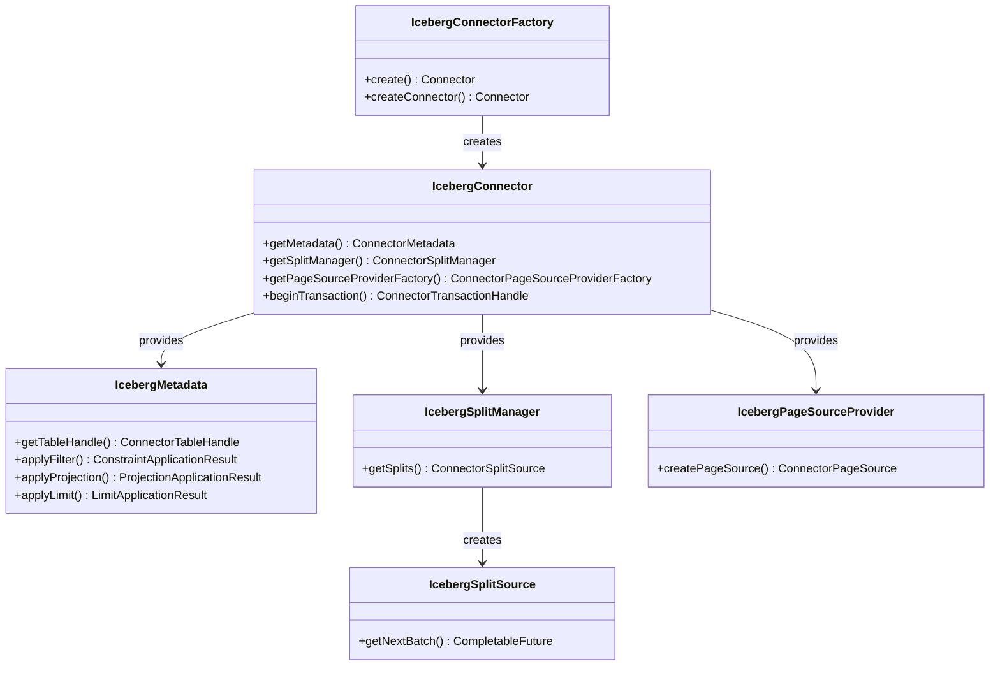
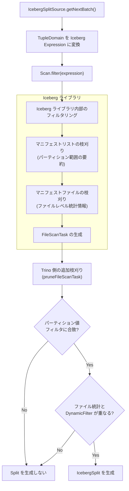

# 第22章 Iceberg Connector

> **本章で読むソース**
>
> - [`plugin/trino-iceberg/src/main/java/io/trino/plugin/iceberg/IcebergConnector.java`](https://github.com/trinodb/trino/blob/482/plugin/trino-iceberg/src/main/java/io/trino/plugin/iceberg/IcebergConnector.java)
> - [`plugin/trino-iceberg/src/main/java/io/trino/plugin/iceberg/IcebergConnectorFactory.java`](https://github.com/trinodb/trino/blob/482/plugin/trino-iceberg/src/main/java/io/trino/plugin/iceberg/IcebergConnectorFactory.java)
> - [`plugin/trino-iceberg/src/main/java/io/trino/plugin/iceberg/IcebergMetadata.java`](https://github.com/trinodb/trino/blob/482/plugin/trino-iceberg/src/main/java/io/trino/plugin/iceberg/IcebergMetadata.java)
> - [`plugin/trino-iceberg/src/main/java/io/trino/plugin/iceberg/IcebergSplitManager.java`](https://github.com/trinodb/trino/blob/482/plugin/trino-iceberg/src/main/java/io/trino/plugin/iceberg/IcebergSplitManager.java)
> - [`plugin/trino-iceberg/src/main/java/io/trino/plugin/iceberg/IcebergSplitSource.java`](https://github.com/trinodb/trino/blob/482/plugin/trino-iceberg/src/main/java/io/trino/plugin/iceberg/IcebergSplitSource.java)
> - [`plugin/trino-iceberg/src/main/java/io/trino/plugin/iceberg/IcebergPageSourceProvider.java`](https://github.com/trinodb/trino/blob/482/plugin/trino-iceberg/src/main/java/io/trino/plugin/iceberg/IcebergPageSourceProvider.java)
> - [`plugin/trino-iceberg/src/main/java/io/trino/plugin/iceberg/IcebergTableHandle.java`](https://github.com/trinodb/trino/blob/482/plugin/trino-iceberg/src/main/java/io/trino/plugin/iceberg/IcebergTableHandle.java)
> - [`plugin/trino-iceberg/src/main/java/io/trino/plugin/iceberg/IcebergColumnHandle.java`](https://github.com/trinodb/trino/blob/482/plugin/trino-iceberg/src/main/java/io/trino/plugin/iceberg/IcebergColumnHandle.java)
> - [`plugin/trino-iceberg/src/main/java/io/trino/plugin/iceberg/ExpressionConverter.java`](https://github.com/trinodb/trino/blob/482/plugin/trino-iceberg/src/main/java/io/trino/plugin/iceberg/ExpressionConverter.java)

## この章の狙い

Apache Iceberg は、大規模データレイク向けのオープンテーブルフォーマットである[^1]。
スナップショットによるトランザクション分離、隠しパーティショニング、スキーマ進化といった機能を提供し、Hive テーブルフォーマットの制約を克服する。

Trino の **Iceberg Connector** は、この Iceberg テーブルフォーマットを Trino のクエリエンジンに接続する。
本章では、Connector の SPI 実装を構成する主要クラスを読み、クエリの計画から実行までのデータの流れを追う。
とくに、Iceberg のメタデータ階層（マニフェストリスト、マニフェストファイル、データファイル）を活用したフィルタリングが、Split 生成の段階で不要なファイルをどのように除外するかに注目する。

## 前提

- Trino の Connector SPI（`ConnectorMetadata`, `ConnectorSplitManager`, `ConnectorPageSourceProvider`）の役割を知っていること。
- Split がデータ読み取りの並列単位であることを理解していること（第12章）。
- Page と Block のデータモデルを知っていること（第18章）。
- Apache Iceberg のテーブルフォーマット（スナップショット、マニフェストリスト、マニフェストファイル、データファイル）の基本構造に馴染みがあること。

## IcebergConnector の全体構成

`IcebergConnectorFactory` が Catalog 名と設定を受け取り、Guice の `Bootstrap` で依存関係を組み立てて `IcebergConnector` のインスタンスを返す。

[`plugin/trino-iceberg/src/main/java/io/trino/plugin/iceberg/IcebergConnectorFactory.java` L59-L93](https://github.com/trinodb/trino/blob/482/plugin/trino-iceberg/src/main/java/io/trino/plugin/iceberg/IcebergConnectorFactory.java#L59-L93)

```java
    public static Connector createConnector(
            String catalogName,
            Map<String, String> config,
            ConnectorContext context,
            Module module,
            Optional<Module> icebergCatalogModule)
    {
        ClassLoader classLoader = IcebergConnectorFactory.class.getClassLoader();
        try (ThreadContextClassLoader _ = new ThreadContextClassLoader(classLoader)) {
            Bootstrap app = new Bootstrap(
                    "io.trino.bootstrap.catalog." + catalogName,
                    new MBeanModule(),
                    new ConnectorObjectNameGeneratorModule("io.trino.plugin.iceberg", "trino.plugin.iceberg"),
                    new JsonModule(),
                    new IcebergModule(),
                    new IcebergSecurityModule(),
                    icebergCatalogModule.orElse(new IcebergCatalogModule()),
                    // ... (中略) ...
                    module);

            Injector injector = app
                    .doNotInitializeLogging()
                    .disableSystemProperties()
                    .setRequiredConfigurationProperties(config)
                    .initialize();

            // ... (中略) ...
            return injector.getInstance(IcebergConnector.class);
        }
    }
```

`IcebergModule` が Connector の中核となるバインディング（`IcebergMetadata`, `IcebergSplitManager`, `IcebergPageSourceProvider` など）を定義し、`IcebergCatalogModule` が Iceberg カタログの種類（Hive Metastore, Glue, REST, Nessie など）に応じた実装を差し替える。

`IcebergConnector` 自体は SPI の `Connector` インターフェースを実装し、各コンポーネントへのアクセサを提供する。

[`plugin/trino-iceberg/src/main/java/io/trino/plugin/iceberg/IcebergConnector.java` L60-L62](https://github.com/trinodb/trino/blob/482/plugin/trino-iceberg/src/main/java/io/trino/plugin/iceberg/IcebergConnector.java#L60-L62)

```java
public class IcebergConnector
        implements Connector
{
```

トランザクション分離レベルは `SERIALIZABLE` をサポートする。
`beginTransaction` では `HiveTransactionHandle` を生成し、`IcebergTransactionManager` にトランザクションを登録する。

[`plugin/trino-iceberg/src/main/java/io/trino/plugin/iceberg/IcebergConnector.java` L247-L253](https://github.com/trinodb/trino/blob/482/plugin/trino-iceberg/src/main/java/io/trino/plugin/iceberg/IcebergConnector.java#L247-L253)

```java
    public ConnectorTransactionHandle beginTransaction(IsolationLevel isolationLevel, boolean readOnly, boolean autoCommit)
    {
        checkConnectorSupports(SERIALIZABLE, isolationLevel);
        ConnectorTransactionHandle transaction = new HiveTransactionHandle(autoCommit);
        transactionManager.begin(transaction);
        return transaction;
    }
```

以下の Mermaid 図に、Iceberg Connector を構成する主要クラスの関係を示す。



## IcebergTableHandle と IcebergColumnHandle

Trino の Connector SPI は、テーブルや列の情報を **Handle** という不透明なオブジェクトで Coordinator と Worker の間をやり取りする。
Handle は JSON でシリアライズされ、Split とともに Worker へ送られる。

### IcebergTableHandle の構造

`IcebergTableHandle` は、Iceberg テーブルのメタデータとクエリ固有の情報を1つのオブジェクトにまとめる。

[`plugin/trino-iceberg/src/main/java/io/trino/plugin/iceberg/IcebergTableHandle.java` L39-L78](https://github.com/trinodb/trino/blob/482/plugin/trino-iceberg/src/main/java/io/trino/plugin/iceberg/IcebergTableHandle.java#L39-L78)

```java
public class IcebergTableHandle
        implements ConnectorTableHandle
{
    private final String schemaName;
    private final String tableName;
    private final TableType tableType;
    private final OptionalLong snapshotId;
    private final String tableSchemaJson;
    // ... (中略) ...

    // Filter used during split generation and table scan, but not required to be strictly enforced by Iceberg Connector
    private final TupleDomain<IcebergColumnHandle> unenforcedPredicate;

    // Filter guaranteed to be enforced by Iceberg connector
    private final TupleDomain<IcebergColumnHandle> enforcedPredicate;

    // Columns that are present in {@link Constraint#getExpression()} applied on the table scan
    private final Set<IcebergColumnHandle> constraintColumns;

    // semantically limit is applied after enforcedPredicate
    private final OptionalLong limit;

    private final Set<IcebergColumnHandle> projectedColumns;
    private final Optional<String> nameMappingJson;
```

注目すべきフィールドは次の3つである。

- **`snapshotId`**：読み取り対象のスナップショット ID。Iceberg のスナップショット分離を Trino 側で実現する。テーブルにスナップショットがない（空テーブル）場合は `OptionalLong.empty()` になる。
- **`enforcedPredicate`**：Connector が保証するフィルタ。パーティション列やメタデータ列（`$path`, `$file_modified_time`）への制約が該当する。このフィルタに合致しない行は Split 生成段階で確実に除外される。
- **`unenforcedPredicate`**：Connector が最善努力で適用するフィルタ。データ列への制約が該当する。Iceberg のファイルレベル統計情報で Split を枝刈りするが、行レベルの完全な保証はしない。エンジン側に残余フィルタ（remaining predicate）として返され、TableScan の上に FilterNode が残る。

### IcebergColumnHandle の構造

`IcebergColumnHandle` は、Iceberg のフィールド ID ベースの列識別を Trino の `ColumnHandle` SPI にマッピングする。

[`plugin/trino-iceberg/src/main/java/io/trino/plugin/iceberg/IcebergColumnHandle.java` L43-L74](https://github.com/trinodb/trino/blob/482/plugin/trino-iceberg/src/main/java/io/trino/plugin/iceberg/IcebergColumnHandle.java#L43-L74)

```java
public class IcebergColumnHandle
        implements ColumnHandle
{
    // ... (中略) ...
    private final ColumnIdentity baseColumnIdentity;
    private final Type baseType;
    // The list of field ids to indicate the projected part of the top-level column represented by baseColumnIdentity
    private final List<Integer> path;
    private final Type type;
    private final boolean nullable;
    private final Optional<String> comment;
    // Cache of ColumnIdentity#getId to ensure quick access, even with dereferences
    private final int id;
```

`baseColumnIdentity` がトップレベル列を識別し、`path` がネストされたフィールドへの参照チェーンを表す。
たとえば `address.city` という列を参照する場合、`baseColumnIdentity` は `address` 列を指し、`path` には `city` フィールドの ID が格納される。
この設計により、Iceberg のスキーマ進化（列の追加や名前変更）に対して、名前ではなくフィールド ID で安定した列の識別が可能になる。

メタデータ列（`$path`, `$file_modified_time`, `$partition` など）は、Iceberg の予約 ID 空間とは別の ID を持つ。
`isMetadataColumnId` メソッドでデータ列と区別される。

## IcebergMetadata のフィルタ適用

`IcebergMetadata` は `ConnectorMetadata` を実装し、テーブルハンドルの取得やフィルタの適用など、Coordinator 側のメタデータ操作を担う。

### getTableHandle によるテーブルハンドル取得

`getTableHandle` は、テーブル名からカタログ経由で Iceberg テーブルをロードし、`IcebergTableHandle` を構築する。

[`plugin/trino-iceberg/src/main/java/io/trino/plugin/iceberg/IcebergMetadata.java` L663-L723](https://github.com/trinodb/trino/blob/482/plugin/trino-iceberg/src/main/java/io/trino/plugin/iceberg/IcebergMetadata.java#L663-L723)

```java
    public ConnectorTableHandle getTableHandle(
            ConnectorSession session,
            SchemaTableName tableName,
            Optional<ConnectorTableVersion> startVersion,
            Optional<ConnectorTableVersion> endVersion)
    {
        // ... (中略) ...
        BaseTable table;
        try {
            table = catalog.loadTable(session, new SchemaTableName(tableName.getSchemaName(), tableName.getTableName()));
        }
        catch (TableNotFoundException e) {
            return null;
        }
        // ... (中略) ...
        if (endVersion.isPresent()) {
            long snapshotId = getSnapshotIdFromVersion(session, table, endVersion.get());
            return tableHandleForSnapshot(
                    session,
                    tableName,
                    table,
                    OptionalLong.of(snapshotId),
                    schemaFor(table, snapshotId),
                    Optional.empty());
        }
        return tableHandleForCurrentSnapshot(session, tableName, table);
    }
```

`endVersion` が指定されている場合はタイムトラベルクエリとして、指定されたスナップショット時点のスキーマとデータを読む。
指定がなければ、最新スナップショットの `IcebergTableHandle` を返す。

### applyFilter による述語の分類

オプティマイザが `applyFilter` を呼び出すと、`IcebergMetadata` は述語を3つのカテゴリに分類する。

[`plugin/trino-iceberg/src/main/java/io/trino/plugin/iceberg/IcebergMetadata.java` L3618-L3716](https://github.com/trinodb/trino/blob/482/plugin/trino-iceberg/src/main/java/io/trino/plugin/iceberg/IcebergMetadata.java#L3618-L3716)

```java
    public Optional<ConstraintApplicationResult<ConnectorTableHandle>> applyFilter(ConnectorSession session, ConnectorTableHandle handle, Constraint constraint)
    {
        IcebergTableHandle table = (IcebergTableHandle) handle;
        UtcConstraintExtractor.ExtractionResult extractionResult = extractTupleDomain(constraint);
        TupleDomain<IcebergColumnHandle> predicate = extractionResult.tupleDomain()
                .transformKeys(IcebergColumnHandle.class::cast);
        // ... (中略) ...
            domains.forEach((columnHandle, domain) -> {
                if (!isConvertibleToIcebergExpression(domain)) {
                    unsupported.put(columnHandle, domain);
                }
                else if (canEnforceColumnConstraintInSpecs(typeManager.getTypeOperators(), icebergTable, partitionSpecIds, columnHandle, domain)) {
                    newEnforced.put(columnHandle, domain);
                }
                else if (isMetadataColumnId(columnHandle.getId())) {
                    if (columnHandle.isPartitionColumn() || columnHandle.isPathColumn() || columnHandle.isFileModifiedTimeColumn()) {
                        newEnforced.put(columnHandle, domain);
                    }
                    else {
                        unsupported.put(columnHandle, domain);
                    }
                }
                else {
                    newUnenforced.put(columnHandle, domain);
                }
            });
```

分類のロジックは以下のとおりである。

1. **enforced**（Connector 保証）：パーティション列への制約、メタデータ列（`$path`, `$file_modified_time`, `$partition`）への制約。Iceberg のパーティション仕様で制約を完全に評価できる場合、Split 生成段階でファイルを正確に除外できる。
2. **unenforced**（最善努力）：通常のデータ列への制約。Iceberg ライブラリのマニフェストフィルタリングやファイルレベル統計情報で枝刈りに利用されるが、行単位の保証はできない。
3. **unsupported**：構造型（ARRAY, MAP, ROW）やジオスパーシャル型など、Iceberg の Expression に変換できない制約。Connector 側では適用せず、エンジンのフィルタに任せる。

この3分類の結果は `IcebergTableHandle` の `enforcedPredicate` と `unenforcedPredicate` に格納され、Split 生成フェーズへ引き継がれる。

### applyLimit による LIMIT プッシュダウン

`applyLimit` は、`unenforcedPredicate` が `ALL`（残余フィルタなし）の場合に限り、LIMIT 値を Handle に記録する。

[`plugin/trino-iceberg/src/main/java/io/trino/plugin/iceberg/IcebergMetadata.java` L3581-L3615](https://github.com/trinodb/trino/blob/482/plugin/trino-iceberg/src/main/java/io/trino/plugin/iceberg/IcebergMetadata.java#L3581-L3615)

```java
    public Optional<LimitApplicationResult<ConnectorTableHandle>> applyLimit(ConnectorSession session, ConnectorTableHandle handle, long limit)
    {
        IcebergTableHandle table = (IcebergTableHandle) handle;

        if (table.getLimit().isPresent() && table.getLimit().getAsLong() <= limit) {
            return Optional.empty();
        }
        if (!table.getUnenforcedPredicate().isAll()) {
            return Optional.empty();
        }
        // ... (中略) ...
        return Optional.of(new LimitApplicationResult<>(table, false, false));
    }
```

残余フィルタがある場合に LIMIT を適用すると、フィルタで除外されるはずの行を数えてしまい、結果が不正確になる。
そのため、残余フィルタがない場合にのみ LIMIT をプッシュダウンする。
`IcebergSplitSource` はこの limit 値を参照し、出力行数の下限が LIMIT に達した時点で Split 生成を打ち切る。

## ExpressionConverter による述語変換

`ExpressionConverter` は、Trino の `TupleDomain` を Iceberg の `Expression` に変換するユーティリティクラスである。
Split 生成の直前に呼ばれ、変換結果が Iceberg ライブラリの `TableScan.filter()` に渡される。

[`plugin/trino-iceberg/src/main/java/io/trino/plugin/iceberg/ExpressionConverter.java` L115-L133](https://github.com/trinodb/trino/blob/482/plugin/trino-iceberg/src/main/java/io/trino/plugin/iceberg/ExpressionConverter.java#L115-L133)

```java
    public static Expression toIcebergExpression(TupleDomain<IcebergColumnHandle> tupleDomain)
    {
        if (tupleDomain.isAll()) {
            return alwaysTrue();
        }
        if (tupleDomain.isNone()) {
            return alwaysFalse();
        }
        Map<IcebergColumnHandle, Domain> domainMap = tupleDomain.getDomains().get();
        List<Expression> conjuncts = new ArrayList<>();
        for (Entry<IcebergColumnHandle, Domain> entry : domainMap.entrySet()) {
            IcebergColumnHandle columnHandle = entry.getKey();
            checkArgument(!isMetadataColumnId(columnHandle.getId()), "Constraint on an unexpected column %s", columnHandle);
            Domain domain = entry.getValue();
            checkArgument(isConvertibleToIcebergExpression(domain), "Unexpected not convertible domain on column %s: %s", columnHandle, domain);
            conjuncts.add(toIcebergExpression(columnHandle.getQualifiedName(), columnHandle.getType(), domain));
        }
        return and(conjuncts);
    }
```

各列の `Domain` は、単一値の場合は `equal` や `in`、範囲の場合は `greaterThan`/`lessThan` の組み合わせに変換される。
NULL 許容の場合は `isNull` を OR で加える。

変換できない型はあらかじめ `isConvertibleToIcebergExpression` で除外される。

[`plugin/trino-iceberg/src/main/java/io/trino/plugin/iceberg/ExpressionConverter.java` L90-L113](https://github.com/trinodb/trino/blob/482/plugin/trino-iceberg/src/main/java/io/trino/plugin/iceberg/ExpressionConverter.java#L90-L113)

```java
    public static boolean isConvertibleToIcebergExpression(Domain domain)
    {
        if (isStructuralType(domain.getType())) {
            // structural types cannot be used to filter a table scan in Iceberg library.
            return false;
        }

        if (domain.getType() == VARIANT) {
            // Iceberg does not support filtering on VARIANT type, but simple checks always work
            return domain.isOnlyNull() || domain.getValues().isAll();
        }

        // Geometry and Geography types are not supported for predicate pushdown in Iceberg
        if (isGeospatialType(domain.getType())) {
            return false;
        }

        if (domain.getType() == UUID) {
            // Iceberg orders UUID values differently than Trino (perhaps due to https://bugs.openjdk.org/browse/JDK-7025832), so allow only IS NULL / IS NOT NULL checks
            return domain.isOnlyNull() || domain.getValues().isAll();
        }

        return true;
    }
```

構造型、ジオスパーシャル型、VARIANT 型、UUID 型の範囲比較は Iceberg 側に渡さない。
UUID については、Trino と Iceberg でソート順が異なる可能性があるため、IS NULL / IS NOT NULL のみ許可している。

変換された `Expression` は複数の conjunct（AND 条件）を平衡二分木として組み立てる。
これにより、深い左再帰の木と比較して Iceberg ライブラリが式を評価する際のスタック深度を抑えている。

[`plugin/trino-iceberg/src/main/java/io/trino/plugin/iceberg/ExpressionConverter.java` L245-L294](https://github.com/trinodb/trino/blob/482/plugin/trino-iceberg/src/main/java/io/trino/plugin/iceberg/ExpressionConverter.java#L245-L294)

```java
    private static Expression combine(List<Expression> expressions, BiFunction<Expression, Expression, Expression> combiner)
    {
        // Build balanced tree that preserves the evaluation order of the input expressions.
        // ... (中略) ...
        Queue<Expression> queue = new ArrayDeque<>(expressions);
        while (queue.size() > 1) {
            Queue<Expression> buffer = new ArrayDeque<>();

            // combine pairs of elements
            while (queue.size() >= 2) {
                buffer.add(combiner.apply(queue.remove(), queue.remove()));
            }

            // if there's and odd number of elements, just append the last one
            if (!queue.isEmpty()) {
                buffer.add(queue.remove());
            }

            // continue processing the pairs that were just built
            queue = buffer;
        }

        return queue.remove();
    }
```

## IcebergSplitManager と IcebergSplitSource

Split 生成は、`IcebergSplitManager` が `IcebergSplitSource` を作成し、`IcebergSplitSource` が Iceberg ライブラリのテーブルスキャン API を通じてデータファイルを列挙するという2段階で行われる。

### IcebergSplitManager の getSplits

`IcebergSplitManager.getSplits` は、テーブルハンドルから Iceberg の `Table` オブジェクトを取得し、`Scan` を構築して `IcebergSplitSource` に渡す。

[`plugin/trino-iceberg/src/main/java/io/trino/plugin/iceberg/IcebergSplitManager.java` L88-L127](https://github.com/trinodb/trino/blob/482/plugin/trino-iceberg/src/main/java/io/trino/plugin/iceberg/IcebergSplitManager.java#L88-L127)

```java
    public ConnectorSplitSource getSplits(
            ConnectorTransactionHandle transaction,
            ConnectorSession session,
            ConnectorTableHandle handle,
            Set<ColumnHandle> dynamicFilterColumns,
            Constraint constraint)
    {
        IcebergTableHandle table = (IcebergTableHandle) handle;

        if (table.getSnapshotId().isEmpty()) {
            if (table.isRecordScannedFiles()) {
                return new FixedSplitSource(ImmutableList.of(), ImmutableList.of());
            }
            return emptySplitSource();
        }

        IcebergMetadata icebergMetadata = transactionManager.get(transaction, session.getIdentity());
        Table icebergTable = icebergMetadata.getIcebergTable(session, table.getSchemaTableName());
        InMemoryMetricsReporter metricsReporter = new InMemoryMetricsReporter();
        Scan scan = getScan(icebergMetadata, icebergTable, table, metricsReporter, icebergPlanningExecutor);

        IcebergSplitSource splitSource = new IcebergSplitSource(
                fileSystemFactory,
                session,
                table,
                icebergTable,
                scan,
                table.getMaxScannedFileSize(),
                constraint,
                typeManager,
                table.isRecordScannedFiles(),
                getMinimumAssignedSplitWeight(session),
                splitAffinityProvider,
                metricsReporter,
                splitSourceExecutor,
                dynamicFilterColumns,
                evaluator);

        return new ClassLoaderSafeConnectorSplitSource(splitSource, IcebergSplitManager.class.getClassLoader());
    }
```

スナップショット ID が空（テーブルにデータがない）場合は空の Split ソースを即座に返す。
`getScan` メソッドでは、マテリアライズドビューの増分リフレッシュのために `newIncrementalAppendScan` を使うパスもある。
通常のクエリでは `newScan().useSnapshot(snapshotId)` で特定スナップショットのスキャンを構築し、射影列を指定する。

[`plugin/trino-iceberg/src/main/java/io/trino/plugin/iceberg/IcebergSplitManager.java` L129-L165](https://github.com/trinodb/trino/blob/482/plugin/trino-iceberg/src/main/java/io/trino/plugin/iceberg/IcebergSplitManager.java#L129-L165)

```java
    private Scan<?, FileScanTask, CombinedScanTask> getScan(IcebergMetadata icebergMetadata, Table icebergTable, IcebergTableHandle table, MetricsReporter metricsReporter, ExecutorService executor)
    {
        // ... (中略) ...
        Schema schema = schemaFor(icebergTable, table.getSnapshotId().getAsLong());
        Set<Integer> projectedIds = table.getProjectedColumns().stream()
                .map(IcebergColumnHandle::getId)
                .filter(id -> schema.findField(id) != null) // Newly added column may not be found in current snapshot schema until new files are added
                .collect(toImmutableSet());

        return icebergTable.newScan()
                .useSnapshot(table.getSnapshotId().getAsLong())
                .project(TypeUtil.select(schema, projectedIds)) // Using Scan.project method because Scan.select throws an exception for nested variant
                .planWith(executor)
                .metricsReporter(metricsReporter);
    }
```

### IcebergSplitSource のフィルタリングパイプライン

`IcebergSplitSource` は `ConnectorSplitSource` を実装し、`getNextBatch` でバッチごとに Split を生成する。
最初のバッチ呼び出し時に、DynamicFilter の述語と `enforcedPredicate`, `unenforcedPredicate` を結合して Iceberg の `Expression` に変換し、`Scan.filter()` に渡す。

[`plugin/trino-iceberg/src/main/java/io/trino/plugin/iceberg/IcebergSplitSource.java` L265-L310](https://github.com/trinodb/trino/blob/482/plugin/trino-iceberg/src/main/java/io/trino/plugin/iceberg/IcebergSplitSource.java#L265-L310)

```java
    private synchronized List<ConnectorSplit> getNextBatchInternal(int maxSize, DynamicFilterSnapshot dynamicFilterSnapshot)
    {
        TupleDomain<IcebergColumnHandle> dynamicFilterPredicate = dynamicFilterSnapshot.currentPredicate()
                .transformKeys(IcebergColumnHandle.class::cast);

        if (fileScanIterable == null) {
            this.pushedDownDynamicFilterPredicate = dynamicFilterPredicate
                    .filter((columnHandle, domain) -> isConvertibleToIcebergExpression(domain) && !isMetadataColumnId(columnHandle.getId()));

            TupleDomain<IcebergColumnHandle> effectivePredicate = TupleDomain.intersect(
                    ImmutableList.of(dataColumnPredicate, tableHandle.getUnenforcedPredicate(), pushedDownDynamicFilterPredicate));

            if (effectivePredicate.isNone()) {
                finish();
                return ImmutableList.of();
            }

            Expression filterExpression = toIcebergExpression(effectivePredicate);
            Scan scan = (Scan) tableScan.filter(filterExpression);
            // Use stats to populate fileStatisticsDomain if there are predicated columns. Otherwise, skip them.
            if (!predicatedColumnIds.isEmpty()) {
                Schema schema = tableScan.schema();
                scan = (Scan) scan.includeColumnStats(
                        predicatedColumnIds.stream()
                                .map(schema::findColumnName)
                                .filter(Objects::nonNull)
                                .collect(toImmutableList()));
            }
            // ... (中略) ...
        }
```

Iceberg ライブラリの `Scan.filter()` に `Expression` を渡すと、ライブラリ内部で以下の多段フィルタリングが行われる。

1. **マニフェストリストのフィルタリング**：マニフェストファイルに記録されたパーティション範囲の要約（partition summary）とフィルタ式を照合し、フィルタに合致しないマニフェストファイル全体を読み飛ばす。
2. **マニフェストファイルのフィルタリング**：各マニフェストエントリに記録されたデータファイルのカラム統計情報（最小値、最大値、NULL 数）とフィルタ式を照合し、フィルタに合致しないデータファイルを除外する。
3. **`FileScanTask` の生成**：フィルタを通過したデータファイルごとに `FileScanTask` が生成される。

この3段階の枝刈りが、Iceberg Connector の読み取り性能の根幹にある。
`includeColumnStats` を呼ぶと、述語に関係する列の統計情報をファイルレベルで取得する。
取得した統計情報は `fileStatisticsDomain` として Split に埋め込まれ、Worker 側での追加のフィルタリング（DynamicFilter の適用やロウグループの枝刈り）にも使われる。

### ファイルレベルの枝刈り

Iceberg ライブラリのフィルタリングを通過した `FileScanTask` に対して、`IcebergSplitSource` はさらに Trino 独自の枝刈りを行う。

[`plugin/trino-iceberg/src/main/java/io/trino/plugin/iceberg/IcebergSplitSource.java` L434-L484](https://github.com/trinodb/trino/blob/482/plugin/trino-iceberg/src/main/java/io/trino/plugin/iceberg/IcebergSplitSource.java#L434-L484)

```java
    private synchronized boolean pruneFileScanTask(FileScanTaskWithDomain fileScanTaskWithDomain, boolean fileHasNoDeletions, TupleDomain<IcebergColumnHandle> dynamicFilterPredicate)
    {
        BaseFileScanTask fileScanTask = (BaseFileScanTask) fileScanTaskWithDomain.fileScanTask();
        if (fileHasNoDeletions &&
                maxScannedFileSizeInBytes.isPresent() &&
                fileScanTask.file().fileSizeInBytes() > maxScannedFileSizeInBytes.getAsLong()) {
            return true;
        }

        PartitionSpec partitionSpec = getFileScanPartitionSpec(fileScanTask, specsById);
        if (!partitionDomain.isAll()) {
            String partition = partitionSpec.partitionToPath(fileScanTask.partition());
            if (!partitionDomain.includesNullableValue(utf8Slice(partition))) {
                return true;
            }
        }
        // ... (中略) ...
        if (!dynamicFilterPredicate.isAll() && !dynamicFilterPredicate.equals(pushedDownDynamicFilterPredicate)) {
            if (!partitionMatchesPredicate(
                    identityPartitionColumns,
                    partitionValues,
                    dynamicFilterPredicate)) {
                return true;
            }
            if (!fileScanTaskWithDomain.fileStatisticsDomain().overlaps(dynamicFilterPredicate)) {
                return true;
            }
        }

        return !partitionConstraintMatcher.matches(identityPartitionColumns, partitionValues);
    }
```

枝刈りの判定基準は以下のとおりである。

1. OPTIMIZE 操作時にファイルサイズの上限を超えるファイルを除外する。
2. パーティション値がフィルタに合致しないファイルを除外する。
3. ファイルパスや更新時刻がフィルタに合致しないファイルを除外する。
4. DynamicFilter の述語とファイル統計情報の値域が重ならないファイルを除外する。
5. `Constraint` の式をパーティション値で評価し、false になるファイルを除外する。

### ファイル統計情報による Domain の構築

ファイルレベル統計情報からの Domain 構築は `createFileStatisticsDomain` が担う。

[`plugin/trino-iceberg/src/main/java/io/trino/plugin/iceberg/IcebergSplitSource.java` L647-L676](https://github.com/trinodb/trino/blob/482/plugin/trino-iceberg/src/main/java/io/trino/plugin/iceberg/IcebergSplitSource.java#L647-L676)

```java
    static TupleDomain<IcebergColumnHandle> createFileStatisticsDomain(
            Map<Integer, Type.PrimitiveType> fieldIdToType,
            @Nullable Map<Integer, ByteBuffer> lowerBounds,
            @Nullable Map<Integer, ByteBuffer> upperBounds,
            @Nullable Map<Integer, Long> nullValueCounts,
            List<IcebergColumnHandle> predicatedColumns)
    {
        ImmutableMap.Builder<IcebergColumnHandle, Domain> domainBuilder = ImmutableMap.builder();
        for (IcebergColumnHandle column : predicatedColumns) {
            int fieldId = column.getId();
            boolean mayContainNulls;
            if (nullValueCounts == null) {
                mayContainNulls = true;
            }
            else {
                Long nullValueCount = nullValueCounts.get(fieldId);
                mayContainNulls = nullValueCount == null || nullValueCount > 0;
            }
            Type type = fieldIdToType.get(fieldId);
            domainBuilder.put(
                    column,
                    domainForStatistics(
                            column,
                            type,
                            lowerBounds == null ? null : fromByteBuffer(type, lowerBounds.get(fieldId)),
                            upperBounds == null ? null : fromByteBuffer(type, upperBounds.get(fieldId)),
                            mayContainNulls));
        }
        return TupleDomain.withColumnDomains(domainBuilder.buildOrThrow());
    }
```

各列の下限値と上限値から `Range` を構築し、NULL 値の有無とあわせて `Domain` にする。
述語の `TupleDomain` とファイルの `fileStatisticsDomain` が重ならない（`overlaps` が false）なら、そのファイルにはフィルタ条件を満たす行が存在しないと判断できるため、Split を生成しない。

以下の Mermaid 図に、Split 生成における多段フィルタリングの流れを示す。



## IcebergPageSourceProvider による読み取り

Split が Worker に配送されると、`IcebergPageSourceProvider` がデータファイルを開いて Page を生成する。
ファイルフォーマット（Parquet, ORC, Avro）に応じて異なるリーダーを使い分ける。

[`plugin/trino-iceberg/src/main/java/io/trino/plugin/iceberg/IcebergPageSourceProvider.java` L600-L671](https://github.com/trinodb/trino/blob/482/plugin/trino-iceberg/src/main/java/io/trino/plugin/iceberg/IcebergPageSourceProvider.java#L600-L671)

```java
    private ReaderPageSourceWithRowPositions createDataPageSource(
            // ... (中略) ...
            IcebergFileFormat fileFormat,
            // ... (中略) ...)
    {
        return switch (fileFormat) {
            case ORC -> createOrcPageSource(
                    // ... (中略) ...);
            case PARQUET -> createParquetPageSource(
                    // ... (中略) ...);
            case AVRO -> createAvroPageSource(
                    // ... (中略) ...);
        };
    }
```

### Parquet ファイルの読み取り

Parquet ファイルの場合、`createParquetPageSource` がフッタの読み取りからロウグループのフィルタリングまでを行う。

[`plugin/trino-iceberg/src/main/java/io/trino/plugin/iceberg/IcebergPageSourceProvider.java` L1061-L1084](https://github.com/trinodb/trino/blob/482/plugin/trino-iceberg/src/main/java/io/trino/plugin/iceberg/IcebergPageSourceProvider.java#L1061-L1084)

```java
    private static ReaderPageSourceWithRowPositions createParquetPageSource(
            TrinoInputFile inputFile,
            long start,
            long length,
            long fileSize,
            int partitionSpecId,
            String partitionData,
            Schema tableSchema,
            List<IcebergColumnHandle> columns,
            ParquetReaderOptions options,
            TupleDomain<IcebergColumnHandle> effectivePredicate,
            FileFormatDataSourceStats fileFormatDataSourceStats,
            ParquetFooterCache parquetFooterCache,
            Optional<NameMapping> nameMapping,
            String partition,
            Map<Integer, Optional<String>> partitionKeys,
            OptionalLong dataSequenceNumber,
            OptionalLong fileFirstRowId,
            AggregatedMemoryContext memoryContext)
    {
        ParquetDataSource dataSource = null;
        try {
            dataSource = createDataSource(inputFile, OptionalLong.of(fileSize), options, memoryContext, fileFormatDataSourceStats);
```

Parquet リーダーは、ロウグループごとの統計情報と Bloom Filter を用いてロウグループ単位のフィルタリングを行う。
`getFilteredRowGroups` が、Split の範囲（`start` から `length`）内のロウグループのうち、述語を満たす可能性のあるものだけを選択する。

[`plugin/trino-iceberg/src/main/java/io/trino/plugin/iceberg/IcebergPageSourceProvider.java` L1222-L1232](https://github.com/trinodb/trino/blob/482/plugin/trino-iceberg/src/main/java/io/trino/plugin/iceberg/IcebergPageSourceProvider.java#L1222-L1232)

```java
            List<RowGroupInfo> rowGroups = getFilteredRowGroups(
                    start,
                    length,
                    dataSource,
                    parquetMetadata,
                    ImmutableList.of(parquetTupleDomain),
                    ImmutableList.of(parquetPredicate),
                    descriptorsByPath,
                    UTC,
                    ICEBERG_DOMAIN_COMPACTION_THRESHOLD,
                    options);
```

### パーティション列の最適化

パーティション列やメタデータ列（`$path`, `$partition`, `$file_modified_time` など）は、データファイルを読まなくても値が確定する。
`IcebergPageSourceProvider` はこれらの列を `TransformConnectorPageSource` の定数値として注入し、ファイル I/O を回避する。

[`plugin/trino-iceberg/src/main/java/io/trino/plugin/iceberg/IcebergPageSourceProvider.java` L1121-L1135](https://github.com/trinodb/trino/blob/482/plugin/trino-iceberg/src/main/java/io/trino/plugin/iceberg/IcebergPageSourceProvider.java#L1121-L1135)

```java
                else if (partitionKeys.containsKey(column.getId())) {
                    Type trinoType = column.getType();
                    transforms.constantValue(writeNativeValue(
                            trinoType,
                            deserializePartitionValue(trinoType, partitionKeys.get(column.getId()).orElse(null), column.getName())));
                }
                else if (column.isPartitionColumn()) {
                    transforms.constantValue(writeNativeValue(PARTITION.getType(), utf8Slice(partition)));
                }
                else if (column.isPathColumn()) {
                    transforms.constantValue(writeNativeValue(FILE_PATH.getType(), utf8Slice(inputFile.location().toString())));
                }
                else if (column.isFileModifiedTimeColumn()) {
                    transforms.constantValue(writeNativeValue(FILE_MODIFIED_TIME.getType(), packDateTimeWithZone(inputFile.lastModified().toEpochMilli(), UTC_KEY)));
                }
```

クエリが参照するすべての列がパーティション列である場合、データファイルを開かずに `RunLengthEncodedBlock` で Page を生成する最適化パスがある。

[`plugin/trino-iceberg/src/main/java/io/trino/plugin/iceberg/IcebergPageSourceProvider.java` L371-L379](https://github.com/trinodb/trino/blob/482/plugin/trino-iceberg/src/main/java/io/trino/plugin/iceberg/IcebergPageSourceProvider.java#L371-L379)

```java
            if (effectivePredicate.isAll() &&
                    start == 0 && length == inputFile.length() &&
                    deletes.isEmpty() &&
                    icebergColumns.stream().allMatch(column -> partitionKeys.containsKey(column.getId()))) {
                return generatePages(
                        fileRecordCount,
                        icebergColumns,
                        partitionKeys);
            }
```

この場合、ファイルのレコード件数（`fileRecordCount`）だけを使い、定数値の Block を `RunLengthEncodedBlock` で繰り返して Page を返す。
ファイル I/O が不要なため、`SELECT count(*) FROM iceberg_table` のようなクエリが高速に完了する。

### 削除ファイルの適用

Iceberg v2 以降で導入された削除ファイル（position deletes, equality deletes, deletion vectors）も、`IcebergPageSourceProvider` が処理する。
Split に削除ファイルが含まれる場合、`DeleteManager` が削除フィルタを構築し、Page に対して行単位のフィルタリングを行う。

[`plugin/trino-iceberg/src/main/java/io/trino/plugin/iceberg/IcebergPageSourceProvider.java` L414-L441](https://github.com/trinodb/trino/blob/482/plugin/trino-iceberg/src/main/java/io/trino/plugin/iceberg/IcebergPageSourceProvider.java#L414-L441)

```java
        // filter out deleted rows
        if (!deletes.isEmpty()) {
            Supplier<Optional<PageFilter>> deletePredicate = memoize(() -> getDeleteManager(partitionSpec, partitionData)
                    .getDeletePageFilter(
                            path,
                            dataSequenceNumber,
                            deletes,
                            requiredColumns,
                            tableSchema,
                            readerPageSourceWithRowPositions.startRowPosition(),
                            readerPageSourceWithRowPositions.endRowPosition(),
                            deleteFile -> readDeletionVector(fileSystem, deleteFile),
                            (deleteFile, deleteColumns, tupleDomain) -> openDeleteFile(session, fileSystem, deleteFile, deleteColumns, tupleDomain, memoryContext.newAggregatedMemoryContext())));
            pageSource = TransformConnectorPageSource.create(pageSource, page -> {
                // ... (中略) ...
                Optional<PageFilter> pageFilter = deletePredicate.get();
                pageFilter.ifPresent(filter -> filter.applyFilter(page));
                // ... (中略) ...
            });
        }
```

`DeleteManager` はパーティションごとにインスタンスが分離されており、同じパーティション内の複数 Split 間で削除情報を共有する。

## 高速化の工夫：マニフェストレベルのフィルタリングによる Split 削減

Iceberg Connector の読み取り性能を支える最大の最適化は、**マニフェストレベルの多段フィルタリング**による Split 削減である。

従来の Hive Connector では、テーブルスキャンの際にパーティションディレクトリ配下のすべてのファイルを列挙し、ファイルを開いてからフッタの統計情報でロウグループを枝刈りする。
パーティション以外の列によるフィルタリングはファイル単位では行われない。

Iceberg Connector では、この枝刈りがファイルを開く前の段階で行われる。
Iceberg テーブルのメタデータ階層には、マニフェストファイルごとにパーティション範囲の要約が記録されている。
さらに、各マニフェストエントリにはデータファイルの列統計情報（最小値、最大値、NULL 数）が埋め込まれている。

`Scan.filter(expression)` を呼ぶと、Iceberg ライブラリがこれらの統計情報とフィルタ式を照合し、条件を満たす可能性のないマニフェストファイルやデータファイルを読み飛ばす。
その結果、数千のデータファイルを持つテーブルに対して選択性の高いクエリを実行した場合、実際にファイルを開く必要があるのはごく一部で済む。

`IcebergSplitSource` はこの Iceberg ライブラリのフィルタリングに加えて、DynamicFilter やファイル統計情報の `overlaps` 判定による追加の枝刈りも行う。
Split 生成時の `getMetrics` メソッドは、スキャンされたマニフェスト数とスキップされたマニフェスト数を報告する。

[`plugin/trino-iceberg/src/main/java/io/trino/plugin/iceberg/IcebergSplitSource.java` L539-L559](https://github.com/trinodb/trino/blob/482/plugin/trino-iceberg/src/main/java/io/trino/plugin/iceberg/IcebergSplitSource.java#L539-L559)

```java
    public Metrics getMetrics()
    {
        ScanReport scanReport = metricsReporter.scanReport();
        if (scanReport == null) {
            return Metrics.EMPTY;
        }
        ScanMetricsResult scanMetrics = scanReport.scanMetrics();
        return new Metrics(ImmutableMap.<String, Metric<?>>builder()
                .put("scanPlanningDuration", new DurationTiming(Duration.succinctDuration(scanMetrics.totalPlanningDuration().totalDuration().toMillis(), MILLISECONDS)))
                .put("projectedFieldIds", new IntList(scanReport.projectedFieldIds()))
                .put("dataFiles", new LongCount(scanMetrics.resultDataFiles().value()))
                .put("dataFileSizeBytes", new LongCount(scanMetrics.totalFileSizeInBytes().value()))
                // ... (中略) ...
                .put("dataManifests", new LongCount(scanMetrics.scannedDataManifests().value()))
                .put("skippedDataManifests", new LongCount(scanMetrics.skippedDataManifests().value()))
                .put("deleteManifests", new LongCount(scanMetrics.scannedDeleteManifests().value()))
                .put("skippedDeleteManifests", new LongCount(scanMetrics.skippedDeleteManifests().value()))
                // ... (中略) ...
                .buildOrThrow());
    }
```

`skippedDataManifests` の値が大きいほど、マニフェストレベルのフィルタリングが効いていることを意味する。
この多段フィルタリングにより、Iceberg Connector はパーティション列以外の列に対するフィルタでも、ファイルを開く前の段階で大量のデータファイルをスキップできる。

## Hive Connector との比較

Iceberg Connector は Hive Connector と同じ Parquet/ORC リーダーを共有しているが、テーブルフォーマットの違いから以下の点で異なる。

### スナップショット分離

Hive テーブルではファイルシステムの一覧がスキャン時点のデータを決定するため、スキャン中に他のプロセスがファイルを追加すると不整合が起きうる。
Iceberg テーブルでは `snapshotId` でスキャン対象が確定するため、読み取りの一貫性が保証される。
`IcebergTableHandle` に `snapshotId` が埋め込まれ、Split 生成からデータ読み取りまで同一のスナップショットを参照する。

### スキーマ進化

Hive テーブルでは列の識別に名前を使うため、列名の変更は既存データとの不整合を招く。
Iceberg テーブルでは `IcebergColumnHandle` がフィールド ID で列を識別するため、列名の変更やリオーダーが既存データに影響しない。
`NameMapping` は、フィールド ID を持たない古いファイル（Hive からの移行データなど）に対して列名からフィールド ID を解決する仕組みである。

### 隠しパーティショニング

Hive テーブルのパーティションはディレクトリ構造に直接現れ、ユーザーがクエリ内でパーティション列を明示的にフィルタする必要がある。
Iceberg テーブルの隠しパーティショニングでは、パーティション変換（`year(ts)`, `bucket(id, 16)` など）がテーブル仕様として定義される。
`applyFilter` がパーティション仕様を参照し、データ列への制約からパーティション列への制約を自動的に導出するため、ユーザーは物理的なパーティション構造を意識する必要がない。

### パーティション進化

Hive テーブルではパーティション構造の変更がテーブルの再作成を要する場合がある。
Iceberg テーブルでは `partitionSpecJsons` フィールドにすべてのパーティション仕様が保持されており、ファイルごとに異なるパーティション仕様が適用される。
`IcebergSplitSource` は各 `FileScanTask` からパーティション仕様を取得し、それぞれのファイルに正しいパーティション値を適用する。

## まとめ

Iceberg Connector は、Trino の Connector SPI を通じて Iceberg テーブルフォーマットのメタデータ階層をクエリ実行に活用する。
`IcebergMetadata` は述語を enforced, unenforced, unsupported の3カテゴリに分類し、`ExpressionConverter` が Trino の `TupleDomain` を Iceberg の `Expression` に変換する。
`IcebergSplitSource` は Iceberg ライブラリのマニフェストレベルのフィルタリングと Trino 独自のファイル統計情報、DynamicFilter を組み合わせ、不要なデータファイルを Split 生成前に除外する。
`IcebergPageSourceProvider` は Parquet, ORC, Avro の各フォーマットに対応し、パーティション列のみのクエリではファイル I/O を完全に回避する。

この多段フィルタリングの設計により、大規模データレイクにおいても選択性の高いクエリは少数のデータファイルだけを読み取ればよく、スキャン量を大幅に削減できる。

## 関連する章

- 第12章 Stage と Task のスケジューリング：Split の分配と並列実行の仕組み。
- 第13章 Driver と Operator：Page の受け渡しとデータ処理パイプライン。
- 第18章 Page と Block のデータモデル：列指向データ表現の内部構造。

[^1]: Iceberg のメタデータ階層は、メタデータファイル（テーブルの現在の状態を記録する JSON）、マニフェストリスト（スナップショットに属するマニフェストファイルの一覧）、マニフェストファイル（データファイルの一覧と統計情報）、データファイル（実際のデータを格納する Parquet/ORC/Avro ファイル）の4層から構成される。
