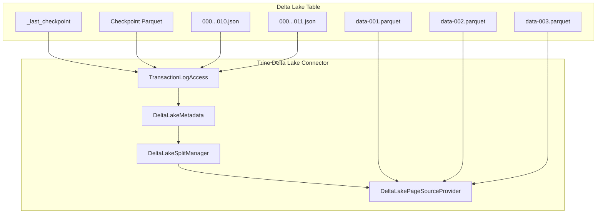

# 第25章 Delta Lake Connector

> **本章で読むソース**
>
> - [`plugin/trino-delta-lake/src/main/java/io/trino/plugin/deltalake/DeltaLakeConnector.java`](https://github.com/trinodb/trino/blob/482/plugin/trino-delta-lake/src/main/java/io/trino/plugin/deltalake/DeltaLakeConnector.java)
> - [`plugin/trino-delta-lake/src/main/java/io/trino/plugin/deltalake/DeltaLakeConnectorFactory.java`](https://github.com/trinodb/trino/blob/482/plugin/trino-delta-lake/src/main/java/io/trino/plugin/deltalake/DeltaLakeConnectorFactory.java)
> - [`plugin/trino-delta-lake/src/main/java/io/trino/plugin/deltalake/DeltaLakeMetadata.java`](https://github.com/trinodb/trino/blob/482/plugin/trino-delta-lake/src/main/java/io/trino/plugin/deltalake/DeltaLakeMetadata.java)
> - [`plugin/trino-delta-lake/src/main/java/io/trino/plugin/deltalake/DeltaLakeSplitManager.java`](https://github.com/trinodb/trino/blob/482/plugin/trino-delta-lake/src/main/java/io/trino/plugin/deltalake/DeltaLakeSplitManager.java)
> - [`plugin/trino-delta-lake/src/main/java/io/trino/plugin/deltalake/DeltaLakePageSourceProvider.java`](https://github.com/trinodb/trino/blob/482/plugin/trino-delta-lake/src/main/java/io/trino/plugin/deltalake/DeltaLakePageSourceProvider.java)
> - [`plugin/trino-delta-lake/src/main/java/io/trino/plugin/deltalake/transactionlog/TransactionLogAccess.java`](https://github.com/trinodb/trino/blob/482/plugin/trino-delta-lake/src/main/java/io/trino/plugin/deltalake/transactionlog/TransactionLogAccess.java)
> - [`plugin/trino-delta-lake/src/main/java/io/trino/plugin/deltalake/transactionlog/DeltaLakeTransactionLogEntry.java`](https://github.com/trinodb/trino/blob/482/plugin/trino-delta-lake/src/main/java/io/trino/plugin/deltalake/transactionlog/DeltaLakeTransactionLogEntry.java)
> - [`plugin/trino-delta-lake/src/main/java/io/trino/plugin/deltalake/transactionlog/checkpoint/CheckpointSchemaManager.java`](https://github.com/trinodb/trino/blob/482/plugin/trino-delta-lake/src/main/java/io/trino/plugin/deltalake/transactionlog/checkpoint/CheckpointSchemaManager.java)

## この章の狙い

**Delta Lake** は、データレイク上のファイル群に ACID トランザクションを提供するオープンなテーブルフォーマットである。
テーブルの状態はデータファイルとは別に**トランザクションログ**（Delta Log）として記録され、ログの各エントリがファイルの追加や削除を表す。

Trino の **Delta Lake Connector** は、このトランザクションログを読み取ってテーブルのスキーマとアクティブファイルの一覧を構築し、Parquet ファイルからデータを読み出す。
本章では、Connector を構成する主要クラスを読み、テーブルハンドルの取得からスプリット生成、データ読み取りまでの流れを追う。
とくに、トランザクションログのチェックポイントとスナップショットキャッシュによるメタデータアクセスの高速化に注目する。

## 前提

- Trino の Connector SPI（`ConnectorMetadata`, `ConnectorSplitManager`, `ConnectorPageSourceProvider`）の役割を知っていること（第20章）。
- Split がデータ読み取りの並列単位であることを理解していること（第12章）。
- Page と Block のデータモデルを知っていること（第18章）。
- Hive Connector の基本構造に馴染みがあること（第21章）。

## Delta Lake のトランザクションログ

Delta Lake テーブルは、データファイル（Parquet）とトランザクションログから構成される。
トランザクションログはテーブルディレクトリ配下の `_delta_log/` に格納され、コミットごとに JSON ファイル（`00000000000000000000.json`, `00000000000000000001.json`, ...）が追加される。
各 JSON ファイルには、そのコミットで行われたアクション（ファイルの追加、削除、メタデータの変更、プロトコルの更新など）が記録される。

JSON ファイルが蓄積されるとメタデータの読み取りが遅くなるため、Delta Lake は定期的に**チェックポイント**を作成する。
チェックポイントはテーブルの現在の状態を Parquet 形式で保存したスナップショットであり、チェックポイント以降の JSON ファイルだけを読めばテーブルの最新状態を復元できる。
最新のチェックポイントの位置は `_last_checkpoint` ファイルに記録される。

以下の Mermaid 図に、Delta Lake テーブルのメタデータ構造と Trino の Connector クラスの対応を示す。



`TransactionLogAccess` がチェックポイントと JSON ファイルを読み取ってテーブルのスナップショットを構築する。
`DeltaLakeMetadata` はそのスナップショットからメタデータを取得し、`DeltaLakeSplitManager` がアクティブファイルの一覧からスプリットを生成する。
`DeltaLakePageSourceProvider` は各スプリットに対応する Parquet ファイルを読み取る。

## DeltaLakeConnectorFactory と DeltaLakeConnector

`DeltaLakeConnectorFactory` は `ConnectorFactory` SPI を実装し、カタログ名と設定を受け取って `DeltaLakeConnector` のインスタンスを生成する。

[`plugin/trino-delta-lake/src/main/java/io/trino/plugin/deltalake/DeltaLakeConnectorFactory.java` L76-L103](https://github.com/trinodb/trino/blob/482/plugin/trino-delta-lake/src/main/java/io/trino/plugin/deltalake/DeltaLakeConnectorFactory.java#L76-L103)

```java
    public static Connector createConnector(
            String catalogName,
            Map<String, String> config,
            ConnectorContext context,
            Optional<Module> metastoreModule,
            Module module)
    {
        ClassLoader classLoader = DeltaLakeConnectorFactory.class.getClassLoader();
        try (ThreadContextClassLoader _ = new ThreadContextClassLoader(classLoader)) {
            Bootstrap app = new Bootstrap(
                    "io.trino.bootstrap.catalog." + catalogName,
                    new MBeanModule(),
                    new ConnectorObjectNameGeneratorModule("io.trino.plugin.deltalake", "trino.plugin.deltalake"),
                    new JsonModule(),
                    new MBeanServerModule(),
                    metastoreModule.orElse(new DeltaLakeMetastoreModule()),
                    new DeltaLakeModule(),
                    new DeltaLakeSecurityModule(),
                    new DeltaLakeSynchronizerModule(),
                    new FileSystemModule(catalogName, context, false),
                    new ConnectorContextModule(catalogName, context),
                    module);

            Injector injector = app
                    .doNotInitializeLogging()
                    .disableSystemProperties()
                    .setRequiredConfigurationProperties(config)
                    .initialize();
```

Iceberg Connector（第22章）と同様に、Guice の `Bootstrap` で依存関係を組み立てる。
`DeltaLakeMetastoreModule` がメタストアの実装を提供し、`DeltaLakeModule` が Connector の中核となるバインディング（`DeltaLakeMetadata`, `DeltaLakeSplitManager`, `DeltaLakePageSourceProvider` など）を定義する。

Delta Lake は Hive Metastore を再利用してテーブルの位置情報を管理する。
ただし、テーブルのスキーマや統計情報は Hive Metastore ではなくトランザクションログから取得する。
`createConnector` の末尾では、`HiveConfig` がバインドされていないことを検証している。

[`plugin/trino-delta-lake/src/main/java/io/trino/plugin/deltalake/DeltaLakeConnectorFactory.java` L126](https://github.com/trinodb/trino/blob/482/plugin/trino-delta-lake/src/main/java/io/trino/plugin/deltalake/DeltaLakeConnectorFactory.java#L126)

```java
            verify(!injector.getBindings().containsKey(Key.get(HiveConfig.class)), "HiveConfig should not be bound");
```

この検証は、Delta Lake Connector が Hive の設定に依存しないことを保証するガードである。
Hive Metastore のクライアントは共有するが、Hive 固有の設定（SerDe やファイルフォーマットなど）は Delta Lake では不要であり、誤って混入しないようにしている。

`DeltaLakeConnector` は `Connector` SPI を実装し、各コンポーネントへのアクセサを提供する。

[`plugin/trino-delta-lake/src/main/java/io/trino/plugin/deltalake/DeltaLakeConnector.java` L54-L56](https://github.com/trinodb/trino/blob/482/plugin/trino-delta-lake/src/main/java/io/trino/plugin/deltalake/DeltaLakeConnector.java#L54-L56)

```java
public class DeltaLakeConnector
        implements Connector
{
```

コメントが示すとおり、Delta Lake 自体はトランザクショナルなストレージではないが、Trino のトランザクション境界を利用してクエリごとの Hive Metastore クライアントキャッシュを管理している。

[`plugin/trino-delta-lake/src/main/java/io/trino/plugin/deltalake/DeltaLakeConnector.java` L71-L73](https://github.com/trinodb/trino/blob/482/plugin/trino-delta-lake/src/main/java/io/trino/plugin/deltalake/DeltaLakeConnector.java#L71-L73)

```java
    // Delta lake is not transactional but we use Trino transaction boundaries to create a per-query
    // caching Hive metastore clients. DeltaLakeTransactionManager is used to store those.
    private final DeltaLakeTransactionManager transactionManager;
```

トランザクション分離レベルは `READ_COMMITTED` をサポートする。
`beginTransaction` では `HiveTransactionHandle` を生成し、`DeltaLakeTransactionManager` にトランザクションを登録する。

[`plugin/trino-delta-lake/src/main/java/io/trino/plugin/deltalake/DeltaLakeConnector.java` L198-L204](https://github.com/trinodb/trino/blob/482/plugin/trino-delta-lake/src/main/java/io/trino/plugin/deltalake/DeltaLakeConnector.java#L198-L204)

```java
    public ConnectorTransactionHandle beginTransaction(IsolationLevel isolationLevel, boolean readOnly, boolean autoCommit)
    {
        checkConnectorSupports(READ_COMMITTED, isolationLevel);
        ConnectorTransactionHandle transaction = new HiveTransactionHandle(true);
        transactionManager.begin(transaction);
        return transaction;
    }
```

Iceberg Connector が `SERIALIZABLE` をサポートするのに対し、Delta Lake Connector は `READ_COMMITTED` にとどまる。
Delta Lake のトランザクション保証はトランザクションログ側の楽観的並行制御に依存しており、Trino 側は読み取り一貫性のみを提供する。

## DeltaLakeMetadata: テーブルハンドルの取得とフィルタ適用

`DeltaLakeMetadata` は `ConnectorMetadata` を実装し、テーブルのメタデータ操作を担う。

[`plugin/trino-delta-lake/src/main/java/io/trino/plugin/deltalake/DeltaLakeMetadata.java` L391-L393](https://github.com/trinodb/trino/blob/482/plugin/trino-delta-lake/src/main/java/io/trino/plugin/deltalake/DeltaLakeMetadata.java#L391-L393)

```java
public class DeltaLakeMetadata
        implements ConnectorMetadata
{
```

### getTableHandle によるテーブルハンドル取得

`getTableHandle` は、メタストアからテーブルの位置情報を取得し、トランザクションログからスキーマとプロトコルの情報をロードして `DeltaLakeTableHandle` を構築する。

[`plugin/trino-delta-lake/src/main/java/io/trino/plugin/deltalake/DeltaLakeMetadata.java` L804-L873](https://github.com/trinodb/trino/blob/482/plugin/trino-delta-lake/src/main/java/io/trino/plugin/deltalake/DeltaLakeMetadata.java#L804-L873)

```java
    public LocatedTableHandle getTableHandle(
            ConnectorSession session,
            SchemaTableName tableName,
            Optional<ConnectorTableVersion> startVersion,
            Optional<ConnectorTableVersion> endVersion)
    {
        // ... (中略) ...
        Optional<Table> metastoreTable = metastore.getRawMetastoreTable(tableName.getSchemaName(), tableName.getTableName());
        if (metastoreTable.isEmpty()) {
            return null;
        }
        DeltaMetastoreTable table = convertToDeltaMetastoreTable(metastoreTable.get());
        // ... (中略) ...
        DeltaLakeTableDescriptor descriptor;
        try {
            descriptor = loadDescriptor(session, table, fileSystem, tableLocation, endVersion);
        }
        // ... (中略) ...
        MetadataEntry metadataEntry = descriptor.metadataEntry();
        ProtocolEntry protocolEntry = descriptor.protocolEntry();
        long snapshotVersion = descriptor.version();

        if (protocolEntry.minReaderVersion() > MAX_READER_VERSION) {
            LOG.debug("Skip %s because the reader version is unsupported: %d", tableName, protocolEntry.minReaderVersion());
            return null;
        }
        // ... (中略) ...
        return new DeltaLakeTableHandle(
                tableName.getSchemaName(),
                tableName.getTableName(),
                managed,
                tableLocation,
                metadataEntry,
                protocolEntry,
                TupleDomain.all(),
                TupleDomain.all(),
                false,
                Optional.empty(),
                Optional.empty(),
                snapshotVersion,
                endVersion.isPresent());
    }
```

処理の流れは次のとおりである。

1. メタストアからテーブルのストレージロケーションを取得する。
2. `loadDescriptor` でトランザクションログを読み取り、`MetadataEntry`（スキーマ定義、パーティション列）と `ProtocolEntry`（リーダー/ライターバージョン）を取得する。
3. プロトコルバージョンが Trino のサポート範囲内かを検証する。サポート外の場合は `null` を返し、テーブルが存在しないかのように振る舞う。
4. 初期状態では `enforcedPartitionConstraint` と `nonPartitionConstraint` はともに `TupleDomain.all()` であり、フィルタは未適用である。

`loadDescriptor` には2つの経路がある。
まず `loadDescriptorFromChecksum` がチェックサムファイル（`_delta_log/_trino_meta/extended_stats.json` とは異なるバージョンチェックサム）からメタデータの取得を試みる。
チェックサムファイルが見つからない場合は、`loadDescriptorFromTransactionLog` がトランザクションログ全体を読み取る。

### applyFilter による述語の分類

オプティマイザが `applyFilter` を呼び出すと、`DeltaLakeMetadata` は述語をパーティション列への制約とそれ以外に分類する。

[`plugin/trino-delta-lake/src/main/java/io/trino/plugin/deltalake/DeltaLakeMetadata.java` L3721-L3822](https://github.com/trinodb/trino/blob/482/plugin/trino-delta-lake/src/main/java/io/trino/plugin/deltalake/DeltaLakeMetadata.java#L3721-L3822)

```java
    public Optional<ConstraintApplicationResult<ConnectorTableHandle>> applyFilter(ConnectorSession session, ConnectorTableHandle handle, Constraint constraint)
    {
        // ... (中略) ...
        Set<DeltaLakeColumnHandle> partitionColumns = ImmutableSet.copyOf(extractPartitionColumns(tableHandle.getMetadataEntry(), tableHandle.getProtocolEntry(), typeManager));
        // ... (中略) ...
        for (Entry<ColumnHandle, Domain> domainEntry : constraintDomains.entrySet()) {
            DeltaLakeColumnHandle column = (DeltaLakeColumnHandle) domainEntry.getKey();
            if (isMetadataColumnHandle(column)) {
                unenforceableDomains.put(column, domainEntry.getValue());
            }
            else if (!partitionColumns.contains(column)) {
                unenforceableDomains.put(column, domainEntry.getValue());
                // the column can not be pusheddown
                remainingDomains.put(column, domainEntry.getValue());
            }
            else {
                enforceableDomains.put(column, domainEntry.getValue());
            }
            constraintColumns.add(column);
        }
```

分類のロジックは以下のとおりである。

- **enforced**（Connector 保証）：パーティション列への制約。パーティション値はトランザクションログの `AddFileEntry` に記録されているため、Split 生成段階でファイル単位の正確な除外が可能である。
- **unenforced**（最善努力）：メタデータ列（`$path`, `$file_modified_time`, `$file_size`）への制約と、通常のデータ列への制約。ファイルレベルの統計情報やパスのマッチングで Split の枝刈りに利用されるが、行単位の保証はしない。
- **remaining**（エンジンに返す）：通常のデータ列への制約はエンジン側にも残余フィルタとして返され、`FilterNode` による行単位のフィルタリングが保証される。

Iceberg Connector との違いとして、Delta Lake Connector にはデータ列の制約を Connector 側で保証する仕組みがない。
Iceberg ではパーティション変換（`year(ts)` など）により、データ列への制約をパーティション列の制約に変換して enforced にできるが、Delta Lake のパーティショニングは Hive と同じディレクトリベースであり、この変換は行われない。

## TransactionLogAccess: トランザクションログの読み取りとキャッシュ

`TransactionLogAccess` は、Delta Lake のトランザクションログを読み取り、テーブルのスナップショットを構築する中核クラスである。

[`plugin/trino-delta-lake/src/main/java/io/trino/plugin/deltalake/transactionlog/TransactionLogAccess.java` L107](https://github.com/trinodb/trino/blob/482/plugin/trino-delta-lake/src/main/java/io/trino/plugin/deltalake/transactionlog/TransactionLogAccess.java#L107)

```java
public class TransactionLogAccess
{
```

### スナップショットキャッシュ

`TransactionLogAccess` は2つのキャッシュを保持する。

[`plugin/trino-delta-lake/src/main/java/io/trino/plugin/deltalake/transactionlog/TransactionLogAccess.java` L127-L128](https://github.com/trinodb/trino/blob/482/plugin/trino-delta-lake/src/main/java/io/trino/plugin/deltalake/transactionlog/TransactionLogAccess.java#L127-L128)

```java
    private final Cache<TableLocation, TableSnapshot> tableSnapshots;
    private final Cache<TableDescriptorCacheKey, Optional<DeltaLakeTableDescriptor>> tableDescriptors;
```

`tableSnapshots` はテーブルロケーションをキーとしてスナップショットをキャッシュし、`tableDescriptors` はテーブル名、ロケーション、バージョンの組み合わせをキーとしてテーブルディスクリプタ（メタデータとプロトコルのペア）をキャッシュする。

[`plugin/trino-delta-lake/src/main/java/io/trino/plugin/deltalake/transactionlog/TransactionLogAccess.java` L153-L165](https://github.com/trinodb/trino/blob/482/plugin/trino-delta-lake/src/main/java/io/trino/plugin/deltalake/transactionlog/TransactionLogAccess.java#L153-L165)

```java
        tableSnapshots = EvictableCacheBuilder.newBuilder()
                .weigher((Weigher<TableLocation, TableSnapshot>) (key, value) -> Ints.saturatedCast(key.getRetainedSizeInBytes() + value.getRetainedSizeInBytes()))
                .maximumWeight(deltaLakeConfig.getMetadataCacheMaxRetainedSize().toBytes())
                .expireAfterWrite(deltaLakeConfig.getMetadataCacheTtl().toMillis(), TimeUnit.MILLISECONDS)
                .shareNothingWhenDisabled()
                .recordStats()
                .build();
        tableDescriptors = EvictableCacheBuilder.newBuilder()
                .maximumSize(DESCRIPTOR_CACHE_MAX_SIZE)
                .expireAfterWrite(deltaLakeConfig.getMetadataCacheTtl().toMillis(), TimeUnit.MILLISECONDS)
                .shareNothingWhenDisabled()
                .recordStats()
                .build();
```

`tableSnapshots` のキャッシュは、エントリのバイトサイズを重みとして計測し、`maximumWeight` で合計サイズを制限する。
TTL は設定の `metadataCacheTtl` に従う。

### loadSnapshot によるスナップショットの読み取り

`loadSnapshot` は、キャッシュにスナップショットがあればそれを返し、なければトランザクションログから構築する。
キャッシュ済みのスナップショットが古い場合は、差分の JSON ファイルだけを読んで更新する。

[`plugin/trino-delta-lake/src/main/java/io/trino/plugin/deltalake/transactionlog/TransactionLogAccess.java` L250-L299](https://github.com/trinodb/trino/blob/482/plugin/trino-delta-lake/src/main/java/io/trino/plugin/deltalake/transactionlog/TransactionLogAccess.java#L250-L299)

```java
    public TableSnapshot loadSnapshot(
            // ... (中略) ...
            Optional<LastCheckpoint> lastCheckpoint)
            throws IOException
    {
        TrinoFileSystem fileSystem = fileSystemFactory.create(session, tableCredentials);
        if (endVersion.isPresent()) {
            return loadSnapshotForTimeTravel(session, transactionLogReader, fileSystem, table, tableLocation, endVersion.get(), lastCheckpoint);
        }

        TableLocation cacheKey = new TableLocation(table, tableLocation);
        TableSnapshot cachedSnapshot = tableSnapshots.getIfPresent(cacheKey);
        TableSnapshot snapshot;
        if (cachedSnapshot == null) {
            try {
                snapshot = tableSnapshots.get(cacheKey, () ->
                        TableSnapshot.load(
                                session,
                                transactionLogReader,
                                table,
                                lastCheckpoint,
                                tableLocation,
                                // ... (中略) ...
                                endVersion));
            }
            // ... (中略) ...
        }
        else {
            Optional<TableSnapshot> updatedSnapshot = cachedSnapshot.getUpdatedSnapshot(session, transactionLogReader, fileSystem, Optional.empty(), lastCheckpoint);
            if (updatedSnapshot.isPresent()) {
                snapshot = updatedSnapshot.get();
                tableSnapshots.asMap().replace(cacheKey, cachedSnapshot, snapshot);
            }
            else {
                snapshot = cachedSnapshot;
            }
        }
        return snapshot;
    }
```

キャッシュミスの場合は `TableSnapshot.load` でチェックポイントからスナップショットを構築する。
キャッシュヒットの場合は `getUpdatedSnapshot` で差分を適用し、変更があればキャッシュを更新する。
タイムトラベルクエリの場合はキャッシュを使わず、指定バージョン以前のチェックポイントを探して直接ロードする。

### getActiveFiles によるアクティブファイルの列挙

`getActiveFiles` は、チェックポイントの `add` エントリに JSON ファイルの差分を適用し、テーブルの現在のアクティブファイル一覧を返す。

[`plugin/trino-delta-lake/src/main/java/io/trino/plugin/deltalake/transactionlog/TransactionLogAccess.java` L473-L503](https://github.com/trinodb/trino/blob/482/plugin/trino-delta-lake/src/main/java/io/trino/plugin/deltalake/transactionlog/TransactionLogAccess.java#L473-L503)

```java
    public Stream<AddFileEntry> loadActiveFiles(
            // ... (中略) ...)
    {
        List<Transaction> transactions = tableSnapshot.getTransactions();
        TrinoFileSystem fileSystem = fileSystemFactory.create(session, tableCredentials);
        try (Stream<DeltaLakeTransactionLogEntry> checkpointEntries = tableSnapshot.getCheckpointTransactionLogEntries(
                session,
                ImmutableSet.of(ADD),
                checkpointSchemaManager,
                typeManager,
                fileSystem,
                fileFormatDataSourceStats,
                Optional.of(new MetadataAndProtocolEntry(metadataEntry, protocolEntry)),
                partitionConstraint,
                Optional.of(addStatsMinMaxColumnFilter),
                new BoundedExecutor(executorService, checkpointProcessingParallelism))) {
            return activeAddEntries(checkpointEntries, transactions, fileSystem)
                    .filter(partitionConstraint.isAll()
                            ? _ -> true
                            : addAction -> partitionMatchesPredicate(addAction.getCanonicalPartitionValues(), partitionConstraint.getDomains().orElseThrow()));
        }
        // ... (中略) ...
    }
```

チェックポイントの読み取り時に `partitionConstraint` を渡すことで、不要なパーティションのエントリを Parquet のロウグループレベルで読み飛ばすことができる。
`BoundedExecutor` でチェックポイントの並列処理数を制限している。

`activeAddEntries` メソッドは、チェックポイントのエントリに JSON トランザクションの差分を適用する。

[`plugin/trino-delta-lake/src/main/java/io/trino/plugin/deltalake/transactionlog/TransactionLogAccess.java` L521-L559](https://github.com/trinodb/trino/blob/482/plugin/trino-delta-lake/src/main/java/io/trino/plugin/deltalake/transactionlog/TransactionLogAccess.java#L521-L559)

```java
    private Stream<AddFileEntry> activeAddEntries(Stream<DeltaLakeTransactionLogEntry> checkpointEntries, List<Transaction> transactions, TrinoFileSystem fileSystem)
    {
        Map<FileEntryKey, AddFileEntry> activeJsonEntries = new LinkedHashMap<>();
        HashSet<FileEntryKey> removedFiles = new HashSet<>();

        // The json entries containing the last few entries in the log need to be applied on top of the parquet snapshot:
        // - Any files which have been removed need to be excluded
        // - Any files with newer add actions need to be updated with the most recent metadata
        transactions.forEach(transaction -> {
            // ... (中略) ...
            // Process 'remove' entries first because deletion vectors register both 'add' and 'remove' entries and the 'add' entry should be kept
            removedFiles.addAll(removedFilesInTransaction);
            removedFilesInTransaction.forEach(activeJsonEntries::remove);
            activeJsonEntries.putAll(addFilesInTransaction);
        });

        Stream<AddFileEntry> filteredCheckpointEntries = checkpointEntries
                .map(DeltaLakeTransactionLogEntry::getAdd)
                .filter(Objects::nonNull)
                .filter(addEntry -> {
                    FileEntryKey key = new FileEntryKey(addEntry.getPath(), addEntry.getDeletionVector().map(DeletionVectorEntry::uniqueId));
                    return !removedFiles.contains(key) && !activeJsonEntries.containsKey(key);
                });

        return Stream.concat(filteredCheckpointEntries, activeJsonEntries.values().stream());
    }
```

JSON トランザクションの `remove` エントリで削除されたファイルと、`add` エントリで更新されたファイルをチェックポイントから除外し、JSON 側の最新エントリを末尾に連結する。
`FileEntryKey` はファイルパスと削除ベクトル ID の組み合わせで一意性を判定する。

## DeltaLakeTransactionLogEntry: アクションの構造

`DeltaLakeTransactionLogEntry` は、トランザクションログの1行を表すクラスである。
各エントリは以下のいずれかのアクションを保持する。

[`plugin/trino-delta-lake/src/main/java/io/trino/plugin/deltalake/transactionlog/DeltaLakeTransactionLogEntry.java` L30-L38](https://github.com/trinodb/trino/blob/482/plugin/trino-delta-lake/src/main/java/io/trino/plugin/deltalake/transactionlog/DeltaLakeTransactionLogEntry.java#L30-L38)

```java
    private final TransactionEntry txn;
    private final AddFileEntry add;
    private final RemoveFileEntry remove;
    private final MetadataEntry metaData;
    private final ProtocolEntry protocol;
    private final CommitInfoEntry commitInfo;
    private final CdcEntry cdcEntry;
    private final SidecarEntry sidecar;
    private final CheckpointMetadataEntry checkpointMetadata;
```

主要なアクションは次の4つである。

- **`AddFileEntry`**：テーブルにデータファイルを追加する。ファイルパス、サイズ、パーティション値、統計情報（最小値、最大値、NULL 数、行数）、削除ベクトルの参照を保持する。
- **`RemoveFileEntry`**：テーブルからデータファイルを論理的に削除する。ファイルパスと削除ベクトル ID を保持する。
- **`MetadataEntry`**：テーブルのスキーマ定義（JSON 形式）、パーティション列、テーブルプロパティを保持する。
- **`ProtocolEntry`**：リーダーとライターの最小バージョン、オプショナルなリーダー/ライターフィーチャーセットを保持する。

`DeltaLakeTransactionLogEntry` は JSON デシリアライズ用のファクトリメソッド `fromJson` と、各アクション型用の個別ファクトリメソッドを持つ。

[`plugin/trino-delta-lake/src/main/java/io/trino/plugin/deltalake/transactionlog/DeltaLakeTransactionLogEntry.java` L62-L75](https://github.com/trinodb/trino/blob/482/plugin/trino-delta-lake/src/main/java/io/trino/plugin/deltalake/transactionlog/DeltaLakeTransactionLogEntry.java#L62-L75)

```java
    @JsonCreator
    public static DeltaLakeTransactionLogEntry fromJson(
            @JsonProperty("txn") TransactionEntry txn,
            @JsonProperty("add") AddFileEntry add,
            @JsonProperty("remove") RemoveFileEntry remove,
            @JsonProperty("metaData") MetadataEntry metaData,
            @JsonProperty("protocol") ProtocolEntry protocol,
            @JsonProperty("commitInfo") CommitInfoEntry commitInfo,
            @JsonProperty("cdc") CdcEntry cdcEntry,
            @JsonProperty("sidecar") SidecarEntry sidecarEntry,
            @JsonProperty("checkpointMetadata") CheckpointMetadataEntry checkpointMetadata)
    {
        return new DeltaLakeTransactionLogEntry(txn, add, remove, metaData, protocol, commitInfo, cdcEntry, sidecarEntry, checkpointMetadata);
    }
```

JSON ファイルの各行は1つのアクションだけを持ち、残りのフィールドは `null` になる。
一方、チェックポイントの Parquet ファイルでは `CheckpointSchemaManager` が各アクション型のスキーマを定義し、Parquet のカラム構造にマッピングする。

## DeltaLakeSplitManager: アクティブファイルからのスプリット生成

`DeltaLakeSplitManager` は `ConnectorSplitManager` を実装し、テーブルのアクティブファイル一覧からスプリットを生成する。

[`plugin/trino-delta-lake/src/main/java/io/trino/plugin/deltalake/DeltaLakeSplitManager.java` L77-L79](https://github.com/trinodb/trino/blob/482/plugin/trino-delta-lake/src/main/java/io/trino/plugin/deltalake/DeltaLakeSplitManager.java#L77-L79)

```java
public class DeltaLakeSplitManager
        implements ConnectorSplitManager
{
```

### getSplits の全体フロー

`getSplits` メソッドは、`TransactionLogAccess.getActiveFiles` から取得したアクティブファイルのストリームに対して、パーティションプルーニング、パス/ファイルサイズ/更新日時のフィルタリング、ファイル統計情報による枝刈りを適用し、各ファイルをスプリットに変換する。

[`plugin/trino-delta-lake/src/main/java/io/trino/plugin/deltalake/DeltaLakeSplitManager.java` L154-L267](https://github.com/trinodb/trino/blob/482/plugin/trino-delta-lake/src/main/java/io/trino/plugin/deltalake/DeltaLakeSplitManager.java#L154-L267)

```java
    private Stream<DeltaLakeSplit> getSplits(
            // ... (中略) ...)
    {
        // ... (中略) ...
        Stream<AddFileEntry> validDataFiles = transactionLogAccess.getActiveFiles(session, tableHandle, tableCredentials, tableSnapshot);
        TupleDomain<DeltaLakeColumnHandle> enforcedPartitionConstraint = tableHandle.getEnforcedPartitionConstraint();
        TupleDomain<DeltaLakeColumnHandle> nonPartitionConstraint = tableHandle.getNonPartitionConstraint();
        // ... (中略) ...
        return validDataFiles
                .flatMap(addAction -> {
                    // ... (中略) ...
                    if (!partitionMatchesPredicate(addAction.getCanonicalPartitionValues(), enforcedDomains)) {
                        return Stream.empty();
                    }

                    TupleDomain<DeltaLakeColumnHandle> statisticsPredicate = createStatisticsPredicate(
                            addAction,
                            predicatedColumns,
                            metadataEntry.getLowercasePartitionColumns());
                    if (!nonPartitionConstraint.overlaps(statisticsPredicate)) {
                        return Stream.empty();
                    }
                    // ... (中略) ...
                    return splitsForFile(
                            session,
                            addAction,
                            splitPath,
                            addAction.getCanonicalPartitionValues(),
                            statisticsPredicate,
                            splittable)
                            .stream();
                });
    }
```

フィルタリングは以下の順序で行われる。

1. パスのマッチング（`pathMatchesPredicate`）
2. ファイル更新日時のフィルタ（`fileModifiedTimeMatchesPredicate`）
3. ファイルサイズのフィルタ（`fileSizeMatchesPredicate`）
4. パーティション値のマッチング（`partitionMatchesPredicate`）
5. ファイル統計情報による枝刈り（`createStatisticsPredicate` と `overlaps`）
6. 式評価器によるパーティション値の評価（`prepared.tryEvaluate`）

`createStatisticsPredicate` は `AddFileEntry` の統計情報（最小値、最大値、NULL 数）から `TupleDomain` を構築し、クエリの非パーティション制約と重なりがあるかを判定する。
重なりがなければ、そのファイルにはクエリ条件を満たす行が存在しないため、スプリットの生成をスキップする。

### splitsForFile によるスプリット分割

ファイルが分割可能な場合、`splitsForFile` はファイルを `maxSplitSize`（セッション設定）ごとに分割し、複数のスプリットを生成する。

[`plugin/trino-delta-lake/src/main/java/io/trino/plugin/deltalake/DeltaLakeSplitManager.java` L302-L352](https://github.com/trinodb/trino/blob/482/plugin/trino-delta-lake/src/main/java/io/trino/plugin/deltalake/DeltaLakeSplitManager.java#L302-L352)

```java
    private List<DeltaLakeSplit> splitsForFile(
            // ... (中略) ...)
    {
        long fileSize = addFileEntry.getSize();

        if (!splittable) {
            return ImmutableList.of(new DeltaLakeSplit(
                    splitPath,
                    0,
                    fileSize,
                    fileSize,
                    addFileEntry.getStats().flatMap(DeltaLakeFileStatistics::getNumRecords),
                    addFileEntry.getModificationTime(),
                    addFileEntry.getDeletionVector(),
                    splitAffinityProvider.getKey(splitPath, 0, fileSize),
                    SplitWeight.standard(),
                    statisticsPredicate,
                    partitionKeys));
        }

        ImmutableList.Builder<DeltaLakeSplit> splits = ImmutableList.builder();
        long currentOffset = 0;
        while (currentOffset < fileSize) {
            long maxSplitSize = getMaxSplitSize(session).toBytes();
            long splitSize = Math.min(maxSplitSize, fileSize - currentOffset);
            // ... (中略) ...
            splits.add(new DeltaLakeSplit(
                    splitPath,
                    currentOffset,
                    splitSize,
                    fileSize,
                    Optional.empty(),
                    // ... (中略) ...
                    partitionKeys));

            currentOffset += splitSize;
        }

        return splits.build();
    }
```

MERGE 操作時やパーティション列のみの射影時にはファイルを分割できない。
MERGE では更新と削除がファイル全体のコピーとして処理されるため、1ファイルを複数の Worker で処理すると整合性が崩れる。

## DeltaLakePageSourceProvider: Parquet 読み取りと削除ベクトル

`DeltaLakePageSourceProvider` は `ConnectorPageSourceProvider` を実装し、各スプリットに対応する Parquet ファイルからページを読み取る。

[`plugin/trino-delta-lake/src/main/java/io/trino/plugin/deltalake/DeltaLakePageSourceProvider.java` L121-L123](https://github.com/trinodb/trino/blob/482/plugin/trino-delta-lake/src/main/java/io/trino/plugin/deltalake/DeltaLakePageSourceProvider.java#L121-L123)

```java
public class DeltaLakePageSourceProvider
        implements ConnectorPageSourceProvider
{
```

### createPageSource の処理フロー

`createPageSource` は以下の手順でページソースを構築する。

1. スプリットの `statisticsPredicate` とテーブルの `nonPartitionConstraint`、DynamicFilter を交差させ、結果が空（`isNone`）であればスプリットをスキップする。
2. パーティション値の一致を再確認し、不一致ならスプリットをスキップする。
3. 正規列がなく、かつファイル行数が既知の場合はファイル I/O を回避して直接ページを生成する。
4. `ParquetPageSourceFactory.createPageSource` で Parquet リーダーを生成する。
5. 削除ベクトルがある場合はフィルタを適用する。

[`plugin/trino-delta-lake/src/main/java/io/trino/plugin/deltalake/DeltaLakePageSourceProvider.java` L194-L204](https://github.com/trinodb/trino/blob/482/plugin/trino-delta-lake/src/main/java/io/trino/plugin/deltalake/DeltaLakePageSourceProvider.java#L194-L204)

```java
        // We reach here when we could not prune the split using file level stats, table predicate
        // and the dynamic filter in the coordinator during split generation. The file level stats
        // in DeltaLakeSplit#statisticsPredicate could help to prune this split when a more selective dynamic filter
        // is available now, without having to access parquet file footer for row-group stats.
        TupleDomain<DeltaLakeColumnHandle> filteredSplitPredicate = TupleDomain.intersect(ImmutableList.of(
                table.getNonPartitionConstraint(),
                split.statisticsPredicate(),
                dynamicFilter.getCurrentPredicate().transformKeys(DeltaLakeColumnHandle.class::cast)));
        if (filteredSplitPredicate.isNone()) {
            return new EmptyPageSource();
        }
```

コメントが説明するとおり、Split 生成時には DynamicFilter が完全には確定していない場合がある。
ページソース生成時により選択的な DynamicFilter が利用可能になっていれば、Parquet ファイルのフッタを読まずにスプリットを枝刈りできる。
`statisticsPredicate` はスプリットに埋め込まれたファイルレベルの統計情報であり、この2段階の枝刈りによって不要なファイル I/O を削減している。

### 削除ベクトルの適用

Delta Lake の**削除ベクトル**（Deletion Vector）は、ファイル内の特定の行を論理的に削除する仕組みである。
ファイル全体を書き換えずに行単位の削除を表現できるため、UPDATE や DELETE の効率が向上する。

[`plugin/trino-delta-lake/src/main/java/io/trino/plugin/deltalake/DeltaLakePageSourceProvider.java` L277-L290](https://github.com/trinodb/trino/blob/482/plugin/trino-delta-lake/src/main/java/io/trino/plugin/deltalake/DeltaLakePageSourceProvider.java#L277-L290)

```java
        if (split.deletionVector().isPresent()) {
            var pageFilterSupplier = Suppliers.memoize(() -> {
                List<DeltaLakeColumnHandle> requiredColumns = ImmutableList.<DeltaLakeColumnHandle>builderWithExpectedSize(regularColumns.size() + 1)
                        .addAll(regularColumns)
                        .add(rowPositionColumnHandle())
                        .build();
                PositionDeleteFilter deleteFilter = readDeletes(fileSystem, Location.of(table.location()), split.deletionVector().get());
                return deleteFilter.createPredicate(requiredColumns);
            });

            // trim output columns list so we do not expose PARQUET_ROW_INDEX_COLUMN added for internal purposes
            int[] retainedColumns = IntStream.range(0, regularColumns.size()).toArray();
            delegate = TransformConnectorPageSource.create(delegate, page -> SourcePage.create(pageFilterSupplier.get().apply(page).getColumns(retainedColumns)));
        }
```

削除ベクトルが存在する場合、`readDeletes` で `RoaringBitmapArray`（行位置のビットマップ）を読み取り、`PositionDeleteFilter` を構築する。
フィルタは Parquet の行インデックスカラム（`PARQUET_ROW_INDEX_COLUMN`）を使って各行の物理位置を取得し、削除対象の行をページから除外する。

`Suppliers.memoize` により、フィルタの初期化は最初のページ処理時まで遅延される。
出力カラムのリストからは内部用の行インデックスカラムが除外され、クエリ結果には露出しない。

### パーティション列とメタデータ列の射影

`projectColumns` メソッドは、パーティション列やメタデータ列を定数値として射影する。

[`plugin/trino-delta-lake/src/main/java/io/trino/plugin/deltalake/DeltaLakePageSourceProvider.java` L303-L345](https://github.com/trinodb/trino/blob/482/plugin/trino-delta-lake/src/main/java/io/trino/plugin/deltalake/DeltaLakePageSourceProvider.java#L303-L345)

```java
    public static ConnectorPageSource projectColumns(
            // ... (中略) ...)
    {
        int delegateIndex = 0;
        TransformConnectorPageSource.Builder transform = TransformConnectorPageSource.builder();
        for (DeltaLakeColumnHandle column : deltaLakeColumns) {
            if (column.isBaseColumn() && partitionKeys.containsKey(column.basePhysicalColumnName())) {
                Object prefilledValue = deserializePartitionValue(column, partitionKeys.get(column.basePhysicalColumnName()));
                transform.constantValue(writeNativeValue(column.baseType(), prefilledValue));
            }
            else if (column.baseColumnName().equals(PATH_COLUMN_NAME)) {
                transform.constantValue(writeNativeValue(PATH_TYPE, utf8Slice(path)));
            }
            else if (column.baseColumnName().equals(FILE_SIZE_COLUMN_NAME)) {
                transform.constantValue(writeNativeValue(FILE_SIZE_TYPE, fileSize));
            }
            // ... (中略) ...
        }
        return transform.build(delegate);
    }
```

パーティション列の値はトランザクションログの `AddFileEntry` から取得済みであり、Parquet ファイルには格納されていない。
そのため、パーティション列は `TransformConnectorPageSource` の定数値として全行に同じ値を返す。
`$path`, `$file_size`, `$file_modified_time` のメタデータ列も同様に定数値として射影される。

## 述語プッシュダウンとパーティションプルーニングの全体像

Delta Lake Connector の述語プッシュダウンは、Coordinator 側の `applyFilter` と Worker 側の Split 生成、ページソース生成の3段階で行われる。

`applyFilter` がパーティション列への制約を `enforcedPartitionConstraint` に分類し、それ以外を `nonPartitionConstraint` に分類する。

`DeltaLakeSplitManager` は `enforcedPartitionConstraint` でパーティション値をフィルタし、`nonPartitionConstraint` でファイル統計情報との `overlaps` 判定を行う。
`createStatisticsPredicate` は各ファイルの最小値と最大値から `TupleDomain` を構築する。

[`plugin/trino-delta-lake/src/main/java/io/trino/plugin/deltalake/DeltaLakeMetadata.java` L4794-L4807](https://github.com/trinodb/trino/blob/482/plugin/trino-delta-lake/src/main/java/io/trino/plugin/deltalake/DeltaLakeMetadata.java#L4794-L4807)

```java
    public static TupleDomain<DeltaLakeColumnHandle> createStatisticsPredicate(
            AddFileEntry addFileEntry,
            List<DeltaLakeColumnMetadata> schema,
            List<String> canonicalPartitionColumns)
    {
        return addFileEntry.getStats()
                .map(deltaLakeFileStatistics -> withColumnDomains(
                        schema.stream()
                                .filter(column -> canUseInPredicate(column.columnMetadata()))
                                .collect(toImmutableMap(
                                        column -> DeltaLakeMetadata.toColumnHandle(column.name(), column.type(), column.fieldId(), column.physicalName(), column.physicalColumnType(), canonicalPartitionColumns),
                                        column -> buildColumnDomain(column, deltaLakeFileStatistics, canonicalPartitionColumns)))))
                .orElseGet(TupleDomain::all);
```

統計情報がない場合は `TupleDomain.all()` を返し、枝刈りは行わない。
統計情報がある場合、各列の最小値と最大値から範囲ドメインを構築し、クエリの制約との重なりを判定する。

`DeltaLakePageSourceProvider` は、Split 生成時よりも選択的になった DynamicFilter を使って追加の枝刈りを行い、Parquet リーダーには述語を `TupleDomain<HiveColumnHandle>` に変換して渡す。
Parquet リーダーはファイルフッタの統計情報を使ってロウグループ単位でさらに枝刈りする。

## 設計上の工夫: スナップショットキャッシュとチェックポイント並列読み取り

Delta Lake Connector のメタデータアクセスを高速化する主要な仕組みは、`TransactionLogAccess` の**スナップショットキャッシュ**と**チェックポイントの並列読み取り**である。

Delta Lake テーブルのメタデータ取得には、チェックポイントの Parquet ファイルの読み取りと、その後の JSON ファイルの逐次的な適用が必要になる。
大規模なテーブルではチェックポイントに数百万の `AddFileEntry` が含まれることがあり、毎回の読み取りは高コストである。

`TransactionLogAccess` はスナップショットをキャッシュし、次回のアクセス時にはチェックポイント以降の差分 JSON ファイルだけを読んでスナップショットを更新する（`getUpdatedSnapshot`）。
キャッシュのサイズはエントリのバイトサイズの重み付きで管理され、`metadataCacheMaxRetainedSize` 設定で上限を制御する。
TTL（`metadataCacheTtl`）の期限切れでエントリが自動的に無効化される。

チェックポイントの読み取り自体も、`BoundedExecutor` による並列処理で高速化されている。
`checkpointProcessingParallelism` 設定で並列度を制御し、大きなチェックポイントファイルの複数のロウグループを同時に処理する。
この仕組みにより、チェックポイントの初回読み取りの遅延を緩和している。

さらに、`DeltaLakeMetadata` はトランザクション内でスナップショットとチェックポイント情報をメモ化する。
`queriedSnapshots` マップが同一トランザクション内でのスナップショットの重複ロードを防ぎ、`latestCheckpoints` マップが `_last_checkpoint` ファイルの重複読み取りを防ぐ。

この多層のキャッシュ戦略により、同一テーブルへの複数回のメタデータアクセス（テーブルハンドルの取得、統計情報の取得、Split 生成など）が、最初の1回のトランザクションログ読み取りで賄える。

## まとめ

- Delta Lake Connector は、Hive Metastore をテーブルの位置情報の管理に再利用しつつ、スキーマと統計情報はトランザクションログから取得する。
- `DeltaLakeMetadata` の `applyFilter` は、パーティション列への制約を enforced に、データ列とメタデータ列への制約を unenforced に分類する。Iceberg のような隠しパーティション変換はない。
- `TransactionLogAccess` は、チェックポイント（Parquet）と差分 JSON ファイルからテーブルのスナップショットを構築し、キャッシュによって後続のアクセスを高速化する。
- `DeltaLakeTransactionLogEntry` は、add, remove, metadata, protocol などのアクションを1つのエントリとして表現する。
- `DeltaLakeSplitManager` は、アクティブファイル一覧に対してパーティションプルーニングとファイル統計情報による枝刈りを行い、スプリットを生成する。
- `DeltaLakePageSourceProvider` は、Parquet ファイルを読み取り、削除ベクトルによる行単位のフィルタリングを適用する。パーティション列とメタデータ列は定数値として射影する。
- スナップショットキャッシュ、チェックポイントの並列読み取り、トランザクション内のメモ化により、メタデータアクセスの繰り返しコストを低減している。

## 関連する章

- [第12章 Stage と Task のスケジューリング](../part03-execution/12-stage-task-scheduling.md)：Split の分配と並列実行の仕組み。
- [第18章 Page と Block のデータモデル](../part04-data/18-page-block.md)：列指向データ表現の内部構造。
- [第20章 Connector SPI の詳細](20-connector-spi-detail.md)：Connector SPI のインターフェース設計。
- [第21章 Hive Connector](21-hive-connector.md)：Hive Metastore と Parquet 読み取りの共通基盤。
- [第22章 Iceberg Connector](22-iceberg-connector.md)：同じレイクハウスフォーマットである Iceberg との設計比較。
