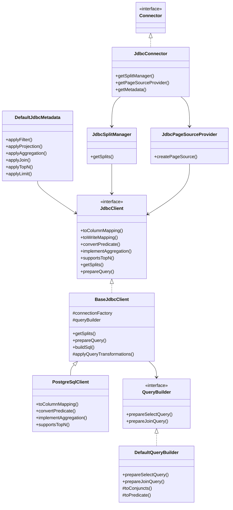

# 第26章 JDBC Connector ファミリーと Pushdown

> **本章で読むソース**
>
> - [`plugin/trino-base-jdbc/src/main/java/io/trino/plugin/jdbc/JdbcClient.java`](https://github.com/trinodb/trino/blob/482/plugin/trino-base-jdbc/src/main/java/io/trino/plugin/jdbc/JdbcClient.java)
> - [`plugin/trino-base-jdbc/src/main/java/io/trino/plugin/jdbc/BaseJdbcClient.java`](https://github.com/trinodb/trino/blob/482/plugin/trino-base-jdbc/src/main/java/io/trino/plugin/jdbc/BaseJdbcClient.java)
> - [`plugin/trino-base-jdbc/src/main/java/io/trino/plugin/jdbc/JdbcConnector.java`](https://github.com/trinodb/trino/blob/482/plugin/trino-base-jdbc/src/main/java/io/trino/plugin/jdbc/JdbcConnector.java)
> - [`plugin/trino-base-jdbc/src/main/java/io/trino/plugin/jdbc/DefaultJdbcMetadata.java`](https://github.com/trinodb/trino/blob/482/plugin/trino-base-jdbc/src/main/java/io/trino/plugin/jdbc/DefaultJdbcMetadata.java)
> - [`plugin/trino-base-jdbc/src/main/java/io/trino/plugin/jdbc/JdbcTableHandle.java`](https://github.com/trinodb/trino/blob/482/plugin/trino-base-jdbc/src/main/java/io/trino/plugin/jdbc/JdbcTableHandle.java)
> - [`plugin/trino-base-jdbc/src/main/java/io/trino/plugin/jdbc/DefaultQueryBuilder.java`](https://github.com/trinodb/trino/blob/482/plugin/trino-base-jdbc/src/main/java/io/trino/plugin/jdbc/DefaultQueryBuilder.java)
> - [`plugin/trino-base-jdbc/src/main/java/io/trino/plugin/jdbc/JdbcSplitManager.java`](https://github.com/trinodb/trino/blob/482/plugin/trino-base-jdbc/src/main/java/io/trino/plugin/jdbc/JdbcSplitManager.java)
> - [`plugin/trino-base-jdbc/src/main/java/io/trino/plugin/jdbc/JdbcPageSourceProvider.java`](https://github.com/trinodb/trino/blob/482/plugin/trino-base-jdbc/src/main/java/io/trino/plugin/jdbc/JdbcPageSourceProvider.java)
> - [`plugin/trino-base-jdbc/src/main/java/io/trino/plugin/jdbc/JdbcPageSource.java`](https://github.com/trinodb/trino/blob/482/plugin/trino-base-jdbc/src/main/java/io/trino/plugin/jdbc/JdbcPageSource.java)
> - [`plugin/trino-postgresql/src/main/java/io/trino/plugin/postgresql/PostgreSqlClient.java`](https://github.com/trinodb/trino/blob/482/plugin/trino-postgresql/src/main/java/io/trino/plugin/postgresql/PostgreSqlClient.java)

## この章の狙い

Trino が PostgreSQL, MySQL, Oracle, SQL Server など多数の RDBMS に接続する際、各 Connector は共通の基盤モジュール `trino-base-jdbc` を継承して構築される。
本章では、この JDBC Connector ファミリーの内部設計を読み、述語、射影、集約、JOIN、TopN といったプッシュダウンがどのように段階的に適用され、最終的にリモート DB に送る SQL へ組み立てられるかを追う。

## 前提

- Connector SPI の Handle パターン、`ConnectorMetadata` のプッシュダウン API の概要を理解していること（第20章）。
- Page と Block による列指向データ表現を知っていること（第18章）。

## JDBC Connector の全体構造

JDBC Connector は、Connector SPI の各インタフェースに対して JDBC 固有の実装を提供する。
`JdbcConnector` はエントリーポイントとして、`ConnectorSplitManager`、`ConnectorPageSourceProvider`、`ConnectorPageSinkProvider` を Guice で注入して返すだけの薄い層である。

[`plugin/trino-base-jdbc/src/main/java/io/trino/plugin/jdbc/JdbcConnector.java` L44-L85](https://github.com/trinodb/trino/blob/482/plugin/trino-base-jdbc/src/main/java/io/trino/plugin/jdbc/JdbcConnector.java#L44-L85)

```java
public class JdbcConnector
        implements Connector
{
    private final LifeCycleManager lifeCycleManager;
    private final ConnectorSplitManager jdbcSplitManager;
    private final ConnectorPageSourceProvider jdbcPageSourceProvider;
    private final ConnectorPageSinkProvider jdbcPageSinkProvider;
    // ... (中略) ...
    private final JdbcTransactionManager transactionManager;

    @Inject
    public JdbcConnector(
            LifeCycleManager lifeCycleManager,
            ConnectorSplitManager jdbcSplitManager,
            ConnectorPageSourceProvider jdbcPageSourceProvider,
            ConnectorPageSinkProvider jdbcPageSinkProvider,
            // ... (中略) ...
            JdbcTransactionManager transactionManager)
    {
        // ... (中略) ...
    }
```

実質的な処理は `JdbcClient` インタフェースとその実装である `BaseJdbcClient` に集約されている。
各 DB 固有の Connector（PostgreSqlClient, MySqlClient 等）は `BaseJdbcClient` を継承し、型マッピングやプッシュダウンの可否をオーバーライドする。

以下の図は、JDBC Connector ファミリーの主要クラスとその関係を示す。



## JdbcTableHandle と段階的なプッシュダウン蓄積

JDBC Connector のプッシュダウン設計の中核は `JdbcTableHandle` である。
このクラスはテーブル参照に加え、フィルタ、ソート順、LIMIT、カラム一覧をイミュータブルなフィールドとして保持する。
エンジンが `applyFilter`、`applyTopN` 等を呼ぶたびに、新しい `JdbcTableHandle` が生成されてプッシュダウン情報が蓄積される。

[`plugin/trino-base-jdbc/src/main/java/io/trino/plugin/jdbc/JdbcTableHandle.java` L39-L66](https://github.com/trinodb/trino/blob/482/plugin/trino-base-jdbc/src/main/java/io/trino/plugin/jdbc/JdbcTableHandle.java#L39-L66)

```java
public final class JdbcTableHandle
        extends BaseJdbcConnectorTableHandle
{
    private final JdbcRelationHandle relationHandle;

    private final TupleDomain<ColumnHandle> constraint;
    // Additional to constraint
    private final List<ParameterizedExpression> constraintExpressions;

    // semantically sort order is applied after constraint
    private final Optional<List<JdbcSortItem>> sortOrder;

    // semantically limit is applied after sort order
    private final OptionalLong limit;

    // columns of the relation described by this handle
    private final Optional<List<JdbcColumnHandle>> columns;

    // ... (中略) ...
    private final int nextSyntheticColumnId;
    private final Optional<String> authorization;
    private final List<JdbcAssignmentItem> updateAssignments;
```

`constraint` フィールドは `TupleDomain` 型で、等値やレンジなどの SPI 標準述語を保持する。
`constraintExpressions` はそれを補完するもので、`JdbcClient.convertPredicate` によって DB ネイティブの SQL 式に変換された複雑な述語を保持する。
`sortOrder` と `limit` は TopN プッシュダウンの情報を保持する。

`isSynthetic` メソッドは、Handle がプッシュダウン情報を含むかどうかを判定する。

[`plugin/trino-base-jdbc/src/main/java/io/trino/plugin/jdbc/JdbcTableHandle.java` L244-L247](https://github.com/trinodb/trino/blob/482/plugin/trino-base-jdbc/src/main/java/io/trino/plugin/jdbc/JdbcTableHandle.java#L244-L247)

```java
    public boolean isSynthetic()
    {
        return !isNamedRelation() || !constraint.isAll() || !constraintExpressions.isEmpty() || sortOrder.isPresent() || limit.isPresent();
    }
```

## DefaultJdbcMetadata のプッシュダウン API

`DefaultJdbcMetadata` は `ConnectorMetadata` の `apply*` メソッド群を実装し、エンジンからのプッシュダウン要求を処理する。
各メソッドは `JdbcTableHandle` に情報を蓄積して返すか、`JdbcClient` に変換を委譲してサブクエリに畳む。

### applyFilter: 述語プッシュダウン

`applyFilter` は、エンジンが渡す `Constraint`（`TupleDomain` と `ConnectorExpression` のペア）を受け取り、JDBC 側でプッシュダウン可能な部分とエンジン側に残す部分を分離する。

[`plugin/trino-base-jdbc/src/main/java/io/trino/plugin/jdbc/DefaultJdbcMetadata.java` L196-L296](https://github.com/trinodb/trino/blob/482/plugin/trino-base-jdbc/src/main/java/io/trino/plugin/jdbc/DefaultJdbcMetadata.java#L196-L296)

```java
    public Optional<ConstraintApplicationResult<ConnectorTableHandle>> applyFilter(ConnectorSession session, ConnectorTableHandle table, Constraint constraint)
    {
        // ... (中略) ...
        TupleDomain<ColumnHandle> oldDomain = handle.getConstraint();
        TupleDomain<ColumnHandle> newDomain = oldDomain.intersect(filterDomain);
        // ... (中略) ...
            Map<ColumnHandle, Domain> supported = new HashMap<>();
            Map<ColumnHandle, Domain> unsupported = new HashMap<>();
            for (int i = 0; i < columnHandles.size(); i++) {
                JdbcColumnHandle column = columnHandles.get(i);
                ColumnMapping mapping = columnMappings.get(i);
                DomainPushdownResult pushdownResult = mapping.getPredicatePushdownController().apply(session, domains.get(column));
                supported.put(column, pushdownResult.getPushedDown());
                unsupported.put(column, pushdownResult.getRemainingFilter());
            }
```

述語がプッシュダウンできるかどうかは、各カラムの `ColumnMapping` に紐づく **`PredicatePushdownController`** が決める。
`ColumnMapping` は型マッピング時に `FULL_PUSHDOWN` か `DISABLE_PUSHDOWN` か、あるいはカスタムのコントローラーを指定する。
たとえば PostgreSQL の文字列型は照合順序の問題があるため、セッション設定に応じてプッシュダウンを制御する専用のコントローラーを使う。

複雑な式のプッシュダウンが有効な場合、`JdbcClient.convertPredicate` で `ConnectorExpression` を DB ネイティブの SQL 式に変換する試みが行われる。

```java
            if (isComplexExpressionPushdown(session)) {
                List<ParameterizedExpression> newExpressions = new ArrayList<>();
                List<ConnectorExpression> remainingExpressions = new ArrayList<>();
                for (ConnectorExpression expression : extractConjuncts(remainingExpression)) {
                    Optional<ParameterizedExpression> converted = jdbcClient.convertPredicate(session, expression, constraint.getAssignments());
                    if (converted.isPresent()) {
                        newExpressions.add(converted.get());
                    }
                    else {
                        remainingExpressions.add(expression);
                    }
                }
```

変換できた式は `constraintExpressions` に蓄積され、変換できなかった式はエンジン側のフィルタとして残る。

### applyAggregation: 集約プッシュダウン

`applyAggregation` は、`SUM`、`COUNT`、`AVG` 等の集約関数をリモート DB へプッシュダウンする。
集約関数ごとに `JdbcClient.implementAggregation` を呼び、DB ネイティブの SQL 式への変換を試みる。
一つでも変換できない関数があれば、プッシュダウン全体を断念する。

[`plugin/trino-base-jdbc/src/main/java/io/trino/plugin/jdbc/DefaultJdbcMetadata.java` L512-L610](https://github.com/trinodb/trino/blob/482/plugin/trino-base-jdbc/src/main/java/io/trino/plugin/jdbc/DefaultJdbcMetadata.java#L512-L610)

```java
        for (AggregateFunction aggregate : aggregates) {
            Optional<JdbcExpression> expression = jdbcClient.implementAggregation(session, aggregate, assignments);
            if (expression.isEmpty()) {
                return Optional.empty();
            }

            JdbcColumnHandle newColumn = createSyntheticAggregationColumn(aggregate, expression.get().getJdbcTypeHandle(), nextSyntheticColumnId);
            nextSyntheticColumnId++;

            newColumns.add(newColumn);
            projections.add(new Variable(newColumn.getColumnName(), aggregate.getOutputType()));
            resultAssignments.add(new Assignment(newColumn.getColumnName(), newColumn, aggregate.getOutputType()));
            expressions.put(newColumn.getColumnName(), new ParameterizedExpression(expression.get().getExpression(), expression.get().getParameters()));
        }
```

集約のプッシュダウンが成功すると、`prepareQuery` でサブクエリとして畳まれ、新たな `JdbcQueryRelationHandle` を持つ `JdbcTableHandle` が返される。
以後のプッシュダウンはこのサブクエリの上に適用される。

### applyTopN と applyLimit

`applyTopN` は ORDER BY と LIMIT を組み合わせてプッシュダウンする。
`JdbcClient.supportsTopN` でソート対象の型がリモート DB のソート順と一致するかを確認し、一致する場合のみプッシュダウンする。

[`plugin/trino-base-jdbc/src/main/java/io/trino/plugin/jdbc/DefaultJdbcMetadata.java` L960-L1012](https://github.com/trinodb/trino/blob/482/plugin/trino-base-jdbc/src/main/java/io/trino/plugin/jdbc/DefaultJdbcMetadata.java#L960-L1012)

```java
        if (!jdbcClient.supportsTopN(session, handle, resultSortOrder)) {
            // JDBC client implementation prevents TopN pushdown for the given table and sort items
            // e.g. when order by on a given type does not match Trino semantics
            return Optional.empty();
        }
```

既に `sortOrder` や `limit` が設定済みの場合、`flushAttributesAsQuery` で現在の状態をサブクエリに畳んでから新しい TopN を適用する。

`applyLimit` はより単純で、`JdbcClient.supportsLimit` を確認し、`JdbcTableHandle` の `limit` フィールドを設定する。

[`plugin/trino-base-jdbc/src/main/java/io/trino/plugin/jdbc/DefaultJdbcMetadata.java` L923-L957](https://github.com/trinodb/trino/blob/482/plugin/trino-base-jdbc/src/main/java/io/trino/plugin/jdbc/DefaultJdbcMetadata.java#L923-L957)

```java
    public Optional<LimitApplicationResult<ConnectorTableHandle>> applyLimit(ConnectorSession session, ConnectorTableHandle table, long limit)
    {
        // ... (中略) ...
        if (!jdbcClient.supportsLimit()) {
            return Optional.empty();
        }

        if (handle.getLimit().isPresent() && handle.getLimit().getAsLong() <= limit) {
            return Optional.empty();
        }

        handle = new JdbcTableHandle(
                handle.getRelationHandle(),
                handle.getConstraint(),
                handle.getConstraintExpressions(),
                handle.getSortOrder(),
                OptionalLong.of(limit),
                handle.getColumns(),
                // ... (中略) ...
```

### applyJoin: JOIN プッシュダウン

`applyJoin` は左右のテーブルをリモート DB 上で JOIN するサブクエリを構築する。
左右の `JdbcTableHandle` を `flushAttributesAsQuery` でサブクエリに畳み、JOIN 条件を `JdbcClient.convertPredicate` で SQL 式に変換し、`JdbcClient.implementJoin` でサブクエリ全体を生成する。

変換できない JOIN 条件がある場合はプッシュダウンを断念する。
JOIN カラムには衝突回避のための合成カラム名（`_pfgnrtd_N` プレフィックス付き）が付与される。

## DefaultQueryBuilder: SQL 組み立て

`DefaultQueryBuilder` は、蓄積されたプッシュダウン情報を実際の SQL 文に組み立てる。
中核は `prepareSelectQuery` メソッドで、射影、FROM 句、WHERE 句、GROUP BY 句を順に構築する。

[`plugin/trino-base-jdbc/src/main/java/io/trino/plugin/jdbc/DefaultQueryBuilder.java` L74-L113](https://github.com/trinodb/trino/blob/482/plugin/trino-base-jdbc/src/main/java/io/trino/plugin/jdbc/DefaultQueryBuilder.java#L74-L113)

```java
    public PreparedQuery prepareSelectQuery(
            JdbcClient client,
            ConnectorSession session,
            Connection connection,
            JdbcRelationHandle baseRelation,
            Optional<List<List<JdbcColumnHandle>>> groupingSets,
            List<JdbcColumnHandle> columns,
            Map<String, ParameterizedExpression> columnExpressions,
            TupleDomain<ColumnHandle> tupleDomain,
            Optional<ParameterizedExpression> additionalPredicate)
    {
        // ... (中略) ...
        String sql = "SELECT " + getProjection(client, columns, columnExpressions, accumulator::add);
        sql += getFrom(client, baseRelation, accumulator::add);

        toConjuncts(client, session, connection, tupleDomain, conjuncts, accumulator::add);
        additionalPredicate.ifPresent(predicate -> {
            conjuncts.add(predicate.expression());
            accumulator.addAll(predicate.parameters());
        });
        List<String> clauses = conjuncts.build();
        if (!clauses.isEmpty()) {
            sql += " WHERE " + Joiner.on(" AND ").join(clauses);
        }

        sql += getGroupBy(client, groupingSets);

        return new PreparedQuery(sql, accumulator.build());
    }
```

### 述語の SQL 変換

`toConjuncts` メソッドは `TupleDomain` の各カラムの `Domain` を SQL 述語に変換する。
等値は `=`、範囲は `>=`、`<=`、`<`、`>` に、離散値の集合は `IN (...)` に変換される。
NULL 許容は `OR ... IS NULL` で結合される。

[`plugin/trino-base-jdbc/src/main/java/io/trino/plugin/jdbc/DefaultQueryBuilder.java` L448-L523](https://github.com/trinodb/trino/blob/482/plugin/trino-base-jdbc/src/main/java/io/trino/plugin/jdbc/DefaultQueryBuilder.java#L448-L523)

```java
    protected String toPredicate(JdbcClient client, ConnectorSession session, Connection connection, JdbcColumnHandle column, Domain domain, Consumer<QueryParameter> accumulator)
    {
        if (domain.getValues().isNone()) {
            return domain.isNullAllowed() ? client.quoted(column.getColumnName()) + " IS NULL" : ALWAYS_FALSE;
        }

        if (domain.getValues().isAll()) {
            return domain.isNullAllowed() ? ALWAYS_TRUE : client.quoted(column.getColumnName()) + " IS NOT NULL";
        }
        // ... (中略) ...
    }
```

パラメータ値は直接 SQL に埋め込まず、`QueryParameter` としてリストに蓄積し、最終的に `PreparedStatement` のバインド変数として設定する。
SQL インジェクションを防止しつつ、DB のプリペアドステートメントキャッシュの恩恵を受ける設計である。

### LIMIT と TopN の適用

`prepareSelectQuery` の戻り値に対して、`BaseJdbcClient.applyQueryTransformations` が LIMIT や ORDER BY を付加する。

[`plugin/trino-base-jdbc/src/main/java/io/trino/plugin/jdbc/BaseJdbcClient.java` L804-L818](https://github.com/trinodb/trino/blob/482/plugin/trino-base-jdbc/src/main/java/io/trino/plugin/jdbc/BaseJdbcClient.java#L804-L818)

```java
    protected PreparedQuery applyQueryTransformations(JdbcTableHandle tableHandle, PreparedQuery query)
    {
        PreparedQuery preparedQuery = query;

        if (tableHandle.getLimit().isPresent()) {
            if (tableHandle.getSortOrder().isPresent()) {
                preparedQuery = preparedQuery.transformQuery(applyTopN(tableHandle.getSortOrder().get(), tableHandle.getLimit().getAsLong()));
            }
            else {
                preparedQuery = preparedQuery.transformQuery(applyLimit(tableHandle.getLimit().getAsLong()));
            }
        }

        return preparedQuery;
    }
```

LIMIT と TopN の具体的な SQL 構文は DB 固有であるため、`limitFunction` と `topNFunction` を各サブクラスがオーバーライドする。
`BaseJdbcClient` 自体はこれらのメソッドにデフォルト実装を持たず、`Optional.empty()` を返す。

## JdbcSplitManager: 単一スプリット戦略

JDBC Connector のスプリット戦略は、Hive Connector や Iceberg Connector とは対照的に単純である。
`BaseJdbcClient.getSplits` はデフォルトで単一の `JdbcSplit` を返す。

[`plugin/trino-base-jdbc/src/main/java/io/trino/plugin/jdbc/BaseJdbcClient.java` L628-L631](https://github.com/trinodb/trino/blob/482/plugin/trino-base-jdbc/src/main/java/io/trino/plugin/jdbc/BaseJdbcClient.java#L628-L631)

```java
    public ConnectorSplitSource getSplits(ConnectorSession session, JdbcTableHandle tableHandle)
    {
        return new FixedSplitSource(new JdbcSplit(Optional.empty()));
    }
```

RDBMS は自前の並列実行エンジンを持っており、Trino 側で複数スプリットに分割して並列にクエリを投げても、リモート DB の負荷が増すだけで全体のスループットは改善しにくい。
単一スプリットにすることで、Trino の1ワーカーが1つの JDBC 接続でクエリを発行し、ResultSet をストリーミングで読み取る形になる。

`JdbcSplitManager` はこの `getSplits` を呼び出すだけの薄いラッパーである。

[`plugin/trino-base-jdbc/src/main/java/io/trino/plugin/jdbc/JdbcSplitManager.java` L41-L54](https://github.com/trinodb/trino/blob/482/plugin/trino-base-jdbc/src/main/java/io/trino/plugin/jdbc/JdbcSplitManager.java#L41-L54)

```java
    public ConnectorSplitSource getSplits(
            ConnectorTransactionHandle transaction,
            ConnectorSession session,
            ConnectorTableHandle table,
            Set<ColumnHandle> dynamicFilterColumns,
            Constraint constraint)
    {
        if (table instanceof JdbcProcedureHandle procedureHandle) {
            return jdbcClient.getSplits(session, procedureHandle);
        }

        JdbcTableHandle tableHandle = (JdbcTableHandle) table;
        return jdbcClient.getSplits(session, tableHandle);
    }
```

## JdbcPageSource: ResultSet から Page への変換

`JdbcPageSourceProvider` は、`JdbcClient.buildSql` で `PreparedStatement` を構築し、`JdbcPageSource` に渡す。
`JdbcPageSource` は JDBC `ResultSet` から行を読み取り、Trino の `Page` に詰め替える。

コンストラクタで各カラムの `ReadFunction` を型に応じて振り分ける。

[`plugin/trino-base-jdbc/src/main/java/io/trino/plugin/jdbc/JdbcPageSource.java` L98-L126](https://github.com/trinodb/trino/blob/482/plugin/trino-base-jdbc/src/main/java/io/trino/plugin/jdbc/JdbcPageSource.java#L98-L126)

```java
            for (int i = 0; i < this.columnHandles.size(); i++) {
                JdbcColumnHandle columnHandle = columnHandles.get(i);
                ColumnMapping columnMapping = jdbcClient.toColumnMapping(session, connection, columnHandle.getJdbcTypeHandle())
                        .orElseThrow(() -> new VerifyException("Column %s has unsupported type %s".formatted(columnHandle.getColumnName(), columnHandle.getJdbcTypeHandle())));
                // ... (中略) ...
                Class<?> javaType = columnMapping.getType().getJavaType();
                ReadFunction readFunction = columnMapping.getReadFunction();
                readFunctions[i] = readFunction;

                if (javaType == boolean.class) {
                    booleanReadFunctions[i] = (BooleanReadFunction) readFunction;
                }
                else if (javaType == double.class) {
                    doubleReadFunctions[i] = (DoubleReadFunction) readFunction;
                }
                // ... (中略) ...
            }
```

`getNextSourcePage` では、`ResultSet.next()` を呼びながら `PageBuilder` に行を追加していく。
クエリ実行自体は `supplyAsync` で別スレッドに委譲されるため、初回の `getNextSourcePage` 呼び出しでは `resultSetFuture` の完了を待ち、以後は同期的に `ResultSet` を読む。

[`plugin/trino-base-jdbc/src/main/java/io/trino/plugin/jdbc/JdbcPageSource.java` L157-L199](https://github.com/trinodb/trino/blob/482/plugin/trino-base-jdbc/src/main/java/io/trino/plugin/jdbc/JdbcPageSource.java#L157-L199)

```java
    public SourcePage getNextSourcePage()
    {
        // ... (中略) ...
            if (resultSetFuture == UNINITIALIZED_RESULT_SET_FUTURE && resultSet == null) {
                checkState(!closed, "page source is closed");
                resultSetFuture = supplyAsync(() -> {
                    long start = nanoTime();
                    try {
                        log.debug("Executing: %s", statement);
                        return statement.executeQuery();
                    }
                    // ... (中略) ...
                }, executor);
            }
            // ... (中略) ...
            while (!pageBuilder.isFull() && resultSet.next()) {
                pageBuilder.declarePosition();
                completedPositions++;
                for (int i = 0; i < columnHandles.size(); i++) {
                    BlockBuilder output = pageBuilder.getBlockBuilder(i);
                    Type type = columnHandles.get(i).getColumnType();
                    if (readFunctions[i].isNull(resultSet, i + 1)) {
                        output.appendNull();
                    }
                    // ... (型ごとの分岐) ...
```

## BaseJdbcClient: 型マッピングの仕組み

`JdbcClient` の `toColumnMapping` と `toWriteMapping` は、JDBC 型と Trino 型の双方向変換を担う。

`toColumnMapping` は JDBC の `ResultSetMetaData` から得た型情報（`JdbcTypeHandle`）を、Trino の `Type` と `ReadFunction` の組である `ColumnMapping` に変換する。
`BaseJdbcClient` は `toColumnMapping` を抽象メソッドとして残し、各 DB 固有のサブクラスが実装する。
`toWriteMapping` は逆方向で、Trino の `Type` から JDBC 型名と `WriteFunction` を返す。

`ColumnMapping` には `PredicatePushdownController` も含まれており、型ごとにプッシュダウンの可否を制御する。
この設計により、型マッピングとプッシュダウン制御が一体的に管理される。

## PostgreSqlClient: DB 固有のプッシュダウン

`PostgreSqlClient` は `BaseJdbcClient` を継承し、PostgreSQL 固有の型マッピングとプッシュダウンを実装する。

### 型マッピング

`toColumnMapping` は JDBC 型名による switch 文で PostgreSQL 固有の型（`jsonb`、`uuid`、`hstore`、`vector`、`geometry` 等）を処理する。

[`plugin/trino-postgresql/src/main/java/io/trino/plugin/postgresql/PostgreSqlClient.java` L577-L601](https://github.com/trinodb/trino/blob/482/plugin/trino-postgresql/src/main/java/io/trino/plugin/postgresql/PostgreSqlClient.java#L577-L601)

```java
    public Optional<ColumnMapping> toColumnMapping(ConnectorSession session, Connection connection, JdbcTypeHandle typeHandle)
    {
        // ... (中略) ...
        Optional<ColumnMapping> typeNameMapping = switch (jdbcTypeName) {
            case "money" -> Optional.of(moneyColumnMapping());
            case "uuid" -> Optional.of(uuidColumnMapping());
            case "jsonb", "json" -> Optional.of(jsonColumnMapping());
            case "timestamptz" -> {
                int decimalDigits = typeHandle.requiredDecimalDigits();
                yield Optional.of(timestampWithTimeZoneColumnMapping(decimalDigits));
            }
            case "hstore" -> Optional.of(hstoreColumnMapping());
            case "vector" -> Optional.of(vectorColumnMapping());
            case "geometry" -> Optional.of(geometryColumnMapping());
            case "point" -> Optional.of(pointColumnMapping());
            default -> Optional.empty();
        };
```

### 式リライターによるプッシュダウン

PostgreSqlClient は `ConnectorExpressionRewriter` を使い、Trino の `ConnectorExpression` を PostgreSQL の SQL 式に変換する。
コンストラクタでリライトルールを宣言的に登録する。

[`plugin/trino-postgresql/src/main/java/io/trino/plugin/postgresql/PostgreSqlClient.java` L335-L367](https://github.com/trinodb/trino/blob/482/plugin/trino-postgresql/src/main/java/io/trino/plugin/postgresql/PostgreSqlClient.java#L335-L367)

```java
        this.connectorExpressionRewriter = JdbcConnectorExpressionRewriterBuilder.newBuilder()
                .addStandardRules(this::quoted)
                .add(new RewriteIn())
                .add(new RewriteCoalesce())
                .withTypeClass("integer_type", ImmutableSet.of("tinyint", "smallint", "integer", "bigint"))
                .withTypeClass("numeric_type", ImmutableSet.of("tinyint", "smallint", "integer", "bigint", "decimal", "real", "double"))
                .map("$equal(left, right)").to("left = right")
                .map("$not_equal(left, right)").to("left <> right")
                // ... (中略) ...
                .map("$not($is_null(value))").to("value IS NOT NULL")
                .map("$not(value: boolean)").to("NOT value")
                .map("$is_null(value)").to("value IS NULL")
                // ... (中略) ...
                .when(pushdownWithCollateEnabled).map("$less_than(left: collatable_type, right: collatable_type)").to("left < right COLLATE \"C\"")
                .build();
```

文字列型の比較で `COLLATE "C"` を付加する条件付きルールが含まれる点が特徴的である。
PostgreSQL のデフォルト照合順序は Trino と異なる可能性があるため、`COLLATE "C"` で明示的にバイナリ順序を指定してセマンティクスの不一致を防ぐ。

### 集約プッシュダウン

`implementAggregation` は `AggregateFunctionRewriter` に委譲する。
`ImplementCountAll`、`ImplementSum`、`ImplementAvgDecimal`、`ImplementStddevSamp` 等のルールが登録されている。

[`plugin/trino-postgresql/src/main/java/io/trino/plugin/postgresql/PostgreSqlClient.java` L883-L887](https://github.com/trinodb/trino/blob/482/plugin/trino-postgresql/src/main/java/io/trino/plugin/postgresql/PostgreSqlClient.java#L883-L887)

```java
    public Optional<JdbcExpression> implementAggregation(ConnectorSession session, AggregateFunction aggregate, Map<String, ColumnHandle> assignments)
    {
        // TODO support complex ConnectorExpressions
        return aggregateFunctionRewriter.rewrite(session, aggregate, assignments);
    }
```

`supportsAggregationPushdown` では、テキスト型のカラムがグルーピングセットに含まれる場合にプッシュダウンを拒否する。
PostgreSQL のテキスト型のソート順は Trino と異なるため、グルーピング結果の正しさを保証できないためである。

### TopN プッシュダウン

`supportsTopN` は、ソートカラムにテキスト型が含まれる場合、照合順序が指定可能（`isCollatable`）なカラムに限りプッシュダウンを許可する。

[`plugin/trino-postgresql/src/main/java/io/trino/plugin/postgresql/PostgreSqlClient.java` L914-L925](https://github.com/trinodb/trino/blob/482/plugin/trino-postgresql/src/main/java/io/trino/plugin/postgresql/PostgreSqlClient.java#L914-L925)

```java
    public boolean supportsTopN(ConnectorSession session, JdbcTableHandle handle, List<JdbcSortItem> sortOrder)
    {
        for (JdbcSortItem sortItem : sortOrder) {
            Type sortItemType = sortItem.column().getColumnType();
            if (sortItemType instanceof CharType || sortItemType instanceof VarcharType) {
                if (!isCollatable(sortItem.column())) {
                    return false;
                }
            }
        }
        return true;
    }
```

`topNFunction` は `ORDER BY ... COLLATE "C" ... LIMIT N` の SQL を生成する。

[`plugin/trino-postgresql/src/main/java/io/trino/plugin/postgresql/PostgreSqlClient.java` L928-L944](https://github.com/trinodb/trino/blob/482/plugin/trino-postgresql/src/main/java/io/trino/plugin/postgresql/PostgreSqlClient.java#L928-L944)

```java
    protected Optional<TopNFunction> topNFunction()
    {
        return Optional.of((query, sortItems, limit) -> {
            String orderBy = sortItems.stream()
                    .map(sortItem -> {
                        String ordering = sortItem.sortOrder().isAscending() ? "ASC" : "DESC";
                        String nullsHandling = sortItem.sortOrder().isNullsFirst() ? "NULLS FIRST" : "NULLS LAST";
                        String collation = "";
                        if (isCollatable(sortItem.column())) {
                            collation = "COLLATE \"C\"";
                        }
                        return format("%s %s %s %s", quoted(sortItem.column().getColumnName()), collation, ordering, nullsHandling);
                    })
                    .collect(joining(", "));
            return format("%s ORDER BY %s LIMIT %d", query, orderBy, limit);
        });
    }
```

## 設計上の工夫: Template Method パターンによる DB 差分の吸収

JDBC Connector ファミリーの設計上の核心は、Template Method パターンを使った DB 差分の吸収にある。

`BaseJdbcClient` はクエリの構築、接続管理、スプリット生成、PreparedStatement の組み立てといった共通処理を実装する。
一方、DB ごとに異なる要素は抽象メソッドまたはオーバーライド可能な `protected` メソッドとして切り出される。

| 拡張ポイント | メソッド | 役割 |
|---|---|---|
| 型マッピング | `toColumnMapping` | JDBC 型から Trino 型への変換 |
| 書き込み型マッピング | `toWriteMapping` | Trino 型から JDBC 型への変換 |
| LIMIT 構文 | `limitFunction` | DB 固有の LIMIT 構文 |
| TopN 構文 | `topNFunction` | DB 固有の ORDER BY + LIMIT 構文 |
| 述語変換 | `convertPredicate` | 複雑な式の SQL 変換 |
| 集約変換 | `implementAggregation` | 集約関数の SQL 変換 |
| プッシュダウン可否 | `supportsTopN`, `supportsAggregationPushdown` | DB のセマンティクスに基づく判定 |

この設計が効果的なのは、プッシュダウンの「判定」と「構文生成」を分離している点にある。
`DefaultJdbcMetadata` の `applyTopN` は `supportsTopN` を呼んでプッシュダウンの可否を判定し、可能なら `JdbcTableHandle` に情報を蓄積する。
実際の SQL 構文の生成は、`BaseJdbcClient.prepareQuery` から `applyQueryTransformations` を経て `topNFunction` が呼ばれるまで遅延される。

この遅延評価によって、たとえば `applyFilter` の後に `applyTopN` が適用された場合、WHERE 句と ORDER BY + LIMIT が一つの SQL に自然にまとまる。
もし先に TopN が適用されていた場合は `flushAttributesAsQuery` でサブクエリに畳んでから新しいフィルタが上に乗る。
プッシュダウンの適用順序に関わらず、意味的に正しい SQL が生成される仕組みである。

## まとめ

- JDBC Connector は `JdbcClient` インタフェースと `BaseJdbcClient` 抽象クラスを中心に構築される。各 DB 固有の Connector は `BaseJdbcClient` を継承し、型マッピングとプッシュダウンの可否をオーバーライドする。
- `JdbcTableHandle` はプッシュダウン情報をイミュータブルに蓄積するデータ構造であり、エンジンが `applyFilter`、`applyAggregation`、`applyTopN` 等を呼ぶたびに情報が追加される。
- `DefaultQueryBuilder` が蓄積された情報を SQL に組み立て、`BaseJdbcClient.applyQueryTransformations` が LIMIT や TopN の構文を付加する。
- スプリットはデフォルトで単一であり、RDBMS 側の並列実行に委ねる戦略をとる。
- `JdbcPageSource` は JDBC `ResultSet` から Trino `Page` への変換を担い、型ごとの `ReadFunction` で値を読み取る。
- プッシュダウンの「判定」と「SQL 構文生成」の分離により、DB 固有のセマンティクス差異（照合順序の不一致等）を型マッピング層で安全に制御できる。

## 関連する章

- [第20章 Connector SPI の詳細](20-connector-spi-detail.md)
- [第21章 Hive Connector](21-hive-connector.md)
- [第22章 Iceberg Connector](22-iceberg-connector.md)
