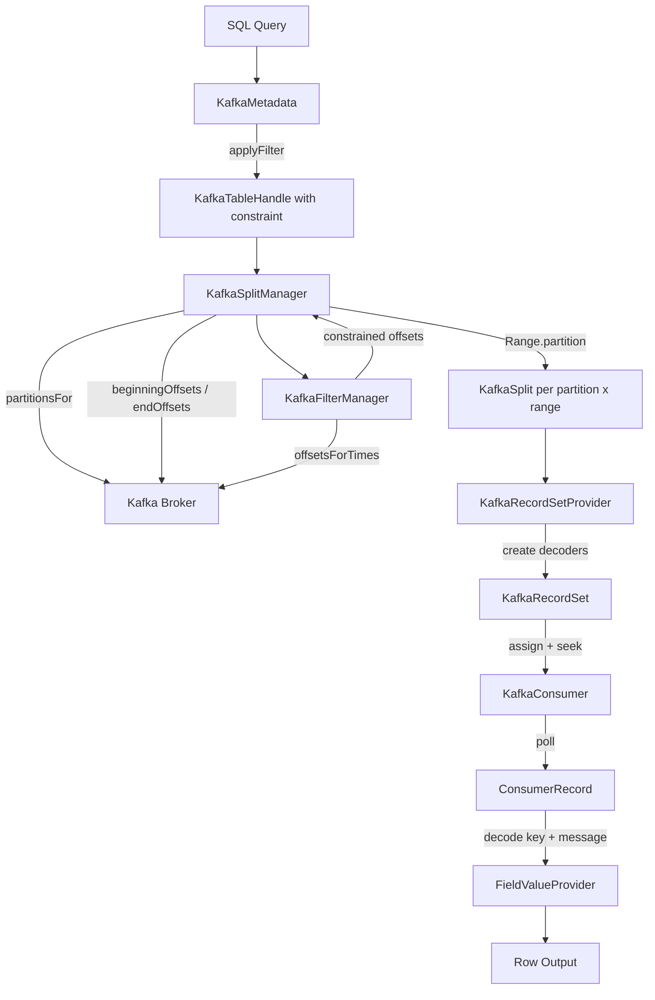

# 第26章 Kafka Connector

> **本章で読むソース**
>
> - [`plugin/trino-kafka/src/main/java/io/trino/plugin/kafka/KafkaConnectorFactory.java`](https://github.com/trinodb/trino/blob/482/plugin/trino-kafka/src/main/java/io/trino/plugin/kafka/KafkaConnectorFactory.java)
> - [`plugin/trino-kafka/src/main/java/io/trino/plugin/kafka/KafkaTopicDescription.java`](https://github.com/trinodb/trino/blob/482/plugin/trino-kafka/src/main/java/io/trino/plugin/kafka/KafkaTopicDescription.java)
> - [`plugin/trino-kafka/src/main/java/io/trino/plugin/kafka/KafkaMetadata.java`](https://github.com/trinodb/trino/blob/482/plugin/trino-kafka/src/main/java/io/trino/plugin/kafka/KafkaMetadata.java)
> - [`plugin/trino-kafka/src/main/java/io/trino/plugin/kafka/KafkaSplitManager.java`](https://github.com/trinodb/trino/blob/482/plugin/trino-kafka/src/main/java/io/trino/plugin/kafka/KafkaSplitManager.java)
> - [`plugin/trino-kafka/src/main/java/io/trino/plugin/kafka/KafkaFilterManager.java`](https://github.com/trinodb/trino/blob/482/plugin/trino-kafka/src/main/java/io/trino/plugin/kafka/KafkaFilterManager.java)
> - [`plugin/trino-kafka/src/main/java/io/trino/plugin/kafka/KafkaRecordSetProvider.java`](https://github.com/trinodb/trino/blob/482/plugin/trino-kafka/src/main/java/io/trino/plugin/kafka/KafkaRecordSetProvider.java)
> - [`plugin/trino-kafka/src/main/java/io/trino/plugin/kafka/KafkaRecordSet.java`](https://github.com/trinodb/trino/blob/482/plugin/trino-kafka/src/main/java/io/trino/plugin/kafka/KafkaRecordSet.java)
> - [`plugin/trino-kafka/src/main/java/io/trino/plugin/kafka/KafkaPageSinkProvider.java`](https://github.com/trinodb/trino/blob/482/plugin/trino-kafka/src/main/java/io/trino/plugin/kafka/KafkaPageSinkProvider.java)
> - [`plugin/trino-kafka/src/main/java/io/trino/plugin/kafka/schema/confluent/ConfluentSchemaRegistryTableDescriptionSupplier.java`](https://github.com/trinodb/trino/blob/482/plugin/trino-kafka/src/main/java/io/trino/plugin/kafka/schema/confluent/ConfluentSchemaRegistryTableDescriptionSupplier.java)

## この章の狙い

Hive Connector や Iceberg Connector が扱うデータは、ファイルシステム上に永続化されたバッチデータである。
これに対し **Kafka Connector** が扱うのは、Kafka のトピックに流れるメッセージストリームである。
本章では、無限に追記されるメッセージストリームをリレーショナルテーブルとして見せるために、Kafka Connector がどのような設計を採っているかを読む。
トピックとスキーマの対応付け、パーティションからの Split 生成、オフセットとタイムスタンプによるフィルタプッシュダウン、そして Consumer による逐次読み取りの仕組みに注目する。

## 前提

- Trino の Connector SPI（`ConnectorMetadata`, `ConnectorSplitManager`, `ConnectorRecordSetProvider`）の役割を知っていること（第21章）。
- Split がデータ読み取りの並列単位であることを理解していること（第12章）。
- Apache Kafka のトピック、パーティション、オフセット、Consumer の基本概念に馴染みがあること。

## Connector の組み立て

`KafkaConnectorFactory` は Guice の `Bootstrap` を用いて依存関係を組み立て、`KafkaConnector` インスタンスを返す。

[`plugin/trino-kafka/src/main/java/io/trino/plugin/kafka/KafkaConnectorFactory.java` L57-L78](https://github.com/trinodb/trino/blob/482/plugin/trino-kafka/src/main/java/io/trino/plugin/kafka/KafkaConnectorFactory.java#L57-L78)

```java
        Bootstrap app = new Bootstrap(
                "io.trino.bootstrap.catalog." + catalogName,
                ImmutableList.<Module>builder()
                        .add(new JsonModule())
                        .add(new TypeDeserializerModule())
                        .add(new KafkaConnectorModule())
                        .add(new KafkaClientsModule())
                        .add(new KafkaSecurityModule())
                        .add(new ConnectorContextModule(catalogName, context))
                        .add(binder -> {
                            binder.bind(ClassLoader.class).toInstance(KafkaConnectorFactory.class.getClassLoader());
                        })
                        .add(extensions.get())
                        .build());

        Injector injector = app
                .doNotInitializeLogging()
                .disableSystemProperties()
                .setRequiredConfigurationProperties(config)
                .initialize();

        return injector.getInstance(KafkaConnector.class);
```

`KafkaConnectorModule` が `KafkaMetadata`, `KafkaSplitManager`, `KafkaRecordSetProvider` などの中核バインディングを定義する。
`KafkaClientsModule` は Kafka Consumer と Producer のファクトリを提供し、`KafkaSecurityModule` は SASL/SSL などの認証設定を担う。
`extensions` フィールドはスキーマ定義の方式（JSON ファイル、Confluent Schema Registry など）を差し替えるための拡張ポイントである。

## トピックとスキーマの対応付け

### KafkaTopicDescription

Kafka のメッセージにはスキーマが組み込まれていないため、トピックとテーブルスキーマの対応をコネクタ側で定義する必要がある。
**`KafkaTopicDescription`** がその対応を保持する record である。

[`plugin/trino-kafka/src/main/java/io/trino/plugin/kafka/KafkaTopicDescription.java` L25-L31](https://github.com/trinodb/trino/blob/482/plugin/trino-kafka/src/main/java/io/trino/plugin/kafka/KafkaTopicDescription.java#L25-L31)

```java
public record KafkaTopicDescription(
        String tableName,
        Optional<String> schemaName,
        String topicName,
        Optional<KafkaTopicFieldGroup> key,
        Optional<KafkaTopicFieldGroup> message)
```

`tableName` は Trino 上のテーブル名、`topicName` は Kafka トピック名である。
`key` と `message` はそれぞれメッセージのキーとバリューに対応するフィールドグループであり、各グループはデータフォーマット（`json`, `avro`, `csv` など）とフィールド定義のリストを持つ。

[`plugin/trino-kafka/src/main/java/io/trino/plugin/kafka/KafkaTopicFieldGroup.java` L26-L30](https://github.com/trinodb/trino/blob/482/plugin/trino-kafka/src/main/java/io/trino/plugin/kafka/KafkaTopicFieldGroup.java#L26-L30)

```java
public record KafkaTopicFieldGroup(
        String dataFormat,
        Optional<String> dataSchema,
        Optional<String> subject,
        List<KafkaTopicFieldDescription> fields)
```

ユーザーは JSON ファイルでこの対応を定義するか、Confluent Schema Registry から自動取得するかを選択できる。

### Confluent Schema Registry 連携

**`ConfluentSchemaRegistryTableDescriptionSupplier`** は、Schema Registry に登録されたサブジェクトからテーブル定義を動的に生成する。
Kafka の慣例では、トピック `orders` に対してサブジェクト `orders-key` と `orders-value` がそれぞれキーとバリューのスキーマを定義する。

[`plugin/trino-kafka/src/main/java/io/trino/plugin/kafka/schema/confluent/ConfluentSchemaRegistryTableDescriptionSupplier.java` L153-L171](https://github.com/trinodb/trino/blob/482/plugin/trino-kafka/src/main/java/io/trino/plugin/kafka/schema/confluent/ConfluentSchemaRegistryTableDescriptionSupplier.java#L153-L171)

```java
    private SetMultimap<String, TopicAndSubjects> getTopicAndSubjects()
    {
        ImmutableSetMultimap.Builder<String, String> topicToSubjectsBuilder = ImmutableSetMultimap.builder();
        for (String subject : subjectsSupplier.get().values()) {
            if (isValidSubject(subject)) {
                topicToSubjectsBuilder.put(extractTopicFromSubject(subject), subject);
            }
        }
        ImmutableSetMultimap.Builder<String, TopicAndSubjects> topicSubjectsCacheBuilder = ImmutableSetMultimap.builder();
        for (Entry<String, Collection<String>> entry : topicToSubjectsBuilder.build().asMap().entrySet()) {
            String topic = entry.getKey();
            TopicAndSubjects topicAndSubjects = new TopicAndSubjects(
                    topic,
                    getKeySubjectFromTopic(topic, entry.getValue()),
                    getValueSubjectFromTopic(topic, entry.getValue()));
            topicSubjectsCacheBuilder.put(topicAndSubjects.tableName(), topicAndSubjects);
        }
        return topicSubjectsCacheBuilder.build();
    }
```

サブジェクト名からサフィックス（`-key`, `-value`）を除去してトピック名を抽出し、トピックと `TopicAndSubjects` のマッピングを構築する。
このマッピングは `memoizeWithExpiration` でキャッシュされ、設定された間隔で自動更新される。

デフォルトの命名規約に従わないサブジェクトについては、テーブル名にサブジェクトを埋め込む記法（`"my-topic&key-subject=foo&value-subject=bar"`）で明示的に指定できる。

## テーブルメタデータの生成

### KafkaMetadata の役割

**`KafkaMetadata`** は `ConnectorMetadata` を実装し、テーブル一覧の列挙、カラムハンドルの構築、フィルタの適用を担う。

`getColumnHandles` メソッドは、`KafkaTopicDescription` からユーザー定義カラムを取り出したうえで、コネクタが自動的に付加する**内部カラム**をマージする。

[`plugin/trino-kafka/src/main/java/io/trino/plugin/kafka/KafkaMetadata.java` L143-L175](https://github.com/trinodb/trino/blob/482/plugin/trino-kafka/src/main/java/io/trino/plugin/kafka/KafkaMetadata.java#L143-L175)

```java
    private Map<String, ColumnHandle> getColumnHandles(ConnectorSession session, SchemaTableName schemaTableName)
    {
        KafkaTopicDescription kafkaTopicDescription = getRequiredTopicDescription(session, schemaTableName);

        Stream<KafkaColumnHandle> keyColumnHandles = kafkaTopicDescription.key().stream()
                .map(KafkaTopicFieldGroup::fields)
                .flatMap(Collection::stream)
                .map(kafkaTopicFieldDescription -> kafkaTopicFieldDescription.columnHandle(true));

        Stream<KafkaColumnHandle> messageColumnHandles = kafkaTopicDescription.message().stream()
                .map(KafkaTopicFieldGroup::fields)
                .flatMap(Collection::stream)
                .map(kafkaTopicFieldDescription -> kafkaTopicFieldDescription.columnHandle(false));

        List<KafkaColumnHandle> topicColumnHandles = concat(keyColumnHandles, messageColumnHandles)
                .collect(toImmutableList());

        List<KafkaColumnHandle> internalColumnHandles = kafkaInternalFieldManager.getInternalFields().stream()
                .map(kafkaInternalField -> kafkaInternalField.getColumnHandle(hideInternalColumns))
                .collect(toImmutableList());

        // ... (中略) ...

        return concat(topicColumnHandles.stream(), internalColumnHandles.stream())
                .collect(toImmutableMap(KafkaColumnHandle::getName, identity()));
    }
```

キーのフィールドとメッセージのフィールドを連結し、さらに内部カラムを追加する。
ユーザー定義カラムと内部カラムの名前が衝突した場合は `DUPLICATE_COLUMN_NAME` エラーを送出する。
この衝突は `kafka.internal-column-prefix` 設定（デフォルトは `_`）を変更することで回避できる。

### 内部カラム

**`KafkaInternalFieldManager`** は、Kafka メッセージのメタデータを SQL カラムとして公開するための内部カラムを管理する。
以下の 10 カラムが定義されている。

| 内部カラム | 型 | 内容 |
|---|---|---|
| `_partition_id` | BIGINT | パーティション ID |
| `_partition_offset` | BIGINT | パーティション内のオフセット |
| `_message_corrupt` | BOOLEAN | メッセージのデコードが失敗したか |
| `_message` | VARCHAR | メッセージ本文（UTF-8） |
| `_headers` | MAP(VARCHAR, ARRAY(VARBINARY)) | メッセージヘッダー |
| `_message_length` | BIGINT | メッセージのバイト長 |
| `_key_corrupt` | BOOLEAN | キーのデコードが失敗したか |
| `_key` | VARCHAR | キー本文（UTF-8） |
| `_key_length` | BIGINT | キーのバイト長 |
| `_timestamp` | TIMESTAMP(3) | メッセージのタイムスタンプ |

これらのカラムはデフォルトで hidden 属性が付与されており、`SELECT *` には含まれない。
明示的に `SELECT _partition_id, _partition_offset FROM topic` のように指定すると値を取得できる。
メッセージストリームに本来存在しないオフセットやタイムスタンプといったメタデータを、リレーショナルモデルのカラムとして透過的に参照できる点が、この設計の特徴である。

### フィルタの適用

`applyFilter` メソッドは、Trino エンジンから渡されたフィルタ条件を `KafkaTableHandle` の `constraint` フィールドに蓄積する。

[`plugin/trino-kafka/src/main/java/io/trino/plugin/kafka/KafkaMetadata.java` L246-L269](https://github.com/trinodb/trino/blob/482/plugin/trino-kafka/src/main/java/io/trino/plugin/kafka/KafkaMetadata.java#L246-L269)

```java
    public Optional<ConstraintApplicationResult<ConnectorTableHandle>> applyFilter(ConnectorSession session, ConnectorTableHandle table, Constraint constraint)
    {
        KafkaTableHandle handle = (KafkaTableHandle) table;
        TupleDomain<ColumnHandle> oldDomain = handle.constraint();
        TupleDomain<ColumnHandle> newDomain = oldDomain.intersect(constraint.getSummary());
        if (oldDomain.equals(newDomain)) {
            return Optional.empty();
        }

        handle = new KafkaTableHandle(
                handle.schemaName(),
                handle.tableName(),
                handle.topicName(),
                handle.keyDataFormat(),
                handle.messageDataFormat(),
                handle.keyDataSchemaLocation(),
                handle.messageDataSchemaLocation(),
                handle.keySubject(),
                handle.messageSubject(),
                handle.columns(),
                newDomain);

        return Optional.of(new ConstraintApplicationResult<>(handle, constraint.getSummary(), constraint.getExpression(), false));
    }
```

既存の constraint と新しい constraint を `intersect` でマージし、変化があれば新しいハンドルを返す。
ここで蓄積されたフィルタ条件は、Split 生成時に `KafkaFilterManager` が参照する。

## Split の生成とフィルタプッシュダウン

### KafkaSplitManager

**`KafkaSplitManager`** は、トピックのパーティション情報を Kafka Consumer から取得し、各パーティションのオフセット範囲を元に `KafkaSplit` を生成する。

[`plugin/trino-kafka/src/main/java/io/trino/plugin/kafka/KafkaSplitManager.java` L61-L108](https://github.com/trinodb/trino/blob/482/plugin/trino-kafka/src/main/java/io/trino/plugin/kafka/KafkaSplitManager.java#L61-L108)

```java
    public ConnectorSplitSource getSplits(
            ConnectorTransactionHandle transaction,
            ConnectorSession session,
            ConnectorTableHandle table,
            Set<ColumnHandle> dynamicFilterColumns,
            Constraint constraint)
    {
        KafkaTableHandle kafkaTableHandle = (KafkaTableHandle) table;
        try (KafkaConsumer<byte[], byte[]> kafkaConsumer = consumerFactory.create(session)) {
            List<PartitionInfo> partitionInfos = kafkaConsumer.partitionsFor(kafkaTableHandle.topicName());

            List<TopicPartition> topicPartitions = partitionInfos.stream()
                    .map(KafkaSplitManager::toTopicPartition)
                    .collect(toImmutableList());

            Map<TopicPartition, Long> partitionBeginOffsets = kafkaConsumer.beginningOffsets(topicPartitions);
            Map<TopicPartition, Long> partitionEndOffsets = kafkaConsumer.endOffsets(topicPartitions);
            KafkaFilteringResult kafkaFilteringResult = kafkaFilterManager.getKafkaFilterResult(
                    session,
                    kafkaTableHandle,
                    partitionInfos,
                    partitionBeginOffsets,
                    partitionEndOffsets);
            // ... (中略) ...

            for (PartitionInfo partitionInfo : partitionInfos) {
                TopicPartition topicPartition = toTopicPartition(partitionInfo);
                HostAddress leader = HostAddress.fromParts(partitionInfo.leader().host(), partitionInfo.leader().port());
                new Range(partitionBeginOffsets.get(topicPartition), partitionEndOffsets.get(topicPartition))
                        .partition(messagesPerSplit).stream()
                        .map(range -> new KafkaSplit(
                                kafkaTableHandle.topicName(),
                                kafkaTableHandle.keyDataFormat(),
                                kafkaTableHandle.messageDataFormat(),
                                keyDataSchemaContents,
                                messageDataSchemaContents,
                                partitionInfo.partition(),
                                range,
                                leader))
                        .forEach(splits::add);
            }
            return new FixedSplitSource(splits.build());
        }
```

処理の流れは次のとおりである。

1. Kafka Consumer でトピックのパーティション一覧を取得する。
2. 各パーティションの先頭オフセット（`beginningOffsets`）と末尾オフセット（`endOffsets`）を取得する。
3. `KafkaFilterManager` にフィルタ条件を渡し、オフセット範囲とパーティション一覧を絞り込む。
4. 絞り込まれた各パーティションのオフセット範囲を `messagesPerSplit`（デフォルト値あり）単位で分割し、`KafkaSplit` を生成する。

`Range.partition` メソッドがオフセット範囲の分割を行う。

[`plugin/trino-kafka/src/main/java/io/trino/plugin/kafka/Range.java` L27-L40](https://github.com/trinodb/trino/blob/482/plugin/trino-kafka/src/main/java/io/trino/plugin/kafka/Range.java#L27-L40)

```java
public record Range(long begin, long end)
{
    private static final int INSTANCE_SIZE = instanceSize(Range.class);

    public List<Range> partition(int partitionSize)
    {
        ImmutableList.Builder<Range> partitions = ImmutableList.builder();
        long position = begin;
        while (position <= end) {
            partitions.add(new Range(position, min(position + partitionSize, end)));
            position += partitionSize;
        }
        return partitions.build();
    }
```

`begin` は包含、`end` は排他の半開区間である。
1つのパーティションのメッセージ数が多い場合、複数の Split に分割されて並列実行の対象になる。

### KafkaFilterManager によるフィルタプッシュダウン

**`KafkaFilterManager`** は、`KafkaTableHandle` に蓄積された constraint から `_partition_id`, `_partition_offset`, `_timestamp` に対する条件を抽出し、Split 生成時のオフセット範囲とパーティション一覧を絞り込む。

[`plugin/trino-kafka/src/main/java/io/trino/plugin/kafka/KafkaFilterManager.java` L79-L153](https://github.com/trinodb/trino/blob/482/plugin/trino-kafka/src/main/java/io/trino/plugin/kafka/KafkaFilterManager.java#L79-L153)

```java
    public KafkaFilteringResult getKafkaFilterResult(
            ConnectorSession session,
            KafkaTableHandle kafkaTableHandle,
            List<PartitionInfo> partitionInfos,
            Map<TopicPartition, Long> partitionBeginOffsets,
            Map<TopicPartition, Long> partitionEndOffsets)
    {
        // ... (中略) ...

        if (!constraint.isAll()) {
            // ... (中略) ...
            Optional<Range> offsetRanged = getDomain(PARTITION_OFFSET_FIELD, domains)
                    .flatMap(KafkaFilterManager::filterRangeByDomain);
            Set<Long> partitionIdsFiltered = getDomain(PARTITION_ID_FIELD, domains)
                    .map(domain -> filterValuesByDomain(domain, partitionIds))
                    .orElse(partitionIds);
            Optional<Range> offsetTimestampRanged = getDomain(OFFSET_TIMESTAMP_FIELD, domains)
                    .flatMap(KafkaFilterManager::filterRangeByDomain);

            // push down offset
            if (offsetRanged.isPresent()) {
                Range range = offsetRanged.get();
                partitionBeginOffsets = overridePartitionBeginOffsets(
                        partitionBeginOffsets,
                        _ -> (range.begin() != INVALID_KAFKA_RANGE_INDEX) ? Optional.of(range.begin()) : Optional.empty());
                partitionEndOffsets = overridePartitionEndOffsets(
                        partitionEndOffsets,
                        _ -> (range.end() != INVALID_KAFKA_RANGE_INDEX) ? Optional.of(range.end()) : Optional.empty());
            }
```

フィルタプッシュダウンは 3 種類の内部カラムに対応している。

- **`_partition_offset`**：オフセット範囲のプッシュダウン。`WHERE _partition_offset BETWEEN 100 AND 200` のような条件で、各パーティションの読み取り範囲を直接制限する。
- **`_partition_id`**：パーティション ID のフィルタリング。`WHERE _partition_id IN (0, 1)` のような条件で、対象パーティションを絞り込み、不要なパーティションの Split を生成しない。
- **`_timestamp`**：タイムスタンプの範囲指定。Kafka Consumer の `offsetsForTimes` API を利用して、指定されたタイムスタンプに対応するオフセットを逆引きし、オフセット範囲に変換する。

タイムスタンプの上限側プッシュダウンには制約がある。
Kafka のメッセージタイムスタンプには `CreateTime`（プロデューサーが付与）と `LogAppendTime`（ブローカーが付与）の 2 種類が存在する。
`CreateTime` ではタイムスタンプの順序がオフセットの順序と一致する保証がないため、上限プッシュダウンを適用するとメッセージの欠落が起こりうる。
`KafkaFilterManager` は `isTimestampUpperBoundPushdownEnabled` メソッドでトピックの `message.timestamp.type` 設定を確認し、`LogAppendTime` の場合にのみ安全に上限プッシュダウンを有効化する。

[`plugin/trino-kafka/src/main/java/io/trino/plugin/kafka/KafkaFilterManager.java` L161-L181](https://github.com/trinodb/trino/blob/482/plugin/trino-kafka/src/main/java/io/trino/plugin/kafka/KafkaFilterManager.java#L161-L181)

```java
    private boolean isTimestampUpperBoundPushdownEnabled(ConnectorSession session, String topic)
    {
        try (Admin adminClient = adminFactory.create(session)) {
            ConfigResource topicResource = new ConfigResource(ConfigResource.Type.TOPIC, topic);

            DescribeConfigsResult describeResult = adminClient.describeConfigs(Collections.singleton(topicResource));
            Map<ConfigResource, Config> configMap = describeResult.all().get();

            if (configMap != null) {
                Config config = configMap.get(topicResource);
                String timestampType = config.get(TOPIC_CONFIG_TIMESTAMP_KEY).value();
                if (TOPIC_CONFIG_TIMESTAMP_VALUE_LOG_APPEND_TIME.equals(timestampType)) {
                    return true;
                }
            }
        }
        catch (Exception e) {
            throw new TrinoException(KAFKA_SPLIT_ERROR, format("Failed to get configuration for topic '%s'", topic), e);
        }
        return KafkaSessionProperties.isTimestampUpperBoundPushdownEnabled(session);
    }
```

## Consumer による逐次読み取り

### KafkaRecordSetProvider

**`KafkaRecordSetProvider`** は `ConnectorRecordSetProvider` を実装し、Split ごとにデコーダと `KafkaRecordSet` を組み立てる。

[`plugin/trino-kafka/src/main/java/io/trino/plugin/kafka/KafkaRecordSetProvider.java` L54-L83](https://github.com/trinodb/trino/blob/482/plugin/trino-kafka/src/main/java/io/trino/plugin/kafka/KafkaRecordSetProvider.java#L54-L83)

```java
    public RecordSet getRecordSet(ConnectorTransactionHandle transaction, ConnectorSession session, ConnectorSplit split, ConnectorTableHandle table, List<? extends ColumnHandle> columns)
    {
        KafkaSplit kafkaSplit = (KafkaSplit) split;

        List<KafkaColumnHandle> kafkaColumns = columns.stream()
                .map(KafkaColumnHandle.class::cast)
                .collect(toImmutableList());

        RowDecoder keyDecoder = decoderFactory.create(
                session,
                new RowDecoderSpec(
                        kafkaSplit.getKeyDataFormat(),
                        getDecoderParameters(kafkaSplit.getKeyDataSchemaContents()),
                        kafkaColumns.stream()
                                .filter(col -> !col.isInternal())
                                .filter(KafkaColumnHandle::isKeyCodec)
                                .collect(toImmutableSet())));

        RowDecoder messageDecoder = decoderFactory.create(
                session,
                new RowDecoderSpec(
                        kafkaSplit.getMessageDataFormat(),
                        getDecoderParameters(kafkaSplit.getMessageDataSchemaContents()),
                        kafkaColumns.stream()
                                .filter(col -> !col.isInternal())
                                .filter(col -> !col.isKeyCodec())
                                .collect(toImmutableSet())));

        return new KafkaRecordSet(kafkaSplit, consumerFactory, session, kafkaColumns, keyDecoder, messageDecoder, kafkaInternalFieldManager);
    }
```

カラムハンドルを `isKeyCodec` フラグで振り分け、キーとメッセージそれぞれに対応する `RowDecoder` を `DispatchingRowDecoderFactory` から生成する。
`DispatchingRowDecoderFactory` は `KafkaSplit` が保持するフォーマット名（`json`, `avro`, `csv`, `raw` など）に基づいて適切なデコーダ実装を選択する。

### KafkaRecordSet と RecordCursor

**`KafkaRecordSet`** は `RecordSet` を実装し、内部クラス `KafkaRecordCursor` で Kafka Consumer からのメッセージ読み取りを行う。

[`plugin/trino-kafka/src/main/java/io/trino/plugin/kafka/KafkaRecordSet.java` L123-L161](https://github.com/trinodb/trino/blob/482/plugin/trino-kafka/src/main/java/io/trino/plugin/kafka/KafkaRecordSet.java#L123-L161)

```java
        private KafkaRecordCursor()
        {
            topicPartition = new TopicPartition(split.getTopicName(), split.getPartitionId());
            kafkaConsumer = consumerFactory.create(connectorSession);
            kafkaConsumer.assign(ImmutableList.of(topicPartition));
            kafkaConsumer.seek(topicPartition, split.getMessagesRange().begin());
        }

        // ... (中略) ...

        @Override
        public boolean advanceNextPosition()
        {
            if (records.hasNext()) {
                return nextRow(records.next());
            }
            if (kafkaConsumer.position(topicPartition) >= split.getMessagesRange().end()) {
                return false;
            }
            records = kafkaConsumer.poll(Duration.ofMillis(CONSUMER_POLL_TIMEOUT)).iterator();
            return advanceNextPosition();
        }
```

コンストラクタで Consumer を特定のパーティションに `assign` し、Split が指定する開始オフセットに `seek` する。
`advanceNextPosition` は、バッファ内のレコードを順次消費し、バッファが空になると `poll` で次のバッチを取得する。
Consumer の現在位置が Split の終了オフセットに達すると `false` を返して読み取りを終了する。

各レコードの処理は `nextRow` メソッドで行われる。

[`plugin/trino-kafka/src/main/java/io/trino/plugin/kafka/KafkaRecordSet.java` L163-L205](https://github.com/trinodb/trino/blob/482/plugin/trino-kafka/src/main/java/io/trino/plugin/kafka/KafkaRecordSet.java#L163-L205)

```java
        private boolean nextRow(ConsumerRecord<byte[], byte[]> message)
        {
            requireNonNull(message, "message is null");

            if (message.offset() >= split.getMessagesRange().end()) {
                return false;
            }

            completedBytes += max(message.serializedKeySize(), 0) + max(message.serializedValueSize(), 0);

            byte[] keyData = message.key() == null ? EMPTY_BYTE_ARRAY : message.key();
            byte[] messageData = message.value() == null ? EMPTY_BYTE_ARRAY : message.value();
            long timeStamp = message.timestamp() * MICROSECONDS_PER_MILLISECOND;

            Optional<Map<DecoderColumnHandle, FieldValueProvider>> decodedKey = keyDecoder.decodeRow(keyData);
            // tombstone message has null value body
            Optional<Map<DecoderColumnHandle, FieldValueProvider>> decodedValue = message.value() == null ? Optional.empty() : messageDecoder.decodeRow(messageData);

            Map<ColumnHandle, FieldValueProvider> currentRowValuesMap = columnHandles.stream()
                    .filter(KafkaColumnHandle::isInternal)
                    .collect(toMap(identity(), columnHandle -> switch (getInternalFieldId(columnHandle)) {
                        case PARTITION_OFFSET_FIELD -> longValueProvider(message.offset());
                        case MESSAGE_FIELD -> bytesValueProvider(messageData);
                        // ... (中略) ...
                        case PARTITION_ID_FIELD -> longValueProvider(message.partition());
                    }));

            decodedKey.ifPresent(currentRowValuesMap::putAll);
            decodedValue.ifPresent(currentRowValuesMap::putAll);
```

メッセージのキーとバリューをそれぞれのデコーダでデコードし、内部カラムの値と合わせて `currentRowValues` 配列に格納する。
デコードが失敗した場合は `Optional.empty()` が返り、`_key_corrupt` や `_message_corrupt` が `true` に設定される。
Kafka の tombstone メッセージ（value が null）も正しく扱い、バリューのデコードをスキップする。

## Kafka への書き込み

### KafkaPageSinkProvider と KafkaPageSink

Kafka Connector は `INSERT INTO` 文による書き込みもサポートする。
**`KafkaPageSinkProvider`** はカラムをキーカラムとメッセージカラムに振り分け、それぞれの `RowEncoder` を生成して `KafkaPageSink` に渡す。

[`plugin/trino-kafka/src/main/java/io/trino/plugin/kafka/KafkaPageSinkProvider.java` L70-L109](https://github.com/trinodb/trino/blob/482/plugin/trino-kafka/src/main/java/io/trino/plugin/kafka/KafkaPageSinkProvider.java#L70-L109)

```java
    public ConnectorPageSink createPageSink(
            ConnectorTransactionHandle transactionHandle,
            ConnectorSession session,
            ConnectorInsertTableHandle tableHandle,
            Optional<ConnectorTableCredentials> tableCredentials,
            ConnectorPageSinkId pageSinkId)
    {
        requireNonNull(tableHandle, "tableHandle is null");
        KafkaTableHandle handle = (KafkaTableHandle) tableHandle;

        ImmutableList.Builder<EncoderColumnHandle> keyColumns = ImmutableList.builder();
        ImmutableList.Builder<EncoderColumnHandle> messageColumns = ImmutableList.builder();
        handle.columns().forEach(col -> {
            if (col.isInternal()) {
                throw new IllegalArgumentException(format("unexpected internal column '%s'", col.getName()));
            }
            if (col.isKeyCodec()) {
                keyColumns.add(col);
            }
            else {
                messageColumns.add(col);
            }
        });

        RowEncoder keyEncoder = encoderFactory.create(
                session,
                toRowEncoderSpec(handle, keyColumns.build(), KEY));

        RowEncoder messageEncoder = encoderFactory.create(
                session,
                toRowEncoderSpec(handle, messageColumns.build(), MESSAGE));

        return new KafkaPageSink(
                handle.topicName(),
                handle.columns(),
                keyEncoder,
                messageEncoder,
                producerFactory,
                session);
    }
```

`KafkaPageSink` の `appendPage` メソッドは、Page の各行についてキーとメッセージをエンコードし、`KafkaProducer.send` で非同期に送信する。

[`plugin/trino-kafka/src/main/java/io/trino/plugin/kafka/KafkaPageSink.java` L115-L138](https://github.com/trinodb/trino/blob/482/plugin/trino-kafka/src/main/java/io/trino/plugin/kafka/KafkaPageSink.java#L115-L138)

```java
    public CompletableFuture<?> appendPage(Page page)
    {
        byte[] keyBytes;
        byte[] messageBytes;

        for (int position = 0; position < page.getPositionCount(); position++) {
            for (int channel = 0; channel < page.getChannelCount(); channel++) {
                if (columns.get(channel).isKeyCodec()) {
                    keyEncoder.appendColumnValue(page.getBlock(channel), position);
                }
                else {
                    messageEncoder.appendColumnValue(page.getBlock(channel), position);
                }
            }

            keyBytes = keyEncoder.toByteArray();
            messageBytes = messageEncoder.toByteArray();

            expectedWrittenBytes += keyBytes.length + messageBytes.length;

            producer.send(new ProducerRecord<>(topicName, keyBytes, messageBytes), producerCallback);
        }
        return NOT_BLOCKED;
    }
```

送信結果は `ProducerCallback` で非同期に追跡される。
`finish` メソッドで `producer.flush()` を呼び出して全レコードの送信完了を待ち、エラーがあれば例外を送出する。
実際に書き込まれたバイト数と期待値の一致も検証される。

ただし、この書き込みはトランザクショナルではない[^1]。
`beginInsert` で `retryMode` が `NO_RETRIES` であることを強制しており、Trino のクエリリトライ機構には対応していない。

## データフローの全体像

以下の図は、クエリの計画から読み取りまでのデータフローを示す。



## 設計上の工夫: 内部カラムによるメタデータの SQL 統合

Kafka Connector の設計で注目すべき工夫は、ストリームメッセージのメタデータをリレーショナルモデルに統合する方法である。

Hive Connector や Iceberg Connector が扱うファイルベースのデータソースでは、データの物理配置（パーティション、ファイルパス、行グループ）はクエリエンジン内部のメタデータとして処理され、ユーザーに直接公開される必要がない。
一方 Kafka では、オフセット、パーティション ID、タイムスタンプがメッセージの位置と順序を一意に特定する座標であり、クエリの絞り込み条件として頻繁に使われる。

Kafka Connector は、これらのメタデータを通常のカラムと同じ `KafkaColumnHandle` として扱う。
内部カラムは hidden 属性を持つため `SELECT *` に混入しないが、明示的に参照すれば `WHERE` 句にも使える。
`KafkaMetadata.applyFilter` は内部カラムに対するフィルタも他のカラムと同様に `TupleDomain` として蓄積し、`KafkaFilterManager` が Split 生成時にこれをオフセット範囲の絞り込みへ変換する。

この設計により、ユーザーは `WHERE _timestamp > TIMESTAMP '2024-01-01'` のような SQL を書くだけで、実際にはタイムスタンプからオフセットへの変換が行われ、不要なメッセージの読み取りがスキップされる。
フィルタの解釈を Split 生成の段階に集約することで、各 Worker の `KafkaRecordCursor` は指定されたオフセット範囲を単純に順次読み取ればよく、フィルタ評価の重複が生じない。

## まとめ

- `KafkaTopicDescription` がトピックとテーブルスキーマの対応を定義する。JSON ファイルによる静的定義と Confluent Schema Registry による動的取得の 2 方式がある。
- `KafkaMetadata` はユーザー定義カラムに加え、`_partition_id`, `_partition_offset`, `_timestamp` などの内部カラムを自動付加する。これにより、ストリームのメタデータが SQL カラムとして透過的に参照できる。
- `KafkaSplitManager` は Kafka パーティションのオフセット範囲を `messagesPerSplit` 単位で分割し、並列読み取り可能な `KafkaSplit` を生成する。
- `KafkaFilterManager` は内部カラムに対するフィルタ条件を Split 生成時にプッシュダウンし、`_partition_offset` の直接範囲指定、`_partition_id` による対象パーティション絞り込み、`_timestamp` からオフセットへの逆引きの 3 種類に対応する。タイムスタンプ上限のプッシュダウンは `LogAppendTime` 設定のトピックでのみ安全に適用される。
- `KafkaRecordSet` の `RecordCursor` は、Split が指すパーティションに Consumer を assign/seek し、オフセット範囲内のメッセージを逐次読み取る。キーとバリューは `RowDecoder` でデコードされ、内部カラムの値と合わせて行データに変換される。
- `KafkaPageSink` は INSERT 時に `KafkaProducer` を用いた非同期書き込みを行い、`ProducerCallback` で書き込み結果を検証する。

## 関連する章

- [第21章 Connector SPI の詳細](21-connector-spi-detail.md)
- [第22章 Hive Connector](22-hive-connector.md)
- [第23章 Iceberg Connector](23-iceberg-connector.md)

[^1]: トランザクショナルな INSERT のサポートは [trinodb/trino#4303](https://github.com/trinodb/trino/issues/4303) で追跡されている。
