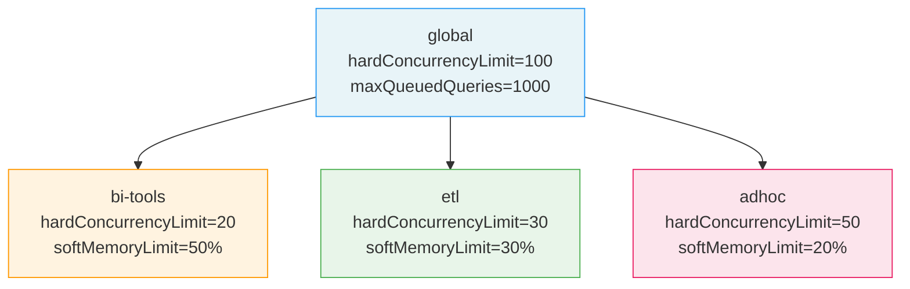
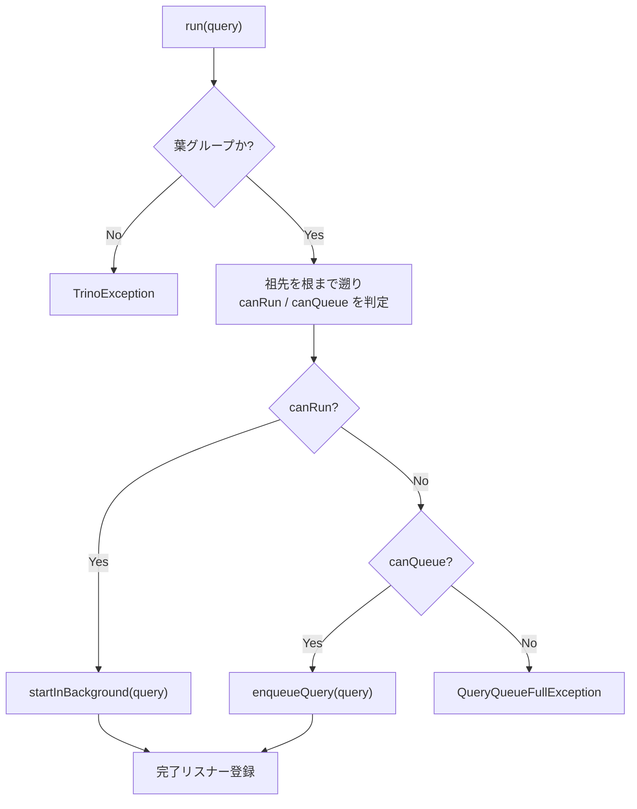
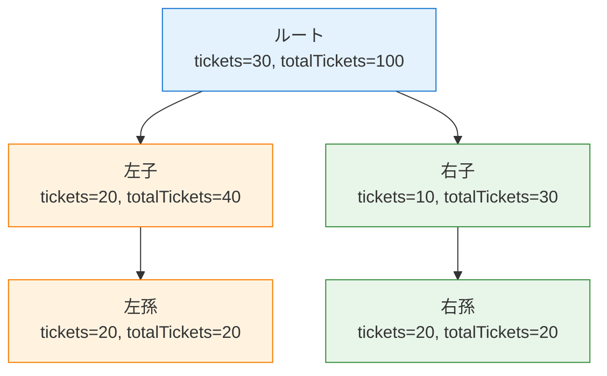

# 第23章 リソースグループとクエリキューイング

> **本章で読むソース**
>
> - [`core/trino-main/src/main/java/io/trino/execution/resourcegroups/InternalResourceGroup.java`](https://github.com/trinodb/trino/blob/482/core/trino-main/src/main/java/io/trino/execution/resourcegroups/InternalResourceGroup.java)
> - [`core/trino-main/src/main/java/io/trino/execution/resourcegroups/InternalResourceGroupManager.java`](https://github.com/trinodb/trino/blob/482/core/trino-main/src/main/java/io/trino/execution/resourcegroups/InternalResourceGroupManager.java)
> - [`core/trino-main/src/main/java/io/trino/execution/resourcegroups/StochasticPriorityQueue.java`](https://github.com/trinodb/trino/blob/482/core/trino-main/src/main/java/io/trino/execution/resourcegroups/StochasticPriorityQueue.java)
> - [`core/trino-main/src/main/java/io/trino/execution/resourcegroups/IndexedPriorityQueue.java`](https://github.com/trinodb/trino/blob/482/core/trino-main/src/main/java/io/trino/execution/resourcegroups/IndexedPriorityQueue.java)
> - [`core/trino-main/src/main/java/io/trino/execution/resourcegroups/WeightedFairQueue.java`](https://github.com/trinodb/trino/blob/482/core/trino-main/src/main/java/io/trino/execution/resourcegroups/WeightedFairQueue.java)
> - [`core/trino-main/src/main/java/io/trino/execution/resourcegroups/FifoQueue.java`](https://github.com/trinodb/trino/blob/482/core/trino-main/src/main/java/io/trino/execution/resourcegroups/FifoQueue.java)
> - [`core/trino-spi/src/main/java/io/trino/spi/resourcegroups/ResourceGroup.java`](https://github.com/trinodb/trino/blob/482/core/trino-spi/src/main/java/io/trino/spi/resourcegroups/ResourceGroup.java)
> - [`core/trino-spi/src/main/java/io/trino/spi/resourcegroups/ResourceGroupConfigurationManager.java`](https://github.com/trinodb/trino/blob/482/core/trino-spi/src/main/java/io/trino/spi/resourcegroups/ResourceGroupConfigurationManager.java)
> - [`core/trino-spi/src/main/java/io/trino/spi/resourcegroups/SelectionContext.java`](https://github.com/trinodb/trino/blob/482/core/trino-spi/src/main/java/io/trino/spi/resourcegroups/SelectionContext.java)
> - [`core/trino-spi/src/main/java/io/trino/spi/resourcegroups/SelectionCriteria.java`](https://github.com/trinodb/trino/blob/482/core/trino-spi/src/main/java/io/trino/spi/resourcegroups/SelectionCriteria.java)
> - [`plugin/trino-resource-group-managers/src/main/java/io/trino/plugin/resourcegroups/FileResourceGroupConfigurationManager.java`](https://github.com/trinodb/trino/blob/482/plugin/trino-resource-group-managers/src/main/java/io/trino/plugin/resourcegroups/FileResourceGroupConfigurationManager.java)
> - [`plugin/trino-resource-group-managers/src/main/java/io/trino/plugin/resourcegroups/AbstractResourceConfigurationManager.java`](https://github.com/trinodb/trino/blob/482/plugin/trino-resource-group-managers/src/main/java/io/trino/plugin/resourcegroups/AbstractResourceConfigurationManager.java)

## この章の狙い

マルチテナント環境で Trino クラスタを運用する場合、特定のユーザーや用途のクエリがリソースを独占しないよう制御する仕組みが必要になる。
Trino はこの問題を**リソースグループ**というツリー構造の階層的なリソース制御機構で解決している。

本章では、リソースグループのツリー構造と各ノードが持つ制限パラメーター、クエリがキューイングされてからデキューされるまでのアルゴリズム、そして4種類のスケジューリングポリシーを支えるキュー実装を読む。
あわせて、設定をプラガブルに差し替える `ResourceGroupConfigurationManager` SPI と、JSON ファイルベースの設定マネージャーの実装を追う。

## 前提

- Trino の Coordinator がクエリを受け付けて実行するまでの流れ（第12章）を理解していること。
- SPI による Plugin の拡張機構（第18章）を知っていること。

## リソースグループのツリー構造

リソースグループは Coordinator 上のインメモリなツリー構造で、ルートから葉までの各ノードが同時実行数やメモリ使用量の上限を持つ。
クエリは必ず**葉グループ**に投入される。
中間グループは子孫のリソース消費を集約し、自身の制限を強制する。

`InternalResourceGroup` のクラスコメントがこの設計を端的に述べている。

[`core/trino-main/src/main/java/io/trino/execution/resourcegroups/InternalResourceGroup.java` L71-L77](https://github.com/trinodb/trino/blob/482/core/trino-main/src/main/java/io/trino/execution/resourcegroups/InternalResourceGroup.java#L71-L77)

```java
/**
 * Resource groups form a tree, and all access to a group is guarded by the root of the tree.
 * A group is considered a leaf if it has no subgroups, or all of its subgroups are disabled
 * and have no queued queries. Queries are submitted to leaf groups. Never to intermediate
 * groups. Intermediate groups aggregate resource consumption from their children, and may have
 * their own limitations that are enforced.
 */
```

この設計により、たとえば「全体で同時100クエリまで」という制限をルートに、「BI ツール用は同時20まで」「ETL 用は同時30まで」という制限を子グループに設定できる。



### ツリーのロック設計

ツリー全体のスレッドセーフティは、ルートノードを唯一のロック対象とするシンプルな方式で実現されている。

[`core/trino-main/src/main/java/io/trino/execution/resourcegroups/InternalResourceGroup.java` L149-L165](https://github.com/trinodb/trino/blob/482/core/trino-main/src/main/java/io/trino/execution/resourcegroups/InternalResourceGroup.java#L149-L165)

```java
private InternalResourceGroup(Optional<InternalResourceGroup> parent, String name, BiConsumer<InternalResourceGroup, Boolean> jmxExportListener, Executor executor)
{
    this.parent = requireNonNull(parent, "parent is null");
    this.jmxExportListener = requireNonNull(jmxExportListener, "jmxExportListener is null");
    this.executor = requireNonNull(executor, "executor is null");
    requireNonNull(name, "name is null");
    if (parent.isPresent()) {
        id = new ResourceGroupId(parent.get().id, name);
        root = parent.get().root;
        resourceUsageStagingInProgress = root.resourceUsageStagingInProgress;
    }
    else {
        id = new ResourceGroupId(name);
        root = this;
        resourceUsageStagingInProgress = new AtomicBoolean();
    }
}
```

子ノードのコンストラクタは `root = parent.get().root` としてルートへの参照を保持する。
以後、状態を変更するメソッドはすべて `synchronized (root)` で保護される。
ツリー全体を単一ロックで守ることで、親子間のリソース集計にデッドロックの危険がなくなる。

## InternalResourceGroup の制限パラメーター

`InternalResourceGroup` は SPI の `ResourceGroup` インターフェイスを実装し、以下の制限パラメーターを公開している。

[`core/trino-spi/src/main/java/io/trino/spi/resourcegroups/ResourceGroup.java` L19-L104](https://github.com/trinodb/trino/blob/482/core/trino-spi/src/main/java/io/trino/spi/resourcegroups/ResourceGroup.java#L19-L104)

```java
public interface ResourceGroup
{
    ResourceGroupId getId();
    long getSoftMemoryLimitBytes();
    void setSoftMemoryLimitBytes(long limit);
    // ... (中略) ...
    int getSoftConcurrencyLimit();
    void setSoftConcurrencyLimit(int softConcurrencyLimit);
    int getHardConcurrencyLimit();
    void setHardConcurrencyLimit(int hardConcurrencyLimit);
    int getMaxQueuedQueries();
    void setMaxQueuedQueries(int maxQueuedQueries);
    int getSchedulingWeight();
    void setSchedulingWeight(int weight);
    SchedulingPolicy getSchedulingPolicy();
    void setSchedulingPolicy(SchedulingPolicy policy);
    // ... (中略) ...
}
```

制限の種類は大きく3系統に分かれる。

- **同時実行数制限**：`softConcurrencyLimit` と `hardConcurrencyLimit` の2段階。ソフトリミットは「重み付きフェア」スケジューリングで使われ、ハードリミットは新規クエリの実行開始を止める閾値となる。
- **メモリ制限**：`softMemoryLimitBytes` を超えるとクエリはキューに入り、実行中のクエリが完了してメモリが解放されるまで待つ。
- **CPU とデータスキャン制限**：`softCpuLimitMillis` / `hardCpuLimitMillis` と `hardPhysicalDataScanLimitBytes` で、累積的なリソース消費に上限を設ける。CPU のソフトリミットを超えると、同時実行数のハードリミットが線形に引き下げられる。

`canRunMore()` がこれらの判定をまとめている。

[`core/trino-main/src/main/java/io/trino/execution/resourcegroups/InternalResourceGroup.java` L1072-L1096](https://github.com/trinodb/trino/blob/482/core/trino-main/src/main/java/io/trino/execution/resourcegroups/InternalResourceGroup.java#L1072-L1096)

```java
private boolean canRunMore()
{
    checkState(Thread.holdsLock(root), "Must hold lock");
    synchronized (root) {
        long cpuUsageMillis = cachedResourceUsage.getCpuUsageMillis();
        long memoryUsageBytes = cachedResourceUsage.getMemoryUsageBytes();
        long physicalInputDataUsageBytes = cachedResourceUsage.getPhysicalInputDataUsageBytes();
        if ((cpuUsageMillis >= hardCpuLimitMillis) || (memoryUsageBytes > softMemoryLimitBytes) || (physicalInputDataUsageBytes >= hardPhysicalDataScanLimitBytes)) {
            return false;
        }

        int hardConcurrencyLimit = this.hardConcurrencyLimit;
        if (cpuUsageMillis >= softCpuLimitMillis) {
            // TODO: Consider whether CPU limit math should be performed on softConcurrency or hardConcurrency
            // Linear penalty between soft and hard limit
            double penalty = (cpuUsageMillis - softCpuLimitMillis) / (double) (hardCpuLimitMillis - softCpuLimitMillis);
            hardConcurrencyLimit = (int) Math.floor(hardConcurrencyLimit * (1 - penalty));
            // Always penalize by at least one
            hardConcurrencyLimit = min(this.hardConcurrencyLimit - 1, hardConcurrencyLimit);
            // Always allow at least one running query
            hardConcurrencyLimit = Math.max(1, hardConcurrencyLimit);
        }
        return runningQueries.size() + descendantRunningQueries < hardConcurrencyLimit;
    }
}
```

CPU 使用量がソフトリミットとハードリミットの間にあるとき、`penalty` の値に応じて `hardConcurrencyLimit` が線形に低下する。
この設計により、CPU を大量に消費しているグループは段階的に新規クエリの実行が抑制され、急激なスロットリングを避けながらリソース消費を制御できる。

## クエリの投入とキューイング

クエリが Coordinator に投入されると、`InternalResourceGroupManager` がセレクターでグループを決定し、対象の `InternalResourceGroup.run()` を呼ぶ。

### グループの選択と生成

`InternalResourceGroupManager.selectGroup()` は、設定マネージャーの `match()` を呼んでクエリの属性（ユーザー名、ソース、タグなど）に合致するグループを決定する。

[`core/trino-main/src/main/java/io/trino/execution/resourcegroups/InternalResourceGroupManager.java` L117-L122](https://github.com/trinodb/trino/blob/482/core/trino-main/src/main/java/io/trino/execution/resourcegroups/InternalResourceGroupManager.java#L117-L122)

```java
@Override
public SelectionContext<C> selectGroup(SelectionCriteria criteria)
{
    return configurationManager.get().match(criteria)
            .orElseThrow(() -> new TrinoException(QUERY_REJECTED, "No matching resource group found with the configured selection rules"));
}
```

マッチするルールが見つからなければ `QUERY_REJECTED` で即座にエラーとなる。

グループが決まると `submit()` がツリー上にグループを作成し、クエリを投入する。

[`core/trino-main/src/main/java/io/trino/execution/resourcegroups/InternalResourceGroupManager.java` L110-L115](https://github.com/trinodb/trino/blob/482/core/trino-main/src/main/java/io/trino/execution/resourcegroups/InternalResourceGroupManager.java#L110-L115)

```java
@Override
public void submit(ManagedQueryExecution queryExecution, SelectionContext<C> selectionContext, Executor executor)
{
    checkState(configurationManager.get() != null, "configurationManager not set");
    createGroupIfNecessary(selectionContext, executor);
    groups.get(selectionContext.getResourceGroupId()).run(queryExecution);
}
```

### run() の処理フロー

`run()` メソッドは、クエリを直接実行するかキューに入れるかを判定する。

[`core/trino-main/src/main/java/io/trino/execution/resourcegroups/InternalResourceGroup.java` L672-L706](https://github.com/trinodb/trino/blob/482/core/trino-main/src/main/java/io/trino/execution/resourcegroups/InternalResourceGroup.java#L672-L706)

```java
public void run(ManagedQueryExecution query)
{
    synchronized (root) {
        if (!isLeafGroup()) {
            throw new TrinoException(INVALID_RESOURCE_GROUP, format("Cannot add queries to '%s'. It is not a leaf group.", id));
        }
        // Check all ancestors for capacity
        InternalResourceGroup group = this;
        boolean canQueue = true;
        boolean canRun = true;
        while (true) {
            canQueue = canQueue && group.canQueueMore();
            canRun = canRun && group.canRunMore();
            if (group.parent.isEmpty()) {
                break;
            }
            group = group.parent.get();
        }
        if (!canQueue && !canRun) {
            query.fail(new QueryQueueFullException(id));
            return;
        }
        if (canRun) {
            startInBackground(query);
        }
        else {
            enqueueQuery(query);
        }
        query.addStateChangeListener(state -> {
            if (state.isDone()) {
                queryFinished(query);
            }
        });
    }
}
```

判定は葉から根まで祖先をすべて遡り、どの階層でも `canRunMore()` が true であれば即座に実行を開始する。
いずれかの階層で実行不可であっても、キューに空きがあればキューイングする。
キューにも空きがなければ `QueryQueueFullException` でクエリを即座に失敗させる。



### キューイングと祖先カウンタの更新

`enqueueQuery()` はクエリをローカルキューに追加し、祖先の `descendantQueuedQueries` を加算する。

[`core/trino-main/src/main/java/io/trino/execution/resourcegroups/InternalResourceGroup.java` L708-L720](https://github.com/trinodb/trino/blob/482/core/trino-main/src/main/java/io/trino/execution/resourcegroups/InternalResourceGroup.java#L708-L720)

```java
private void enqueueQuery(ManagedQueryExecution query)
{
    checkState(Thread.holdsLock(root), "Must hold lock to enqueue a query");
    synchronized (root) {
        queuedQueries.addOrUpdate(query, getQueryPriority(query.getSession()));
        InternalResourceGroup group = this;
        while (group.parent.isPresent()) {
            group.parent.get().descendantQueuedQueries++;
            group = group.parent.get();
        }
        updateEligibility();
    }
}
```

`descendantQueuedQueries` と `descendantRunningQueries` は、各グループが子孫全体のクエリ数を O(1) で把握するためのカウンタである。
ツリーを毎回走査して集計する必要がないため、キューイングやデキューの判定が高速になる。

## デキューとクエリ起動のアルゴリズム

キューからクエリを取り出して起動する処理は、100 ミリ秒ごとに呼ばれる `refreshAndStartQueries()` が起点となる。

[`core/trino-main/src/main/java/io/trino/execution/resourcegroups/InternalResourceGroupManager.java` L186-L222](https://github.com/trinodb/trino/blob/482/core/trino-main/src/main/java/io/trino/execution/resourcegroups/InternalResourceGroupManager.java#L186-L222)

```java
@PostConstruct
public void start()
{
    if (started.compareAndSet(false, true)) {
        refreshExecutor.scheduleWithFixedDelay(this::refreshAndStartQueries, 1, 100, TimeUnit.MILLISECONDS);
    }
}

private void refreshAndStartQueries()
{
    // ... (中略) ...
    for (InternalResourceGroup group : rootGroups) {
        try {
            if (elapsedSeconds > 0) {
                group.generateQuotas(elapsedSeconds);
            }
        }
        catch (RuntimeException e) {
            log.error(e, "Exception while generation cpu quota for %s", group);
        }
        try {
            group.updateGroupsAndProcessQueuedQueries();
        }
        catch (RuntimeException e) {
            log.error(e, "Exception while processing queued queries for %s", group);
        }
    }
}
```

各ルートグループに対して、まず CPU クォータの再生成を行い、次にリソース使用量の更新とキューからのクエリ起動を実行する。

### 2フェーズのリソース使用量更新

`updateGroupsAndProcessQueuedQueries()` は、リソース使用量の更新にロック競合を最小化する2フェーズ方式を採用している。

[`core/trino-main/src/main/java/io/trino/execution/resourcegroups/InternalResourceGroup.java` L763-L791](https://github.com/trinodb/trino/blob/482/core/trino-main/src/main/java/io/trino/execution/resourcegroups/InternalResourceGroup.java#L763-L791)

```java
public void updateGroupsAndProcessQueuedQueries()
{
    boolean acquired = acquireResourceUsageStaging();
    if (acquired) {
        try {
            // Resource usage updates use a two-phase algorithm to keep stats consistent across the
            // entire resource group tree while minimizing lock contention:
            //
            // 1. Staging (without root lock): Read current usage from queries into "staged" slot.
            //    This step is expensive as it aggregates stats across stages and tasks.
            //
            // 2. Applying deltas (with root lock): Compute delta = staged - current, update current,
            //    and propagate deltas up the group hierarchy to root.
            stageResourceUsage();
            synchronized (root) {
                updateResourceUsageAndGetDelta();
            }
        }
        finally {
            releaseResourceUsageStaging();
        }
    }

    synchronized (root) {
        while (internalStartNext()) {
            // start all the queries we can
        }
    }
}
```

フェーズ1（ステージング）ではロックを取らずに各クエリの最新リソース使用量を読み取り、`StagedResourceUsage` に格納する。
フェーズ2ではルートロックを取得し、ステージングとの差分（デルタ）を計算してツリーを伝播させる。

この分離により、コストの高いリソース使用量の収集がロック保持中に行われることを回避している。
別スレッドが同時にリソース更新を試みた場合は `acquireResourceUsageStaging()` の CAS が失敗し、やや古い統計値に基づいてキュー処理を行う。
デルタは小さいため、多少古くても安全に動作する。

### internalStartNext() の再帰的デキュー

ロックを取得した後の `internalStartNext()` は、ツリーを再帰的に下りながらクエリを起動する。

[`core/trino-main/src/main/java/io/trino/execution/resourcegroups/InternalResourceGroup.java` L967-L1001](https://github.com/trinodb/trino/blob/482/core/trino-main/src/main/java/io/trino/execution/resourcegroups/InternalResourceGroup.java#L967-L1001)

```java
private boolean internalStartNext()
{
    checkState(Thread.holdsLock(root), "Must hold lock to find next query");
    synchronized (root) {
        if (!canRunMore()) {
            return false;
        }
        ManagedQueryExecution query = queuedQueries.poll();
        if (query != null) {
            startInBackground(query);
            return true;
        }

        // Remove even if the sub group still has queued queries, so that it goes to the back of the queue
        InternalResourceGroup subGroup = eligibleSubGroups.poll();
        if (subGroup == null) {
            return false;
        }
        boolean started = subGroup.internalStartNext();
        checkState(started, "Eligible sub group had no queries to run");

        long currentTime = System.nanoTime();
        if (lastStartNanos != 0) {
            timeBetweenStartsSec.update(Math.max(0, (currentTime - lastStartNanos) / 1_000_000));
        }
        lastStartNanos = currentTime;

        descendantQueuedQueries--;
        // Don't call updateEligibility here, as we're in a recursive call, and don't want to repeatedly update our ancestors.
        if (subGroup.isEligibleToStartNext()) {
            addOrUpdateSubGroup(subGroup);
        }
        return true;
    }
}
```

処理の流れは以下のとおりである。

1. `canRunMore()` でこのグループの制限を確認する。
2. ローカルの `queuedQueries` にクエリがあれば、それを取り出して実行する。
3. ローカルキューが空であれば、`eligibleSubGroups` から適格な子グループを1つ取り出し、再帰的にその子の `internalStartNext()` を呼ぶ。
4. 子グループは一度 `poll()` で取り出されるため、キューの末尾に回る。まだクエリが残っていれば `addOrUpdateSubGroup()` で再度登録される。

この「取り出して末尾に戻す」パターンが、子グループ間のラウンドロビン的な公平性を実現する基盤となっている。

### 適格性の管理

`eligibleSubGroups` に登録される子グループは、`isEligibleToStartNext()` が true を返すものだけである。

[`core/trino-main/src/main/java/io/trino/execution/resourcegroups/InternalResourceGroup.java` L1041-L1050](https://github.com/trinodb/trino/blob/482/core/trino-main/src/main/java/io/trino/execution/resourcegroups/InternalResourceGroup.java#L1041-L1050)

```java
private boolean isEligibleToStartNext()
{
    checkState(Thread.holdsLock(root), "Must hold lock");
    synchronized (root) {
        if (!canRunMore()) {
            return false;
        }
        return !queuedQueries.isEmpty() || !eligibleSubGroups.isEmpty();
    }
}
```

子グループが「実行可能な状態にあり、かつキューにクエリを持つ（あるいは適格な孫グループを持つ）」場合にのみ、親の `eligibleSubGroups` に登録される。
この条件は `updateEligibility()` が祖先方向に再帰的に伝播させる。

[`core/trino-main/src/main/java/io/trino/execution/resourcegroups/InternalResourceGroup.java` L726-L742](https://github.com/trinodb/trino/blob/482/core/trino-main/src/main/java/io/trino/execution/resourcegroups/InternalResourceGroup.java#L726-L742)

```java
private void updateEligibility()
{
    checkState(Thread.holdsLock(root), "Must hold lock to update eligibility");
    synchronized (root) {
        if (parent.isEmpty()) {
            return;
        }
        if (isEligibleToStartNext()) {
            parent.get().addOrUpdateSubGroup(this);
        }
        else {
            parent.get().eligibleSubGroups.remove(this);
            lastStartNanos = 0;
        }
        parent.get().updateEligibility();
    }
}
```

## 4種類のスケジューリングポリシー

`SchedulingPolicy` は4つの値を持つ列挙型であり、各ポリシーに対応するキュー実装がある。

[`core/trino-spi/src/main/java/io/trino/spi/resourcegroups/SchedulingPolicy.java` L17-L22](https://github.com/trinodb/trino/blob/482/core/trino-spi/src/main/java/io/trino/spi/resourcegroups/SchedulingPolicy.java#L17-L22)

```java
public enum SchedulingPolicy
{
    FAIR,
    WEIGHTED,
    WEIGHTED_FAIR,
    QUERY_PRIORITY,
}
```

ポリシーの切り替えは `setSchedulingPolicy()` で行われ、キューの実装が動的に差し替わる。

[`core/trino-main/src/main/java/io/trino/execution/resourcegroups/InternalResourceGroup.java` L586-L608](https://github.com/trinodb/trino/blob/482/core/trino-main/src/main/java/io/trino/execution/resourcegroups/InternalResourceGroup.java#L586-L608)

```java
switch (policy) {
    case FAIR -> {
        queue = new FifoQueue<>();
        queryQueue = new FifoQueue<>();
    }
    case WEIGHTED -> {
        queue = new StochasticPriorityQueue<>();
        queryQueue = new StochasticPriorityQueue<>();
    }
    case WEIGHTED_FAIR -> {
        queue = new WeightedFairQueue<>();
        queryQueue = new IndexedPriorityQueue<>();
    }
    case QUERY_PRIORITY -> {
        // Sub groups must use query priority to ensure ordering
        for (InternalResourceGroup group : subGroups.values()) {
            group.setSchedulingPolicy(QUERY_PRIORITY);
        }
        queue = new IndexedPriorityQueue<>();
        queryQueue = new IndexedPriorityQueue<>();
    }
    default -> throw new UnsupportedOperationException("Unsupported scheduling policy: " + policy);
}
```

| ポリシー | 子グループキュー | クエリキュー | 動作 |
|---|---|---|---|
| `FAIR` | `FifoQueue` | `FifoQueue` | 先着順 |
| `WEIGHTED` | `StochasticPriorityQueue` | `StochasticPriorityQueue` | 重みに比例した確率的選択 |
| `WEIGHTED_FAIR` | `WeightedFairQueue` | `IndexedPriorityQueue` | 利用率/シェア比で最も遅れたグループを優先 |
| `QUERY_PRIORITY` | `IndexedPriorityQueue` | `IndexedPriorityQueue` | Session の優先度が高いクエリを先に実行 |

`QUERY_PRIORITY` の場合、子グループにもポリシーが再帰的に伝播される。
ツリー全体で優先度順序を維持するためである。

### FifoQueue

`FifoQueue` は `LinkedHashSet` を内部に持つ最もシンプルな実装で、挿入順に `poll()` する。

[`core/trino-main/src/main/java/io/trino/execution/resourcegroups/FifoQueue.java` L21-L30](https://github.com/trinodb/trino/blob/482/core/trino-main/src/main/java/io/trino/execution/resourcegroups/FifoQueue.java#L21-L30)

```java
final class FifoQueue<E>
        implements UpdateablePriorityQueue<E>
{
    private final Set<E> delegate = new LinkedHashSet<>();

    @Override
    public boolean addOrUpdate(E element, long priority)
    {
        return delegate.add(element);
    }
```

`addOrUpdate()` の `priority` 引数は無視される。
`LinkedHashSet` を使うことで `contains()` と `remove()` が O(1) で動作する。

### IndexedPriorityQueue

`IndexedPriorityQueue` は `HashMap` によるインデックスと `TreeSet` による順序付きキューを組み合わせた実装である。

[`core/trino-main/src/main/java/io/trino/execution/resourcegroups/IndexedPriorityQueue.java` L28-L44](https://github.com/trinodb/trino/blob/482/core/trino-main/src/main/java/io/trino/execution/resourcegroups/IndexedPriorityQueue.java#L28-L44)

```java
/**
 * A priority queue with constant time contains(E) and log time remove(E)
 * Ties are broken by insertion order
 */
public final class IndexedPriorityQueue<E>
        implements UpdateablePriorityQueue<E>
{
    public enum PriorityOrdering
    {
        LOW_TO_HIGH,
        HIGH_TO_LOW,
    }

    private final Map<E, Entry<E>> index = new HashMap<>();
    private final Set<Entry<E>> queue;

    private long generation;
```

`contains()` は `HashMap` で O(1)、`poll()` と `remove()` は `TreeSet` で O(log n) で動作する。
同一優先度の要素間では `generation`（挿入順のカウンタ）で順序が決まるため、安定した FIFO の性質が保たれる。

[`core/trino-main/src/main/java/io/trino/execution/resourcegroups/IndexedPriorityQueue.java` L67-L86](https://github.com/trinodb/trino/blob/482/core/trino-main/src/main/java/io/trino/execution/resourcegroups/IndexedPriorityQueue.java#L67-L86)

```java
@Override
public boolean addOrUpdate(E element, long priority)
{
    Entry<E> entry = index.get(element);
    if (entry != null) {
        if (entry.getPriority() == priority) {
            return false;
        }
        queue.remove(entry);
        Entry<E> newEntry = new Entry<>(element, priority, entry.getGeneration());
        queue.add(newEntry);
        index.put(element, newEntry);
        return false;
    }
    Entry<E> newEntry = new Entry<>(element, priority, generation);
    generation++;
    queue.add(newEntry);
    index.put(element, newEntry);
    return true;
}
```

優先度が変わった場合は `TreeSet` から削除して新しい `Entry` を挿入し直す。
`generation` は元の値を引き継ぐため、同一優先度内での相対順序が維持される。

### StochasticPriorityQueue と確率的公平スケジューリング

`StochasticPriorityQueue` は、Trino のリソースグループスケジューリングで特に興味深いデータ構造である。
各要素に「チケット数」（重み）を割り当て、`poll()` 時にチケット数に比例した確率で要素を選択する。

内部的には二分木（Fenwick tree に似た構造）を構築し、各ノードが自身のチケット数と子孫全体のチケット合計（`totalTickets`）を保持する。

[`core/trino-main/src/main/java/io/trino/execution/resourcegroups/StochasticPriorityQueue.java` L25-L33](https://github.com/trinodb/trino/blob/482/core/trino-main/src/main/java/io/trino/execution/resourcegroups/StochasticPriorityQueue.java#L25-L33)

```java
final class StochasticPriorityQueue<E>
        implements UpdateablePriorityQueue<E>
{
    private final Map<E, Node<E>> index = new HashMap<>();

    // This is a Fenwick tree, where each node has weight equal to the sum of its weight
    // and all its children's weights
    private Node<E> root;
```

`poll()` は、ルートの `totalTickets` 範囲で乱数を生成し、その乱数が指す区間の要素を選択する。

[`core/trino-main/src/main/java/io/trino/execution/resourcegroups/StochasticPriorityQueue.java` L88-L118](https://github.com/trinodb/trino/blob/482/core/trino-main/src/main/java/io/trino/execution/resourcegroups/StochasticPriorityQueue.java#L88-L118)

```java
@Override
public E poll()
{
    if (root == null) {
        return null;
    }

    long winningTicket = ThreadLocalRandom.current().nextLong(root.getTotalTickets());
    Node<E> candidate = root;
    while (!candidate.isLeaf()) {
        long leftTickets = candidate.getLeft().map(Node::getTotalTickets).orElse(0L);

        if (winningTicket < leftTickets) {
            candidate = candidate.getLeft().get();
            continue;
        }
        winningTicket -= leftTickets;

        if (winningTicket < candidate.getTickets()) {
            break;
        }
        winningTicket -= candidate.getTickets();

        checkState(candidate.getRight().isPresent(), "Expected right node to contain the winner, but it does not exist");
        candidate = candidate.getRight().get();
    }
    checkState(winningTicket < candidate.getTickets(), "Inconsistent winner");

    E value = candidate.getValue();
    remove(value);
    return value;
}
```

アルゴリズムはルートから葉に向かって二分木を下る。
各ノードで「左部分木のチケット合計」「自身のチケット数」「右部分木のチケット合計」の順に区間を消費し、乱数が収まる区間の要素を当選者とする。
木の深さ分だけ比較するため、選択は O(log n) で完了する。



たとえばルートの `totalTickets` が 100 のとき、0 から 99 の乱数を生成する。
乱数が 0 から 39 の範囲であれば左部分木に進み、40 から 69 であればルート自身が当選、70 から 99 であれば右部分木に進む。

チケット数の更新は `setTickets()` で行われ、差分がルートまで伝播する。

[`core/trino-main/src/main/java/io/trino/execution/resourcegroups/StochasticPriorityQueue.java` L190-L205](https://github.com/trinodb/trino/blob/482/core/trino-main/src/main/java/io/trino/execution/resourcegroups/StochasticPriorityQueue.java#L190-L205)

```java
public void setTickets(long tickets)
{
    checkArgument(tickets > 0, "tickets must be positive");
    if (tickets == this.tickets) {
        return;
    }
    long ticketDelta = tickets - this.tickets;
    Node<E> node = this;
    // Update total tickets in this node and all ancestors
    while (node != null) {
        node.totalTickets += ticketDelta;
        node = node.parent.orElse(null);
    }
    this.tickets = tickets;
}
```

ノードの挿入は木のバランスを保つよう、子孫数が少ない側に挿入される。

[`core/trino-main/src/main/java/io/trino/execution/resourcegroups/StochasticPriorityQueue.java` L251-L272](https://github.com/trinodb/trino/blob/482/core/trino-main/src/main/java/io/trino/execution/resourcegroups/StochasticPriorityQueue.java#L251-L272)

```java
public Node<E> addNode(E value, long tickets)
{
    // setTickets call in base case will update totalTickets
    descendants++;
    if (left.isPresent() && right.isPresent()) {
        // Keep the tree balanced when inserting
        if (left.get().descendants < right.get().descendants) {
            return left.get().addNode(value, tickets);
        }
        return right.get().addNode(value, tickets);
    }

    Node<E> child = new Node<>(Optional.of(this), value);
    if (left.isPresent()) {
        right = Optional.of(child);
    }
    else {
        left = Optional.of(child);
    }
    child.setTickets(tickets);
    return child;
}
```

この確率的選択が Trino のリソースグループにもたらす効果は大きい。
決定的な重み付きラウンドロビンでは、重みの比率が極端な場合にバースト的な偏りが生じる。
たとえば重み 100:1 の2グループがあると、重み 100 のグループが100回連続で選ばれた後にようやくもう一方が選ばれる。
確率的選択はこの問題を回避し、長期的にはチケット数の比率どおりにリソースが配分されつつ、短期的にも分散した公平な選択が行われる。

### WeightedFairQueue

`WeightedFairQueue` は、各子グループの「シェア（重み）」と「利用率（実行中クエリ数）」の比率に基づいてスケジューリングする。

[`core/trino-main/src/main/java/io/trino/execution/resourcegroups/WeightedFairQueue.java` L69-L106](https://github.com/trinodb/trino/blob/482/core/trino-main/src/main/java/io/trino/execution/resourcegroups/WeightedFairQueue.java#L69-L106)

```java
@Override
public E poll()
{
    Collection<Node<E>> candidates = index.values();
    long totalShare = 0;
    long totalUtilization = 1; // prevent / by zero

    for (Node<E> candidate : candidates) {
        totalShare += candidate.getShare();
        totalUtilization += candidate.getUtilization();
    }

    List<Node<E>> winners = new ArrayList<>();
    double winnerDelta = 1;

    for (Node<E> candidate : candidates) {
        double actualFraction = 1.0 * candidate.getUtilization() / totalUtilization;
        double expectedFraction = 1.0 * candidate.getShare() / totalShare;
        double delta = actualFraction / expectedFraction;

        if (delta <= winnerDelta) {
            if (delta < winnerDelta) {
                winnerDelta = delta;
                winners.clear();
            }

            // if multiple candidates have the same delta, picking deterministically could cause starvation
            // we use a stochastic method (weighted by share) to pick amongst these candidates
            winners.add(candidate);
        }
    }

    if (winners.isEmpty()) {
        return null;
    }

    Node<E> winner = Collections.min(winners);
    E value = winner.getValue();
    index.remove(value);
    return value;
}
```

各候補について `actualFraction / expectedFraction`（実際の利用率 / 期待される利用率）を計算し、この値が最も小さいグループ、つまり期待に対して最も「遅れている」グループを優先する。
同一デルタの候補が複数ある場合は、挿入順（`logicalCreateTime`）で決定的にタイブレークし、飢餓を防止する。

## CPU クォータの再生成

CPU 使用量とデータスキャン量は累積値であるため、制限を超えたグループが永久にブロックされないよう、時間経過に応じて使用量を減算する「クォータ再生成」の仕組みがある。

[`core/trino-main/src/main/java/io/trino/execution/resourcegroups/InternalResourceGroup.java` L956-L965](https://github.com/trinodb/trino/blob/482/core/trino-main/src/main/java/io/trino/execution/resourcegroups/InternalResourceGroup.java#L956-L965)

```java
private static long computeNewUsage(long currentUsage, long elapsedSeconds, long generationRate)
{
    long quotaToRegenerate = saturatedMultiply(elapsedSeconds, generationRate);
    long newUsage = saturatedSubtract(currentUsage, quotaToRegenerate);

    if (newUsage < 0 || newUsage == Long.MAX_VALUE) {
        newUsage = 0;
    }
    return newUsage;
}
```

経過秒数と再生成レートの積を使用量から減算する。
`saturatedMultiply` と `saturatedSubtract` を使ってオーバーフローを防止している。

クォータの再生成レートは、設定マネージャーが `cpuQuotaPeriod` から計算する。

[`plugin/trino-resource-group-managers/src/main/java/io/trino/plugin/resourcegroups/AbstractResourceConfigurationManager.java` L223-L236](https://github.com/trinodb/trino/blob/482/plugin/trino-resource-group-managers/src/main/java/io/trino/plugin/resourcegroups/AbstractResourceConfigurationManager.java#L223-L236)

```java
if (match.getSoftCpuLimit().isPresent() || match.getHardCpuLimit().isPresent()) {
    // This will never throw an exception if the validateRootGroups method succeeds
    checkState(getCpuQuotaPeriod().isPresent(), "cpuQuotaPeriod must be specified to use CPU limits on group: %s", group.getId());
    Duration limit;
    if (match.getHardCpuLimit().isPresent()) {
        limit = match.getHardCpuLimit().get();
    }
    else {
        limit = match.getSoftCpuLimit().get();
    }
    long rate = (long) Math.min(1000.0 * limit.toMillis() / (double) getCpuQuotaPeriod().get().toMillis(), Long.MAX_VALUE);
    rate = Math.max(1, rate);
    group.setCpuQuotaGenerationMillisPerSecond(rate);
}
```

たとえば `hardCpuLimit` が 1 時間（3,600,000 ms）で `cpuQuotaPeriod` が 1 時間であれば、再生成レートは `1000 * 3600000 / 3600000 = 1000` ms/秒となる。
つまり1秒あたり1秒分の CPU クォータが回復し、定常的に1コアを使い切る負荷であればちょうどクォータが尽きない計算になる。

## ResourceGroupConfigurationManager SPI

リソースグループの設定は `ResourceGroupConfigurationManager` SPI を通じてプラガブルに提供される。
この SPI は2つの責務を持つ。

[`core/trino-spi/src/main/java/io/trino/spi/resourcegroups/ResourceGroupConfigurationManager.java` L32-L59](https://github.com/trinodb/trino/blob/482/core/trino-spi/src/main/java/io/trino/spi/resourcegroups/ResourceGroupConfigurationManager.java#L32-L59)

```java
public interface ResourceGroupConfigurationManager<C>
{
    void configure(ResourceGroup group, SelectionContext<C> criteria);
    Optional<SelectionContext<C>> match(SelectionCriteria criteria);
    SelectionContext<C> parentGroupContext(SelectionContext<C> context);
    void shutdown();
}
```

1. **`match()`**：クエリの属性（`SelectionCriteria`）に基づいてリソースグループを選択する。クエリ投入のたびに呼ばれるため、高速に動作しなければならない。
2. **`configure()`**：グループが生成されたときに、制限パラメーターを設定する。

`SelectionCriteria` はクエリの属性を保持するイミュータブルなオブジェクトである。

[`core/trino-spi/src/main/java/io/trino/spi/resourcegroups/SelectionCriteria.java` L26-L36](https://github.com/trinodb/trino/blob/482/core/trino-spi/src/main/java/io/trino/spi/resourcegroups/SelectionCriteria.java#L26-L36)

```java
public final class SelectionCriteria
{
    private final boolean authenticated;
    private final String user;
    private final Set<String> userGroups;
    private final String originalUser;
    private final Optional<String> authenticatedUser;
    private final Optional<String> source;
    private final Set<String> clientTags;
    private final ResourceEstimates resourceEstimates;
    private final String queryText;
```

ユーザー名、ソース、クライアントタグ、クエリテキスト、リソース見積もりなどの属性を持ち、セレクターの正規表現マッチングに使われる。

型パラメーター `C` はマネージャー固有のコンテキスト型で、`match()` で返した情報を `configure()` で再利用できるようになっている。
ファイルベースのマネージャーでは `ResourceGroupIdTemplate` がこの型に使われる。

## FileResourceGroupConfigurationManager

ファイルベースの設定マネージャーは、JSON ファイルからツリー構造の設定とセレクターを読み込む。

[`plugin/trino-resource-group-managers/src/main/java/io/trino/plugin/resourcegroups/FileResourceGroupConfigurationManager.java` L43-L56](https://github.com/trinodb/trino/blob/482/plugin/trino-resource-group-managers/src/main/java/io/trino/plugin/resourcegroups/FileResourceGroupConfigurationManager.java#L43-L56)

```java
public class FileResourceGroupConfigurationManager
        extends AbstractResourceConfigurationManager
{
    private static final JsonCodec<ManagerSpec> CODEC = new JsonCodecFactory(new JsonMapperProvider().get()
            .rebuild()
            .enable(FAIL_ON_UNKNOWN_PROPERTIES)
            .build())
            .jsonCodec(ManagerSpec.class);

    private final Optional<LifeCycleManager> lifeCycleManager;
    private final List<ResourceGroupSpec> rootGroups;
    private final List<ResourceGroupSelector> selectors;
    private final Optional<Duration> cpuQuotaPeriod;
    private final Optional<Duration> physicalDataScanQuotaPeriod;
```

JSON ファイルは `ManagerSpec` にデシリアライズされる。
`ManagerSpec` はルートグループの階層構造（`rootGroups`）、セレクター（`selectors`）、CPU クォータ期間を保持する。

[`plugin/trino-resource-group-managers/src/main/java/io/trino/plugin/resourcegroups/ManagerSpec.java` L29-L42](https://github.com/trinodb/trino/blob/482/plugin/trino-resource-group-managers/src/main/java/io/trino/plugin/resourcegroups/ManagerSpec.java#L29-L42)

```java
public class ManagerSpec
{
    private final List<ResourceGroupSpec> rootGroups;
    private final List<SelectorSpec> selectors;
    private final Optional<Duration> cpuQuotaPeriod;
    private final Optional<Duration> physicalDataScanQuotaPeriod;

    @JsonCreator
    public ManagerSpec(
            @JsonProperty("rootGroups") List<ResourceGroupSpec> rootGroups,
            @JsonProperty("selectors") List<SelectorSpec> selectors,
            @JsonProperty("cpuQuotaPeriod") Optional<Duration> cpuQuotaPeriod,
            @JsonProperty("physicalDataScanQuotaPeriod") Optional<Duration> physicalDataScanQuotaPeriod)
```

### セレクターによるグループ選択

`match()` はセレクターのリストを先頭から走査し、最初にマッチしたものを返す。

[`plugin/trino-resource-group-managers/src/main/java/io/trino/plugin/resourcegroups/FileResourceGroupConfigurationManager.java` L146-L153](https://github.com/trinodb/trino/blob/482/plugin/trino-resource-group-managers/src/main/java/io/trino/plugin/resourcegroups/FileResourceGroupConfigurationManager.java#L146-L153)

```java
@Override
public Optional<SelectionContext<ResourceGroupIdTemplate>> match(SelectionCriteria criteria)
{
    return selectors.stream()
            .map(s -> s.match(criteria))
            .filter(Optional::isPresent)
            .map(Optional::get)
            .findFirst();
}
```

各セレクターは `StaticSelector` として実装され、ユーザー名やソースの正規表現マッチング、クライアントタグの包含判定などを組み合わせる。

[`plugin/trino-resource-group-managers/src/main/java/io/trino/plugin/resourcegroups/StaticSelector.java` L111-L128](https://github.com/trinodb/trino/blob/482/plugin/trino-resource-group-managers/src/main/java/io/trino/plugin/resourcegroups/StaticSelector.java#L111-L128)

```java
@Override
public Optional<SelectionContext<ResourceGroupIdTemplate>> match(SelectionCriteria criteria)
{
    if (!selectionMatchers.stream().allMatch(matcher -> matcher.matches(criteria))) {
        return Optional.empty();
    }
    Map<String, String> variables = new HashMap<>();
    for (SelectionMatcher matcher : selectionMatchers) {
        matcher.populateVariables(criteria, variables);
    }

    variables.putIfAbsent(USER_VARIABLE, criteria.getUser());

    // Special handling for source, which is an optional field that is part of the standard variables
    variables.putIfAbsent(SOURCE_VARIABLE, criteria.getSource().orElse(""));

    ResourceGroupId id = group.expandTemplate(new VariableMap(variables));
    return Optional.of(new SelectionContext<>(id, group));
}
```

すべてのマッチャーが成功すると、正規表現の名前付きキャプチャグループから変数を抽出し、テンプレートを展開して `ResourceGroupId` を生成する。
たとえば `userRegex` に `(?<USER>.*)` を指定し、グループテンプレートを `global.${USER}` とすれば、ユーザー名ごとに別のリソースグループが動的に生成される。

### グループの設定適用

グループへのパラメーター設定は `AbstractResourceConfigurationManager.configureGroup()` が担う。

[`plugin/trino-resource-group-managers/src/main/java/io/trino/plugin/resourcegroups/AbstractResourceConfigurationManager.java` L200-L218](https://github.com/trinodb/trino/blob/482/plugin/trino-resource-group-managers/src/main/java/io/trino/plugin/resourcegroups/AbstractResourceConfigurationManager.java#L200-L218)

```java
protected void configureGroup(ResourceGroup group, ResourceGroupSpec match)
{
    if (match.getSoftMemoryLimit().isPresent()) {
        synchronized (memoryPoolFraction) {
            memoryPoolFraction.remove(group);
            group.setSoftMemoryLimitBytes(match.getSoftMemoryLimit().get().toBytes());
        }
    }
    else {
        synchronized (memoryPoolFraction) {
            double fraction = match.getSoftMemoryLimitFraction().getAsDouble();
            memoryPoolFraction.put(group, fraction);
            group.setSoftMemoryLimitBytes((long) (memoryPoolBytes * fraction));
        }
    }
    group.setMaxQueuedQueries(match.getMaxQueued());
    group.setSoftConcurrencyLimit(match.getSoftConcurrencyLimit().orElse(match.getHardConcurrencyLimit()));
    group.setHardConcurrencyLimit(match.getHardConcurrencyLimit());
```

メモリ制限は絶対値(`1GB` のような指定)とパーセンテージ(`50%` のような指定)の2形式をサポートしている。
パーセンテージ指定の場合は `memoryPoolFraction` マップに記録され、クラスタのメモリプール容量が変化した際に `ClusterMemoryPoolManager` のリスナー経由で再計算される。

## 高速化の工夫: StochasticPriorityQueue による確率的公平スケジューリング

`StochasticPriorityQueue` は、重み付きスケジューリングに O(log n) の確率的選択を提供するデータ構造である。
この設計がもたらす利点は2つある。

第一に、二分木内の `totalTickets` の伝播によりチケット数の更新も O(log n) で完了する。
重みの動的な変更が頻繁に起こるリソースグループのスケジューリングにおいて、更新と選択の両方が対数時間で収まることは実用上重要である。

第二に、確率的選択は決定的な重み付きラウンドロビンに比べて短期的な公平性に優れる。
決定的な方式は重みの比率が極端な場合にバースト的な偏りを生むが、確率的選択はどの時点でも重みに比例した確率で選択されるため、クエリの応答時間の分散が小さくなる。

## まとめ

Trino のリソースグループは、ツリー構造の階層的なリソース制御機構であり、同時実行数、メモリ使用量、CPU 時間の3軸で制限を適用する。
クエリのデキューは100ミリ秒ごとの定期タスクが起点となり、ルートから葉に向かって再帰的に適格な子グループを選択する。
4種類のスケジューリングポリシー（`FAIR`、`WEIGHTED`、`WEIGHTED_FAIR`、`QUERY_PRIORITY`）がキュー実装の差し替えで実現されており、`StochasticPriorityQueue` の確率的選択は重み付きスケジューリングの短期的な公平性を高めている。
設定は `ResourceGroupConfigurationManager` SPI を通じてプラガブルに提供され、ファイルベースと DB ベースの実装が標準で用意されている。

## 関連する章

- 第12章: Stage と Task のスケジューリング（クエリが実行開始された後のスケジューリング）
- 第17章: メモリ管理と Spill（`softMemoryLimitBytes` と連携するクラスタメモリ管理）
- 第18章: SPI と Plugin アーキテクチャ（`ResourceGroupConfigurationManagerFactory` の登録機構）
