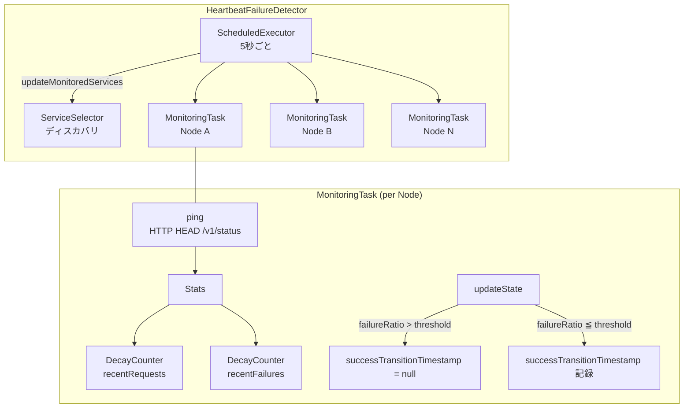
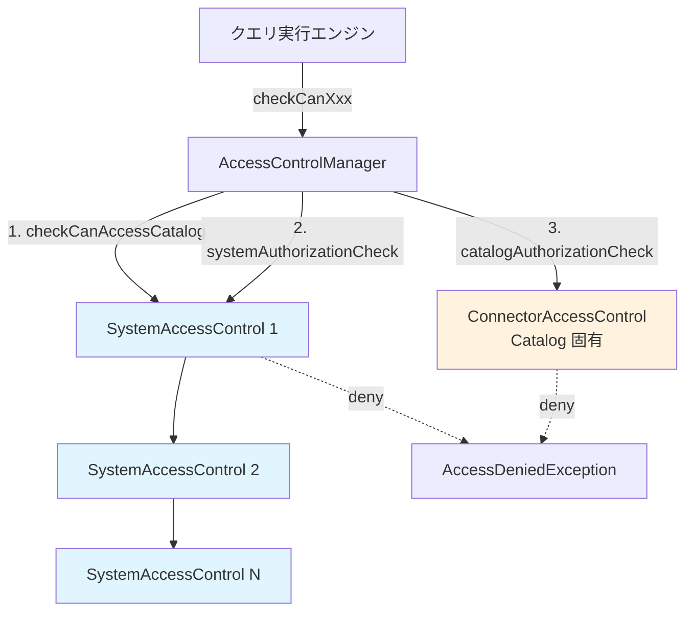

# 第24章 障害検出とセキュリティ

> **本章で読むソース**
>
> - [`core/trino-main/src/main/java/io/trino/failuredetector/FailureDetector.java`](https://github.com/trinodb/trino/blob/482/core/trino-main/src/main/java/io/trino/failuredetector/FailureDetector.java)
> - [`core/trino-main/src/main/java/io/trino/failuredetector/HeartbeatFailureDetector.java`](https://github.com/trinodb/trino/blob/482/core/trino-main/src/main/java/io/trino/failuredetector/HeartbeatFailureDetector.java)
> - [`core/trino-main/src/main/java/io/trino/failuredetector/FailureDetectorConfig.java`](https://github.com/trinodb/trino/blob/482/core/trino-main/src/main/java/io/trino/failuredetector/FailureDetectorConfig.java)
> - [`core/trino-main/src/main/java/io/trino/security/AccessControl.java`](https://github.com/trinodb/trino/blob/482/core/trino-main/src/main/java/io/trino/security/AccessControl.java)
> - [`core/trino-main/src/main/java/io/trino/security/AccessControlManager.java`](https://github.com/trinodb/trino/blob/482/core/trino-main/src/main/java/io/trino/security/AccessControlManager.java)
> - [`core/trino-spi/src/main/java/io/trino/spi/security/SystemAccessControl.java`](https://github.com/trinodb/trino/blob/482/core/trino-spi/src/main/java/io/trino/spi/security/SystemAccessControl.java)
> - [`core/trino-spi/src/main/java/io/trino/spi/connector/ConnectorAccessControl.java`](https://github.com/trinodb/trino/blob/482/core/trino-spi/src/main/java/io/trino/spi/connector/ConnectorAccessControl.java)
> - [`core/trino-main/src/main/java/io/trino/security/AllowAllAccessControl.java`](https://github.com/trinodb/trino/blob/482/core/trino-main/src/main/java/io/trino/security/AllowAllAccessControl.java)
> - [`core/trino-main/src/main/java/io/trino/security/DenyAllAccessControl.java`](https://github.com/trinodb/trino/blob/482/core/trino-main/src/main/java/io/trino/security/DenyAllAccessControl.java)
> - [`core/trino-main/src/main/java/io/trino/eventlistener/EventListenerManager.java`](https://github.com/trinodb/trino/blob/482/core/trino-main/src/main/java/io/trino/eventlistener/EventListenerManager.java)
> - [`core/trino-spi/src/main/java/io/trino/spi/eventlistener/EventListener.java`](https://github.com/trinodb/trino/blob/482/core/trino-spi/src/main/java/io/trino/spi/eventlistener/EventListener.java)
> - [`core/trino-spi/src/main/java/io/trino/spi/eventlistener/EventListenerFactory.java`](https://github.com/trinodb/trino/blob/482/core/trino-spi/src/main/java/io/trino/spi/eventlistener/EventListenerFactory.java)
> - [`core/trino-spi/src/main/java/io/trino/spi/eventlistener/QueryCompletedEvent.java`](https://github.com/trinodb/trino/blob/482/core/trino-spi/src/main/java/io/trino/spi/eventlistener/QueryCompletedEvent.java)
> - [`core/trino-spi/src/main/java/io/trino/spi/eventlistener/QueryCreatedEvent.java`](https://github.com/trinodb/trino/blob/482/core/trino-spi/src/main/java/io/trino/spi/eventlistener/QueryCreatedEvent.java)

## この章の狙い

Trino のクラスタ運用を支える3つの横断的な基盤を読み解く。

1つめは **HeartbeatFailureDetector** によるノードの障害検出である。
Coordinator が各 Worker へ定期的にハートビートを送信し、応答の成功率を指数減衰カウンタで追跡して、ノードの生死を判定する。

2つめは **AccessControlManager** を中心とするアクセス制御機構である。
Trino のセキュリティは、クラスタ全体を制御する `SystemAccessControl` と、Catalog ごとにきめ細かい権限を管理する `ConnectorAccessControl` の二層構造をとる。

3つめは **EventListenerManager** が管理するイベントリスナー SPI である。
クエリの作成や完了をフックし、監査ログや外部モニタリングシステムとの連携を Plugin として実装できる。

## 前提

- Trino のクラスタ構成（Coordinator と Worker）を理解していること（第1章、第2章）。
- Connector と Catalog の関係を理解していること（第20章）。
- SPI（Service Provider Interface）による Plugin 拡張の基本を知っていること。

## FailureDetector インタフェース

**FailureDetector** は、ノードの障害状態を問い合わせるインタフェースである。

[`core/trino-main/src/main/java/io/trino/failuredetector/FailureDetector.java` L21-L34](https://github.com/trinodb/trino/blob/482/core/trino-main/src/main/java/io/trino/failuredetector/FailureDetector.java#L21-L34)

```java
public interface FailureDetector
{
    Set<ServiceDescriptor> getFailed();

    State getState(HostAddress hostAddress);

    enum State
    {
        UNKNOWN,
        ALIVE,
        GONE,
        UNRESPONSIVE,
    }
}
```

`getFailed()` は現在障害中のサービスの集合を返し、`getState()` は特定のホストの状態を4値で返す。
**ALIVE** は正常応答中、**GONE** は接続そのものが失敗（`ConnectException`）、**UNRESPONSIVE** はタイムアウト（`SocketTimeoutException`）を意味する。
どのカテゴリにも該当しない場合は **UNKNOWN** を返す。

## HeartbeatFailureDetector の構造

`HeartbeatFailureDetector` は `FailureDetector` の Coordinator 側の実働実装であり、ハートビート方式でノードの生死を判定する。
Worker 側では何も検知しない `NoOpFailureDetector` が `WorkerModule` で bind されるため、`FailureDetector` の実装は計2つ存在する。

### 設定と初期化

主要なフィールドは以下のとおりである。

[`core/trino-main/src/main/java/io/trino/failuredetector/HeartbeatFailureDetector.java` L82-L98](https://github.com/trinodb/trino/blob/482/core/trino-main/src/main/java/io/trino/failuredetector/HeartbeatFailureDetector.java#L82-L97)

```java
    private final ServiceSelector selector;
    private final HttpClient httpClient;
    private final NodeInfo nodeInfo;

    private final ScheduledThreadPoolExecutor executor = new ScheduledThreadPoolExecutor(1, daemonThreadsNamed("failure-detector"));
    private final ThreadPoolExecutorMBean executorMBean = new ThreadPoolExecutorMBean(executor);

    // monitoring tasks by service id
    private final ConcurrentMap<UUID, MonitoringTask> tasks = new ConcurrentHashMap<>();

    private final double failureRatioThreshold;
    private final Duration heartbeat;
    private final boolean isEnabled;
    private final Duration warmupInterval;
    private final Duration gcGraceInterval;
    private final boolean httpsRequired;
```

`selector` はサービスディスカバリから既知のノード一覧を取得する。
`tasks` はノードごとの監視タスクを UUID(サービス ID)をキーとして保持する `ConcurrentHashMap` である。
スケジューラにはコアサイズ1のスレッドプールを使い、単一スレッドで全ノードの監視を駆動する。

設定パラメータのデフォルト値は `FailureDetectorConfig` に定義されている。

[`core/trino-main/src/main/java/io/trino/failuredetector/FailureDetectorConfig.java` L28-L32](https://github.com/trinodb/trino/blob/482/core/trino-main/src/main/java/io/trino/failuredetector/FailureDetectorConfig.java#L28-L32)

```java
    private boolean enabled = true;
    private double failureRatioThreshold = 0.1; // ~6secs of failures, given default setting of heartbeatInterval = 500ms
    private Duration heartbeatInterval = new Duration(500, TimeUnit.MILLISECONDS);
    private Duration warmupInterval = new Duration(5, TimeUnit.SECONDS);
    private Duration expirationGraceInterval = new Duration(10, TimeUnit.MINUTES);
```

`failureRatioThreshold` はデフォルト 0.1 であり、直近1分間の失敗率が 10% を超えるとノードを「障害」と判定する。
`warmupInterval`（デフォルト 5 秒）は、障害状態から正常に復帰した後、再び「ALIVE」と判定するまでの猶予期間である。
`expirationGraceInterval`（デフォルト 10 分）は、ディスカバリから消えたノードの監視タスクをメモリに保持しておく期間である。

### サービス一覧の更新

`start()` で 5 秒ごとのスケジュールタスクが起動し、`updateMonitoredServices()` を呼ぶ。

[`core/trino-main/src/main/java/io/trino/failuredetector/HeartbeatFailureDetector.java` L128-L142](https://github.com/trinodb/trino/blob/482/core/trino-main/src/main/java/io/trino/failuredetector/HeartbeatFailureDetector.java#L128-L142)

```java
    @PostConstruct
    public void start()
    {
        if (isEnabled && started.compareAndSet(false, true)) {
            executor.scheduleWithFixedDelay(() -> {
                try {
                    updateMonitoredServices();
                }
                catch (Throwable e) {
                    // ignore to avoid getting unscheduled
                    log.warn(e, "Error updating services");
                }
            }, 0, 5, TimeUnit.SECONDS);
        }
    }
```

`updateMonitoredServices()` はサービスディスカバリの現在のノード一覧を取得し、4段階で `tasks` マップを更新する。

[`core/trino-main/src/main/java/io/trino/failuredetector/HeartbeatFailureDetector.java` L219-L263](https://github.com/trinodb/trino/blob/482/core/trino-main/src/main/java/io/trino/failuredetector/HeartbeatFailureDetector.java#L218-L263)

```java
    @VisibleForTesting
    void updateMonitoredServices()
    {
        Set<ServiceDescriptor> online = selector.selectAllServices().stream()
                .filter(descriptor -> !nodeInfo.getNodeId().equals(descriptor.getNodeId()))
                .collect(toImmutableSet());

        Set<UUID> onlineIds = online.stream()
                .map(ServiceDescriptor::getId)
                .collect(toImmutableSet());

        // make sure only one thread is updating the registrations
        synchronized (tasks) {
            // 1. remove expired tasks
            // ... (中略) ...
            // 2. disable offline services
            tasks.values().stream()
                    .filter(task -> !onlineIds.contains(task.getService().getId()))
                    .forEach(MonitoringTask::disable);

            // 3. create tasks for new services
            Set<ServiceDescriptor> newServices = online.stream()
                    .filter(service -> !tasks.keySet().contains(service.getId()))
                    .collect(toImmutableSet());

            for (ServiceDescriptor service : newServices) {
                URI uri = getHttpUri(service);

                if (uri != null) {
                    tasks.put(service.getId(), new MonitoringTask(service, uriBuilderFrom(uri).appendPath("/v1/status").build()));
                }
            }

            // 4. enable all online tasks (existing plus newly created)
            tasks.values().stream()
                    .filter(task -> onlineIds.contains(task.getService().getId()))
                    .forEach(MonitoringTask::enable);
        }
    }
```

処理は4段階に分かれている。
(1) `expirationGraceInterval` を超えたタスクを削除する。
(2) ディスカバリから消えたがまだ猶予期間中のタスクを無効化する。
(3) 新しく出現したノードに対して `MonitoringTask` を作成し、`/v1/status` エンドポイントを監視対象に設定する。
(4) オンライン中のタスクをすべて有効化する。

この更新は `synchronized (tasks)` で保護されており、5秒ごとの呼び出しが並行して走らないことを保証している。
ただし `tasks` 自体は `ConcurrentHashMap` であるため、読み取り側の `getFailed()` や `getState()` は同期なしで安全にアクセスできる。

### MonitoringTask と障害判定

`MonitoringTask` は個々のノードに対する監視の単位である。
`enable()` でハートビート間隔（デフォルト 500 ミリ秒）ごとにスケジュールされた `ping()` と `updateState()` が起動する。

[`core/trino-main/src/main/java/io/trino/failuredetector/HeartbeatFailureDetector.java` L345-L368](https://github.com/trinodb/trino/blob/482/core/trino-main/src/main/java/io/trino/failuredetector/HeartbeatFailureDetector.java#L345-L373)

```java
        private void ping()
        {
            try {
                stats.recordStart();
                httpClient.executeAsync(prepareHead().setUri(uri).build(), new ResponseHandler<Object, Exception>()
                {
                    @Override
                    public Exception handleException(Request request, Exception exception)
                    {
                        // ignore error
                        stats.recordFailure(exception);
                        // ... (中略) ...
                        return null;
                    }

                    @Override
                    public Object handle(Request request, Response response)
                    {
                        stats.recordSuccess();
                        return null;
                    }
                });
            }
            catch (RuntimeException e) {
                log.warn(e, "Error scheduling request for %s", uri);
            }
        }
```

`ping()` は HTTP HEAD リクエストを非同期で送信する。
GET ではなく HEAD を使うのは、レスポンスボディの転送コストを省いてネットワーク帯域を節約するためである。
成功時には `stats.recordSuccess()`、失敗時には `stats.recordFailure()` が呼ばれる。

`updateState()` は失敗率の閾値と `warmupInterval` に基づいて状態遷移を管理する。

[`core/trino-main/src/main/java/io/trino/failuredetector/HeartbeatFailureDetector.java` L375-L384](https://github.com/trinodb/trino/blob/482/core/trino-main/src/main/java/io/trino/failuredetector/HeartbeatFailureDetector.java#L375-L384)

```java
        private synchronized void updateState()
        {
            // is this an over/under transition?
            if (stats.getRecentFailureRatio() > failureRatioThreshold) {
                successTransitionTimestamp = null;
            }
            else if (successTransitionTimestamp == null) {
                successTransitionTimestamp = System.nanoTime();
            }
        }
```

失敗率が閾値を超えると `successTransitionTimestamp` を `null` にリセットする。
失敗率が閾値以下に戻ったとき、初めて `successTransitionTimestamp` にタイムスタンプを記録する。

`isFailed()` はこのタイムスタンプと `warmupInterval` を組み合わせて最終判定を行う。

[`core/trino-main/src/main/java/io/trino/failuredetector/HeartbeatFailureDetector.java` L338-L343](https://github.com/trinodb/trino/blob/482/core/trino-main/src/main/java/io/trino/failuredetector/HeartbeatFailureDetector.java#L338-L343)

```java
        public synchronized boolean isFailed()
        {
            return future == null || // are we disabled?
                    successTransitionTimestamp == null || // are we in success state?
                    Duration.nanosSince(successTransitionTimestamp).compareTo(warmupInterval) < 0; // are we within the warmup period?
        }
```

ノードが「正常」と判定されるには3つの条件をすべて満たす必要がある。
(1) タスクが有効化されている（`future != null`）、(2) 失敗率が閾値以下に遷移した実績がある（`successTransitionTimestamp != null`）、(3) その遷移から `warmupInterval` 以上が経過している。
`warmupInterval` によるガード期間を設けることで、一時的に応答が回復しただけのノードに即座にトラフィックを振り向けることを防いでいる。

### 指数減衰カウンタによる統計

`Stats` クラスは `DecayCounter`（指数減衰カウンタ）を使って直近1分間のリクエスト統計を管理する。

[`core/trino-main/src/main/java/io/trino/failuredetector/HeartbeatFailureDetector.java` L392-L394](https://github.com/trinodb/trino/blob/482/core/trino-main/src/main/java/io/trino/failuredetector/HeartbeatFailureDetector.java#L392-L394)

```java
        private final DecayCounter recentRequests = new DecayCounter(ExponentialDecay.oneMinute());
        private final DecayCounter recentFailures = new DecayCounter(ExponentialDecay.oneMinute());
        private final DecayCounter recentSuccesses = new DecayCounter(ExponentialDecay.oneMinute());
```

`ExponentialDecay.oneMinute()` は、1分を半減期とする指数減衰関数を生成する。
古いサンプルの影響は時間とともに指数関数的に減衰するため、単純な集計期間を設けてカウントをリセットするよりも滑らかに状態変化を追跡できる。

失敗率は `recentFailures / recentRequests` で算出される。

[`core/trino-main/src/main/java/io/trino/failuredetector/HeartbeatFailureDetector.java` L470-L474](https://github.com/trinodb/trino/blob/482/core/trino-main/src/main/java/io/trino/failuredetector/HeartbeatFailureDetector.java#L470-L474)

```java
        @JsonProperty
        public double getRecentFailureRatio()
        {
            return recentFailures.getCount() / recentRequests.getCount();
        }
```

`getState()` は `isFailed()` の結果と直近の例外の型を組み合わせて、4値の `State` を返す。

[`core/trino-main/src/main/java/io/trino/failuredetector/HeartbeatFailureDetector.java` L157-L189](https://github.com/trinodb/trino/blob/482/core/trino-main/src/main/java/io/trino/failuredetector/HeartbeatFailureDetector.java#L166-L189)

```java
    @Override
    public State getState(HostAddress hostAddress)
    {
        for (MonitoringTask task : tasks.values()) {
            if (hostAddress.equals(fromUri(task.uri))) {
                if (!task.isFailed()) {
                    return ALIVE;
                }

                Exception lastFailureException = task.getStats().getLastFailureException();
                if (lastFailureException instanceof ConnectException) {
                    return GONE;
                }
                if (lastFailureException instanceof SocketTimeoutException) {
                    // TODO: distinguish between process unresponsiveness (e.g. GC pause) and host reboot
                    return UNRESPONSIVE;
                }

                return UNKNOWN;
            }
        }

        return UNKNOWN;
    }
```

`ConnectException` はノードのプロセスがダウンしているか、ネットワーク到達不能を示す。
`SocketTimeoutException` はプロセスは存在するが応答が返らない状態（GC 停止など）を示す。

次の図に、HeartbeatFailureDetector の構造をまとめる。



## AccessControl インタフェース

**AccessControl** は、Trino のすべての認可チェックを定義するインタフェースである。
クエリの実行時に、SQL 文が参照するオブジェクト（Catalog, Schema, テーブル, カラムなど）に対する権限をチェックするメソッド群を宣言している。

代表的なメソッドを2つ示す。

[`core/trino-main/src/main/java/io/trino/security/AccessControl.java` L175-L179](https://github.com/trinodb/trino/blob/482/core/trino-main/src/main/java/io/trino/security/AccessControl.java#L174-L179)

```java
    /**
     * Check if identity is allowed to create the specified table with properties.
     *
     * @throws AccessDeniedException if not allowed
     */
    void checkCanCreateTable(SecurityContext context, QualifiedObjectName tableName, Map<String, Object> properties);
```

[`core/trino-main/src/main/java/io/trino/security/AccessControl.java` L480-L484](https://github.com/trinodb/trino/blob/482/core/trino-main/src/main/java/io/trino/security/AccessControl.java#L479-L484)

```java
    /**
     * Check if identity is allowed to select from the specified columns.  The column set can be empty.
     *
     * @throws AccessDeniedException if not allowed
     */
    void checkCanSelectFromColumns(SecurityContext context, QualifiedObjectName tableName, Optional<String> branch, Set<String> columnNames);
```

権限がない場合は `AccessDeniedException` をスローする。
メソッド名は `checkCan...` または `filterXxx`（可視要素のフィルタリング）のパターンで統一されている。
`checkCan...` は権限がなければ例外をスローし、`filterXxx` は権限のある要素だけを集合として返す。

## AccessControlManager の二層構造

**AccessControlManager** は `AccessControl` の実装であり、認可チェックの中核を担う。
このクラスの設計上の特徴は、`SystemAccessControl` と `ConnectorAccessControl` の二層で権限を検証する点にある。

[`core/trino-main/src/main/java/io/trino/security/AccessControlManager.java` L98-L119](https://github.com/trinodb/trino/blob/482/core/trino-main/src/main/java/io/trino/security/AccessControlManager.java#L98-L1711)

```java
public class AccessControlManager
        implements AccessControl
{
    private static final Logger log = Logger.get(AccessControlManager.class);

    private static final File CONFIG_FILE = new File("etc/access-control.properties");
    private static final String NAME_PROPERTY = "access-control.name";

    private final NodeVersion nodeVersion;
    private final TransactionManager transactionManager;
    private final EventListenerManager eventListenerManager;
    private final List<File> configFiles;
    private final OpenTelemetry openTelemetry;
    private final String defaultAccessControlName;
    private final Map<String, SystemAccessControlFactory> systemAccessControlFactories = new ConcurrentHashMap<>();
    private final AtomicReference<CatalogServiceProvider<Optional<ConnectorAccessControl>>> connectorAccessControlProvider = new AtomicReference<>();

    private final AtomicReference<List<SystemAccessControl>> systemAccessControls = new AtomicReference<>();

    private final CounterStat authorizationSuccess = new CounterStat();
    private final CounterStat authorizationFail = new CounterStat();
    // ... (中略) ...
}
```

`systemAccessControls` はクラスタ全体に適用されるアクセス制御のリストであり、設定ファイルから起動時にロードされる。
`connectorAccessControlProvider` は Catalog ごとの Connector が提供するアクセス制御への参照である。
`authorizationSuccess` と `authorizationFail` は認可の成功/失敗を JMX で公開するためのカウンタである。

### SystemAccessControl のロード

起動時に `loadSystemAccessControl()` が呼ばれ、`etc/access-control.properties` から設定を読み込む。

[`core/trino-main/src/main/java/io/trino/security/AccessControlManager.java` L163-L185](https://github.com/trinodb/trino/blob/482/core/trino-main/src/main/java/io/trino/security/AccessControlManager.java#L163-L185)

```java
    public void loadSystemAccessControl()
    {
        List<File> configFiles = this.configFiles;
        if (configFiles.isEmpty()) {
            if (!CONFIG_FILE.exists()) {
                loadSystemAccessControl(defaultAccessControlName, ImmutableMap.of());
                log.info("Using system access control: %s", defaultAccessControlName);
                return;
            }
            configFiles = ImmutableList.of(CONFIG_FILE);
        }

        List<SystemAccessControl> systemAccessControls = configFiles.stream()
                .map(this::createSystemAccessControl)
                .collect(toImmutableList());

        systemAccessControls.stream()
                .map(SystemAccessControl::getEventListeners)
                .flatMap(listeners -> ImmutableSet.copyOf(listeners).stream())
                .forEach(eventListenerManager::addEventListener);

        setSystemAccessControls(systemAccessControls);
    }
```

設定ファイルが存在しない場合はデフォルトの `SystemAccessControl` が使われる。
複数の設定ファイルを指定すると、複数の `SystemAccessControl` がチェーンとして順番に適用される。
ロード時に `SystemAccessControl` が提供する `EventListener` も `EventListenerManager` に登録される点に注意が必要である。
アクセス制御プラグインが監査ログ用の `EventListener` を返す仕組みがここで接続される。

### 認可チェックの実行フロー

Catalog に関連するオブジェクト（Schema, テーブル, ビューなど）への認可チェックは3段階で行われる。
`checkCanCreateSchema()` を例にとる。

[`core/trino-main/src/main/java/io/trino/security/AccessControlManager.java` L391-L401](https://github.com/trinodb/trino/blob/482/core/trino-main/src/main/java/io/trino/security/AccessControlManager.java#L390-L401)

```java
    @Override
    public void checkCanCreateSchema(SecurityContext securityContext, CatalogSchemaName schemaName, Map<String, Object> properties)
    {
        requireNonNull(securityContext, "securityContext is null");
        requireNonNull(schemaName, "schemaName is null");

        checkCanAccessCatalog(securityContext, schemaName.getCatalogName());

        systemAuthorizationCheck(control -> control.checkCanCreateSchema(securityContext.toSystemSecurityContext(), schemaName, properties));

        catalogAuthorizationCheck(schemaName.getCatalogName(), securityContext, (control, context) -> control.checkCanCreateSchema(context, schemaName.getSchemaName(), properties));
    }
```

(1) `checkCanAccessCatalog()` で、そもそも Catalog にアクセスできるかを確認する。
(2) `systemAuthorizationCheck()` で、すべての `SystemAccessControl` にチェックを委譲する。
(3) `catalogAuthorizationCheck()` で、該当 Catalog の `ConnectorAccessControl` にチェックを委譲する。

いずれかの段階で `AccessDeniedException` がスローされると、そこで処理が打ち切られる。

`systemAuthorizationCheck()` の実装を見ると、登録されたすべての `SystemAccessControl` を順に呼び出し、成功/失敗のカウンタを更新する。

[`core/trino-main/src/main/java/io/trino/security/AccessControlManager.java` L1600-L1612](https://github.com/trinodb/trino/blob/482/core/trino-main/src/main/java/io/trino/security/AccessControlManager.java#L1600-L1612)

```java
    private void systemAuthorizationCheck(Consumer<SystemAccessControl> check)
    {
        try {
            for (SystemAccessControl systemAccessControl : getSystemAccessControls()) {
                check.accept(systemAccessControl);
            }
            authorizationSuccess.update(1);
        }
        catch (TrinoException e) {
            authorizationFail.update(1);
            throw e;
        }
    }
```

`catalogAuthorizationCheck()` は Catalog 名からトランザクション経由で `ConnectorAccessControl` を取得し、チェックを呼び出す。

[`core/trino-main/src/main/java/io/trino/security/AccessControlManager.java` L1631-L1646](https://github.com/trinodb/trino/blob/482/core/trino-main/src/main/java/io/trino/security/AccessControlManager.java#L1631-L1646)

```java
    private void catalogAuthorizationCheck(String catalogName, SecurityContext securityContext, BiConsumer<ConnectorAccessControl, ConnectorSecurityContext> check)
    {
        ConnectorAccessControl connectorAccessControl = getConnectorAccessControl(securityContext.getTransactionId(), catalogName);
        if (connectorAccessControl == null) {
            return;
        }

        try {
            check.accept(connectorAccessControl, toConnectorSecurityContext(catalogName, securityContext));
            authorizationSuccess.update(1);
        }
        catch (TrinoException e) {
            authorizationFail.update(1);
            throw e;
        }
    }
```

`ConnectorAccessControl` が `null`（Connector がアクセス制御を提供していない場合）のときは何もせずに通過する。
これにより、アクセス制御を実装していない Connector でもクエリを実行できる。

`filterTables()` のようなフィルタリングメソッドでも同様に二層を通過する。

[`core/trino-main/src/main/java/io/trino/security/AccessControlManager.java` L601-L626](https://github.com/trinodb/trino/blob/482/core/trino-main/src/main/java/io/trino/security/AccessControlManager.java#L601-L626)

```java
    @Override
    public Set<SchemaTableName> filterTables(SecurityContext securityContext, String catalogName, Set<SchemaTableName> tableNames)
    {
        // ... (中略) ...
        if (filterCatalogs(securityContext, ImmutableSet.of(catalogName)).isEmpty()) {
            return ImmutableSet.of();
        }

        for (SystemAccessControl systemAccessControl : getSystemAccessControls()) {
            tableNames = systemAccessControl.filterTables(securityContext.toSystemSecurityContext(), catalogName, tableNames);
        }

        ConnectorAccessControl connectorAccessControl = getConnectorAccessControl(securityContext.getTransactionId(), catalogName);
        if (connectorAccessControl != null) {
            tableNames = connectorAccessControl.filterTables(toConnectorSecurityContext(catalogName, securityContext), tableNames);
        }
        return tableNames;
    }
```

フィルタリングでは、まず Catalog へのアクセス権を確認し、次に `SystemAccessControl` のチェーンでテーブル集合を絞り込み、最後に `ConnectorAccessControl` でさらに絞る。
各層が集合を縮小する方向にしか作用しないため、いずれかの層で厳しい制約を課せばそれが最終結果に反映される。

次の図に、アクセス制御の二層構造を示す。



## SystemAccessControl と ConnectorAccessControl の違い

**SystemAccessControl** はクラスタ全体に対する権限を制御する SPI である。
Catalog, Schema, テーブルの名前は `CatalogSchemaTableName` のように完全修飾名で渡される。
クエリ実行の可否（`checkCanExecuteQuery`）やシステム情報の読み書き（`checkCanReadSystemInformation`）など、Catalog に紐づかない操作もこのインタフェースで制御する。

デフォルト実装ではほぼすべてのメソッドが `deny` を返す。

[`core/trino-spi/src/main/java/io/trino/spi/security/SystemAccessControl.java` L338-L341](https://github.com/trinodb/trino/blob/482/core/trino-spi/src/main/java/io/trino/spi/security/SystemAccessControl.java#L338-L341)

```java
    default void checkCanCreateTable(SystemSecurityContext context, CatalogSchemaTableName table, Map<String, Object> properties)
    {
        denyCreateTable(table.toString());
    }
```

**ConnectorAccessControl** は特定の Catalog 内のオブジェクトに対する権限を制御する SPI である。
`SystemAccessControl` との違いは、名前が Catalog を含まない相対名（`SchemaTableName`）で渡される点にある。
Catalog 名はすでに確定しているため、Connector は自分の管轄範囲内のオブジェクトについてのみ判断すればよい。

[`core/trino-spi/src/main/java/io/trino/spi/connector/ConnectorAccessControl.java` L186-L189](https://github.com/trinodb/trino/blob/482/core/trino-spi/src/main/java/io/trino/spi/connector/ConnectorAccessControl.java#L186-L189)

```java
    default void checkCanCreateTable(ConnectorSecurityContext context, SchemaTableName tableName, Map<String, Object> properties)
    {
        denyCreateTable(tableName.toString());
    }
```

この二層構造により、クラスタ管理者は `SystemAccessControl` でクラスタ横断のポリシーを設定し、各 Connector はそのデータソース固有のアクセス制御を `ConnectorAccessControl` で実装できる。
たとえば、`SystemAccessControl` で「特定のユーザーには `hive` Catalog へのアクセスを禁止する」というポリシーを設定しつつ、Hive Connector が `ConnectorAccessControl` で HDFS のパーミッションに基づくテーブル単位の権限制御を行う、という運用が可能になる。

## AllowAllAccessControl と DenyAllAccessControl

Trino はデフォルト実装として2つのアクセス制御を内蔵している。

**AllowAllAccessControl** はすべての `checkCan...` メソッドを空実装とし、フィルタリングメソッドは入力をそのまま返す。

[`core/trino-main/src/main/java/io/trino/security/AllowAllAccessControl.java` L34-L38](https://github.com/trinodb/trino/blob/482/core/trino-main/src/main/java/io/trino/security/AllowAllAccessControl.java#L34-L38)

```java
public class AllowAllAccessControl
        implements AccessControl
{
    @Override
    public void checkCanImpersonateUser(Identity identity, String userName) {}
```

すべての操作が許可されるため、開発環境や認可を別のレイヤーで行う構成で使われる。

**DenyAllAccessControl** はすべての `checkCan...` メソッドで `AccessDeniedException` をスローし、フィルタリングメソッドは空の集合を返す。

[`core/trino-main/src/main/java/io/trino/security/DenyAllAccessControl.java` L114-L121](https://github.com/trinodb/trino/blob/482/core/trino-main/src/main/java/io/trino/security/DenyAllAccessControl.java#L114-L121)

```java
public class DenyAllAccessControl
        implements AccessControl
{
    @Override
    public void checkCanImpersonateUser(Identity identity, String userName)
    {
        denyImpersonateUser(identity.getUser(), userName);
    }
```

テストやセキュリティ検証で「デフォルトですべて拒否し、必要な権限だけを明示的に許可する」ホワイトリスト型のポリシーを構築するための基盤となる。

## EventListener SPI

Trino は、クエリのライフサイクルイベントを外部に通知するための **EventListener** SPI を提供している。
監査ログ、パフォーマンスモニタリング、クエリ分析など、クラスタの可観測性を高めるために使われる。

### EventListener インタフェース

[`core/trino-spi/src/main/java/io/trino/spi/eventlistener/EventListener.java` L17-L36](https://github.com/trinodb/trino/blob/482/core/trino-spi/src/main/java/io/trino/spi/eventlistener/EventListener.java#L16-L36)

```java
public interface EventListener
{
    default void queryCreated(QueryCreatedEvent queryCreatedEvent) {}

    default void queryCompleted(QueryCompletedEvent queryCompletedEvent) {}

    /**
     * Specify whether the plan included in QueryCompletedEvent should be anonymized or not
     */
    default boolean requiresAnonymizedPlan()
    {
        return false;
    }

    /**
     * Shutdown the event listener by releasing any held resources such as
     * threads, sockets, etc. After this method is called,
     * no methods will be called on the event listener.
     */
    default void shutdown() {}
}
```

`EventListener` は2種類のクエリイベントを受け取る。
`queryCreated()` はクエリが受け付けられた時点で呼ばれ、`queryCompleted()` はクエリの実行が完了（成功または失敗）した時点で呼ばれる。
すべてのメソッドが `default` で空実装を持つため、必要なイベントだけを選択してオーバーライドできる。

`requiresAnonymizedPlan()` は、イベントに含まれるクエリプランを匿名化するかどうかを制御する。
機密データを含む可能性のあるプランを外部システムに送信する際の安全弁となる。

### イベントオブジェクトの構造

**QueryCreatedEvent** はクエリの作成時に発行されるイベントである。

[`core/trino-spi/src/main/java/io/trino/spi/eventlistener/QueryCreatedEvent.java` L30-L33](https://github.com/trinodb/trino/blob/482/core/trino-spi/src/main/java/io/trino/spi/eventlistener/QueryCreatedEvent.java#L30-L33)

```java
    private final Instant createTime;

    private final QueryContext context;
    private final QueryMetadata metadata;
```

作成時刻、クエリのコンテキスト（ユーザー、ソース、Catalog など）、メタデータ（クエリ ID、SQL テキストなど）を含む。

**QueryCompletedEvent** はクエリの完了時に発行されるイベントであり、実行結果の詳細情報を格納する。

[`core/trino-spi/src/main/java/io/trino/spi/eventlistener/QueryCompletedEvent.java` L32-L44](https://github.com/trinodb/trino/blob/482/core/trino-spi/src/main/java/io/trino/spi/eventlistener/QueryCompletedEvent.java#L33-L43)

```java
    private final QueryMetadata metadata;
    private final QueryStatistics statistics;
    private final QueryContext context;
    private final QueryIOMetadata ioMetadata;
    private final Optional<List<ColumnLineageInfo>> selectColumnsLineageInfo;
    private final Optional<QueryFailureInfo> failureInfo;
    private final List<TrinoWarning> warnings;

    private final Instant createTime;
    private final Instant executionStartTime;
    private final Instant endTime;
```

`QueryStatistics` には CPU 時間や入出力行数などのパフォーマンス指標が含まれる。
`QueryIOMetadata` にはどのテーブルから読み書きしたかの情報が含まれる。
`failureInfo` はクエリが失敗した場合にのみ存在し、エラーコードとスタックトレースを提供する。
`selectColumnsLineageInfo` はカラムレベルのデータリネージ情報であり、どの入力カラムがどの出力カラムに対応するかを追跡できる。

### EventListenerFactory

`EventListener` を Plugin として提供するには、`EventListenerFactory` を実装する。

[`core/trino-spi/src/main/java/io/trino/spi/eventlistener/EventListenerFactory.java` L22-L35](https://github.com/trinodb/trino/blob/482/core/trino-spi/src/main/java/io/trino/spi/eventlistener/EventListenerFactory.java#L21-L35)

```java
public interface EventListenerFactory
{
    String getName();

    EventListener create(Map<String, String> config, EventListenerContext context);

    interface EventListenerContext
    {
        String getVersion();

        OpenTelemetry getOpenTelemetry();

        Tracer getTracer();
    }
}
```

`getName()` は設定ファイルの `event-listener.name` プロパティと照合される名前を返す。
`create()` は設定プロパティと `EventListenerContext`（バージョン情報、OpenTelemetry トレーサーなど）を受け取り、`EventListener` インスタンスを生成する。

## EventListenerManager によるイベントの管理

**EventListenerManager** は `EventListener` の登録と、イベントの配信を管理するクラスである。

[`core/trino-main/src/main/java/io/trino/eventlistener/EventListenerManager.java` L56-L71](https://github.com/trinodb/trino/blob/482/core/trino-main/src/main/java/io/trino/eventlistener/EventListenerManager.java#L56-L225)

```java
public class EventListenerManager
{
    private static final Logger log = Logger.get(EventListenerManager.class);
    private static final File CONFIG_FILE = new File("etc/event-listener.properties");
    private static final String EVENT_LISTENER_NAME_PROPERTY = "event-listener.name";
    private final List<File> configFiles;
    private final Map<String, EventListenerFactory> eventListenerFactories = new ConcurrentHashMap<>();
    private final List<EventListener> providedEventListeners = Collections.synchronizedList(new ArrayList<>());
    private final AtomicReference<List<EventListener>> configuredEventListeners = new AtomicReference<>(ImmutableList.of());
    private final AtomicBoolean loading = new AtomicBoolean(false);
    private final AtomicInteger concurrentQueryCompletedEvents = new AtomicInteger();

    private final TimeStat queryCreatedTime = new TimeStat(MILLISECONDS);
    private final TimeStat queryCompletedTime = new TimeStat(MILLISECONDS);
    // ... (中略) ...
}
```

リスナーの登録元は2つある。
`providedEventListeners` は `SystemAccessControl` など他のコンポーネントがプログラム的に登録するリスナーを保持する。
`configuredEventListeners` は設定ファイルからロードされたリスナーと `providedEventListeners` を結合した最終的なリストである。

`loadEventListeners()` で両者を結合し、不変リストとしてアトミックに公開する。

[`core/trino-main/src/main/java/io/trino/eventlistener/EventListenerManager.java` L97-L105](https://github.com/trinodb/trino/blob/482/core/trino-main/src/main/java/io/trino/eventlistener/EventListenerManager.java#L97-L105)

```java
    public void loadEventListeners()
    {
        checkState(loading.compareAndSet(false, true), "Event listeners already loaded");

        this.configuredEventListeners.set(ImmutableList.<EventListener>builder()
                .addAll(providedEventListeners)
                .addAll(configuredEventListeners())
                .build());
    }
```

### イベントの配信

`queryCompleted()` はクエリ完了時にクエリ実行エンジンから呼ばれる。

[`core/trino-main/src/main/java/io/trino/eventlistener/EventListenerManager.java` L152-L172](https://github.com/trinodb/trino/blob/482/core/trino-main/src/main/java/io/trino/eventlistener/EventListenerManager.java#L152-L172)

```java
    public void queryCompleted(Function<Boolean, QueryCompletedEvent> queryCompletedEventProvider)
    {
        try (TimeStat.BlockTimer _ = queryCompletedTime.time()) {
            concurrentQueryCompletedEvents.incrementAndGet();
            doQueryCompleted(queryCompletedEventProvider);
            concurrentQueryCompletedEvents.decrementAndGet();
        }
    }

    private void doQueryCompleted(Function<Boolean, QueryCompletedEvent> queryCompletedEventProvider)
    {
        for (EventListener listener : configuredEventListeners.get()) {
            QueryCompletedEvent event = queryCompletedEventProvider.apply(listener.requiresAnonymizedPlan());
            try {
                listener.queryCompleted(event);
            }
            catch (Throwable e) {
                log.warn(e, "Failed to publish QueryCompletedEvent for query %s", event.getMetadata().getQueryId());
            }
        }
    }
```

注目すべき点は、`QueryCompletedEvent` の生成が遅延されていることである。
引数は `Function<Boolean, QueryCompletedEvent>` であり、リスナーごとに `requiresAnonymizedPlan()` の返値を引数として渡して初めてイベントオブジェクトが生成される。
匿名化が不要なリスナーには匿名化されていないプランを含むイベントを、匿名化が必要なリスナーには匿名化済みのプランを含むイベントを、それぞれ別のインスタンスとして渡す。

各リスナーの `queryCompleted()` 呼び出しは `try-catch` で保護されており、あるリスナーが例外をスローしても他のリスナーへの配信は継続される。
`concurrentQueryCompletedEvents` で同時実行中のイベント処理数を追跡し、JMX で監視可能にしている。

## 高速化と最適化の工夫

### ConnectorAccessControl による遅延評価とスキップ

`AccessControlManager` の `catalogAuthorizationCheck()` は、対象 Catalog に `ConnectorAccessControl` が存在しない場合、チェック自体をスキップする。
Trino は多数の Connector を同時に登録できるが、すべての Connector がアクセス制御を実装しているわけではない。
`ConnectorAccessControl` が `null` のときにスキップすることで、アクセス制御を持たない Connector に対する余分な例外生成やオブジェクト変換のコストを回避している。

同様に、`filterTables()` や `filterSchemas()` などのフィルタリングメソッドでは、入力の集合が空のときに `SystemAccessControl` や `ConnectorAccessControl` の呼び出しを省略する。

[`core/trino-main/src/main/java/io/trino/security/AccessControlManager.java` L606-L611](https://github.com/trinodb/trino/blob/482/core/trino-main/src/main/java/io/trino/security/AccessControlManager.java#L608-L613)

```java
        if (tableNames.isEmpty()) {
            // Do not call plugin-provided implementation unnecessarily.
            return ImmutableSet.of();
        }

        if (filterCatalogs(securityContext, ImmutableSet.of(catalogName)).isEmpty()) {
```

コメントにも "Do not call plugin-provided implementation unnecessarily" とあるように、これは意図的な最適化である。
クエリの解析段階で多数のテーブルやスキーマに対してフィルタリングが行われるため、空集合での不要な Plugin 呼び出しを省くことでオーバーヘッドを削減している。

## まとめ

本章では Trino の運用基盤を支える3つの横断的機構を読み解いた。

`HeartbeatFailureDetector` は HTTP HEAD ハートビートと指数減衰カウンタを組み合わせ、ノードの生死を滑らかに判定する。
`warmupInterval` によるガード期間は、不安定なノードへの早すぎるトラフィック復帰を防ぐ。

`AccessControlManager` は `SystemAccessControl`（クラスタ全体）と `ConnectorAccessControl`（Catalog 固有）の二層構造で認可を制御する。
両層を順に通過させることで、クラスタ管理者の横断的なポリシーと、各データソース固有のきめ細かい権限制御を両立させている。

`EventListenerManager` はクエリのライフサイクルイベントを Plugin に配信する。
`queryCompleted()` でリスナーごとにプランの匿名化を制御できる遅延生成の仕組みは、セキュリティと監査の要件が異なるリスナーの共存を可能にしている。

## 関連する章

- [第1章 Trino とは何か](../part00-overview/01-what-is-trino.md): Trino 全体のアーキテクチャと Coordinator/Worker の役割分担。
- [第2章 サーバーアーキテクチャ](../part00-overview/02-server-architecture.md): Coordinator の起動シーケンスにおける各サブシステムの初期化。
- [第20章 Connector SPI の詳細](../part05-connector/20-connector-spi-detail.md): Connector SPI の概要と Catalog の登録。
