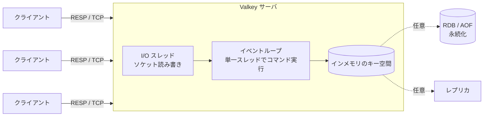

# 第1章 Valkey とは何か

> **本章で読むソース**
>
> - [`README.md`](https://github.com/valkey-io/valkey/blob/9.1.0/README.md)
> - [`src/version.h`](https://github.com/valkey-io/valkey/blob/9.1.0/src/version.h)
> - [`src/server.h`](https://github.com/valkey-io/valkey/blob/9.1.0/src/server.h)
> - [`valkey.conf`](https://github.com/valkey-io/valkey/blob/9.1.0/valkey.conf)
> - [`00-RELEASENOTES`](https://github.com/valkey-io/valkey/blob/9.1.0/00-RELEASENOTES)

## この章の狙い

本書が読み解く対象である Valkey 9.1.0 が、何をするソフトウェアなのかを最初に押さえる。
インメモリのデータ構造ストアとしての位置づけ、クライアントとの通信形式、コマンドを実行する単一スレッドのモデル、そして提供するデータ型や永続化などの機能を俯瞰する。
それぞれの仕組みが本書のどの章で詳しく扱われるかも、ここで道案内する。

## 前提

特になし。
本章は本書の出発点であり、先に読むべき章はない。

## Valkey の位置づけ

Valkey は、メモリ上にデータを保持するデータ構造ストアである。
キーと値の組を扱うキーバリューストアであり、データベース、キャッシュ、メッセージブローカのいずれの用途にも使える。
この性格は、リポジトリのトップに置かれた README が簡潔に述べている。

[`README.md` L8-L11](https://github.com/valkey-io/valkey/blob/9.1.0/README.md#L8-L11)

```text
# What is Valkey?

Valkey is a high-performance data structure server that primarily serves key/value workloads.
It supports a wide range of native structures and an extensible plugin system for adding new data structures and access patterns.
```

データがメモリ上にあるという性質は、Valkey の実装全体を貫く前提である。
値は C のデータ構造としてプロセスのヒープに置かれ、ディスク上のページではなくポインタを介して直接たどられる。
このため Valkey の内部実装の多くは、データ構造そのものの設計と、それをメモリ効率よく表現する工夫に向けられている。
データ構造の章（第4章から第11章）と、メモリ管理の章（第12章、第13章）がその中身を扱う。

Valkey は Redis プロジェクトをフォークして始まった。
README の冒頭は、ソースが公開ライセンスのまま分岐した経緯を記している。

[`README.md` L4](https://github.com/valkey-io/valkey/blob/9.1.0/README.md#L4)

```text
This project was forked from the open source Redis project right before the transition to their new source available licenses.
```

この由来は、本書がコードを読むうえで意味を持つ。
ソース中の型名やライセンスヘッダに Redis の名が残り、互換性の指標としても Redis のバージョンが参照されるからである。

## クライアントとの通信

Valkey はサーバプロセスとして動き、クライアントは TCP 接続を通じてコマンドを送る。
このやり取りには **RESP**（REdis Serialization Protocol）と呼ばれるテキストベースのプロトコルを使う。
クライアントがコマンドと引数を RESP で符号化して送り、サーバが結果を RESP で返す。

`valkey-cli` を使った最小のやり取りを README が示している。
`set` で値を書き、`get` で読み出すという、キーバリューストアそのものの操作である。

[`README.md` L272-L281](https://github.com/valkey-io/valkey/blob/9.1.0/README.md#L272-L281)

```text
    valkey> ping
    PONG
    valkey> set foo bar
    OK
    valkey> get foo
    "bar"
    valkey> incr mycounter
    (integer) 1
    valkey> incr mycounter
    (integer) 2
```

待ち受けるネットワークインタフェースやポートは設定で制御できる。
設定ファイル `valkey.conf` の NETWORK 節は、既定でホストの全インタフェースから接続を受け付けることを述べている。

[`valkey.conf` L56-L59](https://github.com/valkey-io/valkey/blob/9.1.0/valkey.conf#L56-L59)

```text
################################## NETWORK #####################################

# By default, if no "bind" configuration directive is specified, the server listens
# for connections from all available network interfaces on the host machine.
```

接続の確立から RESP の解析、コマンドの引数列への組み立てまでの流れは、ネットワークの章（第25章）と RESP プロトコルの章（第26章）で詳しく追う。

## コマンドを実行する単一スレッドのモデル

Valkey の中核には一つの**イベントループ**がある。
サーバはこのループの上で、接続の受け付け、コマンドの読み取り、実行、応答の書き出しを回す。
コマンド自体の実行は単一のスレッドで行われ、ある瞬間に一つのコマンドだけがキー空間を操作する。
この設計のため、コマンドの実行中に他のコマンドが割り込んでデータを書き換えることがなく、データ構造を操作するコードはロックを介さずに書ける。

イベントループの本体は `valkeyServer` 構造体が握っている。
構造体のメンバ `el` が、サーバ全体で一つのイベントループを指す。

[`src/server.h` L1765](https://github.com/valkey-io/valkey/blob/9.1.0/src/server.h#L1765)

```c
    aeEventLoop *el;
```

イベントループだけでは、増えていくクライアントとのネットワーク I/O を一つのスレッドでさばききれなくなる場面がある。
そこで Valkey は、ソケットからの読み書きを補助する **I/O スレッド**を持つ。
同じ構造体に、使用する I/O スレッド数と現在動いている数のメンバが並ぶ。

[`src/server.h` L1846-L1847](https://github.com/valkey-io/valkey/blob/9.1.0/src/server.h#L1846-L1847)

```c
    int io_threads_num;                       /* Number of IO threads to use. */
    int active_io_threads_num;                /* Current number of active IO threads, includes main thread. */
```

ここで役割の分担を取り違えないようにしたい。
I/O スレッドが担うのはソケットの読み書き、つまり RESP の入出力であって、コマンドそのものの実行ではない。
コマンドの実行は引き続きメインスレッドの単一の流れで行われる。
9.1.0 のリリースノートには、この I/O スレッド間の通信をロックフリーのキューで作り直し、スループットを 8〜17% 改善したという項目がある。

[`00-RELEASENOTES` L50-L51](https://github.com/valkey-io/valkey/blob/9.1.0/00-RELEASENOTES#L50-L51)

```text
### Performance and Efficiency improvements
* Redesign IO threading communication model with lock-free queues (8-17% throughput gain) by @akashkgit (#3324)
```

この分担が、Valkey の高速さを支える機構の一つである。
コマンド実行を単一スレッドに閉じることでロックの取得や競合を避けつつ、I/O だけを別スレッドに逃がして複数コアを活かす。
イベントループの仕組みは第24章、ネットワーク I/O との接続は第25章、コマンド実行の流れは第27章、I/O スレッドの構造は第28章で扱う。



図の点線は、永続化とレプリカが必須ではなく、設定によって有効にする要素であることを示す。

## 提供する機能の俯瞰

Valkey が扱う値は、単なる文字列にとどまらない。
キーごとに異なる型の値を保持でき、型ごとに専用のコマンド群が用意されている。
ネイティブの型は `server.h` のオブジェクト型定数として定義されている。

[`src/server.h` L737-L756](https://github.com/valkey-io/valkey/blob/9.1.0/src/server.h#L737-L756)

```c
#define OBJ_STRING 0 /* String object. */
#define OBJ_LIST 1   /* List object. */
#define OBJ_SET 2    /* Set object. */
#define OBJ_ZSET 3   /* Sorted set object. */
#define OBJ_HASH 4   /* Hash object. */
// ... (中略) ...
#define OBJ_MODULE 5   /* Module object. */
#define OBJ_STREAM 6   /* Stream object. */
#define OBJ_TYPE_MAX 7 /* Maximum number of object types */
```

文字列、リスト、セット、ハッシュ、ソート済みセット、ストリームが基本の型である。
`OBJ_MODULE` は、モジュールが独自に管理する値のための特別な型を表す。
これらの型がメモリ上でどう表現され、どんなコマンドで操作されるかは、オブジェクトとデータ型の章（第14章から第23章）でひとつずつ追う。
文字列は第15章、リストは第16章、セットは第17章、ハッシュは第18章、ソート済みセットは第19章、ストリームは第20章にあたる。

これらの基本型に加えて、Valkey は型を拡張する仕組みも持つ。
HyperLogLog による基数推定（第21章）、ビット操作と地理空間インデックス（第22章）、そしてベクトル集合（第23章）がそれである。
ベクトル集合は `server.h` がインクルードする `vset.h` に実装があり、サーバ本体に組み込まれている。

[`src/server.h` L84](https://github.com/valkey-io/valkey/blob/9.1.0/src/server.h#L84)

```c
#include "vset.h"
```

メモリ上のデータは、設定すれば永続化できる。
ディスクへの保存形式には、ある時点の全データをまとめて書き出す **RDB** スナップショットと、書き込みコマンドを記録していく **AOF**（Append Only File）の二つがある。
どちらを使うか、あるいは両方を使うかは設定で選べる。
RDB は第35章、AOF は第36章、両者を支える内部機構は第37章で扱う。

複数のサーバを連携させる機能もある。
**レプリケーション**は、あるサーバ（プライマリ）のデータを別のサーバ（レプリカ）に複製する仕組みで、第38章で扱う。
**クラスタ**は、キー空間を複数のノードに分散して保持する仕組みで、第39章から第41章で扱う。

トランザクション、Pub/Sub、スクリプティングといった機能群は、第8部（第42章から第49章）にまとめてある。
本章はあくまで全体像であり、各機能の中身はそれぞれの章に譲る。

## バージョンと互換性

本書が対象とするバージョンは `version.h` に書かれている。
`VALKEY_VERSION` が `9.1.0`、リリース段階を示す `VALKEY_RELEASE_STAGE` が正式版を意味する `ga` である。

[`src/version.h` L5-L18](https://github.com/valkey-io/valkey/blob/9.1.0/src/version.h#L5-L18)

```c
#define SERVER_NAME "valkey"
#define SERVER_TITLE "Valkey"
#define VALKEY_VERSION "9.1.0"
#define VALKEY_VERSION_NUM 0x00090100
// ... (中略) ...
#define VALKEY_RELEASE_STAGE "ga"

/* Redis OSS compatibility version, should never
 * exceed 7.2.x. */
#define REDIS_VERSION "7.2.4"
#define REDIS_VERSION_NUM 0x00070204
```

同じファイルが、Redis OSS との互換バージョンとして `7.2.4` を示している。
フォークという由来から、Valkey は Redis OSS 7.2.4 に対する互換性を保つ位置にあり、その指標をソース中に持っている。
コメントは、この互換バージョンが `7.2.x` を超えないことも明記している。

9.1.0 が最初の安定版であることは、リリースノートの先頭が述べている。

[`00-RELEASENOTES` L14-L17](https://github.com/valkey-io/valkey/blob/9.1.0/00-RELEASENOTES#L14-L17)

```text
Valkey 9.1.0 GA - Released Tue May 19 2026
---------------------

Upgrade urgency LOW: This is the first stable release of Valkey 9.1.
```

## まとめ

- Valkey はインメモリのデータ構造ストアであり、データベース、キャッシュ、メッセージブローカとして使えるキーバリューストアである（[`README.md` L10-L11](https://github.com/valkey-io/valkey/blob/9.1.0/README.md#L10-L11)）。
- クライアントは TCP 接続上の RESP プロトコルでコマンドを送り、結果を受け取る。
- コマンドの実行は単一スレッドのイベントループで行われ（[`src/server.h` L1765](https://github.com/valkey-io/valkey/blob/9.1.0/src/server.h#L1765)）、ネットワーク I/O は I/O スレッドが補助する（[`src/server.h` L1846-L1847](https://github.com/valkey-io/valkey/blob/9.1.0/src/server.h#L1846-L1847)）。
- 文字列、リスト、セット、ハッシュ、ソート済みセット、ストリームといった型を扱い（[`src/server.h` L737-L756](https://github.com/valkey-io/valkey/blob/9.1.0/src/server.h#L737-L756)）、HyperLogLog やベクトル集合などの拡張も持つ。
- RDB と AOF による任意の永続化、レプリケーション、クラスタを備える。
- 対象バージョンは Valkey 9.1.0（GA）で、Redis OSS 7.2.4 互換である（[`src/version.h` L7-L17](https://github.com/valkey-io/valkey/blob/9.1.0/src/version.h#L7-L17)）。

## 関連する章

- 全体のアーキテクチャを俯瞰する：[第2章 アーキテクチャ概観](../part00-introduction/02-architecture-overview.md)
- 実際に動かして触れる：[第3章 Hello, Valkey](../part00-introduction/03-hello-valkey.md)
- コマンドを実行する単一スレッドの中核：[第24章 イベントループ](../part04-server-events/24-event-loop.md)
- ネットワーク I/O を補助するスレッド：[第28章 I/O スレッド](../part04-server-events/28-io-threads.md)
