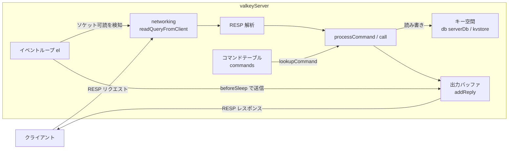
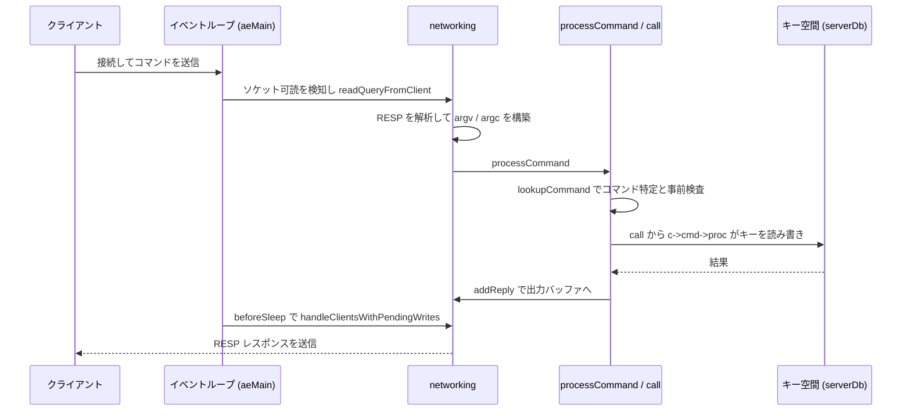

# 第2章 アーキテクチャ全体像

> **本章で読むソース**
>
> - [`src/server.h`](https://github.com/valkey-io/valkey/blob/9.1.0/src/server.h)
> - [`src/server.c`](https://github.com/valkey-io/valkey/blob/9.1.0/src/server.c)
> - [`src/ae.c`](https://github.com/valkey-io/valkey/blob/9.1.0/src/ae.c)
> - [`src/networking.c`](https://github.com/valkey-io/valkey/blob/9.1.0/src/networking.c)

## この章の狙い

本章は、Valkey のソースコード全体を読み進めるための地図である。
サーバを構成する主要コンポーネントが何のために存在し、互いにどうつながっているかを把握する。
クライアントが送った1つのコマンドが、ソケットから読み取られ、実行され、応答として返るまでの経路を一本の流れとして追えるようにする。
個々の内部実装には踏み込まず、役割と関係を正確に押さえることに集中する。

## 前提

第1章「[Valkey とは何か](01-what-is-valkey.md)」を先に読むとよい。
本章は C の基礎と、一般的なサーバやデータベースの仕組みを知っていることを前提とする。

## 中心にあるのは1つの巨大な構造体

Valkey のサーバプロセスは、状態のほとんどを `valkeyServer` という1つの構造体に集約する。
イベントループへのポインタ、データベースの配列、コマンドテーブルといった主要コンポーネントは、すべてこの構造体のメンバとして保持される。
プロセス全体で `server` というグローバル変数1つがこの構造体の実体を持ち、各コンポーネントはそこを起点に互いを参照する。

[`src/server.h` L1750-L1765](https://github.com/valkey-io/valkey/blob/9.1.0/src/server.h#L1750-L1765)

```c
struct valkeyServer {
    /* General */
    pid_t pid;                                        /* Main process pid. */
    pthread_t main_thread_id;                         /* Main thread id */
    // ... (中略) ...
    int hz;                                           /* serverCron() calls frequency in hertz */
    int clients_hz;                                   /* clientsTimeProc() frequency in hertz */
    int in_fork_child;                                /* indication that this is a fork child */
    serverDb **db;                                    /* each db created when it's first used */
    hashtable *commands;                              /* Command table */
    hashtable *orig_commands;                         /* Command table before command renaming. */
    sds command_response_cache[RESP_CACHE_INDEX_MAX]; /* Cached COMMAND response: [0]=RESP2, [1]=RESP3 */
    aeEventLoop *el;
```

ここに本章で扱うコンポーネントの大半が現れている。
`el` がイベントループ、`db` がデータベース配列、`commands` がコマンドテーブルである。
以降の節では、この3つを軸にコンポーネントを順に見ていく。

### イベントループ

`el`（`aeEventLoop`）は、Valkey のすべての処理を駆動する単一スレッドのイベントループである。
ソケットが読み書き可能になったというファイルイベントと、一定時間ごとに発火する時間イベントを多重化し、メインスレッド1本で順に処理する。
ループ本体は `aeMain` にあり、停止フラグが立つまで `aeProcessEvents` を呼び続ける。

[`src/ae.c` L540-L545](https://github.com/valkey-io/valkey/blob/9.1.0/src/ae.c#L540-L545)

```c
void aeMain(aeEventLoop *eventLoop) {
    eventLoop->stop = 0;
    while (!eventLoop->stop) {
        aeProcessEvents(eventLoop, AE_ALL_EVENTS | AE_CALL_BEFORE_SLEEP | AE_CALL_AFTER_SLEEP);
    }
}
```

`aeProcessEvents` は、まず登録済みのコールバックでイベントを待つ時間を決め、`aeApiPoll` でカーネルに問い合わせて発火したイベントを集める。
1回の `aeApiPoll` で複数のイベントがまとめて返るため、多数のクライアントを1本のスレッドで捌ける。

[`src/ae.c` L411-L421](https://github.com/valkey-io/valkey/blob/9.1.0/src/ae.c#L411-L421)

```c
int aeProcessEvents(aeEventLoop *eventLoop, int flags) {
    int processed = 0, numevents;

    /* Nothing to do? return ASAP */
    if (!(flags & AE_TIME_EVENTS) && !(flags & AE_FILE_EVENTS)) return 0;

    // ... (中略) ...
    if (eventLoop->maxfd != -1 || ((flags & AE_TIME_EVENTS) && !(flags & AE_DONT_WAIT))) {
```

イベントループの詳細は第24章「[イベントループ ae](../part04-server-events/24-event-loop.md)」で扱う。

### クライアントとネットワーク

接続してきた各クライアントは、`client` 構造体で表現される。
入力を溜める受信バッファ、解釈したコマンドの引数、応答を組み立てる出力バッファ、現在 `SELECT` しているデータベースへのポインタなど、1つの接続に関する状態をすべて持つ。

[`src/server.h` L1307-L1320](https://github.com/valkey-io/valkey/blob/9.1.0/src/server.h#L1307-L1320)

```c
typedef struct client {
    /* Basic client information and connection. */
    uint64_t id; /* Client incremental unique ID. */
    connection *conn;
    /* Input buffer and command parsing fields */
    sds querybuf;        /* Buffer we use to accumulate client queries. */
    size_t qb_pos;       /* The position we have read in querybuf. */
    robj **argv;         /* Arguments of current command. */
    int argc;            /* Num of arguments of current command. */
    int argv_len;        /* Size of argv array (may be more than argc) */
    size_t argv_len_sum; /* Sum of lengths of objects in argv list. */
    int reqtype;         /* Request protocol type: PROTO_REQ_* */
    int multibulklen;    /* Number of multi bulk arguments left to read. */
    long bulklen;        /* Length of bulk argument in multi bulk request. */
```

ソケットが読み取り可能になると、イベントループは `readQueryFromClient` を呼ぶ。
この関数は接続からバイト列を受信バッファに読み込み、溜まったバイト列を解釈してコマンドへと組み立てる。

[`src/networking.c` L4284-L4298](https://github.com/valkey-io/valkey/blob/9.1.0/src/networking.c#L4284-L4298)

```c
void readQueryFromClient(connection *conn) {
    client *c = connGetPrivateData(conn);
    /* Check if we can send the client to be handled by the IO-thread */
    if (postponeClientRead(c)) return;

    if (c->io_write_state != CLIENT_IDLE || c->io_read_state != CLIENT_IDLE) return;

    bool repeat = false;
    int iter = 0;
    do {
        bool full_read = readToQueryBuf(c);
        if (handleReadResult(c) == C_OK) {
            if (processInputBuffer(c) == C_ERR) return;
            trimCommandQueue(c);
        }
```

受信したバイト列は **RESP**（REdis Serialization Protocol）として解釈される。
クライアントが送るコマンドは、要素数とバイト長を前置した配列としてエンコードされており、これを解析して `argv`（引数の配列）と `argc`（引数の数）に分解する。
クライアントとネットワークの詳細は第25章「[ネットワークとクライアント](../part04-server-events/25-networking.md)」、RESP の解析と応答生成は第26章「[RESP プロトコルと応答生成](../part04-server-events/26-resp-protocol.md)」で扱う。

### コマンドテーブルと実行

引数に分解できたら、先頭の引数（コマンド名）からコマンドテーブルを引く。
`server.commands` は全コマンドの定義を格納した `hashtable` であり、`lookupCommand` がコマンド名に対応する `serverCommand` を返す。

[`src/server.c` L3479-L3481](https://github.com/valkey-io/valkey/blob/9.1.0/src/server.c#L3479-L3481)

```c
struct serverCommand *lookupCommand(robj **argv, int argc) {
    return lookupCommandLogic(server.commands, argv, argc, 0);
}
```

コマンドが見つかると、実行の入口である `processCommand` がアリティ（引数の数）や権限、メモリ上限などの事前検査を行う。

[`src/server.c` L4269-L4281](https://github.com/valkey-io/valkey/blob/9.1.0/src/server.c#L4269-L4281)

```c
int processCommand(client *c) {
    if (!scriptIsTimedout()) {
        // ... (中略) ...
        serverAssert(!server.in_exec);
        serverAssert(!scriptIsRunning());
    }

    /* in case we are starting to ProcessCommand and we already have a command we assume
     * this is a reprocessing of this command, so we do not want to perform some of the actions again. */
    int client_reprocessing_command = c->cmd ? 1 : 0;
```

検査を通ったコマンドは `call` で実行される。
`call` は実行前後の統計やレプリケーション伝播、キースペース通知といった共通処理をまとめて担い、中核ではコマンドごとの実装関数 `c->cmd->proc` を呼ぶ。

[`src/server.c` L3896](https://github.com/valkey-io/valkey/blob/9.1.0/src/server.c#L3896)

```c
    c->cmd->proc(c);
```

この `proc` がたとえば `GET` や `SET` の本体であり、ここでキー空間を読み書きする。
コマンド実行パイプラインの全体は第27章「[コマンド実行パイプライン](../part04-server-events/27-command-execution.md)」で扱う。

### キー空間とデータベース

コマンドが読み書きする対象がキー空間である。
データベースは `serverDb` 構造体で表され、`server.db` がその配列を保持する。
キーと値の対応は `keys`、有効期限を持つキーは `expires` という `kvstore` に格納される。

[`src/server.h` L898-L916](https://github.com/valkey-io/valkey/blob/9.1.0/src/server.h#L898-L916)

```c
/* Database representation. There are multiple databases identified
 * by integers from 0 (the default database) up to the max configured
 * database. The database number is the 'id' field in the structure. */
typedef struct serverDb {
    kvstore *keys;                        /* The keyspace for this DB */
    kvstore *expires;                     /* Timeout of keys with a timeout set */
    kvstore *keys_with_volatile_items;    /* Keys with volatile items */
    dict *blocking_keys;                  /* Keys with clients waiting for data (BLPOP)*/
    // ... (中略) ...
    dict *ready_keys;                     /* Blocked keys that received a PUSH */
    dict *watched_keys;                   /* WATCHED keys for MULTI/EXEC CAS */
    int id;                               /* Database ID */
    struct {
        long long avg_ttl;    /* Average TTL, just for stats */
        unsigned long cursor; /* Cursor of the active expire cycle. */
    } expiry[ACTIVE_EXPIRY_TYPE_COUNT];
} serverDb;
```

`kvstore` は、キー空間をスロット単位の `hashtable` の集合として抽象化した層である。
クラスタモードでは、キーのスロットごとに `hashtable` を分けて管理することで、スロット単位での操作を容易にする。
データベースとキー操作は第30章「[データベースとキー操作](../part05-database/30-database.md)」、`kvstore` は第13章「[kvstore キー空間抽象](../part02-memory-keyspace/13-kvstore.md)」で扱う。

### データ構造とオブジェクト

キー空間に格納される値は、`robj`（Redis Object）という共通のラッパーで表現される。
`robj` は型（文字列、リスト、セット、ハッシュ、ソート済みセットなど）と、その値を内部でどう表現するかを示すエンコーディングを持つ。
同じリスト型でも、要素が少なければコンパクトな `listpack`、大きくなれば `quicklist` というように、データの規模に応じて内部表現を切り替える。
オブジェクトとエンコーディングの仕組みは第14章「[robj とエンコーディング](../part03-objects-types/14-object-encoding.md)」、各型の実装は第3部で扱う。

### 永続化、レプリケーション、クラスタ

メモリ上のキー空間をディスクに保存する仕組みが永続化である。
ある時点のデータ全体をダンプする **RDB** スナップショットと、書き込みコマンドを逐次追記する **AOF** の2方式があり、いずれも子プロセスを `fork` して本体の処理を止めずに書き出す。
永続化は第6部「[永続化](../part06-persistence/35-rdb.md)」で扱う。

書き込みを別のサーバへ複製する仕組みがレプリケーションである。
プライマリがレプリカへデータと以後の書き込みストリームを送り、内容を同期させる。
複数ノードでキー空間をスロットに分割して保持する仕組みがクラスタである。
レプリケーションとクラスタは第7部「[レプリケーション](../part07-replication-cluster/38-replication.md)」で扱う。

### 定期処理

時刻に依存する保守作業を担うのが `serverCron` である。
イベントループに時間イベントとして登録され、`server.hz` で決まる頻度で繰り返し呼ばれる。

[`src/server.c` L1503-L1507](https://github.com/valkey-io/valkey/blob/9.1.0/src/server.c#L1503-L1507)

```c
long long serverCron(struct aeEventLoop *eventLoop, long long id, void *clientData) {
    int j;
    UNUSED(eventLoop);
    UNUSED(id);
    UNUSED(clientData);
```

有効期限切れキーの回収、ハッシュテーブルの段階的なリハッシュ、メモリ統計の更新、バックグラウンド保存の起動判断などを、ここから少しずつ進める。
定期処理は本章末で改めて触れる。

## データの流れ

ここまでのコンポーネントは、1つのコマンドを処理する経路として一本につながる。
クライアントがコマンドを送ってから応答を受け取るまでの往復を、流れとして追う。



接続を受け付けた時点で、各クライアントには `readQueryFromClient` がファイルイベントのハンドラとして結び付けられる。
クライアントがバイト列を送るとソケットが読み取り可能になり、イベントループがそれを検知してハンドラを呼ぶ。
ハンドラは受信バッファに読み込み、RESP として解釈して `argv` と `argc` を組み立てる。

組み立てたコマンドは `processCommand` に渡される。
`processCommand` はコマンドテーブルを引いて実装を特定し、事前検査を通したうえで `call` を呼ぶ。

[`src/server.c` L4637](https://github.com/valkey-io/valkey/blob/9.1.0/src/server.c#L4637)

```c
        call(c, flags);
```

`call` の中で `c->cmd->proc` が走り、キー空間を読み書きする。
読み書きの結果は、実装関数の中から `addReply` 系の関数で応答バッファに書き込まれる。

[`src/networking.c` L786-L789](https://github.com/valkey-io/valkey/blob/9.1.0/src/networking.c#L786-L789)

```c
void addReply(client *c, robj *obj) {
    if (prepareClientToWrite(c) != C_OK) return;

    if (sdsEncodedObject(obj)) {
```

応答はその場で送信されず、いったんクライアントの出力バッファに溜まる。
実際の送信は、イベントループが次にスリープへ入る直前のコールバック `beforeSleep` の中で、書き込み待ちのクライアントをまとめて処理する形で行われる。

[`src/server.c` L1831](https://github.com/valkey-io/valkey/blob/9.1.0/src/server.c#L1831)

```c
        processed += handleClientsWithPendingWrites();
```

このコマンド1往復を、関係する関数の呼び出し順で示すと次のようになる。



応答を出力バッファにいったん溜め、イベントループのスリープ直前にまとめて書き出す設計には、性能上の理由がある。
1つのイベント処理の中で `write` を即座に呼ばず、その回のイベント処理で生じた全クライアントの応答を1か所に集めてから送るため、システムコールの回数を減らせる。
単一スレッドのイベントループは、このように書き込みをまとめることで、多数の接続を1本のスレッドで効率よく捌く。

## バックグラウンドの処理

コマンド1往復の経路の外側で、サーバは継続的に保守作業を行う。

時刻に依存する保守は `serverCron` が担う。
そのうちデータベースに関わる作業は `databasesCron` に集約され、ここで有効期限切れキーの能動的な回収などを進める。

[`src/server.c` L1270-L1273](https://github.com/valkey-io/valkey/blob/9.1.0/src/server.c#L1270-L1273)

```c
void databasesCron(void) {
    /* Expire keys by random sampling. Not required for replicas
     * as primary will synthesize DELs for us. */
    if (server.active_expire_enabled) {
```

`serverCron` は1回の呼び出しに使える時間が限られるため、重い作業を一度に終わらせず、呼び出しのたびに少しずつ進める。
ハッシュテーブルのリハッシュもこの方式で、キーの再配置を複数回の `serverCron` に分割する。
こうした段階的な処理によって、巨大なキー空間を扱っていても、1回のイベント処理が長時間ブロックすることを避けられる。

`serverCron` は条件を満たすと、RDB のバックグラウンド保存を起動する。

[`src/server.c` L1616](https://github.com/valkey-io/valkey/blob/9.1.0/src/server.c#L1616)

```c
                rdbSaveBackground(REPLICA_REQ_NONE, server.rdb_filename, rsiptr, RDBFLAGS_NONE);
```

RDB と AOF の書き出しは、いずれも子プロセスを `fork` して行う。
`fork` 直後の子プロセスは親とメモリページを共有し、書き込みが起きたページだけを複製するコピーオンライトの仕組みにより、保存中も本体は処理を続けられる。
レプリケーションやクラスタの保守も、`serverCron` から定期的に呼ばれる `replicationCron` や `clusterCron` が担う。

## 起動から定常状態まで

これらのコンポーネントは、サーバ起動時に組み立てられる。
`main` が設定を読み込んで `initServer` を呼び、`initServer` がイベントループを生成し、`serverCron` を時間イベントとして登録する。

[`src/server.c` L3039-L3044](https://github.com/valkey-io/valkey/blob/9.1.0/src/server.c#L3039-L3044)

```c
    /* Create the timer callback, this is our way to process many background
     * operations incrementally, like eviction of unaccessed expired keys, etc. */
    if (aeCreateTimeEvent(server.el, 1, serverCron, NULL, NULL) == AE_ERR) {
        serverPanic("Can't create serverCron timer.");
        exit(1);
    }
```

組み立てが終わると `main` は `aeMain` を呼び、以後はイベントループが処理の主体となる。

[`src/server.c` L7762](https://github.com/valkey-io/valkey/blob/9.1.0/src/server.c#L7762)

```c
    aeMain(server.el);
```

起動シーケンスと最小の対話例は、第3章「[起動と最小の対話](03-hello-valkey.md)」で具体的に追う。

## まとめ

- Valkey はサーバの状態を `valkeyServer` 構造体に集約し、イベントループ `el`、データベース配列 `db`、コマンドテーブル `commands` を中心に各コンポーネントがつながる。
- 処理は単一スレッドのイベントループ `aeMain` が駆動し、ソケットの可読を検知して `readQueryFromClient` を呼ぶ。
- 受信バイト列は RESP として解釈され、`lookupCommand` でコマンドを特定し、`processCommand` の検査を経て `call` が `c->cmd->proc` を実行する。
- コマンドはキー空間（`serverDb` の `kvstore`）を読み書きし、結果を `addReply` で出力バッファに溜める。送信はイベントループのスリープ直前にまとめて行い、システムコールを節約する。
- 永続化、レプリケーション、クラスタといった保守作業は、`serverCron` の段階的処理や `fork` した子プロセスを通じて、本体の処理を止めずに進める。

## 関連する章

- 第3章「[起動と最小の対話](03-hello-valkey.md)」：起動シーケンスを具体的に追う。
- 第24章「[イベントループ ae](../part04-server-events/24-event-loop.md)」：イベントループの内部。
- 第25章「[ネットワークとクライアント](../part04-server-events/25-networking.md)」：クライアント入出力の詳細。
- 第27章「[コマンド実行パイプライン](../part04-server-events/27-command-execution.md)」：`processCommand` と `call` の全体。
- 第30章「[データベースとキー操作](../part05-database/30-database.md)」：キー空間の操作。
