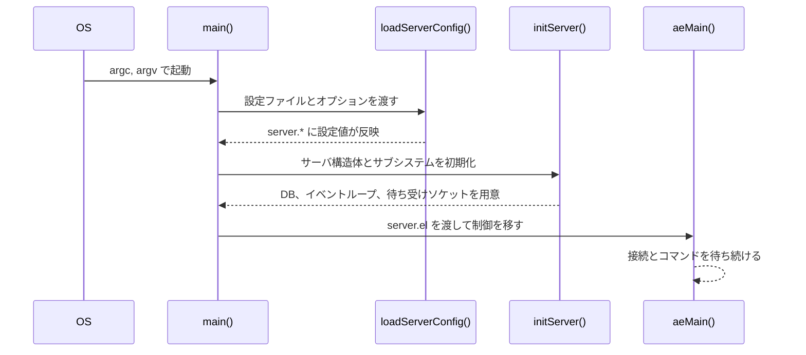
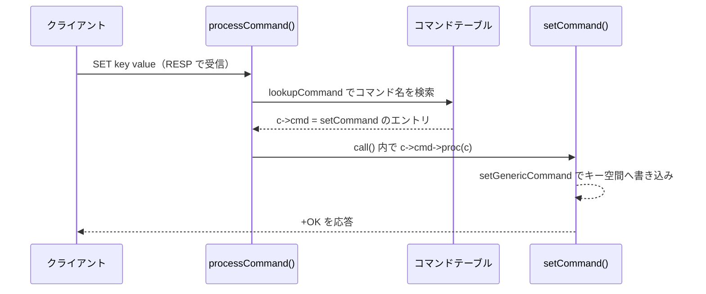

# 第3章 起動と最小の対話

> **本章で読むソース**
>
> - [`src/server.c`](https://github.com/valkey-io/valkey/blob/9.1.0/src/server.c)
> - [`src/config.c`](https://github.com/valkey-io/valkey/blob/9.1.0/src/config.c)
> - [`src/t_string.c`](https://github.com/valkey-io/valkey/blob/9.1.0/src/t_string.c)
> - [`src/commands.def`](https://github.com/valkey-io/valkey/blob/9.1.0/src/commands.def)
> - [`valkey.conf`](https://github.com/valkey-io/valkey/blob/9.1.0/valkey.conf)
> - [`README.md`](https://github.com/valkey-io/valkey/blob/9.1.0/README.md)

## この章の狙い

ソースを手元でビルドし、`valkey-server` を起動して `SET` と `GET` を往復させるところまでを、コードの上で追えるようにする。
`main` の起動列がどの順で何を準備するか、設定ファイルがどこで読まれるか、そして受け取ったコマンドが `setCommand` や `getCommand` という実体にどう結びつくかを示す。
本章は全体の地図であり、各処理の内側へは後続の章で立ち入る。

## 前提

特になし。
本書を最初から読む場合は第1章「Valkey とは何か」と第2章「アーキテクチャ概観」を先に読むとよいが、本章だけでも追える。

## ビルドして起動する

Valkey の配布物はトップディレクトリの `Makefile` から `src/` 配下のビルドへ委譲する作りになっている。
README が示すビルド手順は一行で済む。

[`README.md` L23-L25](https://github.com/valkey-io/valkey/blob/9.1.0/README.md#L23-L25)

```text
It is as simple as:

    % make
```

`make` が成功すると `src/` に `valkey-server` などの実行ファイルが生成される。
サーバは設定ファイルを引数に取って起動できる。

```text
% ./src/valkey-server ./valkey.conf
```

設定ファイルを渡さずに起動すると、後述するように既定値だけで動く。
起動が終わるとサーバはイベントループに入り、クライアントからの接続を待ち受ける状態になる。

## main の起動列

エントリポイントは `main` である。
ここでの関心は、設定の読み込み、サーバ構造体の初期化、イベントループの開始という三つの段が、どの順でどこに現れるかにある。

設定の読み込みは、コマンドライン引数を組み立てたうえで `loadServerConfig` を呼ぶ箇所に現れる。

[`src/server.c` L7619-L7621](https://github.com/valkey-io/valkey/blob/9.1.0/src/server.c#L7619-L7621)

```c
        loadServerConfig(server.configfile, config_from_stdin, options);
        if (server.sentinel_mode) loadSentinelConfigFromQueue();
        sdsfree(options);
```

第1引数の `server.configfile` は、引数の先頭が設定ファイル名であった場合にその絶対パスが入る。
第3引数の `options` には、`--port 6380` のようなコマンドラインオプションが設定ファイルの後ろに連結される文字列として渡る。
この優先順位は引数解析の箇所にコメントとして明記されている。

[`src/server.c` L7536-L7539](https://github.com/valkey-io/valkey/blob/9.1.0/src/server.c#L7536-L7539)

```c
        /* Parse command line options
         * Precedence wise, File, stdin, explicit options -- last config is the one that matters.
         *
         * First argument is the config file name? */
```

設定を読み込んだあと、`main` はサーバ構造体とサブシステムを初期化する `initServer` を呼ぶ。

[`src/server.c` L7681-L7684](https://github.com/valkey-io/valkey/blob/9.1.0/src/server.c#L7681-L7684)

```c
    initServer();
    if (background || server.pidfile) createPidFile();
    if (server.set_proc_title) serverSetProcTitle(NULL);
    serverAsciiArt();
```

`initServer` は [`src/server.c` L2881](https://github.com/valkey-io/valkey/blob/9.1.0/src/server.c#L2881) から始まる関数で、データベースやイベントループ、共有オブジェクト、待ち受けソケットといった、サーバが動くために必要な状態をここでまとめて用意する。
この内側は第24章「イベントループ」と第25章「ネットワーク」で扱う。

初期化を終えると、`main` は永続化ファイルからデータを読み戻し、最後にイベントループへ制御を渡す。

[`src/server.c` L7762-L7764](https://github.com/valkey-io/valkey/blob/9.1.0/src/server.c#L7762-L7764)

```c
    aeMain(server.el);
    aeDeleteEventLoop(server.el);
    return 0;
```

`aeMain` は [`src/ae.c` L540](https://github.com/valkey-io/valkey/blob/9.1.0/src/ae.c#L540) で定義されるイベントループの本体で、停止が指示されるまで戻らない。
`aeMain` の手前で出力される起動ログが、サーバが接続を受け付ける段階に入ったことを示す。

[`src/server.c` L7731](https://github.com/valkey-io/valkey/blob/9.1.0/src/server.c#L7731)

```c
            serverLog(LL_NOTICE, "Ready to accept connections %s", getConnectionTypeName(listener->ct->get_type()));
```

この三段を図にすると次のようになる。



Valkey はコマンドの実行を単一スレッドのイベントループに集約している。
このため、データ構造の更新に細かいロックを取る必要がなく、一つのコマンドの処理がほかのコマンドと競合しない。
この単純さが、低オーバーヘッドで高いスループットを出せる土台になっている。
イベントループの仕組みは第24章で詳しく追う。

## 設定の基本

`valkey.conf` は一行につき一項目の素朴なテキストである。
代表的な項目を見て、それぞれが何を制御するかを押さえる。

`port` はクライアント接続を受け付ける TCP ポートを指定する。

[`valkey.conf` L137-L139](https://github.com/valkey-io/valkey/blob/9.1.0/valkey.conf#L137-L139)

```text
# Accept connections on the specified port, default is 6379 (IANA #815344).
# If port 0 is specified the server will not listen on a TCP socket.
port 6379
```

`save` は、一定時間内に一定数の書き込みがあったときに RDB スナップショットをディスクへ保存する条件を並べる。

[`valkey.conf` L568-L571](https://github.com/valkey-io/valkey/blob/9.1.0/valkey.conf#L568-L571)

```text
# Unless specified otherwise, by default the server will save the DB:
#   * After 3600 seconds (an hour) if at least 1 change was performed
#   * After 300 seconds (5 minutes) if at least 100 changes were performed
#   * After 60 seconds if at least 10000 changes were performed
```

`appendonly` は AOF（追記ログ方式の永続化）を有効にするかどうかを切り替える。
既定では無効になっている。

[`valkey.conf` L1592](https://github.com/valkey-io/valkey/blob/9.1.0/valkey.conf#L1592)

```text
appendonly no
```

`maxmemory` は使用メモリの上限を指定する。
既定では行がコメントアウトされており、上限なしで動く。

[`valkey.conf` L1326](https://github.com/valkey-io/valkey/blob/9.1.0/valkey.conf#L1326)

```text
# maxmemory <bytes>
```

上限に達したときにどのキーを退避するかは `maxmemory-policy` で決める。
RDB と AOF は永続化の二方式であり、それぞれ第35章「RDB」と第36章「AOF」で、`maxmemory` によるメモリ退避は第32章「メモリ退避」で扱う。

これらのテキストを実際に解釈するのが `config.c` である。
`loadServerConfig` はファイル、標準入力、コマンドラインオプションの順に内容を一本の文字列へ連結し、それを `loadServerConfigFromString` に渡す。

[`src/config.c` L713-L719](https://github.com/valkey-io/valkey/blob/9.1.0/src/config.c#L713-L719)

```c
    /* Append the additional options */
    if (options) {
        config = sdscat(config, "\n");
        config = sdscat(config, options);
    }
    loadServerConfigFromString(config);
    sdsfree(config);
```

連結された設定文字列を一行ずつ解釈し、`server` 構造体の各フィールドへ書き込むのが [`src/config.c` L459](https://github.com/valkey-io/valkey/blob/9.1.0/src/config.c#L459) の `loadServerConfigFromString` である。
設定項目の定義と検査、`CONFIG GET` や `CONFIG SET` による実行時の参照と変更の仕組みは第29章「設定」で扱う。

## 最小の対話

サーバが起動したら、クライアントは `SET key value` で値を書き、`GET key` で読み戻せる。
この往復が内部でどうつながるかを追う。

クライアントから届いた一連のバイト列は、RESP（Valkey のクライアントプロトコル）として解析され、引数の配列 `c->argv` に組み立てられる。
そのうえで `processCommand` がコマンド名を引いて実体を決める。
コマンド名から関数へのひも付けはコマンドテーブルにある。
たとえば `GET` と `SET` の登録はそれぞれ次の行で、`getCommand` と `setCommand` という関数ポインタを持つ。

[`src/commands.def` L12098](https://github.com/valkey-io/valkey/blob/9.1.0/src/commands.def#L12098)

```c
{MAKE_CMD("get","Returns the string value of a key.","O(1)","1.0.0",CMD_DOC_NONE,NULL,NULL,"string",COMMAND_GROUP_STRING,GET_History,0,GET_Tips,0,getCommand,2,CMD_READONLY|CMD_FAST,ACL_CATEGORY_FAST|ACL_CATEGORY_READ|ACL_CATEGORY_STRING,NULL,GET_Keyspecs,1,NULL,1),.args=GET_Args},
```

[`src/commands.def` L12112](https://github.com/valkey-io/valkey/blob/9.1.0/src/commands.def#L12112)

```c
{MAKE_CMD("set","Sets the string value of a key, ignoring its type. The key is created if it doesn't exist.","O(1)","1.0.0",CMD_DOC_NONE,NULL,NULL,"string",COMMAND_GROUP_STRING,SET_History,5,SET_Tips,0,setCommand,-3,CMD_WRITE|CMD_DENYOOM,ACL_CATEGORY_SLOW|ACL_CATEGORY_STRING|ACL_CATEGORY_WRITE,NULL,SET_Keyspecs,1,setGetKeys,5),.args=SET_Args},
```

`processCommand` はこのテーブルを引いて該当エントリを `c->cmd` に据える。
その検索を担うのが `lookupCommand` である。

[`src/server.c` L3479-L3481](https://github.com/valkey-io/valkey/blob/9.1.0/src/server.c#L3479-L3481)

```c
struct serverCommand *lookupCommand(robj **argv, int argc) {
    return lookupCommandLogic(server.commands, argv, argc, 0);
}
```

エントリが見つかると `c->cmd` に格納される。

[`src/server.c` L4313](https://github.com/valkey-io/valkey/blob/9.1.0/src/server.c#L4313)

```c
        c->cmd = c->lastcmd = c->realcmd = cmd;
```

引数の数や権限などの検査を通った後、`call` の中で登録された関数ポインタが呼ばれる。

[`src/server.c` L3896](https://github.com/valkey-io/valkey/blob/9.1.0/src/server.c#L3896)

```c
    c->cmd->proc(c);
```

`SET` の場合、ここで呼ばれるのが `setCommand` である。
入口でオプションを解析し、値を内部表現へ変換したうえで、書き込みの本体である `setGenericCommand` へ渡す。

[`src/t_string.c` L251-L265](https://github.com/valkey-io/valkey/blob/9.1.0/src/t_string.c#L251-L265)

```c
void setCommand(client *c) {
    robj *expire = NULL;
    robj *comparison = NULL;
    int unit = UNIT_SECONDS;
    int flags = ARGS_NO_FLAGS;

    if (parseExtendedCommandArgumentsOrReply(c, COMMAND_SET, 3, c->argc, &flags, &unit, NULL, &expire, &comparison) != C_OK) {
        return;
    }

    if (!c->flag.argv_borrowed) {
        c->argv[2] = tryObjectEncoding(c->argv[2]);
    }
    setGenericCommand(c, flags, c->argv[1], c->argv[2], expire, unit, NULL, NULL, comparison);
}
```

`tryObjectEncoding` は値をコンパクトな内部表現に変えてからキー空間へ書く。
値オブジェクトの生成とエンコーディングの選択は第14章「オブジェクトとエンコーディング」で、キー空間への書き込みは第30章「データベース」で扱う。

`GET` の場合は `getCommand` が呼ばれ、実装は `getGenericCommand` に委譲される。

[`src/t_string.c` L302-L318](https://github.com/valkey-io/valkey/blob/9.1.0/src/t_string.c#L302-L318)

```c
int getGenericCommand(client *c) {
    robj *o;

    if ((o = lookupKeyReadOrReply(c, c->argv[1], shared.null[c->resp])) == NULL)
        return C_OK;

    if (checkType(c, o, OBJ_STRING)) {
        return C_ERR;
    }

    addReplyBulk(c, o);
    return C_OK;
}

void getCommand(client *c) {
    getGenericCommand(c);
}
```

`lookupKeyReadOrReply` はキー空間から値を引く読み取り経路で、キーが無ければ `null` 応答をその場で返す。
値が見つかれば `addReplyBulk` が応答バッファに書き、イベントループがクライアントへ送り返す。
キー空間からの読み取りは第30章で、応答が組み立てられてから送信されるまでの経路は第26章「RESP プロトコル」と第27章「コマンド実行」で扱う。

この一往復を図にすると次のようになる。



## まとめ

- `make` でビルドし、`valkey-server` に `valkey.conf` を渡して起動できる。深入りせずとも一行でビルドが通る。
- `main` の起動列は、`loadServerConfig` による設定読み込み、`initServer` によるサーバ構造体とサブシステムの初期化、`aeMain` によるイベントループ開始という三段からなる。
- `valkey.conf` の `port`、`save`、`appendonly`、`maxmemory` は、接続ポート、RDB スナップショットの条件、AOF の有無、メモリ上限を制御する。これらは `config.c` の `loadServerConfig` が一本の文字列に連結し、`loadServerConfigFromString` が `server` 構造体へ反映する。
- クライアントが送る `SET`／`GET` は `processCommand` がコマンドテーブルを引いて `setCommand`／`getCommand` に結びつけ、`call` の中の `c->cmd->proc(c)` で実体が呼ばれる。
- コマンドの実体は読み書きの経路（キー空間操作、オブジェクト生成、応答の組み立て）へ繋がる。本章はその入口を示すにとどめ、内側は後続の章へ送る。
- Valkey はコマンド実行を単一スレッドのイベントループに集約しており、更新時のロックが不要になることが高いスループットの土台になっている。

## 関連する章

- 第14章「オブジェクトとエンコーディング」：`SET` が値を内部表現へ変える `tryObjectEncoding` の先。
- 第24章「イベントループ」：`initServer` と `aeMain` の内側。
- 第26章「RESP プロトコル」：クライアントとの送受信の組み立て。
- 第27章「コマンド実行」：`processCommand` から `call` までの実行経路の全体。
- 第29章「設定」：`config.c` による設定項目の定義と実行時の変更。
- 第30章「データベース」：`lookupKeyReadOrReply` などキー空間操作の本体。
