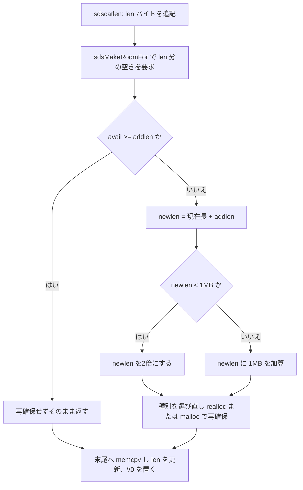

# 第4章 SDS 動的文字列

> **本章で読むソース**
>
> - [`src/sds.h`](https://github.com/valkey-io/valkey/blob/9.1.0/src/sds.h)
> - [`src/sds.c`](https://github.com/valkey-io/valkey/blob/9.1.0/src/sds.c)

## この章の狙い

Valkey は C で書かれているが、内部で扱う文字列に素の C 文字列（`char *`）を使わない。
代わりに **SDS**（Simple Dynamic String）という独自の文字列型を使う。
本章を読むと、SDS がどんなメモリレイアウトを持ち、なぜ長さ取得が O(1) で、なぜ追記を繰り返しても再確保が少なく済むのかを、実コードのレベルで説明できるようになる。

## 前提

特になし。

## SDS とは何か

SDS は、長さ情報を持つヘッダと文字列本体を一続きのメモリに置いたデータ構造である。
利用者が受け取るのはヘッダではなく、文字列本体の先頭を指すポインタである。
その型は単なる `char *` の別名として定義されている。

[`src/sds.h` L49-L50](https://github.com/valkey-io/valkey/blob/9.1.0/src/sds.h#L49-L50)

```c
typedef char *sds;
typedef const char *const_sds;
```

`sds` が `char *` であるという事実が、SDS の設計の出発点になっている。
ヘッダは文字列本体の直前に置かれ、利用者は本体を指すポインタだけを持つ。
ヘッダを読みたいときは、ポインタを手前にずらしてヘッダ構造体に重ね合わせる。

この配置には二つの利点がある。
第一に、`sds` をそのまま `printf` や `strlen` のような C 標準の文字列関数へ渡せる。
SDS は本体の末尾につねに `\0` を書き込むので、C 文字列としても通用するからである。
第二に、長さを別に持つので二進安全（binary-safe）である。
長さはヘッダの `len` フィールドが保持するため、本体の途中に `\0` を含むデータも正しく扱える。
長さの取得も、本体を末尾まで走査する `strlen` と違い、ヘッダの `len` を読むだけの O(1) で済む。

## ヘッダの構造と多段化

SDS のヘッダは文字列長に応じて5種類を使い分ける。
これが SDS の省メモリ最適化の一つめである。
短い文字列には小さなヘッダを、長い文字列には大きなヘッダを割り当て、長さフィールドが消費するバイト数を必要最小限に抑える。

[`src/sds.h` L52-L81](https://github.com/valkey-io/valkey/blob/9.1.0/src/sds.h#L52-L81)

```c
/* Note: sdshdr5 is never used, we just access the flags byte directly.
 * However is here to document the layout of type 5 SDS strings. */
struct __attribute__((__packed__)) sdshdr5 {
    unsigned char flags; /* 3 lsb of type, and 5 msb of string length */
    char buf[];
};
struct __attribute__((__packed__)) sdshdr8 {
    uint8_t len;         /* used */
    uint8_t alloc;       /* excluding the header and null terminator */
    unsigned char flags; /* 3 lsb of type, 5 unused bits */
    char buf[];
};
// ... (中略：sdshdr16 / sdshdr32 は同じ形で len と alloc の幅だけが異なる) ...
struct __attribute__((__packed__)) sdshdr64 {
    uint64_t len;        /* used */
    uint64_t alloc;      /* excluding the header and null terminator */
    unsigned char flags; /* 3 lsb of type, 5 unused bits */
    char buf[];
};
```

`sdshdr8` を例に、各フィールドの役割を確認する。
`len` は現在格納している文字列の長さである。
`alloc` は本体に確保済みの容量で、ヘッダと終端の `\0` を除いたバイト数を表す。
`flags` は下位3ビットにヘッダの種別を、残り5ビットを補助用途に持つ1バイトである。
`buf` は長さを書かない柔軟配列メンバで、ここから文字列本体が始まる。
ヘッダ種別が `sdshdr16` から `sdshdr64` へ大きくなるにつれて、`len` と `alloc` の幅が16ビット、32ビット、64ビットへと広がる。

`sdshdr5` だけは形が違う。
`len` と `alloc` のフィールドを持たず、`flags` の上位5ビットに長さを直接詰め込む。
このため `sdshdr5` で表せる長さは最大31バイトで、空き容量を別に記録する場所もない。
コメントが述べるとおり、`sdshdr5` の構造体自体は実際には使われず、レイアウトを文書化するために置かれている。
種別が `sdshdr5` の文字列に対しては、フラグバイトを直接読み書きする。

各構造体には `__attribute__((__packed__))` が付いている。
これはコンパイラに構造体のパディングを禁じる指示である。
パディングが入ると `len` と `alloc` のあいだに隙間が空き、省メモリの効果が薄れる。
さらに重要なのは、ヘッダと本体が隙間なく連続することである。
これにより、本体ポインタからヘッダサイズだけ手前へ戻ればヘッダの先頭に正確に届く。

### フラグからヘッダへたどる

種別を表すフラグの定数と、本体ポインタからヘッダを取り出すマクロは次のように定義される。

[`src/sds.h` L83-L92](https://github.com/valkey-io/valkey/blob/9.1.0/src/sds.h#L83-L92)

```c
#define SDS_TYPE_5 0
#define SDS_TYPE_8 1
#define SDS_TYPE_16 2
#define SDS_TYPE_32 3
#define SDS_TYPE_64 4
#define SDS_TYPE_MASK 7
#define SDS_TYPE_BITS 3
#define SDS_HDR_VAR(T, s) struct sdshdr##T *sh = (struct sdshdr##T *)((s) - (sizeof(struct sdshdr##T)))
#define SDS_HDR(T, s) ((struct sdshdr##T *)((s) - (sizeof(struct sdshdr##T))))
#define SDS_TYPE_5_LEN(f) ((unsigned char)(f) >> SDS_TYPE_BITS)
```

`flags` の下位3ビットが種別を表すので、種別を取り出すには `SDS_TYPE_MASK`（値は7、下位3ビット）で論理積をとる。
フラグバイトは本体ポインタ `s` の1バイト手前、すなわち `s[-1]` にある。
これは、すべてのヘッダ構造体で `flags` が `buf` の直前に置かれているためである。
`SDS_HDR(T, s)` は、本体ポインタ `s` から種別 `T` のヘッダサイズだけ引き、その位置をヘッダ構造体のポインタとして解釈する。

長さの取得は、まず種別を読み、種別ごとに正しいヘッダから `len` を取り出すことで実現する。

[`src/sds.h` L132-L141](https://github.com/valkey-io/valkey/blob/9.1.0/src/sds.h#L132-L141)

```c
static inline size_t sdslen(const_sds s) {
    switch (sdsType(s)) {
    case SDS_TYPE_5: return SDS_TYPE_5_LEN(s[-1]);
    case SDS_TYPE_8: return SDS_HDR(8, s)->len;
    case SDS_TYPE_16: return SDS_HDR(16, s)->len;
    case SDS_TYPE_32: return SDS_HDR(32, s)->len;
    case SDS_TYPE_64: return SDS_HDR(64, s)->len;
    }
    return 0;
}
```

`SDS_TYPE_5` のときだけは、ヘッダの `len` ではなくフラグバイトの上位5ビットから長さを取り出す。
それ以外の種別では、対応するヘッダの `len` を一度読むだけで長さが定まる。
どの分岐も走査を含まないので、長さ取得は文字列の長さによらず一定時間である。

空き容量を返す `sdsavail` も、同じ要領で種別ごとに `alloc - len` を計算する。
`SDS_TYPE_5` は空き容量を記録できないため、つねに0を返す。

[`src/sds.h` L143-L167](https://github.com/valkey-io/valkey/blob/9.1.0/src/sds.h#L143-L167)

```c
static inline size_t sdsavail(const_sds s) {
    unsigned char flags = s[-1];
    switch (flags & SDS_TYPE_MASK) {
    case SDS_TYPE_5: {
        return 0;
    }
    case SDS_TYPE_8: {
        SDS_HDR_VAR(8, s);
        return sh->alloc - sh->len;
    }
    // ... (中略：SDS_TYPE_16 / 32 / 64 も同様に alloc - len を返す) ...
    }
    return 0;
}
```

### メモリレイアウト

`sdshdr8` の文字列を例に、メモリ上の並びを示す。
左端の `len`、`alloc`、`flags` がヘッダで、`buf` から本体が始まる。
利用者が持つ `sds` ポインタは `buf` の先頭、つまり `flags` の1バイト後ろを指す。

```text
        ┌─ ヘッダ（sdshdr8、packed）─┐
        │                            │
バイト:  [ len ][ alloc ][ flags ]   [ b ][ u ][ f ][ ... ][ \0 ]
         1 byte  1 byte   1 byte      ↑
                          ↑          s（利用者が持つ sds ポインタ）
                          s[-1]（フラグバイト。下位3ビットが種別）

  len   : 現在の文字列長（sdslen が返す値）
  alloc : 本体の確保容量（ヘッダと \0 を除く）
  flags : 下位3ビット = 種別、上位5ビット = 補助ビット
  \0    : C 文字列互換のための終端。len には数えない
```

種別が `sdshdr16` 以上になると、`len` と `alloc` のフィールド幅が広がるぶんヘッダが大きくなる。
本体の位置はヘッダサイズだけ後ろへずれるが、利用者から見た使い方は変わらない。

## 文字列長から種別を選ぶ

新しい SDS を作るとき、文字列長から最小のヘッダ種別を選ぶのが `sdsReqType` である。

[`src/sds.c` L55-L66](https://github.com/valkey-io/valkey/blob/9.1.0/src/sds.c#L55-L66)

```c
/* Returns the minimum SDS type required to store a string of the given length. */
char sdsReqType(size_t string_size) {
    if (string_size < 1 << 5) return SDS_TYPE_5;
    if (string_size <= (1 << 8) - sizeof(struct sdshdr8) - 1) return SDS_TYPE_8;
    if (string_size <= (1 << 16) - sizeof(struct sdshdr16) - 1) return SDS_TYPE_16;
#if (LONG_MAX == LLONG_MAX)
    if (string_size <= (1ll << 32) - sizeof(struct sdshdr32) - 1) return SDS_TYPE_32;
    return SDS_TYPE_64;
#else
    return SDS_TYPE_32;
#endif
}
```

長さが31バイト以下なら `SDS_TYPE_5` を選ぶ。
ここで境界に注目したい。
`SDS_TYPE_8` 以降の判定は、生の長さの上限ではなく、ヘッダサイズと終端1バイトを差し引いた値と比較している。
たとえば `SDS_TYPE_8` の `len` と `alloc` は8ビット幅なので、本体は最大255バイトを表せる。
そのうちヘッダ3バイトと終端1バイトを使うため、判定式は `(1 << 8) - sizeof(struct sdshdr8) - 1` となる。
こうしてヘッダと終端を含めた割り当て全体が、選んだ種別の長さフィールドで表せる範囲に収まるよう種別を決める。

種別からヘッダのバイト数を返すのが `sdsHdrSize` である。
`sizeof` を使うので、各構造体の実サイズがそのままヘッダサイズになる。

[`src/sds.c` L44-L53](https://github.com/valkey-io/valkey/blob/9.1.0/src/sds.c#L44-L53)

```c
int sdsHdrSize(char type) {
    switch (type & SDS_TYPE_MASK) {
    case SDS_TYPE_5: return sizeof(struct sdshdr5);
    case SDS_TYPE_8: return sizeof(struct sdshdr8);
    case SDS_TYPE_16: return sizeof(struct sdshdr16);
    case SDS_TYPE_32: return sizeof(struct sdshdr32);
    case SDS_TYPE_64: return sizeof(struct sdshdr64);
    }
    return 0;
}
```

実際に SDS を確保する `_sdsnewlen` は、これらを組み合わせる。

[`src/sds.c` L91-L107](https://github.com/valkey-io/valkey/blob/9.1.0/src/sds.c#L91-L107)

```c
sds _sdsnewlen(const void *init, size_t initlen, int trymalloc) {
    void *sh;
    char type = sdsReqType(initlen);
    /* Empty strings are usually created in order to append. Use type 8
     * since type 5 is not good at this. */
    if (type == SDS_TYPE_5 && initlen == 0) type = SDS_TYPE_8;
    int hdrlen = sdsHdrSize(type);
    size_t bufsize;

    assert(initlen + hdrlen + 1 > initlen); /* Catch size_t overflow */
    sh = trymalloc ? s_trymalloc_usable(hdrlen + initlen + 1, &bufsize)
                   : s_malloc_usable(hdrlen + initlen + 1, &bufsize);
    if (sh == NULL) return NULL;

    adjustTypeIfNeeded(&type, &hdrlen, bufsize);
    return sdswrite(sh, bufsize, type, init, initlen);
}
```

流れは次のとおりである。
まず `sdsReqType` で種別を選び、`sdsHdrSize` でヘッダサイズを得る。
確保するバイト数は、ヘッダと本体（`initlen`）と終端1バイトの合計である。
確保したメモリの先頭 `sh` はヘッダの先頭であり、ここからヘッダサイズだけ後ろが本体になる。

ここに空文字列の特例がある。
長さ0のとき `sdsReqType` は `SDS_TYPE_5` を選ぶが、`_sdsnewlen` はそれを `SDS_TYPE_8` へ変える。
空文字列は追記の起点として作られることが多く、`SDS_TYPE_5` は空き容量を覚えられないため追記に向かないからである。
この一行は、後述する追記の最適化が初手から効くようにするための布石である。

## 追記と伸長

SDS のもう一つの最適化は、追記時の事前確保（preallocation）である。
これを担うのが `sdsMakeRoomFor` で、`_sdsMakeRoomFor` に `greedy=1` を渡した薄い包みである。

[`src/sds.c` L246-L306](https://github.com/valkey-io/valkey/blob/9.1.0/src/sds.c#L246-L306)

```c
sds _sdsMakeRoomFor(sds s, size_t addlen, int greedy) {
    void *sh, *newsh;
    size_t avail = sdsavail(s);
    size_t len, newlen, reqlen;
    char type, oldtype = sdsType(s);
    int hdrlen;
    size_t bufsize, usable;
    int use_realloc;

    /* Return ASAP if there is enough space left. */
    if (avail >= addlen) return s;

    len = sdslen(s);
    sh = (char *)s - sdsHdrSize(oldtype);
    reqlen = newlen = (len + addlen);
    assert(newlen > len); /* Catch size_t overflow */
    if (greedy == 1) {
        if (newlen < SDS_MAX_PREALLOC)
            newlen *= 2;
        else
            newlen += SDS_MAX_PREALLOC;
    }

    type = sdsReqType(newlen);
    // ... (中略：種別の決定と realloc / malloc による再確保) ...
}
```

最初の判定が効率の要である。
すでに空き容量（`avail`）が要求分（`addlen`）以上あれば、何もせずそのまま返す。
追記のたびに再確保するのではなく、空きがあるかぎり既存の領域に書き込めるようにしている。

空きが足りないときは、必要な長さ `len + addlen` を求め、`greedy` が1なら多めに確保する。
このとき伸長の仕方が二段階に分かれる。
新しい長さが `SDS_MAX_PREALLOC`（[`src/sds.h` L35](https://github.com/valkey-io/valkey/blob/9.1.0/src/sds.h#L35) で1MB）に満たなければ2倍にする。
これを超える大きさでは、2倍ではなく `SDS_MAX_PREALLOC` を一定量として加算する。
小さいうちは倍々に増やして再確保の回数を素早く減らし、大きくなってからは2倍による無駄な確保を避ける。

伸長後の長さに対して `sdsReqType` を呼び直す点も見ておきたい。
伸長で長さが増えると、必要なヘッダ種別が大きくなることがある。
新しい種別が元と同じなら `realloc` でその場拡張を試み、異なるなら新たに確保して本体を前方へ移し替える。
ヘッダ種別が変わるとヘッダサイズも変わり、本体の開始位置がずれるためである。

追記の本体である `sdscatlen` は、この `sdsMakeRoomFor` の上に素直に乗っている。

[`src/sds.c` L518-L527](https://github.com/valkey-io/valkey/blob/9.1.0/src/sds.c#L518-L527)

```c
sds sdscatlen(sds s, const void *t, size_t len) {
    size_t curlen = sdslen(s);

    s = sdsMakeRoomFor(s, len);
    if (s == NULL) return NULL;
    memcpy(s + curlen, t, len);
    sdssetlen(s, curlen + len);
    s[curlen + len] = '\0';
    return s;
}
```

まず `sdsMakeRoomFor` で `len` バイト分の空きを確保する。
次に現在の末尾（`s + curlen`）へ追記分をコピーし、`sdssetlen` で新しい長さを書き込み、末尾に `\0` を置く。
事前確保のおかげで、同じ SDS へ少しずつ追記を重ねても、再確保が起きるのは空きを使い切ったときだけになる。
n バイトを1バイトずつ追記する場合でも、確保の総回数は n に比例せず、倍々の伸長によって対数のオーダーに抑えられる。



## robj の文字列エンコーディングとの関係

ここまで見た SDS は、Valkey が値として扱う文字列の土台でもある。
Valkey はすべての値をオブジェクト（`robj`）で包み、文字列値には二つのエンコーディングを使い分ける。
一つは `OBJ_ENCODING_RAW` で、`robj` とは別に確保した SDS を指す。
もう一つは `OBJ_ENCODING_EMBSTR` で、`robj` のヘッダと SDS を一続きのメモリにまとめて確保する。
短い文字列を埋め込み形式にすると確保が一度で済み、`robj` と SDS が近接してキャッシュ効率もよくなる。
このエンコーディングの選択と切り替えの仕組みは第14章で、文字列コマンドの実装は第15章で扱う。

- 第14章「オブジェクトとエンコーディング」（`../part03-objects-types/14-object-encoding.md`）
- 第15章「文字列型 t_string」（`../part03-objects-types/15-t-string.md`）

## まとめ

- SDS はヘッダ（`len` / `alloc` / `flags`）と本体 `buf` を連続配置し、利用者には本体ポインタを `sds`（`char *`）として渡す。本体末尾の `\0` で C 文字列と互換を保ちつつ、`len` を持つことで二進安全と O(1) の長さ取得を両立する。
- ヘッダは `sdshdr5` / `8` / `16` / `32` / `64` の5種類があり、`sdsReqType` が文字列長から最小の種別を選ぶ。短い文字列ほど小さいヘッダを使い、長さフィールドのバイト数を節約する。これが省メモリ最適化の核である。
- 各ヘッダは `__attribute__((__packed__))` でパディングを禁じ、本体ポインタからヘッダサイズだけ手前へ戻ればヘッダに正確に届くようにしている。
- `sdsMakeRoomFor` は空きがあれば再確保せず、足りなければ1MB 未満では2倍、以降は1MB 加算で伸長する。これにより繰り返しの追記でも再確保回数を抑える。これが追記の最適化の核である。
- 文字列値は `robj` の `OBJ_ENCODING_RAW` / `OBJ_ENCODING_EMBSTR` として SDS を利用する。詳細は第14章、第15章で扱う。

## 関連する章

- 第12章「メモリ管理 zmalloc」（`../part02-memory-keyspace/12-zmalloc.md`）：SDS が呼ぶ確保関数の土台。
- 第14章「オブジェクトとエンコーディング」（`../part03-objects-types/14-object-encoding.md`）
- 第15章「文字列型 t_string」（`../part03-objects-types/15-t-string.md`）
