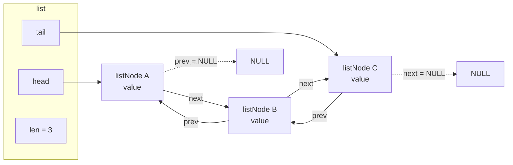

# 第5章 双方向リスト adlist

> **本章で読むソース**
>
> - [`src/adlist.h`](https://github.com/valkey-io/valkey/blob/9.1.0/src/adlist.h)
> - [`src/adlist.c`](https://github.com/valkey-io/valkey/blob/9.1.0/src/adlist.c)

## この章の狙い

`adlist` は Valkey が内部で使う汎用の双方向連結リストである。
本章では、`list` と `listNode` の構造体がどのように要素を双方向につなぎ、任意の型を格納できる汎用コンテナになっているかを読む。
先頭と末尾への挿入や削除、長さの取得を定数時間で行う仕組みと、イテレータによる前後走査の実装を、実コードに沿って確認する。

## 前提

第4章「[文字列 SDS](04-sds.md)」を先に読むと、`void *value` に格納される値の一例として `sds` を具体的に思い描ける。
ただし本章は SDS の知識がなくても読める。

## 汎用コンテナとしての構造体

`adlist` は三つの構造体だけで構成される。
ノードを表す `listNode`、リスト全体を表す `list`、走査状態を表す `listIter` である。

ノードの定義を見る。

[`src/adlist.h` L36-L40](https://github.com/valkey-io/valkey/blob/9.1.0/src/adlist.h#L36-L40)

```c
typedef struct listNode {
    struct listNode *prev;
    struct listNode *next;
    void *value;
} listNode;
```

`prev` と `next` の二本のポインタが、前後のノードを指す。
この二本があるため、あるノードから前方にも後方にもたどれる。
これが双方向リストと呼ばれる理由である。
格納する値は `void *value` として持つ。
ノード自身は値の型を一切知らない。

次にリスト本体を見る。

[`src/adlist.h` L47-L54](https://github.com/valkey-io/valkey/blob/9.1.0/src/adlist.h#L47-L54)

```c
typedef struct list {
    listNode *head;
    listNode *tail;
    void *(*dup)(void *ptr);
    void (*free)(void *ptr);
    int (*match)(void *ptr, void *key);
    unsigned long len;
} list;
```

`list` は先頭ノードへの `head` と末尾ノードへの `tail` を保持する。
`len` には現在の要素数を持つ。
末尾ポインタと長さフィールドを構造体に持つことが、後述する定数時間の操作を支える。

残る三つは関数ポインタである。
`dup` は値の複製、`free` は値の解放、`match` は値とキーの一致判定を担う。
この三つによって、`adlist` は格納する値の型を知らないまま、複製や解放や検索といった型依存の処理を呼び出し側に委ねられる。
これが、`void *value` と組み合わさって `adlist` を汎用コンテナにしている機構である。

関数ポインタは初期状態では `NULL` であり、利用側が設定する。
`listCreate` がそれらをすべて `NULL` で初期化する。

[`src/adlist.c` L44-L54](https://github.com/valkey-io/valkey/blob/9.1.0/src/adlist.c#L44-L54)

```c
list *listCreate(void) {
    struct list *list;

    if ((list = zmalloc(sizeof(*list))) == NULL) return NULL;
    list->head = list->tail = NULL;
    list->len = 0;
    list->dup = NULL;
    list->free = NULL;
    list->match = NULL;
    return list;
}
```

`free` が設定されていれば、`listEmpty` や `listDelNode` がノードを解放する際に値も解放する。
設定されていなければ値はそのまま残り、解放の責任は呼び出し側にある。
ヘッダには関数ポインタを設定するマクロも用意されている。

[`src/adlist.h` L64-L66](https://github.com/valkey-io/valkey/blob/9.1.0/src/adlist.h#L64-L66)

```c
#define listSetDupMethod(l, m) ((l)->dup = (m))
#define listSetFreeMethod(l, m) ((l)->free = (m))
#define listSetMatchMethod(l, m) ((l)->match = (m))
```

長さの取得もマクロである。
`listLength` は `len` フィールドを読むだけなので、要素数によらず定数時間で値を返す。

[`src/adlist.h` L57-L62](https://github.com/valkey-io/valkey/blob/9.1.0/src/adlist.h#L57-L62)

```c
#define listLength(l) ((l)->len)
#define listFirst(l) ((l)->head)
#define listLast(l) ((l)->tail)
#define listPrevNode(n) ((n)->prev)
#define listNextNode(n) ((n)->next)
#define listNodeValue(n) ((n)->value)
```

## ノードの連結を図で見る

要素を三つ持つリストのノード連結を図示する。
`list` は両端のノードへの参照を持ち、各ノードは前後のノードを相互に指す。
両端のノードの外側を向くポインタは `NULL` である。



## 端への挿入を定数時間で行う

末尾への追加 `listAddNodeTail` を読む。
ノードを確保して値を入れ、`listLinkNodeTail` で末尾につなぐ。

[`src/adlist.c` L125-L148](https://github.com/valkey-io/valkey/blob/9.1.0/src/adlist.c#L125-L148)

```c
list *listAddNodeTail(list *list, void *value) {
    listNode *node;

    if ((node = zmalloc(sizeof(*node))) == NULL) return NULL;
    node->value = value;
    listLinkNodeTail(list, node);
    return list;
}

/*
 * Add a node that has already been allocated to the tail of list
 */
void listLinkNodeTail(list *list, listNode *node) {
    if (list->len == 0) {
        list->head = list->tail = node;
        node->prev = node->next = NULL;
    } else {
        node->prev = list->tail;
        node->next = NULL;
        list->tail->next = node;
        list->tail = node;
    }
    list->len++;
}
```

空リストなら、新しいノードが唯一の要素になるため `head` と `tail` の両方を指させる。
要素があるなら、現在の末尾 `list->tail` の直後に新しいノードをつなぎ、`list->tail` を新しいノードに更新する。
書き換えるポインタは数本だけで、リストの長さには依存しない。
末尾ポインタを構造体が直接持っているため、末尾を探すための走査が不要になる。
これが端への挿入を定数時間で行える理由である。

先頭への追加 `listAddNodeHead` も対称的な実装である。

[`src/adlist.c` L94-L117](https://github.com/valkey-io/valkey/blob/9.1.0/src/adlist.c#L94-L117)

```c
list *listAddNodeHead(list *list, void *value) {
    listNode *node;

    if ((node = zmalloc(sizeof(*node))) == NULL) return NULL;
    node->value = value;
    listLinkNodeHead(list, node);
    return list;
}

/*
 * Add a node that has already been allocated to the head of list
 */
void listLinkNodeHead(list *list, listNode *node) {
    if (list->len == 0) {
        list->head = list->tail = node;
        node->prev = node->next = NULL;
    } else {
        node->prev = NULL;
        node->next = list->head;
        list->head->prev = node;
        list->head = node;
    }
    list->len++;
}
```

`tail` を扱う箇所が `head` に置き換わっただけで、構造は末尾追加と同じである。

## 端からの削除を定数時間で行う

削除 `listDelNode` は、ノードを連結から外す `listUnlinkNode` を呼んでから、必要なら値を解放してノード自身を解放する。

[`src/adlist.c` L182-L214](https://github.com/valkey-io/valkey/blob/9.1.0/src/adlist.c#L182-L214)

```c
void listDelNode(list *list, listNode *node) {
    listUnlinkNode(list, node);
    if (list->free) list->free(node->value);
    zfree(node);
}

/*
 * Remove the specified node from the list without freeing it.
 */
void listUnlinkNode(list *list, listNode *node) {
    assert(list->len > 0);

    if (node->prev) {
        assert(node->prev->next == node);
        node->prev->next = node->next;
    } else {
        assert(list->head == node);
        list->head = node->next;
    }

    if (node->next) {
        assert(node->next->prev == node);
        node->next->prev = node->prev;
    } else {
        assert(list->tail == node);
        list->tail = node->prev;
    }

    node->next = NULL;
    node->prev = NULL;

    list->len--;
}
```

外し方は、対象ノードの前後をつなぎ替えるだけである。
前ノードがあれば、その `next` を対象の次のノードへ向ける。
前ノードがなければ対象は先頭だったので、`list->head` を次のノードへ更新する。
後ろ側も同様に処理する。
`free` 呼び出しが値の解放を担うが、`free` が未設定なら値には触れない。
ここでも、対象ノードのポインタを既に持っていれば、書き換えるポインタは数本だけで済む。
削除位置を探す走査がない以上、削除そのものは定数時間である。

## 末尾を先頭へ回す回転

`listRotateTailToHead` は、末尾のノードを切り離して先頭に付け替える操作である。
要素の値を移動するのではなく、ポインタのつなぎ替えだけで末尾を先頭に回す。

[`src/adlist.c` L364-L376](https://github.com/valkey-io/valkey/blob/9.1.0/src/adlist.c#L364-L376)

```c
void listRotateTailToHead(list *list) {
    if (listLength(list) <= 1) return;

    /* Detach current tail */
    listNode *tail = list->tail;
    list->tail = tail->prev;
    list->tail->next = NULL;
    /* Move it as head */
    list->head->prev = tail;
    tail->prev = NULL;
    tail->next = list->head;
    list->head = tail;
}
```

要素が一つ以下なら回す意味がないので、そのまま戻る。
まず現在の末尾 `tail` を控え、その一つ前を新しい末尾にして `next` を `NULL` で閉じる。
次に切り離した `tail` を先頭につなぎ、`list->head` を `tail` に更新する。
末尾ポインタと先頭ポインタを構造体が持つため、両端の付け替えがどちらも定数時間で済む。
末尾を先頭に回す対称の操作として、先頭を末尾へ回す `listRotateHeadToTail` も用意されている。

[`src/adlist.c` L379-L391](https://github.com/valkey-io/valkey/blob/9.1.0/src/adlist.c#L379-L391)

```c
void listRotateHeadToTail(list *list) {
    if (listLength(list) <= 1) return;

    listNode *head = list->head;
    /* Detach current head */
    list->head = head->next;
    list->head->prev = NULL;
    /* Move it as tail */
    list->tail->next = head;
    head->next = NULL;
    head->prev = list->tail;
    list->tail = head;
}
```

## イテレータによる前後走査

走査の状態は `listIter` が持つ。

[`src/adlist.h` L42-L45](https://github.com/valkey-io/valkey/blob/9.1.0/src/adlist.h#L42-L45)

```c
typedef struct listIter {
    listNode *next;
    int direction;
} listIter;
```

`next` は次に返すノードを指し、`direction` が走査の向きを表す。
向きの定数はヘッダで定義されている。

[`src/adlist.h` L98-L99](https://github.com/valkey-io/valkey/blob/9.1.0/src/adlist.h#L98-L99)

```c
#define AL_START_HEAD 0
#define AL_START_TAIL 1
```

`listGetIterator` はイテレータを確保し、向きに応じて起点を `head` か `tail` に定める。

[`src/adlist.c` L220-L230](https://github.com/valkey-io/valkey/blob/9.1.0/src/adlist.c#L220-L230)

```c
listIter *listGetIterator(list *list, int direction) {
    listIter *iter;

    if ((iter = zmalloc(sizeof(*iter))) == NULL) return NULL;
    if (direction == AL_START_HEAD)
        iter->next = list->head;
    else
        iter->next = list->tail;
    iter->direction = direction;
    return iter;
}
```

走査は `listNext` を繰り返し呼んで進める。

[`src/adlist.c` L262-L272](https://github.com/valkey-io/valkey/blob/9.1.0/src/adlist.c#L262-L272)

```c
listNode *listNext(listIter *iter) {
    listNode *current = iter->next;

    if (current != NULL) {
        if (iter->direction == AL_START_HEAD)
            iter->next = current->next;
        else
            iter->next = current->prev;
    }
    return current;
}
```

呼び出すたびに、今返すノードを控え、向きに従って `next` ポインタか `prev` ポインタを先読みする。
先頭起点なら `next` をたどって末尾へ進み、末尾起点なら `prev` をたどって先頭へ戻る。
返す値が `NULL` になれば走査の終わりである。
ソースのコメントが、この典型的な使い方を示している。

[`src/adlist.c` L256-L259](https://github.com/valkey-io/valkey/blob/9.1.0/src/adlist.c#L256-L259)

```c
 * iter = listGetIterator(list,<direction>);
 * while ((node = listNext(iter)) != NULL) {
 *     doSomethingWith(listNodeValue(node));
 * }
```

イテレータは次のノードを先に控えてから返す。
そのため、いま返されたノードを走査の途中で `listDelNode` によって削除しても、走査を続けられる。
ただしコメントが断るとおり、現在のノード以外の要素を削除することは想定していない。

## サーバ内での用途

`adlist` は、要素を順に並べて端から出し入れする場面でサーバ全体に使われる。
接続中のクライアントの一覧や、各種の待ち行列がその例である。
端への挿入と削除が定数時間で、長さの取得も定数時間であることが、こうした用途に向く。
順序を保ったまま端から要素を足し引きでき、`void *value` によって格納する型を問わない汎用性がそれを支えている。

## まとめ

- `adlist` は `listNode`（`prev`/`next`/`value`）と `list`（`head`/`tail`/`len` と三つの関数ポインタ）からなる汎用の双方向連結リストである。
- `void *value` と `dup`/`free`/`match` の関数ポインタにより、格納する値の型を知らないまま複製や解放や検索を呼び出し側へ委ねられる。
- `tail` ポインタと `len` フィールドを構造体が持つため、端への挿入と削除、長さの取得をいずれも定数時間で行える。
- `listRotateTailToHead` は値を移動せず、両端のポインタを付け替えるだけで末尾を先頭へ回す。
- `listIter` と `listGetIterator`/`listNext` が前後どちらの走査も担い、次のノードを先読みする実装のため、走査中に現在のノードを削除しても続行できる。

## 関連する章

- 第4章「[文字列 SDS](04-sds.md)」では、リストに格納される値の代表例となる文字列の実装を読む。
- 第9章「[quicklist](09-quicklist.md)」では、双方向リストと `listpack` を組み合わせてリスト型を省メモリに実装する仕組みを読む。
