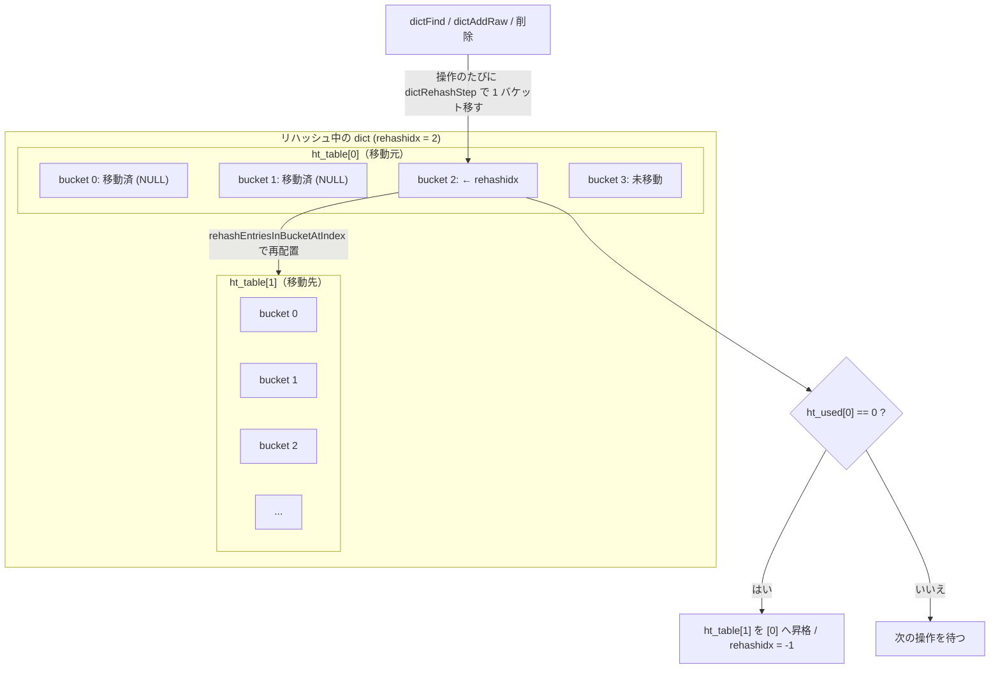

# 第6章 dict チェイン法ハッシュテーブル

> **本章で読むソース**
>
> - [`src/dict.h`](https://github.com/valkey-io/valkey/blob/9.1.0/src/dict.h)
> - [`src/dict.c`](https://github.com/valkey-io/valkey/blob/9.1.0/src/dict.c)

## この章の狙い

`dict` は Valkey の汎用ハッシュテーブルで、キー空間そのものや多くのデータ型の内部表現を支える。
本章では、`dict` がチェイン法で衝突を扱う仕組みと、二つのハッシュテーブルを併せ持つ構造を読む。
そのうえで、拡張時に処理を分割するインクリメンタルリハッシュと、リハッシュ中でも要素を漏らさず走査する `dictScan` という二つの最適化を、コードに即して機構レベルで説明する。

## 前提

- [第4章 SDS](../part01-data-structures/04-sds.md)：キーや値に使われる文字列表現。
- [第5章 adlist](../part01-data-structures/05-adlist.md)：基本的なポインタ連結の感覚。

特別な前提はないが、ハッシュ関数とビット演算の初歩を知っていると読みやすい。

## エントリと衝突の扱い

`dict` は、キーからハッシュ値を計算し、その下位ビットでバケットの番号を決める方式のハッシュテーブルである。
異なるキーが同じバケットに割り当たる衝突は、バケットを連結リストの先頭ポインタとして扱い、同じバケットに入るエントリを `next` でつなぐことで解決する。
これがチェイン法である。

エントリの型 `dictEntry` は次のとおりで、キー、値、そして同じバケット内の次のエントリへのポインタを持つ。

[`src/dict.c` L76-L85](https://github.com/valkey-io/valkey/blob/9.1.0/src/dict.c#L76-L85)

```c
struct dictEntry {
    void *key;
    union {
        void *val;
        uint64_t u64;
        int64_t s64;
        double d;
    } v;
    struct dictEntry *next; /* Next entry in the same hash bucket. */
};
```

値は共用体になっており、ポインタのほか符号付き整数、符号なし整数、`double` を直接格納できる。
整数値を持つエントリでは、別領域を確保せずにエントリ内に値を埋め込めるため、メモリと間接参照を節約できる。

## キー比較とハッシュをコールバックで差し替える

`dict` が汎用たりうるのは、キーの扱いを呼び出し側が `dictType` で与えるコールバックに委ねているからである。
ハッシュ関数、キーの複製、キー比較、キーと値の破棄などが関数ポインタとして並ぶ。

[`src/dict.h` L53-L69](https://github.com/valkey-io/valkey/blob/9.1.0/src/dict.h#L53-L69)

```c
typedef struct dictType {
    /* Callbacks */
    uint64_t (*hashFunction)(const void *key);
    void *(*keyDup)(const void *key);
    int (*keyCompare)(const void *key1, const void *key2);
    void (*keyDestructor)(void *key);
    void (*valDestructor)(void *obj);
    int (*resizeAllowed)(size_t moreMem, double usedRatio);
    /* Invoked at the start of dict initialization/rehashing (old and new ht are already created) */
    void (*rehashingStarted)(dict *d);
    /* Invoked at the end of dict initialization/rehashing of all the entries from old to new ht. Both ht still exists
     * and are cleaned up after this callback.  */
    void (*rehashingCompleted)(dict *d);
    /* Allow a dict to carry extra caller-defined metadata. The
     * extra memory is initialized to 0 when a dict is allocated. */
    size_t (*dictMetadataBytes)(dict *d);
} dictType;
```

同じ `dict` の実装に、文字列キー、大文字小文字を無視するキー、ポインタ同一性で比較するキーなどを、`dictType` を取り替えるだけで載せられる。
`rehashingStarted` と `rehashingCompleted` は、後で述べるリハッシュの開始時と完了時に呼ばれる通知点で、上位の `kvstore` などがリハッシュの進行を追うために使う。

## 二つのハッシュテーブルを持つ理由

`dict` 本体の定義を見ると、ハッシュテーブルを保持する配列が二要素になっている。

[`src/dict.h` L74-L87](https://github.com/valkey-io/valkey/blob/9.1.0/src/dict.h#L74-L87)

```c
struct dict {
    dictType *type;

    dictEntry **ht_table[2];
    unsigned long ht_used[2];

    long rehashidx; /* rehashing not in progress if rehashidx == -1 */

    /* Keep small vars at end for optimal (minimal) struct padding */
    int16_t pauserehash;        /* If >0 rehashing is paused (<0 indicates coding error) */
    signed char ht_size_exp[2]; /* exponent of size. (size = 1<<exp) */
    int16_t pauseAutoResize;    /* If >0 automatic resizing is disallowed (<0 indicates coding error) */
    void *metadata[];
};
```

`ht_table[0]` と `ht_table[1]` がそれぞれ一つのハッシュテーブルで、バケット配列の先頭を指す。
`ht_used[i]` はそのテーブルに入っているエントリ数、`ht_size_exp[i]` はバケット数の指数を表し、バケット数は `1 << ht_size_exp[i]` になる。
バケット数を常に2の冪に保つのは、ハッシュ値からバケット番号を求める計算を剰余ではなくビット論理積で済ませるためである。
`DICTHT_SIZE_MASK` はこのマスク `(1 << exp) - 1` を返す。

定常状態では `ht_table[0]` だけが使われ、`ht_table[1]` は空である。
このとき `rehashidx` は `-1` で、`dictIsRehashing` は偽になる。
二つ目のテーブルが意味を持つのは、テーブルの拡張または縮小に伴うリハッシュの最中だけである。

## インクリメンタルリハッシュ

### 負荷率による拡張の判定

エントリが増えるとバケットあたりの連結リストが長くなり、検索が遅くなる。
そこで `dict` は、要素数とバケット数の比である負荷率を見て、テーブルを拡張する。
判定は `dictExpandIfNeeded` が行う。

[`src/dict.c` L1291-L1312](https://github.com/valkey-io/valkey/blob/9.1.0/src/dict.c#L1291-L1312)

```c
int dictExpandIfNeeded(dict *d) {
    /* Incremental rehashing already in progress. Return. */
    if (dictIsRehashing(d)) return DICT_OK;

    /* If the hash table is empty expand it to the initial size. */
    if (DICTHT_SIZE(d->ht_size_exp[0]) == 0) {
        dictExpand(d, DICT_HT_INITIAL_SIZE);
        return DICT_OK;
    }

    /* If we reached the 1:1 ratio, and we are allowed to resize the hash
     * table (global setting) or we should avoid it but the ratio between
     * elements/buckets is over the "safe" threshold, we resize doubling
     * the number of buckets. */
    if ((dict_can_resize == DICT_RESIZE_ENABLE && d->ht_used[0] >= DICTHT_SIZE(d->ht_size_exp[0])) ||
        (dict_can_resize != DICT_RESIZE_FORBID &&
         d->ht_used[0] >= dict_force_resize_ratio * DICTHT_SIZE(d->ht_size_exp[0]))) {
        if (dictTypeResizeAllowed(d, d->ht_used[0] + 1)) dictExpand(d, d->ht_used[0] + 1);
        return DICT_OK;
    }
    return DICT_ERR;
}
```

通常状態では、要素数がバケット数に達した時点、つまり負荷率が1に達した時点で拡張する。
保存用の子プロセスが動くなどしてリサイズを避けたい局面（`DICT_RESIZE_AVOID`）では、負荷率が `dict_force_resize_ratio`（値は4）を超えるまで拡張を遅らせる。
これは、コピーオンライトで共有されたメモリを子プロセスの稼働中にむやみに書き換えないための配慮である。
縮小側の `dictShrinkIfNeeded` も対になっており、負荷率が `1/8`（`HASHTABLE_MIN_FILL` が8）を下回ると縮小して空きバケットを回収する。

拡張も縮小も、新しいサイズのテーブルを `ht_table[1]` に確保し、`rehashidx` を `0` に設定して「リハッシュ中」へ移行する。
この時点では要素はまだ `ht_table[0]` にあり、移し替えはこれから少しずつ進む。

### 一度に動かさず、操作のたびに1ステップ進める

巨大なテーブルでは、全エントリを一括で新テーブルへ移すと、その一回の操作だけが長時間ブロックする。
`dict` はこれを避け、リハッシュを小さなステップに分割して、通常の操作に紛れ込ませて進める。
中心となるのが `dictRehash` で、引数 `n` の数だけバケットを移す。

[`src/dict.c` L327-L354](https://github.com/valkey-io/valkey/blob/9.1.0/src/dict.c#L327-L354)

```c
int dictRehash(dict *d, int n) {
    int empty_visits = n * 10; /* Max number of empty buckets to visit. */
    unsigned long s0 = DICTHT_SIZE(d->ht_size_exp[0]);
    unsigned long s1 = DICTHT_SIZE(d->ht_size_exp[1]);
    if (dict_can_resize == DICT_RESIZE_FORBID || !dictIsRehashing(d)) return 0;
    /* ... (中略：DICT_RESIZE_AVOID 時の閾値判定) ... */

    while (n-- && d->ht_used[0] != 0) {
        /* Note that rehashidx can't overflow as we are sure there are more
         * elements because ht[0].used != 0 */
        assert(DICTHT_SIZE(d->ht_size_exp[0]) > (unsigned long)d->rehashidx);
        while (d->ht_table[0][d->rehashidx] == NULL) {
            d->rehashidx++;
            if (--empty_visits == 0) return 1;
        }
        /* Move all the keys in this bucket from the old to the new hash HT */
        rehashEntriesInBucketAtIndex(d, d->rehashidx);
        d->rehashidx++;
    }

    return !dictCheckRehashingCompleted(d);
}
```

`rehashidx` は `ht_table[0]` の中で「ここまで移し終えた」位置を指すカーソルである。
`dictRehash` は `rehashidx` の指すバケットから順に、空でないバケットの全エントリを `ht_table[1]` へ移し、`rehashidx` を進める。
空バケットばかりが続くと処理が空回りするため、連続して走査する空バケット数を `n * 10` で打ち切る。
これによって、一回の呼び出しが移すバケット数だけでなく、走査する空バケット数にも上限が付き、所要時間が際限なく延びない。

1バケット分の移し替えは `rehashEntriesInBucketAtIndex` が担う。

[`src/dict.c` L278-L301](https://github.com/valkey-io/valkey/blob/9.1.0/src/dict.c#L278-L301)

```c
static void rehashEntriesInBucketAtIndex(dict *d, uint64_t idx) {
    dictEntry *de = d->ht_table[0][idx];
    uint64_t h;
    dictEntry *nextde;
    while (de) {
        nextde = dictGetNext(de);
        void *key = dictGetKey(de);
        /* Get the index in the new hash table */
        if (d->ht_size_exp[1] > d->ht_size_exp[0]) {
            h = dictHashKey(d, key) & DICTHT_SIZE_MASK(d->ht_size_exp[1]);
        } else {
            /* We're shrinking the table. */
            h = idx & DICTHT_SIZE_MASK(d->ht_size_exp[1]);
        }
        dictSetNext(de, d->ht_table[1][h]);
        d->ht_table[1][h] = de;
        d->ht_used[0]--;
        d->ht_used[1]++;
        de = nextde;
    }
    d->ht_table[0][idx] = NULL;
}
```

エントリごとに新テーブルでのバケット番号を計算し直し、新バケットの連結リストの先頭につなぎ替える。
移し終えると `ht_used[0]` が減り `ht_used[1]` が増えるので、両テーブルの合計 `dictSize` は不変に保たれる。
`ht_used[0]` が `0` になれば `dictCheckRehashingCompleted` が後始末を行い、`ht_table[1]` を `ht_table[0]` へ昇格させて `rehashidx` を `-1` に戻す。

このステップを駆動するのが `dictRehashStep` で、`dictRehash(d, 1)` を呼ぶだけの薄い関数である。

[`src/dict.c` L123-L125](https://github.com/valkey-io/valkey/blob/9.1.0/src/dict.c#L123-L125)

```c
static void dictRehashStep(dict *d) {
    if (d->pauserehash == 0) dictRehash(d, 1);
}
```

`dictFind` や `dictFindPositionForInsert`、削除処理は、リハッシュ中であればこの1ステップを呼んでから本来の仕事に入る。
通常の検索や更新が一回行われるたびにリハッシュが少しずつ進むので、専用のバックグラウンド処理を持たなくても、テーブルは使われながら新しいテーブルへ移っていく。
これがインクリメンタルリハッシュであり、単発操作のレイテンシが要素数に応じて跳ねないという性質をもたらす。

なお、安全でないイテレータが走っている間は `pauserehash` が正になり、`dictRehashStep` はリハッシュを進めない。
両テーブルを動かすと、反復中の要素を取りこぼしたり重複して返したりするためである。

### 検索はなぜ二つのテーブルを見るのか

リハッシュ中はエントリが `ht_table[0]` と `ht_table[1]` に分かれて存在するため、検索は両方を見る必要がある。
`dictFind` の流れを読む。

[`src/dict.c` L646-L679](https://github.com/valkey-io/valkey/blob/9.1.0/src/dict.c#L646-L679)

```c
dictEntry *dictFind(dict *d, const void *key) {
    dictEntry *he;
    uint64_t h, idx, table;

    if (dictSize(d) == 0) return NULL; /* dict is empty */

    h = dictHashKey(d, key);
    idx = h & DICTHT_SIZE_MASK(d->ht_size_exp[0]);

    if (dictIsRehashing(d)) {
        if ((long)idx >= d->rehashidx && d->ht_table[0][idx]) {
            /* If we have a valid hash entry at `idx` in ht0, we perform
             * rehash on the bucket at `idx` (being more CPU cache friendly) */
            dictBucketRehash(d, idx);
        } else {
            /* If the hash entry is not in ht0, we rehash the buckets based
             * on the rehashidx (not CPU cache friendly). */
            dictRehashStep(d);
        }
    }

    for (table = 0; table <= 1; table++) {
        if (table == 0 && (long)idx < d->rehashidx) continue;
        idx = h & DICTHT_SIZE_MASK(d->ht_size_exp[table]);
        he = d->ht_table[table][idx];
        while (he) {
            void *he_key = dictGetKey(he);
            if (key == he_key || dictCompareKeys(d, key, he_key)) return he;
            he = dictGetNext(he);
        }
        if (!dictIsRehashing(d)) return NULL;
    }
    return NULL;
}
```

`table` のループで `ht_table[0]` と `ht_table[1]` を順に探す。
リハッシュ中でなければ、最初のテーブルを見た時点で `dictIsRehashing` が偽となり、二つ目のテーブルへ進まずに終わる。
リハッシュ中の最適化として、探すバケット番号 `idx` がすでに移し終えた範囲（`idx < rehashidx`）にあるなら、そのバケットは `ht_table[0]` から空になっているので、`ht_table[0]` の走査自体を `continue` で飛ばす。
さらに `dictFind` は本来の検索の前にリハッシュも一歩進める。
対象バケットが `ht_table[0]` にまだ残っていれば、そのバケットだけを先に移す `dictBucketRehash` を使う。
これは、いま触れようとしているバケットを直接片付けることで、直後の検索がCPUキャッシュに載ったメモリを再利用できるようにする狙いである。

### インクリメンタルリハッシュの図



`rehashidx` より前のバケットは移動済みで `ht_table[0]` 側が空、`rehashidx` 以降が未移動という不変条件が、検索とリハッシュの両方を単純にしている。

## dictScan によるリハッシュ耐性のある走査

### 走査の難しさ

全要素を一巡したいとき、ふつうのイテレータならバケットを0から順に辿ればよい。
しかし `dict` は走査の合間にも拡張や縮小でバケット数が変わりうるため、単純な昇順カーソルでは、リサイズの前後で要素を取りこぼしたり重複させたりする。
`dictScan` は、状態を持たないカーソル一つだけを呼び出し側とやり取りしながら、リサイズがあっても全要素を少なくとも一度は返すことを保証する。
カーソルは `0` から始め、戻り値を次回の入力に渡し、戻り値が `0` になったら一巡完了である。
保証されるのは漏れがないことであり、同じ要素が複数回返ることはありうる。
これが SCAN コマンドの土台になる仕組みで、コマンド側の扱いは[第30章 データベース](../part05-database/30-database.md)で改めて読む。

### リバースバイナリ反復

`dictScan` の核心は、カーソルを下位ビットからではなく上位ビットから増やす点にある。
コードでは、カーソルのビットを反転し、`1` を足し、もう一度反転する。

[`src/dict.c` L1217-L1222](https://github.com/valkey-io/valkey/blob/9.1.0/src/dict.c#L1217-L1222)

```c
        /* Set unmasked bits so incrementing the reversed cursor
         * operates on the masked bits */
        v |= ~m0;

        /* Increment the reverse cursor */
        v = rev(v);
        v++;
        v = rev(v);
```

ビット反転は `rev` が担う。

[`src/dict.c` L1083-L1091](https://github.com/valkey-io/valkey/blob/9.1.0/src/dict.c#L1083-L1091)

```c
static unsigned long rev(unsigned long v) {
    unsigned long s = CHAR_BIT * sizeof(v); // bit size; must be power of 2
    unsigned long mask = ~0UL;
    while ((s >>= 1) > 0) {
        mask ^= (mask << s);
        v = ((v >> s) & mask) | ((v << s) & ~mask);
    }
    return v;
}
```

上位ビットから増やすと、テーブルが2倍に拡張されたとき、増えたビットはバケット番号の上位側に付く。
すでに訪れたバケットを拡張後にもう一度割り当てられる新バケットは、いずれもこれから訪れる上位ビットの組み合わせに含まれる。
そのため、テーブルが大きくなってもカーソルを最初に戻す必要がなく、走査済みの下位ビットの組み合わせを再訪せずに済む。
縮小時も同様で、小さいテーブルでのあるバケットは、大きいテーブルでそのバケットに対応する複数バケット（上位ビット違い）をすべて訪れていれば、再訪しなくてよいことが保証される。
この性質によって、`dictScan` はリサイズをまたいでも漏れなく走査できる。

### リハッシュ中は小さいテーブルから辿る

リハッシュ中は二つのテーブルが同時に存在する。
`dictScanDefrag` はこの状況を、小さいテーブルを基準に大きいテーブルへ展開することで、実質的に一つのテーブルの走査へ還元する。

[`src/dict.c` L1224-L1270](https://github.com/valkey-io/valkey/blob/9.1.0/src/dict.c#L1224-L1270)

```c
    } else {
        htidx0 = 0;
        htidx1 = 1;

        /* Make sure t0 is the smaller and t1 is the bigger table */
        if (DICTHT_SIZE(d->ht_size_exp[htidx0]) > DICTHT_SIZE(d->ht_size_exp[htidx1])) {
            htidx0 = 1;
            htidx1 = 0;
        }

        m0 = DICTHT_SIZE_MASK(d->ht_size_exp[htidx0]);
        m1 = DICTHT_SIZE_MASK(d->ht_size_exp[htidx1]);

        /* Emit entries at cursor */
        /* ... (中略：小さいテーブル htidx0 の v & m0 のバケットを走査) ... */
        de = d->ht_table[htidx0][v & m0];
        while (de) {
            next = dictGetNext(de);
            fn(privdata, de);
            de = next;
        }

        /* Iterate over indices in larger table that are the expansion
         * of the index pointed to by the cursor in the smaller table */
        do {
            /* Emit entries at cursor */
            /* ... (中略：大きいテーブル htidx1 の v & m1 のバケットを走査) ... */
            de = d->ht_table[htidx1][v & m1];
            while (de) {
                next = dictGetNext(de);
                fn(privdata, de);
                de = next;
            }

            /* Increment the reverse cursor not covered by the smaller mask.*/
            v |= ~m1;
            v = rev(v);
            v++;
            v = rev(v);

            /* Continue while bits covered by mask difference is non-zero */
        } while (v & (m0 ^ m1));
    }
```

まず小さいテーブルの当該バケットを走査し、続いて大きいテーブルの中でそのバケットの展開先にあたる複数バケットを、`m0 ^ m1` のビットが尽きるまで辿る。
小さいテーブルでのカーソル `v & m0` に対応する大きいテーブルのバケットは、必ず上位ビット違いの形になるので、両者を組にして見れば走査単位が一つのテーブルと同じ構造に揃う。
走査の間は `dictPauseRehashing` でリハッシュを止め、コールバックが内部で `dictFind` を呼んでもテーブルが動かないようにしている。

## まとめ

- `dict` はチェイン法のハッシュテーブルで、`dictEntry` の `next` で衝突を連結リストに収める。値は共用体で整数を直接埋め込める。
- キー比較やハッシュ関数は `dictType` のコールバックで差し替えられるので、同じ実装に多様なキーを載せられる。
- `ht_table[0]` と `ht_table[1]` の二つを持ち、定常状態では `[0]` だけを使う。`[1]` はリハッシュ中だけ意味を持つ。
- インクリメンタルリハッシュは、`rehashidx` を進めながら通常操作のたびに1バケットずつ移す。これにより巨大テーブルでも単発操作のレイテンシが跳ねない。
- `dictExpandIfNeeded` は負荷率が1に達すると拡張し、リサイズ回避時は閾値4まで遅らせてコピーオンライトの書き換えを抑える。
- `dictScan` はリバースバイナリ反復のステートレスなカーソルで、リサイズやリハッシュをまたいでも要素を漏らさず走査できる。重複は起こりうる。

## 関連する章

- [第7章 hashtable](../part01-data-structures/07-hashtable.md)：`dict` とは別に Valkey が導入したキャッシュ効率重視の新しいハッシュテーブル。
- [第13章 kvstore](../part02-memory-keyspace/13-kvstore.md)：複数の `dict` を束ねてキー空間を構成する層。`rehashingStarted` 等のコールバックの利用先。
- [第30章 データベース](../part05-database/30-database.md)：`dictScan` を土台にした SCAN コマンドの実装。
