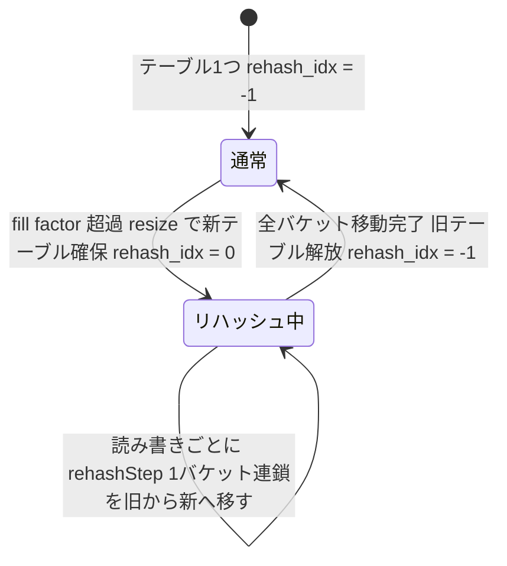

# 第7章 hashtable 新ハッシュテーブル

> **本章で読むソース**
>
> - [`src/hashtable.h`](https://github.com/valkey-io/valkey/blob/9.1.0/src/hashtable.h)
> - [`src/hashtable.c`](https://github.com/valkey-io/valkey/blob/9.1.0/src/hashtable.c)

## この章の狙い

`hashtable` は Valkey が独自に設計したハッシュテーブルである。
1バケットを64バイト（1キャッシュライン）に収め、バケット内にハッシュの一部を持たせて候補を絞り込む構造になっている。
本章では、このバケットレイアウトと探索、挿入、インクリメンタルリハッシュの実装をコードに沿って読み、なぜ速く省メモリなのかを機構のレベルで確認する。

## 前提

第6章「[ハッシュテーブル dict](06-dict.md)」を先に読むと、2テーブルによるインクリメンタルリハッシュの基本がつかめる。
`hashtable` のリハッシュは dict の設計を引き継いでいるためである。
ただし本章は dict の知識がなくても読める。

## 設計の狙い

`hashtable.c` の冒頭コメントが、この実装の目的を述べている。

[`src/hashtable.c` L7-L25](https://github.com/valkey-io/valkey/blob/9.1.0/src/hashtable.c#L7-L25)

```c
/* Hashtable
 * =========
 *
 * This is an implementation of a hash table with cache-line sized buckets. It's
 * designed for speed and low memory overhead. It provides the following
 * features:
 *
 * - Incremental rehashing using two tables.
 *
 * - Stateless iteration using 'scan'.
 *
 * - A hash table contains pointers to user-defined entries. An entry needs to
 *   contain a key. Other than that, the hash table implementation doesn't care
 *   what it contains. To use it as a set, an entry is just a key. Using as a
 *   key-value map requires combining key and value into an entry object and
 *   inserting this object into the hash table. A callback for fetching the key
 *   from within the entry object is provided by the caller when creating the
 *   hash table.
 *
// ... (中略) ...
```

設計の狙いは、速度と低いメモリオーバーヘッドである。
そのために、バケットをキャッシュライン幅に揃え、2テーブルでインクリメンタルリハッシュを行う。

テーブルが格納するのは、利用側が定義したエントリ（**エントリ**）へのポインタである。
エントリはキーを含む必要があるが、それ以外の中身をテーブルは関知しない。
キーだけをエントリとすればセットになり、キーと値を一つのオブジェクトにまとめればキーバリューマップになる。
エントリからキーを取り出す処理は、テーブル生成時に利用側がコールバックとして渡す。

そのコールバックは `hashtableType` 構造体にまとまっている。

[`src/hashtable.h` L51-L84](https://github.com/valkey-io/valkey/blob/9.1.0/src/hashtable.h#L51-L84)

```c
typedef struct {
    /* If the type of an entry is not the same as the type of a key used for
     * lookup, this callback needs to return the key within an entry. */
    const void *(*entryGetKey)(const void *entry);
    /* Hash function. Defaults to hashing the bits in the pointer, effectively
     * treating the pointer as an integer. */
    uint64_t (*hashFunction)(const void *key);
    /* Compare function, returns 0 if the keys are equal. Defaults to just
     * comparing the pointers for equality. */
    int (*keyCompare)(const void *key1, const void *key2);
    // ... (中略) ...
    /* Flag to disable incremental rehashing */
    unsigned instant_rehashing : 1;

} hashtableType;
```

`entryGetKey` がエントリからキーを取り出し、`hashFunction` がキーをハッシュ化し、`keyCompare` がキー同士を比較する。
すべて省略可能で、省略するとポインタを整数とみなす既定の動作になる。
これらを内部で呼び出すラッパーが `compareKeys`、`entryGetKey`、`hashKey` である。

[`src/hashtable.c` L405-L427](https://github.com/valkey-io/valkey/blob/9.1.0/src/hashtable.c#L405-L427)

```c
static inline int compareKeys(hashtable *ht, const void *key1, const void *key2) {
    if (ht->type->keyCompare != NULL) {
        return ht->type->keyCompare(key1, key2);
    } else {
        return key1 != key2;
    }
}

static inline const void *entryGetKey(hashtable *ht, const void *entry) {
    if (ht->type->entryGetKey != NULL) {
        return ht->type->entryGetKey(entry);
    } else {
        return entry;
    }
}

static inline uint64_t hashKey(hashtable *ht, const void *key) {
    if (ht->type->hashFunction != NULL) {
        return ht->type->hashFunction(key);
    } else {
        return hashtableGenHashFunction((const char *)&key, sizeof(key));
    }
}
```

設計コメントの謝辞によれば、キャッシュライン幅のバケットは Swiss tables で使われた着想に着想を得たものである（出典は `hashtable.c` L41-L42）。

## バケットのレイアウト

`hashtable` の速さの核は、バケットのレイアウトにある。
設計コメントの `Design` と `Bucket layout` の節がその構造を説明している。

[`src/hashtable.c` L224-L233](https://github.com/valkey-io/valkey/blob/9.1.0/src/hashtable.c#L224-L233)

```c
/* Design
 * ------
 *
 * We use a design with buckets of 64 bytes (one cache line). Each bucket
 * contains metadata and entry slots for a fixed number of entries. In a 64-bit
 * system, there are up to 7 entries per bucket. These are unordered and an
 * entry can be inserted in any of the free slots. Additionally, the bucket
 * contains metadata for the entries. This includes a few bits of the hash of
 * the key of each entry, which are used to rule out false positives when
 * looking up entries.
// ... (中略) ...
```

1バケットは64バイト、つまり1キャッシュラインである。
64ビット環境では1バケットに最大7エントリが入る。
スロット（**スロット**）には順序がなく、空いていればどこにでも挿入してよい。
バケットはエントリのスロットに加えてメタデータを持ち、その中に各エントリのキーのハッシュの一部を入れる。
この数ビットのハッシュが、探索時の偽陽性をふるい落とす役を担う。

構造体の定義を見る。

[`src/hashtable.c` L293-L301](https://github.com/valkey-io/valkey/blob/9.1.0/src/hashtable.c#L293-L301)

```c
typedef struct hashtableBucket {
    BUCKET_BITS_TYPE chained : 1;
    BUCKET_BITS_TYPE presence : ENTRIES_PER_BUCKET;
    uint8_t hashes[ENTRIES_PER_BUCKET];
    void *entries[ENTRIES_PER_BUCKET];
} bucket;

/* A key property is that the bucket size is one cache line. */
static_assert(sizeof(bucket) == HASHTABLE_BUCKET_SIZE, "Bucket size mismatch");
```

`HASHTABLE_BUCKET_SIZE` は64バイトに定義されている。

[`src/hashtable.h` L95](https://github.com/valkey-io/valkey/blob/9.1.0/src/hashtable.h#L95)

```c
#define HASHTABLE_BUCKET_SIZE 64 /* bytes, the most common cache line size */
```

`static_assert` が `sizeof(bucket)` を64バイトと突き合わせ、コンパイル時にレイアウトのずれを検出する。
64ビット環境での1バケットあたりのエントリ数は `ENTRIES_PER_BUCKET` で7に固定される。

[`src/hashtable.c` L164](https://github.com/valkey-io/valkey/blob/9.1.0/src/hashtable.c#L164)

```c
#define ENTRIES_PER_BUCKET 7
```

構造体の各フィールドの役割は次のとおりである。
`chained` の1ビットは、このバケットが子バケットへの連鎖を持つかどうかを示す。
`presence` の7ビットは、各スロットにエントリが入っているかどうかを1ビットずつ示す。
`hashes[]` は各エントリのハッシュの下位8ビット（**h2** と呼ぶ）を並べた7バイトである。
`entries[]` が、エントリへのポインタを並べた7つのスロットである。

1キャッシュライン内にこれらを収めたレイアウトを図示する。

```text
bucket (64 bytes = 1 cache line)
+----------+--------+--------+--------+--------+--------+--------+--------+
| Metadata | Entry0 | Entry1 | Entry2 | Entry3 | Entry4 | Entry5 | Entry6 |
|  8 bytes | 8 bytes| 8 bytes| 8 bytes| 8 bytes| 8 bytes| 8 bytes| 8 bytes|
+----------+--------+--------+--------+--------+--------+--------+--------+
     |          \________ entries[]: 各スロットはエントリへのポインタ ________/
     |
     +--> Metadata の内訳（8 bytes）
          +-------+----------+---------------------------------------+
          | c     | ppppppp  | hashes[7]                             |
          | 1 bit | 7 bits   | 1 byte x 7                            |
          +-------+----------+---------------------------------------+
          chained  presence   各エントリのハッシュ下位8ビット（h2）
```

各エントリのハッシュ一部（h2）をバケット内のメタデータに持つことが、この構造の要点である。
あるキーを探すとき、`entries[]` のポインタをたどってキー本体を比較する前に、バケット内の `hashes[]` と `presence` だけを見て候補を絞り込める。
キー本体を比較するにはポインタの指す先のメモリ（多くの場合キャッシュ外）へアクセスする必要があり、これがキャッシュミスを招く。
メタデータだけで候補をふるい落とせば、その先のメモリアクセスを大きく減らせる。
バケット全体が1キャッシュラインに収まるので、メタデータの読み出し自体は1回のキャッシュアクセスで済む。

h2 にはハッシュの上位ビットを使う。
理由はコメントが述べている。

[`src/hashtable.c` L429-L433](https://github.com/valkey-io/valkey/blob/9.1.0/src/hashtable.c#L429-L433)

```c
/* For the hash bits stored in the bucket, we use the highest bits of the hash
 * value, since these are not used for selecting the bucket. */
static inline uint8_t highBits(uint64_t hash) {
    return hash >> (CHAR_BIT * 7);
}
```

バケット番号の選択にはハッシュの下位ビットを使う。
そのため、上位ビットを h2 に回せば、バケット選択に使うビットと候補絞り込みに使うビットが重ならず、絞り込みの効きがよくなる。

## オープンアドレス法と探索

`hashtable` は連鎖ではなくバケット内のスロットにエントリを詰める。
1バケットに複数エントリを置き、空きスロットを使う点が**オープンアドレス法**の性質である。
探索の中核は `findBucket` である。

[`src/hashtable.c` L908-L942](https://github.com/valkey-io/valkey/blob/9.1.0/src/hashtable.c#L908-L942)

```c
static bucket *findBucket(hashtable *ht, uint64_t hash, const void *key, int *pos_in_bucket, int *table_index) {
    if (hashtableSize(ht) == 0) return 0;
    uint8_t h2 = highBits(hash);
    int table;

    /* Do some incremental rehashing. */
    rehashStepOnReadIfNeeded(ht);

    for (table = 0; table <= 1; table++) {
        if (ht->used[table] == 0) continue;
        size_t mask = expToMask(ht->bucket_exp[table]);
        size_t bucket_idx = hash & mask;
        /* Skip already rehashed buckets. */
        if (table == 0 && ht->rehash_idx >= 0 && bucket_idx < (size_t)ht->rehash_idx) {
            continue;
        }
        bucket *b = &ht->tables[table][bucket_idx];
        do {
#if HAVE_X86_SIMD
            /* All x86-64 CPUs have SSE2. */
            if (findKeyInBucketSSE2(ht, b, h2, key, table, pos_in_bucket, table_index)) return b;
            // ... (中略) ...
#endif
            b = getChildBucket(b);
        } while (b != NULL);
    }
    return NULL;
}
```

まずハッシュの上位ビットから h2 を取り出す。
バケット番号は `hash & mask` で求める。
`mask` は `expToMask` がバケット数からビットマスクを作る値で、バケット数を2のべき乗にしているため、剰余ではなくビット積で番号を出せる。

[`src/hashtable.c` L459-L462](https://github.com/valkey-io/valkey/blob/9.1.0/src/hashtable.c#L459-L462)

```c
/* Bitmask for masking the hash value to get bucket index. */
static inline size_t expToMask(int exp) {
    return exp == -1 ? 0 : numBuckets(exp) - 1;
}
```

バケットが決まると、その中のスロットを走査する。
非 SIMD 経路の走査は、`presence` が立っていて h2 が一致したスロットだけを候補にし、`checkCandidateInBucket` で実キーを比較する。

[`src/hashtable.c` L828-L843](https://github.com/valkey-io/valkey/blob/9.1.0/src/hashtable.c#L828-L843)

```c
static inline int checkCandidateInBucket(hashtable *ht, bucket *b, int pos, const void *key, int table, int *pos_in_bucket, int *table_index) {
    /* It's a candidate. */
    void *entry = b->entries[pos];
    const void *elem_key = entryGetKey(ht, entry);
    if (compareKeys(ht, key, elem_key) == 0) {
        /* It's a match. */
        assert(pos_in_bucket != NULL);
        if (!validateElementIfNeeded(ht, entry)) {
            return 0;
        }
        *pos_in_bucket = pos;
        if (table_index) *table_index = table;
        return 1;
    }
    return 0;
}
```

`entryGetKey` でエントリからキーを取り出し、`compareKeys` で探索キーと比べる。
ここで初めてエントリのポインタ先へアクセスするため、候補が少ないほどメモリアクセスが減る。

バケットが満杯で目的のエントリが見つからなければ、子バケットへたどる。
満杯のバケットは最後のスロットを子バケットへのポインタに置き換える方式で、これを連鎖と呼ぶ。

[`src/hashtable.c` L224-L240](https://github.com/valkey-io/valkey/blob/9.1.0/src/hashtable.c#L224-L240)

```c
/* Design
 * ------
 *
// ... (中略) ...
 * Bucket chaining
 * ---------------
 *
 * Each key hashes to a bucket in the hash table. If a bucket is full, the last
 * entry is replaced by a pointer to a separately allocated child bucket.
 * Child buckets form a bucket chain.
// ... (中略) ...
```

子バケットの取得は `getChildBucket` が担う。

[`src/hashtable.c` L541-L544](https://github.com/valkey-io/valkey/blob/9.1.0/src/hashtable.c#L541-L544)

```c
/* Returns the next bucket in a bucket chain, or NULL if there's no next. */
static bucket *getChildBucket(bucket *b) {
    return b->chained ? b->entries[ENTRIES_PER_BUCKET - 1] : NULL;
}
```

`chained` ビットが立っていれば、最後のスロット `entries[6]` を子バケットへのポインタとして返す。

スロット走査をさらに速める工夫が SIMD である。
x86 では SSE2 を使う `findKeyInBucketSSE2` がある。

[`src/hashtable.c` L845-L868](https://github.com/valkey-io/valkey/blob/9.1.0/src/hashtable.c#L845-L868)

```c
#if HAVE_X86_SIMD
ATTRIBUTE_TARGET_SSE2
static int findKeyInBucketSSE2(hashtable *ht, bucket *b, uint8_t h2, const void *key, int table, int *pos_in_bucket, int *table_index) {
    /* Get the bucket's presence mask - indicates which positions are filled. */
    BUCKET_BITS_TYPE presence_mask = b->presence & ((1 << ENTRIES_PER_BUCKET) - 1);
    __m128i hash_vector = _mm_loadu_si128((__m128i *)b->hashes);
    __m128i h2_vector = _mm_set1_epi8(h2);
    /* Compare all hash values against the target hash simultaneously.
     * The result is a vector of 16 bytes, where each byte is 0xFF if
     * the corresponding hash matches the target hash, and 0x00 if it
     * doesn't. */
    __m128i result = _mm_cmpeq_epi8(hash_vector, h2_vector);
    BUCKET_BITS_TYPE newmask = _mm_movemask_epi8(result);
    /* Only consider positions that are both filled (presence) and match the hash (newmask). */
    newmask &= presence_mask;
    while (newmask > 0) {
        int pos = __builtin_ctz(newmask);
        if (checkCandidateInBucket(ht, b, pos, key, table, pos_in_bucket, table_index)) return 1;
        /* Clear the processed bit and continue with next match. */
        newmask &= ~(1 << pos);
    }
    return 0;
}
#endif
```

`hashes[]` の7バイトを1つのベクタに読み込み、探索対象の h2 を全バイトに複製したベクタと1命令で比較する。
比較結果からビットマスクを作り、`presence` と論理積をとって、実際に埋まっていて h2 が一致する位置だけを残す。
あとは一致したビットの位置だけ実キー比較へ進む。
7バイト分の比較を逐次ループではなく1命令で済ませることが、ここでの高速化である。
ARM 版の `findKeyInBucketNeon` も同じ考え方で NEON を使う。

公開 API の `hashtableFind` は、この `findBucket` を呼んで結果を返す。

[`src/hashtable.c` L1605-L1615](https://github.com/valkey-io/valkey/blob/9.1.0/src/hashtable.c#L1605-L1615)

```c
bool hashtableFind(hashtable *ht, const void *key, void **found) {
    if (hashtableSize(ht) == 0) return false;
    uint64_t hash = hashKey(ht, key);
    int pos_in_bucket = 0;
    bucket *b = findBucket(ht, hash, key, &pos_in_bucket, NULL);
    if (b) {
        if (found) *found = b->entries[pos_in_bucket];
        return true;
    }
    return false;
}
```

キーをハッシュ化し、`findBucket` でバケットとスロット位置を得て、見つかればそのスロットのエントリを `found` に書き出す。

## 挿入

挿入の公開 API は `hashtableAdd` であり、実体は `hashtableAddOrFind` に委ねられる。

[`src/hashtable.c` L1632-L1651](https://github.com/valkey-io/valkey/blob/9.1.0/src/hashtable.c#L1632-L1651)

```c
bool hashtableAdd(hashtable *ht, void *entry) {
    return hashtableAddOrFind(ht, entry, NULL);
}

// ... (中略) ...
bool hashtableAddOrFind(hashtable *ht, void *entry, void **existing) {
    const void *key = entryGetKey(ht, entry);
    uint64_t hash = hashKey(ht, key);
    int pos_in_bucket = 0;
    bucket *b = findBucket(ht, hash, key, &pos_in_bucket, NULL);
    if (b != NULL) {
        if (existing) *existing = b->entries[pos_in_bucket];
        return false;
    } else {
        insert(ht, hash, entry);
        return true;
    }
}
```

まず `findBucket` で同じキーが既にあるかを調べる。
あれば挿入せず、必要なら既存エントリを返す。
なければ `insert` に進む。

[`src/hashtable.c` L1092-L1102](https://github.com/valkey-io/valkey/blob/9.1.0/src/hashtable.c#L1092-L1102)

```c
static void insert(hashtable *ht, uint64_t hash, void *entry) {
    hashtableExpandIfNeeded(ht);
    rehashStepOnWriteIfNeeded(ht);
    int pos_in_bucket;
    int table_index;
    bucket *b = findBucketForInsert(ht, hash, &pos_in_bucket, &table_index);
    b->entries[pos_in_bucket] = entry;
    b->presence |= (1 << pos_in_bucket);
    b->hashes[pos_in_bucket] = highBits(hash);
    ht->used[table_index]++;
}
```

`insert` は、必要なら拡張を起こし、リハッシュを1ステップ進めてから、空きスロットを探す。
空きスロットを探すのが `findBucketForInsert` である。

[`src/hashtable.c` L1064-L1088](https://github.com/valkey-io/valkey/blob/9.1.0/src/hashtable.c#L1064-L1088)

```c
static bucket *findBucketForInsert(hashtable *ht, uint64_t hash, int *pos_in_bucket, int *table_index) {
    int table = hashtableIsRehashing(ht) ? 1 : 0;
    assert(ht->tables[table]);
    size_t mask = expToMask(ht->bucket_exp[table]);
    size_t bucket_idx = hash & mask;
    bucket *b = &ht->tables[table][bucket_idx];
    /* Find bucket that's not full, or create one. */
    while (bucketIsFull(b)) {
        if (!b->chained) {
            bucketConvertToChained(ht, b);
            ht->child_buckets[table]++;
        }
        b = getChildBucket(b);
    }
    /* Find a free slot in the bucket. There must be at least one. */
    int pos;
    for (pos = 0; pos < ENTRIES_PER_BUCKET; pos++) {
        if (!isPositionFilled(b, pos)) break;
    }
    assert(pos < ENTRIES_PER_BUCKET);
    assert(pos_in_bucket != NULL);
    *pos_in_bucket = pos;
    if (table_index) *table_index = table;
    return b;
}
```

リハッシュ中なら新テーブル（table 1）へ、そうでなければ主テーブル（table 0）へ挿入する。
バケットが満杯ならば、連鎖をたどって空きを探す。
連鎖がまだなければ `bucketConvertToChained` で子バケットを作る。

[`src/hashtable.c` L955-L965](https://github.com/valkey-io/valkey/blob/9.1.0/src/hashtable.c#L955-L965)

```c
static void bucketConvertToChained(hashtable *ht, bucket *b) {
    assert(!b->chained);
    /* We'll move the last entry from the bucket to the new child bucket. */
    int pos = ENTRIES_PER_BUCKET - 1;
    assert(isPositionFilled(b, pos));
    bucket *child = zcalloc(sizeof(bucket));
    if (ht->type->trackMemUsage) ht->type->trackMemUsage(ht, sizeof(bucket));
    moveEntry(child, 0, b, pos);
    b->chained = 1;
    b->entries[pos] = child;
}
```

満杯のバケットを連鎖に変えるとき、最後のスロットのエントリを新しい子バケットへ移し、空いた最後のスロットに子バケットへのポインタを置いて `chained` ビットを立てる。
こうして7番目のスロットがポインタに変わり、そのバケットが持つエントリは6個になる。

空きスロットが決まると、`insert` がそこに `entries[]` のポインタ、`presence` のビット、`hashes[]` の h2 を書き込み、`used` を1増やす。

## インクリメンタルリハッシュと拡張

`hashtable` は dict と同じく2つのテーブルを持つ。
構造体がそれを表している。

[`src/hashtable.c` L306-L317](https://github.com/valkey-io/valkey/blob/9.1.0/src/hashtable.c#L306-L317)

```c
struct hashtable {
    hashtableType *type;
    ssize_t rehash_idx;        /* -1 = rehashing not in progress. */
    bucket *tables[2];         /* 0 = main table, 1 = rehashing target.  */
    size_t used[2];            /* Number of entries in each table. */
    int8_t bucket_exp[2];      /* Exponent for num buckets (num = 1 << exp). */
    int16_t pause_rehash;      /* Non-zero = rehashing is paused */
    int16_t pause_auto_shrink; /* Non-zero = automatic resizing disallowed. */
    size_t child_buckets[2];   /* Number of allocated child buckets. */
    iter *safe_iterators;      /* Head of linked list of safe iterators */
    void *metadata[];
};
```

`tables[0]` が主テーブル、`tables[1]` がリハッシュ先である。
`rehash_idx` は次に移すべき主テーブルのバケット番号を指し、`-1` はリハッシュしていないことを表す。

拡張するかどうかは `hashtableExpandIfNeeded` が判定する。

[`src/hashtable.c` L1478-L1500](https://github.com/valkey-io/valkey/blob/9.1.0/src/hashtable.c#L1478-L1500)

```c
bool hashtableExpandIfNeeded(hashtable *ht) {
    if (hashtableIsRehashing(ht)) {
        if (ht->bucket_exp[1] >= ht->bucket_exp[0]) {
            /* Expand already in progress. */
            return false;
        } else {
            /* Shrink in progress, check the fill percent of ht[1] to see if
             * we need to abort the shrink. */
            return abortShrinkIfNeeded(ht);
        }
    }

    /* There's no rehashing on going now, check the fill percent of ht[0] to
     * see if we need to expand. */
    size_t min_capacity = ht->used[0] + 1;
    size_t num_buckets = numBuckets(ht->bucket_exp[0]);
    size_t current_capacity = num_buckets * ENTRIES_PER_BUCKET;
    unsigned max_fill_percent = resize_policy == HASHTABLE_RESIZE_ALLOW ? MAX_FILL_PERCENT_SOFT : MAX_FILL_PERCENT_HARD;
    if (min_capacity * 100 <= current_capacity * max_fill_percent) {
        return false;
    }
    return resize(ht, min_capacity, NULL);
}
```

容量に対するエントリ数の割合（fill factor）を見て、それが許容上限を超えたら `resize` を呼ぶ。
許容上限はリサイズポリシーで切り替わり、通常時は `MAX_FILL_PERCENT_SOFT`（100%）を使う。

[`src/hashtable.c` L92-L96](https://github.com/valkey-io/valkey/blob/9.1.0/src/hashtable.c#L92-L96)

```c
#define MAX_FILL_PERCENT_SOFT 100
#define MAX_FILL_PERCENT_HARD 500

#define MIN_FILL_PERCENT_SOFT 13
#define MIN_FILL_PERCENT_HARD 3
```

`resize` は新テーブルを確保し、`rehash_idx` を0に初期化して、インクリメンタルリハッシュを始める。

[`src/hashtable.c` L746-L811](https://github.com/valkey-io/valkey/blob/9.1.0/src/hashtable.c#L746-L811)

```c
static bool resize(hashtable *ht, size_t min_capacity, int *malloc_failed) {
    if (malloc_failed) *malloc_failed = 0;

    /* We can't resize twice if rehashing is ongoing. */
    assert(!hashtableIsRehashing(ht));
    // ... (中略) ...

    /* Allocate the new hash table. */
    bucket *new_table;
    // ... (中略) ...
        new_table = zcalloc(alloc_size);
    }
    if (ht->type->trackMemUsage) ht->type->trackMemUsage(ht, alloc_size);
    ht->bucket_exp[1] = exp;
    ht->tables[1] = new_table;
    ht->used[1] = 0;
    ht->rehash_idx = 0;
    if (ht->type->rehashingStarted) ht->type->rehashingStarted(ht);

    /* If the old table was empty, the rehashing is completed immediately. */
    if (ht->tables[0] == NULL || (ht->used[0] == 0 && ht->child_buckets[0] == 0)) {
        rehashingCompleted(ht);
    } else if (ht->type->instant_rehashing) {
        while (hashtableIsRehashing(ht)) {
            rehashStep(ht);
        }
    }
    return true;
}
```

新テーブルを `tables[1]` に置き、`rehash_idx` を0にする。
旧テーブルが空なら即座にリハッシュ完了とし、そうでなければ以後の読み書きで少しずつ移す。

1ステップで進めるのが `rehashStep` である。

[`src/hashtable.c` L710-L722](https://github.com/valkey-io/valkey/blob/9.1.0/src/hashtable.c#L710-L722)

```c
/* Performs one step of incremental rehashing.
 *
 * Note that a rehashing step consists in moving a bucket and all its child buckets,
 * (that may have more than one key as we use bucket and bucket chaining) from the
 * old to the new hash table. */
static void rehashStep(hashtable *ht) {
    assert(hashtableIsRehashing(ht));
    if (ht->bucket_exp[1] < ht->bucket_exp[0]) {
        rehashStepShrink(ht);
        return;
    }
    rehashStepExpand(ht);
}
```

コメントが述べるとおり、1ステップで主テーブルの1バケットとその子バケット連鎖をまとめて新テーブルへ移す。
このステップを読み取り時に進めるのが `rehashStepOnReadIfNeeded` である。

[`src/hashtable.c` L724-L729](https://github.com/valkey-io/valkey/blob/9.1.0/src/hashtable.c#L724-L729)

```c
/* Called internally on lookup and other reads to the table. */
static inline void rehashStepOnReadIfNeeded(hashtable *ht) {
    if (!hashtableIsRehashing(ht) || ht->pause_rehash) return;
    if (resize_policy != HASHTABLE_RESIZE_ALLOW) return;
    rehashStep(ht);
}
```

リハッシュ中は、主テーブルにも新テーブルにもエントリが分かれて存在する。
そのため `findBucket` は table 0 と table 1 の両方を探す（先に引用した L916-L940 のループ）。
ただし既に新テーブルへ移し終えた範囲、つまり `bucket_idx` が `rehash_idx` より小さい主テーブルのバケットは、もう中身がないので読み飛ばす（同 L920-L923）。

リハッシュの状態遷移を図示する。



このインクリメンタルな移動が、巨大なテーブルでも1回の操作の遅延を抑える。
一度に全エントリを移すと、その操作だけが極端に長くなるためである。

リハッシュを時間予算の範囲だけ前倒しする手段もある。

[`src/hashtable.c` L1447-L1461](https://github.com/valkey-io/valkey/blob/9.1.0/src/hashtable.c#L1447-L1461)

```c
int hashtableRehashMicroseconds(hashtable *ht, uint64_t us) {
    if (ht->pause_rehash > 0) return 0;
    if (resize_policy != HASHTABLE_RESIZE_ALLOW) return 0;

    monotime timer;
    elapsedStart(&timer);
    int rehashes = 0;

    while (hashtableIsRehashing(ht)) {
        rehashStep(ht);
        rehashes++;
        if (rehashes % 128 == 0 && elapsedUs(timer) >= us) break;
    }
    return rehashes;
}
```

指定したマイクロ秒の予算内でリハッシュを進め、予算を使い切ると止める。
サーバの空き時間に少しずつリハッシュを片付けるために使う。

リハッシュには2種類のメモリにまつわる工夫がある。
一つは fork 中のコピーオンライト（CoW）を避けるリサイズポリシーである。

[`src/hashtable.c` L127-L142](https://github.com/valkey-io/valkey/blob/9.1.0/src/hashtable.c#L127-L142)

```c
/* The global resize policy is one of
 *
 *   - HASHTABLE_RESIZE_ALLOW: Rehash as required for optimal performance.
 *
 *   - HASHTABLE_RESIZE_AVOID: Don't rehash and move memory if it can be avoided;
 *     used when there is a fork running and we want to avoid affecting
 *     copy-on-write memory.
 *
 *   - HASHTABLE_RESIZE_FORBID: Don't rehash at all. Used in a child process which
 *     doesn't add any keys.
 *
 * Incremental rehashing works in the following way: A new table is allocated
 * and entries are incrementally moved from the old to the new table.
 *
 * To avoid affecting copy-on-write, we avoid rehashing when there is a forked
 * child process.
// ... (中略) ...
```

リハッシュはエントリを書き換えるので、書き換えたメモリページはコピーオンライトで複製され、fork 中の親子でメモリ使用量が増える。
そこで fork 中は `HASHTABLE_RESIZE_AVOID` にして、避けられるリハッシュは行わない。

もう一つは、拡張リハッシュをバッチで処理してメモリアクセスを最適化する `rehashStepExpand` である。

[`src/hashtable.c` L643-L665](https://github.com/valkey-io/valkey/blob/9.1.0/src/hashtable.c#L643-L665)

```c
static void rehashStepExpand(hashtable *ht) {
    void *entry_buf[FETCH_ENTRY_BUFFER_SIZE_WHEN_EXPAND];
    const void *key_buf[FETCH_ENTRY_BUFFER_SIZE_WHEN_EXPAND];
    size_t idx = ht->rehash_idx;
    bucket *b = ht->tables[0] + idx;
    int size = 0;
    while (b != NULL) {
        b = fetchEntriesForExpand(b, entry_buf, &size, FETCH_BUCKET_COUNT_WHEN_EXPAND);

        /* Key optimization: no loop-carried dependency enables concurrent memory access,
         * reducing CPU stall cycles. */
        for (int i = 0; i < size; i++) {
            key_buf[i] = entryGetKey(ht, entry_buf[i]);
        }

        for (int i = 0; i < size; i++) {
            uint64_t hash = hashKey(ht, key_buf[i]);
            rehashEntry(ht, entry_buf[i], hash, highBits(hash));
        }
    }
    // ... (中略) ...
}
```

まず複数バケット分のエントリをバッファに集め、その後でキー取得とハッシュ計算をそれぞれ別のループで回す。
コメントが述べるとおり、各反復の間に依存関係（loop-carried dependency）がないため、CPU は複数のメモリアクセスを並行して発行でき、ストールを減らせる。

キー空間（keyspace）を表す `kvstore` は複数の `hashtable` を配列に並べた構造で、その各要素にこのテーブルを使う。
`kvstore.c` の冒頭コメントがそれを述べている。

[`src/kvstore.c` L3-L5](https://github.com/valkey-io/valkey/blob/9.1.0/src/kvstore.c#L3-L5)

```c
 * This file implements a KV store comprised of an array of hash tables (see hashtable.c)
 * The purpose of this KV store is to have easy access to all keys that belong
 * in the same hash table (i.e. are in the same hashtable-index)
```

kvstore の詳細は第13章「[キー空間 kvstore](../part02-memory-keyspace/13-kvstore.md)」で扱う。

## まとめ

- `hashtable` は1バケットを64バイト（1キャッシュライン）に収め、64ビット環境では1バケットに最大7エントリを置くオープンアドレス法のハッシュテーブルである。
- バケットのメタデータに各エントリのハッシュ一部（h2）を持つため、エントリのポインタ先へアクセスする前に候補を絞り込め、キャッシュミスを減らせる。
- 探索はバケット内7バイトの h2 を SSE2 や NEON の1命令で一括比較し、一致した位置だけ実キー比較に進む。
- バケットが満杯になると最後のスロットを子バケットへのポインタに置き換えて連鎖し、空きスロットへ挿入する。
- dict と同じく2テーブルでインクリメンタルリハッシュを行い、1ステップで1バケット連鎖を旧テーブルから新テーブルへ移す。fork 中はコピーオンライトを避けるためリハッシュを抑える。
- 状態を持たない走査の `scan` も備える（本章では深入りしない）。

## 関連する章

- 第6章「[ハッシュテーブル dict](06-dict.md)」では、チェイン法による旧来のハッシュテーブルと、2テーブルによるインクリメンタルリハッシュの基本を読む。
- 第13章「[キー空間 kvstore](../part02-memory-keyspace/13-kvstore.md)」では、複数の `hashtable` を配列に並べてキー空間を構成する仕組みを読む。
