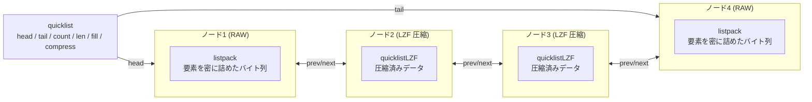

# 第9章 quicklist

> **本章で読むソース**
>
> - [`src/quicklist.h`](https://github.com/valkey-io/valkey/blob/9.1.0/src/quicklist.h)
> - [`src/quicklist.c`](https://github.com/valkey-io/valkey/blob/9.1.0/src/quicklist.c)
> - [`src/lzf_c.c`](https://github.com/valkey-io/valkey/blob/9.1.0/src/lzf_c.c) / [`src/lzf_d.c`](https://github.com/valkey-io/valkey/blob/9.1.0/src/lzf_d.c)（LZF 圧縮、深入りしない）

## この章の狙い

`quicklist` は、第8章で見た listpack をノードとして連ねた双方向連結リストである。
listpack 単体では要素数が増えるほど挿入や削除のコストが線形に膨らむという弱点があり、`quicklist` はそれを複数のノードに分割することで抑える。
本章では、ノードに収める listpack の大きさを `fill` で制御する仕組みと、両端から離れた中間ノードを LZF で圧縮してメモリを節約する仕組みという、二つの最適化を実コードで追う。

## 前提

- [第8章 listpack](08-listpack.md)：各ノードが保持するデータ表現。要素を密に詰めた1本のバイト列で、`quicklist` のノードはこれを抱える。

## ノードとリスト本体のレイアウト

`quicklist` の本体は、ノードの双方向連結リストを束ねる小さな構造体である。
`head` と `tail` で両端のノードを指し、`count` に全ノードを通した総要素数を、`len` にノード数を持つ。

[`src/quicklist.h` L107-L116](https://github.com/valkey-io/valkey/blob/9.1.0/src/quicklist.h#L107-L116)

```c
typedef struct quicklist {
    quicklistNode *head;
    quicklistNode *tail;
    unsigned long count;                  /* total count of all entries in all listpacks */
    unsigned long len;                    /* number of quicklistNodes */
    signed int fill : QL_FILL_BITS;       /* fill factor for individual nodes */
    unsigned int compress : QL_COMP_BITS; /* depth of end nodes not to compress;0=off */
    unsigned int bookmark_count : QL_BM_BITS;
    quicklistBookmark bookmarks[];
} quicklist;
```

二つの最適化は、この構造体の二つのフィールドに対応する。
`fill` はノード1個に詰める listpack の上限を決める指標で、後述するノード分割の挙動を左右する。
`compress` は両端から圧縮せずに残すノードの深さで、`0` なら圧縮を行わない。

個々のノードは、listpack へのポインタと、それを管理するためのメタ情報を束ねた32バイトの構造体である。
ビットフィールドを多用して32バイトに収めている点に、ノードを大量に並べても本体側のオーバーヘッドを小さく保つ意図が表れている。

[`src/quicklist.h` L47-L59](https://github.com/valkey-io/valkey/blob/9.1.0/src/quicklist.h#L47-L59)

```c
typedef struct quicklistNode {
    struct quicklistNode *prev;
    struct quicklistNode *next;
    unsigned char *entry;
    size_t sz;                           /* entry size in bytes */
    unsigned int count : 16;             /* count of items in listpack */
    unsigned int encoding : 2;           /* RAW==1 or LZF==2 */
    unsigned int container : 2;          /* PLAIN==1 or PACKED==2 */
    unsigned int recompress : 1;         /* was this node previous compressed? */
    unsigned int attempted_compress : 1; /* node can't compress; too small */
    unsigned int dont_compress : 1;      /* prevent compression of entry that will be used later */
    unsigned int extra : 9;              /* more bits to steal for future usage */
} quicklistNode;
```

`entry` はノードが抱える listpack の先頭を指す。
`count` はそのノード内の要素数、`sz` は listpack のバイト数である。
`encoding` は内容が生の listpack（`RAW`）か LZF 圧縮済み（`LZF`）かを表し、中間ノードの圧縮で切り替わる。
`container` はノードの格納形式で、通常は複数要素を1本の listpack に詰める `PACKED` だが、巨大な単一要素を抱えるときだけ `PLAIN` になる。
`recompress` は一時的に解凍したノードに付く印で、用が済んだら再び圧縮すべきことを記録する。

全体像を図で示す。
両端のノードは解凍したまま置き、両端から `compress` 段だけ離れた中間ノードを LZF で圧縮する構図である。



`quicklistCreate` は、この本体を確保して空の状態に初期化する。
`fill` の既定値は `-2` であり、後述するとおり「ノードあたり8KB」という大きさ基準を意味する。
`compress` の既定値は `0` で、初期状態では圧縮を行わない。

[`src/quicklist.c` L121-L134](https://github.com/valkey-io/valkey/blob/9.1.0/src/quicklist.c#L121-L134)

```c
quicklist *quicklistCreate(void) {
    struct quicklist *quicklist;

    quicklist = zmalloc(sizeof(*quicklist));
    quicklist->head = quicklist->tail = NULL;
    quicklist->len = 0;
    quicklist->count = 0;
    quicklist->compress = 0;
    quicklist->fill = -2;
    quicklist->bookmark_count = 0;
    return quicklist;
}
```

## ノード分割：listpack を一定の大きさに保つ

第8章で見たとおり、listpack は要素を1本のバイト列に密に詰めるため、要素数が増えるほど挿入や削除で動かすバイト数が増える。
`quicklist` は、1本の listpack を無制限に伸ばすのではなく、一定の大きさを超えたら新しいノードに分けることで、各 listpack を扱いやすい大きさに保つ。
この上限を決めるのが `fill` である。

`fill` は正負で意味が変わる。
`quicklistNodeLimit` は、`fill` が0以上なら要素数の上限（`count`）として、負なら大きさの上限（`size`）として解釈する。

[`src/quicklist.c` L444-L456](https://github.com/valkey-io/valkey/blob/9.1.0/src/quicklist.c#L444-L456)

```c
void quicklistNodeLimit(int fill, size_t *size, unsigned int *count) {
    *size = SIZE_MAX;
    *count = UINT_MAX;

    if (fill >= 0) {
        /* Ensure that one node have at least one entry */
        *count = (fill == 0) ? 1 : fill;
    } else {
        *size = quicklistNodeNegFillLimit(fill);
    }
}
```

負の `fill` は、あらかじめ用意した5段階のバイト数表に対応づけられる。
`fill = -1` なら4KB、`-2` なら8KB といった具合で、既定の `-2` は8KB を指す。

[`src/quicklist.c` L42-L45](https://github.com/valkey-io/valkey/blob/9.1.0/src/quicklist.c#L42-L45)

```c
/* Optimization levels for size-based filling.
 * Note that the largest possible limit is 64k, so even if each record takes
 * just one byte, it still won't overflow the 16 bit count field. */
static const size_t optimization_level[] = {4096, 8192, 16384, 32768, 65536};
```

[`src/quicklist.c` L435-L442](https://github.com/valkey-io/valkey/blob/9.1.0/src/quicklist.c#L435-L442)

```c
/* Calculate the size limit of the quicklist node based on negative 'fill'. */
static size_t quicklistNodeNegFillLimit(int fill) {
    assert(fill < 0);
    size_t offset = (-fill) - 1;
    size_t max_level = sizeof(optimization_level) / sizeof(*optimization_level);
    if (offset >= max_level) offset = max_level - 1;
    return optimization_level[offset];
}
```

実際に上限を超えたかどうかは `quicklistNodeExceedsLimit` が判定する。
大きさ基準（`fill` が負）のときは、追加後のバイト数 `new_sz` が上限を超えるかだけを見る。
要素数基準（`fill` が0以上）のときは、まずバイト数が安全上限（`SIZE_SAFETY_LIMIT`、8KB）に収まることを確認し、そのうえで要素数が上限を超えるかを見る。
要素数で制御する場合でも、巨大な要素を詰め込んで listpack が際限なく膨らむのを防ぐためである。

[`src/quicklist.c` L462-L477](https://github.com/valkey-io/valkey/blob/9.1.0/src/quicklist.c#L462-L477)

```c
int quicklistNodeExceedsLimit(int fill, size_t new_sz, unsigned int new_count) {
    size_t sz_limit;
    unsigned int count_limit;
    quicklistNodeLimit(fill, &sz_limit, &count_limit);

    if (likely(sz_limit != SIZE_MAX)) {
        return new_sz > sz_limit;
    } else if (count_limit != UINT_MAX) {
        /* when we reach here we know that the limit is a size limit (which is
         * safe, see comments next to optimization_level and SIZE_SAFETY_LIMIT) */
        if (!sizeMeetsSafetyLimit(new_sz)) return 1;
        return new_count > count_limit;
    }

    valkey_unreachable();
}
```

要素を既存のノードに追加してよいかは `_quicklistNodeAllowInsert` が判断する。
追加後のバイト数を `node->sz + sz + SIZE_ESTIMATE_OVERHEAD` と少し多めに見積もり、`quicklistNodeExceedsLimit` に渡す。
上限を超えるなら `0` を返し、呼び出し側は新しいノードを作る。

[`src/quicklist.c` L490-L503](https://github.com/valkey-io/valkey/blob/9.1.0/src/quicklist.c#L490-L503)

```c
static int _quicklistNodeAllowInsert(const quicklistNode *node, const int fill, const size_t sz) {
    if (unlikely(!node)) return 0;

    if (unlikely(QL_NODE_IS_PLAIN(node) || isLargeElement(sz, fill))) return 0;

    /* Estimate how many bytes will be added to the listpack by this one entry.
     * We prefer an overestimation, which would at worse lead to a few bytes
     * below the lowest limit of 4k (see optimization_level).
     * Note: No need to check for overflow below since both `node->sz` and
     * `sz` are to be less than 1GB after the plain/large element check above. */
    size_t new_sz = node->sz + sz + SIZE_ESTIMATE_OVERHEAD;
    if (unlikely(quicklistNodeExceedsLimit(fill, new_sz, node->count + 1))) return 0;
    return 1;
}
```

この判定は、両端への追加でそのまま使われる。
`quicklistPushHead` は、先頭ノードに余地があれば `lpPrepend` で既存の listpack に追加し、余地がなければ新しいノードを作って先頭につなぐ。

[`src/quicklist.c` L547-L568](https://github.com/valkey-io/valkey/blob/9.1.0/src/quicklist.c#L547-L568)

```c
int quicklistPushHead(quicklist *quicklist, void *value, size_t sz) {
    quicklistNode *orig_head = quicklist->head;

    if (unlikely(isLargeElement(sz, quicklist->fill))) {
        __quicklistInsertPlainNode(quicklist, quicklist->head, value, sz, 0);
        return 1;
    }

    if (likely(_quicklistNodeAllowInsert(quicklist->head, quicklist->fill, sz))) {
        quicklist->head->entry = lpPrepend(quicklist->head->entry, value, sz);
        quicklistNodeUpdateSz(quicklist->head);
    } else {
        quicklistNode *node = quicklistCreateNode();
        node->entry = lpPrepend(lpNew(0), value, sz);

        quicklistNodeUpdateSz(node);
        _quicklistInsertNodeBefore(quicklist, quicklist->head, node);
    }
    quicklist->count++;
    quicklist->head->count++;
    return (orig_head != quicklist->head);
}
```

`quicklistPushTail` も向きが逆になるだけで構造は同じである。
末尾ノードに余地があれば `lpAppend` で追加し、なければ新しいノードを末尾につなぐ。

ノードを分割する効果は、更新コストとメモリ局所性の両立にある。
1ノードの listpack を `fill` で抑えるので、その内部の挿入や削除で動かすバイト数は上限以内に収まる。
それでいて要素は連続したバイト列に密に詰まったままなので、走査時のメモリアクセスは局所的で、ポインタを1要素ごとにたどる素朴な連結リストよりキャッシュに乗りやすい。

## 巨大な単一要素は plain ノードに分ける

`fill` の上限そのものを1要素で超えてしまう巨大な値は、listpack に詰めても分割の意味がない。
`isLargeElement` はこうした値を見分ける。
`fill` が負なら、その大きさ上限を1要素で超えるかどうかで判定する。

[`src/quicklist.c` L479-L488](https://github.com/valkey-io/valkey/blob/9.1.0/src/quicklist.c#L479-L488)

```c
static int isLargeElement(size_t sz, int fill) {
    if (unlikely(packed_threshold != 0)) return sz >= packed_threshold;
    if (fill >= 0)
        return !sizeMeetsSafetyLimit(sz);
    else
        return sz > quicklistNodeNegFillLimit(fill);
}
```

巨大と判定された値は、listpack を介さず生のバイト列としてそのまま抱える専用ノード（`PLAIN`）に格納する。
`__quicklistCreateNode` は、`container` が `PLAIN` のときは listpack を作らず、`zmalloc` した領域に値を `memcpy` するだけである。

[`src/quicklist.c` L522-L534](https://github.com/valkey-io/valkey/blob/9.1.0/src/quicklist.c#L522-L534)

```c
static quicklistNode *__quicklistCreateNode(int container, void *value, size_t sz) {
    quicklistNode *new_node = quicklistCreateNode();
    new_node->container = container;
    if (container == QUICKLIST_NODE_CONTAINER_PLAIN) {
        new_node->entry = zmalloc(sz);
        memcpy(new_node->entry, value, sz);
    } else {
        new_node->entry = lpPrepend(lpNew(0), value, sz);
    }
    new_node->sz = sz;
    new_node->count++;
    return new_node;
}
```

先の `quicklistPushHead` が、`isLargeElement` で真になった値を `__quicklistInsertPlainNode` に回していたのはこのためである。
巨大な値を他の小さな要素と同じ listpack に同居させると、その listpack を触るたびに巨大なバイト列ごと動かす羽目になる。
専用ノードに隔離することで、その値の周辺だけを独立して扱える。

## 中間ノードの圧縮：両端から離れたデータを LZF で畳む

リストは両端への push と pop が多く、中間の要素はアクセス頻度が低いという偏りを持つことが多い。
`quicklist` はこの偏りを利用し、両端から `compress` 段だけ離れた中間ノードの listpack を LZF で圧縮して、使われていないデータのメモリを節約する。
圧縮の深さは設定 `list-compress-depth` で与えられ、`0` なら圧縮しない。

圧縮するノードは、`encoding` を `LZF` に切り替え、`entry` が指す先を生の listpack から `quicklistLZF` 構造体に差し替える。
`quicklistLZF` は圧縮後のバイト数 `sz` と圧縮データ本体を持つ。
元の listpack のバイト数はノード側の `sz` に残るので、解凍時に必要な展開後サイズが分かる。

[`src/quicklist.h` L66-L69](https://github.com/valkey-io/valkey/blob/9.1.0/src/quicklist.h#L66-L69)

```c
typedef struct quicklistLZF {
    size_t sz; /* LZF size in bytes*/
    char compressed[];
} quicklistLZF;
```

圧縮本体の `__quicklistCompressNode` は、まず圧縮しない方がよい場合を弾く。
小さすぎる listpack（`MIN_COMPRESS_BYTES` 未満）は圧縮の手間に見合わないので素通しする。
また、圧縮を試みても十分に縮まらなかった場合（縮小量が `MIN_COMPRESS_IMPROVE` に満たない、あるいは圧縮後の方が大きい場合）は、圧縮結果を捨てて生のまま残す。

[`src/quicklist.c` L209-L238](https://github.com/valkey-io/valkey/blob/9.1.0/src/quicklist.c#L209-L238)

```c
static int __quicklistCompressNode(quicklistNode *node) {
    node->attempted_compress = 1;
    if (node->dont_compress) return 0;

    /* validate that the node is neither
     * tail nor head (it has prev and next)*/
    assert(node->prev && node->next);

    node->recompress = 0;
    /* Don't bother compressing small values */
    if (node->sz < MIN_COMPRESS_BYTES) return 0;

    quicklistLZF *lzf = zmalloc(sizeof(*lzf) + node->sz);

    /* Cancel if compression fails or doesn't compress small enough */
    if (((lzf->sz = lzf_compress(node->entry, node->sz, lzf->compressed, node->sz)) == 0) ||
        lzf->sz + MIN_COMPRESS_IMPROVE >= node->sz) {
        /* lzf_compress aborts/rejects compression if value not compressible. */
        zfree(lzf);
        return 0;
    }
    lzf = zrealloc(lzf, sizeof(*lzf) + lzf->sz);
    zfree(node->entry);
    node->entry = (unsigned char *)lzf;
    node->encoding = QUICKLIST_NODE_ENCODING_LZF;
    return 1;
}
```

ここで呼ばれる `lzf_compress` の実体は [`src/lzf_c.c`](https://github.com/valkey-io/valkey/blob/9.1.0/src/lzf_c.c) にある LZF 圧縮ルーチンで、解凍側 `lzf_decompress` は [`src/lzf_d.c`](https://github.com/valkey-io/valkey/blob/9.1.0/src/lzf_d.c) にある。
LZF は反復するバイト列を後方参照に置き換える軽量な可逆圧縮で、圧縮率より速度を優先する。
本章ではアルゴリズムの内部までは立ち入らない。

どのノードを圧縮するかは `__quicklistCompress` が決める。
両端から1段ずつ内側へ `forward` と `reverse` を進め、`compress` 段に達するまでのノードは解凍したまま残す（`quicklistDecompressNode`）。
`compress` 段を越えたノードを圧縮する。
リスト全体が `compress * 2` 段に満たないときは、圧縮すべき中間ノードが存在しないので即座に戻る。

[`src/quicklist.c` L338-L364](https://github.com/valkey-io/valkey/blob/9.1.0/src/quicklist.c#L338-L364)

```c
    /* Iterate until we reach compress depth for both sides of the list.a
     * Note: because we do length checks at the *top* of this function,
     *       we can skip explicit null checks below. Everything exists. */
    quicklistNode *forward = quicklist->head;
    quicklistNode *reverse = quicklist->tail;
    int depth = 0;
    int in_depth = 0;
    while (depth++ < quicklist->compress) {
        quicklistDecompressNode(forward);
        quicklistDecompressNode(reverse);

        if (forward == node || reverse == node) in_depth = 1;

        /* We passed into compress depth of opposite side of the quicklist
         * so there's no need to compress anything and we can exit. */
        if (forward == reverse || forward->next == reverse) return;

        forward = forward->next;
        reverse = reverse->prev;
    }

    if (!in_depth) quicklistCompressNode(node);

    /* At this point, forward and reverse are one node beyond depth */
    quicklistCompressNode(forward);
    quicklistCompressNode(reverse);
```

圧縮を中間ノードに限り、両端を常に生のまま残すのは、両端への push と pop を圧縮や解凍なしで処理するためである。
アクセス頻度の高い両端は速度を、頻度の低い中間はメモリ効率を優先するという棲み分けになっている。

## アクセス時に必要なノードだけ解凍する

中間ノードが圧縮されていても、走査でその要素に触れるときは一時的に解凍する必要がある。
イテレータの `quicklistNext` は、対象ノードに入る際に `quicklistDecompressNodeForUse` で解凍する。
このマクロは解凍と同時に `recompress` を立て、「あとで圧縮し直すべき一時解凍」であることを記録する。

[`src/quicklist.c` L275-L282](https://github.com/valkey-io/valkey/blob/9.1.0/src/quicklist.c#L275-L282)

```c
/* Force node to not be immediately re-compressible */
#define quicklistDecompressNodeForUse(_node)                               \
    do {                                                                   \
        if ((_node) && (_node)->encoding == QUICKLIST_NODE_ENCODING_LZF) { \
            __quicklistDecompressNode((_node));                            \
            (_node)->recompress = 1;                                       \
        }                                                                  \
    } while (0)
```

`quicklistNext` の流れを追う。
ノードに初めて入るとき（`iter->zi` が未設定）は、そのノードを解凍してから listpack 内の位置を求める。
そのノードの要素を使い切って次のノードへ移る直前に、`quicklistCompress` で今いたノードを圧縮し直す。

[`src/quicklist.c` L1310-L1364](https://github.com/valkey-io/valkey/blob/9.1.0/src/quicklist.c#L1310-L1364)

```c
    int plain = QL_NODE_IS_PLAIN(iter->current);
    if (!iter->zi) {
        /* If !zi, use current index. */
        quicklistDecompressNodeForUse(iter->current);
        if (unlikely(plain))
            iter->zi = iter->current->entry;
        else
            iter->zi = lpSeek(iter->current->entry, iter->offset);
    } else if (unlikely(plain)) {
        iter->zi = NULL;
    } else {
        /* else, use existing iterator offset and get prev/next as necessary. */
        // ... (中略) ...
    }

    // ... (中略：entry に値を詰める) ...

    } else {
        /* We ran out of listpack entries.
         * Pick next node, update offset, then re-run retrieval. */
        quicklistCompress(iter->quicklist, iter->current);
        if (iter->direction == AL_START_HEAD) {
            /* Forward traversal */
            D("Jumping to start of next node");
            iter->current = iter->current->next;
            iter->offset = 0;
        } else if (iter->direction == AL_START_TAIL) {
            /* Reverse traversal */
            D("Jumping to end of previous node");
            iter->current = iter->current->prev;
            iter->offset = -1;
        }
        iter->zi = NULL;
        return quicklistNext(iter, entry);
    }
```

`recompress` が立っているノードを圧縮し直すときは、`compress` の深さ判定を省いて直接圧縮する。
深さの範囲内かどうかは解凍時に確定しているので、再圧縮では再判定しないという最適化である。

[`src/quicklist.c` L375-L381](https://github.com/valkey-io/valkey/blob/9.1.0/src/quicklist.c#L375-L381)

```c
#define quicklistCompress(_ql, _node)            \
    do {                                         \
        if ((_node)->recompress)                 \
            quicklistCompressNode((_node));      \
        else                                     \
            __quicklistCompress((_ql), (_node)); \
    } while (0)
```

両端の pop も圧縮を意識しない。
`quicklistPopCustom` は、先頭か末尾のノードを取り出す前に、そのノードが圧縮されていないことをアサートで確認する。
両端は常に生のまま保たれているという不変条件があるので、pop の経路に解凍処理を挟む必要がない。

[`src/quicklist.c` L1517-L1525](https://github.com/valkey-io/valkey/blob/9.1.0/src/quicklist.c#L1517-L1525)

```c
    /* The head and tail should never be compressed */
    assert(node->encoding != QUICKLIST_NODE_ENCODING_LZF);

    if (unlikely(QL_NODE_IS_PLAIN(node))) {
        if (data) *data = saver(node->entry, node->sz);
        if (sz) *sz = node->sz;
        quicklistDelIndex(quicklist, node, NULL);
        return 1;
    }
```

リスト型のコマンドが `quicklist` をどう使うか、エンコーディングをいつ listpack から `quicklist` に切り替えるかは、[第16章 リスト型](../part03-objects-types/16-t-list.md)で扱う。

## まとめ

- `quicklist` は、listpack をノードに持つ双方向連結リストである。listpack 単体の弱点である挿入や削除コストの増大を、複数ノードへの分割で抑える。
- ノード分割は `fill`（設定 `list-max-listpack-size`、既定 `-2` で8KB）で制御する。1ノードの listpack をこの上限に抑え、超えたら新しいノードに分ける。更新コストとメモリ局所性を両立させる仕組みである。
- `fill` の上限を1要素で超える巨大な値は、listpack を介さず生のバイト列を抱える `PLAIN` ノードに隔離する。
- 中間ノードの圧縮は `compress`（設定 `list-compress-depth`、既定 `0` で無効）で制御する。両端から `compress` 段を越えた中間ノードを LZF で圧縮し、アクセス頻度の低いデータのメモリを節約する。
- 両端は常に生のまま残し、push と pop を圧縮や解凍なしで処理する。走査で中間ノードに触れるときだけ一時解凍し、`recompress` の印をもとに離れる際に圧縮し直す。

## 関連する章

- [第8章 listpack](08-listpack.md)：各ノードが抱えるデータ表現。
- [第16章 リスト型](../part03-objects-types/16-t-list.md)：`quicklist` を主エンコーディングとして使うリスト型コマンドの実装。
